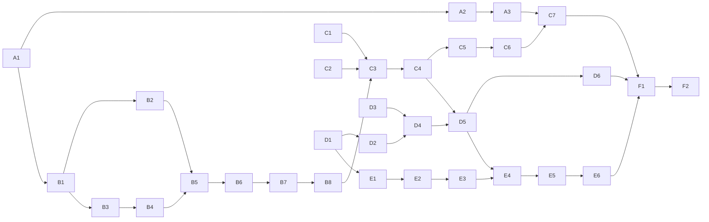

Version: 1.0.0

Date: 2026-10-09

Status: Implemented 2026-10-09/10 (deviations in §15; results in `docs-design/reviews/ai-traders-v3/`)

# EduMatcher — AI Traders v3: Implementation Plan

> **Supersedes** `EduMatcher-AI-trading-bot.md` (v1, 2026-06-28) and
> `EduMatcher-AI-trading-bot-v2.md` (v2, 2026-06-29). v2 was never implemented;
> this plan reuses its order-lifecycle manager (§7), signal definitions (§5),
> session-phase policy (§9) and engine-contract checklist (§23.2), and drops its
> one-process-per-bot model. It also implements the ALF routing proposed in
> `EduMatcher-AI-Trader-ALF-Gwy.md` (Phases 1–2 there; market data stays on the
> engine bus).

## Table of Contents

1. [Starting point](#1-starting-point)
2. [Goals and design limits](#2-goals-and-design-limits)
3. [Decisions](#3-decisions)
4. [Target architecture](#4-target-architecture)
5. [Conventions for every work package](#5-conventions-for-every-work-package)
6. [Phase A — Example configurations and bot identities](#6-phase-a--example-configurations-and-bot-identities)
7. [Phase B — Agent core, trader types and order types](#7-phase-b--agent-core-trader-types-and-order-types)
8. [Phase C — Long-running operation and scale](#8-phase-c--long-running-operation-and-scale)
9. [Phase D — Market model (true value)](#9-phase-d--market-model-true-value)
10. [Phase E — News and rumours](#10-phase-e--news-and-rumours)
11. [Phase F — Documentation and close-out](#11-phase-f--documentation-and-close-out)
12. [Dependencies and ordering](#12-dependencies-and-ordering)
13. [Risks](#13-risks)
14. [Open points for review](#14-open-points-for-review)
15. [Change log — implementation deviations](#15-change-log--implementation-deviations)

---

## 1. Starting point

As of 2026-10-09 (after the same-day fixes, see project doc
`claude/ai_trader_review_2026_10_09.md`):

- `pm-ai-trader`: one process per bot, talks straight to the engine bus
  (`gateway_connect`, `order.new`), LIMIT DAY orders only, never cancels,
  random 50/50 side, prices anchored on best bid/ask. Now requests book
  snapshots, follows `session.state`, sends heartbeats and
  `gateway_disconnect`.
- `pm-ai-swarm`: spawns one `pm-ai-trader` subprocess per bot, spreads symbols
  over bots, checks bot IDs are configured participants.
- Four hard-coded personality profiles (`aggressive`, `cautious`,
  `many-small`, `few-large`) that only set tempo, size and crossing
  probability.
- No market model, no news, no example config with AI participants.

Relevant existing capabilities (verified 2026-10-09):

| Capability | Where |
|---|---|
| All order types (LIMIT, MARKET, STOP, STOP_LIMIT, FOK, ICEBERG, IOC, TRAILING_STOP), TIF DAY/GTC/ATO/ATC, OCO, combos | engine; ALF `NEW` (`TYPE=`, `VISIBLE=`, `STOP=`, `TRAIL=`, `TIF=`), `NEW_OCO`, combos |
| Session machine CLOSED → PRE_OPEN → OPENING_AUCTION → CONTINUOUS → CLOSING_AUCTION → CLOSED; DAY expiry at CLOSED; ATO/ATC expiry at auction end | engine, `pm-scheduler --daily` / `--now --delay` |
| `auction.indicative.<SYM>` during call phases (1 s throttle) | engine |
| `depth.<SYM>` (microprice, imbalance), `book.<SYM>`, `trade.executed` (aggressor side) | engine PUB |
| `system.position_request` → `position_snapshot` (not persisted across engine restart) | engine; ALF `POS` |
| `system.halt_status_request`, `circuit_breaker.halt/resume.<SYM>` | engine |
| `prev_close` in `system.symbols` | engine |
| Engine throughput ≈ 18 500 orders/s end-to-end single-threaded | `EduMatcher-Perf-Analysis.md` |
| `pm-alf-gwy`: `max_connections` 64, `select()` poll loop with 10 ms sleep, 100 commands/s/session | `alf_gwy/gateway.py`, `config.py` |

## 2. Goals and design limits

| Item | Limit / target |
|---|---|
| AI participants | **500** (IDs `AI001`–`AI500`) |
| Symbols | **300** |
| Aggregate AI order rate at the design limit | **≈ 1 000 orders/s** (new + cancel + amend), configurable |
| Unattended run | 30 trading days, wall clock, engine running continuously; tolerate restarts of any process |
| Compressed run | a trading day in minutes, same code paths |
| Reproducibility | model paths and news seed-reproducible; agent decisions reproducible by event-log replay |

Goals, in the order agreed:

1. Example configs ready for swarms (A).
2. Trader types and all order types (B).
3. Long-running operation at the design limit (C).
4. Market model with a hidden true value (D).
5. News and rumours (E).

## 3. Decisions

Settled in the 2026-10-09 interview unless marked otherwise.

| # | Decision |
|---|---|
| D1 | This plan supersedes v1/v2; v1, v2 get a "Superseded by" banner. |
| D2 | **Process model:** `pm-ai-swarm` is a supervisor of *K* worker processes; each worker hosts many agents in one event loop. `pm-ai-trader` is a worker with one agent. Default *K* = `min(cpu_count − 1, ceil(agents / 100))`, at least 1. |
| D3 | **Order entry through `pm-alf-gwy`**: one ALF TCP session per agent (LOGON as its own participant ID). No direct `order.new` from bots any more. |
| D4 | **Market data from the engine PUB feed**: one SUB socket per worker, shared by its agents. CALF is out of scope. |
| D5 | **Harden one ALF gateway** to ≥ 600 sessions at ≈ 1 000 orders/s (selectors/epoll, readiness-driven loop, limits from config). Multi-instance ALF is out of scope. |
| D6 | Aggregate rate target ≈ 1 000 orders/s at 500 agents / 300 symbols. |
| D7 | Bot IDs are `AI` + 3 digits (`AI001`–`AI500`). `AI01` naming is dropped (no compatibility). |
| D8 | Examples: the six `s150-*` variants get `AI001`–`AI020`; a new `s300-load` example has 300 symbols and `AI001`–`AI500`. |
| D9 | **True value lives in a new process `pm-market-sim`** that publishes on its own PUB socket (new msgen spec family `sim`). |
| D10 | True value is visible to bots and the instructor (ADMIN) only; students see prices and news. |
| D11 | News: random generator **and** instructor injection (CLI + scenario YAML). |
| D12 | News headlines are shown to students: `pm-ticker`, trader-gui, terminal-gui; rumours flagged. |
| D13 | Model parameters (sector, volatility, drift, betas, jump rates) live in `<DATA_DIR>/ref_data/market_sim.yaml`; the engine config is untouched. |
| D14 | Time: wall clock by default; a compressed mode where `pm-scheduler` and `pm-market-sim` share a speed factor. |
| D15 | Strategies in the first release: noise, value, trend, reversion, institutional, news-reactive. |
| D16 | Determinism: model + news seed-reproducible; agents reproducible by replaying a recorded event log through a logical clock. |
| D17 | `pm-mm-bot` gains only an optional "anchor mid to the sim value" mode; its connection path is unchanged. |
| D18 | Engine runs continuously; every client survives an engine restart (reconnect, resync positions from the engine, which starts flat). |
| D19 | **Agent composition (accepted).** An agent is the composition of four orthogonal parts, each chosen by name: **strategy** (*what it believes*: `noise`, `value`, `trend`, `reversion`, `news`), **execution** (*how it works an order*: `passive`, `marketable`, `sweep` (MARKET/IOC), `iceberg`, `twap`), **tempo/size** (*how often and how big*: today's `many-small`, `few-large`, … become values here) and **risk** (position, notional, stop policy). Named **presets** are small YAML files bundling the four (`ai_trader/presets/*.yaml`, plus user files); the swarm config gives the mix as weights over presets. No persona classes in code; today's `--profile` and its four names are removed. Rationale: every new behaviour is one new strategy *or* one new execution style, not a new class per combination; presets stay data, so instructors can add personalities without code; it is v2's §11.5 five-dimension idea without v2's adaptation dimension (dropped, D20). "Institutional" = preset `value` + `twap`/`iceberg` + `few-large`. |
| D20 | No online adaptation engine (v2 §10 dropped): presets are static, behaviour stays explainable and reproducible. |
| D21 | `s300-load` tickers = the 150 s150 tickers + 150 further real-looking tickers, so s150 sector assignments carry over. |
| D22 | Market model uses stdlib `random` (one seeded stream per factor/symbol); no `numpy` dependency. |
| D23 | Hardened `pm-alf-gwy` defaults: `max_connections: 1024`, `max_commands_per_second: 100` per session (unchanged). |
| D24 | Instructor GUI for true value / news injection is a later, separate plan; this plan delivers CLI + ADMIN API. |
| D25 | Agents LOGON to ALF with their participant ID only, like human ALF clients; follows the A&A design when that lands. |

## 4. Target architecture

```mermaid
flowchart LR
    subgraph sim [pm-market-sim]
        MODEL[Factor GBM + jumps\ntrue value per symbol]
        NEWS[News generator\n+ injection queue]
    end
    SCHED[pm-scheduler\n--daily / speed factor]
    ENG[pm-engine]
    ALF[pm-alf-gwy\nepoll, ≥600 sessions]
    subgraph swarm [pm-ai-swarm supervisor]
        W1[worker 1\nagents AI001..AI100]
        W2[worker 2\nagents AI101..AI200]
        WK[worker K]
    end
    CLI[pm-news CLI\ninstructor]
    APIGW[pm-api-gwy]
    GUI[trader-gui / terminal-gui / pm-ticker]

    SCHED -->|session.transition| ENG
    ENG -->|book, depth, trade, session,\nauction.indicative, CB| W1 & W2 & WK
    ENG -->|session.state| sim
    sim -->|sim.value  (ADMIN)| W1 & W2 & WK
    sim -->|news.event (public)| W1 & W2 & WK
    W1 & W2 & WK -->|ALF TCP: NEW/CANCEL/AMEND/POS\none session per agent| ALF
    ALF --> ENG
    CLI -->|inject / confirm / retract| sim
    sim --> APIGW --> GUI
```

New/changed bus surface:

| Topic | Producer | Consumers | Visibility |
|---|---|---|---|
| `sim.value` (batch: `[{symbol, value}]`, sim time) | `pm-market-sim` | agents, ADMIN API channel, recorder | ADMIN |
| `sim.state` (speed, sim time, seed, model version) | `pm-market-sim` | agents, ops | ADMIN |
| `news.event` (`id, ts, scope, targets, headline, kind, status, sentiment`) | `pm-market-sim` | agents, API gateway, `pm-ticker`, GUIs | public |
| `sim.command` (PULL: inject/confirm/retract/pause) | `pm-news` CLI | `pm-market-sim` | ADMIN (loopback + ADMIN participant ID) |

Ports: two new entries (`SIM_PUB`, `SIM_PULL`) in `edumatcher.config` /
`gateway_ports.py`, overridable by environment like the index ports.

Agent internals (one per participant ID, many per worker):

```
MarketState (shared per worker, read-only to agents)
   ↑ engine PUB + sim PUB
Agent
   strategy  → intent {symbol, side, urgency, size, horizon}
   execution → orders (type, TIF, price, slices) gated by SessionPolicy
   OLM       → pending/live orders, cancel by age/drift, position from fills
   risk      → position/notional caps incl. open orders, reject breaker, stops
   transport → AlfSession (one TCP session)
Worker loop: zmq.Poller over SUB sockets + ALF socket fds; logical clock injectable
```

## 5. Conventions for every work package

**Done gate (every WP):** `black --check`, `flake8`, `mypy src tests`,
`pyright src tests` clean on the touched tree; the WP's tests plus the
existing tests of touched modules pass; docs touched by the change updated in
the same WP (`scripts/checkdocs.py` clean); `pm-help` and shell completion
regenerated when a CLI changes; no commit — a commit message is proposed.
No backward compatibility: replaced flags, names and formats are removed and
old input is rejected with a clear error.

**Test layers:**

| Layer | Marker | Runs in default suite | Purpose |
|---|---|---|---|
| Unit | — | yes | pure logic, fake clock, fake transport; no sockets |
| Contract | — (uses fixtures that start real processes on free ports) | yes, if < 10 s | behaviour against a real `pm-engine` / `pm-alf-gwy` |
| Statistical | `probabilistic` | no | model/strategy distributions with fixed seeds and confidence bounds |
| Load / soak | `heavy` or `perf` | no | design-limit runs; produce a results file |

Every live acceptance run records its command lines, config seed and a
results summary under `docs-design/reviews/ai-traders-v3/<wp>.md`.

---

## 6. Phase A — Example configurations and bot identities

### WP-A1 Three-digit bot IDs

- **Scope:** `swarm.build_gateway_ids` → `f"{prefix}{i:03d}"`; `--count`
  limited to 1…999; docs/tests/pm-help using `AI01`-style IDs.
- **Done when:** `pm-ai-swarm --count 500` produces `AI001`…`AI500`; no `AI0[1-9]\b`
  left in docs/tests except history.
- **Tests:** `test_build_gateway_ids` (1, 20, 500, sort order equals numeric
  order); count bounds rejected.

### WP-A2 AI participants in the s150 examples

- **Scope:** `docs/examples/ref_data/mks150.sh` adds `AI001`–`AI020`
  (`TRADER`, `CANCEL_ALL`, description "AI trader n") and sets
  `alf_gateway.max_connections` ≥ 64 + 20; regenerate all six `s150-*` dirs
  with each file's recorded `--seed`; README tables (example list,
  participant counts); config-gui `.fixtures` if they derive from these.
- **Done when:** each `s150-*` passes `pm-config-deploy --check` and
  `pm-cverifier`; data lines other than the new participants are identical to
  before (diff check); `pm-ai-swarm --count 20` launches against every variant
  without the missing-participant error.
- **Tests:** `test_config_deploy::TestExamples` covers participant presence;
  live smoke (recorded): s150-basic + `pm-ai-swarm --count 20 --duration 60`
  → ≥ 140 symbols traded, 0 auth failures.

### WP-A3 New `s300-load` example (design limit)

- **Scope:** `mks300.sh` + `s300-load-setup/` (and `-nomm` variant only if
  asked): 300 symbols (D21: s150 list + 150 more),
  `AI001`–`AI500`, `OPS01`, `MM01`/`MM02`, seeded MM quotes, sessions enabled,
  no collars (alf_gateway defaults per D23 suffice); example name added to
  `resolve_example`, `deployment/curl/edumatcher.sh` allowlist, README table.
- **Done when:** `pm-config-deploy --example s300-load` succeeds; cverifier OK;
  engine starts with it in < 5 s and memory recorded; config-gui opens it.
- **Tests:** `TestExamples` entry; a contract test that loads the compiled
  artifact and asserts 300 symbols / 500 `AI` participants; startup time
  recorded in the review file.

---

## 7. Phase B — Agent core, trader types and order types

Phase B builds the new agent core behind a **transport interface** so it can be
developed and tested before ALF routing lands in Phase C. Until C3 the agent
uses an `EngineBusTransport` that wraps today's direct path; C3 replaces it and
deletes it. `value` and `news` strategies need Phase D/E inputs and are
delivered there; their interfaces are fixed here.

### WP-B1 Package layout and agent core

- **Scope:** split `ai_trader/` into `market_state.py`, `agent.py`,
  `orders.py` (OLM), `risk.py`, `session_policy.py`, `strategies/`,
  `execution/`, `presets/` (YAML), `preset.py` (loader/validator),
  `transport.py` (protocol + `EngineBusTransport`), `clock.py` (wall /
  logical), `worker.py` (single-process loop hosting N agents), `main.py`,
  `swarm.py`. MarketState is per worker and shared read-only by agents.
- **Done when:** a worker with N agents runs today's noise behaviour with
  feature parity to the 2026-10-09 fixes (snapshot requests, session gating,
  heartbeats, disconnect); the old `AITraderBot` class is gone.
- **Tests:** parity tests ported from `test_ai_trader_*`; worker loop with a
  fake transport and logical clock drives 3 agents deterministically (same
  seed + same events ⇒ identical emitted orders).

### WP-B2 Order lifecycle manager (OLM)

- **Scope:** per agent `pending` (by order id = bot-supplied id) and `live`
  maps; ack/nack/fill/cancelled/expired handling; incremental fill quantity
  (confirm against `claude/engine_fill_qty_is_the_increment.md`); cancel by age
  (`max_order_age_sec`) and by price drift (`stale_price_ticks` from
  microprice); `max_live_orders_per_symbol`; position updated **only** from
  fills; open-order exposure counted toward position/notional caps;
  cancel/fill race (§7.4 of v2).
- **Done when:** no agent ever exceeds its live-order cap; orders older than
  the age limit are cancelled within one decision tick; positions equal the
  engine's `position_snapshot` at the end of a live run.
- **Tests:** unit — every event sequence incl. partial fills, cancel/fill race,
  expiry at CLOSED, rejected ack; contract — 2-minute live run, compare agent
  positions with `system.position_snapshot` for every agent (exact match).

### WP-B3 Market state and signals

- **Scope:** per symbol: best bid/ask, last, microprice and imbalance (from
  `depth.<SYM>`), momentum EMA and volatility EMA of log returns, trade-flow
  imbalance (aggressor side), auction indicative price/imbalance, halt flag,
  `prev_close`; warm-up (neutral until N updates); staleness + snapshot
  request (existing fix).
- **Done when:** all signals are computed incrementally (O(1) per event) and
  are neutral during warm-up.
- **Tests:** unit — hand-computed EMA/vol sequences; imbalance from crafted
  depth; warm-up returns neutral; halt flag toggles on CB topics.

### WP-B4 Strategies: noise, trend, reversion (+ interfaces for value, news)

- **Scope:** `Strategy` protocol → `Intent {symbol, side, urgency 0..1,
  size_hint, horizon_sec}` or none. `noise`: symmetric random (today's).
  `trend`: score = clip(momentum/vol). `reversion`: score =
  −clip((microprice − EMA)/vol). Side probability `P(buy) = (1 + s·strength)/2`
  (v2 §5.3). Interfaces and stubs for `value` (needs `sim.value`) and `news`
  (needs `news.event`).
- **Done when:** with a synthetic up-trend, `trend` agents buy ≥ 70 % and
  `reversion` agents sell ≥ 70 %; `noise` 50 ± 3 % over 10 000 decisions.
- **Tests:** unit with scripted market states; `probabilistic` bounds with
  fixed seeds.

### WP-B5 Execution styles and order types

- **Scope:** map an Intent to orders by execution style:
  `passive` (LIMIT at/behind touch), `marketable` (LIMIT at opposite touch),
  `sweep` (MARKET or IOC), `iceberg` (ICEBERG, `VISIBLE` = fraction), `twap`
  (parent quantity sliced into child LIMIT/ICEBERG orders over a horizon).
  Protective risk orders: STOP / STOP_LIMIT / TRAILING_STOP placed on new
  positions per risk policy; GTC for selected presets; OCO for take-profit +
  stop pairs. Session policy table (enforced before sending):

  | Phase | Allowed | Notes |
  |---|---|---|
  | CLOSED | none | |
  | PRE_OPEN | LIMIT, ICEBERG (DAY/GTC) | no crossing |
  | OPENING_AUCTION | LIMIT ATO / DAY | price around `auction.indicative` |
  | CONTINUOUS | all | |
  | CLOSING_AUCTION | LIMIT ATC | inventory-flattening bias |
  | symbol halted | none for that symbol | cancel its live orders |

  Read collars and `order_limits` from `system.reference` and never send an
  order the engine would reject for them.
- **Done when:** every order type and TIF above is exercised by at least one
  preset; live runs show < 0.5 % rejects, none of them `SESSION_NOT_PERMITTED`,
  collar or order-limit codes.
- **Tests:** unit — policy matrix (phase × type × TIF); TWAP slice schedule
  sums to parent quantity; contract — one order of each type/TIF accepted by a
  real engine in the right phase and rejected-path never taken (scripted
  `pm-scheduler --now`).

### WP-B6 Presets (strategy × execution × tempo/size × risk)

- **Scope:** strict YAML schema (unknown keys and out-of-range values fail at
  start with file/line); built-in presets in `ai_trader/presets/`; CLI
  `--preset NAME` / `--preset-file PATH` (replaces `--profile`); `presets
  list/show` subcommand or `pm-ai-trader --list-presets`. Tempo/size values
  inherit today's four (`many-small`, `few-large`, `aggressive`,
  `cautious`).
  Initial presets: `noise-retail`, `scalper`, `trend-follower`,
  `contrarian`, `value-investor`, `institutional`, `news-trader`,
  `auction-player`.
- **Done when:** all built-ins load; an invalid file is rejected with a precise
  message; pm-help/completion list presets.
- **Tests:** schema unit tests (each key, unknown key, ranges); every built-in
  preset instantiates an agent.

### WP-B7 Arrival process and rate budget

- **Scope:** Poisson decision arrivals per agent (rate from tempo); intraday
  U-shaped multiplier (higher after open and before close); swarm-wide budget
  (orders/s, default per D6) divided across agents by weight; per-agent
  ceiling below ALF's `max_commands_per_second`.
- **Done when:** measured aggregate rate within ±10 % of budget over 10 min;
  no ALF `RATE_LIMITED` responses.
- **Tests:** `probabilistic` — inter-arrival distribution (KS test vs
  exponential); unit — budget division sums correctly; U-shape multiplier
  values.

### WP-B8 Phase B acceptance (live, s150-nominal, 20 agents, mixed presets)

- **Criteria:** every symbol trades within 120 s of CONTINUOUS; each order
  type appears; cancel-to-new ratio between 0.3 and 0.9; live orders per
  agent never above cap; rejects < 0.5 %; ATO/ATC orders present in both
  auctions; agent positions match engine positions at end.
- **Output:** review file with the numbers.

---

## 8. Phase C — Long-running operation and scale

### WP-C1 `edumatcher.alf_client`

- **Scope:** reusable non-blocking ALF client (modelled on
  `docs/examples/alf/python/alf_parser.AlfSession`): sans-IO line
  builder/parser for HELLO/LOGON, NEW (all types/TIFs), NEW_OCO, CANCEL,
  AMEND, POS, heartbeats; event objects for ACK/NACK/FILL/CANCELLED/EXPIRED/
  session lines; a socket wrapper exposing `fileno()` for the worker poller.
- **Done when:** round-trips every command against a real `pm-alf-gwy`.
- **Tests:** unit (golden lines for every command and reply, malformed
  input); contract against a real gateway on a free port.

### WP-C2 Harden `pm-alf-gwy` for ≥ 600 sessions

- **Scope:** replace `select.select` + `time.sleep(0.01)` with `selectors`
  (epoll/kqueue) and a `zmq.Poller` that waits on the ZMQ sockets and the
  listening/client fds together; write-readiness only for sessions with
  queued output; `listen` backlog from config; `max_connections` default
  1 024 (D23); file-descriptor limit check at start with a
  clear error.
- **Done when:** 600 concurrent sessions, 1 000 orders/s aggregate for 10 min:
  gateway CPU < 50 % of one core, p99 order→ack latency < 20 ms, zero
  slow-client disconnects, idle CPU < 2 %.
- **Tests:** all existing ALF tests pass unchanged in behaviour; new
  contract test with 50 sessions; `perf` load test with 600 sessions
  producing a results file.

### WP-C3 Agents trade through ALF

- **Scope:** `AlfTransport` (one session per agent) replaces
  `EngineBusTransport` (deleted); agents send display-money prices (no
  `to_ticks` in the bot); LOGON failure, reconnect with jittered backoff,
  position resync via `POS` after every (re)connect; engine-bus SUB kept for
  market data only.
- **Done when:** no code path in `ai_trader` publishes `order.*` or
  `system.gateway_connect` on the engine bus; killing and restarting
  `pm-alf-gwy` during CONTINUOUS → all agents reconnect within 30 s and
  resume with correct positions.
- **Tests:** unit with a fake ALF endpoint (reconnect, NACK paths); contract
  — restart gateway mid-run, compare positions with engine.

### WP-C4 Sharded workers and supervisor

- **Scope:** `pm-ai-swarm` supervises K workers (D2); agents assigned to
  workers in contiguous ID blocks; symbols assigned per agent from the
  composition (keeps today's coverage guarantee); worker crash → restart that
  worker only (back-off, max restarts/hour); SIGTERM fan-out; one status line
  per worker per minute. `pm-ai-trader` = one worker, one agent.
- **Done when:** 500 agents on K workers start and all LOGON within 30 s;
  killing one worker restarts it and its agents resume; supervisor exits
  cleanly on SIGTERM with all ALF sessions closed.
- **Tests:** unit — assignment of agents/symbols to workers; contract — kill
  a worker, assert restart and re-LOGON.

### WP-C5 Swarm configuration file

- **Scope:** `pm-ai-swarm --config swarm.yaml` (CLI flags override, as
  `pm-mm-bot`): agent ID range, worker count, composition (`preset: weight`),
  symbol universe/filters, rate budget, seeds, log settings. Strict schema.
  Example `swarm.yaml` files shipped with s150 and s300-load examples.
- **Done when:** the s300-load swarm starts from one command with its example
  file.
- **Tests:** schema unit tests; composition rounding (500 agents, weights
  summing to any positive total) assigns exact counts.

### WP-C6 30-day operation

- **Scope:** behaviour across the day cycle (idle CLOSED, resume PRE_OPEN,
  auctions, DAY expiry reconciliation in the OLM); engine restart detection
  (ALF session drop + `system.startup_recovery`) → resync; daily summary per
  agent (orders, fills, cancels, P&L mark-to-market at close) written to a
  rolling CSV/JSONL under `<DATA_DIR>/ai_swarm/`; log volume bounded (INFO =
  summaries only); `pm-scheduler --speed F` compressed mode (shared with D4);
  `deployment/docker` compose services for `pm-ai-swarm` and
  `pm-market-sim`; operator runbook.
- **Done when:** compressed soak of 30 trading days (weekends/holidays per the
  config calendar) runs unattended with an engine restart and an ALF restart
  injected; no process exits; daily summaries for every day; memory (RSS) of
  every worker within ±10 % between day 5 and day 30.
- **Tests:** unit — OLM day-boundary reconciliation; `heavy` — compressed
  30-day soak with results file.

### WP-C7 Scale acceptance (design limit)

- **Run:** s300-load, 500 agents, mixed composition, 1 000 orders/s, 1 h
  CONTINUOUS plus one full day cycle.
- **Criteria:** all 300 symbols trade every 5 min window; rejects < 0.5 %;
  engine CPU, ALF CPU, worker CPU and RSS recorded; engine p99 ack latency
  < 20 ms; no `RATE_LIMITED`; no reconnects.

---

## 9. Phase D — Market model (true value)

### WP-D1 Message specs `sim` (and `news` skeleton)

- **Scope:** `spec/messages/sim.yaml`: `sim.value` (batched), `sim.state`,
  `sim.command`/`sim.command_ack`; transports and ports; `pm-msgen generate`;
  message reference regenerated.
- **Done when:** `pm-msgen check` clean; generated bindings round-trip.
- **Tests:** generated-binding tests (msgen standard); limits: one
  `sim.value` frame for 300 symbols < 16 KB.

### WP-D2 Model library (pure, deterministic)

- **Scope:** log-value step per symbol *i* over Δt (trading time):
  `ln V_i(t+Δ) = ln V_i(t) + (μ_i − σ_i²/2)Δ + σ_i√Δ (β_m,i Z_m + β_s,i Z_s(i) + √(1−β_m,i²−β_s,i²) Z_i) + J_i`
  with Z standard normals (market, sector, idiosyncratic) and J a Merton jump
  (Poisson rate λ_i, normal log-size). Overnight step on CLOSED→PRE_OPEN with
  variance `σ²·overnight_fraction`; intraday volatility U-shape; impact hook
  for news (Phase E). Seeded stdlib `random.Random` per stream (D22).
- **Done when:** statistical properties hold (below); same seed ⇒ identical
  paths.
- **Tests (`probabilistic`, fixed seeds):** mean and variance of log returns
  within 99 % CI over 100 000 steps; sample correlation of two same-sector
  symbols ≈ β_m² + β_s² (±0.05); jump frequency ≈ λ; overnight variance
  ratio; determinism unit test.

### WP-D3 `market_sim.yaml`

- **Scope:** schema (defaults, sectors with betas, per-symbol overrides:
  sector, σ, μ, λ, jump size, initial value source), loader with strict
  validation, `pm-config-deploy` deploys it next to the engine config, a
  generator (`pm-market-sim --init`) that assigns plausible sectors/vols for a
  given engine config; files for s150 and s300-load examples.
- **Done when:** every example has a valid `market_sim.yaml`; symbols missing
  from it use defaults; symbols not in the engine config are an error.
- **Tests:** schema unit tests; cross-check against engine symbols.

### WP-D4 `pm-market-sim` process

- **Scope:** tick loop (Δ = 1 s sim time default) publishing `sim.value`;
  follows `session.state` (no steps while CLOSED, overnight step at
  PRE_OPEN); speed factor (D14); initial values from engine `prev_close` /
  config last price; state file for continuity across its own restart;
  `sim.state` heartbeat; pm-help, completion, logging like other processes.
- **Done when:** restart of `pm-market-sim` resumes from the last published
  values; values pause while CLOSED; speed factor F makes a day last 1/F.
- **Tests:** unit with logical clock; contract — restart continuity.

### WP-D5 Value strategy and MM anchoring

- **Scope:** `value` strategy: perceived value = V·exp(ε_agent) with a
  persistent agent bias that re-draws slowly; trade when |ln(P/V̂)| >
  threshold; urgency and size ∝ mispricing. `institutional` preset = value +
  twap/iceberg. `pm-mm-bot --anchor-sim` moves its mid toward `sim.value`
  (D17).
- **Done when (live, s150-nominal, 20 agents incl. 30 % value):** RMS of
  ln(market mid / V) over 1 h < 1 %; daily log-return volatility of prices
  within ±25 % of model σ; return kurtosis > 3; positive autocorrelation of
  |returns| at lag 1–10 (volatility clustering).
- **Tests:** unit — decision thresholds; `heavy` — the live criteria above
  with a results file.

### WP-D6 Instructor visibility of the true value

- **Scope:** API gateway: ADMIN-scoped endpoint/stream for `sim.value` and
  `sim.state`; `pm-market-sim status` CLI (top deviations market vs value).
  GUI panel not in scope (D24).
- **Done when:** ADMIN key sees values; TRADER key gets 403.
- **Tests:** API gateway role tests.

---

## 10. Phase E — News and rumours

### WP-E1 `news` spec

- **Scope:** `news.event` public: `id, ts, scope (SYMBOL|SECTOR|MARKET),
  targets, kind (EARNINGS, GUIDANCE, MNA, REGULATORY, MACRO, RUMOUR, …),
  status (RUMOUR|CONFIRMED|RETRACTED), headline, sentiment (−1..1),
  credibility (0..1, rumours only)`; links via `related_id` for
  confirm/retract. The true impact on value is **not** in the public message.
- **Done when:** msgen check clean; message reference regenerated.

### WP-E2 Generator and lifecycle in `pm-market-sim`

- **Scope:** Poisson arrival rates per scope and kind (from
  `market_sim.yaml`); impact distribution per kind; headline templates;
  **confirmed news** = immediate jump in V (via the D2 hook); **rumour** =
  no change in V, published with credibility; later CONFIRMED (jump applied
  then) or RETRACTED (nothing to V) after a random delay; sector/market events
  apply β-weighted impacts; all seed-reproducible.
- **Done when:** over a seeded 1-day run, event counts per kind match rates
  (±CI) and every rumour is resolved or still open at close by design.
- **Tests:** unit — lifecycle state machine; `probabilistic` — rates and
  impact distributions.

### WP-E3 Instructor injection

- **Scope:** `pm-news` CLI: `inject --symbol/--sector/--market --kind
  --sentiment --impact --headline [--rumour --credibility]`, `confirm ID`,
  `retract ID`, `play scenario.yaml` (timed events relative to session
  phases), `list`; sent on `sim.command`, accepted only from loopback and an
  ADMIN participant ID; ack/nack.
- **Done when:** injected events appear on `news.event` within 1 s and affect V
  as specified.
- **Tests:** unit — command validation; contract — inject → publish → V jump.

### WP-E4 News-reactive strategy and belief updates

- **Scope:** `news` strategy: per-agent reaction lag (lognormal), credibility
  weighting of rumours, short-horizon aggressive intent in the sentiment
  direction, decaying conviction; `value` agents shift their perceived value
  by sentiment × credibility until confirmation/retraction.
- **Done when (live, s150-nominal):** confirmed +10 % symbol news → market mid
  up ≥ 7 % within 60 s sim time; rumour (credibility 0.5, sentiment +) then
  retraction → mid back within ±2 % of pre-rumour within 10 min; sector news
  moves the sector's mean return more than the rest.
- **Tests:** unit — lag sampling, belief update; `heavy` — the live criteria.

### WP-E5 News display

- **Scope:** API gateway public news REST + websocket channel;
  `pm-ticker` news line; trader-gui and terminal-gui news panel (latest N,
  filter by symbol/sector, RUMOUR badge, RETRACTED strike-through); docs for
  each.
- **Done when:** a headline injected with `pm-news` shows in all three within
  2 s.
- **Tests:** API gateway tests; vitest component tests per GUI; typecheck.

### WP-E6 Training material

- **Scope:** training chapter exercises: react to a rumour, trade an earnings
  surprise, observe a retraction; instructor scenario YAMLs shipped with the
  examples.
- **Done when:** exercises verified live with the shipped scenarios.

---

## 11. Phase F — Documentation and close-out

- **WP-F1:** participant guide (automated trading part) rewritten for presets,
  workers, ALF routing; operator guide: 30-day runbook, compressed mode,
  `pm-market-sim`, `pm-news`; reference manual: CLI tables, ports, new topics;
  architecture book: guided tour updated; v1/v2 design docs get the
  superseded banner; `pm-help` and completion final pass; checkdocs clean.
- **WP-F2:** final gate — full test suite (Johan runs), all review result
  files present, plan status set to "Implemented" with deviations listed.

## 12. Dependencies and ordering



C1 and C2 have no dependency on Phase B and can be done in parallel with it.
D1–D3 can start as soon as B1 has fixed the agent interfaces.

## 13. Risks

| Risk | Mitigation |
|---|---|
| ALF gateway cannot reach the C2 target in Python | Measure in C2 first; if short, split read/parse and engine forwarding, or reopen multi-instance ALF (out of scope per D5) — decision point, not silent scope creep |
| Engine snapshot/depth fan-out at 300 symbols × K workers | Measured in C7; snapshot interval is configurable |
| 500 agents × per-agent state memory | Shared MarketState per worker; per-agent state bounded (live orders, positions); RSS checked in C6/C7 |
| Statistical tests flaky | Fixed seeds, wide CIs, `probabilistic` marker excluded from the default suite |
| Engine position ledger resets on engine restart | D18: agents adopt the engine's (flat) state; daily P&L file marks the reset |
| Scope of GUI work in E5 | Isolated WP; can ship after the rest |

## 14. Open points for review

None. All points raised during planning are settled in §3 (D19–D25).
Anything new found during implementation is recorded as a deviation in the
WP's review file and in this plan's change log.

## 15. Change log — implementation deviations

Found while implementing; each is recorded with its numbers in the WP's
results file under `docs-design/reviews/ai-traders-v3/`.

| WP | Deviation | Why |
|---|---|---|
| B2 | Orders correlated by ALF `TAG`, not a client order id | ALF `NEW` cannot carry one; the engine assigns order ids |
| B2 | A resting order is stale against its own side's touch, not the mid | Measured against the mid, every passive order in a wide spread was stale on arrival |
| B3–B7 | Presets `iceberg-seller`, `market-taker`, `block-taker` added; strategies and execution are single modules | Every order type exercised; simplicity |
| C2 | `pm-alf-gwy` subscribes every gateway-scoped topic family by prefix at start-up | Per-session subscribe-then-request lost replies in logon bursts |
| C3 | `pm-alf-gwy` heartbeats the engine every 5 s (expiry 15 s); agent back-off capped at 10 s | The engine freed an ID only after 180 s, so the 30 s reconnect criterion was unreachable |
| C5 | `symbols.per_agent` / `--symbols-per-agent` | One symbol per agent capped a 500-agent swarm at ~130 actions/s |
| C5 | `pm-ai-swarm --swarm FILE` instead of `--config` | No runtime process may take a `--config` path (the single-source rule, `test_config_single_source`) |
| C6 | `pm-opctl` profile `ai-swarm` instead of compose services; it also runs `pm-market-sim` | The container is one container by design; value and news presets idle without the model |
| C6 | `pm-alf-gwy` probes the engine's gateway list every 5 s; the worker re-reads the market until answered | The engine's start-up broadcast is often missed (slow joiner) |
| C7 | Engine fixes: silent-gateway check at 1 Hz; order-book heap compaction | 9 % engine CPU at 500 sessions; cancelled entries deep in the book were never freed (steady memory growth, ever slower snapshots) |
| C7 | Latency criterion (probe p99 < 20 ms) not met: 33 ms on 4 vCPUs | Engine persistence checkpoints (up to ~60 ms) and snapshot flushes stall the loop; see C7 results for proposals |
| D1/D4 | No `sim_time`/`speed`; the model follows the engine's phases | A compressed day's variance accrues over the continuous phase the engine reports, so no second clock is needed |
| D5/E4 | Intents carry a limit price; `news` strategy gains `move` | Crossing one or two ticks past the touch could not price in a 10 % move (E4 first run: +0.03 % in 60 s) |
| D5 | `s150-*` `swarm.yaml`: `per_agent: 150` | With ~1 agent per symbol, a symbol whose only agent is a noise trader never tracks its value |
| D5 | Passive, unanchored `pm-mm-bot` pins prices (RMS gap 3.8 %); the `ai-swarm` profile's maker is anchored (`--anchor-sim 0.3`, RMS 0.52 %) and its agents trade every symbol | It refills its quotes at its own mid, so informed flow cannot move the price |
| D5 | Criterion "positive \|r\| autocorrelation at lags 1–10" not met (lag 1 only) | The model has no stochastic volatility; see D5 results |
| D5 | `--anchor-sim`: once a value is known, the value sets the maker's mid every model step; the book no longer does | Anchoring on book updates left quiet books behind and blended the value with stale orders |
| E6 | Exercises 6–7 (rumours) stop the market maker first | A maker quoting around the true value absorbs every rumour trade |
| E3/E6 | `pm-news play` asks the engine for the current phase | A scenario started during continuous trading never fired |
| E5 | TapeDeck reads news through its bridge's REST proxy, not CALF | A few headlines a day do not justify a CALF protocol change |
| — | Pre-existing bugs fixed on the way: `pm-mm-bot` exit when started mid-phase; audit-replay lexicon lacked the new enums | Found by the live runs and the full suite |

