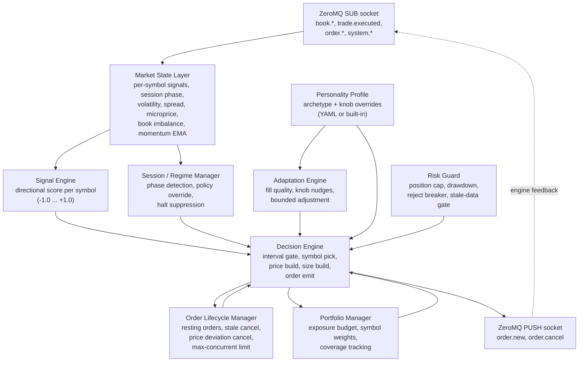
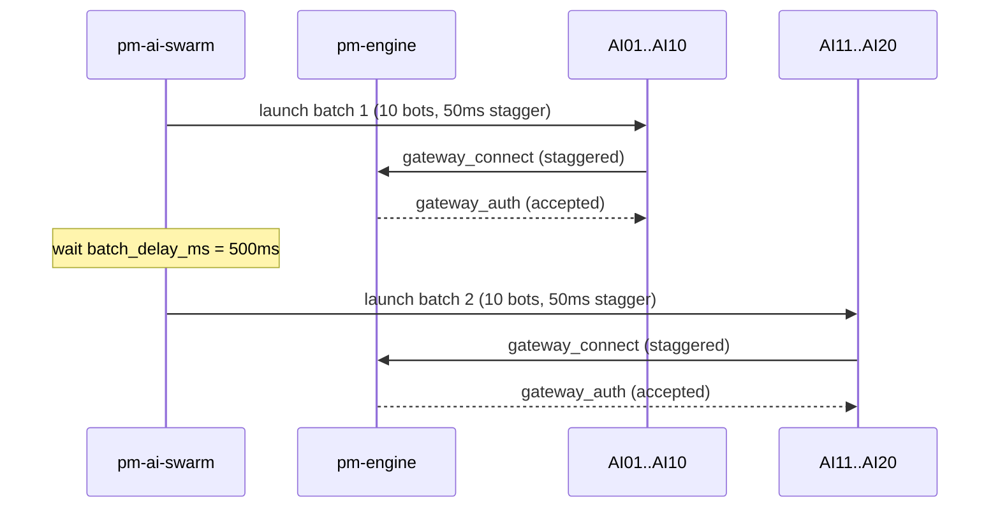

Version: 1.0.0

Date: 2026-06-28

Status: Design Proposal — Ready for Implementation

# EduMatcher — Intelligent AI Trading Bot v2 (`pm-ai-trader`, `pm-ai-swarm`)

## Table of Contents

1. [Purpose and Design Philosophy](#1-purpose-and-design-philosophy)
2. [What v1 Got Wrong](#2-what-v1-got-wrong)
3. [Architecture Overview](#3-architecture-overview)
4. [Market State Layer](#4-market-state-layer)
   - 4.1 Per-Symbol Market State
   - 4.2 Signals Computed
   - 4.3 Session Phase Tracking
   - 4.4 Price Units and Tick Size
   - 4.5 Cold-Start and Warm-Up
5. [Signal Engine](#5-signal-engine)
   - 5.1 Directional Score
   - 5.2 Signal Components
   - 5.3 Score to Side Mapping
6. [Decision Engine](#6-decision-engine)
   - 6.1 Decision Loop
   - 6.2 Symbol Selection
   - 6.3 Price Construction
   - 6.4 Size Construction
7. [Order Lifecycle Manager](#7-order-lifecycle-manager)
   - 7.1 Order Book per Symbol
   - 7.2 Stale Order Cancellation
   - 7.3 Max Concurrent Limit
   - 7.4 Reconciliation and Edge Cases
8. [Portfolio Manager](#8-portfolio-manager)
   - 8.1 Exposure Tracking
   - 8.2 Symbol Weighting
   - 8.3 Coverage Guarantee
9. [Session and Regime Manager](#9-session-and-regime-manager)
   - 9.1 Session Phase Map
   - 9.2 Phase Policy Overrides
   - 9.3 Halt Handling
10. [Adaptation Engine](#10-adaptation-engine)
    - 10.1 Fill Quality Metrics
    - 10.2 Adaptive Knob Adjustment
    - 10.3 Bounds and Reset
11. [Personality Profile System v2](#11-personality-profile-system-v2)
    - 11.1 Profile Layers
    - 11.2 Built-in Archetypes
    - 11.3 Custom YAML Profiles
    - 11.4 Full Profile Schema
    - 11.5 High-Level Personality Presets
12. [Swarm Architecture v2](#12-swarm-architecture-v2)
    - 12.1 Coverage Pools
    - 12.2 Swarm Composition
    - 12.3 Launch Stagger
13. [Risk Management](#13-risk-management)
    - 13.1 Position Limits
    - 13.2 Drawdown Guard
    - 13.3 Reject Breaker
    - 13.4 Stale Data Gate
14. [ZeroMQ Message Contracts](#14-zeromq-message-contracts)
15. [CLI and Configuration](#15-cli-and-configuration)
    - 15.1 pm-ai-trader v2 CLI
    - 15.2 pm-ai-swarm v2 CLI
    - 15.3 Engine Config Requirements for Bot Authentication
16. [Module Design and File Layout](#16-module-design-and-file-layout)
17. [Determinism and Reproducibility](#17-determinism-and-reproducibility)
18. [Expected Behavior at Scale](#18-expected-behavior-at-scale)
    - 18.1 50 Bots / 100 Symbols
    - 18.2 Qualitative Market Patterns
19. [Testing Strategy](#19-testing-strategy)
20. [Implementation Roadmap](#20-implementation-roadmap)
21. [Acceptance Criteria](#21-acceptance-criteria)
22. [Engine Enhancements That Would Simplify the Bot](#22-engine-enhancements-that-would-simplify-the-bot)


## 1. Purpose and Design Philosophy

### 1.1 Goal

`pm-ai-trader` v2 is a **genuine agent** — an autonomous participant that
observes a stream of market events, maintains a coherent internal model of the
exchange state, makes signal-driven decisions, manages its own order lifecycle,
and adapts its behavior in response to outcomes and market conditions.

A swarm of v2 bots should produce a synthetic market that:

- Has credible price discovery for every active symbol
- Shows realistic microstructure patterns: spread fluctuation, depth variation,
  short-horizon autocorrelation in trade flow, and intraday volume profiles
- Responds to circuit breaker halts and session transitions correctly
- Scales cleanly to 50+ bots across 100+ symbols on a laptop

### 1.2 Design Principles

**Observable state drives decisions.** Every decision must be traceable to a
market signal or profile knob. There is no "random 50/50" default.

**Order lifecycle is a first-class concern.** The bot tracks every live order
and actively manages cancellation, repricing, and expiry. Unmanaged order
stacking is a bug, not a feature.

**Profiles are personalities, not just speed presets.** Each profile encodes a
distinct trading style: how the agent interprets signals, how urgently it trades,
how it responds to volatility and inventory, and how it behaves in each session
phase.

**Adaptation is bounded and transparent.** The bot may tune its own parameters
online, but within declared bounds and with logged evidence so behavior is
explainable and reproducible with a seed.

**Scalability over complexity.** The per-bot footprint is lightweight. One Python
process per bot, sharing nothing, communicating only through the engine's
existing ZeroMQ bus. No shared state, no inter-bot coordination.

### 1.3 Non-Goals

- Forecasting future prices via ML or statistical models
- Tick-by-tick latency optimization (this is educational software)
- Adversarial strategies targeting specific human participants
- Acting as a market maker (use `pm-mm-bot` for that)
- P&L optimization as an explicit objective


## 2. What v1 Got Wrong

The v1 implementation was a stochastic order generator, not an agent. The
following table documents the key failures that drove this redesign.

| Failure | v1 Behavior | Impact |
|---------|------------|--------|
| Random side selection | 50/50 BUY/SELL with no signal | Produces symmetric noise; no price discovery |
| No order lifecycle management | Submits orders and forgets them | Order stacking; unrealistic book depth; position tracking drift |
| Symbol-blind portfolio | One primary symbol per bot, round-robin | 50 bots on 100 symbols leaves half the exchange silent |
| Static profile parameters | Fixed at startup, never adapted | Bots behave identically across calm and volatile markets |
| No session awareness | Same behavior in auction, continuous, and halt | Submits limit orders during auctions; no ATO/ATC participation |
| Fixed tick size in profile | `0.01` hardcoded for all symbols | Wrong prices on symbols with different tick decimals |
| No book depth signal | Uses only `best_bid` / `best_ask` | Ignores imbalance, depth, and microprice |
| Passive offset in ticks ignores symbol | Same tick offset for $10 and $500 stocks | Placement is relatively far or near depending on price scale |
| Swarm assigns one symbol per bot | `assign_primary_symbols` is round-robin | Predictable, not adaptive, and leaves symbols uncovered |
| No self-monitoring | Tracks submit/fill counts but ignores fill quality | Cannot detect when the bot is systematically wrong-sided |


## 3. Architecture Overview

The v2 bot is structured as a set of cooperating components within a single
process. All state is in-memory per process. Components share no state across
processes.
  


Components are **synchronous and single-threaded**. The event loop drives
everything. There are no background threads.


## 4. Market State Layer

### 4.1 Per-Symbol Market State

The bot maintains one `SymbolState` record per known symbol, updated on every
`book.<SYM>` and `trade.executed` event.

```
SymbolState:
  # Raw book
  best_bid: float | None
  best_ask: float | None
  bid_depth: int           # bid-side quantity; from the `depth.<SYM>` topic
  ask_depth: int           # ask-side quantity; from the `depth.<SYM>` topic
  last_price: float | None
  last_trade_side: str | None   # aggressor side of the last trade; from the
                                # `aggressor_side` field of `trade.executed`
                                # ("BUY" or "SELL")

  # Derived (partially engine-supplied — see §4.2)
  spread: float | None          # best_ask - best_bid (computed locally from book.<SYM>)
  midprice: float | None        # (best_bid + best_ask) / 2 (computed locally)
  microprice: float | None      # imbalance-weighted midprice — read directly from
                                # depth.<SYM>.microprice (float price units, no
                                # conversion needed; see §4.2 and §22.2)
  mid_price: float | None       # last-trade price as float — depth.<SYM>.mid_price
  imbalance: float | None       # (bid_depth - ask_depth) / (bid_depth + ask_depth)
                                # ∈ (-1, +1); read from depth.<SYM>.imbalance

  # History
  momentum_ema: float | None    # EMA of signed price changes (§4.2)
  vol_ema: float | None         # EMA of absolute price changes (realized vol proxy)
  microprice_ema: float | None  # EMA of microprice (reversion baseline, §5.2)
  normal_spread: float | None   # long-run EMA of spread (baseline for spread ratio)
  update_count: int             # book/trade updates seen so far (warm-up gate, §4.5)

  # Time
  last_update_ts: float         # monotonic clock
  tick_size: float              # from system.symbols `symbol_meta` when configured; else §4.4
```

All price fields are **floating-point price units** (e.g. dollars), consistent
with the engine's book and order payloads (see §4.4).

### 4.2 Signals Computed

**Microprice** — imbalance-weighted midprice, a better estimate of fair value
than simple midprice when the book is skewed:

$$\text{microprice} = \text{mid} + \frac{Q_{bid} - Q_{ask}}{Q_{bid} + Q_{ask}} \cdot \frac{\text{spread}}{2}$$

**Order book imbalance** — normalized depth difference:

$$\text{imbalance} = \frac{Q_{bid} - Q_{ask}}{Q_{bid} + Q_{ask}} \in (-1, +1)$$

Positive imbalance = more buying pressure at top of book.

`bid_depth`, `ask_depth`, `imbalance`, `microprice`, and `mid_price` are all
published directly by the engine on the `depth.<SYM>` topic as **float price
units** — no tick conversion is needed. The bot reads them as-is. The
`book.<SYM>` snapshot supplies best bid/ask, price levels, and `last_price` for
spread computation. `depth.<SYM>` is absent until a symbol has traded; until
then `microprice`, `mid_price`, and `imbalance` are treated as absent/neutral
(§4.5).

**Momentum EMA** — exponential moving average of signed price changes:

$$\text{momentum}_{t} = \alpha \cdot \Delta p_t + (1 - \alpha) \cdot \text{momentum}_{t-1}$$

where $\Delta p_t = p_t - p_{t-1}$ and $\alpha$ is a profile-tunable decay. When
$\Delta p_t = 0$ (a trade printed at the same price), the sign of
`last_trade_side` (`+1` for an aggressive BUY, `−1` for SELL) supplies the
direction — a Lee-Ready-style tick test — so flat-price prints still carry
information. This is the consumer of the `aggressor_side` field.

Positive momentum = price trending up recently.

**Volatility EMA** — exponential moving average of absolute price changes:

$$\text{vol}_{t} = \alpha \cdot |\Delta p_t| + (1 - \alpha) \cdot \text{vol}_{t-1}$$

Used to scale size and aggression.

**Spread ratio** — spread relative to its long-run baseline:

$$\text{spread\_ratio} = \frac{\text{spread}}{\text{normal\_spread}}$$

Values >1 mean the spread is wider than usual.

### 4.3 Session Phase Tracking

The bot subscribes to `session.state` events (payload `{state, prev_state}`) and
maintains the current trading phase. The engine's `SessionState` enum has
exactly five values:

- `PRE_OPEN` — pre-open period (no continuous matching)
- `OPENING_AUCTION` — call auction before open
- `CONTINUOUS` — normal continuous double-auction
- `CLOSING_AUCTION` — call auction before close
- `CLOSED` — market closed (engine up, no continuous matching)

There is **no** `HALTED` or `CLOSED_AFTER` session state.

**Halt is orthogonal to session phase.** A circuit-breaker halt applies to a
**single symbol** while the session as a whole may still be `CONTINUOUS`. Halts
are therefore tracked as a separate per-symbol flag (§9.3), driven by
`circuit_breaker.halt.<SYMBOL>` / `circuit_breaker.resume.<SYMBOL>` events — not
by the session state machine.

### 4.4 Price Units and Tick Size

All prices on the bus (`book.<SYM>` levels, `trade.executed`, `order.new`,
`depth.<SYM>`) are **floating-point price units** (e.g. dollars), not integer
ticks. The `depth.<SYM>` topic now carries both `microprice` and `mid_price`
as float display prices alongside the legacy `mid_price_ticks` integer field.
All signal math in §4.2 and §5 operates in float price space with no
conversion step.

`system.symbols.<GW_ID>` includes a `symbol_meta` map when the engine is started
with a config; each entry carries `tick_size` (= `10 ** -tick_decimals`). The bot
resolves tick size with this precedence:

1. `--tick-size` CLI override (or `tick_size` in the profile), if explicitly set
2. `symbol_meta[<SYM>].tick_size` from `system.symbols` (the normal source)
3. Fallback default of `0.01`, with a one-time warning per symbol (only reached
   when the engine ran without a config)

Inferring tick size from observed price granularity is explicitly **not** used:
it is unreliable on thin books.

### 4.5 Cold-Start and Warm-Up

Signals are undefined until enough data has arrived. Each `SymbolState` tracks
`update_count`. Until `update_count >= warmup_updates` (default 5):

- `momentum_ema`, `vol_ema`, and `microprice_ema` are **seeded on first
  observation** (the EMA is initialised to the first sample, not to 0)
- The Signal Engine returns a neutral score `s = 0.0` (50/50 side)
- The Decision Engine may still post passive orders but does not act on signals

All signal denominators use `vol_ema + ε` with `ε = 1e-9` to avoid division by
zero. Book depth is `0` until orders rest, so `imbalance` is treated as `0.0`
(neutral) whenever `bid_depth + ask_depth == 0`.


## 5. Signal Engine

### 5.1 Directional Score

The signal engine produces a **directional score** $s \in [-1.0, +1.0]$ per
symbol. The score represents the bot's current view of whether price is likely
to move up (positive) or down (negative). It does **not** forecast price
targets — it is a directional lean that biases side selection.

$s = 0.0$ means fully neutral (no lean). $s = +0.8$ means strong bullish lean.
During warm-up (`update_count < warmup_updates`, §4.5) the engine returns
$s = 0.0$ regardless of inputs.

### 5.2 Signal Components

Three components are combined into the score. Weights are profile-tunable:

**Momentum signal** — derived from `momentum_ema`:

$$s_{mom} = \text{clip}\left(\frac{\text{momentum\_ema}}{\text{vol\_ema} + \epsilon}, -1, +1\right)$$

This normalizes momentum by current volatility so a large move in a volatile
stock doesn't dominate a small move in a quiet stock.

**Imbalance signal** — direct use of order book imbalance:

$$s_{imb} = \text{imbalance}$$

**Mean-reversion signal** — deviation of current microprice from its own EWMA:

$$s_{rev} = -\text{clip}\left(\frac{\text{microprice} - \text{microprice\_ema}}{\text{vol\_ema} + \epsilon}, -1, +1\right)$$

Negative sign: if price is above its moving average, reversion traders lean
short.

**Combined score:**

$$s = w_{mom} \cdot s_{mom} + w_{imb} \cdot s_{imb} + w_{rev} \cdot s_{rev}$$

Weights sum to 1.0. Profiles configure the weights. Example profiles:

| Archetype | $w_{mom}$ | $w_{imb}$ | $w_{rev}$ | Character |
|---|---|---|---|---|
| Trend follower | 0.70 | 0.20 | 0.10 | Chases moves |
| Contrarian | 0.10 | 0.10 | 0.80 | Fades moves |
| Flow follower | 0.20 | 0.70 | 0.10 | Watches book pressure |
| Noise trader | 0.33 | 0.33 | 0.33 | Balanced, no strong view |

### 5.3 Score to Side Mapping

The directional score is converted to a BUY probability:

$$P(\text{BUY}) = \frac{1 + s \cdot \text{signal\_strength}}{2}$$

`signal_strength` is a profile knob $\in [0.0, 1.0]$. At `0.0` it degenerates
to 50/50 (v1 behavior). At `1.0` a score of $+1.0$ always buys.

Side is then sampled from this probability. This preserves randomness (which is
realistic — not all of any agent's flow is directional) while introducing a
signal-consistent lean.


## 6. Decision Engine

### 6.1 Decision Loop

The decision loop runs every `poll_interval_ms` (default 50ms). It is not
blocked waiting for the interval — it runs on every poll tick and gates
internally.

```
for each poll tick:
  1. Drain all pending ZMQ events (non-blocking, batch)
  2. Update Market State Layer from events
  3. Run Order Lifecycle Manager checks (stale-cancel, reconcile fills/expiries)
  4. If session allows new orders AND global_min_submit_ms has elapsed:
     a. Pick symbol from Portfolio Manager (weighted; §6.2)
     b. If that symbol's per-symbol decision interval has elapsed:
        i.   Get directional score from Signal Engine (0.0 during warm-up, §4.5)
        ii.  Apply Session/Regime policy overrides
        iii. Check Risk Guards (position, notional, halt, drawdown)
        iv.  Construct order (price, side, size, smp)
        v.   Emit order to engine; record a PENDING submission (§7.1)
```

Draining all events before deciding ensures decisions use the freshest state.

### 6.2 Symbol Selection

Symbol selection is **weighted random**, not round-robin.

Each symbol gets a weight proportional to its recent activity score:

$$w_i = \text{base\_weight}_i \cdot \text{activity\_factor}_i \cdot \text{coverage\_factor}_i$$

Where:

- `base_weight` — from profile (can be uniform or concentration-weighted)
- `activity_factor` — proportional to recent trade count in the last N seconds;
  more active markets attract more attention (realistic herding)
- `coverage_factor` — boosted for symbols that have not been touched recently,
  to prevent complete symbol starvation

After selection, the bot applies a per-symbol **decision interval** to avoid
over-trading any one symbol. Interval jitter ($\pm$ 20%) is added to prevent
bots from synchronizing.

### 6.3 Price Construction

Price construction uses microprice as the reference instead of best bid/ask,
which gives better placement on imbalanced books.

**Passive placement:**

For a BUY order:

$$\text{price} = \text{microprice} - \text{passive\_offset} \cdot \text{tick\_size}$$

`passive_offset` is a floating value from the profile, allowing sub-tick
granularity before rounding. This enables one bot to post at the best bid while
another posts one tick behind.

**Aggressive (crossing) placement:**

The bot crosses at `best_ask` for a BUY (or `best_bid` for a SELL). The
crossing decision uses `cross_probability` scaled by current spread ratio:

$$P(\text{cross}) = \text{base\_cross\_prob} \times \frac{1}{\text{spread\_ratio}^{\text{spread\_sensitivity}}}$$

This models the intuition that crossing is less attractive when the spread is
wider than usual.

**Final price rounding:**

All prices are rounded to the nearest tick using the resolved `tick_size`
(§4.4). This replaces the v1 behaviour where tick size was a hardcoded profile
constant; v2 uses the §4.4 precedence so the value can become symbol-specific
once the engine publishes tick metadata.

**Self-trade prevention:**

Because many bots (and a single bot across ticks) can rest and then cross their
own orders, every crossing `order.new` carries an `smp_action` field set from
`smp_policy` (default `CANCEL_RESTING`). This prevents a bot from trading with
its own resting liquidity, which would distort price discovery and waste the
position cap. Valid values mirror the engine enum exactly: `NONE`,
`CANCEL_AGGRESSOR`, `CANCEL_RESTING`, `CANCEL_BOTH`.

> **Wire-field note.** The engine decodes self-match prevention from the
> `smp_action` key (`Order.from_dict`), not `smp`. Sending the wrong key is
> silently ignored and defaults to `NONE`.

### 6.4 Size Construction

Size is drawn from the profile distribution (unchanged from v1) but additionally
**scaled by a volatility multiplier**:

$$\text{size} = \text{base\_size} \times \text{clip}\left(\frac{\text{vol\_target}}{\text{vol\_ema} + \epsilon},\ \text{min\_vol\_mult},\ \text{max\_vol\_mult}\right)$$

When `vol_ema` is high relative to `vol_target`, the bot trades smaller.
When `vol_ema` is low, it can trade larger (up to the cap).

Profile fields:
- `vol_target` — expected "normal" price change per trade (sets neutral scaling)
- `min_vol_mult` — minimum size multiplier (e.g. 0.25)
- `max_vol_mult` — maximum size multiplier (e.g. 2.0)


## 7. Order Lifecycle Manager

This is the most critical component missing from v1. The OLM tracks all live
orders submitted by the bot and actively manages their fate.

### 7.1 Order Book per Symbol

The bot maintains a per-symbol map of live orders:

```
LiveOrder:
  order_id: str        # = the bot-supplied `id`, echoed by the engine on ack
  client_tag: str      # UUID generated by the bot before submission;
                       # echoed by the engine on ack, fill, cancelled, expired
  symbol: str
  side: str
  price: float
  qty: int
  remaining: int       # updated from partial fills
  submitted_at: float  # monotonic timestamp
  fill_count: int
```

Orders are added when acknowledged (`order.ack.<GW_ID>` with `accepted=True`)
and removed when fully filled, cancelled, or expired.

**Submission correlation.** Before sending each `order.new` the bot generates a
unique `client_tag` (a UUID or short random string) and stores it in a
`pending: dict[str, LiveOrder]` keyed by `client_tag`. When `order.ack.<GW_ID>`
arrives, it carries the same `client_tag` — the OLM resolves the `LiveOrder` in
O(1) with `pending.pop(ack.client_tag)`, records the engine-assigned `order_id`,
and moves the entry to `live: dict[str, LiveOrder]` keyed by `order_id`.
Subsequent `order.fill`, `order.cancelled`, and `order.expired` events carry
both `order_id` and `client_tag`; the OLM uses `order_id` as the primary key for
these (the order is already in `live` by then). There is no FIFO queue and no
ambiguity with concurrent identical submissions.

### 7.2 Stale Order Cancellation

On every decision tick, the OLM evaluates each live order for cancellation:

**Price staleness** — cancel if the order's price has drifted more than
`stale_price_ticks` ticks from the current microprice in the wrong direction:

```
buy_order: cancel if order.price < microprice - stale_price_ticks * tick_size
sell_order: cancel if order.price > microprice + stale_price_ticks * tick_size
```

This prevents orders placed during a price movement from sitting passively far
off-market.

**Age staleness** — cancel if the order has been live longer than
`max_order_age_sec`. Configurable per profile (cautious profiles keep orders
longer; aggressive profiles reprice quickly).

Cancel messages are sent via `order.cancel` on the PUSH socket. The OLM
transitions the order to a `CANCEL_PENDING` state and stops counting it toward
the concurrent limit.

### 7.3 Max Concurrent Limit

The bot will not submit a new order for symbol S if it already has
`max_concurrent_orders` orders live for that symbol. This caps book exposure and
prevents the v1 stacking problem where a bot could accumulate dozens of resting
orders at different price levels.

```
max_concurrent_orders: int   # per symbol, default 2
```

When the limit is hit, the bot skips submission for that symbol until a slot
opens via fill or cancellation.

### 7.4 Reconciliation and Edge Cases

**Fill/cancel race.** A cancel sent for an order that fills in the same instant
may be confirmed as either `order.cancelled` or a terminal `order.fill`. The OLM
treats whichever terminal event arrives first as authoritative and ignores the
other for that `order_id`. Position and exposure are updated **only** from
`order.fill` events — never from the optimistic CANCEL_PENDING transition — so a
losing cancel/fill race cannot double-count.

**DAY/auction expiry.** v2 orders are `DAY` (or auction TIF). At end of day the
engine emits `order.expired.<GW_ID>`; the OLM removes the order and frees its
concurrent slot. Orders are never assumed cancelled without a confirming event.

**End of day / disconnect.** On `system.eod` the bot stops submitting, records
closing prices from the payload (a cold-start reference for the next session,
§9.2), and clears live-order state. If all symbols go stale for >30s (§13.4) the
bot logs a likely engine disconnect rather than trading on stale data.

**Reconnect order reconciliation.** If the bot gateway is configured with
`disconnect_behaviour: CANCEL_ALL` (recommended for bots — §15.3), all resting
orders are cancelled by the engine on disconnect, so the OLM can safely start
empty on reconnect. If the default `CANCEL_QUOTES_ONLY` is used instead, the
engine does **not** cancel limit orders on disconnect and the OLM will be out of
sync with the book. In that case the bot should send `order.orders_request`
(payload `{gateway_id}`) immediately after the startup seeding sequence; the
engine replies on `order.orders.<GW_ID>` with a list of all resting orders, which
the OLM should load into its `live` map before submitting new orders.


## 8. Portfolio Manager

### 8.1 Exposure Tracking

The portfolio manager tracks position and notional exposure across all symbols:

```
PortfolioState:
  positions: dict[str, int]          # net quantity per symbol
  notional: dict[str, float]         # abs(position * last_price)
  total_notional: float              # sum of abs notional
  fills_by_symbol: dict[str, int]    # recent fill count per symbol (rolling window)
```

### 8.2 Symbol Weighting

The weight of each symbol in the selection pool is updated every
`weight_update_interval_sec` (default 5s):

```
activity_factor[sym] = log(1 + fills_by_symbol[sym]) normalized to [0.5, 2.0]
coverage_factor[sym] = 1 + max(0, (coverage_target_sec - time_since_last_trade[sym]) / coverage_target_sec)
```

The coverage factor ensures that inactive symbols don't stay silent forever.
After `coverage_target_sec` of inactivity, their weight doubles, forcing the
bot to periodically revisit them.

### 8.3 Coverage Guarantee

For swarms covering 100 symbols with 50 bots, the Coverage Guarantee is
handled at the swarm level (§12). At the individual bot level, multi-symbol
bots (where `--symbols` spans multiple instruments) use the weighting above to
maintain balanced coverage.

The bot respects a `max_symbol_notional` cap: it will not submit further orders
for a symbol whose notional exposure exceeds the cap (regardless of sign),
even if the position limit has not been reached.


## 9. Session and Regime Manager

### 9.1 Session Phase Map

The bot subscribes to `session.state` (payload `{state, prev_state}`) and tracks
the current phase. Per-symbol halts are tracked separately (§9.3).

| Phase | Source event | Action |
|---|---|---|
| `PRE_OPEN` | `session.state state=PRE_OPEN` | Passive-only, reduced size, no crossing |
| `OPENING_AUCTION` | `session.state state=OPENING_AUCTION` | Submit `LIMIT` + `TIF=ATO` (§9.2) |
| `CONTINUOUS` | `session.state state=CONTINUOUS` | Full normal operation |
| `CLOSING_AUCTION` | `session.state state=CLOSING_AUCTION` | Submit `LIMIT` + `TIF=ATC`, flatten inventory |
| `CLOSED` | `session.state state=CLOSED` | Suppress all order submission |

Per-symbol halt (orthogonal to phase): on `circuit_breaker.halt.<SYM>` suppress
orders for that symbol only; resume on `circuit_breaker.resume.<SYM>` (§9.3).

### 9.2 Phase Policy Overrides

Each session phase applies overrides to the base decision policy. These are
profile-configurable:

**Opening auction phase:**

- `auction_participation_prob` — probability the bot participates at all (some
  bots sit out auctions; default 0.6)
- Submit up to one `LIMIT` order with `TIF=ATO` per symbol per auction cycle
- Price reference (in order of preference):
  1. Pre-open indicative/midprice from `depth.<SYM>.mid_price` if already
     available (symbol has traded earlier in the session)
  2. `symbol_meta[SYM].prev_close` from `system.symbols` — the engine now
     persists the last session's closing price and surfaces it at startup,
     so a cold swarm can price its first auction immediately
  3. Previous close recorded during the last `system.eod` broadcast (valid
     only if the bot was running the prior session)
  4. Skip auction participation if none of the above is available
  
  The reference is then adjusted by the signal
- Size: profile's auction-size multiplier × normal base size

**Closing auction phase:**

- Submit up to one `LIMIT` order with `TIF=ATC` per symbol
- If inventory is non-zero, bias the ATC side toward flattening
- `closing_flatten_strength` — how strongly inventory bias overrides the signal
  (0.0 = ignore inventory, 1.0 = always flatten)

**Pre-open phase:**

- Normal operation except: no crossing allowed, passive offset doubled

**Halt (per-symbol):**

- Cancel all live orders for the halted symbol
- Do not submit new orders until `circuit_breaker.resume.<SYM>` is received
- Counts toward stale-cancel runs

### 9.3 Halt Handling

**Startup / reconnect seeding.** On connect the bot performs the following
initialization sequence in order (all steps must complete before any
`order.new` is emitted):

1. **`system.session_state_request`** → `system.session_status.<GW_ID>`:
   seed the current session phase so the bot never submits into the wrong phase
   on a mid-session connect.  `session.state` broadcasts are *edge-triggered*
   (only sent on transitions) — without this explicit query the bot would not
   know it joined during `OPENING_AUCTION` until the next transition.
2. **`system.halt_status_request`** → `system.halt_status.<GW_ID>`: pre-populate
   the per-symbol `halted` set so the bot never submits into a symbol that was
   already halted when it joined mid-session.
3. **`system.position_request`** → `system.position_snapshot.<GW_ID>`: re-seed
   per-symbol net position (`net_qty`) and average cost (`avg_cost`) from the
   engine's ledger.  The engine tracks every fill since it started; a reconnecting
   bot receives the up-to-date position, so the inventory-skew logic (§13.1) and
   the drawdown guard (§13.2) start from the correct state rather than from zero.

If the engine replies with an empty list for either request the bot starts from
a flat / unhalt state, which is correct for a fresh session.

**Restart caveat.** The engine's position ledger resets on engine restart (it is
not persisted to disk).  If the engine also restarts, both parties genuinely
start flat — no desync is possible.

**Edge events (normal operation):** when a `circuit_breaker.halt.<SYM>` event
arrives for symbol S:

1. Cancel all live orders for S immediately (OLM action)
2. Mark S as `halted` — block Decision Engine from picking S
3. On `circuit_breaker.resume.<SYM>` for S: unmark, reset the stale-data timer,
   resume normal operation after `halt_resume_delay_sec` (default 1.0s)

Halts are independent of session phase: a symbol can be halted while the session
is `CONTINUOUS`, and a resume does not change the session state.


## 10. Adaptation Engine

### 10.1 Fill Quality Metrics

The adaptation engine tracks the following per-symbol metrics over a rolling
window (`adapt_window_sec`, default 60s):

| Metric | Definition | Good | Bad |
|---|---|---|---|
| `fill_rate` | fills / submits | High | Low (orders sitting) |
| `adverse_fill_rate` | fills where price moved against us immediately | Low | High |
| `stale_cancel_rate` | stale-price cancels / submits | Low | High (signal drifting too fast) |
| `reject_rate` | rejects / submits | Low | High |

**Adverse fill detection** — a fill is adverse if the price moves more than
`adverse_threshold_ticks` against the fill side within `adverse_check_delay_sec`
of the fill:

- BUY filled at price P; price falls below P − threshold → adverse
- SELL filled at price P; price rises above P + threshold → adverse

### 10.2 Adaptive Knob Adjustment

After each evaluation cycle, the engine may nudge the following knobs by a
small delta, bounded within declared ranges:

| Metric signal | Adjustment | Rationale |
|---|---|---|
| `adverse_fill_rate` high | Reduce `cross_probability` by Δ | Stop crossing into adverse moves |
| `fill_rate` low | Increase `cross_probability` by Δ | Orders aren't filling; move closer to market |
| `stale_cancel_rate` high | Increase `max_order_age_sec` | Prices changing too fast, hold orders shorter |
| `stale_cancel_rate` low and `fill_rate` low | Decrease `passive_offset` | Post closer to market |

All nudges are:
- Bounded to `[knob_min, knob_max]` from the profile definition
- Capped at `max_adapt_delta_per_cycle` to prevent instability
- Logged with the metric that triggered the nudge

### 10.3 Bounds and Reset

Adaptation is bounded — it cannot move a knob outside the profile's declared
min/max range. If a bot reaches a bound and fill quality is still poor, it logs
a warning and stops adapting that knob.

A `--no-adapt` flag disables adaptation entirely for reproducibility in
deterministic test runs.


## 11. Personality Profile System v2

### 11.1 Profile Layers

Profiles are structured in three layers:

1. **Archetype** — selects a built-in behavioral template (signal weights, base
   knobs, default phase behavior)
2. **Overrides** — YAML key/value pairs that replace specific knob values
3. **Bounds** — YAML key/value pairs that set min/max for each adaptive knob

This design keeps built-in profiles simple and lets operators create custom
profiles for classroom scenarios without writing Python code.

### 11.2 Built-in Archetypes

| Archetype | Signal weights | Character |
|---|---|---|
| `trend-follower` | mom=0.70, imb=0.20, rev=0.10 | Chases momentum; moderate cross prob; medium size |
| `contrarian` | mom=0.10, imb=0.10, rev=0.80 | Fades moves; passive offset high; patient |
| `flow-follower` | mom=0.20, imb=0.70, rev=0.10 | Tracks book pressure; fast decisions; small size |
| `noise-trader` | mom=0.33, imb=0.33, rev=0.33 | Balanced; moderate on all dimensions |
| `institutional` | mom=0.50, imb=0.30, rev=0.20 | Large blocks; slow decisions; low cross prob |
| `scalper` | mom=0.30, imb=0.60, rev=0.10 | Very frequent; tiny size; crosses often |

### 11.3 Custom YAML Profiles

A profile file overrides any knob or bound:

```yaml
# profile: patient-value-buyer.yaml
archetype: contrarian
overrides:
  decision_interval_ms: 2000
  order_size_min: 50
  order_size_max: 300
  cross_probability_base: 0.03
  passive_offset: 3.0
  signal_strength: 0.6
  max_order_age_sec: 30.0
  max_concurrent_orders: 1
  closing_flatten_strength: 0.8
  vol_target: 0.05
  min_vol_mult: 0.5
  max_vol_mult: 1.5
  auction_participation_prob: 0.3
  signal_weights:
    momentum: 0.05
    imbalance: 0.05
    reversion: 0.90
bounds:
  cross_probability_base: [0.01, 0.10]
  passive_offset: [1.0, 8.0]
  max_order_age_sec: [10.0, 60.0]
```

The profile loader validates all keys against the schema before the bot starts,
producing a clear error if any key is unknown or a value is out of range.

### 11.4 Full Profile Schema

All tunable knobs and their purpose:

#### Execution

| Knob | Type | Default | Description |
|---|---|---|---|
| `poll_interval_ms` | int | 50 | Event-loop tick; events drained and gates evaluated each tick |
| `decision_interval_ms` | int | 500 | Minimum ms between decisions for the **same** symbol |
| `decision_interval_jitter_pct` | float | 0.20 | Jitter ± this fraction of interval |
| `global_min_submit_ms` | int | 0 | Minimum ms between *any* two submissions (engine rate limit; 0 = off) |
| `max_concurrent_orders` | int | 2 | Max live orders per symbol |
| `max_order_age_sec` | float | 10.0 | Cancel live orders older than this |
| `stale_price_ticks` | float | 3.0 | Cancel if price drifts this many ticks from microprice |
| `warmup_updates` | int | 5 | Updates per symbol before signals are trusted (§4.5) |
| `tick_size` | float | 0.01 | Default tick size when the engine provides none (§4.4) |

#### Signal

| Knob | Type | Default | Description |
|---|---|---|---|
| `signal_strength` | float | 0.5 | Sensitivity of side to score: 0=neutral, 1=always follows score |
| `signal_weights.momentum` | float | 0.33 | Weight on momentum component |
| `signal_weights.imbalance` | float | 0.33 | Weight on imbalance component |
| `signal_weights.reversion` | float | 0.34 | Weight on reversion component |
| `momentum_alpha` | float | 0.3 | EMA decay for momentum and volatility signals |

#### Price

| Knob | Type | Default | Description |
|---|---|---|---|
| `cross_probability_base` | float | 0.10 | Base probability of crossing the spread |
| `spread_sensitivity` | float | 1.0 | Power applied to spread ratio in cross-prob scaling |
| `passive_offset` | float | 1.0 | Ticks behind microprice for passive orders |

#### Size

| Knob | Type | Default | Description |
|---|---|---|---|
| `order_size_min` | int | 10 | Minimum order size |
| `order_size_max` | int | 100 | Maximum order size |
| `size_distribution` | str | `balanced` | Shape: `balanced`, `small-heavy`, `block-heavy` |
| `vol_target` | float | 0.05 | Volatility level at which size multiplier = 1.0 |
| `min_vol_mult` | float | 0.25 | Floor on volatility size multiplier |
| `max_vol_mult` | float | 2.0 | Cap on volatility size multiplier |

#### Inventory

| Knob | Type | Default | Description |
|---|---|---|---|
| `inventory_target` | int | 0 | Preferred net position (typically 0) |
| `inventory_skew_threshold` | float | 0.5 | Position fraction of `max_position` at which skew engages (§13.1) |
| `inventory_skew_strength` | float | 0.3 | How strongly inventory overrides signal |
| `max_position` | int | 1000 | Hard position cap; enforces directional flip |
| `max_symbol_notional` | float | 0 | Max notional per symbol; 0 = unlimited |
| `smp_policy` | str | `CANCEL_RESTING` | Self-trade prevention on crossing orders (§6.3) |

#### Portfolio / Symbol Selection

| Knob | Type | Default | Description |
|---|---|---|---|
| `coverage_target_sec` | float | 30.0 | Boost weight of symbols idle this long |
| `activity_window_sec` | float | 20.0 | Rolling window for fill-based activity weighting |
| `weight_update_interval_sec` | float | 5.0 | How often to recompute symbol weights |

#### Session

| Knob | Type | Default | Description |
|---|---|---|---|
| `auction_participation_prob` | float | 0.6 | Probability of participating in any auction cycle |
| `closing_flatten_strength` | float | 0.5 | Inventory-flatten bias during closing auction |
| `pre_open_size_mult` | float | 0.5 | Size multiplier in pre-open phase |
| `halt_resume_delay_sec` | float | 1.0 | Wait after halt resume before retrading |

#### Adaptation

| Knob | Type | Default | Description |
|---|---|---|---|
| `adapt_enabled` | bool | true | Enable online adaptation |
| `adapt_window_sec` | float | 60.0 | Rolling window for fill quality metrics |
| `adapt_eval_interval_sec` | float | 10.0 | How often to evaluate and nudge |
| `max_adapt_delta_per_cycle` | float | 0.05 | Max fractional change per knob per eval |
| `adverse_threshold_ticks` | float | 2.0 | Ticks of adverse move to classify as adverse fill |
| `adverse_check_delay_sec` | float | 2.0 | Window after fill to check for adverse move |


### 11.5 High-Level Personality Presets

The full profile schema (§11.4) gives precise control over every knob. For
most use cases — classroom scenarios, quick experiments, swarm composition
design — users do not need that level of detail. The **preset system** provides
a five-dimension shorthand that resolves to a concrete profile before the bot
starts.

Each dimension is independent. Choosing values on all five dimensions fully
specifies a bot's character without touching a single knob directly.

#### The Five Dimensions

**1. Strategy** — which market signal drives the directional lean

| Value | Signal weights | Character |
|---|---|---|
| `noise` | mom=0.33, imb=0.33, rev=0.34 | No strong view; balanced |
| `trend` | mom=0.70, imb=0.20, rev=0.10 | Chases price moves |
| `reversal` | mom=0.10, imb=0.10, rev=0.80 | Fades moves; bets on mean-reversion |
| `mixed` | Rotates between `trend` and `reversal` per symbol | Adapts strategy |

**2. Aggression** — willingness to cross the spread

| Value | `cross_probability_base` | `passive_offset` | Character |
|---|---|---|---|
| `passive` | 0.02 | 2.0 ticks | Limit orders only; always behind the mid |
| `neutral` | 0.10 | 1.0 tick | Mix; occasionally crosses |
| `aggressive` | 0.35 | 0.5 ticks | Frequently crosses; chases fills |

**3. Tempo** — order arrival rate (decision interval per symbol)

| Value | `decision_interval_ms` | Character |
|---|---|---|
| `slow` | 5 000–10 000 ms | Deliberate; ~1 order per symbol per 5–10 s |
| `medium` | 500–2 000 ms | Normal; ~1 order per symbol per 0.5–2 s |
| `fast` | 50–300 ms | High-frequency; limited by `global_min_submit_ms` |

**4. Risk** — position and notional limits

| Value | `max_position` | `max_notional` | Character |
|---|---|---|---|
| `cautious` | 100 shares | $10 000 | Small; suitable for thin books |
| `moderate` | 500 shares | $50 000 | Balanced |
| `bold` | 2 000 shares | $200 000 | Large positions; suitable for deep books |

**5. Adaptability** — whether the bot learns from outcomes

| Value | `adapt_enabled` | Character |
|---|---|---|
| `static` | `false` | Fixed knobs; fully reproducible |
| `adaptive` | `true` | Online knob adjustment (§10) |

#### Named Presets

The table below shows the six built-in named presets. Each is a convenient
shorthand for a common archetype; users can request it by name with
`--preset <name>`.

| Preset | Strategy | Aggression | Tempo | Risk | Adaptability | Typical use |
|---|---|---|---|---|---|---|
| `scalper` | trend | aggressive | fast | moderate | adaptive | High-frequency liquidity taker |
| `sniper` | reversal | aggressive | slow | bold | static | Patient contrarian; strikes hard |
| `passive-mm` | noise | passive | fast | cautious | adaptive | MM-like passive liquidity provider |
| `cautious-follower` | trend | neutral | medium | cautious | adaptive | Safe momentum follower |
| `noise-machine` | noise | neutral | fast | moderate | static | Background random flow generator |
| `contrarian` | reversal | neutral | medium | moderate | adaptive | Classic mean-reversion trader |

> The `noise-machine` and `contrarian` presets correspond to the §11.2
> archetypes of the same names. The other presets are combinations not
> expressible by a single archetype alone.

#### CLI Syntax

Two ways to express a personality — preset shorthand or explicit dimensions:

```bash
# Named preset (simplest)
pm-ai-trader --preset scalper --symbol AAPL

# Explicit five-dimension spec
pm-ai-trader --strategy reversal --aggression aggressive \
             --tempo slow --risk bold --adaptability static \
             --symbol AAPL

# Mix: start from a preset, override one dimension
pm-ai-trader --preset cautious-follower --risk bold --symbol MSFT

# Fine-grained: preset resolved first, then YAML overrides applied on top
pm-ai-trader --preset scalper --profile-file my_tweaks.yaml --symbol AAPL
```

Resolution order (later wins):
1. Built-in defaults (§11.4)
2. `--profile <archetype>` or `--preset <name>` (selects base knob set)
3. Individual dimension flags (`--strategy`, `--aggression`, `--tempo`,
   `--risk`, `--adaptability`)
4. `--profile-file <path>` YAML overrides
5. Explicit CLI risk flags (`--max-position`, `--max-notional`, `--max-drawdown`)

This layering lets operators say "give me a scalper but with conservative
position limits" in a single command without writing any YAML.

#### Swarm Composition with Presets

The `pm-ai-swarm --composition` flag accepts preset names in addition to
archetype names:

```bash
pm-ai-swarm --count 50 \
  --composition scalper:0.10,noise-machine:0.20,cautious-follower:0.30,\
contrarian:0.20,passive-mm:0.10,sniper:0.10 \
  --symbols AAPL,MSFT,TSLA,NVDA,AMZN
```

This is the recommended way to build a realistic swarm: mix presets to target
specific market microstructure properties (tight spreads → more `scalper` and
`passive-mm`; mean-reversion dampening → more `contrarian`; momentum signal →
more `cautious-follower`).


## 12. Swarm Architecture v2

### 12.1 Coverage Pools

The key structural change in the swarm is the introduction of **coverage pools**.
The symbol universe is divided into pools, and each pool is assigned to a group
of bots. This guarantees that every symbol has at least one bot assigned.

```
pools = partition(symbols, count=bot_count, method="round-robin")
```

For 50 bots and 100 symbols: each bot is responsible for 2 symbols as its
**primary pool**. Bots also participate in secondary symbols drawn from a
shared pool, driven by the Portfolio Manager's coverage mechanism.

### 12.2 Swarm Composition

A well-designed swarm should have profile diversity that mirrors a realistic
market:

| Profile mix | Suggested fraction | Rationale |
|---|---|---|
| `trend-follower` | 25% | Provide momentum-following flow |
| `contrarian` | 20% | Dampen trend runs; provide mean-reversion |
| `flow-follower` | 20% | Track book pressure; responsive |
| `noise-trader` | 20% | Background random flow |
| `institutional` | 10% | Infrequent large orders; drive occasional big moves |
| `scalper` | 5% | High-frequency tiny flow; tighten spreads |

The swarm launcher accepts `--composition` as an alternative to `--profiles`.
`--composition` takes a comma-separated archetype:fraction spec and computes
the actual bot count per profile automatically, then assigns deterministically.

### 12.3 Launch Stagger

To prevent authentication storms:

- Bots are launched in batches of `batch_size` (default 10)
- Within a batch, launch stagger is `stagger_ms` (default 50ms)
- Between batches, a `batch_delay_ms` (default 500ms) pause allows the engine
  to process connections

This makes 50-bot swarms start cleanly without overwhelming the engine's
authentication queue.




## 13. Risk Management

### 13.1 Position Limits

Two position controls operate at different levels:

- **Hard cap** (`max_position`): absolute directional position limit per symbol.
  When reached, the bot only submits in the flattening direction.
- **Soft cap** (`inventory_skew_threshold`): when position exceeds this fraction
  of `max_position`, the inventory skew mechanism amplifies the signal in the
  flattening direction without completely overriding it.

### 13.2 Drawdown Guard

The bot computes its own P&L from its fills (it does not depend on `pm-clearing`).
For each symbol it maintains a position and a volume-weighted average cost
(`avg_cost`):

- On a fill that **increases** |position| (opening), update `avg_cost` as the
  running VWAP of the position.
- On a fill that **reduces** |position| (closing), accrue
  `realized_pnl += (fill_price − avg_cost) × closed_qty × sign(position)`;
  `avg_cost` is unchanged.

Unrealised (mark-to-market) P&L per symbol is
`(last_price − avg_cost) × position`. Total equity P&L is
`Σ (realized_pnl + unrealised_pnl)`. The guard tracks the running **peak** of
total equity P&L; drawdown is `peak − current`.

If drawdown exceeds `max_drawdown_pct` of starting notional, pause all
submissions for `drawdown_pause_sec`:

```
drawdown_guard:
  max_drawdown_pct: 0.05
  drawdown_pause_sec: 30.0
  measure_window_sec: 300.0
```

The drawdown guard is optional and disabled by default — this keeps P&L
optimization a non-goal (§1.3); the guard is a safety rail, not an objective.
Enable it via profile or CLI for risk-sensitive scenarios.

### 13.3 Reject Breaker

Inherited from v1, improved:

- Rolling window reject count (unchanged)
- **Progressive cooldown**: first trip = 5s, second trip = 15s, third trip = 60s
- After three trips within `reset_window_sec`, the bot logs a critical warning
  and exits cleanly (prevents runaway invalid order flows)

### 13.4 Stale Data Gate

Unchanged semantics from v1, but improved logic:

- Check is per symbol, not global
- If a symbol has no data and other symbols do, skip only that symbol rather
  than pausing globally
- If all symbols are stale for >30s, log a warning about possible engine
  disconnection


## 14. ZeroMQ Message Contracts

### 14.1 Subscriptions (SUB ← engine PUB :5556)

| Topic | Purpose |
|---|---|
| `system.gateway_auth.<GW_ID>` | Connection acceptance. Payload: `{gateway_id, accepted (bool), reason (str), description (str)}`. The bot must check `accepted` before proceeding; `reason` carries the rejection message when `accepted=False`. |
| `system.symbols.<GW_ID>` | Symbol universe + `symbol_meta` (incl. `tick_size`) when engine is configured (§4.4) |
| `system.session_status.<GW_ID>` | Reply to `system.session_state_request`. Payload: `{state (str), sessions_enabled (bool)}`. Used in step 1 of the startup sequence to seed the current phase before any order submission. |
| `session.state` | Session phase transition broadcast. Payload: `{state (str), prev_state (str)}`. **`prev_state` is absent on the initial broadcast** — always use `.get("prev_state", "")`. |
| `circuit_breaker.halt.<SYMBOL>` | Per-symbol circuit-breaker halt. Payload: `{symbol, trigger_price (float\|null), reference_price (float\|null), resume_at_ns (int\|null), resumption_mode (str), level (str)}`. `resumption_mode` is `"AUCTION"` (halt resolves via mini-auction) or `"MANUAL"` (admin-only resume). `resume_at_ns` is `null` for `MANUAL` mode. |
| `circuit_breaker.resume.<SYMBOL>` | Per-symbol circuit-breaker resume. Payload: `{symbol, mode (str)}` where `mode` matches the `resumption_mode` from the halt message. |
| `book.<SYMBOL>` | Book snapshot: best bid/ask, price levels, `last_price` (float prices) |
| `depth.<SYMBOL>` | Engine-computed `bid_depth`, `ask_depth`, `imbalance`, `microprice` (float), `mid_price` (float) — ±100 ticks of last trade; no unit conversion needed |
| `trade.executed` | Trade events; relevant fields: `price` (float), **`quantity`** (int — note: field name is `quantity`, not `qty`), `aggressor_side` (`"BUY"` or `"SELL"`), `symbol`, `timestamp` (float seconds) |
| `system.eod` | End-of-day broadcast. Payload: `{books: [{symbol, bids, asks, last_price (float\|null), last_qty (int\|null), last_buy_price (float\|null), last_sell_price (float\|null), recent_trades}]}`. The bot records `last_buy_price`/`last_sell_price` per symbol as the closing price reference for the next session (§7.4, §9.2). |
| `order.ack.<GW_ID>` | Order acknowledgment (`accepted`, `order_id`, `client_tag`, echoed `symbol/side/price/qty`) |
| `order.fill.<GW_ID>` | Fill event with `order_id`, `client_tag`, `fill_qty`, `fill_price`, `remaining_qty`, `status` (the engine field is `fill_price`, **not** `price`) |
| `order.cancelled.<GW_ID>` | Cancellation confirmation (`order_id`, `client_tag`) |
| `order.expired.<GW_ID>` | DAY/auction order expiry (`order_id`, `client_tag`) |
| `system.halt_status.<GW_ID>` | Reply to halt-status request on connect; list of currently halted symbols. Each entry: `{symbol, resume_at_ns (int\|null), level (str\|null), resumption_mode (str\|null)}`. Empty list = no symbols halted. |
| `system.position_snapshot.<GW_ID>` | Reply to position-snapshot request on connect; list of `{symbol, net_qty, avg_cost}` entries for all symbols with a non-zero position |
| `order.orders.<GW_ID>` | Reply to `order.orders_request`; payload `{orders: [{id, symbol, side, order_type, tif, quantity, remaining_qty, price, gateway_id, status, timestamp}]}`. Used for OLM reconciliation on reconnect when `CANCEL_QUOTES_ONLY` is configured (§7.4). |

### 14.2 Commands Sent (PUSH → engine PULL :5555)

| Message | When |
|---|---|
| `gateway_connect` | On startup |
| `system.symbols_request` | On startup and periodic refresh |
| `system.session_state_request` | Immediately after `system.gateway_auth` (step 1 of startup — §9.3); seeds current session phase; reply arrives on `system.session_status.<GW_ID>` |
| `system.halt_status_request` | After session state seeded (step 2 of startup — §9.3) |
| `system.position_request` | After halt state seeded (step 3 of startup — §9.3) |
| `order.new` | Decision Engine emits `order_type=LIMIT`, `tif ∈ {DAY, ATO, ATC}`, `client_tag` (bot-generated UUID), optional `smp_action` (§6.3); full payload contract in §14.4 |
| `order.cancel` | OLM cancels stale or halted orders (`{order_id, gateway_id}`) |
| `order.orders_request` | Optional on reconnect with `CANCEL_QUOTES_ONLY` to reseed OLM from live resting orders; payload `{gateway_id}`; reply on `order.orders.<GW_ID>` (§7.4) |

Submissions are paced by `global_min_submit_ms` (§11.4) so a large swarm does
not overwhelm the engine's PULL socket.

### 14.4 `order.new` Payload Contract

`Order.from_dict` (the engine's decoder) requires a complete order record — it
raises `KeyError` if any of the mandatory fields are missing. The bot therefore
constructs the **entire** payload itself; it cannot rely on engine-side
defaults for the structural fields.

| Field | Required | Value the bot supplies |
|---|---|---|
| `id` | yes | Bot-generated UUID. **The engine adopts this as the `order_id`** and echoes it on every lifecycle event, so the bot already knows the order id at submit time. |
| `symbol` | yes | Target symbol |
| `side` | yes | `BUY` / `SELL` |
| `order_type` | yes | `LIMIT` (the AI bot only uses LIMIT) |
| `tif` | yes | `DAY` in continuous; `ATO` in opening auction; `ATC` in closing auction |
| `quantity` | yes | Sized per §6.4 |
| `remaining_qty` | yes | Equal to `quantity` at submission |
| `gateway_id` | yes | The bot's `--id` |
| `timestamp` | yes | `now_ns()` at submission |
| `status` | yes | `NEW` |
| `price` | for LIMIT | Float display price (§4.4); the engine converts to ticks at the boundary |
| `smp_action` | optional | §6.3; defaults to `NONE` if omitted |
| `client_tag` | optional | Bot correlation tag; echoed on ack/fill/cancelled/expired |

> **Correlation note.** Because the engine adopts the bot-supplied `id` as the
> `order_id`, the OLM (§7.1) *could* key purely off `id`. The `client_tag`
> scheme is retained because it keeps client correlation independent of order
> identity and is robust even if a future engine change reassigns ids; treat
> the `pending`-by-`client_tag` step in §7.1 as belt-and-braces rather than
> strictly necessary.

> **Connect handshake.** The engine rejects `order.new` from an unconnected /
> unauthorised gateway (`_gateway_status` check). The bot must complete
> `gateway_connect` and receive `system.gateway_auth.<GW_ID>` **before** its
> first submission, and must handle an `accepted=False` ack carrying a
> “gateway not connected” reason by re-running the handshake (§23 step 2).

### 14.3 `system.symbols` Payload and Tick Size

When the engine runs with a config, `system.symbols.<GW_ID>` carries
`{symbols: [...], symbol_meta: {<SYM>: {tick_size, ...}}}`. The bot reads
the following fields:

| Field | Used for |
|---|---|
| `tick_size` | Price-placement arithmetic (§4.4, §6.3) |
| `prev_close` | Auction price reference on cold start (§9.2); absent on first-ever session |

`symbol_meta` also includes MM-obligation fields (`enforce_mm_obligation`,
`mm_max_spread_ticks`, `mm_min_qty`) which the AI bot ignores. The bot falls
back to `tick_size = 0.01` only when the engine was started without a config.


## 15. CLI and Configuration

### 15.1 pm-ai-trader v2 CLI

```
pm-ai-trader [OPTIONS]

Identity:
  --id              Gateway ID (required)
  --run-id          Optional run identifier (autogenerated if omitted)
  --seed            Random seed for determinism (default: 1)

Profile:
  --profile         Built-in archetype name (default: noise-trader)
  --preset          High-level preset name (§11.5); takes precedence over --profile
  --profile-file    Path to YAML profile override file; applied on top of preset/profile
  --no-adapt        Disable online adaptation

Personality dimensions (§11.5 — each overrides the same axis in the active preset/profile):
  --strategy        noise | trend | reversal | mixed
  --aggression      passive | neutral | aggressive
  --tempo           slow | medium | fast
  --risk            cautious | moderate | bold
  --adaptability    static | adaptive

Universe:
  --symbols         Comma-separated symbol allowlist; default = all from engine
  --tick-size       Tick size override (used when engine provides none; default 0.01)

Run control:
  --duration        Run for this many seconds; 0 = run until stopped (default: 0)

Risk overrides (override profile values):
  --max-position    Per-symbol position cap
  --max-notional    Per-symbol notional cap
  --max-drawdown    Aggregate drawdown cap (fraction, e.g. 0.05)

Connectivity:
  --engine-pull     Override ENGINE_PULL_ADDR
  --engine-pub      Override ENGINE_PUB_ADDR
```

### 15.2 pm-ai-swarm v2 CLI

```
pm-ai-swarm [OPTIONS]

Scale:
  --count           Number of bots (default: 10)
  --prefix          Gateway ID prefix (default: AI)
  --start-index     Starting index (default: 1)

Profile assignment:
  --profiles        Comma-separated profile cycle; or
  --composition     Archetype:fraction spec, e.g. trend-follower:0.25,contrarian:0.20,...
  --profile-dir     Directory of YAML profile files for --profiles lookup

Universe:
  --symbols         Comma-separated symbols; default = all from engine config
  --config          Engine config path for symbol discovery
  --coverage-mode   Symbol assignment: round-robin (default) or pool (coverage guarantee)

Launch:
  --seed-base       Base seed (default: 1000)
  --duration        Per-bot run duration in seconds (default: 60)
  --batch-size      Bots per launch batch (default: 10)
  --stagger-ms      Launch stagger within batch in ms (default: 50)
  --batch-delay-ms  Delay between batches in ms (default: 500)

Risk:
  --max-position    Applied to all bots
  --max-notional    Applied to all bots

Misc:
  --python          Python executable path
  --no-adapt        Disable adaptation for all bots
```

### 15.3 Engine Config Requirements for Bot Authentication

Whether a bot's `gateway_connect` is accepted — and whether its `order.new`
messages are processed rather than rejected — depends on how the engine was
started.

#### Two operating modes

| Engine startup | Authentication behaviour |
|---|---|
| `pm-engine` (no `--config`) | **Backward-compat mode.** `_allowed_fix_gateways` is `None`; every gateway ID is accepted. No YAML config needed for bots. |
| `pm-engine --config engine_config.yaml` | **Strict mode.** Every gateway ID must appear in `gateways.alf`. Any ID not listed is rejected: `order.new` receives `accepted=False` with reason `"Gateway not configured: <ID>"`. |

#### Required YAML entry per bot (strict mode)

Gateways are declared under the `gateways.alf` key (an array). Only `id` is
mandatory; all other fields have defaults suitable for an AI trader:

```yaml
gateways:
  alf:
    - id: AI01
      description: "AI trading bot 1"   # optional; defaults to ""
      role: TRADER                       # optional; TRADER is the default
```

`role: TRADER` is the correct value for AI bots. `MARKET_MAKER` adds MM-
obligation enforcement and quote-refresh semantics that the AI bot does not use.
`ADMIN` grants administrative commands. Both are wrong for a bot gateway.

> **Note.** The engine config parser requires `gateways.alf` to have **at least
> one entry** when a config file is loaded. An empty array causes a startup
> `ValueError`.

#### Symbol allowlist

When a config file is loaded, symbols are also allowlisted under the `symbols`
key. An `order.new` for an unlisted symbol is rejected with
`"Symbol not configured: <SYM>"` even if the gateway is authorised. For bots to
trade a symbol it must appear in the config:

```yaml
symbols:
  - name: AAPL
    tick_decimals: 2
  - name: MSFT
    tick_decimals: 2
```

#### Minimal working config for a 3-bot swarm (example)

```yaml
symbols:
  - name: AAPL
    tick_decimals: 2
  - name: MSFT
    tick_decimals: 2

gateways:
  alf:
    - id: AI01
      description: "Trend-follower bot"
      role: TRADER
    - id: AI02
      description: "Contrarian bot"
      role: TRADER
    - id: AI03
      description: "Noise-trader bot"
      role: TRADER
```

For a 50-bot swarm (`pm-ai-swarm --prefix AI --count 50`), all 50 IDs
(`AI01`–`AI50`) must be listed. The swarm launcher derives these IDs
deterministically from `--prefix` and `--count`, so they can be pre-generated
and inserted into the config before starting the engine.

**Alternative:** run `pm-engine` without `--config` for pure-bot sandboxes that
do not need symbol restrictions, session scheduling, circuit breakers, or MM
obligations. In that mode the engine accepts any gateway ID and any symbol name
without prior registration.

#### Symbol fields that affect bot behaviour

| Field | Default | Why it matters to a bot |
|---|---|---|
| `tick_decimals` | `2` | The bot must snap order prices to multiples of `10^-tick_decimals`. A price like `100.025` is rejected when `tick_decimals: 2`. Read this from `system.symbols_response` at startup. |
| `last_buy_price` | `null` | Seeds the collar's `reference_price` (static price band). Without it, static collar enforcement is skipped until the first trade. Also gives the bot an initial mid-price anchor. |
| `last_sell_price` | `null` | Same purpose. Set either or both to give the book a non-zero reference. |

```yaml
symbols:
  AAPL:
    tick_decimals: 2
    last_buy_price: 150.00    # bot's initial price anchor; collar reference
    last_sell_price: 150.10
  MSFT:
    tick_decimals: 2
    last_buy_price: 420.00
    last_sell_price: 420.05
```

#### Disconnect behaviour — resting order cleanup

The default `disconnect_behaviour: CANCEL_QUOTES_ONLY` does **not** cancel a
bot's resting limit orders when it disconnects. For most AI bot deployments
the desired behaviour is `CANCEL_ALL` — all live orders are cancelled as soon
as the gateway disconnects — so the book is left clean if a bot crashes:

```yaml
gateways:
  alf:
    - id: AI01
      role: TRADER
      disconnect_behaviour: CANCEL_ALL    # cancel limit orders on disconnect
```

Leave the default (`CANCEL_QUOTES_ONLY`) if you intentionally want bot orders to
survive a restart (e.g., bots act as liquidity providers and should not cause a
cascade of cancellations on a brief network blip).

#### Session scheduling

When `sessions_enabled: true` is set, the engine enforces a daily trading
schedule. Orders submitted outside the continuous-trading window receive
`accepted=False` with reason `"Market is closed"`. The bot's `halt_status`
handler (§9.3) already handles this: it stops sending orders whenever the
session state is not `CONTINUOUS`.

```yaml
sessions_enabled: true
schedule:
  pre_open: "09:00"
  opening_auction_start: "09:25"
  continuous_start: "09:30"
  closing_auction_start: "16:00"
  closing_auction_end: "16:05"
```

Omit `sessions_enabled` (or set it to `false`) for a session-less sandbox where
bots trade at any time of day.


## 16. Module Design and File Layout

```
src/edumatcher/ai_trader/
  __init__.py
  main.py               Entry point for pm-ai-trader
  swarm.py              Entry point for pm-ai-swarm
  personality.py        Profile schema, loader, built-in archetypes
  market_state.py       SymbolState, update_from_book(), update_from_trade()
  signal_engine.py      compute_score(state, profile) → float
  decision_engine.py    DecisionEngine: pick_symbol(), build_order()
  lifecycle.py          OrderLifecycleManager: track, cancel-stale, max-concurrent
  portfolio.py          PortfolioManager: weights, notional, coverage
  session.py            SessionManager: phase tracking, policy overrides
  adaptation.py         AdaptationEngine: fill quality, knob nudging
  risk.py               RiskGuard: position, drawdown, reject breaker, stale gate
  bot.py                AITraderBot: wires all components; owns event loop
```

Each module has a single, narrow responsibility. The `bot.py` module owns the
event loop and wires the components together but contains no logic itself — it
delegates everything to the appropriate component.

This structure makes unit testing straightforward: each component can be tested
with synthetic `SymbolState` and event payloads without running the full engine.


## 17. Determinism and Reproducibility

All randomness flows through a single `random.Random` instance seeded at
startup and passed to all components. No `random.random()` module-level calls
are permitted.

With the same seed and the same event stream, a bot's decisions are
deterministically reproducible. This is essential for:

- Debugging specific market scenarios
- Regression testing
- Classroom demos where the instructor needs to reproduce a specific pattern

The adaptation engine is also seeded-deterministic. Knob nudges are bounded
and deterministic given the same fill-quality observations.

The `--no-adapt` flag fully disables knob nudging, making the bot's behavior
depend only on events and seed — useful for controlled experiments.


## 18. Expected Behavior at Scale

### 18.1 50 Bots / 100 Symbols — Coverage Analysis

With `--coverage-mode pool` (recommended for large swarms):

- Each bot is assigned a primary pool of 2 symbols
- Each bot participates in secondary symbols via Portfolio Manager weighting
- Every symbol has at least 1 dedicated primary bot and is visible to ~10 bots
  as a secondary

With the recommended composition mix (§12.2), the exchange sees:

- 12–13 trend-following bots (moderate size, moderate frequency)
- 10 contrarian bots (patient, passive)
- 10 flow-following bots (frequent, small)
- 10 noise-trader bots (uniform background)
- 5 institutional bots (large, slow)
- 2–3 scalper bots (tiny, very frequent)

**Throughput and coverage (criterion #7).** With per-symbol
`decision_interval_ms = D` and `N` bots that may each act on any symbol in their
pool, swarm-wide submissions per second ≈ `N / (D/1000)`, bounded by
`global_min_submit_ms`. For `N = 50`, `D = 500ms` that is ≈ 100 submissions/s.
Coverage weighting (§8.2) doubles the weight of any symbol idle for
`coverage_target_sec` (30s), so even across 100 symbols every symbol is selected
far inside the 120s window of acceptance criterion #7. The engine's PULL:5555
ingests this rate comfortably; bots self-limit via `global_min_submit_ms` when a
tighter cap is configured.

### 18.2 Qualitative Market Patterns

A well-calibrated v2 swarm should produce:

**Price discovery** — prices fluctuate continuously. Short-horizon momentum
emerges naturally from trend-followers, damped by contrarians. Prices do not
drift monotonically.

**Realistic spread behavior** — scalpers and flow-followers push the spread
toward the tick minimum on active symbols. Spreads widen on less-active symbols
and after halt resumes (bots are cautious post-halt).

**Intraday volume profile** — higher activity near open and close because:
- Near open: signal uncertainty resolves quickly after pre-open data arrives
- Near close: institutional and noise bots participate in closing auction,
  increasing ATC order flow

**Order book depth variation** — contrarian and cautious bots add passive depth;
aggressive and scalper bots consume it. The ratio of passive to aggressive bots
determines average depth.

**Halt / resume behavior** — when a circuit breaker fires, all bots cancel open
orders and pause. On resume, they restart cautiously, producing a characteristic
"low volume then accelerating" pattern typical of post-halt markets.

**Realistic failures** — if the engine rejects a bot's orders (e.g., wrong
gateway ID in config), the reject breaker progressively backs off and eventually
exits. This surfaces misconfigurations rather than silently degrading.


## 19. Testing Strategy

### 19.1 Unit Tests

Each module is tested independently with synthetic data:

| Module | Test approach |
|---|---|
| `market_state.py` | Feed synthetic book payloads; assert signal values converge correctly |
| `signal_engine.py` | Construct SymbolState with known signals; assert score within expected range |
| `decision_engine.py` | Mock MarketState and Profile; assert order payload fields |
| `lifecycle.py` | Inject orders; advance clock; assert stale orders emitted for cancellation |
| `portfolio.py` | Advance fills; assert weight rebalancing and coverage boost behavior |
| `session.py` | Feed session state events; assert phase and override values |
| `adaptation.py` | Drive fill quality metrics; assert knob nudges within bounds |
| `risk.py` | Assert position cap, drawdown guard, and reject breaker triggers |

### 19.2 Integration Tests

Integration tests use a fake engine modeled on the mm-bot harness in
`tests/test_mm_bot.py` that:

1. Starts a real ZeroMQ PUSH/PUB socket pair
2. Publishes scripted events (book updates, fills, session transitions)
3. Captures commands sent by the bot (order.new, order.cancel)
4. Asserts on order patterns, cancel timing, and session-phase response

Key integration test scenarios:

- Bot participates in opening auction after `OPENING_AUCTION` event
- Bot cancels all orders on halt and resumes after `system.resume`
- Bot does not exceed `max_concurrent_orders` per symbol
- Bot adapts `cross_probability` downward after repeated adverse fills
- 5-bot swarm covers all 10 symbols in a pool-mode assignment

### 19.3 Behavioral Acceptance Tests

Higher-level tests run a full mini-exchange session (pm-engine + 10 bots):

- Price series should not be a random walk (autocorrelation test on returns)
- Spread should narrow over time as bots learn the market
- Volume in first 30s of `CONTINUOUS` > volume in middle 30s (activity ramp)
- No symbol receives zero trades in a 5-minute CONTINUOUS session with 10 bots


## 20. Implementation Roadmap

Implementation is structured as four incremental milestones. Each milestone
builds on the previous and produces testable, deployable bot behavior.

### M1 — Order lifecycle + signal-driven side (2–3 days)

Resolves the two highest-impact v1 defects.

- Implement `market_state.py` with microprice, imbalance, momentum EMA, vol EMA
- Implement `signal_engine.py` with directional score and side sampling
- Implement `lifecycle.py` OLM with stale-price cancel and max-concurrent limit
- Update `bot.py` to wire these components while keeping remaining v1 behavior
- Update tests for new components; extend existing bot integration tests

### M2 — Session awareness + profile system v2 (2–3 days)

Enables correct auction behavior and YAML-driven profiles.

- Implement `session.py` with phase tracking and policy overrides
- Implement ATO/ATC order submission in `decision_engine.py`
- Implement `personality.py` v2 with YAML loader and validation
- Built-in archetypes replace current presets
- Update swarm to pass `--profile-file` and `--composition`

### M3 — Portfolio manager + swarm coverage pools (1–2 days)

Enables correct 50-bot / 100-symbol coverage.

- Implement `portfolio.py` with exposure tracking and weighted symbol selection
- Implement pool-mode assignment in `swarm.py`
- Add `--coverage-mode`, `--composition`, and batched launch
- Integration test: 10 bots, 20 symbols, assert all symbols touched within 30s

### M4 — Adaptation engine + drawdown guard (2–3 days)

Adds online learning and enhanced risk controls.

- Implement `adaptation.py` with fill quality metrics and bounded knob nudging
- Implement drawdown guard in `risk.py`
- Progressive reject breaker in `risk.py`
- Behavioral acceptance test suite


## 21. Acceptance Criteria

A v2 implementation is considered complete when all of the following pass:

| # | Criterion | How verified |
|---|---|---|
| 1 | Every live order is tracked; OLM cancels stale orders within one decision tick | Unit test on `lifecycle.py` |
| 2 | Side selection is signal-correlated: with strong bullish signal, BUY probability ≥ 0.7 | Unit test on `signal_engine.py` and `decision_engine.py` |
| 3 | Tick size is resolved via the §4.4 precedence (CLI/profile override today; engine metadata when available), not hardcoded per bot | Integration test overriding tick size for two symbols |
| 4 | Bot stops submitting for a symbol on `circuit_breaker.halt` and resumes after `circuit_breaker.resume` with delay | Integration test with scripted halt/resume |
| 5 | Bot submits ATO in OPENING_AUCTION and ATC in CLOSING_AUCTION with appropriate bias | Integration test with full session transition sequence |
| 6 | Adaptation reduces `cross_probability` after 5+ consecutive adverse fills | Unit test on `adaptation.py` with synthetic adverse fills |
| 7 | 50 bots / 100 symbols in pool mode: all 100 symbols receive at least 1 trade within 120s | Behavioral acceptance test |
| 8 | Deterministic replay: same seed + same events → identical order sequence | Determinism test with recorded event replay |
| 9 | No symbol receives >5× the trade count of another across a 100-bot swarm (coverage balance) | Behavioral acceptance test |
| 10 | `pm-cverifier` style: profile YAML with unknown key fails validation with clear message | Unit test on `personality.py` schema validator |


## 22. Engine Enhancements That Would Simplify the Bot

The bot can be built entirely against the engine **as it exists today** — none of
the items below are blockers. Each is an *optional* engine-side addition that
would remove a workaround from the bot and make the implementation smaller,
faster, or more robust. They are ordered by simplification value.

> **Implementation status** — §22.1, §22.2, §22.4, and §22.6 have been
> implemented in the engine and are available now. §22.3 and §22.5 remain
> proposals.

### 22.0 Capabilities the Engine Already Provides

To avoid re-proposing things that exist, the following are already on the bus and
are consumed directly (no engine work needed):

| Capability | Source | Removes the need for |
|---|---|---|
| Per-symbol `tick_size` | `system.symbols` → `symbol_meta` (`10 ** -tick_decimals`) | Tick-size inference (§4.4) |
| Book depth + imbalance | `depth.<SYM>` topic (`bid_depth`, `ask_depth`, `imbalance`) | Re-aggregating book levels (§4.2) |
| Aggressor side per trade | `trade.executed.aggressor_side` | Trade-flow inference (§4.2) |
| Session phase on demand | `system.session_state_request` → `system.session_status` | Waiting for the next transition on connect |
| On-demand book snapshot | `book.snapshot_request` | Cold book on late join |
| Per-symbol cancel | `order.cancel` (`{order_id, gateway_id}`) | n/a — used as-is (§7) |

### 22.1 Echo a client order tag on `order.ack` / `order.fill` ✅

**Implemented.** `order.new` accepts an optional `client_tag` string; the engine
persists it on the order record and echoes it on `order.ack.<GW>`,
`order.fill.<GW>`, `order.cancelled.<GW>`, and `order.expired.<GW>`.

### 22.2 Add `microprice` and consistent units to `depth.<SYM>` ✅

**Implemented.** `depth.<SYM>` now includes:
- `microprice` — imbalance-weighted midprice as a float display price
- `mid_price` — last trade price as a float display price (in addition to the
  existing integer `mid_price_ticks`)

The engine computes both inside `depth_snapshot()` using the same book state.

### 22.3 Publish an indicative auction price during the call phase

**Gap.** The engine computes the uncross equilibrium but only broadcasts it
*after* the auction (`auction_result`, post-uncross). During `OPENING_AUCTION`
and `CLOSING_AUCTION` the bot has no equilibrium reference, so its ATO/ATC pricing
(§9.2) falls back to a stale pre-open mid or the previous close.

**Addition.** Periodically publish an indicative uncross during the call phase,
e.g. `auction.indicative.<SYM>` with `{indicative_price, indicative_qty,
imbalance_side, imbalance_qty}`.

**Simplifies.** Auction order pricing becomes "place around the indicative,
biased by signal/inventory" instead of a cold-start guess; directly strengthens
acceptance criterion #5 and removes the §9.2 reference-price fallback ladder.

**Engine effort.** Medium — reuse the existing auction equilibrium calculation
on a throttle during the call phase.

### 22.4 Per-symbol halt-state snapshot on connect ✅

**Implemented.** Send `system.halt_status_request` (with `{gateway_id}`) to
the engine; it replies on `system.halt_status.<GW>` with a list of currently
halted symbols and their CB level / resumption mode.

> Note: the final topic names used are `system.halt_status_request` and
> `system.halt_status.{GW}` (not `circuit_breaker.status_request` /
> `circuit_breaker.status.<GW>` as originally proposed).

### 22.5 Position / fill snapshot per gateway ✅

**Implemented.** `system.position_request` (with `{gateway_id}`) → engine replies
on `system.position_snapshot.<GW_ID>` with a list of `{symbol, net_qty, avg_cost}`
entries for every symbol where the gateway has a non-zero net position.  An empty
list means the gateway is flat.

The engine maintains `_gateway_positions` and `_gateway_avg_cost` dicts that are
updated on every trade (keyed by uppercase gateway_id).  Positions are derived
from the `Trade` objects produced by the matching engine — using the exact
incremental fill quantity per trade.  Average cost uses VWAP logic that resets
to the fill price when the position crosses zero, matching the bot's own §13.2
accounting.

**Scope.** The engine position ledger resets on engine restart (not persisted to
disk).  If the engine also restarts, both parties start flat — no desync is
possible.  The resync use case is a *bot* restart while the *engine* keeps running.

### 22.6 Previous-close reference in `symbol_meta` ✅

**Implemented.** `system.symbols` → `symbol_meta.{SYMBOL}` now optionally
includes `prev_close` (float display price) when a previous session's book stats
have been persisted. Absent on a fresh engine with no prior data.

### 22.7 Summary

| # | Addition | Simplifies | Engine effort | Status |
|---|---|---|---|---|
| 22.1 | `client_tag` echo on ack/fill | Order correlation (§7.1) | Small | ✅ Implemented |
| 22.2 | `microprice` + float units in `depth.<SYM>` | Signal inputs (§4.2, §4.4) | Small | ✅ Implemented |
| 22.3 | Indicative auction price | Auction pricing (§9.2) | Medium | Proposal |
| 22.4 | Halt-state snapshot request | Halt seeding on connect (§9.3) | Small | ✅ Implemented |
| 22.5 | Position snapshot request | Risk resync on restart (§13) | Medium | ✅ Implemented |
| 22.6 | `prev_close` in `symbol_meta` | Cold-start auctions (§9.2) | Small | ✅ Implemented |

All five high-value additions (22.1, 22.2, 22.4, 22.5, 22.6) are now implemented.
22.3 (indicative auction price) remains an optional future engine enhancement.


## 23. Implementation Plan and Verification

§20 gave the *milestone* view (M1–M4) and §21 the *acceptance* view. This
section is the **build-and-verify runbook**: an ordered sequence of small steps,
each with an explicit, checkable verification, so the implementation can be
driven to completion and proven correct without ambiguity. Every step ends green
on the project's standard gate before the next begins:

```bash
poetry run black --check src tests
poetry run flake8 src tests
poetry run mypy src tests
poetry run pyright src tests
poetry run pytest tests/ -q
```

### 23.0 Known Limitations to Accept Before Starting

These are deliberate scope boundaries for 1.0, not defects. They are listed here
so the implementation does not silently "fix" them with hidden complexity.

| Limitation | Impact | 1.0 stance |
|---|---|---|
| No indicative auction price (§22.3 unimplemented) | ATO/ATC pricing (§9.2) uses `prev_close`/stale mid, not a live equilibrium | Acceptable. Auction pricing is approximate by design; criterion #5 tests *bias and TIF*, not equilibrium accuracy. |
| Determinism is event-stream-relative, not wall-clock (§17) | Real-time scheduling jitter means two live runs with the same seed are **not** byte-identical | Scope criterion #8 to **replay determinism**: feed a recorded event log through a logical clock and assert an identical order sequence. Do not claim live-run reproducibility. |
| Engine position ledger not persisted (§22.5) | Engine restart resets positions on both sides — no desync possible post-engine-restart | Acceptable. Engine restart requires a full session reset regardless; the `system.position_request` resync handles *bot-only* restarts correctly. |

### 23.1 Step Sequence

Each step is independently verifiable. Steps map onto the §16 module layout.

| Step | Build | Verify (must pass before proceeding) |
|---|---|---|
| 1. Skeleton + config | `main.py`, `bot.py`, CLI (§15), profile loader (`personality.py`) with strict schema | Unit: unknown profile key fails with a clear message (criterion #10). Bot starts, parses a profile, exits cleanly. |
| 2. Connect handshake | `gateway_connect`, await `system.gateway_auth.<GW>`, `system.symbols_request`, `system.session_state_request`, `system.halt_status_request`, `system.position_request` seeding (§9.3) | Integration: against a stub engine, the bot connects, ingests `symbol_meta` (incl. `tick_size`, `prev_close`), seeds session phase, halt state and position, and refuses to submit before auth. After a simulated bot restart (engine keeps running), positions and risk guards reflect the engine-side values, not zero. Session phase is correctly set to the engine's current phase, not defaulted to CONTINUOUS. |
| 3. Market State Layer | `market_state.py` — `SymbolState`, signals, `depth.<SYM>` ingest (microprice/mid float), session-phase tracking (§4) | Unit: derive best bid/ask from `bids[]`/`asks[]`; microprice/imbalance read from `depth`; cold-start neutral until first data (§4.5). |
| 4. Signal Engine | `signal_engine.py` — directional score `s∈[-1,+1]`, `P(BUY)` (§5) | Unit: strong bullish signal ⇒ `P(BUY) ≥ 0.7` (criterion #2). |
| 5. Order construction | `decision_engine.py` price (§6.3) + size (§6.4); **emit the full §14.4 `order.new` payload** | Unit: payload includes every mandatory `Order.from_dict` field (`id`, `remaining_qty`, `timestamp`, `status`, …), float `price`, and `smp_action` (not `smp`); prices rounded to resolved `tick_size` (criterion #3). |
| 6. Order Lifecycle Manager | `lifecycle.py` — `pending`/`live` maps, ack/fill/cancel/expire handling keyed by `order_id` (= bot `id`), stale + age cancel, max-concurrent (§7) | Unit: every live order is tracked; stale orders cancel within one tick (criterion #1); fill reads `fill_price`/`fill_qty`; position updated **only** from `order.fill` (§7.4). |
| 7. Portfolio + Risk | `portfolio.py`, `risk.py` — exposure/coverage (§8), position limits, reject breaker, per-symbol stale gate (§13) | Unit: reject breaker progressive cooldown then clean exit; stale gate skips only the stale symbol. Integration: position cap blocks further same-side adds. |
| 8. Session/Regime | `session.py` — phase overrides, ATO/ATC emission, per-symbol halt flag (§9) | Integration: scripted halt/resume ⇒ bot stops then resumes after delay (criterion #4); ATO in opening, ATC in closing auction with correct bias (criterion #5). |
| 9. Swarm | `swarm.py` — coverage pools, composition, launch stagger (§12) | Behavioral: 50 bots / 100 symbols ⇒ every symbol traded within 120 s (criterion #7); no symbol >5× another's trade count (criterion #9). |
| 10. Adaptation | `adaptation.py` — fill-quality metrics, bounded knob nudging (§10); drawdown guard wiring (§13.2, off by default) | Unit: 5+ adverse fills ⇒ `cross_probability` decreases (criterion #6). |
| 11. Determinism + replay | Logical-clock replay harness (§17, §23.0) | Determinism test: same seed + recorded event log ⇒ identical order sequence (criterion #8, replay-scoped). |

### 23.2 Engine-Contract Verification (do first, in step 2/5)

Before trusting the design's message tables, assert these against the **running
engine** with a thin integration probe — they are the contract points most
likely to break the bot silently:

1. `order.new` is accepted only with the full §14.4 field set; a payload missing
   `remaining_qty`/`timestamp`/`status` is rejected or errors — confirm the bot
   never emits a partial record.
2. The `order_id` on `order.ack` equals the bot-supplied `id`.
3. Self-match prevention engages only when the key is `smp_action` (send `smp`
   and confirm it is ignored — guards against regressing the §6.3 fix).
4. `order.fill` carries `fill_price` and `fill_qty` (not `price`/`qty`).
5. `ATO`/`ATC` orders are accepted in the matching auction phase and expire
   outside it (drives criterion #5).
6. `depth.<SYM>` is absent until a symbol trades; the bot stays neutral
   (cold-start, §4.5) rather than erroring.
7. `system.position_snapshot.<GW>` returns a non-empty list after a fill has
   occurred; a fresh gateway returns an empty list.  The bot uses `net_qty`
   and `avg_cost` to seed its risk state (not zero) on reconnect.
8. With a config-loaded engine, a bot ID **not** in `gateways.alf` receives
   `accepted=False` on its first `order.new` and triggers the reject-breaker
   path cleanly — confirm the bot does not hang waiting for an ack that never
   arrives.

### 23.3 Definition of Done for 1.0

- All 11 steps green on the full static + test gate.
- All 10 acceptance criteria (§21) pass, with criterion #8 scoped to replay
  determinism (§23.0).
- The three §23.0 limitations are documented in the user guide, not silently
  worked around.
- Coverage for the `ai_trader` package meets the repo's `--cov-fail-under`
  threshold.
- A behavioral soak (≥ the criterion #7/#9 swarm) runs to completion without
  reject-breaker exits or unhandled exceptions.
