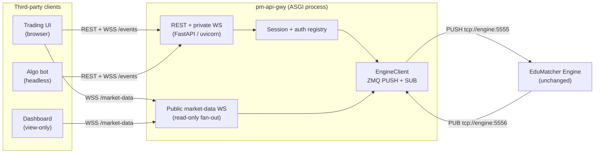

Version: 1.0.0

Date: 2026-06-23

Status: Design Specification


# EduMatcher API Gateway (`pm-api-gwy`)

---

## 1. Purpose and Scope

`pm-api-gwy` is a non-interactive gateway that exposes EduMatcher's
order-entry and order-manipulation capabilities over a REST/JSON + WebSocket
interface, intended for third-party software rather than human operators.

**Target consumers:**

- Web-based trading UIs (browser / JavaScript)
- Web-based dashboards and monitoring tools (view-only)
- Algorithmic trading bots and headless systems

**Design goal:** make it as easy as possible for an external application to
submit, cancel, modify, and observe orders -- with the same semantics a human
gets when typing ALF commands into `pm-gateway`.

**What this gateway is NOT:**

- It is not a thin pass-through of raw ALF text. External clients never see the
  `KEY=VALUE|KEY=VALUE` ALF wire format.
- It is not a new matching engine. All matching logic lives in the engine; this
  is purely a transport layer.

**What does not change:**

- The engine receives the identical ZMQ/JSON messages it always has.
- The `engine_config.yaml` gateway allowlist remains authoritative.
- Order types, TIF values, SMP rules, tick conversion, and event semantics are
  all unchanged.

---

## 2. Running the Gateway

### 2.1 Installation

Add to the project's dependencies and script entry points:

```toml
# pyproject.toml additions:
[tool.poetry.dependencies]
fastapi = ">=0.115"
uvicorn = { version = ">=0.34", extras = ["standard"] }

[tool.poetry.scripts]
pm-api-gwy = "edumatcher.api_gateway.main:main"
```

After `poetry install`, the `pm-api-gwy` command is available.

### 2.2 Command-line options

```
pm-api-gwy [OPTIONS]
```

| Option | Default | Description |
|--------|---------|-------------|
| `--host ADDR` | `127.0.0.1` | Network interface to bind HTTP server to |
| `--port PORT` | `8080` | HTTP listen port |
| `--config PATH` | (auto-resolved) | Path to `api_gateway_config.yaml` |
| `--engine-host HOST` | `127.0.0.1` | Override engine address in ZMQ socket URLs |
| `--stats-db PATH` | `STATS_DB_FILE` | Path to `stats.db` for `/history` endpoints |
| `--log-level LEVEL` | `info` | Logging verbosity: `debug`, `info`, `warning`, `error` |

**Config file resolution priority:**

1. `--config` CLI argument (explicit path)
2. `EDUMATCHER_API_GW_CONFIG` environment variable
3. Same directory as `engine_config.yaml`
4. `./api_gateway_config.yaml` in CWD

**Example:**

```bash
pm-api-gwy --port 9090 --engine-host 10.0.1.5 --log-level debug
```

### 2.3 Configuration file (`api_gateway_config.yaml`)

```yaml
# Credential mapping: API key -> gateway_id (1:1)
credentials:
  - api_key: "key-gw01-abc123def456"
    gateway_id: "GW01"
    description: "Trading UI - desk A"
  - api_key: "key-gw02-789xyz000111"
    gateway_id: "GW02"
    description: "Algo bot - strategy alpha"
  - api_key: "key-readonly-viewer001"
    gateway_id: null              # null = market-data only, no trading
    description: "Dashboard (view-only)"

# Rate limiting (per API key, write endpoints only)
rate_limit:
  writes_per_second: 10
  burst: 20

# Timeouts
timeouts:
  engine_auth_sec: 3.0            # gateway_connect handshake
  engine_reply_sec: 3.0           # await-reply for GET endpoints
  wait_ack_sec: 3.0               # ?wait=ack on write endpoints
```

**Key rules:**

- Each API key maps to exactly one `gateway_id` (1:1). Multiple gateway
  identities require multiple keys.
- Keys with `gateway_id: null` are read-only -- they can connect to
  `/market-data` but cannot submit orders.
- The engine's `engine_config.yaml` allowlist is still authoritative; if a
  `gateway_id` is not in the allowlist, the engine will reject it regardless
  of what this config says.

---

## 3. Architecture

### 3.1 Process topology

`pm-api-gwy` is a single long-running ASGI process (FastAPI + uvicorn). It
holds one pair of ZMQ engine sockets and fans many HTTP/WebSocket clients in and
out over those two sockets.



### 3.2 Engine wiring

| Socket | ZMQ type | Address | Role |
|--------|----------|---------|------|
| Outbound | `PUSH` (connect) | `tcp://{engine-host}:5555` | Send order commands to the engine |
| Inbound | `SUB` (connect) | `tcp://{engine-host}:5556` | Receive events from the engine |

These addresses come from `ENGINE_PULL_ADDR` and `ENGINE_PUB_ADDR` in
`edumatcher.config`, overridable with `--engine-host`.

### 3.3 Multi-tenancy model

Unlike `pm-gateway` (single-tenant: one process = one `gateway_id`),
`pm-api-gwy` is multi-tenant: one process serves many clients, each mapped
to a `gateway_id`.

- Each API key resolves to one `gateway_id`.
- On first use of a `gateway_id`, the process sends `system.gateway_connect`
  and subscribes to that gateway's event topics.
- Inbound events are demultiplexed by the `{GW_ID}` topic suffix and routed to
  the correct client session(s).
- Multiple clients may share one `gateway_id` -- they all see the same events.

### 3.4 Concurrency model

The process runs **two threads:**

| Thread | Responsibility |
|--------|---------------|
| Main (asyncio event loop) | uvicorn HTTP server, request handlers, WebSocket coroutines, future resolution |
| SUB reader (daemon) | Polls ZMQ SUB socket (200 ms interval), decodes events, dispatches to asyncio via `loop.call_soon_threadsafe()` |

**Thread ownership rules:**

- Only the SUB reader thread calls `recv` on the SUB socket.
- Only the asyncio loop calls `send_multipart` on the PUSH socket (naturally
  enforced since all handlers are coroutines).
- `setsockopt(SUBSCRIBE, ...)` is called from the asyncio thread before the
  first poll for that prefix -- ZMQ socket options are thread-safe.

### 3.5 Startup and shutdown lifecycle

**Startup sequence (in `lifespan` context manager):**

1. Load `api_gateway_config.yaml` into `SessionRegistry`
2. Create `EngineClient` (ZMQ PUSH + SUB sockets)
3. Start the SUB reader daemon thread
4. Subscribe to global market-data topics (`book.*`, `trade.executed`,
   `session.state`, `circuit_breaker.*`, `depth.*`)
5. Verify `stats.db` is accessible (for `/history` endpoints)
6. Attach all state to the FastAPI `app.state`

**Shutdown sequence (triggered by SIGINT/SIGTERM via uvicorn):**

1. Send `system.gateway_disconnect` for each active `gateway_id`
2. Set `_running = False` to stop the SUB reader thread
3. Join the SUB reader thread (1 s timeout)
4. Close ZMQ sockets

---

## 4. Authentication and Security

### 4.1 Client authentication

Clients present an API key via HTTP header:

```
Authorization: Bearer <api_key>
```

The gateway maps `api_key -> gateway_id` via the credential store in
`api_gateway_config.yaml`. Unknown keys receive `401 Unauthorized`.

### 4.2 Engine-side authorisation

On first use of a `gateway_id`, the gateway performs the engine handshake:

1. Send `system.gateway_connect {gateway_id}` on the PUSH socket
2. Await `system.gateway_auth.{gateway_id}` on the SUB socket (3 s timeout)
3. If `accepted=false`, return `403 Forbidden` with the engine's `reason`

The engine's allowlist in `engine_config.yaml` is the single source of truth.

### 4.3 Rate limiting

- Token-bucket rate limiter: configurable `writes_per_second` and `burst` per
  API key.
- Applied only to write endpoints (POST, DELETE, PATCH).
- Read endpoints, WebSocket connections, and `/healthz` are not rate-limited.
- Exceeded limits return `429 Too Many Requests`.

### 4.4 Additional DMZ controls

- **Request size limits:** strict schema validation, reject unknown fields.
- **Audit logging:** every accepted command logged with api_key id, gateway_id,
  order_id, and source IP.
- **No internals exposed:** raw ZMQ addresses and tick values never appear in
  error responses.
- **TLS:** terminated in front of the gateway (reverse proxy or uvicorn TLS).

---

## 5. Domain Model

All values mirror the existing enums in `edumatcher.models.order`.

| Concept | Values |
|---------|--------|
| `side` | `BUY`, `SELL` |
| `order_type` | `MARKET`, `LIMIT`, `STOP`, `STOP_LIMIT`, `FOK`, `ICEBERG`, `IOC`, `TRAILING_STOP` (plus composite `OCO`, `COMBO`) |
| `tif` | `DAY`, `GTC`, `ATO`, `ATC` |
| `smp_action` | `NONE`, `CANCEL_AGGRESSOR`, `CANCEL_RESTING`, `CANCEL_BOTH` |
| `status` | `NEW`, `PARTIAL`, `FILLED`, `CANCELLED`, `REJECTED`, `EXPIRED` |

### 5.1 Prices

Clients send **display prices** (e.g. `150.50`) as JSON numbers. The gateway
converts to integer **ticks** via `to_ticks(price, symbol)` before pushing to
the engine. Event prices are converted back with `from_ticks()` before delivery
to clients. The tick registry is populated from `system.symbols` metadata
(`tick_decimals` per symbol) on first gateway authentication.

### 5.2 Order identity

The gateway generates the order UUID server-side (via `Order.create()`) and
returns it synchronously in the `202` response. The client can immediately use
this `order_id` for cancel/amend without waiting for the async `order.ack`.

---

## 6. REST API

Base path: `/api/v1`. All request and response bodies are JSON. All write
endpoints require a trading-capable API key (non-null `gateway_id`).

### 6.1 Endpoint summary

| Method | Path | Purpose |
|--------|------|---------|
| `POST` | `/orders` | Submit a single order |
| `DELETE` | `/orders/{order_id}` | Cancel one order |
| `PATCH` | `/orders/{order_id}` | Amend price and/or quantity |
| `POST` | `/orders/{order_id}/replace` | Atomic cancel-replace |
| `GET` | `/orders` | List this gateway's live orders |
| `GET` | `/orders/{order_id}` | Get one cached order |
| `POST` | `/oco` | Submit an OCO pair |
| `DELETE` | `/oco/{oco_id}` | Cancel an OCO pair |
| `POST` | `/combos` | Submit a multi-leg combo |
| `DELETE` | `/combos/{combo_id}` | Cancel a combo + legs |
| `POST` | `/quotes` | Submit a two-sided MM quote |
| `DELETE` | `/quotes/{symbol}` | Cancel active quote for symbol |
| `POST` | `/mass-cancel` | Bulk cancel (optionally per symbol) |
| `POST` | `/kill-switch` | Alias of `/mass-cancel` |
| `GET` | `/symbols` | List instruments + metadata |
| `GET` | `/session` | Current session state |
| `GET` | `/quotes/bootstrap` | Active quote state |
| `GET` | `/quotes/legs` | MM quote legs + fill flags |
| `GET` | `/positions` | Net position + P and L per symbol |
| `GET` | `/status` | Gateway/session summary |
| `GET` | `/history/orders` | Historical order events |
| `GET` | `/history/orders/{order_id}` | Full lifecycle of one order |
| `GET` | `/history/fills` | Historical fills |
| `GET` | `/history/trades` | Public trade log |
| `GET` | `/history/daily` | Daily OHLCV statistics |
| `GET` | `/healthz` | Liveness/readiness probe |

### 6.2 Synchronous vs. asynchronous responses

The engine is fire-and-forget over PUSH; results return as PUB events. Two
response modes are offered on write endpoints:

- **Default (async):** respond `202 Accepted` immediately with the
  server-generated id and `PENDING` status. The authoritative outcome arrives
  on the `/events` WebSocket.
- **`?wait=ack` (sync):** the handler registers a one-shot future and blocks
  (up to a configurable timeout) until the matching ack event arrives, then
  returns the resolved status in the HTTP response.

### 6.3 Order submission (`POST /orders`)

**Request body:**

```jsonc
{
  "symbol": "AAPL",
  "side": "BUY",
  "order_type": "LIMIT",
  "quantity": 100,
  "tif": "DAY",
  "price": 150.50,
  "stop_price": null,
  "visible_qty": null,
  "trail_offset": null,
  "smp_action": "NONE",
  "client_order_id": "ui-42"
}
```

**Conditional field rules:**

| `order_type` | Required | Forbidden |
|--------------|----------|-----------|
| `MARKET` | -- | `price`, `stop_price` |
| `LIMIT` / `FOK` / `IOC` | `price` | `stop_price` |
| `STOP` | `stop_price` | `price` |
| `STOP_LIMIT` | `stop_price`, `price` | -- |
| `ICEBERG` | `price`, `visible_qty` (less than `quantity`) | -- |
| `TRAILING_STOP` | `trail_offset` | `price` |

**Response `202 Accepted`:**

```jsonc
{
  "order_id": "ORD-7f3c...",
  "client_order_id": "ui-42",
  "status": "PENDING",
  "accepted": null
}
```

### 6.4 Order cancel (`DELETE /orders/{order_id}`)

**Response `202 Accepted`:**
`{ "order_id": "...", "status": "PENDING_CANCEL" }`

### 6.5 Order amend (`PATCH /orders/{order_id}`)

At least one of `price` or `quantity` must be present:

```jsonc
{ "price": 151.00, "quantity": 200 }
```

Priority semantics: qty-decrease at same price preserves priority; price change
or qty increase resets priority.

### 6.6 Cancel-replace (`POST /orders/{order_id}/replace`)

Atomically cancels the existing order, awaits confirmation, then submits a
replacement. If the cancel fails (already filled/cancelled), the replacement
is not submitted.

**Request body:** same as `POST /orders` minus `symbol` (inherited).

**Response `202 Accepted`:**

```jsonc
{
  "cancelled_order_id": "ORD-7f3c...",
  "replacement_order_id": "ORD-a1b2...",
  "status": "PENDING"
}
```

### 6.7 OCO pair (`POST /oco`)

```jsonc
{
  "oco_id": "tp-sl-1",
  "symbol": "AAPL",
  "quantity": 100,
  "tif": "DAY",
  "leg1": { "side": "SELL", "order_type": "LIMIT", "price": 152.00 },
  "leg2": { "side": "SELL", "order_type": "STOP", "stop_price": 147.00 }
}
```

### 6.8 Multi-leg combo (`POST /combos`)

```jsonc
{
  "combo_id": "spread-1",
  "combo_type": "AON",
  "tif": "DAY",
  "smp_action": "NONE",
  "legs": [
    { "symbol": "AAPL", "side": "BUY", "order_type": "LIMIT",
      "quantity": 100, "price": 150.00 },
    { "symbol": "MSFT", "side": "SELL", "order_type": "LIMIT",
      "quantity": 100, "price": 410.00 }
  ]
}
```

Constraints: 2-10 legs; each leg requires `symbol`, `side`, `quantity`.

### 6.9 Market-maker quote (`POST /quotes`)

```jsonc
{
  "symbol": "AAPL",
  "bid_price": 150.00, "bid_qty": 500,
  "ask_price": 150.10, "ask_qty": 500,
  "tif": "DAY",
  "quote_id": "mm-aapl-1"
}
```

Validation: `bid_qty > 0`, `ask_qty > 0`, `bid_price < ask_price`.

### 6.10 Mass cancel (`POST /mass-cancel`)

```jsonc
{ "symbol": "AAPL" }   // omit for all symbols
```

This call is **synchronous** -- it awaits the engine ack and returns counts:

```jsonc
{
  "accepted": true,
  "scope": "AAPL",
  "cancelled_orders": 12,
  "cancelled_quotes": 1
}
```

`POST /kill-switch` is an exact alias.

### 6.11 Read endpoints

**Engine-query endpoints** (send request, await reply, 3 s timeout):

| Endpoint | Engine topic |
|----------|-------------|
| `GET /orders` | `order.orders_request` |
| `GET /symbols` | `system.symbols_request` |
| `GET /session` | `system.session_state_request` |
| `GET /quotes/bootstrap` | `system.quote_bootstrap_request` |

**Session-cache endpoints** (served from local state, no engine round-trip):

| Endpoint | Source |
|----------|--------|
| `GET /quotes/legs` | Quote-leg cache (fed by `quote.ack`, `quote.status`, fills) |
| `GET /positions` | Position cache (fed by `order.fill`) |
| `GET /status` | All caches aggregated |
| `GET /orders/{id}` | Order cache |

### 6.12 Error model

| HTTP status | Condition |
|-------------|-----------|
| `400` | Schema/validation failure |
| `401` | Missing or invalid API key |
| `403` | Engine rejected the gateway_id |
| `404` | Unknown order/combo/oco in cache |
| `409` | Duplicate `client_order_id` in session |
| `429` | Rate limit exceeded |
| `503` | Engine reply timeout |

Error body:
```jsonc
{ "error": { "code": "VALIDATION", "message": "...", "field": "price" } }
```

---

## 7. WebSocket: Private Event Stream (`/events`)

The `/events` endpoint delivers real-time private events for the authenticated
gateway: order acks, fills, cancellations, amendments, expirations.

### 7.1 Connection lifecycle

1. Client opens WebSocket to `/api/v1/events`
2. Client sends auth message: `{ "api_key": "..." }`  (5 s timeout)
3. Server validates key, performs engine auth handshake if needed
4. Server confirms: `{ "type": "authenticated", "gateway_id": "GW01" }`
5. Server streams events until disconnect

**Backpressure:** events are buffered in an `asyncio.Queue(maxsize=256)`. If a
slow client causes the queue to fill, events are dropped (or the connection is
closed).

### 7.2 Subscription topics

The gateway subscribes to these ZMQ topics per active `gateway_id`:

```
order.ack.{GW}          order.fill.{GW}
order.amended.{GW}      order.cancelled.{GW}
order.expired.{GW}      order.orders.{GW}
combo.ack.{GW}          combo.status.{GW}
oco.ack.{GW}            oco.cancelled.{GW}
quote.ack.{GW}          quote.status.{GW}
risk.kill_switch_ack.{GW}
system.symbols.{GW}     system.quote_bootstrap.{GW}
system.session_status.{GW}
trade.executed           (global, filtered to client symbols)
```

### 7.3 Event envelope

All events use a uniform JSON envelope:

```jsonc
{
  "type": "order.fill",
  "ts": "2026-06-22T10:15:03.221Z",
  "gateway_id": "GW01",
  "data": {
    "order_id": "ORD-...",
    "fill_qty": 50,
    "fill_price": 150.50,
    "remaining_qty": 50,
    "status": "PARTIAL"
  }
}
```

### 7.4 Event type mapping

| Engine topic | WS `type` | Key `data` fields |
|--------------|-----------|-------------------|
| `order.ack.{GW}` | `order.ack` | `order_id`, `accepted`, `reason`, `symbol`, `side` |
| `order.fill.{GW}` | `order.fill` | `order_id`, `fill_qty`, `fill_price`, `remaining_qty`, `status`, `trade_id` |
| `order.amended.{GW}` | `order.amended` | `order_id`, `price`, `quantity`, `remaining_qty`, `priority_reset` |
| `order.cancelled.{GW}` | `order.cancelled` | `order_id`, `reason` |
| `order.expired.{GW}` | `order.expired` | `order_id` |
| `combo.ack.{GW}` | `combo.ack` | `combo_id`, `accepted`, `reason` |
| `oco.ack.{GW}` | `oco.ack` | `oco_id`, `accepted`, `reason` |
| `quote.ack.{GW}` | `quote.ack` | `quote_id`, `symbol`, `accepted` |
| `quote.status.{GW}` | `quote.status` | `quote_id`, `state` |
| `risk.kill_switch_ack.{GW}` | `mass_cancel.ack` | `accepted`, `cancelled_orders`, `cancelled_quotes` |
| `trade.executed` | `trade` | `symbol`, `price`, `quantity`, `aggressor_side` |

### 7.5 Derived session caches

The gateway folds events into per-`gateway_id` caches as they stream through:

| Cache | Fed by | Serves |
|-------|--------|--------|
| Order cache | ack, fill, amended, cancelled, expired | `GET /orders/{id}`, `/status` |
| Quote-leg cache | quote.ack, quote.status, fills | `GET /quotes/legs` |
| Position cache | order.fill | `GET /positions` |
| Last-price map | trade.executed | Unrealised P and L |
| Known-symbols | system.symbols | `/status` |

Caches are shared across all sessions authenticated as the same gateway_id.

---

## 8. WebSocket: Public Market Data (`/market-data`)

The `/market-data` endpoint delivers real-time public market data: book
snapshots, trade ticks, depth metrics, session state, and circuit breaker
alerts. It is separate from `/events` because it requires no `gateway_id` and
is read-only.

### 8.1 Connection lifecycle

1. Client opens WebSocket to `/api/v1/market-data`
2. Client sends auth: `{ "api_key": "..." }` (any valid key, including
   read-only keys with `gateway_id: null`)
3. Server confirms authentication
4. Client sends subscribe/unsubscribe control frames
5. Server streams matching events

### 8.2 Subscription control

```jsonc
{ "action": "subscribe", "symbols": ["AAPL", "MSFT"],
  "channels": ["book", "trades", "depth"] }

{ "action": "unsubscribe", "symbols": ["MSFT"], "channels": ["depth"] }
```

Session state and circuit breaker events are always delivered (no opt-in).

### 8.3 Available channels

| Channel | Engine source | Content |
|---------|--------------|---------|
| `book` | `book.{SYMBOL}` | Full book snapshot (bid/ask levels, last price) |
| `trades` | `trade.executed` | Individual trade ticks |
| `depth` | `depth.{SYMBOL}` | Depth metrics (imbalance, bid/ask depth) |
| `session` | `session.state` | Always on -- state transitions |
| `circuit_breaker` | `circuit_breaker.*` | Always on -- halt/resume alerts |

### 8.4 Event payloads

**Book snapshot** (throttled, max ~2/s per symbol):

```jsonc
{
  "type": "book", "ts": "...",
  "data": {
    "symbol": "AAPL",
    "bids": [{ "price": 150.00, "qty": 100, "count": 2 }],
    "asks": [{ "price": 150.10, "qty": 50, "count": 1 }],
    "last_price": 150.05, "last_qty": 10
  }
}
```

**Trade tick:**

```jsonc
{
  "type": "trade", "ts": "...",
  "data": {
    "id": "TRD-...", "symbol": "AAPL",
    "price": 150.05, "quantity": 10, "aggressor_side": "BUY"
  }
}
```

**Depth metrics:**

```jsonc
{
  "type": "depth", "ts": "...",
  "data": {
    "symbol": "AAPL", "mid_price": 150.05,
    "bid_depth": 500, "ask_depth": 300,
    "imbalance": 0.25, "cost_to_move": 500
  }
}
```

**Session state:**

```jsonc
{
  "type": "session", "ts": "...",
  "data": { "state": "CONTINUOUS", "prev_state": "OPENING_AUCTION" }
}
```

**Circuit breaker:**

```jsonc
{
  "type": "circuit_breaker", "ts": "...",
  "data": {
    "action": "HALT", "symbol": "AAPL",
    "trigger_price": 145.00, "reference_price": 150.00,
    "level": 1, "resume_at": "...", "resumption_mode": "AUCTION"
  }
}
```

**Privacy:** gateway IDs and order IDs are not included in the public trade or
book streams.

### 8.5 Relationship to CALF market data gateway

The existing `pm-md-gateway` serves the same engine topics over CALF/TCP for
low-latency native clients. `/market-data` serves the same data over
WebSocket/JSON for browser and bot consumers. Both are read-only fan-out
layers; neither requires engine changes.

---

## 9. Order History (extending `pm-stats`)

### 9.1 Problem

`GET /orders` returns the engine's live in-memory snapshot. Once the session
ends or the engine restarts, that state is gone. Dashboards and compliance
tools need durable historical queries ("all fills from yesterday").

### 9.2 Solution: extend `pm-stats`

The `pm-stats` service already subscribes to the engine PUB bus and writes
structured data to `data/stats.db` (SQLite). We extend it with an
`order_events` table to capture the full order lifecycle.

### 9.3 New table schema

```sql
CREATE TABLE IF NOT EXISTS order_events (
    seq             INTEGER PRIMARY KEY AUTOINCREMENT,
    ts              TEXT NOT NULL,
    event_type      TEXT NOT NULL,
    order_id        TEXT NOT NULL,
    gateway_id      TEXT NOT NULL,
    symbol          TEXT NOT NULL,
    side            TEXT,
    order_type      TEXT,
    tif             TEXT,
    price           REAL,
    quantity        INTEGER,
    remaining_qty   INTEGER,
    status          TEXT,
    fill_price      REAL,
    fill_qty        INTEGER,
    trade_id        TEXT,
    reason          TEXT,
    client_order_id TEXT,
    combo_parent_id TEXT,
    oco_group_id    TEXT,
    priority_reset  INTEGER
);

CREATE INDEX IF NOT EXISTS idx_oe_order_id ON order_events(order_id);
CREATE INDEX IF NOT EXISTS idx_oe_gateway_ts ON order_events(gateway_id, ts);
CREATE INDEX IF NOT EXISTS idx_oe_symbol_ts ON order_events(symbol, ts);
CREATE INDEX IF NOT EXISTS idx_oe_type_ts ON order_events(event_type, ts);
```

### 9.4 New ZMQ subscriptions for `pm-stats`

Added topic prefixes (ZMQ prefix matching captures all gateways):

```
order.ack.        order.fill.       order.amended.
order.cancelled.  order.expired.
combo.ack.        combo.status.
oco.ack.          oco.cancelled.
quote.ack.        quote.status.
```

### 9.5 Topic to event_type mapping

| Topic prefix | `event_type` |
|--------------|--------------|
| `order.ack.` | `ACK` or `REJECT` (based on `accepted` field) |
| `order.fill.` | `FILL` |
| `order.amended.` | `AMEND` |
| `order.cancelled.` | `CANCEL` |
| `order.expired.` | `EXPIRE` |

### 9.6 History API endpoints

All `/history/*` endpoints open `stats.db` in read-only mode. Gateway scope is
enforced: a client can only query history for its own `gateway_id`.

**`GET /history/orders`** -- query params: `?symbol=`, `?event_type=`,
`?date=`, `?from=`, `?to=`, `?limit=` (default 500, max 5000).

```jsonc
{
  "events": [
    { "seq": 1042, "ts": "...", "event_type": "FILL",
      "order_id": "ORD-...", "symbol": "AAPL",
      "fill_price": 150.50, "fill_qty": 50,
      "remaining_qty": 50, "status": "PARTIAL", "trade_id": "TRD-..." }
  ],
  "count": 1, "has_more": false
}
```

**`GET /history/orders/{order_id}`** -- full lifecycle (all events,
chronological).

**`GET /history/fills`** -- convenience: pre-filtered to `event_type=FILL`.

**`GET /history/trades`** -- public trade log (wraps existing
`query_trades()`). Not gateway-scoped.

**`GET /history/daily`** -- OHLCV statistics (wraps existing `query_daily()`).
Not gateway-scoped.

### 9.7 Retention

SQLite file grows approximately 1 KB per order event. At 10 events/s sustained,
that is approximately 30 MB/day -- negligible. No automatic purging; a future
`pm-stats-cli purge --before DATE` command can be added if needed.

---

## 10. Engine Message Mapping

Every REST write call translates to one or more ZMQ messages using the existing
builders in `edumatcher.models.message`.

| REST call | Builder function | ZMQ topic |
|-----------|-----------------|-----------|
| `POST /orders` | `make_order_new_msg` | `order.new` |
| `DELETE /orders/{id}` | `make_order_cancel_msg` | `order.cancel` |
| `PATCH /orders/{id}` | `make_order_amend_msg` | `order.amend` |
| `POST /orders/{id}/replace` | `make_order_cancel_msg` then `make_order_new_msg` | `order.cancel` then `order.new` |
| `POST /oco` | `make_oco_order_msg` | `order.oco` |
| `DELETE /oco/{id}` | `make_oco_cancel_msg` | `order.oco_cancel` |
| `POST /combos` | `make_combo_order_msg` | `order.combo` |
| `DELETE /combos/{id}` | `make_combo_cancel_msg` | `order.combo_cancel` |
| `POST /quotes` | `make_quote_new_msg` | `quote.new` |
| `DELETE /quotes/{sym}` | `make_quote_cancel_msg` | `quote.cancel` |
| `POST /mass-cancel` | `make_kill_switch_msg` | `risk.kill_switch` |
| `GET /orders` | `make_orders_request_msg` | `order.orders_request` |
| `GET /symbols` | `make_symbols_request_msg` | `system.symbols_request` |
| `GET /session` | `make_session_state_request_msg` | `system.session_state_request` |
| `GET /quotes/bootstrap` | `make_quote_bootstrap_request_msg` | `system.quote_bootstrap_request` |

The ZMQ wire format is always two frames: `[topic_bytes, json_payload_bytes]`,
produced by `encode(topic, payload_dict)` and consumed by `decode(frames)`.

---

## 11. Code Structure

### 11.1 Package layout

```
src/edumatcher/api_gateway/
  __init__.py
  main.py              # CLI arg parsing, create_app(), uvicorn launcher
  engine_client.py     # EngineClient: ZMQ PUSH+SUB, SUB reader thread,
                       #   event dispatch, await-reply futures
  sessions.py          # SessionRegistry, auth dependency, Session dataclass
  schemas.py           # Pydantic request/response models
  translate.py         # JSON model -> Order/engine message dict
  caches.py            # Per-gateway session caches (orders, quotes, positions)
  rate_limit.py        # Token-bucket rate limiter
  market_data.py       # Market-data subscription state + fan-out logic
  events.py            # PUB topic -> WS envelope mapping
  routers/
    orders.py          # POST/DELETE/PATCH/GET /orders, /orders/{id}/replace
    oco.py             # /oco
    combos.py          # /combos
    quotes.py          # /quotes, /quotes/bootstrap, /quotes/legs
    risk.py            # /mass-cancel, /kill-switch
    reference.py       # /symbols, /session, /positions, /status, /healthz
    events.py          # GET /events WebSocket endpoint
    market_data.py     # GET /market-data WebSocket endpoint
    history.py         # GET /history/* endpoints
```

### 11.2 Key class: `EngineClient`

Central component that owns the two ZMQ sockets and the background SUB reader.

```python
class EngineClient:
    def __init__(self, pull_addr: str, pub_addr: str): ...

    # Lifecycle
    def start_listener(self) -> None: ...
    def stop_listener(self) -> None: ...
    def close(self) -> None: ...

    # Auth
    async def authenticate(self, gateway_id: str) -> tuple[bool, str]: ...
    def is_authenticated(self, gateway_id: str) -> bool: ...
    def active_gateways(self) -> set[str]: ...
    def send_disconnect(self, gw: str, reason: str) -> None: ...

    # Commands (called from route handlers)
    def send_new_order(self, order: Order) -> None: ...
    def send_cancel(self, order_id: str, gw: str) -> None: ...
    def send_amend(self, order_id: str, gw: str, **kw) -> None: ...
    # ... (one method per message type)

    # Await-reply (for sync endpoints and ?wait=ack)
    async def await_ack(self, kind: str, id: str,
                        timeout: float) -> dict: ...
    async def request_symbols(self, gw: str) -> dict: ...

    # Event sinks
    def add_sink(self, gw: str, queue: asyncio.Queue) -> None: ...
    def remove_sink(self, gw: str, queue: asyncio.Queue) -> None: ...
    def add_market_data_sink(self, queue: asyncio.Queue) -> None: ...
    def remove_market_data_sink(self, queue: asyncio.Queue) -> None: ...

    # Caches
    def get_caches(self, gw: str) -> SessionCaches: ...
```

### 11.3 Key class: `SessionRegistry`

```python
@dataclass
class Credential:
    api_key: str
    gateway_id: str | None
    description: str

class SessionRegistry:
    @classmethod
    def from_config(cls, config: dict) -> "SessionRegistry": ...
    def get(self, api_key: str) -> Credential | None: ...
```

### 11.4 Authentication dependency

```python
async def auth(request: Request,
               authorization: str = Header(...)) -> Session:
    """Extracts Bearer token, resolves gateway_id, ensures engine
    auth. Returns Session(gateway_id, engine, caches)."""
```

### 11.5 Existing code to reuse

| Module | What it provides |
|--------|-----------------|
| `edumatcher.models.message` | All `make_*_msg()` builders, `encode()`, `decode()` |
| `edumatcher.models.order` | `Order.create()`, enums (`Side`, `OrderType`, `TIF`, `SmpAction`) |
| `edumatcher.models.combo` | `ComboOrder` |
| `edumatcher.models.price` | `to_ticks()`, `from_ticks()`, `register_tick_decimals()` |
| `edumatcher.messaging.bus` | `make_pusher()`, `make_subscriber()` |
| `edumatcher.config` | `ENGINE_PULL_ADDR`, `ENGINE_PUB_ADDR`, `STATS_DB_FILE` |
| `edumatcher.stats.query` | `query_trades()`, `query_daily()`, `open_readonly_connection()` |

---

## 12. Testing Strategy

### 12.1 Unit tests (no network)

| Target | What to test |
|--------|-------------|
| `schemas.py` | Pydantic validation: valid inputs, conditional field rules, bad enums, missing fields |
| `translate.py` | `build_order()` produces correct `Order` dicts; tick conversion called correctly |
| `caches.py` | Feed mock events, assert cache state transitions |
| `rate_limit.py` | Token bucket: consume, refill timing, burst capacity |
| `sessions.py` | Config parsing, key lookup, unknown key returns None |

### 12.2 Integration tests (mock ZMQ engine)

Create PULL + PUB sockets on random ports simulating the engine:

- `POST /orders` -> assert mock PULL receives correct `order.new` message
- Publish `order.ack.GW01` on mock PUB -> assert WS client receives event
- `?wait=ack`: publish ack after delay -> assert HTTP response resolves
- Auth handshake: publish `system.gateway_auth.GW01` -> verify `auth()` passes

### 12.3 End-to-end tests (real engine)

Start `pm-engine` + `pm-api-gwy` in subprocesses. Submit order, verify ack
and fill arrive on WebSocket. Use `httpx.AsyncClient` for REST, `websockets`
library for WS.

---

## 13. Error Handling

| Failure | Behavior |
|---------|----------|
| Engine PUSH disconnected | ZMQ queues messages (HWM 1000). `/healthz` reports unhealthy if sustained. |
| Engine SUB disconnected | ZMQ reconnects automatically. Events lost in gap. |
| Engine auth timeout | Return `503`. Do not cache failure. |
| Engine reply timeout | Return `503`. Log. |
| WS client disconnects | Caught. Remove sink. No other cleanup. |
| Invalid JSON from client | `400` (REST) or close WS code 4000. |
| stats.db missing | `/history/*` returns `503`. Other endpoints unaffected. |
| Unknown symbol | Default 2 tick decimals. Engine rejects with proper error. |

---

## 14. Implementation Roadmap

Build incrementally. Each phase produces a working, testable slice.

| Phase | Deliverable | Verify |
|-------|-------------|--------|
| 1 | Skeleton: `main.py`, `EngineClient`, `SessionRegistry`, `/healthz` | Process starts, healthz returns 200 |
| 2 | `POST /orders` + `/events` WebSocket | Submit order via curl, receive ack on WS |
| 3 | Cancel, amend, replace, `GET /orders`, `?wait=ack` | Full order lifecycle |
| 4 | OCO, combos, quotes, mass-cancel | Composite order types work |
| 5 | Session caches + read endpoints | `/positions`, `/quotes/legs`, `/status` reflect live state |
| 6 | `/market-data` WebSocket | Subscribe, receive book updates |
| 7 | `/history/*` endpoints | Query historical fills from stats.db |
| 8 | Rate limiter, audit logging, size limits, full test suite | `make check` and `make test` pass |

---

## 15. Design Decisions (settled)

For the record, the following decisions were evaluated and settled during the
design phase:

1. **Transport:** Full REST API (not ALF text wrapper) for ergonomics and
   browser compatibility.
2. **Event delivery:** WebSocket for both private events and public market data.
   SSE rejected (no bidirectional control). Long-poll rejected (latency).
3. **Shared code:** Extract `build_order` / leg parsing into a shared module
   (`edumatcher.models.builders`) used by both `pm-gateway` and
   `pm-api-gwy`.
4. **Credential store:** YAML config file, 1:1 API key to gateway_id mapping.
5. **History:** Extend `pm-stats` with `order_events` table (not a new
   service).
6. **Amend model:** PATCH for in-place amends + cancel-replace endpoint for
   atomic replacement.
7. **Rate limits:** approximately 10 writes/second per key (token bucket,
   gateway-local).
