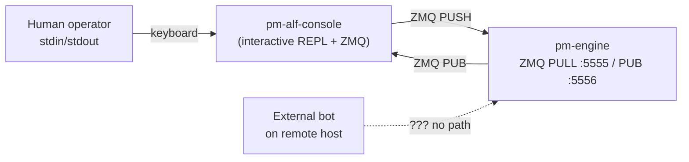
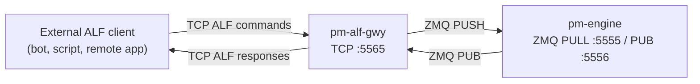
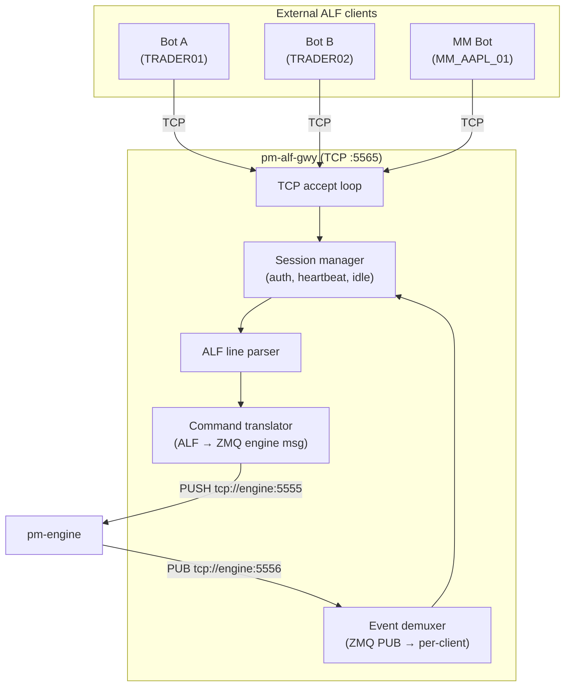
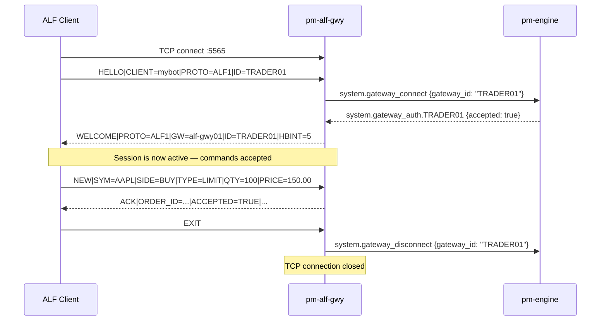
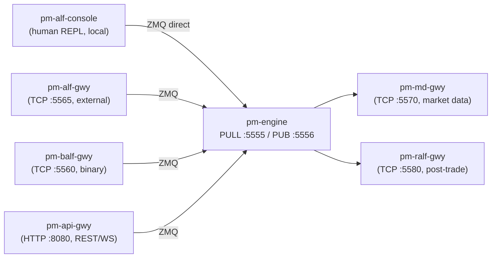

Version: 1.0.0

Date: 2026-07-02

Status: Design and Research Proposal


# EduMatcher — ALF TCP Gateway (`pm-alf-gwy`)

---

## Table of Contents

1. [Motivation](#1-motivation)
2. [Problem Statement](#2-problem-statement)
3. [Goals and Non-Goals](#3-goals-and-non-goals)
4. [Current State](#4-current-state)
5. [Architecture](#5-architecture)
6. [Transport and Connection Model](#6-transport-and-connection-model)
7. [Session Lifecycle](#7-session-lifecycle)
8. [ALF Protocol Parsing](#8-alf-protocol-parsing)
9. [Command Dispatch and Engine Integration](#9-command-dispatch-and-engine-integration)
10. [Response and Event Delivery](#10-response-and-event-delivery)
11. [Error Handling and Robustness](#11-error-handling-and-robustness)
12. [Security Considerations](#12-security-considerations)
13. [Configuration Reference](#13-configuration-reference)
14. [Operational Monitoring](#14-operational-monitoring)
15. [Integration with Existing Processes](#15-integration-with-existing-processes)
16. [Implementation Plan](#16-implementation-plan)
17. [Testing Plan](#17-testing-plan)
18. [Summary](#18-summary)

---

## 1. Motivation

The existing `pm-alf-console` process is an **interactive terminal** that combines
three concerns in one:

1. A local stdin/stdout REPL with tab completion and command history
2. An ALF command parser
3. A direct ZeroMQ client connected to the engine's PULL/PUB sockets

This design works well for human operators sitting at the same machine as the
engine, but it has fundamental limitations when an external application on a
different host needs to submit orders:

| Limitation | Impact |
|-----------|--------|
| stdin/stdout coupling | Cannot accept network connections |
| No TCP listener | External clients have no way to connect |
| Single user per process | One `pm-alf-console` instance = one operator |
| Direct ZMQ access | External systems would need ZMQ bindings and internal knowledge |
| No session protection | No heartbeat, no idle timeout, no connection limits |
| No network-level error handling | Malformed input crashes the process or is silently ignored |

Other EduMatcher protocol gateways (`pm-md-gwy` for CALF, `pm-ralf-gwy` for
RALF) have already solved this pattern: they accept TCP connections from external
clients, speak a text protocol, and translate between that protocol and the
internal ZMQ bus. `pm-alf-gwy` applies the same architecture to order entry.

### What changes

- A new process, `pm-alf-gwy`, accepts TCP connections on a configurable port.
- External clients connect via TCP and speak the **existing ALF text protocol**
  as defined in [Appendix: ALF Protocol Reference](../docs/user-guide/90-app-alf-protocol.md).
- The gateway translates ALF commands into ZMQ engine messages (identical to
  what `pm-alf-console` produces today).
- Engine responses are translated back into ALF-style response lines and pushed
  to the connected client over TCP.

### What does NOT change

- The matching engine is unchanged.
- The ALF protocol grammar is unchanged — the same commands, same fields, same
  semantics.
- The `engine_config.yaml` gateway allowlist remains authoritative.
- `pm-alf-console` (the interactive REPL) continues to exist for local human use.
- Order types, TIF values, SMP rules, and tick conversion are unchanged.

---

## 2. Problem Statement

External applications (bots, web backends, third-party integrations) that want
to send ALF commands today must either:

1. Spawn a `pm-alf-console` subprocess and drive it via stdin/stdout piping — fragile,
   latency-prone, and impossible from a remote host.
2. Use the REST API gateway (`pm-api-gwy`) — which speaks JSON, not ALF, and
   adds HTTP overhead that some integrations do not want.
3. Implement a direct ZMQ client — which requires knowledge of internal message
   formats and cannot be offered safely to external parties.

None of these options provide what a simple external ALF-speaking bot needs: a
plain TCP socket where you send `NEW|SYM=AAPL|SIDE=BUY|...` and receive
`ACK|ORDER_ID=...|ACCEPTED=TRUE` back.

---

## 3. Goals and Non-Goals

### 3.1 Goals

- Accept TCP connections from external ALF clients on a configurable port.
- Authenticate each connection against the engine's gateway allowlist.
- Parse ALF commands with the same rules as `pm-alf-console` (case-insensitive,
  pipe-delimited, last-value-wins for duplicates).
- Translate commands into engine ZMQ messages and deliver responses back as
  ALF-formatted lines.
- Support multiple concurrent client connections (one gateway ID per connection).
- Provide heartbeat and idle-timeout session management.
- Handle all malformed input gracefully without crashing.
- Protect the engine from slow or malicious clients.
- Log all connection and command activity for audit.

### 3.2 Non-Goals

- No interactive features (tab completion, command history, rich tables).
- No BALF binary protocol support (that is `pm-balf-gateway`).
- No market data dissemination (that is `pm-md-gwy` / CALF).
- No post-trade feed (that is `pm-ralf-gwy` / RALF).
- No TLS termination inside the gateway (use a reverse proxy or stunnel).
- No multi-leg combo or OCO extensions beyond what ALF already defines.
- No changes to the matching engine.

---

## 4. Current State



The external bot has no direct path. `pm-alf-gwy` fills that gap:



---

## 5. Architecture

### 5.1 Process topology

`pm-alf-gwy` is a single long-running process. It holds one pair of ZMQ engine
sockets and multiplexes many TCP client connections through them.



### 5.2 Engine wiring

| Socket | ZMQ type | Address | Role |
|--------|----------|---------|------|
| Outbound | `PUSH` (connect) | `tcp://{engine_host}:5555` | Send order/quote/admin commands |
| Inbound | `SUB` (connect) | `tcp://{engine_host}:5556` | Receive acks, fills, cancels, session events |

### 5.3 Concurrency model

The gateway uses a **single-threaded event loop** (select/poll-based) that
handles:

- TCP accept for new connections
- TCP read for each connected client
- ZMQ SUB poll for engine events
- Periodic timer ticks for heartbeat and idle-timeout checks

This is the same concurrency pattern used by `pm-md-gwy` and `pm-ralf-gwy`.
Single-threaded design eliminates race conditions and makes the code easier to
reason about for educational purposes.

### 5.4 Per-client state

Each connected client has a `ClientSession` object:

```python
@dataclass
class ClientSession:
    sock: socket.socket
    addr: tuple[str, int]
    gateway_id: str | None = None
    authenticated: bool = False
    subscriptions: set[str] = field(default_factory=set)
    out_queue: deque[bytes] = field(default_factory=deque)
    in_buffer: bytearray = field(default_factory=bytearray)
    last_activity: float = 0.0
    lines_received: int = 0
    lines_sent: int = 0
    errors: int = 0
```

---

## 6. Transport and Connection Model

### 6.1 TCP fundamentals

| Property | Value |
|----------|-------|
| Transport | TCP (stream) |
| Default port | `5565` (proposed; configurable) |
| Encoding | UTF-8 text lines |
| Line delimiter | `\n` (LF, 0x0A) |
| Max line length | 4096 bytes (reject lines exceeding this) |
| Max connections | Configurable (default: 64) |
| Bind address | Configurable (`127.0.0.1` for local, `0.0.0.0` for network) |

### 6.2 Connection limits

The gateway enforces a maximum number of simultaneous TCP connections
(`max_connections`). When the limit is reached, new connections are accepted
and immediately closed with no response. This prevents resource exhaustion.

### 6.3 One gateway ID per connection

Each TCP connection authenticates as exactly **one** gateway ID. A second
connection attempting to authenticate with the same gateway ID is rejected with
`ERR|CODE=GATEWAY_ALREADY_CONNECTED`. This prevents conflicting order state.

### 6.4 TCP buffering discipline

TCP is a byte stream, not a message stream. The gateway MUST:

1. Accumulate received bytes in a per-client buffer.
2. Split on `\n` to extract complete lines.
3. Process each complete line independently.
4. Never assume one `recv()` equals one command.
5. Never assume a command fits in one `recv()`.

This is critical for correctness when clients send commands in rapid succession
or when network fragmentation splits a single command across multiple TCP
segments.

### 6.5 TCP_NODELAY

The gateway sets `TCP_NODELAY` on all accepted connections to disable Nagle's
algorithm. Responses should be delivered immediately without waiting for
additional data to batch.

---

## 7. Session Lifecycle

### 7.1 Connection and authentication



### 7.2 HELLO message (required first message)

The first line from a client MUST be a `HELLO`:

```text
HELLO|CLIENT=<name>|PROTO=ALF1|ID=<gateway_id>
```

| Field | Required | Description |
|-------|----------|-------------|
| `CLIENT` | Yes | Free-text client identifier (max 32 chars, for logging) |
| `PROTO` | Yes | Must be exactly `ALF1` |
| `ID` | Yes | Gateway ID to authenticate as (must be in `engine_config.yaml`) |

If the first line is not a valid `HELLO`, the gateway sends
`ERR|CODE=AUTH_REQUIRED|DETAIL=HELLO must be the first message` and closes the
connection.

### 7.3 WELCOME response

On successful authentication:

```text
WELCOME|PROTO=ALF1|GW=alf-gwy01|ID=TRADER01|HBINT=5|IDLE=30
```

| Field | Description |
|-------|-------------|
| `PROTO` | Protocol version confirmed |
| `GW` | Gateway process name |
| `ID` | Authenticated gateway ID |
| `HBINT` | Heartbeat interval in seconds |
| `IDLE` | Idle timeout in seconds |

### 7.4 Authentication failure

```text
ERR|CODE=AUTH_FAILED|DETAIL=Gateway not configured: TRADER99
```

The connection is closed immediately after sending the error.

### 7.5 Heartbeat

The gateway sends `HB|TS=<iso8601>` at the configured interval when no other
outbound traffic has occurred. The client may send `PING` at any time; the
gateway responds with `PONG`.

If no inbound traffic (commands or PING) is received for `idle_timeout_sec`
seconds, the gateway disconnects the client.

### 7.6 Graceful disconnect

The client sends `EXIT` (or `QUIT`). The gateway sends
`system.gateway_disconnect` to the engine and closes the TCP connection.

### 7.7 Ungraceful disconnect

If the TCP connection drops (client crash, network failure), the gateway detects
it on the next read/write attempt, removes the session, and sends
`system.gateway_disconnect` to the engine.

---

## 8. ALF Protocol Parsing

This section describes the exact parsing rules the gateway applies to every
incoming line. These rules are identical to those in
[Appendix: ALF Protocol Reference](../docs/user-guide/90-app-alf-protocol.md).

### 8.1 Line extraction

1. Read bytes from the TCP socket into the per-client `in_buffer`.
2. Scan for `\n` (0x0A).
3. Extract everything up to (not including) `\n` as one logical line.
4. Remove the extracted bytes (including the `\n`) from the buffer.
5. If the buffer exceeds `MAX_LINE_LENGTH` (4096) without a `\n`, discard the
   entire buffer, send `ERR|CODE=BAD_MESSAGE|DETAIL=Line exceeds 4096 bytes`,
   and increment the client's error counter.

### 8.2 Line parsing algorithm

```python
def parse_alf_line(raw: str) -> tuple[str, dict[str, str]]:
    """Parse one ALF line into (command, fields).

    Rules:
    1. Strip leading/trailing whitespace from the full line.
    2. Split on '|' into segments.
    3. First segment is the command verb (uppercase).
    4. Remaining segments are KEY=VALUE pairs.
    5. Split each segment on the FIRST '=' only.
    6. Uppercase the key.
    7. If a key appears multiple times, last value wins.
    8. Unknown keys are preserved (not rejected at parse time).
    """
    line = raw.strip()
    if not line:
        raise ParseError("empty line")

    segments = line.split("|")
    command = segments[0].upper()

    fields: dict[str, str] = {}
    for seg in segments[1:]:
        if "=" not in seg:
            continue  # malformed segment — skip silently
        key, _, value = seg.partition("=")
        fields[key.strip().upper()] = value.strip()

    return command, fields
```

### 8.3 Case normalization

All command verbs, field names, and enum-valued fields are normalized to
**uppercase** before validation. This matches `pm-alf-console` behavior:

- `new|sym=aapl` → command `NEW`, field `SYM` = `AAPL`
- `QUOTE_ID=mm-1` → `QUOTE_ID` = `MM-1`

### 8.4 Validation order

After parsing, the gateway validates in this order:

1. **Session state check** — is this client authenticated? (Only `HELLO`, `PING`,
   and `EXIT` are accepted before authentication.)
2. **Command recognition** — is the command verb known?
3. **Required-field check** — does the command have all required fields for its
   type?
4. **Value validation** — are quantities positive integers? Are prices valid
   decimals? Are enums recognized values?
5. **Business rule check** — is the symbol configured? Is the gateway's role
   permitted for this command (e.g., `QUOTE` requires `MARKET_MAKER`)?

Each validation failure produces an `ERR` response (see §11) and the command is
NOT forwarded to the engine.

### 8.5 Supported commands

The gateway accepts the full ALF command vocabulary:

| Command | Direction | Description |
|---------|-----------|-------------|
| `HELLO` | Client → GW | Session authentication (must be first) |
| `NEW` | Client → GW → Engine | Submit single-leg order |
| `NEW\|TYPE=OCO` | Client → GW → Engine | Submit OCO pair |
| `NEW\|TYPE=COMBO` | Client → GW → Engine | Submit multi-leg combo |
| `AMEND` | Client → GW → Engine | Amend resting order |
| `CANCEL` | Client → GW → Engine | Cancel order/combo/OCO |
| `QUOTE` | Client → GW → Engine | Submit/replace MM quote |
| `QUOTE_CANCEL` | Client → GW → Engine | Cancel active quote |
| `KILL` | Client → GW → Engine | Kill-switch |
| `SYMBOLS` | Client → GW → Engine | Request instrument list |
| `ORDERS` | Client → GW → Engine | Request resting orders |
| `QBOOT` | Client → GW → Engine | Request quote bootstrap |
| `PING` | Client → GW | Liveness probe |
| `EXIT` / `QUIT` | Client → GW | Graceful disconnect |

Commands NOT supported (gateway-local interactive features):

| Command | Reason |
|---------|--------|
| `STATUS` | Interactive terminal feature; use `ORDERS` + `SYMBOLS` instead |
| `POS` | Positions are computed locally in `pm-alf-console`; not an engine request |
| `QLEGS` | Gateway-local cache; not forwarded to engine |
| `HELP` | Interactive feature |

### 8.6 Numeric parsing safety

All numeric parsing MUST use safe conversion with explicit error handling:

```python
def safe_int(value: str, field_name: str) -> int:
    """Parse an integer, raising a structured error on failure."""
    try:
        result = int(value)
    except (ValueError, OverflowError):
        raise ValidationError(f"{field_name}: invalid integer '{value}'")
    return result

def safe_float(value: str, field_name: str) -> float:
    """Parse a price, rejecting NaN, Inf, and non-numeric strings."""
    try:
        result = float(value)
    except (ValueError, OverflowError):
        raise ValidationError(f"{field_name}: invalid number '{value}'")
    if math.isnan(result) or math.isinf(result):
        raise ValidationError(f"{field_name}: NaN/Inf not allowed")
    return result
```

This prevents:
- `QTY=abc` from crashing with an unhandled `ValueError`
- `PRICE=NaN` from injecting invalid state into the engine
- `QTY=99999999999999999999999` from causing memory issues

---

## 9. Command Dispatch and Engine Integration

### 9.1 Translation layer

The gateway reuses the same message builders from `edumatcher.models.message`
that `pm-alf-console` uses. Each ALF command maps to one engine ZMQ message:

| ALF command | Builder function | ZMQ topic |
|-------------|-----------------|-----------|
| `NEW` (single) | `make_order_new_msg()` | `order.new` |
| `NEW\|TYPE=OCO` | Internal OCO builder | `order.oco` |
| `NEW\|TYPE=COMBO` | Internal combo builder | `order.combo` |
| `AMEND` | `make_order_amend_msg()` | `order.amend` |
| `CANCEL\|ID=...` | `make_order_cancel_msg()` | `order.cancel` |
| `CANCEL\|COMBO_ID=...` | `make_combo_cancel_msg()` | `order.combo_cancel` |
| `CANCEL\|OCO_ID=...` | `make_oco_cancel_msg()` | `order.oco_cancel` |
| `QUOTE` | `make_quote_new_msg()` | `quote.new` |
| `QUOTE_CANCEL` | `make_quote_cancel_msg()` | `quote.cancel` |
| `KILL` | `make_kill_switch_msg()` | `risk.kill_switch` |
| `SYMBOLS` | `make_symbols_request_msg()` | `system.symbols_request` |
| `ORDERS` | `make_orders_request_msg()` | `order.orders_request` |
| `QBOOT` | `make_quote_bootstrap_request_msg()` | `system.quote_bootstrap_request` |

### 9.2 Price conversion

All prices arrive as **display decimals** (e.g., `150.25`) and must be converted
to integer ticks via `to_ticks(price, symbol)` before forwarding to the engine.
The tick-decimals registry is populated from the `system.symbols` response
received during gateway startup.

### 9.3 Order ID generation

The gateway generates UUIDs for new orders (via `Order.create()`) and returns
the ID in the ACK response. The client uses this ID for subsequent
`AMEND`/`CANCEL`.

### 9.4 ZMQ SUB subscriptions

On startup, the gateway subscribes to topics needed for all potential clients:

```python
# Global subscriptions (always active)
"session.state"
"trade.executed"

# Per-gateway subscriptions (added when a client authenticates)
f"system.gateway_auth.{gateway_id}"
f"order.ack.{gateway_id}"
f"order.fill.{gateway_id}"
f"order.amended.{gateway_id}"
f"order.cancelled.{gateway_id}"
f"order.expired.{gateway_id}"
f"order.orders.{gateway_id}"
f"quote.ack.{gateway_id}"
f"quote.status.{gateway_id}"
f"combo.ack.{gateway_id}"
f"combo.status.{gateway_id}"
f"oco.ack.{gateway_id}"
f"oco.cancelled.{gateway_id}"
f"risk.kill_switch_ack.{gateway_id}"
f"system.symbols.{gateway_id}"
f"system.quote_bootstrap.{gateway_id}"
f"circuit_breaker.halt."   # all symbols
f"circuit_breaker.resume." # all symbols
```

When a client disconnects, the gateway unsubscribes from that gateway's topics.

---

## 10. Response and Event Delivery

### 10.1 Response format

All gateway-to-client messages use ALF-style pipe-delimited lines:

```text
<MSGTYPE>|KEY=VALUE|KEY=VALUE|...\n
```

### 10.2 Event mapping (engine → client)

| Engine topic | Client message type | Key fields |
|---|---|---|
| `order.ack.{GW}` | `ACK` | `ORDER_ID`, `ACCEPTED`, `REASON`, `SYMBOL`, `SIDE`, `TYPE` |
| `order.fill.{GW}` | `FILL` | `ORDER_ID`, `FILL_QTY`, `FILL_PRICE`, `REMAINING`, `STATUS` |
| `order.amended.{GW}` | `AMENDED` | `ORDER_ID`, `PRICE`, `QTY`, `REMAINING`, `PRIORITY_RESET` |
| `order.cancelled.{GW}` | `CANCELLED` | `ORDER_ID` |
| `order.expired.{GW}` | `EXPIRED` | `ORDER_ID` |
| `quote.ack.{GW}` | `QUOTE_ACK` | `QUOTE_ID`, `ACCEPTED`, `BID_ID`, `ASK_ID` |
| `quote.status.{GW}` | `QUOTE_STATUS` | `QUOTE_ID`, `STATUS` |
| `combo.ack.{GW}` | `COMBO_ACK` | `COMBO_ID`, `ACCEPTED`, `REASON` |
| `combo.status.{GW}` | `COMBO_STATUS` | `COMBO_ID`, `STATUS` |
| `oco.ack.{GW}` | `OCO_ACK` | `OCO_ID`, `ACCEPTED`, `LEG1_ID`, `LEG2_ID` |
| `oco.cancelled.{GW}` | `OCO_CANCELLED` | `OCO_ID`, `CANCELLED_ID`, `REASON` |
| `risk.kill_switch_ack.{GW}` | `KILL_ACK` | `ACCEPTED`, `ORDERS`, `QUOTES` |
| `system.symbols.{GW}` | `SYMBOLS` | Multi-line response (see below) |
| `order.orders.{GW}` | `ORDERS` | Multi-line response (see below) |
| `session.state` | `SESSION` | `STATE`, `PREV_STATE` |
| `circuit_breaker.halt.*` | `HALT` | `SYMBOL`, `LEVEL` |
| `circuit_breaker.resume.*` | `RESUME` | `SYMBOL`, `MODE` |
| `trade.executed` | `TRADE` | `SYMBOL`, `PRICE`, `QTY`, `SIDE` |

### 10.3 Multi-line responses

For `SYMBOLS` and `ORDERS`, the gateway sends a header line followed by one line
per entry, terminated by an `END` marker:

```text
SYMBOLS|COUNT=3
SYMBOL|SYM=AAPL|TICK=0.01
SYMBOL|SYM=MSFT|TICK=0.01
SYMBOL|SYM=TSLA|TICK=0.01
END|TYPE=SYMBOLS
```

```text
ORDERS|COUNT=2|GW=TRADER01
ORDER|ID=abc123|SYM=AAPL|SIDE=BUY|TYPE=LIMIT|QTY=100|REMAINING=60|PRICE=150.00|STATUS=PARTIAL
ORDER|ID=def456|SYM=MSFT|SIDE=SELL|TYPE=LIMIT|QTY=200|REMAINING=200|PRICE=415.00|STATUS=NEW
END|TYPE=ORDERS
```

### 10.4 Per-client outbound queue

Each client has a bounded output queue (`max_client_queue`, default 10000 lines).
If the queue fills (slow client), the gateway sends:

```text
ERR|CODE=SLOW_CLIENT|DETAIL=Outbound queue full — disconnecting
```

and closes the connection. This protects the gateway from memory exhaustion.

---

## 11. Error Handling and Robustness

This is the most critical section of the design. Because `pm-alf-gwy` is open
to external network clients, it MUST handle every conceivable input gracefully.

### 11.1 Design principles

1. **The gateway MUST NEVER crash on malformed input.** Every code path that
   processes client data must be wrapped in exception handling.
2. **Every error produces a structured `ERR` response.** The client always knows
   what went wrong.
3. **Errors are bounded.** A client that produces too many errors is disconnected.
4. **The engine is never exposed to invalid data.** All validation happens in the
   gateway before forwarding.
5. **Resource limits are enforced.** Buffer sizes, queue depths, connection counts
   — all bounded.

### 11.2 Error response format

```text
ERR|CODE=<error_code>|DETAIL=<human_readable_message>
```

### 11.3 Standard error codes

| Code | Condition | Action |
|------|-----------|--------|
| `AUTH_REQUIRED` | Command sent before HELLO | Send ERR, close if repeated |
| `AUTH_FAILED` | HELLO with unknown/rejected gateway ID | Send ERR, close connection |
| `PROTO_MISMATCH` | HELLO with wrong PROTO value | Send ERR, close connection |
| `GATEWAY_ALREADY_CONNECTED` | Gateway ID already has an active session | Send ERR, close connection |
| `BAD_MESSAGE` | Unparseable line, oversized, or empty | Send ERR, increment error counter |
| `UNKNOWN_COMMAND` | Unrecognized command verb | Send ERR |
| `MISSING_FIELD` | Required field absent | Send ERR with field name |
| `INVALID_VALUE` | Field value fails validation | Send ERR with field name and reason |
| `SYMBOL_NOT_CONFIGURED` | Unknown symbol | Send ERR |
| `ROLE_DENIED` | Command not allowed for this gateway's role | Send ERR |
| `MARKET_CLOSED` | Order submitted while session is closed | Send ERR |
| `RATE_LIMITED` | Too many commands per second | Send ERR |
| `SLOW_CLIENT` | Outbound queue overflow | Send ERR, close connection |
| `IDLE_TIMEOUT` | No inbound traffic for `idle_timeout_sec` | Close connection |
| `MAX_ERRORS` | Error counter exceeded threshold | Close connection |
| `INTERNAL_ERROR` | Unexpected exception in gateway logic | Send ERR, log full traceback |

### 11.4 Error escalation policy

The gateway tracks an error counter per client. When a client accumulates
`max_errors_before_disconnect` (default: 50) errors within a sliding window,
the gateway disconnects it. This prevents a buggy or malicious client from
consuming gateway resources indefinitely.

### 11.5 Input sanitization checklist

Every incoming line must survive ALL of these checks without crashing:

| Attack vector | Defense |
|--------------|---------|
| Empty line (`\n` only) | Skip silently |
| Line > 4096 bytes (no newline) | Discard buffer, send ERR |
| Binary garbage / non-UTF-8 | Decode with `errors="replace"`, then reject as BAD_MESSAGE |
| NUL bytes embedded in line | Replace with `?` before parsing |
| Extremely long field value | Max line length already caps total size |
| `QTY=0` or `QTY=-1` | Reject in value validation |
| `PRICE=NaN` / `PRICE=Inf` | Reject in numeric parsing |
| `PRICE=1e999999` | Catch OverflowError in float() |
| Integer overflow (`QTY=99999999999999`) | Catch in int(); reject if > INT32_MAX |
| Missing `=` in field segment | Skip segment (per ALF spec) |
| 10000 pipes in one line | Max line length already caps |
| Valid HELLO repeated after auth | Ignore (already authenticated) |
| Commands arriving faster than engine can ack | Queue outbound; disconnect on overflow |

### 11.6 Exception handling structure

Every handler function follows this pattern:

```python
def _handle_client_line(self, session: ClientSession, line: str) -> None:
    try:
        command, fields = parse_alf_line(line)
    except ParseError as exc:
        self._send_error(session, "BAD_MESSAGE", str(exc))
        return

    try:
        self._dispatch(session, command, fields)
    except ValidationError as exc:
        self._send_error(session, exc.code, exc.detail)
    except Exception as exc:
        # NEVER propagate an unhandled exception from client input
        self._send_error(session, "INTERNAL_ERROR", "unexpected error")
        logger.exception(f"Unhandled error processing {command}: {exc}")
```

The outer `except Exception` is the **last line of defense**. It ensures the
gateway process survives any bug in command handling. The full traceback is
logged but never exposed to the client.

### 11.7 ZMQ send failures

If `send_multipart()` raises `zmq.ZMQError` (engine socket closed, HWM reached):

- Log the error.
- Send `ERR|CODE=ENGINE_UNAVAILABLE|DETAIL=Engine connection lost` to the client.
- Do NOT crash. The next poll cycle may succeed if the engine recovers.

### 11.8 Client socket write failures

If sending a response to a client raises `OSError`/`BrokenPipeError`:

- Remove the client session immediately.
- Send `system.gateway_disconnect` to the engine for that gateway ID.
- Do NOT propagate the exception.

---

## 12. Security Considerations

### 12.1 Authentication

- Every connection MUST authenticate via HELLO before any commands are accepted.
- The gateway ID must exist in `engine_config.yaml` under `gateways.alf`.
- The engine's acceptance is authoritative (the gateway does not maintain its own
  allowlist).

### 12.2 Authorization (role enforcement)

The gateway enforces role checks **before** forwarding to the engine:

| Command | Required role |
|---------|--------------|
| `QUOTE`, `QUOTE_CANCEL` | `MARKET_MAKER` |
| All other trading commands | `TRADER` or `MARKET_MAKER` |
| `KILL` | Any authenticated role |

This prevents unnecessary engine round-trips for obviously unauthorized
commands.

### 12.3 Resource exhaustion protection

| Resource | Limit | Default |
|----------|-------|---------|
| Max concurrent connections | `max_connections` | 64 |
| Max line length | Fixed | 4096 bytes |
| Max outbound queue per client | `max_client_queue` | 10000 lines |
| Max inbound rate | `max_commands_per_second` | 100 commands/sec |
| Max errors before disconnect | `max_errors_before_disconnect` | 50 |
| Idle timeout | `idle_timeout_sec` | 30 seconds |

### 12.4 No information leakage

Error messages MUST NOT expose:

- Internal ZMQ addresses
- Internal order IDs before they are assigned
- Stack traces or file paths
- Engine configuration details
- Other clients' gateway IDs or order information

### 12.5 Audit logging

Every command received is logged with:

- Timestamp (ISO-8601)
- Client address (IP:port)
- Gateway ID
- Command verb
- Result (forwarded / rejected + error code)

This provides a full audit trail for compliance review.

---

## 13. Configuration Reference

Add a new section to `engine_config.yaml`:

```yaml
alf_gateway:
  enabled: true
  name: "alf-gwy01"
  bind_address: "0.0.0.0"
  port: 5565
  heartbeat_interval_sec: 5
  idle_timeout_sec: 30
  max_connections: 64
  max_client_queue: 10000
  max_commands_per_second: 100
  max_errors_before_disconnect: 50
```

CLI overrides:

```bash
pm-alf-gwy --config engine_config.yaml --bind 127.0.0.1 --port 5565
```

| Field | Default | Description |
|-------|---------|-------------|
| `enabled` | `true` | Master switch |
| `name` | `alf-gwy01` | Gateway process name (appears in WELCOME) |
| `bind_address` | `0.0.0.0` | Network interface to listen on |
| `port` | `5565` | TCP listen port |
| `heartbeat_interval_sec` | `5` | Seconds between heartbeat sends |
| `idle_timeout_sec` | `30` | Disconnect after this many seconds of silence |
| `max_connections` | `64` | Maximum simultaneous TCP connections |
| `max_client_queue` | `10000` | Per-client outbound line queue capacity |
| `max_commands_per_second` | `100` | Inbound command rate limit per client |
| `max_errors_before_disconnect` | `50` | Error threshold before forced disconnect |

---

## 14. Operational Monitoring

The gateway should expose the following metrics (logged periodically or via a
status command):

| Metric | Description |
|--------|-------------|
| `connected_clients` | Current active connections |
| `commands_received_total` | Total inbound commands since start |
| `commands_forwarded_total` | Commands successfully sent to engine |
| `commands_rejected_total` | Commands rejected at validation |
| `errors_total` | Total ERR responses sent |
| `disconnects_total` | Total client disconnects (graceful + forced) |
| `slow_client_disconnects` | Disconnects due to queue overflow |
| `auth_failures` | Failed HELLO attempts |

---

## 15. Integration with Existing Processes



`pm-alf-gwy` sits alongside the other gateway processes. It uses the same
engine ZMQ interface. The gateway allowlist in `engine_config.yaml` applies
uniformly — a gateway ID configured under `gateways.alf` is usable from any
of these gateway processes.

---

## 16. Implementation Plan

| Phase | Deliverable | Verification |
|-------|-------------|-------------|
| 1 | Skeleton: TCP accept loop, HELLO/WELCOME, heartbeat, idle timeout | `nc` connects, authenticates, receives heartbeats |
| 2 | ALF parser + single-leg NEW → engine → ACK delivery | Submit limit order via `nc`, receive ACK |
| 3 | CANCEL, AMEND, QUOTE, QUOTE_CANCEL, KILL | Full order lifecycle over TCP |
| 4 | OCO, COMBO support | Multi-leg orders work |
| 5 | SYMBOLS, ORDERS, QBOOT responses | Query endpoints work |
| 6 | Error handling hardening: all §11 checks, rate limiting, error escalation | Fuzz test with random input does not crash |
| 7 | `pm-config-gen` integration, documentation, full test suite | `make check` passes |

---

## 17. Testing Plan

### 17.1 Unit tests

| Target | What to test |
|--------|-------------|
| `parse_alf_line()` | Valid commands, empty lines, oversized lines, binary garbage, NUL bytes, missing `=` |
| Numeric parsers | Valid values, NaN, Inf, overflow, non-numeric strings |
| Command validation | Each command's required/forbidden field rules |
| Error escalation | Counter increments, threshold disconnect |

### 17.2 Integration tests

| Scenario | Method |
|----------|--------|
| Full session lifecycle | Connect → HELLO → NEW → FILL → EXIT |
| Auth failure | HELLO with bad ID → ERR → connection closed |
| Duplicate gateway | Two connections same ID → second rejected |
| Idle timeout | Connect, authenticate, wait → disconnected |
| Slow client | Fill output queue → SLOW_CLIENT disconnect |
| Rate limiting | Burst commands → RATE_LIMITED errors |
| Binary garbage | Send random bytes → ERR, no crash |
| Oversized line | 5000 bytes with no newline → ERR, buffer reset |
| Concurrent clients | 10 clients, interleaved commands → correct routing |

### 17.3 Robustness / fuzz tests

- Feed 10,000 random byte sequences as input lines. Assert: no crash, no
  unhandled exception, all produce ERR or are silently skipped.
- Send valid commands at maximum rate for 60 seconds. Assert: gateway remains
  responsive, memory usage is bounded.

---

## 18. Summary

`pm-alf-gwy` is the missing piece that turns ALF from a local-only interactive
protocol into a network-accessible order-entry interface. It:

- Exposes the **same ALF protocol** that `pm-alf-console` already speaks
- Accepts **TCP connections** from external clients on any host
- Provides **session management** (auth, heartbeat, idle timeout)
- Enforces **strict input validation** and never crashes on bad data
- Translates ALF ↔ ZMQ using the **same message builders** as `pm-alf-console`
- Follows the same architectural pattern as `pm-md-gwy` and `pm-ralf-gwy`

The key differentiator from `pm-alf-console` is the network boundary: `pm-alf-gwy`
is designed to be safe for external exposure, while `pm-alf-console` is designed for
local human comfort.
