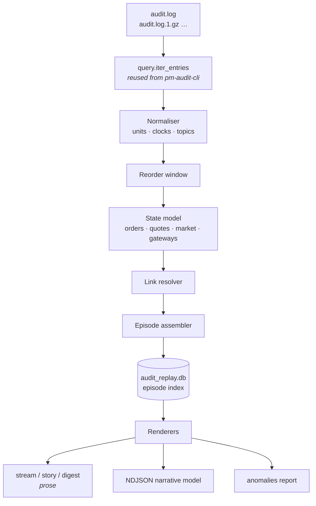

Version: 1.3.0

Date: 2026-09-11

Status: Design and Research Proposal

> **Update (2026-09-11):** Section 14 is now a task-level plan with explicit
> checkpoints, and gains a **Phase 0** of bus changes taken before the tool is
> built — an engine publish `seq`, `symbol` on the order lifecycle events, the
> `ts_ns` convention finished in the index family, a clock on book and depth
> snapshots, id lists beside the counted effects, and `command_id` on
> `session.state`. Section 5 is revised accordingly: the `phase_rank` ordering
> heuristic is removed (§5.2.2 — superseded again in 1.3.0, where `msg_id`
> becomes the ordering key), and §5.1.2 **corrects an error in 1.0.0** —
> `order.cancelled.command_id` already exists and is populated, so the
> kill-switch link is CERTAIN, not heuristic.
>
> **Update (2026-09-11, 1.3.0):** Section 13 (envelope causation IDs) is
> **implemented**, brought forward ahead of the rest so the tool is built
> against recorded causality and needs no later migration. The ids ride in a
> ZMQ frame rather than in the payload — see §13.1 for why that differs from
> what 1.0.0 proposed. The rest of this document is now written against that:
> causality is **read** from `causation_id` and inferred only as a fallback
> (§5.1, §7.2); ordering is `msg_id`, which is mint-ordered and therefore
> total across topics (§5.2.2); and **AR-0.1, the proposed engine `seq`, is
> dropped** — both of its purposes are already met, which takes Phase 0 from
> 8 days to 6 and removes its riskiest item.

# EduMatcher — Audit Replay and Narration Tool

## Table of Contents

1. [Overview](#1-overview)
2. [Problem Statement](#2-problem-statement)
3. [Goals and Non-Goals](#3-goals-and-non-goals)
4. [Conceptual Model](#4-conceptual-model)
5. [The Three Hard Problems](#5-the-three-hard-problems)
6. [Architecture](#6-architecture)
7. [Pass 1 — The Reconstruction Engine](#7-pass-1--the-reconstruction-engine)
8. [Pass 2 — The Narration Layer](#8-pass-2--the-narration-layer)
9. [CLI Surface](#9-cli-surface)
10. [Worked Output Examples](#10-worked-output-examples)
11. [Machine-Readable Output](#11-machine-readable-output)
12. [Anomaly and Gap Detection](#12-anomaly-and-gap-detection)
13. [Envelope Causation IDs — implemented](#13-envelope-causation-ids--implemented)
14. [Implementation Plan](#14-implementation-plan)
15. [Testing Guide](#15-testing-guide)
16. [Performance Notes](#16-performance-notes)
17. [Acceptance Checklist](#17-acceptance-checklist)
18. [Open Questions and Future Work](#18-open-questions-and-future-work)


## 1. Overview

With the observability work complete, `pm-audit` now records every state-changing
decision the exchange makes. The audit trail is complete — and that completeness
is precisely what makes it hard to read. A single `LIMIT` order that partially
matches produces eight to fifteen lines across six topics, published by three
processes, using two different price units and three different clocks.

`pm-audit-cli` answers *"which events match this filter?"*. It is a filter, and a
good one. It does not answer the question an engineer actually has when chasing a
bug:

> **What did the exchange think was happening, in order, and why?**

This proposal adds a second, complementary tool:

```bash
poetry run pm-audit-replay <subcommand> [options]
```

`pm-audit-replay` reads the same immutable JSONL audit trail, **reconstructs the
causal structure** hidden in it, and renders that structure as business-level
prose:

```text
09:31:02.118  TRADER01 submitted BUY LIMIT 200 AAPL @ 75.69 (DAY) — order 4f2c9a…
09:31:02.121  Engine accepted 4f2c9a…
09:31:02.122  4f2c9a… took 150 @ 74.80 from TRADER02's resting SELL 9ab1c4…
              4f2c9a… is now PARTIAL with 50 of 200 left; 9ab1c4… is fully filled
09:31:02.122  AAPL prints 74.80 × 150 (trade 000042-000001873, aggressor BUY)
```

The distinction from `pm-audit-cli` is not cosmetic. `pm-audit-cli` maps
*lines → lines*. `pm-audit-replay` maps *lines → a model of what happened →
lines*. The model in the middle is where all the value and all the difficulty is,
and most of this document is about that model.

> **Read this alongside** `EduMatcher-audit-cli.md` (§6 log-file structure, §7
> SQLite index), which `pm-audit-replay` builds directly on and reuses.


## 2. Problem Statement

### 2.1 What one order actually looks like

Here is a real, minimal case: `TRADER01` sends a buy limit for 200 AAPL at 75.69,
which partially matches a resting sell from `TRADER02`. Trimmed for width, this is
what lands in `data/audit.log`:

```text
[2026-09-08T09:31:02.118+00:00] [order.new] {"id":"4f2c9a…","symbol":"AAPL","side":"BUY",
  "order_type":"LIMIT","tif":"DAY","quantity":200,"remaining_qty":200,
  "gateway_id":"TRADER01","timestamp":1757323862118000000,"status":"NEW",
  "price":7569,"arrival_seq":0,"client_tag":"blotter-88"}
[2026-09-08T09:31:02.121+00:00] [order.ack.TRADER01] {"gateway_id":"TRADER01",
  "order_id":"4f2c9a…","accepted":true,"symbol":"AAPL","side":"BUY","qty":200,"price":75.69,…}
[2026-09-08T09:31:02.122+00:00] [trade.executed] {"id":"000042-000001873","run_seq":42,
  "symbol":"AAPL","buy_order_id":"4f2c9a…","sell_order_id":"9ab1c4…",
  "buy_gateway_id":"TRADER01","sell_gateway_id":"TRADER02","price":74.80,"quantity":150,
  "aggressor_side":"BUY","ts_ns":1757323862122334567,"tick_decimals":2}
[2026-09-08T09:31:02.122+00:00] [order.fill.TRADER01] {"order_id":"4f2c9a…","fill_qty":150,
  "fill_price":74.80,"remaining_qty":50,"status":"PARTIAL","liquidity_flag":"TAKER",
  "trade_ids":["000042-000001873"],…}
[2026-09-08T09:31:02.122+00:00] [order.fill.TRADER02] {"order_id":"9ab1c4…","fill_qty":150,
  "fill_price":74.80,"remaining_qty":0,"status":"FILLED","liquidity_flag":"MAKER",
  "trade_ids":["000042-000001873"],…}
[2026-09-08T09:31:02.123+00:00] [book.AAPL] {…40 lines of depth…}
[2026-09-08T09:31:02.124+00:00] [depth.AAPL] {…}
[2026-09-08T09:31:02.131+00:00] [index.update] {…}
[2026-09-08T09:31:02.133+00:00] [drop_copy.event.TRADER01] {…}
```

Nine lines, six topics, and this is the *easy* case. An OCO pair whose second leg
is cancelled by a circuit-breaker halt during a volatility auction spans four
processes and roughly forty lines.

### 2.2 Why this is hard to read by hand

1. **Causality used to be invisible; now it is recorded.** Nothing in the
   message said "this ack answers that submission", so the relationship had to
   be *inferred* from payload fields, with a different join key per topic pair
   (`order_id`, `request_tag`, `command_id`, `quote_id`, `trade_ids`,
   `oco_group_id`, `combo_parent_id`). Since the causal envelope (§13) every
   message carries `msg_id`, `causation_id` and `correlation_id`, and
   `pm-audit` records them. This is the single biggest change to the tool's
   design: causality is now **read**, not reconstructed. The inference ladder
   in §5.1 survives as the fallback for archived logs and for the handful of
   publishers that stamp nothing.
2. **Three clocks, two price units.** The bracketed timestamp is `pm-audit`'s
   own receipt clock. `order.new.timestamp` is *client-supplied* epoch nanoseconds
   and is explicitly documented as **not** what the book uses for priority.
   `trade.executed.ts_ns` is the engine's own epoch nanoseconds. And
   `order.new.price` is in **ticks** while `order.ack.price` and
   `order.fill.fill_price` are in **display money**. Reading the raw log invites
   exactly the class of unit error the `unit:` declarations exist to make
   reviewable.
3. **Publisher interleaving.** `pm-audit` is a single subscriber, so file order is
   a faithful record of *receipt* order — but receipt order across several
   publishers on a PUB/SUB bus is not causal order. An `order.ack` can land after
   the `trade.executed` it logically precedes.
4. **Signal-to-noise.** `book.{symbol}` and `depth.{symbol}` snapshots dominate
   the log by volume and are almost never what you are looking for — but
   occasionally they are exactly what you need.
5. **Vocabulary mismatch.** The log speaks in topics and enum constants. The bug
   report speaks in business terms: *"the second leg of my OCO never cancelled"*.

### 2.3 The cost

Tracking one order through a busy log currently means a `grep` for its ID, a
second `grep` for the trade IDs found in the first, a third for the counterparty
order, and a mental reconstruction of the ordering — per order. Any bug whose
symptom is *"the sequence was wrong"* is close to invisible.


## 3. Goals and Non-Goals

### 3.1 Goals

- Turn the audit trail into **ordered, business-level prose** that a developer,
  an operator, or a student can read straight through.
- **Read causality from the envelope** where it is present, and fall back to
  reconstructing it from payload fields where it is not — an archived log, or a
  publisher outside the engine that stamps none.
- Be **explicit about confidence**: a link the tool inferred heuristically must
  never read like a link the tool proved.
- **Never invent.** Every clause in every sentence must be traceable to a field
  in a recorded event or to an arithmetic identity over recorded fields.
- Support **narrowing**: by time, symbol, gateway, order, trade, command, or
  episode kind — and by *how much detail* to print.
- Support **three views**: chronological stream, single-entity story, and
  collapsed digest.
- Emit a **machine-readable narrative model** so the reconstruction is reusable
  by other tooling.
- **Surface anomalies** the reconstruction notices — unacked orders, quantity
  that does not conserve, orphaned cancels, clock inversions — because that is
  where bugs live.
- Read the same rotated/gzipped files as `pm-audit-cli`, and reuse its parser.

### 3.2 Non-Goals

- **Not a simulator.** `pm-audit-replay` describes what happened; it does not
  re-run the matching engine to check the engine was right. (`tools/replay_to_engine.py`
  is the tool for that.) It *does* check internal consistency — see §12.
- **Not a writer.** Strictly read-only with respect to the audit trail.
- **Not a live monitor.** `pm-audit --terminal`, `pm-log-srv` and the GUIs cover
  live use. A `--follow` mode is listed as future work only.
- **Not a replacement for `pm-audit-cli`.** Raw-event filtering stays there; the
  two share a parser and an index.
- **No new message types in phase 1.** §13 proposes envelope IDs as a *separate,
  optional* phase 2 that improves link confidence without being a prerequisite.


## 4. Conceptual Model

The tool works in four layers. Keeping them separate is what stops the prose
generator from silently becoming a pile of `if topic == ...` branches.


**Event** — one line of `data/audit.log`: a receipt timestamp, a topic, and a JSON
payload. This is `AuditEntry` from the existing `edumatcher/audit/query.py`.

**Fact** — an Event after normalisation: units converted to a single convention,
timestamps mapped onto a single ordering key, topic wildcards resolved
(`order.ack.TRADER01` → kind `order.ack`, actor `TRADER01`), enum constants
retained verbatim. A Fact adds no information; it only removes ambiguity.

**Episode** — the unit of narration: a set of causally connected Facts with one
business meaning and a lifecycle. This is the central abstraction.

| Episode kind | Anchor key | Typical Facts |
|---|---|---|
| `order` | engine `order_id` | `order.new`, `order.ack`, `order.fill`×n, `order.amended`, `order.cancelled`, `order.expired` |
| `trade` | `trade.executed.id` | the print, plus the two `order.fill` legs it caused |
| `quote` | `quote_id` | `quote.new`, `quote.ack`, `quote.status`, the two derived leg orders |
| `oco` | `oco_id` / `oco_group_id` | `order.oco`, `oco.ack`, both leg orders, `oco.cancelled` |
| `combo` | `combo_id` / `combo_parent_id` | `order.combo`, `combo.ack`, `combo.status`, leg orders |
| `command` | `command_id` | any `risk.*` / `admin.action` / `session.transition` / `index.*` request with its ack |
| `market_phase` | `symbol` + phase span | `circuit_breaker.halt` / `.extend` / `.resume`, `auction.indicative`, `auction.result` |
| `session` | state span | `session.transition`, `session.state`, `system.eod` |
| `gateway` | `gateway_id` + connection span | `system.gateway_connect`, `.gateway_auth`, `.gateway_disconnect`, `.gateway_bye` |
| `index` | `index_id` + action | `index.corp_action`, `.constituent_change`, `.rebalance` and their acks |
| `recovery` | engine `run_seq` | `system.startup_recovery`, first event of a new run |

Episodes **reference** each other rather than nesting: a `trade` episode
references two `order` episodes; an `order` episode created by a quote references
its `quote` episode; an order cancelled by a kill switch references the `command`
episode. The result is a directed graph, not a tree — which matters, because a
single `risk.kill_switch` command can be the cause of two hundred order episodes
ending.

**Narrative** — a rendering of the episode graph. Prose for humans, NDJSON for
tools. Crucially, the narrative layer is a *pure function* of the episode graph:
it may reformat and it may omit, but it may not consult the raw log again.


## 5. The Three Hard Problems

This is the "sophistication" the tool needs. Everything else is plumbing.

### 5.1 Correlation: read it first, infer it second

Since §13, messages carry `causation_id` and `correlation_id`, so most links are
simply **read**. Two things keep the inference machinery below alive rather than
deleting it:

- **Archived logs.** Lines recorded before the envelope existed have none, and
  the tool must read a mixed archive without a flag.
- **Publishers outside the engine.** `pm-index`, `pm-stats` and the gateways'
  own emissions are not behind a `CausalPublisher`, so their messages carry no
  envelope and their causality is still inferred.

So the resolver reads the envelope when it is there and falls back when it is
not. Either way it attaches an explicit **confidence** to every link, and the
renderer reflects it in the wording.

| Confidence | Meaning | Rendered as |
|---|---|---|
| `RECORDED` | The publisher stated the link: the effect's `causation_id` is the cause's `msg_id`. Not an inference at all. | Plain assertion, and the only level `--strict-causality` accepts |
| `CERTAIN` | A shared identifier that the schema guarantees is unique and is carried explicitly by both events. | Plain assertion: *"filled against 9ab1c4…"* |
| `STRONG` | A unique key plus a constraint (time window, actor, symbol, state) that admits exactly one candidate. | Plain assertion, flagged in `--explain` |
| `HEURISTIC` | Multiple candidates were possible; one was chosen by a tie-break rule. | Hedged: *"apparently in response to…"*, and always listed by `anomalies` |
| `NONE` | No antecedent found. | *"(no matching request found in range)"* |

#### 5.1.1 The link rules

**Tier 0 — the envelope.** Before any rule below is consulted:

| From | To | Key | Confidence | Notes |
|---|---|---|---|---|
| any message | the message that caused it | `causation_id` = cause's `msg_id` | RECORDED | One lookup. Applies to *every* topic the engine publishes, including ones no rule below covers |
| any message | its whole causal chain | `correlation_id` | RECORDED | Everything descending from one request shares it — a keyed lookup, not a traversal |

A **null** `causation_id` on a message that *has* an envelope is information,
not a gap: the engine is stating that nothing on the bus caused this — a
scheduler tick, a circuit-breaker trip, an end-of-day sweep. The tool renders
that as an origin, and never goes looking for a cause that was positively
declared absent. The absence of an envelope entirely is the different case, and
the fallback rules below are what handle it.

**Tiers 1–3 — the fallback ladder,** for messages with no envelope, ordered by
the pass that applies it:

| From | To | Key | Confidence | Notes |
|---|---|---|---|---|
| `order.new` | `order.ack.*` | `id` = `order_id` | CERTAIN | Both carry the engine order id. |
| `order.new` | `order.fill.*` | `id` = `order_id` | CERTAIN | |
| `trade.executed` | `order.fill.*` | `id ∈ fill.trade_ids` | CERTAIN | `trade_ids` is an explicit back-reference; this is the strongest link in the system. |
| `trade.executed` | two `order` episodes | `buy_order_id`, `sell_order_id` | CERTAIN | |
| `order.cancel` | `order.cancelled.*` | `request_tag` | CERTAIN | When `request_tag` is present on both. |
| `order.cancel` | `order.cancelled.*` | `order_id` + earliest later cancel | STRONG | Fallback when `request_tag` is absent. Degrades to HEURISTIC if two cancels for one order are in flight. |
| `order.amend` | `order.amended.*` | `request_tag`, else `order_id` | CERTAIN / STRONG | Same ladder as cancel. |
| `risk.*` / `admin.action` | matching `*_ack.*` | `command_id` | CERTAIN | `command_id` is carried by every risk and admin request/ack pair. |
| `risk.*` / `admin.action` | `order.cancelled.*` | `command_id` | CERTAIN | The engine stamps the causing command on every cancel it initiates — see §5.1.2. The ack's count is a completeness cross-check, not the link. |
| `order.cancelled` (no `command_id`) | causing condition | `cancel_reason` enum | CERTAIN | The reason names the cause directly: `SELF_MATCH_PREVENTED`, `INSUFFICIENT_LIQUIDITY`, `QUOTE_REPLACED`, `QUOTE_LEG_FILLED`. No search required. |
| `quote.new` | `quote.ack.*` | `quote_id` | CERTAIN | |
| `quote.ack` | leg orders | `bid_order_id`, `ask_order_id` | CERTAIN | The ack names the two derived orders explicitly. |
| `order.new` (origin=QUOTE) | `quote` episode | `quote_id` | CERTAIN | |
| `order.oco` | `oco.ack.*` | `oco_id` | CERTAIN | |
| `oco.ack` | leg orders | `order_id_1`, `order_id_2` | CERTAIN | |
| `oco.cancelled` | leg order | `cancelled_order_id` | CERTAIN | |
| `order.combo` | leg orders | `combo_id` = `combo_parent_id` + `leg_index` | CERTAIN | |
| `session.transition` | `session.state` | `to_state` = `state`, first later | STRONG | No shared id; constrained by state value and ordering. |
| `circuit_breaker.halt` | `circuit_breaker.resume` | `symbol`, span-matched | STRONG | Halts for one symbol do not overlap. |
| `order.ack` (rejected) | active market condition | `reject_code` → state model | STRONG | `INSTRUMENT_HALTED` / `CIRCUIT_BREAKER_ACTIVE` / `MARKET_CLOSED` / `KILL_SWITCH_ACTIVE` are resolved against the reconstructed market state, letting the tool say *why* the state was that way. |
| any | `drop_copy.event.*` | `order_id` + `seq` | CERTAIN | Drop-copy is a derived stream; narrate only at `-vv`. |

#### 5.1.2 Counted effects, and what is actually certain

An earlier draft of this document claimed the kill-switch-to-cancellation link
was heuristic. That was wrong, and the correction is worth stating plainly
because it removes the ugliest inference in the design.

`order.cancelled` already carries **`command_id`**, and the engine populates it
(`engine/main.py::_cancel_order_by_id` threads `cancel_reason` and `command_id`
through every engine-initiated cancel). The spec says what it is for:

> The admin/kill-switch `command_id` that caused this cancel, when one exists —
> lets a post-mortem join this event back to the exact command that triggered it.

So *"which orders did this kill switch cancel?"* is a **CERTAIN** join on
`command_id`, not a guess. The same is true for an admin cancel-symbol and a
circuit-breaker-driven cancel. `command_id` is null for a client-requested
cancel and for engine-initiated cancels with no originating command
(self-match prevention, insufficient liquidity, a quote leg cancelled because
its sibling filled) — and in those cases `cancel_reason` names the cause
directly, which is also exact.

What the acks add is a **cross-check**, not the link. `cancelled_orders` on the
ack is a count; the tool compares it against the number of `command_id`-joined
cancellations it actually observed. Agreement is a completeness proof for that
command; disagreement is a dropped message, and an anomaly:

```text
09:44:10.002  RISKDESK fired the kill switch for TRADER07 (command 8812) — "fat finger"
09:44:10.019  Engine accepted: 14 orders and 2 quotes cancelled
              ⤷ 14 cancellations joined on command 8812, matching the ack ✓
```

```text
              ⤷ ack says 14, only 11 carry command 8812  ⚠ EFFECT_COUNT_MISMATCH
```

The genuine count-only blind spot is elsewhere: **`system.startup_recovery`**
reports `restored_orders`, `discarded_stale_day_orders`, `failed_orders`,
`quote_remnants_restored`, `rebuilt_quotes` and `restored_combos` as bare
integers, with no per-entity event anywhere. *"Which order failed to restore?"*
is unanswerable from the audit trail today. Phase 0 (AR-0.5) closes that.

#### 5.1.3 Identity is per engine run

`trade.executed.run_seq` is the persisted engine-run sequence, and the trade id is
`{run_seq:06d}-{counter:09d}`. Order ids are UUIDs and are globally unique, but
**arrival sequences are not**: `arrival_seq` restarts with the engine. The
reconstruction engine therefore partitions all sequence-based reasoning by
`run_seq`, and a change in `run_seq` is narrated as a first-class event:

```text
09:12:00.004  ── Engine restarted (run 42 → 43) ──
09:12:00.190  Recovery restored 118 orders, discarded 6 stale DAY orders,
              rebuilt 4 quotes; 1 order failed to restore  ⚠
```

### 5.2 Establishing a defensible order of events

Prose implies sequence. If the sequence is wrong, the prose is a lie — and
worse, a plausible one. So ordering deserves an explicit, documented policy.

#### 5.2.1 The clock inventory

| Source | Field | Unit | Clock | Trustworthy for ordering? |
|---|---|---|---|---|
| every engine-published message | `msg_id` | ULID | engine publish site | **Yes — this is the ordering authority** (§5.2.2) |
| every engine-published message | `seq` | int, per topic | engine publish site | For *completeness*, not order: dense per topic, so a gap proves loss |
| audit line prefix | `[ts]` | ISO-8601 ms | `pm-audit` receipt | Only for messages carrying no envelope |
| `order.new` | `timestamp` | epoch **nanos** | **client** | **No.** Spec says explicitly: not what the book uses for priority |
| `order.new` | `arrival_seq` | int | engine, per run | **Yes** — this is the engine's own priority order |
| `trade.executed` | `ts_ns` | epoch **nanos** (int) | engine | Yes, engine-side |
| `trade.executed` | `id` | `run-counter` | engine, per run | **Yes** — monotonic and total within a run |
| `drop_copy.event` | `seq` | int | drop-copy publisher | Yes, within that stream |
| `log.*` | `seq` | int | `pm-log-srv` | Yes, within that stream |
| various acks | `timestamp` | mixed | publisher | Advisory only |

#### 5.2.2 The canonical ordering key

The envelope's `msg_id` is a ULID, minted at the publish site. Two properties
of that, together, make ordering a lookup rather than an inference:

1. **ULIDs sort by generation time** — the first 48 bits are a millisecond
   timestamp, and `new_ulid()` keeps a monotonic counter so ids minted inside
   one millisecond still sort in mint order.
2. **The engine publishes from a single thread**, so mint order *is* publish
   order.

Therefore, across every topic the engine publishes, **lexicographic `msg_id`
order equals the order the exchange did things in.** Measured over 20 000
publications interleaved across five topics, `sorted(ids) == ids` holds
exactly. The sort key is:

```text
sort_key = (msg_id, receipt_ts, file_ordinal)
```

- `msg_id` — the engine's own publication order, total across all topics.
- `receipt_ts` — the audit prefix. Reached only for messages carrying no
  envelope: archived lines, and publishers outside the engine.
- `file_ordinal` — line number, so the sort is stable and total.

Three things the previous design worked for now fall out for free:

- **Out-of-order delivery stops mattering.** An `order.ack` recorded after the
  `trade.executed` it preceded sorts back into place, because both carry a
  mint-ordered id. The `phase_rank` table of protocol-implied precedence — a
  submission before its ack, an ack before its fills, a trade before the book
  snapshot reflecting it — is **deleted**. It was a pile of special cases
  standing in for a number the engine already knew.
- **Engine restarts need no special handling.** A ULID's timestamp prefix keeps
  ordering across a restart without partitioning by run.
- **Cross-publisher order is honest.** `pm-index` and the gateways mint their
  own ULIDs, so across processes the ordering is only as good as their clocks
  agree — millisecond-accurate, not exact. The tool marks such a fact's
  position as approximate at `-vv` rather than implying a precision it does
  not have.

#### 5.2.3 Completeness, and the reorder window

Ordering and completeness are different questions, answered by different
fields. `msg_id` is *not* dense, so it cannot prove nothing was lost. The
per-topic `seq` is dense, so a gap in it proves messages are missing from that
topic — and `pm-audit` now records it.

Per-topic rather than global is the right shape here, and not by accident:
`SequencedPublisher`'s docstring gives the reason. A subscriber filtering on
`trade.` would see a socket-wide counter jump on every `depth.` message it
filtered out, and report continuous phantom gaps. Counting per topic makes
every subscriber's view contiguous regardless of what it subscribes to — and
gives the replay tool per-stream loss detection, which localises a problem
better than one global count would.

The reorder window shrinks to a formality. Facts are buffered briefly (default
2 000 facts / 5 s of receipt time, `--reorder-window`) and emitted in `msg_id`
order. A fact arriving after its window closed is emitted **in place** and
tagged `late`; a `seq` gap is reported where it was noticed:

```text
09:31:04.881  ⟲ late: ack for 7d10bb… (minted 2.777s earlier)
09:31:05.002  ⚠ SEQ_GAP: order.fill.TRADER01 seq 41→45 — 3 messages missing
```

Neither marker should appear on a healthy system, so either is itself a finding.

#### 5.2.4 Displayed time

The rendered timestamp is always the **receipt** clock, because that is the only
clock that exists on every line and the only one the reader can grep back to. At
`-vv` the engine clock is printed alongside when it differs by more than a
configurable threshold (`--clock-skew-warn`, default 250 ms), which makes
publisher stalls visible.

### 5.3 Unit, clock and vocabulary normalisation

#### 5.3.1 Ticks versus display money

This is a real, live trap in the current schema:

| Field | Unit |
|---|---|
| `order.new.price`, `order.new.stop_price` | **ticks** |
| `order.ack.price` | display money |
| `order.fill.fill_price` | display money |
| `order.amended.price`, `old_price` | display money |
| `trade.executed.price` | display money |
| `book.{symbol}` levels | ticks + `tick_decimals` |
| `depth.{symbol}.mid_price_ticks` / `mid_price` | both, side by side |

A narrator that prints `order.new.price` verbatim will happily report a buy limit
at **7 569.00** for a stock trading at 75.69, and the reader will believe it.

The Fact layer therefore converts everything to display money at normalisation
time, using this resolution ladder:

1. `tick_decimals` carried on the event itself (`trade.executed`, `book.*`).
2. The most recent `tick_decimals` seen for that symbol in the replay window.
3. `system.reference` / `system.symbols` reference data if present in the log.
4. The live reference data via `edumatcher.models.price.from_ticks` if
   `--use-reference` is passed and configuration is available.
5. Otherwise: print the raw value with an explicit `ticks` suffix and record an
   anomaly. **Never guess a scale.**

Rendered prices carry the resolved decimals; `--show-units` appends the
provenance (`75.69 [ticks→display, tick_decimals=2 from book.AAPL]`) for anyone
auditing the auditor.

#### 5.3.2 Timestamps

`order.new.timestamp` (epoch nanos, client clock) and `trade.executed.ts_ns`
(epoch nanos, engine clock) are both normalised to aware UTC datetimes and kept
**separately** from the receipt clock. They are never mixed into one column.
Same unit, different clocks: normalising the unit does not make them
comparable, and the Fact layer keeps the distinction.

Note that `ts_ns` is shared by every trade in a match batch (one clock read per
batch), so it is never a tie-break for ordering — `engine_seq`, taken from the
dense per-run trade counter in `id`, is.

#### 5.3.3 Vocabulary

A single lexicon module maps enum constants to business English. It is data, not
code, so it can be reviewed by someone who knows the domain rather than Python:

```python
CANCEL_REASON = {
    "SELF_MATCH_PREVENTED":  "self-match prevention",
    "INSUFFICIENT_LIQUIDITY":"insufficient liquidity",
    "KILL_SWITCH":           "a kill switch",
    "CIRCUIT_BREAKER_HALT":  "a circuit-breaker halt",
    "GATEWAY_DISCONNECT":    "its gateway disconnecting",
    "ADMIN_CANCEL_SYMBOL":   "an admin cancel-symbol command",
    "QUOTE_REPLACED":        "its quote being replaced",
    "QUOTE_LEG_FILLED":      "the other leg of its quote filling",
}
```

The same treatment covers the 25 `reject_code` values, `liquidity_flag`,
`aggressor_side` (including `AUCTION`, which means *no* aggressor and must not be
narrated as one), `tif`, `origin`, `halt_source` and the session states.

**Rule:** an enum value with no lexicon entry is printed verbatim in backticks and
recorded as a coverage gap — the tool must never fail silently when the message
spec grows a new value. `pm-msgen` already fails the build when generated
bindings drift from the spec; §15 adds the equivalent check for the lexicon.


## 6. Architecture

### 6.1 Two-pass pipeline



Pass 1 (`Normaliser` → `Episode assembler`) is a single streaming traversal that
writes an episode index. Pass 2 (`Renderers`) reads only the index.

The split matters for three reasons:

1. **Random access.** Investigating a bug means jumping into the middle of a
   200 MB log for one order. With an index, `story --order 4f2c9a…` is a keyed
   lookup; without one it is a full scan plus a second scan for the counterparty.
2. **Repeat queries.** A debugging session is twenty questions about the same
   window. Paying the reconstruction cost once is the difference between a
   two-second loop and a two-minute one.
3. **Backward links.** An episode's meaning often depends on something that
   happens later — an order is only "the aggressor that started the cascade" once
   you have seen the cascade. Materialising episodes first lets the renderer
   describe an episode using its complete lifecycle rather than a prefix of it.

Streaming, index-free operation remains available (`--no-index`) for small logs
and for pipelines, at the cost of forward-only narration.

### 6.2 The episode index

A **separate** SQLite database, `data/audit_replay.db`, is written next to
`pm-audit-cli`'s `data/audit_index.db`. Separate because the two have different
lifecycles: the event index is append-only and cheap to extend, while the episode
index is a derived artifact that is rebuilt whenever the reconstruction rules
change. Mixing them would make a lexicon tweak invalidate the event index.

```sql
CREATE TABLE replay_meta (
    key         TEXT PRIMARY KEY,
    value       TEXT NOT NULL
);   -- schema_version, rules_version, source_files, built_at,
     -- covered_from, covered_to, last_line_ordinal

CREATE TABLE episodes (
    episode_id      INTEGER PRIMARY KEY,
    kind            TEXT NOT NULL,   -- order | trade | quote | oco | combo |
                                     -- command | market_phase | session |
                                     -- gateway | index | recovery
    anchor_key      TEXT NOT NULL,   -- order_id, trade id, command_id, …
    correlation_id  TEXT,            -- causal chain this episode belongs to;
                                     -- NULL only for envelope-less events
    root_msg_id     TEXT,            -- the message the chain began with
    run_seq         INTEGER,
    symbol          TEXT,
    actor           TEXT,            -- originating gateway_id, when there is one
    opened_sort_key TEXT NOT NULL,   -- packed canonical key, lexicographically sortable
    closed_sort_key TEXT,            -- NULL while open at end of window
    opened_ts       TEXT NOT NULL,
    closed_ts       TEXT,
    outcome         TEXT,            -- FILLED | PARTIAL | CANCELLED | REJECTED |
                                     -- EXPIRED | ACCEPTED | DENIED | OPEN | UNKNOWN
    summary         TEXT NOT NULL,   -- one-line business summary, pre-rendered
    facts_json      TEXT NOT NULL    -- derived facts: qty, avg price, notional, …
);

CREATE TABLE episode_events (
    episode_id  INTEGER NOT NULL REFERENCES episodes(episode_id),
    seq_in_ep   INTEGER NOT NULL,
    sort_key    TEXT    NOT NULL,
    receipt_ts  TEXT    NOT NULL,
    topic       TEXT    NOT NULL,
    kind        TEXT    NOT NULL,   -- topic with wildcard resolved
    file        TEXT    NOT NULL,   -- source file, for traceability
    line_no     INTEGER NOT NULL,
    role        TEXT    NOT NULL,   -- open | progress | close | context
    late        INTEGER NOT NULL DEFAULT 0,
    msg_id         TEXT,            -- envelope: this message's ULID
    causation_id   TEXT,            -- envelope: what caused it (NULL = nothing did)
    correlation_id TEXT,            -- envelope: its chain
    topic_seq      INTEGER,         -- per-topic sequence, for gap detection
    payload     TEXT    NOT NULL,
    PRIMARY KEY (episode_id, seq_in_ep)
);

CREATE TABLE links (
    from_episode  INTEGER NOT NULL REFERENCES episodes(episode_id),
    to_episode    INTEGER NOT NULL REFERENCES episodes(episode_id),
    relation      TEXT NOT NULL,  -- caused | matched_with | leg_of | derived_from |
                                  -- cancelled_by | rejected_because | occurred_during
    confidence    TEXT NOT NULL,  -- CERTAIN | STRONG | HEURISTIC
    evidence      TEXT NOT NULL,  -- e.g. "trade_ids", "command_id=8812", "window+reason"
    PRIMARY KEY (from_episode, to_episode, relation)
);

CREATE TABLE anomalies (
    anomaly_id  INTEGER PRIMARY KEY,
    code        TEXT NOT NULL,     -- see §12
    severity    TEXT NOT NULL,     -- info | warn | error
    episode_id  INTEGER REFERENCES episodes(episode_id),
    sort_key    TEXT NOT NULL,
    receipt_ts  TEXT NOT NULL,
    detail      TEXT NOT NULL
);

CREATE TABLE actors (
    gateway_id   TEXT PRIMARY KEY,
    description  TEXT,             -- from system.gateway_auth.description
    first_seen   TEXT NOT NULL,
    last_seen    TEXT NOT NULL,
    orders       INTEGER NOT NULL DEFAULT 0,
    trades       INTEGER NOT NULL DEFAULT 0
);

CREATE INDEX idx_ep_kind_key   ON episodes(kind, anchor_key);
CREATE INDEX idx_ep_sort       ON episodes(opened_sort_key);
CREATE INDEX idx_ep_symbol_ts  ON episodes(symbol, opened_ts);
CREATE INDEX idx_ep_actor_ts   ON episodes(actor, opened_ts);
CREATE INDEX idx_ee_sort       ON episode_events(sort_key);
-- The envelope's two questions, both keyed lookups rather than traversals.
CREATE INDEX idx_ee_msg        ON episode_events(msg_id);
CREATE INDEX idx_ee_cause      ON episode_events(causation_id);
CREATE INDEX idx_ee_chain      ON episode_events(correlation_id);
CREATE INDEX idx_ep_chain      ON episodes(correlation_id);
CREATE INDEX idx_links_to      ON links(to_episode);
CREATE INDEX idx_anom_code     ON anomalies(code, sort_key);
```

**`correlation_id` changes what the index is for.** Before the envelope, it
existed largely to make graph traversal affordable — following an order to its
trades to its counterparty orders, hop by hop. Now "everything that flowed from
this submission" is `WHERE correlation_id = ?`, one indexed read. The index
still earns its place for the other two reasons in §6.1 — random access into
the middle of a large log, and repeat queries — but the traversal it was partly
built to accelerate has largely gone away.

`rules_version` in `replay_meta` is the safety catch: bump it whenever link rules,
the lexicon, or the sort-key packing change, and the tool refuses a stale index
with a clear message rather than rendering subtly wrong prose from it.

The **chronological stream is a single ordered scan of `episode_events`**, so the
stream view costs no more than the story view; episodes are the grouping, not a
detour.

### 6.3 Relationship to `pm-audit-cli`

| | `pm-audit-cli` | `pm-audit-replay` |
|---|---|---|
| Question | *Which events match?* | *What happened, and why?* |
| Output | Rows: table / JSON / CSV | Prose, plus NDJSON narrative |
| Unit | Event | Episode |
| Index | `data/audit_index.db` (events) | `data/audit_replay.db` (episodes) |
| Shared | `query.py` parser, log discovery, time parsing, `--log-file` conventions | |

`query.py` is reused unchanged. Two small additions are needed and are additive:
`iter_entries` must surface `(file, line_no)` for traceability, and the topic
wildcard split (`order.ack.TRADER01` → `("order.ack", "TRADER01")`) moves into a
shared helper so both tools resolve it identically.

Every rendered line can be traced back with `--show-source`, which appends
`audit.log:118423` — so a reader who distrusts the narration can always go read
the bytes.


## 7. Pass 1 — The Reconstruction Engine

### 7.1 Entity state machines

The engine maintains four live models while streaming. All are bounded: entries
retire once their episode closes and falls out of the reorder window.

**Order model.** Per `order_id`: submitted quantity, remaining quantity,
status, side, symbol, type, tif, owning gateway, origin (`ORDER`/`QUOTE`/`IMPLIED`),
parentage (`oco_group_id`, `combo_parent_id`, `leg_index`, `quote_id`),
`client_tag`, `arrival_seq`, and a running fill tally. The status ladder
`NEW → PARTIAL → FILLED | CANCELLED | REJECTED | EXPIRED` is validated as it goes;
an illegal transition is an anomaly, not a crash.

**Market model.** Per symbol: session state, halt state and its source
(`circuit_breaker` vs `risk.symbol_halt` — the `halt_source` field distinguishes
them), auction phase, last print, and the current corridor from
`circuit_breaker.halt.corridor_low`/`corridor_high`. This model is what lets the
tool explain a rejection: `reject_code=CIRCUIT_BREAKER_ACTIVE` becomes *"rejected
because AAPL has been halted since 09:41:12 on a 5.2% move through the upper
corridor"*.

**Gateway model.** Per `gateway_id`: connection span, auth outcome, and the
human `description` from `system.gateway_auth`, which is what makes actor names
readable.

**Run model.** Current `run_seq`, and whether a `system.startup_recovery` has
been seen for it.

### 7.2 The link resolver

Runs in four tiers, cheapest and most certain first. **Tier 0 answers most of
it**; the rest exist for envelope-less messages.

0. **Envelope tier.** If the fact carries a `causation_id`, look up that
   `msg_id` and stop — confidence `RECORDED`. If it carries an envelope with a
   *null* `causation_id`, mark it an origin and stop: the publisher has
   positively stated nothing caused it, and searching anyway would invent a
   link the engine denied. Only a fact with **no envelope at all** falls
   through to the tiers below.
1. **Direct-key tier.** Hash joins on explicit shared identifiers — the CERTAIN
   rows of the table in §5.1.1. No ambiguity, no windows.
2. **Constrained tier.** For pairs with no shared id, a candidate search bounded
   by *(key, window, state)*: a `session.transition` links to the first later
   `session.state` whose `state` equals its `to_state`; a `circuit_breaker.resume`
   links to the open halt for that symbol. Exactly one candidate → STRONG; more
   than one → tie-break and demote to HEURISTIC.
3. **Semantic tier.** Reason-code-driven attachment (§5.1.2): cancellations whose
   `cancel_reason` names a cause are attached to the nearest matching cause in
   scope, then reconciled against the ack's count.

Unresolved events are not dropped. They become single-event episodes of kind
`orphan`, are always narrated, and are always counted in the anomaly report — the
tool's failure to explain something is information the reader needs.

**Keep the two kinds of "no cause" apart.** A message whose envelope says
`causation_id` is null was *declared* uncaused, and is rendered as an origin. A
message with no envelope has an *unknown* cause, and is either resolved by the
fallback tiers or reported as an orphan. Collapsing the two would be the same
error in both directions: inventing causes for scheduler ticks, and quietly
presenting unknowns as origins. `--explain` always shows which of the two a
line is.

### 7.3 Episode assembly

Each Fact is offered to open episodes in priority order and, if none claims it,
opens a new one. Episodes close on a terminal fact
(`FILLED`/`CANCELLED`/`REJECTED`/`EXPIRED`, an ack for a command, a resume for a
halt) or on window end (`outcome = OPEN`).

An episode still open when the replay window ends is narrated as such — *"still
working, 50 of 200 remaining at end of window"* — rather than being silently
truncated, which is the single most misleading thing a replay tool can do.

### 7.4 Derived facts

Arithmetic over recorded fields is permitted and is stored in `facts_json`; it is
tagged `derived` so `--explain` can show the working:

- **Fill progress**: `filled_qty = quantity − remaining_qty`, and its consistency
  against the sum of `fill_qty`.
- **VWAP** of an order's fills, and **notional** (`Σ fill_qty × fill_price`).
  Where a contract multiplier applies, it is taken from reference data or omitted
  entirely with a note — never assumed to be 1.
- **Time to ack**, **time to first fill**, **time to completion** (receipt clock).
- **Aggressor/resting roles**, from `trade.executed.aggressor_side` cross-checked
  against `order.fill.liquidity_flag`. `aggressor_side = AUCTION` means both sides
  rested; the narration for that case says *"crossed in the uncross"*, never
  *"took"*.
- **Price improvement**: for a limit order, `limit − fill_price` on the buy side
  (and the reverse on the sell), which is exactly the kind of thing that is
  invisible in raw JSON and obvious in prose.
- **Queue position proxy**: `arrival_seq` relative to other resting orders at the
  same price, when the data is in the window.

Nothing beyond arithmetic. The tool does not model the book to guess what *should*
have matched — that is `tools/replay_to_engine.py`.


## 8. Pass 2 — The Narration Layer

### 8.1 Detail levels

One axis, five stops, mirroring the way people actually zoom in on a bug.

| Level | Flag | Includes |
|---|---|---|
| 0 | `-q` | Episode outcomes only — one line per completed episode |
| 1 | *(default)* | Business lifecycle: submissions, acks, fills, trades, cancels, halts, session changes, commands |
| 2 | `-v` | Adds counterparty detail, derived facts (VWAP, price improvement, timings), rejection reasoning, link confidence |
| 3 | `-vv` | Adds market-data context (`book`, `depth`, `index.update`), drop-copy, clock skew, `arrival_seq` |
| 4 | `-vvv` | Adds every unclassified event and the raw payload for each narrated line |

Orthogonal switches: `--show-source` (file:line), `--show-units` (unit
provenance), `--explain` (link evidence and confidence inline), `--no-color`.

### 8.2 Sentence templates

Templates are data, held in one module, one per `(episode kind, fact kind,
detail level)`. The renderer resolves a template, fills it from the Fact plus
derived facts, and never concatenates free text elsewhere in the codebase. This
keeps the prose reviewable and makes translation or house-style changes a
single-file edit.

```python
T["order.new"][1] = (
    "{actor} submitted {side} {order_type} {qty} {symbol}{at_price}"
    "{tif_clause} — order {order_ref}"
)
T["order.fill"][1] = (
    "{order_ref} {verb} {fill_qty} @ {fill_price} {prep} {counterparty}"
)
```

`verb` and `prep` come from the lexicon and depend on role: an aggressor *took
from*, a resting order *was hit by* / *was lifted by*, an auction participant
*crossed with*. Getting these verbs right is most of what makes the output read
like a person wrote it.

### 8.3 The no-invention rule

Every clause must derive from a recorded field or from arithmetic over recorded
fields. Concretely, the renderer is forbidden to:

- state a cause for a link whose confidence is `HEURISTIC` without hedging;
- report a price without a resolved unit;
- describe an episode's outcome when the episode is still `OPEN`;
- infer intent (*"the trader was trying to…"*);
- fill a gap with a plausible default.

Where information is absent the output says so, in-line and briefly:

```text
09:31:07.410  order 7d10bb… was cancelled — no cancel request found in this window
              (log starts 09:31:00; try --from earlier)
```

That last parenthetical is deliberate: most "missing" antecedents are just outside
the requested range, and saying so saves a wasted debugging hour.

### 8.4 Actor and instrument naming

Gateways print as their `gateway_id` by default. With `--actor-style=descriptive`,
the `description` from `system.gateway_auth` is appended when one was recorded:
`TRADER01 (Nordic Equities desk)`. Order ids are abbreviated to a configurable
prefix (`--id-len`, default 6, `full` for the whole UUID) with collision
detection inside the window — if two ids share a prefix, the tool lengthens both
rather than printing ambiguous references.


## 9. CLI Surface

```bash
poetry run pm-audit-replay <subcommand> [options]
```

A separate entry point from `pm-audit-cli`, for the same reasons §4.1 of
`EduMatcher-audit-cli.md` gives: a distinct mental model deserves a distinct
command, and the option sets barely overlap. Registered in `pyproject.toml`
alongside its sibling:

```toml
pm-audit-replay = "edumatcher.audit.replay.cli:main"
```

### 9.1 Global options

```text
  --log-file PATH        Audit log to read (default: data/audit.log; rotated
                         .1, .2.gz … siblings are discovered automatically)
  --db PATH              Episode index (default: data/audit_replay.db)
  --no-index             Stream without building or reading an index
  --rebuild              Rebuild the episode index before rendering

  --from ISO_TS          Start of window (ISO-8601 or YYYY-MM-DD)
  --to   ISO_TS          End of window
  --date YYYY-MM-DD      Shorthand for a whole UTC day
  --last DURATION        Relative window, e.g. 15m, 2h, 1d

  --symbol SYMBOL        Restrict to one or more symbols (repeatable)
  --gateway GW_ID        Restrict to one or more gateways (repeatable)
  --kind KIND            Restrict to episode kinds (repeatable)

  -q, -v, -vv, -vvv      Detail level (see §8.1)
  --format FORMAT        text (default) | ndjson | json | markdown
  --show-source          Append audit.log:LINE to every narrated line
  --show-units           Append unit provenance to every price
  --explain              Show link evidence and confidence inline
  --id-len N|full        Order-id abbreviation (default 6)
  --actor-style STYLE    id (default) | descriptive
  --tz TZ                Render timestamps in this zone (default UTC)
  --reorder-window SPEC  e.g. 2000 or 5s (default 2000/5s)
  --no-color             Disable ANSI colour
```

Time-window and filter flags deliberately mirror `pm-audit-cli` so muscle memory
carries between the two.

### 9.2 `stream` — chronological narrative

The default subcommand and the direct answer to the original sketch.

```bash
# Everything the exchange did in a two-minute window
pm-audit-replay stream --from 2026-09-08T09:31:00 --to 2026-09-08T09:33:00

# One symbol, with counterparty detail
pm-audit-replay stream --date 2026-09-08 --symbol AAPL -v

# One trader's day, outcomes only
pm-audit-replay stream --date 2026-09-08 --gateway TRADER01 -q
```

### 9.3 `story` — one entity, end to end

Narrates a single episode and everything causally connected to it, following
links outward to a configurable depth. This is the subcommand for *"what happened
to this order?"*.

```text
  --order ORDER_ID       Follow an order (accepts an unambiguous id prefix)
  --trade TRADE_ID       Follow a trade and both its legs
  --quote QUOTE_ID       Follow a quote and its derived leg orders
  --oco OCO_ID / --combo COMBO_ID
  --command COMMAND_ID   Follow a risk/admin command and its effects
  --client-tag TAG       Follow by the client's own tag
  --chain ULID           Follow a whole causal chain by correlation_id
  --msg ULID             Follow one message and what it caused
  --depth N              Link-following depth (default 2). Ignored with --chain,
                         which is already the complete descent
  --context DURATION     Also show market context ±DURATION around the episode
  --strict-causality     Follow only RECORDED links; report inferred ones as
                         unfollowed rather than traversing them
```

```bash
pm-audit-replay story --order 4f2c9a -v --explain
pm-audit-replay story --command 8812 --depth 3      # a kill switch and its casualties
pm-audit-replay story --client-tag blotter-88       # when the trader only knows their tag

# Everything one submission caused, however deep — one indexed read, no depth
# limit to tune, and nothing reached by inference.
pm-audit-replay story --chain 01ARZ3NDEKTSV4RRFFQ69G5FAV
```

`--depth` exists because traversal used to be expensive and unbounded. With
`--chain` the whole descent is a single `WHERE correlation_id = ?`, so there is
no depth to choose and no risk of stopping one hop short of the answer. For an
order whose id you know but whose chain you do not, `story --order` resolves the
order first and then follows its chain.

`--strict-causality` is the honest-investigation switch: on a mixed archive it
shows exactly what the exchange *recorded* versus what the tool *inferred*, so
a conclusion drawn from a HEURISTIC link cannot be mistaken for one the engine
stated.

### 9.4 `digest` — collapsed summary

One paragraph per episode, noise removed, for reading a whole session or a whole
day. Answers *"what kind of day was it?"* rather than *"what happened at 09:31?"*.

```text
  --group-by DIM         episode (default) | symbol | gateway | outcome | hour
  --top N                Limit to the N most significant episodes
  --significance RULE    qty | notional | duration | anomalies (default: anomalies, then notional)
```

### 9.5 `episodes` — the index as a table

A structured listing, closer in spirit to `pm-audit-cli`: one row per episode with
kind, anchor, actor, symbol, span, outcome and anomaly count. Useful for finding
the episode you then want a `story` for, and for CSV export.

```bash
pm-audit-replay episodes --date 2026-09-08 --kind order --outcome REJECTED --format csv
```

### 9.6 `anomalies` — the bug-hunting view

Every finding from §12, ordered by severity then time, each with the episode it
belongs to and a ready-to-run `story` command.

```bash
pm-audit-replay anomalies --date 2026-09-08 --severity warn
```

### 9.7 `index` — build or refresh the episode index

```text
  --rebuild              Discard and rebuild
  --from / --to          Restrict the indexed range
  --stats                Report episode/link/anomaly counts and coverage
```

Incremental by default, keyed on `last_line_ordinal` in `replay_meta`, so a
running `pm-audit` can be indexed repeatedly through the day. A `rules_version`
mismatch forces a full rebuild and says so.


## 10. Worked Output Examples

All examples are illustrative renderings of the real message schemas.

### 10.1 A partially filled limit order — default detail

```text
pm-audit-replay stream --from 09:31:00 --to 09:31:05 --symbol AAPL

09:31:02.118  TRADER01 submitted BUY LIMIT 200 AAPL @ 75.69 (DAY) — order 4f2c9a…
09:31:02.121  Engine accepted 4f2c9a…
09:31:02.122  AAPL traded 150 @ 74.80 — TRADER01's 4f2c9a… took liquidity from
              TRADER02's resting SELL 9ab1c4… (trade 000042-000001873)
09:31:02.122  4f2c9a… is now PARTIAL: 50 of 200 remaining
09:31:02.122  9ab1c4… is FILLED
09:31:04.006  TRADER01 cancelled the rest of 4f2c9a… — 50 unfilled
```

### 10.2 The same window at `-v`

```text
09:31:02.118  TRADER01 submitted BUY LIMIT 200 AAPL @ 75.69 (DAY) — order 4f2c9a…
                 client tag blotter-88 · arrival_seq 918 344
                 chain 01ARZ3ND… starts here
09:31:02.121  Engine accepted 4f2c9a…  (3 ms after submission)
                 caused by the submission [recorded]
09:31:02.122  AAPL traded 150 @ 74.80 — TRADER01's 4f2c9a… took liquidity from
              TRADER02's resting SELL 9ab1c4… (trade 000042-000001873, run 42)
                 TRADER01 pays 11 220.00 · price improvement 0.89/share vs the
                 75.69 limit · TRADER01 TAKER, TRADER02 MAKER
09:31:02.122  4f2c9a… is now PARTIAL: 50 of 200 remaining, 150 filled at VWAP 74.80
09:31:02.122  9ab1c4… is FILLED — 150 of 150, resting since 09:28:44 (2m 18s in queue)
09:31:04.006  TRADER01 cancelled the rest of 4f2c9a… — 50 unfilled
                 requested 09:31:04.001, acknowledged 5 ms later, request tag c-4471

Episode order/4f2c9a… closed after 1.888s: PARTIAL→CANCELLED, 150/200 filled,
notional 11 220.00, 1 trade, 1 counterparty.
```

### 10.3 A rejection explained by market state

```text
09:41:58.204  TRADER05 submitted SELL LIMIT 1 000 TSLA @ 214.50 (DAY) — order c81f03…
09:41:58.206  Engine REJECTED c81f03… — CIRCUIT_BREAKER_ACTIVE
                 ⤷ TSLA has been halted since 09:41:12.880, triggered at 219.44
                   against a 208.10 reference (+5.4%), corridor 197.70–218.50,
                   scheduled to resume 09:46:12.880   [circuit_breaker.halt, level 1]
```

The second line is the payoff of the market state model: the reject code alone is
a constant, and the halt that explains it is 46 seconds and several thousand log
lines earlier.

### 10.4 A kill switch and its consequences

```text
pm-audit-replay story --command 8812 --depth 2

09:44:10.002  RISKDESK fired the kill switch for gateway TRADER07 (command 8812)
                 note: "fat finger — 100x qty on NOKIA"
09:44:10.019  Engine accepted: 14 orders and 2 quotes cancelled
09:44:10.019  ⤷ 14 cancellations carry this command's causation_id ✓ (ack agrees)
                 NOKIA   6 orders   58 300 shares
                 ERICB   5 orders   12 000 shares
                 VOLVB   3 orders    4 500 shares
09:44:10.021  ⤷ 2 quotes cancelled: TRADER07's NOKIA and ERICB two-sided quotes
                 4 derived leg orders cancelled with reason QUOTE_REPLACED
09:44:10.044  TRADER07's next submission (BUY MARKET 500 NOKIA, order 33ba1c…)
              was REJECTED — KILL_SWITCH_ACTIVE

Command episode 8812 closed after 17 ms: ACCEPTED, 14/14 cancellations reconciled.
```

### 10.5 An auction uncross

Note the vocabulary: `aggressor_side = AUCTION` means neither side was the
aggressor, so nobody "takes".

```text
09:00:00.000  ── Session ATO_AUCTION → CONTINUOUS ──
08:59:58.500  AAPL indicative 75.20 × 4 800, buy imbalance 1 200 (call phase)
09:00:00.004  AAPL uncrossed at 75.20 — 4 800 shares in 9 trades, 1 200 buy
              imbalance left unfilled
09:00:00.004     TRADER01's 1a2b3c… crossed 1 200 @ 75.20 with TRADER04's 88ff21…
09:00:00.004     TRADER02's 4d5e6f… crossed 900 @ 75.20 with TRADER04's 88ff21…
                 …7 more trades…
09:00:00.031  AAPL opens: best bid 75.18 × 900, best ask 75.22 × 1 500
```

### 10.6 Digest of a whole session

```text
pm-audit-replay digest --date 2026-09-08 --group-by symbol -q

AAPL   1 284 orders · 618 trades · 412 900 shares · 31.2M notional
       2 circuit-breaker halts (09:41:12 +4m, 14:02:55 +4m) · 1 forced uncross
       ⚠ 3 anomalies

ERICB    418 orders · 190 trades ·  88 100 shares ·  7.9M notional
       kill switch on TRADER07 at 09:44:10 cancelled 5 orders here

… 12 more symbols. Run `pm-audit-replay anomalies --date 2026-09-08` for the 4 findings.
```


## 11. Machine-Readable Output

`--format ndjson` emits one JSON object per narrated element — the reconstructed
model, not the raw log. Consumers get the causal graph without re-implementing
§5, which is the whole point of separating the model from the prose.

```json
{"type":"episode","id":4471,"kind":"order","anchor":"4f2c9a…","actor":"TRADER01",
 "correlation_id":"01ARZ3NDEKTSV4RRFFQ69G5FAV",
 "root_msg_id":"01ARZ3NDEKTSV4RRFFQ69G5FAV",
 "symbol":"AAPL","run_seq":42,"opened":"2026-09-08T09:31:02.118+00:00",
 "closed":"2026-09-08T09:31:04.006+00:00","outcome":"CANCELLED",
 "summary":"BUY LIMIT 200 AAPL @ 75.69, 150 filled, 50 cancelled",
 "derived":{"filled_qty":150,"remaining_qty":50,"vwap":74.80,"notional":11220.00,
            "price_improvement_per_share":0.89,"ack_latency_ms":3,
            "time_to_first_fill_ms":4,"lifetime_ms":1888}}

{"type":"beat","episode":4471,"seq":2,"sort_key":"01ARZ3NDEKTSV4RRFFQ69G5FB2|…",
 "msg_id":"01ARZ3NDEKTSV4RRFFQ69G5FB2","causation_id":"01ARZ3NDEKTSV4RRFFQ69G5FAV",
 "correlation_id":"01ARZ3NDEKTSV4RRFFQ69G5FAV","topic_seq":4471,
 "receipt_ts":"2026-09-08T09:31:02.122+00:00","kind":"order.fill","role":"progress",
 "text":"AAPL traded 150 @ 74.80 — TRADER01's 4f2c9a… took liquidity from TRADER02's resting SELL 9ab1c4…",
 "source":{"file":"audit.log","line":118423},
 "fields":{"fill_qty":150,"fill_price":74.80,"remaining_qty":50,
           "liquidity_flag":"TAKER","trade_ids":["000042-000001873"]}}

{"type":"link","from":4471,"to":4472,"relation":"matched_with",
 "confidence":"RECORDED","evidence":"causation_id=01ARZ3NDEKTSV4RRFFQ69G5FAV"}

{"type":"anomaly","code":"ACK_MISSING","severity":"warn","episode":4488,
 "receipt_ts":"2026-09-08T09:33:10.771+00:00",
 "detail":"order 7d10bb… filled without a preceding order.ack in the window"}
```

Every prose line has a `beat` with the same `text`, so the two formats never
diverge — the text renderer *is* the `text` field.

Because every beat carries its `correlation_id`, a consumer can reassemble the
causal graph without re-deriving any of §5.1: group by chain, order by `msg_id`,
and follow `causation_id` for the tree shape. That was the point of separating
the model from the prose, and the envelope is what makes it cheap.

`--format json` wraps the same content in a single document with a header
(`window`, `source_files`, `rules_version`, counts) for tools that prefer one
object. `--format markdown` emits the prose with headings per episode, for
pasting into a bug report or an incident write-up.


## 12. Anomaly and Gap Detection

Reconstruction gives consistency checks almost for free, and these are the real
prize: a bug that is hard to find in the raw log is usually a bug that breaks one
of these invariants.

### 12.1 Lifecycle invariants

| Code | Severity | Condition |
|---|---|---|
| `ACK_MISSING` | warn | An `order.new` with no `order.ack` for the same `order_id` inside the window |
| `ACK_DUPLICATE` | error | Two acks for one `order_id` |
| `FILL_BEFORE_ACK` | warn | A fill whose canonical key precedes its ack (a genuine inversion, not a reorder artefact) |
| `FILL_AFTER_TERMINAL` | error | A fill for an order already `FILLED`/`CANCELLED`/`REJECTED`/`EXPIRED` |
| `ILLEGAL_STATUS_TRANSITION` | error | A status change outside the documented ladder |
| `TERMINAL_MISSING` | info | An order still open when the window ends (expected at window edges; informational only) |
| `CANCEL_UNSOLICITED` | warn | `order.cancelled` with neither a matching request nor a `cancel_reason` naming a cause |
| `CANCEL_UNMATCHED` | warn | `order.cancel` with no resulting `order.cancelled` or rejection |

### 12.2 Quantity and price conservation

| Code | Severity | Condition |
|---|---|---|
| `QTY_MISMATCH` | error | `Σ fill_qty ≠ quantity − remaining_qty` |
| `REMAINING_NOT_MONOTONIC` | error | `remaining_qty` increases across fills of one order |
| `TRADE_LEG_MISSING` | error | A `trade.executed` with fewer than two `order.fill` legs referencing its id |
| `FILL_WITHOUT_TRADE` | error | An `order.fill` whose `trade_ids` name no `trade.executed` in the window |
| `LEG_QTY_DISAGREE` | error | The two legs of one trade report different `fill_qty` |
| `LEG_PRICE_DISAGREE` | error | The two legs report different `fill_price` |
| `PRICE_THROUGH_LIMIT` | error | A fill outside the order's limit price (buy above, sell below) |
| `PRICE_OUTSIDE_CORRIDOR` | warn | A print outside the active circuit-breaker corridor without a `clamped` flag |

`FILL_WITHOUT_TRADE` and `TRADE_LEG_MISSING` are the two that catch dropped
messages — which, on a PUB/SUB bus, is the failure mode nobody sees until it
matters.

### 12.3 Ordering and clock findings

| Code | Severity | Condition |
|---|---|---|
| `LATE_ARRIVAL` | info | A fact arrived after its reorder window closed |
| `CLOCK_SKEW` | warn | Engine payload clock and audit receipt clock differ by more than `--clock-skew-warn` |
| `CLIENT_CLOCK_ABSURD` | info | `order.new.timestamp` more than an hour from receipt — a client-clock problem, harmless to the engine (priority uses `arrival_seq`) but worth knowing |
| `ARRIVAL_SEQ_GAP` | info | A gap in `arrival_seq` within a run; expected across gateways, reported only with `--strict` |
| `RUN_SEQ_CHANGE` | info | Engine restart observed mid-window |
| `SEQ_GAP` | error | A gap in a topic's `seq`: messages are missing from the audit trail for that topic |
| `ENVELOPE_MISSING` | info | An engine-published message with no envelope. Expected on archived lines; on a current log it means a publisher is bypassing `CausalPublisher` |
| `CAUSE_NOT_FOUND` | warn | A `causation_id` naming a `msg_id` that is nowhere in the window. Usually the window starts too late; occasionally a dropped message |
| `CHAIN_BROKEN` | error | An effect whose `correlation_id` differs from its cause's — the chain was not propagated, which breaks `story --chain` |
| `MSG_ID_DUPLICATE` | error | Two messages with the same `msg_id`. Should be impossible; would mean the ULID generator was shared unsafely across threads |
| `TRADE_COUNTER_GAP` | error | A gap in the per-run trade counter: trades specifically are missing. Redundant with `SEQ_GAP`, but kept — it localises the loss to the trade stream |

`SEQ_GAP` deserves emphasis. Because each topic's `seq` is dense, the tool can
**prove** that messages are missing from the audit trail rather than merely
suspecting it — on every topic, not just trades. That is a completeness check
on the audit system itself, and it now works on any log recorded since
`pm-audit` began writing the metadata section.

`CHAIN_BROKEN` is the one to watch during development. `correlation_id` is
propagated by `Envelope.caused()`, so a break means something constructed an
envelope by hand instead of deriving it from its cause — exactly the class of
mistake that wrapping the publisher was meant to make impossible, and worth
failing loudly if it reappears.

### 12.4 Command reconciliation

| Code | Severity | Condition |
|---|---|---|
| `EFFECT_COUNT_MISMATCH` | warn | An ack's `cancelled_orders`/`cancelled_quotes`/`halted_symbols` count disagrees with observed effects |
| `COMMAND_UNACKED` | warn | A risk/admin command with no ack carrying its `command_id` |
| `ACK_WITHOUT_COMMAND` | warn | An ack whose `command_id` matches no request in the window |
| `HALT_UNRESUMED` | info | A halt with no resume by window end |
| `RESUME_WITHOUT_HALT` | warn | A resume for a symbol with no active halt |

### 12.5 Coverage findings

| Code | Severity | Condition |
|---|---|---|
| `UNKNOWN_TOPIC` | warn | A topic with no Fact mapping — the message spec has grown and the tool has not |
| `UNKNOWN_ENUM` | warn | An enum value with no lexicon entry |
| `ORPHAN_EVENT` | info | An event the link resolver could not attach to any episode |
| `PARSE_FAILURE` | error | A line that does not match the audit line format |

These four are how the tool stays honest as EduMatcher evolves. A clean
`anomalies --severity warn` run on a healthy log is a meaningful regression
signal, and §15 wires exactly that into the test suite.

### 12.6 Output

```text
pm-audit-replay anomalies --date 2026-09-08

ERROR  09:33:10.771  QTY_MISMATCH        order 7d10bb…
       fills total 450 but quantity − remaining_qty = 400 (50 unaccounted)
       → pm-audit-replay story --order 7d10bb -v --explain

WARN   09:44:10.019  EFFECT_COUNT_MISMATCH   command 8812 (risk.kill_switch)
       ack reported 14 cancelled orders; 11 observed within 5.0s
       → pm-audit-replay story --command 8812 --depth 2

INFO   09:12:00.004  RUN_SEQ_CHANGE      run 42 → 43
       recovery restored 118 orders, 1 failed

3 findings (1 error, 1 warning, 1 info) across 4 812 episodes.
```


## 13. Envelope Causation IDs — implemented

> **Status: implemented 2026-09-11.** This section described a phase-2
> proposal in 1.0.0. It was brought forward and built first, so the tool is
> designed against causality that is *recorded* rather than inferred.

### 13.1 What was built

Three fields, carried in a dedicated ZMQ frame rather than in the JSON payload:

| Field | Meaning |
|---|---|
| `msg_id` | ULID of this message. Unique, and sorts by generation time |
| `causation_id` | The `msg_id` of the message that caused this one. `None` means nothing did |
| `correlation_id` | Shared by every message in one causal chain; equals the root's `msg_id` |

**Why a frame, not payload fields.** The proposal in 1.0.0 assumed spec fields.
The codebase had already answered this question differently and for a good
reason: `SequencedPublisher` puts its per-topic sequence in a frame so the hot
publish path never decodes and re-encodes a message. The same argument applies
here, with a second behind it — the envelope is uniform across all 114 message
types, so declaring it per-message would be 114 copies of one idea for the
generator to keep in step. Frame layout is now:

```
PUB   [topic, payload, seq, envelope]
PUSH  [topic, payload, envelope]
```

`decode()` still reads only frames 0 and 1, so no consumer had to change.

### 13.2 How it is applied

Two wrappers in `messaging/bus.py`, so no publish site has to remember:

- `CausalPusher` wraps every PUSH socket. A client request is a causal **root**.
- `CausalPublisher` wraps the engine's PUB socket. The receive loop sets the
  inbound message as the cause before dispatch and clears it in a `finally`.

Wrapping rather than editing call sites is the substantive decision. The engine
publishes from roughly a hundred places; an envelope attached only where someone
remembered would be **worse than none**, because an absent `causation_id` is
defined to mean "nothing caused this". A forgotten one would not be a gap, it
would be a false statement.

This is safe because the engine's PULL loop is single-threaded — exactly one
inbound message in flight, so never more than one cause in scope. A
multi-threaded publisher would need a context variable; `CausalPublisher`'s
docstring says so.

### 13.3 What it changes for this tool

The §5.1.1 ladder still exists — it reads archived logs, and non-engine
publishers still stamp nothing — but it becomes the fallback rather than the
mechanism. The resolver gains a tier 0: **if `causation_id` is present, use it
and stop.**

| Link | Before | Now |
|---|---|---|
| `order.new` → `order.ack` | CERTAIN (shared `order_id`) | CERTAIN, and no longer dependent on the id being echoed |
| `order.cancel` → `order.cancelled` without `request_tag` | STRONG | CERTAIN |
| `session.transition` → `session.state` | STRONG | CERTAIN |
| Rejection → the market condition behind it | STRONG, via the state model | CERTAIN |
| Cascades (halt → cancels → quote teardown → re-quote) | reconstructed per hop | one `correlation_id` lookup |

`correlation_id` in particular turns §9.3's `story` subcommand from a graph
traversal into an indexed lookup: everything descending from one submission
shares one key. The episode index carries all three fields with an index on
each (§6.2).

### 13.4 Cost

26 bytes per id, so up to ~80 bytes per message of envelope — a few percent of
audit log size, paid once, in exchange for removing an entire class of
inference. `pm-audit` records the envelope **and** the per-topic sequence,
which it previously discarded: before this change the counter that exists to
reveal PUB/SUB drops was being thrown away by the one process whose job is to
miss nothing.

## 14. Implementation Plan

### How to read this plan

Work is broken into **phases**, each a sequence of numbered **tasks**. Every
phase ends in a **checkpoint (CP-n)**: a statement that can be demonstrated, not
a feeling that the code looks done. A checkpoint that cannot be demonstrated is
not passed, and the next phase does not start.

Each task carries:

- **Do** — the change.
- **Verify** — how you know it worked, *before* moving on. Prefer a command
  whose output you can read over an assertion you have to trust.
- **Done when** — the observable condition.

Conventions for the whole plan:

- **One task, one commit.** The commit message names the task id (`AR-2.3`).
- **Tests land with the code they test**, in the same commit. A task whose
  verification step is a test is not done until that test is committed.
- **`poetry run pytest` must be green at every checkpoint.** Not merely the new
  tests — the whole suite. Phase 0 in particular touches the engine.
- **`poetry run pm-msgen check` must pass after any spec edit**, and CI enforces
  it. If it fails, the generated bindings were not regenerated.
- When a task says *"write the test first"*, write it, watch it **fail for the
  right reason**, then make it pass. A test that has never failed has not been
  shown to test anything.

Estimates are working days for one mid-level developer already familiar with the
codebase. They assume review latency is handled outside the estimate.

---

### Phase 0 — Bus changes that make the tool simpler (≈ 8 days)

Do this first. Every item here either deletes work from a later phase or closes
a hole the tool would otherwise have to paper over. All are breaking wire
changes, taken deliberately while backwards compatibility is not yet a
constraint.

Each task follows the same shape, which is worth internalising once:
**edit `spec/messages/*.yaml` → `pm-msgen generate` → fix publishers → fix
consumers → fix tests → `pm-msgen check`.** The generator will not let the
bindings drift; it will happily let a *consumer* drift, which is where the risk
actually lives.

#### AR-0.1 — Engine publish sequence — **dropped, already solved**

This task proposed a global, dense `seq` on every engine message, for two
purposes: a total order across topics, and proof that nothing was lost. Both
are already met by work that has since landed, so building it would add a
field that earns nothing.

**Ordering** is `msg_id`. ULIDs sort by generation time, `new_ulid()` is
monotonic within a millisecond, and the engine publishes from one thread — so
lexicographic `msg_id` order *is* publish order, across every topic. Measured
over 20 000 publications interleaved across five topics: `sorted(ids) == ids`
holds exactly. See §5.2.2.

**Completeness** is the per-topic `seq` that `SequencedPublisher` has always
stamped and that `pm-audit` now records. It is dense per topic, so a gap proves
loss. Per-topic is also the *better* shape, not a compromise: a global counter
would make every subscriber that filters by topic prefix see phantom gaps for
the messages it filtered out — the reasoning is in `SequencedPublisher`'s own
docstring.

What remains is a one-line check rather than a two-day task, folded into
AR-0.7's sweep: confirm on a captured session that every engine-published line
carries an envelope and a `seq`, i.e. that no publisher is bypassing
`CausalPublisher`. The `ENVELOPE_MISSING` anomaly (§12.3) is the standing
version of that check.

> **Phase 0 is now ~6 days, not 8, and its riskiest item is gone.** AR-0.2
> through AR-0.6 are independent of each other and can be done in any order or
> in parallel.

#### AR-0.2 — `symbol` on the order lifecycle events (0.5 day)

**Do.** Add `symbol` (string, required, `max_len: 16`) to `order.cancelled`,
`order.expired` and `order.amended`. The engine already has it at every publish
site (`cancelled.symbol` in `_cancel_order_by_id`); it was simply never carried.

**Verify.** This one has a *pre-existing user-visible bug* attached, so verify
against that:

```bash
# Before: silently empty, because query.py reads payload["symbol"]
poetry run pm-audit-cli events --topic order.cancelled --symbol AAPL
# After: returns the AAPL cancellations
```

Write that as a regression test in `tests/test_audit_cli.py` — a cancellation
for AAPL and one for MSFT, filtered by symbol, expecting exactly one row. It
must fail before the change.

**Done when** `pm-audit-cli --symbol` returns cancellations, expiries and
amendments, and the regression test is committed.

#### AR-0.3 — Finish the `ts_ns` convention in the index family (1 day)

**Do.** Convert the 7 `float`/`epoch_seconds` time fields in
`spec/messages/index.yaml` to `int`/`epoch_nanos`, renaming each to carry its
unit (`timestamp` → `ts_ns`, `from_ts`/`to_ts` → `from_ts_ns`/`to_ts_ns`), as
`trade.executed` already did.

**Verify.** Grep is the test here:

```bash
grep -rn "epoch_seconds" spec/messages/          # expect: only log.yaml
```

Plus a round-trip test per changed message asserting a nanosecond value survives
`from_dict`/`to_dict` exactly.

**Note.** The `log` family has 13 more such fields. Deliberately *not* in scope:
it is `pm-log-srv`'s operational protocol, not exchange state, and the replay
tool never reads it. Leaving it is a considered exclusion, not an oversight —
say so in the commit message so the next person does not "finish the job".

**Done when** `epoch_seconds` appears only in `log.yaml`.

#### AR-0.4 — A clock on book and depth snapshots (0.5 day)

**Do.** Add `ts_ns` (int, required, `epoch_nanos`) to `book.{symbol}` and
`depth.{symbol}`. Today they carry **no time field at all**, so nothing can
establish whether a snapshot reflects a given trade.

**Verify.** Test: publish a trade, then a snapshot; assert
`snapshot.ts_ns >= trade.ts_ns`. Then assert the ordering survives a round trip
through `pm-audit` and back out via `pm-audit-cli`.

**Done when** both snapshot topics carry `ts_ns`.

#### AR-0.5 — Effect id lists and per-entity recovery events (2 days)

**Do.** Two related changes:

1. Add an id **list** beside each count on the risk acks — `cancelled_order_ids`
   beside `cancelled_orders`, and so on. Keep the counts: a count that disagrees
   with its own list is itself a detectable defect.
2. `system.startup_recovery` currently reports six bare integers and emits no
   per-entity event, so *"which order failed to restore?"* is unanswerable. Add
   a `system.recovery_item` message — one per restored, discarded or failed
   entity, carrying the entity id, kind and outcome — and keep the summary
   counts on `startup_recovery` as the cross-check.

**Verify.** Kill-switch test: submit 3 orders across 2 symbols, fire the kill
switch, assert `cancelled_order_ids` has exactly the 3 ids **and** that
`len(cancelled_order_ids) == cancelled_orders`. Recovery test: seed a persistence
file with one deliberately corrupt order, restart, assert exactly one
`recovery_item` with outcome `FAILED` naming that order id, and that the
`failed_orders` count is 1.

**Done when** every count-only effect field has a matching id list, and a failed
restore names the order.

#### AR-0.6 — `command_id` on `session.state` (0.5 day)

**Do.** Add optional `command_id` to `session.state`, echoing the
`session.transition` that caused the change. Converts the last common STRONG
link into a CERTAIN one.

**Verify.** Test: issue a transition with a known `command_id`, assert the
resulting `session.state` carries it. Assert it is absent for a
schedule-driven transition, which has no originating command.

**Done when** operator-driven and schedule-driven transitions are
distinguishable from the payload alone.

#### AR-0.7 — Documentation and changelog sweep (1 day)

**Do.** Regenerate the message reference; update the hand-written tables in
`270-preamble.md`; update `docs/user-guide/190-audit.md` for the new fields;
write the breaking-change entries in `CHANGELOG.md`.

**Verify.** `pm-msgen check` passes; `make -C docs-design` builds; read the
generated reference for the changed families and confirm every new field has a
`doc:` worth reading.

> ### ✅ CP-0 — the bus is ready
>
> Demonstrate all of the following on one captured session from
> `scripts/launch_all.sh`:
>
> 1. Every engine-published line carries an envelope and a per-topic `seq` —
>    no publisher is bypassing `CausalPublisher`.
> 2. `pm-audit-cli events --symbol AAPL` returns cancellations.
> 3. `grep -rn epoch_seconds spec/messages/` matches only `log.yaml`.
> 4. `book.*` and `depth.*` lines carry `ts_ns`.
> 5. A kill switch's ack lists the ids it cancelled, and the count agrees.
> 6. `poetry run pytest` green; `pm-msgen check` green.
>
> **Do not start Phase 1 until every line above has been demonstrated.** Each
> later phase assumes these fields exist; discovering in Phase 4 that `seq` is
> not actually dense means rewriting Pass 1.

---

### Phase 1 — Fact layer and ordering (≈ 4 days)

Foundation. Everything downstream is wrong if this is wrong, and wrong here is
quiet: a misordered narrative still reads plausibly. Invest in the tests.

New package `src/edumatcher/audit/replay/`.

#### AR-1.1 — Package skeleton and entry point (0.5 day)

**Do.** Create the package, register `pm-audit-replay` in `pyproject.toml`,
add a `cli.py` that parses the global options in §9.1 and exits 0.

**Verify.** `poetry run pm-audit-replay --help` prints the options.
**Done when** the command exists and is registered in `pm_help/registry.py`.

#### AR-1.2 — `AuditEntry` gains source coordinates (0.5 day)

**Do.** In the existing `audit/query.py`, surface `(file, line_no)` on
`AuditEntry`, and extract the topic-wildcard split
(`order.ack.TRADER01` → `("order.ack", "TRADER01")`) into a shared helper both
tools use.

**Verify.** `pytest tests/test_audit_cli.py` — the existing suite must stay
green, since this is a change to a shipped tool. Add a test for the wildcard
split covering **every** wildcard topic in `spec/messages/`, generated by
enumerating the spec rather than by hand, so a new topic cannot be missed.

**Done when** `pm-audit-cli` behaviour is unchanged and the split is shared.

#### AR-1.3 — `facts.py`: unit normalisation (1 day)

**Do.** Event → Fact. Resolve the tick-decimals ladder of §5.3.1, convert prices
to display money, normalise timestamps, split topics.

**Verify.** Test each rung of the ladder separately, including the **refusal**
case — no `tick_decimals` available anywhere must raise/flag, never guess. That
refusal test is the important one: a tool that silently guesses a price scale is
worse than one that stops.

**Done when** every price a Fact exposes carries a resolved scale or an explicit
refusal.

#### AR-1.4 — `ordering.py`: canonical sort key (0.5 day)

**Do.** Implement `(msg_id, receipt_ts, file_ordinal)` per §5.2.2, the reorder
window, `late` tagging, and per-topic `seq` gap detection. Smaller than it was:
`phase_rank` is gone, and there is no run partitioning to do.

**Verify.** Write these tests first, and watch each fail:

1. A deliberately inverted ack/fill pair — ack written to the log *after* the
   fill — sorts back into mint order.
2. Facts spanning an engine restart order correctly with no run partitioning
   (the ULID timestamp prefix carries it).
3. A per-topic `seq` gap is reported, not silently skipped.
4. Envelope-less facts fall back to `receipt_ts` and sort stably among
   themselves, interleaved with enveloped ones by receipt time.
5. Property test: shuffle a known-good fact stream, sort, assert the original
   order is recovered exactly.

**Done when** test 5 passes over 1 000 random shuffles.

#### AR-1.5 — Golden fixture harness (1 day)

**Do.** Build the fixture tooling now, before there is output to freeze: a
helper that takes a scenario name, runs the tool over
`tests/fixtures/replay/<name>.log`, and compares against
`<name>.expected.<level>.txt`, with an `--update-goldens` flag.

**Verify.** Use it immediately for fixture `01_simple_limit_partial_fill.log`,
even though Phase 1 renders nothing yet: assert the *ordering* of the parsed
facts against a committed expected list.

**Done when** `--update-goldens` regenerates files and a deliberate corruption
of an expected file fails the suite.

> ### ✅ CP-1 — facts are correct and ordered
>
> 1. A shuffled stream re-sorts to the exact original order (1 000 trials).
> 2. Every price is display money with a resolved scale, or explicitly refused.
> 3. The wildcard split covers every topic in `spec/messages/`.
> 4. The golden harness fails on a corrupted expectation.
> 5. `pm-audit-cli` still green.

---

### Phase 2 — State models and the link resolver (≈ 5 days)

#### AR-2.1 — `state.py`: order and run models (1 day)

**Do.** Per-order lifecycle state and the status ladder; run tracking.

**Verify.** Test every legal transition, and that each illegal one is recorded
as an anomaly rather than raising. **A malformed log must never crash the
tool** — it is the thing you reach for *when* the system is misbehaving.

#### AR-2.2 — `state.py`: market and gateway models (1 day)

**Do.** Per-symbol session state, halt state and source, auction phase,
corridor; per-gateway connection span and description.

**Verify.** Test that a halt spanning a `CIRCUIT_BREAKER_ACTIVE` rejection lets
the tool state *why* the symbol was halted, with the corridor figures from the
original `circuit_breaker.halt`.

#### AR-2.3 — `links.py`: tier 0 and tier 1 (1 day)

**Do.** Tier 0 first, because it is both the simplest and the one that carries
most of the traffic: `causation_id` → `msg_id` lookup, `correlation_id`
grouping, and the *declared-origin* case where an envelope carries a null
`causation_id`. Then the CERTAIN rows of §5.1.1 — `order_id`, `trade_ids`,
`command_id`, `quote_id`, `oco_id`, `combo_id`, `request_tag` — for
envelope-less facts.

A specific trap to test for: a declared origin (envelope present,
`causation_id` null) must **not** fall through to the inference tiers. If it
does, the tool will invent a cause for every scheduler tick and circuit-breaker
trip, and those inventions will read exactly like facts.

**Verify.** One test per table row, each asserting **both** the link and its
confidence. The confidence assertions matter more than the links: a regression
that silently promotes a weak link to RECORDED or CERTAIN makes the tool lie
with a straight face, and nothing else in the suite would catch it. Add a
fixture with an enveloped, declared-origin message and assert the resolver
leaves it alone.

#### AR-2.4 — `links.py`: tiers 2 and 3 (1.5 days)

**Do.** Constrained candidate search, then reason-code attachment and the
ack-count reconciliation of §5.1.2.

**Verify.** Test the ambiguous cases explicitly: two cancels in flight for one
order with no `request_tag` must produce HEURISTIC, not a confident wrong
answer. Test that an ack count disagreeing with the observed `command_id` joins
raises `EFFECT_COUNT_MISMATCH`.

#### AR-2.5 — Confidence report (0.5 day)

**Do.** A `--stats` mode reporting the share of links at each confidence level.

**Verify.** Run against a captured session. **Post the distribution in the PR.**
On a log recorded since the envelope landed, the overwhelming majority should be
`RECORDED`; anything much below that means a publisher is bypassing
`CausalPublisher`, and it is far cheaper to find that now than in Phase 4. On an
older archive the same command measures how much of the history predates the
envelope, which is useful to know before drawing conclusions from it.

> ### ✅ CP-2 — causality is recovered and honest
>
> 1. Every §5.1.1 row has a test asserting link **and** confidence.
> 2. Confidence distribution on a real session posted, and CERTAIN dominates.
> 3. A corrupt log produces anomalies, not a traceback.
> 4. Ambiguous cancels degrade to HEURISTIC rather than guessing.

---

### Phase 3 — Episodes and the index (≈ 4 days)

#### AR-3.1 — `episodes.py`: assembly (1.5 days)

**Do.** Episode open/close for all 11 kinds in §4; `OPEN` outcome at window end.

**Verify.** One fixture per kind. Explicitly test the window-edge case: an
episode still open when the window ends must narrate as open, never as complete.
Silent truncation is the most misleading thing this tool could do.

#### AR-3.2 — `episodes.py`: derived facts (1 day)

**Do.** Fill progress, VWAP, notional, timings, roles, price improvement.

**Verify.** Hand-computed expectations — not values copied from the
implementation's own output, which only proves it is self-consistent. Include an
`AUCTION` trade and assert nobody is described as taking. Include a case with no
contract multiplier available and assert notional is **omitted**, not assumed.

#### AR-3.3 — `index.py`: SQLite schema and build (1 day)

**Do.** The §6.2 schema, batched writes, `rules_version` guard.

**Verify.** Build over a 200 MB log; assert bounded memory (peak RSS
proportional to concurrently-open episodes, not file size). Assert a stale
`rules_version` is refused with a readable message rather than rendering.

#### AR-3.4 — Incremental indexing (0.5 day)

**Do.** Resume from `last_line_ordinal`.

**Verify.** Property test: indexing in 3 chunks yields a byte-identical database
to indexing in one pass.

> ### ✅ CP-3 — the model is materialised
>
> 1. Three-chunk and single-pass index builds are identical.
> 2. 200 MB build inside the §16 budget, memory bounded.
> 3. Stale `rules_version` refused with a clear message.
> 4. Window-edge episodes narrate as open.

---

### Phase 4 — Narration (≈ 5 days) — first user-visible output

#### AR-4.1 — `lexicon.py` (0.5 day)

**Do.** Enum → business English for every enum in `spec/messages/`.

**Verify.** A test enumerating the spec and asserting full coverage. An unmapped
value must print verbatim in backticks **and** raise a coverage anomaly — never
fail silently, never crash.

#### AR-4.2 — `templates.py` and `render_text.py`, levels 0–2 (2 days)

**Do.** Sentence templates and the renderer.

**Verify.** Golden outputs for fixtures 01–05 at `-q`, default and `-v`.

#### AR-4.3 — `stream` subcommand (0.5 day) · #### AR-4.4 — `story` subcommand (1 day)

**Do.** The two primary views; `story` follows links to `--depth`.

**Verify.** `story --order` on a partially filled order shows both sides of every
trade. `story --command` on a kill switch reaches the cancelled orders.

#### AR-4.5 — The round-trip property (1 day) — the most important test here

**Do.** Assert that for any window, every event `pm-audit-cli events` returns is
either narrated, explicitly suppressed at this detail level, or reported as an
orphan.

**Verify.** Run over a full captured session. **Nothing may vanish silently.**
This is the property that makes the tool trustworthy; a narrative that quietly
drops events is worse than no narrative, because it will be believed.

> ### ✅ CP-4 — the tool is usable, and worth showing people
>
> 1. Round-trip property passes over a full session.
> 2. Goldens committed for fixtures 01–05 at three levels.
> 3. Lexicon covers every enum in the spec.
> 4. **Demo it.** Show the output to someone who did not write it and have them
>    read a bug from it. Wording problems are cheap now and expensive after
>    §11's NDJSON contract freezes the `text` field.

---

### Phase 5 — Anomalies and the remaining views (≈ 4 days)

#### AR-5.1 — `anomalies.py` (2 days)

**Do.** All codes in §12.

**Verify.** One fixture per code, each asserting the code fires — **and** a
clean-log test asserting none fire. False positives destroy trust in an anomaly
report faster than false negatives do.

#### AR-5.2 — `digest`, `episodes`, `anomalies` subcommands (1 day)
#### AR-5.3 — Detail levels 3–4 (1 day)

**Verify.** At `-vvv`, the round-trip property becomes strict equality: every
event narrated, nothing suppressed.

> ### ✅ CP-5 — bug-hunting works
>
> 1. Every anomaly code has a firing fixture and does not fire on a clean log.
> 2. `anomalies --severity warn` is **empty** on a `verify_matching.sh` run.
> 3. `-vvv` narrates every event.

---

### Phase 6 — Machine-readable output and polish (≈ 3 days)

#### AR-6.1 — `render_json.py` (1.5 days)

**Verify.** Property test: every prose line equals the `text` of exactly one
`beat`. The two formats cannot be allowed to drift.

#### AR-6.2 — `--explain`, `--show-source`, `--show-units`, colour, `--tz` (1 day)
#### AR-6.3 — User guide section (0.5 day)

> ### ✅ CP-6 — shippable
>
> 1. Every §17 acceptance checklist item ticked.
> 2. Text and NDJSON agree beat for beat.
> 3. `--no-index` and indexed runs identical.
> 4. Performance targets in §16 met on a 200 MB log.

---

### Phase 7 — Envelope causation IDs — **done, ahead of the rest**

§13, implemented 2026-09-11 rather than deferred, so the tool is built against
recorded causality from the start and no migration is needed later.

Note the division of labour with Phase 0: `causation_id` solves *causality*;
the engine `seq` of AR-0.1 solves *ordering* and *completeness*. They are
complementary and neither replaces the other — a message can be correctly
attributed and still arrive out of order, and a dense sequence proves nothing
about why a message was sent. AR-0.1 is still worth doing.

---

### Summary and critical path

| Phase | Days | Gate |
|---|---|---|
| 0 — Bus changes | 6 | CP-0 |
| 1 — Facts and ordering | 3.5 | CP-1 |
| 2 — State and links | 5 | CP-2 |
| 3 — Episodes and index | 4 | CP-3 |
| 4 — Narration | 5 | CP-4 |
| 5 — Anomalies and views | 4 | CP-5 |
| 6 — Machine output and polish | 3 | CP-6 |
| **Total** | **30.5** | |

Phases 1–6 are strictly sequential: each consumes the previous phase's output.
Phase 0 has no internal ordering at all now that AR-0.1 is dropped — AR-0.2
through AR-0.6 are independent and can be parallelised or reordered freely,
which also means Phase 0 has no critical path to protect.

The envelope removed roughly two and a half days of work and, more usefully,
the two hardest parts of the design: the ordering heuristic and the causal
inference ladder both became fallbacks rather than mechanisms.

### Files changed outside the new package

| File | Change |
|---|---|
| `spec/messages/*.yaml` | Phase 0 field additions |
| `src/edumatcher/engine/main.py` | `seq` assignment at the publish site; `symbol` on lifecycle events |
| `src/edumatcher/audit/query.py` | `(file, line_no)` on `AuditEntry`; shared wildcard split |
| `pyproject.toml` | `pm-audit-replay` entry point |
| `src/edumatcher/pm_help/registry.py` | Register the command |
| `docs/user-guide/190-audit.md` | Replay section |
| `docs/user-guide/270-preamble.md` | Hand-written tables for changed messages |
| `CHANGELOG.md` | Phase 0 breaking changes; tool feature entry |

## 15. Testing Guide

### 15.1 Unit tests

- **`facts.py`** — tick→display conversion at every rung of the resolution
  ladder, including the *refusal* case where no `tick_decimals` is available;
  epoch-nanos and epoch-seconds normalisation; topic wildcard split for every
  wildcard topic in `spec/messages/`.
- **`ordering.py`** — `msg_id` ordering across an engine restart with no run
  partitioning; a deliberately inverted ack/fill pair sorting back into mint
  order; envelope-less facts falling back to receipt time; per-topic `seq` gap
  detection; late-arrival tagging; stability under equal keys.
- **`links.py`** — one test per row of the §5.1.1 table, each asserting both the
  link *and* its confidence. Confidence assertions are the important half: a
  regression that silently promotes HEURISTIC to RECORDED is exactly the bug this
  tool must not have.
- **`episodes.py`** — episode open/close for every kind; derived-fact arithmetic
  including VWAP and price improvement; window-edge `OPEN` outcomes.
- **`anomalies.py`** — a targeted fixture per anomaly code, asserting the code
  fires *and* that a clean log fires nothing.

### 15.2 Golden-output tests

The highest-value tests here. A small set of hand-built audit logs, each a
recognisable scenario, with committed expected prose at each detail level:

```text
tests/fixtures/replay/
├── 01_simple_limit_partial_fill.log      + .expected.{q,v1,v2}.txt
├── 02_market_order_sweeps_three_levels.log
├── 03_rejected_on_circuit_breaker.log
├── 04_kill_switch_cascade.log
├── 05_oco_leg_cancels_sibling.log
├── 06_quote_replace_and_leg_fill.log
├── 07_ato_auction_uncross.log
├── 08_engine_restart_and_recovery.log
├── 09_out_of_order_ack_after_fill.log
└── 10_broken_qty_conservation.log        (anomaly fixture)
```

Golden files make wording changes visible in review, which is what keeps prose
quality from drifting.

### 15.3 Property and consistency tests

- **Round trip.** For any window, every event `pm-audit-cli events` returns is
  either narrated, explicitly classed as context suppressed at this detail level,
  or reported as `ORPHAN_EVENT`. Nothing may vanish silently — this is the single
  most important property the tool has.
- **Text/NDJSON agreement.** Every prose line equals the `text` of exactly one
  `beat`.
- **Index equivalence.** `--no-index` and indexed runs produce identical output
  for the same window.
- **Idempotent indexing.** Building incrementally in three chunks yields the same
  index as one build.
- **Spec coverage.** A test enumerates every topic and every enum value in
  `spec/messages/` and asserts the lexicon and Fact mapping cover them — failing
  the build when a spec change outruns the tool, in the same spirit as
  `pm-msgen check`.

### 15.4 Integration test

Run the existing verification harness (`tools/verify_matching.sh` /
`scripts/launch_all.sh`) with `pm-audit` recording, then assert that
`pm-audit-replay anomalies --severity warn` on the resulting log is **empty**.
This turns the replay tool into a system-level consistency check: any future
change that breaks message causality fails a test instead of surprising someone
six months later.


## 16. Performance Notes

Targets on a 200 MB audit log (~1.2 M events) on developer hardware:

| Operation | Target |
|---|---|
| Full index build | < 90 s, single pass, bounded memory |
| Incremental index update (1 min of new log) | < 1 s |
| `story --order …` against an index | < 100 ms |
| `story --chain …` against an index | < 50 ms — one indexed read, no traversal |
| `stream` over a 5-minute window | < 500 ms |
| `--no-index stream` over the whole log | I/O bound, ~2 min |

Design choices that get there:

- **Single streaming pass.** Facts are never materialised as a whole; the
  reorder window is the only unbounded-looking structure and it is explicitly
  bounded.
- **Bounded state.** Closed episodes retire from the live models. Peak memory is
  proportional to *concurrently open* episodes, not to log size — so a full
  trading day costs about what a busy minute costs.
- **Batched writes.** Episodes are flushed to SQLite in transactions of ~1 000,
  with `PRAGMA journal_mode=WAL` and `synchronous=NORMAL`, matching the existing
  `indexer.py`.
- **Payload parsing is lazy.** Filters that can be answered from the topic and
  the raw line (symbol substring, gateway suffix) run before `json.loads`, which
  is the dominant cost on high-volume `book.*` and `depth.*` lines.
- **`book`/`depth` suppression by default.** They are the bulk of the log and are
  parsed only at `-vv` or when the market model needs `tick_decimals`.


## 17. Acceptance Checklist

- [ ] `pm-audit-replay stream` renders a readable chronological narrative for a
      captured trading session
- [ ] `pm-audit-replay story --order <id>` narrates one order end to end,
      including both sides of every trade it participated in
- [ ] Every price is rendered in display money with a resolved scale, or refuses
      to render and reports an anomaly
- [ ] Ordering follows the canonical key; a deliberately inverted ack/fill pair
      narrates in causal order
- [ ] Every link carries a confidence; HEURISTIC links are hedged in prose
- [ ] `RECORDED` links dominate on a log captured since the envelope landed
- [ ] A declared origin (envelope present, null `causation_id`) is rendered as
      an origin and never sent through the inference tiers
- [ ] `story --chain` returns the complete descent with no `--depth` tuning
- [ ] `--strict-causality` distinguishes recorded links from inferred ones
- [ ] No event is silently dropped — round-trip property test passes
- [ ] `--format ndjson` output matches the prose beat for beat
- [ ] All anomaly codes in §12 have a fixture that fires them
- [ ] `anomalies --severity warn` is empty on a healthy verification run
- [ ] Episode index builds incrementally and refuses a stale `rules_version`
- [ ] `--no-index` and indexed runs agree
- [ ] Spec-coverage test fails when a new topic or enum value is unmapped
- [ ] Performance targets in §16 met on a 200 MB log
- [ ] User guide section and worked examples written
- [ ] `pm-audit-cli` behaviour unchanged


## 18. Open Questions and Future Work

### 18.1 Open questions

1. **Where should the wording live?** `templates.py` as Python string constants is
   simple and greppable; a YAML lexicon under `spec/` would be reviewable by
   non-Python readers and would sit next to the message specs it mirrors. The
   latter is more consistent with how EduMatcher treats message vocabulary
   elsewhere. Worth deciding before phase 4 rather than after.

2. **How wide should `story --depth` reach by default?** Depth 2 from a kill
   switch is already 14 orders and their counterparties. A depth-based limit may
   be the wrong control; a significance-based one (*follow links until the
   narrative exceeds N lines, then summarise the tail*) may read better.

3. **Should `digest` know about trading days rather than UTC days?** Session
   boundaries come from `session.state` and `system.eod`, both of which are in the
   log. Grouping by *session* rather than by calendar day would be more faithful,
   at the cost of a subtler `--date`.

4. **Is a `market_phase` episode per symbol the right granularity,** or should a
   `circuit_breaker_halt_all` produce one episode with N symbols? The former is
   uniform; the latter reads better for market-wide events.

5. **Contract multipliers.** Notional is wrong without them, and reference data is
   not always in the audit window. Current design omits notional and says so
   rather than assuming 1 — worth confirming that is the preferred trade-off.

### 18.2 Future work

- **`--follow`** — narrate a live `pm-audit` tail. Requires a shorter reorder
  window and a policy for episodes that are open by construction.
- **Direct bus subscription** — skip the file entirely and narrate live from the
  ZMQ PUB bus, which would make `pm-audit-replay` a teaching aid as much as a
  debugging tool.
- **Diff mode** — narrate two logs side by side and report the first divergence.
  This is the natural partner to `tools/compare_results.py` and would make
  regression triage close to automatic.
- **Trader-facing view** — `story --client-tag` restricted to one gateway's own
  events is a plausible basis for a "what happened to my order?" feature in the
  trading GUI, built on the same NDJSON model.
- **Narrated teaching material** — the EduMatcher user guide could embed generated
  narratives of canonical scenarios, so the documentation and the system can never
  disagree about what an ICEBERG order does.
- **HTML timeline** — the episode graph rendered as an interactive timeline, in
  the spirit of the existing log GUI.
