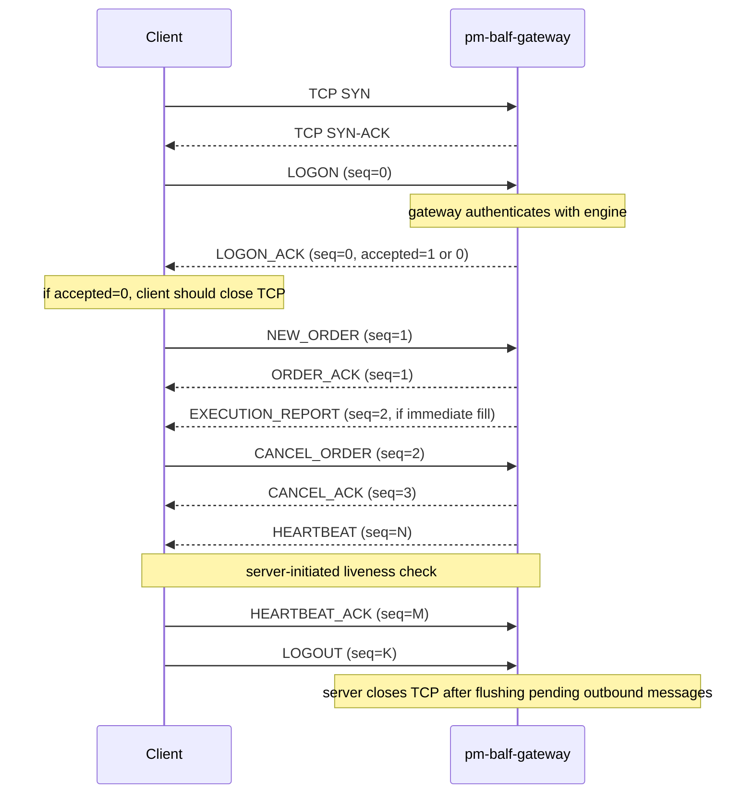

Version: 1.1.0

Date: 2026-06-14

Status: Design and Research Proposal


# BALF: Binary ALF Protocol — Design Proposal

---

## 1. Motivation

ALF (ALmost-FIX) is designed for interactive human use and simple bot
development. Several properties make it unsuitable for latency-sensitive
participants:

| Problem | ALF behaviour | HFT impact |
|---------|--------------|------------|
| Text parsing | `|` splitting, ASCII-to-float conversion | CPU cycles on the hot path |
| Variable message length | Unknown bytes-to-read until delimiter found | Forces buffered reads |
| No sequence numbers | Message loss is undetectable at the protocol level | Silent gap risk |
| No heartbeat | Dead session discovered only by absence of data | Unknown session liveness |
| stdin/stdout coupling | `pm-gateway` is an interactive process | Incompatible with poll/epoll loops |
| Price as ASCII decimal | `"150.25"` is 6 bytes + float parse | Unnecessary work per order |

**BALF** (Binary ALF) is a fixed-width binary protocol with the same semantic
model — identical order types, TIF values, SMP rules, and gateway authentication
— but designed from first principles for low-latency programmatic access.

### What BALF does NOT change

- The engine itself. BALF is translated by a new `pm-balf-gateway` process into
  the same ZeroMQ/JSON engine messages that ALF already produces.
- The set of tradeable instruments or order types available to a session.
- Gateway authentication — the same allowlist in `engine_config.yaml` is used.

### Non-goals for this proposal

- Encryption — delegate to TLS at the transport layer or a tunnel. BALF frames
  are cleartext.
- RDMA / kernel-bypass — BALF is designed to sit cleanly above a standard TCP
  socket; the trade-off between TCP and kernel-bypass transports is a separate
  decision.
- Multi-leg combo and OCO orders — out of scope for BALF `1.0.0`; kept only as
    future extension candidates.

---

## 2. Architecture

```
                 ┌─────────────────────┐
                 │  BALF Client        │
                 │  (Rust / C / other) │
                 └────────┬────────────┘
                          │ TCP :5560 (proposed)
                          │ raw binary frames
                          ▼
                 ┌─────────────────────┐
                 │  pm-balf-gateway    │ (new process)
                 │  translates BALF ↔  │
                 │  engine ZeroMQ/JSON │
                 └──────┬──────────────┘
                        │ PUSH → tcp://localhost:5555
                        │ SUB  ← tcp://localhost:5556
                        ▼
                 ┌─────────────────────┐
                 │  EduMatcher Engine  │ (unchanged)
                 └─────────────────────┘
```

`pm-balf-gateway` is the BALF analogue of `pm-gateway`. It accepts one TCP
connection per client, performs gateway authentication against the engine's
allowlist, and relays order traffic in both directions.

---

## 3. Transport

- **Protocol:** TCP, single full-duplex connection per gateway session.
- **Port:** 5560 (proposed; configurable in `engine_config.yaml`).
- **Framing:** All BALF messages are fixed-width; the size is entirely determined
  by the `msg_type` byte in the header. There is no length field to parse. The
  receiver reads exactly `BALF_MSG_SIZE[msg_type]` bytes after reading the
  8-byte header.
- **Byte order:** Little-endian throughout for BALF `1.0.0`. This is an
    explicit protocol convention and intentionally differs from ITCH/OUCH style
    big-endian network byte order. Modern trading infrastructure runs on x86;
    little-endian avoids byte-swap overhead on every hot-path numeric field.
- **Connection limit:** One TCP connection per gateway ID. A second connection
  with the same ID rejects at LOGON unless the first connection has been
  cleanly closed.

---

## 4. Frame Format

Every BALF message is an 8-byte header followed by a fixed-length body whose
size is determined by `msg_type`.

```
 0               1               2               3
 0 1 2 3 4 5 6 7 0 1 2 3 4 5 6 7 0 1 2 3 4 5 6 7 0 1 2 3 4 5 6 7
┌───────────────┬───────────────┬───────────────┬───────────────┐
│     magic     │    version    │   msg_type    │     flags     │
│    (0xBA)     │     (0x01)    │               │               │
├───────────────┴───────────────┴───────────────┴───────────────┤
│                           seq_no                              │
│                         (uint32 LE)                           │
└───────────────────────────────────────────────────────────────┘
         [body follows immediately — size fixed by msg_type]
```

### 4.1 Header fields

| Offset | Field | Type | Description |
|--------|-------|------|-------------|
| 0 | `magic` | `u8` | Always `0xBA`. Receiver must reject frames where this is wrong. |
| 1 | `version` | `u8` | Protocol version. Currently `1`. |
| 2 | `msg_type` | `u8` | Message type code — see §5. |
| 3 | `flags` | `u8` | Bit 0 reserved for future retransmit support. In BALF `1.0.0` all flag bits must be zero. |
| 4–7 | `seq_no` | `u32 LE` | Monotonically increasing sequence number. Client-to-server and server-to-client share separate counters, each starting at 1 on the first non-LOGON message. LOGON itself always carries seq_no `0`. |

### 4.2 Price encoding

All prices and price-like offsets (limit price, stop price, trailing offset)
are encoded as **signed 64-bit integers scaled by 10⁸**.

```
encoded = round(display_price × 100_000_000)

  $150.25   →  15_025_000_000
  $0.0001   →           10_000
  −$2.00    →  −200_000_000  (spread price or basis)
```

The scale provides 8 decimal places of precision, sufficient for equities,
fixed income, and most derivatives. A zero value (`0i64`) means the field is
not applicable for the given order type.

### 4.3 Symbol encoding

Symbols are stored as **8 bytes, zero-padded ASCII, left-aligned**. `"AAPL"` is
encoded as `[0x41, 0x50, 0x50, 0x4C, 0x00, 0x00, 0x00, 0x00]`. Symbols longer
than 8 ASCII characters are not supported in BALF v1.

### 4.4 Gateway ID encoding

Gateway IDs are stored as **16 bytes, zero-padded ASCII, left-aligned**.
`"TRADER01"` is `[0x54, 0x52, 0x41, 0x44, 0x45, 0x52, 0x30, 0x31, 0x00, ...]`.

### 4.5 Order ID encoding

BALF uses a compact **session-scoped `u64` order_id** on the wire (little-endian).
This is optimized for speed and frame compactness in cancel/amend/fill traffic.
`pm-balf-gateway` maintains the mapping between this BALF `u64` and the engine's
internal UUID order identifiers. An `order_id` of zero is invalid and reserved.

### 4.6 Client Order ID

Every client-to-server order message carries a `client_order_id` — a `u64` that
the client assigns. The server echoes it in every corresponding response. This
lets clients correlate responses with requests without UUID parsing.

---

## 5. Message Type Reference

### 5.1 Summary table

| Code | Name | Direction | Body bytes | Total frame bytes |
|------|------|-----------|------------|-------------------|
| `0x01` | `LOGON` | Client → Server | 24 | 32 |
| `0x02` | `LOGON_ACK` | Server → Client | 84 | 92 |
| `0x10` | `NEW_ORDER` | Client → Server | 52 | 60 |
| `0x11` | `ORDER_ACK` | Server → Client | 52 | 60 |
| `0x12` | `CANCEL_ORDER` | Client → Server | 16 | 24 |
| `0x13` | `CANCEL_ACK` | Server → Client | 24 | 32 |
| `0x14` | `AMEND_ORDER` | Client → Server | 36 | 44 |
| `0x15` | `AMEND_ACK` | Server → Client | 40 | 48 |
| `0x20` | `EXECUTION_REPORT` | Server → Client | 56 | 64 |
| `0x30` | `HEARTBEAT` | Bidirectional | 8 | 16 |
| `0x31` | `HEARTBEAT_ACK` | Bidirectional | 8 | 16 |
| `0x40` | `LOGOUT` | Client → Server | 0 | 8 |

All sizes include the 8-byte header.

---

### 5.2 `LOGON` (0x01) — Client → Server

Sent immediately after the TCP connection is established, before any orders.
`seq_no` is `0`.

**Body (24 bytes):**

```
Offset  0  │  gateway_id     │  u8[16]  │  Zero-padded ASCII gateway ID
Offset 16  │  proto_version  │  u8      │  Must be 1
Offset 17  │  _reserved      │  u8[7]   │  Must be zero
```

---

### 5.3 `LOGON_ACK` (0x02) — Server → Client

Sent in response to `LOGON`. `seq_no` is `0` on this message; normal
sequencing begins from `1` on subsequent messages.

**Body (84 bytes):**

```
Offset  0  │  gateway_id     │  u8[16]  │  Echoed gateway ID
Offset 16  │  accepted       │  u8      │  1 = accepted, 0 = rejected
Offset 17  │  reject_code    │  u8      │  See reject codes below; 0 if accepted
Offset 18  │  msg_len        │  u8      │  Byte length of the meaningful part of msg[]
Offset 19  │  _pad           │  u8      │  Reserved, zero
Offset 20  │  msg            │  u8[64]  │  Human-readable description or rejection reason
```

**Reject codes:**

| Code | Meaning |
|------|---------|
| `0x00` | No error (accepted) |
| `0x01` | Gateway ID not configured in engine |
| `0x02` | Gateway ID already connected |
| `0x03` | Protocol version mismatch |
| `0xFF` | Other (see `msg` field) |

---

### 5.4 `NEW_ORDER` (0x10) — Client → Server

**Body (52 bytes):**

```
Offset  0  │  client_order_id  │  u64 LE  │  Client-assigned reference, echoed in all responses
Offset  8  │  symbol           │  u8[8]   │  Zero-padded ASCII symbol
Offset 16  │  price            │  i64 LE  │  Limit price × 10⁸; 0 for MARKET/STOP orders
Offset 24  │  stop_price       │  i64 LE  │  Stop trigger × 10⁸; 0 if unused
Offset 32  │  trail_offset     │  i64 LE  │  Trailing offset × 10⁸; 0 if unused
Offset 40  │  quantity         │  u32 LE  │  Order quantity
Offset 44  │  visible_qty      │  u32 LE  │  ICEBERG peak size; 0 for all other types
Offset 48  │  side             │  u8      │  1 = BUY, 2 = SELL
Offset 49  │  order_type       │  u8      │  See order type codes below
Offset 50  │  tif              │  u8      │  See TIF codes below
Offset 51  │  smp              │  u8      │  See SMP codes below
```

**Order type codes:**

| Code | ALF equivalent | Required price fields |
|------|---------------|----------------------|
| `0x01` | `MARKET` | none (price = 0) |
| `0x02` | `LIMIT` | `price` |
| `0x03` | `IOC` | `price` |
| `0x04` | `FOK` | `price` |
| `0x05` | `STOP` | `stop_price` |
| `0x06` | `STOP_LIMIT` | `stop_price` and `price` |
| `0x07` | `ICEBERG` | `price` and `visible_qty` |
| `0x08` | `TRAILING_STOP` | `trail_offset`; optionally `stop_price` |

**TIF codes:**

| Code | ALF equivalent |
|------|---------------|
| `0x01` | `DAY` |
| `0x02` | `GTC` |
| `0x03` | `ATO` |
| `0x04` | `ATC` |

**SMP codes:**

| Code | ALF equivalent |
|------|---------------|
| `0x00` | `NONE` |
| `0x01` | `CANCEL_AGGRESSOR` |
| `0x02` | `CANCEL_RESTING` |
| `0x03` | `CANCEL_BOTH` |

---

### 5.5 `ORDER_ACK` (0x11) — Server → Client

Sent for every `NEW_ORDER`. Arrives before any `EXECUTION_REPORT` for the same
order.

**Body (52 bytes):**

```
Offset  0  │  client_order_id  │  u64 LE  │  Echoed from NEW_ORDER
Offset  8  │  order_id         │  u64 LE  │  Session-scoped BALF order ID; 0 if rejected
Offset 16  │  timestamp_ns     │  u64 LE  │  Nanoseconds since Unix epoch (engine receive time)
Offset 24  │  accepted         │  u8      │  1 = accepted, 0 = rejected
Offset 25  │  reject_code      │  u8      │  See reject codes below; 0 if accepted
Offset 26  │  reason_len       │  u8      │  Length of meaningful bytes in reason[]
Offset 27  │  reason           │  u8[25]  │  Rejection reason string (ASCII); zeros if accepted
```

**Reject codes:**

| Code | Meaning |
|------|---------|
| `0x00` | Accepted |
| `0x01` | Gateway not configured |
| `0x02` | Gateway not connected |
| `0x03` | Symbol not configured |
| `0x04` | Market is closed |
| `0x05` | ATO outside opening auction |
| `0x06` | ATC outside closing auction |
| `0x07` | Halt rejection for `MARKET` / `FOK` / `IOC` |
| `0x08` | Session-phase rejection for non-resting order types |
| `0x09` | Trailing stop missing `STOP` and no prior trade price |
| `0x0A` | Insufficient liquidity |
| `0x0B` | Price collar rejection |
| `0xFF` | Other (see `reason` field) |

`reason` is the engine-authored rejection detail and remains authoritative.
`reject_code` is a compact classification derived from that reason text.

**Deterministic classifier (v1.0.0):**

The gateway must classify `reject_code` using ordered prefix/contains matching
on engine `reason` text (first match wins):

| Match rule on `reason` | `reject_code` |
|---|---|
| startswith `Gateway not configured:` | `0x01` |
| startswith `Gateway not connected:` | `0x02` |
| startswith `Symbol not configured:` | `0x03` |
| equals `Market is closed` | `0x04` |
| startswith `ATO orders only accepted during` | `0x05` |
| startswith `ATC orders only accepted during` | `0x06` |
| contains `orders rejected during circuit breaker halt` | `0x07` |
| contains `orders not accepted during` | `0x08` |
| equals `Trailing stop requires STOP= or a prior trade price` | `0x09` |
| equals `Insufficient liquidity` | `0x0A` |
| contains `collar` | `0x0B` |
| otherwise | `0xFF` |

If `accepted=1`, `reject_code` must be `0x00` regardless of `reason` contents.

---

### 5.6 `CANCEL_ORDER` (0x12) — Client → Server

**Body (16 bytes):**

```
Offset  0  │  client_order_id  │  u64 LE  │  New client ref for this cancel request
Offset  8  │  order_id         │  u64 LE  │  Session-scoped BALF order ID to cancel
```

---

### 5.7 `CANCEL_ACK` (0x13) — Server → Client

**Body (24 bytes):**

```
Offset  0  │  client_order_id  │  u64 LE  │  Echoed from CANCEL_ORDER
Offset  8  │  order_id         │  u64 LE  │  Order being cancelled
Offset 16  │  accepted         │  u8      │  1 = cancelled, 0 = rejected
Offset 17  │  cancel_reason    │  u8      │  0 = explicit CANCEL request confirmed, 255 = unspecified/system-originated cancel
Offset 18  │  _reserved        │  u8[6]   │  Must be zero
```

Notes:

- A successful cancel confirmation comes from engine topic `order.cancelled.{GW}`.
- Cancel rejects come from `order.ack.{GW}` and are translated into
    `CANCEL_ACK(accepted=0)` by gateway request-correlation state.
- Canonical reject reasons currently include: `Order not found`,
    `Cannot cancel an order owned by another gateway`, and gateway auth/connect
    failures.

---

### 5.8 `AMEND_ORDER` (0x14) — Client → Server

Amends price and/or quantity of a resting LIMIT or ICEBERG order. At least one
of the `amend_flags` bits must be set.

**Body (36 bytes):**

```
Offset  0  │  client_order_id  │  u64 LE  │  New client ref for this amend request
Offset  8  │  order_id         │  u64 LE  │  Session-scoped BALF order ID to amend
Offset 16  │  new_price        │  i64 LE  │  New limit price × 10⁸; ignored if bit 0 of amend_flags is clear
Offset 24  │  new_quantity     │  u32 LE  │  New total quantity; ignored if bit 1 of amend_flags is clear
Offset 28  │  amend_flags      │  u8      │  Bit 0 = price changed, bit 1 = quantity changed
Offset 29  │  _reserved        │  u8[7]   │  Must be zero
```

---

### 5.9 `AMEND_ACK` (0x15) — Server → Client

**Body (40 bytes):**

```
Offset  0  │  client_order_id  │  u64 LE  │  Echoed from AMEND_ORDER
Offset  8  │  order_id         │  u64 LE  │  Amended order
Offset 16  │  new_price        │  i64 LE  │  Price after amendment × 10⁸
Offset 24  │  new_quantity     │  u32 LE  │  Total quantity after amendment
Offset 28  │  remaining_qty    │  u32 LE  │  Unfilled quantity after amendment
Offset 32  │  accepted         │  u8      │  1 = accepted, 0 = rejected
Offset 33  │  priority_reset   │  u8      │  1 = order lost time priority; 0 = priority preserved
Offset 34  │  _reserved        │  u8[6]   │  Must be zero
```

Notes:

- Successful amend confirmations come from engine topic `order.amended.{GW}`.
- Amend rejects come from `order.ack.{GW}` and are translated into
    `AMEND_ACK(accepted=0)` by gateway request-correlation state.
- Canonical reject reasons currently include: `Amend requires at least PRICE or QTY`,
    `Order not found`, `Cannot amend an order owned by another gateway`, and
    symbol/session validation failures returned by `book.amend_order()`.

---

### 5.10 `EXECUTION_REPORT` (0x20) — Server → Client

Sent for every partial or full fill. Both sides of a match (aggressor and
resting order) receive their own `EXECUTION_REPORT`.

**Body (56 bytes):**

```
Offset  0  │  client_order_id  │  u64 LE  │  Echoed from the original NEW_ORDER
Offset  8  │  order_id         │  u64 LE  │  Filled order ID
Offset 16  │  fill_price       │  i64 LE  │  Execution price × 10⁸
Offset 24  │  fill_qty         │  u32 LE  │  Quantity matched in this event
Offset 28  │  remaining_qty    │  u32 LE  │  Unfilled quantity after this fill
Offset 32  │  timestamp_ns     │  u64 LE  │  Trade timestamp — nanoseconds since Unix epoch
Offset 40  │  symbol           │  u8[8]   │  Symbol (for convenience; matches original order)
Offset 48  │  side             │  u8      │  1 = BUY, 2 = SELL
Offset 49  │  status           │  u8      │  1 = PARTIAL, 2 = FILLED
Offset 50  │  _reserved        │  u8[6]   │  Must be zero
```

---

### 5.11 `HEARTBEAT` (0x30) — Bidirectional

Either side may send a heartbeat at any time. The recipient must respond with
`HEARTBEAT_ACK`. A session is considered dead if no traffic (including
heartbeats) arrives within 5 seconds (configurable). The default send interval
is 1 second.

**Body (8 bytes):**

```
Offset  0  │  send_time_ns  │  u64 LE  │  Sender's wall-clock time in nanoseconds since Unix epoch
```

---

### 5.12 `HEARTBEAT_ACK` (0x31) — Bidirectional

**Body (8 bytes):**

```
Offset  0  │  orig_send_time_ns  │  u64 LE  │  Echo of the send_time_ns from the HEARTBEAT
```

---

### 5.13 `LOGOUT` (0x40) — Client → Server

Graceful disconnect. No body. After sending `LOGOUT`, the client must not send
any further messages and should close the TCP connection. The server will flush
any pending outbound messages and then close the connection on its side.

**Body: none (total frame = 8 bytes, header only).**

---

## 6. Session Lifecycle



### 6.1 Handshake and authentication contract

`pm-balf-gateway` must follow the same engine authentication bridge used by
`pm-alf-gwy`:

1. Client connects over TCP and sends `LOGON`.
2. Gateway validates BALF frame-level fields (`magic`, `version`, body size,
     zeroed reserved bits).
3. Gateway sends `system.gateway_connect` to the engine for `gateway_id`.
4. Gateway waits for `system.gateway_auth.{gateway_id}`.
5. Gateway sends `LOGON_ACK(accepted=1|0)` to client and only accepts order
     traffic after `accepted=1`.

This keeps BALF auth semantics aligned with ALF gateway and API gateway.

### 6.2 Disconnect semantics and passive-order policy

BALF disconnect behavior is config-driven by the gateway identity's
`disconnect_behaviour` in engine config. The BALF gateway must not implement a
separate policy engine.

Disconnect trigger classes:

- Graceful client logout (`LOGOUT`).
- Heartbeat timeout (no inbound traffic within `heartbeat_timeout_sec`).
- Idle timeout / liveness expiry.
- Transport break (TCP FIN/RST, peer closed).
- Protocol safety disconnect (bad framing, sequence gap, repeated invalid
    messages, outbound queue overflow).

On every disconnect trigger, gateway must send:

```text
system.gateway_disconnect|gateway_id=<GW>|reason=<REASON>
```

The engine applies `disconnect_behaviour`:

| `disconnect_behaviour` | Engine action on disconnect |
|---|---|
| `LEAVE_ALL` | Leave quotes and resting non-quote orders untouched |
| `CANCEL_QUOTES_ONLY` | Cancel all active quotes for gateway; keep non-quote resting orders |
| `CANCEL_ALL` | Cancel all active quotes and all resting non-quote orders |

This explicitly covers outstanding passive orders and keeps BALF behavior
coherent with existing engine semantics.

### 6.3 Duplicate session policy

Default policy for BALF `1.0.0` is `REJECT_NEW`: if a gateway ID is already
connected, a second `LOGON` is rejected with `LOGON_ACK(accepted=0,
reject_code=0x02)`.

Future-compatible config key:

- `duplicate_session_policy: REJECT_NEW | EVICT_OLD`

`EVICT_OLD` is optional for later phases and should only be enabled when
operationally required.

### Sequence number rules

- Separate, independent sequence counters for each direction.
- Both counters start at **1** on the first non-LOGON message.
- LOGON and LOGON_ACK carry seq_no `0` by convention and are not part of the
  numbered sequence.
- Sequence numbers increment by 1 per message. They wrap to 1 (not 0) at
  `UINT32_MAX`.
- A gap in the inbound sequence number is a protocol error; the receiver should
  log it and may close the connection.
- BALF `1.0.0` does not define a resend/recovery request. On detected gaps,
    receivers should treat the session as out-of-sync and reconnect.
- The `RETRANSMIT` flag is reserved for a future recovery extension and must
    be `0` in BALF `1.0.0`.

---

## 7. Worked Examples

### 7.1 Submit a LIMIT BUY order for 100 AAPL at $150.25

ALF equivalent: `NEW|SYM=AAPL|SIDE=BUY|TYPE=LIMIT|QTY=100|PRICE=150.25`

Frame bytes (60 total, shown as hex with annotations):

```
Header (8 bytes):
  BA 01 10 00  │  magic=0xBA, version=1, msg_type=NEW_ORDER(0x10), flags=0
  01 00 00 00  │  seq_no=1 (LE)

Body (52 bytes):
  01 00 00 00  00 00 00 00  │  client_order_id = 1 (LE u64)
  41 50 50 4C  00 00 00 00  │  symbol = "AAPL\0\0\0\0"
  00 10 28 65  03 00 00 00  │  price = 15_025_000_000 = 0x0000000003652810 (LE i64)
  00 00 00 00  00 00 00 00  │  stop_price = 0
  00 00 00 00  00 00 00 00  │  trail_offset = 0
  64 00 00 00  │  quantity = 100 (LE u32)
  00 00 00 00  │  visible_qty = 0
  01           │  side = BUY
  02           │  order_type = LIMIT
  01           │  tif = DAY
  00           │  smp = NONE
```

Price calculation: 150.25 × 100,000,000 = 15,025,000,000 = `0x0000_0003_6528_1000`  
In little-endian bytes: `00 10 28 65 03 00 00 00`

### 7.2 Cancel that order

```
Header:
  BA 01 12 00  │  msg_type=CANCEL_ORDER(0x12)
  02 00 00 00  │  seq_no=2

Body:
  02 00 00 00  00 00 00 00  │  client_order_id = 2
    [8-byte LE session order_id received in ORDER_ACK]
```

---

## 8. Rust Implementation

### 8.1 Types and constants

```rust
// balf.rs — BALF protocol types and codec
//
// Compile with: rustc --edition 2021 balf_example.rs

use std::io::{Read, Write};
use std::net::TcpStream;
use std::time::{SystemTime, UNIX_EPOCH};

// ── Constants ───────────────────────────────────────────────────────────────

pub const BALF_MAGIC: u8   = 0xBA;
pub const BALF_VERSION: u8 = 0x01;

// Price scale factor: multiply display price by this before encoding
pub const PRICE_SCALE: i64 = 100_000_000;

// Message type codes
pub mod msg {
    pub const LOGON:            u8 = 0x01;
    pub const LOGON_ACK:        u8 = 0x02;
    pub const NEW_ORDER:        u8 = 0x10;
    pub const ORDER_ACK:        u8 = 0x11;
    pub const CANCEL_ORDER:     u8 = 0x12;
    pub const CANCEL_ACK:       u8 = 0x13;
    pub const AMEND_ORDER:      u8 = 0x14;
    pub const AMEND_ACK:        u8 = 0x15;
    pub const EXECUTION_REPORT: u8 = 0x20;
    pub const HEARTBEAT:        u8 = 0x30;
    pub const HEARTBEAT_ACK:    u8 = 0x31;
    pub const LOGOUT:           u8 = 0x40;
}

// Total frame sizes (header + body)
pub fn frame_size(msg_type: u8) -> Option<usize> {
    match msg_type {
        msg::LOGON            => Some(32),
        msg::LOGON_ACK        => Some(92),
        msg::NEW_ORDER        => Some(60),
        msg::ORDER_ACK        => Some(60),
        msg::CANCEL_ORDER     => Some(24),
        msg::CANCEL_ACK       => Some(32),
        msg::AMEND_ORDER      => Some(44),
        msg::AMEND_ACK        => Some(48),
        msg::EXECUTION_REPORT => Some(64),
        msg::HEARTBEAT        => Some(16),
        msg::HEARTBEAT_ACK    => Some(16),
        msg::LOGOUT           => Some(8),
        _                     => None,
    }
}

// ── Order type, side, TIF, SMP codes ────────────────────────────────────────

pub mod side {
    pub const BUY:  u8 = 0x01;
    pub const SELL: u8 = 0x02;
}

pub mod order_type {
    pub const MARKET:        u8 = 0x01;
    pub const LIMIT:         u8 = 0x02;
    pub const IOC:           u8 = 0x03;
    pub const FOK:           u8 = 0x04;
    pub const STOP:          u8 = 0x05;
    pub const STOP_LIMIT:    u8 = 0x06;
    pub const ICEBERG:       u8 = 0x07;
    pub const TRAILING_STOP: u8 = 0x08;
}

pub mod tif {
    pub const DAY: u8 = 0x01;
    pub const GTC: u8 = 0x02;
    pub const ATO: u8 = 0x03;
    pub const ATC: u8 = 0x04;
}

pub mod smp {
    pub const NONE:              u8 = 0x00;
    pub const CANCEL_AGGRESSOR:  u8 = 0x01;
    pub const CANCEL_RESTING:    u8 = 0x02;
    pub const CANCEL_BOTH:       u8 = 0x03;
}

// ── Helper: encode a display price to wire format ───────────────────────────

pub fn encode_price(display: f64) -> i64 {
    (display * PRICE_SCALE as f64).round() as i64
}

pub fn decode_price(wire: i64) -> f64 {
    wire as f64 / PRICE_SCALE as f64
}

// ── Helper: encode a symbol or gateway ID into a fixed-width byte array ─────

pub fn encode_symbol(s: &str) -> [u8; 8] {
    let mut buf = [0u8; 8];
    let bytes = s.as_bytes();
    let len = bytes.len().min(8);
    buf[..len].copy_from_slice(&bytes[..len]);
    buf
}

pub fn encode_gateway_id(s: &str) -> [u8; 16] {
    let mut buf = [0u8; 16];
    let bytes = s.as_bytes();
    let len = bytes.len().min(16);
    buf[..len].copy_from_slice(&bytes[..len]);
    buf
}

// ── Header builder ───────────────────────────────────────────────────────────

pub fn build_header(msg_type: u8, flags: u8, seq_no: u32) -> [u8; 8] {
    let mut h = [0u8; 8];
    h[0] = BALF_MAGIC;
    h[1] = BALF_VERSION;
    h[2] = msg_type;
    h[3] = flags;
    h[4..8].copy_from_slice(&seq_no.to_le_bytes());
    h
}

// ── Message builders ─────────────────────────────────────────────────────────

pub fn build_logon(gateway_id: &str) -> Vec<u8> {
    let mut buf = Vec::with_capacity(32);
    buf.extend_from_slice(&build_header(msg::LOGON, 0, 0));
    buf.extend_from_slice(&encode_gateway_id(gateway_id)); // 16 bytes
    buf.push(BALF_VERSION);                                  // proto_version
    buf.extend_from_slice(&[0u8; 7]);                        // reserved
    buf
}

pub struct NewOrderParams<'a> {
    pub client_order_id: u64,
    pub symbol:          &'a str,
    pub side:            u8,
    pub order_type:      u8,
    pub tif:             u8,
    pub smp:             u8,
    pub quantity:        u32,
    pub price:           f64,       // 0.0 for MARKET
    pub stop_price:      f64,       // 0.0 if unused
    pub trail_offset:    f64,       // 0.0 if unused
    pub visible_qty:     u32,       // 0 unless ICEBERG
}

pub fn build_new_order(params: &NewOrderParams, seq_no: u32) -> Vec<u8> {
    let mut buf = Vec::with_capacity(60);
    buf.extend_from_slice(&build_header(msg::NEW_ORDER, 0, seq_no));
    buf.extend_from_slice(&params.client_order_id.to_le_bytes());
    buf.extend_from_slice(&encode_symbol(params.symbol));
    buf.extend_from_slice(&encode_price(params.price).to_le_bytes());
    buf.extend_from_slice(&encode_price(params.stop_price).to_le_bytes());
    buf.extend_from_slice(&encode_price(params.trail_offset).to_le_bytes());
    buf.extend_from_slice(&params.quantity.to_le_bytes());
    buf.extend_from_slice(&params.visible_qty.to_le_bytes());
    buf.push(params.side);
    buf.push(params.order_type);
    buf.push(params.tif);
    buf.push(params.smp);
    buf
}

pub fn build_cancel_order(client_order_id: u64, order_id: u64, seq_no: u32) -> Vec<u8> {
    let mut buf = Vec::with_capacity(24);
    buf.extend_from_slice(&build_header(msg::CANCEL_ORDER, 0, seq_no));
    buf.extend_from_slice(&client_order_id.to_le_bytes());
    buf.extend_from_slice(&order_id.to_le_bytes());
    buf
}

pub fn build_amend_order(
    client_order_id: u64,
    order_id: u64,
    new_price: Option<f64>,
    new_quantity: Option<u32>,
    seq_no: u32,
) -> Vec<u8> {
    let mut buf = Vec::with_capacity(44);
    buf.extend_from_slice(&build_header(msg::AMEND_ORDER, 0, seq_no));
    buf.extend_from_slice(&client_order_id.to_le_bytes());
    buf.extend_from_slice(&order_id.to_le_bytes());

    let price_wire = new_price.map_or(0i64, encode_price);
    let qty_wire   = new_quantity.unwrap_or(0u32);
    let flags: u8  = (new_price.is_some() as u8) | ((new_quantity.is_some() as u8) << 1);

    buf.extend_from_slice(&price_wire.to_le_bytes());
    buf.extend_from_slice(&qty_wire.to_le_bytes());
    buf.push(flags);
    buf.extend_from_slice(&[0u8; 7]); // reserved
    buf
}

pub fn build_logout(seq_no: u32) -> Vec<u8> {
    build_header(msg::LOGOUT, 0, seq_no).to_vec()
}

// ── Response parsing ──────────────────────────────────────────────────────────

pub struct LogonAck {
    pub gateway_id: [u8; 16],
    pub accepted:   bool,
    pub reject_code: u8,
    pub message:    String,
}

pub struct OrderAck {
    pub client_order_id: u64,
    pub order_id:        u64,
    pub timestamp_ns:    u64,
    pub accepted:        bool,
    pub reject_code:     u8,
    pub reason:          String,
}

pub struct ExecutionReport {
    pub client_order_id: u64,
    pub order_id:        u64,
    pub fill_price:      f64,
    pub fill_qty:        u32,
    pub remaining_qty:   u32,
    pub timestamp_ns:    u64,
    pub symbol:          String,
    pub side:            u8,
    pub status:          u8,  // 1=PARTIAL, 2=FILLED
}

// Read exactly n bytes from the stream (blocking)
fn read_exact(stream: &mut TcpStream, n: usize) -> std::io::Result<Vec<u8>> {
    let mut buf = vec![0u8; n];
    stream.read_exact(&mut buf)?;
    Ok(buf)
}

/// Read the next complete BALF frame from the stream.
/// Returns (msg_type, seq_no, body_bytes) or an IO error.
pub fn read_frame(stream: &mut TcpStream) -> std::io::Result<(u8, u32, Vec<u8>)> {
    let header = read_exact(stream, 8)?;
    if header[0] != BALF_MAGIC {
        return Err(std::io::Error::new(
            std::io::ErrorKind::InvalidData,
            format!("Bad magic byte: 0x{:02X}", header[0]),
        ));
    }
    let msg_type = header[2];
    let seq_no   = u32::from_le_bytes(header[4..8].try_into().unwrap());
    let total    = frame_size(msg_type).ok_or_else(|| {
        std::io::Error::new(std::io::ErrorKind::InvalidData,
            format!("Unknown msg_type: 0x{:02X}", msg_type))
    })?;
    let body = read_exact(stream, total - 8)?;
    Ok((msg_type, seq_no, body))
}

pub fn parse_logon_ack(body: &[u8]) -> LogonAck {
    let mut gw = [0u8; 16];
    gw.copy_from_slice(&body[0..16]);
    let accepted    = body[16] == 1;
    let reject_code = body[17];
    let msg_len     = body[18] as usize;
    let message     = String::from_utf8_lossy(&body[20..20 + msg_len.min(64)]).to_string();
    LogonAck { gateway_id: gw, accepted, reject_code, message }
}

pub fn parse_order_ack(body: &[u8]) -> OrderAck {
    let client_order_id = u64::from_le_bytes(body[0..8].try_into().unwrap());
    let order_id        = u64::from_le_bytes(body[8..16].try_into().unwrap());
    let timestamp_ns    = u64::from_le_bytes(body[16..24].try_into().unwrap());
    let accepted        = body[24] == 1;
    let reject_code     = body[25];
    let reason_len      = body[26] as usize;
    let reason = String::from_utf8_lossy(&body[27..27 + reason_len.min(25)]).to_string();
    OrderAck { client_order_id, order_id, timestamp_ns, accepted, reject_code, reason }
}

pub fn parse_execution_report(body: &[u8]) -> ExecutionReport {
    let client_order_id = u64::from_le_bytes(body[0..8].try_into().unwrap());
    let order_id        = u64::from_le_bytes(body[8..16].try_into().unwrap());
    let fill_price_raw  = i64::from_le_bytes(body[16..24].try_into().unwrap());
    let fill_qty        = u32::from_le_bytes(body[24..28].try_into().unwrap());
    let remaining_qty   = u32::from_le_bytes(body[28..32].try_into().unwrap());
    let timestamp_ns    = u64::from_le_bytes(body[32..40].try_into().unwrap());
    let symbol = String::from_utf8_lossy(
        body[40..48].split(|&b| b == 0).next().unwrap_or(&body[40..48])
    ).to_string();
    let side   = body[48];
    let status = body[49];
    ExecutionReport {
        client_order_id,
        order_id,
        fill_price: decode_price(fill_price_raw),
        fill_qty,
        remaining_qty,
        timestamp_ns,
        symbol,
        side,
        status,
    }
}
```

### 8.2 Full session example

```rust
// main.rs — Connect, authenticate, submit a LIMIT order, receive ack and fill

mod balf; // bring in the types above

use balf::*;

fn now_ns() -> u64 {
    SystemTime::now()
        .duration_since(UNIX_EPOCH)
        .unwrap()
        .as_nanos() as u64
}

fn main() -> std::io::Result<()> {
    let mut stream = TcpStream::connect("127.0.0.1:5560")?;
    let mut send_seq: u32 = 0;
    let mut client_order_counter: u64 = 0;
    let mut active_order_id: u64 = 0;

    // ── Step 1: LOGON ────────────────────────────────────────────────────────
    let logon = build_logon("TRADER01");
    stream.write_all(&logon)?;
    println!("Sent LOGON for TRADER01");

    // ── Step 2: Wait for LOGON_ACK ───────────────────────────────────────────
    let (msg_type, _, body) = read_frame(&mut stream)?;
    assert_eq!(msg_type, msg::LOGON_ACK, "Expected LOGON_ACK");
    let ack = parse_logon_ack(&body);
    if !ack.accepted {
        eprintln!("LOGON rejected: code={} msg={}", ack.reject_code, ack.message);
        return Ok(());
    }
    println!("LOGON accepted: {}", ack.message);

    // ── Step 3: Submit a LIMIT BUY 100 AAPL @ $150.25 ───────────────────────
    send_seq += 1;
    client_order_counter += 1;

    let order = build_new_order(&NewOrderParams {
        client_order_id: client_order_counter,
        symbol:          "AAPL",
        side:            side::BUY,
        order_type:      order_type::LIMIT,
        tif:             tif::DAY,
        smp:             smp::NONE,
        quantity:        100,
        price:           150.25,
        stop_price:      0.0,
        trail_offset:    0.0,
        visible_qty:     0,
    }, send_seq);
    stream.write_all(&order)?;
    println!("Sent NEW_ORDER seq={send_seq} clordid={client_order_counter}");

    // ── Step 4: Read ORDER_ACK ───────────────────────────────────────────────
    let (msg_type, _, body) = read_frame(&mut stream)?;
    assert_eq!(msg_type, msg::ORDER_ACK, "Expected ORDER_ACK");
    let order_ack = parse_order_ack(&body);
    if !order_ack.accepted {
        eprintln!(
            "Order rejected: code={} reason={}",
            order_ack.reject_code, order_ack.reason
        );
        return Ok(());
    }
    println!(
        "Order accepted: order_id={} ts_ns={}",
        order_ack.order_id, order_ack.timestamp_ns
    );
    active_order_id = order_ack.order_id;

    // ── Step 5: Wait for an EXECUTION_REPORT (if resting, may not arrive) ───
    // In a real client this would be in a receive loop on a separate thread.
    let (msg_type, _, body) = read_frame(&mut stream)?;
    if msg_type == msg::EXECUTION_REPORT {
        let er = parse_execution_report(&body);
        println!(
            "Fill: {}x{} @ {:.4}  remaining={} status={}",
            er.symbol, er.fill_qty, er.fill_price, er.remaining_qty,
            if er.status == 1 { "PARTIAL" } else { "FILLED" }
        );
    }

    // ── Step 6: Cancel the order if still resting ────────────────────────────
    send_seq += 1;
    client_order_counter += 1;
    let cancel = build_cancel_order(client_order_counter, active_order_id, send_seq);
    stream.write_all(&cancel)?;
    println!("Sent CANCEL seq={send_seq}");

    let (msg_type, _, body) = read_frame(&mut stream)?;
    assert_eq!(msg_type, msg::CANCEL_ACK);
    let accepted = body[16] == 1;
    println!("Cancel {}", if accepted { "confirmed" } else { "rejected" });

    // ── Step 7: Graceful logout ──────────────────────────────────────────────
    send_seq += 1;
    stream.write_all(&build_logout(send_seq))?;
    println!("Sent LOGOUT");

    Ok(())
}
```

---

## 9. C Implementation

### 9.1 Types and constants

```c
/* balf.h — BALF protocol definitions
 *
 * Compile example:  gcc -O2 -Wall -o balf_example balf_example.c
 */

#ifndef BALF_H
#define BALF_H

#include <stdint.h>
#include <string.h>

/* ── Constants ─────────────────────────────────────────────────────────────── */

#define BALF_MAGIC        0xBAu
#define BALF_VERSION      0x01u
#define PRICE_SCALE       100000000LL  /* 10^8 */

/* Message type codes */
#define BALF_LOGON            0x01u
#define BALF_LOGON_ACK        0x02u
#define BALF_NEW_ORDER        0x10u
#define BALF_ORDER_ACK        0x11u
#define BALF_CANCEL_ORDER     0x12u
#define BALF_CANCEL_ACK       0x13u
#define BALF_AMEND_ORDER      0x14u
#define BALF_AMEND_ACK        0x15u
#define BALF_EXECUTION_REPORT 0x20u
#define BALF_HEARTBEAT        0x30u
#define BALF_HEARTBEAT_ACK    0x31u
#define BALF_LOGOUT           0x40u

/* Side codes */
#define BALF_SIDE_BUY         0x01u
#define BALF_SIDE_SELL        0x02u

/* Order type codes */
#define BALF_TYPE_MARKET      0x01u
#define BALF_TYPE_LIMIT       0x02u
#define BALF_TYPE_IOC         0x03u
#define BALF_TYPE_FOK         0x04u
#define BALF_TYPE_STOP        0x05u
#define BALF_TYPE_STOP_LIMIT  0x06u
#define BALF_TYPE_ICEBERG     0x07u
#define BALF_TYPE_TRAILING    0x08u

/* TIF codes */
#define BALF_TIF_DAY          0x01u
#define BALF_TIF_GTC          0x02u
#define BALF_TIF_ATO          0x03u
#define BALF_TIF_ATC          0x04u

/* SMP codes */
#define BALF_SMP_NONE             0x00u
#define BALF_SMP_CANCEL_AGGRESSOR 0x01u
#define BALF_SMP_CANCEL_RESTING   0x02u
#define BALF_SMP_CANCEL_BOTH      0x03u

/* Fill status codes */
#define BALF_STATUS_PARTIAL   0x01u
#define BALF_STATUS_FILLED    0x02u

/* Amend flags (bitmask) */
#define BALF_AMEND_PRICE    0x01u
#define BALF_AMEND_QTY      0x02u

/* ── Wire structs (packed — no compiler padding on the wire) ────────────────── */

#pragma pack(push, 1)

typedef struct {
    uint8_t  magic;       /* 0xBA                          */
    uint8_t  version;     /* 1                             */
    uint8_t  msg_type;
    uint8_t  flags;
    uint32_t seq_no;      /* little-endian                 */
} BalfHeader;             /* 8 bytes                       */

typedef struct {
    BalfHeader hdr;
    uint8_t  gateway_id[16];
    uint8_t  proto_version;
    uint8_t  reserved[7];
} BalfLogon;              /* 32 bytes                      */

typedef struct {
    BalfHeader hdr;
    uint8_t  gateway_id[16];
    uint8_t  accepted;
    uint8_t  reject_code;
    uint8_t  msg_len;
    uint8_t  _pad;
    uint8_t  msg[64];
} BalfLogonAck;           /* 92 bytes                      */

typedef struct {
    BalfHeader hdr;
    uint64_t client_order_id;  /* little-endian */
    uint8_t  symbol[8];
    int64_t  price;            /* fixed-point x10^8, little-endian */
    int64_t  stop_price;
    int64_t  trail_offset;
    uint32_t quantity;
    uint32_t visible_qty;
    uint8_t  side;
    uint8_t  order_type;
    uint8_t  tif;
    uint8_t  smp;
} BalfNewOrder;           /* 60 bytes                      */

typedef struct {
    BalfHeader hdr;
    uint64_t client_order_id;
    uint64_t order_id;
    uint64_t timestamp_ns;
    uint8_t  accepted;
    uint8_t  reject_code;
    uint8_t  reason_len;
    uint8_t  reason[25];
} BalfOrderAck;           /* 60 bytes                      */

typedef struct {
    BalfHeader hdr;
    uint64_t client_order_id;
    uint64_t order_id;
} BalfCancelOrder;        /* 24 bytes                      */

typedef struct {
    BalfHeader hdr;
    uint64_t client_order_id;
    uint64_t order_id;
    uint8_t  accepted;
    uint8_t  cancel_reason;
    uint8_t  reserved[6];
} BalfCancelAck;          /* 32 bytes                      */

typedef struct {
    BalfHeader hdr;
    uint64_t client_order_id;
    uint64_t order_id;
    int64_t  new_price;
    uint32_t new_quantity;
    uint8_t  amend_flags;
    uint8_t  reserved[7];
} BalfAmendOrder;         /* 44 bytes                      */

typedef struct {
    BalfHeader hdr;
    uint64_t client_order_id;
    uint64_t order_id;
    int64_t  new_price;
    uint32_t new_quantity;
    uint32_t remaining_qty;
    uint8_t  accepted;
    uint8_t  priority_reset;
    uint8_t  reserved[6];
} BalfAmendAck;           /* 48 bytes                      */

typedef struct {
    BalfHeader hdr;
    uint64_t client_order_id;
    uint64_t order_id;
    int64_t  fill_price;
    uint32_t fill_qty;
    uint32_t remaining_qty;
    uint64_t timestamp_ns;
    uint8_t  symbol[8];
    uint8_t  side;
    uint8_t  status;
    uint8_t  reserved[6];
} BalfExecutionReport;    /* 64 bytes                      */

typedef struct {
    BalfHeader hdr;
    uint64_t send_time_ns;
} BalfHeartbeat;          /* 16 bytes                      */

#pragma pack(pop)

/* ── Frame size lookup ──────────────────────────────────────────────────────── */

static inline int balf_frame_size(uint8_t msg_type) {
    switch (msg_type) {
        case BALF_LOGON:            return  32;
        case BALF_LOGON_ACK:        return  92;
        case BALF_NEW_ORDER:        return  60;
        case BALF_ORDER_ACK:        return  60;
        case BALF_CANCEL_ORDER:     return  24;
        case BALF_CANCEL_ACK:       return  32;
        case BALF_AMEND_ORDER:      return  44;
        case BALF_AMEND_ACK:        return  48;
        case BALF_EXECUTION_REPORT: return  64;
        case BALF_HEARTBEAT:        return  16;
        case BALF_HEARTBEAT_ACK:    return  16;
        case BALF_LOGOUT:           return   8;
        default:                    return  -1;
    }
}

/* ── Price helpers ──────────────────────────────────────────────────────────── */

static inline int64_t balf_encode_price(double display_price) {
    return (int64_t)(display_price * (double)PRICE_SCALE + 0.5);
}

static inline double balf_decode_price(int64_t wire_price) {
    return (double)wire_price / (double)PRICE_SCALE;
}

/* ── Symbol / gateway ID helpers ────────────────────────────────────────────── */

static inline void balf_encode_symbol(uint8_t dst[8], const char *sym) {
    memset(dst, 0, 8);
    strncpy((char *)dst, sym, 8);
}

static inline void balf_encode_gateway_id(uint8_t dst[16], const char *gw) {
    memset(dst, 0, 16);
    strncpy((char *)dst, gw, 16);
}

/* ── Header builder ──────────────────────────────────────────────────────────── */

static inline void balf_fill_header(BalfHeader *h, uint8_t msg_type,
                                    uint8_t flags, uint32_t seq_no) {
    h->magic    = BALF_MAGIC;
    h->version  = BALF_VERSION;
    h->msg_type = msg_type;
    h->flags    = flags;
    /* Store seq_no in little-endian regardless of host byte order */
    uint32_t le = seq_no;  /* x86 is already LE; on BE hosts use htole32() */
    memcpy(&h->seq_no, &le, 4);
}

#endif /* BALF_H */
```

### 9.2 Full session example

```c
/* balf_example.c — POSIX TCP client: connect, authenticate, submit order
 *
 * Compile: gcc -O2 -Wall -o balf_example balf_example.c
 * Run:     ./balf_example 127.0.0.1 5560 TRADER01
 */

#include "balf.h"

#include <stdio.h>
#include <stdlib.h>
#include <string.h>
#include <unistd.h>
#include <errno.h>
#include <sys/socket.h>
#include <netinet/in.h>
#include <netinet/tcp.h>
#include <arpa/inet.h>
#include <time.h>

/* ── Blocking read of exactly n bytes ──────────────────────────────────────── */

static int read_exact(int fd, void *buf, size_t n) {
    size_t done = 0;
    while (done < n) {
        ssize_t r = recv(fd, (char *)buf + done, n - done, 0);
        if (r <= 0) {
            if (r == 0) fprintf(stderr, "Connection closed by server\n");
            else        perror("recv");
            return -1;
        }
        done += (size_t)r;
    }
    return 0;
}

/* ── Read a complete BALF frame ─────────────────────────────────────────────── */

typedef struct {
    uint8_t  msg_type;
    uint32_t seq_no;
    uint8_t  body[256];  /* largest frame body is 84 bytes */
} BalfFrame;

static int read_frame(int fd, BalfFrame *out) {
    BalfHeader hdr;
    if (read_exact(fd, &hdr, sizeof(hdr)) < 0) return -1;
    if (hdr.magic != BALF_MAGIC) {
        fprintf(stderr, "Bad magic: 0x%02X\n", hdr.magic);
        return -1;
    }
    int total = balf_frame_size(hdr.msg_type);
    if (total < 0) {
        fprintf(stderr, "Unknown msg_type: 0x%02X\n", hdr.msg_type);
        return -1;
    }
    int body_len = total - (int)sizeof(BalfHeader);
    memcpy(&out->seq_no, &hdr.seq_no, 4); /* already LE */
    out->msg_type = hdr.msg_type;
    if (body_len > 0) {
        if (read_exact(fd, out->body, (size_t)body_len) < 0) return -1;
    }
    return 0;
}

/* ── Nanoseconds since epoch ────────────────────────────────────────────────── */

static uint64_t now_ns(void) {
    struct timespec ts;
    clock_gettime(CLOCK_REALTIME, &ts);
    return (uint64_t)ts.tv_sec * 1000000000ULL + (uint64_t)ts.tv_nsec;
}

/* ── Main ────────────────────────────────────────────────────────────────────── */

int main(int argc, char *argv[]) {
    if (argc < 4) {
        fprintf(stderr, "Usage: %s <host> <port> <gateway_id>\n", argv[0]);
        return 1;
    }
    const char *host       = argv[1];
    int         port       = atoi(argv[2]);
    const char *gateway_id = argv[3];

    /* ── Connect ────────────────────────────────────────────────────────────── */
    int fd = socket(AF_INET, SOCK_STREAM, 0);
    if (fd < 0) { perror("socket"); return 1; }

    /* Disable Nagle — send every write immediately */
    int one = 1;
    setsockopt(fd, IPPROTO_TCP, TCP_NODELAY, &one, sizeof(one));

    struct sockaddr_in addr = {0};
    addr.sin_family = AF_INET;
    addr.sin_port   = htons((uint16_t)port);
    inet_pton(AF_INET, host, &addr.sin_addr);

    if (connect(fd, (struct sockaddr *)&addr, sizeof(addr)) < 0) {
        perror("connect"); close(fd); return 1;
    }
    printf("Connected to %s:%d\n", host, port);

    uint32_t send_seq       = 0;
    uint64_t clordid_counter = 0;
    BalfFrame frame;

    /* ── Step 1: LOGON ──────────────────────────────────────────────────────── */
    BalfLogon logon;
    memset(&logon, 0, sizeof(logon));
    balf_fill_header(&logon.hdr, BALF_LOGON, 0, 0);
    balf_encode_gateway_id(logon.gateway_id, gateway_id);
    logon.proto_version = BALF_VERSION;
    send(fd, &logon, sizeof(logon), 0);
    printf("Sent LOGON for %s\n", gateway_id);

    /* ── Step 2: LOGON_ACK ──────────────────────────────────────────────────── */
    if (read_frame(fd, &frame) < 0 || frame.msg_type != BALF_LOGON_ACK) {
        fprintf(stderr, "Did not receive LOGON_ACK\n"); close(fd); return 1;
    }
    {
        /* Parse from raw body bytes */
        uint8_t accepted    = frame.body[16];
        uint8_t reject_code = frame.body[17];
        uint8_t msg_len     = frame.body[18];
        char    msg[65];
        memset(msg, 0, sizeof(msg));
        memcpy(msg, frame.body + 20, msg_len < 64 ? msg_len : 64);

        if (!accepted) {
            fprintf(stderr, "LOGON rejected: code=%d msg=%s\n", reject_code, msg);
            close(fd); return 1;
        }
        printf("LOGON accepted: %s\n", msg);
    }

    /* ── Step 3: NEW_ORDER — LIMIT BUY 100 AAPL @ $150.25 ──────────────────── */
    send_seq++;
    clordid_counter++;

    BalfNewOrder order;
    memset(&order, 0, sizeof(order));
    balf_fill_header(&order.hdr, BALF_NEW_ORDER, 0, send_seq);
    memcpy(&order.client_order_id, &clordid_counter, 8);
    balf_encode_symbol(order.symbol, "AAPL");

    int64_t price_wire = balf_encode_price(150.25);
    memcpy(&order.price, &price_wire, 8);

    uint32_t qty = 100;
    memcpy(&order.quantity, &qty, 4);

    order.side       = BALF_SIDE_BUY;
    order.order_type = BALF_TYPE_LIMIT;
    order.tif        = BALF_TIF_DAY;
    order.smp        = BALF_SMP_NONE;

    send(fd, &order, sizeof(order), 0);
    printf("Sent NEW_ORDER seq=%u clordid=%llu AAPL BUY 100 @ 150.25\n",
           send_seq, (unsigned long long)clordid_counter);

    /* ── Step 4: ORDER_ACK ──────────────────────────────────────────────────── */
    if (read_frame(fd, &frame) < 0 || frame.msg_type != BALF_ORDER_ACK) {
        fprintf(stderr, "Did not receive ORDER_ACK\n"); close(fd); return 1;
    }
        uint64_t active_order_id;
    uint8_t order_accepted;
    {
                /* body layout: [0..7]=client_order_id, [8..15]=order_id,
                     [16..23]=timestamp_ns, [24]=accepted, [25]=reject_code,
                     [26]=reason_len, [27..51]=reason */
        uint64_t echo_clordid;
        memcpy(&echo_clordid, frame.body,      8);
                memcpy(&active_order_id, frame.body + 8, 8);
        uint64_t ts_ns;
                memcpy(&ts_ns, frame.body + 16, 8);
                order_accepted  = frame.body[24];
                uint8_t rcode   = frame.body[25];
                uint8_t rlen    = frame.body[26];
        char    reason[26]; memset(reason, 0, sizeof(reason));
                memcpy(reason, frame.body + 27, rlen < 25 ? rlen : 25);

        if (!order_accepted) {
            fprintf(stderr, "Order rejected: code=%d reason=%s\n", rcode, reason);
            close(fd); return 1;
        }
        printf("Order accepted: clordid=%llu ts_ns=%llu\n",
               (unsigned long long)echo_clordid,
               (unsigned long long)ts_ns);
    }

    /* ── Step 5: Optionally receive EXECUTION_REPORT ────────────────────────── */
    /* In a real client this runs in a dedicated receive thread with select/epoll */
    if (read_frame(fd, &frame) == 0 && frame.msg_type == BALF_EXECUTION_REPORT) {
        int64_t  fp_wire;
        uint32_t fq, rq;
        uint64_t fill_ts;
        memcpy(&fp_wire,  frame.body + 16, 8);
        memcpy(&fq,       frame.body + 24, 4);
        memcpy(&rq,       frame.body + 28, 4);
        memcpy(&fill_ts,  frame.body + 32, 8);
        char sym[9]; memset(sym, 0, 9);
        memcpy(sym, frame.body + 40, 8);
        uint8_t status = frame.body[49];
        printf("Fill: %s x%u @ %.4f  remaining=%u  status=%s\n",
               sym, fq, balf_decode_price(fp_wire), rq,
               status == BALF_STATUS_PARTIAL ? "PARTIAL" : "FILLED");
    }

    /* ── Step 6: CANCEL_ORDER ────────────────────────────────────────────────── */
    send_seq++;
    clordid_counter++;

    BalfCancelOrder cancel;
    memset(&cancel, 0, sizeof(cancel));
    balf_fill_header(&cancel.hdr, BALF_CANCEL_ORDER, 0, send_seq);
    memcpy(&cancel.client_order_id, &clordid_counter, 8);
    memcpy(&cancel.order_id, &active_order_id, 8);
    send(fd, &cancel, sizeof(cancel), 0);
    printf("Sent CANCEL seq=%u\n", send_seq);

    if (read_frame(fd, &frame) == 0 && frame.msg_type == BALF_CANCEL_ACK) {
        printf("Cancel %s\n", frame.body[16] ? "confirmed" : "rejected");
    }

    /* ── Step 7: LOGOUT ───────────────────────────────────────────────────────── */
    send_seq++;
    BalfHeader logout_hdr;
    balf_fill_header(&logout_hdr, BALF_LOGOUT, 0, send_seq);
    send(fd, &logout_hdr, sizeof(logout_hdr), 0);
    printf("Sent LOGOUT\n");

    close(fd);
    return 0;
}
```

### 9.3 Python parser reference (customer-side)

The snippet below is intentionally focused on the core parsing path: fixed 8-byte
header, frame-size lookup by `msg_type`, exact-byte reads, and typed decode for
the most common server responses (`LOGON_ACK`, `ORDER_ACK`, `EXECUTION_REPORT`).

```python
"""balf.py - minimal BALF framing/parser reference for Python clients.

Python 3.11+ recommended.
"""

from __future__ import annotations

import dataclasses
import socket
import struct
from typing import Final


BALF_MAGIC: Final[int] = 0xBA
BALF_VERSION: Final[int] = 0x01
PRICE_SCALE: Final[int] = 100_000_000


class MsgType:
    LOGON = 0x01
    LOGON_ACK = 0x02
    NEW_ORDER = 0x10
    ORDER_ACK = 0x11
    CANCEL_ORDER = 0x12
    CANCEL_ACK = 0x13
    AMEND_ORDER = 0x14
    AMEND_ACK = 0x15
    EXECUTION_REPORT = 0x20
    HEARTBEAT = 0x30
    HEARTBEAT_ACK = 0x31
    LOGOUT = 0x40


FRAME_SIZE: Final[dict[int, int]] = {
    MsgType.LOGON: 32,
    MsgType.LOGON_ACK: 92,
    MsgType.NEW_ORDER: 60,
    MsgType.ORDER_ACK: 68,
    MsgType.CANCEL_ORDER: 32,
    MsgType.CANCEL_ACK: 40,
    MsgType.AMEND_ORDER: 52,
    MsgType.AMEND_ACK: 56,
    MsgType.EXECUTION_REPORT: 72,
    MsgType.HEARTBEAT: 16,
    MsgType.HEARTBEAT_ACK: 16,
    MsgType.LOGOUT: 8,
}


def encode_price(display: float) -> int:
    return round(display * PRICE_SCALE)


def decode_price(wire: int) -> float:
    return wire / PRICE_SCALE


def _trim_zero_padded_ascii(raw: bytes) -> str:
    return raw.split(b"\x00", 1)[0].decode("ascii", errors="strict")


def _read_exact(sock: socket.socket, n: int) -> bytes:
    chunks: list[bytes] = []
    remaining = n
    while remaining:
        chunk = sock.recv(remaining)
        if not chunk:
            raise ConnectionError("connection closed while reading BALF frame")
        chunks.append(chunk)
        remaining -= len(chunk)
    return b"".join(chunks)


@dataclasses.dataclass(frozen=True)
class Header:
    magic: int
    version: int
    msg_type: int
    flags: int
    seq_no: int


@dataclasses.dataclass(frozen=True)
class Frame:
    header: Header
    body: bytes


def read_frame(sock: socket.socket) -> Frame:
    hdr = _read_exact(sock, 8)
    magic, version, msg_type, flags, seq_no = struct.unpack("<BBBBI", hdr)

    if magic != BALF_MAGIC:
        raise ValueError(f"bad BALF magic 0x{magic:02X}")
    if version != BALF_VERSION:
        raise ValueError(f"unsupported BALF version {version}")

    total = FRAME_SIZE.get(msg_type)
    if total is None:
        raise ValueError(f"unknown msg_type 0x{msg_type:02X}")

    body = _read_exact(sock, total - 8)
    return Frame(Header(magic, version, msg_type, flags, seq_no), body)


@dataclasses.dataclass(frozen=True)
class LogonAck:
    gateway_id: str
    accepted: bool
    reject_code: int
    message: str


@dataclasses.dataclass(frozen=True)
class OrderAck:
    client_order_id: int
    order_id: int
    timestamp_ns: int
    accepted: bool
    reject_code: int
    reason: str


@dataclasses.dataclass(frozen=True)
class ExecutionReport:
    client_order_id: int
    order_id: int
    fill_price: float
    fill_qty: int
    remaining_qty: int
    timestamp_ns: int
    symbol: str
    side: int
    status: int


def parse_logon_ack(body: bytes) -> LogonAck:
    if len(body) != 84:
        raise ValueError(f"LOGON_ACK body must be 84 bytes, got {len(body)}")
    gateway_id = _trim_zero_padded_ascii(body[0:16])
    accepted = body[16] == 1
    reject_code = body[17]
    msg_len = body[18]
    message = body[20:20 + min(msg_len, 64)].decode("ascii", errors="replace")
    return LogonAck(gateway_id, accepted, reject_code, message)


def parse_order_ack(body: bytes) -> OrderAck:
    if len(body) != 52:
        raise ValueError(f"ORDER_ACK body must be 52 bytes, got {len(body)}")
    client_order_id = struct.unpack_from("<Q", body, 0)[0]
    order_id = struct.unpack_from("<Q", body, 8)[0]
    timestamp_ns = struct.unpack_from("<Q", body, 16)[0]
    accepted = body[24] == 1
    reject_code = body[25]
    reason_len = body[26]
    reason = body[27:27 + min(reason_len, 25)].decode("ascii", errors="replace")
    return OrderAck(client_order_id, order_id, timestamp_ns, accepted, reject_code, reason)


def parse_execution_report(body: bytes) -> ExecutionReport:
    if len(body) != 56:
        raise ValueError(f"EXECUTION_REPORT body must be 56 bytes, got {len(body)}")
    client_order_id = struct.unpack_from("<Q", body, 0)[0]
    order_id = struct.unpack_from("<Q", body, 8)[0]
    fill_price_raw = struct.unpack_from("<q", body, 16)[0]
    fill_qty = struct.unpack_from("<I", body, 24)[0]
    remaining_qty = struct.unpack_from("<I", body, 28)[0]
    timestamp_ns = struct.unpack_from("<Q", body, 32)[0]
    symbol = _trim_zero_padded_ascii(body[40:48])
    side = body[48]
    status = body[49]
    return ExecutionReport(
        client_order_id=client_order_id,
        order_id=order_id,
        fill_price=decode_price(fill_price_raw),
        fill_qty=fill_qty,
        remaining_qty=remaining_qty,
        timestamp_ns=timestamp_ns,
        symbol=symbol,
        side=side,
        status=status,
    )


def decode_server_frame(frame: Frame) -> LogonAck | OrderAck | ExecutionReport | Frame:
    """Decode known server frames; return raw Frame for unsupported types."""
    if frame.header.msg_type == MsgType.LOGON_ACK:
        return parse_logon_ack(frame.body)
    if frame.header.msg_type == MsgType.ORDER_ACK:
        return parse_order_ack(frame.body)
    if frame.header.msg_type == MsgType.EXECUTION_REPORT:
        return parse_execution_report(frame.body)
    return frame
```

Quick usage pattern (blocking receive loop):

```python
import socket
from balf import read_frame, decode_server_frame

sock = socket.create_connection(("127.0.0.1", 5560))
while True:
    frame = read_frame(sock)
    event = decode_server_frame(frame)
    print(event)
```

---

## 10. Promotion Readiness Checklist (v1.0.0 gate)

Before promoting this proposal to `1.0.0`, confirm the following are all true:

1. **Wire conformance vectors exist**
     - At least one byte-level golden vector per message type (including edge cases)
         checked in CI for Rust, C, and Python examples.

2. **Cross-language parser parity**
     - Rust, C, and Python reference parsers decode the same sample frames to the
         same semantic values (including signed price decoding and zero-padded ASCII fields).

3. **Strict framing behavior is documented and tested**
     - Wrong magic, unknown `msg_type`, short reads, and invalid frame sizes all fail
         deterministically and close the session.

4. **Sequence number policy is executable**
     - Gap detection, wrap behavior, and `RETRANSMIT` semantics are covered by
         implementation tests (not only prose).

5. **Session lifecycle interoperability is validated**
     - A client can complete LOGON → order flow → heartbeat → LOGOUT against a real
         `pm-balf-gateway` prototype without manual frame tweaking.

If any item above is missing, keep status as proposal/research and do not stamp `1.0.0`.

### Validation note for reference code

The Rust, C, and Python snippets in this document are intended as **reference parser implementations**, not copy-paste production libraries. Before publishing `1.0.0`, each snippet should be validated in CI with:

- compile checks (`rustc` / `gcc -Wall -Wextra -Werror`)
- framing-unit tests (good header, bad magic, unknown message type, short reads)
- decode parity tests against shared golden frames

Without these checks, examples can still drift from the normative wire spec over time.

---

## 11. Performance Characteristics

### Parse cost comparison

| Operation | ALF | BALF |
|-----------|-----|------|
| Split message into fields | `O(n)` string scan | None — offsets are fixed |
| Price decode | `strtod()` or `float()` | `memcpy` + integer multiply |
| Symbol lookup | `strcmp` | 8-byte integer compare (single instruction) |
| Order ID (cancel/amend) | UUID string parse (36 chars) | `u64` compare/copy (8-byte scalar) |
| **Minimum bytes per LIMIT order** | 49 bytes (ASCII `NEW\|SYM=AAPL\|...`) | **60 bytes** (fixed) |
| **Maximum bytes per LIMIT order** | Unbounded (long symbol/price strings) | **60 bytes** (fixed) |

BALF messages are slightly larger than the shortest ALF equivalent because
they carry richer metadata (sequence number, timestamp, client order ID). The
value is predictability: the receiver knows exactly how many bytes to read
before the first byte arrives.

### TCP_NODELAY

Both the client and `pm-balf-gateway` should set `TCP_NODELAY` to disable
Nagle's algorithm. With fixed-size messages that are sent as a single `write()`
or `send()`, Nagle would only add latency without benefit.

### Receive threading model

Because BALF frames are fixed-width per message type, a tight receive loop can
be written without a state machine:

```c
while (running) {
    BalfHeader hdr;
    read_exact(fd, &hdr, 8);
    int sz = balf_frame_size(hdr.msg_type);
    read_exact(fd, body_buf, sz - 8);
    dispatch(hdr.msg_type, body_buf);
}
```

For kernel-bypass scenarios (e.g., DPDK or RDMA), `dispatch()` can be
called directly from the NIC receive callback without a thread context switch.

---

## 12. Configuration (proposed additions to `engine_config.yaml`)

```yaml
# Existing ALF gateway configuration — unchanged
sessions_enabled: true

gateways:
  alf:
    - id: TRADER01
      description: Human trader workstation
      role: TRADER
            disconnect_behaviour: CANCEL_ALL
        - id: ALGO01
            description: Market-making algorithm
            role: MARKET_MAKER
            disconnect_behaviour: CANCEL_QUOTES_ONLY
            mm_max_spread_ticks: 5
            mm_min_qty: 50

# BALF gateway runtime settings
balf_gateway:
    enabled: true
    name: "balf-gwy01"
    bind_address: "0.0.0.0"
    port: 5560
    heartbeat_interval_sec: 1
    heartbeat_timeout_sec: 5
    idle_timeout_sec: 30
    max_connections: 64
    max_client_queue: 10000
    max_messages_per_second: 100
    duplicate_session_policy: REJECT_NEW
```

For BALF `1.0.0`, gateway identity allowlist and per-gateway behavior are read
from `gateways.alf` to match current engine behavior and keep Phase 1 engine
changes at zero. BALF is a transport/protocol alternative, not a separate
identity namespace in v1.

If a future release introduces `gateways.balf`, that is a deliberate engine
configuration extension and should be versioned as such.

---

## 13. Implementation Plan (proposed)

### 13.1 Reuse-first scaffolding from `alf_gwy/`

To keep maintenance low and behavior consistent, `pm-balf-gateway` should reuse
the same process shape as `pm-alf-gwy`.

Recommended package layout:

```text
src/edumatcher/balf_gwy/
    main.py         # CLI and config resolution (mirror alf_gwy.main)
    config.py       # balf_gateway section loader and validation
    gateway.py      # runtime loop, sessions, engine bridge
    codec.py        # BALF frame parse/build (header, body structs)
    protocol.py     # field/domain validation + reject-code mapping
    translate.py    # BALF message <-> engine make_*_msg helpers
```

Runtime loop should stay structurally identical to `alf_gwy`:

1. accept new clients
2. read/parse inbound frames
3. dispatch authenticated commands
4. poll engine SUB events
5. send heartbeats
6. flush outbound queues
7. drop idle/slow/erroring sessions

### 13.2 Message mapping contract (normative)

| BALF message | Engine message/topic |
|---|---|
| `LOGON` | `system.gateway_connect` |
| disconnect trigger (`LOGOUT`, timeout, socket close, protocol close) | `system.gateway_disconnect` |
| `NEW_ORDER` | `order.new` |
| `CANCEL_ORDER` | `order.cancel` |
| `AMEND_ORDER` | `order.amend` |

| Engine topic | BALF outbound |
|---|---|
| `order.ack.{GW}` | `ORDER_ACK` for `NEW_ORDER` results, `CANCEL_ACK(accepted=0)` for cancel rejects, `AMEND_ACK(accepted=0)` for amend rejects |
| `order.fill.{GW}` | `EXECUTION_REPORT` |
| `order.cancelled.{GW}` | `CANCEL_ACK(accepted=1)` |
| `order.amended.{GW}` | `AMEND_ACK(accepted=1)` |
| `system.gateway_auth.{GW}` | `LOGON_ACK` |

### 13.3 Implementation phases

| Phase | Deliverable |
|-------|-------------|
| **Phase 1** | `pm-balf-gateway` skeleton cloned from `alf_gwy` lifecycle: TCP accept loop, LOGON/LOGON_ACK, engine auth bridge, `NEW_ORDER`/`CANCEL_ORDER`/`AMEND_ORDER`, heartbeat, logout, disconnect-policy integration |
| **Phase 2** | `QUOTE_NEW` / `QUOTE_CANCEL` for market-maker gateways; `KILL_SWITCH` message; optional study of combo/OCO wire models (not in `1.0.0`) |
| **Phase 3** | TLS support; optional session recovery extension (resend request / retransmit semantics) |
| **Phase 4** | Benchmark harness comparing ALF vs BALF round-trip latency under load |

Phase 1 requires no changes to the matching engine — only a new process that
speaks BALF on one side and the existing ZeroMQ/JSON engine API on the other.

### 13.4 Junior-focused acceptance tests

Minimum tests required before Phase 1 is considered complete:

1. `LOGON` accepted path (engine auth accepted) and rejected path (unknown
     gateway / duplicate gateway).
2. `NEW_ORDER` to `ORDER_ACK` and `EXECUTION_REPORT` happy path.
3. `CANCEL_ORDER` to `CANCEL_ACK` happy path and already-terminal-order reject.
4. `AMEND_ORDER` to `AMEND_ACK` with both price and quantity variants.
5. Heartbeat timeout triggers `system.gateway_disconnect`.
6. Socket-close disconnect triggers `system.gateway_disconnect`.
7. Per-gateway `disconnect_behaviour` validation:
     - `LEAVE_ALL`
     - `CANCEL_QUOTES_ONLY`
     - `CANCEL_ALL`

---

## 14. Resolved 1.0.0 Decisions

1. **Byte order is locked to little-endian.**
    BALF `1.0.0` uses little-endian for all numeric wire fields and explicitly
    differs from ITCH/OUCH big-endian convention.

2. **Order ID space is session-scoped `u64`.**
    BALF order lifecycle messages use compact `u64` order IDs on the wire.
    `pm-balf-gateway` maps this ID to internal engine UUIDs.

3. **Combo/OCO orders are not in `1.0.0`.**
    They remain future design work and are not part of current wire compatibility.

4. **Sequence recovery is a known limitation in `1.0.0`.**
    Gap detection exists, but resend/recovery messages are not defined yet.
    Recovery protocol design is deferred to a future phase.

5. **Multicast market data is future work.**
    A separate BDMD protocol remains a possible future improvement and is not
    included in BALF `1.0.0` scope.
