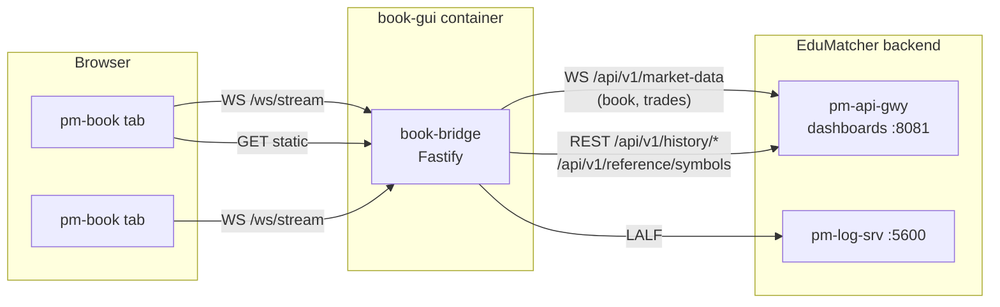

Version: 0.1.0

Date: 2026-09-27

Status: Design Proposal — for review before implementation

# EduMatcher — Order Book Viewer Web App (`pm-book`, `web-apps/book-gui`) Design and Implementation Plan

## Table of Contents

1. [Summary](#1-summary)
2. [Requirements](#2-requirements)
3. [`pm-viewer` as the running specification](#3-pm-viewer-as-the-running-specification)
4. [Data availability audit](#4-data-availability-audit)
5. [Architecture](#5-architecture)
6. [Upstream: `pm-api-gwy` market-data WebSocket](#6-upstream-pm-api-gwy-market-data-websocket)
7. [Session statistics: seeding and merging](#7-session-statistics-seeding-and-merging)
8. [Bridge ↔ browser protocol](#8-bridge--browser-protocol)
9. [Screen design](#9-screen-design)
10. [Configuration](#10-configuration)
11. [Container, Makefile and versioning](#11-container-makefile-and-versioning)
12. [Repository layout](#12-repository-layout)
13. [Test strategy](#13-test-strategy)
14. [Implementation plan — work packages](#14-implementation-plan--work-packages)
15. [Risks and open questions](#15-risks-and-open-questions)

---

## 1. Summary

`pm-viewer` (`src/edumatcher/viewer/`) is a terminal display of one symbol's
order book. It shows a two-line statistics header, then three equal panels:
BIDS, ASKS and TRADES. `pm-book` is its companion web application. It shows
the same fields in the same arrangement, uses the browser's extra room for a
better presentation, and matches `terminal-gui`'s structure, theme and tooling.

The web app has one constraint `pm-viewer` does not. Its server side (the
**bridge**) cannot join the engine's ZeroMQ bus. It can only reach the
exchange through the public gateways: CALF, RALF and `pm-api-gwy`
(REST + WebSocket).

The decision this design rests on (§4): **the live book comes from
`pm-api-gwy`'s `WS /api/v1/market-data` `book` and `trades` channels.** The
`book` channel carries the same engine `book.<SYMBOL>` payload that
`pm-viewer` subscribes to. It is the only gateway feed that carries the whole
ladder. Session statistics and the trade backlog are seeded from
`pm-api-gwy`'s REST `/api/v1/history/*` endpoints. The bridge uses one
upstream service and one read-only credential, and that credential never
reaches the browser.

This choice deliberately departs from `EduMatcher-Terminal-GUI.md` §4.5, which
rejected this WebSocket for `terminal-gui`. §4.3 explains why the reasoning
there does not carry over to a full-depth viewer.

## 2. Requirements

These come straight from the request. They are numbered so the work packages
in §14 can trace back to them.

| # | Requirement | Where addressed |
|---|---|---|
| R1 | Every field `pm-viewer` displays, in a similar table layout, making use of the web format | §3, §9 |
| R2 | Every statistic in the header rows, including the time | §3.1, §9.3 |
| R3 | Font-size scaling, the same as `terminal-gui` | §9.6 |
| R4 | Dark and light themes | §9.6 |
| R5 | The same theme colours as `terminal-gui` | §9.6 |
| R6 | Switch between order books interactively | §9.5 |
| R7 | A podman-compose container setup, the same as `terminal-gui` | §11 |
| R8 | A utility Makefile, nearly a copy of `terminal-gui`'s | §11 |
| R9 | `TopBar.tsx` shows the same version and application-name pattern, with the name in an orange accent | §9.2, §11.3 |
| R10 | Same application structure as `web-apps/terminal-gui` | §12 |

**Non-goals.** No order entry. No authentication in the browser. No
multi-symbol overview (that is `terminal-gui`'s job). No charts. No history
beyond the current session. No integration into `deployment/docker`,
`web-apps/Makefile` or the GHCR publishing workflow in this plan; §15.3 lists
those as follow-ups.

## 3. `pm-viewer` as the running specification

### 3.1 Field inventory

Every field `pm-viewer` renders, taken from `viewer/main.py`
(`_build_header`, `_side_table`, `_trades_table`, `_build_display`), with its
source in `pm-book`.

**Header row 1**

| Label | pm-viewer source | pm-book source | Style |
|---|---|---|---|
| `LAST` + ▲/▼/▬ arrow | `snapshot.last_price`; arrow = direction vs reference | `book.data.last_price` | bold, up/down/flat colour |
| `CHG` | `last − reference` | derived in the browser | up/down/flat |
| `%` | `CHG / reference × 100` | derived in the browser | bold up/down/flat |
| `SIZE` | `snapshot.last_qty` | `book.data.last_qty` | body text |
| `BID/ASK` | `bids[0].price` × `asks[0].price` | `book.data.bids[0]` / `asks[0]` | bid up colour, ask down colour |
| `SPRD` | `ask − bid` | derived | yellow (pm-book: `--halt` amber, §9.6) |
| clock (right-aligned) | local `HH:MM:SS` | browser clock, 1 Hz | bold cyan (pm-book: `--accent`) |

**Header row 2**

| Label | pm-viewer source | pm-book source | Style |
|---|---|---|---|
| `O` `H` `L` `C` | `stats.db` today row, then `last_price` from each snapshot | today's trades (§7) | H up colour, L down colour |
| `PREV` | `stats.db` most recent earlier close, or `n/a` | `/history/daily` range (§7.3) | body text |
| `RANGE` | `H − L` | derived | magenta (pm-book: `--auction` blue) |
| `VOL` | `stats.db` volume + de-duplicated `recent_trades` qty | sum of today's trade quantities (§7) | body text |
| `BASIS` | `prev-close` if PREV is known, otherwise `session-open` | same rule | faint |
| date (right-aligned) | local `YYYY-MM-DD` | browser clock | accent |

**Panels**

| Panel | Columns (in order) | Notes |
|---|---|---|
| BIDS | `Ord` `Qty` `Price` `Depth` | best price first; Depth bar grows leftward toward the centre divider |
| ASKS | `Depth` `Price` `Qty` `Ord` | mirror image of BIDS about the centre |
| TRADES | `Time` (`HH:MM:SS.mmm`) `Price` `Qty` | newest first; price and qty coloured by tick direction vs the next-older trade |

**Chrome and behaviour**

| Element | pm-viewer | pm-book |
|---|---|---|
| Title | ` EduMatcher ` badge + symbol + "Order Book" | TopBar wordmark + symbol picker (§9.2) |
| Frame colour | green/red/blue by `close` vs reference | a thin trend accent line under the header (§9.3) |
| Rows shown | fit the terminal height; `--depth N` caps them | fit the viewport (ResizeObserver); "Max levels" setting (§9.7) |
| Depth micro-bar | 6 cells of `█`, scaled to the largest qty in the *visible* rows | background fill behind each row, same scaling (§9.4) |
| Zebra rows | `--zebra-lines`, off by default | "Zebra rows" setting, off by default |
| Body text colour | `--text-color` | theme `--fg` token (not configurable) |
| Symbol switch | `s`/`F1` opens a prefix-filter picker; ↑/↓, Enter, Esc | same keys, plus a clickable picker and URL routing (§9.5) |
| Icebergs | only `displayed_qty` shown | unchanged — the engine snapshot already aggregates only displayed qty |

### 3.2 pm-viewer behaviour that is *not* copied

Reading `pm-viewer` as a specification turned up four places where copying it
literally would copy a defect. `pm-book` deliberately differs in each. None of
them is fixed in `pm-viewer` by this plan; they are reported for a separate
decision.

1. **The TRADES panel never shows more than 5 rows.** It renders
   `snapshot.recent_trades`, and `OrderBook.snapshot()` truncates that to
   `list(self.recent_trades)[-5:]` (`engine/order_book.py`). However tall the
   terminal, the rest of the panel stays blank. `pm-book` keeps its own tape,
   seeded from `/history/trades` (§7).
2. **Volume can double-count up to 5 trades at startup.** `_load_stats_from_db`
   seeds `volume` from `daily_stats`, which already includes every trade
   pm-stats has recorded. The first `_SessionStats.update()` then adds the
   quantities of the snapshot's `recent_trades`, because the de-duplication
   set starts empty. `pm-book` builds OHLCV from trade IDs (§7), so each trade
   is counted exactly once.
3. **High and low can miss intra-interval prints.** OHLC is derived from
   `last_price` on each *throttled* book snapshot (`snapshot_interval_sec`), so
   a trade that sets a new high and is followed by another trade within one
   interval never shows up in `H`. `pm-book` derives OHLC from the trades
   themselves.
4. **Prices always show 4 decimals.** `_fmt_price` defaults to `prec=4`
   whatever the symbol's `tick_decimals`. `pm-book` formats with the symbol's
   `tick_decimals`, which the `book` payload carries.

## 4. Data availability audit

### 4.1 What the bridge can and cannot reach

| Source | Reachable | What it offers this app |
|---|---|---|
| Engine ZMQ bus (`book.<SYM>`, `trade.executed`, `system.symbols`) | **No** | What pm-viewer uses. Out of bounds by constraint. |
| `stats.db` SQLite (pm-viewer's OHLC seed) | **No** | A file on the backend host. Reached only through `pm-api-gwy` history. |
| CALF (`pm-md-gwy`, 5570) | Yes | `TOP`, `TRADE`, `STATE`, `DEPTH` (≤ `depth_levels`, 10 by default in every bundled example), `AUCTION`, `CB`. No trade IDs, no trade snapshot on subscribe. |
| RALF (`pm-ralf-gwy`, 5580) | Yes, with a `CLEARING`/`DROP_COPY`/`AUDIT` role | Post-trade executions with IDs and a 24-hour replay. The wrong tool for a book viewer (same reasoning as Terminal-GUI §4.4). |
| `pm-api-gwy` REST `/api/v1/history/*` | Yes, with the read-only key | `daily` (OHLCV per day), `trades` (with `trade_id`, ascending, paginated ≤ 5000/page) |
| `pm-api-gwy` REST `/api/v1/reference/symbols` | Yes, with the read-only key | Symbol universe with per-symbol reference data, including `tick_decimals` |
| `pm-api-gwy` WS `/api/v1/market-data` | Yes, with the read-only key | `book` (**full** aggregated ladder, `last_price`, `last_qty`, `tick_decimals`, last 5 trades), `trades` (`trade.executed` with `id`), `depth`, `auction`; always-on `session`, `circuit_breaker`; snapshot on subscribe; 60 s trade tail for `resume` |

### 4.2 Decision

| Data need | Source |
|---|---|
| Ladder, last price/size, best bid/ask | WS `book` channel, one symbol at a time |
| Live trades | WS `trades` channel, same symbol |
| Today's OHLC, volume, tape backlog | REST `/history/trades?symbol=S&date=<session date>` (all pages), merged with live trades by `trade_id` (§7) |
| Previous close | REST `/history/daily?symbol=S&from=<session date − 14 d>` (§7.3) |
| Symbol list + `tick_decimals` | REST `/reference/symbols` |

### 4.3 Why this departs from Terminal-GUI §4.5

Terminal-GUI §4.5 rejected the `pm-api-gwy` WebSocket because its channels
duplicate CALF. For a multi-symbol terminal that is true: `TOP`/`TRADE` with
`SYM=*` and a 10-level `DEPTH` cover everything it shows. For `pm-book` the
premise fails in two places:

- **Depth.** The requirement is "levels fit screen", which on a tall browser
  window means 30–50 levels. CALF `DEPTH` stops at
  `market_data_gateway.depth_levels`. Raising that limit makes every CALF
  `DEPTH` message larger for every CALF client and still leaves a fixed cap.
  The `book` channel is the engine's own full aggregated ladder, exactly what
  `pm-viewer` renders.
- **Trade identity.** Merging a REST backlog with a live stream without
  double-counting (§3.2 item 2) needs a shared key. CALF `TRADE` carries no
  trade ID. The WS `trades` channel carries the durable engine `id`, and that
  is the same value as `trade_log.trade_id` (`stats/main.py`, schema v7).

Terminal-GUI's other argument was avoiding a credential. It does not apply
here: the bridge needs the read-only key for REST history in any design, so
adding the WebSocket adds a second socket to a service already in use, not a
second credential or a second upstream dependency.

**What this costs** is set against the alternative in §15.1.

## 5. Architecture

### 5.1 Topology



The bridge holds **one** upstream WebSocket, however many tabs are open. It
fans out to the tabs, as `terminal-gui`'s bridge does with CALF (Terminal-GUI
§6.5). The read-only key exists only in the bridge process (Terminal-GUI §18).

### 5.2 Bridge components (`apps/bridge/src/`)

| Module | Responsibility | Terminal-GUI counterpart |
|---|---|---|
| `config.ts` | Environment-variable config (§10) | `config.ts` |
| `upstream/market-uplink.ts` | Upstream WS client: auth, subscribe/unsubscribe, reconnect with backoff, per-topic `seq` tracking, trade `resume`, keepalive | `calf/uplink.ts` |
| `upstream/symbol-refcount.ts` | Which symbols any tab is watching; subscribes on 0→1 and unsubscribes on 1→0 | `calf/symbol-refcount.ts` |
| `session/session-book.ts` | Per watched symbol: latest book, trade tape (ring buffer, `TAPE_MAX`), OHLCV accumulator keyed by `trade_id` | `calf/top-cache.ts` (conceptually) |
| `session/history-seed.ts` | REST calls: session date, all of today's trades (paged), previous close, symbol list | `history-proxy.ts` |
| `ws-fanout.ts` | Tab registry, `hello`, per-tab `watch`, ping/pong reaping, buffered-bytes guard | `ws-fanout.ts` (copied, then narrowed) |
| `logging/logger.ts` + `packages/lalf-client` | LALF operational logging with stdout/file fallback | copied verbatim |
| `server.ts` | Wires it together, `/api/bridge/status`, static file serving | `server.ts` |

### 5.3 Web components (`apps/web/src/`)

| Area | Content |
|---|---|
| `lib/ws.ts`, `lib/useBookStream.ts` | Tab WebSocket with reconnect; re-sends `watch` after reconnecting |
| `store/useBookStore.ts` | zustand: connection state, symbol list, watched symbol, book, tape, stats |
| `store/usePrefsStore.ts` | theme (dark/light), zebra rows, max levels, last symbol — persisted |
| `store/useFontSizeStore.ts` | copied from `terminal-gui` (XS…XXL, CSS `zoom`, `--zoom`) |
| `lib/stats.ts` | pure derivations: reference, change, %, arrow/trend, spread, range, basis |
| `lib/ladder.ts` | pure: rows to show, max qty in visible rows, bar widths, tick direction |
| `lib/format.ts` | `price(v, decimals)`, `qty`, `clock`, `tradeTime` |
| `components/layout/` | `AppShell`, `TopBar`, `StatusStrip` |
| `components/` | `StatsHeader`, `SideLadder`, `TradesPanel`, `SymbolPicker`, `shared/SettingsPopover` |

### 5.4 Data flow for one symbol switch

1. The browser sends `{t:"watch", sym:"MSFT"}` (replacing any previous watch).
2. The bridge refcount goes MSFT 0→1, so the uplink sends
   `{"action":"subscribe","items":[{"symbols":["MSFT"],"channels":["book","trades"]}]}`
   and live `trade` events start **buffering** into MSFT's session book.
3. `pm-api-gwy` answers the subscribe with the cached `book` snapshot, which
   is forwarded to every tab watching MSFT.
4. `history-seed` pages `/history/trades` for today and fetches the previous
   close. The session book merges the history rows with the buffered live
   trades by `trade_id` (§7.2) and emits a `session` frame.
5. From then on, each `book` event produces a `book` frame and each new
   `trade` produces a `trade` frame plus updated `stats`.
6. The tab's previous symbol goes 1→0, so the bridge sends `unsubscribe` and
   drops that session book.

## 6. Upstream: `pm-api-gwy` market-data WebSocket

Verified against `api_gateway/routers/ws.py`, `schemas.py`, `market_cache.py`,
`events.py` and `docs/user-guide/260-api-gateway.md`.

- **Endpoint and auth.** `ws://<API_GATEWAY_URL host>/api/v1/market-data`.
  The first frame is `{"api_key": "<key>"}` and must arrive within 5 s. The
  reply is `{"type":"authenticated"}`; an unknown key closes with 1008. A
  read-only key (`gateway_id: null`) is accepted. It must be a key of the
  instance being connected to, which is `dashboards` (8081) in the bundled
  examples.
- **Envelope.** `{type, topic, seq, ts, data}`. `seq` counts within `topic`.
  `book` events arrive on topic `book.<SYM>`. `trade` events arrive on
  `trade.executed`, which is **venue-wide**, so a symbol-filtered subscriber
  sees gaps in its `seq` as a matter of course.
- **Control frames.** `subscribe` / `unsubscribe` / `snapshot` / `resume`,
  using the `items` form. The reply is `{"type":"subscription", data:{…}}`, and
  a subscribe is followed by the cached snapshot.
- **Always-on events.** `session` and `circuit_breaker` reach every
  subscriber. `pm-book` ignores them in v0.1 (§15.3).
- **Where loss can happen.** Each socket's sink queue (`maxsize=512`) receives
  **all** market-data events, and filtering happens *after* dequeue. Overflow
  therefore depends on venue-wide traffic, not on what this bridge
  subscribed to. Mitigations:
  - `book` is a full snapshot every time, so it repairs itself.
  - A gap in `book.<SYM>` `seq` means the queue overflowed. The uplink then
    sends a trade `resume` with the last `trade.executed` `seq` it saw for that
    symbol.
  - After a reconnect the uplink re-subscribes every held symbol with
    `resume_from: {"trades": <last seq>}`. If the gap is older than the 60 s
    tail (`trades.reset` / `resume.rejected`), the uplink re-seeds that
    symbol from history (§7). History is authoritative, so the result is
    still exact.
- **Keepalive.** The uplink sends a WebSocket ping every `UPSTREAM_PING_SEC`
  and treats `UPSTREAM_PING_MAX_MISSED` missed pongs as a dead connection.
- **Reconnect.** Exponential backoff from 0.5 s to 15 s with jitter. State
  goes `ACTIVE` → `RECONNECTING` → `DOWN` after `UPSTREAM_DOWN_AFTER_SEC`,
  mirroring `CalfState`.

## 7. Session statistics: seeding and merging

### 7.1 Session date

The current trading date is the date `pm-stats` files today's rows under.
pm-stats uses the session timezone stored in `stats.db`, and the history
endpoints resolve `date=` in that same timezone (`_session_tz`). The bridge
takes it as `max(date)` of `GET /history/daily` with no filters, which returns
the latest available date. It re-reads this on each seed. WP0 verifies that
pm-stats writes today's row before the first trade (it does so as soon as an
opening bid or ask is known — `stats/main.py`, `_on_book`).

### 7.2 Exact OHLCV without double counting

The per-symbol session book keeps `seen: Set<trade_id>` and an accumulator
`{open, high, low, close, volume, tradeCount}`.

1. Subscribe live first (§5.4 step 2) and **buffer** incoming trades.
2. Page `GET /history/trades?symbol=S&date=<session date>&limit=5000&after=…`
   until `has_more` is false. Rows arrive in ascending `ts` order. Apply each
   row whose `trade_id` is not in `seen`.
3. Apply each buffered live trade whose `id` is not in `seen`, in arrival
   order, then switch to live application.
4. `open` is the first applied price, `high`/`low` the running max/min,
   `close` the last price, `volume` the sum of quantities, `tradeCount` the
   count.

This ordering is race-free. A trade printed before the subscription is in
history. A trade printed during the paging is in the buffer, and in history
too if pm-stats committed it in time; `trade_id` de-duplicates it. A trade
printed after the paging is live.

The tape is the last `TAPE_MAX` (default 500) applied trades.

**When history is unavailable** (HTTP 503 with no `stats.db`, 502 when
upstream is unreachable, or no key configured), the session book starts
empty from live trades only. It then marks `stats.partial = true` and
`since = <first live trade ts>`, and the header shows `BASIS live since
HH:MM`. That is the web equivalent of `pm-viewer` running without a stats
DB.

**Paging cost.** A day with 100 k trades on one symbol is 20 requests on
each switch to that symbol. That is acceptable for a classroom exchange. If
it ever is not, the upgrade is to keep a session book alive for a grace
period after its refcount reaches 0 (§15.2).

### 7.3 Previous close

`GET /history/daily?symbol=S&from=<session date − 14 days>`, reduced with
`terminal-gui`'s `previousCloses()` (copied into `lib/prev-close.ts` with its
tests). The rule: the newest non-null `close_price` strictly before the
session date. Absent means `PREV n/a` and `BASIS session-open`, the same as
`pm-viewer`.

### 7.4 Derived values (browser, `lib/stats.ts`)

`reference = prevClose ?? open`; `change = last − reference`;
`pct = change / reference × 100` (undefined if reference is 0 or missing);
`trend ∈ {up, down, flat}` from `last` vs `reference`;
`spread = bestAsk − bestBid`; `range = high − low`. These are the same
formulas as `pm-viewer`'s `_build_header`, and each has a unit test.

`LAST`/`SIZE` come from the `book` payload, not the tape. That keeps them
consistent with the ladder they are shown beside, as in `pm-viewer`.

## 8. Bridge ↔ browser protocol

Defined in `packages/book-types/src/ws.ts`. The frames are flat JSON with a
`type` discriminator, following `terminal-types` conventions. Prices are
display money, as the upstream sends them.

```ts
export type UpstreamState = "ACTIVE" | "RECONNECTING" | "DOWN";

export interface SymbolInfo { symbol: string; tickDecimals: number }
export interface Level { price: number; qty: number; count: number }
export interface TapeTrade { id: string; ts: string; px: number; qty: number; side: "BUY" | "SELL" | "AUCTION" | "" }

export interface SessionStats {
  open?: number; high?: number; low?: number; close?: number;
  prevClose?: number; volume: number; tradeCount: number;
  /** True when history could not be read and stats cover only `since` onward. */
  partial: boolean; since?: string; sessionDate?: string;
}

export type ServerFrame =
  | { type: "hello"; symbols: SymbolInfo[]; upstream: UpstreamState; gateway: string | null }
  | { type: "book"; sym: string; seq: number; ts: string; tickDecimals: number;
      bids: Level[]; asks: Level[]; last?: number; lastQty?: number; replay?: true }
  /** Full tape + stats for a symbol: on watch, and after any re-seed. */
  | { type: "session"; sym: string; stats: SessionStats; tape: TapeTrade[] }
  /** One new print, with the stats it produced. */
  | { type: "trade"; sym: string; trade: TapeTrade; stats: SessionStats }
  | { type: "symbols"; symbols: SymbolInfo[] }
  | { type: "bridge_status"; upstream: UpstreamState; since: string; wsClients: number }
  | { type: "error"; code: "UNKNOWN_SYMBOL" | "HISTORY_UNAVAILABLE"; sym?: string; message: string };

export type ClientFrame =
  | { t: "watch"; sym: string }   // one symbol per tab; replaces the previous watch
  | { t: "ping" };
```

One tab watches one symbol, as `pm-viewer` does. A `watch` for a symbol not in
the universe gets `error UNKNOWN_SYMBOL` and leaves the current watch in
place. `bridge_status` repeats every `WS_HEARTBEAT_SEC`, as in `terminal-gui`.

## 9. Screen design

### 9.1 Wireframe (dark theme, 1440 × 900)

```
┌─────────────────────────────────────────────────────────────────────────────────────────────┐
│ EduMatcher  pm-book  v0.42.2   │ ◉ AAPL ▾  (s)                        ☀  ⚙  ● LIVE dashboards│  TopBar
├─────────────────────────────────────────────────────────────────────────────────────────────┤
│ LAST 167.23 ▲  CHG +0.45  +0.27%  │ SIZE 100 │ BID/ASK 167.20 × 167.25 │ SPRD 0.05     14:03:22 │  StatsHeader
│ O 166.80  H 167.90  L 166.50  C 167.23 │ PREV 166.78 │ RANGE 1.40 │ VOL 12,400   BASIS prev-close │ 2026-09-27 │
├━━━━━━━━━━━━━━━━━━━━━━━━━━━━━━━━━ trend accent line (up/down/flat) ━━━━━━━━━━━━━━━━━━━━━━━━━━━┤
│            BIDS               │             ASKS              │          TRADES             │
│  Ord    Qty     Price   Depth │ Depth   Price     Qty    Ord  │ Time           Price   Qty  │
│    3  1,200    167.20 ░░░████ │ ████░░░ 167.25    800      2  │ 14:03:21.412  167.23   100  │
│    1    300    167.19 ░░░░░░█ │ ██░░░░░ 167.26    400      1  │ 14:03:19.007  167.21    50  │
│   …                           │  …                            │  …                          │
├─────────────────────────────────────────────────────────────────────────────────────────────┤
│ upstream ACTIVE · bids 14/37 · asks 14/22 levels shown · last update 0.3s · s / F1 change   │  StatusStrip
└─────────────────────────────────────────────────────────────────────────────────────────────┘
```

### 9.2 TopBar (R9)

The structure copies `terminal-gui`'s `TopBar.tsx`:

```tsx
<span className="font-mono font-bold text-sm text-fg">EduMatcher</span>
<span className="font-mono text-xs text-accent">pm-book</span>
<span className="font-mono text-xs text-brand-version">v{appVersion.version}</span>
```

The version comes from `apps/web/src/version.json`, written by
`scripts/mkbld.sh` (§11.3). The app name uses `text-accent`, which is
`terminal-gui`'s amber-orange `#ffa028` in dark and `#b26a00` in light (see
open question Q1). There are no view tabs; the symbol picker takes their
place. The right-hand cluster is the theme toggle, the settings cog and the
connection `StatusDot`, the same components as `terminal-gui`. Density is
dropped: font scaling (R3) covers it and it was not requested.

### 9.3 StatsHeader (R2)

Two rows, each a flex line with the elastic spacer and a right-pinned cell,
as in pm-viewer's `_stat_line`. Labels use `text-fg-faint`, values use
`tabular` mono figures, and separators are thin `border-subtle` rules instead
of `│` glyphs. The trend accent line beneath it replaces pm-viewer's coloured
frame: `--up`, `--down`, or `--border-strong` when flat.

### 9.4 Ladder and trades panels (R1)

- Three equal columns (`grid-cols-3`). They never reflow, the same guarantee
  as pm-viewer's fixed 3-column grid; below 900 px the grid scrolls
  horizontally rather than stacking.
- **Rows fit the viewport.** `useRowsPerPage` (copied from `terminal-gui`'s
  `lib/useAutoPaging.ts`) measures the panel body. Capacity is
  `min(fit, maxLevels)`. The panels share one capacity, as in pm-viewer.
- **Depth bar.** An absolutely positioned fill behind the row
  (`up-bg`/`down-bg`). Its width is `qty / maxQtyVisible` (minimum 1 px when
  qty > 0), anchored toward the centre divider: right edge on bids, left edge
  on asks. The narrow `Depth` column keeps pm-viewer's column order so the
  mirror layout reads the same.
- **Trades.** Newest first. The colour of each row is `trend(price, olderPrice)`,
  exactly `_direction_style` in `_trades_table`. Time is `HH:MM:SS.mmm` local.
- Empty rows are rendered to capacity so the three panels keep equal height,
  as pm-viewer does with `_blank_row`.
- **Zebra rows** use `bg-bg-subtle` on odd rows when enabled. No
  `bg-x/NN` opacity classes (see the `terminal-gui` token note).

### 9.5 Switching symbol (R6)

- **Route.** `/book/:symbol`, with `/` redirecting to the last symbol
  (persisted) or the first symbol in the universe. A symbol is therefore
  bookmarkable and shareable.
- **SymbolPicker.** A combobox in the TopBar. `s` or `F1` anywhere opens it
  (as pm-viewer does). Typing filters by **prefix** (pm-viewer's `matches`
  rule, including its `_FILTER_CHARS` set). ↑/↓ move, Enter switches, Esc
  closes. A mouse click also switches. While the universe is loading the
  picker shows "loading…" (pm-viewer's `loading` state).
- Switching clears the ladder and tape immediately and shows a skeleton
  until the `book` and `session` frames arrive, so no stale book is ever
  shown under a new symbol name.

### 9.6 Theme and font scaling (R3, R4, R5)

- `index.css` tokens and `tailwind.config.ts` colours are **copied
  verbatim** from `terminal-gui`. That covers the `.dark` class mechanism, the
  up/down reservation rule, the aliases and the `--zoom` fallback. pm-viewer's
  yellow/magenta/cyan map onto existing tokens (`--halt`, `--auction`,
  `--accent`), so the palette gains no new colours.
- **Font scaling.** `useFontSizeStore.ts`, `SettingsPopover.tsx` (font-size
  radiogroup) and the `AppShell` `calc(100vh / var(--zoom, 1))` sizing are
  copied from `terminal-gui` together with their tests. XS is the default.
  The Chromium/WebKit-only `zoom` caveat carries over and is shown in the
  popover. The localStorage key is `book-font-size`.
- **Theme toggle.** `usePrefsStore.theme`, applied before first paint in
  `main.tsx`, the same as `terminal-gui`. The localStorage key is `book-prefs`.

### 9.7 Settings popover

Font size (R3), plus the two `pm-viewer` options that still mean something in
a browser: **Zebra rows** (`--zebra-lines`) and **Max levels**
(`--depth`: Fit / 10 / 20 / 50). `--text-color` and `--zebra-lines-color` are
covered by the theme and not exposed.

### 9.8 StatusStrip

Shows the upstream state, "levels shown / total" per side (so a truncated
ladder is never silent), data age since the last `book` frame, and the
keyboard hint. These are small web-only additions within R1's "extended
possibilities"; each can be dropped at review.

## 10. Configuration

Bridge environment variables, following `terminal-gui/apps/bridge/src/config.ts`:

| Variable | Default | Purpose |
|---|---|---|
| `HOST` / `PORT` | `0.0.0.0` / `5194` (dev), `8094` (container) | Bridge bind address |
| `STATIC_DIR` | unset (dev) / `/app/apps/web/dist` | Serve the built UI |
| `CORS_ORIGIN` | `*` | As terminal-gui |
| `MAX_WS_CLIENTS` | `200` | Tab limit |
| `WS_HEARTBEAT_SEC`, `WS_PING_SEC`, `WS_PING_MAX_MISSED`, `WS_MAX_BUFFERED_BYTES` | as terminal-gui | Tab liveness |
| `API_GATEWAY_URL` | `http://host.docker.internal:8081` | `pm-api-gwy` base; WS URL derived (`http`→`ws`) |
| `PM_BOOK_API_KEY` | *(required)* | Read-only key, `gateway_id: null`, on the instance above. Without it the bridge logs CRITICAL and serves `upstream: DOWN`. |
| `UPSTREAM_PING_SEC`, `UPSTREAM_PING_MAX_MISSED`, `UPSTREAM_DOWN_AFTER_SEC` | `10`, `3`, `30` | Upstream liveness |
| `TAPE_MAX` | `500` | Tape length per symbol |
| `LOG_SRV_ENABLED`, `LOG_SRV_HOST`, `LOG_SRV_PORT`, `LOG_FAILOVER_DIR` | as terminal-gui | LALF logging |

Ports: `8094` for the container/production, `5194` for the dev bridge and
`8194` for the Vite dev server. This extends the existing
8090–8093 / 519x / 819x series (terminal, log, config, trader) and collides
with none of them.

Unlike `terminal-gui`, the key is **required**, because live data needs it too.

## 11. Container, Makefile and versioning

### 11.1 Container (R7)

`Dockerfile`, `docker-compose.yml` and `docker-compose.linux.yml` are copied
from `terminal-gui` with these substitutions: service and image
`book-gui` / `edumatcher-book-gui`, workspace `@edumatcher/book-web` /
`@edumatcher/book-bridge`, port `8094` (`BOOK_GUI_PORT`), health check on
`/api/bridge/status`. The CALF variables are removed and `PM_BOOK_API_KEY` is
added. Same build args (proxy, `NPM_STRICT_SSL`, `NPM_REGISTRY`), and same
`./logs` volume for the LALF failover log. There is no data volume, because
the bridge is stateless.

### 11.2 Makefile (R8)

A copy of `terminal-gui/Makefile` with `APP_NAME := edumatcher-book-gui`,
`SERVICE_NAME := book-gui` and `WEB_PORT ?= 8094`. The
`READONLY_CREDENTIAL_JS` lookup is kept unchanged (including its
`${...}`-in-`define` caveat), but it exports `PM_BOOK_API_KEY`. Because the key
is mandatory here, `make up` **fails** instead of warning when no key can be
found. The `bump-version` target is dropped: `TopBar.tsx` reads
`version.json` and contains no literal version, so its sed never matches
anything in terminal-gui either (see §15.4).

### 11.3 Version

`apps/web/src/version.json` starts as `{ "version": "0.42.2" }`, matching
the other GUIs. `scripts/mkbld.sh`'s loop `for app in trader terminal log config`
gains `book`, so a release writes the same version into all five GUIs.

## 12. Repository layout

```
web-apps/book-gui/
├── Dockerfile  docker-compose.yml  docker-compose.linux.yml  Makefile  README.md
├── .dockerignore  .gitignore  .prettierrc  package.json  package-lock.json
├── tsconfig.base.json  vitest.config.ts
├── test/setup-dom.ts
├── packages/
│   ├── book-types/        src/{index,ws,market,upstream}.ts
│   └── lalf-client/       (copied verbatim from terminal-gui, with its tests)
└── apps/
    ├── bridge/
    │   ├── src/{server,config,ws-fanout}.ts
    │   ├── src/upstream/{market-uplink,symbol-refcount,envelope}.ts
    │   ├── src/session/{session-book,history-seed}.ts
    │   ├── src/logging/logger.ts
    │   └── test/{fake-api-gateway.ts, *.test.ts}
    └── web/
        ├── index.html  vite.config.ts  tailwind.config.ts  postcss.config.js  tsconfig.json
        ├── src/{main,App}.tsx  src/index.css  src/version.json
        ├── src/components/layout/{AppShell,TopBar,StatusStrip}.tsx
        ├── src/components/{StatsHeader,SideLadder,TradesPanel,SymbolPicker,Badge}.tsx
        ├── src/components/shared/SettingsPopover.tsx
        ├── src/lib/{ws,useBookStream,stats,ladder,format,prev-close,useRowsPerPage}.ts
        ├── src/store/{useBookStore,usePrefsStore,useFontSizeStore}.ts
        └── test/*.test.ts(x)
```

Workspace package names: `edumatcher-book-gui` (root), `@edumatcher/book-web`,
`@edumatcher/book-bridge`, `@edumatcher/book-types` and
`@edumatcher/lalf-client`. The last is the same name as terminal-gui's; there
is no conflict because each workspace is self-contained. Dependencies are
`terminal-gui`'s minus `lightweight-charts`, `@tanstack/react-query`,
`@tanstack/react-table`, `@tanstack/react-virtual` and `@edumatcher/calf-protocol`,
none of which is needed. `ws` is added to the bridge as the upstream client.

## 13. Test strategy

Same toolchain as `terminal-gui`: vitest 4 from the workspace root, `node`
environment by default, and `@vitest-environment jsdom` docblocks for the
component tests. Prettier config is copied (printWidth 110).

- **Fake upstream.** `apps/bridge/test/fake-api-gateway.ts` is a small
  Fastify app that serves `/api/v1/market-data` (auth, subscribe/unsubscribe
  acks, scripted `book`/`trade` pushes, `resume`, `trades.reset`, forced
  close) and `/api/v1/history/{daily,trades}`, `/api/v1/reference/symbols`
  (paged fixtures, 503 mode). It plays the role that
  `fake-calf-gateway.ts` plays for terminal-gui.
- **Pure logic.** Unit tests for `stats.ts`, `ladder.ts`, `format.ts`,
  `prev-close.ts` and the OHLCV accumulator. Table-driven cases are taken from
  pm-viewer's own behaviour, and each of the §3.2 differences has a test that
  pins it.
- **Bridge integration.** Real bridge ↔ fake upstream ↔ `ws` test clients.
- **Components.** Testing Library for the header, ladders, trades panel,
  picker keyboard flow, TopBar and settings.
- **Manual end-to-end** (WP11) against a running stack.

## 14. Implementation plan — work packages

### 14.1 Common definitions

**Definition of Ready (DoR)** — a WP may start when:

- every WP it depends on is Done;
- its open questions in §15 are answered, or are explicitly deferred with a
  default;
- the fixtures or test doubles it needs exist, or are part of its own scope.

**Definition of Done (DoD)** — applies to every WP, in addition to its own
exit criteria:

- `npm test` (all vitest suites), `npm run typecheck` (all workspaces) and
  `npx prettier --check .` pass from `web-apps/book-gui`;
- every new behaviour has a test, and the WP's listed tests exist and pass;
- there is no dead code, no speculative configuration and no compatibility
  shim;
- the design doc is updated if the implementation contradicts it;
- a commit message is proposed (nothing is committed by Claude).

### 14.2 Dependency order

```
WP0 ─┬─> WP2 ─> WP3 ─> WP4 ─> WP5 ─┐
     │                              ├─> WP6 ─┬─> WP7 ─┐
WP1 ─┴──────────────────────────────┘        ├─> WP8 ─┼─> WP10 ─> WP11
                                             └─> WP9 ─┘
```

WP1 can run in parallel with WP0. WP7, WP8 and WP9 can run in parallel.

---

### WP0 — Verification spike (no product code)

**Goal.** Turn this design's assumptions about `pm-api-gwy` into observed
facts before any code depends on them.

**Tasks.** Against a running stack (`make up-all`, the s10-basic example)
with the read-only key:

1. Capture a real `book` and `trade` envelope from `/api/v1/market-data`.
   Confirm the field names and types used in §8.
2. Confirm that the live `trade.data.id` equals `/history/trades` `trade_id`
   for the same print.
3. Confirm the session-date rule (§7.1) before the first trade of the day,
   and that `/history/trades?date=` agrees with it.
4. Confirm that `/reference/symbols` works with the read-only key and carries
   `tick_decimals`.
5. Observe upstream keepalive behaviour: idle for 10 minutes with and without
   client pings.

**Deliverable.** A short findings section appended to this document
(§15.5), and captured JSON fixtures in `apps/bridge/test/fixtures/`.

**Exit criteria.** All five points are answered. Any contradiction is fixed
in §6–§8 before WP2 starts.

---

### WP1 — Scaffolding (R3, R4, R5, R7, R8, R9, R10)

**Goal.** An empty but complete app: it builds, is themed and scaled, runs in
a container, and shows the TopBar with name and version.

**Tasks.**

- Create `web-apps/book-gui` with the workspace root files (§12), copying
  from `terminal-gui` and renaming.
- Copy `packages/lalf-client` verbatim, with its tests.
- Create `packages/book-types` with the §8 types (types only).
- `apps/bridge`: `config.ts` (§10), `logging/logger.ts`, and `server.ts`
  serving `/api/bridge/status` (`upstream: "DOWN"`) and static files.
- `apps/web`: `main.tsx`, `App.tsx` with the router and a `/book/:symbol`
  placeholder, `AppShell`, `TopBar` (§9.2), `StatusStrip` (placeholder),
  `index.css` + `tailwind.config.ts` (verbatim), `usePrefsStore` (theme and
  the persisted settings used later), `useFontSizeStore`, `SettingsPopover`
  (font size only for now), and `version.json`.
- `vite.config.ts` on port 8194 with a proxy to 5194.
- `Dockerfile`, `docker-compose.yml`, `docker-compose.linux.yml`, `Makefile`
  (§11.1–11.2), `.dockerignore`, `.gitignore`, and a README skeleton.
- Add `book` to the loop in `scripts/mkbld.sh`.

**Tests.**

- `tailwind-tokens.test.ts`: copied; asserts every class used resolves to a
  declared token.
- `font-size.test.tsx`: copied; XS default, persistence, `--zoom` set.
- `theme.test.tsx`: toggling sets and removes `html.dark`, persisted, applied
  before render.
- `topbar.test.tsx`: renders `EduMatcher`, `pm-book` with class `text-accent`,
  and `v` + the `version.json` version.
- `config.test.ts`: env parsing, defaults, and that a missing
  `PM_BOOK_API_KEY` is reported.
- `lalf-client` suites: copied, green.

**Exit criteria.** `make install build test typecheck` pass. `make up` builds
and starts the container on 8094, and the browser shows the TopBar in both
themes and at every font size, with the footer pinned at XXL.

---

### WP2 — Upstream envelope and control codec

**Goal.** A pure, tested translation layer between `pm-api-gwy` JSON and
`book-types`.

**Tasks.** `apps/bridge/src/upstream/envelope.ts`:

- `parseEnvelope(raw)`: validates `type`/`topic`/`seq`/`data`; rejects
  malformed input with a typed error rather than throwing into the socket
  handler.
- `toLevels(data.bids|asks)`, `toBook(data)` producing `BookFrame`,
  `toTapeTrade(data)` (live) and `historyRowToTapeTrade(row)`.
- Control builders: `authFrame`, `subscribeFrame(syms)`,
  `unsubscribeFrame(syms)`, `resumeTradesFrame(sym, fromSeq)`.
- `isBookTopic(topic, sym)`.

**Tests.** `envelope.test.ts`, using the WP0 fixtures: round-trip of real
captures; a missing optional `last_price` becomes undefined, never 0; a
malformed level is skipped; a non-market type is ignored.

**Exit criteria.** 100 % branch coverage of `envelope.ts`.

---

### WP3 — Market uplink and symbol refcount

**Goal.** One resilient upstream connection that the rest of the bridge can
subscribe symbols through.

**Tasks.**

- `symbol-refcount.ts`: `acquire(sym)` and `release(sym)` return whether the
  upstream must subscribe or unsubscribe.
- `market-uplink.ts`: an EventEmitter with the events
  `status | book | trade | reseedNeeded`.
  - Connect, authenticate, re-subscribe the held set.
  - Track the per-symbol last `book` seq and last `trade.executed` seq.
  - A `book` seq gap triggers a trade `resume` (§6).
  - `trades.reset` / `resume.rejected` emits `reseedNeeded(sym)`.
  - Ping/pong liveness, backoff reconnect, and the state machine
    `ACTIVE`/`RECONNECTING`/`DOWN` with `stateSince`.
- `test/fake-api-gateway.ts` (market-data half).

**Tests.** `symbol-refcount.test.ts`; `uplink.test.ts`:

- auth failure (1008) leads to `DOWN` with a log line and no tight reconnect
  loop;
- subscribe on the first acquire only, unsubscribe on the last release;
- reconnect re-subscribes with `resume_from`;
- a `book` seq gap produces a resume;
- a reset produces `reseedNeeded`;
- missed pongs force a reconnect;
- the state transitions and their timing (fake timers).

**Exit criteria.** All tests are deterministic (fake timers, no sleeps).

---

### WP4 — Session book and history seed (R2 statistics)

**Goal.** Exact per-symbol OHLCV, previous close and tape, as specified in §7.

**Tasks.**

- `history-seed.ts`: `sessionDate()`, `todaysTrades(sym)` (all pages),
  `previousClose(sym, date)` (uses a copied `previousCloses`), and
  `symbols()`. REST errors are classified as `unavailable` or `fatal`.
- `session-book.ts`: states `seeding` → `live`; a buffer during seeding;
  `seen` IDs; the OHLCV accumulator; the `TAPE_MAX` ring;
  `applyBook(frame)`; a `partial` fallback; `reseed()`.
- Add the REST half to `fake-api-gateway.ts`, with paged fixtures and a 503
  mode.

**Tests.** `session-book.test.ts`:

- a trade in history and in the buffer is counted once;
- live-only trades are applied after history, in order;
- OHLC comes from trades, not from the throttled `last_price`;
- volume is not double-counted (the §3.2 item 2 regression);
- the tape is capped and newest-first on output;
- 503 leads to `partial` with `since`;
- `reseed()` replaces the stats atomically.

Also `history-seed.test.ts` (paging until `has_more=false`, the session-date
rule, prev-close selection) and `prev-close.test.ts` (copied).

**Exit criteria.** The stats for a scripted day match a hand-computed
expectation exactly.

---

### WP5 — Bridge fan-out and status

**Goal.** Tabs can connect, watch a symbol, and receive §8 frames.

**Tasks.**

- `ws-fanout.ts`, adapted from terminal-gui: registration, `hello`, `watch`
  handling (release the old symbol, acquire the new one, send `book` + `session`
  at once if a session book exists), per-symbol broadcast, ping reaping, and
  the buffered-bytes guard.
- `server.ts`: `/ws/stream`, the `bridge_status` heartbeat, and an extended
  `/api/bridge/status` (`upstream`, `since`, `gateway`, `symbols`,
  `watched: {sym: tabs}`, `wsClients`, `logging`).
- Refresh the symbol universe on start and on each upstream reconnect, and
  broadcast `symbols` when it changes.

**Tests.** `ws-fanout.test.ts`:

- two tabs on one symbol share a single upstream subscription;
- switching releases the old symbol;
- an unknown symbol produces an `error` and keeps the current watch;
- a late joiner gets `book` + `session` immediately;
- `max_ws_clients` refusal;
- a stalled tab is closed with 1013.

**Exit criteria.** An end-to-end test (fake upstream → bridge → ws client)
shows a scripted trade arriving at the tab as a `trade` frame with correct
stats.

---

### WP6 — Web data layer

**Goal.** A browser store that mirrors the bridge's view of the watched
symbol.

**Tasks.** `lib/ws.ts` (reconnect with backoff, re-send `watch` on reconnect);
`useBookStream`; `useBookStore` with:

- connection state `LIVE`/`RECONNECTING`/`OFFLINE`, derived from the socket
  and `upstream`;
- the symbols map;
- the watched symbol;
- book, tape, stats and `lastBookAt`.

A symbol switch clears the state synchronously. `lib/stats.ts`, `lib/format.ts`
and `lib/ladder.ts` (pure).

**Tests.**

- `book-store.test.ts`: frames reduce correctly; a `book` for another symbol
  is ignored; a switch clears state; `replay` does not advance `lastBookAt`.
- `ws-reconnect.test.ts`: re-sends `watch`.
- `stats.test.ts`: every §7.4 formula, reference fallback, zero reference,
  trend, arrow.
- `format.test.ts`: tick-decimals formatting, `—` for missing values,
  thousands separators, `HH:MM:SS.mmm`.
- `ladder.test.ts`: capacity = `min(fit, max)`, max qty over *visible* rows
  only, bar ratio clamped, tick direction vs the older trade.

**Exit criteria.** The store works against the bridge in dev mode (verified
through `make dev` and the browser devtools WS panel).

---

### WP7 — Statistics header (R1, R2)

**Goal.** Both header rows and the trend accent, field for field as in §3.1.

**Tasks.** `StatsHeader.tsx` (two rows, right-pinned clock and date on a 1 Hz
timer, `BASIS` including the `live since` variant), and the trend accent line.

**Tests.** `stats-header.test.tsx`:

- every §3.1 label is present;
- `n/a` for a missing PREV and `—` for missing values;
- colour classes follow the trend (up/down/flat);
- `H` uses the up colour and `L` the down colour;
- the clock ticks (fake timers);
- the date format;
- the partial-history basis.

**Exit criteria.** Side by side with `pm-viewer` on the same symbol, every
header value matches, apart from the documented §3.2 differences.

---

### WP8 — Ladders and trades panels (R1)

**Goal.** BIDS/ASKS/TRADES as specified in §9.4.

**Tasks.** `SideLadder.tsx` (mirrored column order, depth fill, blank-row
padding, zebra), `TradesPanel.tsx`, the copied `useRowsPerPage`, the
three-column body with shared capacity, and StatusStrip levels-shown/total and
data age.

**Tests.**

- `side-ladder.test.tsx`: bid and ask column order, bar anchoring and width,
  capacity padding, zebra classes.
- `trades-panel.test.tsx`: newest first, direction colouring, time format.
- `capacity.test.tsx`: `maxLevels` caps `fit`.

**Exit criteria.** Manual check at 1280 × 800 and 1920 × 1200 at XS and XXL:
the panels fill the height with no page scroll, and a ladder deeper than the
screen reports "N/M shown".

---

### WP9 — Symbol switching (R6)

**Goal.** Interactive switching with pm-viewer's keyboard behaviour.

**Tasks.** `SymbolPicker.tsx`:

- prefix filter using `_FILTER_CHARS`;
- `s`/`F1` open (ignored while typing in an input);
- ↑/↓/Enter/Esc and mouse selection;
- the `loading…` state.

Also the `/book/:symbol` route, the `/` redirect to the last or first symbol,
last-symbol persistence, and an unknown-symbol notice.

**Tests.** `symbol-picker.test.tsx`: mirrors
`tests/test_viewer_symbol_picker.py` case for case (prefix matching,
selection clamping, empty matches, Esc keeps the current symbol), plus the
keyboard shortcuts, the route change sending `watch`, and the redirect rules.

**Exit criteria.** A symbol can be switched by keyboard alone and by mouse
alone, and the URL always names the displayed symbol.

---

### WP10 — Settings and polish

**Goal.** The remaining pm-viewer options, and README completion.

**Tasks.** Add Zebra rows and Max levels to `SettingsPopover` (§9.7). Add
empty, loading and upstream-DOWN states for every panel. Complete the README
(ports, key, `make` targets, the ports table in the style of
`web-apps/README.md`).

**Tests.** `settings.test.tsx`: both settings persist and apply.
`states.test.tsx`: `DOWN` shows a banner and never shows stale data as live.

**Exit criteria.** A reviewer walks through R1–R10 in the running app and
ticks each one off.

---

### WP11 — End-to-end verification

**Goal.** Prove the whole path against the real backend.

**Tasks.** Run `make up-all` for the backend, then `make up` in book-gui (key
auto-resolved), plus MM bots and an AI trader so the book moves. Verify each
of the following, logging results in §15.5:

- every header value matches `pm-viewer --symbol AAPL` at the same instant,
  apart from the documented differences;
- full depth is shown beyond 10 levels;
- switching across 5 symbols works;
- killing and restarting `pm-api-gwy` shows RECONNECTING, then recovery with
  correct stats;
- two tabs on one symbol use one upstream subscription (`/api/bridge/status`).

**Exit criteria.** Every check passes on Podman/macOS; Docker on Linux is
spot-checked with `docker-compose.linux.yml`.

## 15. Risks and open questions

### 15.1 Cost of the chosen data source (accepted)

- **Everything depends on `pm-api-gwy`.** If it is down or disabled,
  `pm-book` shows nothing. A CALF-based design would lose only history.
- **Two live-data stacks.** `terminal-gui` uses CALF and `pm-book` uses the
  api-gwy WS, so a change in either upstream now has two GUI consumers to
  check.
- **New code instead of reuse.** The uplink (WP3) is new rather than
  `terminal-gui`'s tested CALF uplink.
- **Load-dependent drops.** Sink-queue overflow depends on venue-wide volume.
  It is detected through `book` seq gaps and repaired by resume or reseed
  (§6), but a burst could briefly show a stale tape before the reseed lands.

### 15.2 Deferred

A grace period that keeps a session book alive after its refcount reaches
0, which would make flipping back to a heavy symbol instant. Not built until
paging cost is observed to matter (§7.2).

### 15.3 Out of scope, proposed as follow-ups

- Adding book-gui to `deployment/docker/compose.guis.yaml` and `make up-all`,
  to `web-apps/Makefile`, and to `.github/workflows/publish-images.yml`.
- A user-guide chapter.
- Showing the always-on `session` / `circuit_breaker` state (a HALTED badge,
  the session phase).
- Fixing pm-viewer's §3.2 defects.

### 15.4 Open questions

- **Q1 — Orange accent.** Should the app name use `terminal-gui`'s existing
  `--accent` (amber-orange `#ffa028` / `#b26a00`, assumed here), or a distinct
  orange token (for example `--brand-app: #ff7a1a`) to tell pm-book apart
  from pm-terminal at a glance?
- **Q2 — `bump-version`.** Should book-gui carry over terminal-gui's
  `bump-version` target? It is a no-op against a `TopBar.tsx` that reads
  `version.json`. This plan drops it, and the same dead target exists in
  terminal-gui (not touched here).
- **Q3 — Clock timezone.** Should the header clock and date follow
  pm-viewer's local time (assumed), or the exchange session timezone?
- **Q4 — StatusStrip additions.** Are the §9.8 additions (levels
  shown/total, data age) wanted, or should the footer carry only the key
  hints, as pm-viewer's subtitle does?

### 15.5 Verification log

*(Filled in by WP0 and WP11.)*
