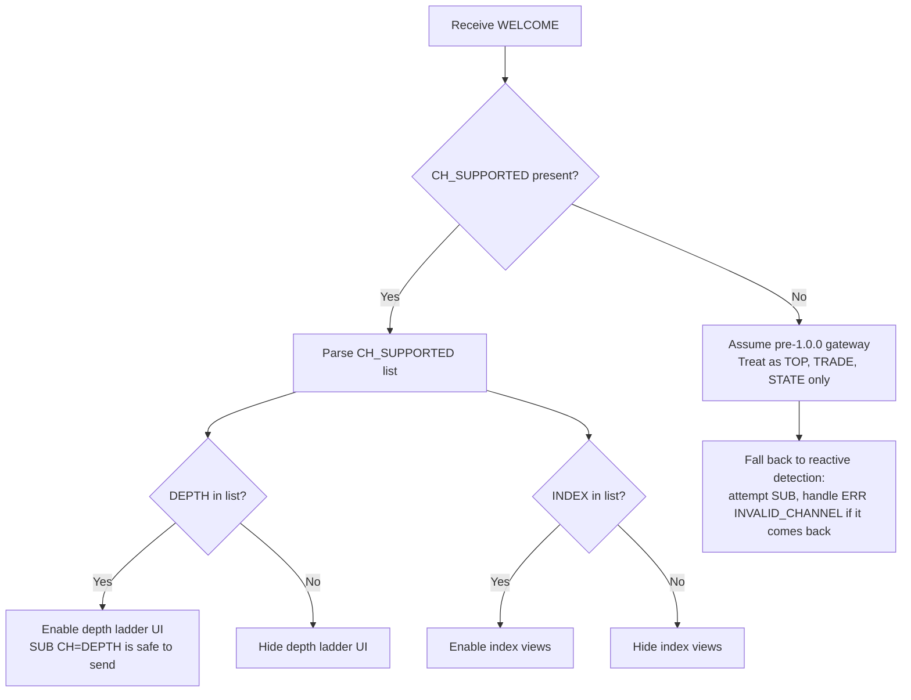
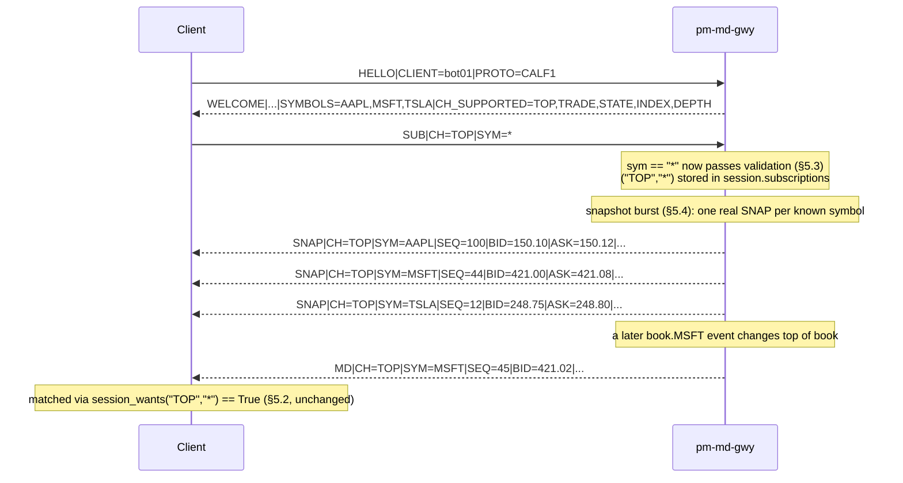
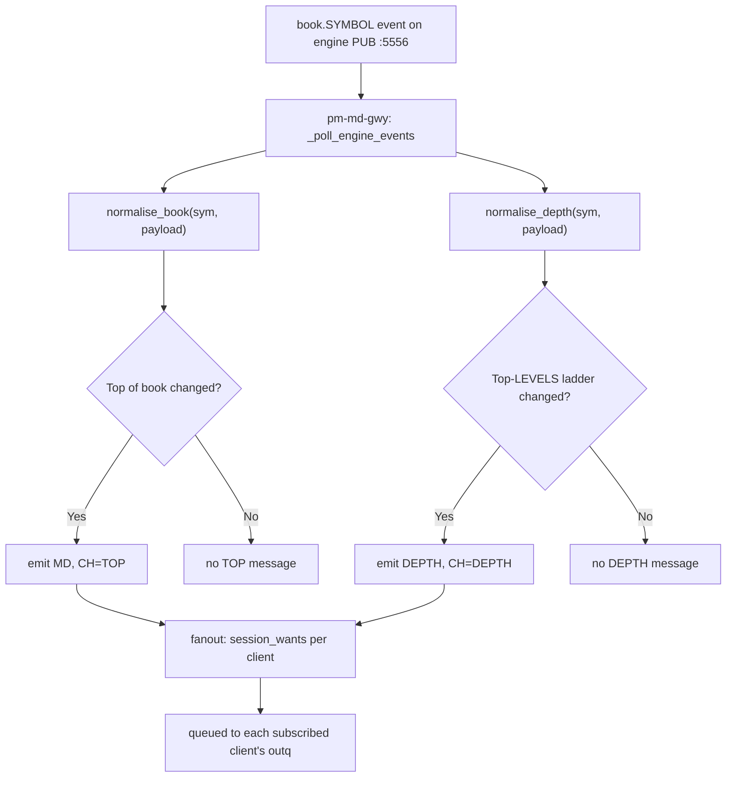

Version: 1.0.0

Date: 2026-07-11

Status: Design and Implementation Specification

# EduMatcher — Extending the CALF Protocol for 1.0.0


## Table of Contents

- [EduMatcher — Extending the CALF Protocol for 1.0.0](#edumatcher--extending-the-calf-protocol-for-100)
  - [Table of Contents](#table-of-contents)
  - [1. Purpose and Relationship to the Base Spec](#1-purpose-and-relationship-to-the-base-spec)
    - [1.1 How to read this document](#11-how-to-read-this-document)
    - [1.2 Audience](#12-audience)
  - [2. Summary of Changes](#2-summary-of-changes)
  - [3. Compatibility and Versioning Policy](#3-compatibility-and-versioning-policy)
    - [3.1 Why `PROTO` stays `CALF1`](#31-why-proto-stays-calf1)
    - [3.2 New: `WELCOME` capability advertisement](#32-new-welcome-capability-advertisement)
    - [3.3 Client-side capability detection flow](#33-client-side-capability-detection-flow)
    - [3.4 Compatibility matrix](#34-compatibility-matrix)
  - [4. Change 1 — Officialize the `INDEX` Channel](#4-change-1--officialize-the-index-channel)
    - [4.1 What changes](#41-what-changes)
    - [4.2 Canonical channel table (supersedes protocol doc §6.1 for this one row)](#42-canonical-channel-table-supersedes-protocol-doc-61-for-this-one-row)
    - [4.3 Action items](#43-action-items)
  - [5. Change 2 — `SYM=*` Wildcard for `TOP` and `TRADE`](#5-change-2--sym-wildcard-for-top-and-trade)
    - [5.1 Rationale](#51-rationale)
    - [5.2 Current behaviour (why this needs code, not just docs)](#52-current-behaviour-why-this-needs-code-not-just-docs)
    - [5.3 New validation rule](#53-new-validation-rule)
    - [5.4 The snapshot-burst fix for wildcard `TOP`](#54-the-snapshot-burst-fix-for-wildcard-top)
    - [5.5 `TRADE` wildcard — no snapshot burst needed](#55-trade-wildcard--no-snapshot-burst-needed)
    - [5.6 Interaction with `max_symbols_per_client`](#56-interaction-with-max_symbols_per_client)
    - [5.7 Sequence diagram — wildcard `TOP` subscribe](#57-sequence-diagram--wildcard-top-subscribe)
    - [5.8 Files to change](#58-files-to-change)
    - [5.9 Test cases required](#59-test-cases-required)
  - [6. Change 3 — New `DEPTH` Channel](#6-change-3--new-depth-channel)
    - [6.1 Real-world grounding](#61-real-world-grounding)
    - [6.2 What EduMatcher already publishes internally](#62-what-edumatcher-already-publishes-internally)
    - [6.3 Wire format specification](#63-wire-format-specification)
      - [6.3.1 `SUB`](#631-sub)
      - [6.3.2 `SNAP` for `CH=DEPTH`](#632-snap-for-chdepth)
      - [6.3.3 `DEPTH` (incremental update)](#633-depth-incremental-update)
      - [6.3.4 Level encoding grammar](#634-level-encoding-grammar)
    - [6.4 Change-detection semantics](#64-change-detection-semantics)
    - [6.5 Sequence and replay semantics](#65-sequence-and-replay-semantics)
    - [6.6 Gateway wiring — exact call sites](#66-gateway-wiring--exact-call-sites)
      - [6.6.1 `normaliser.py` — new cache and method](#661-normaliserpy--new-cache-and-method)
      - [6.6.2 `gateway.py` — allow the channel](#662-gatewaypy--allow-the-channel)
      - [6.6.3 `gateway.py` — emit on book events](#663-gatewaypy--emit-on-book-events)
      - [6.6.4 `gateway.py` — snapshot-on-subscribe](#664-gatewaypy--snapshot-on-subscribe)
    - [6.7 Flowchart — engine event to `DEPTH` message](#67-flowchart--engine-event-to-depth-message)
    - [6.8 Config](#68-config)
    - [6.9 Deliberately excluded: `SYM=*` for `DEPTH`](#69-deliberately-excluded-sym-for-depth)
    - [6.10 Files to change](#610-files-to-change)
    - [6.11 Test cases required](#611-test-cases-required)
  - [7. Explicitly Deferred (Not in 1.0.0 Scope)](#7-explicitly-deferred-not-in-100-scope)
  - [8. Updated Worked Client Example (Python)](#8-updated-worked-client-example-python)
  - [9. Config Reference (delta)](#9-config-reference-delta)
  - [10. Rollout and Migration Notes](#10-rollout-and-migration-notes)
  - [11. Acceptance Checklist](#11-acceptance-checklist)
  - [12. Open Questions](#12-open-questions)
  - [13. Summary](#13-summary)


## 1. Purpose and Relationship to the Base Spec

This document specifies everything that changes in CALF to reach **1.0.0**,
the version intended to ship as the normative protocol. It is a **companion
delta document**, not a replacement:
[EduMatcher-Market_Data_Protocol.md](EduMatcher-Market_Data_Protocol.md)
(currently versioned 1.1.0) remains the canonical reference for everything
this document does not touch — transport, session lifecycle, `HELLO`/
`WELCOME`/`SUB`/`UNSUB`/`HB`/`PING`/`PONG`/`EXIT`, the `TOP`/`TRADE`/`STATE`
message shapes, sequence/replay mechanics, and the `pm-md-gwy` process
architecture. None of that changes here.

This document exists because three gaps surfaced while designing
`pm-terminal` (see
[EduMatcher-Terminal-GUI.md](EduMatcher-Terminal-GUI.md) §4 and §14, which
first identified them): the `INDEX` channel is implemented but undocumented,
an all-symbols subscription is impossible for `TOP`/`TRADE`, and there is no
order-book depth channel at all. §2 summarizes all three; §4–§6 specify each
one in full.

### 1.1 How to read this document

- Read it **alongside** the base protocol doc, not instead of it. Section
  numbers here are independent of that document's numbering.
- Every change below cites the exact file and, where useful, the exact line
  range in the current codebase (`src/edumatcher/md_gateway/`,
  `src/edumatcher/engine/order_book.py`) that a developer needs to open.
  These citations were verified against the shipped code while writing this
  spec, not inferred from the design docs.
- Wire examples use the same grammar as the base doc: `MSGTYPE|KEY=VALUE|...`,
  UTF-8, `\n`-terminated, 4096-byte max line length. No grammar-level changes
  are made anywhere in this document (§3.1).

### 1.2 Audience

Written for a developer implementing this for the first time against the
existing `md_gateway` codebase. Where a change touches gateway internals,
this document gives the exact function, the exact new logic, and references
the exact existing pattern being mirrored — most of these changes are small,
targeted extensions of code that already does something structurally
identical for another channel.

## 2. Summary of Changes

| # | Change | Type | Wire-visible? | Section |
|---|---|---|---|---|
| 1 | `INDEX` channel formally added to the canonical channel table | Documentation only — already shipped in code | No (already true today) | §4 |
| 2 | `SYM=*` allowed for `SUB\|CH=TOP` and `SUB\|CH=TRADE` (previously `STATE`-only) | Protocol + gateway code change | Yes — new valid request shape | §5 |
| 3 | New `DEPTH` channel: aggregated multi-level order book, on by default | New protocol + gateway code | Yes — new channel | §6 |
| 4 | `WELCOME` gains an optional `CH_SUPPORTED=` field | Protocol + gateway code change | Yes — new optional field | §3.2 |

`PROTO=CALF1` is **unchanged** (§3.1). No existing client, bot, or script
needs to change anything to keep working exactly as before.

## 3. Compatibility and Versioning Policy

### 3.1 Why `PROTO` stays `CALF1`

All three changes in this document are additive: new optional message
fields, a new optional channel, and a relaxed validation rule that only
affects requests no valid 1.1.0 client could have sent successfully before
(any `SYM=*` outside `CH=STATE` was already rejected with
`ERR|CODE=INVALID_SYMBOL`). Nothing existing is removed, renamed, or made
stricter. Per the base doc's own `PROTO_MISMATCH` semantics
(§9.8: *"Close connection; upgrade client"*), bumping the wire token would
force every deployed client — including bots that will never touch `DEPTH`
or the wildcard — to be updated in lockstep with the gateway. That cost is
not justified by additive changes, so `HELLO`/`WELCOME` keep checking for
exactly `CALF1` (`md_gateway/gateway.py` line 288: `proto != "CALF1"`)
unmodified.

### 3.2 New: `WELCOME` capability advertisement

Because the wire token doesn't change, a client has no way to tell purely
from `PROTO` whether it's talking to a pre-1.0.0 gateway (no `DEPTH`, no
wildcard `TOP`/`TRADE`) or a 1.0.0 gateway. `WELCOME` gains one new
optional field:

| Field | Req | Type | Description |
|---|---|---|---|
| `CH_SUPPORTED` | — | string | Comma-separated list of channels this gateway build supports. Omitted entirely on pre-1.0.0 gateways (they predate this field). Present and exhaustive on every 1.0.0+ gateway. |

```text
WELCOME|PROTO=CALF1|GW=md-gwy01|HBINT=1|REPLAY=30|SYMBOLS=AAPL,MSFT,TSLA|CH_SUPPORTED=TOP,TRADE,STATE,INDEX,DEPTH
```

Because `DEPTH` ships on-by-default (§6.8 — no opt-in gate), every 1.0.0
gateway's `CH_SUPPORTED` will always list all five channels. The field still
earns its place: it is the *only* signal that distinguishes "this gateway
predates 1.0.0, don't bother trying `SUB\|CH=DEPTH`" from "this gateway is
1.0.0+", which matters because a naive client that skips capability
detection and just tries `SUB\|CH=DEPTH` against an old gateway gets a
perfectly handled `ERR\|CODE=INVALID_CHANNEL` anyway (§3.4) — `CH_SUPPORTED`
lets well-behaved clients avoid that round trip and adapt their UI (e.g. hide
a depth-ladder toggle) proactively instead of reactively.

### 3.3 Client-side capability detection flow



### 3.4 Compatibility matrix

| Client | Gateway | Result |
|---|---|---|
| Pre-1.0.0 client | 1.0.0 gateway | Works unchanged. Client never sends `SYM=*` for `TOP`/`TRADE` or `SUB\|CH=DEPTH`, so it never exercises the new paths. Gateway's extra `CH_SUPPORTED` field on `WELCOME` is simply an unrecognised key — per the base doc's own field-order/parsing rules, unknown keys are not an error. |
| 1.0.0 client | Pre-1.0.0 gateway | `WELCOME` has no `CH_SUPPORTED` → client assumes the conservative feature set (§3.3, branch C). If the client ignores this and sends `SUB\|CH=DEPTH` or `SUB\|CH=TOP\|SYM=*` anyway, the old gateway's existing validation (`_ALLOWED_CHANNELS` check / the pre-1.0.0 `sym == "*"` check) already returns a well-formed `ERR\|CODE=INVALID_CHANNEL` or `ERR\|CODE=INVALID_SYMBOL` — no crash, no undefined behaviour, because both checks already exist today and simply keep rejecting requests they don't recognise. |
| 1.0.0 client | 1.0.0 gateway | Full feature set available, detected via `CH_SUPPORTED`. |

## 4. Change 1 — Officialize the `INDEX` Channel

### 4.1 What changes

Nothing in the wire format or the gateway code. `INDEX` is already fully
implemented: `_ALLOWED_CHANNELS = frozenset({"TOP", "TRADE", "STATE",
"INDEX"})` in `md_gateway/gateway.py` line 30, with normalisation in
`normalise_index_update`/`index_cache`/`index_snapshot_fields` in
`md_gateway/normaliser.py` lines 165–215, matching the message shapes
[EduMatcher-Index.md](EduMatcher-Index.md) §9 already proposed
(`SUB|CH=INDEX|SYM=EDU100`, `IDX|CH=INDEX|...`, `SNAP|CH=INDEX|...`). The gap
is purely documentation: the base protocol doc's channel table
(§6.1) and message-type table (§5.2) never list it.

### 4.2 Canonical channel table (supersedes protocol doc §6.1 for this one row)

| Channel | Description | `SYM=*` allowed? | Since |
|---|---|---|---|
| `TOP` | Best bid/ask and sizes; generates `MD` and `SNAP` messages | **Yes, as of 1.0.0** (§5) | v1 |
| `TRADE` | Executed trade prints; generates `TRADE` messages | **Yes, as of 1.0.0** (§5) | v1 |
| `STATE` | Session and instrument state transitions; generates `STATE` messages | Yes | v1 |
| `INDEX` | Index level and OHL; generates `IDX` and `SNAP` messages | No — explicit index id required | v1 (undocumented until 1.0.0) |
| `DEPTH` | Aggregated multi-level order book; generates `DEPTH` and `SNAP` messages | No (§6.9) | **New in 1.0.0** |

### 4.3 Action items

1. Fold [EduMatcher-Index.md](EduMatcher-Index.md) §9 (`INDEX` message
   definitions) into `EduMatcher-Market_Data_Protocol.md` §9 as new
   subsections (`9.13 IDX`, alongside the existing numbered messages),
   copying the field tables and examples verbatim — they already match the
   shipped code.
2. Update `EduMatcher-Market_Data_Protocol.md` §5.2 (message type table) to
   list `IDX` alongside `SNAP`/`MD`/`TRADE`/`STATE`.
3. Update `EduMatcher-Market_Data_Protocol.md` §6.1 to the table in §4.2
   above (which also folds in the `DEPTH` row from §6 of this document).
4. No code changes. This is purely closing a doc/code gap that already
   exists in production.

## 5. Change 2 — `SYM=*` Wildcard for `TOP` and `TRADE`

### 5.1 Rationale

Today, a client that wants "every trade on the exchange" (e.g. a
market-wide trade tape, or a bot that wants to watch the whole book) must
enumerate every symbol in one `SUB|CH=TRADE|SYM=AAPL,MSFT,TSLA,...` call and
re-issue `SUB` whenever the symbol universe changes. `STATE` has allowed
`SYM=*` since v1 for exactly this "I want everything" case. Extending the
same allowance to `TOP` and `TRADE` removes an asymmetry with no protocol
reason behind it — the underlying fanout mechanism (§5.2) already supports
wildcard matching generically, it just isn't reachable for these two
channels today.

### 5.2 Current behaviour (why this needs code, not just docs)

`md_gateway/gateway.py`, `_handle_sub` (lines 383–431), validates each
requested symbol with:

```python
for sym in symbols:
    if sym == "*" and set(channels) != {"STATE"}:
        self._queue_line(session, "ERR", {"CODE": "INVALID_SYMBOL", "SYM": sym})
        return
```

This rejects `SYM=*` for *any* `SUB` line whose channel set is not exactly
`{"STATE"}` — including `SUB|CH=TOP|SYM=*` and even mixed lines like
`SUB|CH=STATE,TOP|SYM=*`. Fixing this is one line of validation logic, but
it is **not sufficient on its own** — see §5.4 for why `TOP` needs one more
change to avoid emitting a broken snapshot.

The fanout side already works today with no change needed:
`md_gateway/fanout.py`, `SubscriptionRegistry.session_wants`:

```python
def session_wants(self, client_fd: int, ch: str, sym: str) -> bool:
    subs = self._by_client.get(client_fd, set())
    for sub_ch, sub_sym in subs:
        if sub_ch != ch:
            continue
        if sub_sym == "*" or sub_sym == sym:
            return True
    return False
```

This already treats a stored `(ch, "*")` subscription as matching every
concrete symbol for that channel — it was written generically, `STATE` is
just the only channel that has ever exercised the `sub_sym == "*"` branch.
No change needed here.

### 5.3 New validation rule

Replace the check in §5.2 with one that allows the wildcard for any
combination of `{"STATE", "TOP", "TRADE"}`, but still rejects it when the
request also includes `INDEX` or `DEPTH` (both require an explicit id/symbol
— §4.2, §6.3.1):

```python
_WILDCARD_ELIGIBLE_CHANNELS = frozenset({"STATE", "TOP", "TRADE"})

for sym in symbols:
    if sym == "*" and not set(channels).issubset(_WILDCARD_ELIGIBLE_CHANNELS):
        self._queue_line(session, "ERR", {"CODE": "INVALID_SYMBOL", "SYM": sym})
        return
```

Examples that now succeed:

```text
SUB|CH=TRADE|SYM=*
SUB|CH=TOP|SYM=*
SUB|CH=TOP,TRADE,STATE|SYM=*
```

Examples that still correctly fail with `ERR|CODE=INVALID_SYMBOL`:

```text
SUB|CH=INDEX|SYM=*
SUB|CH=DEPTH|SYM=*
SUB|CH=TOP,INDEX|SYM=*
```

### 5.4 The snapshot-burst fix for wildcard `TOP`

`_handle_sub` auto-sends a `SNAP` for every newly-subscribed `(ch, sym)`
pair where `ch in {"TOP", "STATE"}` (line 430). For `STATE`, this already
works correctly for `sym == "*"` because
`EngineNormaliser.state_snapshot_fields` (normaliser.py line 158) has an
explicit wildcard branch:

```python
def state_snapshot_fields(self, symbol: str) -> dict[str, str]:
    sym = symbol.upper()
    if sym == "*":
        return {"SESSION": self.session_state}
    return {"SESSION": self.symbol_state.get(sym, self.session_state)}
```

`top_snapshot_fields` (normaliser.py line 153) has **no such branch**:

```python
def top_snapshot_fields(self, symbol: str) -> dict[str, str]:
    state = self.top_cache.get(symbol.upper(), TopOfBook())
    return state.as_snap_fields()
```

Called with `symbol="*"`, this looks up a symbol literally named `"*"` in
`top_cache`, finds nothing, and returns `{}` — a `SNAP` with no `BID`/`ASK`/
`LAST` fields at all. That is not a meaningful snapshot of anything (unlike
`STATE`, there is no single "wildcard top-of-book" concept — top-of-book is
inherently per-symbol). **This is the one real behavioural gap to fix**,
not just a validation relaxation.

**Fix:** when `_handle_sub` processes a newly-added `("TOP", "*")` pair,
instead of calling `_send_snapshot_for_stream(session, "TOP", "*")`, it must
send one real per-symbol `SNAP` for every symbol the gateway currently
knows about:

```python
for ch, sym in sorted(new_pairs):
    if ch == "TOP" and sym == "*":
        for real_sym in sorted(self._known_symbols):
            self._send_snapshot_for_stream(session, "TOP", real_sym)
        continue
    if ch in {"TOP", "STATE"}:
        self._send_snapshot_for_stream(session, ch, sym)
```

Each of these per-symbol `SNAP` messages uses that symbol's own real
`(TOP, symbol)` sequence stream (`self._sequencer.ensure_started("TOP",
real_sym)`, unchanged) — there is no new "wildcard stream" sequence
concept. The `("TOP", "*")` tuple is still stored in
`session.subscriptions` exactly as before, purely so `session_wants`
(§5.2) keeps matching future live `MD` events for every symbol, including
ones added after the subscribe call (§5.6).

`STATE`'s existing single-message wildcard snapshot is left exactly as-is —
it does not need this fix, it is cited here only to explain why `TOP`
required different treatment.

### 5.5 `TRADE` wildcard — no snapshot burst needed

`TRADE` is already excluded from auto-`SNAP` entirely (`if ch in {"TOP",
"STATE"}`, `TRADE` not listed) — this is unchanged and correct, per the
base doc's own note: *"There is no `SNAP` for `CH=TRADE`... only future
trade events are delivered."* `SUB|CH=TRADE|SYM=*` therefore requires **no
code change beyond §5.3's validation relaxation** — a wildcard `TRADE`
subscription just starts receiving every future `TRADE` message, which
`session_wants`'s existing wildcard matching already delivers correctly.

### 5.6 Interaction with `max_symbols_per_client`

`_handle_sub` computes `unique_symbols = {sym for _, sym in merged_subs}`
and rejects with `ERR|CODE=SUB_LIMIT` if it exceeds
`max_symbols_per_client` (default 200). Because the wildcard is stored as
the literal string `"*"` — not expanded into one entry per known symbol —
`SUB|CH=TOP|SYM=*` contributes exactly **one** entry to `unique_symbols`,
regardless of how many real symbols the exchange has. A client can combine
`SYM=*` with individually-tracked symbols without artificially hitting the
cap:

```text
SUB|CH=TRADE|SYM=*
SUB|CH=TOP|SYM=AAPL,MSFT,TSLA
```

is two entries in `unique_symbols` (`"*"` and however many of
`AAPL`/`MSFT`/`TSLA` aren't already covered), not 4. This falls out of the
existing data model for free — no change needed beyond §5.3/§5.4.

### 5.7 Sequence diagram — wildcard `TOP` subscribe



### 5.8 Files to change

| File | Change |
|---|---|
| `src/edumatcher/md_gateway/gateway.py` | `_handle_sub`: relax the `sym == "*"` validation (§5.3); add the per-symbol snapshot burst for `("TOP", "*")` (§5.4) |
| `src/edumatcher/md_gateway/normaliser.py` | No change — `top_snapshot_fields` keeps its existing per-symbol contract; it is simply never called with `"*"` anymore |
| `tests/test_md_gateway_sub.py` (new or extend existing gateway test module) | See §5.9 |

### 5.9 Test cases required

- `SUB|CH=TOP|SYM=*` from a client with 3 known symbols yields exactly 3
  `SNAP` lines, one per symbol, each with correct `SEQ` for its own stream.
- `SUB|CH=TRADE|SYM=*` yields zero `SNAP` lines (unchanged `TRADE`
  behaviour) and the client subsequently receives every `TRADE` line
  regardless of symbol.
- `SUB|CH=INDEX|SYM=*` and `SUB|CH=DEPTH|SYM=*` both still return
  `ERR|CODE=INVALID_SYMBOL` (regression test — §5.3's `issubset` check must
  not accidentally admit these).
- `SUB|CH=TOP|SYM=*` followed by `SUB|CH=TOP|SYM=AAPL` does not double-count
  `AAPL` against `max_symbols_per_client` in a way that blocks otherwise-valid
  subsequent subscriptions (`unique_symbols` naturally contains `{"*", "AAPL"}`
  — assert the set, not a specific count, since `"*"` and `AAPL` are distinct
  entries by design, §5.6).
- A symbol that becomes known *after* a client's `SUB|CH=TOP|SYM=*` (i.e.
  first appears via a later `book.{SYMBOL}` event, added to
  `self._known_symbols` at gateway.py line 513) is delivered live `MD` for
  that symbol without the client re-subscribing — this already falls out of
  `session_wants`'s wildcard match and should be asserted explicitly since
  it's easy to accidentally break with a snapshot-time-only implementation
  of §5.4.

## 6. Change 3 — New `DEPTH` Channel

### 6.1 Real-world grounding

Real exchange feeds are conventionally described in three tiers:

| Level | Content | Example real feeds |
|---|---|---|
| Level 1 | Best bid/ask + sizes (CALF `TOP`, unchanged) | Most consolidated tape/SIP feeds |
| Level 2 | Aggregated depth by price, several to many levels | Nasdaq TotalView (aggregated view), CME MDP 3.0 Market-By-Price (`MBP-10`) |
| Level 3 | Full order-by-order book, every resting order individually, with order identity | Nasdaq TotalView-ITCH (Market-By-Order), CME MDP 3.0 Market-By-Order |

`DEPTH` targets **Level 2**. Level 3 would expose per-order identity that
CALF deliberately keeps out of the public feed — the base protocol doc
already excludes "full depth-by-order feed (full order-level book)" from
v1 scope (§1.1) for this reason, and that exclusion is **not** being
reversed here. `DEPTH` is aggregated quantity per price level, exactly like
a real Level 2 feed, never individual resting orders.

### 6.2 What EduMatcher already publishes internally

This is why `DEPTH` is a gateway change, not an engine change:

- `OrderBook.snapshot()` in `src/edumatcher/engine/order_book.py`
  (lines 494–590) already aggregates every resting order into per-price-level
  rows on every `book.{SYMBOL}` publish:

  ```python
  bid_rows.append({"price": ..., "qty": ..., "count": ...})
  # ...
  return {
      "symbol": self.symbol,
      "bids": sorted(bid_rows, key=lambda x: -x["price"]),   # best bid first
      "asks": sorted(ask_rows, key=lambda x: x["price"]),    # best ask first
      "last_price": ...,
      ...
  }
  ```

  This is the **exact Level 2 shape** `DEPTH` needs — already sorted
  best-price-first per side.
- `md_gateway/gateway.py`'s `_poll_engine_events` (lines 511–517) already
  receives this full payload on every `book.` topic message and passes it to
  `self._normaliser.normalise_book(sym, payload)` — but `normalise_book`
  (normaliser.py `_extract_top`, line 233) only ever reads
  `raw_levels[0]`, discarding every level past the best one.

**No engine change, no new ZMQ subscription, no new topic.** The full
book is already flowing into the gateway process on a topic it already
consumes; this is purely a normaliser/gateway addition to stop discarding
it.

> **Note on `depth.{SYMBOL}`:** the engine separately publishes an
> *aggregate* imbalance/microprice metric (`bid_depth`, `ask_depth`,
> `imbalance`, `microprice` — `OrderBook.depth_snapshot()`, order_book.py
> line 421) on a different topic, `depth.{SYMBOL}`, which `md_gateway` does
> not currently subscribe to at all. That is a single summary number, not a
> price ladder, and is **not** part of this `DEPTH` channel proposal — see
> §7 (deferred).

### 6.3 Wire format specification

Mirrors the existing `TOP`/`SNAP` shape exactly, so it costs a client
nothing new to learn.

#### 6.3.1 `SUB`

```text
SUB|CH=DEPTH|SYM=AAPL
```

Same grammar as any other `SUB` — `CH` and `SYM` may be combined with other
channels in one line (`SUB|CH=TOP,DEPTH|SYM=AAPL`). `SYM=*` is rejected for
`DEPTH` (§5.3, §6.9).

#### 6.3.2 `SNAP` for `CH=DEPTH`

Sent automatically on first subscribe to a given `(DEPTH, SYM)` pair, same
trigger point as `TOP`/`STATE` (§5.4's snapshot-on-subscribe logic, extended
— §6.6.4).

| Field | Req | Type | Description |
|---|---|---|---|
| `CH` | ✓ | string | `DEPTH` |
| `SYM` | ✓ | string | Instrument symbol |
| `SEQ` | ✓ | int | Current sequence; next `DEPTH` will be `SEQ+1` |
| `TS` | ✓ | string | Snapshot timestamp |
| `LEVELS` | ✓ | int | Number of levels configured per side (gateway-wide config, §6.8) |
| `BIDS` | — | string | Comma-separated `price:qty:count` triples, best price first; omitted if no resting bids |
| `ASKS` | — | string | Comma-separated `price:qty:count` triples, best price first; omitted if no resting asks |

```text
SNAP|CH=DEPTH|SYM=AAPL|SEQ=1|TS=2026-07-11T14:32:00.000Z|LEVELS=10|BIDS=150.10:1200:3,150.09:800:2,150.08:400:1|ASKS=150.12:900:2,150.13:600:1,150.14:250:1
```

#### 6.3.3 `DEPTH` (incremental update)

| Field | Req | Type | Description |
|---|---|---|---|
| `CH` | ✓ | string | Always `DEPTH` |
| `SYM` | ✓ | string | Instrument symbol |
| `SEQ` | ✓ | int | Monotonic sequence for `(DEPTH, SYM)`; increments by 1 per emitted event |
| `TS` | ✓ | string | UTC ISO-8601 timestamp with ms |
| `LEVELS` | ✓ | int | Same meaning as in `SNAP` |
| `BIDS` | — | string | Full replacement bid-side ladder (not a per-level diff — §6.4); omitted if no resting bids |
| `ASKS` | — | string | Full replacement ask-side ladder; omitted if no resting asks |

```text
DEPTH|CH=DEPTH|SYM=AAPL|SEQ=2|TS=2026-07-11T14:32:00.512Z|LEVELS=10|BIDS=150.10:1400:4,150.09:800:2,150.08:400:1|ASKS=150.12:900:2,150.13:600:1,150.14:250:1
```

> **This is a full-ladder replace per message, not a per-level delta.**
> Unlike `MD` (which omits unchanged `BID`/`ASK` fields individually),
> `DEPTH` always sends the complete current top-`LEVELS` ladder for whichever
> side(s) changed. This matches the engine's real granularity honestly — it
> recomputes a full snapshot every `snapshot_interval_sec`, it does not emit
> one event per resting order — and keeps parsing trivial: a client always
> replaces its entire in-memory ladder for a side on receipt, never patches
> individual levels.

#### 6.3.4 Level encoding grammar

```text
<LEVELS_VALUE> ::= <LEVEL> ("," <LEVEL>)*
<LEVEL>        ::= <PRICE> ":" <QTY> ":" <COUNT>
<PRICE>        ::= decimal text, e.g. "150.10"
<QTY>          ::= integer, e.g. "1400"
<COUNT>        ::= integer, number of resting orders aggregated into this level
```

`:` and `,` are safe delimiters inside a CALF field value — the base
protocol's only reserved wire character is `|` (enforced today in
`protocol.py`'s `build_line`: `if "|" in key or "|" in value: raise
CalfProtocolError`). No change to `protocol.py` is required.

### 6.4 Change-detection semantics

Like `TOP`, `DEPTH` is diff-based, not sent on every `book.{SYMBOL}`
publish: emit only when the top-`LEVELS` ladder for a side actually
changed since the last cached value, mirroring exactly how
`normalise_book` already diffs top-of-book (normaliser.py lines 53–101).
Comparison is on the tuple of `(price, qty, count)` per level, per side —
any change in price, aggregated quantity, or order count at any of the
tracked levels counts as a change for that side.

### 6.5 Sequence and replay semantics

No new infrastructure needed — `DEPTH` reuses the existing generic,
already-per-`(channel, symbol)` classes exactly as `TOP`/`TRADE`/`STATE`/
`INDEX` do today:

- `SequenceAllocator.ensure_started("DEPTH", sym)` /
  `.next_seq("DEPTH", sym)` (`sequencer.py`, unchanged, already generic
  over any channel string).
- `ReplayBuffer.append("DEPTH", sym, seq, line)` /
  `.replay_since("DEPTH", sym, last_seq)` (`replay_buffer.py`, unchanged,
  same reason).
- Reconnect/`RESUME` semantics are identical to every other channel — see
  base doc §7.

### 6.6 Gateway wiring — exact call sites

#### 6.6.1 `normaliser.py` — new cache and method

Add a `DepthBook` cache dataclass parallel to the existing `TopOfBook`
(normaliser.py lines 16–41), and a `normalise_depth` method parallel to
`normalise_book` (lines 53–101):

```python
@dataclass
class DepthBook:
    """Cached depth ladder for one symbol."""
    bids: tuple[tuple[str, str, str], ...] = ()   # (price, qty, count) tuples
    asks: tuple[tuple[str, str, str], ...] = ()

@dataclass
class EngineNormaliser:
    # ...existing fields...
    depth_cache: dict[str, DepthBook] = field(default_factory=dict)
    depth_levels: int = 10   # from market_data_gateway config, §6.8

    def normalise_depth(
        self, symbol: str, payload: dict[str, Any]
    ) -> dict[str, str] | None:
        """Return DEPTH fields when the top-LEVELS ladder changed, else None."""
        sym = symbol.upper()
        prev = self.depth_cache.get(sym, DepthBook())

        next_bids = _extract_levels(payload.get("bids"), self.depth_levels)
        next_asks = _extract_levels(payload.get("asks"), self.depth_levels)

        self.depth_cache[sym] = DepthBook(bids=next_bids, asks=next_asks)

        if next_bids == prev.bids and next_asks == prev.asks:
            return None

        fields: dict[str, str] = {"LEVELS": str(self.depth_levels)}
        if next_bids:
            fields["BIDS"] = _encode_levels(next_bids)
        if next_asks:
            fields["ASKS"] = _encode_levels(next_asks)
        return fields

    def depth_snapshot_fields(self, symbol: str) -> dict[str, str]:
        """Return current cached DEPTH snapshot fields for symbol."""
        state = self.depth_cache.get(symbol.upper(), DepthBook())
        fields: dict[str, str] = {"LEVELS": str(self.depth_levels)}
        if state.bids:
            fields["BIDS"] = _encode_levels(state.bids)
        if state.asks:
            fields["ASKS"] = _encode_levels(state.asks)
        return fields


def _extract_levels(
    raw_levels: Any, max_levels: int
) -> tuple[tuple[str, str, str], ...]:
    """Extract up to max_levels (price, qty, count) triples, best-first."""
    if not isinstance(raw_levels, list):
        return ()
    out = []
    for lvl in raw_levels[:max_levels]:
        if not isinstance(lvl, dict):
            continue
        price = _as_decimal(lvl.get("price"))
        qty = _as_int_text(lvl.get("qty"))
        count = _as_int_text(lvl.get("count"))
        if price is None or qty is None:
            continue
        out.append((price, qty, count or "0"))
    return tuple(out)


def _encode_levels(levels: tuple[tuple[str, str, str], ...]) -> str:
    return ",".join(f"{px}:{qty}:{cnt}" for px, qty, cnt in levels)
```

`_extract_levels`/`_encode_levels` are new module-level helpers alongside
the existing `_extract_top`/`_as_decimal`/`_as_int_text` (normaliser.py
lines 218–245) — same file, same style, no new module.

#### 6.6.2 `gateway.py` — allow the channel

```python
_ALLOWED_CHANNELS = frozenset({"TOP", "TRADE", "STATE", "INDEX", "DEPTH"})
```

One-word change at gateway.py line 30. Because `DEPTH` ships on-by-default
(§6.8, no opt-in gate), no further conditional logic is needed here —
`DEPTH` is simply always a legal channel from the moment this line changes.

#### 6.6.3 `gateway.py` — emit on book events

Extend the existing `book.` handler in `_poll_engine_events`
(lines 511–517):

```python
if topic.startswith("book."):
    sym = topic[5:].upper()
    self._known_symbols.add(sym)
    md_fields = self._normaliser.normalise_book(sym, payload)
    if md_fields:
        self._emit_stream_event("MD", "TOP", sym, md_fields, now_seconds)
    depth_fields = self._normaliser.normalise_depth(sym, payload)
    if depth_fields:
        self._emit_stream_event("DEPTH", "DEPTH", sym, depth_fields, now_seconds)
    continue
```

Both `normalise_book` and `normalise_depth` read from the same `payload`
dict already decoded off the wire for this event — no extra ZMQ traffic, no
extra decode, just a second pass over data already in hand.
`_emit_stream_event`'s signature (`msg_type, ch, sym, payload_fields,
ts_seconds`) is unchanged and generic — this call is structurally identical
to the existing `TRADE`/`STATE` emissions a few lines below it.

#### 6.6.4 `gateway.py` — snapshot-on-subscribe

Extend `_send_snapshot_for_stream` (lines 449–466) with a `DEPTH` branch,
and add `DEPTH` to the snapshot-on-new-subscribe set in `_handle_sub`
(§5.4's modified block):

```python
def _send_snapshot_for_stream(self, session, ch: str, sym: str) -> None:
    seq = self._sequencer.ensure_started(ch, sym)
    fields = {"CH": ch, "SYM": sym, "SEQ": str(seq), "TS": iso_utc(time.time())}
    if ch == "TOP":
        fields.update(self._normaliser.top_snapshot_fields(sym))
    elif ch == "STATE":
        fields.update(self._normaliser.state_snapshot_fields(sym))
    elif ch == "INDEX":
        fields.update(self._normaliser.index_snapshot_fields(sym))
    elif ch == "DEPTH":
        fields.update(self._normaliser.depth_snapshot_fields(sym))
    self._queue_raw(session, build_line("SNAP", fields), is_market_data=True)
```

```python
for ch, sym in sorted(new_pairs):
    if ch == "TOP" and sym == "*":
        for real_sym in sorted(self._known_symbols):
            self._send_snapshot_for_stream(session, "TOP", real_sym)
        continue
    if ch in {"TOP", "STATE", "DEPTH"}:
        self._send_snapshot_for_stream(session, ch, sym)
```

(`DEPTH` never needs a `sym == "*"` branch — §6.9 rejects the wildcard for
this channel at validation time, so `sym` is always a concrete symbol here.)

### 6.7 Flowchart — engine event to `DEPTH` message



### 6.8 Config

New key in `market_data_gateway:` (`md_gateway/config.py`), alongside the
existing `port`/`heartbeat_interval_sec`/etc.:

```yaml
market_data_gateway:
  # ...existing keys unchanged...
  depth_levels: 10   # number of price levels per side included in DEPTH messages
```

Loaded the same way `port`/`replay_window_sec` already are in
`config.py`'s `_as_int` validation helper, then passed into
`EngineNormaliser(depth_levels=...)` at construction. No enable/disable
flag: per the rollout decision behind this document, `DEPTH` is **on by
default** for every 1.0.0 gateway — there is no `ERR|CODE=INVALID_CHANNEL`
gating path to implement, keeping this the smallest possible change. `depth_levels`
is a tuning knob (operators may want 5 instead of 10 on a
bandwidth-constrained deployment), not a feature gate.

### 6.9 Deliberately excluded: `SYM=*` for `DEPTH`

`DEPTH` messages are heavier than `TOP` (up to `2 × depth_levels` price
levels per message instead of one). Allowing a single client to request the
full depth ladder for every symbol at once, updated on every book change,
would let one connection multiply the gateway's outbound bandwidth by the
symbol count for its heaviest channel. §5.3's `_WILDCARD_ELIGIBLE_CHANNELS`
deliberately does **not** include `DEPTH` — this is a bandwidth safeguard,
not an oversight, and should not be "fixed" later without first revisiting
`max_client_queue`/backpressure sizing (base doc §10.8).

### 6.10 Files to change

| File | Change |
|---|---|
| `src/edumatcher/md_gateway/normaliser.py` | Add `DepthBook`, `depth_cache`, `depth_levels`, `normalise_depth`, `depth_snapshot_fields`, `_extract_levels`, `_encode_levels` (§6.6.1) |
| `src/edumatcher/md_gateway/gateway.py` | Add `"DEPTH"` to `_ALLOWED_CHANNELS` (§6.6.2); extend `_poll_engine_events`'s `book.` branch (§6.6.3); extend `_send_snapshot_for_stream` and the new-subscribe snapshot set (§6.6.4) |
| `src/edumatcher/md_gateway/config.py` | Add `depth_levels` config key (§6.8), threaded into `EngineNormaliser` construction in `main.py`/gateway wiring |
| `tests/test_md_normaliser.py` (extend existing) | `normalise_depth` diff behaviour: no-op when unchanged, correct triple encoding, level cap enforcement, missing-side omission |
| `tests/test_md_gateway_depth.py` (new) | End-to-end: `SUB|CH=DEPTH`, `SNAP` shape, live `DEPTH` on book change, `RESUME`/replay for `(DEPTH, SYM)` |

### 6.11 Test cases required

- `normalise_depth` returns `None` when the top-`depth_levels` ladder is
  byte-for-byte unchanged (no spurious `DEPTH` messages on unrelated book
  fields changing beyond the tracked levels).
- `normalise_depth` returns fields with `BIDS` omitted when there are no
  resting bids, `ASKS` omitted when there are no resting asks, and both
  present when both sides have depth — matching the base doc's "missing
  optional field: omit entirely" convention (§8.3 there).
- A book with more than `depth_levels` resting price levels on one side is
  correctly truncated to exactly `depth_levels` entries, best-price-first.
- `SUB|CH=DEPTH|SYM=AAPL` on a symbol with an already-populated book
  immediately returns one `SNAP` with the current ladder and the correct
  `SEQ`; the next book change on that symbol emits `DEPTH` at `SEQ+1`.
- `SUB|CH=DEPTH|SYM=AAPL` on a symbol with an empty book (no resting
  orders yet) returns a `SNAP` with `LEVELS` set but both `BIDS`/`ASKS`
  omitted, not empty-string fields.
- `SUB|CH=DEPTH|SYM=*` returns `ERR|CODE=INVALID_SYMBOL` (§6.9 regression
  test — must never regress alongside §5's wildcard work landing in the
  same release).
- Reconnect with `HELLO|RESUME=1|CH=DEPTH|SYM=AAPL|LASTSEQ=...` replays
  buffered `DEPTH` events exactly like any other channel (no
  `DEPTH`-specific replay code path — this test exists to prove that, not
  to test new logic).

## 7. Explicitly Deferred (Not in 1.0.0 Scope)

Called out explicitly so nobody rediscovers these as "missing" during
implementation and scope-creeps this release. All remain good ideas for a
later version:

| Item | Why deferred |
|---|---|
| Order-flow imbalance / microprice fields (`depth.{SYMBOL}`'s `bid_depth`/`ask_depth`/`imbalance`/`microprice`, §6.2 note) | Not requested for 1.0.0 scope; a separate engine topic (`depth.{SYMBOL}`) `md_gateway` doesn't subscribe to yet — a clean follow-up once `DEPTH` (§6) has shipped and proven itself, folding these onto the same message or a lightweight companion |
| `TOKEN=` auth field in `HELLO` | Already listed as v2+ in the base protocol doc (§16 there); no change to that assessment |
| `gzip`/`zstd` compression | Already listed as v2+ in the base protocol doc; no change |
| Multicast delivery | Already listed as v2+ in the base protocol doc; no change |
| Durable replay from disk (beyond the in-memory time-bounded window) | Already listed as v2+ in the base protocol doc; no change |
| Client-configurable `LEVELS=` per `SUB\|CH=DEPTH` request | §6.8 keeps `depth_levels` a single gateway-wide config value; per-client level counts would require per-client depth caches instead of one shared cache per symbol, a meaningfully bigger change than anything else in this document |
| `SYM=*` for `DEPTH` | Deliberately excluded on bandwidth grounds — §6.9, not a v2+ candidate without first revisiting backpressure sizing |
| Full order-by-order (Level 3) depth | Explicitly out of scope for CALF per the base doc's original 90/10 statement (§1.1 there); `DEPTH` (§6) is and remains Level 2 only |

## 8. Updated Worked Client Example (Python)

Additions to the worked client in the base protocol doc §17 — only the new
parts, layered onto the existing `main()` loop there:

```python
# After WELCOME is received, before the main loop:
welcome_kv = ...  # parsed from the WELCOME line, as the existing example already does
supported = set((welcome_kv.get("CH_SUPPORTED") or "").split(",")) - {""}
depth_available = "DEPTH" in supported if supported else False  # §3.3

# Subscribe to everything, market-tape style, using the new wildcard (§5):
sock.sendall(b"SUB|CH=TRADE|SYM=*\n")
sock.sendall(b"SUB|CH=TOP|SYM=*\n")

if depth_available:
    sock.sendall(b"SUB|CH=DEPTH|SYM=AAPL\n")

# In the main per-line loop, alongside the existing SNAP/MD/TRADE/STATE handling:
if mtype in {"SNAP", "MD", "TRADE", "STATE", "DEPTH"}:
    ch = kv.get("CH", "")
    sym = kv.get("SYM", "")
    seq = int(kv["SEQ"])
    key = (ch, sym)
    prev = last_seq.get(key)
    if prev is not None and seq != prev + 1:
        print(f"GAP on ({ch},{sym}): expected {prev+1}, got {seq}")
    last_seq[key] = seq

if mtype == "DEPTH" or (mtype == "SNAP" and kv.get("CH") == "DEPTH"):
    bids = [tuple(lvl.split(":")) for lvl in kv.get("BIDS", "").split(",") if lvl]
    asks = [tuple(lvl.split(":")) for lvl in kv.get("ASKS", "").split(",") if lvl]
    print(f"DEPTH {kv.get('SYM')}: {len(bids)} bid levels, {len(asks)} ask levels")
```

## 9. Config Reference (delta)

Only the new key, layered onto the existing `market_data_gateway:` block
from the base protocol doc §12 (all other keys there are unchanged):

```yaml
market_data_gateway:
  enabled: true
  name: "md-gwy01"
  bind_address: "0.0.0.0"
  port: 5570
  heartbeat_interval_sec: 1
  idle_timeout_sec: 5
  replay_window_sec: 30
  max_symbols_per_client: 200
  max_client_queue: 10000
  depth_levels: 10          # NEW — §6.8. Levels per side included in DEPTH/SNAP(CH=DEPTH)
```

## 10. Rollout and Migration Notes

- **No client action required.** Every change here is additive and
  backward compatible (§3). Existing bots, `pm-trading-ui`, and any other
  current CALF consumer continue to work with zero changes.
- **Bandwidth impact:** enabling `DEPTH` by default increases per-tick
  gateway output for any client that opts in (existing clients that never
  send `SUB|CH=DEPTH` see no change at all — `DEPTH` messages are only ever
  sent to clients that explicitly subscribed). Operators running
  bandwidth-constrained deployments should tune `depth_levels` down (§6.8)
  rather than expecting a disable switch, since none is being added
  (§6.8's rationale).
- **Deployment order:** this is a single-process change confined to
  `pm-md-gwy` — no engine change, no `pm-api-gwy` change, no coordinated
  multi-process rollout required. Upgrade `pm-md-gwy` in place; existing
  connected clients are unaffected mid-session (nothing about existing
  streams changes shape).
- **Documentation follow-up:** §4.3's action items (folding `INDEX` into
  the base protocol doc) should land in the same release so
  `EduMatcher-Market_Data_Protocol.md` and the shipped gateway stop
  disagreeing.

## 11. Acceptance Checklist

- [ ] `_ALLOWED_CHANNELS` includes `DEPTH` (§6.6.2)
- [ ] `SUB|CH=TOP|SYM=*` and `SUB|CH=TRADE|SYM=*` are accepted; `SUB|CH=INDEX|SYM=*` and `SUB|CH=DEPTH|SYM=*` are still rejected (§5.3, §5.9, §6.9, §6.11)
- [ ] Wildcard `TOP` subscribe sends one real per-symbol `SNAP`, not a broken `SYM=*` snapshot (§5.4)
- [ ] `WELCOME` includes `CH_SUPPORTED=TOP,TRADE,STATE,INDEX,DEPTH` (§3.2)
- [ ] `normalise_depth` diffs correctly and respects `depth_levels` truncation (§6.6.1, §6.11)
- [ ] `DEPTH` `SNAP` and incremental messages match the field tables in §6.3 exactly, including field omission rules
- [ ] `DEPTH` sequence/replay works via the existing generic `SequenceAllocator`/`ReplayBuffer` with no `DEPTH`-specific branching (§6.5, §6.11)
- [ ] `depth_levels` is configurable via `market_data_gateway.depth_levels` (§6.8, §9)
- [ ] All test cases in §5.9 and §6.11 pass
- [ ] `EduMatcher-Market_Data_Protocol.md` updated per §4.3 (documentation-only, can land separately but should not be forgotten)
- [ ] No existing CALF integration test (pre-1.0.0 behaviour) regresses

## 12. Open Questions

1. Should `depth_levels` be capped at a hard maximum (e.g. 20) in
   `config.py`'s validation, the way `port` is validated to be `> 0` today,
   to prevent an operator misconfiguring an unreasonably large ladder that
   defeats the bandwidth reasoning in §6.9? This document assumes a soft
   default of 10 with no enforced ceiling; worth revisiting once real
   bandwidth numbers exist from a running deployment.
2. Once `depth.{SYMBOL}`'s imbalance/microprice fields (§7) are eventually
   pulled in, should they live on the `DEPTH` message itself or a separate
   lightweight channel? Deferred deliberately, but the shape of `DEPTH`
   defined here (§6.3) should be kept in mind so that addition doesn't
   require a breaking field rename.
3. §4.3 asks for `EduMatcher-Index.md` §9 to be folded into the base
   protocol doc. Should `EduMatcher-Index.md` then be trimmed to remove the
   now-duplicated protocol section, or left as-is with a pointer comment?
   Not resolved here — an editorial call for whoever does the doc merge.
4. This document adds one new `WELCOME` field (`CH_SUPPORTED`) but no
   document-level `SPEC=` version marker distinct from `PROTO`. If future
   revisions need finer-grained capability signalling than a flat channel
   list (e.g. "supports `DEPTH` but only 5 levels"), `CH_SUPPORTED` alone
   won't express that — worth deciding before a second wave of extensions
   arrives, but not needed for the three changes in this document.

## 13. Summary

Three changes bring CALF to 1.0.0, all additive and backward compatible
with `PROTO=CALF1` unchanged: the already-shipped `INDEX` channel gets
folded into the canonical spec (§4, docs-only), `TOP` and `TRADE` gain the
`SYM=*` wildcard `STATE` has always had — including the one real code fix
needed to avoid a broken wildcard snapshot for `TOP` (§5) — and a new
`DEPTH` channel exposes the aggregated multi-level order book EduMatcher's
engine already computes internally on every book snapshot but `md_gateway`
has been discarding down to a single level (§6). A new `WELCOME`
`CH_SUPPORTED` field lets clients detect gateway capability without a wire
version bump (§3). Every change is scoped to `pm-md-gwy` — no engine
change, no coordinated multi-process rollout — and every piece of new logic
reuses existing, already-generic gateway infrastructure (`SequenceAllocator`,
`ReplayBuffer`, `SubscriptionRegistry.session_wants`) rather than
introducing anything structurally new.
