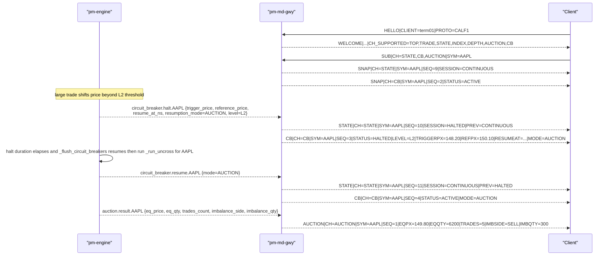

Version: 0.1.0

Date: 2026-07-20

Status: Design Proposal

# EduMatcher — CALF Extension: Auction Uncross and Circuit-Breaker Detail Channels


## Table of Contents

- [EduMatcher — CALF Extension: Auction Uncross and Circuit-Breaker Detail Channels](#edumatcher--calf-extension-auction-uncross-and-circuit-breaker-detail-channels)
  - [Table of Contents](#table-of-contents)
  - [1. Purpose and Relationship to Other CALF Docs](#1-purpose-and-relationship-to-other-calf-docs)
    - [1.1 How to read this document](#11-how-to-read-this-document)
    - [1.2 Where this gap was first identified](#12-where-this-gap-was-first-identified)
  - [2. Summary of Changes](#2-summary-of-changes)
  - [3. Goals and Non-Goals](#3-goals-and-non-goals)
  - [4. Data Availability Audit](#4-data-availability-audit)
  - [5. Compatibility and Versioning](#5-compatibility-and-versioning)
  - [6. Change 1 — New `AUCTION` Channel](#6-change-1--new-auction-channel)
    - [6.1 What EduMatcher already publishes internally](#61-what-edumatcher-already-publishes-internally)
    - [6.2 Why a new channel, not `TRADE`](#62-why-a-new-channel-not-trade)
    - [6.3 Wire format specification](#63-wire-format-specification)
      - [6.3.1 `SUB`](#631-sub)
      - [6.3.2 No `SNAP` for `AUCTION`](#632-no-snap-for-auction)
      - [6.3.3 `AUCTION` (event)](#633-auction-event)
    - [6.4 `SYM=*` eligibility](#64-sym-eligibility)
    - [6.5 Sequence and replay semantics](#65-sequence-and-replay-semantics)
    - [6.6 Gateway wiring — exact call sites](#66-gateway-wiring--exact-call-sites)
      - [6.6.1 New engine subscription required](#661-new-engine-subscription-required)
      - [6.6.2 `normaliser.py` — new method](#662-normaliserpy--new-method)
      - [6.6.3 `gateway.py` — allow the channel and handle the topic](#663-gatewaypy--allow-the-channel-and-handle-the-topic)
    - [6.7 Files to change](#67-files-to-change)
    - [6.8 Test cases required](#68-test-cases-required)
  - [7. Change 2 — New `CB` Channel for Circuit-Breaker Detail](#7-change-2--new-cb-channel-for-circuit-breaker-detail)
    - [7.1 Why not extend `STATE`](#71-why-not-extend-state)
    - [7.2 What EduMatcher already publishes internally](#72-what-edumatcher-already-publishes-internally)
    - [7.3 Normalizing the `mode` / `resumption_mode` inconsistency](#73-normalizing-the-mode--resumption_mode-inconsistency)
    - [7.4 Wire format specification](#74-wire-format-specification)
      - [7.4.1 `SUB`](#741-sub)
      - [7.4.2 `SNAP` for `CH=CB`](#742-snap-for-chcb)
      - [7.4.3 `CB` (event)](#743-cb-event)
    - [7.5 `SYM=*` eligibility](#75-sym-eligibility)
    - [7.6 Relationship between `CB` and `STATE`](#76-relationship-between-cb-and-state)
    - [7.7 Sequence and replay semantics](#77-sequence-and-replay-semantics)
    - [7.8 Gateway wiring — exact call sites](#78-gateway-wiring--exact-call-sites)
      - [7.8.1 `normaliser.py` — new cache and methods](#781-normaliserpy--new-cache-and-methods)
      - [7.8.2 `gateway.py` — allow the channel and pass the full payload through](#782-gatewaypy--allow-the-channel-and-pass-the-full-payload-through)
      - [7.8.3 `gateway.py` — snapshot-on-subscribe](#783-gatewaypy--snapshot-on-subscribe)
    - [7.9 Files to change](#79-files-to-change)
    - [7.10 Test cases required](#710-test-cases-required)
  - [8. Sequence Diagram — Auction Uncross and CB Halt/Resume End-to-End](#8-sequence-diagram--auction-uncross-and-cb-halt-resume-end-to-end)
  - [9. Explicitly Out of Scope](#9-explicitly-out-of-scope)
  - [10. Config Reference (delta)](#10-config-reference-delta)
  - [11. Worked Client Example (Python)](#11-worked-client-example-python)
  - [12. Interaction with `pm-terminal` / Terminal GUI Design](#12-interaction-with-pm-terminal--terminal-gui-design)
  - [13. Rollout and Migration Notes](#13-rollout-and-migration-notes)
  - [14. Open Questions](#14-open-questions)
  - [15. Acceptance Checklist](#15-acceptance-checklist)
  - [16. Summary](#16-summary)


## 1. Purpose and Relationship to Other CALF Docs

This document proposes two additive CALF channels — **`AUCTION`** and
**`CB`** — that expose data the engine already computes and publishes
internally, but which never reaches the CALF wire today:

- Auction uncross results (equilibrium price, matched quantity, imbalance
  side/quantity) for `OPENING_AUCTION`/`CLOSING_AUCTION` transitions and
  circuit-breaker resumption auctions.
- The full circuit-breaker context (trigger price, reference price, ladder
  level, auto-resume time, resumption mode) behind a halt or resume, which
  CALF today collapses into a bare `SESSION=HALTED`/`SESSION=CONTINUOUS`
  transition with no further detail.

This is a companion delta document, in the same spirit as
[EduMatcher-CALF-Extensions.md](EduMatcher-CALF-Extensions.md) (the doc that
shipped `INDEX`, `SYM=*`, and `DEPTH` for CALF 1.0.0).
[EduMatcher-Market_Data_Protocol.md](EduMatcher-Market_Data_Protocol.md)
remains the canonical reference for transport, session lifecycle, and the
message shapes neither this document nor CALF-Extensions.md touches. The
normative, code-verified reference for the *current* shipped protocol is
[`docs/user-guide/920-app-calf-protocol.md`](../docs/user-guide/920-app-calf-protocol.md) —
this proposal is written as a delta against that document.

### 1.1 How to read this document

- Read alongside `920-app-calf-protocol.md` and `EduMatcher-CALF-Extensions.md`.
  Section numbers here are independent of both.
- Every claim about current behavior below cites the exact file and line
  range, verified against the shipped code while writing this proposal, not
  inferred from other design docs.
- Wire examples use the same grammar as the base doc:
  `MSGTYPE|KEY=VALUE|...`, UTF-8, `\n`-terminated, 4096-byte max line
  length. No grammar-level change is proposed anywhere in this document.
- **Status is Design Proposal.** Unlike `EduMatcher-CALF-Extensions.md`
  (which documented and specified changes already implemented), nothing in
  this document is implemented yet.

### 1.2 Where this gap was first identified

[EduMatcher-Terminal-GUI.md](EduMatcher-Terminal-GUI.md) §4.3 (gap 3) and
§4.5 first identified this exact gap while designing the `pm-terminal`
Bloomberg-style terminal: *"Auction uncross/imbalance data and rich
circuit-breaker context are not on the CALF wire."* That document's own
resolution was explicitly **not** a CALF change — its §4.5 has
`pm-terminal-bridge` open a second WebSocket connection directly to
`pm-api-gwy`'s `/api/v1/market-data`, subscribed to `channels: ["auction"]`,
specifically to avoid proposing a protocol change in what it frames as "a
GUI design document." This document is that follow-up protocol change,
closing the gap inside CALF itself so `pm-terminal` (and any other CALF
client — bots, `pm-viewer`, third-party integrations) can get this data
without a second, REST/WS-gateway-authenticated connection. See §12 for how
adopting this proposal would simplify the Terminal GUI's own architecture.


## 2. Summary of Changes

| # | Change | Type | Wire-visible? | Section |
|---|---|---|---|---|
| 1 | New `AUCTION` channel: per-symbol auction uncross results | New protocol + gateway code + **new engine-topic subscription** | Yes — new channel | §6 |
| 2 | New `CB` channel: full circuit-breaker halt/resume context | New protocol + gateway code (reuses existing engine subscriptions) | Yes — new channel | §7 |
| 3 | `WELCOME|CH_SUPPORTED=` gains `AUCTION,CB` | Protocol + gateway code change | Yes — two new tokens in an existing field | §5 |

`PROTO=CALF1` is unchanged. No existing client needs to change anything to
keep working exactly as before — both channels are opt-in via `SUB`.


## 3. Goals and Non-Goals

**Goals:**

- Expose `auction.result.{SYMBOL}` (equilibrium price, matched quantity,
  imbalance side and quantity) as a CALF channel, for both scheduled
  open/close auctions and circuit-breaker resumption auctions.
- Expose the full per-symbol circuit-breaker payload already computed by the
  engine — `trigger_price`, `reference_price`, `level`, `resume_at_ns`,
  `resumption_mode` — as a CALF channel, rather than the bare
  `SESSION=HALTED` transition CALF gives today.
- Keep both channels additive: no change to `TOP`, `TRADE`, `STATE`,
  `INDEX`, or `DEPTH` wire shapes; `PROTO` stays `CALF1`.
- Reuse existing generic gateway infrastructure (`SequenceAllocator`,
  `ReplayBuffer`, `_emit_stream_event`) exactly as `DEPTH` did — no new
  sequencing/replay mechanism.

**Non-Goals:**

- **Index-level circuit breakers.** A separate proposal,
  [EduMatcher-index-cb.md](EduMatcher-index-cb.md), covers index-level halts
  (`circuit_breaker.halt.index.{ID}` / `circuit_breaker.resume.index.{ID}`)
  with a deliberately different field set (`current_value`/`reference_value`
  rather than `trigger_price`/`reference_price` — see that doc's §6.3). This
  document is symbol-level CB only; see §14 for whether `CB` should later be
  extended to indices.
- **Changing `STATE`'s existing field set.** `STATE` keeps exactly the
  fields documented in `920-app-calf-protocol.md` §"STATE"
  (`CH`, `SYM`, `SEQ`, `TS`, `SESSION`, `PREV`). See §7.1 for why CB detail
  is a new channel rather than new `STATE` fields.
- **Changing engine-side behavior or wire topics.** Both `auction.result.*`
  and `circuit_breaker.halt.*`/`circuit_breaker.resume.*` already exist and
  already carry every field this proposal exposes. This is a gateway
  (`pm-md-gwy`) and CALF-wire change only.
- **A REST/WS equivalent.** `pm-api-gwy`'s `/api/v1/market-data` already
  exposes `auction` and `circuit_breaker` (§260-api-gateway.md); this
  document does not change that surface, only CALF.


## 4. Data Availability Audit

| Data point | Engine event | Currently on CALF? | Gap |
|---|---|---|---|
| Equilibrium price | `auction.result.{SYMBOL}` → `eq_price` | No | `pm-md-gwy` does not subscribe to `auction.result.*` at all (§6.1) |
| Matched quantity | `auction.result.{SYMBOL}` → `eq_qty` | No | same |
| Trade count from uncross | `auction.result.{SYMBOL}` → `trades_count` | No | same |
| Imbalance side | `auction.result.{SYMBOL}` → `imbalance_side` | No | same |
| Imbalance quantity | `auction.result.{SYMBOL}` → `imbalance_qty` | No | same |
| Trigger price | `circuit_breaker.halt.{SYMBOL}` → `trigger_price` | No | `normalise_halt(sym)` takes only the symbol; the rest of the payload is discarded (§7.2) |
| Reference price | `circuit_breaker.halt.{SYMBOL}` → `reference_price` | No | same |
| CB ladder level | `circuit_breaker.halt.{SYMBOL}` → `level` | No | same |
| Auto-resume time | `circuit_breaker.halt.{SYMBOL}` → `resume_at_ns` | No | same |
| Resumption mode | `circuit_breaker.halt.{SYMBOL}` → `resumption_mode`; `circuit_breaker.resume.{SYMBOL}` → `mode` | No | same, and the two topics use inconsistent field names (§7.3) |
| Coarse halted/resumed state | `circuit_breaker.halt`/`resume` → `STATE\|SESSION=HALTED\|PREV=...` | **Yes** | already shipped, unchanged by this proposal |

Every gap row already exists as a fully-computed engine event; every fix in
this document is confined to `pm-md-gwy` (`src/edumatcher/md_gateway/`).


## 5. Compatibility and Versioning

Both changes are additive: two new optional channels, opt-in via `SUB`. No
existing message shape changes. Per the same reasoning as
`EduMatcher-CALF-Extensions.md` §3.1, `PROTO` stays `CALF1`; capability
detection continues to go through `WELCOME|CH_SUPPORTED=`, which gains two
new tokens:

```text
WELCOME|PROTO=CALF1|GW=md-gwy01|HBINT=1|REPLAY=30|SYMBOLS=AAPL,MSFT|CH_SUPPORTED=TOP,TRADE,STATE,INDEX,DEPTH,AUCTION,CB
```

A client that does not recognize `AUCTION`/`CB` in `CH_SUPPORTED` simply
never subscribes to them; a client that does `SUB|CH=AUCTION|...` against a
pre-this-proposal gateway gets `ERR|CODE=INVALID_CHANNEL` exactly as any
unrecognized channel does today (`920-app-calf-protocol.md` §"Error codes").


## 6. Change 1 — New `AUCTION` Channel

### 6.1 What EduMatcher already publishes internally

`AuctionResult` (`src/edumatcher/engine/auction.py` lines 29–36):

```python
@dataclass
class AuctionResult:
    eq_price: int | None  # None when no crossable interest
    eq_qty: int            # total executable quantity
    surplus: int            # |buy_qty - sell_qty| at eq_price
    imbalance_side: str     # "BUY", "SELL", or "" if balanced
```

`_run_uncross()` (`src/edumatcher/engine/main.py` lines 3031–3139) computes
this via `compute_equilibrium(book)`, executes any crossable interest, and
**unconditionally** — even when there is no crossable interest at all —
publishes the result via `make_auction_result_msg` (lines 3126–3139):

```python
self.pub_sock.send_multipart(
    make_auction_result_msg(
        symbol=symbol,
        eq_price=(from_ticks(result.eq_price, symbol)
                  if result.eq_price is not None else None),
        eq_qty=result.eq_qty,
        trades_count=len(trades) if result.eq_price else 0,
        imbalance_side=result.imbalance_side,
        imbalance_qty=result.surplus,
    )
)
```

`make_auction_result_msg` (`src/edumatcher/models/message.py` lines
515–534) publishes this on topic **`auction.result.{SYMBOL}`**, on the
engine's PUB socket (`:5556`) — the same socket `pm-md-gwy` already
connects to for `book.`/`trade.executed`/`session.state`/
`circuit_breaker.*`. Confirmed exact payload shape:

```python
{
    "symbol": symbol,
    "eq_price": eq_price,             # display-unit float, or None
    "eq_qty": eq_qty,                  # int
    "trades_count": trades_count,      # int
    "imbalance_side": imbalance_side,  # "BUY" | "SELL" | ""
    "imbalance_qty": imbalance_qty,    # int (this is AuctionResult.surplus)
}
```

`_run_uncross()` fires from two call sites: (a) session transitions exiting
`OPENING_AUCTION`/`CLOSING_AUCTION` (`_handle_session_transition`, when
`needs_uncross` is true), and (b) per-symbol circuit-breaker resumption
(`symbol_filter=symbol`, from `_flush_circuit_breakers()` and the ADMIN
resume handlers) — so an `AUCTION` event and a `CB` resume event (§7) will
typically arrive back-to-back for the same symbol on a CB resume, which is
useful context for a subscriber that wants both.

**This requires a new engine-topic subscription, unlike `DEPTH`.**
`pm-md-gwy`'s engine SUB socket (`gateway.py` lines 69–76) currently
subscribes to exactly:

```python
self._sub_sock = make_subscriber(
    config.engine_pub_addr,
    "book.",
    "trade.executed",
    "session.state",
    "circuit_breaker.halt.",
    "circuit_breaker.resume.",
)
```

`auction.result.` is **not** in this list — `pm-md-gwy` receives zero
auction events today, not even discarded ones (contrast with §7.2's CB gap,
where the gateway already receives the full payload and discards fields
from it). Adding `AUCTION` therefore requires one new prefix in this
`make_subscriber(...)` call, in addition to the gateway-side changes below.
No engine change is needed — the topic and payload already exist exactly as
needed.

### 6.2 Why a new channel, not `TRADE`

An auction uncross does independently publish `trade.executed` events for
each fill it produces (§6.1, `_publish_trade(trade)` per trade) — those
already flow to CALF's existing `TRADE` channel unchanged, no gap there.
`AUCTION` is a distinct summary event about the *auction itself*
(equilibrium price, imbalance) that is published exactly once per uncross,
**even when zero trades result** (`eq_price=None`, no crossable interest) —
information `TRADE` cannot carry, since `TRADE` only fires per individual
fill and never fires at all on a no-cross auction. A subscriber wanting to
know "did the opening auction happen, and was it balanced" cannot get that
from `TRADE` alone.

### 6.3 Wire format specification

#### 6.3.1 `SUB`

```text
SUB|CH=AUCTION|SYM=AAPL
```

Same grammar as any other `SUB`; combinable with other channels
(`SUB|CH=TOP,AUCTION|SYM=AAPL`).

#### 6.3.2 No `SNAP` for `AUCTION`

Like `TRADE`, `AUCTION` has no persistent "current state" to snapshot — it
is a stream of past events, not a live value. No `SNAP` is sent on
subscribe; a new subscriber simply starts receiving `AUCTION` events from
the next uncross onward (or via `RESUME`/`LASTSEQ` replay — §6.5 — if
reconnecting).

#### 6.3.3 `AUCTION` (event)

| Field | Req | Type | Description |
|---|---|---|---|
| `CH` | ✓ | string | Always `AUCTION` |
| `SYM` | ✓ | string | Instrument symbol |
| `SEQ` | ✓ | int | Monotonic sequence for `(AUCTION, SYM)`; increments by 1 per emitted event |
| `TS` | ✓ | string | UTC ISO-8601 timestamp with ms |
| `EQPX` | — | decimal | Equilibrium price; **omitted** when there was no crossable interest (`eq_price=None`) |
| `EQQTY` | ✓ | int | Total executable quantity matched at `EQPX` (`0` when no cross) |
| `TRADES` | ✓ | int | Number of trades produced by the uncross (`0` when no cross) |
| `IMBSIDE` | — | string | `BUY` or `SELL`; **omitted** when balanced (engine's `imbalance_side=""`) |
| `IMBQTY` | ✓ | int | Residual imbalance quantity at `EQPX` (`0` when balanced or no cross) |

```text
AUCTION|CH=AUCTION|SYM=AAPL|SEQ=1|TS=2026-07-20T13:30:00.012Z|EQPX=150.10|EQQTY=48200|TRADES=37|IMBSIDE=BUY|IMBQTY=1400
```

No-cross example (no crossable interest at all — `EQPX`/`IMBSIDE` omitted,
`EQQTY`/`TRADES`/`IMBQTY` all zero):

```text
AUCTION|CH=AUCTION|SYM=TSLA|SEQ=4|TS=2026-07-20T20:00:00.004Z|EQQTY=0|TRADES=0|IMBQTY=0
```

Balanced-cross example (`IMBSIDE` omitted, `IMBQTY=0`):

```text
AUCTION|CH=AUCTION|SYM=MSFT|SEQ=2|TS=2026-07-20T13:30:00.031Z|EQPX=421.00|EQQTY=15000|TRADES=12|IMBQTY=0
```

Field-name mapping to the internal payload, for implementers: `eq_price` →
`EQPX`, `eq_qty` → `EQQTY`, `trades_count` → `TRADES`, `imbalance_side` →
`IMBSIDE`, `imbalance_qty` → `IMBQTY`. `IMBQTY`'s internal name is
`imbalance_qty` on the wire message but `AuctionResult.surplus` in the
dataclass that computes it (`engine/auction.py` line 35) — this proposal
follows the wire-message name (`imbalance_qty`), which is what
`pm-md-gwy` will actually receive, so no further translation is introduced.

### 6.4 `SYM=*` eligibility

**Proposed: allowed.** Unlike `DEPTH` (rejected for bandwidth reasons — a
per-symbol ladder replicated across every symbol on every book tick) or
`INDEX` (rejected as "no meaningful wildcard" for a per-index concept),
`AUCTION` events are extremely low frequency — at most a handful of times
per symbol per trading day (open auction, close auction, and however many
CB resumption auctions occur), matching `docs-design/EduMatcher-Terminal-GUI.md`
§4.5's own observation. This mirrors `TRADE`'s existing wildcard rationale
more than `DEPTH`'s. `pm-api-gwy`'s `/api/v1/market-data` already treats
`auction` as effectively wildcard-by-default (omitting `symbols` delivers
every symbol — `260-api-gateway.md` lines 608-616), so allowing `SYM=*` for
CALF's `AUCTION` is also consistent with that existing precedent. This adds
`AUCTION` to `_WILDCARD_ELIGIBLE_CHANNELS` (§6.6.3).

### 6.5 Sequence and replay semantics

No new infrastructure — reuses `SequenceAllocator`/`ReplayBuffer` exactly as
`DEPTH` did (`EduMatcher-CALF-Extensions.md` §6.5), keyed on
`("AUCTION", symbol)`. `HELLO|RESUME=1|CH=AUCTION|SYM=AAPL|LASTSEQ=n`
replays missed `AUCTION` events the same way any other channel does.
`SYM=*` on `RESUME` remains rejected for every channel per existing base
rules (`920-app-calf-protocol.md`'s `INVALID_SYMBOL` row), unaffected by
§6.4's `SUB`-side wildcard allowance.

### 6.6 Gateway wiring — exact call sites

#### 6.6.1 New engine subscription required

`gateway.py` lines 69–76 — add `"auction.result."` to the existing
`make_subscriber(...)` prefix list:

```python
self._sub_sock = make_subscriber(
    config.engine_pub_addr,
    "book.",
    "trade.executed",
    "session.state",
    "circuit_breaker.halt.",
    "circuit_breaker.resume.",
    "auction.result.",
)
```

This is the one part of this proposal that is not "purely a
normaliser/gateway-logic addition" the way `DEPTH` was — it is a new ZMQ
subscription prefix, though still no engine-side change (the engine already
publishes unconditionally to this topic; `pm-md-gwy` simply was not
listening).

#### 6.6.2 `normaliser.py` — new method

Parallel to `normalise_trade` (lines 118-133):

```python
def normalise_auction_result(
    self, payload: dict[str, Any]
) -> tuple[str, dict[str, str]]:
    """Return (symbol, fields) for a CALF AUCTION message."""
    sym = str(payload.get("symbol", "")).upper()
    fields: dict[str, str] = {
        "EQQTY": _as_int_text(payload.get("eq_qty")) or "0",
        "TRADES": _as_int_text(payload.get("trades_count")) or "0",
        "IMBQTY": _as_int_text(payload.get("imbalance_qty")) or "0",
    }
    eq_price = payload.get("eq_price")
    if eq_price is not None:
        fields["EQPX"] = _as_decimal(eq_price) or "0"
    imbalance_side = str(payload.get("imbalance_side", "")).upper()
    if imbalance_side:
        fields["IMBSIDE"] = imbalance_side
    return sym, fields
```

No new cache dataclass is needed — unlike `TOP`/`DEPTH`/`INDEX`, `AUCTION`
has no "current state" to diff against or snapshot (§6.3.2); every engine
event is forwarded as its own CALF event.

#### 6.6.3 `gateway.py` — allow the channel and handle the topic

```python
_ALLOWED_CHANNELS = frozenset(
    {"TOP", "TRADE", "STATE", "INDEX", "DEPTH", "AUCTION", "CB"}
)
_WILDCARD_ELIGIBLE_CHANNELS = frozenset({"STATE", "TOP", "TRADE", "AUCTION"})
```

New branch in `_poll_engine_events` (extending the block at lines 657–739),
alongside the existing `trade.executed`/`session.state` handlers:

```python
if topic.startswith("auction.result."):
    self._dbg_count("auction_topics")
    sym, auction_fields = self._normaliser.normalise_auction_result(payload)
    if sym:
        self._emit_stream_event(
            "AUCTION", "AUCTION", sym, auction_fields, now_seconds
        )
    continue
```

No `_send_snapshot_for_stream` branch is needed (§6.3.2) and no change to
`_handle_sub`'s snapshot-on-subscribe set (`AUCTION` stays out of
`{"TOP", "STATE", "INDEX", "DEPTH"}`, mirroring `TRADE`'s exclusion from
that same set today).

### 6.7 Files to change

| File | Change |
|---|---|
| `src/edumatcher/md_gateway/gateway.py` | Add `"auction.result."` to the engine SUB socket's topic list (§6.6.1); add `AUCTION` to `_ALLOWED_CHANNELS` and `_WILDCARD_ELIGIBLE_CHANNELS`; add the `auction.result.` branch to `_poll_engine_events` (§6.6.3) |
| `src/edumatcher/md_gateway/normaliser.py` | Add `normalise_auction_result` (§6.6.2) |
| `docs/user-guide/920-app-calf-protocol.md` | Add `AUCTION` to the channel model, message catalog, and `CH_SUPPORTED` example |
| `tests/test_md_gateway_*.py` | See §6.8 |

### 6.8 Test cases required

- A `session.state` transition out of `OPENING_AUCTION` with crossable
  interest produces exactly one `AUCTION` event per traded symbol, with
  `EQPX`/`EQQTY`/`TRADES`/`IMBQTY` all present and consistent with the
  `TRADE` events published for the same uncross.
- An uncross with **no** crossable interest (`eq_price=None`) produces an
  `AUCTION` event with `EQPX` and `IMBSIDE` **omitted**, `EQQTY=0`,
  `TRADES=0`, `IMBQTY=0` — not a suppressed/missing event.
- A perfectly balanced uncross (`imbalance_side=""`) omits `IMBSIDE` but
  still emits `IMBQTY=0`.
- `SUB|CH=AUCTION|SYM=*` is accepted (unlike `SUB|CH=DEPTH|SYM=*` /
  `SUB|CH=INDEX|SYM=*`, which remain rejected) and a subsequent
  circuit-breaker-resume-triggered auction on any known symbol is delivered
  to that wildcard subscriber.
- `SUB|CH=AUCTION|SYM=AAPL` produces **no** `SNAP` line (regression check
  mirroring `TRADE`'s existing no-`SNAP` behavior).
- `HELLO|RESUME=1|CH=AUCTION|SYM=AAPL|LASTSEQ=n` replays missed `AUCTION`
  events from the replay buffer, identically to any other channel.
- A gateway that never received a prior `auction.result.` topic (e.g.
  freshly started mid-session, no auctions yet) does not error on `SUB`;
  it simply delivers nothing until the first uncross.


## 7. Change 2 — New `CB` Channel for Circuit-Breaker Detail

### 7.1 Why not extend `STATE`

CALF's `STATE` message (`920-app-calf-protocol.md` §"STATE") carries exactly
`CH`, `SYM`, `SEQ`, `TS`, `SESSION`, and optional `PREV` — and is used for
**both** session-wide transitions (`SYM=*`, e.g.
`STATE|SYM=*|SESSION=CONTINUOUS|PREV=OPENING_AUCTION`) and per-symbol halts
(`SYM=AAPL|SESSION=HALTED|PREV=CONTINUOUS`). Grafting `trigger_price`,
`reference_price`, `level`, `resume_at_ns`, and `resumption_mode` onto
`STATE` would mean those fields are meaningless/absent on every
session-wide `STATE` event (there is no "trigger price" for
`PRE_OPEN → OPENING_AUCTION`), muddying a message type that is otherwise a
clean, small transition record. A dedicated `CB` channel, correlated by
`SYM` with the corresponding `STATE` event (§7.6), keeps `STATE` unchanged
and gives CB detail its own well-typed message shape — the same reasoning
`EduMatcher-CALF-Extensions.md` §6.1 used to justify a dedicated `DEPTH`
channel instead of overloading `MD`.

### 7.2 What EduMatcher already publishes internally

Four call sites in `src/edumatcher/engine/main.py` publish
`circuit_breaker.halt.{SYMBOL}`, all with the identical field set (values
differ by trigger path):

**Automatic threshold breach** (lines 1819–1839, via `_check_circuit_breaker`
after a fill; `cb` is the symbol's `CircuitBreakerState`):

```python
self.pub_sock.send_multipart(
    encode(f"circuit_breaker.halt.{symbol}", {
        "symbol": symbol,
        "trigger_price": (from_ticks(cb.trigger_price, symbol)
                           if cb.trigger_price is not None else None),
        "reference_price": (from_ticks(cb.reference_price, symbol)
                             if cb.reference_price is not None else None),
        "resume_at_ns": cb.resume_at_ns,
        "resumption_mode": cb.active_resumption_mode,
        "level": cb.triggered_level,
    })
)
```

**ADMIN exchange-wide halt** (`risk.circuit_breaker_halt_all`, lines
2343–2355): identical shape, `trigger_price`/`reference_price`/
`resume_at_ns` all `None`, `resumption_mode: "MANUAL"`, `level: "ADMIN_ALL"`.

**ADMIN per-symbol halt** (`risk.symbol_halt`, lines 2482–2493): same
null-price shape, `resumption_mode: "MANUAL"`, `level: "ADMIN_SYMBOL"`.

`level` values observed in the codebase: config-driven names for automatic
triggers (conventionally `"L1"`/`"L2"`/`"L3"` per
`docs/user-guide/120-risk-controls.md`'s example config, though these are
arbitrary strings from `circuit_breaker_defaults.levels.<name>`, not a fixed
enum — `CircuitBreakerLevel.name`, `src/edumatcher/engine/circuit_breaker.py`
line 21), plus the two literal operator-halt values `"ADMIN_ALL"` and
`"ADMIN_SYMBOL"`.

Resume events (`circuit_breaker.resume.{SYMBOL}`) publish a **much thinner**
payload at all three resume call sites (automatic timed resume, ADMIN
resume-all, ADMIN per-symbol resume — lines 1869–1870, 2402, 2551):

```python
{"symbol": symbol, "mode": mode_string}   # mode: "AUCTION" | "CONTINUOUS" | "MANUAL"
```

**Confirmed gateway-side gap**: `md_gateway/normaliser.py`'s
`normalise_halt`/`normalise_resume` (lines 151–166):

```python
def normalise_halt(self, symbol: str) -> tuple[str, dict[str, str]]:
    sym = symbol.upper()
    prev = self.symbol_state.get(sym) or self.session_state
    self.symbol_state[sym] = "HALTED"
    return sym, {"SESSION": "HALTED", "PREV": prev}

def normalise_resume(self, symbol: str) -> tuple[str, dict[str, str]]:
    sym = symbol.upper()
    prev = self.symbol_state.get(sym, "HALTED")
    self.symbol_state[sym] = "CONTINUOUS"
    return sym, {"SESSION": "CONTINUOUS", "PREV": prev}
```

Both take **only the bare symbol string**. Their call sites in
`_poll_engine_events` (lines 711–734) already have the full decoded
`payload` dict in scope but never pass it in:

```python
if topic.startswith("circuit_breaker.halt."):
    sym = topic.split(".", 2)[2].upper()
    state_sym, state_fields = self._normaliser.normalise_halt(sym)   # payload discarded
    ...
```

**No engine change and no new engine-topic subscription are needed for
`CB`** — unlike `AUCTION` (§6.6.1), `pm-md-gwy` already subscribes to
`circuit_breaker.halt.`/`circuit_breaker.resume.` (`gateway.py` lines
74–75) and already has the full payload decoded in hand at both call sites.
This is purely a "stop discarding fields already in hand" change, exactly
like `DEPTH` was for the book payload (`EduMatcher-CALF-Extensions.md`
§6.2).

### 7.3 Normalizing the `mode` / `resumption_mode` inconsistency

The engine itself is inconsistent: the halt payload's field is
`resumption_mode`, the resume payload's field is `mode` — confirmed at the
exact call sites in §7.2. This proposal does **not** change the internal
engine topics or field names (out of scope — §3, "Non-Goals"), but
normalizes this on the CALF wire: both the `CB` halt event and the `CB`
resume event use the same wire key, `MODE` (§7.4.3), so a CALF client never
has to know about this internal inconsistency.

### 7.4 Wire format specification

#### 7.4.1 `SUB`

```text
SUB|CH=CB|SYM=AAPL
```

Same grammar as any other `SUB`; combinable with other channels
(`SUB|CH=STATE,CB|SYM=AAPL`).

#### 7.4.2 `SNAP` for `CH=CB`

Sent automatically on first subscribe to a given `(CB, SYM)` pair, same
trigger point as `TOP`/`STATE`/`INDEX`/`DEPTH` (§7.8.3). Reflects the
**last known** CB state for the symbol — `ACTIVE` (no halt in effect) if
none has ever occurred.

| Field | Req | Type | Description |
|---|---|---|---|
| `CH` | ✓ | string | `CB` |
| `SYM` | ✓ | string | Instrument symbol |
| `SEQ` | ✓ | int | Current sequence; next `CB` event will be `SEQ+1` |
| `TS` | ✓ | string | Snapshot timestamp |
| `STATUS` | ✓ | string | `ACTIVE` (not halted) or `HALTED` |
| `LEVEL` | — | string | Ladder level or `ADMIN_ALL`/`ADMIN_SYMBOL`; present only when `STATUS=HALTED` |
| `TRIGGERPX` | — | decimal | Trigger price; present only for automatic (non-`ADMIN_*`) halts currently in effect |
| `REFPX` | — | decimal | Reference price at trigger time; present only for automatic halts currently in effect |
| `RESUMEAT` | — | int | Scheduled auto-resume time, UTC epoch nanoseconds; present only for timed halts currently in effect (absent for rest-of-day or manual halts) |
| `MODE` | — | string | `AUCTION`, `CONTINUOUS`, or `MANUAL`; present only when `STATUS=HALTED` |

```text
SNAP|CH=CB|SYM=AAPL|SEQ=3|TS=2026-07-20T14:05:00.000Z|STATUS=HALTED|LEVEL=L2|TRIGGERPX=148.20|REFPX=150.10|RESUMEAT=1784560800000000000|MODE=AUCTION
```

```text
SNAP|CH=CB|SYM=MSFT|SEQ=1|TS=2026-07-20T14:05:00.000Z|STATUS=ACTIVE
```

#### 7.4.3 `CB` (event)

Emitted on every `circuit_breaker.halt.{SYMBOL}` and
`circuit_breaker.resume.{SYMBOL}` engine event. Same field set as `SNAP`
above, minus `LEVELS`-style baseline-only concerns — every field is
populated according to the same presence rules as `SNAP`.

**Halt event** — automatic trigger:

```text
CB|CH=CB|SYM=AAPL|SEQ=4|TS=2026-07-20T14:05:00.010Z|STATUS=HALTED|LEVEL=L2|TRIGGERPX=148.20|REFPX=150.10|RESUMEAT=1784560800000000000|MODE=AUCTION
```

**Halt event** — ADMIN exchange-wide halt (`trigger`/`reference`/`resume`
all null on the wire → omitted; `MODE=MANUAL`):

```text
CB|CH=CB|SYM=TSLA|SEQ=1|TS=2026-07-20T15:00:00.000Z|STATUS=HALTED|LEVEL=ADMIN_ALL|MODE=MANUAL
```

**Resume event:**

```text
CB|CH=CB|SYM=AAPL|SEQ=5|TS=2026-07-20T14:20:00.010Z|STATUS=ACTIVE|MODE=AUCTION
```

Note `LEVEL`/`TRIGGERPX`/`REFPX`/`RESUMEAT` are all omitted on resume —
these describe the halt that just ended, not the post-resume state, and the
engine's own resume payload does not carry them either (§7.2). `MODE` is
retained on the resume event since it is meaningful there too (which
resumption mechanism was used), unlike the other four fields.

Field-name mapping to the internal payloads, for implementers:
`trigger_price` → `TRIGGERPX`, `reference_price` → `REFPX`, `level` →
`LEVEL`, `resume_at_ns` → `RESUMEAT`, `resumption_mode`/`mode` → `MODE`
(§7.3).

### 7.5 `SYM=*` eligibility

**Proposed: not allowed**, consistent with `INDEX`/`DEPTH`. A wildcard
`CB` snapshot burst across every known symbol on first subscribe would
require iterating the full symbol universe the same way `TOP`'s wildcard
snapshot burst does (`EduMatcher-CALF-Extensions.md` §5.4) — feasible, but
CB state changes are rare and operator-relevant per-symbol, not a
"subscribe to everything" firehose use case like `TRADE`. Excluding it also
keeps the initial implementation simpler; revisit if usage shows a
wildcard need (§14).

### 7.6 Relationship between `CB` and `STATE`

Both fire from the same underlying engine event (`circuit_breaker.halt.*`
/ `circuit_breaker.resume.*`); `pm-md-gwy` will emit **both** a `STATE`
event (unchanged, existing behavior) and a `CB` event (new) from the same
`_poll_engine_events` iteration, in the order `STATE` then `CB`. A client
that only cares about the coarse halted/active transition keeps using
`STATE` exactly as today; a client that wants the detail additionally
subscribes to `CB` for the same symbol. This mirrors how `MD`/`DEPTH` are
both derived from the same `book.{SYMBOL}` event today
(`EduMatcher-CALF-Extensions.md` §6.2's "no extra ZMQ traffic, no extra
decode" observation applies identically here).

### 7.7 Sequence and replay semantics

No new infrastructure — reuses `SequenceAllocator`/`ReplayBuffer` keyed on
`("CB", symbol)`, identical pattern to every other channel.

### 7.8 Gateway wiring — exact call sites

#### 7.8.1 `normaliser.py` — new cache and methods

A small cache is needed (unlike `AUCTION`) because `SNAP` must reflect the
**current** halt/active status, mirroring `TopOfBook`/`DepthBook`'s role
for `TOP`/`DEPTH`:

```python
@dataclass
class CBStatus:
    """Cached circuit-breaker status for one symbol."""
    status: str = "ACTIVE"          # "ACTIVE" | "HALTED"
    level: str = ""
    trigger_price: str = ""
    reference_price: str = ""
    resume_at_ns: str = ""
    mode: str = ""

@dataclass
class EngineNormaliser:
    # ...existing fields...
    cb_cache: dict[str, CBStatus] = field(default_factory=dict)

    def normalise_cb_halt(
        self, symbol: str, payload: dict[str, Any]
    ) -> tuple[str, dict[str, str]]:
        """Return (symbol, fields) for a CALF CB halt event."""
        sym = symbol.upper()
        level = str(payload.get("level", "")).upper()
        trigger_price = payload.get("trigger_price")
        reference_price = payload.get("reference_price")
        resume_at_ns = payload.get("resume_at_ns")
        mode = str(payload.get("resumption_mode", "")).upper()

        state = CBStatus(
            status="HALTED",
            level=level,
            trigger_price=_as_decimal(trigger_price) or "",
            reference_price=_as_decimal(reference_price) or "",
            resume_at_ns=_as_int_text(resume_at_ns) or "",
            mode=mode,
        )
        self.cb_cache[sym] = state
        return sym, _cb_fields(state)

    def normalise_cb_resume(
        self, symbol: str, payload: dict[str, Any]
    ) -> tuple[str, dict[str, str]]:
        """Return (symbol, fields) for a CALF CB resume event."""
        sym = symbol.upper()
        mode = str(payload.get("mode", "")).upper()
        state = CBStatus(status="ACTIVE", mode=mode)
        self.cb_cache[sym] = state
        return sym, _cb_fields(state)

    def cb_snapshot_fields(self, symbol: str) -> dict[str, str]:
        """Return current cached CB snapshot fields for symbol."""
        state = self.cb_cache.get(symbol.upper(), CBStatus())
        return _cb_fields(state)


def _cb_fields(state: "CBStatus") -> dict[str, str]:
    fields: dict[str, str] = {"STATUS": state.status}
    if state.status == "HALTED":
        if state.level:
            fields["LEVEL"] = state.level
        if state.trigger_price:
            fields["TRIGGERPX"] = state.trigger_price
        if state.reference_price:
            fields["REFPX"] = state.reference_price
        if state.resume_at_ns:
            fields["RESUMEAT"] = state.resume_at_ns
    if state.mode:
        fields["MODE"] = state.mode
    return fields
```

`_cb_fields` is a new module-level helper alongside the existing
`_encode_levels`/`_as_decimal`/`_as_int_text` (normaliser.py), same file,
same style — no new module, matching `DEPTH`'s precedent
(`EduMatcher-CALF-Extensions.md` §6.6.1).

#### 7.8.2 `gateway.py` — allow the channel and pass the full payload through

`_ALLOWED_CHANNELS` already updated in §6.6.3 to include `CB`. Extend the
existing halt/resume branches in `_poll_engine_events` (lines 711–734) to
pass `payload` through and additionally emit `CB`:

```python
if topic.startswith("circuit_breaker.halt."):
    self._dbg_count("halt_topics")
    sym = topic.split(".", 2)[2].upper()
    state_sym, state_fields = self._normaliser.normalise_halt(sym)
    self._emit_stream_event("STATE", "STATE", state_sym, state_fields, now_seconds)
    cb_sym, cb_fields = self._normaliser.normalise_cb_halt(sym, payload)
    self._emit_stream_event("CB", "CB", cb_sym, cb_fields, now_seconds)
    continue

if topic.startswith("circuit_breaker.resume."):
    self._dbg_count("resume_topics")
    sym = topic.split(".", 2)[2].upper()
    state_sym, state_fields = self._normaliser.normalise_resume(sym)
    self._emit_stream_event("STATE", "STATE", state_sym, state_fields, now_seconds)
    cb_sym, cb_fields = self._normaliser.normalise_cb_resume(sym, payload)
    self._emit_stream_event("CB", "CB", cb_sym, cb_fields, now_seconds)
    continue
```

`normalise_halt`/`normalise_resume` themselves are **unchanged** — `CB`'s
new methods run alongside them, not instead of them, so `STATE`'s existing
behavior (§3, Non-Goals) is untouched.

#### 7.8.3 `gateway.py` — snapshot-on-subscribe

Extend `_send_snapshot_for_stream` with a `CB` branch:

```python
elif ch == "CB":
    fields.update(self._normaliser.cb_snapshot_fields(sym))
```

And add `CB` to the snapshot-on-new-subscribe set in `_handle_sub`:

```python
if ch in {"TOP", "STATE", "INDEX", "DEPTH", "CB"}:
    self._send_snapshot_for_stream(session, ch, sym)
```

### 7.9 Files to change

| File | Change |
|---|---|
| `src/edumatcher/md_gateway/gateway.py` | Add `CB` to `_ALLOWED_CHANNELS` (§6.6.3, shared edit with `AUCTION`); extend the two existing `circuit_breaker.halt.`/`circuit_breaker.resume.` branches in `_poll_engine_events` to also emit `CB` (§7.8.2); extend `_send_snapshot_for_stream` and `_handle_sub`'s snapshot set (§7.8.3) |
| `src/edumatcher/md_gateway/normaliser.py` | Add `CBStatus` dataclass, `normalise_cb_halt`, `normalise_cb_resume`, `cb_snapshot_fields`, `_cb_fields` (§7.8.1) |
| `docs/user-guide/920-app-calf-protocol.md` | Add `CB` to the channel model, message catalog, `SNAP`/event field tables, and `CH_SUPPORTED` example |
| `docs/user-guide/120-risk-controls.md` | Cross-reference this new CALF exposure from the existing CB documentation |
| `tests/test_md_gateway_*.py` | See §7.10 |

### 7.10 Test cases required

- An automatic CB trigger produces both a `STATE|SESSION=HALTED` event
  (unchanged) **and** a `CB|STATUS=HALTED` event with `LEVEL`, `TRIGGERPX`,
  `REFPX`, and `RESUMEAT` all present, for the same `(SEQ ordering
  aside) SYM`.
- An ADMIN exchange-wide halt (`risk.circuit_breaker_halt_all`) produces a
  `CB` event with `LEVEL=ADMIN_ALL`, `MODE=MANUAL`, and `TRIGGERPX`/`REFPX`/
  `RESUMEAT` all **omitted** (matching the engine's `None` values).
- An ADMIN per-symbol halt (`risk.symbol_halt`) produces `LEVEL=ADMIN_SYMBOL`
  with the same omissions.
- A resume event (any of the three resume paths) produces
  `CB|STATUS=ACTIVE|MODE=...` with `LEVEL`/`TRIGGERPX`/`REFPX`/`RESUMEAT`
  all omitted, and the `MODE` value matches the engine's `mode` field
  (verifying the `mode`/`resumption_mode` normalization in §7.3).
- `SUB|CH=CB|SYM=AAPL` on a symbol with no prior CB history produces
  `SNAP|CH=CB|SYM=AAPL|...|STATUS=ACTIVE` with no `LEVEL`/`TRIGGERPX`/
  `REFPX`/`RESUMEAT`/`MODE` fields at all.
- `SUB|CH=CB|SYM=AAPL` on a symbol **currently halted** produces a `SNAP`
  reflecting the halt in effect (`STATUS=HALTED` plus the same detail
  fields as the triggering `CB` event).
- `SUB|CH=CB|SYM=*` is rejected with `ERR|CODE=INVALID_SYMBOL` (§7.5).
- `HELLO|RESUME=1|CH=CB|SYM=AAPL|LASTSEQ=n` replays missed `CB` events
  identically to any other channel.


## 8. Sequence Diagram — Auction Uncross and CB Halt/Resume End-to-End




## 9. Explicitly Out of Scope

- **Index-level circuit breakers** (`circuit_breaker.halt.index.{ID}` /
  `circuit_breaker.resume.index.{ID}` per
  [EduMatcher-index-cb.md](EduMatcher-index-cb.md)). Different field
  vocabulary (`current_value`/`reference_value`), different channel
  candidate name if pursued (e.g. `IDXCB`, to avoid conflating with
  per-symbol `CB`) — see §14.
- **A generic "risk event" channel** covering collar rejects, kill-switch
  activity, or other `risk.*` topics not covered here. Only auction results
  and per-symbol CB halt/resume are in scope.
- **Historical query support.** Neither `AUCTION` nor `CB` gets a
  file-backed history/audit-log equivalent to `pm-index-cli`'s structural
  JSONL files. Both are live-stream-only, same as `TRADE`/`DEPTH` today.
  (`pm-audit-cli` already captures every message on the bus, including
  these topics, for after-the-fact analysis — no new tool is proposed
  here.)
- **Changing `resumption_mode`'s current informational-only status.** Per
  `120-risk-controls.md`, resume always runs an unconditional uncross
  regardless of the configured mode; this proposal surfaces the field as-is
  on the wire, it does not change what the engine does with it.


## 10. Config Reference (delta)

No new `market_data_gateway` config keys are required. Both channels ship
on-by-default, same as `DEPTH`'s precedent (`EduMatcher-CALF-Extensions.md`
§9) — no opt-in gate, no new YAML fields.


## 11. Worked Client Example (Python)

```python
import socket

sock = socket.create_connection(("127.0.0.1", 5570))
sock.sendall(b"HELLO|CLIENT=demo01|PROTO=CALF1\n")
print(sock.recv(4096))  # WELCOME|...|CH_SUPPORTED=...,AUCTION,CB

sock.sendall(b"SUB|CH=STATE,CB,AUCTION|SYM=AAPL\n")

buf = b""
while True:
    buf += sock.recv(4096)
    while b"\n" in buf:
        line, buf = buf.split(b"\n", 1)
        fields = dict(kv.split("=", 1) for kv in line.decode().split("|")[1:] if "=" in kv)
        msg_type = line.decode().split("|", 1)[0]
        if msg_type == "CB" and fields.get("STATUS") == "HALTED":
            print(
                f"{fields['SYM']} HALTED level={fields.get('LEVEL')} "
                f"trigger={fields.get('TRIGGERPX')} ref={fields.get('REFPX')} "
                f"resumes={fields.get('RESUMEAT')} mode={fields.get('MODE')}"
            )
        elif msg_type == "AUCTION":
            side = fields.get("IMBSIDE", "balanced")
            print(
                f"{fields['SYM']} auction: eq={fields.get('EQPX', 'no-cross')} "
                f"qty={fields['EQQTY']} imbalance={side} {fields['IMBQTY']}"
            )
```


## 12. Interaction with `pm-terminal` / Terminal GUI Design

[EduMatcher-Terminal-GUI.md](EduMatcher-Terminal-GUI.md) §4.5's workaround
(`pm-terminal-bridge` opening a second WebSocket connection to
`pm-api-gwy`'s `/api/v1/market-data` for `auction`/`circuit_breaker` events,
alongside its primary CALF connection for book/trade/state) exists purely
because CALF could not carry this data. If this proposal is adopted,
`pm-terminal-bridge` could subscribe to `AUCTION` and `CB` on its **existing**
CALF connection and drop the second WS uplink entirely — simplifying its
own architecture (one connection, one credential, one reconnect/backoff
path instead of two) and removing its dependency on a `pm-api-gwy` API key
purely for this purpose. That simplification is not required by this
proposal and is not itself in scope here, but is worth flagging to whoever
implements `pm-terminal` next: check whether this document has landed
before building the dual-connection workaround described in
`EduMatcher-Terminal-GUI.md` §4.5.

The field names chosen here were cross-checked against that document's own
§9.3a (auction banner: equilibrium price, matched qty, imbalance side) and
§13 (Session & Halt Status Board columns: `LEVEL`, `TRIGGER`, `REFERENCE`,
`RESUMES`) for naming consistency — `EQPX`/`EQQTY`/`IMBSIDE`/`IMBQTY` and
`LEVEL`/`TRIGGERPX`/`REFPX`/`RESUMEAT` map directly onto what that UI design
already expects to display, so no relayout of the Terminal GUI's own
wireframes would be needed if it consumed `AUCTION`/`CB` directly instead of
its bridge's internal `auction_result`/`halt_context` frame shapes (§17.3
of that document).


## 13. Rollout and Migration Notes

- Fully backward compatible: existing clients that never send
  `SUB|CH=AUCTION|...` or `SUB|CH=CB|...` see zero behavior change.
- No config migration needed (§10).
- Deploy order: gateway code ships first; `920-app-calf-protocol.md` is
  updated in the same change (not a follow-up), consistent with this
  project's practice of keeping the normative protocol doc code-accurate at
  all times.
- No engine restart is required for the `CB` change (§7.2 — no new engine
  subscription). The `AUCTION` change *does* require a `pm-md-gwy` restart
  to pick up the new `auction.result.` SUB prefix (§6.6.1) — this is a
  gateway-process restart only, not an engine restart, since the
  subscription list is fixed at `MarketDataGateway.__init__`.


## 14. Open Questions

1. Should index-level circuit breakers (§9, `EduMatcher-index-cb.md`) get a
   parallel `IDXCB` channel once that proposal ships, or should `CB` itself
   grow an `index_id`-keyed variant? Deferred — no index-CB implementation
   exists yet to design against.
2. Should `CB`'s `SYM=*` restriction (§7.5) be revisited once real usage
   patterns are observed? An operator dashboard watching every halted
   symbol exchange-wide might prefer a single wildcard subscription over
   per-symbol `SUB` calls issued as symbols are discovered.
3. Should `AUCTION` also carry the *pre-uncross* order-imbalance indicator
   that some real exchanges publish periodically **before** the auction
   completes (a "matching engine indicative price" feed), distinct from the
   final result this proposal covers? The engine does not currently compute
   or publish an indicative pre-auction price at all — this would be new
   engine work, not just a gateway change, and is left for a future
   proposal if there is demand.
4. Is `RESUMEAT` (raw epoch nanoseconds) the right wire representation, or
   should it be ISO-8601 like `TS`, matching `SNAP`/event timestamps
   elsewhere in CALF? Raw nanoseconds were chosen here to match the
   engine's own `resume_at_ns` representation exactly with no conversion
   loss, but this is worth a second opinion given every other CALF
   timestamp field is ISO-8601 text.


## 15. Acceptance Checklist

- [ ] `AUCTION` channel implemented per §6, including the new
      `auction.result.` engine subscription (§6.6.1).
- [ ] `CB` channel implemented per §7, including the `mode`/
      `resumption_mode` normalization (§7.3).
- [ ] `WELCOME|CH_SUPPORTED=` includes `AUCTION,CB` (§5).
- [ ] `STATE`'s existing field set and behavior are provably unchanged
      (regression tests).
- [ ] `920-app-calf-protocol.md` updated to include both channels
      (channel model, message catalog, field tables, `CH_SUPPORTED`
      example).
- [ ] `120-risk-controls.md` cross-references the new `CB` CALF exposure.
- [ ] All test cases in §6.8 and §7.10 pass.
- [ ] `black`, `flake8`, `mypy`, `pyright` clean on all changed files.


## 16. Summary

Both `auction.result.{SYMBOL}` and the full `circuit_breaker.halt.{SYMBOL}`
payload are fully-computed engine events today; neither reaches the CALF
wire in any useful form. This proposal adds two additive CALF channels —
`AUCTION` (auction uncross results, no `SNAP`, wildcard-eligible) and `CB`
(circuit-breaker detail, `SNAP`-backed, not wildcard-eligible) — that close
this gap using exclusively existing gateway infrastructure
(`SequenceAllocator`, `ReplayBuffer`, `_emit_stream_event`,
`_send_snapshot_for_stream`). `AUCTION` requires one new engine-topic
subscription in `pm-md-gwy`; `CB` requires none, since the gateway already
receives the relevant payloads and only needs to stop discarding fields
from them. `PROTO` stays `CALF1`; both channels are opt-in and fully
backward compatible.
