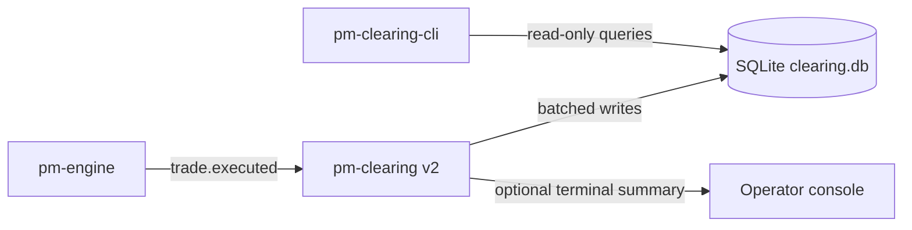
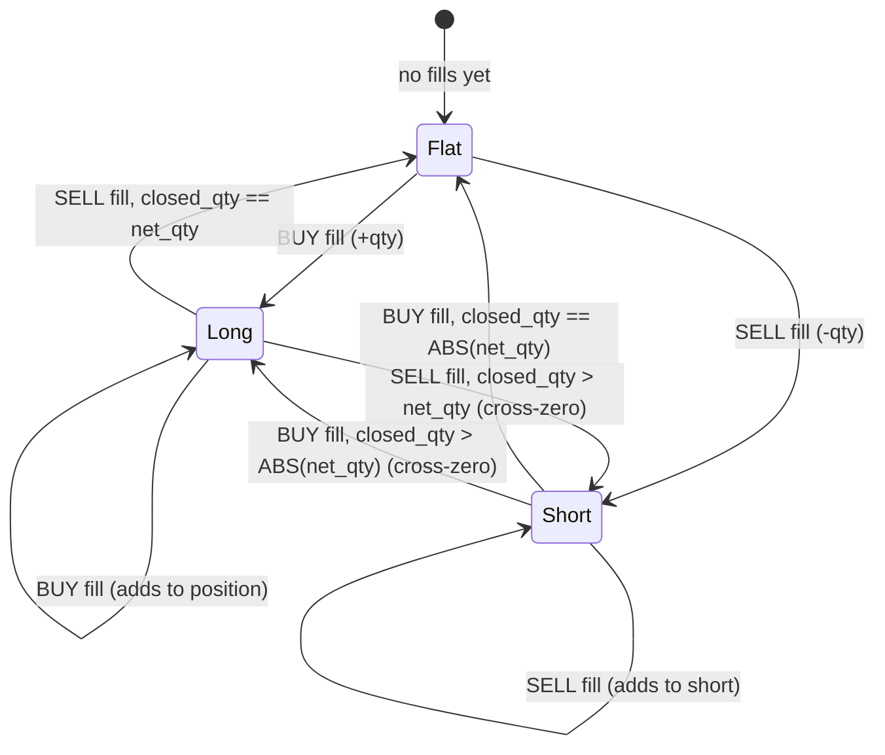
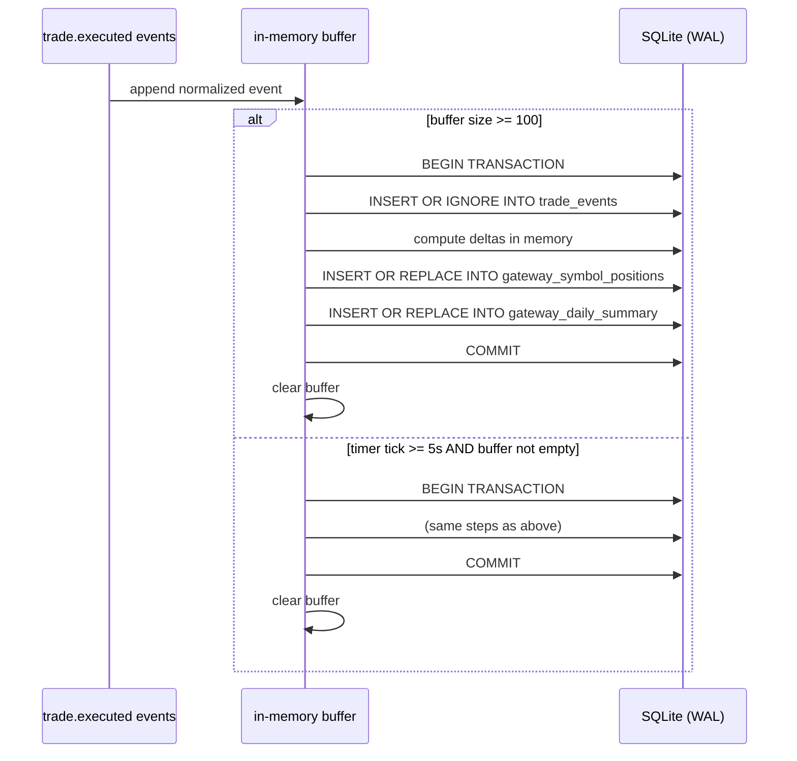

Version: 2.0.0

Date: 2026-07-05

Status: Design and Research Proposal

# EduMatcher — Clearing v2 


## 1. Motivation

The current `pm-clearing` process keeps P&L state in memory, periodically prints
that state, and appends trade rows to a CSV file (`data/clearing_report.csv`).
This is useful for demos but has operational limitations:

- state is not query-friendly after restart
- no indexed filtering by gateway, symbol, or day
- no robust ad-hoc reporting surface for operations/compliance teams
- no controlled write batching for high-throughput trade bursts

Clearing v2 redesigns the process around SQLite-first persistence while keeping
the educational simplicity of the existing process.


## 2. Problem Statement

We need a durable clearing subsystem that:

- preserves all trade-level inputs from `trade.executed`
- keeps per-gateway running position and P&L summaries continuously available
- supports high-frequency trade bursts without writing each event individually
- exposes user-friendly, no-SQL query tooling (`pm-clearing-cli`)
- follows EduMatcher CLI conventions, including `--help` and `--version`


## 3. Goals and Non-Goals

### 3.1 Goals

- Replace CSV-only persistence with SQLite as the canonical storage layer.
- Persist every `trade.executed` event field needed for downstream audit and P&L.
- Maintain up-to-date per-gateway/per-symbol aggregates in SQL tables.
- Batch writes with flush thresholds:
  - at most 100 buffered trades per transaction flush
  - flush at least every 5 seconds even if fewer than 100 trades arrived
- Add `pm-clearing-cli` with verb-based commands similar in style to
  `pm-stats-cli`.
- Allow `dates` reporting to optionally include per-date total quantity and net
  amount, including symbol-filtered views.
- Support `--help` and `--version` for both `pm-clearing` and `pm-clearing-cli`.
- Follow standard EduMatcher path behavior and allow override via `--datapath`.

### 3.2 Non-Goals

- No changes to matching-engine trade semantics.
- No attempt to replace dedicated accounting or settlement systems.
- No cross-process distributed transaction guarantees.
- No bilateral netting across gateways for the same participant; P&L is always
  tracked per individual gateway ID.
- No settlement date tracking (T+1 / T+2); all positions are marked intraday.
- No position limit enforcement or breach blocking; breaches may be reported
  but will not block trade ingestion in v2.
- No fee or commission tracking; P&L figures are gross of transaction costs.


## 4. High-Level Architecture



Components:

1. `pm-clearing` subscriber runtime:
- subscribes to event topics
- validates and normalizes payloads
- batches and flushes to SQLite
- updates aggregate tallies in the same transaction

2. SQLite database:
- append-only trade facts
- gateway+symbol running ledger
- optional day-level materializations/views

3. `pm-clearing-cli`:
- read-only command verbs
- common filters (`--gateway`, `--symbol`, `--date`, ranges)
- tabular/json/csv outputs


## 5. CLI Surface for `pm-clearing`

Proposed CLI:

```text
pm-clearing [OPTIONS]

Options:
  --datapath PATH      Data directory or explicit db path override
  --db-name NAME       SQLite filename within data dir (default: clearing.db)
  --flush-size N       Max buffered trades before flush (default: 100)
  --flush-interval SEC Max seconds between flushes (default: 5)
  --print-every N      Print summary every N trades (default: 100)
  --help               Show help and exit
  --version            Show version and exit
```

Notes:

- `--flush-size` must be `1..100` for this v2 requirement.
- `--flush-interval` minimum is `0.1` seconds, default `5`.
- `--version` should follow the same implementation pattern now used by other
  `pm-*` entrypoints.


## 6. Storage Model and SQLite Schema


Price note
----------
The engine emits ``trade.executed.price`` as an integer (raw int, no implicit
decimal scaling).  The v2 implementation stores price-derived columns
(``price``, ``mark_price``, ``traded_notional``, ``buy_notional``,
``sell_notional``, ``net_amount``) as INTEGER in SQLite, not REAL as shown
in the original schema below.  Columns derived from weighted-average math
(``avg_cost``, ``realized_pnl``, ``unrealized_pnl`` and their end-of-day
variants) remain REAL because they involve division and subtraction that
produce non-integer results.

### 6.1 Database pragmas

At process startup:

```sql
PRAGMA journal_mode = WAL;
PRAGMA synchronous = NORMAL;
PRAGMA foreign_keys = ON;
PRAGMA temp_store = MEMORY;
```

Rationale:

- WAL improves concurrent reads for `pm-clearing-cli` while writes continue.
- `NORMAL` is a good durability/performance tradeoff for this workload.

### 6.2 Tables

#### A) `trade_events`

Store all required fields from `trade.executed` plus ingestion metadata.

**`trade.executed` message field reference:**

| Field | Type | Required | Description |
|---|---|---|---|
| `id` | string | Yes | Unique trade identifier used for idempotent inserts |
| `ts_ns` | integer | Yes | Engine event timestamp in nanoseconds |
| `symbol` | string | Yes | Traded instrument symbol |
| `quantity` | integer | Yes | Matched trade size |
| `price` | number | Yes | Execution price |
| `tick_decimals` | integer | Yes | Symbol precision (`d`, where 1 tick = `10^-d`) |
| `buy_order_id` | string | No | Buy-side order id that participated in the match |
| `sell_order_id` | string | No | Sell-side order id that participated in the match |
| `buy_gateway_id` | string | Yes | Gateway id credited with the buy-side fill |
| `sell_gateway_id` | string | Yes | Gateway id credited with the sell-side fill |
| `aggressor_side` | string | No | Aggressor direction (`BUY` or `SELL`) when available |

Derived and ingestion-only fields written by `pm-clearing`:

| Field | Type | Description |
|---|---|---|
| `trade_date` | string (`YYYY-MM-DD`) | UTC trade date derived from `ts_ns` for partitioning and filtering |
| `ingest_ts_ns` | integer | Local ingestion timestamp used for observability and lag analysis |


```sql
CREATE TABLE IF NOT EXISTS trade_events (
  id TEXT PRIMARY KEY,
  ts_ns INTEGER NOT NULL,
  trade_date TEXT NOT NULL,
  symbol TEXT NOT NULL,
  quantity INTEGER NOT NULL,
  price INTEGER NOT NULL,
  tick_decimals INTEGER NOT NULL DEFAULT 2,
  buy_order_id TEXT,
  sell_order_id TEXT,
  buy_gateway_id TEXT NOT NULL,
  sell_gateway_id TEXT NOT NULL,
  aggressor_side TEXT,
  ingest_ts_ns INTEGER NOT NULL
);

CREATE INDEX IF NOT EXISTS ix_trade_events_date ON trade_events(trade_date);
CREATE INDEX IF NOT EXISTS ix_trade_events_symbol_date ON trade_events(symbol, trade_date);
CREATE INDEX IF NOT EXISTS ix_trade_events_buy_gw_date ON trade_events(buy_gateway_id, trade_date);
CREATE INDEX IF NOT EXISTS ix_trade_events_sell_gw_date ON trade_events(sell_gateway_id, trade_date);
```

#### B) `gateway_symbol_positions`


Current running state, continuously overwritten via UPSERT during each flush.

`gateway_symbol_positions` column reference:

| Column | Type | Source / calculation |
|---|---|---|
| `gateway_id` | TEXT | Gateway identifier from `trade.executed.buy_gateway_id` or `trade.executed.sell_gateway_id` for each leg update |
| `symbol` | TEXT | Symbol copied from `trade.executed.symbol` |
| `net_qty` | INTEGER | Running signed position quantity per `(gateway_id, symbol)`; increment on buy fills, decrement on sell fills |
| `avg_cost` | REAL | Running weighted average entry price of the current open position; updated on same-side adds, adjusted on cross-zero resets |
| `realized_pnl` | REAL | Cumulative realized P&L from closed quantity: long close via sell uses `(fill_price - avg_cost) * closed_qty`, short close via buy uses `(avg_cost - fill_price) * closed_qty` |
| `unrealized_pnl` | REAL | Mark-to-market open P&L computed from latest mark: `net_qty * (mark_price - avg_cost)` |
| `mark_price` | INTEGER | Latest observed trade price in ticks for `symbol` from `trade.executed.price` |
| `tick_decimals` | INTEGER | Latest precision received for this `(gateway_id, symbol)` key |
| `buy_qty` | INTEGER | Cumulative buy-side traded quantity for this `(gateway_id, symbol)` from all processed fills |
| `sell_qty` | INTEGER | Cumulative sell-side traded quantity for this `(gateway_id, symbol)` from all processed fills |
| `buy_notional` | INTEGER | Cumulative buy-side traded notional in tick-units, sum of `fill_qty * fill_price_ticks` for buy legs |
| `sell_notional` | INTEGER | Cumulative sell-side traded notional in tick-units, sum of `fill_qty * fill_price_ticks` for sell legs |
| `last_trade_ts_ns` | INTEGER | Latest event timestamp for this key, taken from `trade.executed.ts_ns` |
| `updated_ts_ns` | INTEGER | Clearing writer update timestamp set at flush/UPSERT time for observability |

```sql
CREATE TABLE IF NOT EXISTS gateway_symbol_positions (
  gateway_id TEXT NOT NULL,
  symbol TEXT NOT NULL,
  net_qty INTEGER NOT NULL,
  avg_cost REAL NOT NULL,
  realized_pnl REAL NOT NULL,
  unrealized_pnl REAL NOT NULL,
  mark_price INTEGER,
  tick_decimals INTEGER NOT NULL DEFAULT 2,
  buy_qty INTEGER NOT NULL,
  sell_qty INTEGER NOT NULL,
  buy_notional INTEGER NOT NULL,
  sell_notional INTEGER NOT NULL,
  last_trade_ts_ns INTEGER,
  updated_ts_ns INTEGER NOT NULL,
  PRIMARY KEY (gateway_id, symbol)
);

CREATE INDEX IF NOT EXISTS ix_gsp_gateway ON gateway_symbol_positions(gateway_id);
CREATE INDEX IF NOT EXISTS ix_gsp_symbol ON gateway_symbol_positions(symbol);
```

#### C) `gateway_daily_summary`


Daily aggregate rollup for quick reporting.

`gateway_daily_summary` column reference:

| Column | Type | Source / calculation |
|---|---|---|
| `trade_date` | TEXT | UTC date bucket derived from `trade.executed.ts_ns` (same derivation used for `trade_events.trade_date`) |
| `gateway_id` | TEXT | Gateway id from each trade leg (`buy_gateway_id` and `sell_gateway_id`) grouped per day |
| `symbol` | TEXT | Symbol copied from `trade.executed.symbol` and grouped per day |
| `traded_qty` | INTEGER | Daily cumulative traded quantity for the `(trade_date, gateway_id, symbol)` key; sum of absolute leg quantities processed that day |
| `traded_notional` | INTEGER | Daily cumulative traded notional in tick-units; sum of `fill_qty * fill_price_ticks` |
| `buy_qty` | INTEGER | Daily cumulative buy-side quantity for this key |
| `sell_qty` | INTEGER | Daily cumulative sell-side quantity for this key |
| `buy_notional` | INTEGER | Daily cumulative buy-side notional in tick-units |
| `sell_notional` | INTEGER | Daily cumulative sell-side notional in tick-units |
| `net_amount` | INTEGER | Daily signed notional in tick-units computed as `buy_notional - sell_notional` |
| `realized_pnl` | REAL | Daily cumulative realized P&L contribution for this key, aggregated from per-fill close-out P&L calculations |
| `end_net_qty` | INTEGER | End-of-day net position copied from the latest `gateway_symbol_positions.net_qty` observed for the key within that date |
| `end_avg_cost` | REAL | End-of-day average cost copied from the latest `gateway_symbol_positions.avg_cost` for the key within that date |
| `end_unrealized_pnl` | REAL | End-of-day unrealized P&L copied from the latest `gateway_symbol_positions.unrealized_pnl` for the key within that date |
| `tick_decimals` | INTEGER | Precision used to render tick-based values for this daily key |
| `last_trade_ts_ns` | INTEGER | Latest `trade.executed.ts_ns` processed for this daily key |
| `updated_ts_ns` | INTEGER | Clearing writer update timestamp set at each daily UPSERT/flush |

```sql
CREATE TABLE IF NOT EXISTS gateway_daily_summary (
  trade_date TEXT NOT NULL,
  gateway_id TEXT NOT NULL,
  symbol TEXT NOT NULL,
  traded_qty INTEGER NOT NULL,
  traded_notional INTEGER NOT NULL,
  buy_qty INTEGER NOT NULL,
  sell_qty INTEGER NOT NULL,
  buy_notional INTEGER NOT NULL,
  sell_notional INTEGER NOT NULL,
  net_amount INTEGER NOT NULL,
  realized_pnl REAL NOT NULL,
  end_net_qty INTEGER NOT NULL,
  end_avg_cost REAL NOT NULL,
  end_unrealized_pnl REAL NOT NULL,
  tick_decimals INTEGER NOT NULL DEFAULT 2,
  last_trade_ts_ns INTEGER,
  updated_ts_ns INTEGER NOT NULL,
  PRIMARY KEY (trade_date, gateway_id, symbol)
);

CREATE INDEX IF NOT EXISTS ix_gds_gateway_date ON gateway_daily_summary(gateway_id, trade_date);
CREATE INDEX IF NOT EXISTS ix_gds_symbol_date ON gateway_daily_summary(symbol, trade_date);
```

### 6.3 Views

#### A) `gateway_pnl_totals`

```sql
CREATE VIEW IF NOT EXISTS gateway_pnl_totals AS
SELECT
  gateway_id,
  SUM(realized_pnl) AS realized_pnl_total,
  SUM(unrealized_pnl) AS unrealized_pnl_total,
  SUM(realized_pnl + unrealized_pnl) AS total_pnl,
  SUM(net_qty) AS net_qty_total
FROM gateway_symbol_positions
GROUP BY gateway_id;
```

#### B) `daily_exchange_totals`

```sql
CREATE VIEW IF NOT EXISTS daily_exchange_totals AS
SELECT
  trade_date,
  SUM(traded_qty) AS traded_qty_total,
  SUM(traded_notional) AS traded_notional_total,
  SUM(net_amount) AS net_amount_total,
  SUM(realized_pnl) AS realized_pnl_total
FROM gateway_daily_summary
GROUP BY trade_date;
```

### 6.4 Retention, compaction, and optional rotation

For the educational deployment profile, default behavior should favor a single
SQLite database with bounded retention over calendar-based rotation.

Recommended policy:

- Keep one active DB file by default.
- Retain recent detailed rows in `trade_events` for 90 days by default.
- Keep longer-lived aggregates in `gateway_daily_summary` and
  `gateway_symbol_positions` as needed for reporting.
- Run periodic maintenance:
  - `PRAGMA wal_checkpoint(TRUNCATE);` to limit WAL growth.
  - `VACUUM;` after large deletes to reclaim disk space.

**Retention pruning SQL** (run on startup and/or via `pm-clearing-cli prune`):

```sql
-- Step 1: remove raw events older than 90 days
DELETE FROM trade_events
WHERE trade_date < date('now', '-90 days');

-- Step 2: reclaim freed space (run after the DELETE commits)
PRAGMA wal_checkpoint(TRUNCATE);
VACUUM;
```

Aggregate tables (`gateway_daily_summary`, `gateway_symbol_positions`) are
not pruned by default — they are compact and provide long-running reporting
value beyond the 90-day raw-event window.

Why this is preferred over weekly rotation:

- Weekly files add operational overhead (file discovery, cross-file querying,
  merge logic) with limited benefit at low trade volumes.
- Most educational scenarios have manageable event counts, so retention +
  compaction is simpler and easier to operate.

Optional rotation mode (only if size pressure appears):

- Trigger rotation by threshold, not by week boundary:
  - active DB file exceeds configured size limit (for example 1 to 2 GB), or
  - retained date window exceeds configured maximum.
- On rotation:
  - move closed data into an archive DB (for example monthly),
  - keep `pm-clearing-cli` defaulting to the active DB,
  - allow explicit archive queries via `--db` path override.

This keeps day-to-day usage simple while still allowing scale-up behavior when
needed.


## 7. P&L Calculation Model

### 7.0 Position state machine

Each `(gateway_id, symbol)` key moves through these states as fills arrive:



On every state transition that reduces an open position, realized P&L is
calculated for the closed quantity before updating `avg_cost`.

### 7.1 Running position logic

Per `(gateway_id, symbol)` maintain:

- `net_qty`
- `avg_cost`
- `realized_pnl`
- `mark_price`
- `unrealized_pnl = net_qty * (mark_price - avg_cost)` for long
- For short positions, same signed formula works because `net_qty < 0`

### 7.2 Fill-side updates

For each trade event:

- Buyer leg updates as `BUY` fill (`+qty`)
- Seller leg updates as `SELL` fill (`-qty`)

When reducing an opposite-side open position, realize P&L on closed quantity:

- closing long via sell: `(fill_price - avg_cost) * closed_qty`
- closing short via buy: `(avg_cost - fill_price) * closed_qty`

When crossing through zero, reset `avg_cost` to fill price for the newly opened
side quantity, same as current engine-side position accounting semantics.

**Worked example — long position, partial close, then cross-zero to short:**

| Step | Event | Calculation | Result |
|---|---|---|---|
| 1 | BUY 10 @ 100.0 | Open long. `avg_cost = 100.0` | `net_qty = +10`, `avg_cost = 100.0`, `realized_pnl = 0` |
| 2 | BUY 10 @ 110.0 | Add to long. New avg: `(10×100 + 10×110) / 20 = 105.0` | `net_qty = +20`, `avg_cost = 105.0`, `realized_pnl = 0` |
| 3 | SELL 20 @ 115.0 | Full close. Realized: `(115 - 105) × 20 = 200` | `net_qty = 0`, `realized_pnl = 200`, position is **Flat** |
| 4 | SELL 15 @ 108.0 | Cross-zero from flat. Closed qty = 0 (was flat). Open short 15 @ 108.0 | `net_qty = -15`, `avg_cost = 108.0`, `realized_pnl = 200` |
| 5 | BUY 20 @ 105.0 | Reduce short by 15, realize P&L, open long remainder. Realized: `(108 - 105) × 15 = 45`. Open long 5 @ 105.0 | `net_qty = +5`, `avg_cost = 105.0`, `realized_pnl = 245` |

### 7.3 Mark price source

Default `mark_price` source in v2: latest trade price for that symbol as seen by
`pm-clearing` from `trade.executed`.

Optional future extension: subscribe to `book.*` and use mid-price for mark.


## 8. Batching and Flush Policy

Buffer incoming trade events in memory and flush in one transaction when either:

1. buffer size reaches 100 events, or
2. 5 seconds elapsed since previous flush

Pseudo-flow:

1. receive `trade.executed`
2. append normalized event to ring/list buffer
3. if buffer size >= 100, flush immediately
4. independent timer tick checks elapsed time and flushes if `>= 5s` and buffer
   not empty

Flush transaction steps:

1. insert `trade_events` rows (idempotent via `INSERT OR IGNORE`)
2. compute gateway-side deltas in memory for this batch
3. UPSERT into `gateway_symbol_positions`
4. UPSERT into `gateway_daily_summary`
5. commit

**Flush sequence diagram:**



**`gateway_daily_summary` UPSERT SQL:**

This is the most complex write because it must atomically increment running
totals and update end-of-day snapshot columns.

```sql
INSERT INTO gateway_daily_summary (
  trade_date, gateway_id, symbol,
  traded_qty, traded_notional,
  buy_qty, sell_qty, buy_notional, sell_notional, net_amount,
  realized_pnl,
  end_net_qty, end_avg_cost, end_unrealized_pnl,
  last_trade_ts_ns, updated_ts_ns
) VALUES (
  :trade_date, :gateway_id, :symbol,
  :delta_qty, :delta_notional,
  :delta_buy_qty, :delta_sell_qty,
  :delta_buy_notional, :delta_sell_notional,
  :delta_buy_notional - :delta_sell_notional,
  :delta_realized_pnl,
  :snap_net_qty, :snap_avg_cost, :snap_unrealized_pnl,
  :last_ts_ns, :now_ts_ns
)
ON CONFLICT(trade_date, gateway_id, symbol) DO UPDATE SET
  traded_qty        = traded_qty + excluded.traded_qty,
  traded_notional   = traded_notional + excluded.traded_notional,
  buy_qty           = buy_qty + excluded.buy_qty,
  sell_qty          = sell_qty + excluded.sell_qty,
  buy_notional      = buy_notional + excluded.buy_notional,
  sell_notional     = sell_notional + excluded.sell_notional,
  net_amount        = buy_notional + excluded.buy_notional
                      - (sell_notional + excluded.sell_notional),
  realized_pnl      = realized_pnl + excluded.realized_pnl,
  end_net_qty       = excluded.end_net_qty,
  end_avg_cost      = excluded.end_avg_cost,
  end_unrealized_pnl = excluded.end_unrealized_pnl,
  last_trade_ts_ns  = MAX(last_trade_ts_ns, excluded.last_trade_ts_ns),
  updated_ts_ns     = excluded.updated_ts_ns;
```

The `:delta_*` bind values are computed in memory from the current batch before
the transaction is opened. The `:snap_*` values are taken from the latest
in-memory position state after applying all fills in the batch.

On shutdown:

- force a final flush
- close DB cleanly


## 9. Path and Data Directory Rules

Path resolution for v2 should follow EduMatcher conventions:

1. if `--datapath` is provided:
- if it ends with `.db`, use as explicit DB file path
- otherwise treat as data directory and append `--db-name` (default `clearing.db`)

2. else use standard process data directory resolution used by other commands
(`EDUMATCHER_DATA_DIR` fallback chain), then append `clearing.db`.

This keeps behavior aligned with existing EduMatcher process logic while still
supporting explicit override.


## 10. CLI Surface for `pm-clearing-cli`

Design style should match `pm-stats-cli`: command verbs + options.

```text
pm-clearing-cli [GLOBAL_OPTIONS] <verb> [verb-options]

Global options:
  --datapath PATH      Data directory or explicit db file
  --db-name NAME       SQLite filename if datapath is directory
  --format FMT         table|json|csv (default: table)
  --no-header          For csv output
  --help
  --version
```

### 10.1 Proposed verbs

- `gateways`
  - list known gateways with current totals
- `positions`
  - current positions by gateway/symbol
- `pnl`
  - realized/unrealized/total P&L by gateway and optionally symbol
- `daily`
  - daily summaries (gateway/symbol/day)
- `trades`
  - raw trade events with filters
- `exposure`
  - net notional/risk concentration views
- `symbols`
  - symbol-level clearing totals
- `dates`
  - available trading dates in DB; optional per-date quantity/notional totals
    and net amount via `--with-totals`
- `health`
  - DB metadata (last update, row counts, last flush time)
- `reconcile`
  - compare computed aggregates against raw `trade_events` totals to detect
    any discrepancy between source facts and summary tables

### 10.2 Proposed option reference

| Option | Scope | Value type | Allowed values / range | Default | Notes |
|---|---|---|---|---|---|
| `--datapath PATH` | Global | Path string | Existing directory path or explicit `.db` file path | Standard EduMatcher data-dir resolution | If path ends with `.db`, use as DB file; otherwise append `--db-name` |
| `--db-name NAME` | Global | Filename string | Valid SQLite filename, typically `*.db` | `clearing.db` | Used when `--datapath` is a directory |
| `--format FMT` | Global | Enum string | `table`, `json`, `csv` | `table` | `json`/`csv` are structured output modes |
| `--no-header` | Global | Flag (bool) | Present/absent | Off | Applies to `csv` output to suppress header row |
| `--gateway GW_ID` | Filter | String | Non-empty gateway id | Unset | Restricts output to one gateway |
| `--symbol SYMBOL` | Filter | String | Non-empty symbol, usually uppercase | Unset | Restricts output to one symbol |
| `--date YYYY-MM-DD` | Filter | Date string | ISO date regex `^\d{4}-\d{2}-\d{2}$` | Unset | Single-day filter |
| `--from YYYY-MM-DD` | Filter | Date string | ISO date regex `^\d{4}-\d{2}-\d{2}$` | Unset | Inclusive start date for range filters |
| `--to YYYY-MM-DD` | Filter | Date string | ISO date regex `^\d{4}-\d{2}-\d{2}$` | Unset | Inclusive end date for range filters |
| `--limit N` | Filter | Integer | `1..100000` | Verb-specific | Caps returned row count |
| `--sort FIELD` | Verb option | String | Verb-specific sortable field name | Verb default | Primarily used by `symbols` and `exposure` style summaries |
| `--with-totals` | Verb option | Flag (bool) | Present/absent | Off | For `dates`, return per-date totals (`traded_qty_total`, `traded_notional_total`, `net_amount_total`) instead of dates only |
| `--help` | Global | Flag | Present/absent | Off | Show command help and exit |
| `--version` | Global | Flag | Present/absent | Off | Show version and exit |

### 10.3 Structured output fields (`json` / `csv`)

When `--format json` or `--format csv` is selected, fields are explicit and stable by verb.

- **`gateways`:**
  `gateway_id`, `realized_pnl_total`, `unrealized_pnl_total`, `total_pnl`, `net_qty_total`
- **`positions`:**
  `gateway_id`, `symbol`, `net_qty`, `avg_cost`, `mark_price`, `realized_pnl`, `unrealized_pnl`, `buy_qty`, `sell_qty`, `buy_notional`, `sell_notional`, `last_trade_ts_ns`, `updated_ts_ns`
- **`pnl`:**
  `gateway_id`, `symbol`, `realized_pnl`, `unrealized_pnl`, `total_pnl`, `net_qty`, `mark_price`
- **`daily`:**
  `trade_date`, `gateway_id`, `symbol`, `traded_qty`, `traded_notional`, `buy_qty`, `sell_qty`, `buy_notional`, `sell_notional`, `net_amount`, `realized_pnl`, `end_net_qty`, `end_avg_cost`, `end_unrealized_pnl`, `last_trade_ts_ns`, `updated_ts_ns`
- **`trades`:**
  `id`, `ts_ns`, `trade_date`, `symbol`, `quantity`, `price`, `buy_order_id`, `sell_order_id`, `buy_gateway_id`, `sell_gateway_id`, `aggressor_side`, `ingest_ts_ns`
- **`exposure`:**
  `gateway_id`, `symbol`, `net_qty`, `mark_price`, `net_notional`, `gross_notional`, `realized_pnl`, `unrealized_pnl`, `total_pnl`
- **`symbols`:**
  `symbol`, `traded_qty`, `traded_notional`, `realized_pnl`, `open_net_qty`, `open_unrealized_pnl`
- **`dates`:**
  default fields: `trade_date`

  with `--with-totals`: `trade_date`, `traded_qty_total`, `traded_notional_total`, `net_amount_total`
- **`health`:**
  `db_path`, `trade_events_rows`, `gateway_symbol_positions_rows`, `gateway_daily_summary_rows`,
   `last_trade_ts_ns`, `last_flush_ts_ns`, `wal_mode`


### 10.4 Example UX

```bash
pm-clearing-cli pnl --gateway TRADER01
pm-clearing-cli positions --gateway MM01 --symbol AAPL
pm-clearing-cli daily --from 2026-07-01 --to 2026-07-05
pm-clearing-cli trades --symbol MSFT --date 2026-07-05 --limit 100
pm-clearing-cli dates --from 2026-07-01 --to 2026-07-05 --symbol AAPL --with-totals
pm-clearing-cli exposure --date 2026-07-05 --format json
```

### 10.5 SQL implementation blueprint by verb

This section defines the principal SQLite statement per verb.

Implementation rules for all verbs:

- Use named bind parameters (for example `:gateway`, `:symbol`, `:limit`).
- Never build SQL by string-concatenating user input.
- For optional filters, use `(:param IS NULL OR column = :param)` style clauses.
- For sort fields, map CLI values to a strict whitelist in code before SQL.


---

#### A) COMMAND VERB: `gateways`


| Item | Value |
|---|---|
| Primary source | `gateway_pnl_totals` view |
| Primary goal | Return one row per gateway with total P&L and net quantity |
| Default ordering | `gateway_id ASC` |

Principal SQL:

```sql
SELECT
  gateway_id,
  realized_pnl_total,
  unrealized_pnl_total,
  total_pnl,
  net_qty_total
FROM gateway_pnl_totals
WHERE (:gateway IS NULL OR gateway_id = :gateway)
ORDER BY gateway_id ASC
LIMIT :limit;
```

Optional filters:

| CLI option | SQL parameter | Applied as |
|---|---|---|
| `--gateway` | `:gateway` | exact match on `gateway_id` |
| `--limit` | `:limit` | `LIMIT :limit` |

---

#### B) COMMAND VERB:  `positions`


| Item | Value |
|---|---|
| Primary source | `gateway_symbol_positions` table |
| Primary goal | Return current position state by gateway and symbol |
| Default ordering | `gateway_id ASC, symbol ASC` |

Principal SQL:

```sql
SELECT
  gateway_id,
  symbol,
  net_qty,
  avg_cost,
  mark_price,
  realized_pnl,
  unrealized_pnl,
  buy_qty,
  sell_qty,
  buy_notional,
  sell_notional,
  last_trade_ts_ns,
  updated_ts_ns
FROM gateway_symbol_positions
WHERE (:gateway IS NULL OR gateway_id = :gateway)
  AND (:symbol IS NULL OR symbol = :symbol)
ORDER BY gateway_id ASC, symbol ASC
LIMIT :limit;
```

Optional filters:

| CLI option | SQL parameter | Applied as |
|---|---|---|
| `--gateway` | `:gateway` | exact match on `gateway_id` |
| `--symbol` | `:symbol` | exact match on `symbol` |
| `--limit` | `:limit` | `LIMIT :limit` |

---

#### C) COMMAND VERB:  `pnl`

| Item | Value |
|---|---|
| Primary source | `gateway_symbol_positions` table |
| Primary goal | Return realized/unrealized/total P&L rows by gateway and symbol |
| Default ordering | `gateway_id ASC, symbol ASC` |

Principal SQL:

```sql
SELECT
  gateway_id,
  symbol,
  realized_pnl,
  unrealized_pnl,
  (realized_pnl + unrealized_pnl) AS total_pnl,
  net_qty,
  mark_price
FROM gateway_symbol_positions
WHERE (:gateway IS NULL OR gateway_id = :gateway)
  AND (:symbol IS NULL OR symbol = :symbol)
ORDER BY gateway_id ASC, symbol ASC
LIMIT :limit;
```

Optional filters:

| CLI option | SQL parameter | Applied as |
|---|---|---|
| `--gateway` | `:gateway` | exact match on `gateway_id` |
| `--symbol` | `:symbol` | exact match on `symbol` |
| `--limit` | `:limit` | `LIMIT :limit` |

---

#### D) COMMAND VERB: `daily`

| Item | Value |
|---|---|
| Primary source | `gateway_daily_summary` table |
| Primary goal | Return daily rollups by date, gateway, and symbol |
| Default ordering | `trade_date DESC, gateway_id ASC, symbol ASC` |

Principal SQL:

```sql
SELECT
  trade_date,
  gateway_id,
  symbol,
  traded_qty,
  traded_notional,
  buy_qty,
  sell_qty,
  buy_notional,
  sell_notional,
  net_amount,
  realized_pnl,
  end_net_qty,
  end_avg_cost,
  end_unrealized_pnl,
  last_trade_ts_ns,
  updated_ts_ns
FROM gateway_daily_summary
WHERE (:gateway IS NULL OR gateway_id = :gateway)
  AND (:symbol IS NULL OR symbol = :symbol)
  AND (:date IS NULL OR trade_date = :date)
  AND (:from_date IS NULL OR trade_date >= :from_date)
  AND (:to_date IS NULL OR trade_date <= :to_date)
ORDER BY trade_date DESC, gateway_id ASC, symbol ASC
LIMIT :limit;
```

Optional filters:

| CLI option | SQL parameter | Applied as |
|---|---|---|
| `--gateway` | `:gateway` | exact match on `gateway_id` |
| `--symbol` | `:symbol` | exact match on `symbol` |
| `--date` | `:date` | exact match on `trade_date` |
| `--from` | `:from_date` | `trade_date >= :from_date` |
| `--to` | `:to_date` | `trade_date <= :to_date` |
| `--limit` | `:limit` | `LIMIT :limit` |

---

#### E) COMMAND VERB: `trades`

| Item | Value |
|---|---|
| Primary source | `trade_events` table |
| Primary goal | Return raw trade-level facts for audit and trace workflows |
| Default ordering | `ts_ns DESC, id ASC` |

Principal SQL:

```sql
SELECT
  id,
  ts_ns,
  trade_date,
  symbol,
  quantity,
  price,
  buy_order_id,
  sell_order_id,
  buy_gateway_id,
  sell_gateway_id,
  aggressor_side,
  ingest_ts_ns
FROM trade_events
WHERE (:symbol IS NULL OR symbol = :symbol)
  AND (:gateway IS NULL OR buy_gateway_id = :gateway OR sell_gateway_id = :gateway)
  AND (:date IS NULL OR trade_date = :date)
  AND (:from_date IS NULL OR trade_date >= :from_date)
  AND (:to_date IS NULL OR trade_date <= :to_date)
ORDER BY ts_ns DESC, id ASC
LIMIT :limit;
```

Optional filters:

| CLI option | SQL parameter | Applied as |
|---|---|---|
| `--symbol` | `:symbol` | exact match on `symbol` |
| `--gateway` | `:gateway` | match either buy or sell gateway |
| `--date` | `:date` | exact match on `trade_date` |
| `--from` | `:from_date` | `trade_date >= :from_date` |
| `--to` | `:to_date` | `trade_date <= :to_date` |
| `--limit` | `:limit` | `LIMIT :limit` |

---

#### F) COMMAND VERB: `exposure`

| Item | Value |
|---|---|
| Primary source | `gateway_symbol_positions` table |
| Primary goal | Return net/gross notional style exposure rows |
| Default ordering | `ABS(net_qty * mark_price) DESC, gateway_id ASC, symbol ASC` |

Principal SQL:

```sql
SELECT
  gateway_id,
  symbol,
  net_qty,
  mark_price,
  (net_qty * mark_price) AS net_notional,
  ABS(net_qty * mark_price) AS gross_notional,
  realized_pnl,
  unrealized_pnl,
  (realized_pnl + unrealized_pnl) AS total_pnl
FROM gateway_symbol_positions
WHERE (:gateway IS NULL OR gateway_id = :gateway)
  AND (:symbol IS NULL OR symbol = :symbol)
ORDER BY ABS(net_qty * mark_price) DESC, gateway_id ASC, symbol ASC
LIMIT :limit;
```

Optional filters:

| CLI option | SQL parameter | Applied as |
|---|---|---|
| `--gateway` | `:gateway` | exact match on `gateway_id` |
| `--symbol` | `:symbol` | exact match on `symbol` |
| `--limit` | `:limit` | `LIMIT :limit` |

Allowed `--sort` values for `exposure`:

| CLI sort value | ORDER BY clause |
|---|---|
| `gross_notional` | `ABS(net_qty * mark_price) DESC` (default) |
| `net_notional` | `(net_qty * mark_price) DESC` |
| `realized_pnl` | `realized_pnl DESC` |
| `unrealized_pnl` | `unrealized_pnl DESC` |
| `total_pnl` | `(realized_pnl + unrealized_pnl) DESC` |

---

#### G) COMMAND VERB: `symbols`

| Item | Value |
|---|---|
| Primary source | `gateway_daily_summary` + `gateway_symbol_positions` |
| Primary goal | Return symbol-level traded and open-position totals |
| Default ordering | `symbol ASC` |

Principal SQL:

```sql
WITH daily_totals AS (
  SELECT
    symbol,
    SUM(traded_qty) AS traded_qty,
    SUM(traded_notional) AS traded_notional,
    SUM(realized_pnl) AS realized_pnl
  FROM gateway_daily_summary
  WHERE (:date IS NULL OR trade_date = :date)
    AND (:from_date IS NULL OR trade_date >= :from_date)
    AND (:to_date IS NULL OR trade_date <= :to_date)
  GROUP BY symbol
),
open_totals AS (
  SELECT
    symbol,
    SUM(net_qty) AS open_net_qty,
    SUM(unrealized_pnl) AS open_unrealized_pnl
  FROM gateway_symbol_positions
  GROUP BY symbol
)
SELECT
  d.symbol,
  d.traded_qty,
  d.traded_notional,
  d.realized_pnl,
  COALESCE(o.open_net_qty, 0) AS open_net_qty,
  COALESCE(o.open_unrealized_pnl, 0.0) AS open_unrealized_pnl
FROM daily_totals d
LEFT JOIN open_totals o ON o.symbol = d.symbol
ORDER BY d.symbol ASC
LIMIT :limit;
```

Optional filters:

| CLI option | SQL parameter | Applied as |
|---|---|---|
| `--date` | `:date` | exact match on `trade_date` in daily rollup |
| `--from` | `:from_date` | `trade_date >= :from_date` |
| `--to` | `:to_date` | `trade_date <= :to_date` |
| `--limit` | `:limit` | `LIMIT :limit` |

Allowed `--sort` values for `symbols`:

| CLI sort value | ORDER BY clause |
|---|---|
| `symbol` | `d.symbol ASC` (default) |
| `traded_qty` | `d.traded_qty DESC` |
| `traded_notional` | `d.traded_notional DESC` |
| `realized_pnl` | `d.realized_pnl DESC` |
| `open_net_qty` | `o.open_net_qty DESC` |

---

#### H) COMMAND VERB: `dates`

| Item | Value |
|---|---|
| Primary source | `trade_events` (default) or `daily_exchange_totals` (`--with-totals`) |
| Primary goal | Return available dates or per-date totals |
| Default ordering | `trade_date DESC` |

Principal SQL (default mode):

```sql
SELECT DISTINCT
  trade_date
FROM trade_events
WHERE (:symbol IS NULL OR symbol = :symbol)
  AND (:gateway IS NULL OR buy_gateway_id = :gateway OR sell_gateway_id = :gateway)
  AND (:from_date IS NULL OR trade_date >= :from_date)
  AND (:to_date IS NULL OR trade_date <= :to_date)
ORDER BY trade_date DESC
LIMIT :limit;
```

Principal SQL (`--with-totals` mode):

```sql
SELECT
  trade_date,
  traded_qty_total,
  traded_notional_total,
  net_amount_total
FROM daily_exchange_totals
WHERE (:from_date IS NULL OR trade_date >= :from_date)
  AND (:to_date IS NULL OR trade_date <= :to_date)
ORDER BY trade_date DESC
LIMIT :limit;
```

Optional filters:

| CLI option | SQL parameter | Applied as |
|---|---|---|
| `--symbol` | `:symbol` | default mode date extraction from filtered trades |
| `--gateway` | `:gateway` | default mode date extraction for one gateway |
| `--from` | `:from_date` | lower date bound |
| `--to` | `:to_date` | upper date bound |
| `--limit` | `:limit` | `LIMIT :limit` |
| `--with-totals` | n/a | choose totals SQL variant |

---

#### I) COMMAND VERB: `health`

| Item | Value |
|---|---|
| Primary source | `trade_events`, `gateway_symbol_positions`, `gateway_daily_summary` |
| Primary goal | Return DB counters and freshness metadata |
| Default ordering | single-row result |

Principal SQL:

```sql
WITH
trade_rows AS (
  SELECT COUNT(*) AS c, MAX(ts_ns) AS max_ts
  FROM trade_events
),
gsp_rows AS (
  SELECT COUNT(*) AS c
  FROM gateway_symbol_positions
),
gds_rows AS (
  SELECT COUNT(*) AS c, MAX(updated_ts_ns) AS max_flush
  FROM gateway_daily_summary
)
SELECT
  :db_path AS db_path,
  trade_rows.c AS trade_events_rows,
  gsp_rows.c AS gateway_symbol_positions_rows,
  gds_rows.c AS gateway_daily_summary_rows,
  trade_rows.max_ts AS last_trade_ts_ns,
  gds_rows.max_flush AS last_flush_ts_ns,
  :wal_mode AS wal_mode
FROM trade_rows, gsp_rows, gds_rows;
```

Optional filters:

| CLI option | SQL parameter | Applied as |
|---|---|---|
| none | n/a | health is aggregate metadata, not filterable |

Implementation note for `health`:

- `:wal_mode` should be populated from a separate `PRAGMA journal_mode;` query.
- `:db_path` should be set from the resolved runtime path.

---

#### J) COMMAND VERB: `reconcile`

| Item | Value |
|---|---|
| Primary source | `trade_events` (ground truth) vs `gateway_daily_summary` (aggregates) |
| Primary goal | Detect any discrepancy between raw fact totals and summary table totals |
| Default ordering | `trade_date ASC, gateway_id ASC, symbol ASC` |

Principal SQL:

```sql
WITH raw_totals AS (
  SELECT
    trade_date,
    buy_gateway_id AS gateway_id,
    symbol,
    SUM(quantity) AS raw_buy_qty,
    SUM(quantity * price) AS raw_buy_notional
  FROM trade_events
  WHERE (:from_date IS NULL OR trade_date >= :from_date)
    AND (:to_date IS NULL OR trade_date <= :to_date)
    AND (:gateway IS NULL OR buy_gateway_id = :gateway)
    AND (:symbol IS NULL OR symbol = :symbol)
  GROUP BY trade_date, buy_gateway_id, symbol
),
summary_totals AS (
  SELECT
    trade_date,
    gateway_id,
    symbol,
    buy_qty AS summary_buy_qty,
    buy_notional AS summary_buy_notional
  FROM gateway_daily_summary
  WHERE (:from_date IS NULL OR trade_date >= :from_date)
    AND (:to_date IS NULL OR trade_date <= :to_date)
    AND (:gateway IS NULL OR gateway_id = :gateway)
    AND (:symbol IS NULL OR symbol = :symbol)
)
SELECT
  r.trade_date,
  r.gateway_id,
  r.symbol,
  r.raw_buy_qty,
  s.summary_buy_qty,
  (r.raw_buy_qty - COALESCE(s.summary_buy_qty, 0)) AS qty_diff,
  ROUND(r.raw_buy_notional - COALESCE(s.summary_buy_notional, 0), 8) AS notional_diff
FROM raw_totals r
LEFT JOIN summary_totals s
  ON s.trade_date = r.trade_date
  AND s.gateway_id = r.gateway_id
  AND s.symbol = r.symbol
WHERE ABS(r.raw_buy_qty - COALESCE(s.summary_buy_qty, 0)) > 0
   OR ABS(r.raw_buy_notional - COALESCE(s.summary_buy_notional, 0)) > 0.0001
ORDER BY r.trade_date ASC, r.gateway_id ASC, r.symbol ASC;
```

If the query returns zero rows the dataset is consistent. Any returned row
identifies a `(trade_date, gateway_id, symbol)` key where the aggregates
diverge from the source facts.

Optional filters:

| CLI option | SQL parameter | Applied as |
|---|---|---|
| `--gateway` | `:gateway` | restrict reconciliation to one gateway |
| `--symbol` | `:symbol` | restrict reconciliation to one symbol |
| `--from` | `:from_date` | `trade_date >= :from_date` |
| `--to` | `:to_date` | `trade_date <= :to_date` |


## 11. Query Workflows and Examples

Questions a clearing team commonly asks and matching verbs:

1. What is each gateway's live P&L right now?
- `pm-clearing-cli pnl`

2. Which gateways have the largest open exposure in a symbol?
- `pm-clearing-cli exposure --symbol AAPL`

3. What did one gateway do today, trade by trade?
- `pm-clearing-cli trades --gateway TRADER07 --date 2026-07-05`

4. What is exchange-wide daily cleared notional and volume?
- `pm-clearing-cli daily --date 2026-07-05`

5. Which symbols generated most realized P&L swings?
- `pm-clearing-cli symbols --date 2026-07-05 --sort realized_pnl`

6. Did the clearing DB stop updating?
- `pm-clearing-cli health`


## 12. Additional Message Subscriptions

`trade.executed` is the only required feed for strict trade-based P&L.

Recommended secondary subscriptions:

- `system.eod`
  - finalize day boundary state, ensure final flush/rollup markers
- `system.gateway_connect` / `system.gateway_disconnect`
  - add operational context for reporting and audit trails
- `session.state`
  - annotate transitions (OPENING_AUCTION, CONTINUOUS, CLOSED) for day reports
- `book.*` (optional future)
  - better unrealized P&L marks using best bid/ask midpoint instead of last trade

These should not block core P&L processing; they are additive metadata to be considered in
the next major version of pm-clearing.


## 13. Migration Plan

1. Introduce v2 DB writer as a clean break in v0.14.0 completely replacing the
   existing `pm-clearing`, which is renamed to `pm-clearing-v1` during transition.
2. The new clearing process takes the name `pm-clearing`.
3. Introduce `pm-clearing-cli` in v0.14.0.


## 14. Implementation Plan

1. Add `edumatcher/clearing/store.py` (schema, migrations, transactions).
2. Add `edumatcher/clearing/ledger.py` (position + realized/unrealized logic).
3. Refactor `pm-clearing` runtime to buffered ingestion + timed flush.
4. Add `edumatcher/clearing/cli.py` with all verb handlers; wire as `pm-clearing-cli`
   entrypoint in `pyproject.toml`.
5. Add docs/user-guide section and training references.


## 15. Testing Plan

1. Unit tests:
- ledger math: flat→long, long close, flat→short, short close, long cross-zero
  to short, short cross-zero to long, duplicate trade ID (idempotency)
- SQL UPSERT correctness for `gateway_symbol_positions` and `gateway_daily_summary`
- flush trigger logic (size=100, interval=5s)
- retention DELETE removes rows older than 90 days and leaves newer rows intact
- `reconcile` verb detects injected discrepancy between raw and aggregates
- `ledger.py` must reach 100% branch coverage; overall target >= 87%

2. Integration tests:
- replay synthetic `trade.executed` streams and compare against expected totals
- restart process and confirm persistent continuity (positions and daily summaries
  survive without recalculation from raw events)
- CLI verb output correctness for all filters and date ranges
- WAL concurrency: hold an open writer transaction, run a CLI read in a subprocess,
  assert the read returns without blocking

3. Performance tests:
- burst of high-frequency trade events validates batching and commit cadence
- read concurrency with `pm-clearing-cli` while writer runs (WAL mode)


## 16. Acceptance Checklist

- `pm-clearing --help` works
- `pm-clearing --version` works
- all `trade.executed` fields required for audit are persisted
- P&L summaries survive restart and remain queryable
- write batching flushes on `100 trades OR 5s`
- path override via `--datapath` works and matches EduMatcher conventions
- `pm-clearing-cli` provides verb-based no-SQL workflows
- `reconcile` verb reports no discrepancy on a clean dataset
- retention pruning removes `trade_events` rows older than 90 days on demand
- operator can answer daily clearing questions using CLI only
