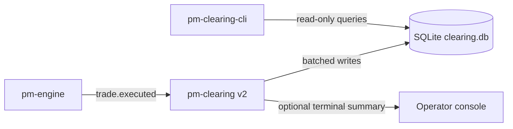

Version: 2.0.0

Date: 2026-07-05

Status: Design and Research Proposal

# EduMatcher — Cleaaring v2 (`pm-clearing` + `pm-clearing-cli`)

---

## Table of Contents

1. [Motivation](#1-motivation)
2. [Problem Statement](#2-problem-statement)
3. [Goals and Non-Goals](#3-goals-and-non-goals)
4. [High-Level Architecture](#4-high-level-architecture)
5. [CLI Surface for `pm-clearing`](#5-cli-surface-for-pm-clearing)
6. [Storage Model and SQLite Schema](#6-storage-model-and-sqlite-schema)
7. [P&L Calculation Model](#7-pl-calculation-model)
8. [Batching and Flush Policy](#8-batching-and-flush-policy)
9. [Path and Data Directory Rules](#9-path-and-data-directory-rules)
10. [CLI Surface for `pm-clearing-cli`](#10-cli-surface-for-pm-clearing-cli)
11. [Query Workflows and Examples](#11-query-workflows-and-examples)
12. [Additional Message Subscriptions](#12-additional-message-subscriptions)
13. [Migration Plan](#13-migration-plan)
14. [Implementation Plan](#14-implementation-plan)
15. [Testing Plan](#15-testing-plan)
16. [Acceptance Checklist](#16-acceptance-checklist)

---

## 1. Motivation

The current `pm-clearing` process keeps P&L state in memory, periodically prints
that state, and appends trade rows to a CSV file (`data/clearing_report.csv`).
This is useful for demos but has operational limitations:

- state is not query-friendly after restart
- no indexed filtering by gateway, symbol, or day
- no robust ad-hoc reporting surface for operations/compliance teams
- no controlled write batching for high-throughput trade bursts

Cleaaring v2 redesigns the process around SQLite-first persistence while keeping
the educational simplicity of the existing process.

---

## 2. Problem Statement

We need a durable clearing subsystem that:

- preserves all trade-level inputs from `trade.executed`
- keeps per-gateway running position and P&L summaries continuously available
- supports high-frequency trade bursts without writing each event individually
- exposes user-friendly, no-SQL query tooling (`pm-clearing-cli`)
- follows EduMatcher CLI conventions, including `--help` and `--version`

---

## 3. Goals and Non-Goals

### 3.1 Goals

- Replace CSV-only persistence with SQLite as the canonical storage layer.
- Persist every `trade.executed` event field needed for downstream audit and P&L.
- Maintain up-to-date per-gateway/per-symbol aggregates in SQL tables.
- Batch writes with flush thresholds:
  - at most 100 buffered trades per transaction flush
  - flush at least every 5 seconds even if fewer than 100 trades arrived
- Add `pm-clearing-cli` with verb-based commands similar in style to
  `pm-stats-cli`.
- Support `--help` and `--version` for both `pm-clearing` and `pm-clearing-cli`.
- Follow standard EduMatcher path behavior and allow override via `--datapath`.

### 3.2 Non-Goals

- No changes to matching-engine trade semantics.
- No attempt to replace dedicated accounting or settlement systems.
- No cross-process distributed transaction guarantees.

---

## 4. High-Level Architecture



Components:

1. `pm-clearing` subscriber runtime:
- subscribes to event topics
- validates and normalizes payloads
- batches and flushes to SQLite
- updates aggregate tallies in the same transaction

2. SQLite database:
- append-only trade facts
- gateway+symbol running ledger
- optional day-level materializations/views

3. `pm-clearing-cli`:
- read-only command verbs
- common filters (`--gateway`, `--symbol`, `--date`, ranges)
- tabular/json/csv outputs

---

## 5. CLI Surface for `pm-clearing`

Proposed CLI:

```text
pm-clearing [OPTIONS]

Options:
  --datapath PATH      Data directory or explicit db path override
  --db-name NAME       SQLite filename within data dir (default: clearing.db)
  --flush-size N       Max buffered trades before flush (default: 100)
  --flush-interval SEC Max seconds between flushes (default: 5)
  --print-every N      Print summary every N trades (default: 100)
  --help               Show help and exit
  --version            Show version and exit
```

Notes:

- `--flush-size` must be `1..100` for this v2 requirement.
- `--flush-interval` minimum is `0.1` seconds, default `5`.
- `--version` should follow the same implementation pattern now used by other
  `pm-*` entrypoints.

---

## 6. Storage Model and SQLite Schema

### 6.1 Database pragmas

At process startup:

```sql
PRAGMA journal_mode = WAL;
PRAGMA synchronous = NORMAL;
PRAGMA foreign_keys = ON;
PRAGMA temp_store = MEMORY;
```

Rationale:

- WAL improves concurrent reads for `pm-clearing-cli` while writes continue.
- `NORMAL` is a good durability/performance tradeoff for this workload.

### 6.2 Tables

#### A) `trade_events`

Store all required fields from `trade.executed` plus ingestion metadata.

```sql
CREATE TABLE IF NOT EXISTS trade_events (
  id TEXT PRIMARY KEY,
  ts_ns INTEGER NOT NULL,
  trade_date TEXT NOT NULL,
  symbol TEXT NOT NULL,
  quantity INTEGER NOT NULL,
  price REAL NOT NULL,
  buy_order_id TEXT,
  sell_order_id TEXT,
  buy_gateway_id TEXT NOT NULL,
  sell_gateway_id TEXT NOT NULL,
  aggressor_side TEXT,
  ingest_ts_ns INTEGER NOT NULL
);

CREATE INDEX IF NOT EXISTS ix_trade_events_date ON trade_events(trade_date);
CREATE INDEX IF NOT EXISTS ix_trade_events_symbol_date ON trade_events(symbol, trade_date);
CREATE INDEX IF NOT EXISTS ix_trade_events_buy_gw_date ON trade_events(buy_gateway_id, trade_date);
CREATE INDEX IF NOT EXISTS ix_trade_events_sell_gw_date ON trade_events(sell_gateway_id, trade_date);
```

#### B) `gateway_symbol_positions`

Current running state, continuously overwritten via UPSERT during each flush.

```sql
CREATE TABLE IF NOT EXISTS gateway_symbol_positions (
  gateway_id TEXT NOT NULL,
  symbol TEXT NOT NULL,
  net_qty INTEGER NOT NULL,
  avg_cost REAL NOT NULL,
  realized_pnl REAL NOT NULL,
  unrealized_pnl REAL NOT NULL,
  mark_price REAL,
  buy_qty INTEGER NOT NULL,
  sell_qty INTEGER NOT NULL,
  buy_notional REAL NOT NULL,
  sell_notional REAL NOT NULL,
  last_trade_ts_ns INTEGER,
  updated_ts_ns INTEGER NOT NULL,
  PRIMARY KEY (gateway_id, symbol)
);

CREATE INDEX IF NOT EXISTS ix_gsp_gateway ON gateway_symbol_positions(gateway_id);
CREATE INDEX IF NOT EXISTS ix_gsp_symbol ON gateway_symbol_positions(symbol);
```

#### C) `gateway_daily_summary`

Daily aggregate rollup for quick reporting.

```sql
CREATE TABLE IF NOT EXISTS gateway_daily_summary (
  trade_date TEXT NOT NULL,
  gateway_id TEXT NOT NULL,
  symbol TEXT NOT NULL,
  traded_qty INTEGER NOT NULL,
  traded_notional REAL NOT NULL,
  realized_pnl REAL NOT NULL,
  end_net_qty INTEGER NOT NULL,
  end_avg_cost REAL NOT NULL,
  end_unrealized_pnl REAL NOT NULL,
  last_trade_ts_ns INTEGER,
  updated_ts_ns INTEGER NOT NULL,
  PRIMARY KEY (trade_date, gateway_id, symbol)
);

CREATE INDEX IF NOT EXISTS ix_gds_gateway_date ON gateway_daily_summary(gateway_id, trade_date);
CREATE INDEX IF NOT EXISTS ix_gds_symbol_date ON gateway_daily_summary(symbol, trade_date);
```

### 6.3 Views

#### A) `gateway_pnl_totals`

```sql
CREATE VIEW IF NOT EXISTS gateway_pnl_totals AS
SELECT
  gateway_id,
  SUM(realized_pnl) AS realized_pnl_total,
  SUM(unrealized_pnl) AS unrealized_pnl_total,
  SUM(realized_pnl + unrealized_pnl) AS total_pnl,
  SUM(net_qty) AS net_qty_total
FROM gateway_symbol_positions
GROUP BY gateway_id;
```

#### B) `daily_exchange_totals`

```sql
CREATE VIEW IF NOT EXISTS daily_exchange_totals AS
SELECT
  trade_date,
  SUM(traded_qty) AS traded_qty_total,
  SUM(traded_notional) AS traded_notional_total,
  SUM(realized_pnl) AS realized_pnl_total
FROM gateway_daily_summary
GROUP BY trade_date;
```

---

## 7. P&L Calculation Model

### 7.1 Running position logic

Per `(gateway_id, symbol)` maintain:

- `net_qty`
- `avg_cost`
- `realized_pnl`
- `mark_price`
- `unrealized_pnl = net_qty * (mark_price - avg_cost)` for long
- For short positions, same signed formula works because `net_qty < 0`

### 7.2 Fill-side updates

For each trade event:

- Buyer leg updates as `BUY` fill (`+qty`)
- Seller leg updates as `SELL` fill (`-qty`)

When reducing an opposite-side open position, realize P&L on closed quantity:

- closing long via sell: `(fill_price - avg_cost) * closed_qty`
- closing short via buy: `(avg_cost - fill_price) * closed_qty`

When crossing through zero, reset `avg_cost` to fill price for the newly opened
side quantity, same as current engine-side position accounting semantics.

### 7.3 Mark price source

Default `mark_price` source in v2: latest trade price for that symbol as seen by
`pm-clearing` from `trade.executed`.

Optional future extension: subscribe to `book.*` and use mid-price for mark.

---

## 8. Batching and Flush Policy

Buffer incoming trade events in memory and flush in one transaction when either:

1. buffer size reaches 100 events, or
2. 5 seconds elapsed since previous flush

Pseudo-flow:

1. receive `trade.executed`
2. append normalized event to ring/list buffer
3. if buffer size >= 100, flush immediately
4. independent timer tick checks elapsed time and flushes if `>= 5s` and buffer
   not empty

Flush transaction steps:

1. insert `trade_events` rows (idempotent via `INSERT OR IGNORE`)
2. compute gateway-side deltas in memory for this batch
3. UPSERT into `gateway_symbol_positions`
4. UPSERT into `gateway_daily_summary`
5. commit

On shutdown:

- force a final flush
- close DB cleanly

---

## 9. Path and Data Directory Rules

Path resolution for v2 should follow EduMatcher conventions:

1. if `--datapath` is provided:
- if it ends with `.db`, use as explicit DB file path
- otherwise treat as data directory and append `--db-name` (default `clearing.db`)

2. else use standard process data directory resolution used by other commands
(`EDUMATCHER_DATA_DIR` fallback chain), then append `clearing.db`.

This keeps behavior aligned with existing EduMatcher process logic while still
supporting explicit override.

---

## 10. CLI Surface for `pm-clearing-cli`

Design style should match `pm-stats-cli`: command verbs + options.

```text
pm-clearing-cli [GLOBAL_OPTIONS] <verb> [verb-options]

Global options:
  --datapath PATH      Data directory or explicit db file
  --db-name NAME       SQLite filename if datapath is directory
  --format FMT         table|json|csv (default: table)
  --no-header          For csv output
  --help
  --version
```

### 10.1 Proposed verbs

- `gateways`
  - list known gateways with current totals
- `positions`
  - current positions by gateway/symbol
- `pnl`
  - realized/unrealized/total P&L by gateway and optionally symbol
- `daily`
  - daily summaries (gateway/symbol/day)
- `trades`
  - raw trade events with filters
- `exposure`
  - net notional/risk concentration views
- `symbols`
  - symbol-level clearing totals
- `dates`
  - available trading dates in DB
- `health`
  - DB metadata (last update, row counts, last flush time)

### 10.2 Common filters

- `--gateway GW_ID`
- `--symbol SYMBOL`
- `--date YYYY-MM-DD`
- `--from YYYY-MM-DD`
- `--to YYYY-MM-DD`
- `--limit N`

### 10.3 Example UX

```bash
pm-clearing-cli pnl --gateway TRADER01
pm-clearing-cli positions --gateway MM01 --symbol AAPL
pm-clearing-cli daily --from 2026-07-01 --to 2026-07-05
pm-clearing-cli trades --symbol MSFT --date 2026-07-05 --limit 100
pm-clearing-cli exposure --date 2026-07-05 --format json
```

---

## 11. Query Workflows and Examples

Questions a clearing team commonly asks and matching verbs:

1. What is each gateway's live P&L right now?
- `pm-clearing-cli pnl`

2. Which gateways have the largest open exposure in a symbol?
- `pm-clearing-cli exposure --symbol AAPL`

3. What did one gateway do today, trade by trade?
- `pm-clearing-cli trades --gateway TRADER07 --date 2026-07-05`

4. What is exchange-wide daily cleared notional and volume?
- `pm-clearing-cli daily --date 2026-07-05`

5. Which symbols generated most realized P&L swings?
- `pm-clearing-cli symbols --date 2026-07-05 --sort realized_pnl`

6. Did the clearing DB stop updating?
- `pm-clearing-cli health`

---

## 12. Additional Message Subscriptions

`trade.executed` is the only required feed for strict trade-based P&L.

Recommended secondary subscriptions:

- `system.eod`
  - finalize day boundary state, ensure final flush/rollup markers
- `system.gateway_connect` / `system.gateway_disconnect`
  - add operational context for reporting and audit trails
- `session.state`
  - annotate transitions (OPENING_AUCTION, CONTINUOUS, CLOSED) for day reports
- `book.*` (optional future)
  - better unrealized P&L marks using best bid/ask midpoint instead of last trade

These should not block core P&L processing; they are additive metadata.

---

## 13. Migration Plan

1. Introduce v2 DB writer behind a runtime flag (`--mode v2`), keep CSV as
   optional fallback in early rollout.
2. Validate DB totals against legacy in-memory printout for several sessions.
3. Enable v2 by default and deprecate CSV-only mode.
4. Introduce `pm-clearing-cli` in parallel with a short operator guide.

---

## 14. Implementation Plan

1. Add `edumatcher/clearing/store.py` (schema, migrations, transactions).
2. Add `edumatcher/clearing/ledger.py` (position + realized/unrealized logic).
3. Refactor `pm-clearing` runtime to buffered ingestion + timed flush.
4. Add `pm-clearing-cli` parser and query modules in style of `pm-stats-cli`.
5. Add docs/user-guide section and training references.

---

## 15. Testing Plan

1. Unit tests:
- ledger math for long/short/open/close/cross-zero cases
- SQL UPSERT correctness for aggregates
- flush trigger logic (size=100, interval=5s)

2. Integration tests:
- replay synthetic `trade.executed` streams and compare against expected totals
- restart process and confirm persistent continuity
- CLI verb output correctness for filters/date ranges

3. Performance tests:
- burst of high-frequency trade events validates batching and commit cadence
- read concurrency with `pm-clearing-cli` while writer runs (WAL mode)

---

## 16. Acceptance Checklist

- `pm-clearing --help` works
- `pm-clearing --version` works
- all `trade.executed` fields required for audit are persisted
- P&L summaries survive restart and remain queryable
- write batching flushes on `100 trades OR 5s`
- path override via `--datapath` works and matches EduMatcher conventions
- `pm-clearing-cli` provides verb-based no-SQL workflows
- operator can answer daily clearing questions using CLI only
