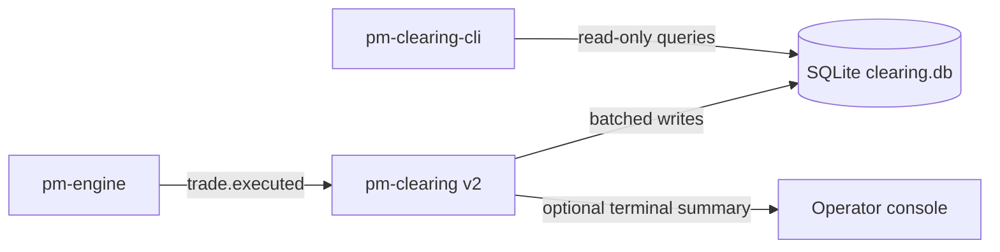
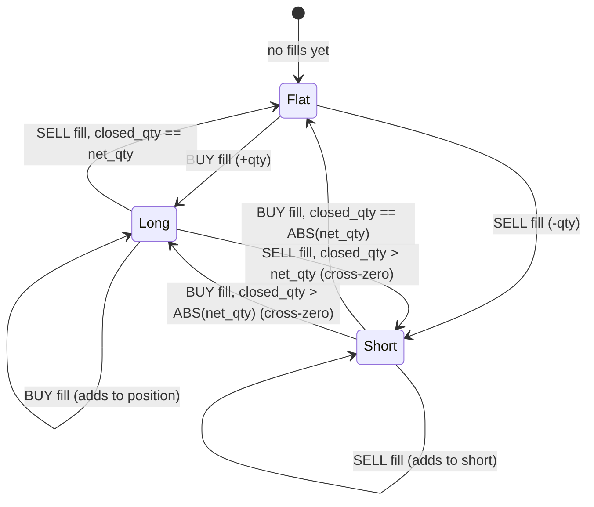
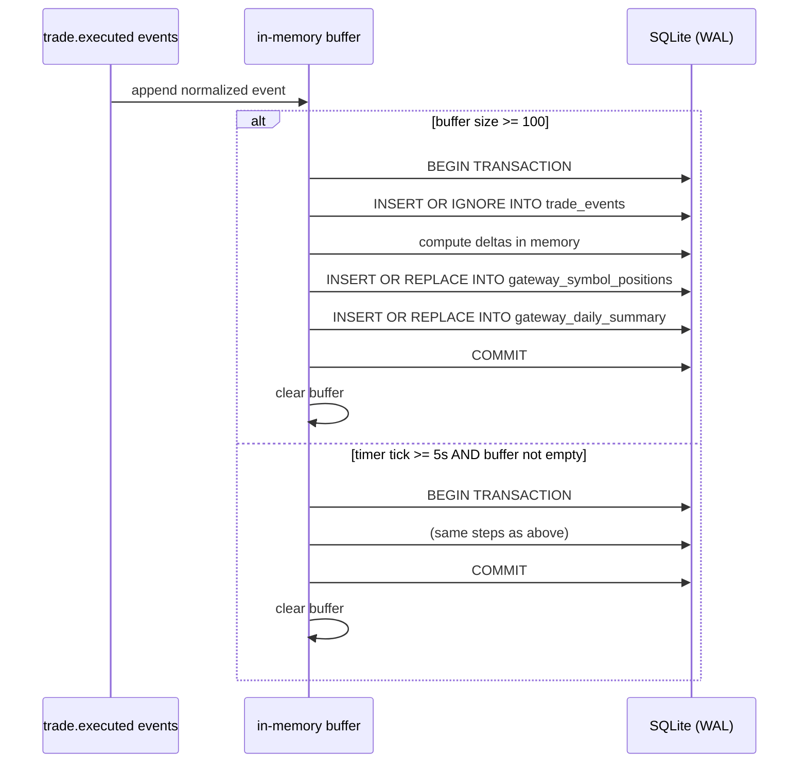
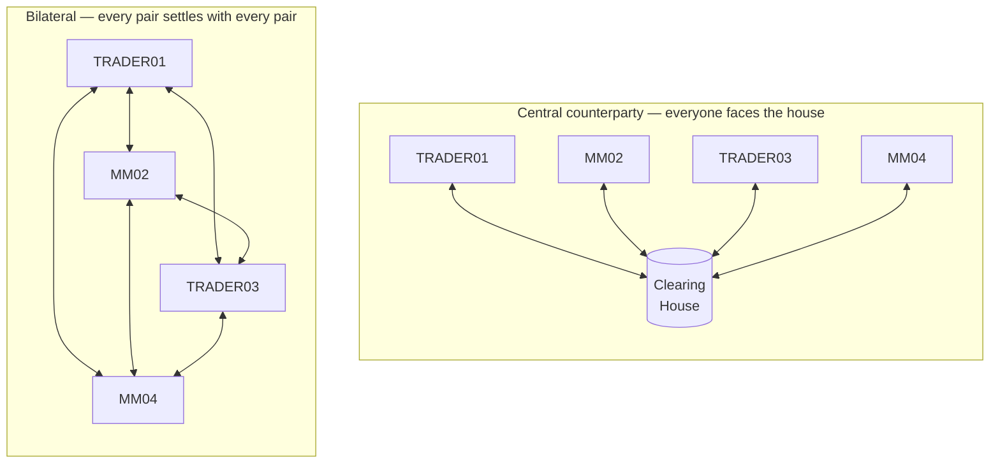
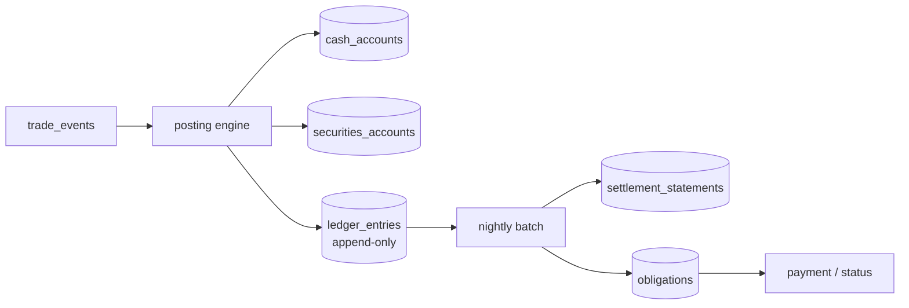

Version: 3.0.0

Date: 2026-09-14

Status: v2 shipped and since revised; v3 proposed

# EduMatcher — Clearing

## 0. How to read this document

This document carried the v2 design from 2026-07-05. That design is now
**built and shipped** — `src/edumatcher/clearing/{store,ledger,main,cli}.py`,
~3 560 lines, with six test modules against it. The platform underneath it has
moved a long way since: the tree is at **0.38.2**, wire contracts are generated
from `spec/messages/*.yaml`, every published message carries a causal envelope,
and every price declares its own unit and scale.

Sections are therefore marked:

| Marker | Meaning |
|---|---|
| **[SHIPPED]** | Implemented and covered by tests. The text describes what the code actually does. |
| **[CORRECTED]** | The v2 text was wrong or has gone stale. The corrected statement is inline; §17 records what changed and why. |
| **[PROPOSED]** | v3 work that does not exist yet. |

Sections 1–13 are the v2 design as built. **Section 14 is the plan of record**
for what remains. Section 18 catalogues the platform capabilities that arrived
after v2 was written and what clearing gets from each. Section 19 proposes the
v3 settlement and participant-account subsystem.

## 1. Motivation

The current `pm-clearing` process keeps P&L state in memory, periodically prints
that state, and appends trade rows to a CSV file (`data/clearing_report.csv`).
This is useful for demos but has operational limitations:

- state is not query-friendly after restart
- no indexed filtering by gateway, symbol, or day
- no robust ad-hoc reporting surface for operations/compliance teams
- no controlled write batching for high-throughput trade bursts

Clearing v2 redesigns the process around SQLite-first persistence while keeping
the educational simplicity of the existing process.


## 2. Problem Statement

We need a durable clearing subsystem that:

- preserves all trade-level inputs from `trade.executed`
- keeps per-gateway running position and P&L summaries continuously available
- supports high-frequency trade bursts without writing each event individually
- exposes user-friendly, no-SQL query tooling (`pm-clearing-cli`)
- follows EduMatcher CLI conventions, including `--help` and `--version`


## 3. Goals and Non-Goals

### 3.1 Goals

- Replace CSV-only persistence with SQLite as the canonical storage layer.
- Persist every `trade.executed` event field needed for downstream audit and P&L.
- Maintain up-to-date per-gateway/per-symbol aggregates in SQL tables.
- Batch writes with flush thresholds:
  - at most 100 buffered trades per transaction flush
  - flush at least every 5 seconds even if fewer than 100 trades arrived
- Add `pm-clearing-cli` with verb-based commands similar in style to
  `pm-stats-cli`.
- Allow `dates` reporting to optionally include per-date total quantity and net
  amount, including symbol-filtered views.
- Support `--help` and `--version` for both `pm-clearing` and `pm-clearing-cli`.
- Follow standard EduMatcher path behavior and allow override via `--datapath`.

### 3.2 Non-Goals

These were the v2 non-goals. Three of them are reopened by v3 and are marked
accordingly — not because the v2 decision was wrong, but because the platform
changed what they cost.

- No changes to matching-engine trade semantics. **(Still holds, permanently.)**
- No cross-process distributed transaction guarantees. **(Still holds.)**
- No position limit enforcement or breach blocking; breaches may be reported
  but will not block trade ingestion. **(Still holds — enforcement belongs to
  the engine's `order_limits`, which now exists; see §18.7.)**
- No attempt to replace dedicated accounting or settlement systems.
  **[REOPENED by v3]** — §19 proposes a deliberately simple teaching
  settlement layer. The non-goal is restated there as: no attempt to be
  *correct as a real clearing house*, only to be *legible as one*.
- No bilateral netting across gateways for the same participant; P&L is always
  tracked per individual gateway ID. **[REOPENED by v3]** — §19.2 adopts a
  central-counterparty model, under which bilateral netting is not merely
  deferred but deliberately *not* the design.
- No settlement date tracking (T+1 / T+2); all positions are marked intraday.
  **[REOPENED by v3]** — §19.5 introduces a settlement cycle, though it stays
  at T+0 by default.
- No fee or commission tracking; P&L figures are gross of transaction costs.
  **[REOPENED by v3]** — this was expensive when written and is now nearly
  free: `aggressor_side` identifies the taker on every print, so a maker/taker
  schedule is computable from `trade_events` alone with no new subscription.
  See §18.4.

## 4. High-Level Architecture



Components:

1. `pm-clearing` subscriber runtime:
- subscribes to event topics
- validates and normalizes payloads
- batches and flushes to SQLite
- updates aggregate tallies in the same transaction

2. SQLite database:
- append-only trade facts
- gateway+symbol running ledger
- optional day-level materializations/views

3. `pm-clearing-cli`:
- read-only command verbs
- common filters (`--gateway`, `--symbol`, `--date`, ranges)
- tabular/json/csv outputs


## 5. CLI Surface for `pm-clearing`

**[CORRECTED]** The v2 text listed eight options under the heading
`pm-clearing-cli`, which was also a copy-paste error — this section documents
the *writer* process. The shipped surface is below, from
`clearing/main.py::_build_parser`.

```text
pm-clearing [OPTIONS]

Storage:
  --datapath PATH          Data directory or explicit .db file path
  --db-name NAME           SQLite filename within data dir (default: clearing.db)
  --retention-days N       Prune trade_events rows older than N days on startup
                           (default: 90; 0 = disable)

Ingestion:
  --flush-size N           Max buffered trades before flush (1..100, default: 100)
  --flush-interval SEC     Max seconds between flushes (>= 0.1, default: 5)
  --print-every N          Print P&L summary every N trades (0 = never, default: 100)
  --timezone TZ            Exchange session timezone used to bucket trades into a
                           trading day (IANA name; default: UTC)

Diagnostics:
  --sql-trace              Log every SQLite statement the writer executes
  --log-level LEVEL        CRITICAL|ERROR|WARNING|INFO|DEBUG (default: WARNING)
  -v, --verbose            -v: INFO, -vv: DEBUG
  -q, --quiet              Warnings and errors only
  --log-target TARGET      server|stdout|file — where this process's own
                           operational records go (default: auto-detected pm-log-srv)
  --log-file PATH          Required when --log-target file
  --log-failover-timeout S Grace window before falling back to a local file

  --help                   Show help and exit
  --version                Show version and exit
```

Three of these did not exist in the v2 design and are worth calling out,
because each came from an operational lesson rather than from the design:

- `--timezone` (finding CL-M3). A trading day is an *exchange session* day, not
  a UTC day. Bucketing a Tokyo session by UTC date splits it across two
  `trade_date` values.
- `--sql-trace`. The flush transaction writes three tables in one commit; when
  a total looked wrong, the only way to see which statement produced it was to
  read the source.
- The `--log-target` family. `pm-clearing`'s own operational logging goes to
  `pm-log-srv` when one is running, auto-detected at startup — see
  `docs-design/EduMatcher-log-srv.md` §8. This is the platform-wide convention
  now, not a clearing-specific option.

## 6. Storage Model and SQLite Schema

Price and unit note **[CORRECTED]**
-----------------------------------
The v2 text here said: *"The engine emits `trade.executed.price` as an integer
(raw int, no implicit decimal scaling)."* **That is wrong, and was wrong when
written.** `spec/messages/trade.yaml` declares:

```yaml
- name: price
  type: float
  unit: display_price
  doc: >
    Execution price in display money, already converted from ticks by
    the publisher.
```

`trade.executed.price` is a **float in display money**. The engine converts
from ticks once, in `_publish_trade`, before publishing.

Reading that float as if it were already ticks is exactly finding **CL-M6**,
and `clearing/main.py::_trade_from_payload` now converts unconditionally at the
ingress boundary:

```python
scale = 10 ** tick_decimals
normalized["price"] = int(round(float(typed.price) * scale))
```

Everything downstream of that one line is in **integer ticks**. That is the
invariant the whole storage model rests on, and it is why the schema stores
price-derived columns (`price`, `mark_price`, `traded_notional`,
`buy_notional`, `sell_notional`, `net_amount`) as INTEGER rather than the REAL
the original schema showed. Columns produced by weighted-average arithmetic
(`avg_cost`, `realized_pnl`, `unrealized_pnl` and their `end_*` variants) stay
REAL because division and subtraction produce non-integer results.

**One tick is a different amount of money per symbol.** 100 ticks is $1.00 at
`tick_decimals = 2` and $0.01 at `tick_decimals = 4`, so summing raw ticks
across symbols with different scales is meaningless — finding **CL-H2**. Two
places deal with this, and both are load-bearing:

- the aggregate **views** normalize to display currency per row *before*
  aggregating (§6.3);
- `pm-clearing-cli` normalizes on output unless `--raw-output` is given.

This is the same discipline the rest of the platform adopted on 2026-09-13:
every field holding engine ticks is named `*_ticks` and every message carrying
one carries its `tick_decimals`. `trade.executed` is one of the messages that
declared its scale before that change, which is why clearing never needed the
five-rung scale-resolution ladder that `pm-audit-replay` had to carry and has
since deleted.

### 6.1 Database pragmas

At process startup:

```sql
PRAGMA journal_mode = WAL;
PRAGMA synchronous = NORMAL;
PRAGMA foreign_keys = ON;
PRAGMA temp_store = MEMORY;
```

Rationale:

- WAL improves concurrent reads for `pm-clearing-cli` while writes continue.
- `NORMAL` is a good durability/performance tradeoff for this workload.

### 6.2 Tables

#### A) `trade_events`

Store all required fields from `trade.executed` plus ingestion metadata.

**`trade.executed` message field reference** — authoritative source is
`spec/messages/trade.yaml`, which generates
`models/generated/trade.py`. **[CORRECTED]**: the v2 table below predates the
generated spec. `run_seq` was missing entirely, `aggressor_side` has gained the
`AUCTION` value, `price` is a display float rather than a number in ticks, and
`buy_order_id`/`sell_order_id` are required rather than optional.

| Field | Type | Required | Persisted? | Description |
|---|---|---|---|---|
| `id` | string | Yes | Yes (PK) | Durable, sortable trade id, `^\d{6}-\d{9}$`: persisted engine-run sequence, then per-run trade counter |
| `run_seq` | int | Yes | **No — gap G1** | Durable engine-run sequence, the `id` prefix. A change marks an engine restart explicitly |
| `ts_ns` | integer | Yes | Yes | Engine event timestamp in Unix epoch nanoseconds, unscaled |
| `symbol` | string | Yes | Yes | Traded instrument symbol |
| `quantity` | integer | Yes | Yes | Matched trade size |
| `price` | **float** | Yes | Yes, **as ticks** | Execution price in **display money**; converted to ticks at ingress (see §6 price note) |
| `tick_decimals` | integer | No (default 2) | Yes | Symbol precision (`d`, where 1 tick = `10^-d`) |
| `buy_order_id` | string | Yes | Yes | Buy-side order id that participated in the match |
| `sell_order_id` | string | Yes | Yes | Sell-side order id that participated in the match |
| `buy_gateway_id` | string | Yes | Yes | Gateway id credited with the buy-side fill |
| `sell_gateway_id` | string | Yes | Yes | Gateway id credited with the sell-side fill |
| `aggressor_side` | enum `BUY`/`SELL`/`AUCTION` | Yes | Yes | Side that removed liquidity. `AUCTION` on an uncross print, where both sides rested and there is no true aggressor |

Derived and ingestion-only fields written by `pm-clearing`:

| Field | Type | Description |
|---|---|---|
| `trade_date` | string (`YYYY-MM-DD`) | Trade date derived from `ts_ns` in the **exchange session timezone** (`--timezone`, default UTC), for partitioning and filtering — finding CL-M3 |
| `ingest_ts_ns` | integer | Local ingestion timestamp used for observability and lag analysis |

Not captured, and proposed in §14 as gaps **G1** and **G2**: `run_seq`, and the
causal envelope's `msg_id` / `correlation_id` (§18.1).

```sql
CREATE TABLE IF NOT EXISTS trade_events (
  -- The engine's durable trade id is the sole execution identity.
  id               TEXT    NOT NULL,
  ts_ns            INTEGER NOT NULL,
  trade_date       TEXT    NOT NULL,
  symbol           TEXT    NOT NULL,
  quantity         INTEGER NOT NULL,
  price            INTEGER NOT NULL,   -- ticks, converted at ingress
  tick_decimals    INTEGER NOT NULL DEFAULT 2,
  buy_order_id     TEXT,
  sell_order_id    TEXT,
  buy_gateway_id   TEXT    NOT NULL,
  sell_gateway_id  TEXT    NOT NULL,
  aggressor_side   TEXT,
  ingest_ts_ns     INTEGER NOT NULL,
  PRIMARY KEY (id)
);

CREATE INDEX IF NOT EXISTS ix_trade_events_date ON trade_events(trade_date);
CREATE INDEX IF NOT EXISTS ix_trade_events_symbol_date ON trade_events(symbol, trade_date);
CREATE INDEX IF NOT EXISTS ix_trade_events_buy_gw_date ON trade_events(buy_gateway_id, trade_date);
CREATE INDEX IF NOT EXISTS ix_trade_events_sell_gw_date ON trade_events(sell_gateway_id, trade_date);
```

The primary key is the engine's durable trade `id` **alone**. That is what
makes `INSERT OR IGNORE` a correct idempotency guard across an engine restart:
because `id` carries `run_seq` as its prefix, a restarted engine cannot reissue
an id that a previous run already used, so a replayed or duplicated print is
always recognised. Before durable ids, restarted runs reused trade ids and
executions silently disappeared from clearing.

#### B) `gateway_symbol_positions`


Current running state, continuously overwritten via UPSERT during each flush.

`gateway_symbol_positions` column reference:

| Column | Type | Source / calculation |
|---|---|---|
| `gateway_id` | TEXT | Gateway identifier from `trade.executed.buy_gateway_id` or `trade.executed.sell_gateway_id` for each leg update |
| `symbol` | TEXT | Symbol copied from `trade.executed.symbol` |
| `net_qty` | INTEGER | Running signed position quantity per `(gateway_id, symbol)`; increment on buy fills, decrement on sell fills |
| `avg_cost` | REAL | Running weighted average entry price of the current open position; updated on same-side adds, adjusted on cross-zero resets |
| `realized_pnl` | REAL | Cumulative realized P&L from closed quantity: long close via sell uses `(fill_price - avg_cost) * closed_qty`, short close via buy uses `(avg_cost - fill_price) * closed_qty` |
| `unrealized_pnl` | REAL | Mark-to-market open P&L computed from latest mark: `net_qty * (mark_price - avg_cost)` |
| `mark_price` | INTEGER | Latest observed trade price in ticks for `symbol` from `trade.executed.price` |
| `tick_decimals` | INTEGER | Latest precision received for this `(gateway_id, symbol)` key |
| `buy_qty` | INTEGER | Cumulative buy-side traded quantity for this `(gateway_id, symbol)` from all processed fills |
| `sell_qty` | INTEGER | Cumulative sell-side traded quantity for this `(gateway_id, symbol)` from all processed fills |
| `buy_notional` | INTEGER | Cumulative buy-side traded notional in tick-units, sum of `fill_qty * fill_price_ticks` for buy legs |
| `sell_notional` | INTEGER | Cumulative sell-side traded notional in tick-units, sum of `fill_qty * fill_price_ticks` for sell legs |
| `last_trade_ts_ns` | INTEGER | Latest event timestamp for this key, taken from `trade.executed.ts_ns` |
| `updated_ts_ns` | INTEGER | Clearing writer update timestamp set at flush/UPSERT time for observability |

```sql
CREATE TABLE IF NOT EXISTS gateway_symbol_positions (
  gateway_id TEXT NOT NULL,
  symbol TEXT NOT NULL,
  net_qty INTEGER NOT NULL,
  avg_cost REAL NOT NULL,
  realized_pnl REAL NOT NULL,
  unrealized_pnl REAL NOT NULL,
  mark_price INTEGER,
  tick_decimals INTEGER NOT NULL DEFAULT 2,
  buy_qty INTEGER NOT NULL,
  sell_qty INTEGER NOT NULL,
  buy_notional INTEGER NOT NULL,
  sell_notional INTEGER NOT NULL,
  last_trade_ts_ns INTEGER,
  updated_ts_ns INTEGER NOT NULL,
  PRIMARY KEY (gateway_id, symbol)
);

CREATE INDEX IF NOT EXISTS ix_gsp_gateway ON gateway_symbol_positions(gateway_id);
CREATE INDEX IF NOT EXISTS ix_gsp_symbol ON gateway_symbol_positions(symbol);
```

#### C) `gateway_daily_summary`


Daily aggregate rollup for quick reporting.

`gateway_daily_summary` column reference:

| Column | Type | Source / calculation |
|---|---|---|
| `trade_date` | TEXT | UTC date bucket derived from `trade.executed.ts_ns` (same derivation used for `trade_events.trade_date`) |
| `gateway_id` | TEXT | Gateway id from each trade leg (`buy_gateway_id` and `sell_gateway_id`) grouped per day |
| `symbol` | TEXT | Symbol copied from `trade.executed.symbol` and grouped per day |
| `traded_qty` | INTEGER | Daily cumulative traded quantity for the `(trade_date, gateway_id, symbol)` key; sum of absolute leg quantities processed that day |
| `traded_notional` | INTEGER | Daily cumulative traded notional in tick-units; sum of `fill_qty * fill_price_ticks` |
| `buy_qty` | INTEGER | Daily cumulative buy-side quantity for this key |
| `sell_qty` | INTEGER | Daily cumulative sell-side quantity for this key |
| `buy_notional` | INTEGER | Daily cumulative buy-side notional in tick-units |
| `sell_notional` | INTEGER | Daily cumulative sell-side notional in tick-units |
| `net_amount` | INTEGER | Daily signed notional in tick-units computed as `buy_notional - sell_notional` |
| `realized_pnl` | REAL | Daily cumulative realized P&L contribution for this key, aggregated from per-fill close-out P&L calculations |
| `end_net_qty` | INTEGER | End-of-day net position copied from the latest `gateway_symbol_positions.net_qty` observed for the key within that date |
| `end_avg_cost` | REAL | End-of-day average cost copied from the latest `gateway_symbol_positions.avg_cost` for the key within that date |
| `end_unrealized_pnl` | REAL | End-of-day unrealized P&L copied from the latest `gateway_symbol_positions.unrealized_pnl` for the key within that date |
| `tick_decimals` | INTEGER | Precision used to render tick-based values for this daily key |
| `last_trade_ts_ns` | INTEGER | Latest `trade.executed.ts_ns` processed for this daily key |
| `updated_ts_ns` | INTEGER | Clearing writer update timestamp set at each daily UPSERT/flush |

```sql
CREATE TABLE IF NOT EXISTS gateway_daily_summary (
  trade_date TEXT NOT NULL,
  gateway_id TEXT NOT NULL,
  symbol TEXT NOT NULL,
  traded_qty INTEGER NOT NULL,
  traded_notional INTEGER NOT NULL,
  buy_qty INTEGER NOT NULL,
  sell_qty INTEGER NOT NULL,
  buy_notional INTEGER NOT NULL,
  sell_notional INTEGER NOT NULL,
  net_amount INTEGER NOT NULL,
  realized_pnl REAL NOT NULL,
  end_net_qty INTEGER NOT NULL,
  end_avg_cost REAL NOT NULL,
  end_unrealized_pnl REAL NOT NULL,
  tick_decimals INTEGER NOT NULL DEFAULT 2,
  last_trade_ts_ns INTEGER,
  updated_ts_ns INTEGER NOT NULL,
  PRIMARY KEY (trade_date, gateway_id, symbol)
);

CREATE INDEX IF NOT EXISTS ix_gds_gateway_date ON gateway_daily_summary(gateway_id, trade_date);
CREATE INDEX IF NOT EXISTS ix_gds_symbol_date ON gateway_daily_summary(symbol, trade_date);
```

#### D) `session_events`

Append-only log of clearing-significant engine events (EOD markers, session
phase transitions).  One row per event; never updated.

`session_events` column reference:

| Column | Type | Source / calculation |
|---|---|---|
| `id` | INTEGER (autoincrement) | Internal surrogate key |
| `event_type` | TEXT | Event classifier; current values: `EOD`, `PHASE` |
| `ts_ns` | INTEGER | Ingest timestamp in nanoseconds when the event was processed by `pm-clearing` |
| `trade_date` | TEXT (`YYYY-MM-DD`) | UTC date derived from `ts_ns` for date-bounded queries |
| `payload_json` | TEXT | Optional JSON blob with event-specific detail (EOD mark prices, phase name, etc.) |

```sql
CREATE TABLE IF NOT EXISTS session_events (
  id           INTEGER PRIMARY KEY AUTOINCREMENT,
  event_type   TEXT    NOT NULL,
  ts_ns        INTEGER NOT NULL,
  trade_date   TEXT    NOT NULL,
  payload_json TEXT
);

CREATE INDEX IF NOT EXISTS ix_session_events_date ON session_events(trade_date);
CREATE INDEX IF NOT EXISTS ix_session_events_type ON session_events(event_type);
```

#### E) `gateway_sessions`

Connection and disconnection history for every gateway that connects while
`pm-clearing` is running.  Populated from `system.gateway_connect` and
`system.gateway_disconnect` messages.

`gateway_sessions` column reference:

| Column | Type | Source / calculation |
|---|---|---|
| `gateway_id` | TEXT | Gateway identifier from `system.gateway_connect.gateway_id` |
| `connected_at_ns` | INTEGER | Ingestion-time nanosecond timestamp recorded when `system.gateway_connect` is received |
| `disconnected_at_ns` | INTEGER or NULL | Ingestion-time nanosecond timestamp recorded when `system.gateway_disconnect` is received; NULL if disconnect was not yet observed |
| `disconnect_reason` | TEXT or NULL | Reason string from `system.gateway_disconnect.reason`; NULL if not provided or session still open |

```sql
CREATE TABLE IF NOT EXISTS gateway_sessions (
  gateway_id         TEXT    NOT NULL,
  connected_at_ns    INTEGER NOT NULL,
  disconnected_at_ns INTEGER,
  disconnect_reason  TEXT,
  PRIMARY KEY (gateway_id, connected_at_ns)
);

CREATE INDEX IF NOT EXISTS ix_gateway_sessions_gateway
  ON gateway_sessions(gateway_id);
```

### 6.3 Views

**[CORRECTED]** Two things were wrong here in v2. The views were numbered
`A)`/`B)` at the same heading level as the tables, so they read as a sixth and
seventh table under §6.2; they are now their own subsection. And the SQL summed
raw tick values across symbols, which is finding **CL-H2** — meaningless when
symbols have different `tick_decimals` (§6 price note). Both views now
normalize to display currency *per row, inside the view*, before aggregating,
because neither exposes a `tick_decimals` column the CLI could normalize with
afterwards.

`DROP VIEW IF EXISTS` before `CREATE` — rather than `CREATE VIEW IF NOT
EXISTS` — so the definition is refreshed on databases created by an earlier
build. A view carries no data, so this is free.

#### A) `gateway_pnl_totals`

```sql
DROP VIEW IF EXISTS gateway_pnl_totals;
CREATE VIEW gateway_pnl_totals AS
SELECT
  gateway_id,
  SUM(realized_pnl / scale)                    AS realized_pnl_total,
  SUM(unrealized_pnl / scale)                  AS unrealized_pnl_total,
  SUM((realized_pnl + unrealized_pnl) / scale) AS total_pnl,
  SUM(net_qty)                                 AS net_qty_total
FROM (
  SELECT
    gateway_id, net_qty, realized_pnl, unrealized_pnl,
    CASE tick_decimals
      WHEN 0 THEN 1.0         WHEN 1 THEN 10.0
      WHEN 2 THEN 100.0       WHEN 3 THEN 1000.0
      WHEN 4 THEN 10000.0     WHEN 5 THEN 100000.0
      WHEN 6 THEN 1000000.0   WHEN 7 THEN 10000000.0
      WHEN 8 THEN 100000000.0 ELSE 100.0
    END AS scale
  FROM gateway_symbol_positions
)
GROUP BY gateway_id;
```

Quantities (`net_qty`, `traded_qty`) are share counts, not tick-scaled, so they
are summed raw.

#### B) `daily_exchange_totals`

```sql
DROP VIEW IF EXISTS daily_exchange_totals;
CREATE VIEW daily_exchange_totals AS
SELECT
  trade_date,
  SUM(traded_qty)               AS traded_qty_total,
  SUM(traded_notional / scale)  AS traded_notional_total,
  SUM(net_amount / scale)       AS net_amount_total,
  SUM(realized_pnl / scale)     AS realized_pnl_total
FROM (
  SELECT
    trade_date, traded_qty, traded_notional, net_amount, realized_pnl,
    CASE tick_decimals
      WHEN 0 THEN 1.0         WHEN 1 THEN 10.0
      WHEN 2 THEN 100.0       WHEN 3 THEN 1000.0
      WHEN 4 THEN 10000.0     WHEN 5 THEN 100000.0
      WHEN 6 THEN 1000000.0   WHEN 7 THEN 10000000.0
      WHEN 8 THEN 100000000.0 ELSE 100.0
    END AS scale
  FROM gateway_daily_summary
)
GROUP BY trade_date;
```


### 6.4 Retention, compaction, and optional rotation

For the educational deployment profile, default behavior should favor a single
SQLite database with bounded retention over calendar-based rotation.

Recommended policy:

- Keep one active DB file by default.
- Retain recent detailed rows in `trade_events` for 90 days by default.
- Keep longer-lived aggregates in `gateway_daily_summary` and
  `gateway_symbol_positions` as needed for reporting.
- Run periodic maintenance:
  - `PRAGMA wal_checkpoint(TRUNCATE);` to limit WAL growth.
  - `VACUUM;` after large deletes to reclaim disk space.

**Retention pruning SQL** (run on startup and/or via `pm-clearing-cli prune`):

```sql
-- Step 1: remove raw events older than 90 days
DELETE FROM trade_events
WHERE trade_date < date('now', '-90 days');

-- Step 2: reclaim freed space (run after the DELETE commits)
PRAGMA wal_checkpoint(TRUNCATE);
VACUUM;
```

Aggregate tables (`gateway_daily_summary`, `gateway_symbol_positions`) are
not pruned by default — they are compact and provide long-running reporting
value beyond the 90-day raw-event window.

Why this is preferred over weekly rotation:

- Weekly files add operational overhead (file discovery, cross-file querying,
  merge logic) with limited benefit at low trade volumes.
- Most educational scenarios have manageable event counts, so retention +
  compaction is simpler and easier to operate.

Optional rotation mode (only if size pressure appears):

- Trigger rotation by threshold, not by week boundary:
  - active DB file exceeds configured size limit (for example 1 to 2 GB), or
  - retained date window exceeds configured maximum.
- On rotation:
  - move closed data into an archive DB (for example monthly),
  - keep `pm-clearing-cli` defaulting to the active DB,
  - allow explicit archive queries via `--db` path override.

This keeps day-to-day usage simple while still allowing scale-up behavior when
needed.


## 7. P&L Calculation Model

### 7.0 Position state machine

Each `(gateway_id, symbol)` key moves through these states as fills arrive:



On every state transition that reduces an open position, realized P&L is
calculated for the closed quantity before updating `avg_cost`.

### 7.1 Running position logic

Per `(gateway_id, symbol)` maintain:

- `net_qty`
- `avg_cost`
- `realized_pnl`
- `mark_price`
- `unrealized_pnl = net_qty * (mark_price - avg_cost)` for long
- For short positions, same signed formula works because `net_qty < 0`

### 7.2 Fill-side updates

For each trade event:

- Buyer leg updates as `BUY` fill (`+qty`)
- Seller leg updates as `SELL` fill (`-qty`)

When reducing an opposite-side open position, realize P&L on closed quantity:

- closing long via sell: `(fill_price - avg_cost) * closed_qty`
- closing short via buy: `(avg_cost - fill_price) * closed_qty`

When crossing through zero, reset `avg_cost` to fill price for the newly opened
side quantity, same as current engine-side position accounting semantics.

**Worked example — long position, partial close, then cross-zero to short:**

| Step | Event | Calculation | Result |
|---|---|---|---|
| 1 | BUY 10 @ 100.0 | Open long. `avg_cost = 100.0` | `net_qty = +10`, `avg_cost = 100.0`, `realized_pnl = 0` |
| 2 | BUY 10 @ 110.0 | Add to long. New avg: `(10×100 + 10×110) / 20 = 105.0` | `net_qty = +20`, `avg_cost = 105.0`, `realized_pnl = 0` |
| 3 | SELL 20 @ 115.0 | Full close. Realized: `(115 - 105) × 20 = 200` | `net_qty = 0`, `realized_pnl = 200`, position is **Flat** |
| 4 | SELL 15 @ 108.0 | Cross-zero from flat. Closed qty = 0 (was flat). Open short 15 @ 108.0 | `net_qty = -15`, `avg_cost = 108.0`, `realized_pnl = 200` |
| 5 | BUY 20 @ 105.0 | Reduce short by 15, realize P&L, open long remainder. Realized: `(108 - 105) × 15 = 45`. Open long 5 @ 105.0 | `net_qty = +5`, `avg_cost = 105.0`, `realized_pnl = 245` |

### 7.3 Mark price source

Default `mark_price` source in v2: latest trade price for that symbol as seen by
`pm-clearing` from `trade.executed`.

Optional future extension: subscribe to `book.*` and use mid-price for mark.


## 8. Batching and Flush Policy

Buffer incoming trade events in memory and flush in one transaction when either:

1. buffer size reaches 100 events, or
2. 5 seconds elapsed since previous flush

Pseudo-flow:

1. receive `trade.executed`
2. append normalized event to ring/list buffer
3. if buffer size >= 100, flush immediately
4. independent timer tick checks elapsed time and flushes if `>= 5s` and buffer
   not empty

Flush transaction steps:

1. insert `trade_events` rows (idempotent via `INSERT OR IGNORE`)
2. compute gateway-side deltas in memory for this batch
3. UPSERT into `gateway_symbol_positions`
4. UPSERT into `gateway_daily_summary`
5. commit

**Flush sequence diagram:**



**`gateway_daily_summary` UPSERT SQL:**

This is the most complex write because it must atomically increment running
totals and update end-of-day snapshot columns.

```sql
INSERT INTO gateway_daily_summary (
  trade_date, gateway_id, symbol,
  traded_qty, traded_notional,
  buy_qty, sell_qty, buy_notional, sell_notional, net_amount,
  realized_pnl,
  end_net_qty, end_avg_cost, end_unrealized_pnl,
  last_trade_ts_ns, updated_ts_ns
) VALUES (
  :trade_date, :gateway_id, :symbol,
  :delta_qty, :delta_notional,
  :delta_buy_qty, :delta_sell_qty,
  :delta_buy_notional, :delta_sell_notional,
  :delta_buy_notional - :delta_sell_notional,
  :delta_realized_pnl,
  :snap_net_qty, :snap_avg_cost, :snap_unrealized_pnl,
  :last_ts_ns, :now_ts_ns
)
ON CONFLICT(trade_date, gateway_id, symbol) DO UPDATE SET
  traded_qty        = traded_qty + excluded.traded_qty,
  traded_notional   = traded_notional + excluded.traded_notional,
  buy_qty           = buy_qty + excluded.buy_qty,
  sell_qty          = sell_qty + excluded.sell_qty,
  buy_notional      = buy_notional + excluded.buy_notional,
  sell_notional     = sell_notional + excluded.sell_notional,
  net_amount        = buy_notional + excluded.buy_notional
                      - (sell_notional + excluded.sell_notional),
  realized_pnl      = realized_pnl + excluded.realized_pnl,
  end_net_qty       = excluded.end_net_qty,
  end_avg_cost      = excluded.end_avg_cost,
  end_unrealized_pnl = excluded.end_unrealized_pnl,
  last_trade_ts_ns  = MAX(last_trade_ts_ns, excluded.last_trade_ts_ns),
  updated_ts_ns     = excluded.updated_ts_ns;
```

The `:delta_*` bind values are computed in memory from the current batch before
the transaction is opened. The `:snap_*` values are taken from the latest
in-memory position state after applying all fills in the batch.

On shutdown:

- force a final flush
- close DB cleanly


## 9. Path and Data Directory Rules

Path resolution for v2 should follow EduMatcher conventions:

1. if `--datapath` is provided:
- if it ends with `.db`, use as explicit DB file path
- otherwise treat as data directory and append `--db-name` (default `clearing.db`)

2. else use standard process data directory resolution used by other commands
(`EDUMATCHER_DATA_DIR` fallback chain), then append `clearing.db`.

This keeps behavior aligned with existing EduMatcher process logic while still
supporting explicit override.


## 10. CLI Surface for `pm-clearing-cli`

Design style should match `pm-stats-cli`: command verbs + options.

```text
pm-clearing-cli [GLOBAL_OPTIONS] <verb> [verb-options]

Global options:
  --datapath PATH      Data directory or explicit db file
  --db-name NAME       SQLite filename if datapath is directory
  --format FMT         table|json|csv (default: table)
  --no-header          For csv output
  --help
  --version
```

### 10.1 Verbs **[SHIPPED]**

All thirteen verbs below are implemented in `clearing/cli.py`. The v2 text
listed twelve and omitted `prune`.

- `gateways` — list known gateways with current totals
- `positions` — current positions by gateway/symbol
- `pnl` — realized/unrealized/total P&L by gateway and optionally symbol
- `daily` — daily summaries (gateway/symbol/day)
- `trades` — raw trade events with filters
- `exposure` — net notional/risk concentration views
- `symbols` — symbol-level clearing totals
- `dates` — available trading dates in DB; optional per-date quantity/notional
  totals and net amount via `--with-totals`
- `health` — DB metadata (last update, row counts, last flush time)
- `reconcile` — compare computed aggregates against raw `trade_events` totals
  to detect any discrepancy between source facts and summary tables, on both
  the buy side and the sell side
- `sessions` — gateway connection and disconnection history from
  `gateway_sessions`; supports `--gateway`, `--from`, `--to`,
  `--connected-only`, `--limit`
- `eod` — end-of-day sentinel rows written to `session_events` on `system.eod`;
  supports `--from`, `--to`, `--limit`
- `prune` — delete `trade_events` rows older than `--days` (default 90) and
  `VACUUM`; `--dry-run` reports the count without deleting

Two verbs proposed for v3 are specified in §14: `reconcile --against-engine`
(§18.3) and `phases` (§18.6).

### 10.2 Option reference

**[CORRECTED]** `--raw-output` was missing from the v2 table. It matters more
than a display flag normally would: **by default every money column is
normalized from ticks to display currency on output**, and `--raw-output` is
the only way to see the stored tick values. A reader comparing CLI output
against a raw `sqlite3` query will otherwise see two different numbers and
conclude one of them is a bug.

| Option | Scope | Value type | Allowed values / range | Default | Notes |
|---|---|---|---|---|---|
| `--datapath PATH` | Global | Path string | Existing directory path or explicit `.db` file path | Standard EduMatcher data-dir resolution | If path ends with `.db`, use as DB file; otherwise append `--db-name` |
| `--db-name NAME` | Global | Filename string | Valid SQLite filename, typically `*.db` | `clearing.db` | Used when `--datapath` is a directory |
| `--format FMT` | Global | Enum string | `table`, `json`, `csv` | `table` | `json`/`csv` are structured output modes |
| `--no-header` | Global | Flag (bool) | Present/absent | Off | Applies to `csv` output to suppress header row |
| `--raw-output` | Global | Flag (bool) | Present/absent | Off | Show raw tick-unit values instead of display-normalized values |
| `--gateway GW_ID` | Filter | String | Non-empty gateway id | Unset | Restricts output to one gateway |
| `--symbol SYMBOL` | Filter | String | Non-empty symbol, usually uppercase | Unset | Restricts output to one symbol |
| `--date YYYY-MM-DD` | Filter | Date string | ISO date regex `^\d{4}-\d{2}-\d{2}$` | Unset | Single-day filter |
| `--from YYYY-MM-DD` | Filter | Date string | ISO date regex `^\d{4}-\d{2}-\d{2}$` | Unset | Inclusive start date for range filters |
| `--to YYYY-MM-DD` | Filter | Date string | ISO date regex `^\d{4}-\d{2}-\d{2}$` | Unset | Inclusive end date for range filters |
| `--limit N` | Filter | Integer | `1..100000` | Verb-specific | Caps returned row count |
| `--sort FIELD` | Verb option | String | Verb-specific sortable field name | Verb default | Primarily used by `symbols` and `exposure` style summaries |
| `--with-totals` | Verb option | Flag (bool) | Present/absent | Off | For `dates`, return per-date totals (`traded_qty_total`, `traded_notional_total`, `net_amount_total`) instead of dates only |
| `--connected-only` | Verb option | Flag (bool) | Present/absent | Off | For `sessions`, show only sessions with no observed disconnect |
| `--days N` | Verb option | Integer | `>= 0` | `90` | For `prune`, the retention window |
| `--dry-run` | Verb option | Flag (bool) | Present/absent | Off | For `prune`, report the row count without deleting |
| `--help` | Global | Flag | Present/absent | Off | Show command help and exit |
| `--version` | Global | Flag | Present/absent | Off | Show version and exit |

### 10.3 Structured output fields (`json` / `csv`)

When `--format json` or `--format csv` is selected, fields are explicit and stable by verb.

- **`gateways`:**
  `gateway_id`, `realized_pnl_total`, `unrealized_pnl_total`, `total_pnl`, `net_qty_total`
- **`positions`:**
  `gateway_id`, `symbol`, `net_qty`, `avg_cost`, `mark_price`, `realized_pnl`, `unrealized_pnl`, `buy_qty`, `sell_qty`, `buy_notional`, `sell_notional`, `last_trade_ts_ns`, `updated_ts_ns`
- **`pnl`:**
  `gateway_id`, `symbol`, `realized_pnl`, `unrealized_pnl`, `total_pnl`, `net_qty`, `mark_price`
- **`daily`:**
  `trade_date`, `gateway_id`, `symbol`, `traded_qty`, `traded_notional`, `buy_qty`, `sell_qty`, `buy_notional`, `sell_notional`, `net_amount`, `realized_pnl`, `end_net_qty`, `end_avg_cost`, `end_unrealized_pnl`, `last_trade_ts_ns`, `updated_ts_ns`
- **`trades`:**
  `id`, `ts_ns`, `trade_date`, `symbol`, `quantity`, `price`, `buy_order_id`, `sell_order_id`, `buy_gateway_id`, `sell_gateway_id`, `aggressor_side`, `ingest_ts_ns`
- **`exposure`:**
  `gateway_id`, `symbol`, `net_qty`, `mark_price`, `net_notional`, `gross_notional`, `realized_pnl`, `unrealized_pnl`, `total_pnl`
- **`symbols`:**
  `symbol`, `traded_qty`, `traded_notional`, `realized_pnl`, `open_net_qty`, `open_unrealized_pnl`
- **`dates`:**
  default fields: `trade_date`

  with `--with-totals`: `trade_date`, `traded_qty_total`, `traded_notional_total`, `net_amount_total`
- **`health`:**
  `db_path`, `trade_events_rows`, `gateway_symbol_positions_rows`, `gateway_daily_summary_rows`,
   `last_trade_ts_ns`, `last_flush_ts_ns`, `wal_mode`
- **`sessions`:**
  `gateway_id`, `connect_date`, `connected_at_ns`, `disconnected_at_ns`, `disconnect_reason`
- **`eod`:**
  `id`, `event_type`, `ts_ns`, `trade_date`, `payload_json`


### 10.4 Example UX

```bash
pm-clearing-cli pnl --gateway TRADER01
pm-clearing-cli positions --gateway MM01 --symbol AAPL
pm-clearing-cli daily --from 2026-07-01 --to 2026-07-05
pm-clearing-cli trades --symbol MSFT --date 2026-07-05 --limit 100
pm-clearing-cli dates --from 2026-07-01 --to 2026-07-05 --symbol AAPL --with-totals
pm-clearing-cli exposure --date 2026-07-05 --format json
pm-clearing-cli sessions --date 2026-07-05
pm-clearing-cli sessions --gateway TRADER07
pm-clearing-cli eod --from 2026-07-01 --to 2026-07-05
```

### 10.5 SQL implementation blueprint by verb

This section defines the principal SQLite statement per verb.

Implementation rules for all verbs:

- Use named bind parameters (for example `:gateway`, `:symbol`, `:limit`).
- Never build SQL by string-concatenating user input.
- For optional filters, use `(:param IS NULL OR column = :param)` style clauses.
- For sort fields, map CLI values to a strict whitelist in code before SQL.


---

#### A) COMMAND VERB: `gateways`


| Item | Value |
|---|---|
| Primary source | `gateway_pnl_totals` view |
| Primary goal | Return one row per gateway with total P&L and net quantity |
| Default ordering | `gateway_id ASC` |

Principal SQL:

```sql
SELECT
  gateway_id,
  realized_pnl_total,
  unrealized_pnl_total,
  total_pnl,
  net_qty_total
FROM gateway_pnl_totals
WHERE (:gateway IS NULL OR gateway_id = :gateway)
ORDER BY gateway_id ASC
LIMIT :limit;
```

Optional filters:

| CLI option | SQL parameter | Applied as |
|---|---|---|
| `--gateway` | `:gateway` | exact match on `gateway_id` |
| `--limit` | `:limit` | `LIMIT :limit` |

---

#### B) COMMAND VERB:  `positions`


| Item | Value |
|---|---|
| Primary source | `gateway_symbol_positions` table |
| Primary goal | Return current position state by gateway and symbol |
| Default ordering | `gateway_id ASC, symbol ASC` |

Principal SQL:

```sql
SELECT
  gateway_id,
  symbol,
  net_qty,
  avg_cost,
  mark_price,
  realized_pnl,
  unrealized_pnl,
  buy_qty,
  sell_qty,
  buy_notional,
  sell_notional,
  last_trade_ts_ns,
  updated_ts_ns
FROM gateway_symbol_positions
WHERE (:gateway IS NULL OR gateway_id = :gateway)
  AND (:symbol IS NULL OR symbol = :symbol)
ORDER BY gateway_id ASC, symbol ASC
LIMIT :limit;
```

Optional filters:

| CLI option | SQL parameter | Applied as |
|---|---|---|
| `--gateway` | `:gateway` | exact match on `gateway_id` |
| `--symbol` | `:symbol` | exact match on `symbol` |
| `--limit` | `:limit` | `LIMIT :limit` |

---

#### C) COMMAND VERB:  `pnl`

| Item | Value |
|---|---|
| Primary source | `gateway_symbol_positions` table |
| Primary goal | Return realized/unrealized/total P&L rows by gateway and symbol |
| Default ordering | `gateway_id ASC, symbol ASC` |

Principal SQL:

```sql
SELECT
  gateway_id,
  symbol,
  realized_pnl,
  unrealized_pnl,
  (realized_pnl + unrealized_pnl) AS total_pnl,
  net_qty,
  mark_price
FROM gateway_symbol_positions
WHERE (:gateway IS NULL OR gateway_id = :gateway)
  AND (:symbol IS NULL OR symbol = :symbol)
ORDER BY gateway_id ASC, symbol ASC
LIMIT :limit;
```

Optional filters:

| CLI option | SQL parameter | Applied as |
|---|---|---|
| `--gateway` | `:gateway` | exact match on `gateway_id` |
| `--symbol` | `:symbol` | exact match on `symbol` |
| `--limit` | `:limit` | `LIMIT :limit` |

---

#### D) COMMAND VERB: `daily`

| Item | Value |
|---|---|
| Primary source | `gateway_daily_summary` table |
| Primary goal | Return daily rollups by date, gateway, and symbol |
| Default ordering | `trade_date DESC, gateway_id ASC, symbol ASC` |

Principal SQL:

```sql
SELECT
  trade_date,
  gateway_id,
  symbol,
  traded_qty,
  traded_notional,
  buy_qty,
  sell_qty,
  buy_notional,
  sell_notional,
  net_amount,
  realized_pnl,
  end_net_qty,
  end_avg_cost,
  end_unrealized_pnl,
  last_trade_ts_ns,
  updated_ts_ns
FROM gateway_daily_summary
WHERE (:gateway IS NULL OR gateway_id = :gateway)
  AND (:symbol IS NULL OR symbol = :symbol)
  AND (:date IS NULL OR trade_date = :date)
  AND (:from_date IS NULL OR trade_date >= :from_date)
  AND (:to_date IS NULL OR trade_date <= :to_date)
ORDER BY trade_date DESC, gateway_id ASC, symbol ASC
LIMIT :limit;
```

Optional filters:

| CLI option | SQL parameter | Applied as |
|---|---|---|
| `--gateway` | `:gateway` | exact match on `gateway_id` |
| `--symbol` | `:symbol` | exact match on `symbol` |
| `--date` | `:date` | exact match on `trade_date` |
| `--from` | `:from_date` | `trade_date >= :from_date` |
| `--to` | `:to_date` | `trade_date <= :to_date` |
| `--limit` | `:limit` | `LIMIT :limit` |

---

#### E) COMMAND VERB: `trades`

| Item | Value |
|---|---|
| Primary source | `trade_events` table |
| Primary goal | Return raw trade-level facts for audit and trace workflows |
| Default ordering | `ts_ns DESC, id ASC` |

Principal SQL:

```sql
SELECT
  id,
  ts_ns,
  trade_date,
  symbol,
  quantity,
  price,
  buy_order_id,
  sell_order_id,
  buy_gateway_id,
  sell_gateway_id,
  aggressor_side,
  ingest_ts_ns
FROM trade_events
WHERE (:symbol IS NULL OR symbol = :symbol)
  AND (:gateway IS NULL OR buy_gateway_id = :gateway OR sell_gateway_id = :gateway)
  AND (:date IS NULL OR trade_date = :date)
  AND (:from_date IS NULL OR trade_date >= :from_date)
  AND (:to_date IS NULL OR trade_date <= :to_date)
ORDER BY ts_ns DESC, id ASC
LIMIT :limit;
```

Optional filters:

| CLI option | SQL parameter | Applied as |
|---|---|---|
| `--symbol` | `:symbol` | exact match on `symbol` |
| `--gateway` | `:gateway` | match either buy or sell gateway |
| `--date` | `:date` | exact match on `trade_date` |
| `--from` | `:from_date` | `trade_date >= :from_date` |
| `--to` | `:to_date` | `trade_date <= :to_date` |
| `--limit` | `:limit` | `LIMIT :limit` |

---

#### F) COMMAND VERB: `exposure`

| Item | Value |
|---|---|
| Primary source | `gateway_symbol_positions` table |
| Primary goal | Return net/gross notional style exposure rows |
| Default ordering | `ABS(net_qty * mark_price) DESC, gateway_id ASC, symbol ASC` |

Principal SQL:

```sql
SELECT
  gateway_id,
  symbol,
  net_qty,
  mark_price,
  (net_qty * mark_price) AS net_notional,
  ABS(net_qty * mark_price) AS gross_notional,
  realized_pnl,
  unrealized_pnl,
  (realized_pnl + unrealized_pnl) AS total_pnl
FROM gateway_symbol_positions
WHERE (:gateway IS NULL OR gateway_id = :gateway)
  AND (:symbol IS NULL OR symbol = :symbol)
ORDER BY ABS(net_qty * mark_price) DESC, gateway_id ASC, symbol ASC
LIMIT :limit;
```

Optional filters:

| CLI option | SQL parameter | Applied as |
|---|---|---|
| `--gateway` | `:gateway` | exact match on `gateway_id` |
| `--symbol` | `:symbol` | exact match on `symbol` |
| `--limit` | `:limit` | `LIMIT :limit` |

Allowed `--sort` values for `exposure`:

| CLI sort value | ORDER BY clause |
|---|---|
| `gross_notional` | `ABS(net_qty * mark_price) DESC` (default) |
| `net_notional` | `(net_qty * mark_price) DESC` |
| `realized_pnl` | `realized_pnl DESC` |
| `unrealized_pnl` | `unrealized_pnl DESC` |
| `total_pnl` | `(realized_pnl + unrealized_pnl) DESC` |

---

#### G) COMMAND VERB: `symbols`

| Item | Value |
|---|---|
| Primary source | `gateway_daily_summary` + `gateway_symbol_positions` |
| Primary goal | Return symbol-level traded and open-position totals |
| Default ordering | `symbol ASC` |

Principal SQL:

```sql
WITH daily_totals AS (
  SELECT
    symbol,
    SUM(traded_qty) AS traded_qty,
    SUM(traded_notional) AS traded_notional,
    SUM(realized_pnl) AS realized_pnl
  FROM gateway_daily_summary
  WHERE (:date IS NULL OR trade_date = :date)
    AND (:from_date IS NULL OR trade_date >= :from_date)
    AND (:to_date IS NULL OR trade_date <= :to_date)
  GROUP BY symbol
),
open_totals AS (
  SELECT
    symbol,
    SUM(net_qty) AS open_net_qty,
    SUM(unrealized_pnl) AS open_unrealized_pnl
  FROM gateway_symbol_positions
  GROUP BY symbol
)
SELECT
  d.symbol,
  d.traded_qty,
  d.traded_notional,
  d.realized_pnl,
  COALESCE(o.open_net_qty, 0) AS open_net_qty,
  COALESCE(o.open_unrealized_pnl, 0.0) AS open_unrealized_pnl
FROM daily_totals d
LEFT JOIN open_totals o ON o.symbol = d.symbol
ORDER BY d.symbol ASC
LIMIT :limit;
```

Optional filters:

| CLI option | SQL parameter | Applied as |
|---|---|---|
| `--date` | `:date` | exact match on `trade_date` in daily rollup |
| `--from` | `:from_date` | `trade_date >= :from_date` |
| `--to` | `:to_date` | `trade_date <= :to_date` |
| `--limit` | `:limit` | `LIMIT :limit` |

Allowed `--sort` values for `symbols`:

| CLI sort value | ORDER BY clause |
|---|---|
| `symbol` | `d.symbol ASC` (default) |
| `traded_qty` | `d.traded_qty DESC` |
| `traded_notional` | `d.traded_notional DESC` |
| `realized_pnl` | `d.realized_pnl DESC` |
| `open_net_qty` | `o.open_net_qty DESC` |

---

#### H) COMMAND VERB: `dates`

| Item | Value |
|---|---|
| Primary source | `trade_events` (default) or `daily_exchange_totals` (`--with-totals`) |
| Primary goal | Return available dates or per-date totals |
| Default ordering | `trade_date DESC` |

Principal SQL (default mode):

```sql
SELECT DISTINCT
  trade_date
FROM trade_events
WHERE (:symbol IS NULL OR symbol = :symbol)
  AND (:gateway IS NULL OR buy_gateway_id = :gateway OR sell_gateway_id = :gateway)
  AND (:from_date IS NULL OR trade_date >= :from_date)
  AND (:to_date IS NULL OR trade_date <= :to_date)
ORDER BY trade_date DESC
LIMIT :limit;
```

Principal SQL (`--with-totals` mode):

```sql
SELECT
  trade_date,
  traded_qty_total,
  traded_notional_total,
  net_amount_total
FROM daily_exchange_totals
WHERE (:from_date IS NULL OR trade_date >= :from_date)
  AND (:to_date IS NULL OR trade_date <= :to_date)
ORDER BY trade_date DESC
LIMIT :limit;
```

Optional filters:

| CLI option | SQL parameter | Applied as |
|---|---|---|
| `--symbol` | `:symbol` | default mode date extraction from filtered trades |
| `--gateway` | `:gateway` | default mode date extraction for one gateway |
| `--from` | `:from_date` | lower date bound |
| `--to` | `:to_date` | upper date bound |
| `--limit` | `:limit` | `LIMIT :limit` |
| `--with-totals` | n/a | choose totals SQL variant |

---

#### I) COMMAND VERB: `health`

| Item | Value |
|---|---|
| Primary source | `trade_events`, `gateway_symbol_positions`, `gateway_daily_summary` |
| Primary goal | Return DB counters and freshness metadata |
| Default ordering | single-row result |

Principal SQL:

```sql
WITH
trade_rows AS (
  SELECT COUNT(*) AS c, MAX(ts_ns) AS max_ts
  FROM trade_events
),
gsp_rows AS (
  SELECT COUNT(*) AS c
  FROM gateway_symbol_positions
),
gds_rows AS (
  SELECT COUNT(*) AS c, MAX(updated_ts_ns) AS max_flush
  FROM gateway_daily_summary
)
SELECT
  :db_path AS db_path,
  trade_rows.c AS trade_events_rows,
  gsp_rows.c AS gateway_symbol_positions_rows,
  gds_rows.c AS gateway_daily_summary_rows,
  trade_rows.max_ts AS last_trade_ts_ns,
  gds_rows.max_flush AS last_flush_ts_ns,
  :wal_mode AS wal_mode
FROM trade_rows, gsp_rows, gds_rows;
```

Optional filters:

| CLI option | SQL parameter | Applied as |
|---|---|---|
| none | n/a | health is aggregate metadata, not filterable |

Implementation note for `health`:

- `:wal_mode` should be populated from a separate `PRAGMA journal_mode;` query.
- `:db_path` should be set from the resolved runtime path.

---

#### J) COMMAND VERB: `reconcile`

| Item | Value |
|---|---|
| Primary source | `trade_events` (ground truth) vs `gateway_daily_summary` (aggregates) |
| Primary goal | Detect any discrepancy between raw fact totals and summary table totals on both the buy side and the sell side |
| Default ordering | `trade_date ASC, side ASC, gateway_id ASC, symbol ASC` |

Output columns:

| Column | Description |
|---|---|
| `side` | `BUY` or `SELL` |
| `trade_date` | Date bucket |
| `gateway_id` | Gateway identifier |
| `symbol` | Instrument |
| `raw_qty` | Quantity counted directly from `trade_events` |
| `summary_qty` | Quantity stored in `gateway_daily_summary` |
| `qty_diff` | `raw_qty - summary_qty` (non-zero indicates discrepancy) |
| `raw_notional` | Notional counted directly from `trade_events` |
| `summary_notional` | Notional stored in `gateway_daily_summary` |
| `notional_diff` | `raw_notional - summary_notional` |

Principal SQL:

```sql
WITH
-- Buy-side raw counts from trade_events
raw_buy AS (
  SELECT
    'BUY'            AS side,
    trade_date,
    buy_gateway_id   AS gateway_id,
    symbol,
    SUM(quantity)          AS raw_qty,
    SUM(quantity * price)  AS raw_notional
  FROM trade_events
  WHERE (:from_date IS NULL OR trade_date >= :from_date)
    AND (:to_date   IS NULL OR trade_date <= :to_date)
    AND (:gateway   IS NULL OR buy_gateway_id = :gateway)
    AND (:symbol    IS NULL OR symbol = :symbol)
  GROUP BY trade_date, buy_gateway_id, symbol
),
-- Sell-side raw counts from trade_events
raw_sell AS (
  SELECT
    'SELL'           AS side,
    trade_date,
    sell_gateway_id  AS gateway_id,
    symbol,
    SUM(quantity)          AS raw_qty,
    SUM(quantity * price)  AS raw_notional
  FROM trade_events
  WHERE (:from_date IS NULL OR trade_date >= :from_date)
    AND (:to_date   IS NULL OR trade_date <= :to_date)
    AND (:gateway   IS NULL OR sell_gateway_id = :gateway)
    AND (:symbol    IS NULL OR symbol = :symbol)
  GROUP BY trade_date, sell_gateway_id, symbol
),
raw_all AS (
  SELECT * FROM raw_buy
  UNION ALL
  SELECT * FROM raw_sell
),
summary_buy AS (
  SELECT 'BUY' AS side, trade_date, gateway_id, symbol,
    buy_qty AS summary_qty, buy_notional AS summary_notional
  FROM gateway_daily_summary
  WHERE (:from_date IS NULL OR trade_date >= :from_date)
    AND (:to_date   IS NULL OR trade_date <= :to_date)
    AND (:gateway   IS NULL OR gateway_id = :gateway)
    AND (:symbol    IS NULL OR symbol = :symbol)
),
summary_sell AS (
  SELECT 'SELL' AS side, trade_date, gateway_id, symbol,
    sell_qty AS summary_qty, sell_notional AS summary_notional
  FROM gateway_daily_summary
  WHERE (:from_date IS NULL OR trade_date >= :from_date)
    AND (:to_date   IS NULL OR trade_date <= :to_date)
    AND (:gateway   IS NULL OR gateway_id = :gateway)
    AND (:symbol    IS NULL OR symbol = :symbol)
),
summary_all AS (
  SELECT * FROM summary_buy
  UNION ALL
  SELECT * FROM summary_sell
)
SELECT
  r.side,
  r.trade_date,
  r.gateway_id,
  r.symbol,
  r.raw_qty,
  COALESCE(s.summary_qty, 0)       AS summary_qty,
  (r.raw_qty - COALESCE(s.summary_qty, 0)) AS qty_diff,
  r.raw_notional,
  COALESCE(s.summary_notional, 0)  AS summary_notional,
  ROUND(r.raw_notional - COALESCE(s.summary_notional, 0), 8) AS notional_diff
FROM raw_all r
LEFT JOIN summary_all s
  ON  s.side       = r.side
  AND s.trade_date = r.trade_date
  AND s.gateway_id = r.gateway_id
  AND s.symbol     = r.symbol
WHERE ABS(r.raw_qty - COALESCE(s.summary_qty, 0)) > 0
   OR ABS(r.raw_notional - COALESCE(s.summary_notional, 0)) > 0.0001
ORDER BY r.trade_date ASC, r.side ASC, r.gateway_id ASC, r.symbol ASC;
```

If the query returns zero rows the dataset is consistent on both sides. Any
returned row identifies a `(trade_date, side, gateway_id, symbol)` key where
the aggregates diverge from the source facts.

Optional filters:

| CLI option | SQL parameter | Applied as |
|---|---|---|
| `--gateway` | `:gateway` | restrict reconciliation to one gateway on either side |
| `--symbol` | `:symbol` | restrict reconciliation to one symbol |
| `--from` | `:from_date` | `trade_date >= :from_date` |
| `--to` | `:to_date` | `trade_date <= :to_date` |


## 11. Query Workflows and Examples

Questions a clearing team commonly asks and matching verbs:

1. What is each gateway's live P&L right now?
- `pm-clearing-cli pnl`

2. Which gateways have the largest open exposure in a symbol?
- `pm-clearing-cli exposure --symbol AAPL`

3. What did one gateway do today, trade by trade?
- `pm-clearing-cli trades --gateway TRADER07 --date 2026-07-05`

4. What is exchange-wide daily cleared notional and volume?
- `pm-clearing-cli daily --date 2026-07-05`

5. Which symbols generated most realized P&L swings?
- `pm-clearing-cli symbols --date 2026-07-05 --sort realized_pnl`

6. Did the clearing DB stop updating?
- `pm-clearing-cli health`


## 12. Additional Message Subscriptions

`trade.executed` is the only feed **required** for strictly correct trade-based
P&L.  All secondary subscriptions described below are optional enrichments that
add operational context, improve accuracy, or enable additional reporting
dimensions.  They must never block the core trade ingestion and flush pipeline.
Each should be processed in the same poll loop that handles `trade.executed`,
but ignored gracefully if the message is malformed or arrives out of order.

---

### 12.1 `system.eod` — End-of-Day Finalisation

#### What the message carries

The engine publishes `system.eod` during shutdown (graceful SIGINT / Ctrl-C).
It contains a snapshot of every order book — symbol, last trade price, best
bid, best ask, closing volume — for all symbols configured in the session.

#### How `pm-clearing` can use it

**Day-boundary marker in the DB**

The most important use is as a clean, authoritative signal that a trading day
has ended.  On receipt, `pm-clearing` should:

1. Force an immediate flush of any buffered trades (bypass the 100-trade and
   5-second thresholds).
2. Write a sentinel row into a small `session_events` table (or as a special
   `event_type = 'EOD'` record) so that `pm-clearing-cli` can answer
   *"when did this day close?"* without relying on the absence of subsequent
   trade events.

**Closing mark-to-market pass**

`system.eod` carries last-traded price, best bid, and best ask for every symbol.
After flushing all buffered trades, `pm-clearing` can execute a final
mark-to-market pass over `gateway_symbol_positions`:

- for each open position, set `mark_price` to the EOD last-traded price (or the
  bid/ask mid, whichever is preferred by configuration)
- recompute `unrealized_pnl = net_qty * (mark_price - avg_cost)` in memory
- write the updated position rows to the DB in a single UPSERT transaction

This ensures that `gateway_daily_summary.end_unrealized_pnl` reflects the
official EOD mark rather than the price of the last fill seen before session
close, which may have been several minutes earlier.

**Daily-rollup snapshot**

After the EOD mark pass, `pm-clearing` can write a finalized snapshot row per
`(gateway_id, symbol)` to `gateway_daily_summary` with the end-of-day figures
locked in.  This row is then permanent for that `trade_date` and will not be
overwritten by subsequent days' trades because SQLite's UPSERT key includes
`trade_date`.

**Practical value for the clearing operator**

| Question | Without EOD subscription | With EOD subscription |
|---|---|---|
| What is the official closing P&L for TRADER01? | Last-seen mark, which may be stale | True EOD mark from the engine's own snapshot |
| When did today's session close? | Inferred from latest `trade.executed.ts_ns` | Explicit `EOD` sentinel row with engine timestamp |
| Are there open positions carried into tomorrow? | Not distinguished from intraday | Flagged as carry positions via EOD snapshot |

---

### 12.2 `system.gateway_connect` / `system.gateway_disconnect` — Gateway Lifecycle

#### What these messages carry

- `system.gateway_connect`: emitted when a gateway successfully authenticates
  against the engine; carries `gateway_id` and (where available) the gateway
  description from `engine_config.yaml`.
- `system.gateway_disconnect`: emitted when a gateway disconnects or is kicked;
  carries `gateway_id` and disconnect reason.

#### How `pm-clearing` can use them

**Gateway presence table**

Add a lightweight `gateway_sessions` table to the clearing DB. **[CORRECTED]**
This sketch named the columns `connected_at` / `disconnected_at`; the table
shipped as `connected_at_ns` / `disconnected_at_ns`, per the platform
convention that a timestamp carries its unit in its name. The authoritative
definition is §6.2 E and is not repeated here.

`pm-clearing` inserts a row on connect and updates `disconnected_at_ns` on
disconnect.  This provides a complete connection history without requiring
access to the engine logs.

**Contextual audit enrichment**

When a clearing operator asks why a gateway has no trades on a particular day
(`pm-clearing-cli trades --gateway TRADER07 --date 2026-07-05` returns zero
rows), the connection log immediately reveals whether the gateway was never
connected, connected but submitted nothing, or was kicked mid-session.

**Disconnect-triggered position snapshot**

On `system.gateway_disconnect`, if `disconnect_behaviour` was `CANCEL_ALL`, the
engine will cancel all resting orders for that gateway.  The clearing process
can force-flush any buffered trades for that gateway and snapshot its final
`gateway_symbol_positions` row so the last known state is durable before any
engine-side order cancellations arrive.

**`pm-clearing-cli` verb extension**

A new `sessions` verb (or an addition to `gateways`) could expose this data:

```bash
pm-clearing-cli sessions --gateway TRADER07
pm-clearing-cli sessions --date 2026-07-05
```

---

### 12.3 `session.state` — Trading Phase Transitions

#### What the message carries

The engine publishes `session.state` on every phase transition driven by the
scheduler.  The payload carries `to_state` (the new phase) and `prev_state`
(the old phase).  Valid transitions include `CLOSED → PRE_OPEN`,
`PRE_OPEN → OPENING_AUCTION`, `OPENING_AUCTION → CONTINUOUS`,
`CONTINUOUS → CLOSING_AUCTION`, and `CLOSING_AUCTION → CLOSED`.

#### How `pm-clearing` can use it

**Phase annotation in trade reports**

Each `trade.executed` event has a `ts_ns` timestamp but carries no information
about which session phase it occurred in.

**[CORRECTED]** This section proposed a dedicated `session_phases` table. That
is *not* what was built: `_handle_session_state` records each transition as a
row in the existing `session_events` table with `event_type = 'PHASE'` and the
state names in `payload_json`. One append-only event table for every
clearing-significant engine event is the better shape — it is where `EOD` and
`GAP` already live — and it needs no new schema.

What is still missing is the reader. No query joins those rows to trades, so
the annotation described below does not exist yet; it is §14 **G4**. A join on
`session_events` ordered by `ts_ns` can then label each trade as occurring in
`OPENING_AUCTION`, `CONTINUOUS`, or `CLOSING_AUCTION`.  This is relevant for
clearing because auction fills have different market-impact characteristics than
continuous fills and may be subject to different post-trade reporting rules.

**Suppressing spurious P&L alerts during auction**

During an opening or closing auction, the clearing process can optionally
suppress console P&L summaries (the `--print-every` output) because the fill
price is the equilibrium price rather than a continuous-market price.  Reporting
an unrealized P&L calculated against an auction price mid-session may produce
misleading numbers.

**Day-open detection without `system.eod`**

If `system.eod` is not available (for example, the engine was killed rather than
shut down gracefully), a `PRE_OPEN` or `OPENING_AUCTION` transition at a
timestamp in a new calendar date serves as an implicit day-open signal.  The
clearing process can use this to finalize the previous day's summary rows before
new trades arrive.

**`pm-clearing-cli` `daily` verb enrichment**

The phase boundary timestamps can be surfaced in daily reports as
`opening_auction_start_ns` and `continuous_start_ns` columns, helping the
clearing operator understand the volume and price distribution within each phase
of the trading day.

---

### 12.4 `book.*` — Live Order Book Snapshots (Optional Future)

#### What the messages carry

The engine publishes `book.{SYMBOL}` at a throttled interval (default every
0.5 seconds) whenever the order book for that symbol changes.  Each message
carries the current best bid price and quantity, best ask price and quantity,
and the depth snapshot (multiple price levels if configured).

#### How `pm-clearing` can use them

**Mid-price mark for unrealized P&L**

The default mark source in v2 is the last trade price.  Between fills, this
mark becomes stale if the market moves without completing a trade.  A gateway
holding a large open position could show an unrealized P&L that is materially
wrong because the last fill was minutes ago.

By subscribing to `book.*`, the clearing process can update `mark_price` to the
mid-price `(best_bid + best_ask) / 2` on every book snapshot, giving a
continuously refreshed unrealized P&L even when there are no new trades.  This
is the industry-standard method for intraday margin and risk monitoring.

**Spread monitoring for market-maker gateways**

For gateways with `MARKET_MAKER` role, the order book subscription enables
`pm-clearing` to record the effective spread they are providing over time.
Combined with their fill history, this produces a profitability per tick of
spread provided — useful in educational scenarios demonstrating how market
makers earn from the spread.

**Implementation considerations**

- `book.*` generates a high-throughput stream (one message per symbol per
  throttle interval).  The clearing process must not write every book snapshot
  to SQLite; it should only update the in-memory `mark_price` in the ledger.
  The updated value is then committed to the DB on the next regular flush
  (trade-count or timer trigger).
- Only the best bid and best ask prices are needed for mark purposes.  Depth
  data beyond level 1 should be discarded.
- This subscription is explicitly marked optional and should be gated by a
  `--mark-from-book` flag or config option, defaulting to off, to avoid
  imposing the additional ZMQ subscription cost on all deployments.

---

### 12.5 Subscription Priority and Failure Isolation

All secondary subscriptions must be handled after `trade.executed` in the poll
loop priority order.  If a secondary message cannot be parsed or decoded, the
error should be logged as a warning and skipped; it must never cause the
clearing process to stop ingesting trade events.

Recommended poll-loop topic subscription order:

1. `trade.executed` — required; failure to decode should increment an error
   counter and log a warning but not stop the loop
2. `system.eod` — high priority secondary; handled before the next poll cycle
   if pending
3. `session.state` — medium priority; update in-memory phase tracker
4. `system.gateway_connect` / `system.gateway_disconnect` — low priority; write
   to `gateway_sessions` table asynchronously (can be included in next flush)
5. `book.*` — lowest priority; only update in-memory mark price, never written
   on its own flush cycle

Subscription filter strings to use with `make_subscriber`:

| Topic | ZMQ filter prefix |
|---|---|
| `trade.executed` | `trade.executed` |
| `system.eod` | `system.eod` |
| `session.state` | `session.state` |
| `system.gateway_connect` | `system.gateway_connect` |
| `system.gateway_disconnect` | `system.gateway_disconnect` |
| `book.*` | `book.` (empty prefix after `book.` matches all symbols) |


## 13. Migration Plan **[SHIPPED — historical]**

This plan is complete. It is kept as the record of how the cutover was done.

1. The v2 DB writer was introduced as a clean break, replacing the existing
   `pm-clearing`, which was renamed `pm-clearing-v1` for the transition.
2. The new clearing process took the name `pm-clearing`.
3. `pm-clearing-cli` shipped alongside it.
4. The legacy `clearing_v1` implementation was **removed** in a later release,
   in favour of the SQLite-backed flow and the shared feed contract in
   `models/feed_schema.py`. There is no v1 left to migrate from.

One migration remains open, and it is a data migration rather than a code one:
making `trade_events.id` the sole primary key required **existing clearing and
statistics databases to be recreated**. Any `clearing.db` predating that change
is not readable by the current build. `store.py::_require_trade_events_id_primary_key`
fails loudly rather than silently mis-deduplicating, which is the correct
behaviour; §14 G6 proposes making the error message say so in words an operator
can act on.

## 14. Implementation Plan

### 14.1 What the v2 plan said, and where it landed

The original five-step plan is complete:

| v2 step | Status | Where |
|---|---|---|
| 1. `clearing/store.py` (schema, migrations, transactions) | **Done** | 1 273 lines |
| 2. `clearing/ledger.py` (position + realized/unrealized logic) | **Done** | 481 lines |
| 3. Refactor `pm-clearing` to buffered ingestion + timed flush | **Done** | `main.py`, 1 089 lines |
| 4. `clearing/cli.py` with all verb handlers, wired as `pm-clearing-cli` | **Done** | 719 lines, 13 verbs |
| 5. docs/user-guide section and training references | **Done** | `docs/user-guide/130-pnl-clearing.md` |

Work landed beyond the plan as well, none of it in the v2 text: warm-start
hydration of the ledger from the DB on startup, an LRU duplicate guard, a
durable `GAP` alarm derived from the trade-id suffix, an exchange-session
timezone, `--sql-trace`, display normalization in both the views and the CLI,
and the `system.eod` / gateway-lifecycle / `session.state` subscriptions.

So the honest statement of status is: **v2 is done and then some.** What
follows is a new plan, not a continuation of the old one.

### 14.2 How to read the plan

Each item below is a **gap** with a stable id (`G1`…`G12`), sized, with an
explicit acceptance test. The ids are referenced from §17, §18 and §19. An item
is only "done" when its acceptance test passes — the point of stating them this
way is that none of these require judgement to verify.

Sizes are rough: **S** ≈ under a day, **M** ≈ a few days, **L** ≈ a week or
more.

### 14.3 Tier 1 — correctness and provenance

These close real gaps between what the wire now carries and what clearing
stores. Each is small, independent, and additive; none changes existing
semantics.

| Id | Gap | Size | Acceptance test |
|---|---|---|---|
| **G1** | `trade_events` does not store `run_seq`, though it is a required field on `trade.executed` and `main.py::_check_sequence_gap` already re-derives it by string-parsing the `id` prefix. | S | Add `run_seq INTEGER` column + index. Test: ingest two trades with different `run_seq`, assert both rows carry the published value and that `_check_sequence_gap` reads the column rather than the id prefix. |
| **G2** | The causal envelope is not captured. Every published message carries `msg_id`/`causation_id`/`correlation_id` (§18.1), and `models/message.py::decode_envelope` already exposes it to any subscriber, but clearing calls plain `decode()` and drops it. | S | Add `msg_id TEXT`, `correlation_id TEXT` + index on `correlation_id`. Test: publish a trade with a known envelope, assert both columns round-trip; assert a trade from an envelope-less publisher stores NULL rather than failing. |
| **G3** | No `trades --correlation ID` filter, so G2's data has no reader. | S | Test: two trades on one correlation chain and one off it; `trades --correlation <id>` returns exactly the two. |
| **G4** | `session.state` phases are recorded as `session_events` rows but no query joins them to trades, so "which phase did this trade print in" is still unanswerable — the stated motivation in §12.3. | M | Add a `phases` verb and a `--phase` filter on `trades`/`daily`. Test: trades printed either side of a `CONTINUOUS → CLOSING_AUCTION` transition are labelled correctly, and a trade before any observed transition is labelled `UNKNOWN`, not guessed. |
| **G5** | `aggressor_side = AUCTION` is stored but never surfaced, so auction prints are invisible in every report. | S | Add `--aggressor` filter. Test: an AUCTION print is excluded by `--aggressor BUY` and included by `--aggressor AUCTION`. |
| **G6** | `_require_trade_events_id_primary_key` fails correctly on a pre-durable-id database but the message does not tell the operator to recreate it (§13). | S | Test: opening a legacy-schema DB raises with a message naming the file and the required action. |

### 14.4 Tier 2 — independent verification

`reconcile` today compares clearing's aggregates against clearing's own raw
facts. That catches an aggregation bug and nothing else: if ingestion dropped a
trade, both sides are missing it equally and `reconcile` reports clean. Tier 2
adds sources clearing does not control.

| Id | Gap | Size | Acceptance test |
|---|---|---|---|
| **G7** | No reconciliation against the engine. `system.position_request` / `system.position_snapshot.{gw}` carry the engine's own `symbol`/`net_qty`/`avg_cost` per gateway — the same three facts `gateway_symbol_positions` holds — and per `spec/messages/system.yaml` **this pair has no consumer in `src/` at all**. Clearing is the natural first one. | M | `reconcile --against-engine` requests a snapshot per known gateway and diffs it. Test: inject a deliberately divergent position; assert a non-empty diff naming `(gateway, symbol)` and the two values. Assert a clean dataset returns zero rows. |
| **G8** | No reconciliation against the audit trail. `pm-audit` records every message and `audit/indexer.py` indexes `correlation_id`, so with G2 in place the trail and the clearing DB share a join key. | M | `reconcile --against-audit <path>` compares the set of `trade.executed` ids in the trail against `trade_events`. Test: remove one trade from the clearing DB; assert it is reported as missing, with its correlation id. |

G7 and G8 answer different questions and are worth having both: G7 asks *is my
arithmetic right*, G8 asks *did I see everything*.

### 14.5 Tier 3 — mark quality

| Id | Gap | Size | Acceptance test |
|---|---|---|---|
| **G9** | Mark price is the last trade price. Between fills it goes stale, so a gateway holding a large open position can show a materially wrong unrealized P&L. §12.4 proposed a `book.*` mid-price mark, still deferred. | M | `--mark-from-book`, default **off**. Only level 1 is read; book snapshots update the in-memory mark only and are never written on their own flush cycle. Test: with no trades and a moving book, `unrealized_pnl` tracks the mid; with the flag off, it does not change. |
| **G10** | The EOD mark uses the last-traded price from `system.eod`, but the closing auction is the venue's *official* close. `auction.result.{symbol}` carries `eq_price` and a `reason` distinguishing the five uncross paths (§18.5). | S | Prefer the `SCHEDULED` closing-auction `eq_price` as the EOD mark when one was published for that symbol that day. Test: a symbol with a closing auction marks at `eq_price`, not at the last continuous print; a symbol without one falls back unchanged. |

### 14.6 Tier 4 — dependencies and v3

| Id | Gap | Size | Notes |
|---|---|---|---|
| **G11** | **Contract multiplier — blocking dependency.** `docs-design/EduMatcher-contract-multiplyer.md` §(table at line 1144) explicitly lists this document as needing "Update schema tables and SQL blueprints". No `contract_multiplier` exists anywhere in `src/`, and `ReferenceSymbol` in `spec/messages/system.yaml` carries `tick_decimals`, `collar`, `order_limits` and `circuit_breaker` but **no multiplier, lot size or currency**. Every notional in this document is therefore implicitly `qty × price`, correct only at a multiplier of 1. | L | **Must land before §19.** A cash-settlement layer that computes the wrong notional is worse than none. |
| **G12** | Settlement, participant accounts and daily obligations. | L | Specified in §19. Depends on G11, and is materially better with G1 and G2. |

### 14.7 Suggested order

Only four hard dependencies exist; everything else can be done in any order or
in parallel.

| Item | Depends on | Why |
|---|---|---|
| G2 | G1 | Both add columns to `trade_events`; one migration is cheaper than two |
| G3 | G2 | Nothing to filter on until `correlation_id` is stored |
| G8 | G2 | `correlation_id` is the join key between the clearing DB and the audit index |
| G12 | G11, G10 | Correct notional, and a defensible closing mark to settle against |


G1–G6 are each a day or less and unlock the rest, so they go first. G7 is the
highest-value single item in the list — it is the only one that can prove
clearing correct against something clearing did not compute. G11 gates §19 and
is the long pole, so it should start in parallel with Tier 1 rather than after
Tier 3.

### 14.8 Verification gate

Per project convention, every item above is verified with `black`, `flake8`,
`mypy` and `pyright` before it is considered done, and `ledger.py` keeps its
100% branch coverage requirement (§15). No item in this plan is complete on the
strength of a passing implementation alone; each names a test above, and that
test is the definition.

## 15. Testing Plan

1. Unit tests:
- ledger math: flat→long, long close, flat→short, short close, long cross-zero
  to short, short cross-zero to long, duplicate trade ID (idempotency)
- SQL UPSERT correctness for `gateway_symbol_positions` and `gateway_daily_summary`
- flush trigger logic (size=100, interval=5s)
- retention DELETE removes rows older than 90 days and leaves newer rows intact
- `reconcile` verb detects injected discrepancy between raw and aggregates
- `ledger.py` must reach 100% branch coverage; overall target >= 87%

2. Integration tests:
- replay synthetic `trade.executed` streams and compare against expected totals
- restart process and confirm persistent continuity (positions and daily summaries
  survive without recalculation from raw events)
- CLI verb output correctness for all filters and date ranges
- WAL concurrency: hold an open writer transaction, run a CLI read in a subprocess,
  assert the read returns without blocking

3. Performance tests:
- burst of high-frequency trade events validates batching and commit cadence
- read concurrency with `pm-clearing-cli` while writer runs (WAL mode)


## 16. Acceptance Checklist

### 16.1 v2 — all met **[SHIPPED]**

- `pm-clearing --help` works
- `pm-clearing --version` works
- all `trade.executed` fields required for audit are persisted — **with two
  exceptions now tracked as G1 and G2**
- P&L summaries survive restart and remain queryable (warm-start hydration)
- write batching flushes on `100 trades OR 5s`
- path override via `--datapath` works and matches EduMatcher conventions
- `pm-clearing-cli` provides verb-based no-SQL workflows
- `reconcile` reports no discrepancy on a clean dataset, both sides
- retention pruning removes `trade_events` rows older than 90 days on demand
- operator can answer daily clearing questions using CLI only

### 16.2 v3 — open

Each v3 criterion is the acceptance test of its gap in §14; they are not
restated here, so that there is exactly one place a criterion can be edited.

---

## 17. Change Log

This section records deviations between the design above and what was built,
and — from 3.0.0 — what each revision of this document corrected.

### 17.1 Secondary subscriptions deferred (partially) — *resolved*

§12 recommended subscribing to `system.eod`, `system.gateway_connect`,
`system.gateway_disconnect`, and `session.state`. The v2.0.0 text recorded
`system.eod` and the gateway-lifecycle pair as implemented, with `session.state`
and `book.*` deferred.

**`session.state` is now implemented** — `main.py` subscribes to
`TOPIC_SESSION_STATE` and `_handle_session_state` records a `PHASE` row in
`session_events` (finding CL-M7). What is still missing is not the
subscription but a *reader*: no query joins phases to trades, which is §14 G4.

`book.*` remains deferred, as §14 G9.

### 17.2 Corrections made in 3.0.0 (2026-09-14)

Between 2.0.0 and this revision the tree moved from 0.14.0 to 0.38.2. The
following statements in the v2 text were wrong or had gone stale:

| § | Was | Now |
|---|---|---|
| §3.2 | Fees, netting and settlement flatly out of scope | Three non-goals reopened by §19, with the reason each became affordable |
| §5 | Eight options, listed under the wrong command name (`pm-clearing-cli`) | The shipped `pm-clearing` surface — 15 options including `--timezone`, `--sql-trace` and the `pm-log-srv` family |
| §6 | "The engine emits `trade.executed.price` as an integer (raw int, no implicit decimal scaling)" | **Wrong.** It is a `float` in `display_price` by spec. Converted to ticks at ingress; finding CL-M6 |
| §6 | Tick values summed across symbols | Normalized to display currency per row before aggregation; finding CL-H2 |
| §6.2 A | `trade.executed` field table missing `run_seq`; `aggressor_side` without `AUCTION`; order ids marked optional | Corrected against `spec/messages/trade.yaml`, with a "persisted?" column making G1/G2 visible in the table |
| §6.2 | Views numbered `A)`/`B)` at table heading level, reading as a sixth and seventh table | Promoted to §6.3 Views |
| §12.2 | `gateway_sessions` sketched with `connected_at` / `disconnected_at`, disagreeing with §6.2 E | Sketch removed; §6.2 E (`connected_at_ns` / `disconnected_at_ns`) is the single definition |
| §12.3 | Proposed a dedicated `session_phases` table | Built instead as `PHASE` rows in `session_events`; the missing piece is the reader, now G4 |
| §10.1 | Twelve verbs | Thirteen; `prune` was missing |
| §10.2 | `--raw-output` absent | Added, with a note that display normalization is the **default** |
| §13 | `pm-clearing-v1` renamed during transition | v1 has since been **removed**; the open item is the one-way DB recreation |
| §14 | Five-step build plan | Complete. Replaced by a twelve-gap plan with per-item acceptance tests |
| §17 | "`session.state` remains deferred" | Implemented; the gap moved to the reader side (G4) |

---

## 18. Platform Capabilities Now Available to Clearing

Everything in this section already exists and is used elsewhere in the system.
None of it existed, or was reachable, when §12 was written. This section is
the answer to "what new useful features for clearing do we get" — the
implementation work each one implies is in §14.

### 18.1 The causal envelope — provenance for every trade

`models/envelope.py`. Every published message carries a fourth ZMQ frame with
three fields:

| Field | Meaning |
|---|---|
| `msg_id` | A ULID: unique across the deployment, and **sortable by generation time** |
| `causation_id` | The `msg_id` of the inbound request being handled when this was published |
| `correlation_id` | The causal chain this belongs to, propagated unchanged from cause to effect |

It rides outside the JSON, so the hot publish path never re-encodes, and
`messaging/bus.py::CausalPublisher` stamps it by wrapping the socket rather
than by editing each publish site — an envelope attached only where someone
remembered is worse than none.

**What clearing gets.** A trade stops being an isolated fact. With
`correlation_id` on `trade_events` (§14 G2), a single indexed lookup answers
*everything that flowed from this order submission* — the submission, the
acknowledgement, both fills, the drop-copy events, the book updates. That is
the question a clearing dispute actually starts with, and today it cannot be
asked at all. `audit/indexer.py` already indexes the same three columns, so
storing it also creates a join key **between the clearing DB and the audit
trail** (§14 G8).

`decode_envelope` finds the frame by shape rather than position, so a
subscriber reading a PUB socket (which has a sequence frame) and one reading
PUSH (which does not) use the same call. Clearing needs no special case.

### 18.2 Durable trade ids and `run_seq` — restart-safe identity

`trade.executed.id` is now `^\d{6}-\d{9}$`: a **persisted engine-run sequence**
followed by a per-run counter, with `run_seq` also published as its own field.

**What clearing gets.** This is already load-bearing and worth stating plainly,
because it is the reason a design decision in §6.2 is safe: the primary key on
`trade_events` is `id` alone, and `INSERT OR IGNORE` is a *correct* idempotency
guard across restarts only because a restarted engine cannot reissue an id a
previous run used. Before durable ids, restarted runs reused ids and executions
silently vanished from clearing.

What is not yet taken: `run_seq` as a stored column (§14 G1). Clearing
currently re-derives it by string-parsing the id prefix in `_check_sequence_gap`
— parsing a field the publisher already sends alongside.

### 18.3 `system.position_snapshot` — an independent reconciliation source

`system.position_request` → `system.position_snapshot.{gateway_id}`, carrying
`Position{symbol, net_qty, avg_cost}`.

**What clearing gets.** The engine maintains its own per-gateway positions.
Those are the same three facts `gateway_symbol_positions` holds, computed by a
different process from a different code path. Diffing them is genuine
independent verification, which today's `reconcile` cannot provide — it
compares clearing's aggregates against clearing's own raw facts, so a trade
that was never ingested is missing from both sides and reports clean.

Worth noting from the spec itself: *"This pair has no consumer in `src/` at
all."* It is fully implemented on both sides and reachable by any gateway; what
it lacks is a caller. Clearing is the obvious one. §14 G7.

### 18.4 `aggressor_side` and maker/taker — fees became nearly free

§3.2 ruled out fee tracking. `drop_copy.event` now carries a `liquidity_flag`
of `MAKER` or `TAKER`, and the spec states how it is produced: *"Derived from
the trade's aggressor side: the aggressor is the TAKER and the resting side the
MAKER."*

**What clearing gets.** Clearing already stores `aggressor_side` on every row.
It can therefore compute maker/taker **from `trade_events` alone, with no new
subscription and no schema change** — the aggressor's gateway is the taker, the
other is the maker, and an `AUCTION` print has neither. A maker/taker fee
schedule is then arithmetic over existing columns.

This matters for §19 out of proportion to its size: fees are what make a
settlement statement look like a real one, and a maker rebate is the single
clearest way to show *why* a market maker is paid to quote.

### 18.5 `auction.result.{symbol}` — an official closing price

Carries `eq_price`, `eq_qty`, `trades_count`, `imbalance_side`, `imbalance_qty`
and a `reason` of `SCHEDULED` / `REOPEN` / `RECOVERY` / `BACKSTOP` /
`ADMIN_MANUAL`.

**What clearing gets.** A defensible official close. §12.1's EOD mark uses the
last-traded price from `system.eod`; the closing auction equilibrium is what a
real venue marks against, and `reason` is what lets clearing tell the closing
uncross apart from a circuit-breaker reopening — which a consumer otherwise
cannot do. §14 G10.

`imbalance_side`/`imbalance_qty` are a bonus for teaching: an auction that
leaves 5 000 shares unfilled on the buy side is a visible, explainable event.

### 18.6 Session phases and circuit breakers — explaining absence

`session.state` (subscribed, recorded as `PHASE` rows) and
`circuit_breaker.halt/extend/resume.{symbol}` (not subscribed).

**What clearing gets.** The ability to explain a gap. "TRADER07 has no trades
between 10:14 and 10:31" is currently indistinguishable from a clearing bug;
with halts recorded it is an answer. Combined with `gateway_sessions` — which
already answers *was this gateway even connected* — clearing can account for
quiet periods rather than merely displaying them. §14 G4.

### 18.7 The reference-data bundle — static facts in one round trip

`system.reference_request` → `system.reference.{gateway_id}`: every symbol's
`tick_decimals`, risk level, collar, `order_limits` and circuit-breaker ladder,
the index definitions and the calendar, plus a `config_version` hash that
changes when any of it does.

**What clearing gets.** Three things.

1. **Scale bootstrapping.** Today `tick_decimals` is learned per symbol from
   the first trade in it. A symbol that has not traded has no known scale.
2. **`order_limits` for breach reporting.** §3.2 keeps enforcement out of
   scope — correctly, it belongs to the engine — but *reporting* a breach
   requires knowing the limit, which is now published.
3. **`config_version` as a provenance stamp.** Stamping it on the daily
   summary records which venue configuration a day was cleared under. That is
   the difference between "the numbers changed" and "the numbers changed
   because the collar was widened on Tuesday".

What the bundle does **not** carry is a contract multiplier, a lot size or a
currency — see §14 G11.

### 18.8 The audit trail and replay — a second record of the same events

`pm-audit` records every message on every topic as JSONL;
`audit/indexer.py` builds a SQLite index over it including `msg_id`,
`causation_id` and `correlation_id`; `pm-audit-cli` queries it and
`pm-audit-replay` reconstructs state from it.

**What clearing gets.** An independent answer to *did clearing see everything*
(§14 G8), and — via the shared `correlation_id` — the ability to hand an
operator the full causal chain behind any cleared trade rather than just the
trade. Note the division of labour: the audit trail is the **complete, flat,
append-only** record; clearing is the **interpreted, aggregated** one. They
should not converge. Clearing should not grow into a general event store, and
the audit trail should not learn P&L.

### 18.9 Centralised operational logging

`pm-log-srv` with auto-detection at startup, and the `--log-target` /
`--log-file` / `--log-failover-timeout` family common to every `pm-*` process.
`pm-clearing` already participates.

**What clearing gets.** Its own diagnostics land in the same place as the
engine's, on one timeline. A clearing anomaly is almost always explained by
something the engine logged seconds earlier, and correlating two separate log
files by hand is exactly the friction that stops anyone doing it.

### 18.10 Generated message contracts

`spec/messages/*.yaml` generates `models/generated/*.py`, and `pm-msgen check`
verifies the tree against the spec.

**What clearing gets.** The field tables in §6 stopped being the authority —
the spec is, and it is machine-checked. This is precisely how the §6 price
error survived as long as it did: the document asserted an integer, the code
did the right thing, and nothing compared them. Any future field table in this
document should be read as a *convenience copy* of `spec/messages/`.

### 18.11 Summary

| Capability | Clearing gets | Cost | Gap |
|---|---|---|---|
| Causal envelope | Full provenance chain per trade; join key to audit | S | G2, G3 |
| `run_seq` | Explicit restart marker instead of string-parsing the id | S | G1 |
| `system.position_snapshot` | **Independent** reconciliation against the engine | M | G7 |
| `aggressor_side` → maker/taker | Fee and rebate modelling with no new subscription | S | §19 |
| `auction.result` | Defensible official closing mark | S | G10 |
| Phases + circuit breakers | Explaining quiet periods | M | G4 |
| Reference bundle | Scale bootstrap, limit reporting, config provenance | M | G11 |
| Audit trail + `correlation_id` | Completeness check; causal chain for disputes | M | G8 |
| `pm-log-srv` | One timeline with the engine | — | done |
| Generated contracts | Machine-checked field definitions | — | done |


---

## 19. Settlement, Participant Accounts and Daily Obligations **[PROPOSED]**

### 19.1 The problem this solves

P&L is an abstraction. A student reads `realized_pnl = 245` and has learned a
number, not a consequence. Nobody pays anybody; no balance moves; running out
of money is impossible. The exchange is a scoreboard.

The proposal is to make the money real: every participant holds a **cash
account** and **securities accounts**, seeded with an opening balance at
exchange start-up; every trade moves both; and a nightly batch produces a
**settlement statement** per participant saying what is owed, to whom, and
whether it has been paid.

The teaching value is concrete. *Why can't I buy 10 000 shares?* becomes "you
have $50 000 and they cost $1.2m", not an abstract risk limit. *Why is the
market maker paid?* becomes a rebate line on a statement. *What does a clearing
house do?* becomes a document the student holds.

This section is a proposal. It is deliberately more opinionated than the rest
of the document, because the choices below are not independent.

### 19.2 Why central counterparty, not bilateral

The instinctive design is bilateral: TRADER01 bought from MM02, so TRADER01
owes MM02. The trade data supports it directly — both gateway ids are on every
`trade_events` row.

**It is the wrong model to teach, and the wrong model to build.**

Under **central counterparty (CCP)** clearing, the clearing house interposes
itself: at the moment of the match, one trade becomes two, and every
participant faces the clearing house alone. It never faces another participant.



Four reasons CCP wins here:

1. **It is what real venues do.** Bilateral clearing is what CCPs replaced,
   and the reason they replaced it is the picture above.
2. **One statement per participant per day**, not one per counterparty pair. A
   student gets a document, not a matrix.
3. **Anonymity is preserved.** The order book is anonymous by design; a
   bilateral statement would name the counterparty of every fill, quietly
   undoing that.
4. **Netting is trivial and correct.** Buy 100 then sell 60 against three
   different counterparties, and the CCP obligation is one net number.
   Bilaterally it is three, and their sum is not the same risk.

**Consequence to accept honestly:** the clearing house becomes a real balance
sheet in the model. Every participant's gain is its loss and vice versa, so the
house account is the mirror of all others and **the sum of all cash accounts
including the house is invariant**. That invariant is the single best test in
this whole section (§19.7), and it is also a teaching point in its own right:
trading moves money between participants, it does not create it.

### 19.3 What settles: full cash and securities legs

Three models were considered. This proposal takes the first.

| Model | Buy 10 @ 100 moves | Teaches |
|---|---|---|
| **Full cash + securities** *(chosen)* | −1 000 cash, +10 shares | Money is finite; you pay for what you buy |
| Variation margin only | ± the day's mark-to-market change | How futures clearing works |
| Realized P&L only | Nothing until the position closes | Least code, least insight |

Full DVP — *delivery versus payment* — is chosen because it is the only one
where the opening balance is a genuine constraint. Under the other two, a
participant with $100 can accumulate an unlimited position, and the account is
decoration.

It also makes short selling visible and interesting: selling stock you do not
hold drives the securities account negative and the cash account up, which is
exactly what a short is, and it lets the exercise ask what happens when the
price moves against you.

Two things stay out of scope in v3, and should be said now rather than
discovered later: **no margin or collateral** (positions are not financed, and
a negative cash balance is a reported breach rather than an enforced one), and
**no interest**.

### 19.4 The account model



Four decisions:

**Accounts belong to participants, not gateways.** This reverses the §3.2
non-goal, and it must: money is held by a participant, and a participant may
run several gateways. `models/participant.py` already has the concept
(`ParticipantSession`, `ParticipantRole`), and `engine_config.yaml` already
defines gateways declaratively. v3 needs a `participant_id` per gateway, with
the sane default that a gateway with no explicit participant is its own —
which makes the whole thing a no-op for existing single-gateway setups.

**Double-entry, append-only.** `ledger_entries` is the record; the balances in
`cash_accounts` and `securities_accounts` are derived and reconstructible from
it. Never adjust a balance in place. This is not ceremony: it is what makes
"why is my balance $4 312" answerable, and it is the same append-only-facts /
derived-aggregates split that already works in §6.

**Postings are derived from `trade_events`, not from the wire.** The nightly
batch reads the clearing DB. It does not subscribe to anything. So it is
re-runnable, testable offline against a fixture DB, and cannot itself drop a
message.

**Money is stored in integer minor units.** Never float. The §6 tick discipline
applies with more force here — a rounding error in a price display is cosmetic;
one in a balance is a defect.

### 19.5 The settlement cycle

Run as a scheduled batch (the `pm-scheduler` calendar already knows weekends
and the configured country's bank holidays, so "nightly" means *every trading
day*, which is the right meaning and free).

1. **Cut-off.** Take the EOD mark (§14 G10: closing auction where there was
   one). Refuse to run twice for the same `trade_date` unless `--force`.
2. **Post the day's trades.** For each `trade_events` row, two postings per leg:
   cash and securities, against the clearing house.
3. **Post fees.** Maker/taker from `aggressor_side` (§18.4), against the house.
4. **Net per participant.** One cash obligation and one securities obligation
   per symbol, per participant.
5. **Emit statements.** One per participant, plus a house statement.
6. **Emit obligations** in state `DUE`.

Settlement date is **T+0 by default** — obligations are due the evening they
arise — with a configurable `settlement_days` so T+1 and T+2 can be
demonstrated. T+0 keeps the teaching loop tight; the configurability exists
because *why settlement takes two days* is itself worth a lesson.

An obligation moves `DUE → PAID`, or `DUE → OVERDUE` when the next cycle finds
it unpaid. Payment is explicit — `pm-clearing-cli settle pay --participant X` —
rather than automatic, because the whole point is that someone performs the
act. An `--auto-settle` mode should exist for unattended demos.

**A participant who cannot pay is the most valuable case in the exercise**, and
must not be silently absorbed. The obligation goes `OVERDUE`, the shortfall is
reported, and a `DEFAULT` event is recorded. What the clearing house then does
about it — the default waterfall — is deliberately out of scope, but the event
being visible is what makes the question askable.

### 19.6 Schema sketch

Illustrative, not final. Money in integer minor units; quantities are share
counts.

```sql
CREATE TABLE participants (
  participant_id  TEXT PRIMARY KEY,
  display_name    TEXT NOT NULL,
  is_clearing_house INTEGER NOT NULL DEFAULT 0
);

CREATE TABLE participant_gateways (
  gateway_id      TEXT PRIMARY KEY,
  participant_id  TEXT NOT NULL REFERENCES participants(participant_id)
);

CREATE TABLE cash_accounts (
  participant_id  TEXT PRIMARY KEY REFERENCES participants(participant_id),
  currency        TEXT    NOT NULL DEFAULT 'USD',
  balance_minor   INTEGER NOT NULL,      -- derived from ledger_entries
  opening_minor   INTEGER NOT NULL,      -- seeded at genesis
  updated_ts_ns   INTEGER NOT NULL
);

CREATE TABLE securities_accounts (
  participant_id  TEXT NOT NULL REFERENCES participants(participant_id),
  symbol          TEXT NOT NULL,
  quantity        INTEGER NOT NULL,      -- negative = short
  updated_ts_ns   INTEGER NOT NULL,
  PRIMARY KEY (participant_id, symbol)
);

-- The record. Append-only; balances above are derived from this.
CREATE TABLE ledger_entries (
  entry_id        INTEGER PRIMARY KEY AUTOINCREMENT,
  trade_date      TEXT    NOT NULL,
  participant_id  TEXT    NOT NULL REFERENCES participants(participant_id),
  entry_type      TEXT    NOT NULL,      -- CASH | SECURITY | FEE | REBATE | OPENING
  symbol          TEXT,                  -- NULL for cash-only entries
  amount_minor    INTEGER,               -- signed; NULL for SECURITY entries
  quantity        INTEGER,               -- signed; NULL for CASH entries
  trade_id        TEXT REFERENCES trade_events(id),
  correlation_id  TEXT,                  -- §14 G2: chain back to the order
  posted_ts_ns    INTEGER NOT NULL
);

CREATE INDEX ix_ledger_participant_date ON ledger_entries(participant_id, trade_date);
CREATE INDEX ix_ledger_trade            ON ledger_entries(trade_id);

CREATE TABLE settlement_statements (
  trade_date      TEXT    NOT NULL,
  participant_id  TEXT    NOT NULL REFERENCES participants(participant_id),
  gross_bought_minor INTEGER NOT NULL,
  gross_sold_minor   INTEGER NOT NULL,
  fees_minor         INTEGER NOT NULL,   -- negative = rebate received
  net_cash_minor     INTEGER NOT NULL,   -- negative = participant owes
  realized_pnl_minor INTEGER NOT NULL,
  closing_cash_minor INTEGER NOT NULL,
  generated_ts_ns    INTEGER NOT NULL,
  PRIMARY KEY (trade_date, participant_id)
);

CREATE TABLE obligations (
  obligation_id   INTEGER PRIMARY KEY AUTOINCREMENT,
  trade_date      TEXT    NOT NULL,
  participant_id  TEXT    NOT NULL REFERENCES participants(participant_id),
  direction       TEXT    NOT NULL,      -- PAY | RECEIVE
  amount_minor    INTEGER NOT NULL,      -- always positive; direction carries sign
  due_date        TEXT    NOT NULL,      -- T + settlement_days
  status          TEXT    NOT NULL,      -- DUE | PAID | OVERDUE | DEFAULTED
  settled_ts_ns   INTEGER,
  UNIQUE (trade_date, participant_id, direction)
);
```

`ledger_entries.correlation_id` is why §19 is better with §14 G2 done first: a
line on a statement can be traced back through the trade to the order that
caused it, in one indexed lookup. Without it, the trail stops at the trade.

### 19.7 Opening liquidity and persistent state

This introduces a genuinely new kind of state, and the distinction matters:

- **`engine_config.yaml` is declarative.** It describes the venue and is
  re-read on restart. Nothing in it accumulates.
- **Account balances accumulate.** They are the *result* of every day since
  genesis. Re-reading a config must never reset them.

So a `bank_config.yaml` supplies **opening balances only, applied once, at
genesis**, recorded as `OPENING` ledger entries:

```yaml
bank:
  currency: USD
  default_opening_balance: 1000000.00
  clearing_house_id: CLEARING_HOUSE
  settlement_days: 0
  fees:
    taker_bps: 2.0
    maker_bps: -1.0        # negative = rebate
  participants:
    - id: TRADER01
      opening_balance: 500000.00
      gateways: [TRADER01]
    - id: MM_GROUP
      opening_balance: 5000000.00
      gateways: [MM01, MM02]     # one participant, two gateways
```

Applying it a second time must be a **no-op, not an error** — the genesis
marker lives in the DB, not the file. A reset is then an explicit
`pm-clearing-cli settle genesis --reset`, which is destructive and says so.

**The invariant, and the test.** Under CCP with full DVP, every cash movement
has an equal and opposite entry on the house. Therefore:

```sql
-- Must equal the sum of all opening balances, always, after every batch.
SELECT SUM(balance_minor) FROM cash_accounts;
-- Must be zero for every symbol, always.
SELECT symbol, SUM(quantity) FROM securities_accounts GROUP BY symbol;
```

These two queries are the acceptance test for the entire section. If cash is
not conserved or securities do not net to zero, a posting is wrong — and the
test needs no expected values computed by hand, which is what makes it usable
as a property test over randomly generated trade sequences.

### 19.8 CLI surface

A `settle` verb group on `pm-clearing-cli`, keeping the existing conventions
(`--format table|json|csv`, date filters, display normalization by default):

```bash
pm-clearing-cli settle genesis --config bank_config.yaml   # once
pm-clearing-cli settle run --date 2026-09-14               # the nightly batch
pm-clearing-cli settle statement --participant TRADER01 --date 2026-09-14
pm-clearing-cli settle obligations --status DUE
pm-clearing-cli settle pay --participant TRADER01 --date 2026-09-14
pm-clearing-cli settle accounts                            # balances
pm-clearing-cli settle ledger --participant TRADER01 --date 2026-09-14
pm-clearing-cli settle verify                              # the §19.7 invariants
```

The statement is the artifact the exercise is built around, so it should render
as something a person would recognise — this is a `--format` option on
`settle statement`, not a separate tool:

```text
              SETTLEMENT STATEMENT — 2026-09-14
              Participant: TRADER01        Gateways: TRADER01
  ------------------------------------------------------------
  Opening cash                                    500,000.00
  Securities bought           1,240 sh           -148,320.00
  Securities sold               900 sh           +109,350.00
  Taker fees                                          -51.53
  Maker rebates                                       +12.04
  ------------------------------------------------------------
  Net cash movement                                -39,009.49
  Closing cash                                    460,990.51

  Positions held                AAPL  +340 sh @ avg 118.44

  AMOUNT DUE TO CLEARING HOUSE                      39,009.49
  Due 2026-09-14 (T+0)                              STATUS: DUE
```

### 19.9 Dependencies, and what to settle before building

- **G11 (contract multiplier) blocks this.** Every notional here is `qty ×
  price`, correct only at a multiplier of 1. A settlement layer that computes
  the wrong amount owed is worse than no settlement layer, because it is
  believed. `EduMatcher-contract-multiplyer.md` already lists this document as
  needing schema and SQL updates; that work comes first.
- **G1 and G2 should land first**, not because they block it, but because
  retro-fitting `correlation_id` onto `ledger_entries` after the fact means a
  migration over rows that are meant to be append-only.
- **Currency is assumed single.** `ReferenceSymbol` carries no currency, so a
  multi-currency venue would need reference-data work and an FX model. Out of
  scope; the `currency` column exists so that staying out of scope does not
  require a later migration.

Three questions this proposal does **not** settle, and which should be decided
before implementation rather than during it:

1. **Does the securities account constrain trading?** Blocking a short sale at
   the settlement layer is a post-trade process refusing a completed trade,
   which is incoherent — the engine already matched it. Either the engine
   enforces it pre-trade (a real short-sale restriction, and a different piece
   of work), or settlement reports the short and lets it stand. **Recommend the
   latter**, and treat the resulting negative balance as a teaching artifact.
2. **Does a defaulting participant get suspended?** That requires clearing to
   *act on* the engine — the first time this subsystem would write rather than
   read. `risk.kill_switch_gateway` already exists and would do it. Powerful,
   and a significant architectural change; **recommend deferring** past v3.
3. **Statement as a file?** A PDF or HTML statement per participant per night
   is materially more tangible than terminal output, and this repository
   already builds PDFs. Cheap to add later; not required to prove the model.

