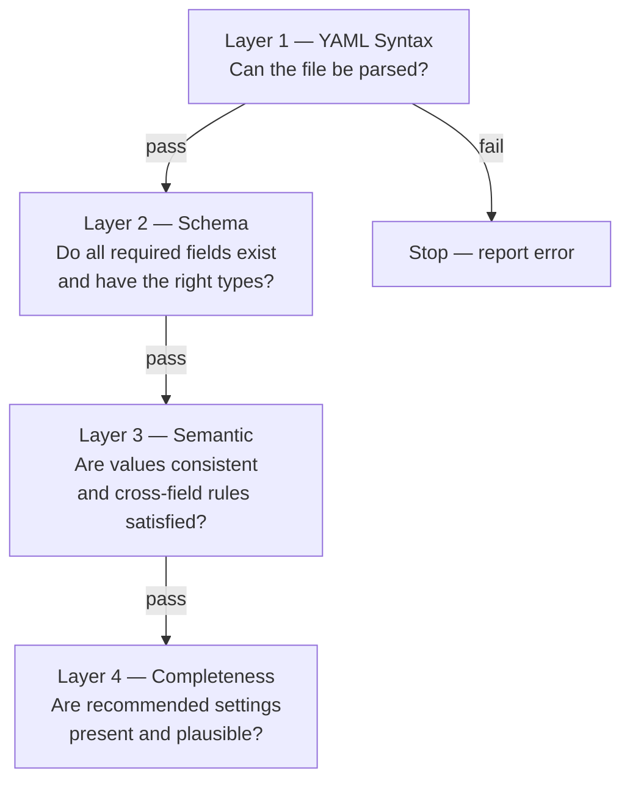

Version: 1.0.0

Date: 2026-06-27

Status: Design and Research Proposal

# EduMatcher — Configuration Verifier (`pm-cverifier`)


## Table of Contents

1. [Motivation](#1-motivation)
2. [Goals and Non-Goals](#2-goals-and-non-goals)
3. [CLI Surface](#3-cli-surface)
4. [Verification Layers](#4-verification-layers)
5. [Check Catalogue](#5-check-catalogue)
6. [Output Format](#6-output-format)
7. [Architecture and Module Design](#7-architecture-and-module-design)
8. [Example Output](#8-example-output)
9. [Implementation Plan](#9-implementation-plan)
10. [Testing Guide](#10-testing-guide)
11. [Acceptance Checklist](#11-acceptance-checklist)


## 1. Motivation

`engine_config.yaml` has grown significantly. It now covers symbols, gateways,
risk controls, collar bands, circuit breakers, market-maker obligations, session
schedules, combo seeds, index definitions, and four optional gateway subsystems
(post-trade, market-data, API gateway, and RALF). Getting all of this right by
hand is error-prone, and the current `load_engine_config()` only reports the
first hard error it encounters before aborting.

The result is that operators spend significant time in a trial-and-error loop:
edit the file, start the engine, read a terse `ValueError`, fix the immediate
problem, repeat. Worse, `load_engine_config()` has no concept of advisory
warnings — a valid config that quietly uses defaults the operator did not
intend is accepted without comment.

`pm-cverifier` is a standalone, read-only tool that inspects a config file
deeply and produces a human-friendly report covering:

- YAML syntax errors
- every semantic hard error that `load_engine_config()` would raise, plus more
- completeness gaps (settings that are missing but probably should be set)
- advisory suggestions for settings that are present but likely to surprise
- a plain-English summary of what risk controls the config actually enables
- an overall OK / WARNING / ERROR verdict

The tool never modifies the file. It only reads and reports.


## 2. Goals and Non-Goals

### 2.1 Goals

- Accept a path to an `engine_config.yaml` and produce a structured, actionable
  report.
- Detect all hard errors that would prevent the engine from starting.
- Detect soft warnings for incomplete or surprising configuration choices.
- Summarise the implied risk posture in plain English so operators can verify
  intent without reading the raw YAML.
- Print a concrete suggestion alongside every error and warning.
- Support a machine-readable JSON output mode for CI pipelines.
- Run in under one second on any realistic config file.

### 2.2 Non-Goals

- The tool does **not** start or connect to the engine.
- The tool does **not** modify the config file.
- The tool does **not** replace `pm-config-gen`; it reviews generated or
  hand-written files after the fact.
- The tool does **not** perform market-data lookups to verify that price seeds
  are realistic.
- The tool does **not** cross-check runtime state (e.g. whether a gateway ID
  already has open orders).


## 3. CLI Surface

```
pm-cverifier [OPTIONS] CONFIG_FILE

Arguments:
  CONFIG_FILE   Path to engine_config.yaml to verify.

Options:
  --format      Output format: text (default), json
  --level       Minimum severity to show: info, warn, error (default: info)
  --no-color    Disable ANSI color in text output
  --strict      Treat warnings as errors for CI exit-code purposes
  --help        Show help and exit
```

Exit codes:

| Code | Meaning |
|------|---------|
| `0` | All checks passed; zero errors and zero warnings |
| `1` | One or more warnings; no errors |
| `2` | One or more hard errors |

With `--strict`, any warning also produces exit code `2`, making it suitable as
a pre-flight check in CI pipelines:

```bash
pm-cverifier --strict --format json engine_config.yaml
```


## 4. Verification Layers

The verifier runs checks in four sequential layers. A hard error in an early
layer may prevent later layers from running (for example, a YAML parse failure
makes semantic checks impossible).



| Layer | Severity | Description |
|-------|----------|-------------|
| 1 — YAML Syntax | ERROR | File missing, unreadable, or not valid YAML |
| 2 — Schema | ERROR | Required keys absent, wrong type, or out-of-range values |
| 3 — Semantic | ERROR or WARN | Cross-field inconsistencies and referential integrity |
| 4 — Completeness | WARN or INFO | Missing-but-recommended settings; default-value notices |


## 5. Check Catalogue

Every check has a short code, a severity, and a message template with a fix
suggestion. The following tables enumerate all planned checks. Message templates
use `{placeholders}` for context-specific values.

### 5.1 Layer 1 — YAML Syntax

| Code | Severity | Condition | Message and suggestion |
|------|----------|-----------|----------------------|
| `Y001` | ERROR | File not found | `File '{path}' not found. Check the path and try again.` |
| `Y002` | ERROR | File is not readable | `Cannot read '{path}': {reason}. Check file permissions.` |
| `Y003` | ERROR | YAML parse error | `YAML parse error at line {line}: {detail}. Fix the indentation or quoting at that line.` |
| `Y004` | ERROR | Top-level is not a mapping | `Config must be a YAML mapping (key: value pairs). Got {type}. Start with 'symbols:' at the top level.` |

### 5.2 Layer 2 — Schema

**Required top-level keys**

| Code | Severity | Condition | Message and suggestion |
|------|----------|-----------|----------------------|
| `S001` | ERROR | `symbols` absent or not a mapping | `'symbols' is required and must be a mapping. Add at least one symbol entry.` |
| `S002` | ERROR | `gateways` absent or not a mapping | `'gateways' is required and must be a mapping containing a 'gateways.alf' list.` |
| `S003` | ERROR | `gateways.alf` absent or not a list | `'gateways.alf' must be a list of gateway entries. See the configuration guide for the required fields.` |
| `S004` | ERROR | `symbols` is empty | `'symbols' contains no entries. Add at least one symbol (e.g. AAPL) with tick_decimals.` |
| `S005` | ERROR | `gateways.alf` is empty | `'gateways.alf' contains no gateway entries. Add at least one gateway with an id and role.` |

**Symbol fields**

| Code | Severity | Condition | Message and suggestion |
|------|----------|-----------|----------------------|
| `S010` | ERROR | `tick_decimals` not an integer in `0..8` | `Symbol '{sym}': tick_decimals must be an integer between 0 and 8. Got '{value}'. Common values are 2 (dollars/cents) or 0 (integer ticks).` |
| `S011` | ERROR | `last_buy_price` or `last_sell_price` not numeric | `Symbol '{sym}': last_buy_price/last_sell_price must be numeric. Got '{value}'. Set to a positive number or omit entirely.` |
| `S012` | ERROR | `outstanding_shares` not a positive integer | `Symbol '{sym}': outstanding_shares must be a positive integer. Got '{value}'. This field is required for index constituents.` |
| `S013` | ERROR | `level` references an undefined risk level | `Symbol '{sym}': level '{level}' is not defined in risk_controls.levels. Defined levels are: {defined}. Either add the level or remove the reference.` |
| `S014` | ERROR | `market_maker_quotes[n]` missing required fields | `Symbol '{sym}': market_maker_quotes[{n}] is missing '{field}'. Each quote seed requires gateway_id, bid_price, ask_price, bid_qty, and ask_qty.` |
| `S015` | ERROR | `market_maker_quotes[n].bid_price >= ask_price` | `Symbol '{sym}': market_maker_quotes[{n}] has bid_price ({bid}) >= ask_price ({ask}). The bid must be strictly less than the ask.` |
| `S016` | ERROR | `market_maker_quotes[n]` has a non-numeric price, a non-positive/non-integer quantity, or an invalid `tif` | `Symbol '{sym}': market_maker_quotes[{n}] is invalid: {detail}. The engine rejects this seed at startup. Quantities must be positive integers, prices numeric, and tif one of DAY or GTC.` |

**Gateway fields**

| Code | Severity | Condition | Message and suggestion |
|------|----------|-----------|----------------------|
| `S020` | ERROR | Gateway entry missing `id` | `gateways.alf[{n}] has no 'id' field. Every gateway must have a unique alphanumeric id.` |
| `S021` | ERROR | Duplicate gateway ID | `Duplicate gateway id '{id}' at gateways.alf[{n}] and gateways.alf[{m}]. Each gateway must have a unique id.` |
| `S022` | ERROR | `role` is not a recognised value | `Gateway '{id}': role '{role}' is not valid. Accepted values: TRADER, MARKET_MAKER, ADMIN.` |
| `S023` | ERROR | `disconnect_behaviour` is not a recognised value | `Gateway '{id}': disconnect_behaviour '{value}' is not valid. Accepted values: CANCEL_ALL, CANCEL_QUOTES_ONLY, LEAVE_ALL.` |

**Circuit breaker fields**

| Code | Severity | Condition | Message and suggestion |
|------|----------|-----------|----------------------|
| `S030` | ERROR | `circuit_breaker_defaults.levels` not a mapping | `'circuit_breaker_defaults.levels' must be a mapping. Each key is a level name (e.g. L1) and each value must have price_shift_pct.` |
| `S031` | ERROR | CB level missing `price_shift_pct` | `circuit_breaker_defaults.levels.{name}: price_shift_pct is required and must be a float in (0, 1).` |
| `S032` | ERROR | `price_shift_pct` out of range | `circuit_breaker_defaults.levels.{name}: price_shift_pct {value} is outside (0, 1). Set a fraction such as 0.07 for 7%.` |
| `S033` | ERROR | `halt_duration_ns` not a positive integer | `circuit_breaker_defaults.levels.{name}: halt_duration_ns must be a positive integer (nanoseconds) or null for rest-of-day. Got '{value}'.` |
| `S034` | ERROR | `resumption_mode` not AUCTION or CONTINUOUS | `circuit_breaker_defaults.levels.{name}: resumption_mode '{value}' is not valid. Use AUCTION or CONTINUOUS.` |
| `S035` | ERROR | `risk_controls.levels.<N>.circuit_breaker` present | `risk_controls.levels.{name}: circuit_breaker is no longer supported here. Move it to the top-level circuit_breaker_defaults section.` |

**Risk controls**

| Code | Severity | Condition | Message and suggestion |
|------|----------|-----------|----------------------|
| `S040` | ERROR | `risk_controls.default_level` references undefined level | `risk_controls.default_level '{level}' is not defined in risk_controls.levels. Add it or change default_level to a name that exists.` |
| `S041` | ERROR | `collar.static_band_pct` not in (0, 1) | `risk_controls.levels.{name}.collar.static_band_pct {value} is outside (0, 1). A typical value is 0.20 (20%).` |
| `S042` | ERROR | `collar.dynamic_band_pct` not in (0, 1) | `risk_controls.levels.{name}.collar.dynamic_band_pct {value} is outside (0, 1). A typical value is 0.02 (2%).` |

### 5.3 Layer 3 — Semantic

| Code | Severity | Condition | Message and suggestion |
|------|----------|-----------|----------------------|
| `M001` | ERROR | MM gateway present but a symbol has no `market_maker_quotes` | `Symbol '{sym}' has no market_maker_quotes entry for MARKET_MAKER gateway '{gw}'. Add a bid/ask seed quote or the engine will reject startup. Run pm-config-gen with --seed-mm to generate placeholder seeds.` |
| `M002` | WARN | MM quote seed references a gateway ID that is not in `gateways.alf` | `Symbol '{sym}': market_maker_quotes gateway_id '{gw}' is not listed in gateways.alf. Either add the gateway or remove the seed entry.` |
| `M003` | WARN | MM quote bid/ask spread wider than the MM obligation `mm_max_spread_ticks` | `Symbol '{sym}': market_maker_quotes[{n}] spread ({spread} ticks) exceeds mm_max_spread_ticks ({limit}). The seed quote would be immediately rejected. Narrow the spread or raise mm_max_spread_ticks.` |
| `M004` | ERROR | `sessions_enabled: true` but no `schedule` section | `sessions_enabled is true but no schedule is defined. The engine will wait indefinitely in CLOSED state. Add a schedule section or set sessions_enabled: false.` |
| `M005` | WARN | `sessions_enabled: false` but a `schedule` section is present | `A schedule section is present but sessions_enabled is false. The schedule will be ignored. Set sessions_enabled: true or remove the schedule section.` |
| `M006` | WARN | Schedule times are not in chronological order | `Schedule times are out of order: {detail}. Expected: pre_open < opening_auction_start < continuous_start < closing_auction_start < closing_auction_end.` |
| `M007` | WARN | `enforce_collars: false` while `risk_controls` defines collars | `enforce_collars is false but risk_controls defines collar levels. Collars are configured but inactive. Set enforce_collars: true to activate them, or remove the risk_controls.levels entries.` |
| `M008` | WARN | `enforce_circuit_breakers: false` while CB levels are defined | `enforce_circuit_breakers is false but circuit_breaker_defaults defines levels. Circuit breakers are configured but inactive. Set enforce_circuit_breakers: true to activate them.` |
| `M009` | ERROR | Index constituent symbol not in `symbols` | `Index '{id}': constituent '{sym}' is not listed in the symbols section. Add '{sym}' to symbols or remove it from the index constituents.` |
| `M010` | WARN | Index constituent missing `outstanding_shares` | `Index '{id}': constituent '{sym}' has no outstanding_shares. This field is required for cap-weighted index calculation. Add outstanding_shares to symbol '{sym}'.` |
| `M011` | ERROR | More than 5 indices defined | `{n} indices are defined but only 5 are supported. Remove {excess} index entries.` |
| `M012` | WARN | `market_maker_combos` uses `tif: GTC` | `market_maker_combos[{n}] uses tif: GTC. On engine restart, GTC combo seeds may collide with persisted orders from a previous session. Use tif: DAY unless you explicitly manage persisted state.` |
| `M013` | WARN | No ADMIN gateway configured | `No gateway has role: ADMIN. Without an admin gateway, halt, resume, kill-switch, and emergency commands cannot be issued at runtime. Add a gateway with role: ADMIN.` |
| `M014` | WARN | CB level thresholds not strictly increasing | `circuit_breaker_defaults levels are not in ascending order of price_shift_pct: {detail}. Reorder the levels from smallest to largest threshold.` |
| `M015` | ERROR | Combo leg references symbol not in `symbols` | `market_maker_combos[{n}].legs[{j}]: symbol '{sym}' is not listed in the symbols section.` |
| `M016` | WARN | `post_trade_gateway` defined but no gateway has `role: ADMIN` to send RALF admin commands | `post_trade_gateway is configured but no ADMIN gateway exists. RALF admin commands (replay, etc.) will be unavailable.` |

### 5.4 Layer 4 — Completeness

| Code | Severity | Condition | Message and suggestion |
|------|----------|-----------|----------------------|
| `C001` | WARN | No symbol has `last_buy_price` or `last_sell_price` | `No symbol has a reference price (last_buy_price / last_sell_price). Price collars, circuit breakers, and MM obligation checks all depend on a reference price. Populate at least one of these per symbol before starting the engine.` |
| `C002` | INFO | Symbol has `last_buy_price` but not `last_sell_price` (or vice versa) | `Symbol '{sym}': only one of last_buy_price / last_sell_price is set. The engine uses whichever is present; consider setting both for a more accurate midpoint reference.` |
| `C003` | INFO | `enforce_collars: true` but no collar is configured for any symbol | `enforce_collars is true but no symbol has an effective collar (no risk_controls levels and no inline collar). All orders will pass the collar check. Add a risk_controls.default_level collar or set enforce_collars: false.` |
| `C004` | INFO | `enforce_circuit_breakers: true` but no CB levels defined anywhere | `enforce_circuit_breakers is true but circuit_breaker_defaults is absent and no symbol defines inline circuit_breaker levels. The built-in defaults (L1=7%, L2=13%, L3=20%) will be used. Explicitly add circuit_breaker_defaults if you want different thresholds.` |
| `C005` | WARN | MARKET_MAKER gateway present but `mm_obligation_defaults` not set | `MARKET_MAKER gateway '{gw}' is configured but mm_obligation_defaults is absent. MM obligations will use built-in defaults (spread=10 ticks, qty=100). Add mm_obligation_defaults if you want to enforce specific spread/quantity requirements.` |
| `C006` | WARN | MM obligation `enforce_mm_obligation: false` | `mm_obligation_defaults.enforce_mm_obligation is false. Market-maker spread and quantity obligations are defined but not enforced. Set enforce_mm_obligation: true to activate enforcement.` |
| `C007` | INFO | `snapshot_interval_sec` is using the default `0.5` | `snapshot_interval_sec is at the default of 0.5 seconds. This is suitable for most deployments. Consider lowering for latency-sensitive setups or raising for high-symbol-count configs.` |
| `C008` | WARN | Symbol is a constituent of an index but has no `last_buy_price` | `Index '{id}' constituent '{sym}' has no reference price. pm-index requires at least one of last_buy_price / last_sell_price to compute the initial index divisor.` |
| `C009` | INFO | `sessions_enabled: false` and no schedule | `sessions_enabled is false and no schedule is configured. The exchange will start in CONTINUOUS state immediately and remain there until the engine is stopped. This is the expected setup for simple or always-on deployments.` |
| `C010` | WARN | Gateway has `disconnect_behaviour: LEAVE_ALL` but is not role ADMIN | `Gateway '{id}' has disconnect_behaviour: LEAVE_ALL but role {role}. LEAVE_ALL is typically reserved for ADMIN gateways. TRADER and MARKET_MAKER gateways usually use CANCEL_ALL or CANCEL_QUOTES_ONLY to prevent stale orders after disconnection.` |
| `C011` | INFO | A risk level is defined but no symbol references it | `risk_controls.levels.{name} is defined but no symbol uses it. If this level is not needed, remove it to keep the config tidy.` |
| `C012` | WARN | More than 20 symbols defined but `snapshot_interval_sec` is below 0.2 | `{n} symbols are defined with snapshot_interval_sec={val}. At high symbol counts, very short snapshot intervals can generate high ZMQ publish rates. Consider raising snapshot_interval_sec to 0.5 or higher.` |
| `C013` | WARN | Index `history_file` or `state_file` path has no parent directory that could be verified to exist | `Index '{id}': history_file path '{path}' is under a directory that may not exist at startup. Create the directory before starting pm-index or use an existing path.` |


## 6. Output Format

### 6.1 Text output (default)

The text report has three parts: the check results, the risk summary, and the
verdict.

```
pm-cverifier engine_config.yaml

✓ YAML syntax: OK
✓ Schema: 0 errors
⚠ Semantic: 1 warning
⚠ Completeness: 2 advisories

────────────────────────────────────────────────────────
Warnings
────────────────────────────────────────────────────────

[M013] WARN  No ADMIN gateway configured
  No gateway has role: ADMIN. Without an admin gateway, halt, resume,
  kill-switch, and emergency commands cannot be issued at runtime.
  → Add a gateway with role: ADMIN to gateways.alf:
      - id: OPS01
        role: ADMIN
        disconnect_behaviour: LEAVE_ALL

────────────────────────────────────────────────────────
Advisories
────────────────────────────────────────────────────────

[C003] INFO  enforce_collars is true but no collar is configured
  enforce_collars is true but no symbol has an effective collar.
  All orders will pass the collar check unchallenged.
  → Add a default collar under risk_controls or set enforce_collars: false.

[C009] INFO  Exchange will start in CONTINUOUS state (no session schedule)
  sessions_enabled is false. The exchange opens immediately in CONTINUOUS
  state and stays there. Expected for simple deployments.
  → No action required unless you want session-based trading phases.

────────────────────────────────────────────────────────
Risk Summary
────────────────────────────────────────────────────────

Symbols          3  (AAPL, MSFT, TSLA)
Gateways         2  (TRADER01: TRADER, MM01: MARKET_MAKER)
Sessions         disabled — always CONTINUOUS
Collars          enabled (enforce_collars: true) — no collar configured ⚠
Circuit breakers enabled (enforce_circuit_breakers: true) — using built-in defaults (L1=7% 5 min, L2=13% 15 min, L3=20% rest-of-day)
MM obligations   not enforced
Admin gateway    none ⚠

────────────────────────────────────────────────────────
Verdict:  ⚠ 1 WARNING, 2 ADVISORIES — engine can start but review warnings
────────────────────────────────────────────────────────
```

### 6.2 JSON output (`--format json`)

```json
{
  "file": "engine_config.yaml",
  "verdict": "WARN",
  "summary": {
    "errors": 0,
    "warnings": 1,
    "info": 2
  },
  "checks": [
    {
      "code": "M013",
      "severity": "WARN",
      "message": "No gateway has role: ADMIN.",
      "suggestion": "Add a gateway with role: ADMIN to gateways.alf.",
      "path": "gateways.alf"
    },
    {
      "code": "C003",
      "severity": "INFO",
      "message": "enforce_collars is true but no collar is configured for any symbol.",
      "suggestion": "Add a default collar under risk_controls or set enforce_collars: false.",
      "path": "risk_controls"
    }
  ],
  "risk_summary": {
    "symbols": ["AAPL", "MSFT", "TSLA"],
    "gateways": {"TRADER01": "TRADER", "MM01": "MARKET_MAKER"},
    "sessions_enabled": false,
    "collars_enforced": true,
    "collars_configured": false,
    "circuit_breakers_enforced": true,
    "circuit_breakers_using_defaults": true,
    "mm_obligations_enforced": false,
    "admin_gateway": null
  }
}
```

### 6.3 Message quality rules

Every check must produce a message that:

1. States the problem in one sentence, mentioning the exact field path.
2. Gives the actual value that caused the problem (where applicable).
3. States a concrete fix — a YAML snippet where the fix is non-obvious.

For errors: the message must answer "what is wrong and exactly how do I fix it?"
For warnings: the message must answer "what might go wrong and what should I verify?"
For info: the message must answer "what should I confirm was intentional?"


## 7. Architecture and Module Design

```
src/edumatcher/
    cverifier/
        __init__.py
        cli.py              Entry point: parse args, run layers, format output
        models.py           CheckResult, VerificationReport, RiskSummary dataclasses
        layer1_yaml.py      YAML syntax and top-level type check
        layer2_schema.py    Required fields and type validation
        layer3_semantic.py  Cross-field consistency checks
        layer4_complete.py  Completeness and advisory checks
        risk_summary.py     Build the plain-English risk summary from EngineConfig
        formatter.py        Text and JSON output formatters
```

### 7.1 Core data types

```python
from dataclasses import dataclass, field
from enum import Enum
from typing import Any

class Severity(str, Enum):
    ERROR = "ERROR"
    WARN  = "WARN"
    INFO  = "INFO"

@dataclass
class CheckResult:
    code:       str
    severity:   Severity
    message:    str           # plain statement of the problem
    suggestion: str           # concrete fix, may include a YAML snippet
    path:       str = ""      # dotted YAML path, e.g. "symbols.AAPL.collar"
    context:    dict[str, Any] = field(default_factory=dict)  # for JSON output

@dataclass
class VerificationReport:
    file:     str
    results:  list[CheckResult]
    summary:  dict[str, int]          # {"errors": n, "warnings": n, "info": n}
    risk_summary: "RiskSummary"
    verdict:  str                     # "OK", "WARN", "ERROR"
```

### 7.2 Layer interface

Each layer module exposes a single function:

```python
def check(raw: dict | None, path: Path) -> list[CheckResult]:
    ...
```

Layer 1 also accepts `None` for `raw` (file-not-found case). Layers 2, 3, and 4
receive the fully parsed `raw` dict. Layers 3 and 4 additionally receive the
`EngineConfig` object produced by `load_engine_config()`, so they can use the
already-validated and typed data rather than re-parsing raw YAML.

### 7.3 Integration with `load_engine_config()`

Layer 2 re-implements a strict subset of the validation inside `load_engine_config()`.
Rather than catching the `ValueError` from `load_engine_config()` and reporting it
as a single opaque error, the verifier runs its own field-by-field checks so every
problem in the file is reported independently, not just the first one encountered.

Once Layer 2 reports zero errors, Layer 3 calls `load_engine_config()` to obtain
the typed `EngineConfig` and uses it for cross-field checks without duplicating
parsing logic.

### 7.4 Entry point registration

```toml
# pyproject.toml
[tool.poetry.scripts]
pm-cverifier = "edumatcher.cverifier.cli:main"
```


## 8. Example Output

### 8.1 Clean config

```
pm-cverifier engine_config.yaml

✓ YAML syntax: OK
✓ Schema: 0 errors
✓ Semantic: 0 warnings
✓ Completeness: 0 advisories

────────────────────────────────────────────────────────
Risk Summary
────────────────────────────────────────────────────────

Symbols          3  (AAPL, MSFT, TSLA)
Gateways         3  (TRADER01: TRADER, MM01: MARKET_MAKER, OPS01: ADMIN)
Sessions         enabled — pre-open 09:00, continuous 09:30, close 16:05
Collars          enabled — DEFAULT level: static=20%, dynamic=2%
Circuit breakers enabled — L1=7% (5 min), L2=13% (15 min), L3=20% (rest-of-day)
MM obligations   enforced — spread ≤ 20 ticks, qty ≥ 100
Indices          1  (EDU100: AAPL, MSFT, TSLA)

────────────────────────────────────────────────────────
Verdict:  ✓ OK — no issues found
────────────────────────────────────────────────────────
```

### 8.2 Config with errors

```
pm-cverifier bad_config.yaml

✗ YAML syntax: OK
✗ Schema: 2 errors
  Semantic: skipped (fix schema errors first)
  Completeness: skipped (fix schema errors first)

────────────────────────────────────────────────────────
Errors
────────────────────────────────────────────────────────

[S013] ERROR  Symbol 'TSLA' references undefined risk level 'STRICT'
  Symbol 'TSLA': level 'STRICT' is not defined in risk_controls.levels.
  Defined levels are: DEFAULT, RELAXED.
  → Either define the level in risk_controls.levels:
      risk_controls:
        levels:
          STRICT:
            collar:
              static_band_pct: 0.12
              dynamic_band_pct: 0.01
  → Or change the symbol's level to an existing one:
      symbols:
        TSLA:
          level: DEFAULT

[S015] ERROR  Symbol 'AAPL': bid_price >= ask_price in market_maker_quotes[0]
  bid_price 155.00 is not less than ask_price 154.50.
  The bid must always be strictly below the ask.
  → Swap the values or correct the prices:
      symbols:
        AAPL:
          market_maker_quotes:
            - gateway_id: MM01
              bid_price: 154.50
              ask_price: 155.00

────────────────────────────────────────────────────────
Verdict:  ✗ 2 ERRORS — engine will not start
────────────────────────────────────────────────────────
```


## 9. Implementation Plan

| Step | Task | Files |
|------|------|-------|
| 1 | Create `cverifier/` package with `models.py` and empty layer stubs | `src/edumatcher/cverifier/` |
| 2 | Implement `layer1_yaml.py` (Y001–Y004) | `layer1_yaml.py` |
| 3 | Implement `layer2_schema.py` (S001–S042) | `layer2_schema.py` |
| 4 | Implement `layer3_semantic.py` (M001–M016) | `layer3_semantic.py` |
| 5 | Implement `layer4_complete.py` (C001–C013) | `layer4_complete.py` |
| 6 | Implement `risk_summary.py` | `risk_summary.py` |
| 7 | Implement `formatter.py` (text and JSON) | `formatter.py` |
| 8 | Implement `cli.py` and wire entry point | `cli.py`, `pyproject.toml` |
| 9 | Write tests (see Section 10) | `tests/test_cverifier.py` |


## 10. Testing Guide

### 10.1 Unit tests per layer

Each layer module should have dedicated tests using small YAML strings or dicts
as inputs.  No file I/O is needed for Layer 2 onward.

```python
def test_s013_undefined_risk_level():
    raw = {
        "symbols": {"TSLA": {"level": "STRICT", "tick_decimals": 2}},
        "gateways": {"alf": [{"id": "GW01", "role": "TRADER"}]},
        "risk_controls": {"levels": {"DEFAULT": {}}},
    }
    results = layer2_schema.check(raw, Path("fake.yaml"))
    codes = [r.code for r in results]
    assert "S013" in codes
```

### 10.2 Integration tests

Integration tests use fixture YAML files in `tests/fixtures/cverifier/` and verify
the full pipeline from file path to `VerificationReport`:

| Fixture file | Expected verdict | Key checks triggered |
|--------------|-----------------|----------------------|
| `clean.yaml` | OK | No findings |
| `no_admin_gw.yaml` | WARN | M013 |
| `undefined_level.yaml` | ERROR | S013 |
| `bid_gte_ask.yaml` | ERROR | S015 |
| `sessions_no_schedule.yaml` | ERROR | M004 |
| `collars_not_enforced.yaml` | WARN | M007 |
| `mm_gw_no_seeds.yaml` | ERROR | M001 |
| `index_missing_symbol.yaml` | ERROR | M009 |
| `index_no_shares.yaml` | WARN | M010 |

### 10.3 Exit-code tests

Use `subprocess.run` to verify correct exit codes for clean, warning, and error
configs, and for `--strict` mode.


## 11. Acceptance Checklist

- [ ] `pm-cverifier path/to/engine_config.yaml` produces a readable text report
- [ ] Every finding includes both a message and a concrete suggestion
- [ ] A config that passes `load_engine_config()` without error receives at most warnings
- [ ] A config that fails `load_engine_config()` always gets at least one ERROR
- [ ] Exit codes 0 / 1 / 2 are correct for clean / warn / error configs
- [ ] `--strict` causes exit code 2 on any warning
- [ ] `--format json` output parses as valid JSON
- [ ] `--level error` suppresses INFO and WARN output
- [ ] Risk Summary is always printed even when findings exist
- [ ] All checks in Section 5 are implemented
- [ ] Test coverage ≥ 90% for the `cverifier` package
