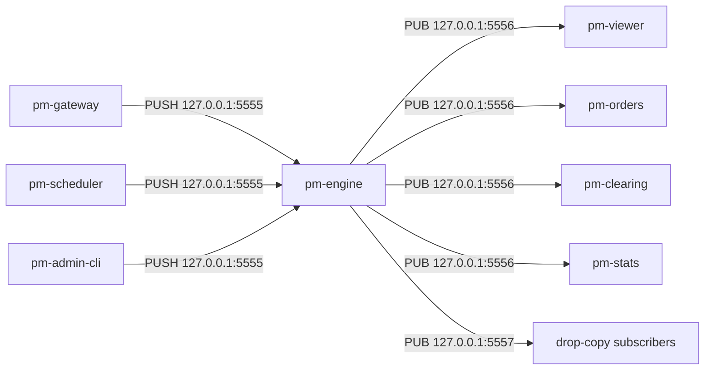
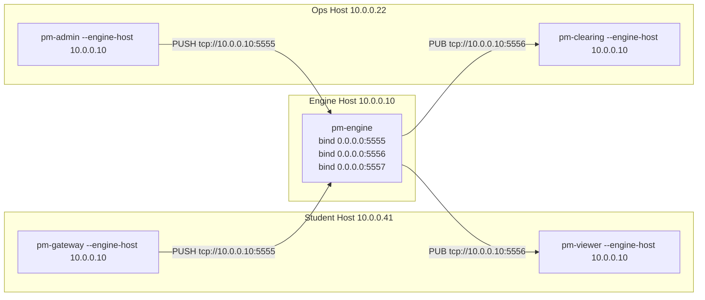

Version: 1.0.0

Date: 2026-06-14

Status: Design and Research Proposal

# EduMatcher — Cross-Host Process Connection Design


## Table of Contents

1. [Overview](#1-overview)
2. [Problem Statement](#2-problem-statement)
3. [Goals and Non-Goals](#3-goals-and-non-goals)
4. [Current State](#4-current-state)
5. [Design Summary](#5-design-summary)
6. [Configuration Model](#6-configuration-model)
7. [Socket and Message-Flow Impact](#7-socket-and-message-flow-impact)
8. [CLI and Runtime Changes](#8-cli-and-runtime-changes)
9. [Implementation Plan](#9-implementation-plan)
10. [Network Troubleshooting Guide](#10-network-troubleshooting-guide)
11. [Migration and Backward Compatibility](#11-migration-and-backward-compatibility)
12. [Testing Plan](#12-testing-plan)
13. [Open Questions](#13-open-questions)
14. [Acceptance Checklist](#14-acceptance-checklist)


## 1. Overview

EduMatcher currently assumes single-machine deployment: all processes connect to
`127.0.0.1` via ZeroMQ (`PUSH/PULL` and `PUB/SUB`). This design adds an optional
cross-host mode that allows gateways, viewers, scheduler, admin tools, and other
subscribers to run on different machines than `pm-engine`.

The default behavior remains unchanged:

- If no explicit network configuration is provided, the system stays localhost-only.
- Existing demos and tests continue to work without changes.

The design also adds step-by-step network troubleshooting guidance because host/IP
misconfiguration is the most common source of beginner setup failures.


## 2. Problem Statement

Current constants are loopback-bound:

- Engine inbound (PULL): `tcp://127.0.0.1:5555`
- Engine outbound (PUB): `tcp://127.0.0.1:5556`
- Drop-copy outbound (PUB): `tcp://127.0.0.1:5557`

This prevents remote machines from connecting to the engine, even when all
participants are on the same LAN. In classroom and lab setups this leads to:

1. Need to run every process on a single host.
2. Inability for students to use their own workstations as gateways/viewers.
3. Confusion about what address should be used when moving beyond localhost.


## 3. Goals and Non-Goals

### 3.1 Goals

- Allow EduMatcher processes to connect across hosts over TCP.
- Keep localhost-only behavior as the zero-config default.
- Make engine bind addresses configurable.
- Make client connect addresses configurable per process invocation.
- Support all existing channels, including drop-copy PUB.
- Provide practical troubleshooting procedures for common network mistakes.
- Support simple binding to the machine's primary assigned IP.

### 3.2 Non-Goals

- Security hardening (TLS, auth, network ACLs) is out of scope for this phase.
- Firewall policy design is out of scope (assume all firewalls are open).
- Changing protocol payloads/topics is out of scope.
- Replacing ZeroMQ is out of scope.


## 4. Current State

Current topology is fixed to localhost:



All messaging is TCP unicast over ZeroMQ socket connections. There is no UDP
broadcast/multicast layer in the current implementation.


## 5. Design Summary

### 5.1 Key idea

Split endpoint configuration into:

- **Engine bind endpoints** (what `pm-engine` binds)
- **Client connect endpoints** (what all other processes connect to)

### 5.2 Default behavior

Defaults remain localhost:

- `ENGINE_BIND_HOST = 127.0.0.1`
- `ENGINE_PULL_PORT = 5555`
- `ENGINE_PUB_PORT = 5556`
- `DROP_COPY_PUB_PORT = 5557`

If users do nothing, nothing changes.

### 5.3 Cross-host behavior

To enable cross-host mode:

- Start engine with bind host `0.0.0.0` or a specific NIC IP.
- Start other processes with `--engine-host <engine-ip-or-dns>`.

For convenience, support `--engine-host primary` to auto-resolve the machine's
primary assigned IP when starting the engine.


## 6. Configuration Model

### 6.1 Environment variables

Add optional variables (all optional):

| Variable | Applies to | Default | Description |
|---|---|---|---|
| `EDUMATCHER_ENGINE_BIND_HOST` | engine | `127.0.0.1` | Host/IP to bind engine sockets |
| `EDUMATCHER_ENGINE_HOST` | clients | `127.0.0.1` | Host/IP clients connect to |
| `EDUMATCHER_ENGINE_PULL_PORT` | all | `5555` | Command ingress port |
| `EDUMATCHER_ENGINE_PUB_PORT` | all | `5556` | Main event pub port |
| `EDUMATCHER_DROP_COPY_PUB_PORT` | all | `5557` | Drop-copy pub port |

Priority order for each process:

1. CLI flag
2. Environment variable
3. Existing default constant (localhost setup)

### 6.2 Engine config YAML extension (optional)

Optional new section in `engine_config.yaml`:

```yaml
network:
  bind_host: 127.0.0.1
  pull_port: 5555
  pub_port: 5556
  drop_copy_pub_port: 5557
```

This section is optional. If absent, defaults apply.

CLI/env still override YAML values.

### 6.3 Primary IP convenience

Support special value `primary` for bind host in engine CLI:

```bash
pm-engine --bind-host primary
```

Resolution algorithm:

1. Open a temporary UDP socket to `8.8.8.8:80` (no packets sent)
2. Read local socket address from `getsockname()`
3. Use that IP as bind host
4. Fallback to `127.0.0.1` if resolution fails

This supports quick classroom setup where instructors do not want to manually
inspect NIC addresses.


## 7. Socket and Message-Flow Impact

### 7.1 Socket map remains unchanged

No new ZeroMQ patterns are introduced. Existing channels remain:

| Flow | Pattern | Topic scope |
|---|---|---|
| Client commands to engine | PUSH -> PULL | command topics (`order.new`, `session.transition`, etc.) |
| Engine events to subscribers | PUB -> SUB | broad topics (`trade.executed`, `book.*`, `order.*`) |
| Drop-copy | PUB -> SUB | drop-copy stream (fill/compliance topics) |

### 7.2 Broadcast concern analysis

Question: "Do we have any broadcast messages to worry about?"

Answer:

- **Application-level broadcast exists** via ZeroMQ PUB/SUB topics (engine publishes
  one event, many subscribers receive).
- **Network-level broadcast (UDP broadcast / multicast) does not exist** in current
  design and is not introduced by this change.

Implication: no additional handling for LAN broadcast domains is required.

### 7.3 Cross-host topology




## 8. CLI and Runtime Changes

### 8.1 Engine (`pm-engine`)

Add flags:

- `--bind-host <HOST|IP|primary>`
- `--pull-port <INT>`
- `--pub-port <INT>`
- `--drop-copy-port <INT>`

Examples:

```bash
# Default localhost behavior
pm-engine

# Bind all interfaces for cross-host clients
pm-engine --bind-host 0.0.0.0

# Bind to machine primary IP automatically
pm-engine --bind-host primary

# Custom ports
pm-engine --bind-host 0.0.0.0 --pull-port 6000 --pub-port 6001 --drop-copy-port 6002
```

### 8.2 Client processes

Add shared flags to all connect-side processes (`pm-gateway`, `pm-viewer`,
`pm-orders`, `pm-audit`, `pm-clearing`, `pm-stats`, `pm-scheduler`, `pm-admin`,
`pm-admin-cli`, `pm-ai-trader`, `pm-ai-swarm`):

- `--engine-host <HOST|IP>`
- `--pull-port <INT>` (for PUSH clients)
- `--pub-port <INT>` (for SUB clients)
- `--drop-copy-port <INT>` (for drop-copy consumers if any)

Examples:

```bash
pm-gateway --id ST01 --engine-host 10.0.0.10
pm-viewer --symbol AAPL --engine-host 10.0.0.10
pm-scheduler --engine-host 10.0.0.10
pm-admin --id OPS01 --engine-host 10.0.0.10
```

### 8.3 Shared endpoint builder

Refactor endpoint construction into one helper module to avoid drift:

- `build_pull_addr(host, port) -> tcp://host:port`
- `build_pub_addr(host, port) -> tcp://host:port`
- `resolve_engine_bind_host(cli, env, yaml, default) -> host`
- `resolve_engine_connect_host(cli, env, default) -> host`


## 9. Implementation Plan

### Phase 1 — Endpoint configuration primitives

1. Extend `src/edumatcher/config.py` with host/port env parsing.
2. Keep existing defaults exactly (`127.0.0.1`, `5555`, `5556`, `5557`).
3. Add utility to format endpoint strings from host+port.

### Phase 2 — Engine bind options

1. Add new engine CLI flags.
2. Integrate optional YAML `network:` parsing in config loader.
3. Apply bind host/ports at socket bind points.
4. Log effective endpoints on startup.

### Phase 3 — Client connect options

1. Add `--engine-host` and relevant port flags process-by-process.
2. Replace hardcoded endpoint constants with resolved connect addresses.
3. Preserve old behavior when flags/env are absent.

### Phase 4 — Tooling and docs

1. Update `tools/launch_all.sh` to optionally accept `--engine-host`.
2. Add cross-host examples to user guide pages:
   - Getting Started
   - Running the Engine
   - Processes
   - FAQ
3. Add troubleshooting runbook (section 10 below).

### Phase 5 — Validation

1. Unit tests for endpoint resolution precedence.
2. Integration test with localhost defaults.
3. Integration test with engine on host A and gateway on host B.
4. Integration test for drop-copy subscriber on host C.


## 10. Network Troubleshooting Guide

This section is intentionally detailed for beginners.

### 10.1 Baseline assumptions

- Engine host IP: `10.0.0.10`
- Client host IP: `10.0.0.41`
- Ports: `5555`, `5556`, `5557`
- Firewalls open (as assumed by this design)

### 10.2 Step-by-step checks

#### Step 1 — Verify engine bind endpoint

On engine host:

```bash
pm-engine --bind-host 0.0.0.0 --verbose
```

Expected startup logs should print effective endpoints, e.g.:

```text
[ENGINE] Listening on PULL=tcp://0.0.0.0:5555  PUB=tcp://0.0.0.0:5556
[ENGINE] Drop copy PUB bound on tcp://0.0.0.0:5557
```

If it prints `127.0.0.1`, remote clients cannot connect.

#### Step 2 — Verify engine has a reachable IP

On engine host:

```bash
hostname -I  # Linux
ipconfig getifaddr en0  # macOS common case
```

Pick the LAN IP (example `10.0.0.10`) and use that in all client commands.

#### Step 3 — Verify TCP listeners exist

On engine host:

```bash
lsof -i :5555 -i :5556 -i :5557
```

You should see `pm-engine` listening on all configured ports.

#### Step 4 — Verify raw connectivity from client host

On client host:

```bash
nc -vz 10.0.0.10 5555
nc -vz 10.0.0.10 5556
nc -vz 10.0.0.10 5557
```

If these fail, the issue is network-level pathing/address selection (not EduMatcher logic).

#### Step 5 — Start one minimal remote client

On client host:

```bash
pm-gateway --id ST01 --engine-host 10.0.0.10
```

Expected: authentication ACK and prompt.

If it times out, check:

1. Gateway ID exists in engine allowlist.
2. Engine bind host is not `127.0.0.1`.
3. `--engine-host` points to the same IP the engine host reports.

#### Step 6 — Validate PUB/SUB path

On client host:

```bash
pm-audit --terminal --engine-host 10.0.0.10
```

Then submit an order from remote gateway. If gateway can send but audit sees no
messages, likely PUB endpoint mismatch (wrong host/port for SUB side).

### 10.3 Common failure patterns

| Symptom | Likely cause | Fix |
|---|---|---|
| Gateway auth timeout | Engine bound to `127.0.0.1` | Start engine with `--bind-host 0.0.0.0` or specific LAN IP |
| Viewer connects but sees no updates | Wrong `--pub-port` or wrong host on SUB side | Match viewer `--engine-host/--pub-port` to engine startup logs |
| Scheduler seems to do nothing | Scheduler PUSH path points to wrong host/port | Set scheduler `--engine-host` and verify `nc -vz host pull_port` |
| Only local clients work | Mixed localhost and LAN addresses in process startup scripts | Normalize all clients to same `--engine-host` value |
| Intermittent issue after IP change | Engine host got a new DHCP IP | Use DNS name or restart clients with updated IP |

### 10.4 Recommended operator checklist

1. Start engine and copy effective endpoint log lines.
2. Confirm engine LAN IP.
3. Verify listeners with `lsof`.
4. Verify client `nc` reachability.
5. Start one gateway only, verify auth.
6. Start one subscriber only (`pm-audit --terminal`) and verify event flow.
7. Scale out remaining processes.


## 11. Migration and Backward Compatibility

### 11.1 Backward compatibility policy

This design is fully backward-compatible for runtime behavior:

- Existing localhost scripts continue unchanged.
- Existing defaults are preserved.
- New flags/env/YAML are optional.

### 11.2 Rollout strategy

1. Merge code with defaults unchanged.
2. Add docs and examples.
3. Add one explicit cross-host integration test job.
4. Adopt cross-host mode in instructor guides optionally.


## 12. Testing Plan

### 12.1 Unit tests

- Env precedence (`CLI > ENV > YAML > default` where applicable).
- `primary` host resolution success and fallback behavior.
- Endpoint string construction for custom ports.

### 12.2 Integration tests

- Local default: no flags, all localhost.
- Engine bind `0.0.0.0`, clients connect by LAN IP.
- PUB/SUB validation: viewer and audit receive expected messages.
- Drop-copy subscriber on remote host receives fill topics.

### 12.3 Manual test matrix

| Engine bind | Client host target | Expected |
|---|---|---|
| `127.0.0.1` | `127.0.0.1` | Works |
| `127.0.0.1` | LAN IP | Fails (by design) |
| `0.0.0.0` | Engine LAN IP | Works |
| Specific LAN IP | Same LAN IP | Works |


## 13. Open Questions

1. Should engine publish its resolved endpoints into a `system.network` topic so clients can validate configuration at runtime?
2. Should `tools/launch_all.sh` support `--engine-host` and `--bind-host` directly, or rely on environment variables only?
3. Should we add a small `pm-netcheck` utility that automates steps 2–6 in the troubleshooting runbook?


## 14. Acceptance Checklist

- [ ] Engine can bind to non-localhost host/IP by CLI/env/YAML.
- [ ] All client processes can target a non-localhost engine host by CLI/env.
- [ ] Localhost default behavior remains unchanged with no new config.
- [ ] Drop-copy PUB path works cross-host.
- [ ] Documentation includes step-by-step network troubleshooting.
- [ ] User guide and FAQ include cross-host examples.
- [ ] Automated tests cover both default and cross-host configurations.
