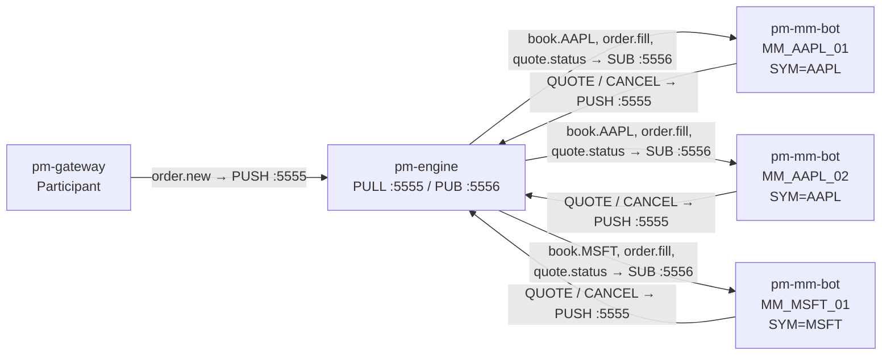
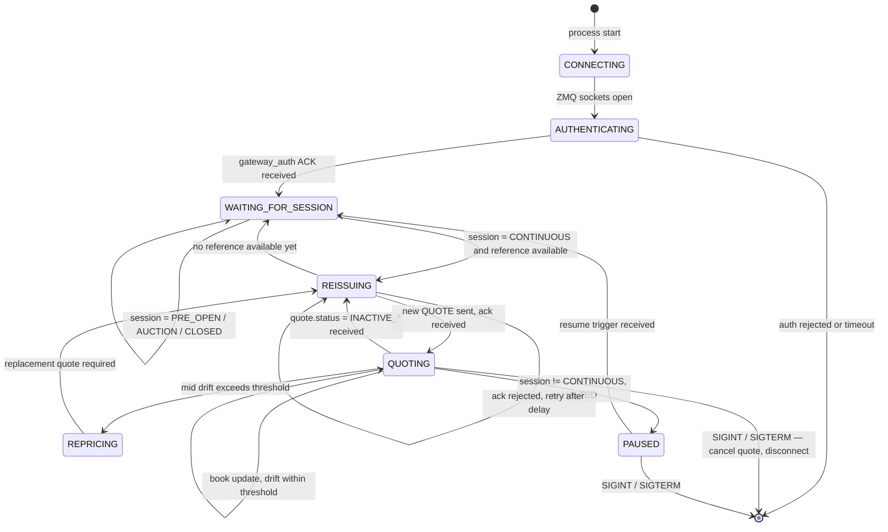
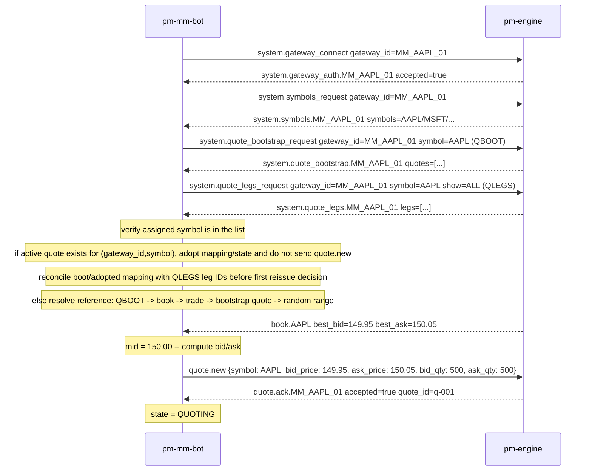
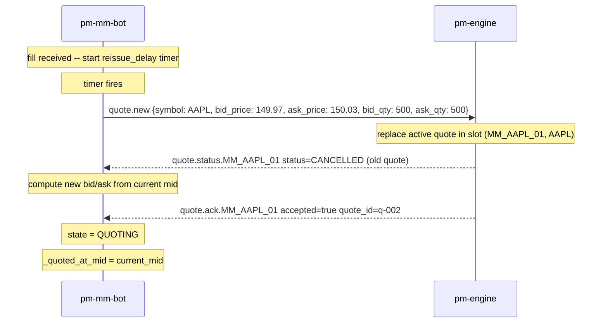
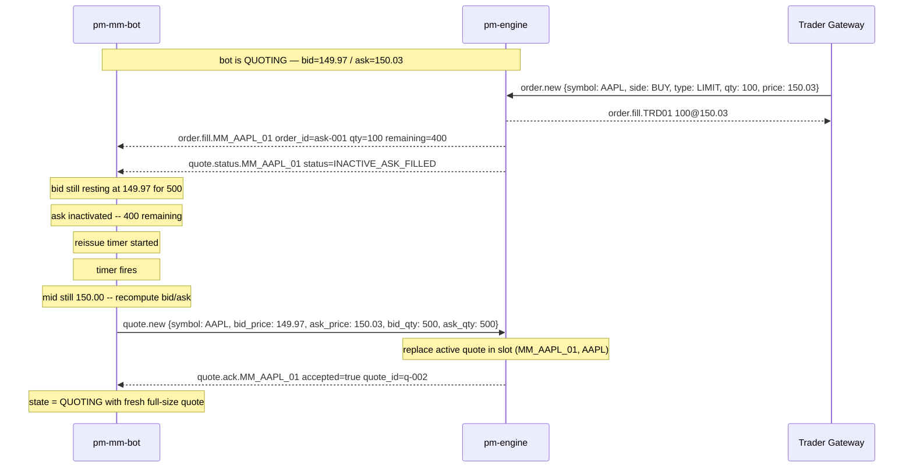
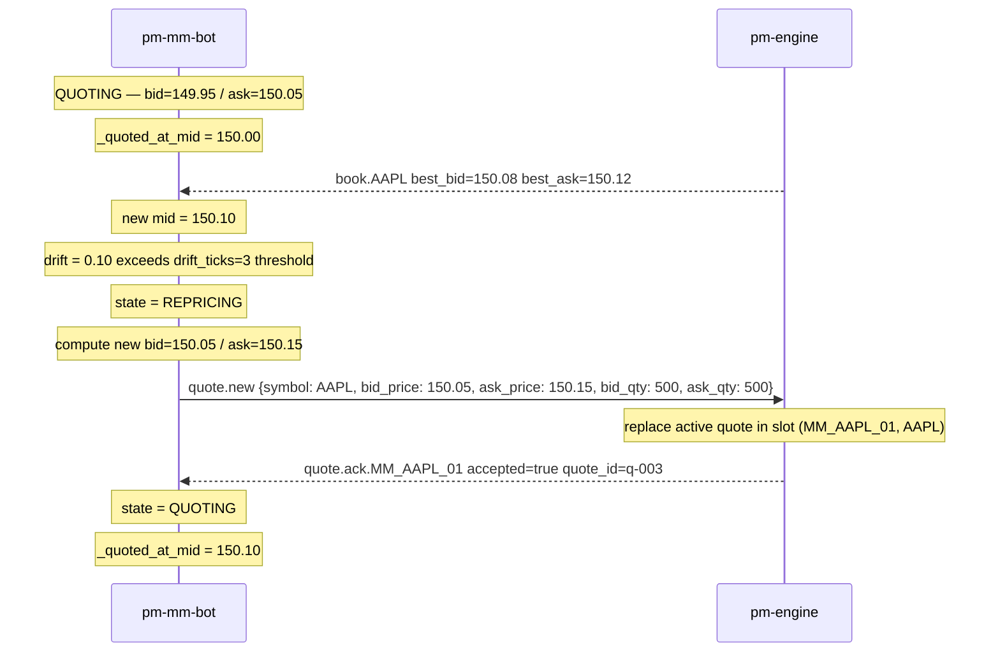

Version: 1.1.0

Date: 2026-06-18

Status: Design Proposal

# EduMatcher — Market-Maker Bot (pm-mm-bot)


## Table of Contents

- [EduMatcher — Market-Maker Bot (pm-mm-bot)](#edumatcher--market-maker-bot-pm-mm-bot)
  - [Table of Contents](#table-of-contents)
  - [1. Motivation](#1-motivation)
    - [1.1 Scope Statement](#11-scope-statement)
  - [2. Financial Concepts Primer](#2-financial-concepts-primer)
  - [3. Architecture Overview](#3-architecture-overview)
    - [3.1 ZMQ Topics Subscribed](#31-zmq-topics-subscribed)
  - [4. Bot Lifecycle and State Machine](#4-bot-lifecycle-and-state-machine)
    - [4.1 State Descriptions](#41-state-descriptions)
    - [4.2 Startup Sequence](#42-startup-sequence)
    - [4.3 Graceful Shutdown](#43-graceful-shutdown)
  - [5. Price Reference and Quote Placement](#5-price-reference-and-quote-placement)
    - [5.1 Mid-Price Tracking](#51-mid-price-tracking)
    - [5.2 Quote Price Calculation](#52-quote-price-calculation)
    - [5.3 Drift Detection](#53-drift-detection)
    - [5.4 Quantity Policy](#54-quantity-policy)
    - [5.5 Bootstrap Reference for Empty Book](#55-bootstrap-reference-for-empty-book)
  - [6. Quote Refresh Logic](#6-quote-refresh-logic)
    - [6.1 Refresh Triggers](#61-refresh-triggers)
    - [6.2 Reissue Delay](#62-reissue-delay)
    - [6.3 Cancel Before Reissue](#63-cancel-before-reissue)
    - [6.4 Heartbeat Guard](#64-heartbeat-guard)
  - [7. Session State Handling](#7-session-state-handling)
    - [7.1 Allowed Quoting States](#71-allowed-quoting-states)
    - [7.2 Transition to CONTINUOUS](#72-transition-to-continuous)
    - [7.3 Quote Cancellation on Auction Entry](#73-quote-cancellation-on-auction-entry)
    - [7.4 Circuit Breaker Halt](#74-circuit-breaker-halt)
  - [8. Entry Point and CLI Reference](#8-entry-point-and-cli-reference)
    - [8.1 Entry Point](#81-entry-point)
    - [8.2 Basic Usage](#82-basic-usage)
    - [8.3 CLI Arguments](#83-cli-arguments)
    - [8.4 Gap Guidelines](#84-gap-guidelines)
  - [9. Gateway Identity and Configuration](#9-gateway-identity-and-configuration)
    - [9.1 Gateway ID Convention](#91-gateway-id-convention)
    - [9.2 Required engine\_config.yaml Entries](#92-required-engine_configyaml-entries)
    - [9.3 Recommended disconnect\_behaviour](#93-recommended-disconnect_behaviour)
  - [10. ZMQ Message Flow](#10-zmq-message-flow)
    - [10.1 Messages Sent by the Bot (PUSH → Engine)](#101-messages-sent-by-the-bot-push--engine)
    - [10.2 Messages Received by the Bot (SUB ← Engine)](#102-messages-received-by-the-bot-sub--engine)
    - [10.3 Full Normal Trading Cycle](#103-full-normal-trading-cycle)
    - [10.4 Mid-Price Drift Reprice](#104-mid-price-drift-reprice)
  - [11. New Files and Changes to Existing Files](#11-new-files-and-changes-to-existing-files)
    - [11.1 New Files](#111-new-files)
    - [11.2 Changes to Existing Files](#112-changes-to-existing-files)
    - [11.3 Module Responsibilities](#113-module-responsibilities)
      - [`mm_bot/main.py`](#mm_botmainpy)
      - [`mm_bot/bot.py`](#mm_botbotpy)
      - [`mm_bot/pricer.py`](#mm_botpricerpy)
  - [12. Configuration Reference](#12-configuration-reference)
    - [12.1 Full YAML Example](#121-full-yaml-example)
    - [12.2 Bot Launch Reference](#122-bot-launch-reference)
    - [12.3 Parameter Quick Reference](#123-parameter-quick-reference)
  - [13. Testing Guide](#13-testing-guide)
    - [13.1 Unit Tests — `QuotePricer`](#131-unit-tests--quotepricer)
    - [13.2 Integration Tests — `MMBot`](#132-integration-tests--mmbot)
    - [13.3 Running Tests](#133-running-tests)
  - [14. Open Questions and Future Work](#14-open-questions-and-future-work)
    - [14.1 Inventory Skewing](#141-inventory-skewing)
    - [14.2 Volatility-Adaptive Spread](#142-volatility-adaptive-spread)
    - [14.3 Multi-Symbol Mode](#143-multi-symbol-mode)
    - [14.4 Config-File Mode](#144-config-file-mode)
    - [14.5 Coordination Between MM Instances](#145-coordination-between-mm-instances)
    - [14.6 Metrics and Observability](#146-metrics-and-observability)


## 1. Motivation

EduMatcher already models market-maker quoting through the `QUOTE` command and
the `MARKET_MAKER` gateway role. However, using this capability today requires a
human operator to type `QUOTE` commands at the gateway terminal and manually
react to fill events. This is impractical for a classroom session where:

- The instructor wants the book to always have two-sided liquidity.
- Students should be able to trade immediately without waiting for a human MM.
- The spread and quote sizes should stay disciplined and predictable.
- When a quote side is hit, the remaining half must be cancelled and a fresh
  two-sided quote re-issued promptly.

`pm-mm-bot` is an autonomous market-maker bot that runs as a dedicated process
for one symbol. Multiple instances can run simultaneously — one per symbol, or
several competing MMs on the same symbol. Each instance connects to the engine
as a `MARKET_MAKER` gateway using the naming convention `MM_<SYMBOL>_<nn>`.

The bot's sole responsibility is to keep its assigned symbol liquid: it watches
the book, tracks the current mid-price, posts a two-sided `QUOTE`, detects when
either leg is partially or fully filled, cancels any stale remnant, and re-issues
a fresh quote aligned to the updated mid-price.

### 1.1 Scope Statement

**pm-mm-bot v1 covers:**

- Single-symbol market-making per process instance.
- Quote placement at configurable spread around the current mid-price.
- Automatic cancellation of partially filled or fully consumed quote legs.
- Re-quoting after fills, mid-price drift, and session state transitions.
- Respect for session states: only active quoting during `CONTINUOUS`.
- Optional obligation enforcement via `--gap` and `--qty` CLI flags.
- Multiple independent instances on the same symbol (competing MMs).

**pm-mm-bot v1 intentionally excludes:**

- Inventory hedging or position limits beyond a configurable cap.
- Skewing bid/ask based on position (asymmetric quoting).
- Multi-symbol quoting from a single process instance.
- P&L tracking or reporting.
- MMP (Market Maker Protection) — this is enforced server-side.


## 2. Financial Concepts Primer

These concepts are essential for understanding the bot's design decisions.

**Market maker (MM)** — A participant who continuously posts a two-sided price
for an instrument: a price at which they will buy (bid) and a price at which they
will sell (ask). The MM earns the spread over many transactions, compensating for
the risk of holding inventory. Without MMs, buyers and sellers must find each
other organically, which can mean long waits with no price to trade at.

**Two-sided quote** — A simultaneous bid and ask submitted as a linked pair.
In EduMatcher this is the `QUOTE` command. Both legs are regular `LIMIT` orders
in the order book, tagged as a pair so the engine can manage their lifecycle
together (inactivation, status messages, cancel-on-disconnect).

**Spread** — The difference between the ask price and the bid price. For a quote
with `BID=149.95` and `ASK=150.05`, the spread is `$0.10`. The MM collects the
spread when both sides are filled by different counterparties. This document calls
the total spread value the **gap**.

**Half-gap** — Spread / 2. If `gap = 0.10`, the MM places the bid at
`mid - 0.05` and the ask at `mid + 0.05`.

**Mid-price** — `(best_bid + best_ask) / 2`. The MM uses this as the neutral
reference price around which both sides of the quote are placed symmetrically.

**Tick** — The minimum price increment for a symbol (e.g. `0.01` for most
equities). Bid and ask prices must always be rounded to the nearest tick. The
gap must be at least two ticks wide so bid < ask after rounding.

**Quote inactivation** — When one leg of a quote fills, the engine (optionally,
depending on `quote_refresh_policy`) cancels the remaining leg and marks the
quote as inactive. This prevents the MM from having only one side of the market
exposed after a fill. The bot receives a `quote.status` event when this happens
and must re-issue a new quote.

**Partial fill** — A fill that consumes only part of a quote leg. If a resting
ask of 500 is partially lifted for 100, the quote leg has 400 remaining. Depending
on `quote_refresh_policy`, the bid may or may not be cancelled. Regardless, the
bot must detect the partial state and eventually re-issue a fresh full-size quote.

**Drift** — The change in mid-price over time. If the mid moves several ticks
from where the current quote was placed, the bot's quote is no longer centred on
the market. A drifted quote either falls behind the market (increasing adverse
selection risk) or gets lifted aggressively. The bot reprices when the mid drifts
beyond a configurable threshold.

**Adverse selection** — When an MM is filled by a trader who has better
information about the true fair price. For example, if news about AAPL breaks
the MM's ask at 150.05 may be hit by someone who knows the price is about to
jump to 155. The MM sold below the new fair value. Frequent adverse selection
erodes the MM's P&L and is why MMs widen spreads in volatile markets.


## 3. Architecture Overview

Each `pm-mm-bot` instance is a standalone process. It connects to the engine as
a regular `MARKET_MAKER` gateway using the ZMQ PUSH/SUB socket pair.



Each bot instance is entirely independent. Two bots quoting the same symbol
(`MM_AAPL_01` and `MM_AAPL_02`) compete as separate market makers — their quotes
appear as separate orders in the book and their fills are tracked separately.
They do not communicate with each other; the engine's order matching handles any
interaction between their quotes naturally.

### 3.1 ZMQ Topics Subscribed

The bot subscribes to the following topics on the engine PUB socket:

| Topic | Purpose |
|---|---|
| `system.gateway_auth.{GW_ID}` | Confirm connection was accepted |
| `system.symbols.{GW_ID}` | Receive the list of tradeable symbols on startup |
| `book.{SYMBOL}` | Track best bid/ask and mid-price updates |
| `trade.executed` | Update last-trade reference price when no book data is available |
| `system.quote_bootstrap.{GW_ID}` | Receive `QBOOT` snapshot after startup query |
| `system.quote_legs.{GW_ID}` | Receive `QLEGS` snapshot for startup/heartbeat reconciliation |
| `order.fill.{GW_ID}` | Detect when a quote leg is filled (correlate `order_id` with IDs from `quote.ack`) |
| `order.cancelled.{GW_ID}` | Track sibling-leg cancellations and explicit cancel confirmations |
| `quote.ack.{GW_ID}` | Capture `quote_id` plus `bid_order_id`/`ask_order_id` mapping |
| `quote.status.{GW_ID}` | Know when a quote transitions to INACTIVE or CANCELLED |
| `session.state` | Pause and resume quoting based on session phase |
| `circuit_breaker.halt.{SYMBOL}` | Stop quoting immediately on a symbol halt |
| `circuit_breaker.resume.{SYMBOL}` | Resume quoting after a halt is lifted |


## 4. Bot Lifecycle and State Machine

The bot progresses through a well-defined set of internal states from startup
to shutdown. Understanding this state machine is essential before writing any code.



### 4.1 State Descriptions

| State | Description |
|---|---|
| `CONNECTING` | Opening ZMQ PUSH and SUB sockets; not yet authenticated |
| `AUTHENTICATING` | `gateway_connect` sent; waiting for `gateway_auth` ACK |
| `WAITING_FOR_SESSION` | Connected but either session is not `CONTINUOUS` or no valid reference price is available yet |
| `QUOTING` | Active quote resting in the book; monitoring for fills and drift |
| `REPRICING` | Mid-price has drifted; cancelling existing quote before re-issuing |
| `REISSUING` | Sending a fresh `QUOTE` command; waiting for engine `quote.ack` |
| `PAUSED` | Session transitioned to a non-trading phase or symbol halted |

### 4.2 Startup Sequence



### 4.3 Graceful Shutdown

On `SIGINT` or `SIGTERM` the bot:

1. Sends `quote.cancel` (with `gateway_id` and `symbol`) to pull its live quote.
2. Waits up to `shutdown_timeout_sec` (default: 2 s) for `quote.status` confirmation.
3. Closes ZMQ sockets and exits.

If the engine does not reply within the timeout, the bot exits anyway. The engine
will cancel the quote on disconnect according to the gateway's `disconnect_behaviour`
setting (which must be `CANCEL_QUOTES_ONLY` or `CANCEL_ALL` for MM gateways).


## 5. Price Reference and Quote Placement

### 5.1 Mid-Price Tracking

The bot maintains a running `_mid_price` derived from the most recent
`book.{SYMBOL}` event. Mid-price is recomputed on every book update:

```python
def _update_mid(self, best_bid: float | None, best_ask: float | None) -> None:
    if best_bid is not None and best_ask is not None:
        self._mid_price = (best_bid + best_ask) / 2.0
    elif best_ask is not None:
        # One-sided ask-only book: use ask as reference
        self._mid_price = best_ask
    elif best_bid is not None:
        # One-sided bid-only book: use bid as reference
        self._mid_price = best_bid
    # else: no book data yet — keep previous _mid_price
```

If no book event has arrived yet (the book is completely empty), the bot also
listens to `trade.executed` for the symbol and uses the last trade price as a
fallback reference.

To avoid startup deadlock on a fresh exchange (empty book and no trades yet),
the bot must run a bootstrap reference resolver (Section 5.5) and must not wait
indefinitely for first book data.

### 5.2 Quote Price Calculation

Given `mid_price`, `gap`, and `tick_size`:

```python
def _compute_quote_prices(self) -> tuple[float, float]:
    """
    Return (bid_price, ask_price) rounded to the nearest tick.

    The gap is the total spread. Half-gap is placed on each side of mid.
    After rounding, a final sanity check ensures bid < ask.
    """
    half_gap = self._gap / 2.0
    raw_bid = self._mid_price - half_gap
    raw_ask = self._mid_price + half_gap

    # Round to nearest tick (away from zero for ask, toward zero for bid)
    bid = math.floor(raw_bid / self._tick_size + 0.5) * self._tick_size
    ask = math.ceil(raw_ask / self._tick_size - 0.5) * self._tick_size

    # Guarantee minimum spread of 2 ticks even after rounding
    if ask - bid < 2 * self._tick_size:
        ask = bid + 2 * self._tick_size

    return round(bid, _PRICE_DECIMALS), round(ask, _PRICE_DECIMALS)
```

> **`_PRICE_DECIMALS`** is derived from `tick_size`: e.g. `tick_size=0.01`
> gives `_PRICE_DECIMALS=2`. It is computed once at startup from symbol
> metadata loaded by the bot.

### 5.3 Drift Detection

After posting a quote, the bot records the mid-price at the time of posting as
`_quoted_at_mid`. On each subsequent `book.{SYMBOL}` event, it checks whether
the mid has moved by more than `drift_ticks`:

```python
def _mid_has_drifted(self) -> bool:
    if self._quoted_at_mid is None:
        return False
    drift = abs(self._mid_price - self._quoted_at_mid)
    return drift > self._drift_ticks * self._tick_size
```

When drift is detected and the bot is in state `QUOTING`, it transitions to
`REPRICING`: it cancels the existing quote and immediately re-issues at the
updated mid. This keeps the quote centred on the current market at all times.

### 5.4 Quantity Policy

Quote size is controlled by `--qty` (default: `500`). Both bid and ask legs
always post the full `--qty` value. After a partial fill, the remaining
quantity on the filled leg drops below `--qty`, but the bot does not top it up
in place — it cancels the quote and re-issues a fresh full-size quote. This
keeps the logic simple and avoids accumulating stale partial quotes.

### 5.5 Bootstrap Reference for Empty Book

When the bot has to quote for the first time and there is no usable book/trade
reference yet, it runs a startup bootstrap pass using `QBOOT` first, then
resolves an initial reference in this strict order:

1. `QBOOT` / `system.quote_bootstrap.{GW}` for the same `(gateway_id, symbol)`.
2. Current book-derived mid for the symbol (if available).
3. Last `trade.executed` price for the symbol.
4. Bootstrap quote values from `QBOOT` snapshot (if not active but prices exist).
5. Random bootstrap price sampled from a configured range:
   `--initial_min` to `--initial_max`.

Resolution details:

- `QBOOT` is the deadlock breaker: the bot must request it at startup and wait up
  to `bootstrap_timeout_sec` (new runtime parameter, default `1.0`).
- If the `QBOOT` reply contains an active quote for `(gateway_id, symbol)`, the
  bot must adopt it instead of submitting a duplicate quote. Adoption means:
  loading `quote_id`, `bid_order_id`, `ask_order_id`, and remaining quantities.
- Immediately after adopt (or if `QBOOT` reports no active quote), the bot runs
  one `QLEGS` snapshot to reconcile quote-to-leg mapping and detect orphan legs.
  If `QBOOT` and `QLEGS` disagree, `QLEGS` wins for leg-level state and the bot
  transitions to a safe reissue path.
- If `QBOOT` reply exists but has no active quote, and book/trade are empty, the
  bot may derive a temporary reference from bootstrap bid/ask values when
  available; otherwise it continues to random-range fallback.
- If `QBOOT` is unavailable (timeout/not implemented), startup continues via
  book/trade/random fallback and logs one clear warning; it must never hang.
- Random bootstrap uses a uniform sample in `[initial_min, initial_max]`, then
  rounds to the nearest tick and verifies resulting quote prices are valid.
- `--initial_min` and `--initial_max` must be supplied together, and
  `initial_min < initial_max`.
- If no source is available and no random range is configured, the bot exits
  with a clear startup error instead of hanging.

Bootstrap is one-time behavior for obtaining the first usable quote reference.
After quoting begins, normal mid tracking and drift logic apply.

Operational notes:

- `QBOOT` and `QLEGS` are command-level concepts. In this design, the bot uses
  their wire equivalents (`system.quote_bootstrap_*` and `system.quote_legs_*`).
- For manual bring-up or troubleshooting, operators can run
  `QBOOT|SYM=<symbol>` and `QLEGS|SYM=<symbol>|SHOW=ALL` on the same gateway
  identity to verify whether the bot should adopt, cancel, or replace state.


## 6. Quote Refresh Logic

This is the core of the bot's responsibility: ensuring the symbol always has
a live two-sided quote.

### 6.1 Refresh Triggers

The bot re-issues a quote in response to any of these events:

| Trigger | Source | Action |
|---|---|---|
| `quote.status` with `INACTIVE_BID_FILLED` | Engine → Bot | Cancel ask leg if still live, then reissue |
| `quote.status` with `INACTIVE_ASK_FILLED` | Engine → Bot | Cancel bid leg if still live, then reissue |
| `quote.status` with `CANCELLED` | Engine → Bot | Reissue immediately (unless in PAUSED state) |
| `quote.ack` with `accepted = false` | Engine → Bot | Retry quote submit after backoff |
| `order.fill` with `remaining_qty = 0` | Engine → Bot | Full fill on one leg; reissue after delay |
| `order.fill` with `remaining_qty > 0` | Engine → Bot | Partial fill; schedule reissue after `reissue_delay_ms` |
| Mid-price drift exceeds `drift_ticks` | `book.SYMBOL` event | Cancel current quote, reissue at new mid |
| `QLEGS` mismatch (`quote_id` or leg IDs diverge) | Engine snapshot | Enter safe cancel/reissue reconciliation path |
| Periodic heartbeat check | Internal timer | If no active quote and session is CONTINUOUS, reissue |

### 6.2 Reissue Delay

An immediate reissue after every fill would spam the engine with new quotes,
many of which would be cancelled fractions of a second later as the next fill
arrives. The bot waits for `reissue_delay_ms` (default: `200 ms`) after a fill
event before sending the next quote. This batches rapid successive fills into a
single re-quote cycle.

The delay timer is reset if another fill arrives while it is running (the bot
starts the timer over), so a burst of fills results in exactly one reissue
`reissue_delay_ms` after the last fill in the burst.

```python
def _on_order_fill(self, payload: dict) -> None:
    """Called when an order.fill event arrives — check if it belongs to our quote."""
    order_id = payload["order_id"]
    # The bot maintains a mapping from order_id to quote leg using the IDs
    # returned in quote.ack (bid_order_id, ask_order_id). On each order.fill,
    # it checks whether the filled order_id belongs to its active quote.
    if order_id not in (self._bid_order_id, self._ask_order_id):
        return  # not our quote
    side = "BID" if order_id == self._bid_order_id else "ASK"
    self._log(f"Fill: {side} {payload['fill_qty']}@{payload['fill_price']}")
    # Reset or start the reissue timer
    self._reissue_at = time.monotonic() + self._reissue_delay_sec

def _tick(self) -> None:
    """Called in the main loop on every iteration."""
    now = time.monotonic()
    if self._reissue_at is not None and now >= self._reissue_at:
        self._reissue_at = None
        self._cancel_and_reissue()
```

### 6.3 Cancel Before Reissue

The engine active quote slot is keyed by `(gateway_id, symbol)`. A new
`quote.new` on the same symbol is therefore a valid replace operation and can be
used as the default reprice/reissue path.

Explicit `quote.cancel` remains necessary for PAUSED/shutdown transitions and
may also be used defensively before reissue when desired. This defensive path
handles edge cases where:

- A partial fill left one leg partially alive.
- The engine inactivated one leg but the other is still resting.
- A network hiccup delayed a status update.

The cancellation uses `quote.cancel` with `gateway_id` and `symbol` as the key.
The bot should not assume strict message ordering (for example `quote.status`
may arrive before `quote.ack` in some paths). Reissue logic must be idempotent
and timeout-guarded to avoid waiting forever for a specific lifecycle message.



### 6.4 Heartbeat Guard

In addition to event-driven refresh, the bot runs a periodic check every
`heartbeat_interval_sec` (default: `5 s`). If it is in state `QUOTING` but
has no record of an active `quote_id` — which should never happen but can occur
after a missed event — it logs a warning and re-issues the quote.

Every `qlegs_reconcile_interval_sec` (default: `15 s`), the heartbeat also runs
a `QLEGS` snapshot reconciliation pass for the configured symbol:

- If local state and `QLEGS` agree, no action is taken.
- If local state has an active quote but `QLEGS` reports no active legs, the bot
  clears local mapping and reissues.
- If `QLEGS` reports active legs that do not match local `quote_id`/order IDs,
  the bot enters a defensive cancel/reissue path to converge state.

This provides resilience against dropped ZMQ messages in unreliable network
environments.


## 7. Session State Handling

The bot must respect the exchange session lifecycle. Posting quotes during an
auction or while the exchange is closed is wasteful and will be rejected by the
engine.

### 7.1 Allowed Quoting States

| Session State | Bot Behaviour |
|---|---|
| `PRE_OPEN` | Stay in `WAITING_FOR_SESSION`; do not post quotes |
| `OPENING_AUCTION` | Stay in `WAITING_FOR_SESSION`; cancel any live quote |
| `CONTINUOUS` | Post and maintain a live two-sided quote |
| `CLOSING_AUCTION` | Transition to `PAUSED`; cancel any live quote |
| `CLOSED` | Transition to `PAUSED`; cancel any live quote |
| `HALTED` (symbol-specific) | Transition to `PAUSED`; cancel any live quote |

### 7.2 Transition to CONTINUOUS

On startup, the bot must not assume it will receive a fresh `session.state`
broadcast immediately. It waits up to `startup_session_timeout_sec` for the
first session snapshot/event. If none arrives, it fails fast with a clear error
instead of waiting indefinitely.

When a `session.state` event arrives with `state=CONTINUOUS`, the bot
transitions from `WAITING_FOR_SESSION` (or `PAUSED`) to `REISSUING` only if a
valid price reference is available.

If book/trade data are unavailable (fresh startup), the bot must invoke the
bootstrap resolver from Section 5.5 and either:

- adopt/derive from `QBOOT` (and reconcile with `QLEGS`) or quote from random range, or
- fail fast with a clear configuration error if no bootstrap source is configured.

### 7.3 Quote Cancellation on Auction Entry

When a `session.state` event signals `OPENING_AUCTION` or `CLOSING_AUCTION`,
the bot sends `quote.cancel` immediately without waiting for the
reissue delay. Auction phases collect orders under different rules; the MM
bot should not interfere with the auction price formation.

### 7.4 Circuit Breaker Halt

`circuit_breaker.halt.{SYMBOL}` is a per-symbol topic. When received:

1. The bot cancels any live quote.
2. It transitions to `PAUSED` regardless of the session state.
3. It logs the halt and waits.

When `circuit_breaker.resume.{SYMBOL}` arrives, the bot transitions back to
`WAITING_FOR_SESSION` and then to `QUOTING` on the next `book.{SYMBOL}` event.


## 8. Entry Point and CLI Reference

### 8.1 Entry Point

The bot is registered as a `pm-mm-bot` console script in `pyproject.toml`:

```toml
pm-mm-bot = "edumatcher.mm_bot.main:main"
```

### 8.2 Basic Usage

```bash
# Minimal — symbol is the only required argument
pm-mm-bot --symbol AAPL

# Explicit gap and quantity
pm-mm-bot --symbol AAPL --gap 0.10 --qty 500

# Second MM instance on the same symbol (running number 02)
pm-mm-bot --symbol AAPL --gap 0.12 --qty 300 --id-suffix 02

# Faster repricing for volatile sessions
pm-mm-bot --symbol MSFT --gap 0.20 --drift-ticks 1 --reissue-delay-ms 100

# GTC quotes that survive session boundaries
pm-mm-bot --symbol TSLA --gap 0.30 --tif GTC

# Fresh exchange startup: bootstrap from random price range if book is empty
pm-mm-bot --symbol AAPL --initial_min 95.00 --initial_max 105.00

# In developer (Poetry) mode
poetry run pm-mm-bot --symbol AAPL --gap 0.10 --qty 500 -v
```

### 8.3 CLI Arguments

| Argument | Required | Default | Description |
|---|---|---|---|
| `--symbol SYM` | **Yes** | — | Instrument to make a market in (e.g. `AAPL`) |
| `--gap PRICE` | No | `0.10` | Total spread in price units (bid placed at mid−gap/2, ask at mid+gap/2). Must be ≥ 2 ticks |
| `--qty N` | No | `500` | Quote size on each leg |
| `--id-suffix NN` | No | `01` | Running number appended to the gateway ID (`MM_AAPL_01`). Allows multiple instances |
| `--drift-ticks N` | No | `3` | Reprice the quote when mid moves by this many ticks from the posted mid |
| `--reissue-delay-ms N` | No | `200` | Milliseconds to wait after a fill before re-issuing |
| `--tif {DAY,GTC}` | No | `DAY` | Time-in-force for quote legs |
| `--heartbeat-interval-sec F` | No | `5.0` | Interval for the periodic "do I have a live quote?" check |
| `--startup-session-timeout-sec F` | No | `5.0` | Max wait for first `session.state` snapshot/event before startup fails fast |
| `--bootstrap-timeout-sec F` | No | `1.0` | Max wait for startup `QBOOT` snapshot before fallback logic continues |
| `--cancel-timeout-sec F` | No | `1.0` | Max wait for cancel confirmation before proceeding with reissue |
| `--shutdown-timeout-sec F` | No | `2.0` | Max wait for cancel confirmation on SIGINT/SIGTERM |
| `--qlegs-reconcile-interval-sec F` | No | `15.0` | Interval for periodic `QLEGS` snapshot reconciliation while running |
| `--initial_min PRICE` | No | unset | Lower bound for random bootstrap reference when no book/trade/engine initial quote exists |
| `--initial_max PRICE` | No | unset | Upper bound for random bootstrap reference when no book/trade/engine initial quote exists |
| `--engine-pull ADDR` | No | `tcp://127.0.0.1:5555` | Engine PUSH/PULL address |
| `--engine-pub ADDR` | No | `tcp://127.0.0.1:5556` | Engine PUB address |
| `-v`, `--verbose` | No | `false` | Print debug-level events (every book update, fill, status) |

### 8.4 Gap Guidelines

If `mm_max_spread_ticks` is configured on the engine for this symbol, the
`--gap` value must satisfy:

```
gap ≤ mm_max_spread_ticks × tick_size
```

The bot validates this at startup (after loading symbol metadata including
`tick_size`) and exits with a clear error message if the gap violates the
obligation. The operator is expected to fix the gap and restart.

If `--gap` is not provided and the engine's `mm_max_spread_ticks` for the symbol
is known, the bot **defaults the gap to half of the maximum** as a conservative
starting point:

```python
default_gap = (mm_max_spread_ticks / 2) * tick_size
```

If neither `--gap` is set nor `mm_max_spread_ticks` is configured, the bot
defaults to `0.10` as a safe starting value for demonstration purposes.


## 9. Gateway Identity and Configuration

### 9.1 Gateway ID Convention

Each bot instance uses the gateway ID format:

```
MM_<SYMBOL>_<nn>
```

Where `<SYMBOL>` is the symbol in uppercase and `<nn>` is the two-digit
running number from `--id-suffix` (zero-padded). Examples:

| `--symbol` | `--id-suffix` | Gateway ID |
|---|---|---|
| `AAPL` | `01` (default) | `MM_AAPL_01` |
| `AAPL` | `02` | `MM_AAPL_02` |
| `MSFT` | `01` | `MM_MSFT_01` |
| `TSLA` | `03` | `MM_TSLA_03` |

This convention makes bot gateway IDs immediately identifiable in logs, the
admin console, and the order book viewer.

### 9.2 Required engine_config.yaml Entries

Before starting a bot, each gateway ID it will use must be pre-registered in
`engine_config.yaml` with `role: MARKET_MAKER`. Without this, the engine will
reject the `QUOTE` command with: _"Quotes are only allowed for MARKET_MAKER
participants"_.

```yaml
gateways:
  alf:
    # Bot instances for AAPL
    - id: MM_AAPL_01
      description: "AAPL market-maker bot instance 1"
      role: MARKET_MAKER
      disconnect_behaviour: CANCEL_QUOTES_ONLY
      quote_refresh_policy: INACTIVATE_ON_ANY_FILL
      enforce_mm_obligation: true
      mm_max_spread_ticks: 10      # max 10 ticks = $0.10 for tick_size=0.01
      mm_min_qty: 100

    - id: MM_AAPL_02
      description: "AAPL market-maker bot instance 2"
      role: MARKET_MAKER
      disconnect_behaviour: CANCEL_QUOTES_ONLY
      quote_refresh_policy: INACTIVATE_ON_ANY_FILL

    # Bot instance for MSFT
    - id: MM_MSFT_01
      description: "MSFT market-maker bot instance 1"
      role: MARKET_MAKER
      disconnect_behaviour: CANCEL_QUOTES_ONLY
      quote_refresh_policy: INACTIVATE_ON_ANY_FILL
```

> **Tip:** Use `pm-config-gen --gateways MM_AAPL_01:MARKET_MAKER MM_MSFT_01:MARKET_MAKER`
> to generate the gateway stanzas automatically. *(To be created as part of this feature.)*

### 9.3 Recommended disconnect_behaviour

MM bot gateways should always use `disconnect_behaviour: CANCEL_QUOTES_ONLY`.
This ensures that if the bot crashes or is restarted, its quotes are immediately
pulled from the book. A dead bot cannot react to market moves; leaving its stale
quotes resting would mislead other participants.


## 10. ZMQ Message Flow

### 10.1 Messages Sent by the Bot (PUSH → Engine)

| Message | When Sent | Key Fields |
|---|---|---|
| `system.gateway_connect` | Startup | `gateway_id` |
| `system.symbols_request` | After auth ACK | `gateway_id` |
| `system.quote_bootstrap_request` | Startup after symbols (`QBOOT`) | `gateway_id`, `symbol` |
| `system.quote_legs_request` | Startup reconciliation and periodic heartbeat (`QLEGS`) | `gateway_id`, `symbol`, `show` |
| `quote.new` | Entering QUOTING state | `gateway_id`, `symbol`, `bid_price`, `ask_price`, `bid_qty`, `ask_qty`, `quote_id`, `tif` |
| `quote.cancel` | On PAUSED/shutdown and optional defensive reissue path | `gateway_id`, `symbol` |

> The `QUOTE` command on the ALF gateway protocol translates to a `quote.new`
> ZMQ message. The bot uses the same message structure directly, bypassing the
> text terminal. This is the same pattern used by `pm-ai-trader`.

### 10.2 Messages Received by the Bot (SUB ← Engine)

| Topic | When Received | Action |
|---|---|---|
| `system.gateway_auth.{GW}` | After connect | Check `accepted`; abort if false |
| `system.symbols.{GW}` | After symbols request | Extract symbol list; verify assigned symbol exists |
| `system.quote_bootstrap.{GW}` | After `QBOOT` request | Detect and adopt existing active quote for `(gateway_id, symbol)` |
| `system.quote_legs.{GW}` | After `QLEGS` request | Reconcile local leg/quote mapping and detect divergence |
| `book.{SYMBOL}` | On every book update | Update `_mid_price`; check for drift |
| `trade.executed` | On every fill | Update last-trade price if book mid unavailable |
| `quote.ack.{GW}` | After QUOTE/QUOTE_CANCEL flows | Record `quote_id` and leg IDs for correlation; treat rejection via `accepted=false` |
| `order.fill.{GW}` | When a quote leg is hit | Correlate by `order_id`; if ack mapping not available yet, buffer until ack arrives |
| `order.cancelled.{GW}` | Child order cancelled | Confirm sibling-leg cleanup and explicit cancel outcomes |
| `quote.status.{GW}` | When quote state changes | Handle INACTIVE/CANCELLED; trigger reissue |
| `session.state` | On every session transition | Update session state; trigger PAUSED/QUOTING |
| `circuit_breaker.halt.{SYMBOL}` | On circuit breaker fire | Cancel quote; enter PAUSED |
| `circuit_breaker.resume.{SYMBOL}` | On circuit breaker lift | Re-enter WAITING_FOR_SESSION |

### 10.3 Full Normal Trading Cycle



### 10.4 Mid-Price Drift Reprice




## 11. New Files and Changes to Existing Files

### 11.1 New Files

| File | Purpose |
|---|---|
| `src/edumatcher/mm_bot/__init__.py` | Package marker |
| `src/edumatcher/mm_bot/main.py` | Entry point; `main()` function; argument parsing |
| `src/edumatcher/mm_bot/bot.py` | `MMBot` class; state machine; event loop |
| `src/edumatcher/mm_bot/pricer.py` | `QuotePricer` class; mid-price, quote price calculation, drift detection |
| `tests/test_mm_bot.py` | Unit tests (see Section 13) |

### 11.2 Changes to Existing Files

| File | Change |
|---|---|
| `pyproject.toml` | Add `pm-mm-bot = "edumatcher.mm_bot.main:main"` to `[tool.poetry.scripts]` |
| `engine_config.yaml` (example) | Add sample `MM_*` gateway entries (see Section 9.2) |
| `docs/user-guide/15-ai-traders.md` | Add a note pointing to the new MM bot |

This proposal assumes bootstrap support exists in protocol and engine
(`QBOOT` plus `system.quote_bootstrap_request/system.quote_bootstrap.{GW}`)
and quote-leg snapshot support (`QLEGS` plus
`system.quote_legs_request/system.quote_legs.{GW}`). If these are not already
available in the target branch, engine/message-layer changes are required
before the bot can fully support deadlock-free startup adoption and periodic
reconciliation.

### 11.3 Module Responsibilities

#### `mm_bot/main.py`

- Parse CLI arguments.
- Validate `--gap` against `mm_max_spread_ticks` after receiving symbol config.
- Validate `--initial_min`/`--initial_max` pair and ordering.
- Validate `--startup-session-timeout-sec` is positive.
- Validate `--bootstrap-timeout-sec` and `--qlegs-reconcile-interval-sec` are positive.
- Instantiate `MMBot` and call `bot.run()`.
- Install signal handlers for `SIGINT`/`SIGTERM` that call `bot.shutdown()`.

#### `mm_bot/bot.py`

- Own the ZMQ sockets (`push_sock`, `sub_sock`).
- Implement the event loop: `zmq.Poller` on `sub_sock` with a timeout equal
  to `min(heartbeat_interval_sec, reissue_delay_sec / 2)`.
- Dispatch incoming messages to handler methods.
- Manage `_state`, `_quote_id`, `_reissue_at`, `_quoted_at_mid`,
  `order_id -> quote_id` mapping, and pending pre-ack fill buffer.
- Request and process `QBOOT` via
  `system.quote_bootstrap_request/system.quote_bootstrap.{GW}`.
- Request and process `QLEGS` via
  `system.quote_legs_request/system.quote_legs.{GW}` for startup and heartbeat.
- Resolve bootstrap reference price (`QBOOT` -> book -> trade -> bootstrap quote -> random range)
  before first quote.
- Reconcile local quote state against `QLEGS` periodically and trigger safe
  cancel/reissue convergence on mismatch.
- Delegate price calculation to `QuotePricer`.

#### `mm_bot/pricer.py`

- `QuotePricer(tick_size, gap, drift_ticks)` — pure logic with no ZMQ dependency.
- `update_mid(best_bid, best_ask)` → updates internal mid.
- `compute_prices()` → `(bid, ask)`.
- `has_drifted(quoted_at_mid)` → `bool`.
- Fully testable without any ZMQ or engine dependency.


## 12. Configuration Reference

### 12.1 Full YAML Example

```yaml
# engine_config.yaml excerpt — market-maker bot gateway registrations

mm_obligation_defaults:
  enforce_mm_obligation: true
  mm_max_spread_ticks: 10         # max gap = 10 ticks = $0.10 at tick_size=0.01
  mm_min_qty: 100                 # min qty on each quote leg

  symbols:
    AAPL:
      mm_max_spread_ticks: 8      # tighter spread obligation for AAPL
      mm_min_qty: 200

    MSFT:
      mm_max_spread_ticks: 12
      mm_min_qty: 100

gateways:
  alf:
    # AAPL market makers — two competing instances
    - id: MM_AAPL_01
      description: "AAPL MM bot — primary"
      role: MARKET_MAKER
      disconnect_behaviour: CANCEL_QUOTES_ONLY
      quote_refresh_policy: INACTIVATE_ON_ANY_FILL
      enforce_mm_obligation: true

    - id: MM_AAPL_02
      description: "AAPL MM bot — secondary (wider spread)"
      role: MARKET_MAKER
      disconnect_behaviour: CANCEL_QUOTES_ONLY
      quote_refresh_policy: INACTIVATE_ON_ANY_FILL

    # MSFT market maker — single instance
    - id: MM_MSFT_01
      description: "MSFT MM bot"
      role: MARKET_MAKER
      disconnect_behaviour: CANCEL_QUOTES_ONLY
      quote_refresh_policy: INACTIVATE_ON_FULL_FILL
```

### 12.2 Bot Launch Reference

```bash
# Start all MM bots for a typical classroom session
pm-mm-bot --symbol AAPL --gap 0.08 --qty 500 &
pm-mm-bot --symbol AAPL --gap 0.12 --qty 300 --id-suffix 02 &
pm-mm-bot --symbol MSFT --gap 0.10 --qty 500 &
```

Or using the provided launch script *(to be created as part of this feature)*
that detects pipx vs. Poetry mode:

```bash
./tools/launch_mm_bots.sh   # starts MM bots for all symbols in engine_config.yaml
```

### 12.3 Parameter Quick Reference

| Parameter | CLI Flag | YAML (gateway) | Default | Notes |
|---|---|---|---|---|
| Gap (total spread) | `--gap` | — (runtime only) | `0.10` or auto from `mm_max_spread_ticks/2 × tick_size` | Must satisfy `mm_max_spread_ticks` obligation if set |
| Quote quantity | `--qty` | — (runtime only) | `500` | Must satisfy `mm_min_qty` obligation if set |
| Drift threshold | `--drift-ticks` | — (runtime only) | `3` | Ticks from posted mid before reprice |
| Reissue delay | `--reissue-delay-ms` | — (runtime only) | `200` | Batches rapid fills |
| TIF | `--tif` | — (runtime only) | `DAY` | `DAY` or `GTC` |
| QBOOT timeout | `--bootstrap-timeout-sec` | — (runtime only) | `1.0` | Startup wait cap before fallback |
| QLEGS reconcile interval | `--qlegs-reconcile-interval-sec` | — (runtime only) | `15.0` | Snapshot reconciliation cadence |
| Bootstrap min | `--initial_min` | — (runtime only) | unset | Used only when book/trade/engine-initial reference are unavailable |
| Bootstrap max | `--initial_max` | — (runtime only) | unset | Must be provided together with `--initial_min` |
| Refresh policy | — | `quote_refresh_policy` | `INACTIVATE_ON_ANY_FILL` | Engine-side; controls automatic inactivation |
| Disconnect policy | — | `disconnect_behaviour` | `CANCEL_QUOTES_ONLY` | Engine-side; controls cleanup on crash |


## 13. Testing Guide

### 13.1 Unit Tests — `QuotePricer`

`QuotePricer` has no ZMQ dependency and can be tested directly.

| Test | Verifies |
|---|---|
| `test_prices_symmetric` | `bid = mid − gap/2`, `ask = mid + gap/2`, both tick-aligned |
| `test_prices_minimum_spread` | Rounding never produces `bid >= ask`; always at least 2 ticks apart |
| `test_drift_detected` | `has_drifted()` returns True when mid moves by > drift_ticks ticks |
| `test_drift_not_detected` | Returns False when mid moves within threshold |
| `test_mid_from_book` | `update_mid(bid, ask)` uses average when both sides present |
| `test_mid_from_ask_only` | Falls back to ask when no bid |
| `test_mid_from_bid_only` | Falls back to bid when no ask |
| `test_gap_validation` | Raises `ValueError` when `gap < 2 × tick_size` |
| `test_bootstrap_random_range_validation` | Rejects startup when only one of `initial_min`/`initial_max` is provided or min ≥ max |

### 13.2 Integration Tests — `MMBot`

These tests use the same `_DummySocket` / `monkeypatch` pattern as `test_perf.py`.
The bot is instantiated with a mock engine; events are injected directly.

| Test | Verifies |
|---|---|
| `test_startup_sends_gateway_connect` | On `run()`, the first PUSH message is `system.gateway_connect` |
| `test_auth_failure_exits` | Bot exits cleanly if `gateway_auth.accepted = false` |
| `test_qboot_request_sent_on_startup` | Bot sends startup `QBOOT` request after symbols/auth startup steps |
| `test_qlegs_request_sent_after_qboot` | Bot sends initial `QLEGS` request to reconcile startup state |
| `test_adopt_existing_active_quote_from_bootstrap` | Bootstrap reply with active quote causes state adoption (no duplicate `QUOTE`) |
| `test_startup_qboot_timeout_falls_back` | Missing `QBOOT` reply past timeout falls back to normal resolver (no hang) |
| `test_quote_issued_after_book_update` | Bot sends `QUOTE` after receiving first `book.SYMBOL` in CONTINUOUS state |
| `test_bootstrap_from_engine_initial_quote` | Empty book/trade at startup but engine quote exists for this `(gateway_id,symbol)` → bot adopts without duplicate `QUOTE` |
| `test_bootstrap_from_random_range` | Empty book/trade and no engine initial quote, with initial range configured → bot samples and quotes |
| `test_startup_fails_without_bootstrap_source` | Empty book/trade and no engine initial quote/range → clean startup failure (no hang) |
| `test_startup_fails_without_session_snapshot` | No `session.state` snapshot/event before timeout → clean startup failure (no hang) |
| `test_reissue_after_fill` | `order.fill` → timer fires → `quote.new` replace sent (no mandatory pre-cancel) |
| `test_reissue_batches_rapid_fills` | Three fills in 50 ms produce exactly one reissue |
| `test_fill_before_ack_buffering` | `order.fill` received before `quote.ack` is buffered and reconciled correctly once ack arrives |
| `test_qlegs_mismatch_triggers_safe_reconcile` | Divergence between local mapping and `QLEGS` snapshot triggers cancel/reissue convergence |
| `test_drift_triggers_reprice` | Mid moves 4 ticks → `quote.new` replace at new mid |
| `test_no_quote_in_auction` | Bot in QUOTING receives `session.state=OPENING_AUCTION` → CANCEL, no reissue |
| `test_resume_from_pause` | `session.state=CONTINUOUS` from PAUSED → bot re-enters QUOTING |
| `test_halt_cancels_quote` | `circuit_breaker.halt.AAPL` → CANCEL, state=PAUSED |
| `test_resume_after_halt` | `circuit_breaker.resume.AAPL` → state returns to QUOTING |
| `test_graceful_shutdown` | `bot.shutdown()` → CANCEL sent; sockets closed |
| `test_gap_obligation_check` | Bot startup fails cleanly if `--gap` exceeds `mm_max_spread_ticks` |

### 13.3 Running Tests

```bash
# Run all mm_bot tests
poetry run pytest tests/test_mm_bot.py -v

# Run just the pricer unit tests
poetry run pytest tests/test_mm_bot.py -v -k pricer

# Skip slow integration tests during development
poetry run pytest tests/test_mm_bot.py -v -k "not integration"
```


## 14. Open Questions and Future Work

### 14.1 Inventory Skewing

In a production MM system, when the bot has accumulated a long position it
widens the ask and narrows the bid (making it easier to sell and harder to buy
more). This **skewed quoting** reduces adverse selection and controls inventory.
`pm-mm-bot` v1 always quotes symmetrically around the mid. A future version
could add:

- `--max-position N` to cap net inventory in either direction.
- An `--inventory-skew` flag that shifts the mid by `inventory × skew_factor`.

### 14.2 Volatility-Adaptive Spread

During fast markets the spread should widen to compensate for increased adverse
selection risk. A future version could subscribe to a rolling volatility estimate
(e.g. from `pm-stats`) and scale `gap` dynamically:

```
effective_gap = base_gap × max(1.0, vol_factor)
```

### 14.3 Multi-Symbol Mode

Running one process per symbol is simple and isolated but requires more terminals
in a classroom. A future `--symbols AAPL,MSFT,TSLA` mode could manage multiple
quotes from a single process, similar to how `pm-ai-swarm` manages multiple
single-trader bots.

### 14.4 Config-File Mode

All bot parameters are currently CLI flags. A YAML config file mode
(`pm-mm-bot --config mm_aapl.yaml`) would allow complex configurations to be
version-controlled alongside `engine_config.yaml`, and would make the launch
script simpler.

### 14.5 Coordination Between MM Instances

Currently, two MM instances on the same symbol (`MM_AAPL_01` and `MM_AAPL_02`)
are completely independent. They may both drift-reprice at the same time,
temporarily leaving the book with a wider-than-intended spread during the cancel
window. A coordination mechanism (e.g. staggered reprice delays) could be
designed to prevent this, but adds complexity not needed for educational use.

### 14.6 Metrics and Observability

Add a `--metrics-port` option to expose a simple HTTP metrics endpoint
(Prometheus-style) showing:

- Current state, `_mid_price`, `_gap`, `quote_id`.
- Total quotes issued, fills received, reprices triggered.
- Uptime and last-quote timestamp.

This would allow an instructor to monitor all running bots from a single
dashboard during a classroom session.


## 15. Implementation Readiness

This design is ready to be implemented, with two guardrails:

1. Bootstrap protocol support must exist in the target branch
  (`QBOOT` and `system.quote_bootstrap_request/system.quote_bootstrap.{GW}`),
  as described in Section 11.2.
2. Quote-leg snapshot support must exist in the target branch
  (`QLEGS` and `system.quote_legs_request/system.quote_legs.{GW}`), so the bot
  can reconcile startup and heartbeat state safely.
3. Work should follow the test-first scope in Section 13 to prevent state-machine
   regressions.

The design defines:

- A deterministic startup path (including empty-book bootstrap behaviour).
- A deterministic startup path with `QBOOT` deadlock avoidance and `QLEGS`
  startup reconciliation.
- A clear replace-first reissue strategy.
- Explicit session and halt handling.
- Concrete file/module responsibilities.
- A complete initial integration test matrix.


## 16. End-of-Feature Checklist

Use this checklist before opening a PR:

- [ ] `mm_bot` package files created: `main.py`, `bot.py`, `pricer.py`, `__init__.py`.
- [ ] Console entry point `pm-mm-bot` added in `pyproject.toml`.
- [ ] CLI arguments implemented with validation (including bootstrap/session timeout flags).
- [ ] Startup sequence implemented: connect → auth → symbols → `QBOOT` → `QLEGS` reconciliation.
- [ ] Active quote adoption implemented (no duplicate `quote.new` when bootstrap shows active quote for same `(gateway_id, symbol)`).
- [ ] Bootstrap resolver implemented: `QBOOT` → book → trade → bootstrap quote → random range → fail fast.
- [ ] Session handling implemented (`CONTINUOUS`, auctions, `CLOSED`, symbol halt/resume).
- [ ] Reissue logic implemented with replace-first `quote.new` path and optional defensive cancel path.
- [ ] Periodic `QLEGS` reconciliation implemented with safe convergence on mismatch.
- [ ] Fill correlation implemented with ack mapping and pre-ack fill buffering.
- [ ] Graceful shutdown implemented with cancel + timeout + socket close.
- [ ] Logging output is actionable for operators (startup failures, state transitions, reissues).
- [ ] Unit and integration tests from Section 13 implemented.
- [ ] Docs updates completed (`15-ai-traders.md`, launch script notes, usage examples).
- [ ] Quality gates pass: black, flake8, mypy, pyright, pytest.


## 17. High-Level Implementation Plan

### Phase 1: Project Skeleton and Pure Pricing Logic

- Create `src/edumatcher/mm_bot/` package and wire `pm-mm-bot` entry point.
- Implement `QuotePricer` and all unit tests first.
- Verify pricing, rounding, drift detection, and parameter validation in isolation.

### Phase 2: CLI and Startup Handshake

- Implement argument parsing and validation in `main.py`.
- Implement ZMQ setup and startup handshake in `bot.py`:
  `gateway_connect`, `gateway_auth`, `symbols_request`, `QBOOT`, `QLEGS`.
- Add startup fail-fast behaviour for missing bootstrap sources and missing session snapshot/event within timeout.

### Phase 3: State Machine and Core Event Handlers

- Implement state machine transitions from Section 4.
- Implement handlers for `book`, `trade.executed`, `quote.ack`, `quote.status`,
  `order.fill`, `order.cancelled`, `QBOOT`, `QLEGS`, `session.state`, and circuit breaker topics.
- Implement active-quote adoption path on bootstrap response.

### Phase 4: Reissue, Drift, and Shutdown Safety

- Implement delayed reissue timer and replace-first quote refresh.
- Add optional defensive cancel-before-reissue branch guarded by timeout.
- Implement graceful shutdown (`SIGINT`/`SIGTERM`) with cancel timeout handling.

### Phase 5: Integration Tests and Hardening

- Implement the Section 13.2 integration test matrix using dummy sockets.
- Fix any ordering/idempotency defects surfaced by pre-ack fill, `QBOOT` timeout,
  and `QLEGS` mismatch reconciliation tests.
- Confirm no hangs in startup failure paths.

### Phase 6: Documentation and Operational Validation

- Finalize operator docs and example launch commands.
- Dry-run with one symbol and then two concurrent MM instances on same symbol.
- Validate that book liquidity appears immediately after activation and is maintained through fill/reprice/session transitions.

