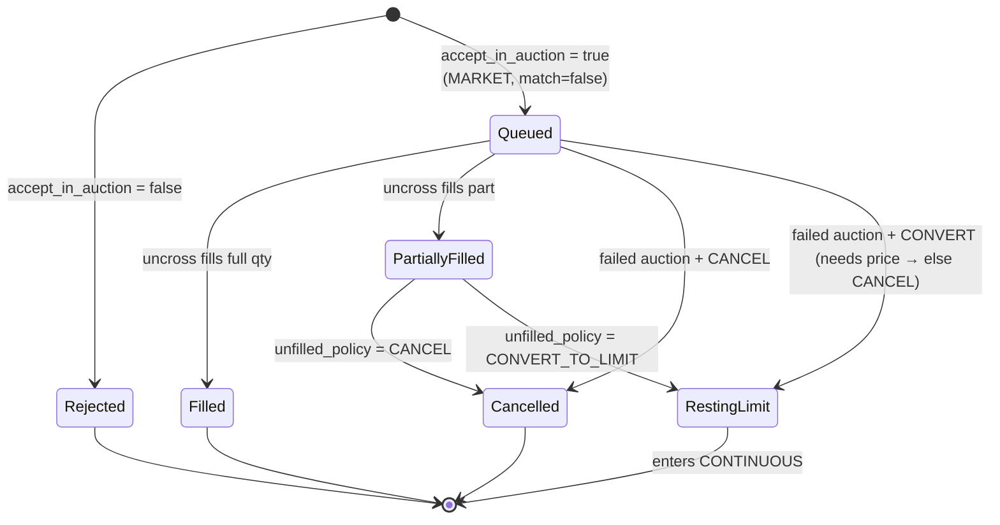
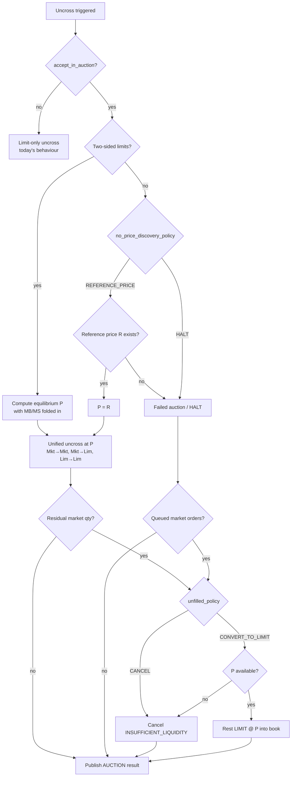
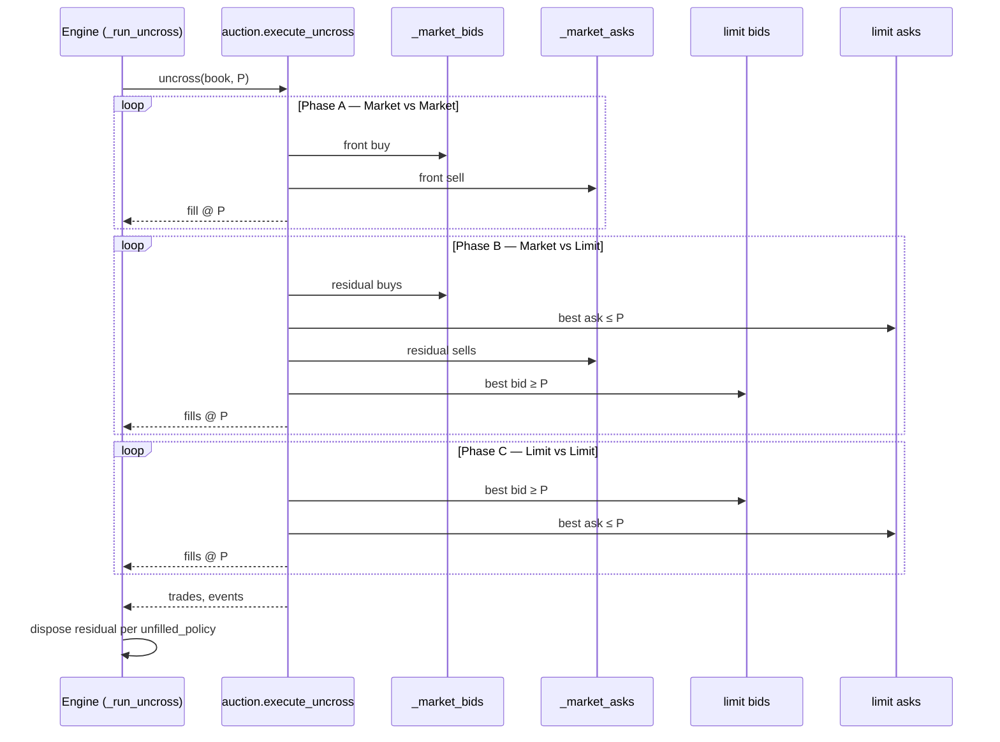
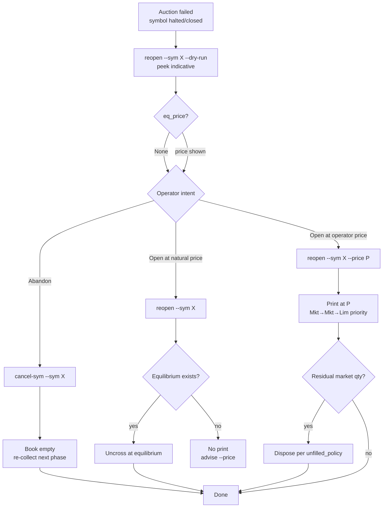

Version: 0.1.0

Date: 2026-09-08

Status: Proposed

# EduMatcher — Market Orders in Pre-opening / Auction Phases

> **Design proposal.** This document specifies how EduMatcher should accept,
> queue, prioritise, and uncross **MARKET** orders submitted during the
> `PRE_OPEN`, `OPENING_AUCTION`, and `CLOSING_AUCTION` phases, and how the
> behaviour is controlled from `engine_config.yaml`. It is a specification to
> be implemented; the current engine **rejects** market orders in these phases
> (see [§3](#3-current-behaviour)).

## Table of Contents

- [EduMatcher — Market Orders in Pre-opening / Auction Phases](#edumatcher--market-orders-in-pre-opening--auction-phases)
  - [Table of Contents](#table-of-contents)
  - [1. Purpose](#1-purpose)
  - [2. Goals and Non-Goals](#2-goals-and-non-goals)
  - [3. Current Behaviour](#3-current-behaviour)
  - [4. Terminology](#4-terminology)
  - [5. Configuration](#5-configuration)
    - [5.1 New config section](#51-new-config-section)
    - [5.2 Fields](#52-fields)
    - [5.3 Per-symbol override](#53-per-symbol-override)
    - [5.4 Config dataclass](#54-config-dataclass)
  - [6. Priority Model (always enforced)](#6-priority-model-always-enforced)
  - [7. The Cases](#7-the-cases)
    - [7.1 Case 1 — Normal case (two-sided limits)](#71-case-1--normal-case-two-sided-limits)
    - [7.2 Case 2 — No limit orders (no price discovery)](#72-case-2--no-limit-orders-no-price-discovery)
    - [7.3 Case 3 — Limit imbalance (one-sided limits)](#73-case-3--limit-imbalance-one-sided-limits)
    - [7.4 Case 4 — Unfilled market orders](#74-case-4--unfilled-market-orders)
  - [8. Additional Edge Cases](#8-additional-edge-cases)
  - [9. Algorithm Design](#9-algorithm-design)
    - [9.1 Storage: pre-open market queues](#91-storage-pre-open-market-queues)
    - [9.2 Price-discovery decision](#92-price-discovery-decision)
    - [9.3 Equilibrium price with market orders](#93-equilibrium-price-with-market-orders)
    - [9.4 Unified uncross execution](#94-unified-uncross-execution)
    - [9.5 Post-uncross disposition](#95-post-uncross-disposition)
  - [10. Diagrams](#10-diagrams)
    - [10.1 Order lifecycle state diagram](#101-order-lifecycle-state-diagram)
    - [10.2 Uncross decision flow](#102-uncross-decision-flow)
    - [10.3 Execution phase sequence](#103-execution-phase-sequence)
  - [11. Worked Examples](#11-worked-examples)
  - [12. Implementation Plan (verifiable steps)](#12-implementation-plan-verifiable-steps)
  - [13. Test Matrix](#13-test-matrix)
  - [14. Open Questions](#14-open-questions)
  - [15. Operational Recovery of a Failed Auction](#15-operational-recovery-of-a-failed-auction)
    - [15.1 What is already possible today](#151-what-is-already-possible-today)
    - [15.2 The gap](#152-the-gap)
    - [15.3 Decision — extend `pm-admin-cli`](#153-decision--extend-pm-admin-cli)
    - [15.4 New command: `reopen`](#154-new-command-reopen)
      - [15.4.1 Peeking the indicative price (`--dry-run`)](#1541-peeking-the-indicative-price---dry-run)
    - [15.6 Implementation sub-plan](#156-implementation-sub-plan)

---

## 1. Purpose

Accepting market orders before continuous trading opens is delicate: a market
order has no price, so it cannot rest on a price-ordered book, and it cannot be
matched until the auction produces an equilibrium price. This document defines a
safe, configurable, and deterministic scheme that:

- accepts market orders during pre-open/auction (when enabled),
- includes them in the uncross with a well-defined priority,
- degrades gracefully when price discovery is impossible, and
- disposes of any residual market interest predictably.

## 2. Goals and Non-Goals

**Goals**

- Add opt-in acceptance of `MARKET` orders during `PRE_OPEN`,
  `OPENING_AUCTION`, and `CLOSING_AUCTION`.
- Guarantee the priority **Market → Market**, then **Market → Limit**, then
  **Limit → Limit** at the auction price.
- Make the no-price-discovery and unfilled-residual behaviours configurable.
- Keep the change additive: default configuration preserves today's
  reject-on-auction behaviour.

**Non-Goals**

- No change to `FOK` / `IOC` handling — they remain rejected during
  no-matching phases (they demand immediate continuous-matching semantics that
  an auction defers). See [§8](#8-additional-edge-cases).
- No change to the continuous-phase market-order path
  (`OrderBook._match_market`).
- No new wire channel; the existing `AUCTION` indicative/result channel is
  reused (imbalance figures are extended to include market volume).

## 3. Current Behaviour

Market orders are **rejected** in every non-matching phase today.

- Book level — [src/edumatcher/engine/order_book.py](../src/edumatcher/engine/order_book.py):
  in `process(..., match=False)`, `MARKET`/`FOK`/`IOC` are set to
  `OrderStatus.REJECTED` and returned; only `LIMIT`/`ICEBERG` rest.
- Engine level — [src/edumatcher/engine/main.py](../src/edumatcher/engine/main.py):
  when `not do_match`, `MARKET`/`FOK`/`IOC` are rejected with code
  `SESSION_NOT_PERMITTED` (`"{type} orders not accepted during {state}"`).
- Uncross — [src/edumatcher/engine/auction.py](../src/edumatcher/engine/auction.py):
  `compute_equilibrium()` scans only the limit price-level indexes
  (`_bid_qty` / `_ask_qty`); `execute_uncross()` crosses only resting limits.

The scheme below is layered on top of these call sites.

## 4. Terminology

| Term | Meaning |
|---|---|
| **MB / MS** | Total market **buy** / market **sell** quantity queued for the auction. |
| **Reference price** | Anchor price already resolved by the engine for collars/circuit-breakers: persisted `prev_close` from `book_stats.json`, else config seed (`last_buy_price` / `last_sell_price`), else `None`. |
| **Two-sided limits** | At least one resting limit **bid** *and* one resting limit **ask**. |
| **Price discovery** | Ability to derive an equilibrium price from two-sided limit interest. |
| **Failed auction** | Uncross that produces no equilibrium price and no trades. |

## 5. Configuration

### 5.1 New config section

A new optional top-level section `auction_market_orders` in
`engine_config.yaml`:

```yaml
auction_market_orders:
  accept_in_auction: false            # master switch (default: reject, as today)
  no_price_discovery_policy: HALT     # HALT | REFERENCE_PRICE
  unfilled_policy: CANCEL             # CANCEL | CONVERT_TO_LIMIT
  # optional per-symbol overrides
  symbols:
    AAPL:
      accept_in_auction: true
      no_price_discovery_policy: REFERENCE_PRICE
      unfilled_policy: CONVERT_TO_LIMIT
```

### 5.2 Fields

| Field | Type | Default | Meaning |
|---|---|---|---|
| `accept_in_auction` | bool | `false` | When `false`, market orders are rejected exactly as today. When `true`, they are accepted and queued for the auction. |
| `no_price_discovery_policy` | enum | `HALT` | Applied when there are **not** two-sided limits (Cases 2 & 3). `HALT` = failed auction, symbol stays in the pre-open/halt state, no trades. `REFERENCE_PRICE` = if a reference price exists, uncross at it; otherwise fall back to `HALT`. |
| `unfilled_policy` | enum | `CANCEL` | Applied to market-order residual after a successful uncross (Case 4). `CANCEL` = cancel with `INSUFFICIENT_LIQUIDITY`. `CONVERT_TO_LIMIT` = convert residual to a `LIMIT` at the equilibrium price and rest it into the continuous book. |

### 5.3 Per-symbol override

`auction_market_orders.symbols.<SYM>` may override any of the three scalar
fields per symbol. Resolution is symbol-override → section default → hard
default. This mirrors the resolution pattern already used by
`mm_obligation_defaults` and `circuit_breaker_defaults`.

### 5.4 Config dataclass

Add to [src/edumatcher/engine/config_loader.py](../src/edumatcher/engine/config_loader.py):

```python
class NoPriceDiscoveryPolicy(str, Enum):
    HALT = "HALT"
    REFERENCE_PRICE = "REFERENCE_PRICE"

class UnfilledMarketPolicy(str, Enum):
    CANCEL = "CANCEL"
    CONVERT_TO_LIMIT = "CONVERT_TO_LIMIT"

@dataclass
class AuctionMarketOrderConfig:
    accept_in_auction: bool = False
    no_price_discovery_policy: NoPriceDiscoveryPolicy = NoPriceDiscoveryPolicy.HALT
    unfilled_policy: UnfilledMarketPolicy = UnfilledMarketPolicy.CANCEL
```

`EngineConfig` gains `auction_market_orders: dict[str, AuctionMarketOrderConfig]`
resolved per symbol at load time (the same shape used for other per-symbol
defaults), plus an engine-wide default entry.

## 6. Priority Model (always enforced)

Regardless of configuration, when an uncross executes, fills are allocated in
this order at the single equilibrium price `P`:

1. **Market hits Market** — queued market buys cross queued market sells.
2. **Market hits Limit** — remaining market orders cross resting limit orders
   on the opposite side.
3. **Limit hits Limit** — resting limits cross resting limits (today's
   behaviour).

This is equivalent to a single rule: **on each side, a market order is more
aggressive than any limit order**. Model each side as a priority queue ordered
by `(price-aggressiveness, time)` where a market order sorts ahead of every
limit; then repeatedly cross the top bid against the top ask at `P`. The three
"hits" above fall out naturally, with FIFO (price-time) fairness inside each
class.

## 7. The Cases

### 7.1 Case 1 — Normal case (two-sided limits)

Market orders queued, two-sided limits present. Price discovery succeeds. The
equilibrium price `P` is computed with market volume folded into demand/supply
(see [§9.3](#93-equilibrium-price-with-market-orders)), then the unified uncross
executes with the [§6](#6-priority-model-always-enforced) priority. Market
orders trade **before** any limit at `P`. Straightforward.

### 7.2 Case 2 — No limit orders (no price discovery)

No limits at all — only market orders (possibly on both sides). No equilibrium
can be derived from limits. Behaviour follows `no_price_discovery_policy`:

- `HALT` → failed auction. No trades. Market orders are held (auction stays in
  the pre-open/halt collection state) or disposed per `unfilled_policy` at the
  transition boundary (see [§9.5](#95-post-uncross-disposition)).
- `REFERENCE_PRICE` → if a reference price `R` exists, set `P = R` and run the
  unified uncross (market-buy vs market-sell cross at `R`). If no reference
  price exists, fall back to `HALT`.

### 7.3 Case 3 — Limit imbalance (one-sided limits)

Limits present on only one side (e.g. only bids, or only asks). Per the
specification this is treated **identically to Case 2**: two-sided limits are
required for price discovery, so `no_price_discovery_policy` applies. Note the
one-sided limits themselves never trade in this case (they had no crossing
counterparty), except under `REFERENCE_PRICE` where they may cross incoming
market flow at `R` if their limit price permits.

### 7.4 Case 4 — Unfilled market orders

After a successful uncross there is at most **one** side with residual market
quantity (the imbalance side — the smaller side is fully consumed by
`min(supply, demand)`). Residual disposition follows `unfilled_policy`:

- `CANCEL` → residual cancelled with `cancel_reason = "INSUFFICIENT_LIQUIDITY"`
  (consistent with continuous-phase `_match_market`).
- `CONVERT_TO_LIMIT` → residual converted to a `LIMIT` order priced at the
  equilibrium price `P`, rested into the book, and carried into `CONTINUOUS`.
  It keeps its original id, timestamp (time priority), and remaining quantity.

## 8. Additional Edge Cases

| # | Edge case | Handling |
|---|---|---|
| E1 | **Collars cannot bound a market order.** Collar validation only runs when `order.price is not None`, so a queued market order is unconstrained and could execute far from the reference. | Document the risk. Optionally reject market orders in auction when `enforce_collars` is on and no reference price exists (open question Q3). |
| E2 | **`FOK` / `IOC` in auction.** These require immediate all-or-nothing / immediate-or-cancel semantics that an auction cannot honour at collection time. | Keep rejecting `FOK`/`IOC` unchanged. Only plain `MARKET` is in scope. |
| E3 | **`CONVERT_TO_LIMIT` with no equilibrium price** (failed auction under `HALT`, or `REFERENCE_PRICE` with no reference). | No price to convert to → force `CANCEL` for the residual. |
| E4 | **Both-sided market residual is impossible** after a successful uncross, but a *failed* auction can leave both MB and MS unfilled. | On failed auction both are disposed per `unfilled_policy` (with E3 fallback). |
| E5 | **Circuit-breaker reopening auction** (`_run_uncross(reason="REOPEN")`). | Same code path — reopening reuses the auction uncross, so market-order handling applies uniformly. |
| E6 | **Self-match prevention (SMP)** between a participant's own market and limit orders during the uncross. | Out of scope for v1; note that SMP is evaluated in continuous matching, not in `execute_uncross`. Flag as Q4. |
| E7 | **Persistence / restart** while market orders are queued in the auction. | Auction market queues are **session-scoped and not persisted** (unlike GTC limits). On restart the queues are empty. Documented behaviour. |
| E8 | **Startup-recovery uncross** (`reason="RECOVERY"`) from persisted crossed GTC limits. | No market orders exist at recovery (E7), so behaviour is unchanged. |
| E9 | **Indicative/imbalance publication** during collection (`auction_indicative_interval_sec`). | Extend the indicative calculation to include MB/MS in the projected executable quantity and imbalance side. |

## 9. Algorithm Design

### 9.1 Storage: pre-open market queues

Add two FIFO queues to `OrderBook`:

```python
self._market_bids: deque[Order] = deque()   # MARKET buys awaiting uncross
self._market_asks: deque[Order] = deque()   # MARKET sells awaiting uncross
```

In `OrderBook.process(..., match=False)`, when
`order.order_type == OrderType.MARKET` **and** acceptance is enabled for the
symbol, append to the appropriate queue and ack the order (status `ACCEPTED`)
instead of rejecting. The engine gates on config before calling this path.

### 9.2 Price-discovery decision

Price discovery is possible **iff** the limit book is two-sided:
`_bid_qty` non-empty **and** `_ask_qty` non-empty. This single predicate
separates Case 1 from Cases 2/3.

### 9.3 Equilibrium price with market orders

Extend `compute_equilibrium()` so market volume is treated as infinitely
aggressive — it participates at every candidate price:

```
buy_qty(P)  = MB + Σ bid_limit_qty where price ≥ P
sell_qty(P) = MS + Σ ask_limit_qty where price ≤ P
exec(P)     = min(buy_qty(P), sell_qty(P))
surplus(P)  = |buy_qty(P) − sell_qty(P)|
```

Selection is unchanged: maximise `exec(P)`, tie-break by minimum `surplus(P)`.
Because `MB`/`MS` are constant across `P`, they shift the curves without
changing the scan structure (still `O(p)` over distinct limit prices). This runs
**only** when [§9.2](#92-price-discovery-decision) says discovery is possible;
otherwise the reference-price / halt branch decides `P`.

### 9.4 Unified uncross execution

Replace the direct limit-only loop in `execute_uncross()` with a
priority-aware cross at the chosen `P`:

- **best bid** = front of `_market_bids` if non-empty, else best resting limit
  bid with `price ≥ P`.
- **best ask** = front of `_market_asks` if non-empty, else best resting limit
  ask with `price ≤ P`.
- cross `min(remaining)` at `P`; repeat until no crossable pair remains.

Because market queues are consulted first, the fill order is exactly
Market→Market, then Market→Limit, then Limit→Limit ([§6](#6-priority-model-always-enforced)).
All fills share one timestamp (existing PERF#3 batch-clock behaviour) and use
`both_resting=True` semantics as today.

### 9.5 Post-uncross disposition

After execution:

1. **Successful uncross** (`P` set, trades produced): residual market quantity
   on the imbalance side is disposed per `unfilled_policy`
   ([§7.4](#74-case-4--unfilled-market-orders)), with edge E3 forcing `CANCEL`
   when conversion has no price.
2. **Failed auction** (no `P`): under `HALT` the symbol reports a failed
   auction; queued market orders are disposed per `unfilled_policy` at the
   session-transition boundary (E3/E4 apply). Limits remain resting for the
   next phase as today.

## 10. Diagrams

### 10.1 Order lifecycle state diagram



### 10.2 Uncross decision flow



### 10.3 Execution phase sequence



## 11. Worked Examples

Assume tick = 1, reference price `R = 100`.

**Example A — Case 1, normal.**
Queued: MB = 50. Limits: bid 300@99, ask 300@100, ask 200@101.
Folding MB into demand at every P, the price maximising executable quantity is
`P = 100`. Uncross: the 50 market buy fills first against the 100-ask
(Market→Limit), then limit bid 99 does not cross the 100 ask (99 < 100) so no
Limit→Limit here. Result: 50 traded at 100, market buy fully filled.

**Example B — Case 1 with two-sided market.**
Queued: MB = 200, MS = 120. Limits: bid 100@98, ask 100@102.
Phase A: 120 market-vs-market crosses at `P`. `P` computed from limits +
MB/MS. Remaining MB = 80 then hits the 100@102 ask (Market→Limit) up to 80.
Residual = 0. Limit bid 98 vs limit ask 102 never cross.

**Example C — Case 2, only market orders.**
Queued: MB = 200, MS = 200. No limits.
`HALT` → failed auction, both queues disposed per `unfilled_policy`.
`REFERENCE_PRICE` → `P = 100`; 200 cross market-vs-market at 100; residual 0.

**Example D — Case 3, one-sided limits.**
Queued: MS = 150. Limits: only bids (bid 200@100). No asks.
Treated as no discovery. `HALT` → no trade. `REFERENCE_PRICE` with `R = 100`
→ `P = 100`; the 150 market sell crosses the 200@100 bid (Market→Limit) at 100;
50 limit bid remains resting.

**Example E — Case 4, residual convert.**
Queued: MB = 500. Limits: ask 300@100 only on the sell side, plus limit bid
100@99 (two-sided). `P = 100`. Market buy fills 300 (Market→Limit); residual
200. `CONVERT_TO_LIMIT` → rest a 200 limit **buy @ 100** into the continuous
book; `CANCEL` → cancel 200 with `INSUFFICIENT_LIQUIDITY`.

## 12. Implementation Plan (verifiable steps)

Each step is independently testable. Run `black`, `flake8`, `mypy`, then
`pyright`, then `pytest` after every step (per repo conventions).

1. **Config model.**
   Add `NoPriceDiscoveryPolicy`, `UnfilledMarketPolicy`,
   `AuctionMarketOrderConfig`, and the `auction_market_orders` parser +
   per-symbol resolution in
   [config_loader.py](../src/edumatcher/engine/config_loader.py).
   *Verify:* unit tests load a YAML with section present/absent and per-symbol
   override; defaults reproduce today's values (`accept_in_auction=False`).

2. **Queue storage.**
   Add `_market_bids` / `_market_asks` deques to `OrderBook`; add
   `queue_auction_market(order)` and accessors for MB/MS totals.
   *Verify:* unit test queues orders and reads back FIFO order and totals.

3. **Accept path.**
   In `OrderBook.process(match=False)` and the engine no-match branch in
   [main.py](../src/edumatcher/engine/main.py), when the resolved
   `accept_in_auction` is true, queue `MARKET` (ack) instead of rejecting;
   otherwise reject as today. `FOK`/`IOC` still reject.
   *Verify:* test that with flag off a market order is rejected
   (`SESSION_NOT_PERMITTED`); with flag on it is acked and queued.

4. **Equilibrium with market volume.**
   Extend `compute_equilibrium()` to add MB/MS to buy/sell curves; only invoked
   when two-sided limits exist.
   *Verify:* parametrised tests over Examples A/B assert `eq_price`, `eq_qty`,
   `imbalance_side`.

5. **Unified execution.**
   Extend `execute_uncross()` to consult market queues first (priority model
   §6).
   *Verify:* tests assert fill ordering Market→Market→Limit→Limit and trade
   prices all equal `P`; time-priority within each class.

6. **Price-discovery decision + reference fallback.**
   In `_run_uncross()` ([main.py](../src/edumatcher/engine/main.py)) branch on
   two-sided-limits; when absent, apply `no_price_discovery_policy` using the
   already-resolved reference price.
   *Verify:* tests over Examples C/D for both `HALT` and `REFERENCE_PRICE`
   (incl. no-reference fallback to HALT).

7. **Residual disposition.**
   After uncross, dispose residual market qty per `unfilled_policy`; enforce E3
   (convert without price → cancel).
   *Verify:* tests over Example E for `CANCEL` and `CONVERT_TO_LIMIT`, and E3.

8. **Indicative/imbalance publication.**
   Include MB/MS in indicative executable qty and imbalance side on the existing
   `AUCTION` channel.
   *Verify:* test the indicative message reflects queued market volume.

9. **Docs + config generator.**
   Document the section in the engine-config reference and add
   `auction_market_orders` emission to `pm-config-gen` (commented defaults).
   *Verify:* generated config round-trips through `load_engine_config`.

10. **End-to-end.**
    Integration test driving `PRE_OPEN → OPENING_AUCTION → CONTINUOUS` with
    market + limit flow for each case.
    *Verify:* trades, residual disposition, and session state match the case
    tables.

## 13. Test Matrix

| ID | Scenario | Config | Expected |
|---|---|---|---|
| T1 | Flag off, market in auction | `accept_in_auction=false` | Reject `SESSION_NOT_PERMITTED` (unchanged) |
| T2 | Case 1 normal | on | Market fills before limits at `P` |
| T3 | Case 1 two-sided market | on | Market-vs-market first, then market-vs-limit |
| T4 | Case 2 only market, HALT | on/HALT | Failed auction, residual per policy |
| T5 | Case 2 only market, REF | on/REFERENCE_PRICE | Cross at `R` |
| T6 | Case 2 REF, no reference | on/REFERENCE_PRICE | Fallback HALT |
| T7 | Case 3 one-sided limits | on/both | Handled as Case 2 |
| T8 | Case 4 residual CANCEL | on/CANCEL | Residual cancelled `INSUFFICIENT_LIQUIDITY` |
| T9 | Case 4 residual CONVERT | on/CONVERT_TO_LIMIT | Residual rests limit @ `P` |
| T10 | E3 convert w/o price | on/CONVERT_TO_LIMIT + HALT | Residual cancelled |
| T11 | FOK/IOC in auction | on | Still rejected |
| T12 | Reopening auction (CB) | on | Same behaviour via REOPEN uncross |

## 14. Open Questions

- **Q1.** Under `REFERENCE_PRICE`, should limit orders that would trade at `R`
  worse than their limit be protected? (They are — a limit only crosses when `R`
  is on the acceptable side of its price; this is inherent to the unified cross.)
  Confirm this is the desired collar-free behaviour.
- **Q2.** For Case 3 (one-sided limits) under `REFERENCE_PRICE`, is crossing
  incoming market flow against the single limit side at `R` acceptable, or
  should one-sided books always HALT regardless of policy?
- **Q3.** Should market orders be rejected when `enforce_collars` is on and no
  reference price exists, since they cannot be collar-bounded (E1)?
- **Q4.** Is SMP required inside the auction uncross (E6), or is deferring it to
  continuous acceptable for v1?
- **Q5.** Should `CONVERT_TO_LIMIT` residuals be subject to collar validation at
  conversion time (they now have a concrete price `P`)?
- **Q6.** Should the manual `reopen --price` command
  ([§15](#15-operational-recovery-of-a-failed-auction)) be restricted to the
  circuit-breaker corridor / collar band, or is an operator print allowed to
  override those bounds (with an audit note)?

---

## 15. Operational Recovery of a Failed Auction

When an auction fails ([§7.2](#72-case-2--no-limit-orders-no-price-discovery) /
[§7.3](#73-case-3--limit-imbalance-one-sided-limits) under `HALT`, or any
uncross that yields no equilibrium), the symbol stays closed/halted and its
resting orders sit untouched. This section defines how an operator recovers such
a symbol **hands-on**, and concludes that we **extend `pm-admin-cli`** rather
than build a new tool.

### 15.1 What is already possible today

`pm-admin-cli` (source
[src/edumatcher/commands/cli.py](../src/edumatcher/commands/cli.py),
[console.py](../src/edumatcher/commands/console.py)) already covers two of the
three recovery needs:

| Need | Command today | Effect | Handler |
|---|---|---|---|
| **Cancel resting orders** for a symbol | `pm-admin-cli --id GW_ADMIN cancel-sym --sym AAPL` | Cancels **all** resting orders + active quotes for the symbol, across every gateway (ADMIN only). | `_handle_cancel_symbol()` |
| **Clear the halt flag** | `pm-admin-cli --id GW_ADMIN resume-sym --sym AAPL` | Sets `_halted_symbols[AAPL]=False`, deactivates the circuit breaker. **Does not uncross** — the book is simply live again. | `_handle_symbol_resume()` |
| **Exchange-wide forced open** | `pm-admin-cli --id GW_ADMIN session --state CONTINUOUS` | Legal from `PRE_OPEN`; runs `_run_uncross(reason="SCHEDULED")` as it exits the no-match phase. But it moves the **whole exchange**, at the computed equilibrium only. | `_handle_session_transition()` |

So the "cancel everything and start over" recovery already works:
`cancel-sym` → let the book re-collect → transition. What is missing is a
**targeted, single-symbol reopen at an operator-chosen price**.

### 15.2 The gap

The internal engine primitive already exists but is not operator-reachable in
the way recovery needs:

- `_run_uncross(symbol_filter=..., reason=..., price_override=...)`
  ([main.py](../src/edumatcher/engine/main.py)) can uncross one symbol at a
  forced price — **but** it (a) `continue`s past any symbol where
  `_halted_symbols[symbol]` is true, and (b) applies `price_override` **only
  when `compute_equilibrium` already returns a non-`None` `eq_price`**. A
  failed auction returns `eq_price = None`, so a forced price currently prints
  nothing.
- There is **no** admin message/command that triggers a per-symbol uncross, and
  **no** way to assert an opening price when no natural equilibrium exists
  (the only existing `price_override` caller is the internal
  `_run_closing_backstop()`).

Net: an operator can cancel or clear the halt, but cannot say *"open AAPL now at
100 and match whatever crosses at that price."*

### 15.3 Decision — extend `pm-admin-cli`

**Extend `pm-admin-cli`; do not build a new tool.** The admin command pipeline
(message factory in [message.py](../src/edumatcher/models/message.py) → engine
handler in [main.py](../src/edumatcher/engine/main.py) → CLI subcommand in
[cli.py](../src/edumatcher/commands/cli.py) + `_COMMAND_HANDLERS` in
[console.py](../src/edumatcher/commands/console.py)) is the established,
ADMIN-authenticated path for exactly this class of operation (`halt`, `resume`,
`cancel-sym`, `session`). A separate tool would duplicate its auth handshake,
socket wiring, and audit trail for no benefit.

### 15.4 New command: `reopen`

Add one ADMIN command that force-uncrosses a single symbol, optionally at a
manual price, and clears the halt in one atomic step:

```bash
# Peek the indicative print WITHOUT changing any state (see §15.4.1):
pm-admin-cli --id GW_ADMIN reopen --sym AAPL --dry-run

# Open at the naturally computed equilibrium (if any):
pm-admin-cli --id GW_ADMIN reopen --sym AAPL

# Assert an operator opening price (failed-auction recovery):
pm-admin-cli --id GW_ADMIN reopen --sym AAPL --price 100.00 --note "manual open"
```

Wire message `TOPIC_FORCE_UNCROSS`:
`{"gateway_id": str, "symbol": str, "price": float|null, "dry_run": bool, "note": str, "command_id": str}`.
Its handler `_handle_force_uncross()`:

1. Validate gateway + ADMIN role and that the symbol exists.
2. Clear the halt (`_halted_symbols[symbol]=False`, deactivate CB) so the
   `_run_uncross` halt guard does not skip it.
3. Call `_run_uncross(symbol_filter=symbol, reason="ADMIN_MANUAL", price_override=ticks)`.
4. **Extend `_run_uncross`** so that when `reason == "ADMIN_MANUAL"` and a
   `price_override` is supplied, the override is used as the print price **even
   if `compute_equilibrium` returns `eq_price = None`** — the operator is
   asserting the opening price; whatever crosses at that price executes with the
   normal [§6](#6-priority-model-always-enforced) priority (market orders first),
   and residual market interest is disposed per the symbol's `unfilled_policy`
   ([§7.4](#74-case-4--unfilled-market-orders)).
5. Reply `make_force_uncross_ack_msg(gw, symbol, accepted, reason?, printed_price, traded_qty, command_id)`.

This makes all three recovery actions available and composable:
**cancel** (`cancel-sym`), **open at computed price** (`reopen`), and
**open at a manual price** (`reopen --price`).

#### 15.4.1 Peeking the indicative price (`--dry-run`)

Today the indicative auction price is **push-only**: `_flush_auction_indicative()`
([main.py](../src/edumatcher/engine/main.py)) publishes
`auction.indicative.{symbol}` **only while the session is in an active call
phase**, and it **explicitly skips halted symbols**. So for a failed / halted /
closed symbol there is no indicative feed, and there is no on-demand way to see
what would print. Without this, an operator sets `--price` blind.

`compute_equilibrium(book)` already returns exactly the needed shape
(`eq_price` is `None` when the book would not cross). Expose it as a **read-only
peek** via `reopen --dry-run`:

- `dry_run=true` → the handler runs `compute_equilibrium(book)` (and, if
  `--price` is also supplied, the quantity that *would* print at that price)
  and returns it in the ack **without** clearing the halt, without uncrossing,
  and without any state change. It requires ADMIN like the rest of the command
  but mutates nothing.
- The ack carries `indicative_price` (nullable — `None` when no equilibrium
  exists), `indicative_qty`, `surplus`, and `imbalance_side`, reusing the same
  fields as the `auction.indicative` event.

Typical recovery flow: `reopen --dry-run` to read the indicative (or `None`) →
decide → `reopen` (natural) or `reopen --price P` (asserted).



### 15.6 Implementation sub-plan

Appends to the [§12](#12-implementation-plan-verifiable-steps) plan; same
lint/type/test gate per step.

11. **Force-uncross message + ack.** Add `TOPIC_FORCE_UNCROSS`,
    `make_force_uncross_msg()`, and `make_force_uncross_ack_msg()` in
    [message.py](../src/edumatcher/models/message.py). The message carries a
    `dry_run` flag; the ack carries `indicative_price` (nullable),
    `indicative_qty`, `surplus`, `imbalance_side`, plus `printed_price` /
    `traded_qty` for a live run.
    *Verify:* round-trip encode/decode unit tests, including the `dry_run` and
    null-`indicative_price` shapes.

12. **Engine handler.** Add `_handle_force_uncross()` and wire it into the
    admin dispatch in [main.py](../src/edumatcher/engine/main.py). On
    `dry_run=true` it returns `compute_equilibrium(book)` (and the qty that
    would print at `--price` if given) and mutates nothing; on a live run it
    clears the halt and extends `_run_uncross` to honour an operator price when
    `eq_price is None` under `reason="ADMIN_MANUAL"`.
    *Verify:* tests for (a) dry-run returns indicative / `None` and changes no
    state, (b) natural-equilibrium reopen, (c) manual-price reopen of a failed
    auction printing at `P`, (d) non-ADMIN rejected, (e) residual disposed per
    `unfilled_policy`.

13. **CLI subcommand.** Add `reopen --sym --price --dry-run --note` to
    [cli.py](../src/edumatcher/commands/cli.py) and a `_cmd_reopen` entry in
    `_COMMAND_HANDLERS` ([console.py](../src/edumatcher/commands/console.py)).
    *Verify:* CLI parses args, emits the message, prints the ack (indicative on
    dry-run, print result on live run).

14. **Docs.** Document `reopen` (and the `cancel-sym` recovery recipe) in the
    operator guide.
    *Verify:* example commands match the shipped `--help`.
