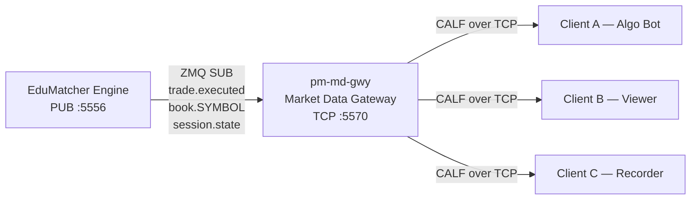
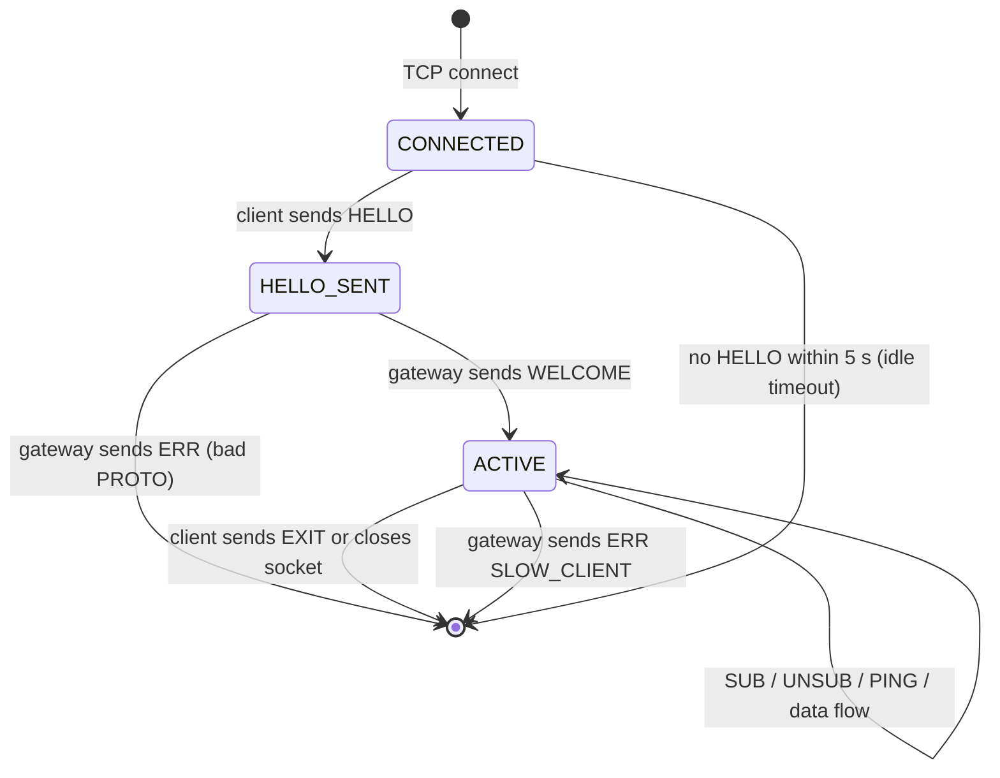
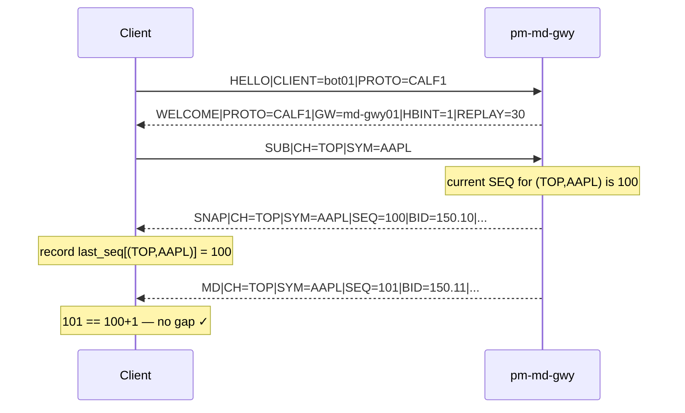
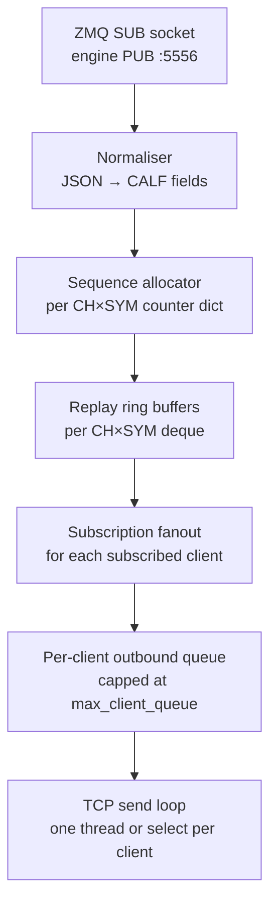
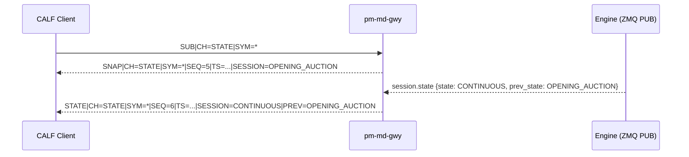

Version: 1.1.0

Date: 2026-06-12

Status: Design and Research Proposal

> **Changelog v1.1.0**
> - Corrected internal ZMQ topic names to match engine implementation
> - Resolved `SNAP` channel contradiction (it is auto-sent, not a subscribable channel)
> - Clarified `STATE` SESSION values vs engine SessionState mapping
> - Added connection state machine and gateway implementation guide (Section 10)
> - Added new files and process startup instructions (Section 10.5)
> - Fixed TCP client example to use proper line-buffered reading (Section 16)
> - Expanded Section 7 to cover first-connect as well as reconnect
> - Added gap-recovery flow diagram (Section 7.2)
> - Added `name` to config (Section 12)
> - Resolved `SNAP` channel field inconsistency (`CH` is not always `TOP`)

# CALF: Channel ALF Market Data Protocol


## Table of Contents

- [CALF: Channel ALF Market Data Protocol](#calf-channel-alf-market-data-protocol)
  - [Table of Contents](#table-of-contents)
  - [1. Motivation](#1-motivation)
    - [1.1 90/10 Scope Statement](#11-9010-scope-statement)
  - [2. Protocol Name and Positioning](#2-protocol-name-and-positioning)
  - [3. Architecture Overview](#3-architecture-overview)
    - [3.1 Internal ZMQ Topics Consumed](#31-internal-zmq-topics-consumed)
  - [4. Transport and Session Model](#4-transport-and-session-model)
    - [4.1 Connection Lifecycle](#41-connection-lifecycle)
    - [4.2 Liveness](#42-liveness)
  - [5. CALF Message Types](#5-calf-message-types)
    - [5.1 Session Control (connection management)](#51-session-control-connection-management)
    - [5.2 Market Data](#52-market-data)
  - [6. Channel Model](#6-channel-model)
    - [6.1 Channels Defined](#61-channels-defined)
    - [6.2 Subscription Rules](#62-subscription-rules)
  - [7. Sequence and Recovery Semantics](#7-sequence-and-recovery-semantics)
    - [7.1 Sequence Numbers](#71-sequence-numbers)
    - [7.2 First Connect (no prior sequence)](#72-first-connect-no-prior-sequence)
    - [7.3 Reconnect (gap recovery)](#73-reconnect-gap-recovery)
    - [7.4 Replay Buffer Implementation](#74-replay-buffer-implementation)
  - [8. Wire Format Specification](#8-wire-format-specification)
    - [8.1 Grammar](#81-grammar)
    - [8.2 Reserved Keys](#82-reserved-keys)
    - [8.3 Field Conventions](#83-field-conventions)
  - [9. Message Definitions and Examples](#9-message-definitions-and-examples)
    - [9.1 HELLO](#91-hello)
    - [9.2 WELCOME](#92-welcome)
    - [9.3 SUB](#93-sub)
    - [9.4 SNAP](#94-snap)
    - [9.5 MD (TOP Incremental Update)](#95-md-top-incremental-update)
    - [9.6 TRADE](#96-trade)
    - [9.7 STATE](#97-state)
    - [9.8 ERR](#98-err)
    - [9.9 UNSUB](#99-unsub)
    - [9.10 HB (Heartbeat)](#910-hb-heartbeat)
    - [9.11 PING / PONG](#911-ping--pong)
    - [9.12 EXIT](#912-exit)
  - [10. pm-md-gwy Design and Implementation Guide](#10-pm-md-gwy-design-and-implementation-guide)
    - [10.1 Responsibilities](#101-responsibilities)
    - [10.2 Non-Responsibilities](#102-non-responsibilities)
    - [10.3 Data Flow Inside the Gateway](#103-data-flow-inside-the-gateway)
    - [10.4 Key Data Structures](#104-key-data-structures)
    - [10.5 Internal Event Handling](#105-internal-event-handling)
    - [10.6 New Files to Create](#106-new-files-to-create)
    - [10.7 Process Startup and Dependencies](#107-process-startup-and-dependencies)
    - [10.8 Backpressure Policy](#108-backpressure-policy)
  - [11. Session Lifecycle Examples](#11-session-lifecycle-examples)
    - [11.1 Normal Subscribe and Data Flow](#111-normal-subscribe-and-data-flow)
    - [11.2 Session State Change](#112-session-state-change)
  - [12. Config Reference](#12-config-reference)
  - [13. Educational Mapping to Existing Concepts](#13-educational-mapping-to-existing-concepts)
  - [14. Security and Operational Notes](#14-security-and-operational-notes)
  - [15. Future Evolution (v2+)](#15-future-evolution-v2)
  - [16. Worked Client Example (Python)](#16-worked-client-example-python)
  - [17. Open Questions](#17-open-questions)
  - [18. Summary](#18-summary)


## 1. Motivation

EduMatcher already has:
- **ALF** — simple text-based order entry (interactive terminal)
- **BALF** — low-latency binary order entry (programmatic)

What is missing is a market-data feed protocol with the same spirit:
- easy to teach and reason about in a terminal
- easy to debug (human-readable wire format)
- useful for real bots
- not overloaded with production-grade complexity

This proposal introduces **CALF** (**C**hannel **ALF**), a 90/10 market-data
protocol that covers the 90% of use cases learners and bot builders need while
intentionally skipping the complexity that adds little educational value.

### 1.1 90/10 Scope Statement

**CALF v1 supports:**
- top-of-book updates (best bid/ask with sizes)
- trade prints
- point-in-time snapshots on connect and on demand
- sequence-numbered incremental updates per `(channel, symbol)` stream
- heartbeat and liveness signalling
- simple subscription model by symbol and channel
- deterministic reconnect + replay from last seen sequence (bounded window)

**CALF v1 intentionally excludes:**
- full depth-by-order feed (full order-level book)
- multicast / UDP delivery
- conflation controls negotiated per client
- per-field entitlement matrix
- historical data service (use `pm-index` for index history)
- authentication tokens (trusted classroom network assumed)


## 2. Protocol Name and Positioning

**Name:** CALF (Channel ALF)

The name fits the EduMatcher family:

| Protocol | Purpose |
|---|---|
| ALF | Simple text order entry — interactive human use |
| BALF | Binary order entry — low-latency programmatic use |
| CALF | Channelized text market data — readable, subscribable |

CALF is playful and memorable, consistent with the educational tone of the stack.


## 3. Architecture Overview



`pm-md-gwy` is a new standalone process. It:
- subscribes to the engine's existing ZMQ PUB socket on port 5556
- normalises internal ZMQ/JSON events into CALF text lines
- fans them out over TCP to all connected CALF clients

### 3.1 Internal ZMQ Topics Consumed

`pm-md-gwy` subscribes to the following topics on the engine PUB socket
(`tcp://127.0.0.1:5556`):

| Engine ZMQ Topic | Used for |
|---|---|
| `trade.executed` | Generating `TRADE` messages; updating LAST price in `SNAP`/`MD` |
| `book.{SYMBOL}` | Generating `MD` (top-of-book) and `SNAP` messages |
| `session.state` | Generating `STATE` messages |
| `circuit_breaker.halt.{SYMBOL}` | Generating `STATE SESSION=HALTED` messages |
| `circuit_breaker.resume.{SYMBOL}` | Generating `STATE SESSION=CONTINUOUS` messages after halt |

> **Note:** There is no `order_book.delta` topic in the engine. Incremental
> top-of-book updates are derived from consecutive `book.{SYMBOL}` snapshots
> published by the engine at a throttled interval (default 0.5 s). The gateway
> computes the diff (bid/ask changed?) and emits `MD` only when the top of book
> actually changed.


## 4. Transport and Session Model

| Property | Value |
|---|---|
| Transport | TCP |
| Port | `5570` (configurable) |
| Connection type | Long-lived stream; one TCP connection per client |
| Encoding | UTF-8 text lines, `\n` delimited |
| Compression | None in v1 |
| Max line length | 4096 bytes including `\n` |

Each CALF message is exactly one line. Fields are pipe-delimited key-value pairs.
The first token is the message type (not `TYPE=`, just the bare word):

```
HELLO|CLIENT=bot01|PROTO=CALF1
TRADE|CH=TRADE|SYM=AAPL|SEQ=809|TS=2026-06-07T10:16:00.141Z|PX=150.12|QTY=200|SIDE=BUY
```

### 4.1 Connection Lifecycle

A client that connects but does not send `HELLO` within 5 seconds is disconnected
with no error message. After `HELLO` the session is open until the client sends
`EXIT`, closes the socket, or is disconnected by the gateway (slow client or idle
timeout).



### 4.2 Liveness

- The gateway sends `HB` every `heartbeat_interval_sec` (default: 1 s) if no
  outbound market-data message was emitted in that interval.
- A client may send `PING` at any time; the gateway replies `PONG` immediately.
- If no inbound **or** outbound traffic occurs within `idle_timeout_sec`
  (default: 5 s), the gateway closes the connection.

> **Implementation note:** Track `last_activity_ts` per client, updated on every
> send and every receive. The heartbeat timer loop checks this timestamp every
> second and sends `HB` or disconnects as appropriate.


## 5. CALF Message Types

### 5.1 Session Control (connection management)

| Message | Direction | Purpose |
|---|---|---|
| `HELLO` | Client → Gateway | Initiate session |
| `WELCOME` | Gateway → Client | Confirm session, advertise parameters |
| `SUB` | Client → Gateway | Subscribe to channels/symbols |
| `UNSUB` | Client → Gateway | Cancel subscriptions |
| `PING` | Client → Gateway | Liveness probe |
| `PONG` | Gateway → Client | Liveness probe reply |
| `HB` | Gateway → Client | Heartbeat (no data in interval) |
| `ERR` | Gateway → Client | Error notification |
| `EXIT` | Client → Gateway | Clean disconnect |

### 5.2 Market Data

| Message | Direction | Purpose |
|---|---|---|
| `SNAP` | Gateway → Client | Full point-in-time snapshot for a stream |
| `MD` | Gateway → Client | Incremental top-of-book update |
| `TRADE` | Gateway → Client | Trade print |
| `STATE` | Gateway → Client | Session or instrument state change |


## 6. Channel Model

CALF uses logical channels to keep subscriptions simple. A client subscribes to
a combination of channels and symbols. The gateway streams matching events.

### 6.1 Channels Defined

| Channel | Description | `SYM=*` allowed? |
|---|---|---|
| `TOP` | Best bid/ask and sizes; generates `MD` and `SNAP` messages | No — explicit list required |
| `TRADE` | Executed trade prints; generates `TRADE` messages | No — explicit list required |
| `STATE` | Session and instrument state transitions; generates `STATE` messages | Yes |

> **There is no `SNAP` channel.** `SNAP` is a message type, not a subscribable
> channel. The gateway automatically sends a `SNAP` when a client issues a `SUB`
> for `TOP` or `STATE`. Clients do not subscribe to `SNAP` directly.

### 6.2 Subscription Rules

- A single `SUB` may request multiple channels and multiple symbols using commas.
- Channels and symbols that are already subscribed are silently re-confirmed (not
  duplicated — no double-delivery).
- `SYM=*` is only valid when `CH` contains only `STATE`. Using `SYM=*` with `TOP`
  or `TRADE` returns `ERR|CODE=INVALID_SYMBOL`.
- The maximum number of symbols per client (across all subscriptions) is
  `max_symbols_per_client` (default: 200).

```text
SUB|CH=TOP,TRADE|SYM=AAPL,MSFT
SUB|CH=STATE|SYM=*
SUB|CH=TOP|SYM=TSLA
```


## 7. Sequence and Recovery Semantics

### 7.1 Sequence Numbers

Each `(channel, symbol)` stream has an independent monotonic integer sequence counter:

- Starts at `1`.
- Increments by `1` for every message emitted in that stream.
- Is included in every `SNAP`, `MD`, `TRADE`, and `STATE` message as the `SEQ` field.

**A gap between consecutive `SEQ` values means the client missed one or more
messages.** The client must detect this and either request replay or accept a
fresh `SNAP`.

### 7.2 First Connect (no prior sequence)

When a client subscribes to a stream for the first time, the gateway sends a
`SNAP` with the current state and the current `SEQ`. The client records this
`SEQ` and expects subsequent `MD` messages starting at `SEQ + 1`.



### 7.3 Reconnect (gap recovery)

If a client reconnects after a brief disconnection, it sends `HELLO` with
`RESUME=1` and the last sequence it received. The gateway checks its replay
buffer:

- If the gap is within the buffer (default: last 30 seconds), the gateway replays
  the missing messages, then resumes live delivery.
- If the gap is outside the buffer, the gateway sends `ERR|CODE=REPLAY_MISS`
  immediately followed by a fresh `SNAP` at the current sequence.

```mermaid
sequenceDiagram
    participant C as Client
    participant G as pm-md-gwy

    Note over C,G: Client disconnected; last seen SEQ=1042 on (TOP,AAPL)

    C->>G: HELLO|CLIENT=bot01|PROTO=CALF1|RESUME=1|CH=TOP|SYM=AAPL|LASTSEQ=1042
    G-->>C: WELCOME|PROTO=CALF1|GW=md-gwy01|HBINT=1|REPLAY=30

    alt Gap within replay window (SEQ 1043..1050 in buffer)
        G-->>C: MD|CH=TOP|SYM=AAPL|SEQ=1043|...
        G-->>C: MD|CH=TOP|SYM=AAPL|SEQ=1044|...
        Note over G: ... replay continues to SEQ=1050 ...
        G-->>C: MD|CH=TOP|SYM=AAPL|SEQ=1050|...
        Note over G: now live
        G-->>C: MD|CH=TOP|SYM=AAPL|SEQ=1051|...
    else Gap outside replay window
        G-->>C: ERR|CODE=REPLAY_MISS|CH=TOP|SYM=AAPL
        G-->>C: SNAP|CH=TOP|SYM=AAPL|SEQ=1105|BID=151.20|...
        Note over C: reset last_seq[(TOP,AAPL)] = 1105
    end
```

> **RESUME applies to one `(CH, SYM)` stream per `HELLO`.** To resume multiple
> streams, send a plain `HELLO` (no `RESUME`) then issue `SUB` for each stream.
> The gateway will auto-send a fresh `SNAP` for each.

### 7.4 Replay Buffer Implementation

The gateway keeps a **shared per-stream ring buffer** (not per-client). Each
`(CH, SYM)` stream has one ring buffer of the last N seconds of messages
(default: 30 s). Multiple reconnecting clients share the same buffer.

Buffer size is bounded by time (`replay_window_sec`), not by message count.
Messages older than `replay_window_sec` are evicted as new ones arrive.


## 8. Wire Format Specification

### 8.1 Grammar

```text
<MSGTYPE>|KEY=VALUE|KEY=VALUE|...|KEY=VALUE\n
```

- `MSGTYPE` is the **first bare token** (not a key-value pair). It is always
  uppercase ASCII: `HELLO`, `WELCOME`, `SNAP`, `MD`, `TRADE`, `STATE`, `ERR`,
  `HB`, `PING`, `PONG`, `SUB`, `UNSUB`, `EXIT`.
- Remaining fields are `KEY=VALUE` pairs separated by `|`.
- The line ends with a single `\n` (Unix line ending). `\r\n` is also accepted
  from clients for robustness.
- Field order within a message is **not significant** for parsing, except that
  `MSGTYPE` is always first.
- Maximum line length: **4096 bytes** including the trailing `\n`.

> **Implementation note for the gateway:** When reading from a client TCP socket,
> buffer inbound bytes and split on `\n`. Never assume a single `recv()` call
> contains exactly one complete message — TCP is a stream, not a message protocol.

### 8.2 Reserved Keys

These keys have defined semantics across all message types:

| Key | Type | Meaning |
|---|---|---|
| `CH` | string | Channel: `TOP`, `TRADE`, `STATE` |
| `SYM` | string | Instrument symbol (ASCII ticker) or `*` |
| `SEQ` | int | Monotonic sequence number for this `(CH, SYM)` stream |
| `TS` | string | UTC ISO-8601 timestamp with milliseconds: `2026-06-07T10:15:23.411Z` |

### 8.3 Field Conventions

| Data type | Wire representation | Example |
|---|---|---|
| Price | Decimal text | `150.25` |
| Quantity | Integer | `1200` |
| Boolean flag | `0` or `1` | `RESUME=1` |
| Timestamp | UTC ISO-8601 with ms | `2026-06-07T10:15:23.411Z` |
| Missing optional field | Omit entirely | _(do not send `BID=`)_ |


## 9. Message Definitions and Examples

Each message definition includes:
- **Direction** — who sends it
- **Purpose** — what it does
- **Response** — what the other side must do in reply
- **Fields table** — all fields with required/optional marker and types


### 9.1 HELLO

**Direction:** Client → Gateway

**Purpose:** Initiate the CALF session, identify the client, and optionally
request gap replay from a last seen sequence.

**Response:** Gateway replies with `WELCOME` on success, or `ERR` on failure.
The client must wait for `WELCOME` before sending `SUB`.

| Field | Req | Type | Description |
|---|---|---|---|
| `CLIENT` | ✓ | string | Client identifier; max 32 ASCII chars; used in gateway logs |
| `PROTO` | ✓ | string | Must be exactly `CALF1`; triggers `ERR PROTO_MISMATCH` if unknown |
| `RESUME` | — | `0`/`1` | Set to `1` to request gap replay for one stream |
| `CH` | if `RESUME=1` | string | Single channel to resume (`TOP`, `TRADE`, or `STATE`) |
| `SYM` | if `RESUME=1` | string | Single symbol to resume |
| `LASTSEQ` | if `RESUME=1` | int | Last sequence the client received for `(CH, SYM)` |

```text
HELLO|CLIENT=bot01|PROTO=CALF1
HELLO|CLIENT=bot01|PROTO=CALF1|RESUME=1|CH=TOP|SYM=AAPL|LASTSEQ=1042
```


### 9.2 WELCOME

**Direction:** Gateway → Client

**Purpose:** Confirm successful session establishment. Advertises gateway
parameters so the client can set timers correctly.

**Response:** No reply required from the client.

| Field | Req | Type | Description |
|---|---|---|---|
| `PROTO` | ✓ | string | Echoes the client's `PROTO` value |
| `GW` | ✓ | string | Gateway instance name (from config `name`) |
| `HBINT` | ✓ | int | Heartbeat interval in seconds |
| `REPLAY` | ✓ | int | Replay window in seconds |
| `SYMBOLS` | — | string | Comma-separated list of currently known symbols; useful for discovery |

```text
WELCOME|PROTO=CALF1|GW=md-gwy01|HBINT=1|REPLAY=30|SYMBOLS=AAPL,MSFT,TSLA
```


### 9.3 SUB

**Direction:** Client → Gateway

**Purpose:** Register or update subscriptions. For each new `(CH, SYM)` pair
the gateway immediately sends a `SNAP` and then starts streaming live `MD`,
`TRADE`, or `STATE` messages.

**Response:** No dedicated ACK. Accepted subscriptions trigger `SNAP` per pair.
Invalid requests return `ERR`.

| Field | Req | Type | Description |
|---|---|---|---|
| `CH` | ✓ | string | Comma-separated channels: `TOP`, `TRADE`, `STATE` |
| `SYM` | ✓ | string | Comma-separated symbols; `*` only valid when `CH` is `STATE` only |

```text
SUB|CH=TOP,TRADE|SYM=AAPL,MSFT
SUB|CH=STATE|SYM=*
SUB|CH=TOP|SYM=TSLA
```

> **On `SUB` for a `(CH, SYM)` the client already holds:** the gateway silently
> re-confirms (no duplicate `SNAP`, no error).


### 9.4 SNAP

**Direction:** Gateway → Client

**Purpose:** Deliver a point-in-time baseline for a `(CH, SYM)` stream.
Sent automatically on `SUB`, and sent after a `REPLAY_MISS` to re-sync the
client. The `SEQ` in a `SNAP` is the current counter value; the next incremental
message for this stream will have `SEQ + 1`.

**Response:** No reply required.

The `CH` field in a `SNAP` matches the subscribed channel:

| `CH` in SNAP | Contents |
|---|---|
| `TOP` | Current best bid, ask, sizes, last trade |
| `STATE` | Current session state |

**Fields when `CH=TOP`:**

| Field | Req | Type | Description |
|---|---|---|---|
| `CH` | ✓ | string | `TOP` |
| `SYM` | ✓ | string | Instrument symbol |
| `SEQ` | ✓ | int | Current sequence; next `MD` will be `SEQ+1` |
| `TS` | ✓ | string | Snapshot timestamp |
| `BID` | — | decimal | Best bid price; omitted if no resting bid |
| `BIDSZ` | — | int | Best bid quantity; omitted if no resting bid |
| `ASK` | — | decimal | Best ask price; omitted if no resting ask |
| `ASKSZ` | — | int | Best ask quantity; omitted if no resting ask |
| `LAST` | — | decimal | Last traded price; omitted if no trades today |
| `LASTSZ` | — | int | Last traded quantity; omitted if no trades today |

```text
SNAP|CH=TOP|SYM=AAPL|SEQ=1050|TS=2026-06-07T10:16:00.000Z|BID=150.10|BIDSZ=1200|ASK=150.12|ASKSZ=900|LAST=150.11|LASTSZ=300
```

**Fields when `CH=STATE`:**

| Field | Req | Type | Description |
|---|---|---|---|
| `CH` | ✓ | string | `STATE` |
| `SYM` | ✓ | string | Instrument symbol, or `*` for session-wide |
| `SEQ` | ✓ | int | Current sequence |
| `TS` | ✓ | string | Snapshot timestamp |
| `SESSION` | ✓ | string | Current state (see Section 9.7 for valid values) |

```text
SNAP|CH=STATE|SYM=*|SEQ=5|TS=2026-06-07T10:16:00.000Z|SESSION=CONTINUOUS
```

> There is no `SNAP` for `CH=TRADE`. The trade stream has no baseline state —
> only future trade events are delivered after a `SUB|CH=TRADE`.


### 9.5 MD (TOP Incremental Update)

**Direction:** Gateway → Client

**Purpose:** Deliver an incremental top-of-book change. Only sent when the best
bid or ask actually changes. Fields that did not change are omitted.

**Response:** No reply required. A gap in `SEQ` should trigger replay or resync.

| Field | Req | Type | Description |
|---|---|---|---|
| `CH` | ✓ | string | Always `TOP` |
| `SYM` | ✓ | string | Instrument symbol |
| `SEQ` | ✓ | int | Monotonic sequence; increments by 1 per emitted event |
| `TS` | ✓ | string | UTC ISO-8601 timestamp with ms |
| `BID` | — | decimal | New best bid price; omitted if bid side unchanged |
| `BIDSZ` | — | int | New best bid quantity; omitted if bid side unchanged |
| `ASK` | — | decimal | New best ask price; omitted if ask side unchanged |
| `ASKSZ` | — | int | New best ask quantity; omitted if ask side unchanged |
| `LAST` | — | decimal | New last traded price (set on trade events) |
| `LASTSZ` | — | int | New last traded quantity |

```text
MD|CH=TOP|SYM=AAPL|SEQ=1051|TS=2026-06-07T10:16:00.115Z|BID=150.11|BIDSZ=1400|ASK=150.13|ASKSZ=800
MD|CH=TOP|SYM=AAPL|SEQ=1052|TS=2026-06-07T10:16:00.141Z|LAST=150.12|LASTSZ=200
```

> **The first `MD` after a `SNAP` may include all fields** even if they haven't
> changed since the snapshot — this is intentional, not a bug. Treat missing
> fields as "unchanged from the most recent `SNAP` or `MD`".


### 9.6 TRADE

**Direction:** Gateway → Client

**Purpose:** Publish a trade print. Each `TRADE` message represents one fill
event at the matching engine.

**Response:** No reply required.

| Field | Req | Type | Description |
|---|---|---|---|
| `CH` | ✓ | string | Always `TRADE` |
| `SYM` | ✓ | string | Instrument symbol |
| `SEQ` | ✓ | int | Monotonic sequence for the `(TRADE, SYM)` stream |
| `TS` | ✓ | string | Execution timestamp |
| `PX` | ✓ | decimal | Trade price |
| `QTY` | ✓ | int | Trade quantity |
| `SIDE` | ✓ | string | Aggressor side: `BUY` or `SELL` |

```text
TRADE|CH=TRADE|SYM=AAPL|SEQ=809|TS=2026-06-07T10:16:00.141Z|PX=150.12|QTY=200|SIDE=BUY
```


### 9.7 STATE

**Direction:** Gateway → Client

**Purpose:** Notify clients of a trading-session or instrument-state transition.
Clients should halt order submission logic when the instrument or session is not
in a tradable state.

**Response:** No reply required.

| Field | Req | Type | Description |
|---|---|---|---|
| `CH` | ✓ | string | Always `STATE` |
| `SYM` | ✓ | string | Instrument symbol, or `*` for session-wide transitions |
| `SEQ` | ✓ | int | Monotonic sequence for the `(STATE, SYM)` stream |
| `TS` | ✓ | string | Transition timestamp |
| `SESSION` | ✓ | string | New state — see table below |
| `PREV` | — | string | Previous state — included when known; useful for logging |

**CALF `SESSION` values and their mapping from internal engine states:**

| CALF `SESSION` value | Source | Meaning |
|---|---|---|
| `PRE_OPEN` | Engine `SessionState.PRE_OPEN` | Orders accepted; matching not yet active |
| `OPENING_AUCTION` | Engine `SessionState.OPENING_AUCTION` | Auction collection phase; uncross on exit |
| `CONTINUOUS` | Engine `SessionState.CONTINUOUS` | Normal continuous matching active |
| `CLOSING_AUCTION` | Engine `SessionState.CLOSING_AUCTION` | Auction collection phase; uncross on exit |
| `CLOSED` | Engine `SessionState.CLOSED` | No new orders accepted |
| `HALTED` | Engine `circuit_breaker.halt.{SYMBOL}` | Symbol-level halt; no matching for this symbol |

> **`HALTED` is per-symbol.** It is published with the specific symbol in `SYM`.
> A `STATE SESSION=HALTED|SYM=AAPL` does not affect MSFT.
>
> Session-wide state changes (`PRE_OPEN`, `CONTINUOUS`, etc.) use `SYM=*`.

```text
STATE|CH=STATE|SYM=*|SEQ=14|TS=2026-06-07T10:30:00.000Z|SESSION=CONTINUOUS|PREV=OPENING_AUCTION
STATE|CH=STATE|SYM=AAPL|SEQ=3|TS=2026-06-07T11:02:17.330Z|SESSION=HALTED|PREV=CONTINUOUS
```


### 9.8 ERR

**Direction:** Gateway → Client

**Purpose:** Report a protocol, subscription, or recovery failure. Always
includes a machine-readable `CODE` so the client can take corrective action
without parsing the human-readable `MSG`.

**Response:** No reply required. Client action depends on `CODE` (see table).

| Field | Req | Type | Description |
|---|---|---|---|
| `CODE` | ✓ | string | Machine-readable error code |
| `MSG` | — | string | Human-readable description for logging |
| `CH` | — | string | Channel context, if applicable |
| `SYM` | — | string | Symbol context, if applicable |

| Code | Trigger | Recommended client action |
|---|---|---|
| `PROTO_MISMATCH` | `PROTO` value not `CALF1` | Close connection; upgrade client |
| `AUTH_REQUIRED` | Any message received before `HELLO` | Send `HELLO` first |
| `INVALID_CHANNEL` | `CH` contains an unknown channel name | Correct and resend `SUB` |
| `INVALID_SYMBOL` | `SYM` contains an unrecognised symbol, or `SYM=*` used with `TOP`/`TRADE` | Correct and resend `SUB` |
| `SUB_LIMIT` | Symbol count exceeds `max_symbols_per_client` | Reduce symbol list and resend |
| `REPLAY_MISS` | `LASTSEQ` is outside the replay window | Accept the following `SNAP` and continue live |
| `SLOW_CLIENT` | Outbound queue overflow | Reconnect and resume via `LASTSEQ` |
| `BAD_MESSAGE` | Unparseable line or line exceeds 4096 bytes | Fix client encoding or framing |

```text
ERR|CODE=REPLAY_MISS|MSG=Requested sequence outside replay buffer|CH=TOP|SYM=AAPL
ERR|CODE=SLOW_CLIENT|MSG=Outbound queue full; disconnecting
```


### 9.9 UNSUB

**Direction:** Client → Gateway

**Purpose:** Cancel one or more active subscriptions. The gateway stops
streaming for the specified `(CH, SYM)` pairs. Buffered messages in flight
may still arrive briefly after the `UNSUB` is processed.

**Response:** No reply. Invalid requests return `ERR`.

| Field | Req | Type | Description |
|---|---|---|---|
| `CH` | ✓ | string | Comma-separated channels to unsubscribe |
| `SYM` | ✓ | string | Comma-separated symbols to unsubscribe |

```text
UNSUB|CH=TOP|SYM=AAPL
UNSUB|CH=TOP,TRADE|SYM=AAPL,MSFT
```


### 9.10 HB (Heartbeat)

**Direction:** Gateway → Client

**Purpose:** Signal gateway liveness when no market-data event was emitted
during the last `HBINT` interval. Clients should treat absence of both data
messages and `HB` as a stale connection indicator.

**Response:** No reply required.

| Field | Req | Type | Description |
|---|---|---|---|
| `TS` | ✓ | string | Gateway UTC timestamp at emission |

```text
HB|TS=2026-06-07T10:16:05.000Z
```


### 9.11 PING / PONG

**Direction:** `PING`: Client → Gateway; `PONG`: Gateway → Client

**Purpose:** Client-initiated liveness probe. Useful for measuring round-trip
latency or confirming the connection is alive without waiting for the next `HB`.

**Response:** `PONG` is always sent in reply to `PING`.

```text
PING
PONG

PING|TS=2026-06-07T10:16:06.123Z
PONG|TS=2026-06-07T10:16:06.123Z
```


### 9.12 EXIT

**Direction:** Client → Gateway

**Purpose:** Clean client-initiated disconnect. The gateway closes the TCP
connection cleanly after receiving `EXIT`.

**Response:** No reply. The gateway closes the socket.

```text
EXIT
```


## 10. pm-md-gwy Design and Implementation Guide

> **Read this section before writing any code.** It covers the process
> architecture, data structures, internal flow, and new files to create.

### 10.1 Responsibilities

- Connect to the engine ZMQ PUB socket (port 5556) and subscribe to the topics
  listed in Section 3.1.
- Normalise incoming JSON payloads into CALF text lines.
- Maintain a per-`(CH, SYM)` monotonic sequence counter.
- Keep a time-bounded replay ring buffer per `(CH, SYM)` stream.
- Accept TCP client connections on port 5570 (configurable).
- Manage each client's session state (HELLO/WELCOME handshake, subscriptions).
- Fan out CALF messages to all clients subscribed to the relevant `(CH, SYM)`.
- Enforce per-client queue depth limit; disconnect slow clients.
- Send `HB` when no data has been sent for `HBINT` seconds.

### 10.2 Non-Responsibilities

- No order matching or routing logic.
- No risk checks.
- No entitlement matrix in v1.
- No persistence beyond the in-memory replay window.
- No authentication beyond the CALF `HELLO` protocol check.

### 10.3 Data Flow Inside the Gateway



### 10.4 Key Data Structures

```python
# Sequence counters: (ch, sym) → int
_seq: dict[tuple[str, str], int] = defaultdict(int)

# Replay buffers: (ch, sym) → deque of (timestamp_float, calf_line_str)
# Entries older than replay_window_sec are evicted on each append.
_replay: dict[tuple[str, str], deque] = defaultdict(deque)

# Client sessions: client_id → ClientSession
_clients: dict[str, ClientSession]
```

```python
@dataclass
class ClientSession:
    client_id:      str
    socket:         socket.socket
    addr:           tuple[str, int]       # (host, port) for logging
    state:          str                   # "CONNECTED", "ACTIVE"
    subscriptions:  set[tuple[str, str]]  # set of (ch, sym)
    outq:           deque                 # outbound message queue (capped)
    last_activity:  float                 # time.monotonic() of last send/recv
```

### 10.5 Internal Event Handling

When a `book.{SYMBOL}` message arrives from the engine:

1. Extract `symbol` from the topic suffix.
2. Compare current best bid/ask against the previously cached values for this symbol.
3. If the top of book changed (price or size), build an `MD` line with only the
   changed fields, allocate the next sequence for `(TOP, symbol)`, append to the
   replay buffer, and fan out to all `(TOP, symbol)` subscribers.
4. Update the cached top-of-book for this symbol.

When a `trade.executed` message arrives:

1. Extract `symbol`, `price`, `quantity`, `aggressor_side` from the JSON payload.
2. Build a `TRADE` line, allocate the next sequence for `(TRADE, symbol)`, append
   to the replay buffer, fan out to `(TRADE, symbol)` subscribers.
3. Also update cached `LAST` / `LASTSZ` for the symbol so the next `SNAP` or
   `MD` can include these fields.

When a `session.state` message arrives:

1. Extract `state` and `prev_state` from the payload. Map engine `SessionState`
   value to CALF `SESSION` value (they are the same strings for all values except
   `HALTED`, which comes from a different topic).
2. Build a `STATE` line with `SYM=*`, allocate sequence for `(STATE, *)`, fan out.

When a `circuit_breaker.halt.{SYMBOL}` message arrives:

1. Build `STATE SESSION=HALTED|SYM={symbol}`, allocate sequence for `(STATE, symbol)`, fan out.

When a `circuit_breaker.resume.{SYMBOL}` message arrives:

1. Build `STATE SESSION=CONTINUOUS|SYM={symbol}`, fan out.

### 10.6 New Files to Create

| File | Purpose |
|---|---|
| `src/edumatcher/md_gateway/__init__.py` | Package marker (empty) |
| `src/edumatcher/md_gateway/main.py` | Entry point (`main()`) and main loop |
| `src/edumatcher/md_gateway/client_session.py` | `ClientSession` dataclass and state machine |
| `src/edumatcher/md_gateway/normaliser.py` | ZMQ payload → CALF line conversion functions |
| `src/edumatcher/md_gateway/sequencer.py` | `SequenceAllocator` class (wraps the `_seq` dict) |
| `src/edumatcher/md_gateway/replay_buffer.py` | `ReplayBuffer` class (time-bounded deque per stream) |
| `src/edumatcher/md_gateway/fanout.py` | Subscription registry and fanout logic |
| `tests/test_md_normaliser.py` | Unit tests for normaliser (no ZMQ, no TCP) |
| `tests/test_md_replay_buffer.py` | Unit tests for replay buffer |
| `tests/test_md_sequencer.py` | Unit tests for sequence allocator |

Add the entry point to `pyproject.toml`:

```toml
[tool.poetry.scripts]
pm-md-gwy = "edumatcher.md_gateway.main:main"
```

### 10.7 Process Startup and Dependencies

`pm-md-gwy` depends on `pm-engine` being up (it subscribes to the engine's PUB
socket). It can start before or after the engine — it will simply receive no
events until the engine publishes.

```bash
# Recommended startup order:
poetry run pm-engine
poetry run pm-md-gwy          # connects to engine PUB on :5556, binds TCP :5570
poetry run pm-gateway --id GW01
```

`pm-md-gwy` command-line arguments:

```bash
poetry run pm-md-gwy
poetry run pm-md-gwy --config engine_config.yaml
poetry run pm-md-gwy --verbose
```

### 10.8 Backpressure Policy

If a client cannot consume messages fast enough:

1. Messages are queued in `ClientSession.outq` (cap: `max_client_queue`, default 10,000).
2. When the queue is full, the gateway sends `ERR|CODE=SLOW_CLIENT` and immediately
   closes the TCP connection.
3. The client must reconnect and use `RESUME=1` to recover.

This keeps the gateway stable without complex QoS logic.


## 11. Session Lifecycle Examples

### 11.1 Normal Subscribe and Data Flow

```mermaid
sequenceDiagram
    participant C as CALF Client
    participant G as pm-md-gwy
    participant E as Engine (ZMQ PUB)

    C->>G: HELLO|CLIENT=bot01|PROTO=CALF1
    G-->>C: WELCOME|PROTO=CALF1|GW=md-gwy01|HBINT=1|REPLAY=30|SYMBOLS=AAPL,MSFT

    C->>G: SUB|CH=TOP,TRADE|SYM=AAPL
    Note over G: auto-sends SNAP for (TOP,AAPL); no SNAP for TRADE
    G-->>C: SNAP|CH=TOP|SYM=AAPL|SEQ=100|BID=150.10|BIDSZ=500|ASK=150.12|ASKSZ=300

    E-->>G: book.AAPL (top changed)
    G-->>C: MD|CH=TOP|SYM=AAPL|SEQ=101|BID=150.11|BIDSZ=600

    E-->>G: trade.executed AAPL PX=150.11 QTY=200 SIDE=BUY
    G-->>C: TRADE|CH=TRADE|SYM=AAPL|SEQ=44|TS=...|PX=150.11|QTY=200|SIDE=BUY
    Note over G: no data for 1 second
    G-->>C: HB|TS=2026-06-07T10:16:05.000Z

    C->>G: PING|TS=2026-06-07T10:16:06.000Z
    G-->>C: PONG|TS=2026-06-07T10:16:06.000Z

    C->>G: EXIT
    Note over G: closes TCP connection
```

### 11.2 Session State Change




## 12. Config Reference

Add to `engine_config.yaml` under the `market_data_gateway:` key:

```yaml
market_data_gateway:
  enabled: true
  name: "md-gwy01"            # instance name; appears in WELCOME|GW=
  bind_address: "0.0.0.0"    # listen on all interfaces; use 127.0.0.1 for local-only
  port: 5570
  heartbeat_interval_sec: 1  # seconds between HB messages when no data is flowing
  idle_timeout_sec: 5        # seconds of total silence before disconnecting a client
  replay_window_sec: 30      # how many seconds of history to keep per stream for replay
  max_symbols_per_client: 200
  max_client_queue: 10000    # outbound queue depth before SLOW_CLIENT disconnect
```


## 13. Educational Mapping to Existing Concepts

CALF maps directly to concepts learners already know from the rest of EduMatcher:

| CALF concept | EduMatcher parallel |
|---|---|
| Pipe-delimited text messages | ALF order entry format |
| Sequence numbers + gap detection | BALF sequence discipline |
| Snapshot + incremental | Standard exchange feed model (Bloomberg, ICE) |
| Replay window | Bounded recovery without full persistence |
| Channel subscription | ZMQ topic subscription on internal bus |

Teaching sequence:
1. Connect a terminal client (`nc localhost 5570`), send `HELLO` and `SUB` by hand.
2. Build a simple Python bot using the example in Section 16.
3. Introduce sequence tracking and gap detection.
4. Discuss the difference between snapshot-based and delta-based feeds.


## 14. Security and Operational Notes

For v1 education environments:
- Run on a trusted network (no auth token in v1).
- TLS can be terminated at a proxy sidecar (e.g. `stunnel`) without changing CALF.
- Bind to `127.0.0.1` instead of `0.0.0.0` when running single-machine labs.

Useful observability metrics to log per minute:
- clients currently connected
- messages/sec sent per channel
- replay requests per minute and replay-miss rate
- slow-client disconnect count
- largest observed outbound queue depth


## 15. Future Evolution (v2+)

| Feature | Notes |
|---|---|
| `BCALF` | Binary market-data variant (same semantics, fixed-width frames) |
| `DEPTH` channel | Full price-level depth (5 or 10 levels) |
| Entitlement groups | Symbol whitelist per client |
| `gzip`/`zstd` framing | Opt-in compression negotiated in `HELLO`/`WELCOME` |
| Multicast delivery | For very high fanout scenarios |
| Durable replay from disk | Extend replay window from 30 s to hours |
| Auth token in `HELLO` | `TOKEN=` field; validated against a shared secret |


## 16. Worked Client Example (Python)

This example correctly handles TCP streaming (partial reads, multiple messages per
`recv`) and tracks sequence numbers for gap detection.

```python
"""
calf_client.py — minimal CALF client in Python.

Usage:
    python calf_client.py

Connects to pm-md-gwy on localhost:5570, subscribes to TOP+TRADE for AAPL,
and prints all received messages. Detects sequence gaps.
"""
import socket
import time


def _recv_lines(sock: socket.socket, buf: bytearray) -> list[str]:
    """
    Read available bytes from sock into buf and return all complete lines.
    Lines are \n-terminated. Partial lines stay in buf for the next call.
    This is necessary because TCP is a byte stream — a single recv() may
    deliver part of a line, a full line, or multiple lines at once.
    """
    chunk = sock.recv(4096)
    if not chunk:
        raise ConnectionResetError("Server closed connection")
    buf.extend(chunk)
    lines = []
    while b"\n" in buf:
        idx = buf.index(b"\n")
        line = buf[:idx].decode("utf-8").strip()
        del buf[:idx + 1]
        if line:
            lines.append(line)
    return lines


def main() -> None:
    sock = socket.create_connection(("127.0.0.1", 5570))
    sock.settimeout(10.0)  # detect dead connections
    buf = bytearray()

    # ── Handshake ──────────────────────────────────────────────────────────
    sock.sendall(b"HELLO|CLIENT=demo01|PROTO=CALF1\n")
    while True:
        for line in _recv_lines(sock, buf):
            parts = line.split("|")
            mtype = parts[0]
            kv = dict(p.split("=", 1) for p in parts[1:] if "=" in p)
            if mtype == "WELCOME":
                print(f"Connected to gateway '{kv.get('GW')}'  "
                      f"replay={kv.get('REPLAY')}s  "
                      f"symbols={kv.get('SYMBOLS')}")
                break
            if mtype == "ERR":
                raise RuntimeError(f"Gateway error: {line}")
        else:
            continue
        break

    # ── Subscribe ──────────────────────────────────────────────────────────
    sock.sendall(b"SUB|CH=TOP,TRADE|SYM=AAPL\n")

    # ── Sequence tracking: last seen SEQ per (CH, SYM) ─────────────────────
    last_seq: dict[tuple[str, str], int] = {}

    # ── Main loop ──────────────────────────────────────────────────────────
    try:
        while True:
            for line in _recv_lines(sock, buf):
                parts = line.split("|")
                mtype = parts[0]
                kv = dict(p.split("=", 1) for p in parts[1:] if "=" in p)

                if mtype in {"SNAP", "MD", "TRADE", "STATE"}:
                    ch = kv.get("CH", "")
                    sym = kv.get("SYM", "")
                    seq = int(kv["SEQ"])
                    key = (ch, sym)
                    prev = last_seq.get(key)
                    if prev is not None and seq != prev + 1:
                        print(f"⚠  GAP on ({ch},{sym}): expected {prev+1}, got {seq}")
                    last_seq[key] = seq

                if mtype == "HB":
                    pass  # liveness confirmed; no action needed

                if mtype == "ERR":
                    print(f"ERR: {kv.get('CODE')} — {kv.get('MSG','')}")
                    if kv.get("CODE") == "SLOW_CLIENT":
                        print("Reconnecting...")
                        return  # caller should reconnect with RESUME

                print(line)
    except KeyboardInterrupt:
        sock.sendall(b"EXIT\n")
    finally:
        sock.close()


if __name__ == "__main__":
    main()
```


## 17. Open Questions

1. Should `SYM=*` be allowed for `TOP` in a restricted lab mode? This would be
   useful in single-symbol classroom setups but risks abuse in multi-user labs.
2. Should replay be per-client ring or shared per-stream ring? Shared is recommended
   (less memory, simpler eviction), but per-client allows independent replay windows.
3. Should there be a `SUB|CH=TRADE|SYM=*` option for recording all trades?
4. Should we include a `TOKEN=` field in `HELLO` for classroom multi-user deployments
   where students need to be authenticated?
5. Should CALF field names align with ALF where possible? (`QTY` vs `SIZE`,
   `PX` vs `PRICE`.) The current proposal uses shorter names (`PX`, `QTY`) for
   wire efficiency.
6. Should `WELCOME` include a list of currently valid symbols to avoid
   `INVALID_SYMBOL` errors on first connect? (Currently proposed as optional
   `SYMBOLS=` field — see Section 9.2.)


## 18. Summary

CALF provides a simple, readable market-data protocol that fits EduMatcher's
teaching goals while remaining production-shaped in its core ideas:

- **Channels** — clean separation of book data, trade prints, and session state
- **Sequence numbers** — clients detect gaps and know what they missed
- **Replay window** — short disconnects recover without losing data
- **Snapshots + incrementals** — same model used by Bloomberg, ICE, and CME
- **Gateway fanout** — `pm-md-gwy` decouples the engine from external consumers

It is a 90/10 protocol: small surface area, predictable behaviour, and enough
production realism to teach meaningful exchange-system concepts.
