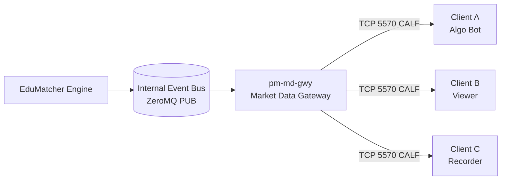
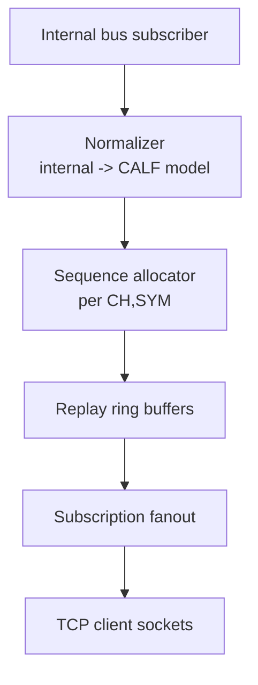
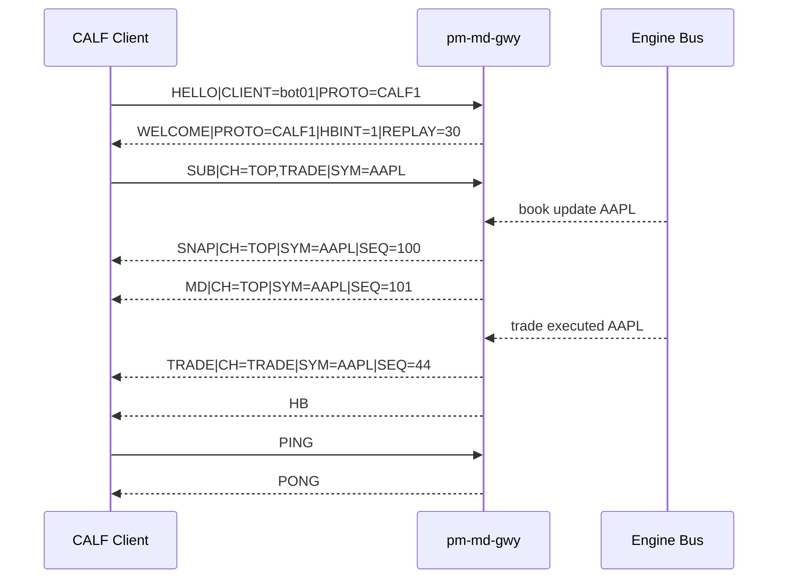

Version: 0.1.0

Date: 2026-06-07

Status: Design and Research Proposal


# CALF: Channel ALF Market Data Protocol

---

## 1. Motivation

EduMatcher already has:
- ALF for simple text-based order entry
- BALF for low-latency binary order entry

What is missing is a matching market-data protocol with the same spirit:
- easy to teach
- easy to debug
- useful for real bots
- not overloaded with exchange-grade complexity

This proposal introduces **CALF** (**C**hannel **ALF**), a 90/10 market-data
protocol:
- supports the 90% of use cases most learners and bot builders need
- intentionally skips edge-case-heavy features that add complexity

The key design target is practical educational value:
- students can read frames in a terminal and reason about state
- bots can recover from dropped packets/messages with clear sequence logic
- architecture remains compatible with a future binary companion

### 1.1 90/10 scope statement

CALF v1 should support:
- top-of-book updates (best bid/ask)
- trade prints
- periodic snapshots
- sequence-numbered incremental updates
- heartbeat and liveness
- simple subscription model by symbol and channel
- deterministic reconnect + replay-from-sequence (bounded window)

CALF v1 intentionally excludes:
- full depth-by-order feed
- multicast
- conflation controls negotiated per client
- entitlement/permission matrix by field
- historical data service

---

## 2. Protocol Name and Positioning

**Name:** CALF (Channel ALF)

Why this fits the family:
- ALF: simple textual order entry
- BALF: binary order entry
- CALF: simple channelized market data

The name is playful and memorable, while preserving the educational tone of the
existing stack.

---

## 3. Architecture Overview



`pm-md-gwy` (market-data gateway) subscribes to internal engine events,
normalizes them into CALF messages, and fans them out to connected clients.

### 3.1 Internal message dependencies

`pm-md-gwy` consumes at least these internal topics/messages:
- `trade.executed.*`
- `book.snapshot.*`
- `order_book.delta.*` (or equivalent per-symbol incremental event)
- `session.state`
- `instrument.status.*` (optional in v1, recommended)

---

## 4. Transport and Session Model

- Transport: TCP
- Port: `5570` (configurable)
- Connection type: long-lived stream
- Encoding: UTF-8 text lines (`\n` delimited)
- Compression: none in v1

Each message is one line:
- pipe-delimited fields
- key-value format aligned with ALF readability

Example:

```text
MD|CH=TOP|SYM=AAPL|SEQ=1042|TS=2026-06-07T10:15:23.411Z|BID=150.10|BIDSZ=1200|ASK=150.12|ASKSZ=900
```

### 4.1 Liveness

- gateway sends `HB` every 1 second if no outbound market data was emitted
- client may send `PING`
- gateway replies `PONG`
- idle timeout default: 5 seconds without inbound/outbound traffic

---

## 5. CALF Message Types

### 5.1 Session control

1. `HELLO` (client -> gateway)
2. `WELCOME` (gateway -> client)
3. `SUB` (client -> gateway)
4. `UNSUB` (client -> gateway)
5. `HB` (gateway -> client)
6. `PING` (client -> gateway) / `PONG` (gateway -> client)
7. `ERR` (gateway -> client)

### 5.2 Market data

1. `SNAP`  full snapshot (top + last trade + optional status)
2. `MD`    incremental update (channel-specific)
3. `TRADE` trade print event
4. `STATE` trading session state updates

---

## 6. Channel Model

CALF uses logical channels to keep subscriptions simple.

Supported channels in v1:
- `TOP`     best bid/ask and sizes
- `TRADE`   last trade events
- `STATE`   session state changes
- `SNAP`    on-demand and reconnect snapshots

`SUB` examples:

```text
SUB|CH=TOP,TRADE|SYM=AAPL,MSFT
SUB|CH=STATE|SYM=*
```

Rules:
- `SYM=*` allowed only for `STATE` in v1 (to avoid accidental broadcast abuse)
- for `TOP` and `TRADE`, explicit symbol list is required
- max symbols per `SUB` request configurable (default 200)

---

## 7. Sequence and Recovery Semantics

Each `(channel, symbol)` stream has a monotonic sequence:
- `SEQ` starts at `1`
- increments by `1` per emitted event in that stream

Client recovery behavior:
- client tracks last seen `SEQ` per `(CH,SYM)`
- on reconnect, client sends:

```text
HELLO|CLIENT=bot01|PROTO=CALF1|RESUME=1|CH=TOP|SYM=AAPL|LASTSEQ=1042
```

Gateway behavior:
- if replay buffer contains `1043...latest`, gateway replays gap, then resumes live
- if gap is outside replay window, gateway sends `ERR|CODE=REPLAY_MISS` then `SNAP`

### 7.1 Replay window

Default: 30 seconds per stream in memory ring buffer.

This is enough for short disconnects while keeping implementation simple.

---

## 8. Wire Format Specification

### 8.1 Generic grammar

```text
<TYPE>|K1=V1|K2=V2|...|Kn=Vn\n
```

Reserved keys:
- `TYPE` implicit in message prefix token
- `CH`, `SYM`, `SEQ`, `TS`

Timestamp format:
- UTC ISO-8601 with milliseconds (`2026-06-07T10:15:23.411Z`)

Max line length:
- **4096 bytes** (including the trailing `\n`)
- Gateway may disconnect a client that sends a line exceeding this limit with `ERR|CODE=BAD_MESSAGE`
- Clients should allocate read buffers of at least 4096 bytes

### 8.2 Field conventions

- Prices: decimal text (v1 education-first readability)
- Sizes: integer
- Missing numeric value: omit field (do not send empty)
- Symbol: ASCII ticker

---

## 9. Message Definitions and Examples

### 9.1 HELLO

Client -> gateway

**Purpose:** Initiate the CALF session, identify the client, and optionally request resume from a last seen sequence.

**Return:** Yes. Gateway responds with `WELCOME` on success, or `ERR` on protocol/validation failure.

**Fields:**

| Field      | Req           | Type    | Description |
|------------|---------------|---------|-------------|
| `CLIENT`   | ✓             | string  | Client identifier; max 32 ASCII chars |
| `PROTO`    | ✓             | string  | Must be `CALF1` |
| `RESUME`   | –             | `0`/`1` | Set `1` to request gap replay |
| `CH`       | if `RESUME=1` | string  | Single channel for resume |
| `SYM`      | if `RESUME=1` | string  | Single symbol for resume |
| `LASTSEQ`  | if `RESUME=1` | int     | Last received sequence for this `(CH, SYM)` stream |

> **v1 limitation:** `RESUME` applies to one `(CH, SYM)` stream per `HELLO`. To resume multiple streams, send a plain `HELLO` (no `RESUME`) then issue a `SUB`; the gateway will auto-send `SNAP` for each newly subscribed stream.

```text
HELLO|CLIENT=bot01|PROTO=CALF1
```

Optional resume:

```text
HELLO|CLIENT=bot01|PROTO=CALF1|RESUME=1|CH=TOP|SYM=AAPL|LASTSEQ=1042
```

### 9.2 WELCOME

Gateway -> client

**Purpose:** Confirm successful session establishment and advertise gateway/session parameters.

**Return:** No acknowledge required from the client.

**Fields:**

| Field    | Req | Type   | Description |
|----------|-----|--------|-------------|
| `PROTO`  | ✓   | string | Negotiated version, echoes client's `PROTO` value |
| `GW`     | ✓   | string | Gateway instance name |
| `HBINT`  | ✓   | int    | Heartbeat interval in seconds |
| `REPLAY` | ✓   | int    | Replay window in seconds |

```text
WELCOME|PROTO=CALF1|GW=md-gwy01|HBINT=1|REPLAY=30
```

### 9.3 SUB

Client -> gateway

**Purpose:** Register or update symbol/channel subscriptions for market-data delivery.

**Return:** No dedicated ack in v1. Accepted subscriptions immediately trigger a `SNAP` per `(CH, SYM)` pair, then live incremental updates. Invalid requests return `ERR`.

**Fields:**

| Field | Req | Type   | Description |
|-------|-----|--------|-------------|
| `CH`  | ✓   | string | Comma-separated channel list; valid values: `TOP`, `TRADE`, `STATE`, `SNAP` |
| `SYM` | ✓   | string | Comma-separated symbol list; `*` is only allowed when `CH` contains only `STATE` |

```text
SUB|CH=TOP,TRADE|SYM=AAPL,MSFT
```

### 9.4 SNAP

Gateway -> client

**Purpose:** Provide a point-in-time baseline state for a `(CH, SYM)` stream. Sent automatically after a `SUB` and after gap recovery when replay is not possible.

**Return:** No acknowledge required.

**Fields:**

| Field     | Req | Type    | Description |
|-----------|-----|---------|-------------|
| `CH`      | ✓   | string  | Always `TOP` in v1 |
| `SYM`     | ✓   | string  | Instrument symbol |
| `SEQ`     | ✓   | int     | Current sequence number for this stream; next `MD` will be `SEQ+1` |
| `TS`      | ✓   | string  | UTC ISO-8601 timestamp with ms |
| `BID`     | –   | decimal | Best bid price; omitted if no active bid |
| `BIDSZ`   | –   | int     | Best bid quantity; omitted if no active bid |
| `ASK`     | –   | decimal | Best ask price; omitted if no active ask |
| `ASKSZ`   | –   | int     | Best ask quantity; omitted if no active ask |
| `LAST`    | –   | decimal | Last traded price; omitted if no trades yet |
| `LASTSZ`  | –   | int     | Last traded quantity; omitted if no trades yet |

```text
SNAP|CH=TOP|SYM=AAPL|SEQ=1050|TS=2026-06-07T10:16:00.000Z|BID=150.10|BIDSZ=1200|ASK=150.12|ASKSZ=900|LAST=150.11|LASTSZ=300
```

### 9.5 MD (TOP incremental)

Gateway -> client

**Purpose:** Deliver incremental top-of-book updates for subscribed streams using monotonic sequence progression. Client must process updates in sequence order; a gap indicates a missed event and should trigger reconnect/replay.

**Return:** No acknowledge required.

**Fields:**

| Field   | Req | Type    | Description |
|---------|-----|---------|-------------|
| `CH`    | ✓   | string  | Channel identifier (e.g. `TOP`) |
| `SYM`   | ✓   | string  | Instrument symbol |
| `SEQ`   | ✓   | int     | Monotonic sequence; increments by 1 per emitted event |
| `TS`    | ✓   | string  | UTC ISO-8601 timestamp with ms |
| `BID`   | –   | decimal | Updated best bid price; omitted if unchanged |
| `BIDSZ` | –   | int     | Updated best bid quantity; omitted if unchanged |
| `ASK`   | –   | decimal | Updated best ask price; omitted if unchanged |
| `ASKSZ` | –   | int     | Updated best ask quantity; omitted if unchanged |

```text
MD|CH=TOP|SYM=AAPL|SEQ=1051|TS=2026-06-07T10:16:00.115Z|BID=150.11|BIDSZ=1400|ASK=150.13|ASKSZ=800
```

### 9.6 TRADE

Gateway -> client

**Purpose:** Publish an executed trade print for subscribed symbols. Each `TRADE` message represents a single fill event at the matching engine.

**Return:** No acknowledge required.

**Fields:**

| Field  | Req | Type    | Description |
|--------|-----|---------|-------------|
| `CH`   | ✓   | string  | Always `TRADE` |
| `SYM`  | ✓   | string  | Instrument symbol |
| `SEQ`  | ✓   | int     | Monotonic sequence for the `(TRADE, SYM)` stream |
| `TS`   | ✓   | string  | Execution timestamp |
| `PX`   | ✓   | decimal | Trade price |
| `QTY`  | ✓   | int     | Trade quantity |
| `SIDE` | ✓   | string  | Aggressor side: `BUY` or `SELL` |

```text
TRADE|CH=TRADE|SYM=AAPL|SEQ=809|TS=2026-06-07T10:16:00.141Z|PX=150.12|QTY=200|SIDE=BUY
```

### 9.7 STATE

Gateway -> client

**Purpose:** Broadcast trading-session or instrument-state transitions. Clients should update their internal session model on receipt and halt order logic as appropriate (e.g. during `HALTED` or `CLOSED`).

**Return:** No acknowledge required.

**Fields:**

| Field     | Req | Type   | Description |
|-----------|-----|--------|-------------|
| `CH`      | ✓   | string | Always `STATE` |
| `SYM`     | ✓   | string | Instrument symbol, or `*` for session-wide state |
| `SEQ`     | ✓   | int    | Monotonic sequence for the `(STATE, SYM)` stream |
| `TS`      | ✓   | string | Transition timestamp |
| `SESSION` | ✓   | string | New state — see valid values below |

**Valid `SESSION` values:**

| Value         | Meaning |
|---------------|---------|
| `PRE_OPEN`    | Session accepted but matching not yet active |
| `OPEN`        | Matching active (opening auction complete in full exchanges; continuous trading in v1) |
| `CONTINUOUS`  | Continuous matching active |
| `HALTED`      | Instrument temporarily halted; no matching |
| `CLOSED`      | Session ended; no further events for this symbol |

```text
STATE|CH=STATE|SYM=AAPL|SEQ=14|TS=2026-06-07T10:30:00.000Z|SESSION=CONTINUOUS
```

### 9.8 ERR

Gateway -> client

**Purpose:** Report protocol, subscription, or recovery failures with a machine-parseable code so the client can take appropriate action.

**Return:** No acknowledge required. Client action depends on `CODE`.

**Fields:**

| Field  | Req | Type   | Description |
|--------|-----|--------|-------------|
| `CODE` | ✓   | string | Machine-readable error code (see table below) |
| `MSG`  | –   | string | Human-readable description for logging |
| `CH`   | –   | string | Channel context, if applicable |
| `SYM`  | –   | string | Symbol context, if applicable |

**ERR codes:**

| Code             | Trigger | Recommended client action |
|------------------|---------|---------------------------|
| `PROTO_MISMATCH` | `PROTO` value not recognised | Close connection; upgrade client |
| `AUTH_REQUIRED`  | Message received before a valid `HELLO` | Send `HELLO` first |
| `INVALID_CHANNEL`| `CH` contains an unknown channel name | Correct `CH` and resend `SUB` |
| `INVALID_SYMBOL` | `SYM` contains an unrecognised symbol | Correct `SYM` and resend `SUB` |
| `SUB_LIMIT`      | Symbol count exceeds `max_symbols_per_client` | Reduce symbols and resend |
| `REPLAY_MISS`    | `LASTSEQ` is outside the replay window | Accept the following `SNAP` and continue live |
| `SLOW_CLIENT`    | Outbound queue overflow | Reconnect and resume via `LASTSEQ` |
| `BAD_MESSAGE`    | Unparseable line received from client | Fix client encoding or framing |

```text
ERR|CODE=REPLAY_MISS|MSG=Requested sequence outside replay buffer|CH=TOP|SYM=AAPL
```

### 9.9 UNSUB

Client -> gateway

**Purpose:** Cancel one or more active subscriptions. The gateway stops streaming for the specified `(CH, SYM)` combinations. Any outstanding buffered messages may still arrive briefly after the `UNSUB` is processed.

**Return:** No acknowledge. Streaming for the unsubscribed pairs stops. Invalid requests return `ERR`.

**Fields:** Same structure as `SUB`.

| Field | Req | Type   | Description |
|-------|-----|--------|-------------|
| `CH`  | ✓   | string | Comma-separated channels to unsubscribe |
| `SYM` | ✓   | string | Comma-separated symbols to unsubscribe |

```text
UNSUB|CH=TOP|SYM=AAPL
UNSUB|CH=TOP,TRADE|SYM=AAPL,MSFT
```

### 9.10 HB (Heartbeat)

Gateway -> client

**Purpose:** Signal liveness when no market-data event was emitted during the last heartbeat interval (`HBINT`). The client should use absence of both data messages and `HB` to detect a stale connection. If no inbound or outbound traffic occurs within `idle_timeout_sec`, the client should close and reconnect.

**Return:** No response required from the client.

**Fields:**

| Field | Req | Type   | Description |
|-------|-----|--------|-------------|
| `TS`  | ✓   | string | Gateway UTC timestamp at emission |

```text
HB|TS=2026-06-07T10:16:05.000Z
```

### 9.11 PING / PONG

PING: Client -> gateway  
PONG: Gateway -> client

**Purpose:** Client-initiated liveness probe. The gateway echoes `PONG` immediately. Useful for measuring round-trip latency or confirming the connection is alive without waiting for the next `HB`.

**Return:** `PING` always receives a `PONG`. `PONG` requires no further response.

**Fields:** No mandatory fields. `TS` may be included optionally for round-trip latency measurement.

```text
PING
PONG
```

With optional timestamp echo:

```text
PING|TS=2026-06-07T10:16:06.123Z
PONG|TS=2026-06-07T10:16:06.123Z
```

---

## 10. pm-md-gwy Design Proposal

This gateway is the CALF publisher process.

### 10.1 Responsibilities

- subscribe to internal bus topics
- normalize payloads into CALF fields
- maintain per-stream sequence counters
- keep bounded replay buffers
- manage client sessions/subscriptions
- enforce symbol/channel limits and backpressure policy

### 10.2 Non-responsibilities

- no matching logic
- no risk checks
- no entitlement matrix in v1
- no persistence beyond in-memory replay window

### 10.3 Data flow inside gateway



### 10.4 Backpressure policy (v1)

If a client cannot keep up:
- queue per client capped (default 10,000 messages)
- on overflow, disconnect client with:
  - `ERR|CODE=SLOW_CLIENT`
- client reconnects and resumes via `LASTSEQ`

This keeps the gateway stable under load without complicated QoS logic.

---

## 11. Session Lifecycle Example



---

## 12. Config Proposal

Add to `engine_config.yaml`:

```yaml
market_data_gateway:
  enabled: true
  bind_address: "0.0.0.0"
  port: 5570
  heartbeat_interval_sec: 1
  idle_timeout_sec: 5
  replay_window_sec: 30
  max_symbols_per_client: 200
  max_client_queue: 10000
```

---

## 13. Educational Mapping to Existing Concepts

CALF maps directly to concepts learners already know:
- ALF style: pipe-delimited readable messages
- BALF concept: sequence and liveness discipline
- Exchange fundamentals: snapshots + incrementals + replay

This means one can teach:
1. simple CLI client first
2. bot subscription and gap handling second
3. binary feed evolution later

---

## 14. Security and Operational Notes

For v1 education environments:
- run on trusted network
- optionally terminate TLS at proxy sidecar (not inside CALF)

Operational observability metrics:
- clients connected
- messages/sec per channel
- replay hit ratio
- slow-client disconnect count
- max fanout latency

---

## 15. Future Evolution (v2+)

Natural upgrades once v1 is stable:
- `BCALF` binary market-data variant
- depth-by-price channel (`DEPTH`)
- entitlement and symbol groups
- optional gzip/zstd framing
- multicast for high fanout
- durable replay from disk (minutes -> hours)

---

## 16. Worked Client Example (Python pseudocode)

```python
import socket

s = socket.create_connection(("127.0.0.1", 5570))

s.sendall(b"HELLO|CLIENT=demo01|PROTO=CALF1\n")
print(s.recv(4096).decode())

s.sendall(b"SUB|CH=TOP,TRADE|SYM=AAPL\n")

last_seq_top = 0
last_seq_trade = 0

while True:
    line = s.recv(4096).decode().strip()
    if not line:
        break
    parts = line.split("|")
    mtype = parts[0]
    kv = dict(p.split("=", 1) for p in parts[1:] if "=" in p)

    if mtype in {"SNAP", "MD", "TRADE"}:
        ch = kv.get("CH")
        seq = int(kv["SEQ"])
        if ch == "TOP":
            if last_seq_top and seq != last_seq_top + 1:
                print("gap on TOP", last_seq_top, seq)
            last_seq_top = seq
        elif ch == "TRADE":
            if last_seq_trade and seq != last_seq_trade + 1:
                print("gap on TRADE", last_seq_trade, seq)
            last_seq_trade = seq

    print(line)
```

---

## 17. Open Questions

1. Should `SYM=*` be allowed for `TOP` in lab mode only?
2. Should replay be per-client ring or shared per-stream ring (recommended: shared)?
3. Should `SNAP` be auto-sent on every `SUB` (recommended: yes)?
4. Should we include a simple auth token in `HELLO` for classroom multi-user deployments?
5. Do we want CALF field names exactly aligned with ALF where possible (`QTY` vs `SIZE`)?

---

## 18. Summary

CALF provides an intentionally simple market-data protocol that matches
EduMatcher's teaching goals while remaining production-shaped in core ideas:
- channelized subscriptions
- sequence numbers
- gap recovery
- snapshots plus incrementals
- gateway fanout design (`pm-md-gwy`)

It is a 90/10 protocol: small surface area, clear behavior, and enough realism
for meaningful exchange-system learning.
