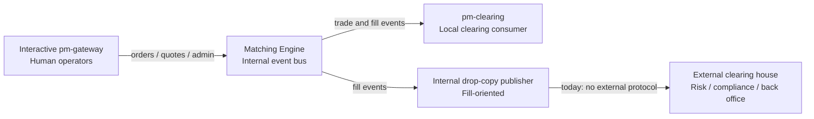
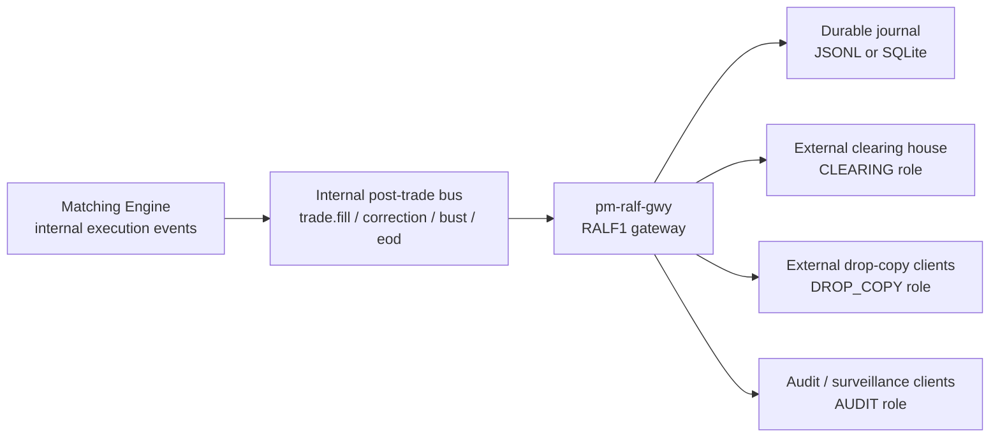

Version: 1.0.0

Date: 2026-06-19

Status: Design and Research Proposal

# EduMatcher - Post-Trade Dissemination Gateway and RALF Protocol


## Table of Contents

1. [Motivation](#1-motivation)
2. [Problem Statement](#2-problem-statement)
3. [Goals and Non-Goals](#3-goals-and-non-goals)
4. [Current State](#4-current-state)
5. [Design Summary](#5-design-summary)
   5.1 [Why not reuse pm-gateway](#51-why-not-reuse-pm-gateway)
   5.2 [Why not reuse CALF market data](#52-why-not-reuse-calf-market-data)
   5.3 [Recommended boundary](#53-recommended-boundary)
6. [RALF Protocol Definition](#6-ralf-protocol-definition)
   6.1 [Transport and session model](#61-transport-and-session-model)
   6.2 [Wire grammar and encoding](#62-wire-grammar-and-encoding)
   6.3 [Channel and role model](#63-channel-and-role-model)
   6.4 [Session handshake and control messages](#64-session-handshake-and-control-messages)
   6.5 [Execution lifecycle messages](#65-execution-lifecycle-messages)
   6.6 [Replay and recovery messages](#66-replay-and-recovery-messages)
   6.7 [Standard error codes](#67-standard-error-codes)
7. [Post-Trade Event Model](#7-post-trade-event-model)
   7.1 [Execution report](#71-execution-report)
   7.2 [Correction event](#72-correction-event)
   7.3 [Bust event](#73-bust-event)
   7.4 [Allocation and clearing event](#74-allocation-and-clearing-event)
   7.5 [End-of-day summary](#75-end-of-day-summary)
8. [Subscription, Entitlements, and Delivery Semantics](#8-subscription-entitlements-and-delivery-semantics)
   8.1 [Subscriber roles](#81-subscriber-roles)
   8.2 [Delivery guarantees](#82-delivery-guarantees)
   8.3 [Idempotency and checkpoints](#83-idempotency-and-checkpoints)
   8.4 [External client subscription examples](#84-external-client-subscription-examples)
9. [Sequence, Replay, and Recovery](#9-sequence-replay-and-recovery)
10. [Gateway Architecture](#10-gateway-architecture)
    10.1 [Responsibilities](#101-responsibilities)
    10.2 [Non-responsibilities](#102-non-responsibilities)
    10.3 [Data flow inside the gateway](#103-data-flow-inside-the-gateway)
    10.4 [Key data structures](#104-key-data-structures)
    10.5 [Internal event handling](#105-internal-event-handling)
11. [Configuration Reference](#11-configuration-reference)
12. [Integration with Existing Processes](#12-integration-with-existing-processes)
13. [Security and Operational Notes](#13-security-and-operational-notes)
14. [Implementation Plan](#14-implementation-plan)
15. [Testing Plan](#15-testing-plan)
16. [Open Questions](#16-open-questions)
17. [Acceptance Checklist](#17-acceptance-checklist)
18. [Summary](#18-summary)


## 1. Motivation

EduMatcher already has human-facing interactive gateways for order entry and
administration, and it already has internal event buses that publish fills and
trade-related state. What it does not yet have is a purpose-built machine-facing
post-trade dissemination path that an external clearing house can subscribe to
without knowing anything about ZeroMQ or the interactive gateway commands.

A clearing house is not a terminal user. It needs an electronic feed that is:

- deterministic
- replayable
- machine-readable
- durable enough for reconciliation
- explicit about corrections, busts, allocations, and settlement state

A separate post-trade gateway is the cleanest way to provide that feed.

### 1.1 Why this is a separate protocol

The feed needs its own structure because post-trade consumers care about more
than "a trade happened": they need the execution identity, order identity,
matching identity, correction history, clearing allocation, and end-of-day
summary data. That is a different shape of data from market data.

So the proposal is not "reuse the human gateway". It is:

- keep `pm-gateway` for interactive humans
- add a new post-trade dissemination gateway for electronic consumers
- define a dedicated post-trade wire protocol, called here `RALF1`

`RALF` means **Reconciliation ALF** in this document. It follows the ALF-family
naming style (`ALF`, `BALF`, `CALF`) while making the post-trade purpose explicit.


## 2. Problem Statement

Current EduMatcher post-trade information is scattered across internal engine
messages and process-specific outputs:

- the engine publishes trade and state events on its internal ZeroMQ bus
- the clearing process reads those events locally
- the drop-copy documentation describes an internal publisher for fill events
- the human gateway knows how to show orders, quotes, and status, but it is not a
  direct post-trade dissemination service

That leaves several gaps for a real external consumer:

1. There is no dedicated external socket that a clearing house can connect to.
2. There is no stable external protocol for post-trade messages.
3. Replay, correction, and settlement semantics are not formalised end to end.
4. Different downstream users need different views of the same execution data.
5. Human operator tools and machine feeds are too different to share a protocol
   without bloating the meaning of the existing market-data model.

In short: the system needs a post-trade feed, not another gateway terminal.


## 3. Goals and Non-Goals

### 3.1 Goals

- Publish all post-trade information needed by a clearing house.
- Support external drop-copy style subscribers without exposing ZeroMQ topics.
- Provide a text protocol that is easy to inspect and debug.
- Keep the engine isolated from external consumer logic.
- Support deterministic replay and reconnect after short outages.
- Support corrections, busts, allocations, and end-of-day summary events.
- Support role-based subscribers with different entitlement levels.
- Keep the design teachable and aligned with the rest of EduMatcher.

### 3.2 Non-Goals

- No order entry or quote entry.
- No market data dissemination (`TOP`, `TRADE`, or `STATE` market feed).
- No matching engine logic.
- No clearing-house business rules beyond event dissemination.
- No FIX engine implementation in v1.
- No TLS termination inside the gateway itself.
- No attempt to model every real-world CCP nuance in v1.


## 4. Current State

Today, the engine already produces the raw ingredients for a post-trade feed:

- execution events when orders fill
- internal state transitions for session and symbol lifecycle
- optional drop-copy style fill messages
- end-of-day information that can be consumed by statistics and clearing tools

However, those outputs are not yet packaged as a dedicated external feed with a
clear contract for outside systems.



The missing piece is a machine-facing dissemination gateway with a stable feed
and explicit replay rules.


## 5. Design Summary

The recommended design is a new process, tentatively called `pm-ralf-gwy`,
that subscribes to the engine's internal post-trade events and republishes them
on a dedicated TCP feed using `RALF1`.

The gateway should serve two related but distinct consumer classes:

- `CLEARING` subscribers: need the full reconciliation payload, durable replay,
  and settlement-oriented fields.
- `DROP_COPY` subscribers: need the execution copy for compliance, auditing, or
  trade capture, but may not need every settlement field.

### 5.1 Why not reuse pm-gateway

`pm-gateway` is an interactive terminal. Its job is to help a human place and
inspect orders. It is not a proper dissemination service because:

- it assumes a logged-in operator at a terminal
- its command vocabulary is human-oriented
- it does not have durable replay semantics
- it is not designed to fan out the same event to multiple downstream systems

### 5.2 Why not reuse CALF market data

CALF is a good fit for market data, snapshots, and session state. It is not the
best default for post-trade because the payload semantics are different:

- market data cares about top-of-book and session state
- post-trade cares about execution identity, corrections, allocations, and
  settlement state
- clearing consumers need stronger replay and audit guarantees than a short
  market-data replay window

So the right pattern is:

- CALF remains the market-data feed
- RALF is the post-trade feed

### 5.3 Recommended boundary

Keep the boundary very simple:

- Engine produces authoritative internal execution events.
- Post-trade gateway normalises and journals those events.
- External consumers subscribe to the gateway, not to ZeroMQ topics.
- `pm-clearing` can either continue as an internal consumer or migrate to the new
  feed later.

This keeps the engine focused and gives the outside world a clean contract.


## 6. RALF Protocol Definition

RALF is a line-oriented, human-readable, pipe-delimited protocol. It is designed
to look familiar to anyone who has used ALF or CALF, but its vocabulary is
specific to post-trade reconciliation and clearing dissemination.

### 6.1 Transport and session model

| Property | Value |
|---|---|
| Transport | TCP |
| Encoding | UTF-8 text lines, `\n` delimited |
| Port | Configurable, suggested default `5580` |
| Connection model | One long-lived TCP connection per client |
| Replay | Sequence-based, with durable journal support |
| Compression | Not in v1 |

The gateway should use the same handshake pattern as the other text protocols:

```text
HELLO|CLIENT=clearing01|PROTO=RALF1|ROLE=CLEARING
WELCOME|PROTO=RALF1|GW=ralf-gwy01|ROLE=CLEARING|REPLAY=86400|HBINT=1
```

### 6.2 Wire grammar and encoding

RALF lines use the same envelope style as CALF:

```text
<MSGTYPE>|KEY=VALUE|KEY=VALUE|...\n
```

- `MSGTYPE` is the first bare token and is always uppercase ASCII.
- Key-value fields are pipe-delimited.
- Encoding is UTF-8.
- One line equals one logical message.
- Maximum line length should be capped (recommended 8192 bytes) to avoid
   unbounded parser memory growth.

Reserved keys across all RALF messages:

| Key | Type | Meaning |
|---|---|---|
| `CH` | string | Channel (`CLEARING`, `DROP_COPY`, `AUDIT`) |
| `SEQ` | int | Monotonic sequence number for the stream |
| `TS` | string | UTC ISO-8601 timestamp |
| `GW` | string | Originating gateway id |
| `SYM` | string | Instrument symbol |

### 6.3 Channel and role model

RALF supports roles because consumers are not identical.

| Role | Intended consumer | Typical use |
|---|---|---|
| `CLEARING` | Clearing house or back-office clearing engine | Full trade, correction, allocation, and settlement visibility |
| `DROP_COPY` | Risk, compliance, surveillance, audit | Execution copies and reconciliation history |
| `AUDIT` | Internal record keeping | Full-fidelity event journal access |

Channel families are explicit and subscribable:

| Channel | Purpose |
|---|---|
| `CLEARING` | Full post-trade lifecycle and settlement-oriented fields |
| `DROP_COPY` | Execution-copy view for external compliance/risk consumers |
| `AUDIT` | Full-fidelity operational/audit stream |

### 6.4 Session handshake and control messages

Session control message types:

- `HELLO`
- `WELCOME`
- `SUB`
- `UNSUB`
- `PING`
- `PONG`
- `HB`
- `EXIT`

`HELLO` required fields:

| Field | Req | Description |
|---|---|---|
| `CLIENT` | yes | External consumer id |
| `PROTO` | yes | Must be `RALF1` |
| `ROLE` | yes | One of `CLEARING`, `DROP_COPY`, `AUDIT` |
| `LASTSEQ` | no | Last consumed sequence for replay |

Example:

```text
HELLO|CLIENT=ccp01|PROTO=RALF1|ROLE=CLEARING|LASTSEQ=18231
WELCOME|PROTO=RALF1|GW=ralf-gwy01|ROLE=CLEARING|REPLAY=86400|HBINT=1
```

### 6.5 Execution lifecycle messages

RALF execution lifecycle message types:

- `EXEC`
- `CORRECT`
- `BUST`
- `ALLOC`
- `SETTLE`
- `EOD`

Minimum required fields by message type:

| Message | Required fields |
|---|---|
| `EXEC` | `CH,SEQ,TS,EXEC_ID,MATCH_ID,ORDER_ID,GW,SYM,SIDE,QTY,PX` |
| `CORRECT` | `CH,SEQ,TS,CORRECT_ID,ORIG_EXEC_ID,REASON` |
| `BUST` | `CH,SEQ,TS,BUST_ID,ORIG_EXEC_ID,REASON` |
| `ALLOC` | `CH,SEQ,TS,ALLOC_ID,EXEC_ID,CLEARING_MEMBER,ACCOUNT,NET_QTY,NET_PX,SETTLE_DATE,STATUS` |
| `SETTLE` | `CH,SEQ,TS,SETTLE_ID,EXEC_ID,SETTLE_DATE,STATUS` |
| `EOD` | `CH,SEQ,TS,TRADE_COUNT,EXEC_COUNT` |

### 6.6 Replay and recovery messages

Recovery message types:

- `SNAP` for baseline state after replay miss or explicit resync
- `ERR` for protocol, entitlement, and replay failures

Recovery flow:

1. Client connects with `LASTSEQ`.
2. Gateway replays `SEQ > LASTSEQ` if available.
3. If unavailable, gateway sends `ERR|CODE=REPLAY_MISS` then `SNAP`.
4. Live stream resumes after replay or baseline sync.

### 6.7 Standard error codes

| Code | Meaning |
|---|---|
| `PROTO_MISMATCH` | Unsupported protocol version |
| `AUTH_REQUIRED` | Missing/invalid role or handshake sequence |
| `INVALID_CHANNEL` | Unsupported `CH` value |
| `ENTITLEMENT_DENIED` | Role not allowed for requested channel/symbol scope |
| `REPLAY_MISS` | Requested sequence older than retained journal window |
| `SLOW_CLIENT` | Client queue overflow; disconnect imminent |
| `BAD_MESSAGE` | Unparseable message or invalid field set |

This is intentionally a dedicated post-trade vocabulary, not a re-labeled
market-data vocabulary.


## 7. Post-Trade Event Model

This section defines the actual business payloads the gateway must publish.

### 7.1 Execution report

`EXEC` is the canonical live event. It represents a fill that a downstream
consumer must book or reconcile.

Required fields should include:

| Field | Purpose |
|---|---|
| `EXEC_ID` | Unique execution identifier from the gateway |
| `MATCH_ID` | Identifier for the matched trade event |
| `ORDER_ID` | Resting order that was filled |
| `GW` | Originating gateway id |
| `SYM` | Instrument symbol |
| `SIDE` | Side of the aggressive or resting participant, depending on policy |
| `QTY` | Executed quantity |
| `PX` | Execution price |
| `TS` | Execution timestamp |
| `SEQ` | Monotonic sequence for the stream |
| `LIQUIDITY_FLAG` | Maker/taker or similar settlement hint |
| `SESSION` | Session context at execution time |

Suggested example:

```text
EXEC|CH=EXEC|SYM=MSFT|SEQ=814|TS=2026-06-07T10:16:00.141Z|EXEC_ID=E-001|MATCH_ID=M-991|ORDER_ID=ord-001|GW=TRADER01|SIDE=BUY|QTY=100|PX=420.00|LIQUIDITY_FLAG=TAKER|SESSION=CONTINUOUS
```

### 7.2 Correction event

`CORRECT` updates the record of a prior execution without pretending the old
execution never happened.

Typical uses:

- price correction
- quantity correction
- timestamp correction when internal sequencing is refined
- late mapping of the clearing account

Required fields should include:

- `CORRECT_ID`
- `ORIG_EXEC_ID`
- `REASON`
- the corrected fields
- a sequence number

### 7.3 Bust event

`BUST` voids a prior execution. It should never be ambiguous.

Required fields should include:

- `BUST_ID`
- `ORIG_EXEC_ID`
- `REASON`
- `BUST_QTY`
- `BUST_PX` if the bust is partial or price-specific
- sequence number

A bust should remain in the feed forever as an audit fact; the consumer should
not infer that the original execution vanished.

### 7.4 Allocation and clearing event

`ALLOC` is the post-trade event most useful to a clearing house. It maps an
execution to the eventual clearing or settlement participant.

Suggested fields:

- `ALLOC_ID`
- `EXEC_ID`
- `CLEARING_MEMBER`
- `ACCOUNT`
- `NET_QTY`
- `NET_PX`
- `COMMISSION`
- `FEES`
- `CURRENCY`
- `SETTLE_DATE`
- `STATUS`

This is where the protocol becomes materially different from market data.

### 7.5 End-of-day summary

`EOD` should summarise the state that matters for reconciliation.

Possible fields:

- `TRADE_COUNT`
- `EXEC_COUNT`
- `BUST_COUNT`
- `CORRECT_COUNT`
- `GROSS_NOTIONAL`
- `NET_NOTIONAL`
- `OPEN_ITEMS`
- `SETTLE_DATE`

This is useful for overnight settlement and for operational signoff.


## 8. Subscription, Entitlements, and Delivery Semantics

### 8.1 Subscriber roles

The gateway should allow a client to subscribe by role and by symbol scope.

Examples:

```text
SUB|ROLE=CLEARING|SYM=*
SUB|ROLE=DROP_COPY|SYM=AAPL,MSFT
SUB|ROLE=AUDIT|SYM=*
```

### 8.2 Delivery guarantees

The feed should be at-least-once delivered with explicit sequence numbers.

Minimum guarantees:

- monotonic sequence per stream or per gateway session
- replay from a durable journal on reconnect
- no silent loss of acknowledged events
- deterministic resynchronisation after a gap

A clearing house cares more about correctness and replay than raw latency, so the
system should prefer durable journal semantics over in-memory only replay.

### 8.3 Idempotency and checkpoints

The client must be able to say, "I last consumed sequence 18142" and receive
only the missing events.

Recommended mechanism:

- `HELLO` includes `LASTSEQ` and `ROLE`
- `WELCOME` advertises replay capabilities
- `SNAP` or replay messages restore state if the gap is recoverable
- clients store checkpoints after each committed event batch

This gives the clearing house a straightforward checkpoint/replay model.

### 8.4 External client subscription examples

The examples below show a minimal external consumer handshake and subscriptions
for different channels. They assume the gateway is reachable on `127.0.0.1:5580`
and that each line is `\n` terminated.

#### Python example

```python
#!/usr/bin/env python3
import socket


def send_line(sock: socket.socket, line: str) -> None:
   sock.sendall((line + "\n").encode("utf-8"))


def recv_line(sock: socket.socket) -> str:
   data = b""
   while b"\n" not in data:
      chunk = sock.recv(4096)
      if not chunk:
         raise RuntimeError("Connection closed by gateway")
      data += chunk
   line, _, _ = data.partition(b"\n")
   return line.decode("utf-8", errors="replace")


def main() -> None:
   host = "127.0.0.1"
   port = 5580

   with socket.create_connection((host, port), timeout=5) as s:
      # Handshake as CLEARING client with replay checkpoint.
      send_line(s, "HELLO|CLIENT=ext-clear-01|PROTO=RALF1|ROLE=CLEARING|LASTSEQ=1200")
      print("<", recv_line(s))

      # Subscribe to full clearing channel.
      send_line(s, "SUB|ROLE=CLEARING|CH=CLEARING|SYM=*")

      # Optional additional subscriptions on the same session.
      send_line(s, "SUB|ROLE=DROP_COPY|CH=DROP_COPY|SYM=AAPL,MSFT")
      send_line(s, "SUB|ROLE=AUDIT|CH=AUDIT|SYM=*")

      # Read live stream.
      while True:
         print("<", recv_line(s))


if __name__ == "__main__":
   main()
```

#### C example

```c
#include <arpa/inet.h>
#include <errno.h>
#include <netinet/in.h>
#include <stdio.h>
#include <stdlib.h>
#include <string.h>
#include <sys/socket.h>
#include <sys/types.h>
#include <unistd.h>

static int send_line(int fd, const char *line) {
   size_t len = strlen(line);
   if (write(fd, line, len) != (ssize_t)len) return -1;
   if (write(fd, "\n", 1) != 1) return -1;
   return 0;
}

static int recv_line(int fd, char *buf, size_t cap) {
   size_t n = 0;
   while (n + 1 < cap) {
      char c;
      ssize_t r = read(fd, &c, 1);
      if (r <= 0) return -1;
      if (c == '\n') break;
      buf[n++] = c;
   }
   buf[n] = '\0';
   return 0;
}

int main(void) {
   int fd = socket(AF_INET, SOCK_STREAM, 0);
   if (fd < 0) {
      perror("socket");
      return 1;
   }

   struct sockaddr_in addr;
   memset(&addr, 0, sizeof(addr));
   addr.sin_family = AF_INET;
   addr.sin_port = htons(5580);
   if (inet_pton(AF_INET, "127.0.0.1", &addr.sin_addr) != 1) {
      perror("inet_pton");
      close(fd);
      return 1;
   }

   if (connect(fd, (struct sockaddr *)&addr, sizeof(addr)) != 0) {
      perror("connect");
      close(fd);
      return 1;
   }

   if (send_line(fd, "HELLO|CLIENT=ext-audit-01|PROTO=RALF1|ROLE=AUDIT|LASTSEQ=0") != 0) {
      perror("send HELLO");
      close(fd);
      return 1;
   }

   char line[4096];
   if (recv_line(fd, line, sizeof(line)) != 0) {
      perror("recv WELCOME");
      close(fd);
      return 1;
   }
   printf("< %s\n", line);

   if (send_line(fd, "SUB|ROLE=CLEARING|CH=CLEARING|SYM=*") != 0 ||
      send_line(fd, "SUB|ROLE=DROP_COPY|CH=DROP_COPY|SYM=TSLA,NVDA") != 0 ||
      send_line(fd, "SUB|ROLE=AUDIT|CH=AUDIT|SYM=*") != 0) {
      perror("send SUB");
      close(fd);
      return 1;
   }

   while (recv_line(fd, line, sizeof(line)) == 0) {
      printf("< %s\n", line);
   }

   close(fd);
   return 0;
}
```

Example compile command:

```text
cc -O2 -Wall -Wextra -o ralf_subscriber ralf_subscriber.c
```


## 9. Sequence, Replay, and Recovery

Sequence handling should be stronger than the market-data prototype because the
post-trade feed has audit significance.

Recommended behaviour:

1. Assign a monotonically increasing sequence to each outgoing event.
2. Append each event to a durable journal before release to subscribers.
3. Keep a time-based and sequence-based replay index.
4. On reconnect, replay from the requested sequence if possible.
5. If the requested point is older than the retained journal window, emit an
   explicit `ERR|CODE=REPLAY_MISS` and then send a fresh `SNAP` or operational
   baseline.

For the clearing-house use case, the replay window should be much longer than a
market-data feed, and in many deployments it should be effectively durable for
at least a trading day.


## 10. Gateway Architecture



### 10.1 Responsibilities

- Subscribe to the engine's internal post-trade event stream.
- Normalise engine events into RALF messages.
- Assign sequences and persist the journal.
- Accept external TCP client connections.
- Authenticate by role and protocol version.
- Fan out the appropriate event subset to each connected client.
- Support reconnect and replay.
- Protect the engine from slow or misbehaving consumers.

### 10.2 Non-responsibilities

- No matching.
- No order submission.
- No market data publication.
- No clearing logic beyond event dissemination.
- No business-user reporting UI.
- No FIX session management in v1.

### 10.3 Data flow inside the gateway

1. Engine emits a post-trade event.
2. Gateway normalises it into the RALF wire schema.
3. Gateway writes the event to the durable journal.
4. Gateway assigns a publish sequence.
5. Gateway fans the event to all matching subscribers.
6. Gateway updates checkpoint metadata for reconnects.

### 10.4 Key data structures

```python
_seq: dict[str, int]
_journal: pathlib.Path
_replay_index: dict[str, int]
_clients: dict[str, ClientSession]
_roles: dict[str, set[str]]
```

A minimal client session might hold:

```python
@dataclass
class ClientSession:
    client_id: str
    role: str
    socket: socket.socket
    subscriptions: set[str]
    last_activity: float
    last_seq_seen: int
    outq: deque[str]
```

### 10.5 Internal event handling

When the engine publishes a fill event:

1. Extract the execution identity and symbol.
2. Build the `EXEC` message.
3. Append it to the journal.
4. Fan out to `CLEARING`, `DROP_COPY`, and `AUDIT` subscribers.
5. If a downstream allocation rule is configured, emit `ALLOC` as a derived
   follow-on event.

When the engine publishes a correction or bust:

1. Emit the corresponding RALF message.
2. Reference the original execution id explicitly.
3. Preserve the original event in the journal.
4. Deliver the new event in sequence order.

When the engine publishes end-of-day state:

1. Create an `EOD` summary.
2. Publish the summary to clearing and audit roles.
3. Persist the summary in the journal for later reconciliation.


## 11. Configuration Reference

Add a new section to `engine_config.yaml`:

```yaml
post_trade_gateway:
  enabled: true
   name: "ralf-gwy01"
  bind_address: "0.0.0.0"
  port: 5580
  replay_retention_sec: 86400
  journal_path: "data/post_trade_journal.jsonl"
  heartbeat_interval_sec: 1
  idle_timeout_sec: 5
  max_client_queue: 10000
  allowed_roles:
    - CLEARING
    - DROP_COPY
    - AUDIT
```

Recommended defaults:

| Field | Default | Notes |
|---|---|---|
| `enabled` | `false` | Off by default until configured |
| `name` | `ralf-gwy01` | Human-readable gateway id |
| `port` | `5580` | Separate from market-data and internal ZMQ ports |
| `replay_retention_sec` | `86400` | One trading day by default |
| `journal_path` | `data/post_trade_journal.jsonl` | Durable append-only journal |


## 12. Integration with Existing Processes

The new gateway should sit alongside, not inside, the existing human gateway.

- `pm-engine` remains the source of truth for fills and state.
- `pm-clearing` may eventually consume the same post-trade event model or keep
  its current internal subscription depending on implementation choice.
- `pm-gateway` stays human-facing.
- `pm-ralf-gwy` is machine-facing.

This separation keeps the system understandable:

- human order entry stays interactive
- post-trade dissemination stays structured
- external parties do not need to know about internal ZeroMQ topics


## 13. Security and Operational Notes

- Assume trusted-network operation in v1, but the gateway should still support
  role-based access control.
- Bind to `127.0.0.1` for local labs and `0.0.0.0` for multi-host deployments.
- If a real clearing house requires TLS or a VPN tunnel, terminate that outside
  the gateway and keep the protocol itself unchanged.
- Journal files should be rotation-friendly and easy to archive.
- A failed downstream consumer must not block the engine.
- The gateway should prefer explicit disconnect over unbounded queue growth.

Useful operational metrics:

- connected clients per role
- events published per minute
- replay requests per minute
- replay misses per minute
- journal write latency
- max outbound queue depth


## 14. Implementation Plan

### Phase 1: Define the event schema

- Standardise internal engine post-trade event shapes.
- Add explicit correction and bust events if they do not yet exist.
- Decide which fields are mandatory for clearing.

### Phase 2: Build the gateway skeleton

- Create `pm-ralf-gwy`.
- Add TCP session management.
- Add the RALF handshake and subscription model.
- Fan out live execution events.

### Phase 3: Add journaling and replay

- Persist every event before publishing.
- Add checkpoint recovery.
- Support `LASTSEQ` on reconnect.

### Phase 4: Add role-based delivery

- Separate `CLEARING`, `DROP_COPY`, and `AUDIT` views.
- Filter fields by role if required.
- Add entitlement checks.

### Phase 5: Integrate with docs and tests

- Document the gateway and protocol.
- Add tests for schema, replay, correction, and bust handling.
- Verify the engine is not blocked by slow clients.


## 15. Testing Plan

Test the protocol the same way the rest of EduMatcher tests its gateways:

- unit tests for message normalisation
- unit tests for replay journal logic
- unit tests for role-based filtering
- integration tests for reconnect and `LASTSEQ`
- integration tests for correction and bust flow
- end-to-end tests showing clearing and drop-copy subscribers receiving the
  correct events

Suggested scenarios:

1. one execution, one subscriber
2. two subscribers with different roles
3. reconnect after a short gap
4. replay miss and forced resync
5. correction of a previously published execution
6. bust of a partially filled trade
7. slow client disconnect and recovery


## 16. Open Questions

1. Should RALF remain a text protocol, or should it eventually gain a binary mode
   for higher-volume deployments?
2. Should the gateway publish `SETTLE` events, or should settlement remain a
   derived concern of the clearing house?
3. Should `DROP_COPY` receive the full clearing payload or a deliberately reduced
   subset?
4. Should replay be durable for a full trading day by default, or should that be
   configurable per deployment?
5. Should the gateway expose a FIX adapter in a later version, or should that be
   a separate integration layer?
6. Should `pm-clearing` eventually move to the new feed, or should it remain a
   separate internal consumer?


## 17. Acceptance Checklist

- [ ] A separate machine-facing gateway exists for post-trade dissemination.
- [ ] Clearing consumers can receive execution data without knowing ZeroMQ.
- [ ] The protocol includes execution, correction, bust, allocation, and summary events.
- [ ] Reconnect and replay use explicit sequence numbers and checkpoints.
- [ ] Human gateway behavior is unchanged.
- [ ] The engine remains insulated from slow or unreliable external consumers.
- [ ] Documentation clearly distinguishes market data, human order entry, and post-trade dissemination.


## 18. Summary

The best design is not to turn the human gateway into a clearing feed. The best
design is a separate post-trade dissemination gateway with its own protocol,
roles, replay model, and event vocabulary.

That approach gives EduMatcher the following benefits:

- external clearing houses get an electronic feed they can consume directly
- drop-copy and audit consumers get a documented, replayable interface
- the engine remains simple and latency-sensitive
- the human gateway stays human-friendly
- the system gains a clear and teachable boundary between market data and post-trade

In short: use a dedicated gateway for post-trade dissemination, and make the
wire protocol explicit enough to stand on its own.
