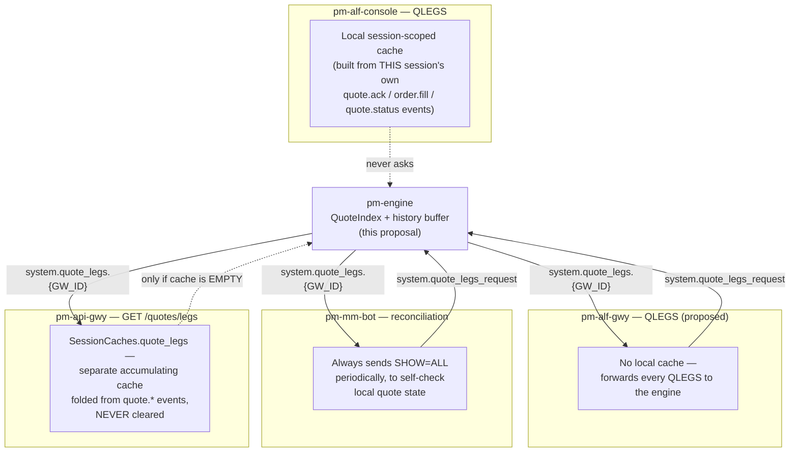
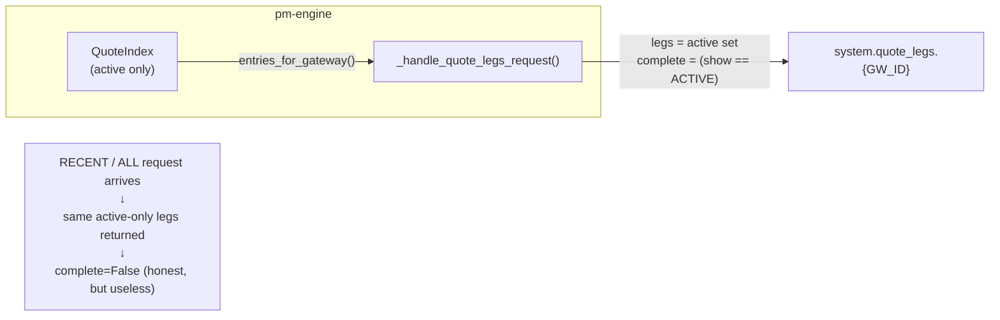
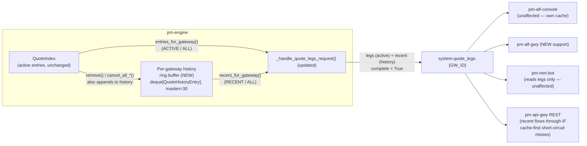
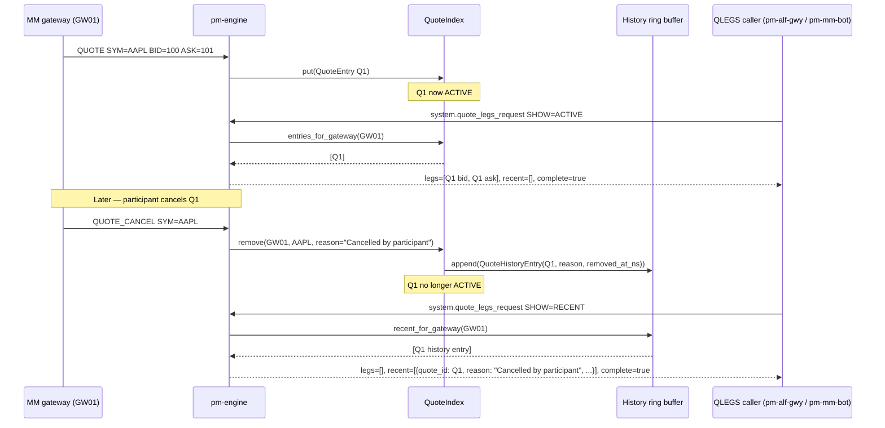

Version: 0.2.0

Date: 2026-07-19

Status: Implemented

# EduMatcher — QLEGS `RECENT`-`ALL` History Design Proposal

!!! note "v0.2.0 change"
    v0.1.0 shipped `RECENT`/`ALL` as **quote-level summaries only**
    (`quote_id`, `symbol`, order ids, derived `quote_status`, `reason`,
    `removed_at_ns`) and explicitly excluded per-leg fill detail as a
    follow-up (see the original §11 alternative, now superseded). That
    question came up directly when comparing `pm-alf-gwy`'s new
    engine-backed `QLEGS` against `pm-alf-console`'s existing local-cache
    `QLEGS` (see [§4](#4-pm-alf-gwy-vs-pm-alf-console-vs-rest-api)):
    `pm-alf-console`'s `RECENT` already reports per-leg qty/remaining/
    filled/status, so a `pm-alf-gwy` user asking the same question got a
    strictly worse answer. v0.2.0 closes that gap by widening
    `QuoteHistoryEntry` with optional `bid_leg`/`ask_leg` snapshots — see
    [§9.3](#93-per-leg-snapshot-capture-widened-in-v020) for the mechanism
    and why it turned out to be a much smaller change than v0.1.0's
    alternatives-considered entry estimated.


## Table of Contents

1. [Background and Motivation](#1-background-and-motivation)
2. [Scope — Included / Excluded](#2-scope-included-excluded)
3. [Areas Affected](#3-areas-affected)
4. [`pm-alf-gwy` vs. `pm-alf-console` vs. REST API](#4-pm-alf-gwy-vs-pm-alf-console-vs-rest-api)
5. [Known Limitations](#5-known-limitations)
6. [Regression Risk Analysis and Mitigations](#6-regression-risk-analysis-and-mitigations)
7. [Design Overview](#7-design-overview)
8. [Proposed Data Structures](#8-proposed-data-structures)
9. [Detailed Software Design](#9-detailed-software-design)
10. [Testing Strategy](#10-testing-strategy)
11. [Alternatives Considered](#11-alternatives-considered)
12. [Misc Comments](#12-misc-comments)


## 1. Background and Motivation

The ALF protocol's `QLEGS` command (documented in `docs/user-guide/050-gateway.md`)
accepts a `SHOW` parameter with three values: `ACTIVE`, `RECENT`, and `ALL`.
`ACTIVE` works correctly today — it reflects the engine's live `QuoteIndex`,
which holds exactly the quote legs currently resting in the book. `RECENT`
and `ALL` do not: the engine has never retained any record of a quote after
it leaves the active index.

The proximate cause is `QuoteIndex` itself
(`src/edumatcher/models/quote.py`). It is a pure "current state" index — a
dict keyed by `(gateway_id, symbol)`, plus two secondary indexes for
gateway-scoped and symbol-scoped lookups. `remove()`,
`cancel_all_for_gateway()`, and `cancel_all_for_symbol()` all pop entries out
of these dicts unconditionally. Once a quote's leg fills or is cancelled, the
`QuoteEntry` object is discarded — there is no code path that copies it
anywhere else first.

This is visible end-to-end. `Engine._handle_quote_legs_request()`
(`src/edumatcher/engine/main.py:1466`) is honest about it: regardless of the
requested `show` value, it always builds `legs` from
`QuoteIndex.entries_for_gateway()` — the **active** set — and sets
`complete=False` whenever `show` asked for more than `ACTIVE`.
`make_quote_legs_msg()` (`src/edumatcher/models/message.py:310`) documents
the same thing in its docstring. This is a deliberate, honest design choice
made when QLEGS was first implemented (see `docs-design/EduMatcher-ALF-Gwy.md`
and `docs-design/mm-quote-identification.md` for prior art) — the engine
never lies about having data it doesn't have. But it does mean `RECENT` and
`ALL` are, today, silently useless: an operator or bot asking "what just
happened to my quote?" gets back the same active-only answer as `ACTIVE`,
with a `complete=False` flag that in practice nothing surfaces to a human
(see [§6](#6-regression-risk-analysis-and-mitigations) on `pm-mm-bot`).

**Why this matters in practice:**

- A market maker operator running `pm-alf-console` who just watched a quote
  get filled or cancelled has no way to review that event a few lines later
  in QLEGS output — they must scroll back through the raw event stream
  (`FILL`, `QUOTE_STATUS`) instead of getting a compact, purpose-built view.
- `pm-alf-gwy` — the TCP gateway used by external bots and remote scripts —
  does not support `QLEGS` **at all** today; it is explicitly rejected as
  `UNKNOWN_COMMAND`. Any design for `RECENT` must also decide what `pm-alf-gwy`
  does, not just `pm-alf-console`.
- `pm-mm-bot` always requests `SHOW=ALL` (see
  `src/edumatcher/mm_bot/bot.py`, `_reconcile_qlegs` caller), so every QLEGS
  round-trip it makes already asks for data the engine cannot supply. This
  happens to be harmless today only because `pm-mm-bot`'s reconciliation
  logic reads `legs` (always populated with the active set) and does not
  branch on `complete` — but it is worth fixing properly rather than relying
  on that coincidence indefinitely.
- The API gateway's `GET /quotes/legs` endpoint has a **third**, independent
  notion of "quote legs" (see [§4](#4-pm-alf-gwy-vs-pm-alf-console-vs-rest-api))
  that neither of the above shares.

This document proposes closing that gap: making the engine retain a bounded,
short-lived history of recently-inactivated quotes, so `RECENT`/`ALL` become
real, honestly-`complete=True` answers instead of a documented-but-unfulfilled
promise.


## 2. Scope — Included / Excluded

### Included

- A bounded, per-gateway, **in-memory-only** history of quotes removed from
  `QuoteIndex`, populated at every removal call site in the engine.
- Real `RECENT`/`ALL` replies over the existing
  `system.quote_legs_request` / `system.quote_legs.{GW_ID}` wire protocol,
  with `complete=True` whenever the reply genuinely answers the request.
- `pm-alf-gwy` gaining `QLEGS` support (currently entirely unsupported),
  including `RECENT`/`ALL`, by forwarding to the same engine message
  `pm-alf-console` and `pm-mm-bot` already use.
- A quote-level summary shape for every `RECENT` row (`quote_id`, `symbol`,
  order ids, derived `quote_status`, `reason`, `removed_at_ns`), **plus**
  per-leg detail (`bid_leg`/`ask_leg`: `order_id`/`qty`/`remaining`/
  `filled`/`status`) captured at the moment of removal wherever the engine
  had access to it — which in practice is every quote-cancellation and
  fill-driven-inactivation path (see [§9.3](#93-per-leg-snapshot-capture-widened-in-v020)).
  The per-leg fields are `None` only in the rare case a history entry was
  recorded before its cancellation completed.
- Fixing the latent `_on_quote_leg_filled` gap discovered during design
  review (a resting quote leg filled by a *later, independent* taker order
  never reaches `_on_quote_leg_filled` today — see
  [§6.4](#64-pre-existing-bug-found-during-design-review)). This is not
  strictly part of "add RECENT," but RECENT cannot be tested or trusted
  without it, since fills are one of the most common inactivation reasons.

### Excluded

- **Persistence across engine restarts.** This history is explicitly
  in-memory-only, matching the project's existing persistence philosophy
  (`docs/user-guide/180-persistence.md`): only *actionable, resting*
  state (GTC orders, GTC combos, book stats) survives a restart. Quote
  inactivation history is neither resting nor actionable.
- **Changes to `pm-alf-console`'s own `QLEGS`.** It already has a working,
  independent local cache and does not use this wire message at all — see
  [§4](#4-pm-alf-gwy-vs-pm-alf-console-vs-rest-api).
- **Changes to the REST `GET /quotes/legs` cache semantics.** The endpoint's
  existing `SessionCaches.quote_legs` short-circuit is a separate,
  pre-existing design decision; this proposal only ensures the engine-reply
  fallback path picks up the new `recent` field for free (it passes the
  engine's payload straight through).
- **Any new engine configuration surface.** The history buffer bound is
  proposed as a module-level constant, not a new `engine_config.yaml` field,
  to keep the config surface unchanged (see [§9.1](#91-configuration)).


## 3. Areas Affected

| Area | File(s) | Nature of change |
|---|---|---|
| Quote index / history buffer | `src/edumatcher/models/quote.py` | New `QuoteHistoryEntry` dataclass; `QuoteIndex` gains a bounded per-gateway ring buffer and a query method |
| Engine removal call sites | `src/edumatcher/engine/main.py` | ~10 call sites (`remove()`, `cancel_all_for_gateway()`, `cancel_all_for_symbol()`) thread a `reason` string through to the history buffer |
| Engine fill-inactivation gap | `src/edumatcher/engine/main.py` (`_handle_new_order`) | Pre-existing bug fix: wire `_on_quote_leg_filled` into the general order-matching fill loop, not just the two quote-submission crossing loops |
| QLEGS request handler | `src/edumatcher/engine/main.py` (`_handle_quote_legs_request`) | Serve `RECENT`/`ALL` from the history buffer; `complete` always `True` |
| Wire message schema | `src/edumatcher/models/message.py` (`make_quote_legs_msg`) | New `recent` field in the reply payload |
| `pm-alf-gwy` | `src/edumatcher/alf_gwy/gateway.py` | Remove `QLEGS` from the unsupported-command set; forward requests to the engine; render `LEG` and new `RECENT_LEG` response lines |
| `pm-mm-bot` | `src/edumatcher/mm_bot/bot.py` (`_reconcile_qlegs`) | No functional change required — reconciliation reads only `legs`, which keeps its current active-only meaning — but the docstring/assumptions should be updated and a regression test added (see [§6.2](#62-pm-mm-bot-reconciliation-empty-legs-forced-reissue)) |
| REST API | `src/edumatcher/api_gateway/routers/reference.py`, `caches.py` | No code change; `recent` flows through automatically on the engine-reply fallback path only — see [§4](#4-pm-alf-gwy-vs-pm-alf-console-vs-rest-api) for the caveat |
| `pm-alf-console` | *(none)* | Out of scope — uses its own local cache, not this wire message |
| Documentation | `docs/user-guide/050-gateway.md`, `220-alf-gateway.md`, `270-messages.md`, `180-persistence.md` | Update QLEGS reference, message contract, and non-persistence rationale |
| Tests | `tests/test_mm_quote_models.py`, `tests/test_engine_quote_legs.py` | New unit tests for the ring buffer; new/rewritten integration tests for `RECENT`/`ALL` wire behavior |


## 4. `pm-alf-gwy` vs. `pm-alf-console` vs. REST API

This is one of the more important things to get right, because **there are
three independent implementations of "get me the current quote legs" in the
codebase today**, and this proposal only touches one of them directly.



| Consumer | Uses this proposal's `recent` data? | Mechanism | Notes |
|---|---|---|---|
| `pm-alf-console` `QLEGS` | **No** | Own local cache, built by observing this session's own events | Genuinely independent code path; already renders something resembling RECENT/ALL today, but only for events *this session* witnessed after connecting — not a full engine-side view. Explicitly out of scope (see [§2](#2-scope-included-excluded)). |
| `pm-alf-gwy` `QLEGS` (new) | **Yes** | Forwards to `system.quote_legs_request`, renders the reply | This is the primary consumer this proposal is written for — `pm-alf-gwy` has no `QLEGS` support at all today. |
| `pm-mm-bot` reconciliation | Indirectly (`legs` unaffected, `recent` ignored) | Same message, already in use | `_reconcile_qlegs()` only reads `legs`; unaffected in behavior. See [§6.2](#62-pm-mm-bot-reconciliation-empty-legs-forced-reissue) for the risk this proposal must not disturb. |
| REST `GET /quotes/legs` | **Conditionally** | `reference.py:70-80` checks `SessionCaches.quote_legs` first; only calls `_request_reply()` (which hits the engine message) if that cache is empty | This is a real caveat: `SessionCaches.quote_legs` is populated by folding **any** `quote.*` topic event for that gateway (`caches.py:68-72`), independent of QLEGS ever being called, and is **never cleared**. In practice, once a gateway has quoted at all during the API-gateway process's lifetime, `GET /quotes/legs` will almost always return the stale local cache — in its own shape (`{"legs": [...]}`, no `recent`, no `complete`, no `show_requested`) — and never reach the engine at all. This proposal does not change that; it is a **pre-existing** design decision in `reference.py`, but it means REST clients will likely never see `recent` in practice unless that cache-preference logic is separately revisited. Flagged explicitly so it is not mistaken for something this proposal delivers. |

**Bottom line:** this proposal is really an `pm-alf-gwy` + engine-wire-protocol
feature. `pm-alf-console` is unaffected by design (it has its own cache).
`pm-mm-bot` is a today-silent beneficiary in principle but should not be
assumed to actually use `recent` without a follow-up change to
`_reconcile_qlegs()`. The REST API is the case most likely to surprise
someone: the field will exist in the schema but frequently not appear in
responses because of the pre-existing cache-first short-circuit.


## 5. Known Limitations

1. **Per-leg `RECENT` detail is best-effort, not guaranteed.** As of v0.2.0,
   a `RECENT` row reports `bid_leg`/`ask_leg` snapshots
   (`order_id`/`qty`/`remaining`/`filled`/`status`) alongside the existing
   quote-level fields — see [§9.3](#93-per-leg-snapshot-capture-widened-in-v020).
   These are populated whenever `_cancel_quote_entry()` or
   `_on_quote_leg_filled()` had the corresponding `Order` in hand at removal
   time, which covers every normal inactivation path. They are `None` only
   when a leg could not be found at cancellation time (e.g. it was already
   gone from the book through some other path) — `attach_leg_snapshots()`
   is a best-effort enrichment of an already-recorded entry, not a
   guarantee. A consumer that needs to handle that edge case, or needs
   detail beyond the four captured fields, must still fall back to
   `order.fill.*` / `order.cancelled.*` events, the same as today.

2. **Bounded history, not a full audit trail.** The ring buffer is capped
   (proposed default: 30 entries per gateway). A gateway that inactivates
   quotes faster than an operator or bot reads `RECENT` will silently lose
   the oldest entries. This is by design (bounded memory, no persistence,
   no unbounded growth risk) but it does mean `RECENT`/`ALL` is a
   "recent window," not a guarantee. `docs/user-guide/190-audit.md`'s
   `audit.log` remains the authoritative full history if that's needed.

3. **No cross-restart continuity.** A fresh engine process starts with an
   empty history for every gateway — see [§2](#2-scope-included-excluded).
   An operator reconnecting immediately after an engine restart will see
   `RECENT` as empty even if quotes were active moments before the restart.

4. **`quote_status` for `RECENT` rows is a derived, lossy classification.**
   `QuoteEntry.state` is set once at creation (`ACTIVE`) and is never
   mutated anywhere in the engine afterward — this was independently
   confirmed by grepping for `.state =` assignments against `QuoteEntry`
   during design review, and none exist outside `put()`'s default. That
   means a removed `QuoteEntry`'s `.state` field cannot be trusted to
   reflect *why* it was removed. The proposed design instead derives
   `quote_status` from the recorded `reason` string: if `reason` is one of
   the two `INACTIVE_*_FILLED` values, that value is reported directly;
   every other reason (participant cancel, kill switch, disconnect, circuit
   breaker, replaced-by-new-quote, ...) is collapsed to a single
   `CANCELLED` status. Operators who need to distinguish *which kind* of
   cancellation occurred must read the free-text `reason` field, not
   `quote_status`.

5. **REST API in practice won't surface `recent`.** See [§4](#4-pm-alf-gwy-vs-pm-alf-console-vs-rest-api)
   — this is a limitation of the surrounding system, not of this proposal,
   but it materially limits real-world reach of the feature.

6. **No filtering/pagination on `RECENT`.** The response returns the entire
   (bounded) history for the requested gateway/symbol in one message. For a
   30-entry cap this is a non-issue, but if the bound were ever raised
   significantly, this would need revisiting.


## 6. Regression Risk Analysis and Mitigations

### 6.1 `complete` flag semantics change

**Risk.** Today, `complete=False` is the reply's way of signalling
"this doesn't answer what you asked" for `RECENT`/`ALL`. This proposal makes
`complete=True` in all cases (barring an unconnected gateway, which already
short-circuits before real data is looked up). Any consumer that currently
branches meaningfully on `complete` will observe a behavior change.

**Mitigation.** Searched all current consumers
(`pm-mm-bot`, `pm-alf-console`, REST) for `complete` usage:
`_reconcile_qlegs()` in `pm-mm-bot` reads `payload.get("complete", True)`
nowhere in its current form (confirmed by reading the method body — it only
inspects `legs`), and neither `pm-alf-console` nor the REST route branches on
it either. This is a **currently dead flag** from the consumer side, which
makes the semantic change safe today — but it should be called out
explicitly in the PR/commit description in case a downstream consumer
(external bot, training-material code) relies on it. Recommend a one-line
mention in `270-messages.md`'s changelog-style note for this field.

### 6.2 `pm-mm-bot` reconciliation — empty `legs` ⇒ forced reissue

**Risk.** This is the single highest-risk area found during design review.
`_reconcile_qlegs()` (`src/edumatcher/mm_bot/bot.py:714`) treats an *empty*
`legs` list while in `QUOTING` state as a hard mismatch and immediately
clears local quote state and schedules a reissue:

```python
legs = payload.get("legs", [])
if not legs:
    self._log("QLEGS mismatch: no legs but local quote exists — reissuing")
    self._clear_quote_state()
    self._reissue_at = time.monotonic()
    return
```

`pm-mm-bot` always requests `SHOW=ALL` (`engine_client... request_quote_legs`
default and `pm-mm-bot`'s own call site both default to `"ALL"`). Today,
`legs` for *any* `show` value is unconditionally the **active** set — so this
works correctly by construction. **If a naive RECENT implementation changed
`legs`'s meaning to depend on `show`** (e.g. making `legs` empty when
`show=RECENT` and only populating it for `show=ACTIVE`/`ALL` from a
differently-scoped code path, or — worse — restructuring the reply so `ALL`
means "recent only, no active" in some refactor), `pm-mm-bot` would begin
seeing spurious empty-`legs` replies and enter an unnecessary
reissue-cancel-reissue loop, or a legitimate empty state (quote genuinely has
no active legs) would go undetected because `legs` now means something else.

**Mitigation.** The design in [§9](#9-detailed-software-design) preserves
`legs`'s meaning unconditionally: it is **always** the active set,
populated whenever `show` is `ACTIVE` or `ALL`, and is simply **empty** (not
repurposed) when `show=RECENT` alone is requested — exactly mirroring
today's shape, just now honestly `complete=True` instead of `complete=False`
for the RECENT-only case. `pm-mm-bot` always asks for `ALL`, so it always
gets the active set populated exactly as it does today; `recent` is a purely
additive field it does not read. This must be covered by a regression test
asserting `pm-mm-bot`'s `_reconcile_qlegs()` behavior is byte-for-byte
unchanged when handed a reply that also contains a non-empty `recent` list
(see [§10](#10-testing-strategy)).

### 6.3 Backward-compatible method signatures

**Risk.** `QuoteIndex.remove()`, `cancel_all_for_gateway()`, and
`cancel_all_for_symbol()` are called from ~10 sites across
`src/edumatcher/engine/main.py`. Changing their signatures could silently
break a call site that isn't updated.

**Mitigation.** Add `reason: str = ""` as an **optional, defaulted** keyword
parameter on all three methods rather than making it required. Every
existing call site continues to compile and run unchanged even if not
updated (though all call sites should be updated for the feature to be
useful — a grep-based checklist, not a type-level enforcement, is the
verification mechanism, backed by the test in [§10](#10-testing-strategy)
that asserts every known removal reason string appears in at least one
test). This mirrors the pattern already used elsewhere in the codebase
(e.g. `_cancel_quote_entry(entry, reason="")` already takes an optional
`reason`).

### 6.4 Pre-existing bug found during design review

**Risk / finding.** While validating that `RECENT` could be exercised for a
fill-driven inactivation (as opposed to an explicit cancel), design review
found that `Engine._on_quote_leg_filled()` — the method that inactivates a
quote and cancels its sibling leg when one leg fills — is only invoked from
two places:

- `main.py:519` — inside the MM-quote-seed startup match loop.
- `main.py:1997` — inside `_handle_quote_submit`'s own crossing loop (i.e.
  when a *newly submitted* quote immediately crosses the resting book).

It is **not** invoked from `_handle_new_order`'s general fill-publication
loop (`main.py:990` onward), which is the path exercised when an
**independent, later-arriving taker order** hits a resting quote leg — the
most common real-world case for a market maker (quote rests, someone else
trades into it later). Today this means: a resting quote leg filled by a
later order is never inactivated, its sibling leg is never cancelled, and no
`quote.status` inactivation event is ever published for it. This is a
correctness bug independent of RECENT, but RECENT cannot be meaningfully
tested for the fill case without also fixing it, since the buffer would
never receive fill-driven entries for the common case.

**Mitigation / proposed fix.** Add the same `if evt.quote_id:
self._on_quote_leg_filled(evt)` call into the fill branch of
`_handle_new_order`'s events loop, mirroring the existing call at
`main.py:1997`. This is a small, contained, additive change (one `if` block)
directly analogous to existing code, not a new code path. It is called out
here as a **known pre-existing defect this proposal's implementation would
need to fix as a prerequisite**, not as new risk introduced by RECENT itself
— but because it touches the shared, heavily-exercised `_handle_new_order`
fill loop, it deserves its own regression-test coverage and a mention in the
PR description separate from the RECENT feature itself, so a reviewer does
not mistake it for scope creep.

### 6.5 Hot-path performance

**Risk.** `_handle_new_order` and the quote-submission match loops are
documented hot paths (see `docs-design/perf-notes.md`). Adding a
`deque.append()` on every quote removal adds work to paths that already
care about microsecond-level overhead.

**Mitigation.** `collections.deque(maxlen=N)` append is O(1) amortized with
no reallocation (fixed-size ring buffer, drops the oldest element
automatically at capacity) — this is the standard structure for exactly this
use case and is unlikely to be measurable next to the existing JSON
encode/ZMQ publish cost of the surrounding code. No profiling was performed
as part of this design proposal; if implemented, a before/after profile of
`_handle_new_order` under the existing benchmark harness (if any) is
recommended per `perf-notes.md`'s stated policy of not extending the hot
path without a measurement.

### 6.6 Test-suite / linter regressions

**Risk.** Touching a widely-shared file (`engine/main.py`) creates
opportunity for accidental regressions elsewhere in the ~3000-test suite,
and the project requires `black`/`flake8`/`mypy --strict`/`pyright --strict`
to pass clean.

**Mitigation.** No specific new risk beyond ordinary engineering discipline;
called out here because it is a hard requirement for any implementation of
this design, not because the design itself introduces anything unusual.
Recommend running the full suite (not just the quote-legs-specific tests)
before merge, given `_handle_new_order` is one of the most shared code paths
in the engine.


## 7. Design Overview

### 7.1 Current state (today)



### 7.2 Proposed state



### 7.3 Data flow for one quote's lifecycle




## 8. Proposed Data Structures

### 8.1 `QuoteHistoryEntry` (new) and `QuoteLegSnapshot` (new, v0.2.0)

A frozen, immutable snapshot recorded at the moment a `QuoteEntry` leaves the
active index — it does not track the entry's original mutable state going
forward, it is a point-in-time record. As of v0.2.0 it optionally carries a
per-leg snapshot for each side, populated separately from the quote-level
fields — see [§9.3](#93-per-leg-snapshot-capture-widened-in-v020) for how and
when that happens.

```python
@dataclass(frozen=True, slots=True)
class QuoteLegSnapshot:
    """A point-in-time snapshot of one quote leg's order state, captured at
    the moment its quote was removed from the active index.

    This is deliberately a small, independent copy — not a reference to the
    live Order — so it remains valid after the order itself is discarded
    by the book."""
    order_id: str
    qty: int
    remaining: int
    filled: int
    status: str


@dataclass(frozen=True, slots=True)
class QuoteHistoryEntry:
    """A snapshot of a QuoteEntry at the moment it was removed from the
    live index, plus the reason it was removed and when."""
    entry: QuoteEntry          # the QuoteEntry as it existed at removal time
    reason: str                 # free-text removal reason (see table below)
    removed_at_ns: int = field(default_factory=now_ns)
    bid_leg: Optional[QuoteLegSnapshot] = None   # NEW in v0.2.0
    ask_leg: Optional[QuoteLegSnapshot] = None   # NEW in v0.2.0
```

`reason` values used by existing call sites (verified against
`src/edumatcher/engine/main.py`, current `HEAD`):

| Reason string | Call site (function) |
|---|---|
| `"Replaced by startup quote"` | MM-quote startup seeding |
| `"Circuit breaker halt"` | Symbol-scoped circuit breaker trip |
| `INACTIVE_BID_FILLED` / `INACTIVE_ASK_FILLED` | `_on_quote_leg_filled` (fill-driven; reason **is** the resulting `QuoteState` value, not free text) |
| `"Replaced by new quote"` | New `QUOTE` on an existing gateway+symbol |
| `"Cancelled by participant"` | `_handle_quote_cancel` |
| `"Gateway disconnected"` | Disconnect handling (respecting `DisconnectBehaviour`) |
| `"Kill switch"` | `KILL` command, both single-symbol and gateway-wide branches |
| `"Global circuit breaker halt"` | Admin-triggered exchange-wide halt |
| `"Per-symbol halt"` | Admin-triggered single-symbol halt |
| `"Symbol mass cancel"` | Admin mass-cancel action |

### 8.2 `QuoteIndex` additions

```python
DEFAULT_QUOTE_HISTORY_MAXLEN = 30  # see docs/user-guide/180-persistence.md

class QuoteIndex:
    def __init__(self, history_maxlen: int = DEFAULT_QUOTE_HISTORY_MAXLEN) -> None:
        self._index: dict[tuple[str, str], QuoteEntry] = {}
        self._keys_by_gateway: dict[str, set[tuple[str, str]]] = {}
        self._keys_by_symbol: dict[str, set[tuple[str, str]]] = {}
        self._history_maxlen = history_maxlen
        self._history: dict[str, deque[QuoteHistoryEntry]] = {}   # NEW

    def _record_history(self, entry: QuoteEntry, reason: str) -> None:  # NEW
        bucket = self._history.setdefault(
            entry.gateway_id, deque(maxlen=self._history_maxlen)
        )
        bucket.append(QuoteHistoryEntry(entry, reason))

    def remove(self, gateway_id: str, symbol: str, reason: str = "") -> Optional[QuoteEntry]:
        ...  # unchanged pop logic, then: self._record_history(old, reason)

    def cancel_all_for_gateway(self, gateway_id: str, reason: str = "") -> list[QuoteEntry]:
        ...  # unchanged, + self._record_history(entry, reason) per removed entry

    def cancel_all_for_symbol(self, symbol: str, reason: str = "") -> list[QuoteEntry]:
        ...  # unchanged, + self._record_history(entry, reason) per removed entry

    def recent_for_gateway(self, gateway_id: str, symbol: str = "") -> list[QuoteHistoryEntry]:  # NEW
        """Most-recent-first, optionally filtered to one symbol."""
        bucket = self._history.get(gateway_id)
        if not bucket:
            return []
        items = reversed(bucket)
        return [h for h in items if not symbol or h.entry.symbol == symbol]

    def attach_leg_snapshots(  # NEW in v0.2.0
        self, gateway_id: str, quote_id: str,
        bid_leg: Optional[QuoteLegSnapshot], ask_leg: Optional[QuoteLegSnapshot],
    ) -> bool:
        """Patch the most-recently-recorded history entry matching quote_id
        with per-leg detail. See §9.3 for why this is a separate, post-hoc
        step rather than a parameter threaded through remove()/
        cancel_all_for_*() above."""
        ...
```

**Why `deque(maxlen=N)` per gateway, keyed in a `dict`, rather than one
global deque:** QLEGS is always scoped to a single `gateway_id` (the
requesting gateway can only see its own quotes — there is no cross-gateway
QLEGS query anywhere in the protocol). A per-gateway deque means:

- `recent_for_gateway()` is O(1) dict lookup + O(k) reversal of that
  gateway's own bounded history, never touching other gateways' data.
- One noisy gateway (frequent requoting) cannot evict another gateway's
  history — each gateway gets its own independent 30-slot budget.
- Memory is bounded per-gateway, not globally, which is a more predictable
  operational characteristic (`N_gateways × 30` entries, worst case, versus
  a single shared `maxlen` that a single busy gateway could dominate).

**Why `reversed(bucket)` rather than storing newest-first:** `deque.append()`
is O(1) at the right end; `deque.appendleft()` is also O(1), but "most
recent first" is a *read-time* view concern, not a write-time one — keeping
the deque in natural insertion order (oldest at index 0, newest at the end,
same as `list.append`) is the more familiar/standard representation, and
`reversed()` over a deque is O(1) to construct (returns an iterator) with
O(k) total iteration cost, identical either way for a bounded k=30.

### 8.3 Wire message shape (unchanged framing, additive field)

```json
{
  "legs": [
    {"quote_id": "Q1", "order_id": "...", "symbol": "AAPL", "leg_side": "BUY",
     "qty": 500, "remaining": 400, "filled": 100, "status": "PARTIAL_FILL",
     "quote_status": "ACTIVE"}
  ],
  "recent": [
    {"quote_id": "Q0", "symbol": "AAPL", "bid_order_id": "...", "ask_order_id": "...",
     "quote_status": "CANCELLED", "reason": "Cancelled by participant",
     "removed_at_ns": 1784468999030221878,
     "bid_leg": {"order_id": "...", "qty": 500, "remaining": 500, "filled": 0, "status": "CANCELLED"},
     "ask_leg": {"order_id": "...", "qty": 500, "remaining": 200, "filled": 300, "status": "CANCELLED"}}
  ],
  "show_requested": "ALL",
  "complete": true
}
```

`legs` keeps its exact current shape and meaning (see [§6.2](#62-pm-mm-bot-reconciliation-empty-legs-forced-reissue)
on why this must not change). `recent` is new and additive — any consumer
that does not know about it (e.g. `pm-mm-bot` today) simply ignores the
extra key, which is safe under Python's/JSON's usual duck-typed
deserialization. `bid_leg`/`ask_leg` (added in v0.2.0) are themselves
additive within each `recent` row and are `null` when no snapshot was
captured (see [§5](#5-known-limitations), limitation 1) — a consumer that
predates v0.2.0 ignores both keys the same way it ignores `recent` itself.


## 9. Detailed Software Design

### 9.1 Configuration

No new `engine_config.yaml` field is proposed. `DEFAULT_QUOTE_HISTORY_MAXLEN`
is a module-level constant in `quote.py` (default `30`), consistent with
several other engine constants that are not currently exposed as config
(e.g. book snapshot throttle intervals). If operational experience later
shows 30 is wrong for some deployment, promoting it to a config field is a
small, backward-compatible follow-up — it does not need to block this
proposal. `QuoteIndex.__init__` already accepts `history_maxlen` as a
constructor parameter (see [§8.2](#82-quoteindex-additions)) specifically to
make that follow-up trivial (engine construction would just need to read
one more optional config field and pass it through).

### 9.2 `Engine._handle_quote_legs_request` (updated)

Split into three methods for testability and to keep each concern isolated:

```python
def _handle_quote_legs_request(self, payload: dict[str, Any]) -> None:
    gateway_id = str(payload.get("gateway_id", "")).upper()
    symbol_filter = str(payload.get("symbol", "")).upper()
    show = str(payload.get("show", "ACTIVE")).upper() or "ACTIVE"

    ok, _ = self._gateway_status(gateway_id)
    if not ok:
        self.pub_sock.send_multipart(
            make_quote_legs_msg(gateway_id, [], show_requested=show, complete=True)
        )
        return

    legs = self._active_quote_legs(gateway_id, symbol_filter) if show in ("ACTIVE", "ALL") else []
    recent = self._recent_quote_legs(gateway_id, symbol_filter) if show in ("RECENT", "ALL") else []

    self.pub_sock.send_multipart(
        make_quote_legs_msg(gateway_id, legs, show_requested=show, complete=True, recent=recent)
    )

def _active_quote_legs(self, gateway_id: str, symbol_filter: str) -> list[dict[str, Any]]:
    """Unchanged behavior, extracted verbatim from the current handler body."""
    ...

def _recent_quote_legs(self, gateway_id: str, symbol_filter: str) -> list[dict[str, Any]]:
    """New. Derives quote_status from reason (see §5, limitation 4).
    bid_leg/ask_leg (v0.2.0) serialize whatever QuoteLegSnapshot the entry
    carries, or None if attach_leg_snapshots() never reached it — see §9.3."""
    history = self._quote_index.recent_for_gateway(gateway_id, symbol_filter)
    fill_reasons = {QuoteState.INACTIVE_BID_FILLED.value, QuoteState.INACTIVE_ASK_FILLED.value}
    return [
        {
            "quote_id": h.entry.quote_id,
            "symbol": h.entry.symbol,
            "bid_order_id": h.entry.bid_order_id,
            "ask_order_id": h.entry.ask_order_id,
            "quote_status": h.reason if h.reason in fill_reasons else QuoteState.CANCELLED.value,
            "reason": h.reason,
            "removed_at_ns": h.removed_at_ns,
            "bid_leg": self._leg_snapshot_to_dict(h.bid_leg),
            "ask_leg": self._leg_snapshot_to_dict(h.ask_leg),
        }
        for h in history
    ]
```

An unconnected/unknown gateway still short-circuits to an empty, `complete=True`
reply before either helper is called — unchanged from today's behavior,
just now `complete=True` unconditionally rather than depending on `show`
(there is nothing dishonest about `complete=True` here: an empty reply
*for an unconnected gateway* fully answers the question "what does this
gateway have," which is "nothing," regardless of what was asked for).

### 9.3 Per-leg snapshot capture (widened in v0.2.0)

v0.1.0 shipped `RECENT`/`ALL` as quote-level summaries only and listed
per-leg fill detail as a rejected/deferred alternative (see the original
[§11](#11-alternatives-considered) entry, now superseded). Comparing
`pm-alf-gwy`'s engine-backed `QLEGS` against `pm-alf-console`'s existing
local-cache `QLEGS` (see [§4](#4-pm-alf-gwy-vs-pm-alf-console-vs-rest-api))
showed `pm-alf-console` already reports per-leg qty/remaining/filled/status
in its own `RECENT`, so a `pm-alf-gwy` user asking the same question got a
strictly worse answer. This section covers the mechanism v0.2.0 adds to
close that gap.

**Why this turned out smaller than v0.1.0 estimated.** The original
alternatives-considered entry assumed per-leg detail would require a
"meaningfully larger and riskier change" because the leg's final order
state appeared to be discarded once cancelled. In practice, `book.
cancel_order()` already returns the full, terminal `Order` object — the
engine-level wrapper `_cancel_order_by_id()` was simply discarding it after
using it for bookkeeping. Widening `_cancel_order_by_id()`'s return type
from `bool` to `Optional[Order]` (a strict superset — `Optional[Order]` is
still truthy/falsy the same way `bool` was, so every existing call site
that only checked success/failure keeps working unchanged) was enough to
make the `Order`'s final `qty`/`remaining_qty`/`status` available at every
call site that needed it, with no change to the order book or matching
engine itself.

**`QuoteLegSnapshot`** (see [§8.1](#81-quotehistoryentry-new-and-quotelegsnapshot-new-v020))
is a small, frozen, independent copy of one leg's order state — deliberately
not a reference to the live `Order`, so it stays valid after the book
discards the order. `Engine._snapshot_quote_leg(order: Optional[Order]) ->
Optional[QuoteLegSnapshot]` builds one from an `Order` (or returns `None` if
there was nothing to snapshot), and `Engine._leg_snapshot_to_dict(...)`
serializes one for the wire payload.

**Why a post-hoc `attach_leg_snapshots()` patch, not a parameter threaded
through `remove()`/`cancel_all_for_gateway()`/`cancel_all_for_symbol()`.**
The natural-looking approach — pass `bid_leg`/`ask_leg` snapshots directly
into the removal call so `_record_history()` captures them in one shot —
was tried first and reverted. At every one of the ~9 quote-removal call
sites, the quote is dropped from the active `QuoteIndex` *before* its
resting orders are actually cancelled (removal records quote-level history
immediately, so it's never lost even if cancellation fails partway through
— see [§4](#4-pm-alf-gwy-vs-pm-alf-console-vs-rest-api)). Threading leg
snapshots through removal would require reordering cancellation ahead of
removal at every call site, which is a larger and riskier change than the
feature itself. Instead, `QuoteIndex.attach_leg_snapshots(gateway_id,
quote_id, bid_leg, ask_leg) -> bool` (see
[§8.2](#82-quoteindex-additions)) searches the relevant gateway's history
deque in reverse for the most-recently-recorded entry matching `quote_id`
and patches it in place once the caller has both legs' final state. It
returns `False` (a silent no-op, not an error) if no matching entry is
found — this can only happen if `attach_leg_snapshots()` were called
without a preceding removal, which none of the current call sites do; it
exists so a future call site added without a preceding removal fails safe
rather than raising.

Two call sites integrate with it:

- **`Engine._cancel_quote_entry(entry, reason="")`** — the choke point for
  ~9 of the engine's quote-removal paths (participant cancel, kill switch,
  disconnect, circuit breakers, requote-replacement, mass cancel). It
  already calls `_cancel_order_by_id()` for both `entry.bid_order_id` and
  `entry.ask_order_id` to actually cancel the resting orders; it now keeps
  each call's `Optional[Order]` result, converts both through
  `_snapshot_quote_leg()`, and calls `attach_leg_snapshots()` once with
  both legs.
- **`Engine._on_quote_leg_filled(order)`** — the one path that cancels a
  quote's sibling leg directly rather than through `_cancel_quote_entry()`.
  Here the *filled* leg (`order`) is already a terminal `Order` in scope
  from the fill event itself; only the *sibling* leg needs to be captured
  via `_cancel_order_by_id()`'s return value. Both are snapshotted and
  assigned to `bid_leg`/`ask_leg` based on `order.side`, then passed to the
  same `attach_leg_snapshots()`.

Both legs can independently be `None` (if a leg could not be found/was
already gone at cancellation time) — see [§5](#5-known-limitations),
limitation 1, for what that means for a consumer.

The three `_cancel_order_by_id()` call sites outside these two paths are
unaffected: each explicitly filters `order.origin != OrderOrigin.QUOTE`
before calling it, i.e. they only ever cancel non-quote orders and have
nothing to do with quote history.

### 9.4 Threading `reason` through removal call sites

Each of the ~10 call sites listed in [§8.1](#81-quotehistoryentry-new-and-quotelegsnapshot-new-v020)'s
table already computes or has in scope a natural reason string (most flow
into the existing `_cancel_quote_entry(entry, reason=...)` helper for the
pub/sub notification side already) — this is largely a mechanical "also pass
this same string one level deeper" change, not new business logic. The one
exception is the fill-driven path (`_on_quote_leg_filled`), where the
`INACTIVE_*_FILLED` status string is computed *after* `QuoteIndex.remove()`
is called today (see [§4](#4-pm-alf-gwy-vs-pm-alf-console-vs-rest-api)'s
sequence diagram) — implementation needs to either reorder that computation
above the `remove()` call, or have `remove()` accept the reason and compute
status inline. The former is simpler and is the recommended approach.

### 9.5 `pm-alf-gwy` command support (new)

`src/edumatcher/alf_gwy/gateway.py`'s `_dispatch_authenticated` currently
rejects `QLEGS` alongside `STATUS`/`POS`/`HELP` as interactive-only. The
proposed change removes it from that rejection set and adds a dedicated
branch that builds and sends `make_quote_legs_request_msg(gateway_id, sym,
show)` — the exact same message `pm-alf-console` and `pm-mm-bot` already
send, so no new wire protocol is introduced, only a new sender.

A new response handler renders the reply as ALF multi-line output, following
the existing `QBOOT` pattern (`QBOOT|COUNT=N` ... `END|TYPE=QBOOT`):

```
QLEGS|COUNT=<n_active>|RECENT_COUNT=<n_recent>|SHOW=<show_requested>
LEG|QUOTE_ID=...|SYM=...|SIDE=...|ORDER_ID=...|QTY=...|REMAINING=...|FILLED=...|STATUS=...|QUOTE_STATUS=...
...
RECENT_LEG|QUOTE_ID=...|SYM=...|QUOTE_STATUS=...|REASON=...|REMOVED_AT_NS=...
...
END|TYPE=QLEGS
```

`RECENT_LEG` is a new line type distinct from `LEG`, both to keep the two
row shapes (per-leg vs. quote-level-summary — see [§5](#5-known-limitations))
visually and programmatically distinguishable, and to avoid overloading
`LEG`'s field set with columns that are meaningless for one or the other
kind of row (e.g. `LEG` has no `REASON`, `RECENT_LEG` has no `QTY`).

### 9.6 Non-persistence rationale (documentation)

`docs/user-guide/180-persistence.md` should gain an explicit note (not a new
data file — nothing is written to disk) explaining that this history is
deliberately excluded from the persistence model, cross-referencing the
project's existing "actionable, resting state only" persistence philosophy.
This avoids a plausible-sounding but incorrect assumption that quote history
should also survive a restart like GTC orders do.


## 10. Testing Strategy

| Layer | What to test |
|---|---|
| `QuoteIndex` unit tests | `remove()`/`cancel_all_for_gateway()`/`cancel_all_for_symbol()` record history with the given reason; missing-entry removal records nothing; `recent_for_gateway()` filters by symbol and returns most-recent-first; history is bounded by `maxlen` (evicts oldest); default `reason=""` still works |
| Engine integration tests | `SHOW=ACTIVE` behavior is provably unchanged (regression baseline); `SHOW=ALL` returns both active legs and recent history and is `complete=True`; `SHOW=RECENT` alone returns `legs=[]` and populated `recent`; a cancelled quote appears in `RECENT` with the correct reason/status; **a quote inactivated by a later, independent taker order's fill** appears in `RECENT` with `INACTIVE_*_FILLED` (this specifically exercises the §6.4 bug fix); an unconnected gateway still returns an empty, `complete=True` reply regardless of `show` |
| `pm-mm-bot` regression test | `_reconcile_qlegs()` behavior is unchanged when handed a `SHOW=ALL` reply containing both a populated `legs` (its current expectation) and a non-empty `recent` (new, must be ignored) — directly covers [§6.2](#62-pm-mm-bot-reconciliation-empty-legs-forced-reissue) |
| `pm-alf-gwy` tests | `QLEGS` is no longer rejected as `UNKNOWN_COMMAND`; `QLEGS`/`QLEGS|SHOW=RECENT`/`QLEGS|SHOW=ALL` produce correctly-framed `LEG`/`RECENT_LEG`/`END` responses; an unconnected gateway still gets a well-formed empty reply, not an error |
| Full suite | Run the complete existing test suite (not just quote-legs-scoped tests) before merge, given the shared-file risk noted in [§6.6](#66-test-suite-linter-regressions) |
| Lint/type-check | `black`, `flake8`, `mypy --strict`, `pyright --strict` clean on every touched file, per project convention |


## 11. Alternatives Considered

- **Reconstruct full per-leg detail for `RECENT` (qty/remaining/status).**
  v0.1.0 rejected this for the initial proposal's scope, estimating it would
  require changing `_cancel_order_by_id()` to return the cancelled `Order`
  object (or snapshot it before cancellation) at every one of its call
  sites — "a meaningfully larger and riskier change touching more of
  `engine/main.py` than the history-buffer approach," deferred as a
  possible follow-up. **v0.2.0 implemented it**, once comparing
  `pm-alf-gwy`'s `RECENT` against `pm-alf-console`'s existing per-leg
  `RECENT` (see [§4](#4-pm-alf-gwy-vs-pm-alf-console-vs-rest-api)) made the
  gap concrete enough to revisit. The change turned out smaller than
  estimated: `book.cancel_order()` already returned the full `Order`; only
  the thin `_cancel_order_by_id()` wrapper was discarding it. See
  [§9.3](#93-per-leg-snapshot-capture-widened-in-v020) for the mechanism
  actually used, which is `attach_leg_snapshots()` post-hoc patching rather
  than threading a return-type change through every removal call site as
  this bullet originally envisioned.

- **Global (not per-gateway) history deque.** Rejected because QLEGS is
  always gateway-scoped in the protocol; a global buffer would let one busy
  gateway evict another's history and would need a filter step on every
  read instead of a direct dict lookup. Per-gateway buckets are both
  simpler and fairer.

- **Persist history to disk (e.g. `quote_history.json`, appended
  continuously or on shutdown).** Rejected — inconsistent with the existing
  persistence philosophy (only resting/actionable state persists), adds a
  new file to `docs/user-guide/180-persistence.md`'s surface for something
  that is explicitly a "recent window" convenience feature, and would raise
  new questions (retention window, file growth, format stability) not
  currently in scope.

- **Make the history buffer size configurable via `engine_config.yaml`
  from day one.** Deferred rather than rejected — the constructor already
  accepts `history_maxlen`, so this is a small follow-up if 30 proves wrong
  operationally, but adding config surface for an as-yet-unvalidated number
  seemed premature for a first version.

- **Report `complete=False` only when the history buffer is known to have
  evicted relevant entries (i.e. a "partial" completeness signal).**
  Considered but rejected as unnecessarily complex: detecting "did we evict
  something you might have wanted" requires either timestamping evictions
  or tracking a high-water mark, for a benefit (telling the caller "you may
  be missing very old data") that is already implicitly knowable from the
  bounded size and `removed_at_ns` values in the response itself. Simpler
  to always report `complete=True` (the reply is complete *relative to the
  buffer's bound*, which is itself documented) and let a sophisticated
  caller infer staleness from timestamps if it cares.


## 12. Misc Comments

- **Implementation status.** Both v0.1.0 (quote-level `RECENT`/`ALL`) and
  the v0.2.0 widening (per-leg `bid_leg`/`ask_leg` snapshots,
  [§9.3](#93-per-leg-snapshot-capture-widened-in-v020)) are implemented in
  the codebase and verified: tests green (including new tests for
  `attach_leg_snapshots()` and per-leg snapshot capture on both the
  cancel-driven and fill-driven paths), `black`/`flake8`/`mypy --strict`/
  `pyright --strict` clean, full test suite passing with only pre-existing,
  environment-related failures unrelated to this change. (Earlier in this
  document's history, v0.1.0's implementation was briefly built, then
  reverted at the requester's direction so the design document could be
  produced first, then restored — see this session's task history for
  detail. That back-and-forth is now resolved; code and document are in
  sync as of v0.2.0.)

- **The §6.4 bug (missing `_on_quote_leg_filled` wiring) is real and present
  in the codebase today, independent of whether this RECENT proposal is ever
  implemented.** It may be worth fixing on its own merits even if this
  proposal is deprioritized, since it means quotes filled by independent
  taker orders are never properly inactivated (sibling leg never cancelled,
  no `quote.status` event published) — arguably a more user-visible bug
  than the missing RECENT history itself.

- **Naming.** `QuoteHistoryEntry` was chosen over alternatives like
  `InactivatedQuote` or `QuoteRemovalRecord` to read naturally alongside the
  existing `QuoteEntry` it wraps (`QuoteHistoryEntry.entry` is a
  `QuoteEntry`), and to avoid implying it tracks *why a quote became
  inactive* as its primary purpose (that's `reason`) versus being primarily
  a *historical record* (which it is).

- **`RECENT_LEG` vs. reusing `LEG` with optional fields in `pm-alf-gwy`.**
  A simpler-looking alternative would be to reuse the `LEG` line type and
  leave qty/remaining/status blank for history rows. Rejected in favor of a
  distinct `RECENT_LEG` type because ALF is a line-oriented, field-driven
  protocol read by both humans (`pm-alf-console` operators) and simple
  parsers (external bots) — a client parsing `LEG` lines that suddenly
  contain blank numeric fields for some rows is a worse interface than two
  clearly-differently-shaped line types, matching the precedent of
  `QBOOT`'s dedicated `QUOTE` line type rather than reusing `ORDER`.

- **Open question for a future iteration (not blocking this proposal):**
  should `pm-alf-console`'s local QLEGS cache and the engine's new history
  buffer eventually be unified, so an operator sees the *same* RECENT data
  regardless of which ALF entry point they use? This proposal deliberately
  does not attempt that unification (see [§2](#2-scope-included-excluded)),
  but it is a natural next question once `pm-alf-gwy` and engine-side RECENT
  exist and can be compared against `pm-alf-console`'s existing behavior in
  practice. **Follow-up (v0.2.0):** this question was revisited once both
  existed side by side. Rewriting `pm-alf-console` to consume the engine's
  history was considered and rejected — `pm-alf-console`'s local cache is
  richer (already per-leg before v0.2.0), unbounded for the session's
  lifetime rather than a bounded ring buffer, and already correct for its
  single-session scope, so switching it to the engine-backed source would
  be a net loss for that specific client. Instead, the gap was closed in
  the other direction: the engine's history was widened
  ([§9.3](#93-per-leg-snapshot-capture-widened-in-v020)) so `pm-alf-gwy`
  and any other engine-backed `QLEGS` consumer gets the same per-leg detail
  `pm-alf-console` always had, without touching `pm-alf-console` itself.
  Full cache unification remains out of scope and is not currently planned.

- **v0.2.0 design pivot: signature-widening vs. post-hoc patching.** The
  first implementation attempt widened `QuoteIndex.remove()`,
  `cancel_all_for_gateway()`, and `cancel_all_for_symbol()` to accept
  `bid_leg`/`ask_leg` parameters directly, so a single call could record
  quote-level and per-leg history together. This was reverted before
  testing once it became clear it required reordering order-cancellation
  ahead of quote-removal at every one of the ~9 call sites (removal
  currently always happens first, so history is recorded even if
  cancellation fails partway through). `attach_leg_snapshots()` — patching
  an already-recorded entry after cancellation completes — avoids that
  reordering entirely and was adopted instead. See
  [§9.3](#93-per-leg-snapshot-capture-widened-in-v020).
