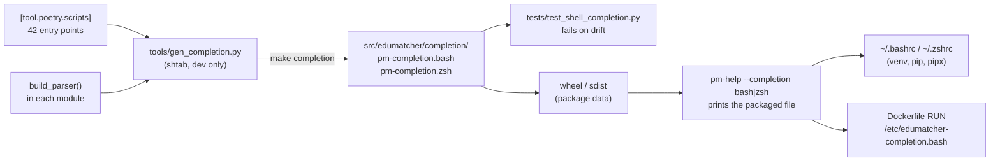

Version: 1.0.0

Date: 2026-09-17

Status: Design Proposal

# EduMatcher — Shell Completion for `pm-*` Commands


## Table of Contents

1. [Motivation](#1-motivation)
2. [Goals and Non-Goals](#2-goals-and-non-goals)
3. [Decision Summary](#3-decision-summary)
4. [What the Tree Looks Like Today](#4-what-the-tree-looks-like-today)
5. [Design](#5-design)
6. [Implementation Plan](#6-implementation-plan)
7. [Testing Guide](#7-testing-guide)
8. [Acceptance Checklist](#8-acceptance-checklist)
9. [Open Questions](#9-open-questions)


## 1. Motivation

EduMatcher ships 42 `pm-*` console scripts. Ten of them are multi-command CLIs
(`pm-audit-cli`, `pm-audit-replay`, `pm-clearing-cli`, `pm-stats-cli`,
`pm-admin-cli`, `pm-index-cli`, `pm-index-admin-cli`, `pm-log-cli`,
`pm-opctl-cli`, `pm-msgen`), and most processes carry the same block of logging
flags plus their own. Trainees currently discover flags with `--help` or
`pm-help <command>`. Tab completion of command names, subcommands, flags and
`choices=` values removes that round trip in both bash and zsh.


## 2. Goals and Non-Goals

### Goals

- Tab completion in **bash** and **zsh** for every entry point in
  `[tool.poetry.scripts]`: subcommands, options, and `choices=` values.
- Works in three installation modes:
  1. the Poetry development venv (`make install`, editable install);
  2. the wheel installed with pip or pipx;
  3. the backend container image (`deployment/docker/Dockerfile`), where it is
     active with no user action.
- Zero cost per <kbd>Tab</kbd>: no Python process is started while completing.
- No new runtime dependency.
- Completion can never silently fall out of step with the parsers: a test fails
  when they differ.

### Non-Goals

- **Live value completion** (symbol names from the deployed config, audit file
  names, gateway ids). Decided 2026-09-17: not wanted. This is what rules out
  argcomplete (§3).
- fish, PowerShell, or any shell other than bash and zsh.
- Completion inside the interactive consoles (`pm-admin`, `pm-alf-console`);
  they have their own prompt_toolkit completers.
- Editing users' dotfiles. Installation modes 1 and 2 print or document a
  one-line snippet; nothing writes to `~/.bashrc` or `~/.zshrc`.
- The GUI container images. The curl installer's `edumatcher.sh shell` uses the
  backend image, so it benefits for free, but it is not a separate target.


## 3. Decision Summary

**Use [shtab](https://github.com/iterative/shtab) to generate static bash and
zsh scripts from the real `argparse` parsers, commit the generated files inside
the package, and expose them with `pm-help --completion bash|zsh`.**

| Option | Verdict | Reason |
|---|---|---|
| **shtab, generated and committed** | **Chosen** | No per-Tab cost, no runtime dependency (dev group only), handles subparsers and `choices=`. Generation needs every parser buildable without running `main()`: §5.1. |
| argcomplete | Rejected | Runs the `pm-*` program on every <kbd>Tab</kbd>. The entry-point modules import zmq, holidays, rich, fastapi etc. at module top, so each Tab pays for that import. Its only advantage, live value completion, is a non-goal. Would also add a runtime dependency and a hook in all 42 `main()`s. |
| bash `_longopt` / zsh `_gnu_generic` | Rejected | No code, but completes top-level flags only by running `--help`. No subcommands, which is where completion helps most. |
| Generate from `pm_help/registry.py` | Rejected | The registry is hand-curated prose data; it can drift from the parsers. The parsers are the source of truth. |
| Generate at install time / on every shell start | Rejected | Building all parsers imports all 42 modules: measured **4.4 s**. Acceptable once at development time, not per shell. |

Two supporting decisions:

- **One public factory name.** Every entry-point module exposes
  `build_parser() -> argparse.ArgumentParser` with no parameters. The 32 modules
  using `_build_parser` are renamed; the 6 modules (7 commands) that build their
  parser inside `main()` or `_parse_args()` are refactored. The generator does not accept both names.
- **The drift check is a pytest test**, not a Makefile stamp plus CI step as
  msgen uses. `make test` and the CI *Testing* job already run it, so one
  mechanism gives the guarantee.


## 4. What the Tree Looks Like Today

Measured against the working tree (v0.39.1), with a Python 3.13
venv and shtab 1.12.1.

### 4.1 Parser factories

| State | Count | Commands |
|---|---|---|
| `_build_parser()` (private name) | 32 | `pm-engine`, `pm-alf-console`, `pm-viewer`, `pm-board`, `pm-orders`, `pm-audit`, `pm-audit-cli`, `pm-clearing`, `pm-clearing-cli`, `pm-stats`, `pm-stats-cli`, `pm-ticker`, `pm-scheduler`, `pm-ai-trader`, `pm-admin`, `pm-admin-cli`, `pm-ai-swarm`, `pm-mm-bot`, `pm-ralf-gwy`, `pm-md-gwy`, `pm-calf-spy`, `pm-ralf-spy`, `pm-dc-spy`, `pm-dc-gwy`, `pm-alf-gwy`, `pm-balf-gwy`, `pm-index`, `pm-index-cli`, `pm-index-admin-cli`, `pm-api-gwy`, `pm-log-srv`, `pm-log-cli` |
| `build_parser()` already | 3 | `pm-audit-replay`, `pm-opctl-cli`, `pm-config-gen` (imported into `config_gen/cli.py` from `cli_parser.py`) |
| Parser built inside `main()` | 2 | `pm-setup` (`setup_cmd.py`), `pm-config-deploy` (`config_deploy.py`) |
| Parser built inside `_parse_args()` | 4 modules / 5 commands | `pm-cverifier`, `pm-config-show`, `pm-msgen`, `pm-help` + `pm-man` (`pm_help/cli.py`, which also takes a `prog` parameter) |

Tests reference `_build_parser` 117 times and `_parse_args` 7 times.

### 4.2 `prog` is often implicit

Most process parsers do not pass `prog=`, so argparse takes it from
`sys.argv[0]` at construction time. When a generator builds them, `prog` is
whatever the generator was launched as (it came out as `'-'` in the prototype).
shtab names its functions and its `complete`/`compdef` registration after
`parser.prog`, so the generator must set `sys.argv[0]` to the script name
**before** calling each factory. This also fixes subparser `prog`, which argparse
derives from the parent at `add_subparsers()` time and which a later
`parser.prog = name` would not.

### 4.3 Prototype results

A throwaway generator over the 35 commands that already have a factory:

| Measurement | Result |
|---|---|
| Import all modules and build all parsers | 4.4 s |
| bash output, concatenated | ~235 KB, 6 377 lines; `bash -n` clean |
| zsh output, concatenated | ~170 KB, 3 791 lines |
| `source` of the bash file | 0.02 s |
| `eval` of a 142 KB synthetic 42-command zsh file | 0.045 s |
| `pm-help --version` start-up (reference for `eval "$(pm-help …)"`) | 0.20 s |
| Machine-specific strings in output (home paths, `%(default)` expansions) | none |

Bash completion was exercised against the real generated file:

```text
pm-audit-cli <Tab>             -> events orders trades topics gateways timeline stats index
pm-audit-cli ev<Tab>           -> events
pm-audit-cli events --<Tab>    -> --help --topic --gateway --symbol --date --from --to --limit --reverse --follow --interval
pm-engine --log-level <Tab>    -> CRITICAL ERROR WARNING INFO DEBUG
pm-opctl-cli <Tab>             -> start up init stop down kill list health show clear
```

### 4.4 The zsh trap: `source` does not work, `eval` does

Each shtab zsh block ends with:

```zsh
if [[ $zsh_eval_context[-1] == eval ]]; then
  compdef _shtab_pm_engine -N pm-engine      # eval/source: register
else
  _shtab_pm_engine "$@"                      # autoload from fpath: run now
fi
```

`$zsh_eval_context[-1]` is `eval` under `eval`, but `file` under `source`.
Sourcing the concatenated file therefore takes the autoload branch and prints
`_arguments:comparguments:327: can only be called from completion function`
for every command, registering nothing. Verified with zsh 5.9: `source`
registered 0 commands, `eval "$(<file)"` registered all of them.

The concatenated zsh file must be **loaded with `eval`**, and after
`compinit`. The file header says so (§5.3).

### 4.5 Packaging precedent

Poetry already ships non-Python files that sit inside `src/edumatcher/`
(`py.typed`, `emo/README.md` are in the v0.39.1 wheel). Generated files placed
under `src/edumatcher/completion/` are therefore in the wheel and sdist with no
`pyproject.toml` change, and an editable install reads them straight from the
checkout.


## 5. Design



### 5.1 Parser factory contract

Every module named in `[tool.poetry.scripts]` exposes, at module level:

```python
def build_parser() -> argparse.ArgumentParser:
    ...
```

- No parameters. It builds and returns the parser and has no other effect: no
  parsing, no I/O, no logging set-up.
- `main()` calls it. There is exactly one place each parser is defined.
- `prog=` may be given explicitly, but if given it must equal the script name.
  `pm_help` keeps deriving `pm-help` vs `pm-man` from `sys.argv[0]` by calling
  its existing `_prog_name()` inside `build_parser()`.

The test in §7 enforces the contract for every entry point, so a new command
without a factory fails CI rather than silently missing completion.

### 5.2 Generator: `tools/gen_completion.py`

Lives in `tools/` because it imports shtab, a dev-only dependency, and so must
not be in the package. `tools/` is already on mypy's `mypy_path` and has its own
pyright execution environment, and `tests/test_engine_dataset_smoke.py` already
imports from it the same way the new test will.

```python
"""Generate the bash and zsh completion scripts for every pm-* command.

The parsers are the source of truth: each entry point in
[tool.poetry.scripts] is imported and its build_parser() rendered by shtab.
Output goes to src/edumatcher/completion/. Run `make completion` after changing
any command-line option; tests/test_shell_completion.py fails until you do.
"""

from __future__ import annotations

import argparse
import importlib
import sys
import tomllib
from collections.abc import Callable
from pathlib import Path

import shtab

ROOT = Path(__file__).resolve().parent.parent
OUT_DIR = ROOT / "src" / "edumatcher" / "completion"
SHELLS = ("bash", "zsh")

_HEADER = {
    "bash": "# Load with: source <this file>\n",
    "zsh": "# Load with: eval \"$(<this file)\"  -- after compinit; `source` does NOT work\n",
}


def entry_points() -> dict[str, str]:
    with open(ROOT / "pyproject.toml", "rb") as f:
        scripts: dict[str, str] = tomllib.load(f)["tool"]["poetry"]["scripts"]
    return scripts


def build_parser_for(name: str, target: str) -> argparse.ArgumentParser:
    module = importlib.import_module(target.split(":")[0])
    factory: Callable[[], argparse.ArgumentParser] = getattr(module, "build_parser")
    saved = sys.argv[0]
    sys.argv[0] = name  # parsers without prog= take it from argv[0]
    try:
        return factory()
    finally:
        sys.argv[0] = saved


def render(shell: str) -> str:
    blocks = [
        shtab.complete(build_parser_for(name, target), shell)
        for name, target in sorted(entry_points().items())
    ]
    return (
        "# GENERATED by tools/gen_completion.py -- do not edit. "
        "Regenerate with: make completion\n"
        + _HEADER[shell]
        + "\n"
        + "\n".join(blocks)
    )


def main() -> None:
    for shell in SHELLS:
        (OUT_DIR / f"pm-completion.{shell}").write_text(render(shell), encoding="utf-8")


if __name__ == "__main__":
    main()
```

Notes:

- `sorted()` makes output independent of `pyproject.toml` ordering.
- shtab's own per-block comments ("Copy this to `~/.local/share/...`") remain;
  they are noise in a concatenated file but harmless, and stripping them would
  mean parsing shtab output.
- Output is deterministic for a given shtab version; `poetry.lock` pins it.
- No `check` mode. The test (§7) calls `render()` and compares.

### 5.3 Generated artifacts

```text
src/edumatcher/completion/
├── pm-completion.bash
└── pm-completion.zsh
```

No `__init__.py`: this is package data, read with
`importlib.resources.files("edumatcher") / "completion" / name`. Both files are
committed. They are generated, like `models/generated/`; reviewers skip them.

### 5.4 `pm-help --completion SHELL`

`pm-help` is already the command that knows about all `pm-*` commands, so it
gets the flag instead of a 43rd entry point (see §9 for the alternative).

```python
parser.add_argument(
    "--completion",
    choices=["bash", "zsh"],
    metavar="SHELL",
    help="print the tab-completion script for every pm-* command and exit",
)
```

In `main()`, before any rendering:

```python
if args.completion is not None:
    if args.command is not None:
        parser.error("--completion takes no COMMAND")
    name = f"pm-completion.{args.completion}"
    sys.stdout.write((files("edumatcher") / "completion" / name).read_text("utf-8"))
    return _EXIT_OK
```

It prints the packaged file; it does not generate anything, so it needs no
shtab and costs only `pm-help`'s start-up (0.20 s). `pm-man --completion` works
too since both names share the module; that is not worth special-casing.

### 5.5 Activation per installation mode

#### Poetry development venv

The editable install means `pm-help` reads the committed files from the
checkout, so completion follows the branch after every `make completion`.
The venv is usually not active when `~/.bashrc` runs, so the snippet uses the
absolute path:

```bash
# ~/.bashrc
EM=~/Devel/EduMatcher/.venv/bin/pm-help
[ -x "$EM" ] && eval "$("$EM" --completion bash)"
```

```zsh
# ~/.zshrc, after compinit
EM=~/Devel/EduMatcher/.venv/bin/pm-help
[[ -x $EM ]] && eval "$($EM --completion zsh)"
```

#### Wheel installed with pip or pipx

Same snippet with `pm-help` from `PATH` (pipx puts it in `~/.local/bin`) or the
venv's absolute path for a plain `pip install` into a venv:

```bash
command -v pm-help >/dev/null && eval "$(pm-help --completion bash)"
```

```zsh
(( $+commands[pm-help] )) && eval "$(pm-help --completion zsh)"
```

Calling `pm-help` at every shell start keeps completion matched to the
installed version after an upgrade. Anyone who minds the 0.20 s can cache it
once per upgrade instead:

```bash
pm-help --completion bash > ~/.local/share/edumatcher/pm-completion.bash
# ~/.bashrc:  source ~/.local/share/edumatcher/pm-completion.bash     (0.02 s)
```

```zsh
pm-help --completion zsh > ~/.local/share/edumatcher/pm-completion.zsh
# ~/.zshrc:   eval "$(<~/.local/share/edumatcher/pm-completion.zsh)"  (no fork)
```

#### Backend container

The image is immutable, so the file is written once at build time and sourced
from `/root/.bashrc`, next to the existing `PATH`/`EDUMATCHER_DATA_DIR` lines in
the runtime stage:

```dockerfile
# Tab completion for every pm-* command in interactive bash (make shell, ssh).
RUN pm-help --completion bash > /etc/edumatcher-completion.bash && \
    echo 'source /etc/edumatcher-completion.bash' >> /root/.bashrc
```

- Must come after `ENV PATH=...` so `pm-help` resolves.
- Not in `/etc/profile.d/`: that is also read by `sh` login shells, where
  `complete` does not exist.
- Not via the `bash-completion` package: it would add an apt dependency, and its
  lazy loader looks up one file per command name, which a single file does not
  fit. Plain `complete -F` needs nothing from it (the prototype used no
  bash-completion helpers).
- The image has no zsh, so bash only.
- Release images build natively per architecture (no QEMU), so running
  `pm-help` in a `RUN` step is fine.

### 5.6 Keeping it in sync

- `make completion` regenerates both files.
- `tests/test_shell_completion.py` fails when either committed file differs from
  `render()`, naming `make completion` in the message.
- Changing a flag, a subcommand, a `choices=` list or help text therefore
  requires regenerating in the same commit. Help text is included because shtab
  emits it as zsh descriptions.


## 6. Implementation Plan

Each step leaves the tree green.

1. **Dev dependency.** Add `shtab` to `[tool.poetry.group.dev.dependencies]`;
   `poetry lock`.
2. **Rename the factories.** In the entry-point modules only, rename
   `_build_parser` to `build_parser`, including callers in `main()` and in
   tests. `grep -rn --include=*.py 'def _build_parser' src` finds 32
   definitions, one per entry-point module in §4.1; none is outside an entry
   point. Check no module already has a `build_parser` name that would
   collide.
3. **Refactor the six non-factory modules** (seven commands) into `build_parser()` +
   `main()` calling `build_parser().parse_args(argv)`:
   `setup_cmd.py`, `config_deploy.py`, `cverifier/cli.py`,
   `config_show/cli.py`, `msgen/cli.py`, `pm_help/cli.py` (drop the `prog`
   parameter; call `_prog_name()` inside). Update the 7 test references to
   `_parse_args`. `config_gen/cli.py` already satisfies the contract through
   its import.
4. **Contract test** (§7, first test). Run it before going further; it proves
   steps 2–3 are complete.
5. **Generator.** Add `tools/gen_completion.py` (§5.2) and a Makefile target
   beside `msgen`:
   ```make
   completion: ## Regenerate bash/zsh completion scripts for every pm-* command
   	@poetry run python tools/gen_completion.py
   ```
   Add `completion` to the `.PHONY` line.
6. **Generate and commit** `src/edumatcher/completion/pm-completion.{bash,zsh}`.
7. **`pm-help --completion`** (§5.4). Update the `pm-help` entry in
   `pm_help/registry.py`: synopsis line `pm-help --completion bash|zsh` and an
   `Option("--completion bash|zsh", "", ...)`. Run `make completion` again,
   since `pm-help`'s own parser changed.
8. **Remaining tests** (§7).
9. **Dockerfile** (§5.5). Build with `make build DEV=1` and check
   acceptance items for the container.
10. **Docs.**
    - `docs/user-guide/005-installation.md`: a `## Shell completion` section
      with the snippets for the Poetry checkout, pipx/pip, and a note that the
      container needs nothing.
    - `docs/user-guide/170-processes.md`: `pm-help` synopsis and options.
    - `docs/developer/`: one paragraph on the `build_parser()` contract and
      `make completion`, wherever adding a new `pm-*` command is described.
    - `CHANGELOG.md` entry.
11. **Verify:** `black`, `flake8`, `mypy src tests`, `pyright src tests`, and
    explicitly on `tools/gen_completion.py`; full `pytest`.


## 7. Testing Guide

New file `tests/test_shell_completion.py`. It imports the generator the way
`test_engine_dataset_smoke.py` imports from `tools/`.

| Test | Asserts |
|---|---|
| `test_entry_point_exposes_build_parser[<name>]` (parametrised over `[tool.poetry.scripts]`) | Module has `build_parser`; it returns an `ArgumentParser`; with `sys.argv[0]` set to the name, `parser.prog == name`. |
| `test_committed_completion_is_current[bash\|zsh]` | `render(shell)` equals the committed file. Message: "run `make completion`". |
| `test_pm_help_prints_completion[bash\|zsh]` | `pm_help.cli.main(["--completion", shell])` writes exactly the packaged file and returns 0. |
| `test_pm_help_completion_rejects_command` | `--completion bash pm-engine` exits 2. |
| `test_bash_script_parses` | `bash -n` on the bash file succeeds (skip if `bash` is absent). |
| `test_bash_completes_subcommands` | In a `bash` subprocess: source the file, set `COMP_WORDS=(pm-audit-cli "")`, call the registered function, and check `COMPREPLY` contains `events` and `timeline`. Same harness as §4.3. |
| `test_zsh_eval_registers_every_command` | Skip if `zsh` is absent. `zsh -f`: `compinit`, `eval "$(<file)"`, then `$_comps[pm-engine]` is set for every entry point. Guards the §4.4 trap. |

The module-level import of every entry point is shared with the rest of the
suite in a worker, so the 4.4 s build cost is paid mostly once per xdist worker
that collects this file.

Manual checks for the acceptance list: an interactive bash and zsh with the
§5.5 snippets, and `make shell` / `make ssh` in the container.


## 8. Acceptance Checklist

- [ ] Every `[tool.poetry.scripts]` module exposes `build_parser()`; no `_build_parser` or parser-in-`main()` remains in an entry point.
- [ ] `make completion` regenerates both files; a second run changes nothing.
- [ ] Changing any flag without `make completion` fails `make test`.
- [ ] `pm-help --completion bash` and `--completion zsh` print the packaged files; `pm-help --completion fish` is rejected by argparse.
- [ ] `pm-help pm-help` man page shows `--completion`.
- [ ] Poetry venv, bash: with the §5.5 snippet, `pm-opctl-cli <Tab>` lists its subcommands in a new shell without activating the venv.
- [ ] Poetry venv, zsh: same, snippet after `compinit`; no `comparguments` errors at shell start.
- [ ] pipx install of the built wheel: `unzip -l` shows `edumatcher/completion/pm-completion.{bash,zsh}`; bash and zsh completion work with the `PATH` snippet.
- [ ] Container (`make build DEV=1 && make up`): `make shell`, then `pm-audit-cli events --<Tab>` completes.
- [ ] Container over `make ssh`: completion also works (confirms the root login shell reads `/root/.bashrc`).
- [ ] `pm-engine --log-level <Tab>` offers `CRITICAL ERROR WARNING INFO DEBUG` in both shells.
- [ ] `pm-help` and `pm-man` both complete.
- [ ] `black`, `flake8`, `mypy`, `pyright` clean over `src tests` and `tools/gen_completion.py`.


## 9. Open Questions

1. **Flag on `pm-help` or a new `pm-completion` command?** This design uses
   `pm-help --completion`, which avoids a 43rd entry point with its own
   registry entry and 170-processes section. A dedicated command would read
   more naturally (`pm-completion zsh`) at that cost.
2. **Start-up cost of the `eval "$(pm-help …)"` snippet.** 0.20 s per shell is
   almost all `pm_help/cli.py`'s imports (rich, `edumatcher.config`). Moving
   those imports below the `--completion` early return would bring it close to
   bare Python (~0.03 s), at the price of function-level imports in that module.
   The design leaves imports alone and documents the cached-file variant
   instead.
