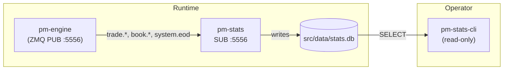
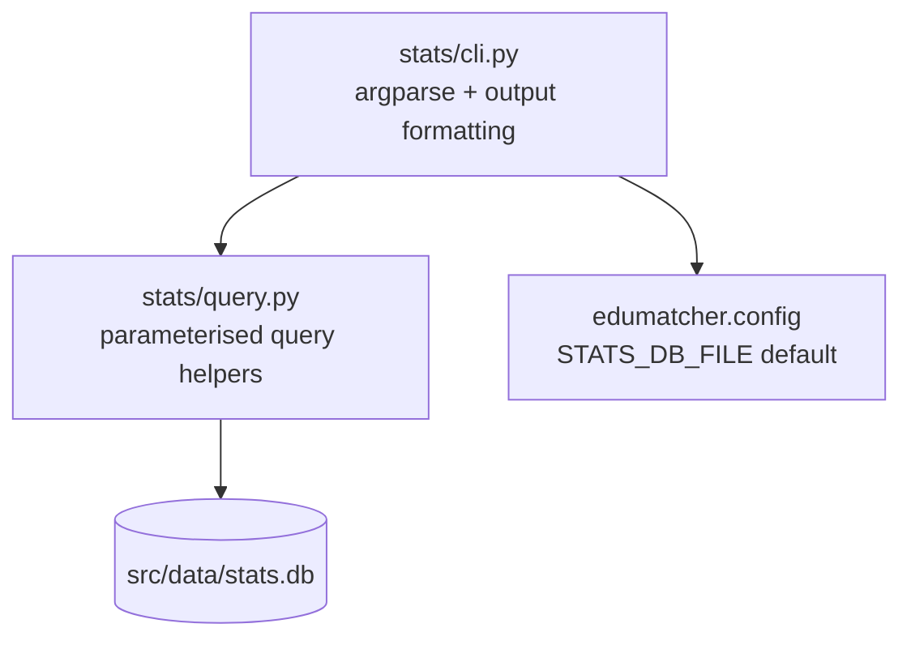

Version: 1.1.0

Date: 2026-06-14

Status: Design and Research Proposal

# EduMatcher — Statistics Query CLI Design Proposal


## Table of Contents

1. [Overview](#1-overview)
2. [Problem Statement](#2-problem-statement)
3. [Goals and Non-Goals](#3-goals-and-non-goals)
4. [Proposed CLI Surface](#4-proposed-cli-surface)
5. [Command Details](#5-command-details)
6. [SQL Mapping to the Existing Schema](#6-sql-mapping-to-the-existing-schema)
7. [Output Formats and UX Rules](#7-output-formats-and-ux-rules)
8. [Implementation Plan](#8-implementation-plan)
9. [Documentation Changes](#9-documentation-changes)
10. [Testing Guide](#10-testing-guide)
11. [Acceptance Checklist](#11-acceptance-checklist)
12. [Wider Analytics Extension for `pm-stats`](#12-wider-analytics-extension-for-pm-stats)


## 1. Overview

`pm-stats` already records useful market statistics into `src/data/stats.db`, but the
only supported way to inspect that data today is to open SQLite manually and write
SQL by hand. That is error-prone, inconvenient for operators, and inconsistent with
the rest of EduMatcher, where operational data is usually exposed through dedicated
CLI commands.

This proposal adds a **new server-side command-line tool**:

```bash
poetry run pm-stats-cli <subcommand> [options]
```

The new tool is read-only. It does **not** subscribe to ZeroMQ or modify the
statistics database. Its only purpose is to make the existing statistics data easy
to query from the server shell without requiring SQL knowledge.


## 2. Problem Statement

The user guide documents three statistics tables:

- `daily_stats`
- `price_snapshots`
- `trade_log`

It also shows raw SQL examples for:

- end-of-day daily summaries
- intraday snapshot history for one symbol
- trade history for one symbol

Today, an operator must do this manually:

```bash
sqlite3 src/data/stats.db
.headers on
.mode column
SELECT * FROM daily_stats;
```

That creates several problems:

1. Users must remember table names and column names exactly.
2. Filtering by date, symbol, or time range requires hand-written SQL every time.
3. Ad-hoc SQL is easy to get wrong, especially for operators who are not developers.
4. The user guide teaches the database schema, but not a safe operational interface.

EduMatcher should expose the most common statistics queries as first-class CLI
commands in the same way that exchange operations are exposed through `pm-admin-cli`.


## 3. Goals and Non-Goals

### 3.1 Goals

- Provide a **read-only**, **user-friendly**, **server-side** CLI for the statistics DB.
- Cover the most common workflows already implied by `docs/user-guide/10-processes.md`.
- Replace the need for direct SQL for normal operational tasks.
- Support both human-readable output and machine-readable output for scripting.
- Keep the initial command surface small and predictable.

### 3.2 Non-Goals

- This proposal does **not** change how `pm-stats` records data.
- This proposal does **not** add new database tables.
- This proposal does **not** expose arbitrary SQL execution.
- This proposal does **not** add remote querying over ZeroMQ; the commands run on the server where `stats.db` exists.
- This proposal does **not** turn `pm-stats` itself into an interactive shell.


## 4. Proposed CLI Surface

The proposed tool is:

```bash
poetry run pm-stats-cli [--db src/data/stats.db] [--format table|json|csv] COMMAND [options]
```

### 4.1 Why a separate `pm-stats-cli` command?

`pm-stats` is a long-running subscriber process that records data continuously.
Querying the database is a separate operational concern. A dedicated one-shot CLI
keeps the responsibilities clear:

- `pm-stats` = recorder / writer
- `pm-stats-cli` = query tool / reader

This follows the same split already used by `pm-admin` and `pm-admin-cli`.



`pm-stats-cli` never touches ZeroMQ. It opens the SQLite file directly, so it
works even when `pm-stats` is not running, as long as the DB file exists.

### 4.2 Initial subcommands

The initial version should provide exactly five subcommands:

| Subcommand | Primary table | Purpose |
|---|---|---|
| `daily` | `daily_stats` | Show daily OHLCV summary rows |
| `snapshots` | `price_snapshots` | Show intraday mid-price / bid / ask snapshots |
| `trades` | `trade_log` | Show matched trades |
| `symbols` | derived | List symbols present in the statistics DB |
| `dates` | derived | List available trading dates in the statistics DB |

These five commands cover the schema shown in the user guide without adding a large
or speculative interface.


## 5. Command Details

### 5.1 Global options

All subcommands should support these global flags:

| Flag | Default | Meaning |
|---|---|---|
| `--db` | `src/data/stats.db` | Path to the SQLite database |
| `--format` | `table` | Output format: `table`, `json`, or `csv` |
| `--no-header` | off | Suppress header row for `csv` output and any compact table mode if added later |
| `--limit` | command-specific | Maximum rows returned |

`table` is for humans on a terminal. `json` and `csv` are for shell scripts, export,
and downstream tooling.

### 5.2 `daily`

Purpose: expose the `daily_stats` query shown in the user guide, without SQL.

```bash
poetry run pm-stats-cli daily [--date YYYY-MM-DD] [--symbol AAPL] [--limit 100]
```

Behaviour:

- If `--date` is omitted, use the **latest available date** in `daily_stats`.
- `--date` always refers to the server-local trading date used by `pm-stats`
  when it rolls daily aggregates into `daily_stats`.
- If `--symbol` is omitted, show all symbols for the selected date.
- Rows are ordered by `date DESC, symbol ASC`.
- Default columns:
  `date, symbol, open_price, high_price, low_price, close_price, volume, trade_count, vwap`

**Full column reference** (`daily_stats` table):

| Column | Type | Description | Default display |
|---|---|---|---|
| `date` | TEXT | Calendar date `YYYY-MM-DD` | ✓ |
| `symbol` | TEXT | Instrument ticker | ✓ |
| `open_price` | REAL | First trade price of the day | ✓ |
| `high_price` | REAL | Highest trade price | ✓ |
| `low_price` | REAL | Lowest trade price | ✓ |
| `close_price` | REAL | Last trade price | ✓ |
| `volume` | INTEGER | Total traded quantity | ✓ |
| `trade_count` | INTEGER | Number of individual trades | ✓ |
| `vwap` | REAL | Volume-weighted average price | ✓ |
| `open_bid` | REAL | Best bid at first book update | — (`--wide`) |
| `open_ask` | REAL | Best ask at first book update | — (`--wide`) |
| `close_bid` | REAL | Best bid at engine shutdown | — (`--wide`) |
| `close_ask` | REAL | Best ask at engine shutdown | — (`--wide`) |
| `largest_trade_qty` | INTEGER | Quantity of the single largest trade | — (`--wide`) |
| `largest_trade_price` | REAL | Price of the single largest trade | — (`--wide`) |

Consider a `--wide` flag to include the bid/ask and largest-trade columns in the default `table` output.

Examples:

```bash
poetry run pm-stats-cli daily
poetry run pm-stats-cli daily --date 2026-06-14
poetry run pm-stats-cli daily --date 2026-06-14 --symbol AAPL
poetry run pm-stats-cli daily --format json --limit 20
```

### 5.3 `snapshots`

Purpose: expose intraday time-series data from `price_snapshots`.

```bash
poetry run pm-stats-cli snapshots --symbol AAPL [--date YYYY-MM-DD] [--from ISO_TS] [--to ISO_TS] [--limit 500]
```

Behaviour:

- `--symbol` is required.
- If `--date` is given, restrict to that trading date.
- `--from` and `--to` optionally narrow the time window further.
- Rows are ordered by `ts ASC`.
- Default columns:
  `ts, symbol, mid_price, best_bid, best_ask, pct_change`

**Full column reference** (`price_snapshots` table):

| Column | Type | Description |
|---|---|---|
| `ts` | TEXT | ISO-8601 timestamp (UTC, second precision) |
| `symbol` | TEXT | Instrument ticker |
| `mid_price` | REAL | `(best_bid + best_ask) / 2`; falls back to one side or `last_price` |
| `best_bid` | REAL | Best bid at snapshot time (null if empty) |
| `best_ask` | REAL | Best ask at snapshot time (null if empty) |
| `pct_change` | REAL | `100 × (mid_t − mid_{t−1}) / mid_{t−1}`; null for the first snapshot |

Examples:

```bash
poetry run pm-stats-cli snapshots --symbol MSFT
poetry run pm-stats-cli snapshots --symbol MSFT --date 2026-06-14
poetry run pm-stats-cli snapshots --symbol MSFT --from 2026-06-14T09:00:00 --to 2026-06-14T16:30:00
```

### 5.4 `trades`

Purpose: expose the append-only trade history from `trade_log`.

```bash
poetry run pm-stats-cli trades [--symbol AAPL] [--date YYYY-MM-DD] [--from ISO_TS] [--to ISO_TS] [--limit 200]
```

Behaviour:

- `--symbol` is optional but strongly recommended.
- If `--date` is provided, restrict to that trading date.
- `--from` and `--to` optionally narrow by timestamp.
- Rows are ordered by `ts ASC`.
- Default columns:
  `ts, trade_id, symbol, price, quantity, buy_gateway_id, sell_gateway_id`

**Full column reference** (`trade_log` table):

| Column | Type | Description |
|---|---|---|
| `ts` | TEXT | ISO-8601 timestamp (UTC, millisecond precision) |
| `trade_id` | TEXT (PK) | UUID from the engine |
| `symbol` | TEXT | Instrument ticker |
| `price` | REAL | Execution price |
| `quantity` | INTEGER | Matched quantity |
| `buy_gateway_id` | TEXT | Gateway that submitted the buy order |
| `sell_gateway_id` | TEXT | Gateway that submitted the sell order |

Examples:

```bash
poetry run pm-stats-cli trades --symbol AAPL
poetry run pm-stats-cli trades --symbol AAPL --date 2026-06-14
poetry run pm-stats-cli trades --date 2026-06-14 --limit 50
poetry run pm-stats-cli trades --symbol AAPL --format csv
```

### 5.5 `symbols`

Purpose: make symbol discovery trivial without SQL.

```bash
poetry run pm-stats-cli symbols [--date YYYY-MM-DD]
```

Behaviour:

- If `--date` is omitted, list symbols seen anywhere in the DB.
- If `--date` is supplied, list symbols that have data on that date.
- Output is ordered alphabetically.
- `symbols` should derive from the union of symbol values present in the
  statistics tables so discovery stays useful even if one table is temporarily
  sparse.

Examples:

```bash
poetry run pm-stats-cli symbols
poetry run pm-stats-cli symbols --date 2026-06-14
```

### 5.6 `dates`

Purpose: make available trading dates discoverable without SQL.

```bash
poetry run pm-stats-cli dates [--symbol AAPL]
```

Behaviour:

- If `--symbol` is omitted, show all distinct dates in `daily_stats`.
- If `--symbol` is provided, show only dates available for that symbol.
- Output is ordered descending so the newest date appears first.
- `dates` should use `daily_stats` as the canonical source of trading dates,
  because it is the table that represents the daily summary row.

Examples:

```bash
poetry run pm-stats-cli dates
poetry run pm-stats-cli dates --symbol AAPL
```


## 6. SQL Mapping to the Existing Schema

The new CLI is intentionally a thin layer over the schema already documented in
`docs/user-guide/10-processes.md`.

### 6.1 `daily`

Equivalent to the existing user-guide example:

```sql
SELECT date, symbol,
       open_price, high_price, low_price, close_price,
       volume, trade_count,
       ROUND(vwap, 4) AS vwap
FROM daily_stats
ORDER BY date DESC, symbol;
```

The CLI should translate filters into parameterised `WHERE` clauses instead of
asking the operator to write this SQL manually.

### 6.2 `snapshots`

Equivalent to the existing user-guide example:

```sql
SELECT ts, mid_price, best_bid, best_ask,
       ROUND(pct_change, 4) || '%' AS change
FROM price_snapshots
WHERE symbol = 'MSFT'
ORDER BY ts;
```

The CLI should expose `symbol`, `date`, `from`, and `to` as explicit flags.

### 6.3 `trades`

Equivalent to the existing user-guide example:

```sql
SELECT ts, trade_id, symbol, price, quantity, buy_gateway_id, sell_gateway_id
FROM trade_log
WHERE symbol = 'AAPL'
ORDER BY ts;
```

Again, the CLI converts common filters into safe parameterised queries.

### 6.4 `symbols` and `dates`

These are small convenience commands that wrap `SELECT DISTINCT ...` queries and
remove the need for users to remember where to look first.


## 7. Output Formats and UX Rules

### 7.1 Output formats

Three output formats should be supported from day one:

| Format | Intended use |
|---|---|
| `table` | Interactive terminal use by operators |
| `json` | Automation, scripts, and structured output |
| `csv` | Export into spreadsheets or shell pipelines |

### 7.2 No-row behaviour

If a query returns no rows, the command should:

- print a short message in `table` mode, such as `No rows found.`
- print an empty array in `json` mode
- print nothing in `csv` mode except an optional header if headers are enabled

This should still exit successfully. "No data" is not an error.

### 7.3 Error handling

The CLI should fail clearly for:

- missing database file
- unreadable database
- invalid date format
- invalid timestamp format
- missing required `--symbol` for `snapshots`

It should **not** fall back silently or guess ambiguous inputs.

### 7.4 Safe defaults

To avoid accidental terminal floods:

- `daily` default limit: `100`
- `snapshots` default limit: `500`
- `trades` default limit: `200`
- `symbols` and `dates` have no default limit

The user can override limits explicitly.

### 7.5 Sample output

**`table` format** (default, human-readable):

```
┌────────────┬────────┬────────┬────────┬────────┬────────┬────────┬────────┬────────┐
│ date       │ symbol │ open   │ high   │ low    │ close  │ volume │ trades │ vwap   │
├────────────┼────────┼────────┼────────┼────────┼────────┼────────┼────────┼────────┤
│ 2026-06-14 │ AAPL   │ 150.00 │ 153.25 │ 149.50 │ 152.75 │   5000 │     12 │ 151.82 │
│ 2026-06-14 │ MSFT   │ 414.00 │ 418.50 │ 413.00 │ 417.00 │   3200 │      8 │ 415.63 │
└────────────┴────────┴────────┴────────┴────────┴────────┴────────┴────────┴────────┘
```

**`json` format**:

```json
[
  {"date": "2026-06-14", "symbol": "AAPL", "open_price": 150.0, "high_price": 153.25,
   "low_price": 149.5, "close_price": 152.75, "volume": 5000, "trade_count": 12, "vwap": 151.82},
  {"date": "2026-06-14", "symbol": "MSFT", "open_price": 414.0, "high_price": 418.5,
   "low_price": 413.0, "close_price": 417.0, "volume": 3200, "trade_count": 8, "vwap": 415.63}
]
```

**`csv` format**:

```
date,symbol,open_price,high_price,low_price,close_price,volume,trade_count,vwap
2026-06-14,AAPL,150.0,153.25,149.5,152.75,5000,12,151.82
2026-06-14,MSFT,414.0,418.5,413.0,417.0,3200,8,415.63
```


## 8. Implementation Plan

### 8.1 New files

| File | Purpose |
|---|---|
| `src/edumatcher/stats/cli.py` | argparse entrypoint for `pm-stats-cli` |
| `src/edumatcher/stats/query.py` | shared parameterised SQLite query helpers and row shaping |



### 8.2 Existing files to change

| File | Change |
|---|---|
| `pyproject.toml` | Add console script entrypoint for `pm-stats-cli` |
| `docs/user-guide/10-processes.md` | Replace "query with sqlite3" guidance with the new CLI once implemented |

### 8.3 Design notes

- Reuse `STATS_DB_FILE` from `edumatcher.config` for the default DB path (`src/data/stats.db`).
- Keep all SQL in one small helper module rather than scattering query strings across the CLI parser.
- Use only parameterised `sqlite3` queries.
- Keep the first version read-only and synchronous.
- Do not couple this CLI to `pm-stats` runtime state; it should work even when `pm-stats` is not currently running, as long as the DB file exists.


## 9. Documentation Changes

Once implemented, `docs/user-guide/10-processes.md` should be updated in the
`pm-stats` section:

1. Keep the schema documentation.
2. Keep one short note that the DB is SQLite.
3. Replace the current "open sqlite3 and type SQL" guidance with `pm-stats-cli` examples.
4. Show one example each for `daily`, `snapshots`, and `trades`.

The raw SQL examples can remain as advanced reference material, but they should no
longer be the primary operator workflow.


## 10. Testing Guide

The implementation should be tested at three levels.

### 10.1 Query helper tests

Add unit tests for:

- latest-date fallback
- symbol filtering
- date filtering
- timestamp window filtering
- empty-result behaviour

### 10.2 CLI parser tests

Add tests for:

- required argument enforcement
- format selection
- invalid input handling
- exit codes

### 10.3 End-to-end CLI tests

Using a temporary SQLite DB populated with sample rows:

1. Run `pm-stats-cli daily`
2. Run `pm-stats-cli snapshots --symbol AAPL`
3. Run `pm-stats-cli trades --symbol AAPL`
4. Run `pm-stats-cli symbols`
5. Run `pm-stats-cli dates`

Each test should verify both row content and output shape.


## 11. Acceptance Checklist

This proposal should be considered successfully implemented only when all of the
following are true:

- `pm-stats-cli` exists as a Poetry console command.
- The command supports `daily`, `snapshots`, `trades`, `symbols`, and `dates`.
- All queries are read-only and parameterised.
- The default DB path is `src/data/stats.db` (resolved via `STATS_DB_FILE` from `edumatcher.config`).
- `daily` can show the latest available date without requiring `--date`.
- `snapshots` can filter by symbol and optional time window.
- `trades` can filter by symbol and optional time window.
- `symbols` and `dates` remove the need for discovery SQL.
- Output works in `table`, `json`, and `csv` formats.
- The user guide documents the new CLI as the preferred way to inspect statistics data.


## 12. Wider Analytics Extension for `pm-stats`

The current `pm-stats` tables are enough for the common operational queries
covered by this proposal. They answer the basic questions operators usually ask:
what traded, when it traded, and how the market moved intraday.

For broader analytics, the next step should be to extend `pm-stats` with a few
additional summaries that are still cheap to compute from the existing event
stream.

### 12.1 Additional statistics worth recording

- Order activity by symbol and gateway: submitted, accepted, rejected, cancelled,
  expired, and filled counts
- Cancel ratios and fill ratios by gateway and by symbol
- Top-of-book spread history and best-bid/best-ask depth at the time of each
  snapshot
- Book imbalance metrics such as bid-vs-ask quantity at the inside market
- Session and halt history, including phase transitions and breaker-triggered
  halts/resumes
- Market-maker quote health, including quote freshness, duty coverage, and
  spread compliance over time
- Last trade timestamp and last book-update timestamp per symbol for easy
  staleness checks

### 12.2 Suggested future tables

If EduMatcher grows beyond the current classroom and demo workflows, the
statistics database could add these derived tables:

| Table | Purpose |
|---|---|
| `order_activity_stats` | Per-day order lifecycle counts by symbol and gateway |
| `book_depth_snapshots` | Top-of-book spread and depth history |
| `session_events` | Scheduled and manual session transitions |
| `halt_events` | Circuit-breaker and manual halt/resume history |
| `gateway_activity_stats` | Gateway participation, fills, and rejection ratios |
| `mm_quote_health` | Market-maker quote freshness and compliance summaries |

### 12.3 How that affects the CLI design

Those future tables would justify adding new read-only subcommands such as
`orders`, `depth`, `halts`, or `gateways` to `pm-stats-cli`. The current
proposal does not require them, but the CLI surface should remain open to that
kind of extension so the statistics tooling can evolve without exposing raw SQL
again.
