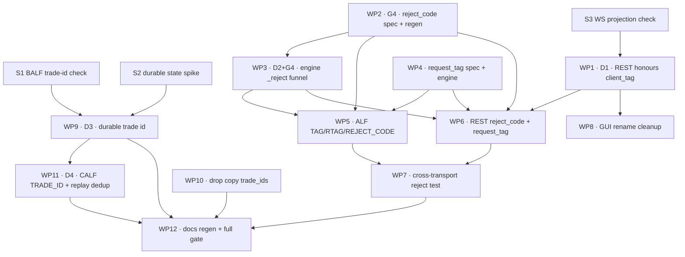

Version: 1.3.0

Date: 2026-09-04

Status: Prerequisites implemented and audited; gap ledger re-verified against
the tree — G9 closed, G11 closed, G12 tick validation closed. Framework
Phase 1 may begin; G12's lot/order-size remainder is the only blocker left.

# EduMatcher — System Trading Verification (`pm-systest`)

## Table of Contents

0. [Verification Status (2026-09-03)](#0-verification-status-2026-09-03)
1. [Motivation](#1-motivation)
2. [Goals and Non-Goals](#2-goals-and-non-goals)
3. [The Determinism Problem](#3-the-determinism-problem)
4. [The Reproducible System State](#4-the-reproducible-system-state)
5. [Framework Architecture](#5-framework-architecture)
6. [The Scenario DSL](#6-the-scenario-dsl)
7. [Transport Drivers — ALF and REST](#7-transport-drivers--alf-and-rest)
8. [Observation and Evidence Collection](#8-observation-and-evidence-collection)
9. [Canonicalisation and Equivalence](#9-canonicalisation-and-equivalence)
10. [Assertion Model](#10-assertion-model)
11. [Deriving the LIMIT / MARKET Test Set](#11-deriving-the-limit--market-test-set)
12. [The LIMIT / MARKET Case Catalogue](#12-the-limit--market-case-catalogue)
13. [Observability Gap Analysis](#13-observability-gap-analysis)
14. [Manual UI Verification (Interim)](#14-manual-ui-verification-interim)
15. [Implementation Plan](#15-implementation-plan)
16. [Acceptance Checklist](#16-acceptance-checklist)
17. [Open Questions](#17-open-questions)
- [Appendix A — Prerequisite System Changes (G1, G4, G7)](#appendix-a--prerequisite-system-changes-g1-g4-g7)
  - [A.0 Summary and Survey Results](#a0-summary-and-survey-results)
  - [A.1 G1 — Client Order Correlation](#a1-g1--client-order-correlation)
  - [A.2 G4 — Canonical Reject Codes](#a2-g4--canonical-reject-codes)
  - [A.3 G7 — Causal Trade Identity](#a3-g7--causal-trade-identity)
  - [A.4 Build Order and Migration](#a4-build-order-and-migration)
  - [A.5 Combined Acceptance Criteria](#a5-combined-acceptance-criteria)
- [Appendix B — Detailed Remediation Plan](#appendix-b--detailed-remediation-plan)
  - [B.0 How to Read This Plan](#b0-how-to-read-this-plan)
  - [B.1 Spikes — Do These First](#b1-spikes--do-these-first)
  - [B.2 Dependency Graph](#b2-dependency-graph)
  - [B.3 Work Packages](#b3-work-packages)
  - [B.4 Commit Sequence](#b4-commit-sequence)
  - [B.5 Parallelisation](#b5-parallelisation)
  - [B.6 Phase Gates](#b6-phase-gates)
  - [B.7 What Each Package Unblocks](#b7-what-each-package-unblocks)
  - [B.8 Risk Register and Rollback](#b8-risk-register-and-rollback)

---

## 0. Verification Status (2026-09-03)

The Appendix A prerequisites were implemented between 2026-08-31 and
2026-09-01 (commits `c507f692` through `81c07868`) and audited against the
tree on 2026-09-03. This section records what that audit found, so the rest of
the document can be read as a plan whose starting conditions are *known*
rather than assumed. Where a later section made a claim the audit contradicts,
that section has been corrected in place and carries a pointer back here.

### 0.1 Gap ledger — current verdict

| Gap | Verdict | Evidence in the tree |
|---|---|---|
| **G1** client order correlation | ✅ **Closed** | `Engine._reject` (26 call sites; keyword-only `client_tag`/`request_tag`, no defaults); `alf_gwy/gateway.py::_optional_tag` with `TAG`/`RTAG` inbound and outbound; `api_gateway/translate.py::build_order`; `request_tag` in `spec/messages/order.yaml` |
| **G2** machine-readable spy output | ✅ **Closed — different spelling** | All three spies accept `--format json` and print one JSON object per line to stdout. There is no `--output FILE`; the orchestrator redirects. §8 and §15 corrected. |
| **G3** engine book snapshot | ✅ **Closed by an existing path** | `Engine._handle_book_snapshot_request` answers `book.snapshot.request` on the bus with an authoritative `book.<SYM>` snapshot, already consumed by `pm-board` and `pm-viewer`. Neither the admin endpoint nor an ALF `BOOK` command proposed in §13 is needed. |
| **G4** canonical reject codes | ✅ **Closed** | `reject_code` inline enum on `order_ack`; `models/reject.py` re-export of the generated `Literal`; ALF `REJECT_CODE=`; REST 4xx bodies and WS acks; `tests/test_cross_transport_rejects.py` |
| **G5** matching decision trace | ⬜ Open | Not implemented. Non-blocking by design. |
| **G6** rejections in the audit journal | ✅ **Was never open** | `audit/main.py` subscribes with an empty topic filter, and every rejection is published as `order.ack` with `accepted=false`. |
| **G7** causal trade identity | ✅ **Closed** | `Trade.id` matches `^\d{6}-\d{9}$`; `persistence.load_and_bump_run_seq` is fail-loud; `set_run_seq()` is the first statement of `Engine.run()`; CALF `TRADE_ID`/`RUN_SEQ`; `md_gateway/replay_buffer` dedups on trade id; drop copy and ALF `FILL` carry `trade_ids` |
| **G8** stats flush timing | ⬜ Open, mitigated | No flush marker or admin flush command exists. §5.3's rowid-stability probe is an adequate substitute, so this is downgraded from prerequisite to nice-to-have. |
| **G9** liquidity flag on the private fill | ✅ **Closed** | `liquidity_flag` added to `order_fill` in `spec/messages/order.yaml`; derived per-order in `Engine._order_liquidity_flags` (`engine/main.py`) and threaded through all 8 fill-publication sites; echoed as `LIQUIDITY=` on the ALF `FILL` line; REST/WS needed no change (payload pass-through). `tests/test_liquidity_flag.py`. See §0.2. |
| **G10** session/halt matrix ratification | ⬜ Open, non-blocking | No rulebook document exists; `spec/` holds message specifications only. Spike S4 established the behaviour, so the scenarios can be written; ratification remains outstanding. |
| **G11** unfilled MARKET carries no reason | ✅ **Closed** | `order_cancelled.cancel_reason` (`INSUFFICIENT_LIQUIDITY`) is set in `order_book.py::_match_market` and threaded through `Engine._cancel_reason_of`; ALF emits `CANCEL_REASON=`. `tests/test_cancel_reason.py`. See §0.2. |
| **G12** no tick, lot or order-size validation | 🟨 **Partially closed** | Tick validation is implemented (`models/price.py::to_ticks_exact`, `TickViolation`) and wired into ALF, REST and BALF order entry plus amends, all raising `TICK_VIOLATION`. Lot size, `MAX_ORDER_QTY`, `MAX_ORDER_VALUE` and `POSITION_LIMIT` remain unimplemented — no config field, no check. See §0.3. |

**All three blocking prerequisites — G1, G4 and G7 — are closed**, and gate
**G-δ** (§B.6), which the plan calls the premise of the entire design, is
proven by `tests/test_cross_transport_rejects.py`. Both Appendix A and
Appendix B are complete: every work package WP1–WP12 has merged.

**Framework Phase 1 may begin.** Nothing blocks the skeleton, the two drivers,
or the first three scenarios (LM-001, LM-020, LM-040). Four items remain before
the *full* catalogue can be written, and §15 tracks them:

| | Item | Blocks |
|---|---|---|
| a | Lift `tests/engine_invariants.py` I1–I6 into `edumatcher/systest/invariants.py`. `src/edumatcher/systest/` does not exist — this is the actual first task | Phase 1 assertions |
| b | ~~Close **G9** (§0.2)~~ — **closed**: `liquidity_flag` now ships on `order_fill` | — |
| b′ | ~~Decide G11~~ — **closed**: `cancel_reason` now ships on `order_cancelled` | — |
| c | Decide the lot-size / order-size half of **G12** (§0.3) — tick validation is done | five catalogue scenarios (LM-009, LM-011, LM-045, plus two more) |
| d | Ratify §11.4 (**G10**) and write `docs/developer/ui-manual-verification.md` (§14) | neither blocks code; both are outstanding |

### 0.2 G9 and G11 — two holes on the order-entry path (both closed)

Both were missed by the original gap analysis because both are about what a
*correct* event fails to say, not about a missing event.

**G9 — the private fill did not say who was the maker. (Closed 2026-09-04.)**
`spec/messages/order.yaml::order_fill` had no `liquidity_flag`, so neither the
ALF `FILL` line nor the REST WebSocket fill event carried maker/taker
attribution — only the drop copy (E7) did, via
`engine/drop_copy.py::publish_fill`. Fixed exactly as scoped below:
`liquidity_flag` (nullable, `omit_when_none`, enum `MAKER`/`TAKER`) is now a
field on `order_fill`, generated via `pm-msgen generate` and verified
drift-free with `pm-msgen check`. `Engine._order_liquidity_flags` derives it
per-order from `Trade.aggressor_side` — the aggressor is TAKER, the resting
side is MAKER, the same rule drop copy already used — and every one of the 8
places the engine publishes a fill (7 call sites through `make_fill_msg`, plus
the inlined hot path in `_handle_new_order`) now carries it. The ALF gateway
echoes it as `LIQUIDITY=` on the `FILL` line, matching `DC_FILL`. The REST/WS
path needed no change: `api_gateway/events.py::envelope()` forwards the engine
payload verbatim (confirming spike S3). `tests/test_liquidity_flag.py` proves
maker/taker attribution across a simple cross, a flipped-side cross, a
multi-level MARKET sweep, and cross-checks the private fill against drop
copy's own attribution for the same trade — the two must never disagree.
Unaffected by design: the BALF `execution_report` binary frame, a fixed-width
wire struct, was out of scope for G9 and is untouched. §6.1, §11.5 and
invariant I4, all previously blocked on this, are now assertable from E1
directly; see below.

**G11 — an unfilled MARKET order is cancelled without a reason. (Closed.)**
Spike S4 left §17's second open question ("MARKET with no liquidity: REJECTED
or ACCEPTED-then-CANCELLED?") unanswered. The code answers it, and the answer
is *both*, depending on the path:

| Situation | Terminal event | Reason on the wire |
|---|---|---|
| MARKET in `CONTINUOUS`, book empty or thin | `order.cancelled` | **none** — `_match_market` sets `OrderStatus.CANCELLED` and the engine publishes `make_cancelled_msg` |
| MARKET while matching is disabled (auction, halt) | `order.ack accepted=false` | `INSTRUMENT_HALTED` or `SESSION_NOT_PERMITTED`, rejected before the book is reached |
| FOK that cannot be fully filled | `order.ack accepted=false` | `INSUFFICIENT_LIQUIDITY` |

So `INSUFFICIENT_LIQUIDITY` was previously emitted for FOK only, not for the
plain unfilled MARKET that §12.3's LM-042 is about — that was the gap.

**Fixed.** `order_book.py::_match_market` now sets
`order.cancel_reason = "INSUFFICIENT_LIQUIDITY"` on the discarded remainder
(guarded so a more specific SMP cancel encountered mid-sweep is not
overwritten); `Engine._cancel_reason_of` narrows it onto the generated
`CancelReason` literal and every `order.cancelled` publication site threads it
through; `alf_gwy/gateway.py` emits it as `CANCEL_REASON=` on the wire. The
field is the nullable `cancel_reason` on `order_cancelled` described in the fix
note below — it shipped as originally proposed. Covered by
`tests/test_cancel_reason.py`. LM-042 should be updated to assert
`cancel_reason=INSUFFICIENT_LIQUIDITY` instead of "asserts the absence of a
reject" with no reason (§12.3).

*What shipped:* a nullable `cancel_reason` enum on `order_cancelled`
(`SELF_MATCH_PREVENTED` | `INSUFFICIENT_LIQUIDITY`), null for a
client-requested cancel and for an engine-initiated cancel whose cause is not
yet classified. `request_tag=None` still distinguishes exchange-initiated
cancels from client ones (A.1.7); `cancel_reason` now says why.

### 0.3 G12 — the instrument-rule and risk rejections (partially closed)

**Update, later on 2026-09-03: tick validation has shipped.**
`models/price.py` now has `to_ticks_exact` (raises `TickViolation` for an
off-grid price, using an epsilon comparison so float noise from client-side
arithmetic is not misclassified) alongside the original `to_ticks`
(nearest-tick rounding, still used for engine-internal conversions that are
already known to be well-formed). `to_ticks_exact` is wired into order entry
and amend on all three transports — `alf_gwy/gateway.py`,
`api_gateway/translate.py`, `balf_gwy/translate.py` — and into
`Engine._handle_amend`, all raising `TICK_VIOLATION`. `TICK_VIOLATION` is no
longer an unreachable enum member. The rest of this section's findings (lot
size, `MAX_ORDER_QTY`, `MAX_ORDER_VALUE`, `POSITION_LIMIT`,
`SELF_MATCH_PREVENTED` as a *reject_code* rather than a `cancel_reason`) were
re-checked against the current tree and still hold — nothing below this note
needed correction on that account, **except** that every place this document
described a sub-tick price as "accepted and rounded" or "rounding, not
rejection" is now wrong for the client-facing order-entry path and is
corrected at each occurrence (§4.3, §11.3, §12.1 LM-007, §14).

This is the correction with the widest reach through the document, and it was
not visible from the reject-code enum, because the enum was written from the
*catalogue* rather than from the code.

Seven members of the `reject_code` enum were declared and never emitted
anywhere in `src/edumatcher/` at the time of the original audit;
`TICK_VIOLATION` is no longer among them (see the update above) and is
kept in the table below only to show what the audit found *before* the
fix landed:

| Code | Why it is never emitted |
|---|---|
| `TICK_VIOLATION` | ~~There is no tick validation.~~ **Fixed, later 2026-09-03**: `models/price.py::to_ticks_exact` now rejects an off-grid price with `TickViolation` at order entry/amend on all three transports; `to_ticks` (nearest-tick rounding) remains, but is only used engine-internally on values already known to be well-formed. |
| `LOT_VIOLATION` | There is no lot-size concept anywhere — not in `SymbolConfig`, not in the config schema, not in any spec file. |
| `MAX_ORDER_QTY`, `MAX_ORDER_VALUE`, `POSITION_LIMIT` | No pre-trade size or notional limits are implemented. |
| `CIRCUIT_BREAKER_ACTIVE` | ~~A circuit-breaker halt sets the same per-symbol halt flag as an admin halt and rejects with `INSTRUMENT_HALTED`.~~ **Also since corrected**: `Engine._halt_reject_code` now distinguishes the two — a symbol whose `CircuitBreaker.halt_source == "CB"` rejects with `CIRCUIT_BREAKER_ACTIVE`; every other halt (including the global halt-all) still rejects with `INSTRUMENT_HALTED`. `tests/test_instrument_halt.py`. Not part of G12's remaining scope — noted here because this table would otherwise mislead. |
| `SELF_MATCH_PREVENTED` | SMP cancels the aggressor, the resting order, or both; it never produces a rejection ack. |
| `UNKNOWN` | Deliberate — it is the forward-compatibility fallback (A.2.3). |

`_validate_new_order` returns exactly five codes: `DUPLICATE_ORDER`,
`QTY_OUT_OF_RANGE`, `PRICE_OUT_OF_RANGE`, `MISSING_FIELD` and (for the iceberg
slice) `QTY_OUT_OF_RANGE` again — `TICK_VIOLATION` is raised earlier, at the
gateway/translate boundary before the order reaches the engine at all, so it
never appears in this function's return set even though it is now reachable.
Everything else in the enum comes from session, halt, gateway-status, collar
or liquidity checks.

Nothing here is a defect introduced by the Appendix A work — the enum is
deliberately forward-looking, and A.2.3 says so ("new members may be added").
The defect is in *this document*, which built a test catalogue and a coverage
argument on validation that was assumed to exist:

- §4.3's symbol table has a **Lot size** column. There is no such config field.
- ~~**LM-007** (sub-tick price → `TICK_VIOLATION`) ... assert[ed] outcomes the
  engine cannot produce~~ — **fixed, see the update above; LM-007 now runs as
  written.** **LM-009** and **LM-045** (lot-size violation → reject) and
  **LM-011** (`max_order_qty` / `max_order_value`) still assert outcomes the
  engine cannot produce.
- §11.3's boundary-value list is largely unreachable: "lot size ± 1",
  "tick − ε", "at and over `max_order_value`" have no corresponding control.
- Invariant **I10** ("every price is an exact multiple of the tick") is no
  longer vacuous now that `to_ticks_exact` rejects off-grid prices at entry —
  it can be asserted meaningfully against every accepted order. Invariant
  **I11** still has no lot size to check.

Those sections are corrected below. The choice this leaves open is a product
decision, not a test-design one:

1. **Implement the controls**, then the scenarios and invariants stand as
   written. This is a real pre-trade-risk feature and §1 already names
   pre-trade risk as the next subsystem — so it is arguably the right order.
2. **Do not implement them**, and delete the corresponding scenarios and the
   unreachable enum members, rather than shipping a catalogue whose coverage
   ledger reports green cells that nothing tests.

Until it is decided, the affected scenarios are marked **`blocked: G12`** in
§12 and excluded from the coverage ledger's denominator, so the ledger cannot
quietly claim credit for them.

### 0.4 What this does to the confidence claim

§11 asks for a systematic derivation rather than a guess-list, and delivers
one. What it should not do — and what §1 and §16 previously implied — is
attach a number to it. A percentage suggests a measured defect-escape rate;
what the method actually produces is a *ledger*: every cell of derivations
A–E is either covered by a system scenario, covered by a named unit test, or
listed as an uncovered residual with a reason.

That distinction is not pedantry, because three things stand outside the
ledger no matter how many scenarios are added, and each is a real place a
defect can hide:

1. **BALF is a third correlation namespace** (spike S1). Its `client_order_id`
   is a `u64` held gateway-side and never mapped to `client_tag`, and no BALF
   frame carries a trade id. The cross-transport equivalence proof of §9.3
   covers ALF and REST only.
2. **The Trading UI is manual** (§14) and `pm-alf-console` is bypassed by the
   ALF driver (§7.2). Both are covered by unit tests and a checklist, not by
   the equivalence proof.
3. **A test derived from observed behaviour cannot show the behaviour is
   wrong.** §11.4's matrices are correct descriptions of the implementation;
   until G10 ratifies them, every session and halt scenario asserts a snapshot,
   not a specification.

So the claim this design can honestly support, once Phase 2 completes, is:

> For LIMIT and MARKET orders over ALF and REST, every state, transition,
> decision-table row, boundary and dissemination cell derived in §11 is
> covered by a system scenario or by a named unit test; the residual is
> enumerated with reasons; and the canonical outcome is identical across
> transports.

That is a stronger statement than "99% confident", because it is checkable.
§16 has been amended accordingly.

---

## 1. Motivation

EduMatcher now has a functionally complete basic exchange: matching engine,
session scheduler, risk controls, circuit breakers, auctions, indices,
clearing, four dissemination gateways (CALF market data, RALF post-trade, DC
drop-copy, ALF order entry), a REST/WebSocket API gateway, and a Trading UI.
The unit-test suite is large (200+ modules) and the coverage gate is 85%.

That suite proves *components* behave. It does not prove the *exchange*
behaves. Every unit test constructs its own fake sockets, its own config, its
own in-process `Engine`, and asserts on a return value. Nothing today answers
the question an exchange operator actually asks:

> If a trader submits a LIMIT order through the ALF console, and another
> trader submits an aggressing MARKET order through the REST API, does the
> resulting trade, the market-data tick, the drop-copy, the post-trade
> dissemination, the audit journal, the stats database and the clearing
> ledger *all agree with each other and with the rulebook*?

Before adding more order types or a pre-trade-risk subsystem, we need to be
able to state — and *show the working for* — that the **LIMIT and MARKET order
paths behave to specification and disseminate correct data**. That is the
purpose of this document. The claim it is built to support is a coverage
ledger with an enumerated residual, not a confidence percentage; §0.4 explains
why that distinction matters and what the defensible wording is.

The central obstacle is that the system is time-dependent. Timestamps,
order IDs, trade IDs, sequence numbers, session dates, log `client_ts` /
`server_ts` values, and SQLite rowids all vary run to run. A byte-for-byte
diff against a golden log is therefore impossible. The design below replaces
"golden log diff" with **canonicalised, transport-independent equivalence**:
we assert on the properties that *must* be identical across runs and across
transports, and we deliberately discard the properties that must not be.

---

## 2. Goals and Non-Goals

### 2.1 Goals

- Define a system-test framework that starts a *real* multi-process
  EduMatcher deployment, drives it with multiple simulated traders and
  market makers, and verifies observable outcomes across every log and store.
- Make every scenario **transport-agnostic**: the same scenario runs over ALF
  and over REST, and the canonical outcome must be identical.
- Make the whole run **repeatable**: same fixed system state, same
  deterministic clock progression, same result on every execution.
- Verify not just the matching outcome but the **dissemination fan-out** —
  CALF, RALF, DC, WebSocket, audit journal, stats DB, clearing ledger.
- Provide a systematic method (not a guess-list) for deriving the LIMIT /
  MARKET test set, with an explicit coverage ledger that shows what is and is
  not proven.
- Surface observability gaps: cases where the system behaves correctly but we
  cannot *prove* it from the logs, so we know what logging to add.

### 2.2 Non-Goals

- **Automated UI testing.** Playwright is a large, separate investment.
  Phase 0 of this design deliberately excludes it; §14 defines a manual
  checklist as the interim control. A future companion document covers UI
  automation.
- **Performance / latency benchmarking.** `test_perf.py` and
  `docs-design/perf-notes.md` own that. System tests assert *correctness*
  under a modest, deterministic load.
- **Fuzzing / property-based exploration.** `test_book_invariants_random_ops.py`
  already does randomised book fuzzing at unit level. System tests are
  scripted and deterministic by construction.
- **Advanced order types.** STOP, STOP_LIMIT, ICEBERG, OCO, COMBO, FOK, IOC,
  TRAILING_STOP and MM quotes are explicitly out of scope for Phase 1. The
  framework must be *extensible* to them; the catalogue in §12 is not.
- **Replacing unit tests.** System tests are slow and few. Unit tests stay the
  primary defect-detection mechanism; system tests prove integration.

---

## 3. The Determinism Problem

### 3.1 What varies between runs

| Varying artefact | Source | Why it varies |
|---|---|---|
| `ts_ns` on every order/trade/event | `models.clock.now_ns()` | wall clock |
| `client_ts` / `server_ts` in `log.db` | logging | wall clock |
| Order IDs (`ORD-xxxx`) | engine allocation | counter + start order |
| Trade IDs | engine allocation | counter |
| Gateway session IDs | connect order | connect race |
| SQLite `seq` / rowid | insertion order | interleaving |
| Market-data sequence numbers | md sequencer | per-connection start |
| Log line ordering across processes | OS scheduling | non-deterministic |
| Wall-clock session date | calendar | the day you run it |

### 3.2 What must not vary

These form the **canonical outcome** — the assertion surface:

1. **Matching results.** For a fixed input sequence: the set of trades, each
   with (symbol, price, qty, aggressor side, maker order, taker order,
   liquidity flag), in a fixed order.
2. **Order lifecycle.** For each logical order: the ordered sequence of
   states (`NEW → PARTIALLY_FILLED → FILLED`, etc.) and rejection reasons.
3. **Book state.** After each step: full depth ladder (price → visible qty →
   order count) on both sides.
4. **Position and P&L.** Per gateway per symbol.
5. **Dissemination fan-out.** For each trade: exactly one CALF `TRADE`, one
   RALF post-trade record, one DC fill per involved gateway, one WS event per
   subscribed session, one audit journal entry, one `trades` row in stats.
6. **Statistics.** OHLC, VWAP, last, high, low, cumulative volume, trade count.
7. **Rejections.** Reason codes for every rejected input.

### 3.3 The equivalence strategy

Instead of `diff actual.log golden.log`, we do:

```
raw artefacts ──▶ collector ──▶ canonicaliser ──▶ canonical JSON ──▶ compare
                                     │
                                     ├─ strip volatile fields (ts, pid, host, seq)
                                     ├─ remap real IDs → scenario labels (ORD-7f3a → T1.O1)
                                     ├─ sort collections by a stable key
                                     └─ round/normalise price representation to ticks
```

Two comparisons are then possible and both are used:

- **Golden comparison.** `canonical.json` vs a committed
  `expected/<scenario>.json`. Catches regressions.
- **Cross-transport comparison.** `canonical(ALF run)` vs `canonical(REST run)`.
  Catches transport-specific defects *without needing a golden file at all* —
  this is the highest-value assertion in the whole design, because it is
  self-validating.

**Ordering rule.** Timestamps are erased but *relative order* is preserved as
an integer index. Within a single stream (one gateway's events, one symbol's
trades) order is deterministic and asserted. Across streams (gateway A's
events vs gateway B's events) order is **not** asserted unless the scenario
declares a causal barrier (§6.4).

---

## 4. The Reproducible System State

### 4.1 The fixed-state test node

A dedicated VM image (extending `deployment/vm/mknode.sh`) built to a frozen
state, snapshotted, and restored before every run:

- Fixed `engine_config.yaml` — the **systest config artefact**, version
  pinned, with a small symbol universe (§4.3) and deterministic risk limits.
- Empty-but-schema-initialised `audit.log`, `stats.db`, `clearing.db`,
  `log.db`, and index stores.
- Fixed reference data: participants, gateway IDs, credentials/API keys,
  index constituents, previous-close prices.
- No AI traders, no MM bots running by default — all order flow comes from
  the test driver, so nothing injects unscripted orders.

The snapshot is the *only* legitimate starting point. A scenario that mutates
persistent state must be followed by a snapshot restore, not a "cleanup" step;
cleanup logic is itself a source of non-determinism.

### 4.2 The simulated trading week

The scheduler already supports `--now` (rapid-fire all transitions) and
`--daily`. Neither is sufficient: `--now` collapses the day so fast that
time-in-force, EOD rollover and stats windows cannot be exercised, and
`--daily` takes a real day.

Three options, in order of preference:

**Option A — `faketime`/`libfaketime` wrapper (recommended for Phase 1).**
Launch the entire process tree under `faketime -f "@2026-06-01 07:00:00 x60"`.
All processes share a synthetic clock starting Monday 2026-06-01 at 60×
speed, so a 5-day trading week runs in ~2 hours, a single day in ~24 minutes,
and a focused single-session scenario in under a minute.
*Pros:* zero production-code change; wall-clock-derived session dates,
holiday calendars and EOD rollover all work unmodified.
*Cons:* Linux-only (VM is Linux, so acceptable); `now_ns()` monotonicity
guard must be verified under acceleration; not usable on the macOS dev host,
so a `--real-clock` fallback mode is required for local iteration.

**Option B — engine-injected clock.** Add a `--clock-epoch-ns` /
`--clock-scale` option threaded through `models.clock.now_ns()` and read from
an env var (`EDUMATCHER_TEST_CLOCK`). Deterministic and cross-platform, but it
is production code that exists only for tests, must be plumbed into *every*
process, and creates a real risk of shipping a build where the clock can be
tampered with. **Only acceptable if gated behind an explicit build/config flag
that the config verifier flags as an error in production configs.**

**Option C — session-transition driving.** Do not simulate time at all; drive
`POST /admin/session/transition` (or the scheduler's transition messages)
explicitly from the test, and accept that intraday time-based behaviour (GTD
expiry, EOD rollover) is out of scope.

**Decision:** Phase 1 uses **Option C** for the single-session scenarios that
cover LIMIT/MARKET (fastest, no infrastructure), and **Option A** for the
multi-day "trading week" scenario introduced in Phase 3. Option B is rejected.

The canonical week:

| Day | Date | Purpose |
|---|---|---|
| Mon | 2026-06-01 | Cold start from snapshot; opening auction; continuous trading; close |
| Tue | 2026-06-02 | GTC carry-over from Monday; GTD expiry; corporate action |
| Wed | 2026-06-03 | Circuit breaker trip and resume; instrument halt |
| Thu | 2026-06-04 | Engine restart mid-day (durability / recovery) |
| Fri | 2026-06-05 | Week close; index rebalance; EOD stats reconciliation |

Phase 1 only needs Monday.

### 4.3 The systest symbol universe

Deliberately small and chosen to exercise different config axes:

| Symbol | Tick decimals | Collar | Circuit breaker | Purpose |
|---|---|---|---|---|
| `TST1` | 2 | wide | disabled | Baseline, no interference |
| `TST2` | 2 | narrow | enabled | Collar and circuit-breaker rejection paths |
| `TST4` | 4 | wide | disabled | Tick-precision arithmetic |
| `TST0` | 0 | wide | disabled | Integer-price edge cases |

Using synthetic symbols (not `AAPL`/`MSFT`) keeps the systest config
independent of the demo config and prevents accidental coupling.

> **Corrected 2026-09-03 (§0.3, G12).** An earlier draft gave each symbol a
> **lot size** and used `TST2` for lot-violation rejections. There is no lot
> size in `SymbolConfig`, in the config schema, or in any spec file — the
> concept does not exist in EduMatcher. The column is removed rather than
> left as an aspiration, because a config axis the engine does not read
> produces scenarios that pass for the wrong reason. Restore it if and when
> the pre-trade-risk subsystem lands.

### 4.4 Actor roster

| Actor | Role | Transport | Notes |
|---|---|---|---|
| `T1`, `T2` | Trader | ALF (TCP, `pm-alf-gwy`) | Primary maker/taker pair |
| `T3`, `T4` | Trader | REST (`pm-api-gwy`) | Mirror of T1/T2 |
| `M1` | Market maker | ALF | Quote-driven liquidity (Phase 2) |
| `M2` | Market maker | REST | Mirror of M1 (Phase 2) |
| `A1` | Admin | REST | Session transitions, kill switch, halts |

Every scenario is written once in terms of **logical actors** and then bound
to a transport at run time (§6.2), which is what makes cross-transport
equivalence possible.

---

## 5. Framework Architecture

A new package `src/edumatcher/systest/` plus a `pm-systest` entry point.
It is shipped inside the package (not under `tests/`) because it must be
installable on the test VM without the dev extras.

```
                    ┌──────────────────────────────────┐
                    │  scenario.yaml  (§6)             │
                    └────────────────┬─────────────────┘
                                     │ parse + validate
                    ┌────────────────▼─────────────────┐
                    │  Runner                          │
                    │  - binds actors → transports     │
                    │  - executes steps + barriers     │
                    └───┬──────────────┬───────────┬───┘
                        │              │           │
        ┌───────────────▼──┐   ┌───────▼──────┐   ┌▼───────────────┐
        │ Orchestrator     │   │ Drivers      │   │ Collectors     │
        │ start/stop procs │   │ ALF | REST   │   │ audit / stats  │
        │ health gate      │   │ Admin        │   │ log.db / CALF  │
        │ snapshot restore │   │              │   │ RALF / DC / WS │
        └──────────────────┘   └──────────────┘   └───┬────────────┘
                                                      │
                                        ┌─────────────▼────────────┐
                                        │ Canonicaliser (§9)       │
                                        └─────────────┬────────────┘
                                                      │
                                        ┌─────────────▼────────────┐
                                        │ Assertions (§10)         │
                                        │ invariants + golden +    │
                                        │ cross-transport diff     │
                                        └─────────────┬────────────┘
                                                      │
                                        ┌─────────────▼────────────┐
                                        │ Reporter (text/JSON/JUnit)│
                                        └──────────────────────────┘
```

### 5.1 Modules to build

| Module | Responsibility |
|---|---|
| `systest/scenario.py` | Scenario schema, parser, validator |
| `systest/orchestrator.py` | Process lifecycle, health gate, snapshot restore, teardown |
| `systest/drivers/base.py` | `Driver` protocol — the transport-agnostic verb set |
| `systest/drivers/alf.py` | ALF TCP driver against `pm-alf-gwy` |
| `systest/drivers/rest.py` | REST + WebSocket driver against `pm-api-gwy` |
| `systest/drivers/admin.py` | Admin verbs (session, halt, CB, kill switch) |
| `systest/collectors/` | One collector per evidence source (§8) |
| `systest/canonical.py` | ID remapping, field stripping, stable sorting |
| `systest/assertions.py` | Invariant library + golden/cross-transport compare |
| `systest/report.py` | Human report, JSON artefact, JUnit XML for CI |
| `systest/cli.py` | `pm-systest run\|list\|record\|compare\|verify\|report` |

### 5.2 Orchestrator responsibilities

1. Restore the fixed snapshot (or, in dev mode, wipe and re-init stores).
2. Start processes in dependency order with an explicit **readiness gate**
   for each — never `sleep`:
   `pm-log-srv → pm-engine → pm-audit → pm-stats → pm-clearing →
    pm-md-gwy → pm-ralf-gwy → pm-dc-gwy → pm-alf-gwy → pm-api-gwy → pm-index`.
   Readiness = a positive probe (`GET /healthz` on `pm-api-gwy`, TCP connect +
   `WELCOME` on `pm-alf-gwy`, engine `SESSION` query), not a log line.
   `pm-scheduler` is deliberately **not** started: Phase 1 uses Option C and
   drives session transitions explicitly (§4.2), and a running scheduler would
   inject unscripted transitions. `pm-ticker`, `pm-board`, `pm-orders`,
   `pm-ai-trader` and `pm-mm-bot` are likewise absent — the test driver is the
   only source of order flow (§4.1).
3. Attach collectors *before* any actor connects, so no event is missed.
4. Run the scenario.
5. Quiesce: wait until every collector reports no new events for a
   configurable idle window, then flush stores (`pm-audit` buffer flush,
   stats commit) before reading them.
6. Stop processes in reverse order, capture exit codes, archive all artefacts
   into `artifacts/<scenario>/<transport>/`.

**Readiness and quiescence are the two hardest parts of the orchestrator and
the most common source of flaky system tests.** They must be probe-based and
must fail loudly with a diagnostic dump rather than time out silently.

### 5.3 The idle/quiesce protocol

A step is complete when *all* of:

- every driver has received the acknowledgement it is waiting for
  (execution report / HTTP 202 + WS event);
- the CALF, RALF and DC captures have been silent for `idle_ms` (default 250);
- `audit.log` `seq` and `stats.db` max rowid have been stable for `idle_ms`.

This replaces sleeps entirely and is what makes the suite fast *and* stable.

---

## 6. The Scenario DSL

Scenarios are YAML, validated against a schema, and deliberately declarative
so that the same file can be executed by any driver.

### 6.1 Shape

```yaml
id: LM-023
title: "Aggressing MARKET order sweeps two LIMIT price levels"
tags: [limit, market, matching, phase1]
symbols: [TST1]
session: CONTINUOUS
actors:
  MAKER: {role: trader}
  TAKER: {role: trader}

steps:
  - id: s1
    actor: MAKER
    action: new_order
    label: M1
    order: {symbol: TST1, side: SELL, type: LIMIT, qty: 100, price: "100.00"}
    expect:
      status: NEW
      book:
        TST1: {asks: [["100.00", 100, 1]], bids: []}

  - id: s2
    actor: MAKER
    action: new_order
    label: M2
    order: {symbol: TST1, side: SELL, type: LIMIT, qty: 100, price: "100.01"}
    expect:
      status: NEW

  - barrier: quiesce

  - id: s3
    actor: TAKER
    action: new_order
    label: T1
    order: {symbol: TST1, side: BUY, type: MARKET, qty: 150}
    expect:
      status: FILLED
      fills:
        # `liquidity:` is sourced directly from order_fill's liquidity_flag
        # (G9, closed 2026-09-04) — no longer inferred by joining to drop copy.
        - {price: "100.00", qty: 100, maker: M1, liquidity: TAKER}
        - {price: "100.01", qty:  50, maker: M2, liquidity: TAKER}
      book:
        TST1: {asks: [["100.01", 50, 1]], bids: []}

verify:
  trades:
    - {symbol: TST1, price: "100.00", qty: 100, aggressor: BUY, maker: M1, taker: T1}
    - {symbol: TST1, price: "100.01", qty:  50, aggressor: BUY, maker: M2, taker: T1}
  positions:
    MAKER: {TST1: -150}
    TAKER: {TST1: +150}
  stats:
    TST1: {last: "100.01", high: "100.01", low: "100.00", volume: 150, trades: 2}
  dissemination:
    calf_trades: 2
    ralf_records: 2
    drop_copies: {MAKER: 2, TAKER: 2}
    audit_trade_events: 2
    ws_events: {MAKER: 3, TAKER: 2}
  invariants: [all]
```

> **Corrected 2026-09-03.** This example was labelled `LM-004`, which §12.1
> assigns to a different scenario (a LIMIT resting behind the top). It is
> `LM-023` — the two-level sweep — and §6.2 and §9.3 have been renumbered to
> match.

### 6.2 Actor binding

The runner is invoked with a **binding**, e.g.:

```bash
pm-systest run LM-023 --bind MAKER=alf,TAKER=alf
pm-systest run LM-023 --bind MAKER=rest,TAKER=rest
pm-systest run LM-023 --bind MAKER=alf,TAKER=rest      # mixed
pm-systest run LM-023 --all-bindings --assert-equivalent
```

`--all-bindings` runs the cartesian product (or a declared subset), then
asserts all canonical outcomes are identical. **This is the cross-transport
equivalence proof and it is the core deliverable of the framework.**

Mixed bindings are essential: a maker on ALF and a taker on REST is exactly
the scenario where a translation defect (price scaling, side mapping,
liquidity flag) would show up.

### 6.3 Labels, not IDs

Scenarios never mention real order IDs. They declare a `label` on submission;
the runner records `label → real id` and the canonicaliser rewrites every
observed artefact back to labels. This is what makes golden files stable.

### 6.4 Barriers

- `barrier: quiesce` — wait for system-wide idle (§5.3). Establishes a total
  order between the steps before and after it.
- `barrier: sync` — wait only for the named actors' acknowledgements.
- Absence of a barrier means the steps may interleave and **ordering between
  them is not asserted**.

Barriers are how the scenario author declares which orderings are part of the
contract and which are incidental. Being explicit about this is what removes
timing flakiness from the design rather than papering over it with retries.

---

## 7. Transport Drivers — ALF and REST

### 7.1 The common verb set

Every driver implements the same protocol. Phase 1 needs only the first
group; later phases extend it.

```python
class Driver(Protocol):
    # Phase 1
    def connect(self, actor: str) -> None: ...
    def disconnect(self, actor: str) -> None: ...
    def new_order(self, actor: str, req: OrderRequest) -> Ack: ...
    def cancel_order(self, actor: str, label: str) -> Ack: ...
    def amend_order(self, actor: str, label: str, **changes) -> Ack: ...
    def orders(self, actor: str) -> list[OrderView]: ...
    def positions(self, actor: str) -> list[PositionView]: ...
    def session(self) -> SessionView: ...
    def events(self, actor: str) -> list[Event]:   # drained execution reports
        ...
    # Phase 2+
    def quote(self, actor: str, req: QuoteRequest) -> Ack: ...
    def kill_switch(self, actor: str, symbol: str | None) -> Ack: ...
```

The return types are **normalised dataclasses**, not raw wire payloads. Each
driver is responsible for translating its wire format into them. That
translation layer is itself a thing under test — so drivers must be
deliberately thin and dumb, and must never "helpfully" fill in a missing
field. A field absent on the wire must arrive as `None` and fail the
assertion.

### 7.2 ALF driver

Drives `pm-alf-gwy` over TCP with the pipe-delimited text protocol
(`NEW|SYM=…|SIDE=…|TYPE=…|QTY=…|PRICE=…`). It does **not** drive the
interactive `pm-alf-console` TUI — `prompt_toolkit` is not scriptable in a
robust way, and the console is a thin client over the same protocol.

Required work:

1. A reusable async ALF client (`systest/drivers/alf_client.py`) — connect,
   `WELCOME` handshake, heartbeat, send command, correlate response.
2. **Response correlation.** ALF responses must be matched to the request
   that produced them. If the protocol lacks a client-supplied correlation
   token, add one (see §13, gap **G1**) — correlating by arrival order is not
   reliable under concurrency and would make the framework unsound.
3. An unsolicited-event queue per connection (execution reports, fills,
   cancels) that the runner drains at each step.
4. Text-response parsers converted into the normalised dataclasses.

**Coverage note:** because the driver bypasses `pm-alf-console`, the console's
own parsing/rendering is *not* covered by system tests and must remain
covered by unit tests (`test_commands_console.py`) plus the manual checklist
in §14. This is an accepted, documented gap — not an oversight.

### 7.3 REST driver

Drives `pm-api-gwy`:

- `POST /orders`, `DELETE /orders/{id}`, `PATCH /orders/{id}`,
  `GET /orders`, `GET /orders/{id}`, `GET /positions`, `GET /session`,
  `GET /quotes/bootstrap`.
- A **WebSocket subscriber per actor** attached at connect time, capturing
  every private and public event with its sequence number. The REST API is
  202-Accepted-and-asynchronous, so the WS stream — not the HTTP response —
  is the authoritative acknowledgement.
- Bootstrap endpoints (`GET /bootstrap/trader`, `/mm`, `/admin`) captured at
  connect and at teardown, so the reconnect/recovery contract is verified for
  free in every scenario.

Required work: an httpx-based client with auth, a WS capture task, sequence-gap
detection, and the same normalisation layer.

### 7.4 Admin driver

Session transitions, instrument halts, circuit-breaker trigger/resume, kill
switch, reference reload. Available over REST (`/admin/*`) and over the
`pm-admin` command path. Phase 1 uses REST only; the ALF/`pm-admin-cli` path
is added in Phase 3 so that admin actions are themselves cross-transport
verified.

---

## 8. Observation and Evidence Collection

The verification power of this framework comes from reading **every** sink
after every step, not just the driver's own responses. A defect that is
invisible on the order-entry path (e.g. a trade that never reaches clearing)
is only detectable by cross-checking sinks.

| # | Sink | Access | What it proves |
|---|---|---|---|
| E1 | Execution reports | driver event queue (ALF) / WS (REST) | Order lifecycle as the *client* sees it |
| E2 | Audit journal | `audit.log` JSONL + `pm-audit-cli` | Canonical event record of everything published |
| E3 | Stats DB | `stats.db` via `pm-stats-cli` | OHLC/VWAP/volume, trades, daily rollup |
| E4 | Clearing ledger | `clearing.db` via `pm-clearing-cli` | Every trade cleared exactly once; positions |
| E5 | CALF market data | `pm-calf-spy` capture | Public dissemination: TOP, TRADE, DEPTH, STATE |
| E6 | RALF post-trade | `pm-ralf-spy` capture | Post-trade dissemination completeness |
| E7 | Drop copy | `pm-dc-spy` capture | Per-gateway fill copies, liquidity flags |
| E8 | Operational log | `log.db` via `pm-log-cli` | No ERROR/CRITICAL; no unexpected WARNINGs |
| E9 | Engine state | `GET /admin/orders`, `SYMBOLS`, and a `book.snapshot.request` on the bus answered by `book.<SYM>` | Server-side book/order truth, independent of CALF (§0.1, G3) |
| E10 | Index | `pm-index-cli` | Index level moves correctly with constituent trades |
| E11 | Process exit codes | orchestrator | Clean shutdown, no crash |

The spy tools (`pm-calf-spy`, `pm-ralf-spy`, `pm-dc-spy`) already exist and are
the intended capture mechanism. **G2 is closed**: all three take
`--format json` and print one JSON object per line on stdout, so the collector
runs each as `pm-<x>-spy --format json > capture.jsonl` and tails the file.
There is no `--output FILE` flag and none is needed; note that each tool's
own logging goes to stderr precisely so stdout stays a clean data stream.

E9's book snapshot deserves its own note, because §13 recorded it as a gap
(**G3**) on the grounds that inferring the book from CALF depth would be
circular. It is not a gap: the engine answers a `book.snapshot.request` with an
authoritative `book.<SYM>` message on the bus — `Engine._handle_book_snapshot_request`,
already used by `pm-board` and `pm-viewer`. The collector subscribes to
`book.*` and requests a snapshot at each barrier. No new endpoint or ALF
command is required.

### 8.1 The completeness matrix

For each trade, the framework asserts a **fan-out row**:

| Trade | E1 taker | E1 maker | E2 audit | E3 stats | E4 clearing | E5 CALF | E6 RALF | E7 DC×2 | E10 index |
|---|---|---|---|---|---|---|---|---|---|
| `TR1` | 1 | 1 | 1 | 1 | 1 | 1 | 1 | 2 | Δ |

Every cell must be exactly 1, except drop copy, whose expected count is **one
per distinct gateway involved in the trade** — 2 for the ordinary two-gateway
match, and 1 when maker and taker are on the same gateway (LM-028's self-match
configuration, and any scenario binding both actors to one gateway id). A
count below the expectation means a lost message; above it means a duplicate.
**This single matrix is the most valuable artefact the framework produces**,
because message loss and duplication are the failure modes that unit tests
structurally cannot see.

### 8.2 Negative observation

Equally important: assert that things that should *not* happen did not.

- No `ERROR`/`CRITICAL` rows in `log.db` for the run window.
- No `WARNING` outside a per-scenario allow-list.
- No CALF/RALF/DC events for symbols not touched by the scenario.
- No sequence gaps in any WS or CALF stream.
- `pm-log-cli diagnose` reports no findings.

---

## 9. Canonicalisation and Equivalence

### 9.1 Rules

| Rule | Action |
|---|---|
| R1 | Drop all absolute timestamps (`ts_ns`, `client_ts`, `server_ts`, `created_at`) |
| R2 | Replace with `order_index` — the position within its own stream |
| R3 | Remap order IDs, trade IDs, OCO/combo IDs → scenario labels (`T1.O1`, `TR1`) |
| R4 | Remap gateway/session IDs → actor names |
| R5 | Drop `pid`, `host`, `instance`, DB rowids/`seq` |
| R6 | Normalise prices to integer ticks *and* keep the decimal string; assert both |
| R7 | Sort unordered collections (book levels by price, positions by symbol) |
| R8 | Preserve order within a stream; drop order across streams unless a barrier declared it |
| R9 | Normalise transport-specific spellings (`BUY`/`B`, `LIMIT`/`2`) to the canonical enum |

R6 deserves emphasis: price representation is the most likely place for an
ALF-vs-REST divergence (string decimals vs floats vs integer ticks), so the
canonical form deliberately retains both representations and asserts their
mutual consistency rather than collapsing to one.

### 9.2 Golden artefacts

`tests/systest/expected/<scenario>.canonical.json`, produced by
`pm-systest record` and reviewed by a human before commit. `record` is
deliberately a separate command from `run` so that a golden file can never be
silently regenerated by a failing test run.

### 9.3 The equivalence assertion

```
canonical(LM-023, MAKER=alf, TAKER=alf)
  == canonical(LM-023, MAKER=rest, TAKER=rest)
  == canonical(LM-023, MAKER=alf, TAKER=rest)
  == expected/LM-023.canonical.json
```

If the first three agree but differ from the golden, we have a genuine
behaviour change. If they disagree with each other, we have a transport
defect. The two failure modes are distinguishable, which is what makes the
output actionable.

---

## 10. Assertion Model

Three layers, all applied to every scenario:

### 10.1 Layer 1 — Universal invariants

Checked after every step of every scenario, no scenario-specific config.
This is where most defects will actually be caught.

| ID | Invariant |
|---|---|
| I1 | Book is not crossed: `best_bid < best_ask` in continuous session |
| I2 | Conservation: `Σ filled_qty(buys) == Σ filled_qty(sells)` per symbol |
| I3 | Per order: `filled + remaining + cancelled == original_qty` |
| I4 | Every trade has exactly one maker and one taker, on opposite sides — evaluable directly from E1 (`order_fill.liquidity_flag`, G9 closed, §0.2) |
| I5 | Trade price is within the maker order's limit and (if limited) the taker's |
| I6 | Price–time priority: no trade at a worse price while a better resting level exists |
| I7 | Position sum across all gateways per symbol == 0 |
| I8 | Every trade appears exactly once in each of E2–E6, and once per involved gateway in E7 (fan-out matrix, §8.1) |
| I9 | No sequence gaps or duplicates in any WS/CALF/RALF/DC stream |
| I10 | ~~Every price is an exact multiple of the symbol's tick size~~ — **withdrawn (§0.3)**: prices are *stored* as integer ticks, so this cannot fail. Replaced by I10′ |
| I10′ | The display price a client submitted round-trips unchanged through every sink. A sub-tick submission is silently rounded by `to_ticks`, so this invariant is what would *detect* that, rather than asserting a rejection that does not happen |
| I11 | ~~Every quantity is an exact multiple of the symbol's lot size~~ — **withdrawn (§0.3)**: no lot size exists. Reinstate with the pre-trade-risk subsystem |
| I12 | No `ERROR`/`CRITICAL` log rows outside the allow-list |
| I13 | Terminal orders are absent from the live book and from `GET /orders?open=true` |
| I14 | Stats aggregates recompute exactly from the trade list (last, high, low, volume, VWAP) |
| I15 | Clearing ledger positions equal engine positions |

`tests/engine_invariants.py` already implements the book-structural subset in
process; I1–I6 should be **lifted into a shared module** so unit tests and
system tests assert the same rules rather than two drifting copies.

### 10.2 Layer 2 — Scenario expectations

The `expect:` and `verify:` blocks in the scenario file (§6.1). These encode
the *intent* of the test — the specific price, the specific reject reason.

### 10.3 Layer 3 — Golden and equivalence comparison

§9.3.

A scenario passes only if all three layers pass under all declared bindings.

---

## 11. Deriving the LIMIT / MARKET Test Set

The question "what tests do we need to be ~100% sure LIMIT and MARKET orders
have no defects?" must be answered by construction, not by brainstorming.
Five complementary derivation methods are used, and the union of their outputs
is the test set. Each method has a coverage ledger showing which cells are
covered by which scenario.

### 11.1 Method A — Order lifecycle state machine

Enumerate the order FSM and require every **state, transition, and
transition-guard** to be exercised at least once per order type per transport.

```
        ┌──────────┐  reject
   NEW ─┤ validate ├────────────▶ REJECTED
        └────┬─────┘
             │ accept
             ▼
        ┌─────────┐  full match      ┌────────┐
        │ MATCHING├─────────────────▶│ FILLED │
        └────┬────┘                  └────────┘
             │ partial match
             ▼
     ┌───────────────────┐  cancel   ┌───────────┐
     │ PARTIALLY_FILLED  ├──────────▶│ CANCELLED │
     └────────┬──────────┘           └───────────┘
              │ rest (LIMIT) / no liquidity (MARKET)
              ▼
        ┌──────────┐  session end / TIF
        │  OPEN    ├──────────▶ EXPIRED | CANCELLED
        └──────────┘
```

Coverage obligation: every edge × {LIMIT, MARKET} × {BUY, SELL} × {ALF, REST}.
Edges impossible for a type (MARKET can never rest) must be asserted as
*impossible* — a negative test that the state is never reached.

### 11.2 Method B — Decision-table on the matching inputs

The matching decision for an incoming order is a function of a small set of
input dimensions. Enumerate the table and cover every reachable row.

| Dimension | Values |
|---|---|
| Order type | LIMIT, MARKET |
| Side | BUY, SELL |
| Opposite book | empty, one level, multiple levels |
| Price relation | crosses fully, crosses partially, touches (equal), does not cross |
| Incoming qty vs available | less, equal, greater |
| Same-price queue | 1 order, N orders (FIFO priority) |
| TIF | DAY, GTC (Phase 1 subset) |
| Session | PRE_OPEN, OPENING_AUCTION, CONTINUOUS, CLOSING_AUCTION, CLOSED |
| Symbol halted | no, yes |

> **Corrected 2026-09-03.** This table listed `HALTED` as a sixth session
> value, which spike S4 had already shown to be wrong for §11.4 (§B.1.1). A
> halt is a per-symbol boolean orthogonal to the five-member `SessionState`,
> so it is a dimension of its own here too.

Full cartesian product is 2×2×3×4×3×2×2×5×2 ≈ 5,760 — far too many for system
tests. **Reduction strategy:**

1. Remove infeasible combinations (MARKET has no price relation; empty book +
   "crosses" is impossible; matching is disabled in four of the five session
   states and while halted, which collapses most of the depth/qty axes there).
   → ~700.
2. Apply **pairwise (2-way) combinatorial reduction** on the independent
   dimensions. Every *pair* of values co-occurs in at least one test, which
   empirically catches the large majority of interaction defects. → ~40–60.
3. Keep **all** rows of the high-risk dimensions (price relation × qty
   relation × book depth) at full strength, since that is where matching
   defects live. → ~30 additional.
4. Add every boundary case from Method C.

Result: roughly **60–80 system scenarios** for LIMIT/MARKET, each run under
2–3 bindings. §12 currently enumerates 60, of which 6 are blocked on G12.

The ~600 reduced-away combinations are **not** discarded — they are delegated
to a parameterised in-process test that drives the same decision table against
the engine directly (fast, no orchestration). The system tests prove the
*plumbing*; the parameterised table proves the *matching maths*.

**That parameterised table does not exist yet, and the split is load-bearing.**
It is what the coverage ledger points at for every reduced-away cell, so
without it the ledger's "covered by a unit test instead" column is a promise
rather than a reference. Building it is a Phase 2 deliverable in its own right
(§15), not a by-product — and unlike the framework it needs no orchestration,
so it can be written first.

### 11.3 Method C — Boundary value analysis

For every numeric and ordinal input, test min−1, min, min+1, typical, max−1,
max, max+1:

- Quantity: 0, −1, 1, and a quantity larger than all resting liquidity.
- Price: 0, negative, one tick, collar lower bound and one tick outside,
  collar upper bound and one tick outside.
- Price precision: exactly N decimals for the 0/2/4-decimal symbols, and
  N+1 decimals — asserting the **rounding** that `to_ticks` performs, and the
  round-trip of the rounded value through every sink (I10′).
- Book depth: 0, 1, 2, and "more levels than the order can consume".
- Queue depth at a price: 1, 2, 3 (to prove FIFO, not just "some order").

> **Corrected 2026-09-03 (§0.3, G12), amended later the same day.** The
> original list also carried "lot size ± 1", "max order qty ± 1",
> "tick − ε (invalid)" and "notional at and over `max_order_value`". Lot size
> and order-size/notional limits still do not exist in EduMatcher and those
> boundary cases stay removed, reinstated only with the pre-trade-risk
> subsystem. The tick case is different: `to_ticks_exact` now rejects an
> off-grid price at order entry with `TICK_VIOLATION` (§0.3), so "tick − ε
> (invalid)" is back as a rejection boundary, not a rounding one — the
> `price_required and off-grid` case in §11.3's list should assert
> `TICK_VIOLATION`, matching LM-007 below.

### 11.4 Method D — Session-state matrix

Every (order type × action × session state) cell must have a defined,
asserted outcome. `test_order_type_session_matrix.py` already does this
in-process; the system test lifts the LIMIT/MARKET rows to the full stack.

> **Corrected by spike S4 (§B.1.1).** An earlier draft listed `HALTED` as a
> sixth session state. It is not one: `SessionState` has exactly five members,
> and a halt is a **per-symbol flag** orthogonal to the session. The two axes
> are now separate. The `?` cells that draft flagged as open specification
> questions all turned out to have definite implemented answers, filled in
> below.

**Axis 1 — session state:**

| Action | PRE_OPEN | OPENING_AUCTION | CONTINUOUS | CLOSING_AUCTION | CLOSED |
|---|---|---|---|---|---|
| New LIMIT | queue | queue | match | queue | reject `MARKET_CLOSED` |
| New MARKET | reject `SESSION_NOT_PERMITTED` | reject | match | reject | reject `MARKET_CLOSED` |
| Cancel | accept | accept | accept | accept | accept (no session gate) |
| Amend | accept | accept | accept | accept | reject `MARKET_CLOSED` |

**Axis 2 — instrument halt (independent of session state):**

| Action while the symbol is halted | Outcome |
|---|---|
| New LIMIT / ICEBERG | accepted, rests, does **not** match |
| New MARKET / FOK / IOC | reject `INSTRUMENT_HALTED` |
| Amend | accepted, matching suppressed |
| Cancel | accept |

Because the axes are independent, the scenarios must cover the *product* of
the two where it is reachable — a halted symbol during `CONTINUOUS` behaves
differently from the same symbol during `PRE_OPEN`, and only the session axis
changes what "accepted" then means.

**These outcomes are currently a description of the implementation, not of a
rulebook.** Ratifying them in a specification is a prerequisite to the tests
being meaningful: a test written from observed behaviour cannot tell you that
the behaviour is wrong. Spike S4 flags the `Cancel`-when-`CLOSED` cell as the
one most worth an explicit decision.

### 11.5 Method E — Dissemination matrix

For each observable event class, assert which sinks must receive it. Derived
from the protocol specs, not from the implementation.

| Event | E1 own | E1 counterparty | CALF TOP | CALF TRADE | CALF DEPTH | RALF | DC | audit | stats | clearing |
|---|---|---|---|---|---|---|---|---|---|---|
| Accepted LIMIT (rests, improves top) | ✓ | – | ✓ | – | ✓ | – | – | ✓ | – | – |
| Accepted LIMIT (rests, behind top) | ✓ | – | – | – | ✓ | – | – | ✓ | – | – |
| Rejected order | ✓ | – | – | – | – | – | – | ✓ | – | – |
| Full match | ✓ | ✓ | ✓ | ✓ | ✓ | ✓ | ✓✓ | ✓ | ✓ | ✓ |
| Partial match | ✓ | ✓ | ✓ | ✓ | ✓ | ✓ | ✓✓ | ✓ | ✓ | ✓ |
| Cancel of resting order | ✓ | – | ✓/– | – | ✓ | – | – | ✓ | – | – |
| MARKET with no liquidity | ✓ | – | – | – | – | – | – | ✓ | – | – |

Deriving this table from the specs *before* running anything is essential: it
is the reference against which the fan-out matrix (§8.1) is judged. Building it
from observed behaviour would make the test tautological.

One cell of this table could not be filled from the specs as they stand. The
`✓✓` in the DC column is "one per involved gateway", not literally two (§8.1).
The maker/taker distinction the *Full match* and *Partial match* rows rely on
was, until **G9** closed (§0.2), absent from `order_fill`; the E1 columns can
now say which side of the match each event describes directly from
`liquidity_flag`. The DC-column note is recorded here rather than papered
over, because a matrix with an unstated assumption in it is worse than one
with a hole.

### 11.6 The coverage ledger

`pm-systest report --coverage` emits a matrix of every cell from Methods A–E
against the scenarios that cover it, with uncovered cells listed explicitly.
The claim "LIMIT and MARKET are verified" is only defensible when this ledger
has zero unexplained gaps — and every deliberate gap carries a written
justification and a pointer to the unit test that covers it instead.

The ledger must therefore distinguish **four** dispositions per cell, not two.
Collapsing them is how a coverage report starts lying:

| Disposition | Meaning | Counts toward the denominator? |
|---|---|---|
| `covered` | A system scenario asserts it | yes |
| `delegated` | Named unit test asserts it (§11.2's parameterised table) | yes, with the test id recorded |
| `blocked` | The behaviour does not exist in the system — G12's rows | **no**, and the blocking gap id is printed |
| `uncovered` | Reachable, nothing asserts it | yes, and the report fails |

A `blocked` cell that later becomes reachable must reappear as `uncovered`,
not silently as `covered` — so the ledger's own schema needs the gap id, not
just a boolean.

---

## 12. The LIMIT / MARKET Case Catalogue

Phase 1 scenario set, derived from §11. IDs are stable; each runs under
ALF-only, REST-only, and at least one mixed binding.

### 12.1 LIMIT — acceptance and resting

| ID | Scenario |
|---|---|
| LM-001 | LIMIT BUY into empty book → rests; CALF TOP updates; depth shows 1 level |
| LM-002 | LIMIT SELL into empty book → rests; spread formed |
| LM-003 | Second LIMIT at same price → FIFO queue of 2; depth shows qty sum, count 2 |
| LM-004 | LIMIT behind the top → depth updates, TOP does **not** |
| LM-005 | LIMIT improving the top → TOP updates |
| LM-006 | LIMIT at price 0 or negative → reject, `PRICE_OUT_OF_RANGE` |
| LM-007 | LIMIT at sub-tick price on `TST2`/`TST4` → **reject, `TICK_VIOLATION`**, at order entry on all three transports (`to_ticks_exact`). No longer blocked — G12's tick half is closed; superseded the earlier "accepted and rounded" draft, which described `to_ticks` (engine-internal rounding), not the order-entry check |
| LM-008 | LIMIT with qty 0 / negative → reject, `QTY_OUT_OF_RANGE` |
| LM-009 | ~~LIMIT with qty not a multiple of lot size~~ — **`blocked: G12`**, no lot size exists |
| LM-010 | LIMIT above/below collar band → reject, `COLLAR_BREACH` |
| LM-011 | ~~LIMIT exceeding `max_order_qty` / `max_order_value`~~ — **`blocked: G12`**, no size or notional limit exists |
| LM-012 | LIMIT on unknown symbol → reject, `UNKNOWN_SYMBOL` |
| LM-013 | LIMIT with 0-decimal symbol `TST0` → integer prices round-trip exactly |
| LM-014 | LIMIT with 4-decimal symbol `TST4` → no float drift anywhere in the fan-out |
| LM-015 | Duplicate order id resubmitted → reject, `DUPLICATE_ORDER` (the A4 guard) |

### 12.2 LIMIT — matching

| ID | Scenario |
|---|---|
| LM-020 | Exact-size cross → both FILLED, one trade at maker's price |
| LM-021 | Incoming smaller than resting → taker FILLED, maker PARTIALLY_FILLED, remainder rests |
| LM-022 | Incoming larger than resting → maker FILLED, taker PARTIALLY_FILLED, remainder rests |
| LM-023 | Incoming sweeps 2 levels → 2 trades at 2 prices, correct order |
| LM-024 | Incoming sweeps 2 orders at same price → FIFO: earlier order fills first |
| LM-025 | Price improvement: aggressive limit trades at the *resting* price, not its own |
| LM-026 | Equal prices touch → trade occurs (not "no cross") |
| LM-027 | One tick away → no trade, both rest, book uncrossed |
| LM-028 | Self-match on same gateway → SMP action applied per config |
| LM-029 | Cross-transport: ALF maker, REST taker → identical canonical result |
| LM-030 | 3-level sweep with mixed maker transports → all drop copies correct per gateway |

### 12.3 MARKET

| ID | Scenario |
|---|---|
| LM-040 | MARKET BUY against 1 resting level, exact size → FILLED |
| LM-041 | MARKET BUY larger than book → partial fill, then `order.cancelled` for the remainder — **cancelled, not rested, and not rejected** |
| LM-042 | MARKET into empty book in `CONTINUOUS` → `order.ack accepted=true` followed by `order.cancelled` with `cancel_reason=INSUFFICIENT_LIQUIDITY`; **no trade, no CALF TRADE**. Asserts the *absence* of a reject, and the *presence* of the reason (G11, §0.2, closed) |
| LM-043 | MARKET sweeping multiple levels → multiple trades, ascending/descending price order |
| LM-044 | MARKET with a price field supplied → reject at the REST schema (422) and at the ALF parser; assert both map to the same `reject_code` |
| LM-045 | ~~MARKET with qty violating lot size~~ — **`blocked: G12`**, no lot size exists |
| LM-046 | MARKET never appears in the book at any point (asserted on every depth snapshot) |
| LM-047 | MARKET triggering the collar on the far level → correct partial behaviour |
| LM-048 | MARKET both sides in quick succession → last price, high, low all correct |
| LM-049 | MARKET while matching is disabled (auction / halt) → rejected *before* the book, with `SESSION_NOT_PERMITTED` or `INSTRUMENT_HALTED` — the contrast case for LM-042 |

### 12.4 Lifecycle

| ID | Scenario |
|---|---|
| LM-060 | Cancel a resting LIMIT → CANCELLED, removed from book and depth |
| LM-061 | Cancel a partially filled LIMIT → CANCELLED with correct `filled`/`cancelled` split |
| LM-062 | Cancel an already-filled order → reject, `ORDER_NOT_FOUND` (the engine does not distinguish "gone because filled" from "never existed"; there is no `TOO_LATE`) |
| LM-063 | Cancel another gateway's order → reject, reason `NOT_OWNER` |
| LM-064 | Amend price → loses time priority (asserted by a subsequent FIFO match) |
| LM-065 | Amend qty down → keeps time priority |
| LM-066 | Amend qty up → loses time priority |
| LM-067 | Amend to a crossing price → immediate match |
| LM-068 | DAY order at session close → EXPIRED, not left resting |
| LM-069 | GTC order survives close and is present after reopen |

### 12.5 Session and control state

| ID | Scenario |
|---|---|
| LM-080 | LIMIT/MARKET in PRE_OPEN → LIMIT queues; MARKET rejected `SESSION_NOT_PERMITTED` |
| LM-081 | LIMIT/MARKET in OPENING_AUCTION → LIMIT queues, no trade until uncross; MARKET rejected |
| LM-082 | Halted instrument → **LIMIT rests without matching**; MARKET/FOK/IOC rejected `INSTRUMENT_HALTED` (corrected by spike S4) |
| LM-083 | After a circuit-breaker trip the symbol is halted, so LM-082's halt behaviour applies and the code is `INSTRUMENT_HALTED`, **not** `CIRCUIT_BREAKER_ACTIVE`; after resume → accept |
| LM-084 | LIMIT/MARKET when CLOSED → reject `MARKET_CLOSED`; **cancel still accepted** |
| LM-085 | Kill switch cancels this gateway's resting LIMITs only |

### 12.6 Dissemination and reconciliation

| ID | Scenario |
|---|---|
| LM-100 | Full fan-out matrix (§8.1) verified for a 3-trade sequence |
| LM-101 | Stats OHLC/VWAP/volume recomputed from the trade list matches `stats.db` |
| LM-102 | Clearing ledger contains each trade exactly once; positions reconcile |
| LM-103 | Index level moves consistently with constituent trades |
| LM-104 | Late-joining CALF client receives a snapshot consistent with the live book |
| LM-105 | WS reconnect + bootstrap yields state identical to the pre-disconnect state |
| LM-106 | No sequence gaps in any stream over a 200-order run |

### 12.7 Multi-actor and load

| ID | Scenario |
|---|---|
| LM-120 | 4 traders × 50 orders interleaved → invariants hold; positions sum to zero |
| LM-121 | Same as LM-120 with 2 actors on ALF and 2 on REST → fan-out complete |
| LM-122 | Engine restart mid-scenario → resting orders recovered, no duplicate fills |

**Totals (recounted 2026-09-03).** 62 scenarios are enumerated above: 15 in
§12.1, 11 in §12.2, 10 in §12.3, 10 in §12.4, 6 in §12.5, 7 in §12.6 and 3 in
§12.7. Three are struck as `blocked: G12` (LM-009, LM-011, LM-045); LM-007 is
no longer reduced — its rejection variant now runs as written, leaving **60
runnable**. At the
{all-ALF, all-REST, one-mixed} binding set of §17 Q5 that is ≈ 177 executions.
At an estimated few seconds each with probe-based quiescence, a full Phase 1
run is a nightly-CI-sized job, not a per-commit one. A `--tag smoke` subset
(~12 scenarios, one binding) runs per commit.

The earlier figure — "~70 scenarios ≈ 210 executions" — was an estimate that
outran the list; the numbers above are counted. Keep them counted: a totals
line that drifts from the catalogue is the first thing a reviewer checks and
the first thing that undermines the rest.

---

## 13. Observability Gap Analysis

Building the framework exposes places where the system is correct but
unverifiable. The table below is the live register; §0.1 is its summary and
§0.2–§0.3 give the detail on the three that are still open and blocking.

| ID | Gap | Status | Impact | Fix |
|---|---|---|---|---|
| **G1** | ALF neither accepted nor echoed `client_tag`; reject acks dropped it | ✅ **Closed 2026-09-01** | Response→request correlation under concurrency | `TAG=`/`RTAG=` on ALF, `client_tag`/`request_tag` on REST and the bus, `_reject()` funnel (§A.1) |
| **G2** | Spy tools printed human text only | ✅ **Closed — as `--format json`** | Capture required screen-scraping | `pm-<x>-spy --format json` emits one JSON object per line on stdout; the collector redirects. No `--output FILE` exists or is needed |
| **G3** | No engine "book snapshot" query for tests | ✅ **Not a gap** | Book state would have been inferred from CALF depth, which is itself under test | `Engine._handle_book_snapshot_request` already answers `book.snapshot.request` with an authoritative `book.<SYM>`; `pm-board` and `pm-viewer` use it today |
| **G4** | Three unrelated reject vocabularies | ✅ **Closed 2026-09-01** | Reject reason not comparable cross-transport | Generated `RejectCode` `Literal` on `order_ack`, emitted verbatim by both gateways (§A.2) |
| **G5** | No structured "matching decision" trace | ⬜ Open, non-blocking | When a match is wrong, the log shows the outcome but not the traversal | DEBUG-level structured matching trace behind a flag |
| **G6** | Audit journal may not record rejected orders | ✅ **Was never a gap** | — | `audit/main.py` subscribes with an empty filter; every rejection is an `order.ack` with `accepted=false` and is journalled |
| **G7** | Trade identity not durable; CALF and drop copy carried none | ✅ **Closed 2026-09-01** | Fan-out joins would need field/time heuristics | `run_seq-counter` ids; CALF `TRADE_ID`/`RUN_SEQ`; private, drop-copy and ALF `TRADE_IDS` (§A.3) |
| **G8** | Stats flush timing unobservable | ⬜ Open, mitigated | Test cannot know when `stats.db` is safe to read | §5.3's rowid-stability probe suffices. A flush marker would make the quiesce cheaper, not more correct — downgraded to nice-to-have |
| **G9** | `order_fill` carried no `liquidity_flag`; only the drop copy did | ✅ **Closed 2026-09-04** | Maker/taker attribution now verifiable from the client-facing path; I4 and §11.5 no longer depend on E7 | `liquidity_flag` added to `order_fill`; `LIQUIDITY=` echoed on the ALF `FILL` line; REST needed no change (spike S3 confirmed). `tests/test_liquidity_flag.py`. See §0.2 |
| **G10** | Session/halt matrix describes the implementation, not a rulebook | ⬜ Open, non-blocking | A test written from observed behaviour cannot show the behaviour is wrong | Spike S4 determined every cell, so scenarios can be written now; ratification remains. Note `spec/` holds *message* specs — the rulebook needs a new home, not `spec/` |
| **G11** | An unfilled MARKET is cancelled with no reason on the wire | 🟥 **Open — new 2026-09-03** | `order.cancelled` for a discarded MARKET remainder is indistinguishable from a kill-switch, halt or expiry cancel | Optional nullable `reject_code` on `order_cancelled`. See §0.2 |
| **G12** | No tick, lot, order-size or notional validation exists | 🟥 **Open — new 2026-09-03** | Eight `reject_code` members are unreachable; six catalogue scenarios and two invariants assert behaviour the system does not have | Product decision: implement pre-trade risk, or delete the scenarios and the unreachable codes. See §0.3 |

**G1, G4 and G7 were the blocking three and all are closed. G9 is now closed
too.** Nothing blocks the framework itself; **G12** blocks six specific
scenarios rather than the framework, and **G11** is fully closed (it used to
block only the *reason* half of LM-042).

**[Appendix A](#appendix-a--prerequisite-system-changes-g1-g4-g7) specifies
G1, G4 and G7 in implementation-ready detail**, and
[Appendix B](#appendix-b--detailed-remediation-plan) sequences the work. Both
are now historical: every work package WP1–WP12 has merged. The survey that
produced them found `client_tag` and `trade_ids` *already specified and largely
implemented*, plus four live defects (D1–D4) blocking their use — see §A.0.

**The lesson worth carrying forward** is the one G12 illustrates: G1–G10 were
derived by asking "can the framework observe this?", and every one of them was
about a missing *field*. Nobody asked "does the behaviour the catalogue
asserts actually exist?", and that is a different question with a different
answer. Before Phase 2 writes the remaining scenarios, each one's expected
outcome should be traced to a line of code or a spec clause — not to the
catalogue author's model of how an exchange ought to work.

---

## 14. Manual UI Verification (Interim)

Until Playwright automation exists, the Trading UI is covered by a versioned
manual checklist, `docs/developer/ui-manual-verification.md`, executed before
each release against the same fixed VM snapshot. **That file does not exist
yet** (checked 2026-09-03); writing it is a Phase 0 deliverable in §15, and it
is the cheapest item on the whole plan. It deliberately mirrors the
automated scenarios so that any divergence is attributable to the UI layer.

Minimum checklist (each item: perform in UI, then verify with `pm-systest
verify --from-snapshot`, which runs the Layer-1 invariants and the fan-out
matrix against whatever happened):

1. Log in; confirm bootstrap shows the expected empty state.
2. Submit a LIMIT BUY; confirm it appears in own orders, in the book/depth
   widget, and in the ticker.
3. Submit a crossing LIMIT SELL from a second browser session; confirm both
   fill, both blotters update, the trade tape shows one trade.
4. Submit a MARKET order that sweeps two levels; confirm two fills shown.
5. Submit an invalid order — a **negative or zero price**, or a **sub-tick
   price** (both now reject: `PRICE_OUT_OF_RANGE` and `TICK_VIOLATION`
   respectively, §0.3, G12 closed for tick). Confirm the message, the
   `reject_code` and the free-text `reason` are all displayed for each.
6. Cancel a resting order; confirm removal from book and blotter.
7. Amend price and qty; confirm updated values.
8. Force a disconnect (network off/on); confirm reconnect and that the
   restored state matches pre-disconnect state.
9. Confirm positions and P&L match `GET /positions`.
10. Confirm the UI's numbers equal `pm-audit-cli`/`pm-stats-cli` output.

Because step 10 reuses the automated verifier, the manual effort is limited to
*driving* the UI; the *checking* is still automated. This is the cheapest path
to UI confidence before Playwright.

---

## 15. Implementation Plan

### Phase 0 — Prerequisites

| # | Item | Status |
|---|---|---|
| 1 | Close **G1**, **G4**, **G7** per [Appendix A](#appendix-a--prerequisite-system-changes-g1-g4-g7) and §A.4 | ✅ **Done** — WP1–WP12 merged, audited 2026-09-03 |
| 2 | Ratify §11.4's session and halt matrices (**G10**) | ⬜ Outstanding, **not blocking** — spike S4 determined every cell, so the scenarios can be written against it |
| 3 | Machine-readable spy output (**G2**) | ✅ **Done** — `--format json`, one object per line on stdout |
| 4 | Lift `tests/engine_invariants.py` I1–I6 into `edumatcher/systest/invariants.py`, shared by unit and system tests | 🟥 **Not started** — `src/edumatcher/systest/` does not exist. The first task of the whole effort |
| 5 | **New:** close **G9** — `liquidity_flag` on `order_fill`, `LIQUIDITY=` on ALF `FILL` (§0.2) | ✅ **Done** — `tests/test_liquidity_flag.py`, audited 2026-09-04 |
| 6 | **New:** write `docs/developer/ui-manual-verification.md` (§14) | 🟥 **Not started** |
| 7 | **New:** decide G12's remainder — implement lot-size/order-size/notional controls, or delete the corresponding scenarios and enum members; tick validation is done (§0.3) | 🟥 **Decision outstanding**; blocks LM-009, LM-011, LM-045 and two invariants only |

*Verify:* unit tests still pass; each new field is visible end-to-end in a
manual smoke run.

**Items 1, 3 and 5 are complete, so Phase 1 is unblocked** — any scenario may
now assert maker/taker attribution directly from E1. Item 4 is the real
starting task; item 7 (G12's remainder) is a product decision that can be
taken in parallel. G9 and G11 both shipped since this table was drafted and
have been removed from the outstanding list.

### Phase 1 — Framework skeleton + first scenario

1. `systest/scenario.py`, `orchestrator.py`, `drivers/{base,alf,rest}.py`,
   `collectors/{audit,stats,log}.py`, `canonical.py`, `assertions.py`, `cli.py`.
2. Implement LM-001, LM-020, LM-040 end to end under both bindings.
3. Implement `--all-bindings --assert-equivalent`.

*Verify:* the three scenarios pass under ALF, REST and mixed, and the
canonical outputs are byte-identical across bindings.

### Phase 2 — Full LIMIT/MARKET catalogue

1. Remaining collectors (CALF, RALF, DC, clearing, index, WS).
2. The fan-out matrix (§8.1) and invariants I7–I15 (I10 and I11 as amended in
   §10.1).
3. All scenarios in §12.1–§12.4 and §12.6, excluding those marked
   `blocked: G12`.
4. **The parameterised in-process decision-table test of §11.2.** This is the
   half of the coverage argument the system tests delegate to, it needs no
   orchestration, and it is listed here as a deliverable rather than an
   assumption because the ledger cites it by test id.
5. The coverage ledger report, with the four dispositions of §11.6.

*Verify:* coverage ledger has zero unexplained gaps for LIMIT/MARKET;
nightly CI runs green three consecutive nights (flakiness gate).

### Phase 3 — Time and the trading week

1. `faketime`-based VM harness; snapshot/restore automation.
2. Session/lifecycle scenarios (§12.5), GTC carry-over, EOD rollover.
3. Restart/durability scenario LM-122.
4. Admin actions over both transports.

*Verify:* the full Monday–Friday scenario completes from a single snapshot
with all invariants holding.

### Phase 4 — Extension

Market makers and quotes, then advanced order types, then Playwright UI
automation reusing the same scenario files and the same canonicaliser.

---

## 16. Acceptance Checklist

- [x] The three blocking prerequisite gaps (G1, G4, G7) closed and covered by
      unit tests — audited 2026-09-03, §0.1.
- [x] Gate **G-δ** passed: `tests/test_cross_transport_rejects.py` proves ALF
      and REST agree on `reject_code`. §9.3's premise is no longer an
      assumption.
- [x] **G9** closed, so maker/taker attribution is assertable from E1 —
      `liquidity_flag` on `order_fill`, `LIQUIDITY=` on ALF `FILL`,
      `tests/test_liquidity_flag.py`, audited 2026-09-04.
- [ ] **G12**'s remainder (lot size / order-size / notional) decided, and
      every remaining `blocked:` scenario either implemented or deleted — not
      left in the catalogue unmarked. (Tick validation closed; LM-007 no
      longer blocked.)
- [ ] Every remaining Phase 0 item in §15 closed and covered by a unit test.
- [ ] `pm-systest run <id> --all-bindings --assert-equivalent` passes for
      every scenario in §12.
- [ ] Canonical outputs are identical across ALF, REST and mixed bindings.
- [ ] Golden files exist, are human-reviewed, and are regenerated only via
      the explicit `record` command.
- [ ] Layer-1 invariants I1–I15 are asserted on every step of every scenario.
- [ ] The fan-out matrix is complete (all cells exactly 1, or 2 for DC) for
      every trade in every scenario.
- [ ] Negative observation (§8.2) passes: no unexpected errors, no stray
      dissemination, no sequence gaps.
- [ ] The coverage ledger for Methods A–E has zero `uncovered` cells; every
      `delegated` cell names the unit test that covers it, and every `blocked`
      cell names the gap that blocks it (§11.6).
- [ ] The parameterised in-process decision-table test of §11.2 exists and is
      the cited target of every `delegated` cell.
- [ ] **The verification claim is stated as §0.4 words it** — a coverage
      ledger with an enumerated residual, with BALF, the Trading UI and
      `pm-alf-console` named as outside its scope. No percentage appears in
      any report, README or release note.
- [ ] Nightly CI runs the full suite; per-commit CI runs the `smoke` tag.
- [ ] Three consecutive green nightly runs with no retries (flakiness gate).
- [ ] The manual UI checklist (§14) is versioned and executed per release.
- [ ] No `sleep` calls anywhere in the framework — readiness and quiescence
      are probe-based.

---

## 17. Open Questions

Two of the original six are now answered and are recorded here as settled
rather than deleted, so a reader of the earlier version can see what changed.

1. ~~**Rulebook authority.** Several §11.4 cells are undefined.~~
   **Answered by spike S4 (§B.1.1):** no cell is undefined; every one has a
   determined, implemented answer. What survives is narrower and is tracked as
   **G10** — the behaviour needs *ratifying* so the tests assert a
   specification rather than a snapshot. One correction to the original
   question: `spec/` is not the natural home. It holds *message* specifications
   consumed by `pm-msgen`, and `_reject_unknown()` hard-fails on anything it
   does not recognise, so a rulebook document cannot live there. It needs a
   new location — `docs/concepts/` or a new `rulebook/` tree.
2. ~~**MARKET with no liquidity.** REJECTED or ACCEPTED-then-CANCELLED?~~
   **Answered by the code (§0.2, G11):** in `CONTINUOUS` with insufficient
   book it is ACCEPTED-then-CANCELLED, with no reason on the wire; while
   matching is disabled it is rejected before the book ever sees it. LM-042
   and LM-049 have been written against that. The question that *replaces* it
   is narrower and worth deciding: should the discarded remainder's
   `order.cancelled` carry a `reject_code`, so a client can tell it from a
   kill-switch cancel?
3. **`faketime` under acceleration.** Does `now_ns()`'s monotonicity guard
   behave correctly at 60×? Needs a spike before Phase 3 commits to Option A.
4. **VM vs containers.** Docker Compose (`deployment/docker/`) may be a
   cheaper and more portable fixed-state substrate than a VM snapshot. Worth
   evaluating in Phase 1 — the design does not depend on the choice.
5. **Cost of full bindings.** Is the cartesian product of bindings worth the
   runtime, or is {all-ALF, all-REST, one-mixed} sufficient? Start with the
   latter and expand only if mixed bindings actually find defects.
6. **Where do scenarios live?** `tests/systest/scenarios/` keeps them with
   the tests; `spec/scenarios/` treats them as specification. The latter is
   more honest if the UI automation is eventually to reuse them — but see Q1:
   `spec/` is `pm-msgen`'s input tree and will reject unknown files. If the
   "specification" framing wins, the directory needs a different name.
7. **G12's remainder — build lot-size/order-size/notional controls, or drop
   the claim?** Tick validation shipped and is closed. §0.3 lays out the two
   options for what's left. This is the largest remaining open decision in
   the document, because it determines whether "verified to specification"
   covers the rest of instrument rules and pre-trade risk, or explicitly
   excludes them.
8. **Does the framework belong in the package?** §5 ships `systest/` inside
   `src/edumatcher/` so it installs on the test VM without dev extras. That
   also ships an order-injection harness in every production install. The
   alternative is a separate distribution (`edumatcher-systest`) that the VM
   image installs alongside. Worth settling before the package layout sets.

---

# Appendix A — Prerequisite System Changes (G1, G4, G7)

> **Status of this appendix.** Implemented and audited on 2026-09-01. The
> sections below preserve the original design and investigation record; the
> completion status reflects the current tree. Line numbers are indicative and
> will drift — search for the named symbol.

> **Completion record (2026-09-01).** G1, G4, and G7 are implemented. The
> current contract is intentionally strict: `client_order_id` has no REST
> compatibility alias; `trade.executed.run_seq`, CALF `TRADE_ID`/`RUN_SEQ`, and
> drop-copy `trade_ids` are required; and generated bindings are regenerated
> from `spec/messages/*.yaml`. Causal identity is verified across engine
> `trade.executed`, private `order.fill`, ALF `FILL|TRADE_IDS=`, drop copy, and
> CALF `TRADE` for every supported engine execution flow.
>
> Clearing `trade_events.id` and stats `trade_log.trade_id` are now sole
> primary keys. Exact duplicate delivery is idempotent on that durable ID. No
> compatibility or data migration is provided for pre-durable database files:
> clearing rejects its old composite-key layout, while stats rejects older
> schema versions.

> **As-built deviations (audited 2026-09-03).** Three places where the
> implementation departs from the design below. All three are acceptable; they
> are recorded because the design text still describes the original intent.
>
> 1. **`make_ack_msg` kept its defaults.** A.1.3 Step 2 asked for a
>    keyword-only `client_tag` with *no* default so omission could not compile.
>    The shipped signature is `client_tag: str | None = None`, still falling
>    back to `order`. The guarantee is preserved by a different means:
>    `Engine._reject()` *does* have no defaults, all 26 rejection sites go
>    through it, and only three direct `make_ack_msg` call sites remain in the
>    engine — all accept paths that pass `order=`. The defect class is closed
>    at the funnel rather than at the builder. If a fourth direct call site
>    ever appears on a reject path, the type checker will not catch it, so the
>    parameterised sweep in `test_engine_handlers.py` is now the only guard.
> 2. **Composite primary keys were dropped, not kept.** A.3.2's consequences
>    table says "keep it — defence in depth costs nothing". The implementation
>    replaced them with the sole keys recorded above, and rejects the old
>    layouts outright. That is the stronger choice for an unreleased system
>    and the table has been corrected.
> 3. **ALF rejects `RTAG=` on `NEW` as well as `TAG=` on `CANCEL`.** A.1.7
>    specified only the second. The symmetric rejection is better — it teaches
>    the distinction from both directions — and `RTAG` is additionally
>    restricted to `CANCEL|ID` (not the symbol- or gateway-scoped mass-cancel
>    forms, which are not one request against one order).

## A.0 Summary and Survey Results (Historical)

A code survey produced one important and one uncomfortable result.

**The good news.** Two of the three gaps are *already specified and
partly implemented*. `spec/messages/order.yaml` declares:

- `client_tag` on `order_new`, `order_ack`, `order_fill`, `order_cancelled`,
  `order_expired`, `order_amended` — documented as *"Client correlation tag,
  echoed on every lifecycle event."*
- `trade_ids` (a list) on `order_fill` — documented as *"Lets a reader link a
  private fill to the public trade tape without re-deriving the join."*

Both are generated into `models/generated/order.py`, carried by the engine,
and consumed by the Trading GUI (`useOrderStore.ts` maps `client_tag` →
`client_order_id`; `fills.ts` reads `trade_ids[0]`).

So the work is **not** "design a correlation mechanism". It is "finish
plumbing the mechanism that already exists to the two client-facing edges
that were never wired, and fix the paths that silently drop it."

**The uncomfortable news.** The survey found four live defects, not merely
missing test hooks. They are listed as **D1–D4** below and each is a real
production correctness problem independent of system testing.

| Ref | Defect | Location |
|---|---|---|
| **D1** | REST accepts `client_order_id` and silently discards it | `api_gateway/translate.py::build_order` |
| **D2** | Every engine rejection ack drops `client_tag` | `engine/main.py`, all `make_ack_msg(..., accepted=False)` call sites |
| **D3** | `Trade.id` is a per-process counter restarting at 1 on every engine launch | `models/trade.py::Trade.create` |
| **D4** | The public CALF `TRADE` feed carries no trade identifier at all | `md_gateway/normaliser.py::normalise_trade` |

D3 in particular has already forced two independent downstream workarounds:
`clearing/store.py` keys `trade_events` on `(id, ts_ns)` and `stats/main.py`
keys `trade_log` on `(trade_id, ts)`, both with comments explaining that
`id` alone is unsafe. That is two teams paying for the same defect rather
than fixing it.

### A.0.1 Scope of the appendix

| Gap | What is added | Blast radius |
|---|---|---|
| G1 | `TAG=`/`RTAG=` on ALF; `client_tag` unified across REST and the bus; new `request_tag` on amend/cancel; tag preserved on all reject paths | 2 gateways, engine reject + amend/cancel paths, GUI, 1 spec file |
| G4 | `reject_code` generated `Literal` alongside the existing free-text `reason` | 1 spec file, engine, 2 gateways |
| G7 | Durable, sortable, globally unique `Trade.id` + `run_seq`; `trade_ids` on drop copy; `TRADE_ID` on CALF with replay dedup | trade model, engine durable state, 3 gateways, 2 spec files |

### A.0.2 Design principles applied throughout

1. **Additive only.** Every new field is optional with a safe default. No
   existing consumer breaks. No field is renamed or removed.
2. **Spec-first.** Every wire change is a `spec/messages/*.yaml` edit followed
   by `pm-msgen` regeneration. Hand-editing `models/generated/` is forbidden
   and `test_msgen_*` will catch it.
3. **Free text stays.** `reason` is not replaced by `reject_code`; humans keep
   the sentence, machines get the enum. Replacing it would be a breaking
   change for no benefit.
4. **No test-only fields.** Everything proposed here is independently
   justified for production clients (bots, GUIs, drop-copy consumers). If a
   field is only useful to the test harness, it does not belong on the wire.

---

## A.1 G1 — Client Order Correlation

### A.1.1 Why the system test cannot work without it

The ALF flow is asynchronous and the order id is allocated *inside the
gateway*, not returned synchronously:

```
client ──NEW|SYM=TST1|…──▶ alf_gwy ──order.new(id=UUID)──▶ engine
                                                             │
client ◀──ACK|ORDER_ID=…◀── alf_gwy ◀──order.ack.{gw}────────┘
```

The client never learns the order id until the `ACK` arrives, and the `ACK`
carries no reference to *which* `NEW` produced it. With one order in flight
this is fine. With the interleaved multi-actor scenarios of §12.7 it is not:
matching responses to requests by arrival order is an assumption, and a test
framework built on an assumption cannot be used to prove correctness. Worse,
the assumption fails precisely in the cases most likely to contain defects.

### A.1.2 Current state, verified

| Layer | `client_tag` support | Evidence |
|---|---|---|
| `Order` model | ✅ field exists | `models/order.py::Order.client_tag` |
| Spec | ✅ on 6 messages | `spec/messages/order.yaml` |
| Generated code | ✅ built and validated | `models/generated/order.py` |
| Engine (accept path) | ✅ echoed | `engine/main.py` passes `order=` to `make_ack_msg` |
| Engine (reject paths) | ❌ **dropped** | `make_ack_msg(gw, id, accepted=False, reason=…)` — no `order=` (**D2**) |
| Engine `_cancel_order_by_id` | ❌ dropped | engine review finding L8 |
| REST gateway | ❌ **accepted then discarded** | `schemas.py::OrderRequest.client_order_id` exists; `translate.py::build_order` never reads it (**D1**) |
| ALF gateway | ❌ absent entirely | `gateway.py::_handle_new_single` does not parse it; `_route_gateway_scoped_event` does not emit it |
| Trading GUI | ✅ consumes it | `useOrderStore.ts` |

`make_ack_msg` sources the tag from its optional `order` argument:

```python
def make_ack_msg(gateway_id, order_id, accepted, reason="", order=None):
    detail = order or {}
    return _gen_order.make_order_ack_unchecked(
        ...,
        client_tag=detail.get("client_tag"),
        **group_ids(order),
    )
```

Reject call sites omit `order=`, so `detail` is `{}` and the tag is `None`.
This is already documented as a known limitation in
`docs-design/EduMatcher-AI-trading-bot-v2.md` ("Rejected ack — no
`client_tag` on wire"), where the AI trader works around it with a
reply-timeout fallback. **Rejections are exactly what half the LM-0xx
catalogue tests**, so this must be fixed, not worked around.

### A.1.3 Change 1 — Engine: make dropping the tag impossible (fixes D2)

The tactical fix is to pass `order=` at each rejection site. That restores the
tag but leaves the defect class intact: the next rejection path someone adds
will omit it again, silently, exactly as these did. `client_tag` defaults to
`None`, so forgetting it is invisible to every checker.

**Long-term fix: remove the default so omission cannot compile.**

Step 1 — funnel every rejection through one helper (shared with A.2.5, which
adds `reject_code` to the same signature):

```python
def _reject(
    self,
    *,
    gateway_id: str,
    order_id: str,
    code: RejectCode,
    reason: str,
    client_tag: str | None,     # keyword-only, NO default
    request_tag: str | None,    # keyword-only, NO default
) -> None:
    self.pub_sock.send_multipart(
        make_ack_msg(
            gateway_id, order_id, accepted=False, reason=reason,
            reject_code=code, client_tag=client_tag, request_tag=request_tag,
        )
    )
    log.info(f"REJECTED {order_id[:8]} — {code}: {reason}")
```

Because `client_tag` and `request_tag` are keyword-only with **no default**,
mypy and pyright reject any call site that omits them. A future rejection path
cannot silently drop the tag; the author must write `client_tag=None` and mean
it. This is the difference between fixing 30 call sites and fixing the reason
there were 30 broken call sites.

Step 2 — tighten `make_ack_msg` the same way. It currently sources the tag
from an optional `order` dict:

```python
def make_ack_msg(gateway_id, order_id, accepted, reason="", order=None):
    detail = order or {}
    ... client_tag=detail.get("client_tag") ...
```

That `detail.get(...)` is the actual bug: it silently yields `None` for a
caller who simply forgot the argument, and is indistinguishable from a caller
who genuinely had no tag. Add an explicit keyword-only `client_tag` parameter
with no default, taking precedence over `order`. Callers that do have the
order pass `client_tag=order.client_tag` — explicit, cheap, and it avoids
building a whole `to_dict()` on the reject path.

> **Not implemented as written.** The shipped `make_ack_msg` keeps
> `client_tag: str | None = None`. See deviation 1 in the completion record
> above for why that is acceptable and what now carries the guarantee.

Step 3 — the two paths that are not mechanical:

- **Pre-`from_dict` rejection** (malformed payload): there is no `Order`.
  Read `raw_payload.get("client_tag")` defensively before parsing, so a
  client that sent a tag with an otherwise-bad order still gets it back.
- **`_cancel_order_by_id`** (engine review finding **L8**): must look up the
  resting order and pass its tag, so quote-driven and combo-driven cascades
  carry it, matching what `_handle_cancel` already does. Per A.1.7 these are
  engine-initiated and therefore carry `request_tag=None`.

Step 4 — lock it in with a parameterised exhaustiveness test (A.1.9). The
type checker prevents omission at new call sites; the test proves the existing
ones were all converted.

### A.1.4 Change 2 — REST: stop discarding the field, and unify the name (fixes D1)

`api_gateway/schemas.py` already declares `client_order_id: str | None = None`
on the order request. `translate.py::build_order` never reads it.

**The minimal fix** is one line:

```python
def build_order(request: OrderRequest, gateway_id: str) -> Order:
    return Order.create(
        ...,
        client_tag=request.client_tag,
    )
```

Apply the same to `build_oco_payload` and `build_combo_payload`, and confirm
(do not assume) that the WebSocket event projection surfaces `client_tag` on
`order.ack`, `order.fill`, `order.cancelled`, `order.expired` and
`order.amended`. The Trading GUI already reads it, so it may already be right.

#### The naming problem, and why to fix it in the same change

That one-line fix leaves **one concept with three names**:

| Layer | Name |
|---|---|
| Engine, bus, spec, audit journal | `client_tag` |
| REST request/response | `client_order_id` |
| Trading GUI internal type | `client_order_id` |
| ALF (proposed) | `TAG=` |

Every cross-layer debugging session, every new client integration and every
`grep` pays for that indefinitely, and the cross-transport equivalence
assertion of §9 has to special-case it. Fix it now, while there are exactly
**zero** working consumers of the REST field — that window closes the moment
D1 ships and someone starts relying on it.

**Which name wins: `client_tag`.** This is the non-obvious call and it is
deliberate. `client_order_id` looks like the better name because it echoes FIX
`ClOrdID` — and that is exactly the problem. FIX `ClOrdID` carries semantics
EduMatcher does **not** implement and, per §2.2, is not planning to:

- it must be unique per session, and the exchange enforces that;
- it chains — an amend gets a *new* `ClOrdID` referencing `OrigClOrdID`;
- it is an addressing key: you may cancel *by* `ClOrdID`.

EduMatcher's field is an opaque, unenforced, non-chaining correlation tag
(A.1.8). Naming it `client_order_id` advertises a contract we do not honour,
and the first integrator to assume FIX semantics files a bug that is really a
naming failure. `client_tag` promises exactly what it delivers.

**Pre-release decision: no compatibility alias.** EduMatcher is not released,
so do not carry `client_order_id` forward as an alias. `OrderRequest` accepts
`client_tag` only, responses expose `client_tag` only, and the GUI switches to
`client_tag`. Unknown `client_order_id` fields are rejected by the REST schema's
existing `extra="forbid"` policy. This is cleaner than shipping an alias whose
semantics we already know are misleading.

Also add the field to the `GET /orders` and `GET /orders/{id}` response models
so a reconnecting client can rebuild its mapping without having replayed the
event stream — which is what makes scenario LM-105 assertable.

> **If the rename is rejected**, add the `client_tag` input alias anyway and
> document the three-name mapping in one place. The undocumented status quo is
> the only genuinely bad option.

### A.1.5 Change 3 — ALF: add `TAG=` (the only genuinely new surface)

**Inbound.** In `alf_gwy/gateway.py::_handle_new_single`, after the existing
field parsing:

```python
client_tag = self._optional_tag(fields)
...
order = Order.create(..., client_tag=client_tag)
```

with a validating helper alongside the other `_parse_*` helpers:

```python
_TAG_ALLOWED = set("ABCDEFGHIJKLMNOPQRSTUVWXYZ0123456789-_.")

def _optional_tag(self, fields: dict[str, str]) -> str | None:
    raw = fields.get("TAG", "").strip()
    if not raw:
        return None
    if len(raw) > 64:
        raise ValidationError("INVALID_VALUE", "TAG: exceeds 64 characters")
    if any(ch not in _TAG_ALLOWED for ch in raw):
        raise ValidationError("INVALID_VALUE", "TAG: illegal character")
    return raw
```

The 64-character bound is not arbitrary — it matches `max_len: 64` in the
spec, and exceeding it would fail validation deeper in the stack with a much
worse error. Note that `parse_alf_line` **uppercases every field value**, so
ALF tags are case-insensitive; this must be documented, and the REST driver
must upper-case its tags too or the cross-transport comparison of §9 will
produce spurious differences.

Apply the same helper to `_handle_new_oco` and `_handle_new_combo`. For
`_handle_amend` and `_handle_cancel` the field is `RTAG=` and the semantics
are request-scoped, not order-scoped — see A.1.7.

**Outbound.** In `_route_gateway_scoped_event`, add `TAG` to every
gateway-scoped message that the spec already carries `client_tag` on:

```python
if topic.startswith(PREFIX_ORDER_ACK):
    msg_type = "ACK"
    fields = {
        "ORDER_ID": str(payload.get("order_id", "")),
        "ACCEPTED": "TRUE" if bool(payload.get("accepted", False)) else "FALSE",
        "REASON": str(payload.get("reason", "")),
        "REJECT_CODE": str(payload.get("reject_code", "")),   # A.2
        "TAG": str(payload.get("client_tag") or ""),
        ...
    }
```

Same for `FILL`, `AMENDED`, `CANCELLED`, `EXPIRED`. An empty `TAG=` means the
client supplied none — it is not an error and clients must tolerate it.

### A.1.6 Change 4 — Correlating gateway-local rejections

A command rejected *inside* the ALF gateway (unknown symbol, missing field,
rate limit) never reaches the engine, so no `ACK` is produced. The client
receives `ERR|CODE=…|DETAIL=…` with **no correlation at all**. For a test
framework this is indistinguishable from a lost message.

`_register_error` must therefore carry the tag when one is available:

```python
def _register_error(self, session, code, detail, *, close_connection,
                    client_tag: str | None = None) -> None:
    ...
    err_fields = {"CODE": code, "DETAIL": detail}
    if client_tag:
        err_fields["TAG"] = client_tag
    self._queue_line(session, "ERR", err_fields)
```

The tag must be extracted **before** the rest of the command is validated, so
that a command which fails validation still reports which command it was.
Restructure `_handle_client_line`'s exception handler:

```python
try:
    self._dispatch_authenticated(session, cmd, fields)
except ValidationError as exc:
    self._global_stats["commands_rejected_total"] += 1
    self._register_error(
        session, exc.code, exc.detail, close_connection=False,
        client_tag=fields.get("TAG") or None,
    )
```

Reading `fields.get("TAG")` directly (not via `_optional_tag`) is deliberate:
if the tag itself is malformed we still want to echo whatever was sent so the
client can identify the request, and the length is bounded by the ALF line
limit. Truncate to 64 characters before echoing.

`BAD_MESSAGE` (line unparseable) genuinely has no tag. That is unavoidable
and acceptable — the framework treats an untagged `ERR` as a fatal scenario
error rather than a correlatable response.

### A.1.7 Semantics: `client_tag` and `request_tag`

A tag on `NEW` identifies an **order**. A tag on `AMEND`/`CANCEL` identifies a
**request**. Conflating them is wrong in an observable way: an amend that is
rejected must be attributable to the amend, not to the order it targeted, and
an order may be amended many times.

**Decision: introduce `request_tag` properly now.** The alternative — echoing
the order's `client_tag` on `AMENDED`/`CANCELLED` — leaves a permanent hole
(concurrent amends on one order are indistinguishable) that would have to be
fixed later at higher cost, since by then clients would depend on the
single-tag behaviour. Two orthogonal identifiers now; one ambiguous identifier
forever otherwise.

| Command | Carries | Identifies | Lifetime |
|---|---|---|---|
| `NEW` | `client_tag` | the order | the order's whole life |
| `AMEND` | `request_tag` | this amend request | one request/response |
| `CANCEL` | `request_tag` | this cancel request | one request/response |

Every response carries **both** when both are known: `client_tag` says *which
order*, `request_tag` says *which request*.

#### Spec changes (`spec/messages/order.yaml`)

Add to the `order_cancel` and `order_amend` **commands**:

```yaml
      - { name: request_tag, type: string, required: false, nullable: true,
          omit_when_none: true, validate: { max_len: 64 },
          doc: >
            Client correlation tag for this request, echoed on the resulting
            event or rejection. Distinct from the target order's client_tag,
            which identifies the order rather than the request acting on it.
            A client may have several requests outstanding against one order. }
```

Add the same field to the `order_cancelled`, `order_amended` and
**`order_ack`** events.

`order_ack` is not optional here and is easy to miss. Verified in
`engine/main.py::_handle_cancel`, a failed cancel is reported as an
`order_ack` with `accepted=False` — the *same* message type as a new-order
ack:

```python
# "Order not found", "Cannot cancel an order owned by another gateway",
# gateway-status failures — all of these:
make_ack_msg(gateway_id, order_id, accepted=False, reason="Order not found")
```

So `order_ack` must carry `client_tag` (order identity, when the order was
found) **and** `request_tag` (request identity, always). Scenarios LM-062 and
LM-063 assert precisely on these rejections, and without `request_tag` they
are uncorrelatable — the order may not even exist.

#### Engine changes

- `_handle_cancel` / `_handle_amend`: read `payload.get("request_tag")` once at
  the top and thread it through every `make_ack_msg` /
  `make_cancelled_msg` / `make_amended_msg` call in the function, including
  the early gateway-status rejection that fires before any order lookup.
- `make_ack_msg`, `make_cancelled_msg`, `make_amended_msg` gain a
  `request_tag: str | None` keyword.
- **Engine-initiated** cancels (kill switch, halt, OCO sibling, combo cascade,
  quote replacement, expiry) have no request behind them and must emit
  `request_tag=None` — never an invented value. `None` is the honest encoding
  of "the exchange did this, not you", and it is what lets a client tell an
  unsolicited cancel from its own.

#### ALF changes

`RTAG=` on `AMEND` and `CANCEL`, parsed by the same `_optional_tag` validator
(same 64-char bound, same charset, same uppercasing caveat):

```
CANCEL|ID=ORD-7f3a|RTAG=T1-LM062-004
AMEND|ID=ORD-7f3a|PRICE=151.00|RTAG=T1-LM064-002
```

Outbound, `CANCELLED` / `AMENDED` / `ACK` carry both `TAG` (order) and `RTAG`
(request), each empty when unknown. Two short keys is the right cost for
removing a permanent ambiguity.

`NEW` accepts `TAG=` only; `AMEND`/`CANCEL` accept `RTAG=` only. A `TAG=` on a
cancel is a client error — reject it with `UNSUPPORTED_FIELD` rather than
silently ignoring it, so the distinction is taught at the boundary instead of
being discovered later.

#### REST changes

`DELETE /orders/{id}` and `PATCH /orders/{id}` accept an optional
`request_tag` (body field, or `?request_tag=` for the DELETE, which has no
body). It is echoed on the resulting WS event and in any 4xx error body.

#### Why this is worth the extra surface

Beyond correlation, `request_tag` makes three things possible that are
otherwise guesswork, and all three are production concerns rather than test
conveniences:

1. **Idempotency groundwork.** A retried cancel after a disconnect carries the
   same `request_tag`; the engine can later dedupe on it without a wire change.
2. **Distinguishing unsolicited events.** `request_tag=None` on a `CANCELLED`
   means the exchange cancelled it (halt, kill switch, expiry) — today a client
   cannot tell that from its own cancel completing.
3. **Honest audit.** The journal records which request caused which state
   change, rather than leaving the reader to infer it from ordering.

### A.1.8 Uniqueness policy

**The system does not enforce tag uniqueness and should not start.** Making
the engine reject duplicate tags requires a per-gateway tag registry with
unbounded growth and an eviction policy — real cost, no production demand.

Instead: the spec documents the tag as *client-scoped and opaque*, and the
**test framework** guarantees uniqueness by construction, generating tags as
`{ACTOR}-{SCENARIO}-{SEQ}` (e.g. `T1-LM004-003`). If a scenario ever observes
a duplicate, that is a framework bug, and `systest/canonical.py` asserts
uniqueness when building the label map.

### A.1.9 Tests

| Test | Assertion |
|---|---|
| `test_alf_gwy_protocol.py` | `TAG=`/`RTAG=` parsed; over-length and illegal-character tags rejected with `INVALID_VALUE`; absent tag → `None`; `TAG=` on a `CANCEL` rejected with `UNSUPPORTED_FIELD` |
| `test_alf_gwy_gateway_unit.py` | `TAG` echoed on `ACK`/`FILL`/`CANCELLED`/`EXPIRED`/`AMENDED` and on gateway-local `ERR`; `RTAG` echoed on `CANCELLED`/`AMENDED`/`ACK` |
| `test_api_gateway_core.py` | `client_tag` in `POST /orders` reaches `Order.client_tag` (**D1** regression test); `client_order_id` is not part of the REST contract |
| `test_api_gateway_ws_sequencing.py` | `client_tag` present on every private WS event; `request_tag` on cancel/amend events |
| `test_engine_handlers.py` | **every** rejection ack carries `client_tag` (**D2** regression test) — parameterised over all reject paths |
| new `test_request_tag.py` | `request_tag` round-trips on cancel and amend, including the not-found and not-owner rejections; engine-initiated cancels (halt, kill switch, OCO sibling, expiry) carry `request_tag=None` |
| `test_engine_review_*.py` | `_cancel_order_by_id` emits the tag (**L8** regression test) |
| `test_msgen_order_events.py` | Round-trip of both tags through the generated builders |

Two of these deserve emphasis:

- The **D2 test must be a parameterised sweep** over every rejection path, not
  a handful of examples. The defect class is "one call site was forgotten";
  only exhaustive parameterisation catches the next one. The no-default
  signature of A.1.3 prevents *new* omissions, but only the sweep proves the
  existing ones were all converted.
- The **`request_tag=None` assertion** on engine-initiated cancels is the one
  most likely to be skipped and the one that encodes the actual semantics: a
  client must be able to distinguish "my cancel completed" from "the exchange
  cancelled my order".

---

## A.2 G4 — Canonical Reject Codes

### A.2.1 The problem: three unrelated vocabularies

| Layer | Vocabulary | Example |
|---|---|---|
| ALF gateway | stable `ValidationError.code` strings | `MISSING_FIELD`, `SYMBOL_NOT_CONFIGURED`, `RATE_LIMITED` |
| Engine | **free-form English sentences** | `"Market is closed"`, `"Insufficient liquidity"`, `f"Symbol not configured: {order.symbol}"` |
| REST gateway | HTTP status + `detail` string | `422` + Pydantic message |

A cross-transport equivalence assertion (§9.3) is impossible against this.
Rejecting an unknown symbol yields `ERR|CODE=SYMBOL_NOT_CONFIGURED` on ALF
and `ACK|ACCEPTED=FALSE|REASON=Symbol not configured: TSTX` from the engine —
and the REST path may produce a third form. There is no machine-comparable
value. Worse, the engine's reasons are **f-strings containing data**
(`f"...: {order.symbol}"`), so they are not even stable within one transport.

This is not only a test problem: any production client that wants to branch on
a rejection reason today must pattern-match English prose, which will silently
break the first time someone improves the wording.

### A.2.2 Design: `reject_code` alongside `reason`

Add a **new** field. Do not change `reason`.

- `reason` — free text, for humans, may contain data, may be reworded freely.
- `reject_code` — a closed enum, for machines, stable forever, never contains
  data.

Anything variable (the offending symbol, the limit that was breached) belongs
in `reason`, or in future structured `reject_detail` fields — never in the
code. This is the same split FIX makes between `OrdRejReason` and `Text`, and
the reasoning is identical.

### A.2.3 The enum

**Resolved (see A.2.4): the enum is declared inline on `order_ack` in
`spec/messages/order.yaml`, and the generator becomes its single source of
truth.** No new spec family, no new generator feature.

```yaml
      - name: reject_code
        type: enum
        required: false
        nullable: true
        omit_when_none: true
        doc: >
          Machine-readable rejection classification, stable across every
          order-entry transport (ALF, BALF, REST) and every layer
          (gateway-local validation and engine-side business rules). Absent
          when accepted; present on every rejection. The human-readable
          detail rides in `reason`; this field never carries data values.
          New members may be added; existing members are never removed or
          renamed. A client MUST treat an unrecognised code as UNKNOWN.
        values:
          # protocol / framing
          - MALFORMED_MESSAGE      # line/body could not be parsed
          - MISSING_FIELD          # a required field was absent
          - INVALID_VALUE          # present but unparseable or out of range
          - UNSUPPORTED_FIELD      # field not valid for this order type
          # session / auth
          - AUTH_REQUIRED
          - AUTH_FAILED
          - ROLE_DENIED
          - NOT_OWNER              # acting on another gateway's order
          - RATE_LIMITED
          - GATEWAY_NOT_CONFIGURED
          # reference data
          - UNKNOWN_SYMBOL
          - SYMBOL_NOT_READY       # reference data not yet loaded
          # instrument rules
          - TICK_VIOLATION         # price not a multiple of the tick
          - LOT_VIOLATION          # qty not a multiple of the lot size
          - PRICE_OUT_OF_RANGE     # non-positive or beyond configured bounds
          - QTY_OUT_OF_RANGE
          # risk / pre-trade controls
          - COLLAR_BREACH
          - MAX_ORDER_QTY
          - MAX_ORDER_VALUE
          - POSITION_LIMIT
          - KILL_SWITCH_ACTIVE
          # market state
          - MARKET_CLOSED
          - SESSION_NOT_PERMITTED  # order type not allowed in this session
          - INSTRUMENT_HALTED
          - CIRCUIT_BREAKER_ACTIVE
          # order lifecycle
          - ORDER_NOT_FOUND
          - ORDER_ALREADY_TERMINAL
          - AMEND_NOT_PERMITTED
          - DUPLICATE_ORDER
          # matching outcomes
          - INSUFFICIENT_LIQUIDITY # FOK/MARKET could not be satisfied
          - SELF_MATCH_PREVENTED
          # fallback
          - INTERNAL_ERROR
          - UNKNOWN                # never emitted deliberately
```

`UNKNOWN` exists so a client written against version *n* has defined
behaviour when it meets version *n+1*. Emitting it deliberately is a bug, and
CI asserts it never appears in a systest run.

> **Which members are live (audited 2026-09-03).** The enum was written from
> §12's catalogue, and seven members describe controls the engine does not
> implement: `TICK_VIOLATION`, `LOT_VIOLATION`, `MAX_ORDER_QTY`,
> `MAX_ORDER_VALUE`, `POSITION_LIMIT`, `CIRCUIT_BREAKER_ACTIVE` (a
> circuit-breaker halt rejects with `INSTRUMENT_HALTED`) and
> `SELF_MATCH_PREVENTED` (SMP cancels rather than rejecting). Declaring them
> ahead of use is consistent with this section's own promise that members may
> be added — but it means the enum is *not* a description of what the system
> can currently tell you, and §12 read it as if it were. See §0.3, gap G12.
>
> The live set is: `MALFORMED_MESSAGE`, `MISSING_FIELD`, `INVALID_VALUE`,
> `UNSUPPORTED_FIELD`, `AUTH_REQUIRED`, `AUTH_FAILED`, `ROLE_DENIED`,
> `NOT_OWNER`, `RATE_LIMITED`, `GATEWAY_NOT_CONFIGURED`, `UNKNOWN_SYMBOL`,
> `SYMBOL_NOT_READY`, `PRICE_OUT_OF_RANGE`, `QTY_OUT_OF_RANGE`,
> `COLLAR_BREACH`, `MARKET_CLOSED`, `SESSION_NOT_PERMITTED`,
> `INSTRUMENT_HALTED`, `ORDER_NOT_FOUND`, `ORDER_ALREADY_TERMINAL`,
> `AMEND_NOT_PERMITTED`, `DUPLICATE_ORDER`, `INSUFFICIENT_LIQUIDITY`,
> `INTERNAL_ERROR`. A test asserting "every member is reachable" would be
> wrong here; a test asserting "every *emitted* code is a member" is the one
> that carries weight, and `test_reject_codes.py` is that test.

`ORDER_NOT_FOUND`, `NOT_OWNER` and `ORDER_ALREADY_TERMINAL` are needed
immediately, not "later": `_handle_cancel` already produces exactly these
three rejections (`"Order not found"`, `"Cannot cancel an order owned by
another gateway"`) and scenarios LM-062 and LM-063 assert on them.

### A.2.4 Investigation: how to declare the enum (resolved)

**Question.** The first draft assumed a shared, cross-family enum referenced
as `enum_ref: reject.RejectCode`, and flagged the generator's support for it
as an unknown that could turn a one-day change into a one-week one.

**Finding — `pm-msgen` has no shared-enum concept at all.** From
`src/edumatcher/msgen/spec.py`:

- Enums are declared **inline per field** as `type: enum` plus a `values:`
  list. There is no family-level `enums:` block.
- A family's `types:` block holds **record** types only (`NestedType`, reached
  via `ref:` from a `nested`/`list` field) and is family-scoped.
- `_reject_unknown()` hard-fails on any unrecognised spec key, so `enum_ref`
  would raise `SpecError` on load.
- Families are loaded independently; there is no cross-family resolution,
  ordering or cycle handling anywhere in the loader.

So `enum_ref` is not a small addition — it means introducing inter-family
dependencies into a loader deliberately built without them, and touching the
literal scanner, the docs generator and the binary `enum_map` path. That is
the expensive option.

**Also note:** the earlier fallback suggestion — "declare it in
`structure.yaml`" — is wrong and must not be attempted. `structure.yaml` is a
*topic* family (`combo.*` / `oco.*`), not a shared-definitions home; its own
header comment explains that a family file is named after its topic root
because `FAMILY_TOPICS` and the literal scanner key on it.

**Finding — the generator already produces exactly what we need.** For every
inline enum field it emits a values tuple and a `Literal` type alias:

```python
# models/generated/trade.py
_TRADE_EXECUTED_AGGRESSOR_SIDE_VALUES = ("BUY", "SELL", "AUCTION")
TradeExecutedAggressorSide = Literal["BUY", "SELL", "AUCTION"]
```

**Decision.** Declare `reject_code` inline on `order_ack` **only**. The
generator then emits:

```python
# models/generated/order.py  (generated, do not edit)
_ORDER_ACK_REJECT_CODE_VALUES = ("MALFORMED_MESSAGE", "MISSING_FIELD", ...)
OrderAckRejectCode = Literal["MALFORMED_MESSAGE", "MISSING_FIELD", ...]
```

and every other layer imports it, via a one-line ergonomic re-export:

```python
# src/edumatcher/models/reject.py
"""Canonical reject codes. The spec is the source of truth; this only renames."""
from edumatcher.models.generated.order import (
    OrderAckRejectCode as RejectCode,
    _ORDER_ACK_REJECT_CODE_VALUES as REJECT_CODES,
)

__all__ = ["RejectCode", "REJECT_CODES"]
```

This is better than the `enum_ref` design it replaces, not merely cheaper:

| Property | Inline + re-export | `enum_ref` |
|---|---|---|
| Generator change | none | loader, scanner, docs, binary path |
| Duplication | none (one declaration) | none |
| Source of truth | the spec | the spec |
| Typo caught by | **mypy/pyright, statically** | runtime validation |
| Cross-family coupling | none | new, permanent |

The `Literal` alias is the decisive advantage: `RejectCode` is a `Literal`,
not a `str`, so `reject_code="MARKET_CLOSD"` is a **type error at check time**
in the engine and both gateways. A hand-written `StrEnum` or a runtime-checked
string would not catch it until the code path executed — and rejection paths
are exactly the paths that execute least often in testing.

**Deferred deliberately.** The first draft proposed adding `reject_code` to
`quote_ack`, `combo_ack`, `oco_ack` and `kill_switch_ack` "for consistency".
That is where duplication would actually appear, and none of those messages is
on the Phase 1 LIMIT/MARKET path. Add them when a scenario needs them.

**When a second message does need it**, duplicate the `values:` list there
(the established convention — `side`, `order_type`, `tif` and `smp_action` are
all already duplicated inline across `order.yaml`) and add a five-line guard
the codebase does not have today:

```python
def test_reject_code_values_agree_across_messages() -> None:
    from edumatcher.models.generated import order
    assert order._ORDER_ACK_REJECT_CODE_VALUES == order._QUOTE_ACK_REJECT_CODE_VALUES
```

Revisit `enum_ref` only if a *third* message needs the list. Two copies plus a
guard is cheaper and less risky than a new generator feature; three is the
point where that stops being true.

### A.2.5 Engine: mapping table

The engine's rejections become `(reject_code, reason)` pairs. Introduce a
module-level table in `engine/main.py` (or better, `engine/rejects.py`) so the
mapping is declared once and greppable, rather than scattered across 30 call
sites:

| Current free text | `reject_code` | `reason` after change |
|---|---|---|
| `Gateway not configured: {gw}` | `GATEWAY_NOT_CONFIGURED` | unchanged |
| `Symbol not configured: {sym}` | `UNKNOWN_SYMBOL` | unchanged |
| `Market is closed` | `MARKET_CLOSED` | unchanged |
| `ATO orders only accepted during opening auction` | `SESSION_NOT_PERMITTED` | unchanged |
| `ATC orders only accepted during closing auction` | `SESSION_NOT_PERMITTED` | unchanged |
| `{type} orders not accepted during {state}` | `SESSION_NOT_PERMITTED` | unchanged |
| `Insufficient liquidity` | `INSUFFICIENT_LIQUIDITY` | unchanged |
| `Trailing stop requires STOP= or a prior trade price` | `MISSING_FIELD` | unchanged |
| collar result `reason` | `COLLAR_BREACH` | unchanged |
| `_validate_new_order` returns | see A.2.6 | unchanged |
| kill-switch / halt / CB rejections | `KILL_SWITCH_ACTIVE` / `INSTRUMENT_HALTED` / `CIRCUIT_BREAKER_ACTIVE` | unchanged |

Preferred structure: route **every** rejection through the single `_reject()`
helper defined in A.1.3, whose keyword-only `code`, `client_tag` and
`request_tag` parameters have no defaults — so a call site cannot omit any of
them without failing type-checking.

Because `RejectCode` is a generated `Literal` (A.2.4), `code="MARKET_CLOSD"`
is a static type error, not a runtime surprise. Note it is a `str` subtype:
pass `code` directly, never `code.value`.

This is why **D2 and G4 must be done in one pass**: both change the same 30
call sites, and splitting them means editing each site twice and reviewing it
twice.

### A.2.6 `_validate_new_order` must return a code

It currently returns `str | None`. Change to `tuple[RejectCode, str] | None`.
This is the function that produces the tick/lot/price/qty violations that
scenarios LM-006 through LM-011 assert on, so its codes must be precise —
`TICK_VIOLATION` and `LOT_VIOLATION` must be distinguishable, not both
`INVALID_VALUE`.

### A.2.7 ALF gateway mapping

`ValidationError` gains a `reject_code`:

```python
from edumatcher.models.reject import RejectCode   # a generated Literal alias

class ValidationError(ValueError):
    def __init__(self, code: str, detail: str,
                 reject_code: RejectCode = "INVALID_VALUE") -> None:
        super().__init__(detail)
        self.code = code
        self.detail = detail
        self.reject_code = reject_code
```

The legacy `code` is kept so existing clients and the `ERR|CODE=` wire format
do not break. Unlike the engine's `_reject()`, a default is appropriate here:
`ValidationError` is raised from dozens of leaf validators where
`INVALID_VALUE` is genuinely the right answer, and the `Literal` type still
rejects a typo in the ones that override it.

`_register_error` emits both:

```
ERR|CODE=SYMBOL_NOT_CONFIGURED|REJECT_CODE=UNKNOWN_SYMBOL|DETAIL=…|TAG=…
```

Mapping for the existing ALF codes:

| ALF `CODE` | `REJECT_CODE` |
|---|---|
| `BAD_MESSAGE` | `MALFORMED_MESSAGE` |
| `MISSING_FIELD` | `MISSING_FIELD` |
| `INVALID_VALUE` | `INVALID_VALUE` |
| `SYMBOL_NOT_CONFIGURED` | `UNKNOWN_SYMBOL` |
| `SYMBOLS_NOT_READY` | `SYMBOL_NOT_READY` |
| `AUTH_REQUIRED` / `AUTH_TIMEOUT` | `AUTH_REQUIRED` |
| `ROLE_DENIED` | `ROLE_DENIED` |
| `RATE_LIMITED` | `RATE_LIMITED` |
| `ENGINE_UNAVAILABLE` | `INTERNAL_ERROR` |
| `INTERNAL_ERROR` | `INTERNAL_ERROR` |

The gateway also forwards `reject_code` from `order.ack` into the `ACK` line
(A.1.5).

### A.2.8 REST gateway mapping

Rejections surface in two places and **both** must carry the code:

1. **Synchronous 4xx** for request-shape failures — error body becomes
  `{"reject_code": "...", "reason": "...", "client_tag": "..."}`.
   Introduce a single exception type and one FastAPI exception handler rather
   than constructing the body at each raise site.
2. **Asynchronous WS `order.ack`** with `accepted: false` for engine-side
   rejections — pass `reject_code` through the event projection.

The HTTP status code stays as it is (it is the transport's own concern);
`reject_code` is the transport-independent value that the equivalence
assertion compares. Do not attempt to derive one from the other.

### A.2.9 Documentation and tests

- Regenerate `docs/user-guide/270-message-reference.md` via the existing
  msgen docs pipeline; `test_msgen_docs.py` enforces this.
- Add a `RejectCode` table to the ALF and REST protocol user-guide pages.
- `test_msgen_literals.py` — every enum member is generated.
- New `test_reject_codes.py` — **exhaustiveness**: every engine rejection
  path emits a non-null `reject_code`; assert by parameterising over the
  reject table rather than by example.
- New cross-transport unit test: the same invalid order over ALF and REST
  yields the same `reject_code`. This is the single most valuable test in
  A.2 and it can be written before the systest framework exists.

---

## A.3 G7 — Causal Trade Identity

### A.3.1 What already works

`order_fill` carries `trade_ids: list[str]`, populated by
`engine/main.py::_order_trade_ids`, correctly handling the swept-VWAP case
where one fill event aggregates several trades. The engine side of the join
is done and correct. The problems are all at the edges.

### A.3.2 D3 — `Trade.id` is not globally unique

```python
# models/trade.py
id=str(next(_trade_counter)),   # PERF #2: monotonic counter, not uuid4()
```

`_trade_counter` is a module-level `itertools.count` that restarts at 1 on
every engine launch. Trade `"1"` from Monday and trade `"1"` from Tuesday are
indistinguishable by id.

Both downstream stores already discovered this and worked around it
independently:

- `clearing/store.py`: `PRIMARY KEY (id, ts_ns)`, with a comment naming
  finding CL-C1 — *"a run-2 trade '1' would otherwise collide with a run-1
  trade '1' and be silently dropped by INSERT OR IGNORE"*.
- `stats/main.py`: `PRIMARY KEY (trade_id, ts)`, with the same reasoning.

Two independent workarounds for one defect is the signal to fix the cause.
For system testing it is disqualifying: scenario LM-122 restarts the engine
mid-run, and the fan-out matrix (§8.1) joins on trade id.

**The long-term-optimal fix: a durable, sortable, globally unique trade id.**

Four options were considered:

| Option | Unique across runs | Chronologically sortable | Gap detection survives | Per-trade cost |
|---|---|---|---|---|
| (a) `uuid4()` | yes | **no** | **no** | syscall — rejected on perf, as the original comment says |
| (b) random run prefix + counter | yes | **no** (random prefix) | within a run only | one f-string |
| (c) timestamp prefix + counter | yes | yes | within a run only | one f-string |
| (d) **durable run sequence + counter** | yes | **yes** | **yes, across runs** | one f-string |

Option (b) was this document's first proposal. It is the cheap fix, and it is
not the right one: a random prefix destroys ordering, and "gap detection works
within a run" quietly concedes that `stats`' gap detection — a real operational
feature — becomes weaker than it is today.

**Choose (d).** Persist a monotonically increasing *run sequence* alongside the
engine's existing durable state, and format ids as fixed-width, zero-padded
components:

```python
# models/trade.py
_RUN_SEQ: int | None = None            # set once, at engine start
_trade_counter = itertools.count(1)

def set_run_seq(run_seq: int) -> None:
    """Set the durable engine-run sequence. Call once, before the first trade."""
    global _RUN_SEQ
    if _RUN_SEQ is not None:
        raise RuntimeError("run sequence already set")
    _RUN_SEQ = run_seq

# in Trade.create -- refuse to mint an id we cannot guarantee is unique
if _RUN_SEQ is None:
    raise RuntimeError("trade id requested before set_run_seq()")
id=f"{_RUN_SEQ:06d}-{next(_trade_counter):09d}"
```

Yielding ids such as `000042-000000137`. The properties this buys:

| Property | Why it matters |
|---|---|
| Globally unique, forever | The actual defect. Restart-safe by construction. |
| **Lexicographic order == chronological order** | Plain `ORDER BY id` sorts correctly in SQLite and in any client. Neither (a) nor (b) gives this. |
| Gap detection survives, **and improves** | The suffix is still a dense counter; a run change is now *explicit* in the prefix instead of looking like a gap of unknown size. |
| Fixed width | No ragged-length parsing; safe for column alignment and binary encodings. |
| Fails loud, never silent | Minting an id before the run sequence is known raises. Compare the status quo, which silently reissued `"1"`. |
| One f-string per trade | Preserves the PERF #2 property that motivated the counter. |

The `06d`/`09d` widths give one million engine runs and one billion trades per
run. At the point either bound is threatened the format must change anyway;
assert the bound rather than letting it wrap silently.

**Where the run sequence lives.** It must be durable and must increment even
after an unclean shutdown. Read-increment-write against the engine's existing
durable state at startup, *before* accepting connections; if it cannot be read
and written, **refuse to start**. An exchange that cannot guarantee unique
trade ids should not open — and the current behaviour (silently reissue from 1)
is the failure mode this is designed to eliminate.

**Also publish it.** Add `run_seq` as a field on `trade.executed`. Consumers
then detect a restart explicitly rather than by parsing the id, and the id
format stays a presentation detail rather than becoming a parsed contract that
can never change again. This is the difference between an identifier and a
smuggled data structure.

Consequences to handle:

| Consumer | Impact | Action |
|---|---|---|
| `clearing/store.py` `PRIMARY KEY (id, ts_ns)` | now redundant | **Superseded.** The design said "keep it, belt-and-braces". The implementation made `id` the sole primary key and rejects the old composite layout — see deviation 2 in the completion record |
| `stats/main.py` `PRIMARY KEY (trade_id, ts)` | same | same: `trade_id` alone, older schema versions rejected |
| `stats/main.py::_last_trade_id` gap detection | **breaks** — parses the id as an `int` | split on `-`; compare suffixes within a run; treat a prefix change as a recorded discontinuity, not a gap. Must ship in the same commit. |
| RALF `EXEC_ID` / `MATCH_ID` | string passthrough | none |
| Spec `max_len: 64` | 16 chars | fits |
| BALF binary | survey found no binary trade-id field | **verify before implementing** |
| Existing stored ids | old short ids remain | **Superseded.** The design assumed old and new ids would coexist because they never collide. The implementation instead **refuses to open** a pre-durable clearing or stats database, on the grounds that a store whose key semantics changed should fail loudly rather than serve a mixture. Correct for an unreleased system; it would not be after release. |

The `stats` gap-detection change is the one real hazard and must not be
deferred. Everything else is additive.

### A.3.3 D4 — the public trade tape has no identifier

`md_gateway/normaliser.py::normalise_trade` projects only `{PX, QTY, SIDE}`
via `project_trade_executed_calf`. The docstring is explicit that `id` and
`buy_order_id` "are never touched". So a CALF client sees a print but cannot
name it, and the systest cannot join E5 (CALF) into the fan-out matrix at
all — the single most important public feed is unverifiable by identity.

This also matters in production: a market-data client that reconnects and
replays cannot deduplicate prints without an id, which is exactly what
scenario LM-104 exercises.

**Fix.** Add `TRADE_ID` to the CALF `TRADE` message. Because the projection is
generated from `spec/messages/trade.yaml`, this is a spec edit — add `id` (and
`run_seq`, per A.3.2) to the CALF projection for `trade_executed` — plus a
CALF protocol note.

**Take the wider fix while here: make the tape deduplicable.** An id that
exists but that no component uses for identity only half-solves the problem.
The replay path must use it:

- `md_gateway/replay_buffer` keys retained prints on `TRADE_ID`, so a client
  that reconnects and replays across the overlap window receives each print
  once. Today the overlap is resolved by sequence number alone, which is
  per-connection and therefore cannot survive a reconnect.
- The snapshot path (`_send_snapshot_for_stream`) reports the `TRADE_ID` of
  the last print included, giving a reconnecting client an unambiguous resume
  point instead of a timestamp it must guess against.

That turns "the tape has an id" into "the tape is exactly-once observable",
which is what scenario LM-104 actually asserts and what a production
market-data client actually needs.

CALF compatibility, per `docs-design/EduMatcher-CALF-Extensions.md`:

- `PROTO=CALF1` stays. Adding a keyed field to a pipe-delimited message is
  backward compatible: existing parsers key on names and ignore unknowns.
- Announce it through the existing `CH_SUPPORTED`-style capability mechanism
  so a client can tell whether the field will be present rather than probing.
- Update `docs/examples/alf/c/alf_client.c` and the CALF user-guide page.

### A.3.4 Drop copy has no `trade_id`

`engine/drop_copy.py::publish_fill` takes
`(gateway_id, *, order_id, symbol, fill_qty, fill_price, liquidity_flag)`.
`spec/messages/drop_copy.yaml` confirms `drop_copy_event` has no trade
identifier.

Drop copy exists so a participant's back office can reconcile against the
exchange. Reconciling fills to trades without a trade id means matching on
(symbol, qty, price, approximate time) — a heuristic join in a system of
record. This is a production deficiency, not just a test gap.

**Fix.** Add to `spec/messages/drop_copy.yaml`, on both `drop_copy_event` and
`drop_copy_replay`:

```yaml
      - name: trade_ids
        type: list
        item: string
        required: false
        default: []
        doc: >
          The public trade.executed id(s) this execution belongs to. Mirrors
          order.fill.trade_ids: usually one, several when an aggressor swept
          multiple resting orders into one coalesced fill.
```

A list, not a scalar — it must mirror `order_fill.trade_ids` exactly, or the
two private views of the same execution disagree in the swept-VWAP case.

Then extend `publish_fill(..., trade_ids: list[str])` and update the engine's
single trade-publication path to supply it. `_order_trade_ids(trades)` already
computes the mapping for the fill event; pass the same value.

Update the `FakeDropCopy` harnesses in `tests/engine_harness.py` and
`tests/test_engine_review_highs.py`.

### A.3.5 ALF `FILL` does not expose `trade_ids`

`_route_gateway_scoped_event` builds `FILL` with `ORDER_ID`, `FILL_QTY`,
`FILL_PRICE`, `REMAINING`, `STATUS`. The data is on the bus and dropped at
the edge.

**Fix.** Add `TRADE_IDS` as a comma-separated list:

```python
"TRADE_IDS": ",".join(str(t) for t in payload.get("trade_ids", [])),
```

Comma is safe — the ALF field separator is `|` and `build_line` already
rejects `|` in values. Document the encoding, and document that the field may
be empty (a fill with no trade behind it).

### A.3.6 The resulting causal chain

After the changes, every sink can be joined on a stable key with no
heuristics:

| Sink | Join key | Status |
|---|---|---|
| `order.ack` / ALF `ACK` / REST WS | `client_tag` → `order_id`, `request_tag` | A.1 |
| `order.fill` / ALF `FILL` / REST WS | `order_id` + `trade_ids` | A.3.5 |
| `order.cancelled` / `order.amended` | `client_tag` + `request_tag` | A.1.7 |
| `trade.executed` (bus) | `id` + `run_seq` | A.3.2 |
| CALF `TRADE` (public) | `TRADE_ID` | A.3.3 |
| RALF post-trade | `EXEC_ID` / `MATCH_ID` | already present |
| Drop copy | `order_id` + `trade_ids` | A.3.4 |
| Audit journal | full payload, so all of the above | already present |
| `stats.trade_log` | `trade_id` | already present |
| `clearing.trade_events` | `id` | already present |

This table *is* the fan-out matrix of §8.1. Once every row has a stable key,
the matrix is computed by grouping on trade id and counting — no heuristics,
no time-window matching, no false positives.

### A.3.7 Tests

| Test | Assertion |
|---|---|
| `test_engine_determinism.py` | Update `_VOLATILE_KEYS` — `id` carries a run prefix, so it stays volatile *across* runs but must be stable *within* one |
| new `test_trade_id.py` | Format matches `^\d{6}-\d{9}$`; ids from two runs never collide; **lexicographic sort equals chronological sort**; `Trade.create` before `set_run_seq()` raises; `set_run_seq()` twice raises |
| new `test_engine_run_seq.py` | The run sequence increments across restarts, survives an unclean shutdown, and the engine **refuses to start** when it cannot be persisted |
| `test_stats_trading_day.py` | Gap detection works on the suffix; a run-prefix change is recorded as a discontinuity, not a gap |
| `test_drop_copy.py` | `trade_ids` present and equal to the `order.fill` value for the same execution, including the swept-VWAP case |
| `test_md_normaliser.py` | `TRADE_ID` and `run_seq` on CALF `TRADE`, equal to `trade.executed` |
| `test_md_replay_buffer.py` | Replay across a reconnect overlap yields each `TRADE_ID` exactly once |
| `test_alf_gwy_gateway_unit.py` | `TRADE_IDS` on `FILL`; comma-joined for a swept fill; empty when the list is empty |
| `test_msgen_drop_copy.py` | Regenerated builders round-trip the new field |
| `test_clearing_ledger.py` | Long ids do not break the composite key or the dedup path; old short ids and new ids coexist |

---

## A.4 Build Order and Migration

The three gaps are not independent — G1 and G4 touch the same 30 engine call
sites, and doing them separately means editing each twice.

> This section gives the *shape* of the sequence.
> [Appendix B](#appendix-b--detailed-remediation-plan) expands it into work
> packages with dependencies, per-step verification gates, a commit sequence,
> parallelisation and a risk register.

| Step | Work | Rationale |
|---|---|---|
| 1 | **D1** — REST honours the tag; add `client_tag` as the only REST name | Fixes a live bug. The rename window is open because the system has not been released. |
| 2 | `reject_code` inline on `order_ack`; `models/reject.py` re-export; regenerate | Spec-first; unblocks 3–6. **No generator change** (A.2.4). |
| 3 | Engine `_reject()` helper with no-default keyword args: **D2 + G4 together** | One pass over the reject sites, fixing dropped tags and adding codes at once. The no-default signature is what prevents recurrence. |
| 4 | `request_tag` on `order_amend` / `order_cancel` / `order_ack` / `order_amended` / `order_cancelled`; engine threading | Spec + engine. Do before the gateways so both consume a finished contract. |
| 5 | ALF `TAG=` / `RTAG=` inbound and outbound + `REJECT_CODE` on `ERR`/`ACK` | Depends on 2–4. |
| 6 | REST `request_tag`, `reject_code` in 4xx bodies and WS events | Depends on 2–4. |
| 7 | Cross-transport reject-code unit test | First real proof the equivalence assertion is achievable — **do not defer** |
| 8 | GUI switches to `client_tag`; drop the mapping line | Completes step 1's rename |
| 9 | **D3** — durable run sequence, new `Trade.id` format, `run_seq` on `trade.executed`, stats gap-detection fix | Self-contained; verify BALF first. Ship the stats fix in the same commit. |
| 10 | Drop copy `trade_ids` (spec + engine + harnesses) | Independent of 9 |
| 11 | **D4** — CALF `TRADE_ID` + `run_seq`, replay/snapshot dedup, protocol docs | Largest external blast radius; do last |
| 12 | Regenerate user-guide docs; run the full gate | `test_msgen_docs.py` enforces |

Steps 1–8 unblock the majority of the LIMIT/MARKET catalogue. Steps 9–11 are
required for the fan-out matrix (LM-100 to LM-106) and the restart scenario
(LM-122), and can proceed in parallel with framework Phase 1.

### A.4.1 Compatibility summary

| Change | Breaking? | Notes |
|---|---|---|
| `client_tag` on reject acks | No | Field already declared; was always `null` |
| REST honours the tag | No | Was accepted and ignored; now it works |
| REST `client_order_id` → `client_tag` | **Yes, deliberately** | No compatibility alias: the system is not released, and `client_order_id` advertised semantics EduMatcher does not implement. GUI updated in the same cycle. |
| ALF `TAG=` / `RTAG=` | No | New optional inbound fields; new outbound fields ignored by old parsers |
| `request_tag` | No | New optional field on commands and events |
| `TAG=` on `CANCEL` now rejected | **Yes, deliberately** | Previously ignored along with all unknown keys. Rejecting teaches the `TAG`/`RTAG` distinction at the boundary. No known client sends it. |
| `reject_code` | No | New optional field; `reason` unchanged |
| `REJECT_CODE=` on ALF `ERR` | No | Additive keyed field |
| **`Trade.id` format** | **Yes** | Any consumer parsing the id as an integer breaks — one known case (`stats._last_trade_id`), fixed in the same commit. `grep -rn "int(trade_id)\|int(.*\.id)"` before merging. **As built there is no coexistence:** clearing and stats refuse a pre-durable database file rather than mixing formats (see the completion record). |
| `run_seq` on `trade.executed` | No | New field |
| Drop copy `trade_ids` | No | New optional field, defaults to `[]` |
| CALF `TRADE_ID` | No | Additive keyed field; `PROTO=CALF1` unchanged |

Two changes are genuinely breaking and both are deliberate: the trade-id
format, and rejecting `TAG=` on a cancel. Everything else is additive or
staged.

### A.4.2 Effort shape

Steps 1–8 are mechanical now that A.2.4 is settled and no generator work is
needed; the volume is in the call sites, the staged REST rename and the
parameterised tests, not in the design. Step 9 is small in code but needs care
in the durable-state and stats paths. Step 11 has the widest blast radius
(external C clients, protocol docs, replay semantics) despite being a modest
code change — budget review time, not coding time.

The deliberate "take the hit now" choices — `request_tag`, the `client_tag`
rename, and the durable trade sequence — each add work in this phase and each
remove a permanent ambiguity that would otherwise have to be lived with or
unwound later at higher cost.

---

## A.5 Combined Acceptance Criteria

> **All boxes below verified against the tree on 2026-09-03**, with three
> qualifications, none of which reopens a gap:
>
> - The `reject_code` exhaustiveness criterion is satisfied for every rejection
>   path that *exists*. Eight enum members are never emitted by any path —
>   `TICK_VIOLATION`, `LOT_VIOLATION`, `MAX_ORDER_QTY`, `MAX_ORDER_VALUE`,
>   `POSITION_LIMIT`, `CIRCUIT_BREAKER_ACTIVE`, `SELF_MATCH_PREVENTED` and the
>   deliberate `UNKNOWN`. That is correct for a forward-looking enum (A.2.3
>   says members may be added ahead of use) but it means "every code both
>   transports can produce" is a smaller set than the enum, and the
>   cross-transport test's coverage should be read that way. See §0.3.
> - "One concept, one name" holds for the bus, ALF and REST. It does **not**
>   hold for BALF, whose `client_order_id` is a gateway-side `u64` never mapped
>   to `client_tag` — recorded by spike S1 and restated here so the criterion
>   is not read more broadly than it was proven.
> - `make_ack_msg` retains parameter defaults; the no-omission guarantee rests
>   on `_reject()` and the parameterised sweep. Deviation 1, above.

- [x] **D1** — a REST order with `client_tag` produces an `Order` whose
  `client_tag` matches, and the value is returned on `GET /orders/{id}`;
  `client_order_id` is rejected as an unknown REST field.
- [x] **D2** — every engine rejection ack carries `client_tag` when the
      submission supplied one, proven by a parameterised sweep over all
      rejection paths, not by sampled examples; `_reject()`'s keyword-only
      parameters have no defaults, so a new omission cannot type-check.
- [x] **D3** — `Trade.id` matches `^\d{6}-\d{9}$`; lexicographic order equals
      chronological order; ids from two runs never collide; the engine refuses
      to start if the run sequence cannot be persisted;
      `grep -rn "int(trade_id)"` returns nothing unhandled.
- [x] **D4** — every CALF `TRADE` carries `TRADE_ID` equal to
      `trade.executed.id`, and a replay across a reconnect overlap yields each
      `TRADE_ID` exactly once.
- [x] **L8** — `_cancel_order_by_id` emits `client_tag`.
- [x] `request_tag` round-trips on amend and cancel, including the not-found
      and not-owner rejections; engine-initiated cancels carry
      `request_tag=None`.
- [x] `reject_code` is a generated `Literal` — a misspelled code is caught by
      mypy and pyright, not at runtime.
- [x] Every engine rejection emits a non-null `reject_code`; `UNKNOWN` is
      never emitted deliberately.
- [x] The same invalid order submitted over ALF and over REST yields the
      **same** `reject_code` — verified for every code both transports can
      produce.
- [x] ALF echoes `TAG` on `ACK`, `FILL`, `AMENDED`, `CANCELLED`, `EXPIRED`
      and on gateway-local `ERR` (except `MALFORMED_MESSAGE`), and `RTAG` on
      `ACK`, `AMENDED`, `CANCELLED`.
- [x] `order.fill` and `drop_copy.event` report identical `trade_ids` for the
      same execution, including the swept-VWAP case.
- [x] Every trade is joinable across all nine sinks of §A.3.6 by a stable
      key, with no time-window or field-value heuristics anywhere.
- [x] One concept, one name: `client_tag` on the bus, in REST and in the GUI;
      `TAG=` is its documented ALF abbreviation.
- [x] No `enum_ref` or other generator feature was added — `pm-msgen` is
      unchanged (A.2.4).
- [x] `spec/messages/*.yaml` is the sole source of every new wire field; no
      hand-edits under `models/generated/`.
- [x] Regenerated `docs/user-guide/270-message-reference.md` is committed and
      `test_msgen_docs.py` passes.
- [ ] `black`, `flake8`, `mypy`, `pyright`, `pytest` all clean; coverage gate
      still met. *Not re-run by the 2026-09-03 audit — the repository `.venv`
      is macOS-native and unusable from the review environment. Confirm on the
      dev host; everything else above was verified by reading the tree.*
- [x] No existing test required modification except where it asserted a
      now-fixed defect — each such change justified in the commit message.

---

# Appendix B — Detailed Remediation Plan

## B.0 How to Read This Plan

Appendix A says *what* to change and *why*. This appendix says *when*, *in
what order*, and *how you know a step is finished*.

The unit of work is a **work package (WP)** — one reviewable, independently
mergeable commit (or a short chain of them) with its own verification gate.
Every WP states:

| Field | Meaning |
|---|---|
| **Fixes** | Which defect (D1–D4), gap (G1/G4/G7) or finding (L8) it closes |
| **Depends on** | WPs that must be merged first |
| **Touches** | The files a reviewer should expect to see |
| **Done when** | The objective gate. Not "it works" — a runnable check. |
| **Risk** | What could go wrong and what to watch |

**Three ordering principles govern the sequence:**

1. **Spec before code, code before gateways.** A wire contract is finished
   once, then both gateways consume it. Reversing this means changing the
   contract while two consumers already depend on it.
2. **Cheap and certain before expensive and risky.** D1 is one line and zero
   risk; D3 touches durable state. Front-loading the certain work means the
   risky work happens against a codebase that is already partly verified.
3. **Widest blast radius last.** D4 reaches external C clients and the CALF
   protocol docs. Do it when everything upstream of it is stable, so a
   regression there is unambiguously attributable.

**Sizing note.** Effort is expressed only as relative size (S/M/L) and in call
sites touched. Wall-clock estimates would be invented; the dependency order
below is what actually determines the schedule.

---

## B.1 Spikes — Do These First

Four questions must be answered before the plan is committed to. Each is a
half-day read-only investigation, **not** a code change. Two of them can
invalidate a WP's design, which is exactly why they come first.

| # | Question | Blocks | If the answer is bad |
|---|---|---|---|
| **S1** | Does any BALF binary frame carry a trade id as a fixed-width integer? Check `balf_gwy/codec.py` and `docs/user-guide/910-app-balf-protocol.md`. | WP9 | The string id format cannot widen. Fall back to keeping `Trade.id` and adding a separate durable `trade_uid` — worse, but WP9 is otherwise blocked. |
| **S2** | Where does the engine's durable state live, and can a counter be read-incremented-written there atomically before sockets bind? Check `engine/main.py` recovery path and `test_engine_durability.py`. | WP9 | If there is no suitable store, the run sequence needs its own small file with an fsync — still fine, but it is extra scope that must be planned, not discovered. |
| **S3** | Does the REST WS event projection already forward `client_tag`? The GUI reads it, so it probably does — but "probably" is not a plan input. | WP1 (size) | WP1 grows from S to M. Better to know before estimating. |
| **S4** | The undefined cells in the session-state matrix (§11.4). This is a **rulebook decision**, not a code question. | LM-080…LM-084 | Not a Phase 0 blocker, but the scenarios cannot be written until it is answered. Start the conversation now because it needs a human decision, not an investigation. |

**S1 and S2 gate WP9.** Do not start WP9 until both are answered in writing.
S4 gates no code, but it has the longest lead time because it needs a
decision-maker rather than a developer — raise it on day one.

### B.1.1 Spikes — RESULTS

> **Executed 2026-08-31 against the current tree.** Verdict: **Gate G-α
> PASSES.** WP9's design is confirmed. Three amendments are required (S2-a,
> S2-b, S4-a) and one package shrinks (S3). Two errors in the body of this
> document were found and corrected — see S4.

| Spike | Verdict | Consequence |
|---|---|---|
| **S1** BALF trade id | ✅ **Clear** | No trade id exists anywhere in BALF. WP9 proceeds unchanged. |
| **S2** Durable state | ⚠️ **Clear with 2 constraints** | Atomic-write primitive already exists; the run sequence needs its own fail-loud file and a startup-ordering guarantee. |
| **S3** WS projection | ✅ **Better than assumed** | The WS forwards payloads verbatim. WP1 stays S; **WP6 shrinks**. |
| **S4** Session matrix | ⚠️ **Answered from code** | Not a rulebook decision after all — behaviour is fully determined. **§11.4 and LM-082 were wrong and are now corrected.** |

---

#### S1 — BALF carries no trade id ✅

`spec/messages/order.yaml::execution_report` (BALF `0x20`, 64 bytes = 8-byte
header + 56-byte body) has a fully accounted-for layout:

| Offset | Field | Repr |
|---|---|---|
| 0 | `client_order_id` | u64 |
| 8 | `order_id` | u64 |
| 16 | `fill_price` | i64 (scale 10⁸) |
| 24 | `fill_qty` | u32 |
| 28 | `remaining_qty` | u32 |
| 32 | `timestamp_ns` | u64 |
| 40 | `symbol` | char[8] |
| 48 | `side` | u8 |
| 49 | `status` | u8 |
| 50–55 | reserved (6 bytes, must be zero) | — |

**There is no trade identifier on any BALF frame**, and `Trade.id` never
crosses the BALF boundary. The string format is therefore free to change.
**WP9 proceeds as designed in A.3.2; the A.3.2 fallback (`trade_uid`) is not
needed and can be struck.**

Two secondary findings worth recording:

- **BALF is a third correlation namespace that Appendix A did not account
  for.** BALF's `client_order_id` is a **u64 integer**, not a string, and it
  is never mapped to `client_tag`. `balf_gwy/gateway.py` keeps the mapping
  entirely gateway-side in
  `session.engine_to_balf: dict[engine_uuid, (balf_order_id, client_order_id)]`.
  So the A.1.4 rename does not touch BALF, and BALF cannot carry a 64-char
  string tag without a protocol change. Out of scope for Phase 1 (the systest
  drives ALF and REST only), but it means "one concept, one name" in A.5 is
  true of ALF/REST/bus and *not* of BALF. Stated rather than quietly assumed.
- **Only 6 reserved bytes remain** in the fixed 64-byte frame. A u64 trade id
  could never be added later without a frame-size or version bump. If exposing
  trade identity over BALF is ever wanted, that is a protocol-version project,
  not a field addition.

---

#### S2 — Durable state exists, with two constraints ⚠️

**What is already there.** `engine/persistence.py` provides
`_atomic_write_text()` — write to a temp file in the same directory, `flush`,
`os.fsync`, then `os.replace`. That is a correct atomic-durable-write
primitive and **WP9 should reuse it rather than write a new one**. Existing
durable files are `data/gtc_orders.json`, `data/book_stats.json` and
`data/gtc_combos.json`.

**Constraint S2-a — the run sequence must NOT live in `book_stats.json`.**
Every existing loader is deliberately *fail-soft*: `load_gtc_orders` and
`load_book_stats` treat a missing, truncated or unparseable file as empty and
let the engine start. That is right for order recovery and **catastrophic for
a run sequence** — a lost file would silently restart the counter at zero and
reissue trade ids, which is precisely the D3 defect being fixed.

The run sequence therefore needs its own small file with the **opposite**
semantics — missing is fine (first run), *corrupt is fatal*:

```python
# engine/persistence.py
def load_and_bump_run_seq(path: Path) -> int:
    """Return the next engine-run sequence, persisting it before returning.

    Unlike the other loaders here, a corrupt file is fatal: continuing would
    reissue trade ids that downstream stores treat as unique (finding D3).
    """
    if path.exists():
        try:
            current = int(json.loads(path.read_text())["run_seq"])
        except Exception as exc:
            raise RuntimeError(f"Corrupt run-sequence file {path}: {exc}") from exc
    else:
        current = 0
    nxt = current + 1
    _atomic_write_text(path, json.dumps({"run_seq": nxt}))
    return nxt
```

This is a small addition to WP9's scope, not a redesign.

**Constraint S2-b — `set_run_seq()` must be called before `_restore_gtc()`.**
This is the non-obvious result of the spike. Two facts:

1. The PULL and PUB sockets bind in `Engine.__init__`, *before* `run()`. That
   is harmless on its own — nothing is processed until the run loop starts.
2. **Startup recovery can produce trades.** `run()` calls `_restore_gtc()`,
   which rests persisted GTC orders with `match=False` and then calls
   `self._run_uncross(symbol_filter=symbol, reason="RECOVERY")` on every book
   to resolve a crossed restore. An uncross mints `Trade` objects.

So the naive placement — "set the run sequence somewhere in startup" — would
crash on the very first restart that recovers a crossed book, because
`Trade.create` raises when `_RUN_SEQ` is unset. The correct placement is the
**first statement of `run()`**, ahead of `_restore_gtc()`:

```python
def run(self) -> None:
    set_run_seq(load_and_bump_run_seq(RUN_SEQ_FILE))  # before any trade can be minted
    self._restore_gtc()
    self._load_config()
```

WP9's test `test_engine_run_seq.py` must include a **recovery-with-crossed-book
restart** case, or this ordering bug ships undetected — the common path
(no persisted GTC orders) never mints a trade during startup and would pass.

**Net effect on WP9:** design confirmed, size stays M, scope grows by one
persistence helper and one ordering assertion. Both are captured above.

---

#### S3 — The WS projection forwards payloads verbatim ✅

`api_gateway/events.py::envelope()` builds every event as:

```python
body = {"type": ..., "topic": topic, "ts": now_iso(), "data": payload}
```

`data` is **the entire engine payload, unfiltered** — there is no field
allow-list anywhere in the projection.

Consequences, all favourable:

- `client_tag` **already reaches every private WS event today**. The gap is
  purely on the REST *request* side (D1), exactly as A.1.2 recorded.
- `reject_code`, `request_tag` and `trade_ids` will reach WS clients **for
  free** the moment the engine emits them. No projection work in WP6.
- **WP1 stays size S** (no projection changes needed).
- **WP6 shrinks**: only the synchronous 4xx error body needs building. Its
  "pass `reject_code` through the event projection" item is already satisfied
  — downgrade it to *verify with a test* rather than *implement*.

**This also explains the GUI's old mapping line and independently supports the
A.1.4 rename.** The WS `data` used engine field names (`client_tag`) while the
REST HTTP schema declared `client_order_id`; `useOrderStore.ts` existed to
bridge the two:

```ts
if (d.client_tag != null) p.client_order_id = d.client_tag;
```

The naming inconsistency is not hypothetical — it has already forced a
translation shim into a client. WP8 deletes it.

---

#### S4 — Not a rulebook decision: the code already determines every cell ⚠️

The spike expected to find genuine ambiguity requiring a human decision. It
found instead that **every `?` cell in §11.4 has a definite, implemented
answer**, and that the matrix itself contains a structural error.

**Structural error: `HALTED` is not a session state.**
`models/session.py::SessionState` has exactly five members — `PRE_OPEN`,
`OPENING_AUCTION`, `CONTINUOUS`, `CLOSING_AUCTION`, `CLOSED`. A halt is a
**per-symbol boolean** (`Engine._halted_symbols`), orthogonal to the session.
§11.4 listed it as a sixth column, which conflates two independent axes and
would have produced meaningless test expectations. **Corrected in §11.4**,
which now carries a separate halt axis.

**Actual behaviour**, derived from `accepts_orders()`,
`is_matching_enabled()`, `_handle_new_order`, `_handle_amend` and
`_handle_cancel`:

| Action | PRE_OPEN | OPENING_AUCTION | CONTINUOUS | CLOSING_AUCTION | CLOSED |
|---|---|---|---|---|---|
| New LIMIT | queue | queue | match | queue | reject `MARKET_CLOSED` |
| New MARKET | **reject** `SESSION_NOT_PERMITTED` | **reject** | match | **reject** | reject `MARKET_CLOSED` |
| Cancel | accept | accept | accept | accept | **accept** |
| Amend | accept | accept | accept | accept | reject `MARKET_CLOSED` |

Halt axis (per symbol, in any session state):

| Action while symbol halted | Behaviour |
|---|---|
| New LIMIT / ICEBERG | **accepted, rests, does not match** (auction interest) |
| New MARKET / FOK / IOC | rejected — `INSTRUMENT_HALTED` |
| Amend | accepted, `do_match` forced false |
| Cancel | accepted |

**The two genuinely notable answers:**

1. **`Cancel` has no session gate at all.** `_handle_cancel` checks gateway
   status and ownership, then cancels — in every session state including
   `CLOSED`, and during halts. This is defensible (a participant should always
   be able to reduce risk) but it is *implemented*, not *decided*. It is the
   one cell worth ratifying explicitly.
2. **A halted instrument still accepts resting LIMIT orders.** This
   contradicted the assumption baked into scenario **LM-082**
   ("LIMIT/MARKET when instrument HALTED → reject"). **LM-082 has been
   corrected**: LIMIT rests without matching; only MARKET/FOK/IOC are
   rejected.

**Amendment S4-a — S4 is downgraded from blocker to ratification.** The
scenarios LM-080…LM-084 can be written now against the table above. What
remains is a *review*, not a decision: confirm the four behaviours are
intended and record them in the rulebook so the tests assert a specification
rather than a snapshot of the implementation. That distinction still matters —
a test written from observed behaviour cannot detect that the behaviour is
wrong — but it no longer blocks anyone.

---

#### Consolidated actions arising

| Ref | Action | Owner package |
|---|---|---|
| S1-a | Strike the `trade_uid` fallback from A.3.2 — not needed | WP9 |
| S1-b | Record that BALF is a separate u64 correlation namespace, unaffected by the rename | A.1.4 / docs |
| S2-a | Add `load_and_bump_run_seq()` with fail-loud corruption handling | WP9 |
| S2-b | Call `set_run_seq()` as the first statement of `run()`; test the crossed-book recovery restart | WP9 |
| S3-a | Downgrade WP6's WS item from *implement* to *verify* | WP6 |
| S4-a | §11.4 matrix corrected (halt split onto its own axis); LM-082 corrected | done |
| S4-b | Ratify the four behaviours in the rulebook; no longer blocking | rulebook |


---

## B.2 Dependency Graph



Two independent chains fall out of this, which is what makes the work
parallelisable (§B.5):

- **Correlation chain:** WP1 → WP2 → WP3 → WP4 → WP5/WP6 → WP7 → WP8
- **Identity chain:** WP9 → WP11, with WP10 free-floating

They meet only at WP12.

---

## B.3 Work Packages

### WP1 — REST honours `client_tag` (D1)

| | |
|---|---|
| **Fixes** | **D1** |
| **Depends on** | S3 |
| **Size** | S |
| **Touches** | `api_gateway/translate.py`, `api_gateway/schemas.py`, `api_gateway/routers/orders.py`, `tests/test_api_gateway_core.py` |

Work:

1. `build_order` passes the tag to `Order.create`. Same for
   `build_oco_payload`, `build_combo_payload`.
2. `OrderRequest` gains `client_tag`; `client_order_id` is not accepted.
3. Responses and WS events emit `client_tag` only.
4. Add the field to `GET /orders` and `GET /orders/{id}` response models.

**Done when:** a `POST /orders` carrying `client_tag` round-trips it through
`GET /orders/{id}` and every private WS event. Regression test named for D1.

**Risk:** low. The only trap is accidentally reintroducing an alias; assert
that `client_order_id` is rejected by the REST schema's `extra="forbid"`
policy.

---

### WP2 — `reject_code` spec and regeneration (G4 foundation)

| | |
|---|---|
| **Fixes** | Foundation for G4 |
| **Depends on** | — |
| **Size** | S |
| **Touches** | `spec/messages/order.yaml`, `models/generated/order.py` (generated), new `models/reject.py`, `tests/test_msgen_*` |

Work: add the inline enum to `order_ack` (A.2.3), regenerate, add the
three-line re-export module.

**Done when:** `from edumatcher.models.reject import RejectCode` imports; a
deliberate typo in a `RejectCode`-typed literal fails `mypy` **and**
`pyright`; `models/generated/` shows only generator output in the diff.

**Risk:** low, but **this is the WP that proves A.2.4's premise**. If the
generator does not emit the `Literal` alias as expected for a nullable
optional enum, stop and re-plan A.2 rather than working around it.

---

### WP3 — Engine `_reject()` funnel (D2 + G4)

| | |
|---|---|
| **Fixes** | **D2**, **L8**, G4 engine half |
| **Depends on** | WP2 |
| **Size** | **L** — the largest package |
| **Touches** | `engine/main.py` (~30 call sites), new `engine/rejects.py`, `models/message.py`, `tests/test_engine_handlers.py`, new `tests/test_reject_codes.py` |

Work, in this order inside the package:

1. Add the keyword-only, no-default `client_tag` to `make_ack_msg`; let the
   type checker enumerate every broken call site for you.
2. Add `_reject()` per A.1.3 with no-default `code`/`client_tag`/`request_tag`.
3. Convert call sites one at a time, assigning each its `reject_code` from the
   A.2.5 table.
4. `_validate_new_order` returns `tuple[RejectCode, str] | None`.
5. Fix `_cancel_order_by_id` (**L8**).
6. Write the parameterised exhaustiveness sweep.

**Done when:** every rejection path emits a non-null `reject_code` and the
correct `client_tag`, proven by a parameterised sweep — not examples; no
`make_ack_msg` call site omits the tag; `UNKNOWN` is never emitted.

**Risk:** **highest-touch package in the plan.** Mitigations: let the type
checker drive the call-site list rather than grepping; do not reword any
`reason` string in this commit — a reason change and a code addition in one
diff makes review much harder. Keep it mechanical.

---

### WP4 — `request_tag` on amend and cancel

| | |
|---|---|
| **Fixes** | A.1.7 |
| **Depends on** | WP3 (shares the `_reject()` signature) |
| **Size** | M |
| **Touches** | `spec/messages/order.yaml`, generated, `models/message.py`, `engine/main.py::_handle_cancel`/`_handle_amend`, new `tests/test_request_tag.py` |

Work: spec fields on `order_cancel`, `order_amend`, `order_cancelled`,
`order_amended` and **`order_ack`**; regenerate; thread through both handlers
including the early gateway-status rejection; engine-initiated cascades pass
`request_tag=None` explicitly.

**Done when:** `request_tag` round-trips on cancel and amend including the
not-found and not-owner rejections, and every engine-initiated cancel (kill
switch, halt, OCO sibling, combo cascade, quote replacement, expiry) carries
`request_tag=None`.

**Risk:** the `order_ack` field is easy to forget — it is the message a
*failed* cancel uses, which is counter-intuitive. Write the not-found test
first, and let it fail for the right reason before implementing.

---

### WP5 — ALF gateway: `TAG=`, `RTAG=`, `REJECT_CODE`

| | |
|---|---|
| **Fixes** | G1 ALF half, G4 ALF half |
| **Depends on** | WP2, WP3, WP4 |
| **Size** | M |
| **Touches** | `alf_gwy/gateway.py`, `alf_gwy/protocol.py`, `tests/test_alf_gwy_protocol.py`, `tests/test_alf_gwy_gateway_unit.py`, ALF user-guide page |

Work: `_optional_tag` validator; `TAG=` on `NEW`/OCO/combo; `RTAG=` on
`AMEND`/`CANCEL`; `TAG=` on a cancel rejected with `UNSUPPORTED_FIELD`;
`ValidationError.reject_code`; `_register_error` echoes `TAG` and
`REJECT_CODE`; outbound `TAG`/`RTAG`/`REJECT_CODE` on `ACK`, `FILL`,
`AMENDED`, `CANCELLED`, `EXPIRED`.

**Done when:** every response and every gateway-local `ERR` (except
`MALFORMED_MESSAGE`) is correlatable to its request; over-length and
illegal-character tags are rejected.

**Risk:** `parse_alf_line` uppercases all values, so ALF tags are
case-insensitive. Document it, and make the systest generate upper-case tags
on **both** transports — otherwise the §9 cross-transport comparison fails on
a difference that is not a defect.

---

### WP6 — REST: `reject_code` and `request_tag`

| | |
|---|---|
| **Fixes** | G1 REST half, G4 REST half |
| **Depends on** | WP1, WP2, WP3, WP4 |
| **Size** | M |
| **Touches** | `api_gateway/routers/orders.py`, `schemas.py`, `events.py`, exception handler, `tests/test_api_gateway_*` |

Work: one exception type plus one FastAPI handler emitting
`{reject_code, reason, client_tag}` — not a body constructed at each raise
site; `request_tag` on `DELETE /orders/{id}` (query param) and
`PATCH /orders/{id}` (body).

**Reduced by spike S3.** The WS projection forwards the engine payload
verbatim, so `reject_code` and `request_tag` reach WS clients with no code
change. The original "pass `reject_code` through the event projection" item
is **verify with a test**, not implement.

**Done when:** both the synchronous 4xx path and the asynchronous WS
rejection path carry `reject_code`; HTTP status codes are unchanged.

**Risk:** low. Resist deriving `reject_code` from the HTTP status or vice
versa — they answer different questions.

---

### WP7 — Cross-transport reject-code test  ⟵ **the real gate**

| | |
|---|---|
| **Fixes** | Proves G4 |
| **Depends on** | WP5, WP6 |
| **Size** | S |
| **Touches** | new `tests/test_cross_transport_rejects.py` |

Submit the same invalid order over ALF and over REST; assert identical
`reject_code` for every code both transports can produce.

**Done when:** the table of shared codes is fully covered and green.

**Why it matters out of proportion to its size:** this is the first evidence
that the equivalence assertion underpinning the entire framework (§9.3) is
actually achievable. It runs in-process and needs none of the systest
orchestration. **If this test cannot be made to pass, stop and re-plan** —
proceeding to build the framework on an unproven premise is the single most
expensive mistake available here.

---

### WP8 — GUI rename cleanup

| | |
|---|---|
| **Fixes** | Completes D1's rename |
| **Depends on** | WP1 |
| **Size** | S |
| **Touches** | `web-apps/trader-gui/.../useOrderStore.ts`, `types/index.ts`, tests |

The `client_tag` → `client_order_id` mapping line is **deleted**, not edited.

**Done when:** no `client_order_id` remains in the GUI; front-end tests pass.

---

### WP9 — Durable trade identity (D3)

| | |
|---|---|
| **Fixes** | **D3** |
| **Depends on** | S1 ✅, S2 ✅ — both cleared (§B.1.1) |
| **Size** | M, high care |
| **Touches** | `models/trade.py`, `engine/persistence.py`, `engine/main.py::run`, `stats/main.py`, `spec/messages/trade.yaml`, `clearing/store.py` (comments), new `tests/test_trade_id.py`, new `tests/test_engine_run_seq.py`, `tests/test_engine_determinism.py` |

Work, incorporating the spike amendments:

1. `persistence.load_and_bump_run_seq()` — own file, reusing
   `_atomic_write_text`, **fail-loud on corruption** (S2-a).
2. `set_run_seq()` as the **first statement of `run()`**, ahead of
   `_restore_gtc()`, because recovery uncross mints trades (S2-b).
3. `f"{run_seq:06d}-{seq:09d}"`; `set_run_seq()` single-call guard.
4. `run_seq` field on `trade.executed`.
5. **Fix `stats._last_trade_id` gap detection in the same commit.**

**Done when:** ids match `^\d{6}-\d{9}$`; lexicographic sort equals
chronological sort; two runs never collide; the engine refuses to start
without a persistable sequence; a **restart that recovers a crossed book**
mints trades successfully; `grep -rn "int(trade_id)"` is clean.

**Risk:** the highest-consequence change in the plan — it alters a durable
identifier. Non-negotiables: the stats fix ships in the same commit; the
crossed-book recovery test exists (without it the ordering bug in S2-b ships
undetected, since the common startup path mints no trades); run the grep
before merging; verify old short ids and new ids coexist in both stores.

---

### WP10 — Drop copy `trade_ids`

| | |
|---|---|
| **Fixes** | G7 drop-copy half |
| **Depends on** | — (independent of WP9; only the id *format* differs) |
| **Size** | S |
| **Touches** | `spec/messages/drop_copy.yaml`, generated, `engine/drop_copy.py`, `engine/main.py` publication path, `tests/engine_harness.py`, `tests/test_engine_review_highs.py`, `tests/test_drop_copy.py` |

**Done when:** `order.fill` and `drop_copy.event` carry identical `trade_ids`
for the same execution, including the swept-VWAP case.

**Risk:** low. Remember it is a **list**, not a scalar — a scalar would be
wrong for coalesced fills and would have to be widened later.

---

### WP11 — CALF `TRADE_ID` and replay dedup (D4)

| | |
|---|---|
| **Fixes** | **D4** |
| **Depends on** | WP9 (id format must be final before it is published externally) |
| **Size** | M |
| **Touches** | `spec/messages/trade.yaml` CALF projection, `md_gateway/normaliser.py`, `md_gateway/replay_buffer`, snapshot path, `docs/examples/alf/c/alf_client.c`, CALF user-guide, `tests/test_md_normaliser.py`, `tests/test_md_replay_buffer.py` |

**Done when:** every CALF `TRADE` carries `TRADE_ID` equal to
`trade.executed.id`, and a replay across a reconnect overlap yields each
`TRADE_ID` exactly once.

**Risk:** widest external blast radius — C example clients, protocol docs,
capability announcement. Budget review time, not coding time. Do **not** start
before WP9 has merged: publishing one id format externally and changing it a
week later is precisely the mistake this ordering exists to prevent.

---

### WP12 — Docs regeneration and full gate

| | |
|---|---|
| **Depends on** | WP7, WP9, WP10, WP11 |
| **Size** | S |

Regenerate `docs/user-guide/270-message-reference.md`; add the `RejectCode`
table to the ALF and REST protocol pages; run the full gate
(`black`, `flake8`, `mypy`, `pyright`, `pytest` with the coverage threshold).

**Done when:** the whole A.5 checklist passes.

---

## B.4 Commit Sequence

Merge order. Each line is independently revertable; nothing after it depends
on an unmerged predecessor.

| # | Commit | Fixes |
|---|---|---|
| 1 | `feat(api): honour client_tag on order submission` | **D1** |
| 2 | `feat(spec): add reject_code to order_ack` | G4 spec |
| 3 | `refactor(engine): require client_tag on every ack builder` | **D2** structural |
| 4 | `feat(engine): route all rejections through _reject with reject_code` | **D2** + G4 |
| 5 | `fix(engine): emit client_tag from _cancel_order_by_id` | **L8** |
| 6 | `feat(spec): add request_tag to amend/cancel commands and events` | A.1.7 spec |
| 7 | `feat(engine): thread request_tag through cancel and amend` | A.1.7 engine |
| 8 | `feat(alf): accept and echo TAG, RTAG and REJECT_CODE` | G1/G4 ALF |
| 9 | `feat(api): emit reject_code and accept request_tag` | G1/G4 REST |
| 10 | `test: assert ALF and REST agree on reject_code` | **gate** |
| 11 | `refactor(gui): use client_tag directly` | D1 cleanup |
| 12 | `feat(engine): durable run sequence for globally unique trade ids` | **D3** |
| 13 | `fix(stats): gap detection across the new trade id format` | D3 fallout |
| 14 | `feat(spec): add trade_ids to drop copy events` | G7 |
| 15 | `feat(md): publish TRADE_ID on the CALF trade channel` | **D4** |
| 16 | `feat(md): deduplicate replay and snapshot resume on TRADE_ID` | D4 wider fix |
| 17 | `docs: regenerate message reference for reject_code and tags` | WP12 |

Commits 12 and 13 are listed separately for reviewability but **must merge
together** — 12 alone leaves stats gap detection broken. (The original table
skipped number 10; renumbered 2026-09-03.)

> **All merged.** The work landed between 2026-08-31 and 2026-09-01 as
> `c507f692` (engine reject funnel), `dbb3d70e` (`request_tag` threading),
> `58168aeb` (ALF `TAG`/`RTAG`/`REJECT_CODE`), `0d05738a` (REST edge),
> `55bc5e96` (cross-transport gate), `bb83501d` (durable trade id),
> `4285f811` (drop-copy `trade_ids`), `4b3fdb9e` (CALF trade identity and
> replay dedup), `c141841b` (ALF `FILL` field fix) and `81c07868` (stats and
> clearing on the new id). Appendix B is retained as the record of *why* the
> order was what it was, not as outstanding work.

---

## B.5 Parallelisation

The two chains of §B.2 touch disjoint files and can proceed simultaneously.

| Track | Packages | Files | Owner |
|---|---|---|---|
| **A — Correlation** | WP1–WP8 | `api_gateway/`, `alf_gwy/`, engine ack/reject paths, GUI | Developer 1 |
| **B — Identity** | WP9–WP11 | `models/trade.py`, `stats/`, `md_gateway/`, `engine/drop_copy.py` | Developer 2 |

The only overlap is `engine/main.py`: Track A edits the rejection paths, Track
B edits startup and the trade-publication path. Different functions, but the
same file — agree on merge order for that file up front rather than resolving
conflicts after the fact.

With one developer, run the tracks in the §B.4 order: it front-loads
everything that unblocks the LIMIT/MARKET catalogue.

**Framework Phase 1 (§15) can start after WP7**, in parallel with Track B —
the drivers need correlation and reject codes, not trade identity. Trade
identity is only needed for the fan-out matrix in Phase 2.

---

## B.6 Phase Gates

Do not proceed past a gate with a known failure. Each is a stop-the-line
condition, not a checklist item.

| Gate | After | Condition |
|---|---|---|
| **G-α** | S1, S2 | BALF and durable-state questions answered **in writing**. WP9's design is confirmed or replaced. |
| **G-β** | WP2 | The generator emits the `Literal` alias as A.2.4 predicts. If not, A.2 is re-planned before any dependent work starts. |
| **G-γ** | WP3 | The parameterised sweep proves every rejection path carries both `reject_code` and `client_tag`. |
| **G-δ** | WP7 | **ALF and REST agree on `reject_code`.** The framework's central premise is proven. Failing here invalidates §9.3 — re-plan, do not work around. |
| **G-ε** | WP9 | Trade ids are unique, sortable, and stats gap detection still works. |
| **G-ζ** | WP12 | Full A.5 checklist green; Phase 1 framework work may begin in earnest. |

**G-δ is the one that matters most.** Everything after it assumes
cross-transport equivalence is achievable. It is deliberately placed early and
made cheap (an in-process test needing no orchestration) so that the premise
is tested before the expensive framework is built on it.

---

## B.7 What Each Package Unblocks

Traceability from remediation to the §12 catalogue, so the value of each WP is
visible rather than asserted.

| WP | Unblocks |
|---|---|
| WP1, WP5, WP6 | **All** scenarios — no scenario can correlate responses without tags |
| WP3 | LM-006…LM-012 (reject reasons), LM-042, LM-044, LM-045, LM-047 |
| WP4 | LM-060…LM-067 (cancel/amend lifecycle) |
| WP5 + WP6 + WP7 | LM-029, LM-030, LM-121 and every `--all-bindings` assertion |
| WP9 | LM-102, LM-122 (restart), and the whole fan-out matrix |
| WP10 | LM-030, LM-100, LM-121 (drop-copy cells) |
| WP11 | LM-100, LM-104, LM-106 (CALF cells, replay dedup) |

Read the other way: **WP1/5/6 are on the critical path for everything**, which
is why they precede the identity chain despite D3 being the more severe
defect in isolation.

---

## B.8 Risk Register and Rollback

| ID | Risk | Likelihood | Impact | Mitigation / rollback |
|---|---|---|---|---|
| R1 | WP3's 30-site conversion misses a path | Medium | High — D2 recurs | Type checker enumerates the sites; parameterised sweep proves conversion. Revert is clean: the commit is mechanical. |
| R2 | Generator does not emit the `Literal` for a nullable enum | Low | High — A.2 re-plan | Gate G-β catches it before dependent work. Fallback: hand-written `StrEnum` in `models/reject.py`, losing static typo detection. |
| R3 | BALF carries a fixed-width trade id (S1 fails) | Low | High — WP9 redesign | Fallback in A.3.2: separate durable `trade_uid`. |
| R4 | Durable run sequence unavailable or not atomic (S2 fails) | Low | Medium | Dedicated counter file with fsync. Extra scope, not a redesign. |
| R5 | Stats gap detection subtly wrong after WP9 | Medium | Medium | Ship the fix in the same commit; test both the within-run and across-run cases explicitly. |
| R6 | CALF field addition breaks a C example client | Low | Medium | Field is additive and keyed; update and compile the bundled C example as part of WP11. |
| R7 | ALF uppercasing causes false cross-transport diffs | **High** | Low | Known and documented in WP5; the systest generates upper-case tags on both transports. Cheap if anticipated, confusing if not. |
| R8 | `TAG=` on cancel now rejected breaks an unknown client | Low | Low | No known client sends it. If one appears, downgrade to a logged warning for one release. |
| R9 | Trade-id format change breaks an unaudited integer parse | Medium | High | `grep -rn "int(trade_id)\|int(.*\.id)"` is a merge blocker for WP9, not a suggestion. |

**Rollback posture.** WP1–WP8 and WP10 are additive and independently
revertable. WP9 and WP11 change observable formats: WP9 alters stored trade
ids (old and new coexist safely, so a revert is possible but leaves mixed
formats in the stores — acceptable and documented), and WP11 publishes a new
external field (revertable, but any client that has begun consuming
`TRADE_ID` would see it disappear). **Those two are the commits to be
confident about before merging**, which is precisely why they are last.


