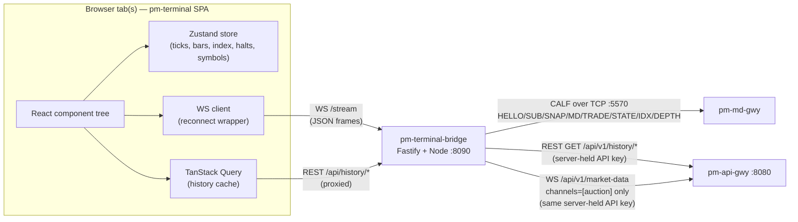

Version: 1.3.0

Date: 2026-07-18

Status: Design Proposal

> **Changelog v1.3.0**
> - Closes the historical-midpoint gap recorded as an open question in
>   v1.2.0 (§22, item 1): `pm-api-gwy` now exposes
>   `GET /history/price-snapshots`, backed by `pm-stats`' existing
>   `price_snapshots` table (15-minute mid/bid/ask cadence per symbol; see
>   `docs/user-guide/260-api-gateway.md`). §4.2/§4.3 gap 2 updated from
>   "data exists, plumbing doesn't" to fully available. §9.3's Symbol Detail
>   chart now describes an actual historical midpoint series (with an
>   explicit 15-minute-resolution caveat vs. live CALF `TOP` ticks) instead
>   of treating the pre-observation portion of the chart as permanently
>   blank. §9.6 data sources updated with the new REST call. The open
>   question is removed from §22; the remaining three are renumbered.
>
> **Changelog v1.2.0**
> - §10 (Index View) rewired to the new index-history REST surface —
>   `GET /history/index-daily` and `GET /history/index-snapshots`
>   (`docs/user-guide/260-api-gateway.md`) — closing the v1.1.0 open question
>   of whether `pm-stats` retains a queryable index level series. It does,
>   and it is now exposed. A recent-structural-change strip
>   (`GET /history/index-events`) was also added to the Index View.
> - New, narrowly-scoped second bridge uplink to `pm-api-gwy`'s
>   `/api/v1/market-data` WebSocket, reusing the bridge's existing read-only
>   API key — added *only* for the two data points CALF structurally cannot
>   carry: auction uncross/imbalance results (`auction` channel — no CALF
>   equivalent at all) and richer circuit-breaker halt context
>   (trigger/reference price, CB level, auto-resume time — CALF's `STATE`
>   only carries the coarse `SESSION`/`PREV` transition). `book`/`trades`/
>   `depth` on that same WS are deliberately **not** used — CALF already
>   covers them, with better guarantees (sequencing, replay, no credential).
>   See new §4.5, §6.4, §13, §14, §17.1a.
> - Corrected a factual error in the v1.1.0 audit (§4.3, gap 2): `pm-stats`
>   *does* retain a historical bid/ask/mid-price series (`price_snapshots`,
>   15-minute cadence) — it just isn't exposed through any `pm-api-gwy` REST
>   endpoint yet. The gap is narrower than previously stated and is now a
>   scoped follow-up (§22) rather than an assumed-impossible limitation.
> - Symbol Detail (§9) gains VWAP, live (intraday-updating) High/Low, and
>   trade count, all sourced from the existing `GET /history/daily` row for
>   today — which `pm-stats` already recalculates on every trade, so no new
>   endpoint or client-side accumulation is needed. This also replaces the
>   v1.1.0 Overview volume mechanism (§8), which hand-rolled a running total
>   from observed CALF `TRADE.QTY` since page load, with a periodic re-poll
>   of the same already-live row — simpler and correct for a tab that joins
>   mid-session, not just one open since the open.
> - Market Overview (§8) gains a client-only Watchlist (pin/filter,
>   `localStorage`-persisted) — a common trader view the paged all-symbols
>   grid alone doesn't provide. No new subscription: it filters the same
>   always-on wildcard feed every tab already receives.
> - Depth-of-Book (§14) now renders the per-level order `COUNT` CALF's
>   `DEPTH` channel already carries — it was parsed into the bridge's WS
>   frame in v1.1.0 but never actually displayed.
> - Fixed the bridge's `index` WS frame schema (§17.3), which was missing
>   `SESSION` and `AGGCAP` even though both are real `IDX`/`SNAP(CH=INDEX)`
>   fields the v1.1.0 Index View wireframe already assumed were there.
>
> **Changelog v1.1.0**
> - Updated throughout for CALF `1.0.0`, which shipped after this document
>   was first written: the `DEPTH` channel, the `SYM=*` wildcard for `TOP`/
>   `TRADE`, and full `INDEX` documentation are now real, not proposed or
>   assumed-undocumented. See `EduMatcher-CALF-Extensions.md` and the
>   normative [CALF Protocol Reference](../docs/user-guide/920-app-calf-protocol.md).
> - §14 (Depth-of-Book) rewritten from a protocol-extension proposal into a
>   regular screen design section; folded into Symbol Detail as a toggle
>   (§9.2) rather than left as a separate blocked future phase.
> - §8 (Overview), §11 (Trade Tape), §12 (Movers) simplified to use one
>   `SYM=*` wildcard subscription each for `TOP`/`TRADE` instead of
>   enumerating every known symbol.
> - §17.1 rewritten to cover the one real new complexity CALF `1.0.0`
>   introduces for this design: `HELLO|RESUME=1` never accepts `SYM=*`, so
>   reconnect after a wildcard subscription requires resuming known symbols
>   individually rather than resuming the wildcard itself.
> - §22 Open Questions trimmed to what is still actually open; three
>   questions from v1.0.0 (INDEX documentation, `TOP`/`TRADE` wildcard,
>   whether `DEPTH` should exist and how it should be gated) are resolved.

# EduMatcher — Market Data Terminal (`pm-terminal`) Design Proposal


## Table of Contents

- [EduMatcher — Market Data Terminal (`pm-terminal`) Design Proposal](#edumatcher--market-data-terminal-pm-terminal-design-proposal)
  - [Table of Contents](#table-of-contents)
  - [1. Motivation](#1-motivation)
  - [2. Problem Statement](#2-problem-statement)
  - [3. Goals and Non-Goals](#3-goals-and-non-goals)
    - [3.1 Goals](#31-goals)
    - [3.2 Non-Goals](#32-non-goals)
  - [4. CALF/RALF Data Availability Audit](#4-calfralf-data-availability-audit)
    - [4.1 Method](#41-method)
    - [4.2 View-by-view data mapping](#42-view-by-view-data-mapping)
    - [4.3 Gaps found](#43-gaps-found)
    - [4.4 Should RALF be used?](#44-should-ralf-be-used)
    - [4.5 Should `pm-api-gwy`'s WS market-data stream be used?](#45-should-pm-api-gwys-ws-market-data-stream-be-used)
    - [4.6 Verdict](#46-verdict)
  - [5. Technology Stack](#5-technology-stack)
    - [5.1 Stack](#51-stack)
    - [5.2 Monorepo layout](#52-monorepo-layout)
  - [6. Architecture](#6-architecture)
    - [6.1 Topology](#61-topology)
    - [6.2 Why a bridge instead of direct browser→CALF](#62-why-a-bridge-instead-of-direct-browsercalf)
    - [6.3 Data flow summary](#63-data-flow-summary)
    - [6.4 `pm-terminal-bridge` responsibilities](#64-pm-terminal-bridge-responsibilities)
    - [6.5 Multi-tab / multi-client fan-out](#65-multi-tab--multi-client-fan-out)
    - [6.6 Reconnect and gap handling](#66-reconnect-and-gap-handling)
  - [7. Application Shell and Navigation](#7-application-shell-and-navigation)
    - [7.1 Shell wireframe](#71-shell-wireframe)
    - [7.2 Top bar](#72-top-bar)
    - [7.3 Navigation rail](#73-navigation-rail)
    - [7.4 Connection status semantics](#74-connection-status-semantics)
  - [8. Screen Design — Market Overview](#8-screen-design--market-overview)
    - [8.1 Purpose](#81-purpose)
    - [8.2 Wireframe](#82-wireframe)
    - [8.3 Paging behaviour](#83-paging-behaviour)
    - [8.4 Column set](#84-column-set)
    - [8.5 Data sources](#85-data-sources)
    - [8.6 Watchlist](#86-watchlist)
  - [9. Screen Design — Symbol Detail](#9-screen-design--symbol-detail)
    - [9.1 Purpose](#91-purpose)
    - [9.2 Wireframe](#92-wireframe)
    - [9.3 Chart behaviour (OHLC + midpoint)](#93-chart-behaviour-ohlc--midpoint)
    - [9.3a Auction result banner and halt context](#93a-auction-result-banner-and-halt-context)
    - [9.4 Time-window zoom and presets](#94-time-window-zoom-and-presets)
    - [9.5 Values table](#95-values-table)
    - [9.6 Data sources](#96-data-sources)
  - [10. Screen Design — Index View](#10-screen-design--index-view)
    - [10.1 Purpose](#101-purpose)
    - [10.2 Wireframe](#102-wireframe)
    - [10.2a Historical charting and the "is this level final?" question](#102a-historical-charting-and-the-is-this-level-final-question)
    - [10.3 No-index-configured state](#103-no-index-configured-state)
    - [10.4 Data sources](#104-data-sources)
  - [11. Screen Design — Trade Tape / Time \& Sales](#11-screen-design--trade-tape--time--sales)
    - [11.1 Wireframe](#111-wireframe)
    - [11.2 Data sources](#112-data-sources)
  - [12. Screen Design — Market Movers / Heatmap](#12-screen-design--market-movers--heatmap)
    - [12.1 Wireframe](#121-wireframe)
    - [12.2 Data sources](#122-data-sources)
  - [13. Screen Design — Session \& Halt Status Board](#13-screen-design--session--halt-status-board)
    - [13.1 Wireframe](#131-wireframe)
    - [13.2 Data sources](#132-data-sources)
  - [14. Screen Design — Depth-of-Book](#14-screen-design--depth-of-book)
    - [14.1 Purpose and status](#141-purpose-and-status)
    - [14.2 What real venues do](#142-what-real-venues-do)
    - [14.3 Why `DEPTH` is cheap for `md_gateway` to serve](#143-why-depth-is-cheap-for-md_gateway-to-serve)
    - [14.4 `DEPTH` channel, as shipped](#144-depth-channel-as-shipped)
    - [14.5 Wireframe](#145-wireframe)
    - [14.6 Data sources](#146-data-sources)
    - [14.7 Deferred: order-flow imbalance and microprice](#147-deferred-order-flow-imbalance-and-microprice)
  - [15. Visual Design System](#15-visual-design-system)
  - [16. Client State Management](#16-client-state-management)
  - [17. `pm-terminal-bridge` Implementation Guide](#17-pm-terminal-bridge-implementation-guide)
    - [17.1 CALF session management](#171-calf-session-management)
    - [17.1a `pm-api-gwy` WS uplink (auction + circuit-breaker enrichment)](#171a-pm-api-gwy-ws-uplink-auction--circuit-breaker-enrichment)
    - [17.2 REST history proxy](#172-rest-history-proxy)
    - [17.3 Bridge → browser WS message schema](#173-bridge--browser-ws-message-schema)
    - [17.4 New files](#174-new-files)
  - [18. Security and Operational Notes](#18-security-and-operational-notes)
  - [19. Config Reference](#19-config-reference)
  - [20. Testing Strategy](#20-testing-strategy)
  - [21. Implementation Plan](#21-implementation-plan)
  - [22. Open Questions](#22-open-questions)
  - [23. Summary](#23-summary)


## 1. Motivation

EduMatcher has an order-entry GUI (`pm-trading-ui`, see
[EduMatcher-Trading-GUI.md](EduMatcher-Trading-GUI.md)) built for authenticated
traders against `pm-api-gwy`. It does not have a lightweight, read-only,
"watch the market" tool that a non-trading user — an instructor demoing the
exchange, a student studying price action, an observer, a bot author
sanity-checking a feed — can open without an API key and without any
trading surface at all.

This proposal specifies **`pm-terminal`**, a small Bloomberg-terminal-style
web application whose only job is to *display* market data: an overview of
all symbols, a deep single-symbol view with charting, an index view, and a
handful of the other panels every trading-floor overview tool has. It is
**strictly read-only** — there is no order entry, no authentication-gated
trading action, anywhere in this design.

Unlike `pm-trading-ui`, which talks to `pm-api-gwy` over REST/WebSocket for
everything, `pm-terminal`'s live *order-book and tick* data comes from
**CALF `1.0.0`**, the purpose-built market-data protocol documented in the
[CALF Protocol Reference](../docs/user-guide/920-app-calf-protocol.md) (the
canonical, code-verified reference; see also
[EduMatcher-Market_Data_Protocol.md](EduMatcher-Market_Data_Protocol.md) and
[EduMatcher-CALF-Extensions.md](EduMatcher-CALF-Extensions.md) for the
design-history trail). CALF `1.0.0` ships all five channels this design
needs — `TOP`, `TRADE`, `STATE`, `INDEX`, and `DEPTH` — plus a `SYM=*`
wildcard for `TOP`/`TRADE`/`STATE`, so `pm-terminal` can lean on CALF more
directly than an earlier draft of this document assumed. Historical bars
(which CALF intentionally does not provide, by design, at any protocol
version) are sourced from `pm-api-gwy`'s existing (and, as of this
revision, index-extended) `/history/*` endpoints, the same store
`pm-trading-ui` already uses. The bridge also opens one narrowly-scoped
secondary connection to `pm-api-gwy`'s own `/api/v1/market-data` WebSocket,
strictly for the two things CALF was never designed to carry — auction
uncross results and rich circuit-breaker context (§4.5) — never for the
book/trade/depth data CALF already serves better. Both `pm-api-gwy`
touchpoints (REST history, and now this WS) stay entirely server-side in
the bridge; no credential of any kind ever reaches the browser (§18).

## 2. Problem Statement

- There is no zero-friction way to just *look* at the market. Today, seeing
  live prices means running `pm-trading-ui` and logging in with an API key
  meant for a trading gateway identity.
- CALF was designed and built specifically to be a simple, human-readable
  feed for exactly this kind of consumer — but nothing consumes it as a
  polished visual client yet; the only worked client is the terminal example
  in the protocol doc and ad hoc bots.
- Instructors and students benefit from a "big screen" overview (paged
  symbol grid, index ticker, trade tape) that a trading blotter UI is not
  designed to present.
- There is a real question — closed by this document — of whether CALF as
  currently specified/implemented actually carries every field this kind of
  terminal needs. As of CALF `1.0.0` it covers every live order-book/tick
  need in this design, including a full order-book depth ladder (`DEPTH`).
  Two things remain outside CALF by design: historical data (CALF is
  intentionally live-only), resolved by reusing and, as of this revision,
  extending `pm-api-gwy`'s history endpoints (§10); and auction/
  circuit-breaker context, which CALF's wire format was never built to
  carry, resolved by a narrow secondary connection to `pm-api-gwy`'s own WS
  market-data stream (§4.5).

## 3. Goals and Non-Goals

### 3.1 Goals

- Ship a Node.js/Vite web application, structured the same way as
  `config-gui` (npm/pnpm workspace: `apps/*` + `packages/*`), that runs
  entirely without a trading API key.
- Consume live order-book/tick data via **CALF `1.0.0`** (`TOP`, `TRADE`,
  `STATE`, `INDEX`, `DEPTH`), through a small first-party bridge process
  (§6) because browsers cannot open the raw TCP sockets CALF uses; consume
  the two things CALF structurally cannot carry — auction results and
  circuit-breaker context (§4.5) — via a second, narrowly-scoped bridge
  connection to `pm-api-gwy`'s own WS market-data stream, never exposed to
  the browser.
- Provide, at minimum, the five view families the user asked for:
  1. **Market Overview** — all symbols, auto-paging, configurable per-page
     delay.
  2. **Symbol Detail** — OHLC bar chart + bid/ask midpoint line, a full
     values table, and a zoomable time window. Large-screen only.
  3. **Index View** — live and historical chart of the configured index (if
     any), the latter now backed by real endpoints (§10).
  4. **Depth-of-Book** — a Level 2 ladder for the active symbol, sourced
     directly from CALF `DEPTH` (§14).
  5. Other common trading-floor panels, scoped in §4/§11–§13.
- Verify, before designing, exactly what CALF (and RALF, where relevant)
  actually deliver today — not what an older draft of the protocol doc used
  to say it delivers, but what the shipped `md_gateway` code allows (§4),
  cross-checked against the current normative
  [CALF Protocol Reference](../docs/user-guide/920-app-calf-protocol.md).
- Make full use of what CALF `1.0.0` already provides — the `DEPTH` channel
  and the `SYM=*` wildcard for `TOP`/`TRADE` — rather than working around
  gaps that no longer exist (§4, §14).
- Reuse the visual language, component choices, and monorepo conventions
  already established by `config-gui` and `pm-trading-ui` so the three
  frontends feel like one family.

### 3.2 Non-Goals

- No order entry, no authentication for trading, no write path to the
  engine, ever. If a future need for authenticated views arises it belongs
  in `pm-trading-ui`, not here.
- No multi-level order-entry DOM with click-to-trade (that is
  `pm-trading-ui`'s Trading Workspace). §14's depth ladder is read-only;
  order-ticket wiring against depth data is explicitly out of scope here,
  now and later — that capability, if ever built, belongs in
  `pm-trading-ui`.
- No mobile/small-screen layout for Symbol Detail — the user confirmed this
  is a large-screen tool.
- No new persistence layer. `pm-terminal-bridge` is stateless beyond
  in-memory CALF replay/reconnect bookkeeping; all durable history continues
  to live in `pm-stats` behind `pm-api-gwy`.
- No RALF integration in v1 (§4.4 explains why, and what would change that).

## 4. CALF/RALF Data Availability Audit

This section is the "verify before designing" step the user asked for. It
was done against **three** sources, in this priority order: (1) the shipped
gateway code in `src/edumatcher/md_gateway/`, `engine/order_book.py`, and
`api_gateway/`, (2) the normative
[CALF Protocol Reference](../docs/user-guide/920-app-calf-protocol.md), and
(3) [`pm-api-gwy`'s REST/WebSocket reference](../docs/user-guide/260-api-gateway.md)
and [Statistics & Reporting](../docs/user-guide/140-statistics-and-reporting.md)
(for what `pm-stats` actually retains, independent of whether it is exposed
yet) — cross-checked against
[EduMatcher-CALF-Extensions.md](EduMatcher-CALF-Extensions.md) and
[EduMatcher-Post-Trade-Dissemination-Gateway.md](EduMatcher-Post-Trade-Dissemination-Gateway.md).
Code and the normative protocol/API docs win where sources disagree; as of
this revision they agree everywhere relevant to this design except the one
correction noted in §4.3, gap 2.

### 4.1 Method

For each planned view, list the data points it needs, then mark where each
one actually comes from today.

### 4.2 View-by-view data mapping

| View | Data point | Source | Status |
|---|---|---|---|
| Overview | Live LAST / BID / ASK / sizes | CALF `TOP` (`SNAP`/`MD`), `SUB\|CH=TOP\|SYM=*` | ✅ available |
| Overview | Live trade prints (for LAST/flash) | CALF `TRADE`, `SUB\|CH=TRADE\|SYM=*` | ✅ available |
| Overview | Today's OPEN (for % change), session volume | `pm-api-gwy` `GET /history/daily`, periodically re-polled (§8.4) | ✅ available — `daily_stats` is recalculated on every trade, not just at end of day |
| Overview | Instrument/session state (halt badge) | CALF `STATE` | ✅ available |
| Symbol Detail | Live top-of-book (chart tail, midpoint) | CALF `TOP` | ✅ available |
| Symbol Detail | Live trade prints (tape, LAST) | CALF `TRADE` | ✅ available |
| Symbol Detail | Historical OHLC bars (1D+ granularity) | `pm-api-gwy` `GET /history/daily` | ⚠️ not in CALF — REST needed (CALF is intentionally live-only) |
| Symbol Detail | Historical intraday bars (1m/5m/1h) | `pm-api-gwy` `GET /history/trades`, bucketed client-side | ⚠️ not in CALF — REST needed |
| Symbol Detail | VWAP, live day High/Low, trade count | `pm-api-gwy` `GET /history/daily` (`vwap`/`high_price`/`low_price`/`trade_count`), periodically re-polled | ✅ available — already computed server-side per trade, previously unused by this design (§9.5) |
| Symbol Detail | Historical bid/ask midpoint | `pm-api-gwy` `GET /history/price-snapshots`, backed by `pm-stats` `price_snapshots` table (15-minute cadence) | ✅ available — closed in v1.3.0; see §9.3 |
| Symbol Detail | Session/halt state | CALF `STATE` | ✅ available |
| Symbol Detail | Circuit-breaker halt reason, trigger/reference price, resume time | `pm-api-gwy` WS `/api/v1/market-data` (session/CB events, delivered automatically post-auth) | ✅ available — CALF `STATE` only carries `SESSION`/`PREV`, not CB context; see §4.5, §9.6, §13 |
| Symbol Detail | Depth ladder for active symbol | CALF `DEPTH` (`SNAP`/`DEPTH`, `SUB\|CH=DEPTH\|SYM=<symbol>`) | ✅ available — see §14 |
| Symbol Detail | Auction uncross result (equilibrium price/qty, imbalance side) | `pm-api-gwy` WS `/api/v1/market-data` (`auction` channel) | ✅ available — no CALF equivalent at all; see §4.5, §9.6 |
| Index View | Live index level, OHL, %chg, session, aggregate cap | CALF `INDEX` (`IDX`/`SNAP`) | ✅ available and fully documented in the normative CALF reference |
| Index View | Historical index level series (daily + intraday) | `pm-api-gwy` `GET /history/index-daily` + `GET /history/index-snapshots` | ✅ available — resolves the v1.1.0 open question; see §10 |
| Index View | Recent structural changes (constituent add/delist, corporate actions) | `pm-api-gwy` `GET /history/index-events` | ✅ available — live round-trip to `pm-index`, see §10.2 |
| Trade Tape | Cross-symbol trade prints | CALF `TRADE`, `SUB\|CH=TRADE\|SYM=*` | ✅ available — single wildcard subscription |
| Movers/Heatmap | LAST + %chg for all symbols | CALF `TOP`/`TRADE` (wildcard) + REST open | ✅ composable from above |
| Session/Halt Board | Session phase + per-symbol halts | CALF `STATE` (`SYM=*` and per-symbol) | ✅ available |
| Session/Halt Board | CB level, trigger/reference price, auto-resume time, resumption mode | `pm-api-gwy` WS `/api/v1/market-data` (session/CB events) | ✅ available — enrichment layered on top of CALF `STATE`, see §4.5, §13 |
| Session/Halt Board | Recent auction uncross results, all symbols | `pm-api-gwy` WS `/api/v1/market-data` (`auction` channel) | ✅ available — see §4.5, §13 |
| Depth ladder | Multi-level book, including per-level order count | CALF `DEPTH` (`SNAP`/`DEPTH`) | ✅ available — see §14 |

### 4.3 Gaps found

1. **No historical data in CALF (by design).** CALF is explicitly scoped as
   a live-only feed; historical data is out of scope at every protocol
   version, including `1.0.0`. This applies equally to symbols and to the
   index — only live `INDEX` snapshots/updates are queryable through CALF.
   All historical bars, for symbols and for the index, have to come from
   somewhere else. `pm-api-gwy`'s `GET /history/daily`, `GET /history/trades`,
   `GET /history/index-daily`, and `GET /history/index-snapshots`
   (`src/edumatcher/api_gateway/routers/history.py`, backed by `pm-stats`
   SQLite) are that somewhere else. The symbol endpoints are already proven
   by `pm-trading-ui`; the index endpoints are new since v1.1.0 of this
   document and are what closes the Index View gap (§10). Resolution: §6,
   §9, §10, §17.2.

2. **Historical bid/ask (midpoint) — corrected in v1.2.0, closed in v1.3.0.**
   The v1.1.0 revision of this document claimed *"neither CALF nor
   `pm-stats` retains historical book state"* and treated a historical
   midpoint chart as permanently out of reach. That was wrong: `pm-stats`'
   `price_snapshots` table (`docs/user-guide/140-statistics-and-reporting.md`)
   has always recorded `mid_price`, `best_bid`, and `best_ask` every
   15 minutes per symbol. v1.2.0 corrected the record but noted the
   remaining gap was purely a plumbing one — no `pm-api-gwy` REST endpoint
   exposed `price_snapshots` yet. That plumbing gap is now closed:
   `GET /history/price-snapshots` (`docs/user-guide/260-api-gateway.md`)
   exposes the same table with the same keyset pagination and public-market-
   data auth tier as `/history/index-snapshots`. §9.3's Symbol Detail chart
   is updated accordingly to actually draw this series, with an explicit
   caveat that its 15-minute cadence is coarser than the live CALF `TOP`
   tail it splices onto.

3. **Auction uncross/imbalance data and rich circuit-breaker context are not
   on the CALF wire.** `auction.result.{SYMBOL}` (equilibrium price,
   matched quantity, imbalance side) and the full `circuit_breaker.halt.{SYMBOL}`
   payload (trigger price, reference price, CB ladder level, auto-resume
   time, resumption mode) both exist as real engine events — `pm-md-gwy`
   itself already subscribes to the halt/resume topics — but CALF's `STATE`
   message only ever surfaces the coarse `SESSION`/`PREV` transition, and
   CALF has no channel for auction results at all (out of scope at every
   CALF version so far). This is not a CALF bug; it is a deliberate
   simplification for a teaching protocol. But it means a terminal that only
   speaks CALF cannot show two things every real trading-floor overview
   screen has: an indicative/uncross price during an auction, and *why* a
   symbol is halted. `pm-api-gwy`'s `/api/v1/market-data` WebSocket already
   carries both (§4.5), so this document resolves the gap by having the
   bridge open a second, narrowly-scoped uplink to it — not by proposing a
   CALF protocol change. Resolution: §4.5, §6.4, §9.6, §13, §17.1a.

Two gaps present in an earlier draft of this document — `INDEX` being
undocumented, and no wildcard subscription for `TRADE`/`TOP` — were resolved
upstream in CALF `1.0.0` (see
[EduMatcher-CALF-Extensions.md](EduMatcher-CALF-Extensions.md) §4–§5) and are
no longer open. A third — no multi-level depth over CALF — was resolved the
same way via the new `DEPTH` channel (§14 below documents it as shipped, not
proposed). All three are recorded in the CHANGELOG rather than repeated here
as live gaps.

### 4.4 Should RALF be used?

**No, not for this application.** RALF
([EduMatcher-Post-Trade-Dissemination-Gateway.md](EduMatcher-Post-Trade-Dissemination-Gateway.md))
is a reconciliation/post-trade feed scoped to `ROLE=CLEARING` and
`ROLE=AUDIT` consumers, carrying execution-level identifiers
(`ORDER_ID`, `EXEC_ID`, `MATCH_ID`, gateway attribution, liquidity flags).
Its own design doc (§14 of the CALF protocol doc, written by the same
author) explicitly argues for keeping post-trade/execution semantics out of
the general market-data path: *"book consumers are not... forced to parse
settlement-oriented payloads."* A market-data terminal is exactly the
"book consumer" that recommendation protects. RALF's longer 24-hour replay
window is tempting for a deeper trade tape, but pulling it in would mean
authenticating as a clearing/audit role for a tool that should need no
credentials at all, and it would blur a separation the protocol design
itself calls out as correct. CALF's `TRADE` channel — one `SYM=*` wildcard
subscription, as of CALF `1.0.0` — is the right and sufficient source for
the Trade Tape (§11).

### 4.5 Should `pm-api-gwy`'s WS market-data stream be used?

**Narrowly, yes — for two things CALF cannot carry, and nothing else.**
`pm-api-gwy` exposes its own public WebSocket,
`/api/v1/market-data` (`docs/user-guide/260-api-gateway.md`), with
`book`, `trades`, `depth`, and `auction` channels, authenticated with a
read-only (`gateway_id: null`) API key. This was not considered in the
v1.1.0 audit, which only weighed CALF against RALF. It deserves the same
"should we use it?" scrutiny RALF got in §4.4, because the answer is not a
flat no the way RALF's is:

- **`book`, `trades`, `depth` — no, keep using CALF.** These three channels
  substantially duplicate `TOP`, `TRADE`, and `DEPTH`. CALF is the
  purpose-built feed for exactly this data: per-`(CH,SYM)` sequencing,
  bounded replay on reconnect, a wildcard subscription for `TOP`/`TRADE`,
  and — critically for this application's "no API key, ever" goal (§2) — no
  credential at the transport layer at all. Duplicating this data over a
  second, credentialed connection would add complexity and a second failure
  mode for no new information.
- **`auction` — yes.** This channel delivers `auction.result.{SYMBOL}`
  (equilibrium/uncross price, quantity matched, imbalance side) with **no
  CALF equivalent whatsoever** — `pm-md-gwy` does not subscribe to
  `auction.result.*` (confirmed against the engine's own subscription-filter
  table), so no CALF protocol version, including `1.0.0`, could ever surface
  this even in principle without a gateway change. A terminal that shows
  `OPENING_AUCTION`/`CLOSING_AUCTION` as a session badge but never shows what
  the auction actually produced is missing one of the more instructive
  things to watch on a teaching exchange.
- **Session/circuit-breaker events — yes, as enrichment.** These arrive
  automatically on the same connection after authentication (no explicit
  subscribe needed). The full `circuit_breaker.halt.{SYMBOL}` payload
  (`trigger_price`, `reference_price`, `level`, `resume_at_ns`,
  `resumption_mode`) is materially richer than CALF `STATE`'s `SESSION`/
  `PREV` pair. `pm-md-gwy` *does* already subscribe to
  `circuit_breaker.halt.`/`circuit_breaker.resume.` internally, but CALF's
  wire format was deliberately kept minimal and never grew fields to carry
  this context out. Rather than propose extending CALF `STATE` (a protocol
  change, out of scope for a GUI design document), this design takes the
  data from where it already exists on the wire today.

Because both of these are needed only as **occasional, low-frequency
enrichment** (an auction uncross happens at most twice a day per symbol; a
halt is rare), not as a second copy of the tick stream, the right shape is
a single, always-open secondary WebSocket connection **from the bridge**,
subscribed to `channels: ["auction"]` only, with `book`/`trades`/`depth`
never requested on it. The same server-held, read-only API key the bridge
already uses for the REST history proxy (§17.2, §18) works here too —
`gateway_id: null` credentials are explicitly documented as valid for
`/api/v1/market-data`. This keeps the "no API key ever reaches the browser"
guarantee (§2, §18) intact: the browser still only ever talks to the
bridge's own WebSocket, never to `pm-api-gwy` directly. See §6.4, §17.1a for
the implementation, and §9.6/§13 for where the resulting data is displayed.

### 4.6 Verdict

CALF `1.0.0` (`TOP` + `TRADE` + `STATE` + `INDEX` + `DEPTH`, all fully
documented in the normative CALF reference) covers every *live order-book
and top-of-book* data need in this design, including the full order-book
ladder, and remains the right choice for all of it — see §4.5. Two things
round out full parity with a real terminal, both resolved without a
protocol change: historical data (symbol *and*, as of this revision, index
— §10), which CALF intentionally never carries at any version, resolved by
reusing and extending `pm-api-gwy`'s history endpoints (§6, §10, §17.2); and
auction/circuit-breaker context CALF's wire format was never designed to
carry, resolved by a narrowly-scoped second bridge connection to
`pm-api-gwy`'s WS market-data stream (§4.5, §6.4). The one genuine remaining
gap — a historical bid/ask midpoint series — turned out to already have its
data recorded (`price_snapshots`, §4.3 gap 2) but not yet exposed via REST;
that is a small, scoped `pm-api-gwy` follow-up (§22), not a `pm-terminal`
limitation. Everything else in this design is buildable today against CALF
and `pm-api-gwy` as shipped, with no protocol extension required.

## 5. Technology Stack

### 5.1 Stack

| Layer | Choice | Rationale |
|---|---|---|
| Frontend framework | React 18 + TypeScript, bundled with Vite | Matches `config-gui`; fast dev loop |
| Styling | Tailwind CSS + shadcn/ui (Radix primitives) | Matches both `config-gui` and `pm-trading-ui`; accessible-by-default |
| Charts | TradingView Lightweight Charts v5 | Same library `pm-trading-ui` uses; candlestick + line series, time-axis zoom/pan built in |
| Tables/grids | TanStack Table v8 | Matches `pm-trading-ui`; virtualized rows for the Overview grid |
| Client state | Zustand | Matches both sibling apps; fine-grained subscriptions suit tick-rate updates |
| Server/cache state | TanStack Query v5 | REST history calls only (§17.2); WS ticks bypass it and write straight into Zustand |
| Routing | React Router v7 | One route per view (`/overview`, `/symbol/:sym`, `/index/:id`, `/tape`, `/movers`, `/session`) |
| Bridge runtime | Node.js 22 LTS | Matches `config-gui`'s backend runtime choice |
| Bridge framework | Fastify | Matches `config-gui`'s `apps/server`; first-class TS, lightweight |
| CALF client | Hand-rolled TCP line client (`net.Socket`) in the bridge | CALF is a bespoke text protocol; no existing npm package speaks it — mirrors the worked Python client in the protocol doc §17 |
| `pm-api-gwy` WS client | `ws` npm package, one outbound connection from the bridge | Standard JSON-over-WebSocket, unlike CALF — no bespoke parser needed; used only for the narrow `auction` + session/CB enrichment uplink (§4.5, §17.1a), not for `book`/`trades`/`depth` |
| Browser transport | Native WebSocket, one connection per browser tab to `pm-terminal-bridge` | No trading-side auth-frame complexity, so no need for `pm-trading-ui`'s bespoke `ManagedSocket`; a thin reconnect wrapper is enough (§17.3) |
| Icons | Lucide React | Matches both sibling apps |

`pm-terminal` intentionally does **not** include React Hook Form, Zod forms,
or any mutation-oriented library — there is nothing in this application the
user submits.

### 5.2 Monorepo layout

Same shape as `config-gui` (`apps/` + `packages/` npm/pnpm workspace),
substituting a CALF bridge for `config-gui`'s Fastify config API:

```
terminal-gui/
  apps/
    web/                    React frontend (Vite)
    bridge/                 Fastify backend: CALF TCP client + pm-api-gwy WS uplink + WS fan-out + history proxy
  packages/
    calf-protocol/          CALF line parser/builder (TS port of md_gateway/protocol.py's grammar)
    shared-types/            TS types shared by web + bridge (ticks, bars, symbols, index, halts)
  package.json               npm/pnpm workspaces root
```

`packages/calf-protocol` is deliberately a thin, dependency-free package —
it only knows the wire grammar (`MSGTYPE|KEY=VALUE|...`), not gateway
semantics — so it can eventually be published and reused by any other
TypeScript CALF client, the same way `md_gateway/protocol.py` is the
reusable parsing core on the Python side.

## 6. Architecture

### 6.1 Topology



`pm-terminal-bridge` is the only new backend process. Everything it talks to
already exists (`pm-md-gwy`, `pm-api-gwy`). The bridge holds two logically
separate connections to `pm-api-gwy` — a REST client for `/history/*` and a
WebSocket client for `/api/v1/market-data` — but reuses the same single
server-held API key for both (§4.5, §18).

### 6.2 Why a bridge instead of direct browser→CALF

CALF is raw newline-delimited TCP (see "Transport and session model" in the
normative CALF reference). Browsers have no API to open arbitrary TCP
sockets — WebSocket or nothing. Two shapes were considered (this was raised
as a clarifying question and resolved in favour of the first):

| Option | Trade-off |
|---|---|
| **Own Node WS↔TCP bridge (chosen)** | New small process, but zero changes to `pm-md-gwy` or the CALF spec; matches `config-gui`'s existing pattern of "frontend + small first-party Node backend"; the bridge can also hide the `pm-api-gwy` API key server-side (§18) |
| Extend `pm-md-gwy` for native WebSocket | Avoids a second process, but changes shared trading infrastructure to serve one read-only viewer's transport preference; couples `pm-md-gwy`'s release cycle to `pm-terminal`'s |

### 6.3 Data flow summary

| Data path | Direction | Mechanism |
|---|---|---|
| Symbol list, index list | Bridge → Browser | WS `hello` frame, sourced from CALF `WELCOME|SYMBOLS=` + config |
| Top-of-book snapshot/update (all symbols) | Bridge → Browser | WS `top` frame ⇐ CALF `SNAP`/`MD` (`CH=TOP`), one bridge-side `SUB|CH=TOP|SYM=*` |
| Trade prints (all symbols) | Bridge → Browser | WS `trade` frame ⇐ CALF `TRADE`, one bridge-side `SUB|CH=TRADE|SYM=*` |
| Session/halt state | Bridge → Browser | WS `state` frame ⇐ CALF `STATE` |
| Index level | Bridge → Browser | WS `index` frame ⇐ CALF `SNAP`/`IDX` (`CH=INDEX`) |
| Depth ladder (active symbol only) | Bridge → Browser | WS `depth` frame ⇐ CALF `SNAP`/`DEPTH` (`CH=DEPTH`, one concrete symbol at a time — `SYM=*` is not allowed for `DEPTH`, see §14) |
| Historical daily bars (symbol) | Browser → Bridge → `pm-api-gwy` → Browser | REST `GET /api/history/daily?symbol=…` (proxied, §17.2) — also re-polled periodically while a symbol is being viewed, for live VWAP/high/low/volume (§9.6) |
| Historical trade ticks (intraday bucketing) | Browser → Bridge → `pm-api-gwy` → Browser | REST `GET /api/history/trades?symbol=…` (proxied) |
| Historical index level series | Browser → Bridge → `pm-api-gwy` → Browser | REST `GET /api/history/index-daily?index_id=…` (1M+ presets) and `GET /api/history/index-snapshots?index_id=…` (1D/5D presets), proxied (§10.4, §17.2) |
| Index structural change log | Browser → Bridge → `pm-api-gwy` → Browser | REST `GET /api/history/index-events?index_id=…` (proxied, §10.2) |
| Auction uncross result | Bridge → Browser | WS `auction_result` frame ⇐ `pm-api-gwy` WS `/api/v1/market-data` (`auction` channel), §4.5 |
| Circuit-breaker halt/resume context | Bridge → Browser | WS `halt_context` frame ⇐ `pm-api-gwy` WS `/api/v1/market-data` (session/CB events, delivered automatically post-auth), §4.5 — layered on top of, not instead of, the CALF-sourced `state` frame |
| Bridge liveness / CALF connection health | Bridge → Browser | WS `bridge_status` frame |

### 6.4 `pm-terminal-bridge` responsibilities

- Hold exactly **one** CALF TCP session to `pm-md-gwy` regardless of how
  many browser tabs are connected (§6.5).
- On startup, `HELLO`, then immediately `SUB|CH=STATE,TOP,TRADE|SYM=*` and
  `SUB|CH=INDEX|SYM=<configured index ids>` — all four wildcard-eligible or
  index subscriptions are available from the first `SUB` call, with no need
  to wait for `WELCOME|SYMBOLS=` first. `CH=DEPTH` is **not** part of this
  always-on set (§14): the bridge only issues `SUB|CH=DEPTH|SYM=<symbol>`
  for the symbol currently open in a browser tab's Symbol Detail or Depth
  view, and `UNSUB`s it once no tab is viewing that symbol anymore, to avoid
  paying `DEPTH`'s heavier per-tick bandwidth for symbols nobody is looking
  at (mirrors the bandwidth reasoning CALF itself uses to justify excluding
  `DEPTH` from the wildcard).
- Track `last_seq` per `(CH, SYM)` exactly like the worked Python client in
  the protocol doc, and use `RESUME`/`LASTSEQ` on reconnect (§6.6) — noting
  that `RESUME` must always target a concrete symbol, never `SYM=*` (§17.1).
- Translate every inbound CALF line into one small JSON frame and fan it out
  to all connected browser WebSocket clients (§17.3).
- Hold a **second**, independent connection to `pm-api-gwy`'s
  `/api/v1/market-data` WebSocket (§4.5, §17.1a), authenticated with the same
  server-held API key as the REST history proxy. Immediately after the
  `{"api_key": ...}` handshake, send
  `{"action":"subscribe","symbols":[...all known symbols...],"channels":["auction"]}`
  — never `"book"`, `"trades"`, or `"depth"`, which CALF already covers.
  Because this control frame takes an explicit symbol list rather than a
  wildcard, the bridge re-sends it whenever its known-symbol set grows (the
  same set it already tracks from CALF's `WELCOME|SYMBOLS=` and newly-seen
  symbols). Session/circuit-breaker events need no subscribe call at all —
  they arrive automatically once authenticated. Translate both into the
  `auction_result`/`halt_context` WS frames (§17.3) and fan them out the same
  way as CALF-sourced frames.
- Own the single `pm-api-gwy` API key used for `/history/*` reads and for the
  `/api/v1/market-data` uplink above, so it never reaches the browser (§18).
- Serve nothing else — no persistence, no computed analytics beyond simple
  per-connection fan-out. Change/percentage math, bucketing, and paging all
  happen client-side in React, same as `pm-trading-ui`'s chart bucketing
  (§16).

### 6.5 Multi-tab / multi-client fan-out

Every browser tab (Overview on one monitor, Symbol Detail on another) opens
its own WebSocket to the bridge, but the bridge keeps a **single shared CALF
subscription set**, unioned across all connected browser clients — not one
CALF session per tab. This mirrors `pm-md-gwy`'s own "shared per-stream ring
buffer, not per-client" design one layer up the stack. For the always-on
wildcard subscriptions (`TOP`, `TRADE`, `STATE`, `INDEX`), this union is
trivial — they are held for the bridge's entire lifetime regardless of tab
count, so there is nothing to reference-count. `DEPTH` is the one exception:
because it is per-symbol, not wildcard (§14), the bridge reference-counts
how many browser tabs currently have that symbol's Depth-of-Book panel open
and only holds `SUB|CH=DEPTH|SYM=<symbol>` while the count is above zero,
`UNSUB`-ing when the last interested tab navigates away or closes.

### 6.6 Reconnect and gap handling

If the bridge's CALF TCP connection drops, it reconnects and resumes exactly
as the worked client in the protocol doc does: `HELLO` with
`RESUME=1`/`LASTSEQ=` per stream, falling back to a fresh `SNAP` on
`ERR|CODE=REPLAY_MISS`. Because `RESUME=1` never accepts `SYM=*` (§17.1),
the bridge resumes its wildcard `TOP`/`TRADE`/`STATE` subscriptions one
concrete known symbol at a time — see §17.1 for the exact sequencing. Browser
WebSocket clients are not torn down for a brief CALF hiccup — they simply
see a `bridge_status: {calf: "RECONNECTING"}` frame and then resume
receiving ticks once the bridge is caught up. If a browser tab's own
WebSocket drops, it reconnects to the bridge and receives a fresh
`hello`/state snapshot — it does not need to track CALF sequence numbers
itself, only the bridge does.

The secondary `pm-api-gwy` WS uplink (§4.5, §6.4) reconnects independently
of the CALF uplink, with its own simple backoff-and-retry loop and its own
`bridge_status.apiGwyWs` field (§17.3) — a browser tab should never show a
full-screen disconnect banner because *this* connection is down, since it
only ever supplies enrichment (auction results, halt context) layered on
top of data CALF already delivers reliably on its own. There is no replay
or sequence tracking on this uplink to get right on reconnect — auction
results and halt events are point-in-time broadcasts, not a sequenced
stream, so a missed one during a brief reconnect window is simply missed,
same as briefly missing a heartbeat.

## 7. Application Shell and Navigation

### 7.1 Shell wireframe

```
┌──────────────────────────────────────────────────────────────────────────┐
│ pm-terminal   [Overview] [Symbol] [Index] [Tape] [Movers] [Session]  ●LIVE│
├──────────────────────────────────────────────────────────────────────────┤
│                                                                            │
│                           < active view content >                        │
│                                                                            │
│                                                                            │
├──────────────────────────────────────────────────────────────────────────┤
│ CONTINUOUS  •  3 symbols halted  •  CALF connected  •  14:32:07 UTC       │
└──────────────────────────────────────────────────────────────────────────┘
```

### 7.2 Top bar

- App name, a fixed row of view tabs (not a collapsible sidebar — six views
  is small enough for a single row), and a global connection indicator
  (`●LIVE` / `●RECONNECTING` / `●OFFLINE`, driven by `bridge_status`).
- A symbol quick-jump (`Cmd/Ctrl+K`) that filters the known symbol list and
  navigates straight to Symbol Detail — useful once the Overview grid is
  paging through dozens of symbols.

### 7.3 Navigation rail

Six top-level routes, each a tab: Overview, Symbol (last-viewed symbol, or a
picker if none yet), Index, Tape, Movers, Session. No role gating anywhere —
every route is reachable with no login, matching the non-goal in §3.2.

### 7.4 Connection status semantics

| Indicator | Meaning |
|---|---|
| `●LIVE` (green) | Bridge's CALF session is `ACTIVE`; ticks flowing |
| `●RECONNECTING` (amber) | Bridge lost its CALF session and is retrying (§6.6); browser keeps last-known values, greyed slightly |
| `●OFFLINE` (red) | Browser's own WebSocket to the bridge is down; full-screen banner, no stale data shown |

## 8. Screen Design — Market Overview

### 8.1 Purpose

The default landing view: every tradable symbol, auto-paging, meant to run
unattended on a lobby/classroom display as well as be actively browsed.

### 8.2 Wireframe

```
┌──────────────────────────────────────────────────────────────────────────┐
│ MARKET OVERVIEW      [ All ▾ ] [☆ Watchlist]   Page 2/5  ⏸ pause  ⚙ 8s ▾  │
├───┬────────┬─────────┬─────────┬─────────┬──────────┬──────────┬────────┤
│ ☆ │ SYMBOL │  LAST    │  CHG    │  %CHG   │   BID    │   ASK    │ VOLUME │
├───┼────────┼─────────┼─────────┼─────────┼──────────┼──────────┼────────┤
│ ★ │ AAPL   │  150.12  │ +0.42  │ +0.28%  │ 150.10   │ 150.12   │ 184,300│
│ ☆ │ MSFT   │  421.05  │ -1.10  │ -0.26%  │ 421.00   │ 421.08   │  92,410│
│ ★ │ TSLA   │  248.77  │ +3.65  │ +1.49%  │ 248.75   │ 248.80   │ 310,922│
│ ☆ │ EDU01  │   58.20  │  0.00  │  0.00%  │  58.15   │  58.24   │   4,110│
│  …│    …     │    …     │   …    │    …    │    …     │    …     │   …    │
├───┴────────┴─────────┴─────────┴─────────┴──────────┴──────────┴────────┤
│ ████████████████████░░░░░░░░  next page in 3s        ‹ prev   next ›     │
└──────────────────────────────────────────────────────────────────────────┘
```

Green/red flash on each cell when a new `MD`/`TRADE` changes its value
(same `FlashCell` pattern `pm-trading-ui` already uses). The `☆`/`★` column
and the `[ All ▾ ] [☆ Watchlist]` toggle are new in this revision — see
§8.6.

### 8.3 Paging behaviour

- Symbols are split into fixed-size pages (rows-per-page derived from
  viewport height so the grid never scrolls — a lobby display has no mouse).
- A per-page dwell timer advances automatically; **the delay is a user
  setting** (`⚙` control: 3s / 5s / 8s / 15s / 30s / custom), persisted per
  browser via `localStorage`.
- Hovering the grid or pressing `⏸` pauses auto-paging; `‹`/`›` step pages
  manually at any time, `⏸`/`▶` toggles resume.
- All rows on all pages stay live regardless of which page is currently
  shown — paging is purely a client-side rendering concern, not a
  subscription concern, so numbers never go stale. This falls out for free
  from the bridge's single `SUB|CH=TOP,TRADE|SYM=*` wildcard subscription
  (§6.4): every symbol is already flowing into the bridge and out to every
  connected tab regardless of what that tab currently renders, so there is
  no per-page subscribe/unsubscribe logic to write at all.

### 8.4 Column set

| Column | Meaning | Source |
|---|---|---|
| ☆/★ | Watchlist pin toggle (§8.6) | client-only, `localStorage` |
| SYMBOL | Ticker | CALF `WELCOME|SYMBOLS=` / config |
| LAST | Last trade price | CALF `TOP.LAST` (falls back to `TRADE.PX`) |
| CHG | `LAST − OPEN` | computed, `OPEN` from REST `/history/daily` |
| %CHG | `CHG / OPEN × 100` | computed |
| BID / ASK | Best bid/ask | CALF `TOP.BID`/`TOP.ASK` |
| VOLUME | Session cumulative volume | REST `/history/daily.volume`, periodically re-polled (§8.5) |
| (badge, not a column) | Halted / auction indicator overlaid on SYMBOL | CALF `STATE` |

### 8.5 Data sources

```
WS  bridge → top      (CH=TOP, SYM=* — one bridge-side wildcard subscription, all symbols)
WS  bridge → trade    (CH=TRADE, SYM=* — one bridge-side wildcard subscription, all symbols)
WS  bridge → state    (CH=STATE, SYM=*  and per-symbol halts)
REST bridge → /api/history/daily?date=today   (initial fetch, then re-polled on a short interval — see below)
```

**VOLUME/CHG/%CHG source, corrected from v1.1.0.** The previous revision
computed `VOLUME` by fetching `/history/daily` once per session and then
hand-incrementing it client-side by summing observed CALF `TRADE.QTY`
prints. That undercounts for any tab that opens mid-session (it only counts
trades it personally observed, not the true session total as of when it
joined) and adds bookkeeping for no real benefit, since `daily_stats` is
already recalculated by `pm-stats` on every trade (`docs/user-guide/`
`140-statistics-and-reporting.md`, §"The Statistics Database Schema"). This
revision instead has TanStack Query re-fetch
`GET /api/history/daily?symbol=<sym>&date=today` on a short interval (e.g.
every 10s, `staleTime`/`refetchInterval` — cheap, one small row per symbol)
for every symbol currently visible in the Overview grid, and simply reads
`open_price`/`volume` straight off the freshest row. `CHG`/`%CHG` were
already REST-sourced for `OPEN` and need no change beyond picking up the
same re-poll. This is simpler code than the v1.1.0 accumulator and correct
for late-joining and reconnecting tabs alike.

### 8.6 Watchlist

A trader watching dozens of paged symbols often only cares about a handful.
The `☆` column pins/unpins a symbol (click to toggle, persisted to
`localStorage` — the same mechanism §16 already uses for page-delay and
chart-toggle preferences, so this needs no new infrastructure). The
`[ All ▾ ] [☆ Watchlist]` control in the top bar switches the grid between
paging through every symbol and paging through only pinned ones (with
paging/auto-advance disabled entirely if five or fewer symbols are pinned,
since they all fit on one page).

This is intentionally **client-only, ephemeral state** — no new CALF
subscription, no bridge involvement, no server persistence (consistent with
the "no new persistence layer" non-goal, §3.2). Every symbol's data is
already flowing into every tab via the bridge's always-on wildcard
subscriptions (§6.4) regardless of watchlist membership; the watchlist only
changes what the Overview grid *renders*, exactly the same way paging
itself already works (§8.3). A different browser/profile simply starts with
an empty watchlist — there is nothing to log into or synchronize.

## 9. Screen Design — Symbol Detail

### 9.1 Purpose

The deep-dive view for one instrument: chart, values table, zoomable time
window. Large-screen only, as confirmed by the user — no responsive
mobile layout is specified.

### 9.2 Wireframe

```
┌──────────────────────────────────────────────────────────────────────────┐
│ AAPL  — CONTINUOUS            150.12  +0.42 (+0.28%)     Vol 184,300     │
├──────────────────────────────────────────────────────────────────────────┤
│ [1D] [5D] [1M] [3M] [YTD] [All] [Live]  ☑ OHLC  ☑ Midpoint  ☐ Depth ▾    │
│                                                                            │
│   152 ┤                                          ╭╮                     │
│   151 ┤                              ╭╮       ╭──╯╰╮   ┃┃┃┃  ← candles  │
│   150 ┤ ┃┃┃┃  ╭───╮  ┃┃┃┃  ╭────╮ ╭──╯╰──╮────╯    ╰─╮ ┃┃┃┃  midpoint ‥ │
│   149 ┤ ┃┃┃┃╭─╯   ╰──┃┃┃┃──╯    ╰─╯       ╰──╮        ╰┃┃┃┃             │
│   148 ┤ ┃┃┃┃╯                                ╰────╮   ┃┃┃┃              │
│       └────────────────────────────────────────────────────────────────┤
│         09:30      10:30      11:30      12:30      13:30      14:30    │
│  ▂▃▁▂▅▃▂▁▃▄▂▁▂▃▁▅▂▁▃▂▁▄▃▂▁▃▄▂▁ (volume histogram, shares each interval)  │
├────────────────────────────┬───────────────────────────────────────────┤
│  VALUES                    │  drag-select on the chart to zoom;         │
│  Open        149.70        │  presets above reset to their fixed window │
│  High        152.05        │                                            │
│  Low         148.10        │  ⓘ opening auction uncrossed @149.85,      │
│  Last        150.12        │    12,400 sh, imbalance BUY  (09:30:02)    │
│  Bid / Ask   150.10 / 150.12│  ← transient banner, §9.3a                │
│  Mid (live)  150.11         │                                           │
│  VWAP        149.94         │                                           │
│  Prev Close  149.70         │                                           │
│  Volume      184,300        │                                           │
│  Trades      1,204          │                                           │
│  Session     CONTINUOUS     │                                           │
└────────────────────────────┴───────────────────────────────────────────┘
```

Toggling `☑ Depth` replaces the values panel (right-hand side, or a
slide-out on narrower large-screen widths) with the Depth-of-Book ladder —
see §14 for its own wireframe and data source. It is off by default: unlike
`OHLC`/`Midpoint`, which reuse subscriptions the bridge already holds for
every symbol, enabling Depth causes the bridge to open a new
`SUB|CH=DEPTH|SYM=<symbol>` for this one symbol (§6.4), so it is opt-in per
viewer rather than always-on.

### 9.3 Chart behaviour (OHLC + midpoint)

- **OHLC bars** are candlesticks built from historical bars (§9.4) with the
  live-forming bar updated in place from CALF `TRADE` prints, exactly the
  pattern `pm-trading-ui`'s chart already implements (bucket ticks into the
  current-timeframe candle, replace on each trade).
- **Midpoint** is a two-part series, spliced at the moment `pm-terminal` (or
  the bridge, if already running) started observing `TOP` updates for this
  symbol:
  - **Historical portion** — a coarse, 15-minute-resolution line fetched
    once per symbol view from `GET /api/history/price-snapshots?symbol=<sym>`
    (§4.3 gap 2, closed in v1.3.0), plotted from `mid_price` (falling back
    to `(best_bid + best_ask) / 2` client-side only if `mid_price` is ever
    null for a row — in practice `pm-stats` always populates it when either
    side of the book is known). Because the recording interval is 15
    minutes, this portion visibly steps between samples rather than moving
    tick-by-tick; the wireframe renders it as a slightly muted line style to
    signal the lower resolution at a glance.
  - **Live portion** — `(BID + ASK) / 2` from CALF `TOP`, drawn tick-by-tick
    from the moment observation started, in the same full-opacity line style
    used in v1.2.0.
  If the historical fetch returns no rows (for example, a symbol added to
  the exchange less than 15 minutes ago, or `pm-stats` not yet having run
  when `pm-terminal` first opened this view), the chart falls back to the
  v1.2.0 behavior: the midpoint series simply starts at the live portion,
  with a small `mid data begins here` marker, rather than showing an error.
  Both series (OHLC candles and midpoint, historical + live together) can be
  toggled independently (checkboxes in the wireframe above); there is no
  separate toggle for the historical vs. live midpoint sub-segments — they
  are one continuous series to the user.
- Both series/toggles are independent of the timeframe presets — switching
  from `1D` to `5D` keeps whichever series are enabled on.

### 9.3a Auction result banner and halt context

New in this revision (§4.5, §4.3 gap 3). Two enrichment cases, both sourced
from the bridge's secondary `pm-api-gwy` WS uplink rather than CALF:

- **Auction uncross.** When this symbol's `auction_result` frame arrives
  (fired once per auction, right as `STATE` transitions out of
  `OPENING_AUCTION`/`CLOSING_AUCTION`), show a small dismissible banner in
  the values panel with the equilibrium price, matched quantity, and
  imbalance side, timestamped. It auto-dismisses after a configurable delay
  (default 60s) or on manual dismiss; the day's auction results remain
  visible in the Session & Halt Status Board (§13) after that.
- **Halt context.** When `STATE` reports `SESSION=HALTED` for this symbol,
  the existing amber `HALTED` badge (§15) gets a hover/expand affordance
  showing the matching `halt_context` frame's `level` (CB ladder level or
  `ADMIN_ALL`), `trigger_price`/`reference_price` (when present — `null` for
  operator-initiated halts), and `resume_at_ns` converted to a countdown or
  wall-clock time (when present — `null` for manual halts, which resume only
  on an explicit operator action). If the `halt_context` frame hasn't
  arrived yet (its uplink is independent of and can lag slightly behind the
  CALF `STATE` transition that raises the badge, §6.6), the badge shows
  alone with no expand affordance until it does — the halt itself is never
  gated on this enrichment arriving.

### 9.4 Time-window zoom and presets

- Preset buttons (`1D`, `5D`, `1M`, `3M`, `YTD`, `All`, `Live`) set the
  visible window; `Live` pins the right edge to now and scrolls with
  incoming ticks (Lightweight Charts' native realtime mode).
- Free-form zoom: click-drag a horizontal range on the chart to zoom in
  (Lightweight Charts' built-in range selection); scroll wheel / pinch to
  zoom in and out continuously; double-click to reset to the active preset.
- **Bar granularity switches with zoom level**, same rule `pm-trading-ui`
  already uses (§16.3 there): `1D`/`5D` render 1m or 5m bars bucketed from
  `GET /history/trades`; `1M`+ render the daily bars from
  `GET /history/daily` directly (no point rendering 90 days of 1-minute
  bars).

### 9.5 Values table

Plain key/value panel, not a grid — one instrument, so no need for
`TanStack Table` here. `Open`/`Prev Close` come from the daily history row
fetched once per symbol view (`Prev Close` never changes intraday, so it is
never re-polled). `High`/`Low`/`VWAP`/`Volume`/`Trades`, added in this
revision, are live for the *current* session — sourced the same way as
Overview's corrected `VOLUME` column (§8.5): TanStack Query re-polls
`GET /api/history/daily?symbol=<sym>&date=today` on a short interval while
this view is open, and the table reads `high_price`/`low_price`/`vwap`/
`volume`/`trade_count` straight off the freshest row. This needed no new
`pm-api-gwy` endpoint or field — `daily_stats` already recalculates every
one of these on every trade (§4.2); v1.1.0 of this design simply never
polled for them. `Bid`/`Ask`/`Mid (live)`/`Last` remain purely
CALF-tick-driven, as before.

### 9.6 Data sources

```
WS   bridge → top            (CH=TOP, this symbol)         → Bid/Ask/Mid, live candle tail
WS   bridge → trade          (CH=TRADE, this symbol)        → Last, live candle OHLC updates
WS   bridge → state          (CH=STATE, this symbol + SYM=*)→ Session badge
WS   bridge → depth          (CH=DEPTH, this symbol — only while the Depth toggle is on, §9.2, §14) → ladder
WS   bridge → auction_result (this symbol, §4.5)             → auction banner, §9.3a
WS   bridge → halt_context   (this symbol, §4.5)             → halt badge detail, §9.3a
REST bridge → /api/history/daily?symbol=AAPL              → Open/Prev Close (once), High/Low/VWAP/Volume/Trades (re-polled while open, §9.5), 1D+ bars
REST bridge → /api/history/trades?symbol=AAPL&limit=…     → intraday bar bucketing
REST bridge → /api/history/price-snapshots?symbol=AAPL    → historical midpoint (15-min cadence, fetched once per symbol view, §9.3)
```

Note that `top`, `trade`, and `state` above arrive at this symbol regardless
of whether Symbol Detail is open, since the bridge already holds them as
part of its always-on `SYM=*` wildcard subscriptions (§6.4) — Symbol Detail
just filters the shared stream down to one symbol client-side. The same is
true of `auction_result`/`halt_context`: the bridge's secondary uplink
(§4.5, §6.4) is always on for every known symbol, so Symbol Detail is again
just filtering a shared stream, not causing a new subscription. `depth` is
the one exception in this view: it is the one WS frame type that actually
causes a new CALF subscription when this view (or its Depth toggle) opens,
and causes an `UNSUB` when it closes (§6.5).

## 10. Screen Design — Index View

### 10.1 Purpose

Chart and headline stats for a configured exchange index (§4 of
[EduMatcher-Index.md](EduMatcher-Index.md)), up to five may exist per
exchange.

### 10.2 Wireframe

```
┌──────────────────────────────────────────────────────────────────────────┐
│ EDU100 INDEX                    1048.73   +6.63 (+0.64%)     ● live      │
├──────────────────────────────────────────────────────────────────────────┤
│ [1D] [5D] [1M] [3M] [YTD] [All] [Live]                                   │
│                                                                            │
│  1056 ┤                    ╭╮                                           │
│  1050 ┤            ╭───────╯╰╮      ╭──╮                                │
│  1044 ┤  ╭─────────╯          ╰──────╯  ╰────────╮                      │
│  1038 ┤──╯                                        ╰──────               │
│       └───────────────────────────────────────────────────────────────┤
│         09:30       10:30       11:30       12:30       13:30           │
├──────────────────────────────┬───────────────────────────────────────┤
│  Open   1042.10               │  Constituents (top weights)             │
│  High   1056.30                │  AAPL  18.2%   ▲                       │
│  Low    1040.05                │  MSFT  15.7%   ▼                       │
│  Aggregate cap  $7.35T         │  TSLA   9.1%   ▲                       │
│  Session  CONTINUOUS           │  …                                     │
├──────────────────────────────┴───────────────────────────────────────┤
│  Recent changes: + AMZN added 2026-06-14 · SPLIT AAPL 2026-05-02       │
└────────────────────────────────────────────────────────────────────────┘
```

Constituent weights use the same `AGGCAP`-relative math the index design
doc already defines; the constituent list itself is static configuration
(not live per-constituent weight streaming — see §22). The **"Recent
changes"** strip is new in this revision: a one-line, most-recent-first
summary of `ADD_CONSTITUENT`/`DELIST`/`CORP_ACTION` events from
`GET /api/history/index-events` (§10.4), fetched once per index view and
not re-polled (these are rare, operator-driven events, not something that
needs live push — a manual refresh or view re-open is enough). Empty when
no events exist in the queried window, which hides the strip entirely
rather than showing an empty row.

The `● live` badge next to the headline level reflects `IDX.SESSION` from
the live CALF stream, not the REST history rows — see §10.2a for why this
distinction matters once historical data is in the picture.

### 10.2a Historical charting and the "is this level final?" question

`GET /api/history/index-daily`'s `close_level` is, per its own
documentation, only guaranteed final once `close_session_state == "CLOSED"`
for that date — for the *current* trading date, while the session is still
open, it is "latest tick so far" and keeps changing
(`docs/user-guide/260-api-gateway.md`, `close_level` warning). This matters
here because the Index View's chart splices live CALF data with historical
REST data exactly like Symbol Detail does (§9.4): for **today**, the
right-hand edge of the chart is live `IDX` ticks, not the REST row, so
there is no ambiguity in what's actually rendered. The caveat only bites if
this view ever displays a bare "close" figure for *today* pulled from
`/history/index-daily` instead of from the live `IDX` stream — which it
must not do. The values panel's `Open`/`High`/`Low` are safe to source from
`/history/index-daily`'s per-day rows even intraday (`open_level`/
`high_level`/`low_level` are running-so-far values that only get more
correct as the day progresses, the same shape `daily_stats` uses for
symbols), but any headline "level"/"close" figure always comes from the
live CALF `IDX` stream (`● live` badge above), never from a REST row for
the current date.

### 10.3 No-index-configured state

If the exchange has zero indexes configured, the **Index** tab is not
hidden — it shows an explanatory empty state ("This exchange has no index
configured") rather than disappearing, so the tab layout stays stable
across differently-configured classroom exchanges. `/history/index-daily`
and `/history/index-snapshots` both return an empty list (not an error) in
this state, so the historical chart also degrades to its own empty state
rather than an error banner — no special-casing needed in the bridge.

### 10.4 Data sources

```
WS   bridge → index   (CH=INDEX, SYM=<index id>)             → live level, OHL, chg/%chg, session, aggregate cap (§17.3 fix)
REST bridge → /api/history/index-daily?index_id=<id>          → 1M/3M/YTD/All chart presets, Open/High/Low values panel (§10.2a)
REST bridge → /api/history/index-snapshots?index_id=<id>&from=…&to=…&limit=… → 1D/5D intraday chart presets
REST bridge → /api/history/index-events?index_id=<id>         → "Recent changes" strip (§10.2), fetched once per view
```

This closes the v1.1.0 open question of whether `pm-stats` retains a
queryable historical index series (§22 in that revision) — it does, via
`index_daily_stats` and `index_level_snapshots`
(`docs/user-guide/140-statistics-and-reporting.md`), and both are now
exposed through `pm-api-gwy`. The bar-granularity-switches-with-zoom
pattern is identical to Symbol Detail's (§9.4): `1D`/`5D` render from
`index-snapshots` (raw intraday level ticks, no separate bucketing step
needed since `pm-index` writes one row per `index.update`, already fine
enough granularity to chart directly); `1M`+ render the daily bars from
`index-daily` directly.

## 11. Screen Design — Trade Tape / Time & Sales

### 11.1 Wireframe

```
┌──────────────────────────────────────────────────────────────────────────┐
│ TRADE TAPE                         Symbol: [ All ▾ ]      ⏸ pause        │
├──────────┬────────┬──────────┬────────┬──────────────────────────────────┤
│  TIME    │ SYMBOL │  PRICE   │  QTY   │  SIDE                            │
├──────────┼────────┼──────────┼────────┼──────────────────────────────────┤
│ 14:32:07 │ TSLA   │  248.77  │  200   │  ▲ BUY                           │
│ 14:32:06 │ AAPL   │  150.12  │  150   │  ▲ BUY                           │
│ 14:32:05 │ MSFT   │  421.05  │   80   │  ▼ SELL                          │
│ 14:32:04 │ AAPL   │  150.10  │  300   │  ▼ SELL                          │
│  …       │  …     │   …      │   …    │   …                              │
└──────────┴────────┴──────────┴────────┴──────────────────────────────────┘
```

New rows insert at the top and scroll down; a bounded ring buffer (last
~500 prints, client-side) keeps memory flat. Symbol filter narrows the tape
without changing the underlying subscription (the bridge already holds a
single `SUB|CH=TRADE|SYM=*` wildcard subscription covering every symbol,
per §6.4).

### 11.2 Data sources

```
WS  bridge → trade   (CH=TRADE, SYM=* — one bridge-side wildcard subscription, all symbols)
```

## 12. Screen Design — Market Movers / Heatmap

### 12.1 Wireframe

```
┌──────────────────────────────────────────────────────────────────────────┐
│ MOVERS                                    [ Gainers | Losers | Active ]  │
├────────┬─────────┬─────────┬──────────────────────────────────────────┤
│ SYMBOL │  LAST    │  %CHG   │  ▓▓▓▓▓▓▓▓▓▓▓▓▓▓▓▓▓▓  (bar scaled to %chg) │
├────────┼─────────┼─────────┼──────────────────────────────────────────┤
│ TSLA   │  248.77  │ +1.49% │  ██████████████████                       │
│ AAPL   │  150.12  │ +0.28% │  ████                                     │
│ EDU01  │   58.20  │  0.00% │                                           │
│ MSFT   │  421.05  │ -0.26% │  ████                                     │
│  …     │    …     │   …    │   …                                       │
└────────┴─────────┴─────────┴──────────────────────────────────────────┘
```

`Active` sorts by session volume instead of %chg — a common third tab on
real overview boards, and cheap here since Overview (§8) already computes
volume per symbol.

### 12.2 Data sources

Same feed as Overview (§8.5) — Movers is a different sort/rank over the
identical live+REST-baseline dataset, no new subscriptions.

## 13. Screen Design — Session & Halt Status Board

### 13.1 Wireframe

```
┌──────────────────────────────────────────────────────────────────────────┐
│ SESSION STATUS                                                           │
├──────────────────────────────────────────────────────────────────────────┤
│  Exchange session:  CONTINUOUS   (since 09:30:00, prev: OPENING_AUCTION) │
├──────────────────────────────────────────────────────────────────────────┤
│  ACTIVE HALTS                                                            │
│  ┌────────┬───────┬──────────┬────────────┬────────────┬──────────────┐│
│  │ SYMBOL │ LEVEL │ TRIGGER  │ REFERENCE  │ RESUMES     │ SINCE        ││
│  ├────────┼───────┼──────────┼────────────┼────────────┼──────────────┤│
│  │ TSLA   │ L2    │ 261.40   │ 248.00     │ AUCTION     │ 11:02:17     ││
│  │        │       │          │            │ ~11:07:17   │              ││
│  └────────┴───────┴──────────┴────────────┴────────────┴──────────────┘│
│  (empty state: "No symbols currently halted")                            │
├──────────────────────────────────────────────────────────────────────────┤
│  RECENT AUCTION RESULTS                                                  │
│  ┌────────┬─────────────┬───────────┬───────────┬─────────────────────┐│
│  │ SYMBOL │ EQ. PRICE   │ QTY       │ IMBALANCE │ TIME                 ││
│  ├────────┼─────────────┼───────────┼───────────┼─────────────────────┤│
│  │ AAPL   │ 149.85      │ 12,400    │ BUY       │ 09:30:02             ││
│  │ MSFT   │ (no cross)  │ 0         │ —         │ 09:30:02             ││
│  └────────┴─────────────┴───────────┴───────────┴─────────────────────┘│
│  (empty state: "No auctions completed yet this session")                 │
└──────────────────────────────────────────────────────────────────────────┘
```

The `LEVEL`/`TRIGGER`/`REFERENCE`/`RESUMES` columns and the whole "RECENT
AUCTION RESULTS" panel are new in this revision (§4.3 gap 3, §4.5) — v1.1.0
only had `STATE`/`PREV`/`SINCE`, which CALF's own `STATE` message already
provides. `RESUMES` shows the `resumption_mode` (`AUCTION`/`CONTINUOUS`/
`MANUAL`) and, when `resume_at_ns` is present, a converted wall-clock
estimate; `MANUAL` halts show `RESUMES: MANUAL` with no time, since they
only end on an explicit operator action. `TRIGGER`/`REFERENCE` show `—` for
operator-initiated (`ADMIN_ALL`) halts, matching `trigger_price`/
`reference_price` both being `null` in that case. The auction table is a
bounded, session-scoped ring buffer (client-side, mirrors the Trade Tape's
approach, §11.1) of every `auction_result` frame seen since the tab opened
— it is not a durable history and clears on tab reload, which is
acceptable for a "what just happened" board rather than an audit log (an
actual audit trail is `pm-index`'s own structural log, surfaced separately
via `/history/index-events` on the Index View, §10.2).

### 13.2 Data sources

```
WS  bridge → state           (CH=STATE, SYM=* for session phase, per-symbol for halts)
WS  bridge → halt_context    (all symbols, §4.5)   → LEVEL/TRIGGER/REFERENCE/RESUMES columns
WS  bridge → auction_result  (all symbols, §4.5)   → RECENT AUCTION RESULTS panel
```

The `state`-sourced part of this view is a re-render of data already
required for the badges elsewhere (§8.4, §9.6) — no new subscription there.
`halt_context` and `auction_result` are the same always-on secondary-uplink
frames Symbol Detail consumes per-symbol (§9.6); here they are simply
rendered across every symbol at once rather than filtered to one, which is
exactly the "whole board's health at a glance" purpose this view exists
for (§8.1's "lobby display" use case).

## 14. Screen Design — Depth-of-Book

### 14.1 Purpose and status

A Level 2 order-book ladder for whichever symbol is currently open in
Symbol Detail (§9), toggled on from there rather than being its own nav
tab. This section was originally written as a protocol-extension proposal
for a `DEPTH` channel that did not exist yet; CALF `1.0.0` has since shipped
it exactly as proposed (see
[EduMatcher-CALF-Extensions.md](EduMatcher-CALF-Extensions.md) §6 and the
normative [CALF Protocol Reference](../docs/user-guide/920-app-calf-protocol.md)),
so this is now a regular, buildable screen — not a future increment blocked
on a protocol change. The background on what real venues do and what
EduMatcher already computed internally (§14.2 in the original draft) is kept
below because it explains *why* the ladder is cheap for `md_gateway` to
serve, which still matters for capacity planning even though the channel
itself is no longer new.

### 14.2 What real venues do

Real exchange feeds are conventionally described in three tiers:

| Level | Content | Example real feeds |
|---|---|---|
| Level 1 | Best bid/ask + sizes (what CALF `TOP` provides) | Most consolidated tape/SIP feeds |
| Level 2 | Aggregated depth by price, several to many levels (what CALF `DEPTH` provides) | Nasdaq TotalView (aggregated view), CME MDP 3.0 Market-By-Price (`MBP-10`) |
| Level 3 | Full order-by-order book, every resting order individually | Nasdaq TotalView-ITCH (Market-By-Order), CME MDP 3.0 Market-By-Order |

A Bloomberg-style terminal's depth ladder is a Level 2 view: aggregated
quantity per price level, not individual orders. That is also the right
target for EduMatcher — Level 3 would expose per-order identity CALF
deliberately keeps out of the public feed at every version, `DEPTH`
included (see "Out of scope in CALF 1.0.0" in the normative reference).

### 14.3 Why `DEPTH` is cheap for `md_gateway` to serve

- `OrderBook.snapshot()` (`src/edumatcher/engine/order_book.py`) aggregates
  every resting order into per-price-level rows, sorted best-first, on every
  `book.{SYMBOL}` publish — the exact Level 2 shape `DEPTH` needs.
- `md_gateway` already subscribed to `book.{SYMBOL}` for `TOP` before
  `DEPTH` existed; `DEPTH` reuses that same subscription and payload rather
  than opening a new one — confirmed in the shipped
  `_poll_engine_events`/`normalise_depth` code path
  (`src/edumatcher/md_gateway/gateway.py`,
  `src/edumatcher/md_gateway/normaliser.py`).
- No engine change was required to ship `DEPTH` — it was purely a
  normaliser/gateway addition, which is why it landed quickly once proposed.

### 14.4 `DEPTH` channel, as shipped

Mirrors the `TOP`/`SNAP` shape, per the normative CALF reference:

| Field | Req | Type | Description |
|---|---|---|---|
| `CH` | ✓ | string | `DEPTH` |
| `SYM` | ✓ | string | Instrument symbol — always a concrete symbol; `SYM=*` is not valid for `DEPTH` |
| `SEQ` | ✓ | int | Monotonic sequence for `(DEPTH, SYM)` |
| `TS` | ✓ | string | Event/snapshot timestamp |
| `LEVELS` | ✓ | int | Number of levels included per side (`market_data_gateway.depth_levels`, default 10, gateway-wide — no per-client override) |
| `BIDS` | — | string | Comma-separated `price:qty:count` triples, best price first; omitted (not empty) when no resting bids |
| `ASKS` | — | string | Comma-separated `price:qty:count` triples, best price first; omitted (not empty) when no resting asks |

```text
SUB|CH=DEPTH|SYM=AAPL
SNAP|CH=DEPTH|SYM=AAPL|SEQ=1|TS=2026-07-11T14:32:00.000Z|LEVELS=10|BIDS=150.10:1200:3,150.09:800:2,150.08:400:1|ASKS=150.12:900:2,150.13:600:1,150.14:250:1
DEPTH|CH=DEPTH|SYM=AAPL|SEQ=2|TS=2026-07-11T14:32:00.512Z|LEVELS=10|BIDS=150.10:1400:4,150.09:800:2,150.08:400:1|ASKS=150.12:900:2,150.13:600:1,150.14:250:1
```

`DEPTH` is **full-ladder replace per message, not a per-level diff** — each
message carries a side's complete current top-`LEVELS` ladder, sent only
when the tracked levels actually changed since the previous `DEPTH`/`SNAP`
for that symbol. `pm-terminal`'s depth-rendering code should always replace
its entire in-memory ladder for a side on receipt, never attempt to patch
one price level in place.

`SUB|CH=DEPTH|SYM=*` is invalid — the gateway rejects it with
`ERR|CODE=INVALID_SYMBOL` — because `DEPTH` messages are heavier than `TOP`
(up to `2 × depth_levels` price levels each); this is exactly why §6.4/§6.5
scope `pm-terminal-bridge`'s `DEPTH` subscription to one symbol at a time,
reference-counted by how many open tabs are viewing it, rather than folding
it into the always-on wildcard set the other channels use.

### 14.5 Wireframe

```
┌──────────────────────────────────────────────────────────────────────────┐
│ AAPL — DEPTH                                                             │
├────┬──────────────┬────────┬──────────────────┬────────┬────────────────┤
│ # │      BID QTY   │  BID   │       │  ASK     │ ASK QTY│ #              │
├────┼──────────────┼────────┼──────────────────┼────────┼────────────────┤
│ 4  │        1,400   │ 150.10 │  ████ │  150.12  │    900 │ 2              │
│ 2  │          800   │ 150.09 │  ██   │  150.13  │    600 │ 1              │
│ 1  │          400   │ 150.08 │  █    │  150.14  │    250 │ 1              │
│ …  │            …   │  …    │       │   …      │    …   │ …              │
├────┴──────────────┴────────┴──────────────────┴────────┴────────────────┤
│ up to LEVELS rows per side (10 by default, gateway-configured)           │
│ # = resting order count aggregated into that price level                 │
└──────────────────────────────────────────────────────────────────────────┘
```

Bar length scales to `qty` relative to the largest level currently shown on
either side, same convention as the Movers bar (§12.1). Rows beyond the
gateway's configured `LEVELS` simply don't exist in the feed — there is no
"load more" affordance, since `pm-terminal` cannot request a deeper ladder
than the gateway is configured to publish (§14.4).

The **`#` order-count columns are new in this revision.** `DEPTH`'s wire
grammar is `PRICE:QTY:COUNT` per level (§14.4), and the bridge's `depth` WS
frame already parses `COUNT` into the third element of each
`[price, qty, count]` triple (§17.3) — v1.1.0 simply never rendered it. It
is genuinely useful context a Level 2 ladder alone doesn't convey: a level
with `1,400` resting from a single order reads very differently from the
same `1,400` split across four, and costs nothing extra to show since the
data was already on the wire and already in the frame.

### 14.6 Data sources

```
WS  bridge → depth   (CH=DEPTH, one concrete symbol — the symbol currently open in Symbol Detail with the Depth toggle on, §6.4, §9.2)
```

### 14.7 Deferred: order-flow imbalance and microprice

`OrderBook.depth_snapshot()` separately computes `bid_depth`, `ask_depth`,
`imbalance` (`[-1, 1]`), and `microprice` on a different engine topic,
`depth.{SYMBOL}`, which `md_gateway` does not subscribe to. This is
explicitly deferred in
[EduMatcher-CALF-Extensions.md](EduMatcher-CALF-Extensions.md) §7 ("Order-flow
imbalance / microprice fields... a clean follow-up once `DEPTH` has shipped
and proven itself") — not part of CALF `1.0.0`'s `DEPTH` channel. If/when
those fields are added to CALF, they are a natural extension of the ladder
above (an `IMB=`/`MICROPX=` field pair on the same message or a lightweight
companion channel) and this screen would gain an imbalance readout with no
other structural change. Not built out further here; tracked as a future
increment, not an open question blocking this design.

## 15. Visual Design System

Reuses the palette and component conventions already established by
`pm-trading-ui` (§8 there is the canonical reference) rather than inventing
a new one:

| Element | Convention |
|---|---|
| Price up / flash | Green background flash, fades over ~600ms (`FlashCell`) |
| Price down / flash | Red background flash, same fade |
| Halted badge | Amber pill, `HALTED` |
| Auction phase badge | Blue pill, `OPENING_AUCTION` / `CLOSING_AUCTION` |
| Continuous session | No badge — absence of a badge *is* the "normal" signal |
| Disconnected/stale data | Entire affected panel dims to ~50% opacity, small "stale" icon in its corner |
| Typography | Tabular figures (`font-variant-numeric: tabular-nums`) on every price/qty column so digits don't jitter horizontally on update |
| Density | Compact row height by default (this is a "many symbols on screen" tool, not a spacious dashboard) |

## 16. Client State Management

```
┌─────────────────────────────────────────────────────────────┐
│  Zustand (synchronous, in-memory, ephemeral)                │
│  • WS connection status (bridge_status frames)               │
│  • Known symbol list + index list (from `hello` frame)       │
│  • Live top-of-book per symbol (bid/ask/sizes)                │
│  • Live last trade + rolling session volume per symbol        │
│  • Active halts / session phase                                │
│  • Trade tape ring buffer (bounded, ~500 entries)              │
│  • Active symbol (drives Symbol Detail route)                  │
│  • Depth ladder for the active symbol, when Depth toggle is on │
│  • UI prefs: overview page delay, chart series toggles incl. Depth (persisted to localStorage) │
└─────────────────────────────────────────────────────────────┘
┌─────────────────────────────────────────────────────────────┐
│  TanStack Query (server state, stale-while-revalidate)        │
│  • Daily history rows (`/api/history/daily`) — 5m stale time  │
│  • Trade history for intraday bucketing (`/api/history/trades`) — 60s stale time │
└─────────────────────────────────────────────────────────────┘
```

This is a deliberately smaller split than `pm-trading-ui`'s (§5.3 there) —
there are no orders, positions, or mutations, so the "server state" layer
only ever holds read-only history, never anything invalidated by a write.

## 17. `pm-terminal-bridge` Implementation Guide

### 17.1 CALF session management

```python
# Mirrors md_gateway's own ClientSession shape, one level up
class CalfUplink:
    socket: net.Socket            # TCP connection to pm-md-gwy :5570
    state: "CONNECTED" | "ACTIVE" | "RECONNECTING"
    last_seq: dict[(str, str), int]   # (CH, SYM) -> last SEQ seen, SYM is a concrete symbol or "*"
    subscribed: set[(str, str)]       # (CH, SYM) currently SUB'd, includes ("TOP","*") etc.
    symbols: list[str]                 # from WELCOME|SYMBOLS=, grown as new symbols are learned
    ch_supported: set[str]             # parsed from WELCOME|CH_SUPPORTED=
```

- On connect: `HELLO|CLIENT=pm-terminal-bridge|PROTO=CALF1`, then
  immediately `SUB|CH=STATE,TOP,TRADE|SYM=*` and
  `SUB|CH=INDEX|SYM=<configured index ids>` (§6.4) — all are available from
  the first `SUB` with no need to wait on `WELCOME|SYMBOLS=` first, since
  `SYM=*` covers symbols the bridge hasn't even learned about yet (they
  fan out automatically once the gateway sees them, per the CALF `1.0.0`
  wildcard semantics). Parse `WELCOME|CH_SUPPORTED=` and only send
  `SUB|CH=DEPTH|...` calls if `DEPTH` is present, so the bridge degrades
  gracefully against an older gateway build instead of erroring on every
  depth-toggle request.
- **Reconnect is where the wildcard subscriptions get more work, not less.**
  `HELLO|RESUME=1` only ever resumes one `(CH, SYM)` stream per `HELLO`, and
  `SYM=*` is invalid for `RESUME` on every channel — the gateway rejects it
  outright, even for `TOP`/`TRADE`/`STATE`, because there is no wildcard
  snapshot baseline to fall back on for a replay miss (§920 of the CALF
  reference, "Reconnect behavior"). So the bridge cannot simply resend
  `HELLO|RESUME=1|CH=TOP|SYM=*|LASTSEQ=...` after a drop. Instead, on
  reconnect the bridge:
  1. Sends a plain `HELLO` (no `RESUME`) to re-establish the session and
     get a fresh `WELCOME`.
  2. Re-issues `SUB|CH=STATE,TOP,TRADE|SYM=*` and
     `SUB|CH=INDEX|SYM=<index ids>` immediately — this restores live
     delivery going forward for every symbol right away, same as first
     connect.
  3. For any symbol the bridge was actively serving to a browser tab
     (i.e. had non-empty `last_seq` for), issues a **separate**
     `HELLO...RESUME=1|CH=<ch>|SYM=<that concrete symbol>|LASTSEQ=...`
     per stream to backfill the gap between disconnect and step 2's fresh
     `SUB`, exactly as the CALF reference's worked client example does —
     just looped over concrete symbols instead of assumed to work with a
     single wildcard call. This step is a best-effort gap-fill, not a
     correctness requirement: `pm-terminal` is a display-only viewer, so a
     brief tick gap during reconnect (visible to the user only as a short
     `RECONNECTING` state, §6.6) is an acceptable trade-off against the
     complexity of resuming every known symbol on every reconnect.
  4. `DEPTH` subscriptions follow the same per-symbol resume pattern in
     step 3, scoped to whichever symbols currently have their Depth toggle
     on (§6.5) — there is no wildcard `DEPTH` to re-establish in step 2.
- Buffer partial TCP reads and split on `\n` — the same non-negotiable rule
  the CALF reference calls out ("TCP stream requirement"); do not assume one
  `recv`/`data` event is one message.
- On `ERR|CODE=SLOW_CLIENT`, reconnect immediately following the sequence
  above (the bridge, not the browser, is the "client" CALF sees, so this
  only ever affects the bridge's own uplink, never a browser tab directly).

### 17.1a `pm-api-gwy` WS uplink (auction + circuit-breaker enrichment)

New in this revision (§4.5, §6.4). A second, independent connection, kept
deliberately simple because it carries low-frequency enrichment, not a tick
stream:

```python
class ApiGwyMarketDataUplink:
    ws: WebSocket                 # connection to pm-api-gwy /api/v1/market-data
    state: "CONNECTED" | "AUTHENTICATED" | "RECONNECTING"
    subscribed_symbols: set[str]  # mirrors CalfUplink.symbols; re-sent on growth
```

- On connect: send `{"api_key": "<same server-held key as §17.2>"}` first,
  per the API gateway's WS auth handshake. Session and circuit-breaker
  events then arrive automatically with no subscribe call.
- Immediately after auth, send
  `{"action":"subscribe","symbols":[...CalfUplink.symbols...],"channels":["auction"]}`
  — never `"book"`, `"trades"`, or `"depth"` (§4.5). Re-send this same
  control frame (full symbol list, not a delta) whenever
  `CalfUplink.symbols` grows, since this channel has no `SYM=*`-equivalent
  wildcard the way CALF does. The exact semantics of re-subscribing with a
  changed symbol list (does it replace or add to the existing
  subscription?) are not fully pinned down by
  `docs/user-guide/260-api-gateway.md` as written — treat this as an
  implementation detail to confirm against the running gateway before
  shipping, not an assumption to build deeper logic on top of (see also
  §22).
- Translate `session.state`/`circuit_breaker.halt.{SYMBOL}`/
  `circuit_breaker.resume.{SYMBOL}` events into `halt_context` frames and
  `auction.result.{SYMBOL}` events into `auction_result` frames (§17.3), and
  fan both out to all connected browser tabs the same way CALF-sourced
  frames are (§6.4).
- Reconnect independently of `CalfUplink` (§6.6): simple backoff-and-retry,
  no replay/resume semantics needed since these are point-in-time broadcasts
  rather than a sequenced stream (unlike every CALF channel, these events
  carry no `SEQ`). A missed event during a brief reconnect window is simply
  missed — acceptable for enrichment data, same trade-off already accepted
  for CALF ticks during its own reconnect window (§17.1, step 3).

### 17.2 REST history proxy

The bridge exposes a thin, symbol/date/limit-passthrough proxy in front of
`pm-api-gwy`'s history endpoints:

```
GET /api/history/daily?symbol=AAPL&date=2026-07-11
GET /api/history/trades?symbol=AAPL&from=...&to=...&limit=1000
GET /api/history/index-daily?index_id=EDU100&date=2026-06-14
GET /api/history/index-snapshots?index_id=EDU100&from=...&to=...&limit=100
GET /api/history/index-events?index_id=EDU100&from=...&to=...
```

The last three are new in this revision (§10.4). The bridge holds one
long-lived `pm-api-gwy` API key (read-only history scope — see §18) in its
own config and attaches it server-side; the browser never sees a
credential. Responses are passed through unmodified (same shape
`pm-trading-ui` already consumes for the symbol endpoints), so the
frontend's history-fetching code can be near-identical to
`pm-trading-ui`'s existing implementation. `index-events`'s pagination
model differs slightly from the others (`max_records` instead of
`limit`/`after`/`has_more`, per its own live-round-trip-to-`pm-index`
contract, §10.2) — the proxy passes this through as-is rather than trying
to normalize it to match the SQLite-backed endpoints' cursor shape.

### 17.3 Bridge → browser WS message schema

One WebSocket per browser tab, JSON frames, discriminated by `type`:

```jsonc
{ "type": "hello", "symbols": ["AAPL","MSFT","TSLA"], "indexes": ["EDU100"] }
{ "type": "top", "sym": "AAPL", "seq": 101, "ts": "...", "bid": 150.10, "bidSz": 1400, "ask": 150.12, "askSz": 900, "last": 150.12, "lastSz": 200 }
{ "type": "trade", "sym": "AAPL", "seq": 44, "ts": "...", "px": 150.12, "qty": 200, "side": "BUY" }
{ "type": "state", "sym": "AAPL", "seq": 3, "ts": "...", "session": "HALTED", "prev": "CONTINUOUS" }
{ "type": "index", "sym": "EDU100", "seq": 42, "ts": "...", "level": 1048.73, "chg": 6.63, "pctChg": 0.64, "open": 1042.10, "high": 1056.30, "low": 1040.05, "session": "CONTINUOUS", "aggCap": 7350000000000 }
{ "type": "depth", "sym": "AAPL", "seq": 2, "ts": "...", "levels": 10, "bids": [[150.10,1400,4],[150.09,800,2]], "asks": [[150.12,900,2],[150.13,600,1]] }
{ "type": "auction_result", "sym": "AAPL", "ts": "...", "eqPrice": 149.85, "eqQty": 12400, "tradesCount": 38, "imbalanceSide": "BUY" }
{ "type": "halt_context", "sym": "TSLA", "ts": "...", "kind": "HALT", "level": "L2", "triggerPrice": 261.40, "referencePrice": 248.00, "resumeAtNs": 1752230837000000000, "resumptionMode": "AUCTION" }
{ "type": "bridge_status", "calf": "ACTIVE" | "RECONNECTING", "apiGwyWs": "ACTIVE" | "RECONNECTING", "since": "..." }
```

`depth` frames are only sent to a browser tab that has subscribed to that
symbol's ladder via a `depth_subscribe`/`depth_unsubscribe` client→bridge
message (not shown above — a small control frame the browser sends when the
Depth toggle in Symbol Detail is switched on/off, §9.2), which is what
drives the bridge's reference-counted `SUB|CH=DEPTH`/`UNSUB` behavior
(§6.5). Every other frame type above is pushed to all connected tabs
unconditionally, since the bridge's `TOP`/`TRADE`/`STATE`/`INDEX`
subscriptions, and the secondary `auction`/session/CB uplink (§17.1a), are
always-on regardless of which tab wants what (§6.4). The `BIDS`/`ASKS`
`price:qty:count` wire triples are parsed once, server-side, into
`[price, qty, count]` number tuples so the browser never touches the CALF
colon/comma grammar.

`index` gained `session`/`aggCap` in this revision — both are real `IDX`/
`SNAP(CH=INDEX)` fields (`SESSION`/`AGGCAP` in the normative CALF
reference's `IDX` message definition) the v1.1.0 schema simply omitted, even though the Index View wireframe (§10.2) already showed
a "Session"/"Aggregate cap" row that had nothing backing it. `auction_result`
and `halt_context` are new frame types (§4.5, §17.1a): `halt_context.kind`
distinguishes a halt announcement from a resume (`"HALT"`/`"RESUME"`);
`triggerPrice`/`referencePrice`/`resumeAtNs` are `null` for operator-
initiated (`ADMIN_ALL`) halts, mirroring the engine payload directly
(§9.3a, §13.1). `bridge_status` gained `apiGwyWs` alongside the existing
`calf` field, since the two uplinks now reconnect independently (§6.6,
§17.1a).

Deliberately flat JSON, one object per CALF line — no client-side parsing
of the pipe-delimited wire format is needed; that translation happens once,
server-side, in `packages/calf-protocol`.

### 17.4 New files

| File | Purpose |
|---|---|
| `apps/bridge/src/main.ts` | Fastify app entry, WS route, HTTP proxy routes |
| `apps/bridge/src/calf/uplink.ts` | `CalfUplink` class (§17.1) |
| `apps/bridge/src/calf/subscriptions.ts` | Always-on `SYM=*` wildcard `SUB` for `TOP`/`TRADE`/`STATE`, config-driven `SUB|CH=INDEX` (§6.4) |
| `apps/bridge/src/calf/depth-refcount.ts` | Per-symbol `SUB\|CH=DEPTH`/`UNSUB` reference counting across browser tabs (§6.5, §9.2, §14.6) |
| `apps/bridge/src/api-gwy-ws-uplink.ts` | `ApiGwyMarketDataUplink` class — `auction` + session/CB enrichment (§17.1a) |
| `apps/bridge/src/history-proxy.ts` | `/api/history/*` passthrough to `pm-api-gwy`, incl. index endpoints (§17.2) |
| `apps/bridge/src/ws-fanout.ts` | Per-tab WS session registry, frame broadcast |
| `packages/calf-protocol/src/index.ts` | `parseLine`/`buildLine`, TS port of `md_gateway/protocol.py`'s grammar |
| `packages/shared-types/src/index.ts` | `TopFrame`, `TradeFrame`, `StateFrame`, `IndexFrame`, `DepthFrame`, `AuctionResultFrame`, `HaltContextFrame`, `DailyBar`, etc. |

## 18. Security and Operational Notes

- **No trading credentials ever reach the browser.** The one `pm-api-gwy`
  API key the bridge needs — for `/history/*` **and**, new in this
  revision, for the `/api/v1/market-data` WS uplink (§17.1a) — lives only in
  the bridge's own config/environment, never serialized to the client. Both
  uses share the same read-only (`gateway_id: null`) credential; there is no
  need for two separate keys (§19).
- The CALF connection itself needs no credential today (trusted-network
  assumption, per the normative CALF reference's "Out of scope in CALF
  1.0.0" list, which still names a protocol-layer auth token as a
  possibility for a future version); if CALF ever grows a `TOKEN=` field,
  the bridge is the right and only place to hold it.
- `pm-terminal` should run on a read-only network path — it never needs
  outbound access to anything but `pm-md-gwy:5570` and `pm-api-gwy:8080`.
- Because every browser tab shares the bridge's single CALF uplink (§6.5),
  the bridge should cap total browser WS connections (config, default 200)
  to bound its own fan-out cost — this is the bridge's own concern, not a
  CALF-side limit.
- The bridge's own `max_symbols_per_client` exposure to `pm-md-gwy` is
  bounded and predictable: `TOP`/`TRADE`/`STATE` each contribute one entry
  (`"*"`) regardless of symbol count (per CALF's wildcard accounting rule),
  and `DEPTH` contributes one entry per symbol currently reference-counted
  above zero (§6.5) — in practice, at most the number of distinct symbols
  simultaneously open across all browser tabs' Symbol Detail views, which
  is naturally small. The bridge does not need its own separate cap on
  concurrent `DEPTH` subscriptions beyond what `pm-md-gwy`'s
  `max_symbols_per_client` already enforces.
- The `/api/v1/market-data` uplink (§17.1a) adds one more outbound
  connection from the bridge to `pm-api-gwy`, but no new inbound exposure —
  it is bridge-initiated, same trust boundary as the REST history calls.
  Losing it does not take down the rest of the application (§6.6); it is
  reasonable to alert on it separately from the CALF uplink rather than
  folding both into one health signal.
- No PII anywhere in this application; it displays market data only.

## 19. Config Reference

```yaml
# apps/bridge/config.yaml
terminal_bridge:
  calf:
    host: "127.0.0.1"
    port: 5570
    client_id: "pm-terminal-bridge"
  api_gateway:
    base_url: "http://127.0.0.1:8080"
    ws_url: "ws://127.0.0.1:8080/api/v1/market-data"   # §17.1a
    api_key: "${PM_TERMINAL_API_KEY}"   # env var, never checked in; used for both REST and WS
  server:
    bind_address: "0.0.0.0"
    port: 8090
    max_ws_clients: 200
  overview:
    default_page_delay_sec: 8
    symbols_per_page: "auto"            # derived from viewport at runtime
```

## 20. Testing Strategy

| Layer | Tool | What's covered |
|---|---|---|
| `packages/calf-protocol` | Vitest | Line parse/build round-trip, malformed-line rejection (mirrors `test_md_normaliser.py`'s cases) |
| `apps/bridge` CALF uplink | Vitest + a fake CALF TCP server | HELLO/WELCOME handshake incl. `CH_SUPPORTED` parsing, wildcard `SUB` fan-out (§6.4), per-symbol `RESUME`-after-wildcard reconnect sequencing (§17.1 — this is the trickiest path and deserves its own dedicated test group), `DEPTH` reference-count subscribe/unsubscribe (§6.5), SLOW_CLIENT reconnect |
| `apps/bridge` `pm-api-gwy` WS uplink | Vitest + a fake WS server | Auth handshake, `auction`-only subscribe (never `book`/`trades`/`depth`), symbol-list re-subscribe on growth, independent reconnect from the CALF uplink (§17.1a) |
| `apps/bridge` history proxy | Vitest + mocked `pm-api-gwy` responses | Passthrough shape for all five endpoints incl. `index-daily`/`index-snapshots`/`index-events`, error propagation (503 when stats DB unavailable, 503/502 for `index-events`' `INDEX_TIMEOUT`/`INDEX_ERROR`, §10.4) |
| `apps/web` components | Vitest + React Testing Library | FlashCell flash behaviour, Overview paging timer, Watchlist pin/filter persistence (§8.6), chart series toggles incl. Depth toggle mount/unmount triggering `depth_subscribe`/`depth_unsubscribe`, auction banner auto-dismiss, halt badge expand-on-hover (§9.3a) |
| End-to-end | Playwright, against a running `pm-engine` + `pm-md-gwy` + `pm-api-gwy` + bridge stack | Overview loads and pages; Symbol Detail chart renders and zooms; Depth ladder renders and updates on a resting-order change; a manual trade in the engine appears in the Tape within one polling interval; triggering a circuit-breaker halt in the engine shows halt context on the Session board within one polling interval; a scripted opening-auction uncross shows up in the Recent Auction Results panel; Index View's historical chart renders from `index-daily`/`index-snapshots` |

## 21. Implementation Plan

| Phase | Scope |
|---|---|
| 1 | Monorepo scaffold; `packages/calf-protocol`; bridge CALF uplink connecting and logging parsed frames (no WS/browser yet) |
| 2 | Bridge WS fan-out + browser shell/nav (§7); Session & Halt board (§13, simplest view, validates the whole pipe end-to-end) — ship with just the `state`-sourced columns first, add CB enrichment in Phase 6 |
| 3 | Market Overview (§8) incl. paging and periodic REST-repoll for OPEN/VOLUME (§8.5); Watchlist (§8.6) |
| 4 | Symbol Detail (§9): chart, zoom, values table incl. VWAP/live High-Low (§9.5), live+historical splice |
| 5 | Index View (§10) incl. `index-daily`/`index-snapshots`/`index-events` wiring (§10.4); Trade Tape (§11); Movers/Heatmap (§12) — all reuse Phase 2–4 plumbing |
| 6 | Depth ladder (§14) incl. order-count column: `CH=DEPTH` reference-counted subscribe/unsubscribe (§6.5), Symbol Detail Depth toggle and ladder rendering. No longer blocked on a protocol change — `DEPTH` ships in CALF `1.0.0` — so this can be pulled forward alongside Phase 4/5 rather than deferred; kept as its own phase here only because it depends on the per-symbol reference-counting plumbing being in place first, not because of any external blocker |
| 7 | `pm-api-gwy` WS uplink (§17.1a): auction results and circuit-breaker enrichment, wired into Symbol Detail's banner/badge (§9.3a) and the Session & Halt board's new columns/panel (§13.1). Deliberately last — it is pure enrichment layered on views that are already fully functional without it (§4.5), so nothing else is blocked waiting on this phase |

## 22. Open Questions

Six questions from earlier drafts of this document are now resolved and
removed from this list: whether `INDEX` should be formally documented (it
has been, in the normative CALF reference), whether `TRADE`/`TOP` should
gain a `SYM=*` wildcard (shipped in CALF `1.0.0`), whether the proposed
`DEPTH` channel should exist at all (shipped), whether it should ship
opt-in-gated or on by default (shipped on by default, no gateway config
flag to disable it — only `depth_levels` tunes ladder depth), whether
`pm-stats` retains a queryable historical index-level series (it does, and
it is now exposed via `GET /history/index-daily`/`GET /history/index-snapshots`,
§10.4), and whether a `GET /history/price-snapshots` endpoint could close
the historical-midpoint gap (it now exists — §4.3 gap 2, §9.3, §9.6 — this
revision's headline change). What remains genuinely open:

1. **Exact re-subscription semantics for `/api/v1/market-data`'s
   `channels`/`symbols` control frame when the symbol list changes are
   unconfirmed** (§17.1a). Does re-sending `{"action":"subscribe",...}`
   with a longer `symbols` list replace the previous subscription or add to
   it? Does it need an explicit `unsubscribe` first? The API gateway
   reference documents the control frame's shape but not this specific
   sequencing question, since its own worked examples only ever subscribe
   once at connect time with a fixed list. Needs a quick confirmation
   against the running gateway (or its source) before `apps/bridge/src/api-gwy-ws-uplink.ts`
   is implemented; not expected to be a large finding either way, since
   worst case the bridge just always resends the full current symbol list
   which is cheap at EduMatcher's symbol-count scale.
2. Constituent-level live weight updates for the Index view (§10.2) are
   shown as a static list in this design. Is per-constituent weight drift
   (as prices move intraday) worth streaming, or is a periodic
   recompute-on-open sufficient for a teaching tool? `GET /history/index-events`
   (new in this revision) at least now surfaces *structural* constituent
   changes (add/delist) as the "Recent changes" strip (§10.2) — this
   question is narrower than it was in v1.1.0, scoped only to continuous
   intraday weight drift, not membership changes.
3. Should `pm-terminal-bridge` eventually parse `WELCOME|CH_SUPPORTED=`
   defensively enough to run against a pre-`1.0.0` `pm-md-gwy` (falling back
   to enumerated per-symbol `SUB` for `TOP`/`TRADE` and hiding the Depth
   toggle entirely, per the capability-detection flow the CALF reference
   describes), or is targeting CALF `1.0.0` only an acceptable simplifying
   assumption given `pm-terminal` and `pm-md-gwy` are versioned and
   deployed together in this project? This document assumes the latter
   throughout (§17.1's `SUB|CH=STATE,TOP,TRADE|SYM=*` on connect has no
   fallback path) but flags it here since it is a real compatibility
   decision, not an oversight.

## 23. Summary

`pm-terminal` is a read-only, credential-free Bloomberg-style viewer that
consumes CALF `1.0.0` as its live backbone — exactly the audience CALF was
designed for — while reusing and, in this revision, extending
`pm-api-gwy`'s history endpoints for anything CALF intentionally doesn't
carry, at any protocol version. The audit in §4 found CALF `1.0.0`
sufficient for every *live order-book* requirement in this design,
including a full order-book depth ladder (`DEPTH`, §14, now also showing
its per-level order count) and a single wildcard subscription for
market-wide `TOP`/`TRADE` feeds (Overview §8, Trade Tape §11). This
revision closes the two things CALF was never going to carry: historical
data — now including the *index's* historical level series, not just
symbols (`GET /history/index-daily`/`GET /history/index-snapshots`, §10) —
resolved by extending `pm-api-gwy`'s existing history endpoints rather than
changing the protocol (§6, §10, §17.2); and auction/circuit-breaker context
CALF's wire format was never designed to carry, resolved by a narrowly-
scoped second bridge connection to `pm-api-gwy`'s own `/api/v1/market-data`
WebSocket, reusing the bridge's existing read-only credential and touching
only its `auction` channel plus the session/CB events that arrive for free
(§4.5, §6.4, §9.3a, §13, §17.1a) — deliberately *not* a wholesale switch to
that WS for book/trade/depth data, which CALF continues to serve better on
every axis that matters here (sequencing, replay, no credential at the
edge). The historical bid/ask midpoint gap flagged as an open follow-up in
v1.2.0 is now closed: `GET /history/price-snapshots` exposes `pm-stats`'
existing `price_snapshots` table, and Symbol Detail's chart (§9.3) splices
that coarse 15-minute series onto the live CALF-tick midpoint tail. Smaller
refinements throughout — VWAP and live day High/Low sourced from a REST row
`pm-stats` was already keeping live and up to date (§8.5, §9.5), a
client-only Watchlist (§8.6), and the DEPTH order-count columns (§14.5) —
are all cases of using data this design already had access to but hadn't
put on screen. Structurally the application is unchanged from v1.1.0: it
mirrors `config-gui`, a small first-party Node/Fastify backend plus a
Vite/React frontend, sharing `pm-trading-ui`'s visual language so the three
EduMatcher web tools read as one family.
