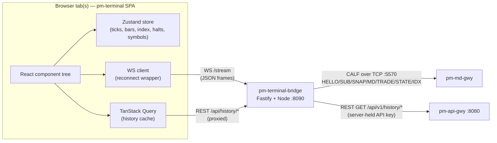

Version: 1.0.0

Date: 2026-07-11

Status: Design Proposal

# EduMatcher — Market Data Terminal (`pm-terminal`) Design Proposal


## Table of Contents

- [EduMatcher — Market Data Terminal (`pm-terminal`) Design Proposal](#edumatcher--market-data-terminal-pm-terminal-design-proposal)
  - [Table of Contents](#table-of-contents)
  - [1. Motivation](#1-motivation)
  - [2. Problem Statement](#2-problem-statement)
  - [3. Goals and Non-Goals](#3-goals-and-non-goals)
    - [3.1 Goals](#31-goals)
    - [3.2 Non-Goals](#32-non-goals)
  - [4. CALF/RALF Data Availability Audit](#4-calfralf-data-availability-audit)
    - [4.1 Method](#41-method)
    - [4.2 View-by-view data mapping](#42-view-by-view-data-mapping)
    - [4.3 Gaps found](#43-gaps-found)
    - [4.4 Should RALF be used?](#44-should-ralf-be-used)
    - [4.5 Verdict](#45-verdict)
  - [5. Technology Stack](#5-technology-stack)
    - [5.1 Stack](#51-stack)
    - [5.2 Monorepo layout](#52-monorepo-layout)
  - [6. Architecture](#6-architecture)
    - [6.1 Topology](#61-topology)
    - [6.2 Why a bridge instead of direct browser→CALF](#62-why-a-bridge-instead-of-direct-browsercalf)
    - [6.3 Data flow summary](#63-data-flow-summary)
    - [6.4 `pm-terminal-bridge` responsibilities](#64-pm-terminal-bridge-responsibilities)
    - [6.5 Multi-tab / multi-client fan-out](#65-multi-tab--multi-client-fan-out)
    - [6.6 Reconnect and gap handling](#66-reconnect-and-gap-handling)
  - [7. Application Shell and Navigation](#7-application-shell-and-navigation)
    - [7.1 Shell wireframe](#71-shell-wireframe)
    - [7.2 Top bar](#72-top-bar)
    - [7.3 Navigation rail](#73-navigation-rail)
    - [7.4 Connection status semantics](#74-connection-status-semantics)
  - [8. Screen Design — Market Overview](#8-screen-design--market-overview)
    - [8.1 Purpose](#81-purpose)
    - [8.2 Wireframe](#82-wireframe)
    - [8.3 Paging behaviour](#83-paging-behaviour)
    - [8.4 Column set](#84-column-set)
    - [8.5 Data sources](#85-data-sources)
  - [9. Screen Design — Symbol Detail](#9-screen-design--symbol-detail)
    - [9.1 Purpose](#91-purpose)
    - [9.2 Wireframe](#92-wireframe)
    - [9.3 Chart behaviour (OHLC + midpoint)](#93-chart-behaviour-ohlc--midpoint)
    - [9.4 Time-window zoom and presets](#94-time-window-zoom-and-presets)
    - [9.5 Values table](#95-values-table)
    - [9.6 Data sources](#96-data-sources)
  - [10. Screen Design — Index View](#10-screen-design--index-view)
    - [10.1 Purpose](#101-purpose)
    - [10.2 Wireframe](#102-wireframe)
    - [10.3 No-index-configured state](#103-no-index-configured-state)
    - [10.4 Data sources](#104-data-sources)
  - [11. Screen Design — Trade Tape / Time \& Sales](#11-screen-design--trade-tape--time--sales)
    - [11.1 Wireframe](#111-wireframe)
    - [11.2 Data sources](#112-data-sources)
  - [12. Screen Design — Market Movers / Heatmap](#12-screen-design--market-movers--heatmap)
    - [12.1 Wireframe](#121-wireframe)
    - [12.2 Data sources](#122-data-sources)
  - [13. Screen Design — Session \& Halt Status Board](#13-screen-design--session--halt-status-board)
    - [13.1 Wireframe](#131-wireframe)
    - [13.2 Data sources](#132-data-sources)
  - [14. Depth-of-Book: Current Gap and Proposed CALF Extension](#14-depth-of-book-current-gap-and-proposed-calf-extension)
    - [14.1 What real venues do](#141-what-real-venues-do)
    - [14.2 What EduMatcher already has internally](#142-what-edumatcher-already-has-internally)
    - [14.3 Proposed `DEPTH` channel](#143-proposed-depth-channel)
    - [14.4 Proposed wireframe (marked PROPOSED)](#144-proposed-wireframe-marked-proposed)
    - [14.5 Bonus: order-flow imbalance, almost free](#145-bonus-order-flow-imbalance-almost-free)
  - [15. Visual Design System](#15-visual-design-system)
  - [16. Client State Management](#16-client-state-management)
  - [17. `pm-terminal-bridge` Implementation Guide](#17-pm-terminal-bridge-implementation-guide)
    - [17.1 CALF session management](#171-calf-session-management)
    - [17.2 REST history proxy](#172-rest-history-proxy)
    - [17.3 Bridge → browser WS message schema](#173-bridge--browser-ws-message-schema)
    - [17.4 New files](#174-new-files)
  - [18. Security and Operational Notes](#18-security-and-operational-notes)
  - [19. Config Reference](#19-config-reference)
  - [20. Testing Strategy](#20-testing-strategy)
  - [21. Implementation Plan](#21-implementation-plan)
  - [22. Open Questions](#22-open-questions)
  - [23. Summary](#23-summary)


## 1. Motivation

EduMatcher has an order-entry GUI (`pm-trading-ui`, see
[EduMatcher-Trading-GUI.md](EduMatcher-Trading-GUI.md)) built for authenticated
traders against `pm-api-gwy`. It does not have a lightweight, read-only,
"watch the market" tool that a non-trading user — an instructor demoing the
exchange, a student studying price action, an observer, a bot author
sanity-checking a feed — can open without an API key and without any
trading surface at all.

This proposal specifies **`pm-terminal`**, a small Bloomberg-terminal-style
web application whose only job is to *display* market data: an overview of
all symbols, a deep single-symbol view with charting, an index view, and a
handful of the other panels every trading-floor overview tool has. It is
**strictly read-only** — there is no order entry, no authentication-gated
trading action, anywhere in this design.

Unlike `pm-trading-ui`, which talks to `pm-api-gwy` over REST/WebSocket,
`pm-terminal`'s live data comes from **CALF**, the purpose-built market-data
protocol documented in
[EduMatcher-Market_Data_Protocol.md](EduMatcher-Market_Data_Protocol.md).
Historical bars (which CALF intentionally does not provide) are sourced from
`pm-api-gwy`'s existing `/history/*` endpoints, the same store
`pm-trading-ui` already uses.

## 2. Problem Statement

- There is no zero-friction way to just *look* at the market. Today, seeing
  live prices means running `pm-trading-ui` and logging in with an API key
  meant for a trading gateway identity.
- CALF was designed and built specifically to be a simple, human-readable
  feed for exactly this kind of consumer — but nothing consumes it as a
  polished visual client yet; the only worked client is the terminal example
  in the protocol doc (§17) and ad hoc bots.
- Instructors and students benefit from a "big screen" overview (paged
  symbol grid, index ticker, trade tape) that a trading blotter UI is not
  designed to present.
- There is a real question — closed by this document — of whether CALF as
  currently specified/implemented actually carries every field this kind of
  terminal needs. It does not, in two places (history, depth); both are
  resolved below with a recommendation rather than left open.

## 3. Goals and Non-Goals

### 3.1 Goals

- Ship a Node.js/Vite web application, structured the same way as
  `config-gui` (npm/pnpm workspace: `apps/*` + `packages/*`), that runs
  entirely without a trading API key.
- Consume live data exclusively via **CALF** (`TOP`, `TRADE`, `STATE`,
  `INDEX`), through a small first-party bridge process (§6) because browsers
  cannot open the raw TCP sockets CALF uses.
- Provide, at minimum, the four view families the user asked for:
  1. **Market Overview** — all symbols, auto-paging, configurable per-page
     delay.
  2. **Symbol Detail** — OHLC bar chart + bid/ask midpoint line, a full
     values table, and a zoomable time window. Large-screen only.
  3. **Index View** — chart of the configured index (if any).
  4. Other common trading-floor panels, scoped in §4/§11–§13.
- Verify, before designing, exactly what CALF (and RALF, where relevant)
  actually deliver today — not what the protocol doc *says* it delivers, but
  what the shipped `md_gateway` code allows (§4).
- Where CALF is missing something a terminal genuinely needs, propose a
  concrete, minimal protocol extension rather than silently working around
  the gap (§14).
- Reuse the visual language, component choices, and monorepo conventions
  already established by `config-gui` and `pm-trading-ui` so the three
  frontends feel like one family.

### 3.2 Non-Goals

- No order entry, no authentication for trading, no write path to the
  engine, ever. If a future need for authenticated views arises it belongs
  in `pm-trading-ui`, not here.
- No multi-level order-entry DOM with click-to-trade (that is
  `pm-trading-ui`'s Trading Workspace). §14's depth ladder is read-only.
  the-ticket wiring is explicitly out of scope even once depth data exists.
  intentionally not carried over.
- No mobile/small-screen layout for Symbol Detail — the user confirmed this
  is a large-screen tool.
- No new persistence layer. `pm-terminal-bridge` is stateless beyond
  in-memory CALF replay/reconnect bookkeeping; all durable history continues
  to live in `pm-stats` behind `pm-api-gwy`.
- No RALF integration in v1 (§4.4 explains why, and what would change that).

## 4. CALF/RALF Data Availability Audit

This section is the "verify before designing" step the user asked for. It
was done against **both** sources, in this priority order: (1) the shipped
gateway code in `src/edumatcher/md_gateway/`, `engine/order_book.py`, and
`api_gateway/`, and (2) the design docs
([EduMatcher-Market_Data_Protocol.md](EduMatcher-Market_Data_Protocol.md),
[EduMatcher-Index.md](EduMatcher-Index.md),
[EduMatcher-Post-Trade-Dissemination-Gateway.md](EduMatcher-Post-Trade-Dissemination-Gateway.md)).
Code wins where the two disagree.

### 4.1 Method

For each planned view, list the data points it needs, then mark where each
one actually comes from today.

### 4.2 View-by-view data mapping

| View | Data point | Source | Status |
|---|---|---|---|
| Overview | Live LAST / BID / ASK / sizes | CALF `TOP` (`SNAP`/`MD`) | ✅ available |
| Overview | Live trade prints (for LAST/flash) | CALF `TRADE` | ✅ available |
| Overview | Today's OPEN (for % change) | `pm-api-gwy` `GET /history/daily` | ⚠️ not in CALF — REST needed |
| Overview | Session cumulative volume | `pm-api-gwy` `GET /history/daily` (`volume`) | ⚠️ not in CALF — REST needed |
| Overview | Instrument/session state (halt badge) | CALF `STATE` | ✅ available |
| Symbol Detail | Live top-of-book (chart tail, midpoint) | CALF `TOP` | ✅ available |
| Symbol Detail | Live trade prints (tape, LAST) | CALF `TRADE` | ✅ available |
| Symbol Detail | Historical OHLC bars (1D+ granularity) | `pm-api-gwy` `GET /history/daily` | ⚠️ not in CALF — REST needed |
| Symbol Detail | Historical intraday bars (1m/5m/1h) | `pm-api-gwy` `GET /history/trades`, bucketed client-side | ⚠️ not in CALF — REST needed |
| Symbol Detail | Historical bid/ask midpoint | *nowhere* | ❌ genuine gap — see §9.3 |
| Symbol Detail | Session/halt state | CALF `STATE` | ✅ available |
| Index View | Live index level, OHL, %chg | CALF `INDEX` (`IDX`/`SNAP`) | ✅ available in code; **not documented** in the v1.1.0 channel table (§4.3) |
| Index View | Historical index level series | *nowhere in CALF* | ⚠️ gap — treated as v1 limitation, see §10 |
| Trade Tape | Cross-symbol trade prints | CALF `TRADE` with `SYM=*`? | ⚠️ partial — see §4.3 |
| Movers/Heatmap | LAST + %chg for all symbols | CALF `TOP`/`TRADE` + REST open | ✅ composable from above |
| Session/Halt Board | Session phase + per-symbol halts | CALF `STATE` (`SYM=*` and per-symbol) | ✅ available |
| Depth ladder | Multi-level book | *not exposed over CALF* | ❌ gap — proposed extension, §14 |

### 4.3 Gaps found

1. **No historical data in CALF (by design).** §1.1 of the protocol doc says
   so explicitly: *"historical data service (use `pm-index` for index
   history)"* is out of scope for v1. In practice even index history isn't
   queryable through CALF — only live `INDEX` snapshots/updates are. All
   historical bars, for symbols and for the index, have to come from
   somewhere else. `pm-api-gwy`'s `GET /history/daily` and
   `GET /history/trades` (`src/edumatcher/api_gateway/routers/history.py`,
   backed by `pm-stats` SQLite) are that somewhere else, and are already
   proven by `pm-trading-ui`. Resolution: §6, §9, §17.2.

2. **`INDEX` channel is real but undocumented.** The channel table in
   §6.1 of the protocol doc lists only `TOP`, `TRADE`, `STATE`. The shipped
   gateway (`md_gateway/gateway.py`, `_ALLOWED_CHANNELS = frozenset({"TOP",
   "TRADE", "STATE", "INDEX"})`) and normaliser
   (`normalise_index_update`, `index_cache`) both implement `INDEX` fully,
   matching the message shapes proposed in
   [EduMatcher-Index.md](EduMatcher-Index.md) §9 (`SUB|CH=INDEX|SYM=EDU100`,
   `IDX|CH=INDEX|...`, `SNAP|CH=INDEX|...`). This is a doc-vs-code drift, not
   a design blocker — `pm-terminal` will subscribe to `CH=INDEX` as a first-
   class citizen. **Recommendation to the protocol maintainers (outside this
   doc's scope): fold §9 of `EduMatcher-Index.md` into
   `EduMatcher-Market_Data_Protocol.md` §6.1/§9 so the channel table and the
   shipped gateway agree.**

3. **Cross-symbol trade subscription is ambiguous for `TRADE`.** §6.1 of the
   protocol doc marks `SYM=*` as *not* allowed for `TRADE` ("explicit list
   required"), and §6.2 confirms `SYM=*` is only valid when `CH` is `STATE`
   only. A cross-symbol Trade Tape (§11) therefore cannot subscribe once to
   "all trades" — it must enumerate every known symbol in one `SUB|CH=TRADE`
   call. `WELCOME|SYMBOLS=` (§9.2 of the protocol doc) already gives the
   bridge the symbol list it needs to build that enumeration at connect
   time and again whenever the symbol universe changes. This works, it is
   just less elegant than a wildcard — noted as an open question in §22 for
   the protocol itself, not blocking this design.

4. **No multi-level depth over CALF.** Confirmed both in the protocol doc
   (§16, "`DEPTH` channel — full price-level depth (5 or 10 levels)" is
   listed as v2+ future work) and in the gateway code — `md_gateway`
   consumes `book.{SYMBOL}` but the normaliser only ever extracts best
   bid/ask into `MD`/`SNAP`. This is a real gap for a "Bloomberg-style"
   terminal. §14 proposes a concrete extension, grounded in what the engine
   already publishes internally.

5. **No historical bid/ask (midpoint).** Neither CALF nor `pm-stats` retains
   historical book state — only historical trades and daily OHLCV built from
   them. A historical "midpoint chart" is therefore not reconstructable
   before the terminal was open watching live `TOP` data. Treated as an
   accepted v1 limitation, with explicit UI labelling (§9.3) rather than a
   protocol change, since retaining full historical book state is a much
   bigger and more invasive addition than anything else in this audit.

### 4.4 Should RALF be used?

**No, not for this application.** RALF
([EduMatcher-Post-Trade-Dissemination-Gateway.md](EduMatcher-Post-Trade-Dissemination-Gateway.md))
is a reconciliation/post-trade feed scoped to `ROLE=CLEARING` and
`ROLE=AUDIT` consumers, carrying execution-level identifiers
(`ORDER_ID`, `EXEC_ID`, `MATCH_ID`, gateway attribution, liquidity flags).
Its own design doc (§14 of the CALF protocol doc, written by the same
author) explicitly argues for keeping post-trade/execution semantics out of
the general market-data path: *"book consumers are not... forced to parse
settlement-oriented payloads."* A market-data terminal is exactly the
"book consumer" that recommendation protects. RALF's longer 24-hour replay
window is tempting for a deeper trade tape, but pulling it in would mean
authenticating as a clearing/audit role for a tool that should need no
credentials at all, and it would blur a separation the protocol design
itself calls out as correct. CALF's `TRADE` channel — enumerated per
symbol, per §4.3 point 3 — is the right and sufficient source for the Trade
Tape (§11).

### 4.5 Verdict

CALF (`TOP` + `TRADE` + `STATE` + the undocumented-but-real `INDEX`) covers
every *live* data need in this design. Two extensions are needed for full
parity with a real terminal: reusing `pm-api-gwy`'s existing history
endpoints for anything historical (§6, §17.2 — no protocol change, just an
architecture decision), and a new CALF `DEPTH` channel for the order book
ladder (§14 — a genuine, scoped protocol proposal). Everything else in this
design is buildable today against CALF as shipped.

## 5. Technology Stack

### 5.1 Stack

| Layer | Choice | Rationale |
|---|---|---|
| Frontend framework | React 18 + TypeScript, bundled with Vite | Matches `config-gui`; fast dev loop |
| Styling | Tailwind CSS + shadcn/ui (Radix primitives) | Matches both `config-gui` and `pm-trading-ui`; accessible-by-default |
| Charts | TradingView Lightweight Charts v5 | Same library `pm-trading-ui` uses; candlestick + line series, time-axis zoom/pan built in |
| Tables/grids | TanStack Table v8 | Matches `pm-trading-ui`; virtualized rows for the Overview grid |
| Client state | Zustand | Matches both sibling apps; fine-grained subscriptions suit tick-rate updates |
| Server/cache state | TanStack Query v5 | REST history calls only (§17.2); WS ticks bypass it and write straight into Zustand |
| Routing | React Router v7 | One route per view (`/overview`, `/symbol/:sym`, `/index/:id`, `/tape`, `/movers`, `/session`) |
| Bridge runtime | Node.js 22 LTS | Matches `config-gui`'s backend runtime choice |
| Bridge framework | Fastify | Matches `config-gui`'s `apps/server`; first-class TS, lightweight |
| CALF client | Hand-rolled TCP line client (`net.Socket`) in the bridge | CALF is a bespoke text protocol; no existing npm package speaks it — mirrors the worked Python client in the protocol doc §17 |
| Browser transport | Native WebSocket, one connection per browser tab to `pm-terminal-bridge` | No trading-side auth-frame complexity, so no need for `pm-trading-ui`'s bespoke `ManagedSocket`; a thin reconnect wrapper is enough (§17.3) |
| Icons | Lucide React | Matches both sibling apps |

`pm-terminal` intentionally does **not** include React Hook Form, Zod forms,
or any mutation-oriented library — there is nothing in this application the
user submits.

### 5.2 Monorepo layout

Same shape as `config-gui` (`apps/` + `packages/` npm/pnpm workspace),
substituting a CALF bridge for `config-gui`'s Fastify config API:

```
terminal-gui/
  apps/
    web/                    React frontend (Vite)
    bridge/                 Fastify backend: CALF TCP client + WS fan-out + history proxy
  packages/
    calf-protocol/          CALF line parser/builder (TS port of md_gateway/protocol.py's grammar)
    shared-types/            TS types shared by web + bridge (ticks, bars, symbols, index, halts)
  package.json               npm/pnpm workspaces root
```

`packages/calf-protocol` is deliberately a thin, dependency-free package —
it only knows the wire grammar (`MSGTYPE|KEY=VALUE|...`), not gateway
semantics — so it can eventually be published and reused by any other
TypeScript CALF client, the same way `md_gateway/protocol.py` is the
reusable parsing core on the Python side.

## 6. Architecture

### 6.1 Topology



`pm-terminal-bridge` is the only new backend process. Everything it talks to
already exists (`pm-md-gwy`, `pm-api-gwy`).

### 6.2 Why a bridge instead of direct browser→CALF

CALF is raw newline-delimited TCP (§4.1 of the protocol doc). Browsers have
no API to open arbitrary TCP sockets — WebSocket or nothing. Two shapes were
considered (this was raised as a clarifying question and resolved in favour
of the first):

| Option | Trade-off |
|---|---|
| **Own Node WS↔TCP bridge (chosen)** | New small process, but zero changes to `pm-md-gwy` or the CALF spec; matches `config-gui`'s existing pattern of "frontend + small first-party Node backend"; the bridge can also hide the `pm-api-gwy` API key server-side (§18) |
| Extend `pm-md-gwy` for native WebSocket | Avoids a second process, but changes shared trading infrastructure to serve one read-only viewer's transport preference; couples `pm-md-gwy`'s release cycle to `pm-terminal`'s |

### 6.3 Data flow summary

| Data path | Direction | Mechanism |
|---|---|---|
| Symbol list, index list | Bridge → Browser | WS `hello` frame, sourced from CALF `WELCOME|SYMBOLS=` + config |
| Top-of-book snapshot/update | Bridge → Browser | WS `top` frame ⇐ CALF `SNAP`/`MD` (`CH=TOP`) |
| Trade prints | Bridge → Browser | WS `trade` frame ⇐ CALF `TRADE` |
| Session/halt state | Bridge → Browser | WS `state` frame ⇐ CALF `STATE` |
| Index level | Bridge → Browser | WS `index` frame ⇐ CALF `SNAP`/`IDX` (`CH=INDEX`) |
| Historical daily bars | Browser → Bridge → `pm-api-gwy` → Browser | REST `GET /api/history/daily?symbol=…` (proxied, §17.2) |
| Historical trade ticks (intraday bucketing) | Browser → Bridge → `pm-api-gwy` → Browser | REST `GET /api/history/trades?symbol=…` (proxied) |
| Bridge liveness / CALF connection health | Bridge → Browser | WS `bridge_status` frame |

### 6.4 `pm-terminal-bridge` responsibilities

- Hold exactly **one** CALF TCP session to `pm-md-gwy` regardless of how
  many browser tabs are connected (§6.5).
- On startup, `HELLO`, then `SUB|CH=STATE|SYM=*` and `SUB|CH=INDEX|SYM=<configured index ids>`
  immediately (cheap, always-on), plus `SUB|CH=TOP,TRADE|SYM=<all known symbols>`
  once `WELCOME|SYMBOLS=` (or a symbol-list config fallback) is known.
- Track `last_seq` per `(CH, SYM)` exactly like the worked Python client in
  the protocol doc §17, and use `RESUME`/`LASTSEQ` on reconnect (§6.6).
- Translate every inbound CALF line into one small JSON frame and fan it out
  to all connected browser WebSocket clients (§17.3).
- Own the single `pm-api-gwy` API key used for `/history/*` reads, so it
  never reaches the browser (§18).
- Serve nothing else — no persistence, no computed analytics beyond simple
  per-connection fan-out. Change/percentage math, bucketing, and paging all
  happen client-side in React, same as `pm-trading-ui`'s chart bucketing
  (§16).

### 6.5 Multi-tab / multi-client fan-out

Every browser tab (Overview on one monitor, Symbol Detail on another) opens
its own WebSocket to the bridge, but the bridge keeps a **single shared CALF
subscription set**, unioned across all connected browser clients — not one
CALF session per tab. This mirrors `pm-md-gwy`'s own "shared per-stream ring
buffer, not per-client" design (§7.4 of the protocol doc) one layer up the
stack. A browser tab's incoming subscription request only causes a new CALF
`SUB` if the bridge doesn't already hold that `(CH, SYM)` pair.

### 6.6 Reconnect and gap handling

If the bridge's CALF TCP connection drops, it reconnects and resumes exactly
as the worked client in the protocol doc's §17 does: `HELLO` with
`RESUME=1`/`LASTSEQ=` per stream, falling back to a fresh `SNAP` on
`ERR|CODE=REPLAY_MISS`. Browser WebSocket clients are not torn down for a
brief CALF hiccup — they simply see a `bridge_status: {calf: "RECONNECTING"}`
frame and then resume receiving ticks once the bridge is caught up. If a
browser tab's own WebSocket drops, it reconnects to the bridge and receives
a fresh `hello`/state snapshot — it does not need to track CALF sequence
numbers itself, only the bridge does.

## 7. Application Shell and Navigation

### 7.1 Shell wireframe

```
┌──────────────────────────────────────────────────────────────────────────┐
│ pm-terminal   [Overview] [Symbol] [Index] [Tape] [Movers] [Session]  ●LIVE│
├──────────────────────────────────────────────────────────────────────────┤
│                                                                            │
│                           < active view content >                        │
│                                                                            │
│                                                                            │
├──────────────────────────────────────────────────────────────────────────┤
│ CONTINUOUS  •  3 symbols halted  •  CALF connected  •  14:32:07 UTC       │
└──────────────────────────────────────────────────────────────────────────┘
```

### 7.2 Top bar

- App name, a fixed row of view tabs (not a collapsible sidebar — six views
  is small enough for a single row), and a global connection indicator
  (`●LIVE` / `●RECONNECTING` / `●OFFLINE`, driven by `bridge_status`).
- A symbol quick-jump (`Cmd/Ctrl+K`) that filters the known symbol list and
  navigates straight to Symbol Detail — useful once the Overview grid is
  paging through dozens of symbols.

### 7.3 Navigation rail

Six top-level routes, each a tab: Overview, Symbol (last-viewed symbol, or a
picker if none yet), Index, Tape, Movers, Session. No role gating anywhere —
every route is reachable with no login, matching the non-goal in §3.2.

### 7.4 Connection status semantics

| Indicator | Meaning |
|---|---|
| `●LIVE` (green) | Bridge's CALF session is `ACTIVE`; ticks flowing |
| `●RECONNECTING` (amber) | Bridge lost its CALF session and is retrying (§6.6); browser keeps last-known values, greyed slightly |
| `●OFFLINE` (red) | Browser's own WebSocket to the bridge is down; full-screen banner, no stale data shown |

## 8. Screen Design — Market Overview

### 8.1 Purpose

The default landing view: every tradable symbol, auto-paging, meant to run
unattended on a lobby/classroom display as well as be actively browsed.

### 8.2 Wireframe

```
┌──────────────────────────────────────────────────────────────────────────┐
│ MARKET OVERVIEW                          Page 2 / 5   ⏸ pause  ⚙ 8s ▾    │
├────────┬─────────┬─────────┬─────────┬──────────┬──────────┬────────────┤
│ SYMBOL │  LAST    │  CHG    │  %CHG   │   BID    │   ASK    │  VOLUME    │
├────────┼─────────┼─────────┼─────────┼──────────┼──────────┼────────────┤
│ AAPL   │  150.12  │ +0.42  │ +0.28%  │ 150.10   │ 150.12   │  184,300   │
│ MSFT   │  421.05  │ -1.10  │ -0.26%  │ 421.00   │ 421.08   │   92,410   │
│ TSLA   │  248.77  │ +3.65  │ +1.49%  │ 248.75   │ 248.80   │  310,922   │
│ EDU01  │   58.20  │  0.00  │  0.00%  │  58.15   │  58.24   │    4,110   │
│  …     │    …     │   …    │    …    │    …     │    …     │     …      │
├────────┴─────────┴─────────┴─────────┴──────────┴──────────┴────────────┤
│ ████████████████████░░░░░░░░  next page in 3s        ‹ prev   next ›     │
└──────────────────────────────────────────────────────────────────────────┘
```

Green/red flash on each cell when a new `MD`/`TRADE` changes its value
(same `FlashCell` pattern `pm-trading-ui` already uses).

### 8.3 Paging behaviour

- Symbols are split into fixed-size pages (rows-per-page derived from
  viewport height so the grid never scrolls — a lobby display has no mouse).
- A per-page dwell timer advances automatically; **the delay is a user
  setting** (`⚙` control: 3s / 5s / 8s / 15s / 30s / custom), persisted per
  browser via `localStorage`.
- Hovering the grid or pressing `⏸` pauses auto-paging; `‹`/`›` step pages
  manually at any time, `⏸`/`▶` toggles resume.
- All rows on all pages stay subscribed on CALF `TOP`/`TRADE` regardless of
  which page is currently shown — paging is a client-side rendering
  concern, not a subscription concern, so numbers never go stale.

### 8.4 Column set

| Column | Meaning | Source |
|---|---|---|
| SYMBOL | Ticker | CALF `WELCOME|SYMBOLS=` / config |
| LAST | Last trade price | CALF `TOP.LAST` (falls back to `TRADE.PX`) |
| CHG | `LAST − OPEN` | computed, `OPEN` from REST `/history/daily` |
| %CHG | `CHG / OPEN × 100` | computed |
| BID / ASK | Best bid/ask | CALF `TOP.BID`/`TOP.ASK` |
| VOLUME | Session cumulative volume | REST `/history/daily.volume`, live-incremented client-side by summing CALF `TRADE.QTY` since page load |
| (badge, not a column) | Halted / auction indicator overlaid on SYMBOL | CALF `STATE` |

### 8.5 Data sources

```
WS  bridge → top      (CH=TOP, all symbols)
WS  bridge → trade    (CH=TRADE, all symbols)
WS  bridge → state    (CH=STATE, SYM=*  and per-symbol halts)
REST bridge → /api/history/daily?date=today   (once per session for OPEN/VOLUME baseline)
```

## 9. Screen Design — Symbol Detail

### 9.1 Purpose

The deep-dive view for one instrument: chart, values table, zoomable time
window. Large-screen only, as confirmed by the user — no responsive
mobile layout is specified.

### 9.2 Wireframe

```
┌──────────────────────────────────────────────────────────────────────────┐
│ AAPL  — CONTINUOUS            150.12  +0.42 (+0.28%)     Vol 184,300     │
├──────────────────────────────────────────────────────────────────────────┤
│ [1D] [5D] [1M] [3M] [YTD] [All] [Live]     ☑ OHLC bars   ☑ Midpoint      │
│                                                                            │
│   152 ┤                                          ╭╮                     │
│   151 ┤                              ╭╮       ╭──╯╰╮   ┃┃┃┃  ← candles  │
│   150 ┤ ┃┃┃┃  ╭───╮  ┃┃┃┃  ╭────╮ ╭──╯╰──╮────╯    ╰─╮ ┃┃┃┃  midpoint ‥ │
│   149 ┤ ┃┃┃┃╭─╯   ╰──┃┃┃┃──╯    ╰─╯       ╰──╮        ╰┃┃┃┃             │
│   148 ┤ ┃┃┃┃╯                                ╰────╮   ┃┃┃┃              │
│       └────────────────────────────────────────────────────────────────┤
│         09:30      10:30      11:30      12:30      13:30      14:30    │
│  ▂▃▁▂▅▃▂▁▃▄▂▁▂▃▁▅▂▁▃▂▁▄▃▂▁▃▄▂▁ (volume histogram, shares each interval)  │
├────────────────────────────┬───────────────────────────────────────────┤
│  VALUES                    │  drag-select on the chart to zoom;         │
│  Open        149.70        │  presets above reset to their fixed window │
│  High        152.05        │                                            │
│  Low         148.10        │                                            │
│  Last        150.12        │                                            │
│  Bid / Ask   150.10 / 150.12│                                           │
│  Mid (live)  150.11         │                                           │
│  Prev Close  149.70         │                                           │
│  Volume      184,300        │                                           │
│  Session     CONTINUOUS     │                                           │
└────────────────────────────┴───────────────────────────────────────────┘
```

### 9.3 Chart behaviour (OHLC + midpoint)

- **OHLC bars** are candlesticks built from historical bars (§9.4) with the
  live-forming bar updated in place from CALF `TRADE` prints, exactly the
  pattern `pm-trading-ui`'s chart already implements (bucket ticks into the
  current-timeframe candle, replace on each trade).
- **Midpoint** is `(BID + ASK) / 2` from CALF `TOP`, drawn as a thin
  secondary line series over the candles. Per the gap in §4.3 point 5,
  **there is no historical bid/ask** — the midpoint line only has real data
  from the moment `pm-terminal` (or the bridge, if already running) started
  observing `TOP` updates for this symbol. The UI must make this explicit:
  the midpoint series starts partway across the chart with a small
  `mid data begins here` marker, rather than silently drawing a flat or
  interpolated line over the historical portion. Both series can be
  toggled independently (checkboxes in the wireframe above).
- Both series/toggles are independent of the timeframe presets — switching
  from `1D` to `5D` keeps whichever series are enabled on.

### 9.4 Time-window zoom and presets

- Preset buttons (`1D`, `5D`, `1M`, `3M`, `YTD`, `All`, `Live`) set the
  visible window; `Live` pins the right edge to now and scrolls with
  incoming ticks (Lightweight Charts' native realtime mode).
- Free-form zoom: click-drag a horizontal range on the chart to zoom in
  (Lightweight Charts' built-in range selection); scroll wheel / pinch to
  zoom in and out continuously; double-click to reset to the active preset.
- **Bar granularity switches with zoom level**, same rule `pm-trading-ui`
  already uses (§16.3 there): `1D`/`5D` render 1m or 5m bars bucketed from
  `GET /history/trades`; `1M`+ render the daily bars from
  `GET /history/daily` directly (no point rendering 90 days of 1-minute
  bars).

### 9.5 Values table

Plain key/value panel, not a grid — one instrument, so no need for
`TanStack Table` here. All rows are live except `Open`/`Prev Close`, which
come from the daily history row fetched once per symbol view.

### 9.6 Data sources

```
WS   bridge → top     (CH=TOP, this symbol)         → Bid/Ask/Mid, live candle tail
WS   bridge → trade   (CH=TRADE, this symbol)        → Last, live candle OHLC updates, volume
WS   bridge → state   (CH=STATE, this symbol + SYM=*)→ Session badge
REST bridge → /api/history/daily?symbol=AAPL         → Open/High/Low/Prev Close, 1D+ bars
REST bridge → /api/history/trades?symbol=AAPL&limit=…→ intraday bar bucketing
```

## 10. Screen Design — Index View

### 10.1 Purpose

Chart and headline stats for a configured exchange index (§4 of
[EduMatcher-Index.md](EduMatcher-Index.md)), up to five may exist per
exchange.

### 10.2 Wireframe

```
┌──────────────────────────────────────────────────────────────────────────┐
│ EDU100 INDEX                    1048.73   +6.63 (+0.64%)                 │
├──────────────────────────────────────────────────────────────────────────┤
│ [1D] [5D] [1M] [3M] [YTD] [All] [Live]                                   │
│                                                                            │
│  1056 ┤                    ╭╮                                           │
│  1050 ┤            ╭───────╯╰╮      ╭──╮                                │
│  1044 ┤  ╭─────────╯          ╰──────╯  ╰────────╮                      │
│  1038 ┤──╯                                        ╰──────               │
│       └───────────────────────────────────────────────────────────────┤
│         09:30       10:30       11:30       12:30       13:30           │
├──────────────────────────────┬───────────────────────────────────────┤
│  Open   1042.10               │  Constituents (top weights)             │
│  High   1056.30                │  AAPL  18.2%   ▲                       │
│  Low    1040.05                │  MSFT  15.7%   ▼                       │
│  Aggregate cap  $7.35T         │  TSLA   9.1%   ▲                       │
│  Session  CONTINUOUS           │  …                                     │
└────────────────────────────────┴─────────────────────────────────────┘
```

Constituent weights use the same `AGGCAP`-relative math the index design
doc already defines; the constituent list itself is static configuration
(not live per-constituent weight streaming — see §22).

### 10.3 No-index-configured state

If the exchange has zero indexes configured, the **Index** tab is not
hidden — it shows an explanatory empty state ("This exchange has no index
configured") rather than disappearing, so the tab layout stays stable
across differently-configured classroom exchanges.

### 10.4 Data sources

```
WS   bridge → index   (CH=INDEX, SYM=<index id>)   → live level, OHL, %chg
REST bridge → /api/history/daily?symbol=<index id> → historical level series, if/when pm-stats carries index rows (§22 — currently unconfirmed for indexes specifically)
```

## 11. Screen Design — Trade Tape / Time & Sales

### 11.1 Wireframe

```
┌──────────────────────────────────────────────────────────────────────────┐
│ TRADE TAPE                         Symbol: [ All ▾ ]      ⏸ pause        │
├──────────┬────────┬──────────┬────────┬──────────────────────────────────┤
│  TIME    │ SYMBOL │  PRICE   │  QTY   │  SIDE                            │
├──────────┼────────┼──────────┼────────┼──────────────────────────────────┤
│ 14:32:07 │ TSLA   │  248.77  │  200   │  ▲ BUY                           │
│ 14:32:06 │ AAPL   │  150.12  │  150   │  ▲ BUY                           │
│ 14:32:05 │ MSFT   │  421.05  │   80   │  ▼ SELL                          │
│ 14:32:04 │ AAPL   │  150.10  │  300   │  ▼ SELL                          │
│  …       │  …     │   …      │   …    │   …                              │
└──────────┴────────┴──────────┴────────┴──────────────────────────────────┘
```

New rows insert at the top and scroll down; a bounded ring buffer (last
~500 prints, client-side) keeps memory flat. Symbol filter narrows the tape
without changing the underlying subscription (the bridge already holds
`TRADE` for every symbol, per §6.4).

### 11.2 Data sources

```
WS  bridge → trade   (CH=TRADE, all symbols, per §4.3 point 3 — enumerated, not wildcard)
```

## 12. Screen Design — Market Movers / Heatmap

### 12.1 Wireframe

```
┌──────────────────────────────────────────────────────────────────────────┐
│ MOVERS                                    [ Gainers | Losers | Active ]  │
├────────┬─────────┬─────────┬──────────────────────────────────────────┤
│ SYMBOL │  LAST    │  %CHG   │  ▓▓▓▓▓▓▓▓▓▓▓▓▓▓▓▓▓▓  (bar scaled to %chg) │
├────────┼─────────┼─────────┼──────────────────────────────────────────┤
│ TSLA   │  248.77  │ +1.49% │  ██████████████████                       │
│ AAPL   │  150.12  │ +0.28% │  ████                                     │
│ EDU01  │   58.20  │  0.00% │                                           │
│ MSFT   │  421.05  │ -0.26% │  ████                                     │
│  …     │    …     │   …    │   …                                       │
└────────┴─────────┴─────────┴──────────────────────────────────────────┘
```

`Active` sorts by session volume instead of %chg — a common third tab on
real overview boards, and cheap here since Overview (§8) already computes
volume per symbol.

### 12.2 Data sources

Same feed as Overview (§8.5) — Movers is a different sort/rank over the
identical live+REST-baseline dataset, no new subscriptions.

## 13. Screen Design — Session & Halt Status Board

### 13.1 Wireframe

```
┌──────────────────────────────────────────────────────────────────────────┐
│ SESSION STATUS                                                           │
├──────────────────────────────────────────────────────────────────────────┤
│  Exchange session:  CONTINUOUS   (since 09:30:00, prev: OPENING_AUCTION) │
├──────────────────────────────────────────────────────────────────────────┤
│  ACTIVE HALTS                                                            │
│  ┌────────┬────────────────┬───────────────┬─────────────────────────┐ │
│  │ SYMBOL │ STATE          │ PREV          │ SINCE                   │ │
│  ├────────┼────────────────┼───────────────┼─────────────────────────┤ │
│  │ TSLA   │ HALTED         │ CONTINUOUS    │ 11:02:17                │ │
│  └────────┴────────────────┴───────────────┴─────────────────────────┘ │
│  (empty state: "No symbols currently halted")                            │
└──────────────────────────────────────────────────────────────────────────┘
```

### 13.2 Data sources

```
WS  bridge → state   (CH=STATE, SYM=* for session phase, per-symbol for halts)
```

This view is a pure re-render of state already required for the badges
elsewhere (§8.4, §9.6) — no new data, just a dedicated place to see the
whole board's health at a glance, which is genuinely useful for the
"lobby display" use case in §8.1.

## 14. Depth-of-Book: Current Gap and Proposed CALF Extension

### 14.1 What real venues do

Real exchange feeds are conventionally described in three tiers:

| Level | Content | Example real feeds |
|---|---|---|
| Level 1 | Best bid/ask + sizes (what CALF `TOP` already provides) | Most consolidated tape/SIP feeds |
| Level 2 | Aggregated depth by price, several to many levels | Nasdaq TotalView (aggregated view), CME MDP 3.0 Market-By-Price (`MBP-10`) |
| Level 3 | Full order-by-order book, every resting order individually | Nasdaq TotalView-ITCH (Market-By-Order), CME MDP 3.0 Market-By-Order |

A Bloomberg-style terminal's depth ladder is a Level 2 view: aggregated
quantity per price level, not individual orders. That is also the right
target for EduMatcher — Level 3 would expose per-order identity CALF
deliberately keeps out of the public feed (§1.1 of the protocol doc already
excludes "full depth-by-order feed" from v1 for this reason).

### 14.2 What EduMatcher already has internally

This matters because it changes the extension from "new engine feature" to
"gateway plumbing":

- `OrderBook.snapshot()` (`src/edumatcher/engine/order_book.py`) already
  aggregates every resting order into **per-price-level rows** —
  `bid_rows`/`ask_rows`, each `{price, qty, count}`, sorted best-first — on
  every `book.{SYMBOL}` publish. This is the *exact* Level 2 shape needed.
- `md_gateway` already subscribes to `book.{SYMBOL}` (§3.1 of the protocol
  doc) and already receives this full payload — it currently **discards**
  every level except the best one when building `MD`/`SNAP`.
- Separately, `OrderBook.depth_snapshot()` publishes an aggregate
  imbalance/microprice metric on `depth.{SYMBOL}`, which `md_gateway` does
  not subscribe to at all today. This is not a price ladder — it's a single
  imbalance/microprice number — and is a good candidate for a small bonus
  field (§14.5), not the ladder itself.

So the ladder data is already flowing into `md_gateway`'s process on the
same topic it already consumes. **No engine change is required** — this is
purely a normaliser/gateway addition.

### 14.3 Proposed `DEPTH` channel

Mirrors the existing `TOP`/`SNAP` shape so it costs nothing to learn:

| Field | Req | Type | Description |
|---|---|---|---|
| `CH` | ✓ | string | `DEPTH` |
| `SYM` | ✓ | string | Instrument symbol |
| `SEQ` | ✓ | int | Monotonic sequence for `(DEPTH, SYM)` |
| `TS` | ✓ | string | Snapshot timestamp |
| `LEVELS` | ✓ | int | Number of levels included per side (configurable, default 10) |
| `BIDS` | — | string | Comma-separated `price:qty:count` triples, best price first |
| `ASKS` | — | string | Comma-separated `price:qty:count` triples, best price first |

```text
SUB|CH=DEPTH|SYM=AAPL
SNAP|CH=DEPTH|SYM=AAPL|SEQ=1|TS=2026-07-11T14:32:00.000Z|LEVELS=10|BIDS=150.10:1200:3,150.09:800:2,150.08:400:1|ASKS=150.12:900:2,150.13:600:1,150.14:250:1
DEPTH|CH=DEPTH|SYM=AAPL|SEQ=2|TS=2026-07-11T14:32:00.512Z|LEVELS=10|BIDS=150.10:1400:4,150.09:800:2,150.08:400:1|ASKS=150.12:900:2,150.13:600:1,150.14:250:1
```

Like `TOP`, this would be **snapshot-refresh, not order-level incremental**
— each message is a full N-level replace, sent at the same throttled
interval `book.{SYMBOL}` already publishes at (default 0.5s, per §3.1 of
the protocol doc), only when the ladder actually changed. This matches the
engine's real granularity honestly (it snapshots, it does not emit one
event per resting order), and keeps `DEPTH` inside CALF's existing
"snapshot + incremental" mental model (§13 of the protocol doc) rather than
inventing a new one.

This is a **proposal**, not part of the current CALF spec — `pm-terminal`
v1 ships without a depth ladder (per the user's decision in §22 of the
questions asked before this design), and the view below is included so the
gap and its fix are both visible in one document, matching how
[EduMatcher-Index.md](EduMatcher-Index.md) itself proposed `CH=INDEX`
before it was implemented.

### 14.4 Proposed wireframe (marked PROPOSED)

```
┌──────────────────────────────────────────────────────────────────────────┐
│ AAPL — DEPTH  [PROPOSED — pending CALF DEPTH channel, §14]               │
├───────────────────┬────────┬──────────────────┬────────┬────────────────┤
│        BID QTY     │  BID   │       │  ASK     │ ASK QTY│                │
├───────────────────┼────────┼──────────────────┼────────┼────────────────┤
│           1,400    │ 150.10 │  ████ │  150.12  │    900 │                │
│             800    │ 150.09 │  ██   │  150.13  │    600 │                │
│             400    │ 150.08 │  █    │  150.14  │    250 │                │
│  …                  │  …    │       │   …      │    …   │                │
├───────────────────┴────────┴──────────────────┴────────┴────────────────┤
│ Imbalance: ▲ +0.18  (bid-heavy)     ← bonus field, §14.5, near-free      │
└──────────────────────────────────────────────────────────────────────────┘
```

### 14.5 Bonus: order-flow imbalance, almost free

`OrderBook.depth_snapshot()` already computes `bid_depth`, `ask_depth`,
`imbalance` (`[-1, 1]`), and `microprice` on every `depth.{SYMBOL}` publish
— data most retail terminals pay extra for. Subscribing `md_gateway` to
`depth.{SYMBOL}` and folding `IMB=`/`MICROPX=` fields onto the same `DEPTH`
message (or a lightweight companion) is a small addition once `DEPTH`
exists, worth calling out now so it isn't rediscovered later as a separate
project. Left as a §14.3 field extension, not built out further here.

## 15. Visual Design System

Reuses the palette and component conventions already established by
`pm-trading-ui` (§8 there is the canonical reference) rather than inventing
a new one:

| Element | Convention |
|---|---|
| Price up / flash | Green background flash, fades over ~600ms (`FlashCell`) |
| Price down / flash | Red background flash, same fade |
| Halted badge | Amber pill, `HALTED` |
| Auction phase badge | Blue pill, `OPENING_AUCTION` / `CLOSING_AUCTION` |
| Continuous session | No badge — absence of a badge *is* the "normal" signal |
| Disconnected/stale data | Entire affected panel dims to ~50% opacity, small "stale" icon in its corner |
| Typography | Tabular figures (`font-variant-numeric: tabular-nums`) on every price/qty column so digits don't jitter horizontally on update |
| Density | Compact row height by default (this is a "many symbols on screen" tool, not a spacious dashboard) |

## 16. Client State Management

```
┌─────────────────────────────────────────────────────────────┐
│  Zustand (synchronous, in-memory, ephemeral)                │
│  • WS connection status (bridge_status frames)               │
│  • Known symbol list + index list (from `hello` frame)       │
│  • Live top-of-book per symbol (bid/ask/sizes)                │
│  • Live last trade + rolling session volume per symbol        │
│  • Active halts / session phase                                │
│  • Trade tape ring buffer (bounded, ~500 entries)              │
│  • Active symbol (drives Symbol Detail route)                  │
│  • UI prefs: overview page delay, chart series toggles (persisted to localStorage) │
└─────────────────────────────────────────────────────────────┘
┌─────────────────────────────────────────────────────────────┐
│  TanStack Query (server state, stale-while-revalidate)        │
│  • Daily history rows (`/api/history/daily`) — 5m stale time  │
│  • Trade history for intraday bucketing (`/api/history/trades`) — 60s stale time │
└─────────────────────────────────────────────────────────────┘
```

This is a deliberately smaller split than `pm-trading-ui`'s (§5.3 there) —
there are no orders, positions, or mutations, so the "server state" layer
only ever holds read-only history, never anything invalidated by a write.

## 17. `pm-terminal-bridge` Implementation Guide

### 17.1 CALF session management

```python
# Mirrors md_gateway's own ClientSession shape, one level up
class CalfUplink:
    socket: net.Socket            # TCP connection to pm-md-gwy :5570
    state: "CONNECTED" | "ACTIVE" | "RECONNECTING"
    last_seq: dict[(str, str), int]   # (CH, SYM) -> last SEQ seen
    subscribed: set[(str, str)]       # (CH, SYM) currently SUB'd
    symbols: list[str]                 # from WELCOME|SYMBOLS=
```

- On connect: `HELLO|CLIENT=pm-terminal-bridge|PROTO=CALF1`, then subscribe
  per §6.4's ordering (state/index first, top/trade once symbols known).
  On reconnect, replay `HELLO...RESUME=1` per `(CH,SYM)` using `last_seq`
  exactly like the protocol doc's §17 Python client, one stream at a time.
- Buffer partial TCP reads and split on `\n` — the same non-negotiable rule
  the protocol doc calls out in §8.1; do not assume one `recv`/`data` event
  is one message.
- On `ERR|CODE=SLOW_CLIENT`, reconnect immediately with `RESUME` per stream
  (the bridge, not the browser, is the "client" CALF sees, so this only
  ever affects the bridge's own uplink, never a browser tab directly).

### 17.2 REST history proxy

The bridge exposes a thin, symbol/date/limit-passthrough proxy in front of
`pm-api-gwy`'s `/history/daily` and `/history/trades`:

```
GET /api/history/daily?symbol=AAPL&date=2026-07-11
GET /api/history/trades?symbol=AAPL&from=...&to=...&limit=1000
```

The bridge holds one long-lived `pm-api-gwy` API key (read-only history
scope — see §18) in its own config and attaches it server-side; the browser
never sees a credential. Responses are passed through unmodified (same
shape `pm-trading-ui` already consumes), so the frontend's history-fetching
code can be near-identical to `pm-trading-ui`'s existing implementation.

### 17.3 Bridge → browser WS message schema

One WebSocket per browser tab, JSON frames, discriminated by `type`:

```jsonc
{ "type": "hello", "symbols": ["AAPL","MSFT","TSLA"], "indexes": ["EDU100"] }
{ "type": "top", "sym": "AAPL", "seq": 101, "ts": "...", "bid": 150.10, "bidSz": 1400, "ask": 150.12, "askSz": 900, "last": 150.12, "lastSz": 200 }
{ "type": "trade", "sym": "AAPL", "seq": 44, "ts": "...", "px": 150.12, "qty": 200, "side": "BUY" }
{ "type": "state", "sym": "AAPL", "seq": 3, "ts": "...", "session": "HALTED", "prev": "CONTINUOUS" }
{ "type": "index", "sym": "EDU100", "seq": 42, "ts": "...", "level": 1048.73, "chg": 6.63, "pctChg": 0.64, "open": 1042.10, "high": 1056.30, "low": 1040.05 }
{ "type": "bridge_status", "calf": "ACTIVE" | "RECONNECTING", "since": "..." }
```

Deliberately flat JSON, one object per CALF line — no client-side parsing
of the pipe-delimited wire format is needed; that translation happens once,
server-side, in `packages/calf-protocol`.

### 17.4 New files

| File | Purpose |
|---|---|
| `apps/bridge/src/main.ts` | Fastify app entry, WS route, HTTP proxy routes |
| `apps/bridge/src/calf/uplink.ts` | `CalfUplink` class (§17.1) |
| `apps/bridge/src/calf/subscriptions.ts` | Union of all browser-requested `(CH,SYM)` pairs → CALF `SUB` calls (§6.5) |
| `apps/bridge/src/history-proxy.ts` | `/api/history/*` passthrough to `pm-api-gwy` (§17.2) |
| `apps/bridge/src/ws-fanout.ts` | Per-tab WS session registry, frame broadcast |
| `packages/calf-protocol/src/index.ts` | `parseLine`/`buildLine`, TS port of `md_gateway/protocol.py`'s grammar |
| `packages/shared-types/src/index.ts` | `TopFrame`, `TradeFrame`, `StateFrame`, `IndexFrame`, `DailyBar`, etc. |

## 18. Security and Operational Notes

- **No trading credentials ever reach the browser.** The one `pm-api-gwy`
  API key the bridge needs for `/history/*` lives only in the bridge's own
  config/environment, never serialized to the client.
- The CALF connection itself needs no credential today (§15 of the protocol
  doc — trusted-network assumption); if CALF ever grows a `TOKEN=` field
  (§16 of that doc lists it as a v2+ possibility), the bridge is the right
  and only place to hold it.
- `pm-terminal` should run on a read-only network path — it never needs
  outbound access to anything but `pm-md-gwy:5570` and `pm-api-gwy:8080`.
- Because every browser tab shares the bridge's single CALF uplink (§6.5),
  the bridge should cap total browser WS connections (config, default 200)
  to bound its own fan-out cost — this is the bridge's own concern, not a
  CALF-side limit.
- No PII anywhere in this application; it displays market data only.

## 19. Config Reference

```yaml
# apps/bridge/config.yaml
terminal_bridge:
  calf:
    host: "127.0.0.1"
    port: 5570
    client_id: "pm-terminal-bridge"
  api_gateway:
    base_url: "http://127.0.0.1:8080"
    api_key: "${PM_TERMINAL_API_KEY}"   # env var, never checked in
  server:
    bind_address: "0.0.0.0"
    port: 8090
    max_ws_clients: 200
  overview:
    default_page_delay_sec: 8
    symbols_per_page: "auto"            # derived from viewport at runtime
```

## 20. Testing Strategy

| Layer | Tool | What's covered |
|---|---|---|
| `packages/calf-protocol` | Vitest | Line parse/build round-trip, malformed-line rejection (mirrors `test_md_normaliser.py`'s cases) |
| `apps/bridge` uplink | Vitest + a fake CALF TCP server | HELLO/WELCOME handshake, SUB fan-out dedup (§6.5), RESUME/gap-replay path (§6.6), SLOW_CLIENT reconnect |
| `apps/bridge` history proxy | Vitest + mocked `pm-api-gwy` responses | Passthrough shape, error propagation (503 when stats DB unavailable) |
| `apps/web` components | Vitest + React Testing Library | FlashCell flash behaviour, Overview paging timer, chart series toggles |
| End-to-end | Playwright, against a running `pm-engine` + `pm-md-gwy` + `pm-api-gwy` + bridge stack | Overview loads and pages; Symbol Detail chart renders and zooms; a manual trade in the engine appears in the Tape within one polling interval |

## 21. Implementation Plan

| Phase | Scope |
|---|---|
| 1 | Monorepo scaffold; `packages/calf-protocol`; bridge CALF uplink connecting and logging parsed frames (no WS/browser yet) |
| 2 | Bridge WS fan-out + browser shell/nav (§7); Session & Halt board (§13, simplest view, validates the whole pipe end-to-end) |
| 3 | Market Overview (§8) incl. paging and REST-baseline OPEN/VOLUME |
| 4 | Symbol Detail (§9): chart, zoom, values table, live+historical splice |
| 5 | Index View (§10); Trade Tape (§11); Movers/Heatmap (§12) — all reuse Phase 2–4 plumbing |
| 6 | Depth ladder (§14) — blocked on the `DEPTH` channel proposal being implemented in `md_gateway`; ships as a later increment, not v1 |

## 22. Open Questions

1. Should `EduMatcher-Index.md`'s §9 `INDEX` channel definition be merged
   into `EduMatcher-Market_Data_Protocol.md`'s canonical channel table
   (§4.3 point 2)? This document assumes yes eventually, but treats `INDEX`
   as available regardless, since the shipped code already implements it.
2. Should CALF's `TRADE` (and/or `TOP`) channel eventually allow
   `SYM=*`, the way `STATE` already does, specifically to make an
   all-symbols Trade Tape a single subscription instead of an enumerated
   list (§4.3 point 3)? Low risk given `STATE` already proves the pattern
   works, but changes gateway fan-out cost characteristics and should be
   evaluated against `max_symbols_per_client`.
3. Does `pm-stats` retain a queryable historical series for index levels
   specifically (not just per-symbol daily bars)? `EduMatcher-Index.md`
   mentions historical index values are stored on disk (§ "Historical index
   values stored on disk") but this design could not confirm the query
   surface for it the way `history.py` was confirmed for symbols — needs a
   follow-up check against `pm-index`'s storage before §10.4 can be
   finalized.
4. Should the proposed `DEPTH` channel (§14.3) live in `md_gateway` proper,
   or — given it is a genuinely optional, heavier feature most CALF clients
   won't want — behind an opt-in `SUB|CH=DEPTH` that the gateway can refuse
   with `ERR|CODE=INVALID_CHANNEL` until an operator explicitly enables it
   in `market_data_gateway` config? The latter avoids forcing every
   `pm-md-gwy` deployment to pay the extra per-tick serialization cost.
5. Constituent-level live weight updates for the Index view (§10.2) are
   shown as a static list in this design. Is per-constituent weight drift
   (as prices move intraday) worth streaming, or is a periodic
   recompute-on-open sufficient for a teaching tool?

## 23. Summary

`pm-terminal` is a read-only, credential-free Bloomberg-style viewer that
consumes CALF as its live backbone — exactly the audience CALF was designed
for — while reusing `pm-api-gwy`'s existing, already-proven history
endpoints for anything CALF intentionally doesn't carry. The audit in §4
found CALF sufficient for every *live* requirement (including an
undocumented but fully-implemented `INDEX` channel), identified history and
depth as the two real gaps, and resolved history by architecture decision
(reuse `pm-api-gwy`, don't reinvent storage) and depth by a scoped protocol
proposal (§14) grounded in data the engine already publishes internally.
Structurally it mirrors `config-gui`: a small first-party Node/Fastify
backend plus a Vite/React frontend, sharing `pm-trading-ui`'s visual
language so the three EduMatcher web tools read as one family.
