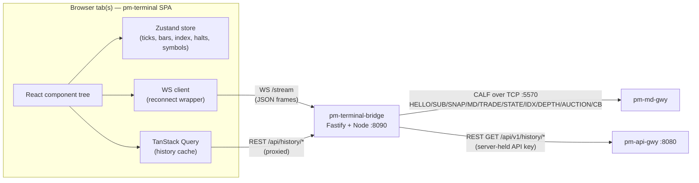

Version: 1.5.0

Date: 2026-07-29

Status: Design Proposal — final review pass before implementation

> **Changelog v1.5.0 — operational logging via `pm-log-srv`**
>
> This document predates `pm-log-srv`/LALF
> ([EduMatcher-log-srv.md](EduMatcher-log-srv.md), operational guide
> `docs/user-guide/280-log-srv.md`, normative wire reference
> `docs/user-guide/940-app-lalf-protocol.md`), which did not exist when
> v1.0.0–v1.4.0 were written. `pm-terminal-bridge` is a long-running
> first-party process exactly like `pm-md-gwy`/`pm-api-gwy`, so it should
> ship its own operational logging into the centralized collector the same
> way every other `pm-*` process already does. This revision is additive
> only — no other section's data flow, protocol choice, or screen design
> changes.
>
> - **Added §17.5:** `pm-terminal-bridge` is a LALF client of `pm-log-srv`,
>   implemented as a direct TypeScript port of the existing Python reference
>   client — `edumatcher.logclient.handler.TcpLogHandler` and
>   `.discovery.resolve_handler` ([EduMatcher-log-srv.md](EduMatcher-log-srv.md)
>   §8.2/§8.3/§8.6), already wired into every other `pm-*` process including
>   `pm-audit`/`pm-stats` — not a new design invented for this document.
>   Because LALF is a plain line-oriented TCP protocol with no existing
>   TypeScript implementation anywhere in the codebase (`pm-log-ui`, the
>   sibling log-viewer app, only ever *consumes* LALF-PS over ZeroMQ — see
>   its own design doc's "No `packages/*-protocol` equivalent" note — it
>   never speaks producer-side LALF), this revision adds a new
>   dependency-free `packages/lalf-client` package. Behavior is the same
>   three-phase model as the Python client: a one-shot startup probe
>   (attach if `pm-log-srv` answers `WELCOME` within a short timeout, else
>   plain stdout, no retry at startup); reconnect-with-capped-backoff for
>   `failover_timeout_sec` (default 30s) if a connection drops after
>   attaching; and, only once that grace window is exhausted, a one-way
>   switch to a local file, `$EDUMATCHER_DATA_DIR/logs/pm-terminal-bridge.log`,
>   named and located exactly the way §8.6 there specifies for every other
>   process's fallback file.
> - **Added a logging-level guidance table (§17.5)** enumerating the key
>   execution points, warnings, and errors this application should emit at
>   each level (`DEBUG`/`INFO`/`WARNING`/`ERROR`/`CRITICAL`), covering bridge
>   startup/shutdown, the CALF uplink lifecycle, per-symbol
>   `DEPTH`/`CB` reference-counting, the REST history proxy, WS fan-out to
>   browser tabs, and the LALF client's own probe/reconnect/failover
>   transitions.
> - **Extended §19** with a `log_server:` config block (host/port/client
>   name/timeouts/queue size), field-for-field matching
>   `TcpLogHandler`'s constructor and the `--log-target`/`--log-failover-timeout`
>   CLI flags every other `pm-*` process already exposes
>   ([EduMatcher-log-srv.md](EduMatcher-log-srv.md) §8.2/§8.5).
> - **Extended §17.4, §18, §20, §21** with the new package's files, an
>   explicit no-PII-in-logs / degrade-honestly note, a test-coverage row
>   covering all three client states (connected/reconnecting/failed-over),
>   and a Phase 1 note that bridge startup logging is LALF-backed (with
>   local-file fallback) from the first implementation phase.
>
> **Changelog v1.4.0 — pre-implementation review pass**
>
> This revision closes out a final review round before build starts.
> The single most consequential finding: **the CALF wire has grown two more
> channels — `AUCTION` and `CB` — since this document's CALF audit (§4) was
> last written**, and they carry exactly the two things v1.2.0/v1.3.0 believed
> only `pm-api-gwy`'s own WebSocket could carry. That belief was correct when
> first written (§4.5's reasoning is sound for the CALF version it was
> checked against) but is now stale against the current normative
> [CALF Protocol Reference](../docs/user-guide/920-app-calf-protocol.md) and
> [CALF gateway reference](../docs/user-guide/240-calf-gateway.md), both of
> which document `AUCTION` (`SYM=*`-eligible, no `SNAP` baseline) and `CB`
> (per-symbol only, `SNAP`-eligible) as shipped, code-verified channels.
> Verified directly against `md_gateway`'s `WELCOME|CH_SUPPORTED=` handshake
> and the wire examples in both reference docs — this is not a proposal, it
> is already-shipped protocol surface this document simply hadn't caught up
> with. Full accounting below; see §4.3/§4.5/§4.6 for the corrected audit.
>
> - **Removed:** the entire secondary `pm-api-gwy` `/api/v1/market-data` WS
>   uplink (old §4.5, §6.4's second connection, §17.1a, half of §18's
>   credential-handling discussion, `apps/bridge/src/api-gwy-ws-uplink.ts`).
>   `pm-terminal-bridge` now holds **exactly one** upstream connection —
>   CALF — for every live data point in this design, with zero exceptions.
>   This also **removes the one remaining API credential from the bridge
>   entirely for live data** — the bridge's REST history proxy (§17.2) is now
>   its only remaining use of the `pm-api-gwy` key, and that stays server-side
>   as before (§18).
> - **Added:** `pm-terminal-bridge` subscribes to `AUCTION|SYM=*` and, per
>   viewed symbol, `CB|SYM=<symbol>` (mirroring the existing per-symbol
>   `DEPTH` reference-counting pattern, §6.4/§6.5) — both sequenced,
>   replayable, credential-free, exactly like every other CALF channel this
>   design already relies on. Auction results (§9.3a, §13) and circuit-breaker
>   detail (§9.3a, §13) are now CALF-native data, not enrichment from a
>   second system.
> - **Corrected:** §2, §3.1, §4.3, §4.5 (renumbered §4.4, RALF discussion
>   unchanged), §4.6, §6, §6.4, §6.6, §9.3a, §9.6, §13, §13.2, §16, §17.1,
>   §17.3, §17.4, §18, §19, §20, §21, §22, §23 all updated to remove the
>   second-uplink architecture and describe `AUCTION`/`CB` as CALF channels.
>   Old open question §22 item 1 (re-subscribe semantics for the
>   `pm-api-gwy` WS control frame) is **removed as moot** — there is no
>   longer a second uplink to have re-subscribe semantics for.
> - **Added §9.5a / §9.6:** Symbol Detail now surfaces per-instrument
>   reference data (tick size, prior close, MM obligation parameters where
>   applicable) via `GET /symbols` — previously available but never audited
>   or used by this design. Flagged with an explicit caveat: this endpoint
>   currently requires a trading credential (`require_trading`, confirmed in
>   `src/edumatcher/api_gateway/routers/reference.py`), which conflicts with
>   this application's "no API key, ever" goal (§2) — see the new open
>   question in §22 rather than silently working around it.
> - **Added §7.5:** a lightweight, client-only "density" preset
>   (Lobby / Standard / Dense), `localStorage`-persisted exactly like the
>   existing Watchlist/page-delay prefs (§8.6/§8.3) — not full persona-gated
>   layouts, not authentication, just a per-viewer information-density
>   default. Rationale in §7.5.
> - **Reworked §5:** distinguishes what this design can verify against
>   **shipped code** (`config-gui`'s actual `package.json`s — bare Radix, no
>   TanStack, React Router v6, no component-library layer) from what it
>   inherits from `pm-trading-ui`'s own **design doc** (shadcn/ui, TanStack
>   Query/Table, Lightweight Charts v5, Lucide — not yet built, but the more
>   relevant sibling for a data-dense, chart-heavy tool). Library choices are
>   individually re-justified against current (2026) ecosystem status rather
>   than asserted by analogy alone — see §5.1a.
> - **Restructured for scannability:** new §4.6a "Decision table" collects
>   every CALF-vs-REST verdict from §4 into one scannable table, so a reader
>   no longer has to read four subsections of prose to find "what talks to
>   what and why." §22 kept its existing discipline (short, current, pruned)
>   as the model for this change.
>
> **Changelog v1.3.0**
> - Closes the historical-midpoint gap recorded as an open question in
>   v1.2.0 (§22, item 1): `pm-api-gwy` now exposes
>   `GET /history/price-snapshots`, backed by `pm-stats`' existing
>   `price_snapshots` table (15-minute mid/bid/ask cadence per symbol; see
>   `docs/user-guide/260-api-gateway.md`). §4.2/§4.3 gap 2 updated from
>   "data exists, plumbing doesn't" to fully available. §9.3's Symbol Detail
>   chart now describes an actual historical midpoint series (with an
>   explicit 15-minute-resolution caveat vs. live CALF `TOP` ticks) instead
>   of treating the pre-observation portion of the chart as permanently
>   blank. §9.6 data sources updated with the new REST call. The open
>   question is removed from §22; the remaining three are renumbered.
>
> **Changelog v1.2.0**
> - §10 (Index View) rewired to the new index-history REST surface —
>   `GET /history/index-daily` and `GET /history/index-snapshots`
>   (`docs/user-guide/260-api-gateway.md`) — closing the v1.1.0 open question
>   of whether `pm-stats` retains a queryable index level series. It does,
>   and it is now exposed. A recent-structural-change strip
>   (`GET /history/index-events`) was also added to the Index View.
> - New, narrowly-scoped second bridge uplink to `pm-api-gwy`'s
>   `/api/v1/market-data` WebSocket, reusing the bridge's existing read-only
>   API key — added *only* for the two data points CALF structurally cannot
>   carry: auction uncross/imbalance results (`auction` channel — no CALF
>   equivalent at all) and richer circuit-breaker halt context
>   (trigger/reference price, CB level, auto-resume time — CALF's `STATE`
>   only carries the coarse `SESSION`/`PREV` transition). `book`/`trades`/
>   `depth` on that same WS are deliberately **not** used — CALF already
>   covers them, with better guarantees (sequencing, replay, no credential).
>   See new §4.5, §6.4, §13, §14, §17.1a.
> - Corrected a factual error in the v1.1.0 audit (§4.3, gap 2): `pm-stats`
>   *does* retain a historical bid/ask/mid-price series (`price_snapshots`,
>   15-minute cadence) — it just isn't exposed through any `pm-api-gwy` REST
>   endpoint yet. The gap is narrower than previously stated and is now a
>   scoped follow-up (§22) rather than an assumed-impossible limitation.
> - Symbol Detail (§9) gains VWAP, live (intraday-updating) High/Low, and
>   trade count, all sourced from the existing `GET /history/daily` row for
>   today — which `pm-stats` already recalculates on every trade, so no new
>   endpoint or client-side accumulation is needed. This also replaces the
>   v1.1.0 Overview volume mechanism (§8), which hand-rolled a running total
>   from observed CALF `TRADE.QTY` since page load, with a periodic re-poll
>   of the same already-live row — simpler and correct for a tab that joins
>   mid-session, not just one open since the open.
> - Market Overview (§8) gains a client-only Watchlist (pin/filter,
>   `localStorage`-persisted) — a common trader view the paged all-symbols
>   grid alone doesn't provide. No new subscription: it filters the same
>   always-on wildcard feed every tab already receives.
> - Depth-of-Book (§14) now renders the per-level order `COUNT` CALF's
>   `DEPTH` channel already carries — it was parsed into the bridge's WS
>   frame in v1.1.0 but never actually displayed.
> - Fixed the bridge's `index` WS frame schema (§17.3), which was missing
>   `SESSION` and `AGGCAP` even though both are real `IDX`/`SNAP(CH=INDEX)`
>   fields the v1.1.0 Index View wireframe already assumed were there.
>
> **Changelog v1.1.0**
> - Updated throughout for CALF `1.0.0`, which shipped after this document
>   was first written: the `DEPTH` channel, the `SYM=*` wildcard for `TOP`/
>   `TRADE`, and full `INDEX` documentation are now real, not proposed or
>   assumed-undocumented. See `EduMatcher-CALF-Extensions.md` and the
>   normative [CALF Protocol Reference](../docs/user-guide/920-app-calf-protocol.md).
> - §14 (Depth-of-Book) rewritten from a protocol-extension proposal into a
>   regular screen design section; folded into Symbol Detail as a toggle
>   (§9.2) rather than left as a separate blocked future phase.
> - §8 (Overview), §11 (Trade Tape), §12 (Movers) simplified to use one
>   `SYM=*` wildcard subscription each for `TOP`/`TRADE` instead of
>   enumerating every known symbol.
> - §17.1 rewritten to cover the one real new complexity CALF `1.0.0`
>   introduces for this design: `HELLO|RESUME=1` never accepts `SYM=*`, so
>   reconnect after a wildcard subscription requires resuming known symbols
>   individually rather than resuming the wildcard itself.
> - §22 Open Questions trimmed to what is still actually open; three
>   questions from v1.0.0 (INDEX documentation, `TOP`/`TRADE` wildcard,
>   whether `DEPTH` should exist and how it should be gated) are resolved.

# EduMatcher — Market Data Terminal (`pm-terminal`) Design Proposal


## Table of Contents

- [EduMatcher — Market Data Terminal (`pm-terminal`) Design Proposal](#edumatcher--market-data-terminal-pm-terminal-design-proposal)
  - [Table of Contents](#table-of-contents)
  - [1. Motivation](#1-motivation)
  - [2. Problem Statement](#2-problem-statement)
  - [3. Goals and Non-Goals](#3-goals-and-non-goals)
    - [3.1 Goals](#31-goals)
    - [3.2 Non-Goals](#32-non-goals)
  - [4. CALF/RALF Data Availability Audit](#4-calfralf-data-availability-audit)
    - [4.1 Method](#41-method)
    - [4.2 View-by-view data mapping](#42-view-by-view-data-mapping)
    - [4.3 Gaps found](#43-gaps-found)
    - [4.4 Should RALF be used?](#44-should-ralf-be-used)
    - [4.5 Should `pm-api-gwy`'s WS market-data stream be used?](#45-should-pm-api-gwys-ws-market-data-stream-be-used)
    - [4.6 Verdict](#46-verdict)
    - [4.6a Decision table](#46a-decision-table)
  - [5. Technology Stack](#5-technology-stack)
    - [5.1 Stack](#51-stack)
    - [5.1a Library choices, individually justified](#51a-library-choices-individually-justified)
    - [5.2 Monorepo layout](#52-monorepo-layout)
  - [6. Architecture](#6-architecture)
    - [6.1 Topology](#61-topology)
    - [6.2 Why a bridge instead of direct browser→CALF](#62-why-a-bridge-instead-of-direct-browsercalf)
    - [6.3 Data flow summary](#63-data-flow-summary)
    - [6.4 `pm-terminal-bridge` responsibilities](#64-pm-terminal-bridge-responsibilities)
    - [6.5 Multi-tab / multi-client fan-out](#65-multi-tab--multi-client-fan-out)
    - [6.6 Reconnect and gap handling](#66-reconnect-and-gap-handling)
  - [7. Application Shell and Navigation](#7-application-shell-and-navigation)
    - [7.1 Shell wireframe](#71-shell-wireframe)
    - [7.2 Top bar](#72-top-bar)
    - [7.3 Navigation rail](#73-navigation-rail)
    - [7.4 Connection status semantics](#74-connection-status-semantics)
    - [7.5 Density preset (Lobby / Standard / Dense)](#75-density-preset-lobby--standard--dense)
  - [8. Screen Design — Market Overview](#8-screen-design--market-overview)
    - [8.1 Purpose](#81-purpose)
    - [8.2 Wireframe](#82-wireframe)
    - [8.3 Paging behaviour](#83-paging-behaviour)
    - [8.4 Column set](#84-column-set)
    - [8.5 Data sources](#85-data-sources)
    - [8.6 Watchlist](#86-watchlist)
  - [9. Screen Design — Symbol Detail](#9-screen-design--symbol-detail)
    - [9.1 Purpose](#91-purpose)
    - [9.2 Wireframe](#92-wireframe)
    - [9.3 Chart behaviour (OHLC + midpoint)](#93-chart-behaviour-ohlc--midpoint)
    - [9.3a Auction result banner and halt context](#93a-auction-result-banner-and-halt-context)
    - [9.4 Time-window zoom and presets](#94-time-window-zoom-and-presets)
    - [9.5 Values table](#95-values-table)
    - [9.5a Instrument reference data](#95a-instrument-reference-data)
    - [9.6 Data sources](#96-data-sources)
  - [10. Screen Design — Index View](#10-screen-design--index-view)
    - [10.1 Purpose](#101-purpose)
    - [10.2 Wireframe](#102-wireframe)
    - [10.2a Historical charting and the "is this level final?" question](#102a-historical-charting-and-the-is-this-level-final-question)
    - [10.3 No-index-configured state](#103-no-index-configured-state)
    - [10.4 Data sources](#104-data-sources)
  - [11. Screen Design — Trade Tape / Time \& Sales](#11-screen-design--trade-tape--time--sales)
    - [11.1 Wireframe](#111-wireframe)
    - [11.2 Data sources](#112-data-sources)
  - [12. Screen Design — Market Movers / Heatmap](#12-screen-design--market-movers--heatmap)
    - [12.1 Wireframe](#121-wireframe)
    - [12.2 Data sources](#122-data-sources)
  - [13. Screen Design — Session \& Halt Status Board](#13-screen-design--session--halt-status-board)
    - [13.1 Wireframe](#131-wireframe)
    - [13.2 Data sources](#132-data-sources)
  - [14. Screen Design — Depth-of-Book](#14-screen-design--depth-of-book)
    - [14.1 Purpose and status](#141-purpose-and-status)
    - [14.2 What real venues do](#142-what-real-venues-do)
    - [14.3 Why `DEPTH` is cheap for `md_gateway` to serve](#143-why-depth-is-cheap-for-md_gateway-to-serve)
    - [14.4 `DEPTH` channel, as shipped](#144-depth-channel-as-shipped)
    - [14.5 Wireframe](#145-wireframe)
    - [14.6 Data sources](#146-data-sources)
    - [14.7 Deferred: order-flow imbalance and microprice](#147-deferred-order-flow-imbalance-and-microprice)
  - [15. Visual Design System](#15-visual-design-system)
  - [16. Client State Management](#16-client-state-management)
  - [17. `pm-terminal-bridge` Implementation Guide](#17-pm-terminal-bridge-implementation-guide)
    - [17.1 CALF session management](#171-calf-session-management)
    - [17.2 REST history proxy](#172-rest-history-proxy)
    - [17.3 Bridge → browser WS message schema](#173-bridge--browser-ws-message-schema)
    - [17.4 New files](#174-new-files)
    - [17.5 Operational logging via `pm-log-srv`](#175-operational-logging-via-pm-log-srv)
  - [18. Security and Operational Notes](#18-security-and-operational-notes)
  - [19. Config Reference](#19-config-reference)
  - [20. Testing Strategy](#20-testing-strategy)
  - [21. Implementation Plan](#21-implementation-plan)
  - [22. Open Questions](#22-open-questions)
  - [23. Summary](#23-summary)


## 1. Motivation

EduMatcher has an order-entry GUI (`pm-trading-ui`, see
[EduMatcher-Trading-GUI.md](EduMatcher-Trading-GUI.md)) built for authenticated
traders against `pm-api-gwy`. It does not have a lightweight, read-only,
"watch the market" tool that a non-trading user — an instructor demoing the
exchange, a student studying price action, an observer, a bot author
sanity-checking a feed — can open without an API key and without any
trading surface at all.

This proposal specifies **`pm-terminal`**, a small Bloomberg-terminal-style
web application whose only job is to *display* market data: an overview of
all symbols, a deep single-symbol view with charting, an index view, and a
handful of the other panels every trading-floor overview tool has. It is
**strictly read-only** — there is no order entry, no authentication-gated
trading action, anywhere in this design.

Unlike `pm-trading-ui`, which talks to `pm-api-gwy` over REST/WebSocket for
everything, `pm-terminal`'s live data — *all* of it, including auction
results and circuit-breaker detail — comes from **CALF `1.0.0`**, the
purpose-built market-data protocol documented in the
[CALF Protocol Reference](../docs/user-guide/920-app-calf-protocol.md) (the
canonical, code-verified reference; see also
[EduMatcher-Market_Data_Protocol.md](EduMatcher-Market_Data_Protocol.md) and
[EduMatcher-CALF-Extensions.md](EduMatcher-CALF-Extensions.md) for the
design-history trail). CALF `1.0.0` ships all seven channels this design
needs — `TOP`, `TRADE`, `STATE`, `INDEX`, `DEPTH`, `AUCTION`, and `CB` —
plus a `SYM=*` wildcard for `TOP`/`TRADE`/`STATE`/`AUCTION`, so `pm-terminal`
leans on CALF alone for every live data point in this design, with **one**
upstream connection from the bridge, not two. (An earlier revision of this
document believed `AUCTION`/`CB` did not exist yet and routed around that
gap via a second connection to `pm-api-gwy`'s own WebSocket; that gap has
since closed upstream in CALF itself — see the v1.4.0 changelog above.)
Historical bars (which CALF intentionally does not provide, by design, at
any protocol version) are sourced from `pm-api-gwy`'s existing (and, as of
v1.3.0, index-extended) `/history/*` endpoints, the same store
`pm-trading-ui` already uses. That REST history proxy is the bridge's
**only** remaining touchpoint with `pm-api-gwy`, and it stays entirely
server-side; no credential of any kind ever reaches the browser (§18).

## 2. Problem Statement

- There is no zero-friction way to just *look* at the market. Today, seeing
  live prices means running `pm-trading-ui` and logging in with an API key
  meant for a trading gateway identity.
- CALF was designed and built specifically to be a simple, human-readable
  feed for exactly this kind of consumer — but nothing consumes it as a
  polished visual client yet; the only worked client is the terminal example
  in the protocol doc and ad hoc bots.
- Instructors and students benefit from a "big screen" overview (paged
  symbol grid, index ticker, trade tape) that a trading blotter UI is not
  designed to present.
- There is a real question — closed by this document — of whether CALF as
  currently specified/implemented actually carries every field this kind of
  terminal needs. As of CALF `1.0.0` it covers every live data need in this
  design, including a full order-book depth ladder (`DEPTH`), auction
  uncross results (`AUCTION`), and rich circuit-breaker detail (`CB`). Only
  one thing remains outside CALF by design: historical data (CALF is
  intentionally live-only, at every protocol version), resolved by reusing
  and, as of v1.3.0, extending `pm-api-gwy`'s history endpoints (§10).

## 3. Goals and Non-Goals

### 3.1 Goals

- Ship a Node.js/Vite web application, structured the same way as
  `config-gui` (npm/pnpm workspace: `apps/*` + `packages/*`), that runs
  entirely without a trading API key.
- Consume **all** live data — order book/tick data, auction results, and
  circuit-breaker context — via **CALF `1.0.0`** (`TOP`, `TRADE`, `STATE`,
  `INDEX`, `DEPTH`, `AUCTION`, `CB`), through a single small first-party
  bridge process (§6) because browsers cannot open the raw TCP sockets CALF
  uses. One upstream connection, one protocol, for every live data point in
  this design — see §4 for the audit that confirms CALF `1.0.0` needs no
  second live data source.
- Provide, at minimum, the five view families the user asked for:
  1. **Market Overview** — all symbols, auto-paging, configurable per-page
     delay.
  2. **Symbol Detail** — OHLC bar chart + bid/ask midpoint line, a full
     values table, and a zoomable time window. Large-screen only.
  3. **Index View** — live and historical chart of the configured index (if
     any), the latter now backed by real endpoints (§10).
  4. **Depth-of-Book** — a Level 2 ladder for the active symbol, sourced
     directly from CALF `DEPTH` (§14).
  5. Other common trading-floor panels, scoped in §4/§11–§13.
- Verify, before designing, exactly what CALF (and RALF, where relevant)
  actually deliver today — not what an older draft of the protocol doc used
  to say it delivers, but what the shipped `md_gateway` code allows (§4),
  cross-checked against the current normative
  [CALF Protocol Reference](../docs/user-guide/920-app-calf-protocol.md).
- Make full use of what CALF `1.0.0` already provides — the `DEPTH` channel
  and the `SYM=*` wildcard for `TOP`/`TRADE` — rather than working around
  gaps that no longer exist (§4, §14).
- Reuse the visual language, component choices, and monorepo conventions
  already established by `config-gui` and `pm-trading-ui` so the three
  frontends feel like one family.

### 3.2 Non-Goals

- No order entry, no authentication for trading, no write path to the
  engine, ever. If a future need for authenticated views arises it belongs
  in `pm-trading-ui`, not here.
- No multi-level order-entry DOM with click-to-trade (that is
  `pm-trading-ui`'s Trading Workspace). §14's depth ladder is read-only;
  order-ticket wiring against depth data is explicitly out of scope here,
  now and later — that capability, if ever built, belongs in
  `pm-trading-ui`.
- No mobile/small-screen layout for Symbol Detail — the user confirmed this
  is a large-screen tool.
- No new persistence layer. `pm-terminal-bridge` is stateless beyond
  in-memory CALF replay/reconnect bookkeeping; all durable history continues
  to live in `pm-stats` behind `pm-api-gwy`.
- No RALF integration in v1 (§4.4 explains why, and what would change that).

## 4. CALF/RALF Data Availability Audit

This section is the "verify before designing" step the user asked for. It
was done against **three** sources, in this priority order: (1) the shipped
gateway code in `src/edumatcher/md_gateway/`, `engine/order_book.py`, and
`api_gateway/`, (2) the normative
[CALF Protocol Reference](../docs/user-guide/920-app-calf-protocol.md) and
[CALF gateway reference](../docs/user-guide/240-calf-gateway.md), and
(3) [`pm-api-gwy`'s REST/WebSocket reference](../docs/user-guide/260-api-gateway.md)
and [Statistics & Reporting](../docs/user-guide/140-statistics-and-reporting.md)
(for what `pm-stats` actually retains, independent of whether it is exposed
yet) — cross-checked against
[EduMatcher-CALF-Extensions.md](EduMatcher-CALF-Extensions.md) and
[EduMatcher-Post-Trade-Dissemination-Gateway.md](EduMatcher-Post-Trade-Dissemination-Gateway.md).
Code and the normative protocol/API docs win where sources disagree.

**v1.4.0 re-audit note.** This section was fully re-checked line-by-line
against the current normative CALF reference as part of the pre-implementation
review that produced this revision. The previous audit (v1.2.0/v1.3.0) was
accurate for the CALF version it was checked against, but CALF has since grown
two channels — `AUCTION` and `CB` — that the earlier audit did not know about
and that change the answer to "should the bridge talk to `pm-api-gwy`'s WS at
all?" from "narrowly, yes" to "no." See §4.3 gap 3 and §4.5 below for the
corrected reasoning, and the v1.4.0 changelog entry at the top of this
document for the full list of sections this touched.

### 4.1 Method

For each planned view, list the data points it needs, then mark where each
one actually comes from today.

### 4.2 View-by-view data mapping

| View | Data point | Source | Status |
|---|---|---|---|
| Overview | Live LAST / BID / ASK / sizes | CALF `TOP` (`SNAP`/`MD`), `SUB\|CH=TOP\|SYM=*` | ✅ available |
| Overview | Live trade prints (for LAST/flash) | CALF `TRADE`, `SUB\|CH=TRADE\|SYM=*` | ✅ available |
| Overview | Today's OPEN (for % change), session volume | `pm-api-gwy` `GET /history/daily`, periodically re-polled (§8.4) | ✅ available — `daily_stats` is recalculated on every trade, not just at end of day |
| Overview | Instrument/session state (halt badge) | CALF `STATE` | ✅ available |
| Symbol Detail | Live top-of-book (chart tail, midpoint) | CALF `TOP` | ✅ available |
| Symbol Detail | Live trade prints (tape, LAST) | CALF `TRADE` | ✅ available |
| Symbol Detail | Historical OHLC bars (1D+ granularity) | `pm-api-gwy` `GET /history/daily` | ⚠️ not in CALF — REST needed (CALF is intentionally live-only) |
| Symbol Detail | Historical intraday bars (1m/5m/1h) | `pm-api-gwy` `GET /history/trades`, bucketed client-side | ⚠️ not in CALF — REST needed |
| Symbol Detail | VWAP, live day High/Low, trade count | `pm-api-gwy` `GET /history/daily` (`vwap`/`high_price`/`low_price`/`trade_count`), periodically re-polled | ✅ available — already computed server-side per trade, previously unused by this design (§9.5) |
| Symbol Detail | Historical bid/ask midpoint | `pm-api-gwy` `GET /history/price-snapshots`, backed by `pm-stats` `price_snapshots` table (15-minute cadence) | ✅ available — closed in v1.3.0; see §9.3 |
| Symbol Detail | Session/halt state | CALF `STATE` | ✅ available |
| Symbol Detail | Circuit-breaker halt reason, trigger/reference price, resume time | CALF `CB` (`SNAP`/`CB`, `SUB\|CH=CB\|SYM=<symbol>`) | ✅ available — CALF `STATE` only carries `SESSION`/`PREV`; `CB` carries the detail natively, sequenced and replayable; see §4.3 gap 3, §9.6, §13 |
| Symbol Detail | Depth ladder for active symbol | CALF `DEPTH` (`SNAP`/`DEPTH`, `SUB\|CH=DEPTH\|SYM=<symbol>`) | ✅ available — see §14 |
| Symbol Detail | Auction uncross result (equilibrium price/qty, imbalance side) | CALF `AUCTION` (`SUB\|CH=AUCTION\|SYM=<symbol>`, no `SNAP` baseline) | ✅ available natively; see §4.3 gap 3, §9.6 |
| Symbol Detail | Instrument reference data (tick size, prior close, MM obligation params) | `pm-api-gwy` `GET /symbols` | ⚠️ available in principle, but the endpoint requires a trading credential today — see §9.5a, §22 |
| Index View | Live index level, OHL, %chg, session, aggregate cap | CALF `INDEX` (`IDX`/`SNAP`) | ✅ available and fully documented in the normative CALF reference |
| Index View | Historical index level series (daily + intraday) | `pm-api-gwy` `GET /history/index-daily` + `GET /history/index-snapshots` | ✅ available — resolves the v1.1.0 open question; see §10 |
| Index View | Recent structural changes (constituent add/delist, corporate actions) | `pm-api-gwy` `GET /history/index-events` | ✅ available — live round-trip to `pm-index`, see §10.2 |
| Trade Tape | Cross-symbol trade prints | CALF `TRADE`, `SUB\|CH=TRADE\|SYM=*` | ✅ available — single wildcard subscription |
| Movers/Heatmap | LAST + %chg for all symbols | CALF `TOP`/`TRADE` (wildcard) + REST open | ✅ composable from above |
| Session/Halt Board | Session phase + per-symbol halts | CALF `STATE` (`SYM=*` and per-symbol) | ✅ available |
| Session/Halt Board | CB level, trigger/reference price, auto-resume time, resumption mode | CALF `CB` (per-symbol, one `SUB` per currently-relevant symbol) | ✅ available natively — see §4.3 gap 3, §13 |
| Session/Halt Board | Recent auction uncross results, all symbols | CALF `AUCTION`, `SUB\|CH=AUCTION\|SYM=*` | ✅ available natively — single wildcard subscription; see §4.3 gap 3, §13 |
| Depth ladder | Multi-level book, including per-level order count | CALF `DEPTH` (`SNAP`/`DEPTH`) | ✅ available — see §14 |

### 4.3 Gaps found

1. **No historical data in CALF (by design).** CALF is explicitly scoped as
   a live-only feed; historical data is out of scope at every protocol
   version, including `1.0.0`. This applies equally to symbols and to the
   index — only live `INDEX` snapshots/updates are queryable through CALF.
   All historical bars, for symbols and for the index, have to come from
   somewhere else. `pm-api-gwy`'s `GET /history/daily`, `GET /history/trades`,
   `GET /history/index-daily`, and `GET /history/index-snapshots`
   (`src/edumatcher/api_gateway/routers/history.py`, backed by `pm-stats`
   SQLite) are that somewhere else. The symbol endpoints are already proven
   by `pm-trading-ui`; the index endpoints are new since v1.1.0 of this
   document and are what closes the Index View gap (§10). Resolution: §6,
   §9, §10, §17.2.

2. **Historical bid/ask (midpoint) — corrected in v1.2.0, closed in v1.3.0.**
   The v1.1.0 revision of this document claimed *"neither CALF nor
   `pm-stats` retains historical book state"* and treated a historical
   midpoint chart as permanently out of reach. That was wrong: `pm-stats`'
   `price_snapshots` table (`docs/user-guide/140-statistics-and-reporting.md`)
   has always recorded `mid_price`, `best_bid`, and `best_ask` every
   15 minutes per symbol. v1.2.0 corrected the record but noted the
   remaining gap was purely a plumbing one — no `pm-api-gwy` REST endpoint
   exposed `price_snapshots` yet. That plumbing gap is now closed:
   `GET /history/price-snapshots` (`docs/user-guide/260-api-gateway.md`)
   exposes the same table with the same keyset pagination and public-market-
   data auth tier as `/history/index-snapshots`. §9.3's Symbol Detail chart
   is updated accordingly to actually draw this series, with an explicit
   caveat that its 15-minute cadence is coarser than the live CALF `TOP`
   tail it splices onto.

3. **Resolved in v1.4.0 — auction uncross data and rich circuit-breaker
   context are on the CALF wire after all, via two channels this document
   previously didn't know about.** v1.2.0/v1.3.0 of this document stated
   that `auction.result.{SYMBOL}` and the full `circuit_breaker.halt.{SYMBOL}`
   payload existed only as engine/`pm-api-gwy` events, with no CALF
   equivalent, and resolved the gap via a second bridge connection to
   `pm-api-gwy`'s WS (old §4.5). That was accurate for the CALF version it
   was checked against, but is no longer true: the current normative
   [CALF Protocol Reference](../docs/user-guide/920-app-calf-protocol.md)
   and [CALF gateway reference](../docs/user-guide/240-calf-gateway.md) both
   document two channels this design had not accounted for:
   - **`AUCTION`** — one line per auction uncross, per symbol: `EQPX`
     (equilibrium price, omitted on no-cross), `EQQTY` (matched quantity),
     `TRADES` (count), `IMBSIDE`/`IMBQTY` (residual imbalance). `SYM=*` is
     valid (alongside `STATE`/`TOP`/`TRADE`, per the wildcard-eligible set).
     No baseline `SNAP` — same as `TRADE`, a new subscriber only sees future
     uncrosses unless it also resumes recent history.
   - **`CB`** — full circuit-breaker halt/resume detail per symbol:
     `STATUS`, `LEVEL` (ladder level or `ADMIN_ALL`/`ADMIN_SYMBOL`),
     `TRIGGERPX`, `REFPX`, `RESUMEAT`, `MODE`. Emitted alongside `STATE`
     from the same underlying halt/resume event, for clients that want the
     detail `STATE` doesn't carry. `SYM=*` is **not** valid for `CB` — it is
     per-symbol only, same restriction as `DEPTH` and `INDEX` — but it does
     get a baseline `SNAP` on first subscribe, unlike `AUCTION`.

   Confirmed directly against `WELCOME|CH_SUPPORTED=` in both reference
   docs' worked examples (`CH_SUPPORTED=AUCTION,CB,DEPTH,INDEX,STATE,TOP,TRADE`)
   and against full wire-format field tables and message-sequence examples
   for both channels — this is shipped, documented protocol surface, not a
   proposal. It means a terminal built purely on CALF now shows everything
   this document previously believed required a second, credentialed
   connection: an indicative/uncross price during an auction, and *why* a
   symbol is halted, with no `pm-api-gwy` WS involvement at all. Resolution:
   §4.5, §6.4, §9.6, §13, §17.1. The second bridge uplink this document
   previously specified (old §4.5, §6.4, §17.1a) is removed in this revision
   — see the v1.4.0 changelog for the full list of affected sections.

Three gaps present in earlier drafts of this document — `INDEX` being
undocumented, no wildcard subscription for `TRADE`/`TOP`, and no multi-level
depth over CALF — were resolved upstream in CALF `1.0.0` (see
[EduMatcher-CALF-Extensions.md](EduMatcher-CALF-Extensions.md) §4–§6 and §14
below for `DEPTH` specifically) and are no longer open. Gap 3 above is the
same pattern recurring: CALF grew to cover a need this document once routed
around externally. All are recorded in the changelog rather than repeated
here as live gaps.

### 4.4 Should RALF be used?

**No, not for this application.** RALF
([EduMatcher-Post-Trade-Dissemination-Gateway.md](EduMatcher-Post-Trade-Dissemination-Gateway.md))
is a reconciliation/post-trade feed scoped to `ROLE=CLEARING` and
`ROLE=AUDIT` consumers, carrying execution-level identifiers
(`ORDER_ID`, `EXEC_ID`, `MATCH_ID`, gateway attribution, liquidity flags).
Its own design doc (§14 of the CALF protocol doc, written by the same
author) explicitly argues for keeping post-trade/execution semantics out of
the general market-data path: *"book consumers are not... forced to parse
settlement-oriented payloads."* A market-data terminal is exactly the
"book consumer" that recommendation protects. RALF's longer 24-hour replay
window is tempting for a deeper trade tape, but pulling it in would mean
authenticating as a clearing/audit role for a tool that should need no
credentials at all, and it would blur a separation the protocol design
itself calls out as correct. CALF's `TRADE` channel — one `SYM=*` wildcard
subscription, as of CALF `1.0.0` — is the right and sufficient source for
the Trade Tape (§11).

### 4.5 Should `pm-api-gwy`'s WS market-data stream be used?

**No — corrected in v1.4.0.** `pm-api-gwy` does expose its own public
WebSocket, `/api/v1/market-data` (`docs/user-guide/260-api-gateway.md`),
with `book`, `trades`, `depth`, and `auction` channels, authenticated with a
read-only (`gateway_id: null`) API key, and everything the v1.2.0/v1.3.0
audit said about that WS's shape was correct. What changed is the premise:
those revisions believed `auction`/circuit-breaker context had **no CALF
equivalent whatsoever**, which was true of the CALF version checked at the
time but is not true of the CALF version now current — `AUCTION` and `CB`
are real, shipped, code-verified CALF channels (§4.3 gap 3). Re-running the
same "should we use it?" scrutiny RALF got in §4.4 against the *current*
facts gives a uniform answer this time:

- **`book`, `trades`, `depth` — no, keep using CALF.** Unchanged from the
  previous audit: these three channels substantially duplicate `TOP`,
  `TRADE`, and `DEPTH`. CALF is the purpose-built feed for exactly this
  data: per-`(CH,SYM)` sequencing, bounded replay on reconnect, a wildcard
  subscription for `TOP`/`TRADE`, and — critically for this application's
  "no API key, ever" goal (§2) — no credential at the transport layer at
  all.
- **`auction` — no, use CALF `AUCTION` instead.** `pm-api-gwy`'s `auction`
  channel and CALF's `AUCTION` channel carry the same underlying event
  (`auction.result.{SYMBOL}`); CALF's version is sequenced, replayable on
  reconnect, supports a `SYM=*` wildcard, and needs no credential. There is
  no remaining reason to authenticate a second connection for data CALF now
  serves natively and better.
- **Circuit-breaker context — no, use CALF `CB` instead.** Same reasoning:
  `CB` carries the same `trigger_price`/`reference_price`/`level`/
  `resume_at_ns`/`resumption_mode` detail the `pm-api-gwy` WS's
  session/CB events carried, per-symbol, with a `SNAP` baseline on first
  subscribe and normal CALF sequencing.

The conclusion this section now reaches is the same shape as §4.4's RALF
verdict: `pm-api-gwy`'s WS market-data stream is not needed anywhere in
this design. **The bridge's only remaining touchpoint with `pm-api-gwy` is
the REST history proxy** (§6, §10, §17.2) — historical data is the one
thing that stays outside CALF at every protocol version, by design (§4.3
gap 1). There is no second bridge connection, no second credential for live
data, and no second reconnect/health-monitoring concern to build (§6.6).

### 4.6 Verdict

CALF `1.0.0` (`TOP` + `TRADE` + `STATE` + `INDEX` + `DEPTH` + `AUCTION` +
`CB`, all fully documented in the normative CALF reference) covers **every
live data need** in this design — order book, top-of-book, auction
uncross results, and circuit-breaker detail alike — with a single upstream
connection from the bridge. The only thing that remains outside CALF, by
explicit design at every protocol version, is historical data (symbol
*and* index — §10), resolved by reusing and extending `pm-api-gwy`'s
history endpoints (§6, §10, §17.2) — the bridge's only remaining touchpoint
with `pm-api-gwy`. The historical bid/ask midpoint series that was an open
follow-up through v1.2.0 was closed in v1.3.0 (`price_snapshots`, §4.3 gap
2). Everything else in this design is buildable today against CALF and
`pm-api-gwy` as shipped, with no protocol extension required and, as of
this revision, no second live-data connection either.

### 4.6a Decision table

One-glance summary of every "what talks to what, and why" call this section
makes. Details and reasoning are in §4.3–§4.6 above; this table exists so a
reader doesn't have to read all of them to get the gist.

| Data need | Source | Why |
|---|---|---|
| Top-of-book, trades, session state (all symbols) | CALF `TOP`/`TRADE`/`STATE`, `SYM=*` | Purpose-built, sequenced, replayable, credential-free; one wildcard subscription each |
| Depth ladder (active symbol) | CALF `DEPTH`, per-symbol `SUB` | Same properties; per-symbol only by CALF design (bandwidth) |
| Index level, OHL, session, agg. cap | CALF `INDEX`, per-index `SUB` | Same properties; per-index only |
| Auction uncross results | CALF `AUCTION`, `SYM=*` | Native as of current CALF; no second connection needed (§4.5) |
| Circuit-breaker halt/resume detail | CALF `CB`, per-symbol `SUB` | Native as of current CALF; no second connection needed (§4.5) |
| Historical OHLC bars, intraday trade buckets | `pm-api-gwy` `GET /history/daily`, `/history/trades` | CALF is intentionally live-only at every version (§4.3 gap 1) |
| Historical bid/ask midpoint | `pm-api-gwy` `GET /history/price-snapshots` | Same reason; closed in v1.3.0 |
| Historical index level series, structural change log | `pm-api-gwy` `GET /history/index-daily`/`index-snapshots`/`index-events` | Same reason; closed in v1.2.0/v1.3.0 |
| Instrument reference data (tick size, prior close) | `pm-api-gwy` `GET /symbols` | Only source; **currently gated behind a trading credential** — see §9.5a, §22 |
| Post-trade/execution identifiers | *(not used)* | RALF exists for this but is scoped to `ROLE=CLEARING`/`ROLE=AUDIT`; wrong tool for a credential-free viewer (§4.4) |
| `pm-api-gwy` WS `/api/v1/market-data` (`book`/`trades`/`depth`/`auction`) | *(not used)* | Fully duplicates CALF for live data, with a credential and no sequencing advantage (§4.5) |

## 5. Technology Stack

### 5.1 Stack

**A note on precedent, since this stack is asked to match two existing
things at once.** `config-gui` is a real, shipped application — its
`package.json`s were read directly for this revision. It uses React 18 +
Vite, Tailwind, Zustand, and Fastify, but *not* shadcn/ui (bare `@radix-ui/*`
primitives, hand-styled), *not* TanStack Table or Query, *not* Lucide, and
React Router **v6** rather than v7 — reasonable choices for a config-editing
tool with no charts, no grids, and no live data. `pm-trading-ui`, the other
sibling this document is asked to feel like, is itself only a **design
doc** ([EduMatcher-Trading-GUI.md](EduMatcher-Trading-GUI.md)) — not yet
built — but it is the more relevant precedent for a chart-and-grid-heavy,
tick-rate-updating tool, and it specifies shadcn/ui, TanStack Table/Query,
Lightweight Charts v5, and Lucide for exactly that reason. The two sibling
docs disagree with each other on a few library choices; this document
follows `pm-trading-ui`'s choices where the two diverge, because
`pm-terminal` is materially closer to `pm-trading-ui` in what it renders
(data grids, live ticks, financial charts) than to `config-gui` (a form/YAML
editor). What all three share, and what this document keeps identical to
both, is the **architecture**: an `apps/*` + `packages/*` npm/pnpm
workspace, a small first-party Node/Fastify backend process alongside the
Vite/React frontend, and Zustand for client state. That architectural shape
— not the exact library list — is the actual "family resemblance" `config-gui`
established and this document preserves; see §5.2.

| Layer | Choice | Rationale |
|---|---|---|
| Frontend framework | React 18 + TypeScript, bundled with Vite | Matches `config-gui`'s shipped choice; fast dev loop |
| Styling | Tailwind CSS + shadcn/ui (Radix primitives) | `config-gui` uses bare Radix, not shadcn; `pm-trading-ui`'s design doc specifies shadcn. Followed here because Symbol Detail/Overview need shadcn's richer pre-built components (combobox, popover-driven pickers) more than `config-gui`'s form-only surface did. Still current and the standard 2026 pairing with Tailwind (verified via current ecosystem search, July 2026). |
| Charts | TradingView Lightweight Charts v5 | Matches `pm-trading-ui`'s design doc. Purpose-built for exactly this (candlestick + line series, time-axis zoom/pan, realtime mode), actively maintained, no comparable lightweight alternative found in a 2026 ecosystem check |
| Tables/grids | TanStack Table v8 | Matches `pm-trading-ui`'s design doc. Headless + virtualized rows suit the Overview grid; confirmed still the standard pairing with shadcn/ui in 2026 over heavier alternatives (AG Grid: commercial license; Mantine Table: adds a component-library dependency this stack doesn't otherwise need) |
| Client state | Zustand | Matches **all three** apps — the one library choice with no disagreement between `config-gui` and `pm-trading-ui`. Fine-grained subscriptions suit tick-rate updates |
| Server/cache state | TanStack Query v5 | Matches `pm-trading-ui`'s design doc; `config-gui` doesn't need one (no server-fetched read-only data at rest). REST history calls only (§17.2); WS ticks bypass it and write straight into Zustand |
| Routing | React Router v7 | `config-gui` (shipped) uses v6; `pm-trading-ui`'s design doc specifies v7. Followed here since v7 is current and this app is greenfield — no migration cost either way, only a choice for new code |
| Bridge runtime | Node.js 22 LTS | Matches `config-gui`'s backend runtime choice |
| Bridge framework | Fastify | Matches `config-gui`'s `apps/server` exactly; first-class TS, lightweight |
| CALF client | Hand-rolled TCP line client (`net.Socket`) in the bridge | CALF is a bespoke text protocol; no existing npm package speaks it — mirrors the worked Python client in the protocol doc §17. This is now the bridge's **only** upstream client — see §4.5, §4.6 |
| Browser transport | Native WebSocket, one connection per browser tab to `pm-terminal-bridge` | No trading-side auth-frame complexity, so no need for `pm-trading-ui`'s bespoke `ManagedSocket`; a thin reconnect wrapper is enough (§17.3) |
| Icons | Lucide React | Matches `pm-trading-ui`'s design doc; `config-gui` has no icon library dependency at all (it doesn't need one) |
| Micro-interactions | None beyond Tailwind transitions/`FlashCell` (§15) | A 2026 ecosystem check on animation libraries (Motion/Framer Motion, AutoAnimate) confirms the consistent recommendation for data-dense dashboards: keep motion minimal, since anything more than a subtle flash/fade reads as distracting rather than "slick" on a screen this information-dense. Not adopting a general animation library is a deliberate choice, not an oversight — `FlashCell`'s existing ~600ms fade (§15) is already the right amount of motion for this application |

`pm-terminal` intentionally does **not** include React Hook Form, Zod forms,
or any mutation-oriented library — there is nothing in this application the
user submits.

### 5.1a Library choices, individually justified

Beyond matching a sibling app, every choice above was checked against
current (2026) ecosystem status rather than accepted on precedent alone:

- **Lightweight Charts v5** remains the standard purpose-built choice for
  financial candlestick/line charting — actively released, small bundle,
  native realtime-scroll mode. No better-fit alternative surfaced.
- **TanStack Table v8 + `@tanstack/react-virtual`** remains the most common
  2026 pairing for a virtualized, headless data grid under shadcn/ui;
  AG Grid is faster to configure out of the box but is commercially
  licensed and heavier than this application needs for read-only display
  grids.
- **shadcn/ui** is still the default choice for new Tailwind/React projects
  in 2026, ahead of bare Radix (loses ownership/composability) or MUI
  (heavier, own theming system, worse Tailwind fit).
- **TanStack Query v5** is actively maintained (2026 release cadence
  confirmed) and is the correct tool for exactly the one thing this
  application needs from a server-cache layer: stale-while-revalidate REST
  history reads (§16).
- **Motion (formerly Framer Motion)** was considered for a "slicker" feel
  but rejected for this application: current guidance for data-dense
  dashboards is to keep animation minimal, and `pm-terminal`'s existing
  `FlashCell` pattern (§15) already covers the one animation this UI
  actually benefits from (a brief, unambiguous "this cell just changed"
  signal). Adding a general-purpose animation library would be new
  surface area for no corresponding gain in this specific application.

### 5.2 Monorepo layout

Same architectural shape as `config-gui` (`apps/` + `packages/` npm/pnpm
workspace, a small first-party Node/Fastify bridge alongside the Vite/React
frontend) — the specific libraries inside that shape differ where §5.1
explains why, but the shape itself does not:

```
terminal-gui/
  apps/
    web/                    React frontend (Vite)
    bridge/                 Fastify backend: CALF TCP client + WS fan-out + history proxy
  packages/
    calf-protocol/          CALF line parser/builder (TS port of md_gateway/protocol.py's grammar)
    shared-types/            TS types shared by web + bridge (ticks, bars, symbols, index, halts)
  package.json               npm/pnpm workspaces root
```

`packages/calf-protocol` is deliberately a thin, dependency-free package —
it only knows the wire grammar (`MSGTYPE|KEY=VALUE|...`), not gateway
semantics — so it can eventually be published and reused by any other
TypeScript CALF client, the same way `md_gateway/protocol.py` is the
reusable parsing core on the Python side.

## 6. Architecture

### 6.1 Topology


```mermaid
flowchart LR
    subgraph Browser["Browser tab(s) — pm-terminal SPA"]
        REACT["React component tree"]
        ZUSTAND["Zustand store\n(ticks, bars, index, halts, symbols)"]
        TQ["TanStack Query\n(history cache)"]
        WS["WS client\n(reconnect wrapper)"]
        REACT --> ZUSTAND
        REACT --> TQ
        REACT --> WS
    end

    WS -->|"WS /stream\n(JSON frames)"| BRIDGE["pm-terminal-bridge\nFastify + Node :8090"]
    TQ -->|"REST /api/history/*\n(proxied)"| BRIDGE

    BRIDGE -->|"CALF over TCP :5570\nHELLO/SUB/SNAP/MD/TRADE/STATE/IDX/DEPTH/AUCTION/CB"| MDGWY["pm-md-gwy"]
    BRIDGE -->|"REST GET /api/v1/history/*\n(server-held API key)"| APIGWY["pm-api-gwy :8080"]
```

`pm-terminal-bridge` is the only new backend process. Everything it talks to
already exists (`pm-md-gwy`, `pm-api-gwy`). The bridge holds exactly **one**
upstream live-data connection (CALF, to `pm-md-gwy`) and one REST client to
`pm-api-gwy` for `/history/*` only (§4.5, §4.6, §18) — no second live-data
connection, and no `pm-api-gwy` credential involved in anything the browser
sees live.

### 6.2 Why a bridge instead of direct browser→CALF

CALF is raw newline-delimited TCP (see "Transport and session model" in the
normative CALF reference). Browsers have no API to open arbitrary TCP
sockets — WebSocket or nothing. Two shapes were considered (this was raised
as a clarifying question and resolved in favour of the first):

| Option | Trade-off |
|---|---|
| **Own Node WS↔TCP bridge (chosen)** | New small process, but zero changes to `pm-md-gwy` or the CALF spec; matches `config-gui`'s existing pattern of "frontend + small first-party Node backend"; the bridge can also hide the `pm-api-gwy` API key server-side (§18) |
| Extend `pm-md-gwy` for native WebSocket | Avoids a second process, but changes shared trading infrastructure to serve one read-only viewer's transport preference; couples `pm-md-gwy`'s release cycle to `pm-terminal`'s |

### 6.3 Data flow summary

| Data path | Direction | Mechanism |
|---|---|---|
| Symbol list, index list | Bridge → Browser | WS `hello` frame, sourced from CALF `WELCOME|SYMBOLS=` + config |
| Top-of-book snapshot/update (all symbols) | Bridge → Browser | WS `top` frame ⇐ CALF `SNAP`/`MD` (`CH=TOP`), one bridge-side `SUB|CH=TOP|SYM=*` |
| Trade prints (all symbols) | Bridge → Browser | WS `trade` frame ⇐ CALF `TRADE`, one bridge-side `SUB|CH=TRADE|SYM=*` |
| Session/halt state | Bridge → Browser | WS `state` frame ⇐ CALF `STATE` |
| Index level | Bridge → Browser | WS `index` frame ⇐ CALF `SNAP`/`IDX` (`CH=INDEX`) |
| Depth ladder (active symbol only) | Bridge → Browser | WS `depth` frame ⇐ CALF `SNAP`/`DEPTH` (`CH=DEPTH`, one concrete symbol at a time — `SYM=*` is not allowed for `DEPTH`, see §14) |
| Historical daily bars (symbol) | Browser → Bridge → `pm-api-gwy` → Browser | REST `GET /api/history/daily?symbol=…` (proxied, §17.2) — also re-polled periodically while a symbol is being viewed, for live VWAP/high/low/volume (§9.6) |
| Historical trade ticks (intraday bucketing) | Browser → Bridge → `pm-api-gwy` → Browser | REST `GET /api/history/trades?symbol=…` (proxied) |
| Historical index level series | Browser → Bridge → `pm-api-gwy` → Browser | REST `GET /api/history/index-daily?index_id=…` (1M+ presets) and `GET /api/history/index-snapshots?index_id=…` (1D/5D presets), proxied (§10.4, §17.2) |
| Index structural change log | Browser → Bridge → `pm-api-gwy` → Browser | REST `GET /api/history/index-events?index_id=…` (proxied, §10.2) |
| Auction uncross result | Bridge → Browser | WS `auction_result` frame ⇐ CALF `AUCTION` (one bridge-side `SUB\|CH=AUCTION\|SYM=*`), §4.3 gap 3, §4.5 |
| Circuit-breaker halt/resume context | Bridge → Browser | WS `halt_context` frame ⇐ CALF `CB` (per-symbol `SUB\|CH=CB\|SYM=<symbol>`, same reference-counting pattern as `DEPTH`, §6.5), §4.3 gap 3, §4.5 — layered on top of, not instead of, the CALF-sourced `state` frame |
| Bridge liveness / CALF connection health | Bridge → Browser | WS `bridge_status` frame |

### 6.4 `pm-terminal-bridge` responsibilities

- Hold exactly **one** CALF TCP session to `pm-md-gwy` regardless of how
  many browser tabs are connected (§6.5) — and, as of v1.4.0, no second
  upstream connection of any kind for live data (§4.5, §4.6).
- On startup, `HELLO`, then immediately
  `SUB|CH=STATE,TOP,TRADE,AUCTION|SYM=*` and
  `SUB|CH=INDEX|SYM=<configured index ids>` — all five wildcard-eligible or
  index subscriptions are available from the first `SUB` call, with no need
  to wait for `WELCOME|SYMBOLS=` first. `CH=DEPTH` and `CH=CB` are **not**
  part of this always-on set, because `SYM=*` is invalid for both (§14,
  §4.3 gap 3): the bridge only issues `SUB|CH=DEPTH|SYM=<symbol>` and
  `SUB|CH=CB|SYM=<symbol>` for the symbol currently open in a browser tab's
  Symbol Detail view, and `UNSUB`s each once no tab is viewing that symbol
  anymore. `DEPTH` and `CB` share the same per-symbol reference-counting
  mechanism (§6.5) — a `CB` subscription tracks the same "is anyone looking
  at this symbol's detail view" lifetime `DEPTH` already tracked in earlier
  revisions, just without the "only when the Depth toggle is on" extra gate,
  since halt/resume detail is relevant to a symbol's detail view generally,
  not just its Depth ladder. **This is not `CB`'s only trigger** — the
  Session & Halt Status Board (§13) adds a second one, incrementing the same
  reference count whenever a symbol is halted while that board is open,
  independently of whether any Symbol Detail view for it is open; see §13.2
  for the full two-trigger model, which this paragraph and §6.5 describe
  only the first half of.
- Track `last_seq` per `(CH, SYM)` exactly like the worked Python client in
  the protocol doc, and use `RESUME`/`LASTSEQ` on reconnect (§6.6) — noting
  that `RESUME` must always target a concrete symbol, never `SYM=*` (§17.1).
- Translate every inbound CALF line into one small JSON frame and fan it out
  to all connected browser WebSocket clients (§17.3).
- Own the single `pm-api-gwy` API key used for `/history/*` reads (§17.2),
  so it never reaches the browser (§18). This is now the bridge's **only**
  use of any `pm-api-gwy` credential — there is no live-data uplink to
  `pm-api-gwy` at all (§4.5).
- Serve nothing else — no persistence, no computed analytics beyond simple
  per-connection fan-out. Change/percentage math, bucketing, and paging all
  happen client-side in React, same as `pm-trading-ui`'s chart bucketing
  (§16).

### 6.5 Multi-tab / multi-client fan-out

Every browser tab (Overview on one monitor, Symbol Detail on another) opens
its own WebSocket to the bridge, but the bridge keeps a **single shared CALF
subscription set**, unioned across all connected browser clients — not one
CALF session per tab. This mirrors `pm-md-gwy`'s own "shared per-stream ring
buffer, not per-client" design one layer up the stack. For the always-on
wildcard subscriptions (`TOP`, `TRADE`, `STATE`, `INDEX`, `AUCTION`), this
union is trivial — they are held for the bridge's entire lifetime regardless
of tab count, so there is nothing to reference-count. `DEPTH` and `CB` are
the two exceptions: because both are per-symbol, not wildcard (§14, §4.3 gap
3), the bridge reference-counts how many browser tabs currently have that
symbol's Symbol Detail view (for `CB`) or Depth-of-Book panel (for `DEPTH`)
open, and only holds the corresponding `SUB|CH=DEPTH|SYM=<symbol>` /
`SUB|CH=CB|SYM=<symbol>` while the count is above zero, `UNSUB`-ing when the
last interested tab navigates away or closes.

### 6.6 Reconnect and gap handling

If the bridge's CALF TCP connection drops, it reconnects and resumes exactly
as the worked client in the protocol doc does: `HELLO` with
`RESUME=1`/`LASTSEQ=` per stream, falling back to a fresh `SNAP` on
`ERR|CODE=REPLAY_MISS`. Because `RESUME=1` never accepts `SYM=*` (§17.1),
the bridge resumes its wildcard `TOP`/`TRADE`/`STATE`/`AUCTION`
subscriptions one concrete known symbol at a time — see §17.1 for the exact
sequencing. `CB` (per-symbol, `SNAP`-eligible) and `DEPTH` (per-symbol, also
`SNAP`-eligible) follow the same per-symbol resume pattern already used for
`DEPTH` in earlier revisions, scoped to whichever symbols currently have an
open Symbol Detail view. `AUCTION`, like `TRADE`, has no baseline `SNAP` —
resuming it after a gap replays only what CALF's bounded replay window
still holds, same caveat as `TRADE`. Browser WebSocket clients are not torn
down for a brief CALF hiccup — they simply see a
`bridge_status: {calf: "RECONNECTING"}` frame and then resume receiving
ticks once the bridge is caught up. If a browser tab's own WebSocket drops,
it reconnects to the bridge and receives a fresh `hello`/state snapshot —
it does not need to track CALF sequence numbers itself, only the bridge
does.

There is no second uplink in this design (§4.5, §4.6), so there is no
independent reconnect/backoff loop or separate health signal to build or
monitor beyond the single CALF connection above — `bridge_status` carries
only the one `calf` field (§17.3).

## 7. Application Shell and Navigation

### 7.1 Shell wireframe

```
┌──────────────────────────────────────────────────────────────────────────┐
│ pm-terminal   [Overview] [Symbol] [Index] [Tape] [Movers] [Session]  ●LIVE│
├──────────────────────────────────────────────────────────────────────────┤
│                                                                            │
│                           < active view content >                        │
│                                                                            │
│                                                                            │
├──────────────────────────────────────────────────────────────────────────┤
│ CONTINUOUS  •  3 symbols halted  •  CALF connected  •  14:32:07 UTC       │
└──────────────────────────────────────────────────────────────────────────┘
```

### 7.2 Top bar

- App name, a fixed row of view tabs (not a collapsible sidebar — six views
  is small enough for a single row), and a global connection indicator
  (`●LIVE` / `●RECONNECTING` / `●OFFLINE`, driven by `bridge_status`).
- A symbol quick-jump (`Cmd/Ctrl+K`) that filters the known symbol list and
  navigates straight to Symbol Detail — useful once the Overview grid is
  paging through dozens of symbols.

### 7.3 Navigation rail

Six top-level routes, each a tab: Overview, Symbol (last-viewed symbol, or a
picker if none yet), Index, Tape, Movers, Session. No role gating anywhere —
every route is reachable with no login, matching the non-goal in §3.2.

### 7.4 Connection status semantics

| Indicator | Meaning |
|---|---|
| `●LIVE` (green) | Bridge's CALF session is `ACTIVE`; ticks flowing |
| `●RECONNECTING` (amber) | Bridge lost its CALF session and is retrying (§6.6); browser keeps last-known values, greyed slightly |
| `●OFFLINE` (red) | Browser's own WebSocket to the bridge is down; full-screen banner, no stale data shown |

### 7.5 Density preset (Lobby / Standard / Dense)

New in this revision. §1's motivation names four informal audiences for
this tool — an instructor running a classroom display, a student studying
price action, an observer/demo visitor, and a bot author sanity-checking a
feed — but nothing in the design before this revision let the UI adapt to
any of them; every viewer got one fixed layout and density. Full
persona-gated layouts (separate auth, separate route trees, server-known
"who is this") were considered and rejected: they would require exactly the
kind of authentication this application's §3.2 non-goal explicitly rules
out ("no authentication for trading, no write path... ever" extends, in
spirit, to not inventing a *second*, view-only auth system either), and
would be incoherent without it — nothing would stop a student from
selecting "instructor mode," so the gating would be cosmetic, not real
access control. That complexity isn't justified for a small teaching tool.

Instead: a single top-bar control, next to the connection indicator,
cycling three **client-only, `localStorage`-persisted** density presets —
exactly the same mechanism already used for the Overview page-delay
setting (§8.3) and the Watchlist (§8.6), so this needs no new
infrastructure, no server involvement, and no change to the "no auth, ever"
non-goal:

| Preset | Intent | Effect |
|---|---|---|
| **Lobby** | Unattended classroom/lobby display | Larger type, fewer columns on Overview (SYMBOL/LAST/%CHG/VOLUME only), longer default page delay, Depth/reference-data panels hidden by default |
| **Standard** (default) | General browsing, the layout this document otherwise describes throughout §7–§14 | Full column set, default page delay, all panels available on demand |
| **Dense** | Bot author / power user wanting maximum information per screen | Full column set plus reference data (§9.5a) shown inline rather than behind a toggle, shorter page delay default, compact row height tightened further |

This is a display preference, not a mode — every route, panel, and data
point remains reachable regardless of preset; the preset only changes
defaults (which columns show, how much dwell time a page gets, whether
secondary panels start expanded or collapsed). A different browser/profile
simply starts on **Standard**, the same "nothing to log into" behavior the
Watchlist already has (§8.6).

## 8. Screen Design — Market Overview

### 8.1 Purpose

The default landing view: every tradable symbol, auto-paging, meant to run
unattended on a lobby/classroom display as well as be actively browsed.

### 8.2 Wireframe

```
┌──────────────────────────────────────────────────────────────────────────┐
│ MARKET OVERVIEW      [ All ▾ ] [☆ Watchlist]   Page 2/5  ⏸ pause  ⚙ 8s ▾  │
├───┬────────┬─────────┬─────────┬─────────┬──────────┬──────────┬────────┤
│ ☆ │ SYMBOL │  LAST    │  CHG    │  %CHG   │   BID    │   ASK    │ VOLUME │
├───┼────────┼─────────┼─────────┼─────────┼──────────┼──────────┼────────┤
│ ★ │ AAPL   │  150.12  │ +0.42  │ +0.28%  │ 150.10   │ 150.12   │ 184,300│
│ ☆ │ MSFT   │  421.05  │ -1.10  │ -0.26%  │ 421.00   │ 421.08   │  92,410│
│ ★ │ TSLA   │  248.77  │ +3.65  │ +1.49%  │ 248.75   │ 248.80   │ 310,922│
│ ☆ │ EDU01  │   58.20  │  0.00  │  0.00%  │  58.15   │  58.24   │   4,110│
│  …│    …     │    …     │   …    │    …    │    …     │    …     │   …    │
├───┴────────┴─────────┴─────────┴─────────┴──────────┴──────────┴────────┤
│ ████████████████████░░░░░░░░  next page in 3s        ‹ prev   next ›     │
└──────────────────────────────────────────────────────────────────────────┘
```

Green/red flash on each cell when a new `MD`/`TRADE` changes its value
(same `FlashCell` pattern `pm-trading-ui` already uses). The `☆`/`★` column
and the `[ All ▾ ] [☆ Watchlist]` toggle are new in this revision — see
§8.6.

### 8.3 Paging behaviour

- Symbols are split into fixed-size pages (rows-per-page derived from
  viewport height so the grid never scrolls — a lobby display has no mouse).
- A per-page dwell timer advances automatically; **the delay is a user
  setting** (`⚙` control: 3s / 5s / 8s / 15s / 30s / custom), persisted per
  browser via `localStorage`.
- Hovering the grid or pressing `⏸` pauses auto-paging; `‹`/`›` step pages
  manually at any time, `⏸`/`▶` toggles resume.
- All rows on all pages stay live regardless of which page is currently
  shown — paging is purely a client-side rendering concern, not a
  subscription concern, so numbers never go stale. This falls out for free
  from the bridge's single `SUB|CH=TOP,TRADE|SYM=*` wildcard subscription
  (§6.4): every symbol is already flowing into the bridge and out to every
  connected tab regardless of what that tab currently renders, so there is
  no per-page subscribe/unsubscribe logic to write at all.

### 8.4 Column set

| Column | Meaning | Source |
|---|---|---|
| ☆/★ | Watchlist pin toggle (§8.6) | client-only, `localStorage` |
| SYMBOL | Ticker | CALF `WELCOME|SYMBOLS=` / config |
| LAST | Last trade price | CALF `TOP.LAST` (falls back to `TRADE.PX`) |
| CHG | `LAST − OPEN` | computed, `OPEN` from REST `/history/daily` |
| %CHG | `CHG / OPEN × 100` | computed |
| BID / ASK | Best bid/ask | CALF `TOP.BID`/`TOP.ASK` |
| VOLUME | Session cumulative volume | REST `/history/daily.volume`, periodically re-polled (§8.5) |
| (badge, not a column) | Halted / auction indicator overlaid on SYMBOL | CALF `STATE` |

### 8.5 Data sources

```
WS  bridge → top      (CH=TOP, SYM=* — one bridge-side wildcard subscription, all symbols)
WS  bridge → trade    (CH=TRADE, SYM=* — one bridge-side wildcard subscription, all symbols)
WS  bridge → state    (CH=STATE, SYM=*  and per-symbol halts)
REST bridge → /api/history/daily?date=today   (initial fetch, then re-polled on a short interval — see below)
```

**VOLUME/CHG/%CHG source, corrected from v1.1.0.** The previous revision
computed `VOLUME` by fetching `/history/daily` once per session and then
hand-incrementing it client-side by summing observed CALF `TRADE.QTY`
prints. That undercounts for any tab that opens mid-session (it only counts
trades it personally observed, not the true session total as of when it
joined) and adds bookkeeping for no real benefit, since `daily_stats` is
already recalculated by `pm-stats` on every trade (`docs/user-guide/`
`140-statistics-and-reporting.md`, §"The Statistics Database Schema"). This
revision instead has TanStack Query re-fetch
`GET /api/history/daily?symbol=<sym>&date=today` on a short interval (e.g.
every 10s, `staleTime`/`refetchInterval` — cheap, one small row per symbol)
for every symbol currently visible in the Overview grid, and simply reads
`open_price`/`volume` straight off the freshest row. `CHG`/`%CHG` were
already REST-sourced for `OPEN` and need no change beyond picking up the
same re-poll. This is simpler code than the v1.1.0 accumulator and correct
for late-joining and reconnecting tabs alike.

### 8.6 Watchlist

A trader watching dozens of paged symbols often only cares about a handful.
The `☆` column pins/unpins a symbol (click to toggle, persisted to
`localStorage` — the same mechanism §16 already uses for page-delay and
chart-toggle preferences, so this needs no new infrastructure). The
`[ All ▾ ] [☆ Watchlist]` control in the top bar switches the grid between
paging through every symbol and paging through only pinned ones (with
paging/auto-advance disabled entirely if five or fewer symbols are pinned,
since they all fit on one page).

This is intentionally **client-only, ephemeral state** — no new CALF
subscription, no bridge involvement, no server persistence (consistent with
the "no new persistence layer" non-goal, §3.2). Every symbol's data is
already flowing into every tab via the bridge's always-on wildcard
subscriptions (§6.4) regardless of watchlist membership; the watchlist only
changes what the Overview grid *renders*, exactly the same way paging
itself already works (§8.3). A different browser/profile simply starts with
an empty watchlist — there is nothing to log into or synchronize.

## 9. Screen Design — Symbol Detail

### 9.1 Purpose

The deep-dive view for one instrument: chart, values table, zoomable time
window. Large-screen only, as confirmed by the user — no responsive
mobile layout is specified.

### 9.2 Wireframe

```
┌──────────────────────────────────────────────────────────────────────────┐
│ AAPL  — CONTINUOUS            150.12  +0.42 (+0.28%)     Vol 184,300     │
├──────────────────────────────────────────────────────────────────────────┤
│ [1D] [5D] [1M] [3M] [YTD] [All] [Live]  ☑ OHLC  ☑ Midpoint  ☐ Depth ▾    │
│                                                                            │
│   152 ┤                                          ╭╮                     │
│   151 ┤                              ╭╮       ╭──╯╰╮   ┃┃┃┃  ← candles  │
│   150 ┤ ┃┃┃┃  ╭───╮  ┃┃┃┃  ╭────╮ ╭──╯╰──╮────╯    ╰─╮ ┃┃┃┃  midpoint ‥ │
│   149 ┤ ┃┃┃┃╭─╯   ╰──┃┃┃┃──╯    ╰─╯       ╰──╮        ╰┃┃┃┃             │
│   148 ┤ ┃┃┃┃╯                                ╰────╮   ┃┃┃┃              │
│       └────────────────────────────────────────────────────────────────┤
│         09:30      10:30      11:30      12:30      13:30      14:30    │
│  ▂▃▁▂▅▃▂▁▃▄▂▁▂▃▁▅▂▁▃▂▁▄▃▂▁▃▄▂▁ (volume histogram, shares each interval)  │
├────────────────────────────┬───────────────────────────────────────────┤
│  VALUES                    │  drag-select on the chart to zoom;         │
│  Open        149.70        │  presets above reset to their fixed window │
│  High        152.05        │                                            │
│  Low         148.10        │  ⓘ opening auction uncrossed @149.85,      │
│  Last        150.12        │    12,400 sh, imbalance BUY  (09:30:02)    │
│  Bid / Ask   150.10 / 150.12│  ← transient banner, §9.3a                │
│  Mid (live)  150.11         │                                           │
│  VWAP        149.94         │                                           │
│  Prev Close  149.70         │                                           │
│  Volume      184,300        │                                           │
│  Trades      1,204          │                                           │
│  Session     CONTINUOUS     │                                           │
└────────────────────────────┴───────────────────────────────────────────┘
```

Toggling `☑ Depth` replaces the values panel (right-hand side, or a
slide-out on narrower large-screen widths) with the Depth-of-Book ladder —
see §14 for its own wireframe and data source. It is off by default: unlike
`OHLC`/`Midpoint`, which reuse subscriptions the bridge already holds for
every symbol, enabling Depth causes the bridge to open a new
`SUB|CH=DEPTH|SYM=<symbol>` for this one symbol (§6.4), so it is opt-in per
viewer rather than always-on.

### 9.3 Chart behaviour (OHLC + midpoint)

- **OHLC bars** are candlesticks built from historical bars (§9.4) with the
  live-forming bar updated in place from CALF `TRADE` prints, exactly the
  pattern `pm-trading-ui`'s chart already implements (bucket ticks into the
  current-timeframe candle, replace on each trade).
- **Midpoint** is a two-part series, spliced at the moment `pm-terminal` (or
  the bridge, if already running) started observing `TOP` updates for this
  symbol:
  - **Historical portion** — a coarse, 15-minute-resolution line fetched
    once per symbol view from `GET /api/history/price-snapshots?symbol=<sym>`
    (§4.3 gap 2, closed in v1.3.0), plotted from `mid_price` (falling back
    to `(best_bid + best_ask) / 2` client-side only if `mid_price` is ever
    null for a row — in practice `pm-stats` always populates it when either
    side of the book is known). Because the recording interval is 15
    minutes, this portion visibly steps between samples rather than moving
    tick-by-tick; the wireframe renders it as a slightly muted line style to
    signal the lower resolution at a glance.
  - **Live portion** — `(BID + ASK) / 2` from CALF `TOP`, drawn tick-by-tick
    from the moment observation started, in the same full-opacity line style
    used in v1.2.0.
  If the historical fetch returns no rows (for example, a symbol added to
  the exchange less than 15 minutes ago, or `pm-stats` not yet having run
  when `pm-terminal` first opened this view), the chart falls back to the
  v1.2.0 behavior: the midpoint series simply starts at the live portion,
  with a small `mid data begins here` marker, rather than showing an error.
  Both series (OHLC candles and midpoint, historical + live together) can be
  toggled independently (checkboxes in the wireframe above); there is no
  separate toggle for the historical vs. live midpoint sub-segments — they
  are one continuous series to the user.
- Both series/toggles are independent of the timeframe presets — switching
  from `1D` to `5D` keeps whichever series are enabled on.

### 9.3a Auction result banner and halt context

Two enrichment cases, both sourced natively from CALF as of this revision
(§4.3 gap 3, §4.5) — no second connection, no lag between the two:

- **Auction uncross.** When this symbol's `AUCTION` message arrives (fired
  once per uncross, right as `STATE` transitions out of
  `OPENING_AUCTION`/`CLOSING_AUCTION`), show a small dismissible banner in
  the values panel with the equilibrium price (`EQPX`, omitted on a
  no-cross), matched quantity (`EQQTY`), and imbalance side/quantity
  (`IMBSIDE`/`IMBQTY`), timestamped. It auto-dismisses after a configurable
  delay (default 60s) or on manual dismiss; the day's auction results
  remain visible in the Session & Halt Status Board (§13) after that.
  `AUCTION` has no baseline `SNAP` (§4.3 gap 3), so a tab opening Symbol
  Detail mid-session sees only future uncrosses on this frame directly —
  the Session board's ring buffer (§13.1) is the place to see the day's
  earlier results regardless of when a tab joined.
- **Halt context.** When `STATE` reports `SESSION=HALTED` for this symbol,
  the existing amber `HALTED` badge (§15) gets a hover/expand affordance
  showing the matching `CB` message's `LEVEL` (CB ladder level or
  `ADMIN_ALL`/`ADMIN_SYMBOL`), `TRIGGERPX`/`REFPX` (present only for an
  automatic, currently-in-effect halt — omitted for operator-initiated
  halts), and `RESUMEAT` converted to a countdown or wall-clock time
  (present only for a timed halt — omitted for manual/`ADMIN_*` halts,
  which resume only on an explicit operator action). Because `CB` gets a
  baseline `SNAP` on first subscribe and is emitted from the same
  underlying engine event as `STATE` (§4.3 gap 3), the two arrive together
  — there is no cross-connection lag to design around, unlike the earlier
  `pm-api-gwy`-WS-sourced version of this section. The bridge subscribes to
  `CB` for a symbol on the same lifetime as its Symbol Detail view (§6.4,
  §6.5), so the detail is available as soon as the view opens.

### 9.4 Time-window zoom and presets

- Preset buttons (`1D`, `5D`, `1M`, `3M`, `YTD`, `All`, `Live`) set the
  visible window; `Live` pins the right edge to now and scrolls with
  incoming ticks (Lightweight Charts' native realtime mode).
- Free-form zoom: click-drag a horizontal range on the chart to zoom in
  (Lightweight Charts' built-in range selection); scroll wheel / pinch to
  zoom in and out continuously; double-click to reset to the active preset.
- **Bar granularity switches with zoom level**, same rule `pm-trading-ui`
  already uses (§16.2 there): `1D`/`5D` render 1m or 5m bars bucketed from
  `GET /history/trades`; `1M`+ render the daily bars from
  `GET /history/daily` directly (no point rendering 90 days of 1-minute
  bars).

### 9.5 Values table

Plain key/value panel, not a grid — one instrument, so no need for
`TanStack Table` here. `Open`/`Prev Close` come from the daily history row
fetched once per symbol view (`Prev Close` never changes intraday, so it is
never re-polled). `High`/`Low`/`VWAP`/`Volume`/`Trades`, added in this
revision, are live for the *current* session — sourced the same way as
Overview's corrected `VOLUME` column (§8.5): TanStack Query re-polls
`GET /api/history/daily?symbol=<sym>&date=today` on a short interval while
this view is open, and the table reads `high_price`/`low_price`/`vwap`/
`volume`/`trade_count` straight off the freshest row. This needed no new
`pm-api-gwy` endpoint or field — `daily_stats` already recalculates every
one of these on every trade (§4.2); v1.1.0 of this design simply never
polled for them. `Bid`/`Ask`/`Mid (live)`/`Last` remain purely
CALF-tick-driven, as before.

### 9.5a Instrument reference data

New in this revision. `pm-api-gwy`'s `GET /symbols` (`docs/user-guide/260-api-gateway.md`)
returns per-instrument metadata that was available all along but never
audited or used by this design: `tick_size` (derived from the engine's
`tick_decimals` config, confirmed in `src/edumatcher/engine/main.py`'s
`_handle_symbols_request`), `prev_close`, and, for gateways with
market-maker obligations configured, `mm_min_qty`/`mm_max_spread_ticks`/
`enforce_mm_obligation`. EduMatcher has no concept of sector, asset class,
or lot size distinct from tick size, so this is the complete set of
reference data available — not an abbreviated list. Shown as a small
collapsed-by-default panel under the Values table (expanded by default
under the **Dense** density preset, §7.5): `Tick Size`, and `MM Obligation`
(min qty / max spread, shown only when the responding gateway identity has
an obligation policy configured for this symbol — not generally meaningful
for a read-only viewer with no gateway identity of its own, see the caveat
below). `prev_close` is not surfaced here since the Values table's own
`Prev Close` row (§9.5) is already sourced live from `daily_stats` and is
the more current of the two.

**Open question, not a silent workaround.** `GET /symbols` requires a
trading credential today — confirmed directly in
`src/edumatcher/api_gateway/routers/reference.py`, whose `symbols` handler
calls `require_trading(session)` before proxying the engine round-trip.
This conflicts with this application's "no API key, ever" goal (§2, §3.1):
`pm-terminal-bridge` would need to hold a *trading*-scoped key rather than
the read-only, `gateway_id: null` key it uses for `/history/*` (§17.2,
§18), and MM-obligation fields are meaningless without a specific gateway
identity to evaluate them against in the first place (§4.6a's "why" column
flags the same caveat). This is tracked as an open question (§22) rather
than resolved here — either `pm-api-gwy` grows a public, credential-free
reference-data endpoint (most of what §9.5a needs — `tick_size`, symbol
list — has nothing gateway-specific about it), or this panel ships without
the MM-obligation fields and `tick_size`/`prev_close` only, sourced some
other way, or it is deferred out of v1 entirely. Not a blocker for
everything else in this design, which needs no trading credential anywhere
(§18).

### 9.6 Data sources

```
WS   bridge → top            (CH=TOP, this symbol)         → Bid/Ask/Mid, live candle tail
WS   bridge → trade          (CH=TRADE, this symbol)        → Last, live candle OHLC updates
WS   bridge → state          (CH=STATE, this symbol + SYM=*)→ Session badge
WS   bridge → depth          (CH=DEPTH, this symbol — only while the Depth toggle is on, §9.2, §14) → ladder
WS   bridge → auction_result (CH=AUCTION, this symbol, filtered from the bridge's SYM=* subscription, §4.3 gap 3) → auction banner, §9.3a
WS   bridge → halt_context   (CH=CB, this symbol — subscribed for the lifetime of this view, §6.4, §6.5, §4.3 gap 3) → halt badge detail, §9.3a
REST bridge → /api/history/daily?symbol=AAPL              → Open/Prev Close (once), High/Low/VWAP/Volume/Trades (re-polled while open, §9.5), 1D+ bars
REST bridge → /api/history/trades?symbol=AAPL&limit=…     → intraday bar bucketing
REST bridge → /api/history/price-snapshots?symbol=AAPL    → historical midpoint (15-min cadence, fetched once per symbol view, §9.3)
REST bridge → /api/symbols                                 → instrument reference data (§9.5a) — open question on credential, see §22
```

Note that `top`, `trade`, `state`, and `auction_result` above arrive at this
symbol regardless of whether Symbol Detail is open, since the bridge
already holds them as part of its always-on `SYM=*` wildcard subscriptions
(§6.4) — Symbol Detail just filters the shared stream down to one symbol
client-side. `depth` and `halt_context` are the two exceptions in this
view: both are the per-symbol CALF channels (`DEPTH`, `CB`) that actually
cause a new CALF subscription when this view opens (immediately for `CB`;
only when the Depth toggle is switched on for `DEPTH`), and cause an
`UNSUB` when they close (§6.5).

## 10. Screen Design — Index View

### 10.1 Purpose

Chart and headline stats for a configured exchange index (§4 of
[EduMatcher-Index.md](EduMatcher-Index.md)), up to five may exist per
exchange.

### 10.2 Wireframe

```
┌──────────────────────────────────────────────────────────────────────────┐
│ EDU100 INDEX                    1048.73   +6.63 (+0.64%)     ● live      │
├──────────────────────────────────────────────────────────────────────────┤
│ [1D] [5D] [1M] [3M] [YTD] [All] [Live]                                   │
│                                                                            │
│  1056 ┤                    ╭╮                                           │
│  1050 ┤            ╭───────╯╰╮      ╭──╮                                │
│  1044 ┤  ╭─────────╯          ╰──────╯  ╰────────╮                      │
│  1038 ┤──╯                                        ╰──────               │
│       └───────────────────────────────────────────────────────────────┤
│         09:30       10:30       11:30       12:30       13:30           │
├──────────────────────────────┬───────────────────────────────────────┤
│  Open   1042.10               │  Constituents (top weights)             │
│  High   1056.30                │  AAPL  18.2%   ▲                       │
│  Low    1040.05                │  MSFT  15.7%   ▼                       │
│  Aggregate cap  $7.35T         │  TSLA   9.1%   ▲                       │
│  Session  CONTINUOUS           │  …                                     │
├──────────────────────────────┴───────────────────────────────────────┤
│  Recent changes: + AMZN added 2026-06-14 · SPLIT AAPL 2026-05-02       │
└────────────────────────────────────────────────────────────────────────┘
```

Constituent weights use the same `AGGCAP`-relative math the index design
doc already defines; the constituent list itself is static configuration
(not live per-constituent weight streaming — see §22). The **"Recent
changes"** strip is new in this revision: a one-line, most-recent-first
summary of `ADD_CONSTITUENT`/`DELIST`/`CORP_ACTION` events from
`GET /api/history/index-events` (§10.4), fetched once per index view and
not re-polled (these are rare, operator-driven events, not something that
needs live push — a manual refresh or view re-open is enough). Empty when
no events exist in the queried window, which hides the strip entirely
rather than showing an empty row.

The `● live` badge next to the headline level reflects `IDX.SESSION` from
the live CALF stream, not the REST history rows — see §10.2a for why this
distinction matters once historical data is in the picture.

### 10.2a Historical charting and the "is this level final?" question

`GET /api/history/index-daily`'s `close_level` is, per its own
documentation, only guaranteed final once `close_session_state == "CLOSED"`
for that date — for the *current* trading date, while the session is still
open, it is "latest tick so far" and keeps changing
(`docs/user-guide/260-api-gateway.md`, `close_level` warning). This matters
here because the Index View's chart splices live CALF data with historical
REST data exactly like Symbol Detail does (§9.4): for **today**, the
right-hand edge of the chart is live `IDX` ticks, not the REST row, so
there is no ambiguity in what's actually rendered. The caveat only bites if
this view ever displays a bare "close" figure for *today* pulled from
`/history/index-daily` instead of from the live `IDX` stream — which it
must not do. The values panel's `Open`/`High`/`Low` are safe to source from
`/history/index-daily`'s per-day rows even intraday (`open_level`/
`high_level`/`low_level` are running-so-far values that only get more
correct as the day progresses, the same shape `daily_stats` uses for
symbols), but any headline "level"/"close" figure always comes from the
live CALF `IDX` stream (`● live` badge above), never from a REST row for
the current date.

### 10.3 No-index-configured state

If the exchange has zero indexes configured, the **Index** tab is not
hidden — it shows an explanatory empty state ("This exchange has no index
configured") rather than disappearing, so the tab layout stays stable
across differently-configured classroom exchanges. `/history/index-daily`
and `/history/index-snapshots` both return an empty list (not an error) in
this state, so the historical chart also degrades to its own empty state
rather than an error banner — no special-casing needed in the bridge.

### 10.4 Data sources

```
WS   bridge → index   (CH=INDEX, SYM=<index id>)             → live level, OHL, chg/%chg, session, aggregate cap (§17.3 fix)
REST bridge → /api/history/index-daily?index_id=<id>          → 1M/3M/YTD/All chart presets, Open/High/Low values panel (§10.2a)
REST bridge → /api/history/index-snapshots?index_id=<id>&from=…&to=…&limit=… → 1D/5D intraday chart presets
REST bridge → /api/history/index-events?index_id=<id>         → "Recent changes" strip (§10.2), fetched once per view
```

This closes the v1.1.0 open question of whether `pm-stats` retains a
queryable historical index series (§22 in that revision) — it does, via
`index_daily_stats` and `index_level_snapshots`
(`docs/user-guide/140-statistics-and-reporting.md`), and both are now
exposed through `pm-api-gwy`. The bar-granularity-switches-with-zoom
pattern is identical to Symbol Detail's (§9.4): `1D`/`5D` render from
`index-snapshots` (raw intraday level ticks, no separate bucketing step
needed since `pm-index` writes one row per `index.update`, already fine
enough granularity to chart directly); `1M`+ render the daily bars from
`index-daily` directly.

## 11. Screen Design — Trade Tape / Time & Sales

### 11.1 Wireframe

```
┌──────────────────────────────────────────────────────────────────────────┐
│ TRADE TAPE                         Symbol: [ All ▾ ]      ⏸ pause        │
├──────────┬────────┬──────────┬────────┬──────────────────────────────────┤
│  TIME    │ SYMBOL │  PRICE   │  QTY   │  SIDE                            │
├──────────┼────────┼──────────┼────────┼──────────────────────────────────┤
│ 14:32:07 │ TSLA   │  248.77  │  200   │  ▲ BUY                           │
│ 14:32:06 │ AAPL   │  150.12  │  150   │  ▲ BUY                           │
│ 14:32:05 │ MSFT   │  421.05  │   80   │  ▼ SELL                          │
│ 14:32:04 │ AAPL   │  150.10  │  300   │  ▼ SELL                          │
│  …       │  …     │   …      │   …    │   …                              │
└──────────┴────────┴──────────┴────────┴──────────────────────────────────┘
```

New rows insert at the top and scroll down; a bounded ring buffer (last
~500 prints, client-side) keeps memory flat. Symbol filter narrows the tape
without changing the underlying subscription (the bridge already holds a
single `SUB|CH=TRADE|SYM=*` wildcard subscription covering every symbol,
per §6.4).

### 11.2 Data sources

```
WS  bridge → trade   (CH=TRADE, SYM=* — one bridge-side wildcard subscription, all symbols)
```

## 12. Screen Design — Market Movers / Heatmap

### 12.1 Wireframe

```
┌──────────────────────────────────────────────────────────────────────────┐
│ MOVERS                                    [ Gainers | Losers | Active ]  │
├────────┬─────────┬─────────┬──────────────────────────────────────────┤
│ SYMBOL │  LAST    │  %CHG   │  ▓▓▓▓▓▓▓▓▓▓▓▓▓▓▓▓▓▓  (bar scaled to %chg) │
├────────┼─────────┼─────────┼──────────────────────────────────────────┤
│ TSLA   │  248.77  │ +1.49% │  ██████████████████                       │
│ AAPL   │  150.12  │ +0.28% │  ████                                     │
│ EDU01  │   58.20  │  0.00% │                                           │
│ MSFT   │  421.05  │ -0.26% │  ████                                     │
│  …     │    …     │   …    │   …                                       │
└────────┴─────────┴─────────┴──────────────────────────────────────────┘
```

`Active` sorts by session volume instead of %chg — a common third tab on
real overview boards, and cheap here since Overview (§8) already computes
volume per symbol.

### 12.2 Data sources

Same feed as Overview (§8.5) — Movers is a different sort/rank over the
identical live+REST-baseline dataset, no new subscriptions.

## 13. Screen Design — Session & Halt Status Board

### 13.1 Wireframe

```
┌──────────────────────────────────────────────────────────────────────────┐
│ SESSION STATUS                                                           │
├──────────────────────────────────────────────────────────────────────────┤
│  Exchange session:  CONTINUOUS   (since 09:30:00, prev: OPENING_AUCTION) │
├──────────────────────────────────────────────────────────────────────────┤
│  ACTIVE HALTS                                                            │
│  ┌────────┬───────┬──────────┬────────────┬────────────┬──────────────┐│
│  │ SYMBOL │ LEVEL │ TRIGGER  │ REFERENCE  │ RESUMES     │ SINCE        ││
│  ├────────┼───────┼──────────┼────────────┼────────────┼──────────────┤│
│  │ TSLA   │ L2    │ 261.40   │ 248.00     │ AUCTION     │ 11:02:17     ││
│  │        │       │          │            │ ~11:07:17   │              ││
│  └────────┴───────┴──────────┴────────────┴────────────┴──────────────┘│
│  (empty state: "No symbols currently halted")                            │
├──────────────────────────────────────────────────────────────────────────┤
│  RECENT AUCTION RESULTS                                                  │
│  ┌────────┬─────────────┬───────────┬───────────┬─────────────────────┐│
│  │ SYMBOL │ EQ. PRICE   │ QTY       │ IMBALANCE │ TIME                 ││
│  ├────────┼─────────────┼───────────┼───────────┼─────────────────────┤│
│  │ AAPL   │ 149.85      │ 12,400    │ BUY       │ 09:30:02             ││
│  │ MSFT   │ (no cross)  │ 0         │ —         │ 09:30:02             ││
│  └────────┴─────────────┴───────────┴───────────┴─────────────────────┘│
│  (empty state: "No auctions completed yet this session")                 │
└──────────────────────────────────────────────────────────────────────────┘
```

The `LEVEL`/`TRIGGER`/`REFERENCE`/`RESUMES` columns and the whole "RECENT
AUCTION RESULTS" panel were added in v1.2.0/v1.3.0 (originally sourced from
`pm-api-gwy`'s WS) and are now, as of v1.4.0, sourced natively from CALF's
`CB` and `AUCTION` channels (§4.3 gap 3, §4.5) — v1.1.0 only had
`STATE`/`PREV`/`SINCE`, which CALF's own `STATE` message already provides.
`RESUMES` shows `CB`'s `MODE` field (`AUCTION`/`CONTINUOUS`/`MANUAL`) and,
when `RESUMEAT` is present, a converted wall-clock estimate; `MANUAL` halts
show `RESUMES: MANUAL` with no time, since they only end on an explicit
operator action. `TRIGGER`/`REFERENCE` show `—` for operator-initiated
(`ADMIN_ALL`/`ADMIN_SYMBOL`) halts, matching `TRIGGERPX`/`REFPX` both being
absent in that case. The auction table is a bounded, session-scoped ring
buffer (client-side, mirrors the Trade Tape's approach, §11.1) of every
`AUCTION` message seen since the tab opened — it is not a durable history
and clears on tab reload, which is acceptable for a "what just happened"
board rather than an audit log (an actual audit trail is `pm-index`'s own
structural log, surfaced separately via `/history/index-events` on the
Index View, §10.2).

**This view is the one place `CB` needs a wider subscription than Symbol
Detail's per-viewed-symbol lifetime (§6.4, §6.5).** The Session board wants
`LEVEL`/`TRIGGER`/`REFERENCE`/`RESUMES` for *every currently halted symbol*,
not just whichever symbol happens to have an open Symbol Detail view — but
`SYM=*` is invalid for `CB` (§4.3 gap 3, §14.4's `SYM=*` restriction applies
identically to `CB`). The bridge resolves this the same way it already
tracks halts for the badges elsewhere (§8.4): it watches `STATE` for
`SESSION=HALTED` transitions (`SYM=*` is valid there) and, on seeing one,
issues a `SUB|CH=CB|SYM=<that symbol>` if it doesn't already hold one for
that symbol from an open Symbol Detail view — reference-counted the same
way, with the Session board itself counting as one more interested party
for as long as it is open. This is a small addition to the existing
reference-counting logic (§6.4, §6.5), not a new mechanism.

### 13.2 Data sources

```
WS  bridge → state           (CH=STATE, SYM=* for session phase, per-symbol for halts)
WS  bridge → halt_context    (CH=CB, per currently-halted symbol — bridge subscribes on STATE=HALTED, §6.4/§6.5 reference-counting extended to cover this view) → LEVEL/TRIGGER/REFERENCE/RESUMES columns
WS  bridge → auction_result  (CH=AUCTION, SYM=* — one bridge-side wildcard subscription, all symbols) → RECENT AUCTION RESULTS panel
```

The `state`- and `auction_result`-sourced parts of this view are a
re-render of data already required elsewhere (§8.4, §9.6) — no new
subscription for either, since both are wildcard-eligible and already
always-on (§6.4). `halt_context` (`CB`) is the one exception, per the
reference-counting note above — it is rendered across every currently
halted symbol at once rather than filtered to one, which is exactly the
"whole board's health at a glance" purpose this view exists for (§8.1's
"lobby display" use case).

## 14. Screen Design — Depth-of-Book

### 14.1 Purpose and status

A Level 2 order-book ladder for whichever symbol is currently open in
Symbol Detail (§9), toggled on from there rather than being its own nav
tab. This section was originally written as a protocol-extension proposal
for a `DEPTH` channel that did not exist yet; CALF `1.0.0` has since shipped
it exactly as proposed (see
[EduMatcher-CALF-Extensions.md](EduMatcher-CALF-Extensions.md) §6 and the
normative [CALF Protocol Reference](../docs/user-guide/920-app-calf-protocol.md)),
so this is now a regular, buildable screen — not a future increment blocked
on a protocol change. The background on what real venues do and what
EduMatcher already computed internally (§14.2 in the original draft) is kept
below because it explains *why* the ladder is cheap for `md_gateway` to
serve, which still matters for capacity planning even though the channel
itself is no longer new.

### 14.2 What real venues do

Real exchange feeds are conventionally described in three tiers:

| Level | Content | Example real feeds |
|---|---|---|
| Level 1 | Best bid/ask + sizes (what CALF `TOP` provides) | Most consolidated tape/SIP feeds |
| Level 2 | Aggregated depth by price, several to many levels (what CALF `DEPTH` provides) | Nasdaq TotalView (aggregated view), CME MDP 3.0 Market-By-Price (`MBP-10`) |
| Level 3 | Full order-by-order book, every resting order individually | Nasdaq TotalView-ITCH (Market-By-Order), CME MDP 3.0 Market-By-Order |

A Bloomberg-style terminal's depth ladder is a Level 2 view: aggregated
quantity per price level, not individual orders. That is also the right
target for EduMatcher — Level 3 would expose per-order identity CALF
deliberately keeps out of the public feed at every version, `DEPTH`
included (see "Out of scope in CALF 1.0.0" in the normative reference).

### 14.3 Why `DEPTH` is cheap for `md_gateway` to serve

- `OrderBook.snapshot()` (`src/edumatcher/engine/order_book.py`) aggregates
  every resting order into per-price-level rows, sorted best-first, on every
  `book.{SYMBOL}` publish — the exact Level 2 shape `DEPTH` needs.
- `md_gateway` already subscribed to `book.{SYMBOL}` for `TOP` before
  `DEPTH` existed; `DEPTH` reuses that same subscription and payload rather
  than opening a new one — confirmed in the shipped
  `_poll_engine_events`/`normalise_depth` code path
  (`src/edumatcher/md_gateway/gateway.py`,
  `src/edumatcher/md_gateway/normaliser.py`).
- No engine change was required to ship `DEPTH` — it was purely a
  normaliser/gateway addition, which is why it landed quickly once proposed.

### 14.4 `DEPTH` channel, as shipped

Mirrors the `TOP`/`SNAP` shape, per the normative CALF reference:

| Field | Req | Type | Description |
|---|---|---|---|
| `CH` | ✓ | string | `DEPTH` |
| `SYM` | ✓ | string | Instrument symbol — always a concrete symbol; `SYM=*` is not valid for `DEPTH` |
| `SEQ` | ✓ | int | Monotonic sequence for `(DEPTH, SYM)` |
| `TS` | ✓ | string | Event/snapshot timestamp |
| `LEVELS` | ✓ | int | Number of levels included per side (`market_data_gateway.depth_levels`, default 10, gateway-wide — no per-client override) |
| `BIDS` | — | string | Comma-separated `price:qty:count` triples, best price first; omitted (not empty) when no resting bids |
| `ASKS` | — | string | Comma-separated `price:qty:count` triples, best price first; omitted (not empty) when no resting asks |

```text
SUB|CH=DEPTH|SYM=AAPL
SNAP|CH=DEPTH|SYM=AAPL|SEQ=1|TS=2026-07-11T14:32:00.000Z|LEVELS=10|BIDS=150.10:1200:3,150.09:800:2,150.08:400:1|ASKS=150.12:900:2,150.13:600:1,150.14:250:1
DEPTH|CH=DEPTH|SYM=AAPL|SEQ=2|TS=2026-07-11T14:32:00.512Z|LEVELS=10|BIDS=150.10:1400:4,150.09:800:2,150.08:400:1|ASKS=150.12:900:2,150.13:600:1,150.14:250:1
```

`DEPTH` is **full-ladder replace per message, not a per-level diff** — each
message carries a side's complete current top-`LEVELS` ladder, sent only
when the tracked levels actually changed since the previous `DEPTH`/`SNAP`
for that symbol. `pm-terminal`'s depth-rendering code should always replace
its entire in-memory ladder for a side on receipt, never attempt to patch
one price level in place.

`SUB|CH=DEPTH|SYM=*` is invalid — the gateway rejects it with
`ERR|CODE=INVALID_SYMBOL` — because `DEPTH` messages are heavier than `TOP`
(up to `2 × depth_levels` price levels each); this is exactly why §6.4/§6.5
scope `pm-terminal-bridge`'s `DEPTH` subscription to one symbol at a time,
reference-counted by how many open tabs are viewing it, rather than folding
it into the always-on wildcard set the other channels use.

### 14.5 Wireframe

```
┌──────────────────────────────────────────────────────────────────────────┐
│ AAPL — DEPTH                                                             │
├────┬──────────────┬────────┬──────────────────┬────────┬────────────────┤
│ # │      BID QTY   │  BID   │       │  ASK     │ ASK QTY│ #              │
├────┼──────────────┼────────┼──────────────────┼────────┼────────────────┤
│ 4  │        1,400   │ 150.10 │  ████ │  150.12  │    900 │ 2              │
│ 2  │          800   │ 150.09 │  ██   │  150.13  │    600 │ 1              │
│ 1  │          400   │ 150.08 │  █    │  150.14  │    250 │ 1              │
│ …  │            …   │  …    │       │   …      │    …   │ …              │
├────┴──────────────┴────────┴──────────────────┴────────┴────────────────┤
│ up to LEVELS rows per side (10 by default, gateway-configured)           │
│ # = resting order count aggregated into that price level                 │
└──────────────────────────────────────────────────────────────────────────┘
```

Bar length scales to `qty` relative to the largest level currently shown on
either side, same convention as the Movers bar (§12.1). Rows beyond the
gateway's configured `LEVELS` simply don't exist in the feed — there is no
"load more" affordance, since `pm-terminal` cannot request a deeper ladder
than the gateway is configured to publish (§14.4).

The **`#` order-count columns are new in this revision.** `DEPTH`'s wire
grammar is `PRICE:QTY:COUNT` per level (§14.4), and the bridge's `depth` WS
frame already parses `COUNT` into the third element of each
`[price, qty, count]` triple (§17.3) — v1.1.0 simply never rendered it. It
is genuinely useful context a Level 2 ladder alone doesn't convey: a level
with `1,400` resting from a single order reads very differently from the
same `1,400` split across four, and costs nothing extra to show since the
data was already on the wire and already in the frame.

### 14.6 Data sources

```
WS  bridge → depth   (CH=DEPTH, one concrete symbol — the symbol currently open in Symbol Detail with the Depth toggle on, §6.4, §9.2)
```

### 14.7 Deferred: order-flow imbalance and microprice

`OrderBook.depth_snapshot()` separately computes `bid_depth`, `ask_depth`,
`imbalance` (`[-1, 1]`), and `microprice` on a different engine topic,
`depth.{SYMBOL}`, which `md_gateway` does not subscribe to. This is
explicitly deferred in
[EduMatcher-CALF-Extensions.md](EduMatcher-CALF-Extensions.md) §7 ("Order-flow
imbalance / microprice fields... a clean follow-up once `DEPTH` has shipped
and proven itself") — not part of CALF `1.0.0`'s `DEPTH` channel. If/when
those fields are added to CALF, they are a natural extension of the ladder
above (an `IMB=`/`MICROPX=` field pair on the same message or a lightweight
companion channel) and this screen would gain an imbalance readout with no
other structural change. Not built out further here; tracked as a future
increment, not an open question blocking this design.

## 15. Visual Design System

Reuses the palette and component conventions already established by
`pm-trading-ui` (§8 there is the canonical reference) rather than inventing
a new one:

| Element | Convention |
|---|---|
| Price up / flash | Green background flash, fades over ~600ms (`FlashCell`) |
| Price down / flash | Red background flash, same fade |
| Halted badge | Amber pill, `HALTED` |
| Auction phase badge | Blue pill, `OPENING_AUCTION` / `CLOSING_AUCTION` |
| Continuous session | No badge — absence of a badge *is* the "normal" signal |
| Disconnected/stale data | Entire affected panel dims to ~50% opacity, small "stale" icon in its corner |
| Typography | Tabular figures (`font-variant-numeric: tabular-nums`) on every price/qty column so digits don't jitter horizontally on update |
| Row density | Compact row height by default (this is a "many symbols on screen" tool, not a spacious dashboard); further tightened under the **Dense** viewer preset, loosened under **Lobby** (§7.5 — a different, viewer-facing notion of "density" from this row, which is about baseline row height regardless of preset) |

## 16. Client State Management

```
┌─────────────────────────────────────────────────────────────┐
│  Zustand (synchronous, in-memory, ephemeral)                │
│  • WS connection status (bridge_status frames)               │
│  • Known symbol list + index list (from `hello` frame)       │
│  • Live top-of-book per symbol (bid/ask/sizes)                │
│  • Live last trade + rolling session volume per symbol        │
│  • Active halts / session phase + CB detail (§13)              │
│  • Auction results ring buffer, session-scoped (§13.1)          │
│  • Trade tape ring buffer (bounded, ~500 entries)              │
│  • Active symbol (drives Symbol Detail route)                  │
│  • Depth ladder for the active symbol, when Depth toggle is on │
│  • UI prefs: overview page delay, chart series toggles incl. Depth, density preset (§7.5) (persisted to localStorage) │
└─────────────────────────────────────────────────────────────┘
┌─────────────────────────────────────────────────────────────┐
│  TanStack Query (server state, stale-while-revalidate)        │
│  • Daily history rows (`/api/history/daily`) — 5m stale time  │
│  • Trade history for intraday bucketing (`/api/history/trades`) — 60s stale time │
└─────────────────────────────────────────────────────────────┘
```

This is a deliberately smaller split than `pm-trading-ui`'s (§5.3 there) —
there are no orders, positions, or mutations, so the "server state" layer
only ever holds read-only history, never anything invalidated by a write.

## 17. `pm-terminal-bridge` Implementation Guide

### 17.1 CALF session management

```python
# Mirrors md_gateway's own ClientSession shape, one level up
class CalfUplink:
    socket: net.Socket            # TCP connection to pm-md-gwy :5570
    state: "CONNECTED" | "ACTIVE" | "RECONNECTING"
    last_seq: dict[(str, str), int]   # (CH, SYM) -> last SEQ seen, SYM is a concrete symbol or "*"
    subscribed: set[(str, str)]       # (CH, SYM) currently SUB'd, includes ("TOP","*") etc.
    symbols: list[str]                 # from WELCOME|SYMBOLS=, grown as new symbols are learned
    ch_supported: set[str]             # parsed from WELCOME|CH_SUPPORTED=
```

- On connect: `HELLO|CLIENT=pm-terminal-bridge|PROTO=CALF1`, then
  immediately `SUB|CH=STATE,TOP,TRADE,AUCTION|SYM=*` and
  `SUB|CH=INDEX|SYM=<configured index ids>` (§6.4) — all are available from
  the first `SUB` with no need to wait on `WELCOME|SYMBOLS=` first, since
  `SYM=*` covers symbols the bridge hasn't even learned about yet (they
  fan out automatically once the gateway sees them, per the CALF `1.0.0`
  wildcard semantics). Parse `WELCOME|CH_SUPPORTED=` and only send
  `SUB|CH=DEPTH|...`/`SUB|CH=CB|...` calls if each is present, so the
  bridge degrades gracefully against an older gateway build instead of
  erroring on every depth-toggle or symbol-detail-view request.
- **`CB` subscriptions follow the `DEPTH` pattern, not the wildcard
  pattern**, and are driven by two triggers rather than one (§6.4, §6.5,
  §13.2): opening a Symbol Detail view for a symbol, or that symbol
  transitioning to `SESSION=HALTED` while the Session & Halt Status Board
  (§13) is open. Either trigger increments the same per-symbol reference
  count; `SUB|CH=CB|SYM=<symbol>` is issued when the count goes from zero
  to one, `UNSUB` when it returns to zero.
- **Reconnect is where the wildcard subscriptions get more work, not less.**
  `HELLO|RESUME=1` only ever resumes one `(CH, SYM)` stream per `HELLO`, and
  `SYM=*` is invalid for `RESUME` on every channel — the gateway rejects it
  outright, even for `TOP`/`TRADE`/`STATE`/`AUCTION`, because there is no
  wildcard snapshot baseline to fall back on for a replay miss (§920 of the
  CALF reference, "Reconnect behavior"). So the bridge cannot simply resend
  `HELLO|RESUME=1|CH=TOP|SYM=*|LASTSEQ=...` after a drop. Instead, on
  reconnect the bridge:
  1. Sends a plain `HELLO` (no `RESUME`) to re-establish the session and
     get a fresh `WELCOME`.
  2. Re-issues `SUB|CH=STATE,TOP,TRADE,AUCTION|SYM=*` and
     `SUB|CH=INDEX|SYM=<index ids>` immediately — this restores live
     delivery going forward for every symbol right away, same as first
     connect. (`AUCTION` has no baseline `SNAP`, same as `TRADE` — see step
     3's caveat.)
  3. For any symbol the bridge was actively serving to a browser tab
     (i.e. had non-empty `last_seq` for), issues a **separate**
     `HELLO...RESUME=1|CH=<ch>|SYM=<that concrete symbol>|LASTSEQ=...`
     per stream to backfill the gap between disconnect and step 2's fresh
     `SUB`, exactly as the CALF reference's worked client example does —
     just looped over concrete symbols instead of assumed to work with a
     single wildcard call. `TRADE` and `AUCTION` have no baseline `SNAP`
     (§4.3 gap 3), so this resume is best-effort against CALF's bounded
     replay window, not a guarantee. This step overall is a best-effort
     gap-fill, not a correctness requirement: `pm-terminal` is a
     display-only viewer, so a brief tick gap during reconnect (visible to
     the user only as a short `RECONNECTING` state, §6.6) is an acceptable
     trade-off against the complexity of resuming every known symbol on
     every reconnect.
  4. `DEPTH` and `CB` subscriptions follow the same per-symbol resume
     pattern in step 3, scoped to whichever symbols currently have a
     reference count above zero (§6.5, §13.2) — there is no wildcard
     `DEPTH`/`CB` to re-establish in step 2. Both get a baseline `SNAP` on
     resume, unlike `TRADE`/`AUCTION`.
- Buffer partial TCP reads and split on `\n` — the same non-negotiable rule
  the CALF reference calls out ("TCP stream requirement"); do not assume one
  `recv`/`data` event is one message.
- On `ERR|CODE=SLOW_CLIENT`, reconnect immediately following the sequence
  above (the bridge, not the browser, is the "client" CALF sees, so this
  only ever affects the bridge's own uplink, never a browser tab directly).

### 17.2 REST history proxy

The bridge exposes a thin, symbol/date/limit-passthrough proxy in front of
`pm-api-gwy`'s history endpoints:

```
GET /api/history/daily?symbol=AAPL&date=2026-07-11
GET /api/history/trades?symbol=AAPL&from=...&to=...&limit=1000
GET /api/history/index-daily?index_id=EDU100&date=2026-06-14
GET /api/history/index-snapshots?index_id=EDU100&from=...&to=...&limit=100
GET /api/history/index-events?index_id=EDU100&from=...&to=...
GET /api/symbols                                                    # §9.5a — see open question below
```

The middle three are new since v1.1.0 (§10.4). The bridge holds one
long-lived `pm-api-gwy` API key (read-only history scope — see §18) in its
own config and attaches it server-side; the browser never sees a
credential. Responses are passed through unmodified (same shape
`pm-trading-ui` already consumes for the symbol endpoints), so the
frontend's history-fetching code can be near-identical to
`pm-trading-ui`'s existing implementation.

`GET /api/symbols` is different from every other proxied endpoint here: the
underlying `GET /symbols` on `pm-api-gwy` requires a trading credential
(`require_trading`, confirmed in `src/edumatcher/api_gateway/routers/reference.py`),
not the read-only key everything else in this proxy uses. Wiring this
endpoint in as designed would mean the bridge holds a **second**,
higher-privilege `pm-api-gwy` credential purely to read `tick_size`/
`prev_close` — a disproportionate credential for what it unlocks, and one
this document flags rather than works around (§9.5a, §22). Implement this
route last, and only once §22's open question is resolved one way or the
other.

`index-events`'s pagination
model differs slightly from the others (`max_records` instead of
`limit`/`after`/`has_more`, per its own live-round-trip-to-`pm-index`
contract, §10.2) — the proxy passes this through as-is rather than trying
to normalize it to match the SQLite-backed endpoints' cursor shape.

### 17.3 Bridge → browser WS message schema

One WebSocket per browser tab, JSON frames, discriminated by `type`:

```jsonc
{ "type": "hello", "symbols": ["AAPL","MSFT","TSLA"], "indexes": ["EDU100"] }
{ "type": "top", "sym": "AAPL", "seq": 101, "ts": "...", "bid": 150.10, "bidSz": 1400, "ask": 150.12, "askSz": 900, "last": 150.12, "lastSz": 200 }
{ "type": "trade", "sym": "AAPL", "seq": 44, "ts": "...", "px": 150.12, "qty": 200, "side": "BUY" }
{ "type": "state", "sym": "AAPL", "seq": 3, "ts": "...", "session": "HALTED", "prev": "CONTINUOUS" }
{ "type": "index", "sym": "EDU100", "seq": 42, "ts": "...", "level": 1048.73, "chg": 6.63, "pctChg": 0.64, "open": 1042.10, "high": 1056.30, "low": 1040.05, "session": "CONTINUOUS", "aggCap": 7350000000000 }
{ "type": "depth", "sym": "AAPL", "seq": 2, "ts": "...", "levels": 10, "bids": [[150.10,1400,4],[150.09,800,2]], "asks": [[150.12,900,2],[150.13,600,1]] }
{ "type": "auction_result", "sym": "AAPL", "seq": 1, "ts": "...", "eqPrice": 149.85, "eqQty": 12400, "tradesCount": 38, "imbalanceSide": "BUY", "imbalanceQty": 1400 }
{ "type": "halt_context", "sym": "TSLA", "seq": 4, "ts": "...", "status": "HALTED", "level": "L2", "triggerPrice": 261.40, "referencePrice": 248.00, "resumeAtNs": 1752230837000000000, "resumptionMode": "AUCTION" }
{ "type": "bridge_status", "calf": "ACTIVE" | "RECONNECTING", "since": "..." }
```

`depth` and `halt_context` frames are each sent only to a browser tab that
has an active interest in that symbol: `depth` via a
`depth_subscribe`/`depth_unsubscribe` client→bridge control message (not
shown above — sent when the Depth toggle in Symbol Detail is switched
on/off, §9.2), `halt_context` implicitly whenever a Symbol Detail view for
that symbol is open or the symbol is currently halted while the Session &
Halt Status Board is open (§13.2) — both drive the same reference-counted
`SUB|CH=DEPTH`/`SUB|CH=CB`/`UNSUB` behavior described in §6.4/§6.5. Every
other frame type above is pushed to all connected tabs unconditionally,
since the bridge's `TOP`/`TRADE`/`STATE`/`INDEX`/`AUCTION` subscriptions
are always-on regardless of which tab wants what (§6.4). The `BIDS`/`ASKS`
`price:qty:count` wire triples are parsed once, server-side, into
`[price, qty, count]` number tuples so the browser never touches the CALF
colon/comma grammar.

`index` carries `session`/`aggCap` — both are real `IDX`/`SNAP(CH=INDEX)`
fields (`SESSION`/`AGGCAP` in the normative CALF reference's `IDX` message
definition) an early schema draft omitted, even though the Index View
wireframe (§10.2) already showed a "Session"/"Aggregate cap" row that had
nothing backing it. `auction_result` and `halt_context` are now translated
directly from CALF `AUCTION`/`CB` (§4.3 gap 3, §4.5) rather than from a
second WebSocket — both carry a `seq` field as a result, since CALF
sequences every channel (`AUCTION` has no baseline `SNAP`, same as `TRADE`;
`CB` does). `halt_context.status` mirrors `CB`'s own `STATUS` field
(`"ACTIVE"`/`"HALTED"`) rather than the earlier schema's separate
`kind: "HALT"|"RESUME"` — `triggerPrice`/`referencePrice`/`resumeAtNs` are
present only on a currently-in-effect automatic halt, matching `CB`'s own
`TRIGGERPX`/`REFPX`/`RESUMEAT` optionality exactly (§9.3a, §13.1).
`bridge_status` carries only the one `calf` field — there is no second
uplink to report on (§6.6).

Deliberately flat JSON, one object per CALF line — no client-side parsing
of the pipe-delimited wire format is needed; that translation happens once,
server-side, in `packages/calf-protocol`.

### 17.4 New files

| File | Purpose |
|---|---|
| `apps/bridge/src/main.ts` | Fastify app entry, WS route, HTTP proxy routes |
| `apps/bridge/src/calf/uplink.ts` | `CalfUplink` class (§17.1) — the bridge's only upstream live-data connection |
| `apps/bridge/src/calf/subscriptions.ts` | Always-on `SYM=*` wildcard `SUB` for `TOP`/`TRADE`/`STATE`/`AUCTION`, config-driven `SUB|CH=INDEX` (§6.4) |
| `apps/bridge/src/calf/symbol-refcount.ts` | Shared per-symbol reference counting for `SUB\|CH=DEPTH`/`CH=CB`/`UNSUB` across browser tabs and the Session board (§6.5, §9.2, §13.2, §14.6) |
| `apps/bridge/src/history-proxy.ts` | `/api/history/*` (+ `/api/symbols`, pending §22) passthrough to `pm-api-gwy`, incl. index endpoints (§17.2) |
| `apps/bridge/src/ws-fanout.ts` | Per-tab WS session registry, frame broadcast |
| `packages/calf-protocol/src/index.ts` | `parseLine`/`buildLine`, TS port of `md_gateway/protocol.py`'s grammar |
| `packages/shared-types/src/index.ts` | `TopFrame`, `TradeFrame`, `StateFrame`, `IndexFrame`, `DepthFrame`, `AuctionResultFrame`, `HaltContextFrame`, `DailyBar`, etc. |
| `packages/lalf-client/src/index.ts` | `LalfClient` (§17.5) — the bridge's operational-logging TCP connection to `pm-log-srv` |
| `apps/bridge/src/logging/logger.ts` | Thin wrapper giving the rest of the bridge a `logger.info(...)`/`.warn(...)`/`.error(...)` call surface backed by `LalfClient`, falling back to a local `logs/` file when `pm-log-srv` is unreachable (§17.5) |

### 17.5 Operational logging via `pm-log-srv`

`pm-terminal-bridge` is a long-running first-party process, exactly like
`pm-md-gwy` or `pm-api-gwy` — it should ship its own operational logging into
the centralized collector (`pm-log-srv`, `docs/user-guide/280-log-srv.md`)
the same way every other `pm-*` process does, rather than only writing to its
own local log file. This section covers that wiring; it changes nothing about the
data flows described in §6/§17.1–§17.3 — it is a new, independent TCP
connection from the bridge outward, alongside (not instead of) its CALF
uplink and REST history client.

**Why a new package, not reuse of an existing client.** The reference
implementation of everything this section describes is Python:
`edumatcher.logclient.handler.TcpLogHandler` and
`edumatcher.logclient.discovery.resolve_handler`
([EduMatcher-log-srv.md](EduMatcher-log-srv.md) §8.2/§8.3 — the normative
design for this behavior, one level more detailed than the operational guide
at `docs/user-guide/280-log-srv.md`), already wired into every existing
`pm-*` process including `pm-audit`/`pm-stats`
(`src/edumatcher/audit/main.py`, `src/edumatcher/stats/main.py`). On the
TypeScript side, the only existing LALF-adjacent code is a *consumer* of
LALF-PS over ZeroMQ (`pm-log-ui`'s bridge — see
[EduMatcher-log-GUI.md](EduMatcher-log-GUI.md) §5.2's explicit "No
`packages/*-protocol` equivalent" note: that app only ever subscribes to
already-collected logs, it never produces its own over LALF). Nothing in the
codebase today speaks LALF as a *producer* from Node/TypeScript. This
revision adds `packages/lalf-client`, a straight port of
`TcpLogHandler`/`resolve_handler`'s behavior — not merely inspired by it —
following the same precedent §5.2 already set for `packages/calf-protocol`:
a small, dependency-free package that knows the wire grammar
(`HELLO`/`WELCOME`/`LOG`/`HB`/`ERR`/`EXIT`, per the normative
[LALF Protocol Reference](../docs/user-guide/940-app-lalf-protocol.md)) and
this specific failover behavior, so it could in principle be reused by any
other first-party Node process later.

**Client behavior — a one-shot startup probe, then reconnect-with-backoff,
then a one-way failover to a local file**, exactly
[EduMatcher-log-srv.md](EduMatcher-log-srv.md) §8.3/§8.6's three-phase model,
ported to TypeScript rather than re-derived:

1. **Startup probe (§8.3).** Before attaching any logging handler, the
   bridge opens a short-lived TCP connection to
   `log_server.host:log_server.port` (§19) with a short connect timeout
   (`connect_timeout_sec`, default 0.5s — matching the Python default) and
   sends `HELLO|CLIENT=pm-terminal-bridge|PID=<pid>|HOST=<hostname>|PROTO=LALF1`.
   `INSTANCE` is set when the bridge's own config disambiguates multiple
   concurrently-running instances. If `WELCOME` arrives within the timeout,
   the bridge attaches `LalfClient` as its logger and every subsequent log
   call ships over LALF. If the probe fails or times out, the bridge falls
   back to `logging`-equivalent stdout output, silently — "no log server
   running" is a normal condition, not an error, exactly as §8.3 step 4
   specifies, and startup must never be slowed or blocked waiting on it.
2. **Steady state.** Once attached, `LalfClient` sends `HB|TS=...` at least
   every `WELCOME.HBINT` seconds (default 5), independent of whether a `LOG`
   was just sent, and ships every application log call as one
   `LOG|SEQ=...|TS=...|LEVEL=...|LOGGER=...|LEN=...` message plus payload.
   `SEQ` is a simple per-connection counter, `TS` is the log call's own
   timestamp, `LOGGER` follows the same dotted-module convention used
   elsewhere in this codebase, adapted to this bridge's own module layout
   (e.g. `terminal-bridge.calf.uplink`, `terminal-bridge.ws-fanout`,
   `terminal-bridge.history-proxy` — see the table below for which module
   logs what). Log calls are queued and sent from a background task so
   `logger.info(...)`/etc. never blocks the caller (§8.2's `emit()`-never-
   blocks requirement, mirrored here as an async queue rather than a
   Python `QueueHandler` thread).
3. **Connection lost after a successful attach (§8.6).** The bridge
   reconnects with capped exponential backoff for up to
   `log_server.failover_timeout_sec` (default 30s, matching the Python
   default) from the moment the drop is first noticed. Log calls continue
   to queue normally during this window (bounded by `queue_maxsize`,
   default 2000, oldest-preserved/newest-dropped past that) and drain to
   `pm-log-srv` once reconnected — a brief blip never touches disk. If no
   reconnect succeeds within the grace window, the bridge makes a **one-way
   switch** to a local fallback file,
   `$EDUMATCHER_DATA_DIR/logs/pm-terminal-bridge.log` (or
   `pm-terminal-bridge-<instance>.log` when `INSTANCE` is set), and never
   re-probes for the server again for the rest of that run — the same
   "don't silently split one session's records across two destinations"
   reasoning §8.6 gives for why switching back is deliberately not
   attempted. One clearly-marked line is written to both the bridge's
   stderr and the start of the fallback file at the moment of failover
   (`pm-log-srv unreachable for 30s, falling back to logs/pm-terminal-bridge.log`),
   matching §8.6's exact wording convention so an operator scanning either
   stream recognizes it as the same event other `pm-*` processes already
   emit.
4. **`--log-target`-equivalent override.** Matching §8.5's CLI flags,
   `pm-terminal-bridge` exposes the same three-way override via config
   rather than argv (§19): `log_server.enabled: false` skips the startup
   probe entirely (today's plain-stdout behavior, unconditionally); a
   future `log_target: "file"` config value (not needed for v1, flagged
   only for parity) would write straight to a configured path with no
   `pm-log-srv` involvement at all, the same escape hatch §8.5 calls out.

Two properties hold throughout all four steps above, matching §8.6's own
closing argument for why the design is shaped this way:

- **A `pm-log-srv` outage or absence MUST NOT block, slow, or crash request
  handling, the CALF uplink, or WS fan-out in any way.**
  `apps/bridge/src/logging/logger.ts` is the single call surface the rest of
  the bridge logs through; it always has *somewhere* durable to write — LALF
  while connected, the bounded in-memory queue while reconnecting, the local
  `logs/` file after failover — so no log call is ever silently dropped
  (short of the queue's own bounded capacity being exceeded, §8.2) and no
  caller needs to know which of the three is currently active. This is the
  same "never leave an operator with nowhere to look" posture the rest of
  this application already takes toward `pm-log-srv`-adjacent tooling
  elsewhere in the design family (see `pm-log-ui`'s own "degrade honestly"
  goal, [EduMatcher-log-GUI.md](EduMatcher-log-GUI.md) §3.1).
- `pm-terminal-bridge` needs no LALF credential of any kind — LALF has no
  authentication in this revision (§18), the same trusted-network posture
  CALF already assumes.

**Key execution points, warnings, and errors to log.** The table below is
the concrete answer to "what should this application actually log, and at
what level" — organized by the module boundaries §17.4 already establishes,
so each row maps directly onto a file a developer will actually be looking
at.

| Level | Module | Event |
|---|---|---|
| `INFO` | `main.ts` | Bridge startup complete: bind address/port, CALF host/port, `log_server` host/port, config file path used |
| `INFO` | `main.ts` | Graceful shutdown initiated (signal received) and completed |
| `INFO` | `calf/uplink.ts` | CALF `HELLO`→`WELCOME` handshake succeeded; log `WELCOME.CH_SUPPORTED`, symbol/index counts |
| `INFO` | `calf/uplink.ts` | Initial wildcard `SUB` set issued (§17.1 step 1–2) |
| `WARNING` | `calf/uplink.ts` | CALF connection dropped; entering `RECONNECTING` (§6.6) |
| `INFO` | `calf/uplink.ts` | CALF reconnect succeeded; per-symbol `RESUME` sequence (§17.1 step 3) starting, with count of symbols being resumed |
| `WARNING` | `calf/uplink.ts` | A per-symbol `RESUME` came back `ERR\|CODE=REPLAY_MISS` — falling back to fresh `SNAP` for that symbol; some ticks during the gap are unrecoverable (§17.1 step 3 caveat) |
| `WARNING` | `calf/uplink.ts` | `ERR\|CODE=SLOW_CLIENT` received from `pm-md-gwy` — the bridge itself is the CALF client being flagged; reconnecting (§17.1) |
| `ERROR` | `calf/uplink.ts` | `WELCOME|CH_SUPPORTED` is missing a channel this design assumes is present (`TOP`/`TRADE`/`STATE`/`INDEX`/`AUCTION` at minimum) — no fallback path exists (§22 open question 3), so this is a hard configuration mismatch, not a transient condition |
| `CRITICAL` | `calf/uplink.ts` | CALF `HELLO` rejected or handshake timed out repeatedly across every reconnect attempt in a sustained window — the bridge has no live data source at all |
| `DEBUG` | `calf/uplink.ts` | Every parsed CALF line (mirrors `pm-md-gwy`'s own `DEBUG`-level line logging) — verbose, off by default |
| `INFO` | `calf/symbol-refcount.ts` | `SUB\|CH=DEPTH\|SYM=<x>` / `SUB\|CH=CB\|SYM=<x>` issued (reference count 0→1) or `UNSUB` issued (reference count →0), with the triggering reason (Depth toggle, Symbol Detail open, Session board halt) |
| `WARNING` | `history-proxy.ts` | A proxied `pm-api-gwy` request failed or returned non-2xx; log endpoint, status, and whether the response was a 503 (a known "stats DB unavailable" condition) vs. an unexpected failure |
| `ERROR` | `history-proxy.ts` | The bridge's own `pm-api-gwy` API key is missing, empty, or rejected as invalid at startup — the REST history proxy cannot function at all |
| `INFO` | `ws-fanout.ts` | Browser WS client connected / disconnected, with a running connection count |
| `WARNING` | `ws-fanout.ts` | `max_ws_clients` (§18, §19) reached — a new connection was refused |
| `WARNING` | `ws-fanout.ts` | A browser WS send failed or the client's outbound buffer is growing unboundedly (a slow/wedged browser tab) — same shape as CALF's own `SLOW_CLIENT` concern, one layer up the stack |
| `INFO` | `logging/lalf-client.ts` | Startup probe found `pm-log-srv` reachable; attached as the logging destination for this run (§17.5 step 1) |
| `WARNING` | `logging/lalf-client.ts` | Connection to `pm-log-srv` lost after a successful attach; reconnect-with-backoff started (§17.5 step 3) |
| `INFO` | `logging/lalf-client.ts` | Reconnect to `pm-log-srv` succeeded within the failover grace window; queued backlog draining, drop counter (if nonzero) reported once |
| `WARNING` | `logging/lalf-client.ts` | `failover_timeout_sec` elapsed with no successful reconnect — one-way switch to `$EDUMATCHER_DATA_DIR/logs/pm-terminal-bridge.log` for the remainder of this run (this line is, necessarily, the one log statement guaranteed to reach the operator only via that local file and stderr, not LALF, §17.5 step 3) |

This table is deliberately not exhaustive of every `console.log` the bridge
will ever contain — it is the set of events worth someone else being able to
find later via `pm-log-cli query`/`diagnose` (`docs/user-guide/280-log-srv.md`)
across a whole deployment, not just in this one process's own terminal.

## 18. Security and Operational Notes

- **No trading credentials ever reach the browser.** The bridge's one
  `pm-api-gwy` API key — read-only (`gateway_id: null`), used only for
  `/history/*` (§17.2) — lives only in the bridge's own config/environment,
  never serialized to the client. As of this revision, this is the
  **bridge's only `pm-api-gwy` credential**: there is no second, higher-
  privilege key for live data, because there is no second live-data
  connection (§4.5, §4.6). If `GET /api/symbols` (§9.5a, §17.2) is
  ultimately implemented against `pm-api-gwy`'s current, trading-gated
  `/symbols` endpoint rather than a future public one, that would introduce
  a *second*, trading-scoped key — flagged explicitly here so it is a
  conscious decision at implementation time, not a quiet scope-creep of
  this security model (§22).
- The CALF connection itself needs no credential today (trusted-network
  assumption, per the normative CALF reference's "Out of scope in CALF
  1.0.0" list, which still names a protocol-layer auth token as a
  possibility for a future version); if CALF ever grows a `TOKEN=` field,
  the bridge is the right and only place to hold it.
- `pm-terminal` should run on a read-only network path — it never needs
  outbound access to anything but `pm-md-gwy:5570` and `pm-api-gwy:8080`,
  and, as of this revision, only ever initiates **one** connection to each
  (CALF TCP; REST history), not two.
- Because every browser tab shares the bridge's single CALF uplink (§6.5),
  the bridge should cap total browser WS connections (config, default 200)
  to bound its own fan-out cost — this is the bridge's own concern, not a
  CALF-side limit.
- The bridge's own `max_symbols_per_client` exposure to `pm-md-gwy` is
  bounded and predictable: `TOP`/`TRADE`/`STATE`/`AUCTION` each contribute
  one entry (`"*"`) regardless of symbol count (per CALF's wildcard
  accounting rule), and `DEPTH`/`CB` each contribute one entry per symbol
  currently reference-counted above zero (§6.5, §13.2) — in practice, at
  most the number of distinct symbols simultaneously open across all
  browser tabs' Symbol Detail views plus any symbol currently halted while
  the Session board is open, which is naturally small. The bridge does not
  need its own separate cap on concurrent `DEPTH`/`CB` subscriptions beyond
  what `pm-md-gwy`'s `max_symbols_per_client` already enforces.
- No PII anywhere in this application; it displays market data only — this
  holds equally for what the bridge itself logs (§17.5): log messages are
  operational (connection state, subscription counts, proxy errors), never
  end-user or account data, since this application has no accounts.
- **`pm-log-srv` needs no credential either** (§17.5) — LALF has no
  authentication in this revision, the same trusted-network posture as CALF,
  above. A `pm-log-srv` outage never blocks the application (§17.5's
  degrade-honestly requirement); it only means that run's operational
  logging eventually fell back to
  `$EDUMATCHER_DATA_DIR/logs/pm-terminal-bridge.log` instead of being
  shipped over LALF, after the same reconnect-with-backoff grace window
  every other `pm-*` process gets (§17.5 step 3).

## 19. Config Reference

```yaml
# apps/bridge/config.yaml
terminal_bridge:
  calf:
    host: "127.0.0.1"
    port: 5570
    client_id: "pm-terminal-bridge"
  api_gateway:
    base_url: "http://127.0.0.1:8080"
    api_key: "${PM_TERMINAL_API_KEY}"   # env var, never checked in; read-only (gateway_id: null); REST history only, §17.2
  server:
    bind_address: "0.0.0.0"
    port: 8090
    max_ws_clients: 200
  overview:
    default_page_delay_sec: 8
    symbols_per_page: "auto"            # derived from viewport at runtime
  log_server:
    host: "127.0.0.1"
    port: 5600                          # pm-log-srv's LALF/TCP port, docs/user-guide/280-log-srv.md
    client_id: "pm-terminal-bridge"     # LALF HELLO.CLIENT, §17.5
    enabled: true                       # false skips even the startup probe (today's plain-stdout behavior)
    connect_timeout_sec: 0.5            # startup probe + each reconnect attempt, matches logclient's default
    failover_timeout_sec: 30            # grace window before the one-way switch to a local log file, §17.5 step 3
    queue_maxsize: 2000                 # bounded in-memory backlog while reconnecting, oldest-preserved
```

Field names and defaults deliberately mirror
`edumatcher.logclient.handler.TcpLogHandler`'s constructor
([EduMatcher-log-srv.md](EduMatcher-log-srv.md) §8.2) and the `--log-target`/
`--log-failover-timeout` CLI flags every other `pm-*` process already
exposes (§8.5 there) — this is a port of that behavior, not a new design, so
the config should read the same way to anyone already familiar with
`pm-audit`/`pm-stats`'s own logging flags.

`log_server` is optional in spirit — if `pm-log-srv` is not reachable at the
startup probe, the bridge falls back to plain stdout output immediately, no
different from today's behavior (§17.5 step 1); if it *was* reachable and
later goes away, the bridge reconnects with backoff for
`failover_timeout_sec` before falling back to
`$EDUMATCHER_DATA_DIR/logs/pm-terminal-bridge.log` (§17.5 step 3) — the two
cases differ only in whether a connection was ever established, matching
[EduMatcher-log-srv.md](EduMatcher-log-srv.md) §8.3/§8.6 exactly.
`enabled: false` is provided only for a scratch/dev run where connecting is
undesirable even if a `pm-log-srv` happens to be reachable (e.g. a
developer's local machine running an unrelated `pm-log-srv` instance for
another project) — the bridge logs to stdout only in that case, the same as
an unreachable server at startup.

## 20. Testing Strategy

| Layer | Tool | What's covered |
|---|---|---|
| `packages/calf-protocol` | Vitest | Line parse/build round-trip, malformed-line rejection (mirrors `test_md_normaliser.py`'s cases) |
| `apps/bridge` CALF uplink | Vitest + a fake CALF TCP server | HELLO/WELCOME handshake incl. `CH_SUPPORTED` parsing, wildcard `SUB` fan-out incl. `AUCTION` (§6.4), per-symbol `RESUME`-after-wildcard reconnect sequencing (§17.1 — this is the trickiest path and deserves its own dedicated test group), `DEPTH`/`CB` reference-count subscribe/unsubscribe incl. the Session-board-triggered `CB` path (§6.5, §13.2), SLOW_CLIENT reconnect |
| `apps/bridge` history proxy | Vitest + mocked `pm-api-gwy` responses | Passthrough shape for all endpoints incl. `index-daily`/`index-snapshots`/`index-events`, error propagation (503 when stats DB unavailable, 503/502 for `index-events`' `INDEX_TIMEOUT`/`INDEX_ERROR`, §10.4); `/api/symbols` only once §22's credential question is resolved |
| `apps/web` components | Vitest + React Testing Library | FlashCell flash behaviour, Overview paging timer, Watchlist pin/filter persistence (§8.6), density preset switching (§7.5), chart series toggles incl. Depth toggle mount/unmount triggering `depth_subscribe`/`depth_unsubscribe`, auction banner auto-dismiss, halt badge expand-on-hover (§9.3a) |
| `packages/lalf-client` | Vitest + a fake LALF TCP server | HELLO/WELCOME handshake, HB timer cadence against `WELCOME.HBINT`, `LOG` header+payload framing incl. `LEN`-prefixed byte-exact payloads (mirrors the normative reference's own emphasis on this being the most common implementation mistake, `docs/user-guide/940-app-lalf-protocol.md`), startup probe timeout/failure (§17.5 step 1), reconnect-with-backoff after a mid-session drop incl. queued-backlog draining on success (§17.5 step 3), one-way failover once `failover_timeout_sec` elapses with no reconnect, incl. the never-re-probes-afterward guarantee |
| `apps/bridge` logging | Vitest | Every log call reaches a durable destination regardless of `LalfClient` connection state (§17.5's degrade-honestly requirement) — assert this by unit-testing `logger.ts` with `LalfClient` mocked through all three states: connected (records go over LALF), reconnecting (records queue up to `queue_maxsize`, oldest dropped past that), and failed-over (records land in `$EDUMATCHER_DATA_DIR/logs/pm-terminal-bridge.log`, file created/appended correctly, marker line written once) |
| End-to-end | Playwright, against a running `pm-engine` + `pm-md-gwy` + `pm-api-gwy` + bridge stack | Overview loads and pages; Symbol Detail chart renders and zooms; Depth ladder renders and updates on a resting-order change; a manual trade in the engine appears in the Tape within one polling interval; triggering a circuit-breaker halt in the engine shows halt context (via CALF `CB`) on both Symbol Detail and the Session board within one CALF message; a scripted opening-auction uncross shows up in the Recent Auction Results panel (via CALF `AUCTION`); Index View's historical chart renders from `index-daily`/`index-snapshots`; with a running `pm-log-srv`, bridge startup/shutdown and a forced CALF reconnect are all visible via `pm-log-cli query --process pm-terminal-bridge` |

## 21. Implementation Plan

| Phase | Scope |
|---|---|
| 1 | Monorepo scaffold; `packages/calf-protocol`; `packages/lalf-client` (§17.5); bridge CALF uplink connecting and logging parsed frames — logging is LALF-backed, with fallback to `$EDUMATCHER_DATA_DIR/logs/pm-terminal-bridge.log`, from this phase on (no WS/browser yet) |
| 2 | Bridge WS fan-out + browser shell/nav (§7) incl. density preset (§7.5); Session & Halt board (§13, simplest view, validates the whole pipe end-to-end) — ship with just the `state`-sourced columns first, add `CB`/`AUCTION` in Phase 6 |
| 3 | Market Overview (§8) incl. paging and periodic REST-repoll for OPEN/VOLUME (§8.5); Watchlist (§8.6) |
| 4 | Symbol Detail (§9): chart, zoom, values table incl. VWAP/live High-Low (§9.5), live+historical splice |
| 5 | Index View (§10) incl. `index-daily`/`index-snapshots`/`index-events` wiring (§10.4); Trade Tape (§11); Movers/Heatmap (§12) — all reuse Phase 2–4 plumbing |
| 6 | Depth ladder (§14) incl. order-count column: `CH=DEPTH` reference-counted subscribe/unsubscribe (§6.5), Symbol Detail Depth toggle and ladder rendering. No longer blocked on a protocol change — `DEPTH` ships in CALF `1.0.0` — so this can be pulled forward alongside Phase 4/5 rather than deferred; kept as its own phase here only because it depends on the per-symbol reference-counting plumbing being in place first, not because of any external blocker |
| 7 | `AUCTION`/`CB` wiring: auction results (wildcard, trivial once Phase 1's subscription list includes it) and circuit-breaker detail (per-symbol reference-counted, reusing Phase 6's `DEPTH` plumbing), wired into Symbol Detail's banner/badge (§9.3a) and the Session & Halt board's columns/panel (§13.1). Both are now plain CALF channels — no second connection, no separate uplink health monitoring — so this phase is materially smaller than the v1.3.0 plan's equivalent phase, and could arguably move earlier; kept last here mainly because it's the natural point to extend Phase 6's per-symbol reference-counting to also cover `CB` (§13.2) |
| 8 | Instrument reference data (§9.5a): only once §22's credential question is resolved — either a public `pm-api-gwy` endpoint ships, or this phase is dropped/rescoped |

## 22. Open Questions

Nine questions from earlier drafts of this document are now resolved and
removed from this list: whether `INDEX` should be formally documented (it
has been, in the normative CALF reference), whether `TRADE`/`TOP` should
gain a `SYM=*` wildcard (shipped in CALF `1.0.0`), whether the proposed
`DEPTH` channel should exist at all (shipped), whether it should ship
opt-in-gated or on by default (shipped on by default, no gateway config
flag to disable it — only `depth_levels` tunes ladder depth), whether
`pm-stats` retains a queryable historical index-level series (it does, and
it is now exposed via `GET /history/index-daily`/`GET /history/index-snapshots`,
§10.4), whether a `GET /history/price-snapshots` endpoint could close the
historical-midpoint gap (it now exists — §4.3 gap 2, §9.3, §9.6), whether
CALF can carry auction results and circuit-breaker detail (it can, via
`AUCTION`/`CB` — §4.3 gap 3, this revision's headline change), and — as a
direct consequence — the v1.3.0 open question about `/api/v1/market-data`'s
re-subscription semantics (moot: that connection is no longer part of this
design, §4.5). What remains genuinely open:

1. **`GET /symbols` requires a trading credential today, which conflicts
   with this application's "no API key, ever" goal** (§9.5a, §17.2, §18).
   Confirmed directly in `src/edumatcher/api_gateway/routers/reference.py`
   (`require_trading(session)` gates the handler). Three ways forward, none
   chosen by this document: (a) `pm-api-gwy` grows a public,
   credential-free variant exposing just the symbol-universe fields that
   have nothing gateway-specific about them (`tick_size`, symbol list —
   not the MM-obligation fields, which are meaningless without a specific
   gateway identity to evaluate); (b) the bridge holds a second,
   trading-scoped credential solely for this one read, accepting the
   security-model expansion §18 flags; (c) §9.5a is deferred out of v1
   entirely and `pm-terminal` ships without instrument reference data. This
   needs a decision before Phase 8 (§21) starts, not during it.
2. Constituent-level live weight updates for the Index view (§10.2) are
   shown as a static list in this design. Is per-constituent weight drift
   (as prices move intraday) worth streaming, or is a periodic
   recompute-on-open sufficient for a teaching tool? `GET /history/index-events`
   at least surfaces *structural* constituent changes (add/delist) as the
   "Recent changes" strip (§10.2) — this question is narrower than it was
   in v1.1.0, scoped only to continuous intraday weight drift, not
   membership changes.
3. Should `pm-terminal-bridge` eventually parse `WELCOME|CH_SUPPORTED=`
   defensively enough to run against a pre-`1.0.0` `pm-md-gwy` (falling back
   to enumerated per-symbol `SUB` for `TOP`/`TRADE` and hiding the Depth
   toggle and `AUCTION`/`CB` enrichment entirely, per the
   capability-detection flow the CALF reference describes), or is targeting
   the current CALF version only an acceptable simplifying assumption given
   `pm-terminal` and `pm-md-gwy` are versioned and deployed together in
   this project? This document assumes the latter throughout (§17.1's
   `SUB|CH=STATE,TOP,TRADE,AUCTION|SYM=*` on connect has no fallback path)
   but flags it here since it is a real compatibility decision, not an
   oversight.

## 23. Summary

`pm-terminal` is a read-only, credential-free Bloomberg-style viewer that
consumes CALF `1.0.0` as its **only** live-data backbone — exactly the
audience CALF was designed for — while reusing `pm-api-gwy`'s history
endpoints for the one thing CALF intentionally never carries, at any
protocol version: historical data. The audit in §4 found CALF sufficient
for every live data need in this design without exception: order book and
top-of-book (`TOP`, `TRADE`, `STATE`), a full depth ladder (`DEPTH`, §14,
including its per-level order count), index levels (`INDEX`), auction
uncross results (`AUCTION`), and circuit-breaker detail (`CB`) — the last
two corrected in this revision after an earlier audit (v1.2.0/v1.3.0)
believed they required a second, credentialed connection to `pm-api-gwy`'s
own WebSocket. That belief was accurate for the CALF version it checked at
the time; it is not accurate now, and this revision removes that second
connection entirely (§4.3 gap 3, §4.5, §4.6, §4.6a) — **`pm-terminal-bridge`
holds exactly one upstream live-data connection**, with historical REST
reads as its only other external touchpoint (§6, §17.2).

Two things from earlier revisions remain as designed: the historical
bid/ask midpoint gap closed in v1.3.0 (`GET /history/price-snapshots`,
spliced onto the live CALF-tick midpoint tail in Symbol Detail, §9.3), and
smaller refinements — VWAP and live day High/Low sourced from a REST row
`pm-stats` was already keeping live and up to date (§8.5, §9.5), a
client-only Watchlist (§8.6) — that are all cases of using data this design
already had access to but hadn't put on screen. This revision adds two
more items in the same spirit: instrument reference data (tick size, prior
close) via `GET /symbols` (§9.5a) — flagged, not silently resolved, since
that endpoint currently requires a trading credential this application's
"no API key, ever" goal doesn't want to grant (§22); and a lightweight,
client-only density preset (§7.5) that lets the same build serve an
unattended lobby display, a student's detailed browsing session, and a bot
author's dense reference view, without inventing authentication or
persona-gated routing to do it.

Structurally the application's architecture is unchanged from v1.1.0: a
small first-party Node/Fastify bridge alongside a Vite/React frontend, in
an `apps/*` + `packages/*` workspace — the same shape `config-gui`
established. Individual library choices (shadcn/ui, TanStack Table/Query,
Lightweight Charts v5, Lucide) follow `pm-trading-ui`'s own design doc
rather than `config-gui`'s shipped, lighter stack where the two diverge
(§5.1) — `pm-terminal` is closer in kind to `pm-trading-ui` (charts, grids,
live ticks) than to `config-gui` (a form editor) — but Zustand, the
workspace layout, and the "small bridge process" pattern are identical
across all three, which is the actual family resemblance that matters.
