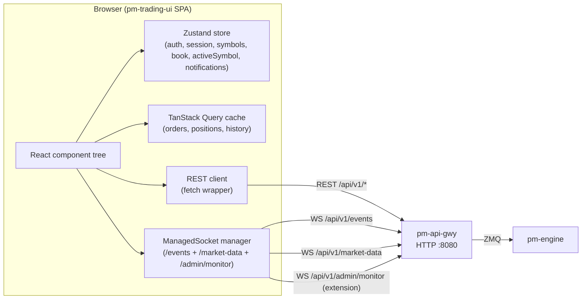
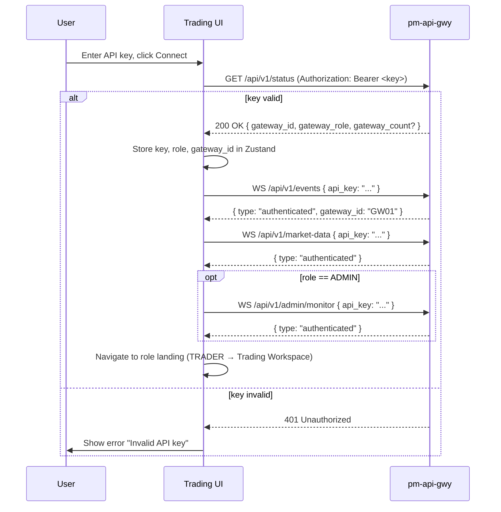
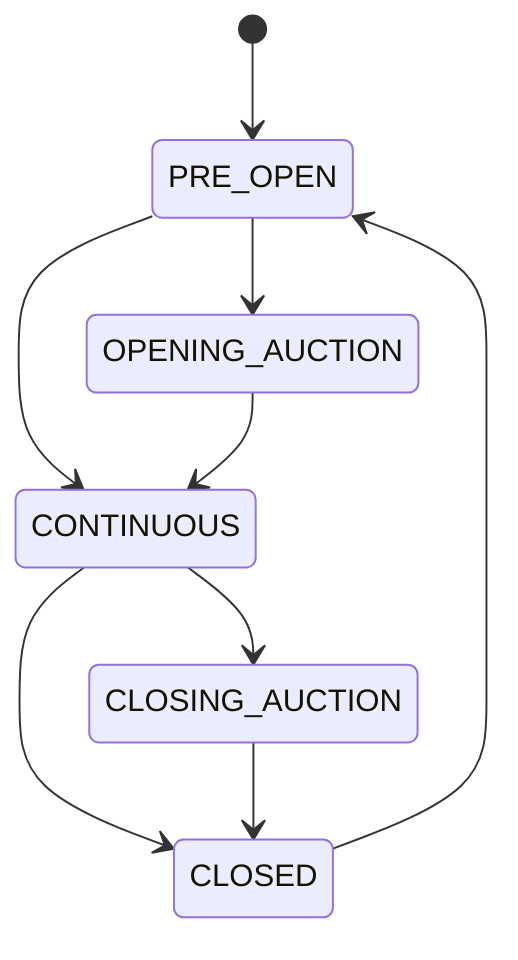

Version: 1.2.0

Date: 2026-07-09

Status: Design and Research Proposal


# EduMatcher — Trading Web UI (`pm-trading-ui`)

> **Revision History**
>
> - **1.2.0 (2026-07-09)** — Major revision. Formalised the ADMIN persona's backend
>   dependency into a dedicated section, [§6 API Gateway Extensions Required](#6-api-gateway-extensions-required-pm-api-gwy),
>   replacing the earlier "future endpoint" hand-waving. Resolved the ADMIN data-source
>   contradictions (events WebSocket vs. admin monitor). Added the previously missing feature
>   surfaces (cancel-replace, OCO/combo group cancel, order-lifecycle drill-down, MM quote-leg
>   source). Added auction support (indicative price panel, `auction` market-data channel).
>   Introduced a workspace-centric TRADER UX: a new [§11 Trading Workspace](#11-screen-design--trading-workspace-trader),
>   a global active-symbol context, click-to-trade from the depth ladder, dual BUY/SELL order
>   ticket, one-click position flatten, a session clock/countdown, a [§20 Notification / Event
>   Center](#20-notification--event-center), a power-user mode, and a promoted watchlist feature.
>   Added routing (React Router v7), renamed the WebSocket wrapper to `ManagedSocket`, added
>   [Appendix A: Core TypeScript Types](#appendix-a-core-typescript-types), and fixed two bugs
>   (Tailwind `muted` colour, change-% definition). Sections 6–25 were renumbered from the 1.0.0
>   layout; the Table of Contents, Feature Matrix, Implementation Plan, Keyboard Shortcuts, and
>   Summary were regenerated accordingly.
> - **1.0.0 (2026-07-09)** — Initial design and research proposal.

---

## Table of Contents

- [EduMatcher — Trading Web UI (`pm-trading-ui`)](#edumatcher--trading-web-ui-pm-trading-ui)
  - [Table of Contents](#table-of-contents)
  - [1. Motivation](#1-motivation)
    - [What changes](#what-changes)
    - [What does NOT change](#what-does-not-change)
    - [What this design requires from the backend](#what-this-design-requires-from-the-backend)
  - [2. Problem Statement](#2-problem-statement)
  - [3. Goals and Non-Goals](#3-goals-and-non-goals)
    - [3.1 Goals](#31-goals)
    - [3.2 Non-Goals](#32-non-goals)
  - [4. Technology Stack](#4-technology-stack)
    - [4.1 Directory structure](#41-directory-structure)
  - [5. Architecture](#5-architecture)
    - [5.1 Overall topology](#51-overall-topology)
    - [5.2 Data flow summary](#52-data-flow-summary)
    - [5.3 Client-side state layers](#53-client-side-state-layers)
  - [6. API Gateway Extensions Required (`pm-api-gwy`)](#6-api-gateway-extensions-required-pm-api-gwy)
    - [6.1 Scope and status](#61-scope-and-status)
    - [6.2 Extended `GET /api/v1/status`](#62-extended-get-apiv1status)
    - [6.3 Session control](#63-session-control)
    - [6.4 Circuit breaker control](#64-circuit-breaker-control)
    - [6.5 Gateway administration](#65-gateway-administration)
    - [6.6 Halts and risk configuration (read-only)](#66-halts-and-risk-configuration-read-only)
    - [6.7 Symbol administration](#67-symbol-administration)
    - [6.8 Index administration](#68-index-administration)
    - [6.9 Admin monitor WebSocket (`/api/v1/admin/monitor`)](#69-admin-monitor-websocket-apiv1adminmonitor)
    - [6.10 Auction market-data channel](#610-auction-market-data-channel)
    - [6.11 Extension summary table](#611-extension-summary-table)
    - [6.12 Open questions and backend prerequisites](#612-open-questions-and-backend-prerequisites)
  - [7. Authentication and API Integration](#7-authentication-and-api-integration)
    - [7.1 API key storage](#71-api-key-storage)
    - [7.2 Login flow](#72-login-flow)
    - [7.3 HTTP client wrapper](#73-http-client-wrapper)
    - [7.4 WebSocket reconnect policy](#74-websocket-reconnect-policy)
  - [8. User Personas and Role-Based Access](#8-user-personas-and-role-based-access)
    - [8.1 Role detection](#81-role-detection)
    - [8.2 Role guard pattern](#82-role-guard-pattern)
    - [8.3 Feature matrix](#83-feature-matrix)
  - [9. Application Layout and Navigation](#9-application-layout-and-navigation)
    - [9.1 Shell structure](#91-shell-structure)
    - [9.2 Top bar](#92-top-bar)
    - [9.3 Sidebar navigation](#93-sidebar-navigation)
    - [9.4 Main content area](#94-main-content-area)
    - [9.5 Session state banner](#95-session-state-banner)
    - [9.6 Routing](#96-routing)
  - [10. Screen Design — Market Overview](#10-screen-design--market-overview)
    - [10.1 Purpose](#101-purpose)
    - [10.2 Component hierarchy](#102-component-hierarchy)
    - [10.3 Data sources](#103-data-sources)
    - [10.4 Table features](#104-table-features)
    - [10.5 Empty state](#105-empty-state)
    - [10.6 Relevant API calls](#106-relevant-api-calls)
  - [11. Screen Design — Trading Workspace (TRADER)](#11-screen-design--trading-workspace-trader)
    - [11.1 Purpose](#111-purpose)
    - [11.2 Layout](#112-layout)
    - [11.3 Active-symbol binding](#113-active-symbol-binding)
    - [11.4 Click-to-trade](#114-click-to-trade)
    - [11.5 Data sources](#115-data-sources)
  - [12. Screen Design — Order Entry (TRADER)](#12-screen-design--order-entry-trader)
    - [12.1 Purpose](#121-purpose)
    - [12.2 Layout overview](#122-layout-overview)
    - [12.3 Order type tabs and field visibility](#123-order-type-tabs-and-field-visibility)
    - [12.4 Field validation rules (Zod schema)](#124-field-validation-rules-zod-schema)
    - [12.5 TIF restrictions by session phase](#125-tif-restrictions-by-session-phase)
    - [12.6 Symbol picker](#126-symbol-picker)
    - [12.7 OCO Order Entry sub-panel](#127-oco-order-entry-sub-panel)
    - [12.8 Combo Order Entry sub-panel](#128-combo-order-entry-sub-panel)
    - [12.9 Submit flow and feedback (BUY/SELL actions)](#129-submit-flow-and-feedback-buysell-actions)
    - [12.10 Auction-phase banner](#1210-auction-phase-banner)
    - [12.11 Keyboard focus management](#1211-keyboard-focus-management)
  - [13. Screen Design — Order Management (TRADER)](#13-screen-design--order-management-trader)
    - [13.1 Active Orders Blotter](#131-active-orders-blotter)
      - [13.1.1 Columns](#1311-columns)
      - [13.1.2 Status colour coding](#1312-status-colour-coding)
      - [13.1.3 Row interactions](#1313-row-interactions)
      - [13.1.4 Bulk cancel](#1314-bulk-cancel)
      - [13.1.5 Empty state](#1315-empty-state)
    - [13.2 Amend and Cancel-Replace](#132-amend-and-cancel-replace)
    - [13.3 OCO and Combo group representation](#133-oco-and-combo-group-representation)
    - [13.4 Order Detail drawer](#134-order-detail-drawer)
    - [13.5 Trade History / Fills Panel](#135-trade-history--fills-panel)
      - [13.5.1 Data source](#1351-data-source)
      - [13.5.2 Columns](#1352-columns)
      - [13.5.3 Filters](#1353-filters)
    - [13.6 Position Summary Panel (with Flatten)](#136-position-summary-panel-with-flatten)
    - [13.7 Kill Switch Button (TRADER)](#137-kill-switch-button-trader)
  - [14. Screen Design — Market-Maker Quote Management (MARKET\_MAKER)](#14-screen-design--market-maker-quote-management-market_maker)
    - [14.1 Quote Management Panel](#141-quote-management-panel)
      - [14.1.1 Quote card anatomy](#1411-quote-card-anatomy)
      - [14.1.2 Fill alerts](#1412-fill-alerts)
    - [14.2 New Quote Form](#142-new-quote-form)
    - [14.3 Quote Bootstrap and Legs View](#143-quote-bootstrap-and-legs-view)
    - [14.4 MM Position Panel](#144-mm-position-panel)
  - [15. Screen Design — Admin Control Center (ADMIN)](#15-screen-design--admin-control-center-admin)
    - [15.1 System Dashboard](#151-system-dashboard)
      - [15.1.1 KPI cards (top row)](#1511-kpi-cards-top-row)
      - [15.1.2 Per-symbol summary table](#1512-per-symbol-summary-table)
      - [15.1.3 Recent events feed](#1513-recent-events-feed)
    - [15.2 Symbol Management](#152-symbol-management)
      - [15.2.1 Symbol table](#1521-symbol-table)
    - [15.3 Index Administration](#153-index-administration)
    - [15.4 Session Control](#154-session-control)
    - [15.5 Risk Control Panel](#155-risk-control-panel)
      - [15.5.1 Collar settings table](#1551-collar-settings-table)
      - [15.5.2 Circuit breaker ladder](#1552-circuit-breaker-ladder)
    - [15.6 Circuit Breaker Management](#156-circuit-breaker-management)
      - [15.6.1 Active halts table](#1561-active-halts-table)
      - [15.6.2 Manual CB trigger](#1562-manual-cb-trigger)
      - [15.6.3 Manual CB clear](#1563-manual-cb-clear)
    - [15.7 Gateway Management](#157-gateway-management)
      - [15.7.1 Gateway table](#1571-gateway-table)
      - [15.7.2 Kick (disconnect gateway)](#1572-kick-disconnect-gateway)
    - [15.8 Kill Switch (Admin)](#158-kill-switch-admin)
    - [15.9 Audit / Monitor Log Viewer](#159-audit--monitor-log-viewer)
  - [16. Screen Design — Symbol Detail and Charts](#16-screen-design--symbol-detail-and-charts)
    - [16.1 Panel structure](#161-panel-structure)
    - [16.2 Chart tab (TradingView Lightweight Charts v5)](#162-chart-tab-tradingview-lightweight-charts-v5)
      - [16.2.1 Time frame selector](#1621-time-frame-selector)
      - [16.2.2 Chart interactions](#1622-chart-interactions)
      - [16.2.3 Live tick append](#1623-live-tick-append)
    - [16.3 Depth tab](#163-depth-tab)
      - [16.3.1 Depth panel layout](#1631-depth-panel-layout)
    - [16.4 Trades tab](#164-trades-tab)
    - [16.5 Stats tab](#165-stats-tab)
    - [16.6 Auction / Indicative Price panel](#166-auction--indicative-price-panel)
  - [17. Real-Time Data Architecture (WebSocket)](#17-real-time-data-architecture-websocket)
    - [17.1 WebSocket manager (`ManagedSocket`)](#171-websocket-manager-managedsocket)
    - [17.2 Events WebSocket (`/api/v1/events`)](#172-events-websocket-apiv1events)
      - [17.2.1 Authentication frame](#1721-authentication-frame)
      - [17.2.2 Event routing](#1722-event-routing)
      - [17.2.3 Fill toast content](#1723-fill-toast-content)
    - [17.3 Market Data WebSocket (`/api/v1/market-data`)](#173-market-data-websocket-apiv1market-data)
      - [17.3.1 Authentication and subscription](#1731-authentication-and-subscription)
      - [17.3.2 Event routing](#1732-event-routing)
      - [17.3.3 Flash cell animation](#1733-flash-cell-animation)
    - [17.4 Admin Monitor WebSocket (`/api/v1/admin/monitor`)](#174-admin-monitor-websocket-apiv1adminmonitor)
    - [17.5 Connection health monitoring](#175-connection-health-monitoring)
  - [18. State Management](#18-state-management)
    - [18.1 Zustand stores](#181-zustand-stores)
      - [18.1.1 `useAuthStore`](#1811-useauthstore)
      - [18.1.2 `useSessionStore`](#1812-usesessionstore)
      - [18.1.3 `useBookStore`](#1813-usebookstore)
      - [18.1.4 `useHaltStore`](#1814-usehaltstore)
      - [18.1.5 `useSymbolStore`](#1815-usesymbolstore)
      - [18.1.6 `useActiveSymbolStore`](#1816-useactivesymbolstore)
      - [18.1.7 `useNotificationStore`](#1817-usenotificationstore)
    - [18.2 TanStack Query key conventions](#182-tanstack-query-key-conventions)
    - [18.3 Order cache reconciliation](#183-order-cache-reconciliation)
  - [19. Help System](#19-help-system)
    - [19.1 Help drawer](#191-help-drawer)
      - [19.1.1 Help content structure](#1911-help-content-structure)
    - [19.2 Context-sensitive help (`F1`)](#192-context-sensitive-help-f1)
    - [19.3 Field tooltips](#193-field-tooltips)
    - [19.4 Keyboard shortcut reference card](#194-keyboard-shortcut-reference-card)
  - [20. Notification / Event Center](#20-notification--event-center)
    - [20.1 Purpose](#201-purpose)
    - [20.2 Event Center panel](#202-event-center-panel)
    - [20.3 Power-user mode](#203-power-user-mode)
    - [20.4 Watchlist](#204-watchlist)
  - [21. Keyboard Shortcuts Reference](#21-keyboard-shortcuts-reference)
    - [21.1 Command Palette (`Ctrl+K`)](#211-command-palette-ctrlk)
  - [22. Configuration](#22-configuration)
    - [22.1 Environment variables](#221-environment-variables)
    - [22.2 `vite.config.ts`](#222-viteconfigts)
    - [22.3 Tailwind theme](#223-tailwind-theme)
  - [23. Implementation Plan](#23-implementation-plan)
  - [24. Testing Plan](#24-testing-plan)
    - [24.1 Unit tests (Vitest)](#241-unit-tests-vitest)
    - [24.2 Component tests (React Testing Library + Vitest)](#242-component-tests-react-testing-library--vitest)
    - [24.3 Integration tests (Playwright)](#243-integration-tests-playwright)
    - [24.4 Visual regression tests (Playwright snapshots)](#244-visual-regression-tests-playwright-snapshots)
    - [24.5 Accessibility audit](#245-accessibility-audit)
  - [25. Summary](#25-summary)
  - [Appendix A: Core TypeScript Types](#appendix-a-core-typescript-types)

---

## 1. Motivation

EduMatcher already has a matching engine, an ALF TCP gateway, and a REST/WebSocket API gateway
(`pm-api-gwy`). What it lacks is a graphical front-end that a student or instructor can open
in a browser to interact with the exchange in a way that mirrors a real trading terminal.

The interactive ALF consoles (`pm-gateway`, `pm-alf-gwy`) are designed for experienced operators
comfortable with pipe-delimited command syntax. A web UI lowers the barrier to entry: students can
submit ICEBERG orders or trigger a circuit breaker without memorising the field vocabulary. At the
same time, the UI must not hide complexity — it should show every field, every event, and every
system state that a serious user needs.

`pm-api-gwy` exposes most of the engine capability over REST + WebSocket. The TRADER and
MARKET_MAKER workflows are pure consumers of that existing API and require no backend changes. The
ADMIN persona is different: several of its controls (session transitions, gateway administration,
symbol and risk administration, and a live monitoring feed) are **not** part of the current
`pm-api-gwy` design. This document formalises those as a required gateway extension in
[§6](#6-api-gateway-extensions-required-pm-api-gwy) rather than treating them as vague "future" work.

### What changes

- A new project, `pm-trading-ui`, provides a React/TypeScript single-page application.
- It connects exclusively to `pm-api-gwy` (`http://localhost:8080` by default).
- Three role-aware personas (TRADER, MARKET_MAKER, ADMIN) drive the visible feature set.
- Real-time event delivery uses the existing `/api/v1/events` and `/api/v1/market-data` WebSockets,
  plus a new admin-only `/api/v1/admin/monitor` WebSocket for the ADMIN persona.

### What does NOT change

- The matching engine's core order-matching, auction, and risk semantics are unchanged.
- The REST/WebSocket API used by TRADER and MARKET_MAKER (`/orders`, `/oco`, `/combos`, `/quotes`,
  `/positions`, `/history/*`, `/events`, `/market-data`) is unchanged.
- The ALF console and ALF TCP gateway continue to exist for headless/scripted use.
- Authentication is still API-key based; the UI stores the key in browser memory (never on disk).

### What this design requires from the backend

- **Gateway extensions** to `pm-api-gwy` for the ADMIN persona and role reporting, specified in
  [§6](#6-api-gateway-extensions-required-pm-api-gwy).
- A small **market-data addition**: exposing the engine's `auction.result.{SYMBOL}` event as a new
  `auction` channel on `/market-data` (see [§6.10](#610-auction-market-data-channel)).
- A few items flagged as **engine prerequisites** (manual circuit-breaker trigger/resume, live
  symbol addition) that may not exist in the backend yet — see
  [§6.12](#612-open-questions-and-backend-prerequisites).

---

## 2. Problem Statement

There is no graphical way to interact with EduMatcher today. Observers who want to:

- Watch the order book update in real time
- Submit a trailing-stop or OCO order without memorising ALF syntax
- Configure circuit breaker ladders and watch them fire
- See their positions update as fills arrive

…must either use the text console or write their own client against `pm-api-gwy`. Neither option
is suitable for classroom use.

Furthermore, the three gateway roles (TRADER, MARKET_MAKER, ADMIN) have distinct workflows that
are best expressed as purpose-built screens rather than a single generic order entry box.

---

## 3. Goals and Non-Goals

### 3.1 Goals

- Provide a complete graphical trading terminal for the TRADER role, centred on a fast, single-symbol
  Trading Workspace.
- Provide a quote management dashboard for the MARKET_MAKER role.
- Provide a system administration center for the ADMIN role.
- Deliver real-time market data (book, trades, depth, auction) and private events (fills, acks) to all roles.
- Make all order types and TIF values accessible through validated form UI.
- Support a professional dark terminal aesthetic consistent with real trading platforms.
- Operate the TRADER and MARKET_MAKER surfaces against the existing `pm-api-gwy` REST and WebSocket
  interface with no backend changes.
- Clearly specify — rather than assume — the gateway (and possibly engine) extensions the ADMIN
  persona depends on (see [§6](#6-api-gateway-extensions-required-pm-api-gwy)).

### 3.2 Non-Goals

- No mobile or tablet optimisation (desktop-only, minimum 1440px wide).
- No server-side rendering or SSR framework (pure SPA).
- No user management or registration — credentials are API keys configured in `api_gateway_config.yaml`.
- No embedded charting beyond what the lightweight chart library provides.
- No automated trading / strategy execution within the UI.
- No TLS certificate management (handled by a reverse proxy or uvicorn TLS ahead of the gateway).
- No support for the ALF TCP gateway — the UI talks only to `pm-api-gwy`.

---

## 4. Technology Stack

| Concern | Library / Version | Rationale |
|---------|-------------------|-----------|
| Runtime | Node.js 22 LTS | LTS lifecycle; native fetch + WebSocket |
| Framework | React 19 + TypeScript 5 | Industry standard; concurrent features; strict typing |
| Build tool | Vite 6 | Fast HMR; native ESM; zero-config TypeScript |
| Routing | React Router v7 (data router) | Familiar, mature client-side routing; nested routes + loaders; role-guarded route tree |
| Component library | shadcn/ui (Radix UI primitives) | Accessible, unstyled-by-default; composable; no runtime JS overhead |
| Styling | Tailwind CSS v4 | Utility-first; co-located with JSX; plays well with shadcn |
| Server state | TanStack Query v5 | Stale-while-revalidate, mutation state, WebSocket integration |
| Client state | Zustand | Minimal boilerplate; fine-grained subscriptions; no Redux overhead |
| Data grids | TanStack Table v8 | Headless; works with Tailwind; virtual rows for large blotters |
| Charts | TradingView Lightweight Charts v5 | Professional candlestick/line charting; minimal bundle; time-axis zoom/pan |
| Analytics charts | Recharts 2 | Declarative SVG; used for position/P&L panels |
| WebSocket | Native browser WebSocket wrapped in a bespoke `ManagedSocket` class | No extra dependency; full control over the custom auth-frame-on-reconnect logic and backoff |
| Forms | React Hook Form 7 + Zod 3 | Performant controlled forms; schema-driven validation co-located with types |
| Keyboard shortcuts | react-hotkeys-hook 4 | Declarative; scope-aware; works with focus management |
| Icons | Lucide React | Consistent stroke-based icons; tree-shakeable |
| Notifications | Sonner (toast library) | Non-intrusive; stacks; controlled dismiss |
| HTTP client | Fetch API (native) | No dependency; wrapped in a thin client class |

> **WebSocket wrapper note:** the wrapper is a small **bespoke class named `ManagedSocket`**, not the
> `reconnecting-websocket` npm package. It is named deliberately to avoid implying the npm package,
> because the reconnect path must re-send a custom authentication frame and (for `/market-data`)
> replay the active subscription set — behaviour the generic package does not provide. See
> [§17.1](#171-websocket-manager-managedsocket).

### 4.1 Directory structure

```
pm-trading-ui/
  src/
    api/              # REST client (fetcher, endpoints per resource, admin endpoints)
    ws/               # ManagedSocket, reconnect logic, event parsing
    router/           # React Router v7 route tree, RoleGuard route wrappers, loaders
    store/            # Zustand slices (auth, session, symbols, book, halt, activeSymbol, notifications)
    queries/          # TanStack Query hooks (orders, positions, history)
    components/
      layout/         # AppShell, Sidebar, TopBar, StatusBar, SessionClock, NotificationBell
      market/         # MarketOverview, SymbolRow, DepthPanel, TradesTape, AuctionBadge
      workspace/      # TradingWorkspace, WorkspaceChart, WorkspaceDom, WorkspaceTicket, WorkspaceBlotter
      chart/          # SymbolChart wrapper (Lightweight Charts)
      orders/         # OrderTicket, OrderBlotter, AmendDialog, ReplaceDialog, OrderDetailDrawer
      quotes/         # QuoteCard, NewQuoteForm, QuoteBootstrapTable, QuoteLegsTable
      admin/          # SystemDashboard, SymbolMgmt, SessionControl, RiskPanel, MonitorLog, GatewayMgmt
      notifications/  # EventCenter, NotificationItem
      shared/         # DataTable, PriceCell, FlashCell, ConfirmDialog, UndoToast, Kbd, Watchlist
    pages/            # Route-level components (thin; compose from components/)
    hooks/            # useRole, useWsEvent, useKeyboard, useFlash, useActiveSymbol, useConfirm
    types/            # Shared TypeScript types mirroring API schemas (see Appendix A)
    lib/              # formatters, validators, price utils
  public/
  index.html
  vite.config.ts
  tailwind.config.ts
  tsconfig.json
```

Routes are declared centrally in `src/router/` (see [§9.6](#96-routing)); `pages/` components are
mounted by the router and compose the feature components under `components/`.

---

## 5. Architecture

### 5.1 Overall topology

The UI is a browser SPA. It makes no server calls other than to `pm-api-gwy`. Note that for the
ADMIN persona, some of the endpoints and the `/api/v1/admin/monitor` WebSocket shown below are
**required extensions** to `pm-api-gwy` defined in [§6](#6-api-gateway-extensions-required-pm-api-gwy).



### 5.2 Data flow summary

| Data path | Direction | Mechanism |
|-----------|-----------|-----------|
| Submit order / cancel / amend / replace | UI → Gateway | REST POST/DELETE/PATCH |
| Order ack, fill, cancel confirm | Gateway → UI | WebSocket `/events` |
| Book snapshots, trade ticks, depth, auction | Gateway → UI | WebSocket `/market-data` |
| Active orders list | UI → Gateway → UI | REST GET `/orders` (initial load) |
| Position summary | UI → Gateway → UI | REST GET `/positions` |
| Historical fills | UI → Gateway → UI | REST GET `/history/fills` |
| Order lifecycle | UI → Gateway → UI | REST GET `/history/orders/{order_id}` |
| OHLCV daily stats | UI → Gateway → UI | REST GET `/history/daily` |
| Symbols list | UI → Gateway → UI | REST GET `/symbols` |
| Session state | Gateway → UI | WebSocket `session` event (always-on) |
| Circuit breaker events | Gateway → UI | WebSocket `circuit_breaker` event (always-on) |
| Admin control (session/CB/gateway/symbol) | UI → Gateway | REST admin endpoints (extension, §6) |
| Admin live monitor feed | Gateway → UI | WebSocket `/admin/monitor` (extension, §6) |

### 5.3 Client-side state layers

```
┌─────────────────────────────────────────────────────────────┐
│  Zustand (synchronous, in-memory, ephemeral)                │
│  • Current API key + resolved gateway_id + role             │
│  • WebSocket connection status (CONNECTING / OPEN / CLOSED) │
│  • Session phase (PRE_OPEN / CONTINUOUS / …)                │
│  • Symbol metadata (name, tick_decimals, reference_price)   │
│  • Active symbol (drives chart, DOM, ticket, MM quote form) │
│  • Real-time book data per symbol (bids[], asks[])          │
│  • Real-time last trade price + auction indicative per sym  │
│  • Active circuit breaker halts                             │
│  • Notification / event history (bounded ring buffer)       │
└─────────────────────────────────────────────────────────────┘
┌─────────────────────────────────────────────────────────────┐
│  TanStack Query (server state, stale-while-revalidate)      │
│  • Active orders (GET /orders, invalidated by WS events)    │
│  • Positions (GET /positions, invalidated by fill events)   │
│  • Quote bootstrap + legs (GET /quotes/bootstrap, /legs)    │
│  • History queries (GET /history/*)                         │
└─────────────────────────────────────────────────────────────┘
┌─────────────────────────────────────────────────────────────┐
│  Component local state (useState / useReducer)              │
│  • Form field values (React Hook Form)                      │
│  • Table sort/filter state (TanStack Table)                 │
│  • Modal open/close flags                                   │
└─────────────────────────────────────────────────────────────┘
```

---

## 6. API Gateway Extensions Required (`pm-api-gwy`)

> **These endpoints are NOT part of the current `pm-api-gwy` design
> ([EduMatcher-ALF-API-Gwy2.md](./EduMatcher-ALF-API-Gwy2.md)). Implementing the ADMIN persona
> requires extending `pm-api-gwy` (and possibly the engine) as specified here.** The TRADER and
> MARKET_MAKER personas use only endpoints already defined in the API Gateway spec and require none
> of this section.

### 6.1 Scope and status

The 1.0.0 design invented ADMIN endpoints inline and labelled them "future," which produced
coherence gaps (screens referenced endpoints that did not exist). This section replaces that with a
formal dependency: each control the ADMIN persona needs is defined here with method, path, request
schema, response schema, and the engine ZMQ message/topic it maps to. Where an endpoint depends on a
backend capability that may not yet exist, it is flagged and listed in
[§6.12](#612-open-questions-and-backend-prerequisites).

Existing engine topics referenced below are defined in the Requirements document
([EduMatcher-Requirements.md](./EduMatcher-Requirements.md)): `session.transition` (§3.3.21),
`system.gateway_connect` / `system.gateway_disconnect` (§3.2, FR-ENG-028), `circuit_breaker.halt.*`
/ `circuit_breaker.resume.*` (FR-RISK-006/007, §18.1), `system.symbols_request` (§3.3.10),
`risk.kill_switch` (FR-KILL-001), `depth.{SYMBOL}` (FR-MD-001), `drop_copy.event.{GW_ID}`
(FR-OPS-001), and `auction.result.{SYMBOL}` (§3.3.23).

All admin endpoints require an API key whose resolved role is `ADMIN` (see
[§6.2](#62-extended-get-apiv1status)). Non-admin keys receive `403 Forbidden`. All bodies are JSON.

### 6.2 Extended `GET /api/v1/status`

`GET /api/v1/status` MUST be extended so the UI can detect the caller's role and, for admin keys,
the number of connected gateways.

**Response `200 OK`:**

```jsonc
{
  "gateway_id": "GW01",
  "gateway_role": "TRADER",       // "TRADER" | "MARKET_MAKER" | "ADMIN"  (REQUIRED addition)
  "session_state": "CONTINUOUS",
  "gateway_count": 4,             // present only for ADMIN keys: number of connected gateways
  "connected": true
}
```

- `gateway_role` derives from the gateway's configured role (`gateways.fix[].role` — the engine
  already distinguishes `MARKET_MAKER` per FR-MMQ-002; `ADMIN` is a gateway role the allowlist must
  support).
- `gateway_count` is populated from the gateway's own connection registry (the set of authenticated
  `gateway_id`s, see API Gateway spec §3.3) and is omitted for non-admin keys.

**Engine mapping:** none for `gateway_role`/`gateway_count` — both are served from `pm-api-gwy`
local state (credential store + connection registry). No engine round-trip.

### 6.3 Session control

**`POST /api/v1/admin/session/transition`**

Purpose: drive the engine through its session phases (the same capability the scheduler process has).

**Request body:**

```jsonc
{ "to_state": "CONTINUOUS" }   // PRE_OPEN | OPENING_AUCTION | CONTINUOUS | CLOSING_AUCTION | CLOSED
```

**Response `202 Accepted`:**

```jsonc
{ "requested_state": "CONTINUOUS", "status": "PENDING" }
```

**Engine mapping:** emits `session.transition` `{ "to_state": "<STATE>" }` on the engine PUSH socket
(Requirements §3.3.21). The **engine validates the transition** against its allowed-transition map
(FR-ENG-029); an invalid transition is silently rejected by the engine (no reply). The UI therefore
confirms success by observing the subsequent `session.state` broadcast on `/market-data` rather than
the HTTP response. If no `session.state` change is observed within a short window, the UI surfaces a
"transition not accepted (invalid from current phase)" warning.

### 6.4 Circuit breaker control

**`POST /api/v1/admin/circuit-breaker/trigger`**

**Request body:**

```jsonc
{ "symbol": "AAPL", "level": "L2" }   // level: L1 | L2 | L3 (or configured level name)
```

**Response `202 Accepted`:** `{ "symbol": "AAPL", "level": "L2", "status": "PENDING" }`

**`POST /api/v1/admin/circuit-breaker/resume`**

**Request body:** `{ "symbol": "AAPL" }`

**Response `202 Accepted`:** `{ "symbol": "AAPL", "status": "PENDING" }`

> **⚠ Prerequisite flag:** The engine's circuit breaker is currently **automatic** — it triggers on
> price shift ladders and auto-resumes on timers (FR-RISK-003/006/007). The Requirements document
> defines `circuit_breaker.halt.{SYMBOL}` / `circuit_breaker.resume.{SYMBOL}` as **engine → all**
> broadcasts, not as inbound commands. **A manual operator-initiated CB trigger/resume engine
> command does not appear to exist yet** and is a backend prerequisite for these two endpoints. See
> [§6.12](#612-open-questions-and-backend-prerequisites). Until that engine command exists, the
> Circuit Breaker Management screen ([§15.6](#156-circuit-breaker-management)) shows the trigger/resume
> controls as disabled with an explanatory tooltip.

**Engine mapping (proposed):** a new inbound `risk.circuit_breaker_trigger` / `risk.circuit_breaker_resume`
engine command (to be added), producing the existing `circuit_breaker.halt.{SYMBOL}` /
`circuit_breaker.resume.{SYMBOL}` broadcasts on success.

### 6.5 Gateway administration

**`GET /api/v1/admin/gateways`**

Purpose: list configured gateways and their live connection status.

**Response `200 OK`:**

```jsonc
{
  "gateways": [
    { "gateway_id": "GW01", "role": "TRADER",        "description": "Trading UI - desk A", "connected": true },
    { "gateway_id": "MM",   "role": "MARKET_MAKER",  "description": "House MM",            "connected": true },
    { "gateway_id": "GW09", "role": "ADMIN",         "description": "Instructor console",  "connected": false }
  ]
}
```

**Engine mapping:** served from `pm-api-gwy` local state — the credential store
(`api_gateway_config.yaml`, providing `gateway_id`/`role`/`description`) joined with the connection
registry (`connected`). No engine round-trip.

**`POST /api/v1/admin/gateways/{id}/disconnect`**

Purpose: forcibly disconnect a gateway.

**Request body:** _(none)_ — optional `{ "reason": "..." }`.

**Response `202 Accepted`:** `{ "gateway_id": "GW02", "status": "DISCONNECTED" }`

**Engine mapping:** emits `system.gateway_disconnect` `{ "gateway_id": "GW02" }` (Requirements §3.2,
API Gateway spec §3.5 shutdown path). **Note:** disconnecting a gateway cancels that gateway's
resting orders and active quotes per the engine's disconnect policy (FR-MMQ-006 `CANCEL_ALL`
semantics). The UI's confirmation dialog states this explicitly.

### 6.6 Halts and risk configuration (read-only)

**`GET /api/v1/admin/halts`**

Purpose: list active circuit breaker halts.

**Response `200 OK`:**

```jsonc
{
  "halts": [
    { "symbol": "AAPL", "level": 2, "trigger_price": 145.00, "reference_price": 150.00,
      "halted_at": "2026-07-09T14:30:00Z", "resume_at": "2026-07-09T14:45:00Z",
      "resumption_mode": "AUCTION" }
  ]
}
```

**Engine mapping:** the authoritative source is the stream of `circuit_breaker.halt.{SYMBOL}` /
`circuit_breaker.resume.{SYMBOL}` broadcasts, which `pm-api-gwy` already receives. Two viable
implementations: (a) `pm-api-gwy` maintains a halt cache folded from those events and serves it here
(preferred, for a synchronous snapshot on page load); or (b) the UI derives halts purely from the
always-on `circuit_breaker` channel and this endpoint is a convenience bootstrap. The UI treats it as
a bootstrap and keeps the live view current from the `circuit_breaker` channel regardless.

**`GET /api/v1/admin/risk/collars`**

**Response `200 OK`:**

```jsonc
{
  "collars": [
    { "symbol": "AAPL", "level": "default", "static_band_pct": 0.10, "dynamic_band_pct": 0.05,
      "reference_price": 150.00 }
  ]
}
```

**`GET /api/v1/admin/risk/circuit-breakers`**

**Response `200 OK`:**

```jsonc
{
  "levels": [
    { "level": "L1", "price_shift_pct": 0.07, "halt_duration_sec": 300,  "resumption_mode": "AUCTION" },
    { "level": "L2", "price_shift_pct": 0.13, "halt_duration_sec": 900,  "resumption_mode": "AUCTION" },
    { "level": "L3", "price_shift_pct": 0.20, "halt_duration_sec": null, "resumption_mode": "CONTINUOUS" }
  ]
}
```

**Engine mapping:** both are read-only views of resolved configuration
(`risk_controls.levels`, `circuit_breaker_defaults`, and per-symbol overrides — FR-RISK-002/003/004).
`pm-api-gwy` can read these from the loaded engine config or via a `system.*` config-request topic if
one is added. No mutation is offered from the UI — editing requires a config file change and engine
restart, consistent with the current backend model.

### 6.7 Symbol administration

**`POST /api/v1/admin/symbols`** — add a new symbol.

**Request body:**

```jsonc
{
  "symbol": "NVDA",
  "tick_decimals": 2,
  "reference_price": 120.00,
  "outstanding_shares": 2500000000
}
```

**Response `202 Accepted`:** `{ "symbol": "NVDA", "status": "PENDING" }`

**`PATCH /api/v1/admin/symbols/{symbol}`** — update mutable metadata (`reference_price`,
`tick_decimals`, `outstanding_shares`).

**Request body:** `{ "reference_price": 118.50 }`

**Response `202 Accepted`:** `{ "symbol": "NVDA", "status": "PENDING" }`

> **⚠ Prerequisite flag:** The engine currently **loads symbols from `engine_config.yaml` at
> startup** and only accepts orders for configured symbols (FR-ENG-017). There is no runtime
> "add symbol" engine command. **Live symbol addition/mutation is therefore a backend prerequisite**
> (an engine command to register a symbol book and tick precision at runtime). See
> [§6.12](#612-open-questions-and-backend-prerequisites). Until that exists, Symbol Management
> ([§15.2](#152-symbol-management)) remains read-only with the existing "edit `engine_config.yaml`
> and restart" guidance, and these endpoints return `501 Not Implemented`.

**Engine mapping (proposed):** a new `system.symbol_add` / `system.symbol_update` engine command.
Read side continues to use `system.symbols_request` (FR-ENG-019).

### 6.8 Index administration

**`GET /api/v1/admin/indexes`**

**Response `200 OK`:**

```jsonc
{
  "indexes": [
    { "index_id": "TECH50", "name": "Tech 50", "constituents": ["AAPL","MSFT","NVDA"],
      "value": 1024.55, "last_rebalance": "2026-07-08T16:05:00Z" }
  ]
}
```

**`POST /api/v1/admin/indexes/{id}/rebalance`**

**Response `202 Accepted`:** `{ "index_id": "TECH50", "status": "PENDING" }`

> **Dependency note:** Indexes are produced by the separate `pm-index` process, which is not part of
> the engine core covered by the Requirements document. These endpoints depend on `pm-index` being
> present and on `pm-api-gwy` gaining a bridge to it. If `pm-index` is absent, both endpoints return
> `503 Service Unavailable` and the Index Admin screen ([§15.3](#153-index-administration)) shows a
> placeholder.

### 6.9 Admin monitor WebSocket (`/api/v1/admin/monitor`)

ADMIN monitoring needs a live, cross-gateway feed of order/fill/session/CB activity. Two options
were considered:

1. **Expose the engine drop-copy stream** (`drop_copy.event.{GW_ID}`, per Requirements FR-OPS-001,
   which already carries a sequenced, per-gateway event stream on the dedicated drop-copy PUB socket
   `tcp://127.0.0.1:5557`) over a **read-only admin WebSocket**; or
2. **Poll `GET /history/*`** repeatedly.

**Recommended: option 1 — a read-only admin WebSocket `/api/v1/admin/monitor`.** Polling history is
higher-latency, heavier, and cannot show session/CB transitions promptly. The drop-copy stream is
purpose-built for operational monitoring (FR-OPS-001/002, NFR-015 keeps it isolated from market-data
transport).

**Connection lifecycle:** identical to `/events` — the client opens the socket, sends
`{ "api_key": "..." }` (must resolve to an ADMIN key, else close code `4003`), receives
`{ "type": "authenticated" }`, then receives a merged stream. `pm-api-gwy` subscribes to the engine
drop-copy socket and to `session.state` / `circuit_breaker.*`, and fans them out here.

**Event envelope** (uniform with `/events`):

```jsonc
{
  "type": "monitor.event",
  "ts": "2026-07-09T14:15:03.221Z",
  "seq": 100482,                    // from drop-copy sequence (FR-OPS-001)
  "gateway_id": "GW01",
  "data": {
    "event_type": "FILL",           // ACK | FILL | CANCEL | AMEND | EXPIRE | REJECT | SESSION | CB
    "order_id": "ORD-...",
    "symbol": "AAPL",
    "fill_qty": 50, "fill_price": 150.50, "remaining_qty": 50, "liquidity": "MAKER"
  }
}
```

Session and circuit-breaker transitions arrive as `event_type: "SESSION"` / `"CB"` with the
corresponding payloads. This one socket powers both the System Dashboard recent-events feed
([§15.1](#151-system-dashboard)) and the Audit / Monitor Log Viewer
([§15.9](#159-audit--monitor-log-viewer)).

**Engine mapping:** subscribe to `drop_copy.event.*` on the drop-copy PUB socket; optionally use
`drop_copy.replay.{RECIPIENT_ID}` (FR-OPS-001) to backfill a bounded history on connect. No new
engine command is required — the drop-copy socket already exists; the extension is purely a
`pm-api-gwy` fan-out endpoint.

### 6.10 Auction market-data channel

The engine publishes `auction.result.{SYMBOL}` on its bus when a symbol uncrosses (Requirements
§3.3.23, FR-ENG-031). The current `/market-data` design does not expose it. This design adds a new
**`auction`** channel to `/market-data`, subscribed like `book`/`trades`/`depth`.

**Subscribe:** `{ "action": "subscribe", "symbols": ["AAPL"], "channels": ["auction"] }`

**Event payload:**

```jsonc
{
  "type": "auction", "ts": "...",
  "data": {
    "symbol": "AAPL",
    "eq_price": 150.50,            // indicative/uncross equilibrium price; null if no cross
    "eq_qty": 5000,               // matched quantity at eq_price
    "imbalance_side": "BUY",      // "BUY" | "SELL" | ""
    "imbalance_qty": 500,
    "trades_count": 12,
    "indicative": true             // true during an auction phase (pre-uncross), false for the final result
  }
}
```

**Engine mapping:** `auction.result.{SYMBOL}` (Requirements §3.3.23). For an *indicative* price
during an ongoing auction phase (as opposed to the final uncross result), the engine would need to
publish periodic indicative uncross computations; if the engine only emits the final result on phase
exit, the UI shows the last indicative it received and otherwise computes an indicative equilibrium
client-side from the resting auction book. This client-side fallback is noted in
[§16.6](#166-auction--indicative-price-panel). This is a small `pm-api-gwy` addition (one more
channel mapping) and is listed in the extension summary below.

### 6.11 Extension summary table

| # | Extension | Kind | Engine topic / source | Backend prerequisite? |
|---|-----------|------|-----------------------|-----------------------|
| 1 | `GET /status` → `gateway_role`, `gateway_count` | REST field addition | gateway local state | No |
| 2 | `POST /admin/session/transition` | REST admin | `session.transition` | No (topic exists) |
| 3 | `POST /admin/circuit-breaker/trigger` \| `/resume` | REST admin | (proposed) `risk.circuit_breaker_*` | **Yes — manual CB engine command** |
| 4 | `GET /admin/gateways` | REST admin | gateway local state | No |
| 5 | `POST /admin/gateways/{id}/disconnect` | REST admin | `system.gateway_disconnect` | No (topic exists) |
| 6 | `GET /admin/halts` | REST admin | `circuit_breaker.*` cache | No |
| 7 | `GET /admin/risk/collars` \| `/circuit-breakers` | REST admin (read-only) | resolved config | No |
| 8 | `POST /admin/symbols` \| `PATCH /admin/symbols/{sym}` | REST admin | (proposed) `system.symbol_add/update` | **Yes — live symbol add engine command** |
| 9 | `GET /admin/indexes` \| `POST /admin/indexes/{id}/rebalance` | REST admin | `pm-index` bridge | **Yes — depends on `pm-index`** |
| 10 | `WS /admin/monitor` | WebSocket | `drop_copy.event.*` | No (drop-copy socket exists) |
| 11 | `auction` channel on `/market-data` | WebSocket channel | `auction.result.{SYMBOL}` | No (topic exists; indicative may need engine support) |

### 6.12 Open questions and backend prerequisites

1. **Manual circuit-breaker trigger/resume.** The engine's CB is automatic (price-ladder trigger,
   timer/rest-of-day resume). A manual operator command (`risk.circuit_breaker_trigger` /
   `_resume`) does not appear to exist. **Prerequisite** for
   [§6.4](#64-circuit-breaker-control) and the manual controls in
   [§15.6](#156-circuit-breaker-management). Until added, those controls are disabled in the UI.
2. **Live symbol addition/mutation.** The engine loads symbols from `engine_config.yaml` at startup
   (FR-ENG-017); there is no runtime add-symbol command. **Prerequisite** for
   [§6.7](#67-symbol-administration). Until added, Symbol Management stays read-only.
3. **Indicative auction price.** Does the engine publish an *indicative* equilibrium during an
   auction phase, or only the final `auction.result` on phase exit? If only the latter, the UI
   computes an indicative client-side from the resting book (see
   [§16.6](#166-auction--indicative-price-panel)). Confirmation needed.
4. **`pm-index` availability.** Index admin ([§6.8](#68-index-administration)) depends on the
   separate `pm-index` process and a `pm-api-gwy` bridge to it.
5. **Session schedule exposure.** The session clock/countdown ([§9.2](#92-top-bar)) needs the
   configured schedule. If `pm-api-gwy` does not expose the scheduler's `schedule` block, the top bar
   shows only the current phase and elapsed time in that phase, not a countdown to the next
   transition.

---

## 7. Authentication and API Integration

### 7.1 API key storage

The API key is stored exclusively in memory (`useAuthStore` Zustand slice). It is never written to
`localStorage` or `sessionStorage`. On page reload the user must re-enter the key. This is
intentional: EduMatcher is an educational system running on localhost; the security model does not
require persistence.

### 7.2 Login flow



The role is read from the `gateway_role` field of `GET /api/v1/status` (see
[§6.2](#62-extended-get-apiv1status)); it maps to TRADER / MARKET_MAKER / ADMIN. Using `/status`
(rather than `/symbols`) as the login probe gives the UI the role and gateway id in a single call.

### 7.3 HTTP client wrapper

All REST calls go through a single `apiFetch` utility that:

- Injects `Authorization: Bearer <key>` on every request.
- Deserialises JSON response.
- Maps HTTP status codes to typed errors (`ApiError` with `code`, `message`, `field`).
- Throws on `401` so TanStack Query's `onError` can log out automatically.

```typescript
export async function apiFetch<T>(
  path: string,
  init?: RequestInit
): Promise<T> {
  const key = useAuthStore.getState().apiKey;
  const res = await fetch(`${API_BASE}${path}`, {
    ...init,
    headers: {
      "Content-Type": "application/json",
      Authorization: `Bearer ${key}`,
      ...init?.headers,
    },
  });
  if (!res.ok) {
    const body = await res.json().catch(() => ({}));
    throw new ApiError(res.status, body.error ?? { code: "UNKNOWN", message: res.statusText });
  }
  return res.json() as Promise<T>;
}
```

### 7.4 WebSocket reconnect policy

All WebSocket connections use the `ManagedSocket` wrapper ([§17.1](#171-websocket-manager-managedsocket))
with an exponential-backoff reconnect schedule:

| Attempt | Delay |
|---------|-------|
| 1 | 1 s |
| 2 | 2 s |
| 3 | 4 s |
| 4 | 8 s |
| 5+ | 30 s (cap) |

On each reconnect `ManagedSocket` re-sends the auth frame and, for `/market-data`, replays the active
subscription set. The connection health indicator in the top bar reflects the state of all sockets
(green = all open; amber = one reconnecting; red = any closed).

---

## 8. User Personas and Role-Based Access

### 8.1 Role detection

The gateway role is returned by `GET /api/v1/status` (extended per [§6.2](#62-extended-get-apiv1status)):

```jsonc
{
  "gateway_id": "GW01",
  "gateway_role": "TRADER",   // "TRADER" | "MARKET_MAKER" | "ADMIN"
  "session_state": "CONTINUOUS",
  "gateway_count": 4          // ADMIN keys only
}
```

The UI stores `gateway_role` in `useAuthStore` and uses it to gate routes and components.

### 8.2 Role guard pattern

Role-based access is enforced at two levels:

**Route level** — a `<RoleGuard roles={["ADMIN"]}>` route wrapper (in the React Router tree, see
[§9.6](#96-routing)) redirects to the role's landing screen if the current role is not allowed.

**Component level** — individual panels and buttons check the role from the Zustand store:

```typescript
function KillSwitchButton() {
  const role = useAuthStore((s) => s.role);
  if (role !== "TRADER" && role !== "MARKET_MAKER") return null;
  // ...
}
```

This is a presentation-layer guard only. The API gateway enforces authorisation server-side; the
UI guard prevents confusion and clutter, not security breaches.

### 8.3 Feature matrix

| Feature | ADMIN | TRADER | MARKET_MAKER |
|---------|:-----:|:------:|:------------:|
| Market Overview | ✓ | ✓ | ✓ |
| Trading Workspace | — | ✓ | — |
| Symbol Detail / Charts | ✓ | ✓ | ✓ |
| Auction / Indicative Price panel | ✓ | ✓ | ✓ |
| Session State Banner + Clock/Countdown | ✓ | ✓ | ✓ |
| Order Entry (all types, BUY/SELL) | — | ✓ | — |
| OCO Order Entry | — | ✓ | — |
| Combo Order Entry | — | ✓ | — |
| Amend / Cancel Order | — | ✓ | — |
| Cancel-Replace | — | ✓ | — |
| OCO / Combo group cancel | — | ✓ | — |
| Order Detail drawer (lifecycle) | ✓ | ✓ | — |
| Active Orders Blotter | — | ✓ | — |
| Trade History / Fills | — | ✓ | — |
| Position Panel | — | ✓ | ✓ |
| Flatten position / Flatten All | — | ✓ | ✓ |
| Kill Switch Button (self) | — | ✓ | ✓ |
| Quote Management Panel | — | — | ✓ |
| Quote Fill Alerts | — | — | ✓ |
| Quote Bootstrap / Legs View | — | — | ✓ |
| System Dashboard | ✓ | — | — |
| Symbol Management | ✓ | — | — |
| Index Administration | ✓ | — | — |
| Session Control | ✓ | — | — |
| Risk Control Panel | ✓ | — | — |
| Circuit Breaker Management | ✓ | — | — |
| Gateway Management | ✓ | — | — |
| Kill Switch (scoped/global) | ✓ | — | — |
| Admin Monitor feed / Log Viewer | ✓ | — | — |
| Notification / Event Center | ✓ | ✓ | ✓ |
| Watchlist | ✓ | ✓ | ✓ |

---

## 9. Application Layout and Navigation

### 9.1 Shell structure

```
┌──────────────────────────────────────────────────────────────────────────┐
│ TOP BAR: Logo | Session badge + clock/countdown | WS dot | 🔔 | Last update│
├─────────┬──────────────────────────────────────────────────────────────────┤
│         │                                                                  │
│ SIDEBAR │  MAIN CONTENT AREA                                               │
│  (role- │  (routed view based on the current path)                        │
│  aware) │                                                                  │
│         │                                                                  │
└─────────┴──────────────────────────────────────────────────────────────────┘
```

### 9.2 Top bar

The top bar is a fixed `h-10` strip:

- **Left**: `EduMatcher` wordmark + `pm-trading-ui` subtitle
- **Centre**: Session state badge (see [§9.5](#95-session-state-banner)) plus an **exchange clock and
  countdown** to the next scheduled session transition — e.g. `Continuous → Closing Auction in
  02:14:33`. The current phase comes from `GET /session` / the always-on `session` event; the
  countdown target comes from the configured schedule. **Schedule source note:** if `pm-api-gwy` does
  not expose the scheduler's `schedule` block (see [§6.12](#612-open-questions-and-backend-prerequisites)),
  the clock degrades gracefully to showing only the current phase and elapsed time in that phase
  (`Continuous · 04:32:10 elapsed`), with no countdown.
- **Right**: WebSocket health indicator (coloured dot + label) → `CONNECTED` / `RECONNECTING` /
  `DISCONNECTED`; a **notification bell** (🔔) that opens the Notification / Event Center
  ([§20](#20-notification--event-center)) with an unread-count badge; last market data update
  timestamp (`Updated: HH:MM:SS`); logged-in gateway ID; logout button.

### 9.3 Sidebar navigation

The sidebar is `w-56`, persistent (not collapsible in the base design). Nav items are grouped by
section with a role-aware filter:

**All roles:**
- Market Overview
- Watchlist (compact panel, [§20.4](#204-watchlist))
- _(symbol rows / watchlist rows open Symbol Detail in a right panel and set the active symbol)_

**TRADER only:**
- Trading Workspace (default landing)
- Order Entry
- Active Orders
- Trade History
- Positions

**MARKET_MAKER only:**
- Quote Management
- Quote Bootstrap
- Positions

**ADMIN only:**
- System Dashboard
- Symbol Management
- Index Admin
- Session Control
- Risk Controls
- Circuit Breakers
- Gateways
- Monitor Log

### 9.4 Main content area

Most screens occupy the full content area. Exceptions: Symbol Detail opens as a right panel
(`w-[640px]`) that slides in without leaving the current screen; the Notification / Event Center and
Help open as right-edge sheets.

Complex screens (Admin) use a secondary tab bar within the content area to avoid sidebar overload.

### 9.5 Session state banner

The session state badge in the top bar is a colour-coded pill:

| Phase | Colour | Label |
|-------|--------|-------|
| `PRE_OPEN` | `bg-slate-500` | Pre-Open |
| `OPENING_AUCTION` | `bg-amber-500` | Opening Auction |
| `CONTINUOUS` | `bg-emerald-500` | Continuous |
| `CLOSING_AUCTION` | `bg-amber-500` | Closing Auction |
| `CLOSED` | `bg-red-600` | Closed |

State changes animate in (fade + scale-in), trigger a brief toast notification, and are recorded in
the Notification / Event Center.

### 9.6 Routing

Routing uses **React Router v7** (data router). The route tree is declared in `src/router/` and
mounted once in the app root. Routes are grouped under the `AppShell` layout route; role-restricted
branches are wrapped in `<RoleGuard>` (see [§8.2](#82-role-guard-pattern)).

```
/                       → redirect to role landing
                          (TRADER → /workspace, MM → /quotes, ADMIN → /admin/dashboard)
/market                 → Market Overview            (all roles)
/workspace              → Trading Workspace          (TRADER)
/orders/entry           → Order Entry                (TRADER)
/orders                 → Active Orders Blotter      (TRADER)
/orders/history         → Trade History / Fills      (TRADER)
/positions              → Positions                  (TRADER, MM)
/quotes                 → Quote Management           (MM)
/quotes/bootstrap       → Quote Bootstrap / Legs     (MM)
/admin/dashboard        → System Dashboard           (ADMIN)
/admin/symbols          → Symbol Management          (ADMIN)
/admin/indexes          → Index Admin                (ADMIN)
/admin/session          → Session Control            (ADMIN)
/admin/risk             → Risk Controls              (ADMIN)
/admin/circuit-breakers → Circuit Breaker Management  (ADMIN)
/admin/gateways         → Gateway Management         (ADMIN)
/admin/monitor          → Monitor Log Viewer         (ADMIN)
```

Symbol Detail is not a route; it is a right-panel overlay controlled by the active-symbol store
([§18.1](#181-zustand-stores)) so it can appear over any screen. Deep-linking to a symbol
(`/market?symbol=AAPL`) sets the active symbol on load.

---

## 10. Screen Design — Market Overview

### 10.1 Purpose

The Market Overview is a full-width, real-time table of every configured symbol with best bid,
best ask, last price, price change %, volume, session/auction state, and halt status. It is
available to all roles and is the reference "board" view. For TRADER the default landing is the
Trading Workspace ([§11](#11-screen-design--trading-workspace-trader)); Market Overview remains a
separate screen reachable from the sidebar. It is the gateway to the Symbol Detail panel
([§16](#16-screen-design--symbol-detail-and-charts)); clicking a row also sets the global active
symbol ([§18.1](#181-zustand-stores)).

### 10.2 Component hierarchy

```
MarketOverviewPage
└── MarketTable (TanStack Table)
    ├── SymbolRow (one per symbol)
    │   ├── FlashCell (last price — green/red flash on change)
    │   ├── FlashCell (bid)
    │   ├── FlashCell (ask)
    │   ├── ChangeCell (± % vs today's open price)
    │   ├── VolumeCell
    │   ├── AuctionBadge (shown during OPENING_AUCTION / CLOSING_AUCTION)
    │   └── HaltBadge (shown when circuit breaker is active)
    └── SymbolDetailPanel (right-panel overlay, rendered on row click)
```

### 10.3 Data sources

| Column | Source |
|--------|--------|
| Symbol | `GET /api/v1/symbols` (initial load) |
| Best bid / Best ask | WebSocket `book` channel (Zustand `bookStore`) |
| Last price | WebSocket `book.last_price` |
| Change % | `(last_price − open_price) / open_price × 100`; `open_price` from `GET /history/daily` |
| Volume | WebSocket `book` channel or `GET /history/daily` |
| Auction badge | WebSocket `auction` channel + `session` phase (Zustand) |
| CB Halt | Zustand `haltStore` (fed by WebSocket `circuit_breaker` events) |

> **Change-% definition (canonical):** throughout this document, price change % is computed **against
> today's open price**: `(last_price − open_price) / open_price × 100`. This replaces the earlier
> inconsistency (one section said "vs previous close"). The open price comes from `GET /history/daily`
> for the current date, matching the ticker process definition in the Requirements document
> (FR-TICK-002: "change from today's open_price").

### 10.4 Table features

- **Filterable**: free-text search input above the table filters symbol names (case-insensitive).
- **Sortable**: click any column header to sort ascending/descending; default sort is symbol
  alphabetically.
- **Sticky header**: table header stays fixed as rows scroll.
- **Row click**: opens the Symbol Detail right panel for that symbol **and** sets the active symbol,
  so the Trading Workspace and order ticket follow the selection.
- **Add to watchlist**: a star toggle per row adds/removes the symbol from the watchlist
  ([§20.4](#204-watchlist)).
- **Auction badge**: during an auction phase, the row shows an amber `AUCTION` badge with the
  indicative equilibrium price when available (from the `auction` channel).
- **Row flash**: when `last_price` changes, the price cell flashes green (up) or red (down) for
  500 ms using a CSS `@keyframes` animation.

### 10.5 Empty state

If no symbols are configured (engine not running or no symbols in config):
> "No symbols available — is pm-api-gwy running?"
with a Retry button that re-fetches `GET /symbols`.

### 10.6 Relevant API calls

```
GET /api/v1/symbols
→ { symbols: [{ symbol, tick_decimals, reference_price, ... }] }

GET /api/v1/history/daily?date=<today>
→ { stats: [{ symbol, open_price, close_price, volume, ... }] }

WS /api/v1/market-data channels: ["book", "trades", "depth", "auction", "circuit_breaker", "session"]
```

---

## 11. Screen Design — Trading Workspace (TRADER)

### 11.1 Purpose

The Trading Workspace is the **default TRADER landing screen** (route `/workspace`). It combines,
for a single **active symbol**, everything a trader needs to act quickly without switching screens:
a price chart, a depth-of-market (DOM) ladder, an order ticket, and a compact blotter — all bound to
the same active symbol. Market Overview remains a separate board-style screen; the Workspace is the
focused, single-instrument cockpit.

### 11.2 Layout

A four-quadrant grid, all panels bound to the one active symbol:

```
┌───────────────────────────────────┬───────────────────────────┐
│  PRICE CHART (active symbol)       │  DOM DEPTH LADDER          │
│  Lightweight Charts                │  bids ▏  price  ▕ asks     │
│  timeframe selector                │  click a level → prefills  │
│  (top-left)                        │  the ticket price (right)  │
├───────────────────────────────────┤                            │
│  ORDER TICKET                      │                            │
│  symbol (= active) | qty | price…  │                            │
│  [ BUY ]           [ SELL ]        │                            │
│  (bottom-left)                     │                            │
├───────────────────────────────────┴───────────────────────────┤
│  COMPACT BLOTTER (active symbol's resting orders + quick cancel)│
└─────────────────────────────────────────────────────────────────┘
```

- **Price chart (top-left):** the Symbol Detail chart component ([§16.2](#162-chart-tab-tradingview-lightweight-charts-v5))
  embedded and bound to the active symbol.
- **DOM depth ladder (right):** the depth ladder ([§16.3](#163-depth-tab)) with **click-to-trade**
  ([§11.4](#114-click-to-trade)).
- **Order ticket (bottom-left):** the full order ticket ([§12](#12-screen-design--order-entry-trader))
  in compact mode, its symbol locked to the active symbol, with dual **BUY**/**SELL** action buttons.
- **Compact blotter (bottom):** a filtered view of the Active Orders Blotter
  ([§13.1](#131-active-orders-blotter)) scoped to the active symbol, with inline cancel and
  cancel-replace.

### 11.3 Active-symbol binding

All four panels subscribe to the `useActiveSymbolStore` slice ([§18.1](#181-zustand-stores)).
Changing the active symbol — from the Workspace symbol picker, a Market Overview row, the command
palette, or the watchlist — re-binds all four panels atomically. The market-data subscription set is
adjusted so the active symbol (and watchlist symbols) are always subscribed on `book`, `trades`,
`depth`, and `auction`.

### 11.4 Click-to-trade

Clicking a price level in the DOM ladder pre-fills the order ticket's **price** with that level's
price. Modifier behaviour:

- **Click** a level → set ticket price to that level's price (side unchanged).
- **Click on the bid column** → optionally pre-set side to SELL (you are hitting the bid);
  **click on the ask column** → optionally pre-set side to BUY (you are lifting the offer). This
  side-inference is a setting (default on) so the ticket's dual BUY/SELL buttons still let the user
  act either way.
- The ticket does not auto-submit on click; the trader still presses **BUY** or **SELL** (or `B`/`S`).

This interaction is also documented in the DOM/depth section ([§16.3](#163-depth-tab)).

### 11.5 Data sources

The Workspace introduces no new endpoints. Chart data uses `GET /history/daily` and
`GET /history/trades` plus the live `trades` channel; the DOM uses the `book`/`depth` channels; the
ticket posts to `POST /api/v1/orders`; the compact blotter uses `GET /orders` + `/events`. All are
existing `pm-api-gwy` capabilities.

---

## 12. Screen Design — Order Entry (TRADER)

### 12.1 Purpose

The Order Entry ticket lets a TRADER submit any single-leg order type, an OCO pair, or a multi-leg
combo order. It appears as a left panel in the standalone Order Entry screen and, in compact mode, as
the bottom-left quadrant of the Trading Workspace ([§11](#11-screen-design--trading-workspace-trader)).
In Workspace mode its symbol is locked to the active symbol.

### 12.2 Layout overview

```
┌─────────────────────────────────────────────────────────────┐
│  ORDER TICKET                              [F1 to focus]    │
│  ┌──────┬───────┬──────┬──────┬─────┬──────┬───────┬─────┐ │
│  │Market│ Limit │ Stop │S-Lim │ FOK │ ICE  │  IOC  │TrlSt│ │  ← order type tabs
│  └──────┴───────┴──────┴──────┴─────┴──────┴───────┴─────┘ │
│  ┌───────────────────────────────────────────────────────┐  │
│  │  [Symbol ▼]           [Qty ___]                        │  │
│  │  [Price ___]      (shown/hidden per type)              │  │
│  │  [Stop Price ___] (shown/hidden per type)              │  │
│  │  [Visible Qty ___](ICEBERG only)                       │  │
│  │  [Trail Offset ___](TRAILING_STOP only)                │  │
│  │  [TIF ▼ DAY]  [SMP ▼ NONE]                            │  │
│  │  [Client Order ID ___]  (optional)                     │  │
│  │      ┌──────────────┐        ┌──────────────┐          │  │
│  │      │   BUY  (B)   │        │   SELL  (S)  │          │  │
│  │      └──────────────┘        └──────────────┘          │  │
│  └───────────────────────────────────────────────────────┘  │
│  ──────────────────── Advanced ──────────────────────────── │
│  [OCO] [Combo]                                              │
└─────────────────────────────────────────────────────────────┘
```

The single "Submit" button and BUY/SELL toggle of the 1.0.0 design are **replaced by two colored
action buttons**: **BUY** (green, `bg-bid`) and **SELL** (red, `bg-ask`). Each submits immediately
using the ticket's current parameters with the corresponding side. There is no separate side toggle;
the side is chosen at the moment of submission by which button is pressed.

### 12.3 Order type tabs and field visibility

| Tab | Shown fields | Hidden fields |
|-----|-------------|---------------|
| Market | Symbol, Qty, TIF, SMP | Price, Stop, Visible, Trail |
| Limit | Symbol, Qty, Price, TIF, SMP | Stop, Visible, Trail |
| Stop | Symbol, Qty, Stop Price, TIF, SMP | Price, Visible, Trail |
| Stop-Limit | Symbol, Qty, Price, Stop Price, TIF, SMP | Visible, Trail |
| FOK | Symbol, Qty, Price, TIF, SMP | Stop, Visible, Trail |
| Iceberg (ICE) | Symbol, Qty, Price, Visible Qty, TIF, SMP | Stop, Trail |
| IOC | Symbol, Qty, Price, SMP | Stop, Visible, Trail, TIF |
| Trailing Stop (TrlSt) | Symbol, Qty, Trail Offset, TIF, SMP | Price, Visible |

Field visibility is managed by the form schema and a `useOrderFields(type)` hook that returns a
`FieldVisibility` object. Side is not a field (it is chosen by the BUY/SELL button); validation is
side-agnostic.

### 12.4 Field validation rules (Zod schema)

Validation is side-agnostic. The `side` value is injected by the BUY/SELL button handler immediately
before submission, then the full payload is validated.

```typescript
const orderSchema = z.object({
  symbol: z.string().min(1, "Symbol required"),
  side: z.enum(["BUY", "SELL"]),
  order_type: z.enum(["MARKET", "LIMIT", "STOP", "STOP_LIMIT", "FOK", "ICEBERG", "IOC", "TRAILING_STOP"]),
  quantity: z.coerce.number().int().positive("Quantity must be a positive integer"),
  tif: z.enum(["DAY", "GTC", "ATO", "ATC"]).default("DAY"),
  price: z.coerce.number().positive().optional(),
  stop_price: z.coerce.number().positive().optional(),
  visible_qty: z.coerce.number().int().positive().optional(),
  trail_offset: z.coerce.number().positive().optional(),
  smp_action: z.enum(["NONE", "CANCEL_AGGRESSOR", "CANCEL_RESTING", "CANCEL_BOTH"]).default("NONE"),
  client_order_id: z.string().max(64).optional(),
}).superRefine((data, ctx) => {
  if (["LIMIT", "FOK", "IOC", "STOP_LIMIT"].includes(data.order_type) && !data.price) {
    ctx.addIssue({ code: "custom", path: ["price"], message: "Price required for this order type" });
  }
  if (["STOP", "STOP_LIMIT"].includes(data.order_type) && !data.stop_price) {
    ctx.addIssue({ code: "custom", path: ["stop_price"], message: "Stop price required" });
  }
  if (data.order_type === "ICEBERG") {
    if (!data.visible_qty) ctx.addIssue({ code: "custom", path: ["visible_qty"], message: "Visible qty required" });
    if (data.visible_qty && data.visible_qty >= data.quantity) {
      ctx.addIssue({ code: "custom", path: ["visible_qty"], message: "Visible qty must be less than total qty" });
    }
  }
  if (data.order_type === "TRAILING_STOP" && !data.trail_offset) {
    ctx.addIssue({ code: "custom", path: ["trail_offset"], message: "Trail offset required" });
  }
});
```

### 12.5 TIF restrictions by session phase

The TIF dropdown disables options that are not valid for the current session phase:

| Phase | Allowed TIF |
|-------|------------|
| PRE_OPEN | DAY, GTC |
| OPENING_AUCTION | DAY, GTC, ATO |
| CONTINUOUS | DAY, GTC |
| CLOSING_AUCTION | DAY, GTC, ATC |
| CLOSED | _(all disabled — BUY/SELL greyed out with tooltip)_ |

The current phase comes from `useSessionStore`. A tooltip on the greyed-out TIF explains why. During
auction phases, the auction banner ([§12.10](#1210-auction-phase-banner)) also appears.

### 12.6 Symbol picker

The Symbol field is a combobox (shadcn `<Combobox>`) populated from the Zustand symbol list.
Typing filters symbols by prefix. Selecting a symbol also **sets the active symbol** (so the chart,
DOM, and blotter follow) and pre-fills a reference price hint next to the Price field:
`"Ref: 150.25"` (from `symbol.reference_price`). In Workspace mode the picker is bound to the active
symbol and changing it re-binds the whole workspace.

### 12.7 OCO Order Entry sub-panel

Accessible via the "OCO" link below the main form. OCO uses a two-leg form:

```typescript
const ocoSchema = z.object({
  oco_id: z.string().min(1),
  symbol: z.string().min(1),
  quantity: z.coerce.number().int().positive(),
  tif: z.enum(["DAY", "GTC"]),
  leg1: z.object({
    side: z.enum(["BUY", "SELL"]),
    order_type: z.enum(["LIMIT", "STOP"]),
    price: z.coerce.number().positive().optional(),
    stop_price: z.coerce.number().positive().optional(),
  }),
  leg2: z.object({
    side: z.enum(["BUY", "SELL"]),
    order_type: z.enum(["LIMIT", "STOP"]),
    price: z.coerce.number().positive().optional(),
    stop_price: z.coerce.number().positive().optional(),
  }),
});
```

Submits to `POST /api/v1/oco`. The resulting pair is shown as a group in the blotter
([§13.3](#133-oco-and-combo-group-representation)).

### 12.8 Combo Order Entry sub-panel

Accessible via the "Combo" link below the main form. A dynamic leg builder:

- Starts with 2 rows; Add Leg button adds up to 10 rows.
- Each row: Symbol combobox, Side toggle, Order Type (LIMIT/MARKET), Qty, Price.
- Remove row (×) button on rows > 2.
- Combo ID field (user label).
- TIF and SMP dropdowns apply to all legs.
- Submits to `POST /api/v1/combos`.

```typescript
const comboSchema = z.object({
  combo_id: z.string().min(1),
  combo_type: z.literal("AON").default("AON"),
  tif: z.enum(["DAY", "GTC"]).default("DAY"),
  smp_action: z.enum(["NONE", "CANCEL_AGGRESSOR", "CANCEL_RESTING", "CANCEL_BOTH"]).default("NONE"),
  legs: z.array(z.object({
    symbol: z.string().min(1),
    side: z.enum(["BUY", "SELL"]),
    order_type: z.enum(["LIMIT", "MARKET"]).default("LIMIT"),
    quantity: z.coerce.number().int().positive(),
    price: z.coerce.number().positive().optional(),
  })).min(2).max(10),
});
```

The resulting combo is shown as a group in the blotter ([§13.3](#133-oco-and-combo-group-representation)).

### 12.9 Submit flow and feedback (BUY/SELL actions)

1. User presses **BUY** or **SELL** (or `B` / `S` when the ticket is focused).
2. The handler injects the chosen `side`, then runs Zod validation; inline field errors shown on failure.
3. On success, `POST /api/v1/orders` (or `/oco`, `/combos` for the advanced sub-panels).
4. Immediately show a toast: `"Order submitted — pending ACK"` and record it in the Event Center.
5. On WebSocket `order.ack` with `accepted: true`: toast updates to `"ACK: order accepted"`.
6. On `accepted: false`: toast shows `"REJECTED: {reason}"` in red; recorded in the Event Center.
7. The ticket keeps its parameters after submit (symbol, qty, price) so the trader can immediately
   act on the other side; only transient fields are cleared. This is deliberate for fast two-sided
   trading from the Workspace.

### 12.10 Auction-phase banner

When the current session phase is `OPENING_AUCTION` or `CLOSING_AUCTION`, the ticket shows a banner:

> **Auction phase — orders will rest and match at the uncross.** No continuous matching occurs now;
> your order joins the auction book and executes at the single equilibrium price when the phase ends.

TIF handling stays consistent with [§12.5](#125-tif-restrictions-by-session-phase): ATO is offered
during OPENING_AUCTION and ATC during CLOSING_AUCTION, and MARKET/FOK/IOC tabs are disabled during
auction phases (the engine rejects them per FR-ENG-030). The banner links to the Auction / Indicative
Price panel ([§16.6](#166-auction--indicative-price-panel)) for the current indicative equilibrium.

### 12.11 Keyboard focus management

- `F1` moves focus to the Symbol field of the order ticket from anywhere.
- `Tab` order: Symbol → Qty → Price → Stop → Visible → TIF → SMP → BUY → SELL.
- With the ticket focused, `B` submits a **BUY** and `S` submits a **SELL** (both after validation).
- `Escape` clears any validation errors and blurs the form.

---

## 13. Screen Design — Order Management (TRADER)

### 13.1 Active Orders Blotter

The blotter is a real-time table of all resting orders for the authenticated gateway. It populates
from `GET /api/v1/orders` on initial load and then stays current via WebSocket `order.*` events —
no manual refresh is needed. (The Trading Workspace embeds a compact, active-symbol-scoped variant of
this same blotter.)

#### 13.1.1 Columns

| Column | Width | Notes |
|--------|-------|-------|
| Symbol | 80px | Bold |
| Side | 56px | Green "BUY" / Red "SELL" |
| Type | 80px | LIMIT, MARKET, etc. |
| TIF | 56px | |
| Qty | 72px | Original quantity |
| Remaining | 80px | Flash on update |
| Price | 96px | `—` for MARKET orders |
| Group | 88px | OCO/combo badge with `oco_id` / `combo_id` (see [§13.3](#133-oco-and-combo-group-representation)) |
| Status | 96px | Colour-coded pill (see below) |
| Updated | 96px | HH:MM:SS.mmm |
| Actions | 168px | Amend / Replace / Cancel buttons |

#### 13.1.2 Status colour coding

| Status | Pill colour |
|--------|-------------|
| NEW | `bg-blue-600` |
| PARTIAL | `bg-amber-500` |
| FILLED | `bg-emerald-600` |
| CANCELLED | `bg-slate-500` |
| REJECTED | `bg-red-600` |
| EXPIRED | `bg-slate-400` |
| PENDING | `bg-slate-600` (local — not yet acked) |

#### 13.1.3 Row interactions

- **Single click**: selects the row (highlights); `Delete`/`Backspace` triggers cancel (with
  confirmation unless power-user mode has disabled it, [§20.3](#203-power-user-mode)).
- **Shift-click**: multi-select for bulk cancel.
- **Double click / `Enter`**: opens the Order Detail drawer ([§13.4](#134-order-detail-drawer)).
- **Amend button**: opens the Amend Order dialog ([§13.2](#132-amend-and-cancel-replace)) pre-filled
  with the order's current price and qty.
- **Replace button**: opens the Cancel-Replace dialog ([§13.2](#132-amend-and-cancel-replace)).
- **Cancel button (×)**: opens a small `<AlertDialog>` — "Cancel order {id8}?" → Confirm (or an
  undo-toast when confirmations are off).

#### 13.1.4 Bulk cancel

When multiple rows are selected, a floating action bar appears at the bottom:
> "3 orders selected — [Cancel all selected]"

Clicking opens a single confirmation and calls `POST /api/v1/mass-cancel` (or individual
`DELETE /orders/{id}` for each selected order — prefer mass-cancel when possible).

#### 13.1.5 Empty state

> "No active orders — press F1 to enter an order"

### 13.2 Amend and Cancel-Replace

Two distinct in-place vs. atomic-replace actions, matching the two engine capabilities exposed by
`pm-api-gwy` (`PATCH /orders/{id}` and `POST /orders/{id}/replace`).

**Amend (in-place)** — use for a quantity **decrease at the same price**, which the engine treats as
priority-preserving (API Gateway spec §6.5). A `<Dialog>` pre-populated with the resting order:

- **Editable**: Price (if the order type has a price), Quantity.
- **Read-only**: Symbol, Side, Type, TIF, Original Qty.
- Validation: price positive; new qty > 0; reducing qty below filled amount is rejected.
- Submits to `PATCH /api/v1/orders/{order_id}`.
- On success: dialog closes, blotter row updates via WebSocket `order.amended`.
- The dialog shows a hint: "Reducing quantity at the same price keeps your queue priority. A price
  change or quantity increase resets priority — consider Replace."

**Cancel-Replace (atomic)** — use when a **price or quantity change resets priority** anyway, or when
you want an atomic cancel-then-new so you never rest a stale order. A `<ReplaceDialog>`:

- Editable: Price, Quantity (and any type-appropriate field). Symbol is inherited.
- Submits to `POST /api/v1/orders/{order_id}/replace` (which cancels the existing order, awaits
  confirmation, then submits the replacement; if the cancel fails because the order already
  filled/cancelled, the replacement is not submitted — API Gateway spec §6.6).
- Response returns `cancelled_order_id` and `replacement_order_id`; the blotter swaps the row and the
  Event Center records both legs.

**When to use which:** Amend for a same-price size reduction (keeps priority); Replace for a price
change, a size increase, or any change where priority resets regardless — Replace makes the
atomic cancel/new explicit and avoids a window with two live orders.

### 13.3 OCO and Combo group representation

Orders that belong to an OCO pair or a combo carry a group id (`oco_id` / `combo_id`). The blotter
represents groups as follows:

- **Group rows / badges:** each member row shows a `Group` badge with the `oco_id` or `combo_id`.
  Rows sharing a group can be visually clustered (a subtle left border in the group's accent colour)
  and collapsed under a parent group row showing aggregate status (e.g. `OCO tp-sl-1 · 1 live / 1
  cancelled`, `COMBO spread-1 · PARTIALLY_MATCHED`).
- **Cancel group actions:**
  - A single order that is part of an OCO shows its `oco_id` and offers **"Cancel group"**, calling
    `DELETE /api/v1/oco/{oco_id}` (cancels both legs).
  - A single order that is part of a combo shows its `combo_id` and offers **"Cancel group"**, calling
    `DELETE /api/v1/combos/{combo_id}` (cancels the combo and all its legs; already-filled legs are
    not reversed, per FR-ENG-036).
  - The parent group row's action cancels the whole group with one confirmation.
- **Live status:** OCO cancellation of the sibling on fill arrives as `oco.cancelled`; combo lifecycle
  transitions arrive as `combo.status` — both update the group badge and are recorded in the Event
  Center.

### 13.4 Order Detail drawer

A right-edge drawer that shows the **full chronological lifecycle** of a selected order, opened from
any blotter row (double-click / `Enter`) or from a fill toast's "View Order" action.

- **Data source:** `GET /api/v1/history/orders/{order_id}` (API Gateway spec §6.11 / §9.6 — the full,
  durable lifecycle from `stats.db`, all events in chronological order).
- **Contents:** a vertical timeline of events — `ACK`, each `FILL` (qty @ price, remaining), `AMEND`
  (with `priority_reset` flag), `CANCEL`/`EXPIRE`/`REJECT` (with reason) — plus the order's static
  header (symbol, side, type, TIF, original qty, client_order_id, and any `oco_group_id` /
  `combo_parent_id`).
- **Live tail:** while open, new `/events` for that order append to the timeline in real time so the
  drawer stays current even if the history endpoint lags the live stream.
- **Availability:** TRADER (own orders); also reused by ADMIN for any order via the monitor feed.

### 13.5 Trade History / Fills Panel

A paginated table of fill events for this gateway.

#### 13.5.1 Data source

- Initial load: `GET /api/v1/history/fills?limit=200`
- Live updates: WebSocket `order.fill` events appended to the top of the table.

#### 13.5.2 Columns

| Column | Notes |
|--------|-------|
| Time | ISO timestamp, formatted HH:MM:SS.mmm |
| Symbol | |
| Side | BUY / SELL (coloured) |
| Fill Qty | |
| Fill Price | |
| Remaining | After this fill |
| Trade ID | First 8 chars; hover shows full UUID |
| Order ID | First 8 chars; click opens the Order Detail drawer ([§13.4](#134-order-detail-drawer)) |

#### 13.5.3 Filters

A filter bar above the table: Symbol (combobox), Date range (from/to date pickers), Side
(BUY/SELL/All). Applying filters calls `GET /api/v1/history/fills?symbol=…&from=…&to=…`.

### 13.6 Position Summary Panel (with Flatten)

Shows net positions per symbol for the authenticated gateway, with mark-to-market P&L.

```
┌────────┬──────────┬──────────────┬──────────────┬──────────┬──────────┬─────────┐
│ Symbol │ Position │ Avg Cost     │ Last Price   │ Unreal.  │ Realized │ Action  │
├────────┼──────────┼──────────────┼──────────────┼──────────┼──────────┼─────────┤
│ AAPL   │ +500     │ 149.80       │ 151.20 ▲     │ +700.00  │ +120.00  │ Flatten │
│ MSFT   │ -200     │ 415.50       │ 413.00 ▼     │ +500.00  │ 0.00     │ Flatten │
└────────┴──────────┴──────────────┴──────────────┴──────────┴──────────┴─────────┘
                                                            [ Flatten All ]
```

- Data from `GET /api/v1/positions` (initial) + WebSocket `order.fill` events (live updates via
  TanStack Query invalidation).
- Unrealized P&L = `position × (last_price − avg_cost)`. Last price from Zustand `bookStore`.
- Positive unrealized P&L in green, negative in red.
- **Flatten (per row):** a one-click action that submits a `MARKET` order to close the net position —
  side is the opposite of the position sign (`SELL` for a long, `BUY` for a short), quantity is
  `abs(position)`. It calls `POST /api/v1/orders` with `{ order_type: "MARKET", tif: "DAY" }`.
- **Flatten All:** submits a MARKET closing order for every non-zero position.
- **Confirmation:** flatten is destructive-but-common. By default it asks a single confirmation
  ("Flatten AAPL: SELL 500 MARKET?"). Under power-user mode ([§20.3](#203-power-user-mode)) with
  confirmations off, per-row Flatten uses an undo-toast (a brief window to cancel the just-submitted
  MARKET order via `DELETE /orders/{id}` if it has not yet filled); **Flatten All always confirms**
  regardless of the setting, because it is high-impact and affects multiple symbols.
- **Session guard:** flatten submits MARKET orders, which the engine rejects outside CONTINUOUS
  (FR-ENG-030). Outside CONTINUOUS the Flatten actions are disabled with a tooltip explaining that
  market orders are only accepted during continuous trading.
- The panel is toggled by the `F3` keyboard shortcut.

### 13.7 Kill Switch Button (TRADER)

A prominent red button in the top-right area of the TRADER layout:

```
┌─────────────────────────────┐
│  ⚠ KILL SWITCH              │
│  Cancel all my open orders  │
└─────────────────────────────┘
```

- Colour: `bg-red-700 hover:bg-red-600 border border-red-500`.
- On click: `<AlertDialog>` — "This will cancel ALL your resting orders and quotes. Confirm?"
- On confirm: `POST /api/v1/kill-switch` (no body → all symbols).
- On success toast: `"Kill switch executed: {cancelled_orders} orders cancelled"`.
- The kill switch **always confirms**, even in power-user mode — it is a truly destructive action.

---

## 14. Screen Design — Market-Maker Quote Management (MARKET_MAKER)

### 14.1 Quote Management Panel

The central MARKET_MAKER view. A card grid — one card per configured symbol — showing the
active two-sided quote for that symbol.

#### 14.1.1 Quote card anatomy

```
┌─────────────────────────────────────────────────────────────┐
│  AAPL                                    [New Quote] [Cancel]│
│  ─────────────────────────────────────────────────────────  │
│  BID         149.90 × 500              Fill: 0 / 500        │
│  ASK         150.10 × 500              Fill: 0 / 500        │
│                                                             │
│  Quote ID: mm-aapl-1  │  TIF: DAY  │  Status: ACTIVE       │
└─────────────────────────────────────────────────────────────┘
```

- **BID / ASK rows**: price, quantity, and a per-leg fill progress bar (`fill_qty / orig_qty`). The
  authoritative per-leg fill flags come from `GET /api/v1/quotes/legs` (see
  [§14.3](#143-quote-bootstrap-and-legs-view)).
- **Status badge**: ACTIVE (green), INACTIVE (amber), CANCELLED (slate), PENDING (slate).
- **New Quote button**: opens the New Quote Form inline ([§14.2](#142-new-quote-form)).
- **Cancel button**: calls `DELETE /api/v1/quotes/{symbol}` with confirmation.

#### 14.1.2 Fill alerts

When a `quote.status` WebSocket event arrives indicating a quote leg has been filled or
inactivated, a Sonner toast fires (and the event is recorded in the Event Center,
[§20](#20-notification--event-center)):

- Toast content: `"AAPL BID filled: 200 @ 149.90"` with a "Re-quote" action button.
- Clicking "Re-quote" opens the New Quote Form pre-filled with the previous quote's values.

### 14.2 New Quote Form

A focused form rendered inside the quote card (or as a small drawer for first-time quotes).

```typescript
const quoteSchema = z.object({
  symbol: z.string().min(1),
  bid_price: z.coerce.number().positive(),
  bid_qty: z.coerce.number().int().positive(),
  ask_price: z.coerce.number().positive(),
  ask_qty: z.coerce.number().int().positive(),
  tif: z.enum(["DAY", "GTC"]).default("DAY"),
  quote_id: z.string().min(1),
}).superRefine((d, ctx) => {
  if (d.bid_price >= d.ask_price) {
    ctx.addIssue({ code: "custom", path: ["ask_price"],
      message: "Ask price must be strictly greater than bid price" });
  }
});
```

A **spread indicator** shows the computed spread in ticks and in currency terms, updating
live as the user types: `Spread: 0.20 (20 ticks)`.

Submits to `POST /api/v1/quotes`. Selecting a symbol here also sets the active symbol, so the
MM's chart/DOM follow the quote being edited.

**Keyboard shortcut**: `F2` focuses the Quote ID field of the New Quote form for the
currently-selected symbol.

### 14.3 Quote Bootstrap and Legs View

Two complementary read sources:

- **`GET /api/v1/quotes/bootstrap`** returns all active quote state — used on MM startup to verify
  which quotes are already active on the engine side.
- **`GET /api/v1/quotes/legs`** returns the individual quote **legs with per-leg fill flags** (API
  Gateway spec §6.11 — a session-cache endpoint fed by `quote.ack`, `quote.status`, and fills). This
  is the **authoritative source for the quote cards' fill indicators** in
  [§14.1.1](#1411-quote-card-anatomy); `/bootstrap` provides the higher-level active-quote snapshot,
  while `/legs` provides the granular bid/ask fill quantities that drive the progress bars.

The combined table shows:

| Column | Source |
|--------|--------|
| Symbol | bootstrap / legs |
| Quote ID | bootstrap / legs |
| Side (bid/ask) | legs |
| Price | legs |
| Qty | legs |
| Fill Qty | legs (per-leg fill flag) |
| Status | bootstrap / legs |

### 14.4 MM Position Panel

Identical to the TRADER Position Panel ([§13.6](#136-position-summary-panel-with-flatten)), including
the per-row Flatten and Flatten All actions. Shared component: `<PositionPanel>`.

---

## 15. Screen Design — Admin Control Center (ADMIN)

The Admin screens share a secondary tab bar inside the main content area. The sidebar shows the
top-level admin entries; the tab bar navigates between sub-sections.

> **Dependency:** every control in this section relies on the gateway extensions defined in
> [§6](#6-api-gateway-extensions-required-pm-api-gwy). Where an extension has an unmet backend
> prerequisite ([§6.12](#612-open-questions-and-backend-prerequisites)) the corresponding control is
> shown disabled with an explanatory tooltip rather than invented as working.

### 15.1 System Dashboard

Landing page for the ADMIN role (`/admin/dashboard`). A read-only overview of the entire exchange
state.

#### 15.1.1 KPI cards (top row)

| Card | Data source |
|------|------------|
| Session State | WebSocket `session` event |
| Active Orders (all gateways) | Admin monitor stream ([§6.9](#69-admin-monitor-websocket-apiv1adminmonitor)) — a running count folded from `ACK`/`FILL`/`CANCEL`/`EXPIRE` monitor events |
| Connected Gateways | `GET /api/v1/status` → `gateway_count` ([§6.2](#62-extended-get-apiv1status)) or `GET /api/v1/admin/gateways` |
| Active CB Halts | Count of entries in Zustand `haltStore` (bootstrapped by `GET /api/v1/admin/halts`) |

> **Data-source fix:** the 1.0.0 design sourced "Active Orders across all symbols" from
> `GET /orders`. That endpoint is **gateway-scoped** (it returns only the calling gateway's orders,
> API Gateway spec §6.11) and cannot see other gateways' orders. The cross-gateway active-order count
> is therefore derived from the **admin monitor stream** (which carries all gateways' order events via
> the engine drop-copy feed). This is explicitly scoped as an admin-only, cross-gateway view.

#### 15.1.2 Per-symbol summary table

Columns: Symbol, Best Bid, Best Ask, Last Price, Volume, Orders, CB Status (active / ok).
Best bid/ask/last/volume come from Zustand `bookStore`; CB status from `haltStore`; the per-symbol
order count is derived from the admin monitor stream. Auto-updates via WebSocket.

#### 15.1.3 Recent events feed

A scrolling log of the most recent events (session transitions, CB events, fills, cancels) sourced
from the **admin monitor WebSocket** ([§6.9](#69-admin-monitor-websocket-apiv1adminmonitor)). This is
the same stream that powers the Monitor Log Viewer ([§15.9](#159-audit--monitor-log-viewer)) — the
dashboard shows a short recent slice, the Log Viewer the full filtered tail.

### 15.2 Symbol Management

#### 15.2.1 Symbol table

A table of all configured symbols with:

| Column | Source |
|--------|--------|
| Symbol | `GET /symbols` |
| Tick Decimals | `symbol.tick_decimals` |
| Reference Price | `symbol.reference_price` |
| Last Buy Price | `bookStore` (from WS `book` events) |
| Last Ask Price | `bookStore` |
| CB Level | `symbol.level` (collar profile name) |

**Add / edit symbol:** the "Add Symbol" form and inline edits map to
`POST /api/v1/admin/symbols` / `PATCH /api/v1/admin/symbols/{symbol}`
([§6.7](#67-symbol-administration)). **These require the live-symbol backend prerequisite** — the
engine currently loads symbols from `engine_config.yaml` at startup (FR-ENG-017). Until that engine
command exists, the table is **read-only** and the Add/Edit controls are disabled with the note:
"Live symbol changes require a backend extension (see §6.7). For now, edit `engine_config.yaml` and
restart `pm-engine`."

### 15.3 Index Administration

`GET /api/v1/admin/indexes` ([§6.8](#68-index-administration)) shows configured indexes:

- Index name, constituents (symbols), current index value, last rebalance timestamp.
- Trigger Rebalance button: calls `POST /api/v1/admin/indexes/{id}/rebalance`.

Index admin depends on the separate `pm-index` process. If the endpoints return `503`, the panel
shows a placeholder: "Index administration requires the pm-index process."

### 15.4 Session Control

Buttons for each session phase transition, with only valid next transitions enabled.



The UI derives which buttons are enabled from the current session state (from `useSessionStore`):

```typescript
const VALID_TRANSITIONS: Record<SessionState, SessionState[]> = {
  PRE_OPEN: ["OPENING_AUCTION", "CONTINUOUS"],
  OPENING_AUCTION: ["CONTINUOUS"],
  CONTINUOUS: ["CLOSING_AUCTION", "CLOSED"],
  CLOSING_AUCTION: ["CLOSED"],
  CLOSED: ["PRE_OPEN"],
};
```

Each enabled button shows a confirmation dialog before calling
`POST /api/v1/admin/session/transition` with `{ to_state }` ([§6.3](#63-session-control)). The engine
validates the transition; the UI confirms success by observing the subsequent `session.state`
broadcast, and warns if none arrives (invalid-from-current-phase).

### 15.5 Risk Control Panel

A split view: left side shows collar settings, right side shows the circuit breaker ladder. Both are
**read-only** views of resolved configuration.

#### 15.5.1 Collar settings table

Per-symbol read-only view of:

| Column | Description |
|--------|-------------|
| Symbol | |
| Static Band | Static collar ± % vs reference price |
| Dynamic Band | Dynamic collar ± % vs last trade |
| Profile | Level name from `risk_controls.levels` |

Sourced from `GET /api/v1/admin/risk/collars` ([§6.6](#66-halts-and-risk-configuration-read-only)).
Editing requires a config file change and engine restart.

#### 15.5.2 Circuit breaker ladder

For each circuit breaker level (L1/L2/L3):

| Field | Description |
|-------|-------------|
| Level | L1 / L2 / L3 |
| Price Shift % | Threshold for trigger |
| Halt Duration | Minutes or "Rest of day" |
| Resumption Mode | AUCTION / CONTINUOUS |

Sourced from `GET /api/v1/admin/risk/circuit-breakers`
([§6.6](#66-halts-and-risk-configuration-read-only)). Read-only display; no inline edit.

### 15.6 Circuit Breaker Management

The live operational view of circuit breakers — which are active, plus manual trigger and clear.

#### 15.6.1 Active halts table

Columns: Symbol, Level, Trigger Price, Reference Price, Halt Start, Estimated Resume, Resumption Mode.

Populated from Zustand `haltStore` (fed by WebSocket `circuit_breaker` events) + initial bootstrap
from `GET /api/v1/admin/halts` ([§6.6](#66-halts-and-risk-configuration-read-only)).

#### 15.6.2 Manual CB trigger

A form with: Symbol picker + Level selector (L1/L2/L3) + Confirm button, mapping to
`POST /api/v1/admin/circuit-breaker/trigger` `{ symbol, level }`
([§6.4](#64-circuit-breaker-control)). Confirmation dialog: "Trigger L2 circuit breaker for AAPL?
This will halt the symbol for 15 minutes."

> **⚠ Prerequisite:** a manual CB trigger engine command may not exist yet (the engine's CB is
> automatic — see [§6.12](#612-open-questions-and-backend-prerequisites)). Until that backend command
> is added, this control is **disabled** with a tooltip explaining it is a backend prerequisite.

#### 15.6.3 Manual CB clear

Each row in the active halts table has a "Clear" button mapping to
`POST /api/v1/admin/circuit-breaker/resume` `{ symbol }` ([§6.4](#64-circuit-breaker-control)). Same
prerequisite and disabled-state behaviour as manual trigger.

### 15.7 Gateway Management

A table of all configured gateways with live connection status, from
`GET /api/v1/admin/gateways` ([§6.5](#65-gateway-administration)).

#### 15.7.1 Gateway table

| Column | Source |
|--------|--------|
| Gateway ID | `GET /api/v1/admin/gateways` |
| Role | `gateway.role` |
| Description | `gateway.description` |
| Connected | `gateway.connected` (live) |
| Action | [Kick] button |

#### 15.7.2 Kick (disconnect gateway)

Clicking "Kick" on a connected gateway opens a confirmation dialog:
"Disconnect gateway {id}? This will cancel all their active orders and quotes."

Calls `POST /api/v1/admin/gateways/{id}/disconnect` ([§6.5](#65-gateway-administration)), which emits
`system.gateway_disconnect`. The gateway is removed from the connected list; per FR-MMQ-006 the
engine cancels the gateway's orders and quotes. This action **always confirms**, even in power-user
mode (truly destructive, affects another participant).

### 15.8 Kill Switch (Admin)

A more powerful kill switch than the TRADER version. Scoped options:

- **By Gateway**: select a gateway ID → cancels that gateway's orders and quotes.
- **By Symbol**: select a symbol → cancels all orders for that symbol across all gateways.
- **Global**: no scope → cancels everything.

Three confirmation steps for Global: first dialog → second dialog ("Are you absolutely sure?")
→ type "CONFIRM" in a text field → Execute. The global kill switch **always confirms** regardless of
power-user mode.

Calls `POST /api/v1/kill-switch` with the appropriate `{ gateway_id }` or `{ symbol }` body.

### 15.9 Audit / Monitor Log Viewer

A scrolling tail view of recent cross-gateway activity — the ADMIN persona's live audit feed.

- **Live source:** the admin monitor WebSocket `/api/v1/admin/monitor`
  ([§6.9](#69-admin-monitor-websocket-apiv1adminmonitor)), which merges the engine drop-copy stream
  (all gateways' order/fill/cancel events) with `session`/`circuit_breaker` transitions.
- **Backfill:** on open, optionally seed with `GET /api/v1/history/orders?limit=500` and/or the
  drop-copy replay buffer, so the viewer is not empty on load.
- **Columns:** Timestamp, Seq, Event Type, Order/Gateway ID, Symbol, Details.
- **Filter bar:** Event Type dropdown (ACK / FILL / CANCEL / AMEND / REJECT / SESSION / CB / ALL),
  Symbol, Gateway.
- **Export button:** downloads the visible rows as CSV.
- Clicking an order row opens the Order Detail drawer ([§13.4](#134-order-detail-drawer)) for the
  full lifecycle of that order.

> **Consistency note:** the 1.0.0 design described this as a "live all-event feed" while
> simultaneously claiming ADMIN did not use a WebSocket. Both are resolved here: ADMIN uses the new
> `/api/v1/admin/monitor` WebSocket as the single source for this feed and the System Dashboard's
> recent-events feed ([§15.1.3](#1513-recent-events-feed)).

---

## 16. Screen Design — Symbol Detail and Charts

The Symbol Detail panel is a right-panel overlay (`w-[640px]`, `h-full`, slide-in animation)
that opens when a user clicks a row in the Market Overview table (and sets the active symbol). It is
available to all roles. Its chart and depth components are reused, bound to the active symbol, inside
the Trading Workspace ([§11](#11-screen-design--trading-workspace-trader)).

### 16.1 Panel structure

```
┌──────────────────────────────────────────────────┐
│  AAPL  ✕                                         │
│  Last: 151.20  +0.94%  Vol: 45,230               │
│  ──────────────────────────────────────────────  │
│  [CHART] [DEPTH] [TRADES] [STATS] [AUCTION]  ← tabs│
│                                                  │
│  ┌────────────────────────────────────────────┐  │
│  │  (active tab content)                      │  │
│  └────────────────────────────────────────────┘  │
└──────────────────────────────────────────────────┘
```

Header row: symbol name, last price, % change since open, today's volume. These values update
in real time from Zustand `bookStore`. The AUCTION tab ([§16.6](#166-auction--indicative-price-panel))
is emphasised (amber dot) during auction phases.

### 16.2 Chart tab (TradingView Lightweight Charts v5)

The chart is a candlestick (default) or line chart (toggle) rendered by Lightweight Charts.

#### 16.2.1 Time frame selector

Buttons above the chart: `1m` | `5m` | `1h` | `1D` | `All`.

- `1D` and `All` load OHLCV candles from `GET /api/v1/history/daily?symbol=AAPL`.
- `1m`, `5m`, `1h` are derived from individual trade ticks (`GET /api/v1/history/trades?symbol=AAPL`)
  bucketed client-side into OHLCV bars. The UI fetches the last 1000 ticks and builds candles.
- New ticks from the WebSocket `trades` channel are appended to the active series live.

#### 16.2.2 Chart interactions

- **Scroll**: zoom time axis in/out (native Lightweight Charts behaviour).
- **Pan**: click-drag on the chart.
- **Crosshair**: hover shows price/time tooltip.
- **Candlestick / Line toggle**: switches `CandlestickSeries` ↔ `LineSeries`.
- **Reset zoom**: double-click on chart resets to fit all data.

#### 16.2.3 Live tick append

When a WebSocket `trade` event arrives for the current symbol:

```typescript
const handleTrade = (trade: WSTrade) => {
  if (trade.symbol !== activeSymbol) return;
  // Update last candle or create new one depending on current time bucket
  chartRef.current?.updateLastBar({
    time: bucketTimestamp(trade.ts, timeframe),
    open: candle.open,
    high: Math.max(candle.high, trade.price),
    low: Math.min(candle.low, trade.price),
    close: trade.price,
    volume: candle.volume + trade.quantity,
  });
};
```

### 16.3 Depth tab

Shows the current order book depth for the symbol.

#### 16.3.1 Depth panel layout

```
BID SIDE                    ASK SIDE
Count  Qty    Price       Price   Qty   Count
   3   500  ▌149.90     150.10   300       2
   1   200  ▌149.80     150.20   500       1
   2   800  ▌149.70     150.30  1000       3
```

Bid rows left-aligned, ask rows right-aligned. A horizontal bar chart behind the qty column
shows relative depth (bar width proportional to qty / max_qty in view). Bids are green bars,
asks are red bars.

Data from Zustand `bookStore` (WebSocket `book` channel). Updates on every book snapshot.

Configurable depth: 5 / 10 / 20 levels (select in tab header).

**Click-to-trade:** clicking a price level pre-fills the order ticket's price with that level's price
(and, per the setting, may set side — clicking the bid column suggests SELL, the ask column suggests
BUY). See [§11.4](#114-click-to-trade). This works both in the Symbol Detail depth tab and in the
Trading Workspace DOM ladder, which share the component.

### 16.4 Trades tab

A scrolling tape of recent trades for this symbol.

Columns: Time, Price, Qty, Aggressor Side (BUY/SELL indicator arrow).

Data: initial load from `GET /api/v1/history/trades?symbol=AAPL&limit=50`, then live
WebSocket `trade` events prepended.

Price column: green background for trades where aggressor was BUY; red for SELL — matching
Bloomberg/Refinitiv colour conventions.

### 16.5 Stats tab

Daily OHLCV statistics from `GET /api/v1/history/daily?symbol=AAPL&date=today`.

Layout: a 2-column grid of stat cards:

| Stat | Value |
|------|-------|
| Open | 150.25 |
| High | 152.10 |
| Low | 149.50 |
| Close / Last | 151.20 |
| Volume | 45,230 |
| Trade Count | 127 |
| VWAP | 150.88 |
| Largest Trade | 1,000 @ 151.00 |
| Last Buy | 151.20 |
| Last Sell | 150.90 |

A small bar chart (Recharts `<BarChart>`) below shows intraday volume distribution from the
price snapshot series in `stats.db` if available.

### 16.6 Auction / Indicative Price panel

The AUCTION tab surfaces the call-auction state during `OPENING_AUCTION` and `CLOSING_AUCTION`
phases — a high-value teaching moment, since it shows *how* the opening/closing price is discovered.

**Contents (during an auction phase):**

- **Indicative equilibrium price** — the single price at which the auction would currently uncross
  (maximising executable quantity, FR-ENG-031).
- **Indicative matched quantity** — `eq_qty`, the quantity that would trade at that price.
- **Imbalance side and quantity** — `imbalance_side` (BUY / SELL / balanced) and `imbalance_qty`, the
  quantity that would remain unexecuted on the heavier side.
- A small bid/ask cumulative-quantity curve highlighting the crossing point.

**Data source:** the new `auction` market-data channel ([§6.10](#610-auction-market-data-channel)),
carrying `auction.result.{SYMBOL}` payloads (`eq_price`, `eq_qty`, `imbalance_side`, `imbalance_qty`,
`trades_count`, `indicative`). If the engine only publishes the **final** uncross result on phase
exit (rather than periodic indicative values — see
[§6.12](#612-open-questions-and-backend-prerequisites)), the panel shows the last indicative received
and otherwise **computes an indicative equilibrium client-side** from the resting auction book
(replicating the FR-ENG-031 algorithm over the `book` channel's bids/asks). A badge marks whether the
figure is engine-provided or client-computed.

**Educational value:** the panel makes the equilibrium-price mechanism visible — students can watch
the indicative price and imbalance move as auction orders arrive, then see it "lock in" at the
uncross. Outside auction phases the tab shows the most recent completed auction result (opening or
closing) for reference.

A compact version of the indicative price also appears as the auction badge on Market Overview rows
([§10.4](#104-table-features)).

---

## 17. Real-Time Data Architecture (WebSocket)

### 17.1 WebSocket manager (`ManagedSocket`)

A singleton `WebSocketManager` orchestrates the connections. Each individual socket is wrapped in a
small **bespoke `ManagedSocket` class** — not the `reconnecting-websocket` npm package. The bespoke
class exists because reconnect must re-run custom logic the generic package does not offer:
re-sending the JSON auth frame and, for `/market-data`, replaying the active subscription set.

```typescript
class ManagedSocket {
  // wraps a native WebSocket; owns backoff, auth-frame replay, and (for market-data)
  // subscription replay on every (re)connect
  constructor(url: string, opts: { authFrame: () => object; onReconnect?: (s: ManagedSocket) => void });
  send(obj: object): void;
  on(handler: (msg: unknown) => void): () => void;
  close(): void;
  get status(): "CONNECTING" | "OPEN" | "CLOSED";
}

class WebSocketManager {
  private eventsWs: ManagedSocket;
  private marketDataWs: ManagedSocket;
  private adminMonitorWs?: ManagedSocket;   // ADMIN only

  connect(apiKey: string, role: GatewayRole): void;
  subscribeMarketData(symbols: string[], channels: WsChannel[]): void;
  unsubscribeMarketData(symbols: string[], channels: WsChannel[]): void;
  disconnect(): void;

  // Event bus (internal)
  on(event: WsEventType, handler: WsHandler): void;
  off(event: WsEventType, handler: WsHandler): void;
}
```

The manager is instantiated once at app startup and stored in module scope (not React state).
React components subscribe via the `useWsEvent(eventType, handler)` hook, which calls
`manager.on` on mount and `manager.off` on unmount.

### 17.2 Events WebSocket (`/api/v1/events`)

Used by: TRADER, MARKET_MAKER (private per-gateway events).
Not used by: ADMIN. **ADMIN uses the admin monitor WebSocket** ([§17.4](#174-admin-monitor-websocket-apiv1adminmonitor))
for its cross-gateway feed, since `/events` only carries the calling gateway's own private events.

#### 17.2.1 Authentication frame

```jsonc
{ "api_key": "key-gw01-abc123def456" }
```

Must be sent within 5 seconds of connection. Server responds with:
```jsonc
{ "type": "authenticated", "gateway_id": "GW01" }
```

#### 17.2.2 Event routing

Incoming events are dispatched by `type` to registered handlers:

| `type` | Handler action |
|--------|---------------|
| `order.ack` | Update order cache; toast + Event Center entry if `accepted=false` |
| `order.fill` | Update order in blotter; update position cache; invalidate `/positions`; toast + Event Center |
| `order.amended` | Update order in blotter |
| `order.cancelled` | Update order status in blotter |
| `order.expired` | Update order status in blotter |
| `combo.ack` | Toast with combo status; update group row |
| `combo.status` | Update combo group tracking |
| `oco.ack` | Toast; register OCO group |
| `oco.cancelled` | Update sibling; Event Center entry |
| `quote.ack` | Update quote card for symbol |
| `quote.status` | Update quote card; trigger fill alert if inactivated |
| `mass_cancel.ack` | Kill-switch result toast |

#### 17.2.3 Fill toast content

```
▲ FILL  AAPL BUY 50 @ 150.50  Remaining: 50  [View Order]
```

Toast persists for 8 seconds (longer than standard toasts) and is retained in the Event Center.
Clicking "View Order" opens the Order Detail drawer ([§13.4](#134-order-detail-drawer)) for that order.

### 17.3 Market Data WebSocket (`/api/v1/market-data`)

Used by: all roles.

#### 17.3.1 Authentication and subscription

```jsonc
// Auth frame
{ "api_key": "key-gw01-abc123def456" }

// Subscribe (sent after authentication confirmation)
{ "action": "subscribe", "symbols": ["AAPL", "MSFT", "TSLA"],
  "channels": ["book", "trades", "depth", "auction"] }
```

By default the UI subscribes to the active symbol plus the watchlist ([§20.4](#204-watchlist)) on all
channels, and to `book`/`trades` for the rest so Market Overview stays populated. `session` and
`circuit_breaker` are always-on (no opt-in). The `auction` channel ([§6.10](#610-auction-market-data-channel))
is new in this revision. `ManagedSocket` replays this subscription set on every reconnect.

#### 17.3.2 Event routing

| `type` | Zustand action |
|--------|---------------|
| `book` | `bookStore.updateBook(symbol, data)` — triggers flash cells |
| `trade` | `bookStore.updateLastPrice(symbol, price, qty)` + chart tick handler |
| `depth` | `bookStore.updateDepth(symbol, data)` |
| `auction` | `bookStore.updateAuction(symbol, data)` — feeds Auction panel + Market Overview badge |
| `session` | `sessionStore.setPhase(state, prevState)` + top-bar badge + Event Center |
| `circuit_breaker` | `haltStore.setHalt(symbol, data)` / `haltStore.clearHalt(symbol)` + Event Center |

#### 17.3.3 Flash cell animation

When `bookStore.updateBook` fires with a changed price:

1. The `FlashCell` component compares the new value to its previous rendered value.
2. If new > old: apply CSS class `flash-up` (green background, fades in 500ms).
3. If new < old: apply CSS class `flash-down` (red background, fades in 500ms).
4. Class is removed after 500ms via a `setTimeout`.

```css
@keyframes flash-up {
  0%   { background-color: rgba(34, 197, 94, 0.4); }
  100% { background-color: transparent; }
}
@keyframes flash-down {
  0%   { background-color: rgba(239, 68, 68, 0.4); }
  100% { background-color: transparent; }
}
```

### 17.4 Admin Monitor WebSocket (`/api/v1/admin/monitor`)

Used by: ADMIN only. This is a **required gateway extension**
([§6.9](#69-admin-monitor-websocket-apiv1adminmonitor)) that fans out the engine drop-copy stream
(`drop_copy.event.*`) plus `session`/`circuit_breaker` transitions.

- **Auth:** `{ "api_key": "..." }`; the key must resolve to ADMIN or the server closes with code
  `4003`.
- **Envelope:** `monitor.event` with `seq`, `gateway_id`, and a `data.event_type`
  (`ACK`/`FILL`/`CANCEL`/`AMEND`/`EXPIRE`/`REJECT`/`SESSION`/`CB`).
- **Consumers:** the System Dashboard KPI/recent-events feed ([§15.1](#151-system-dashboard)) and the
  Monitor Log Viewer ([§15.9](#159-audit--monitor-log-viewer)).
- **Reconnect:** `ManagedSocket` re-sends the auth frame; on reconnect the viewer may request a
  drop-copy replay from the last seen `seq` to fill any gap.

### 17.5 Connection health monitoring

A `useConnectionHealth()` hook aggregates the state of the active WebSocket connections (two for
TRADER/MM, three for ADMIN):

```typescript
type HealthStatus = "connected" | "reconnecting" | "disconnected";

function useConnectionHealth(): {
  events: HealthStatus;
  marketData: HealthStatus;
  adminMonitor?: HealthStatus;  // ADMIN only
  overall: HealthStatus;        // worst of the active sockets
}
```

The top bar renders the overall health as a coloured dot:
- Green (`text-emerald-400`): all active sockets `connected`
- Amber (`text-amber-400`): any `reconnecting`
- Red (`text-red-500`): any `disconnected`

---

## 18. State Management

### 18.1 Zustand stores

#### 18.1.1 `useAuthStore`

```typescript
interface AuthState {
  apiKey: string | null;
  gatewayId: string | null;
  role: "TRADER" | "MARKET_MAKER" | "ADMIN" | null;
  gatewayCount: number | null;   // ADMIN only, from GET /status
  login: (key: string, gatewayId: string, role: GatewayRole) => void;
  logout: () => void;
}
```

#### 18.1.2 `useSessionStore`

```typescript
interface SessionState {
  phase: "PRE_OPEN" | "OPENING_AUCTION" | "CONTINUOUS" | "CLOSING_AUCTION" | "CLOSED";
  prevPhase: string | null;
  phaseSince: number | null;     // Unix ms — for the top-bar elapsed clock
  nextTransitionAt: number | null; // Unix ms — for the countdown, if the schedule is known
  setPhase: (phase: string, prev: string) => void;
}
```

Updated by the `session` WebSocket event. Consumed by: order ticket (TIF restrictions, auction
banner), session control panel (valid transitions), session badge + clock in the top bar.

#### 18.1.3 `useBookStore`

```typescript
interface BookEntry {
  symbol: string;
  bids: { price: number; qty: number; count: number }[];
  asks: { price: number; qty: number; count: number }[];
  lastPrice: number | null;
  lastQty: number | null;
  lastBuyPrice: number | null;
  lastSellPrice: number | null;
  auction: { eqPrice: number | null; eqQty: number; imbalanceSide: "BUY" | "SELL" | "";
             imbalanceQty: number; indicative: boolean; source: "engine" | "client" } | null;
  updatedAt: number; // Unix ms
}

interface BookStore {
  books: Record<string, BookEntry>;
  updateBook: (symbol: string, data: BookSnapshot) => void;
  updateLastPrice: (symbol: string, price: number, qty: number) => void;
  updateAuction: (symbol: string, data: AuctionResult) => void;
}
```

The `books` map is keyed by symbol. React components use fine-grained selectors:

```typescript
// Only re-renders when AAPL best bid changes
const bestBid = useBookStore((s) => s.books["AAPL"]?.bids[0]?.price);
```

#### 18.1.4 `useHaltStore`

```typescript
interface HaltEntry {
  symbol: string;
  level: number;
  triggerPrice: number;
  referencePrice: number;
  haltedAt: string;
  resumeAt: string | null;
  resumptionMode: "AUCTION" | "CONTINUOUS";
}

interface HaltStore {
  halts: Record<string, HaltEntry>;
  setHalt: (symbol: string, data: HaltEntry) => void;
  clearHalt: (symbol: string) => void;
}
```

#### 18.1.5 `useSymbolStore`

```typescript
interface SymbolEntry {
  symbol: string;
  tickDecimals: number;
  referencePrice: number | null;
  level: string | null;
}

interface SymbolStore {
  symbols: SymbolEntry[];
  setSymbols: (list: SymbolEntry[]) => void;
}
```

Populated once from `GET /symbols` on login. Rarely changes during a session.

#### 18.1.6 `useActiveSymbolStore`

The global "active symbol" concept. A single source of truth that binds the chart, DOM ladder, order
ticket, and MM quote form together. Clicking a symbol **anywhere** — a Market Overview row, the
command palette, the watchlist, or the ticket's symbol picker — sets the active symbol, and every
active-symbol-bound panel re-binds atomically.

```typescript
interface ActiveSymbolStore {
  activeSymbol: string | null;
  setActiveSymbol: (symbol: string) => void;   // also adjusts the market-data subscription set
}
```

`setActiveSymbol` ensures the symbol is subscribed on `book`/`trades`/`depth`/`auction` via the
`WebSocketManager`, opens/updates the Symbol Detail panel if visible, and is reflected in the URL
query (`?symbol=…`) for deep-linking. The Trading Workspace ([§11](#11-screen-design--trading-workspace-trader))
reads this store for all four of its quadrants.

#### 18.1.7 `useNotificationStore`

Backs the Notification / Event Center ([§20](#20-notification--event-center)).

```typescript
interface NotificationEntry {
  id: string;
  ts: number;
  kind: "ACK" | "FILL" | "REJECT" | "CANCEL" | "CB" | "SESSION" | "SYSTEM";
  title: string;
  detail: string;
  read: boolean;
  orderId?: string;   // deep-link to Order Detail drawer
}

interface NotificationStore {
  entries: NotificationEntry[];   // bounded ring buffer (e.g. last 500)
  unread: number;
  push: (e: Omit<NotificationEntry, "id" | "read">) => void;
  markAllRead: () => void;
  clear: () => void;
}
```

### 18.2 TanStack Query key conventions

| Query key | Endpoint | Stale time |
|-----------|----------|------------|
| `["orders"]` | `GET /orders` | 30s (refreshed by WS events) |
| `["orders", id]` | `GET /orders/{id}` | 60s |
| `["order-history", id]` | `GET /history/orders/{id}` | 30s (Order Detail drawer) |
| `["positions"]` | `GET /positions` | 30s (refreshed by fill events) |
| `["symbols"]` | `GET /symbols` | 5m |
| `["session"]` | `GET /session` | 10s |
| `["quotes/bootstrap"]` | `GET /quotes/bootstrap` | 10s |
| `["quotes/legs"]` | `GET /quotes/legs` | 10s |
| `["history/fills", params]` | `GET /history/fills` | 60s |
| `["history/trades", symbol]` | `GET /history/trades` | 60s |
| `["history/daily", symbol, date]` | `GET /history/daily` | 5m |
| `["admin/gateways"]` | `GET /admin/gateways` | 15s (ADMIN) |
| `["admin/halts"]` | `GET /admin/halts` | 15s (ADMIN) |
| `["admin/risk/collars"]` | `GET /admin/risk/collars` | 5m (ADMIN) |
| `["admin/risk/circuit-breakers"]` | `GET /admin/risk/circuit-breakers` | 5m (ADMIN) |
| `["admin/indexes"]` | `GET /admin/indexes` | 30s (ADMIN) |

WebSocket events invalidate relevant queries using `queryClient.invalidateQueries`:

```typescript
// In the WS event handler for order.fill:
queryClient.invalidateQueries({ queryKey: ["positions"] });
queryClient.setQueryData(["orders"], (old: Order[]) =>
  old?.map((o) => o.id === fill.order_id ? { ...o, ...updatedFields } : o)
);
```

### 18.3 Order cache reconciliation

The active orders blotter maintains a local React state derived from the TanStack Query cache
but patched in real-time by WebSocket events without waiting for a full refetch:

1. Initial data: `useQuery(["orders"])` — fills the table.
2. WS `order.ack` (accepted): `queryClient.setQueryData` — inserts new order row.
3. WS `order.fill`: updates `remaining_qty` and `status` in the cached row.
4. WS `order.cancelled` / `order.expired`: updates `status` in cached row.
5. WS `order.amended`: updates `price`, `quantity`, `remaining_qty` in cached row.
6. `POST /orders/{id}/replace`: removes the `cancelled_order_id` row and inserts the
   `replacement_order_id` row (reconciled with the subsequent WS events).

This hybrid approach gives instant UI updates without a round-trip while keeping the query
cache as the authoritative source for persistence.

---

## 19. Help System

### 19.1 Help drawer

A slide-in `<Sheet>` panel from the right edge of the window. Toggled by:
- `Ctrl+/` keyboard shortcut
- `?` button in the top-right corner

Width: `w-[480px]`. Content is a tabbed document organised by persona and topic.

#### 19.1.1 Help content structure

```
Help
├── Getting Started
│   ├── What is EduMatcher?
│   ├── Connecting with an API key
│   └── Role overview (TRADER / MM / ADMIN)
├── Trading Workspace Guide
│   ├── Active symbol and how panels sync
│   ├── Click-to-trade from the DOM ladder
│   └── BUY / SELL buttons and B / S shortcuts
├── Order Types Guide
│   ├── Market Order
│   ├── Limit Order
│   ├── Stop / Stop-Limit
│   ├── FOK (Fill or Kill)
│   ├── Iceberg Order
│   ├── IOC (Immediate or Cancel)
│   ├── Trailing Stop
│   ├── OCO (One-Cancels-Other)
│   └── Combo Order
├── Amend vs. Cancel-Replace
├── TIF (Time in Force) Guide
├── Auctions and Indicative Price
├── Risk Controls Explained
│   ├── Price Collars
│   ├── Circuit Breakers (L1/L2/L3)
│   └── Kill Switch
├── MM Quoting Guide
│   ├── Submitting a two-sided quote
│   ├── Quote refresh policies
│   └── Responding to fill alerts
├── Admin Reference
│   ├── Session control
│   ├── Symbol configuration (and backend prerequisites, §6)
│   └── Gateway management
└── Keyboard Shortcuts
```

Each topic is a static Markdown-rendered page loaded from `/help/*.md` files bundled with the app.

### 19.2 Context-sensitive help (`F1`)

`F1` does two things:
1. Moves keyboard focus to the order ticket's Symbol field ([§12.11](#1211-keyboard-focus-management)).
2. If the help drawer is already open and focused on a different topic, switches to the
   "Order Types Guide" section for the currently active order type tab.

### 19.3 Field tooltips

Every form field in the Order Ticket, New Quote Form, and Combo Entry has a `<TooltipProvider>`
wrapping an info icon (Lucide `<Info size={14} />`). Hovering or tab-focusing the info icon shows:

- Field name and whether it's required or optional.
- Valid value range or allowed enum values.
- Example value.
- Current constraint based on selected order type and session phase.

Example tooltip for the Price field on a LIMIT order:
> **Price** (required for LIMIT orders)
> The maximum buy price or minimum sell price.
> Enter as a decimal: `150.25`
> Reference price: `150.00`

### 19.4 Keyboard shortcut reference card

`?` key (when focus is not in a text input) opens a small `<Dialog>` modal showing the full
keyboard shortcut reference table ([§21](#21-keyboard-shortcuts-reference)). Dismissible with `Escape`.

---

## 20. Notification / Event Center

### 20.1 Purpose

Toasts fade after a few seconds, so information (a fill, a rejection, a circuit-breaker event, a
session change) is easily missed. The Notification / Event Center retains a durable, browsable
history of these events for the current session so nothing is lost. It is backed by
`useNotificationStore` ([§18.1.7](#1817-usenotificationstore)) and available to all roles.

### 20.2 Event Center panel

- **Entry point:** the bell icon (🔔) in the top bar ([§9.2](#92-top-bar)) with an unread-count badge.
  Opening the panel (a right-edge `<Sheet>`) marks entries read.
- **Contents:** a reverse-chronological list of acks, fills, rejections, cancels, circuit-breaker
  events, and session changes. Each entry shows a kind icon, timestamp, title, and detail. Fill and
  reject entries link to the Order Detail drawer ([§13.4](#134-order-detail-drawer)).
- **Filtering:** by kind (FILL / REJECT / CB / SESSION / …).
- **Sources:** the `/events` handlers (TRADER/MM) and the `session`/`circuit_breaker` channels push
  entries; for ADMIN, the admin monitor feed ([§17.4](#174-admin-monitor-websocket-apiv1adminmonitor))
  also pushes entries.
- **Retention:** a bounded in-memory ring buffer (e.g. last 500), cleared on logout/reload (consistent
  with the in-memory security model). A "Clear" action empties it manually.

### 20.3 Power-user mode

A settings toggle **"Confirm order/quote cancellations"** (default **on**).

- **On (default):** destructive actions (cancel order, cancel quote, cancel group, flatten) show a
  confirmation dialog before acting.
- **Off (power-user):** reversible-ish actions skip the dialog and instead use an **undo-toast**
  pattern where feasible — e.g. cancelling a single order fires immediately and shows
  "Order cancelled — [Undo]" for a few seconds; Undo re-submits an equivalent order (best-effort,
  priority is not preserved and this is stated in the toast). Where an action cannot be meaningfully
  undone, it simply proceeds without a dialog.
- **Always-confirm exceptions:** truly destructive admin actions **always** confirm regardless of the
  setting — the global/scoped Admin Kill Switch ([§15.8](#158-kill-switch-admin)), Gateway Kick
  ([§15.7.2](#1572-kick-disconnect-gateway)), the TRADER Kill Switch ([§13.7](#137-kill-switch-trader)),
  and Flatten All ([§13.6](#136-position-summary-panel-with-flatten)). These use multi-step
  confirmation and are never reduced to an undo-toast.

The setting lives in a small `useSettingsStore` (persisted only in memory) and is surfaced in a
Settings popover from the top bar.

### 20.4 Watchlist

A lightweight, user-defined watchlist — promoted from a passing mention into a first-class feature.

- **What it is:** a user-curated set of symbols shown as a compact panel (sidebar entry and an
  optional docked panel), each row showing symbol, last price (flash), change %, and bid/ask.
- **How it drives data:** the watchlist set is always included in the market-data subscription set
  (all channels), so watched symbols update live even when not the active symbol. This also lets a
  user keep the subscription footprint small when there are many symbols
  (`VITE_MAX_SYMBOLS`, [§22.1](#221-environment-variables)).
- **Interactions:** clicking a watchlist row sets the active symbol (drives the Workspace/ticket) and
  can open Symbol Detail. A star toggle on Market Overview rows and in the command palette
  adds/removes symbols.
- **Persistence:** in-memory for the session (consistent with the no-disk model); re-curated on
  reload. Kept intentionally lightweight — no folders or alerts in this version.

---

## 21. Keyboard Shortcuts Reference

All shortcuts are registered with `react-hotkeys-hook` using `useHotkeys`. Global shortcuts
are registered at the app level; panel-specific shortcuts are registered within the relevant
component's scope.

| Shortcut | Scope | Action |
|----------|-------|--------|
| `F1` | Global | Focus order ticket symbol field (TRADER) |
| `F2` | MARKET_MAKER | Focus new quote form for selected symbol |
| `F3` | Global | Toggle position panel |
| `F4` | TRADER | Toggle order blotter |
| `B` | Order ticket focused | Submit **BUY** with the ticket's parameters |
| `S` | Order ticket focused | Submit **SELL** with the ticket's parameters |
| `Ctrl+K` | Global | Open command palette (quick symbol search + action) |
| `Ctrl+.` | Global | Toggle Notification / Event Center |
| `Ctrl+L` | Global | Toggle Watchlist panel |
| `Shift+F` | Position row selected | Flatten selected position (MARKET close) |
| `Ctrl+Shift+F` | Global | Flatten All (always confirms) |
| `Escape` | Global | Close open modal / panel / drawer |
| `Ctrl+Enter` | Form focus | Submit the focused form (OCO / Combo sub-panels) |
| `Ctrl+/` | Global | Toggle help drawer |
| `?` | Not in input | Open keyboard shortcut reference modal |
| `Delete` / `Backspace` | Blotter row selected | Cancel selected order (confirm unless power-user mode) |
| `↑` / `↓` | Blotter | Navigate rows |
| `Ctrl+A` | Blotter | Select all visible rows |
| `Enter` | Blotter row selected | Open Order Detail drawer |

> **Note on `B`/`S`:** these are scoped to the order ticket (they fire only while the ticket has
> focus), so they do not interfere with typing in text inputs elsewhere. They inject the side and run
> the same validation as clicking the BUY/SELL buttons ([§12.9](#129-submit-flow-and-feedback-buysell-actions)).

### 21.1 Command Palette (`Ctrl+K`)

A modal search dialog (shadcn `<CommandDialog>`):

```
⌘K ──────────────────────────────────────────────
  Search symbols, actions...
  ─────────────────────────────────────────────
  SYMBOLS
  > AAPL   Apple Inc.  $151.20 ▲   [★ watch]
  > MSFT   Microsoft   $413.50 ▼   [★ watch]
  > TSLA   Tesla       $245.80 —   [★ watch]
  ─────────────────────────────────────────────
  ACTIONS
  > Open Trading Workspace
  > Enter Order (F1)
  > New Quote (F2)
  > Flatten All
  > Kill Switch
  > Session → CONTINUOUS
```

Selecting a symbol sets the active symbol (and opens its Symbol Detail panel); the star toggles
watchlist membership. Selecting an action triggers the corresponding shortcut or navigation.

---

## 22. Configuration

### 22.1 Environment variables

The UI is configured via Vite environment variables (`.env` file or deployment environment):

| Variable | Default | Description |
|----------|---------|-------------|
| `VITE_API_BASE` | `http://localhost:8080` | Base URL for `pm-api-gwy` REST API |
| `VITE_WS_BASE` | `ws://localhost:8080` | Base URL for WebSocket connections |
| `VITE_APP_TITLE` | `EduMatcher Trading` | Browser tab title and top-bar wordmark |
| `VITE_MAX_SYMBOLS` | `50` | Max symbols to auto-subscribe to on all channels in market-data WS |
| `VITE_CHART_HISTORY_TICKS` | `1000` | Number of historical ticks to fetch for intraday charts |
| `VITE_FLASH_DURATION_MS` | `500` | Duration of price flash animation in milliseconds |
| `VITE_WS_RECONNECT_MAX_DELAY` | `30000` | Maximum WebSocket reconnect delay (ms) |
| `VITE_NOTIFICATION_BUFFER` | `500` | Max entries retained in the Notification / Event Center |

### 22.2 `vite.config.ts`

```typescript
import { defineConfig } from "vite";
import react from "@vitejs/plugin-react";
import path from "path";

export default defineConfig({
  plugins: [react()],
  resolve: {
    alias: { "@": path.resolve(__dirname, "./src") },
  },
  server: {
    port: 5173,
    proxy: {
      "/api": {
        target: "http://localhost:8080",
        changeOrigin: true,
        ws: true,   // proxy WebSocket upgrades (/events, /market-data, /admin/monitor)
      },
    },
  },
  build: {
    target: "esnext",
    sourcemap: true,
  },
});
```

The dev server proxy forwards `/api/*` to `pm-api-gwy` on port 8080, avoiding CORS issues
during development. Production deployments serve the SPA via a static file server with the
same `pm-api-gwy` reachable at the configured `VITE_API_BASE`.

### 22.3 Tailwind theme

The dark terminal aesthetic is achieved by customising the Tailwind `theme.extend` in
`tailwind.config.ts`:

```typescript
theme: {
  extend: {
    colors: {
      bg: {
        primary:   "#0a0a0f",  // near-black main background
        secondary: "#12121a",  // panel background
        tertiary:  "#1a1a28",  // table row / input background
        elevated:  "#20203a",  // modal / dialog background
      },
      border: {
        subtle: "#2a2a45",
        strong: "#3a3a60",
      },
      text: {
        primary:  "#e8e8f0",
        secondary:"#9090b0",
        muted:    "#505070",   // fixed: was "#5050700" (invalid 7-digit hex)
      },
      bid:  "#22c55e",   // green for buy/bid  (BUY action button)
      ask:  "#ef4444",   // red for sell/ask   (SELL action button)
      flash: {
        up:   "rgba(34, 197, 94, 0.4)",
        down: "rgba(239, 68, 68, 0.4)",
      },
    },
    fontFamily: {
      mono: ["JetBrains Mono", "Fira Code", "monospace"],
      sans: ["Inter", "system-ui", "sans-serif"],
    },
  },
},
```

Numbers (prices, quantities) render in `font-mono`; labels and UI text in `font-sans`. The BUY/SELL
action buttons ([§12.2](#122-layout-overview)) use `bid`/`ask` as their background colours.

---

## 23. Implementation Plan

Build incrementally. Each phase produces a working, visually functional slice that can be
demonstrated in isolation.

| Phase | Deliverable | Verification |
|-------|-------------|-------------|
| 1 | Project scaffold: Vite + React + TS + Tailwind + shadcn/ui + React Router v7; login page; `apiFetch`; `useAuthStore`; role detection via `GET /status` | Enter API key, see "Connected as GW01 (TRADER)"; routed to role landing |
| 2 | `ManagedSocket` + `WebSocketManager`; `useBookStore`; `useSessionStore`; `useHaltStore`; top bar with health dot, session badge + clock/countdown | Book events update Zustand; session badge changes colour; countdown ticks |
| 3 | Market Overview table with FlashCell; `GET /symbols`; `GET /history/daily` for change % (vs today's open); auction + halt badges | Real-time price table with green/red flashes and correct change % |
| 4 | Symbol Detail right panel: Chart, Depth (with click-to-trade), Trades tape, Stats, Auction tab; `useActiveSymbolStore` | Click a row → active symbol set; panel opens; candles load; auction panel populates during auction |
| 5 | **Trading Workspace**: 4-quadrant layout bound to the active symbol; embed chart + DOM + ticket + compact blotter; click-to-trade wiring | Click a DOM level → ticket price prefilled; all quadrants follow active symbol |
| 6 | TRADER Order Ticket (all 8 single-leg types, Zod validation, TIF phase restrictions, dual BUY/SELL buttons + `B`/`S`, auction banner) | Submit LIMIT via BUY; receive ACK toast + Event Center entry |
| 7 | TRADER Active Orders Blotter (TanStack Table, WS updates, Amend, **Cancel-Replace**, cancel); Order Detail drawer | Cancel-replace an order; open drawer; lifecycle timeline renders |
| 8 | TRADER OCO/Combo entry + **group rows/badges + group cancel**; Trade History; Position Panel + **Flatten / Flatten All** | Submit OCO; watch one leg fill and sibling cancel; flatten a position |
| 9 | MARKET_MAKER: Quote card grid, New Quote form, fill alerts, bootstrap + **quotes/legs** fill indicators | Submit two-sided quote; simulate fill; per-leg fill bar updates from `/quotes/legs` |
| 10 | **Notification / Event Center** + bell; **power-user mode** (undo-toast + always-confirm exceptions); **Watchlist** | Fills/rejects persist in Event Center; toggle confirmations; curate watchlist |
| 11 | **Admin API extensions client** (`GET /status` role, `/admin/*` endpoints) — *calls out backend dependency, see §6*; System Dashboard; `/admin/monitor` WS; Monitor Log Viewer | Dashboard KPIs from monitor stream; monitor log tails cross-gateway events |
| 12 | ADMIN Session Control, Gateway Management (Kick), Kill Switch (scoped/global) | Transition session from UI; kick a gateway; scoped kill switch |
| 13 | ADMIN Risk Control panel (read-only collars/CB ladder), Circuit Breaker Management (disabled where prerequisite unmet), Symbol Management (read-only until backend), Index Admin (503 placeholder if no pm-index) | Config views render; disabled controls show prerequisite tooltips |
| 14 | Help system: help drawer, field tooltips, shortcut reference, `F1`/`Ctrl+/` | All help content accessible; tooltips visible on ticket fields |
| 15 | Command palette (`Ctrl+K`), full keyboard shortcut implementation (incl. `B`/`S`, flatten, `Ctrl+.`, `Ctrl+L`) | Navigate entire UI without mouse |
| 16 | Polish: confirmation dialogs / undo-toasts; empty states; loading skeletons; error boundaries | No uncaught errors; graceful degradation when engine is stopped |
| 17 | Build pipeline: `vite build`, output to `dist/`, serve via `pm-trading-ui-serve` script | `npm run build` produces deployable `dist/` |

> **Backend dependency callout:** Phases 11–13 (the ADMIN persona) depend on the gateway extensions
> in [§6](#6-api-gateway-extensions-required-pm-api-gwy). The extensions with unmet backend
> prerequisites (manual CB trigger/resume, live symbol add, `pm-index`, indicative auction) must be
> tracked as backend work items; the UI ships those controls in a disabled/placeholder state until
> the backend catches up. The TRADER/MM phases (1–10) have no backend dependency beyond the existing
> API plus the small `auction` market-data channel addition (Phase 4).

---

## 24. Testing Plan

### 24.1 Unit tests (Vitest)

| Target | What to test |
|--------|-------------|
| Zod schemas | All order types: valid inputs, required-field errors, conditional rules; side-agnostic validation |
| `useOrderFields(type)` | Correct field visibility for each order type |
| `bucketTimestamp(ts, tf)` | Candle time bucketing for 1m/5m/1h |
| `apiFetch` | 200 → returns parsed JSON; 401 → throws `ApiError`; 429 → throws with code |
| Zustand stores | State transitions; selector re-renders; `bookStore` fill from WS; `activeSymbolStore` re-binds subscription |
| Indicative auction calc | Client-side equilibrium matches FR-ENG-031 for known books |
| Flatten payload builder | Long → SELL MARKET abs(qty); short → BUY MARKET abs(qty) |
| `useConnectionHealth` | Correct `overall` across events/marketData/adminMonitor combinations |
| FlashCell | Flash up on increase; down on decrease; no flash on unchanged |
| `VALID_TRANSITIONS` map | Every transition produces the correct enabled button set |
| Change-% formatter | `(last − open)/open × 100`, correct sign and precision |
| Price formatter | Tick decimal rounding; display precision per symbol |
| Notification store | Ring-buffer bound; unread count; markAllRead |

### 24.2 Component tests (React Testing Library + Vitest)

| Component | What to test |
|-----------|-------------|
| `<OrderTicket>` | Tab switching shows/hides correct fields; BUY submits side=BUY, SELL submits side=SELL; `B`/`S` scoped to focus |
| `<AmendDialog>` / `<ReplaceDialog>` | Amend pre-populates + PATCH body; Replace calls `/replace` and swaps rows |
| `<OrderDetailDrawer>` | Renders lifecycle timeline from `/history/orders/{id}`; live tail appends |
| `<TradingWorkspace>` | Changing active symbol re-binds all four quadrants; DOM click prefills ticket price |
| `<MarketTable>` | Renders rows; flash class on price change; auction badge during auction phase |
| `<DepthPanel>` | Bids/asks order; bar widths scale to qty; click-to-trade fires prefill |
| `<PositionPanel>` | Flatten builds MARKET close; Flatten All always confirms; disabled outside CONTINUOUS |
| `<QuoteCard>` | Fill bars driven by `/quotes/legs`; Cancel confirm |
| `<SessionControl>` | Enabled buttons match `VALID_TRANSITIONS`; posts `/admin/session/transition` |
| `<EventCenter>` | Entries accumulate; filter by kind; deep-link to Order Detail |
| Power-user toggle | Off → cancel uses undo-toast; kill switch / flatten-all still confirm |
| Login page | Shows error on 401; stores key+role on success; navigates to role landing |

### 24.3 Integration tests (Playwright)

Spin up `pm-api-gwy` against a running engine in CI, then:

| Scenario | Steps |
|----------|-------|
| Order lifecycle | Login → BUY LIMIT → verify blotter row → WS fill → row updates → open Order Detail drawer |
| Cancel-replace | Replace a resting order → old row removed, new row inserted |
| OCO group cancel | Submit OCO → cancel group → both legs cancelled |
| Workspace click-to-trade | Set active symbol → click DOM level → ticket price prefilled |
| Flatten | Build a position via fills → Flatten → MARKET close submitted |
| Auction panel | Scheduler → OPENING_AUCTION → auction badge + indicative price shown → uncross result on CONTINUOUS |
| CB halt display | Admin (or auto) CB → Market Overview symbol shows halt badge |
| Session banner + countdown | Scheduler sends OPENING_AUCTION → badge amber; countdown updates |
| Admin monitor feed | ADMIN login → monitor log tails cross-gateway fills/cancels |
| Reconnect behaviour | Kill pm-api-gwy → red dot → restart → `ManagedSocket` re-auths + replays subscriptions; data returns |

### 24.4 Visual regression tests (Playwright snapshots)

Capture pixel-accurate screenshots of:
- Market Overview with live data
- Trading Workspace (paused at a fixed tick)
- Symbol Detail chart and Auction panel
- Order Ticket for each order type tab (with BUY/SELL buttons)
- Admin System Dashboard

Compare against stored baselines on each CI run to catch unintended styling regressions.

### 24.5 Accessibility audit

Run `axe-core` in Playwright against every screen. Requirements:
- No WCAG 2.1 AA violations.
- All interactive elements focusable and labelled (including BUY/SELL buttons and the DOM ladder).
- Colour contrast ≥ 4.5:1 for all text (trading terminal colours verified in design).
- Flash animations respect `prefers-reduced-motion` media query.

> Note: full WCAG validation requires manual testing with assistive technologies and expert
> accessibility review. Automated tooling catches approximately 30–40% of accessibility issues.

---

## 25. Summary

`pm-trading-ui` is a professional-grade React/TypeScript SPA that brings a graphical interface
to the EduMatcher exchange simulator. It:

- Delivers three distinct workflows: a **workspace-centric** TRADER experience (a single-symbol
  cockpit combining chart, DOM, order ticket, and blotter, with click-to-trade and dual BUY/SELL
  actions); MARKET_MAKER quote management; and an ADMIN system control center.
- Connects the TRADER and MARKET_MAKER surfaces to the **existing** `pm-api-gwy` REST/WebSocket API
  with no backend changes, and adds one small market-data channel (`auction`).
- **Honestly scopes the ADMIN persona's backend dependency.** Rather than inventing endpoints and
  labelling them "future," it defines the required gateway (and, where applicable, engine) extensions
  precisely in [§6](#6-api-gateway-extensions-required-pm-api-gwy), including which items have unmet
  backend prerequisites (manual circuit-breaker control, live symbol addition, `pm-index`, indicative
  auction). ADMIN controls that depend on unbuilt backend commands ship disabled with clear tooltips.
- Uses WebSocket push for all real-time data (book, trades, depth, auction, fills, session state,
  circuit breakers) with flash animations, toast notifications, and a durable Notification / Event
  Center so nothing is lost when a toast fades.
- Provides a global **active-symbol** context that keeps the chart, DOM, order ticket, and MM quote
  form in sync, plus a promoted **watchlist** that drives the market-data subscription set.
- Adds the feature surfaces that map to real endpoints: cancel-replace (`/orders/{id}/replace`),
  OCO/combo group cancel (`/oco/{id}`, `/combos/{id}`), an Order Detail lifecycle drawer
  (`/history/orders/{id}`), per-leg MM quote fills (`/quotes/legs`), and one-click position flatten.
- Enforces role-based access in the routed component tree, with server-side enforcement remaining in
  `pm-api-gwy`.
- Adopts a dark trading-terminal aesthetic inspired by Bloomberg/Refinitiv, implemented with
  Tailwind CSS v4 and shadcn/ui components on a near-black palette, and uses React Router v7 for
  navigation and a bespoke `ManagedSocket` for auth-aware reconnection.

The key design principle throughout is: **give a serious user the same data and controls an ALF
console operator has — but faster, in a browser, organised around the symbol they are trading.**
Every endpoint referenced is either part of the existing `pm-api-gwy` design
(`EduMatcher-ALF-API-Gwy2.md`) or explicitly listed as a required extension in
[§6](#6-api-gateway-extensions-required-pm-api-gwy); every WebSocket event traces to an engine topic
in the Requirements document (`EduMatcher-Requirements.md`).

---

## Appendix A: Core TypeScript Types

Canonical interfaces for the main API response shapes and WebSocket event payloads. Field names are
based on the Requirements document payloads (§3.3, §18.1) and the API Gateway JSON examples (§6–§8).
These live in `src/types/`.

```typescript
// ── Enums ──────────────────────────────────────────────────────────────────
export type Side = "BUY" | "SELL";
export type OrderType =
  | "MARKET" | "LIMIT" | "STOP" | "STOP_LIMIT"
  | "FOK" | "ICEBERG" | "IOC" | "TRAILING_STOP";
export type Tif = "DAY" | "GTC" | "ATO" | "ATC";
export type SmpAction = "NONE" | "CANCEL_AGGRESSOR" | "CANCEL_RESTING" | "CANCEL_BOTH";
export type OrderStatus =
  | "NEW" | "PARTIAL" | "FILLED" | "CANCELLED" | "REJECTED" | "EXPIRED" | "PENDING";
export type SessionState =
  | "PRE_OPEN" | "OPENING_AUCTION" | "CONTINUOUS" | "CLOSING_AUCTION" | "CLOSED";
export type GatewayRole = "TRADER" | "MARKET_MAKER" | "ADMIN";
export type ResumptionMode = "AUCTION" | "CONTINUOUS";

// ── REST: status (extended per §6.2) ─────────────────────────────────────────
export interface StatusResponse {
  gateway_id: string;
  gateway_role: GatewayRole;       // REQUIRED extension
  session_state: SessionState;
  gateway_count?: number;          // ADMIN keys only
  connected: boolean;
}

// ── Order / Fill / Trade ─────────────────────────────────────────────────────
export interface Order {
  order_id: string;
  client_order_id?: string | null;
  symbol: string;
  side: Side;
  order_type: OrderType;
  tif: Tif;
  quantity: number;
  remaining_qty: number;
  price: number | null;
  stop_price: number | null;
  visible_qty: number | null;
  trail_offset: number | null;
  smp_action: SmpAction;
  status: OrderStatus;
  oco_group_id?: string | null;
  combo_parent_id?: string | null;
  updated_at: string;              // ISO-8601
}

export interface Fill {
  order_id: string;
  trade_id: string;
  symbol: string;
  side: Side;
  fill_qty: number;
  fill_price: number;
  remaining_qty: number;
  status: OrderStatus;             // PARTIAL | FILLED
  ts: string;
}

export interface Trade {
  id: string;
  symbol: string;
  price: number;
  quantity: number;
  aggressor_side: Side;
  ts: string;
}

// ── Book / Depth / Auction (market-data) ─────────────────────────────────────
export interface BookLevel { price: number; qty: number; count: number; }

export interface BookSnapshot {
  symbol: string;
  bids: BookLevel[];               // best (highest) first
  asks: BookLevel[];               // best (lowest) first
  last_price: number | null;
  last_qty: number | null;
  last_buy_price?: number | null;
  last_sell_price?: number | null;
}

export interface DepthMetrics {
  symbol: string;
  mid_price: number;
  bid_depth: number;
  ask_depth: number;
  imbalance: number;
  cost_to_move: number;
}

export interface AuctionResult {
  symbol: string;
  eq_price: number | null;         // null if no cross
  eq_qty: number;
  imbalance_side: Side | "";
  imbalance_qty: number;
  trades_count: number;
  indicative: boolean;             // true = ongoing-auction indicative; false = final uncross
}

// ── Session / Circuit breaker (market-data, always-on) ───────────────────────
export interface SessionEvent {
  state: SessionState;
  prev_state: SessionState | null;
}

export interface CircuitBreakerEvent {
  action: "HALT" | "RESUME";
  symbol: string;
  level: number;
  trigger_price: number;
  reference_price: number;
  resume_at: string | null;
  resumption_mode: ResumptionMode;
}

// ── Positions ────────────────────────────────────────────────────────────────
export interface Position {
  symbol: string;
  position: number;                // net: + long, − short
  avg_cost: number;
  last_price: number | null;
  realized_pnl: number;
  unrealized_pnl: number;
}

// ── MM quote legs (§14.3) ────────────────────────────────────────────────────
export interface QuoteLeg {
  quote_id: string;
  symbol: string;
  side: "bid" | "ask";
  price: number;
  qty: number;
  fill_qty: number;                // per-leg fill flag
  status: "ACTIVE" | "INACTIVE" | "CANCELLED" | "PENDING";
}

// ── Symbol metadata (§6.7, GET /symbols) ─────────────────────────────────────
export interface Symbol {
  symbol: string;
  tick_decimals: number;
  reference_price: number | null;
  outstanding_shares?: number | null;
  level?: string | null;           // collar profile name
}

// ── WebSocket envelopes ──────────────────────────────────────────────────────
export interface WsEnvelope<T> {
  type: string;
  ts: string;
  gateway_id?: string;
  seq?: number;                    // admin monitor stream (§6.9)
  data: T;
}

// ── Admin (§6) ───────────────────────────────────────────────────────────────
export interface AdminGateway {
  gateway_id: string;
  role: GatewayRole;
  description: string;
  connected: boolean;
}

export interface HaltEntry {
  symbol: string;
  level: number;
  trigger_price: number;
  reference_price: number;
  halted_at: string;
  resume_at: string | null;
  resumption_mode: ResumptionMode;
}

export interface MonitorEvent {
  event_type: "ACK" | "FILL" | "CANCEL" | "AMEND" | "EXPIRE" | "REJECT" | "SESSION" | "CB";
  order_id?: string;
  gateway_id?: string;
  symbol?: string;
  fill_qty?: number;
  fill_price?: number;
  remaining_qty?: number;
  liquidity?: "MAKER" | "TAKER";
}
```

