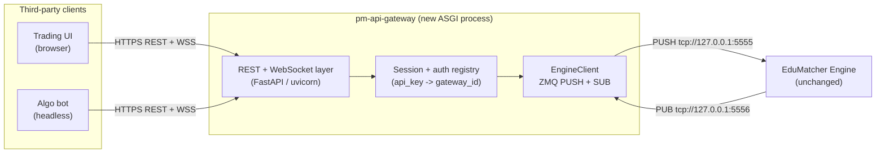

Version: 0.2.0

Date: 2026-06-22

Status: Draft Design Proposal


# EduMatcher API Gateway (`pm-api-gateway`) — Design Proposal

---

## 1. Purpose

This document specifies a new non-interactive gateway, `pm-api-gateway`, that
exposes the same order-entry and order-manipulation capabilities as the existing
interactive `pm-gateway`, but over a REST/JSON + WebSocket interface intended for
third-party software rather than human operators.

Target consumers:

- Web-based trading UIs (browser / JavaScript).
- Algorithmic trading bots and headless systems.

Design goal: make it as easy as possible for an external application to submit,
cancel, modify, and observe orders — with the same semantics a human gets when
typing ALF commands into `pm-gateway`.

---

## 2. Design Decision (settled)

`pm-api-gateway` is a **full REST API** whose request handlers translate JSON
payloads into the **same internal ZeroMQ engine messages** that `pm-gateway`
already produces (`order.new`, `order.cancel`, `order.amend`, `order.combo`,
`order.oco`, `quote.new`, …).

It is **not** a thin pass-through of raw ALF text. External clients never see the
`KEY=VALUE|KEY=VALUE` ALF wire format. They see resource-oriented JSON.

### Why full REST over an ALF text wrapper

| Concern | Full REST (chosen) | ALF text wrapper |
|---------|--------------------|------------------|
| Client ergonomics | Native JSON + HTTP verbs | Clients build ALF strings |
| Browser fit | Direct `fetch`/WebSocket | Awkward, needs ALF knowledge |
| Validation | Typed request models (Pydantic) | Re-parse ALF on the server |
| Documentation | OpenAPI / Swagger auto-generated | Hand-written ALF grammar |
| Coupling to ALF | None at the public surface | ALF leaks into the contract |

### Why reuse engine messages rather than re-implement

The ALF gateway's only real job is: parse text → build an engine message dict →
`PUSH` to the engine, and `SUB` to per-gateway event topics → render. The
matching logic lives entirely in the engine. `pm-api-gateway` therefore reuses
the **existing message builders** in `edumatcher.models.message` and the
**existing domain models** in `edumatcher.models.order` / `.combo`. There is no
duplicated matching or validation logic — only a new transport in front of the
same `make_*_msg()` calls that `pm-gateway` uses today.

### What does not change

- The engine. It still receives the identical ZMQ/JSON messages.
- Gateway authentication. The same `engine_config.yaml` allowlist is honoured.
- Order types, TIF values, SMP rules, tick conversion, and event semantics.

---

## 3. Architecture

### 3.1 Process topology

`pm-api-gateway` is a new long-running ASGI process. It holds exactly one pair
of engine sockets (mirroring `pm-gateway`), and fans many HTTP/WebSocket clients
in/out over those two sockets.



### 3.2 Engine wiring (identical to `pm-gateway`)

| Socket | Type | Address | Role |
|--------|------|---------|------|
| Engine inbound | `PUSH` (connect) | `tcp://127.0.0.1:5555` (`ENGINE_PULL_ADDR`) | Send order commands |
| Engine outbound | `SUB` (connect) | `tcp://127.0.0.1:5556` (`ENGINE_PUB_ADDR`) | Receive per-gateway events |

These constants already exist in `edumatcher.config`
(`ENGINE_PULL_ADDR`, `ENGINE_PUB_ADDR`). `--engine-host` support is inherited the
same way `pm-gateway` does it.

### 3.3 Multi-tenancy model

`pm-gateway` is single-tenant: one process = one `gateway_id`. `pm-api-gateway`
is multi-tenant: one process serves many clients, each mapped to a `gateway_id`
drawn from the engine allowlist.

- Each API credential (API key) maps to exactly one configured `gateway_id`.
- On first authenticated use of a `gateway_id`, the gateway sends
  `system.gateway_connect` and dynamically `setsockopt(SUBSCRIBE, ...)` for that
  gateway's event topics (see §7).
- Inbound engine events are demultiplexed by the `{GW_ID}` topic suffix and
  routed to the correct client session(s).

> One ZMQ identity per `gateway_id` is preserved, so the engine's existing
> "one connection per gateway" assumptions and audit trail remain intact.

---

## 4. Domain Model Exposed by the API

All values below mirror the existing enums in `edumatcher.models.order`.

| Concept | Values |
|---------|--------|
| `side` | `BUY`, `SELL` |
| `order_type` | `MARKET`, `LIMIT`, `STOP`, `STOP_LIMIT`, `FOK`, `ICEBERG`, `IOC`, `TRAILING_STOP` (plus composite `OCO`, `COMBO`) |
| `tif` | `DAY`, `GTC`, `ATO`, `ATC` |
| `smp_action` | `NONE`, `CANCEL_AGGRESSOR`, `CANCEL_RESTING`, `CANCEL_BOTH` |
| `status` (events) | `NEW`, `PARTIAL`, `FILLED`, `CANCELLED`, `REJECTED`, `EXPIRED` |

### Prices

Clients send **human prices** (e.g. `150.50`) as JSON numbers. The gateway
converts them to integer engine **ticks** via `to_ticks(price, symbol)` exactly
as `pm-gateway` does, before the message is pushed. Event prices are converted
back to display units with `from_ticks` before being returned to clients.

### Order identity

`pm-gateway` generates the order UUID **client-side** in `Order.create()` and
sends it in `order.new`. `pm-api-gateway` does the same, so `POST /orders` can
return the engine `order_id` **synchronously** in the HTTP response without
waiting for the async `order.ack` event.

---

## 5. REST API Reference

Base path: `/api/v1`. All request and response bodies are JSON. All endpoints
require authentication (§8) and resolve to a single `gateway_id`.

### 5.1 Endpoint summary

| Method | Path | Purpose | Engine message produced |
|--------|------|---------|--------------------------|
| `POST` | `/orders` | Submit a single order | `order.new` |
| `DELETE` | `/orders/{order_id}` | Cancel one order | `order.cancel` |
| `PATCH` | `/orders/{order_id}` | Amend price and/or qty | `order.amend` |
| `GET` | `/orders` | List this gateway's orders | `order.orders_request` |
| `GET` | `/orders/{order_id}` | Get one cached order | (local cache) |
| `POST` | `/oco` | Submit an OCO pair | `order.oco` |
| `DELETE` | `/oco/{oco_id}` | Cancel an OCO pair | `order.oco_cancel` |
| `POST` | `/combos` | Submit a multi-leg combo | `order.combo` |
| `DELETE` | `/combos/{combo_id}` | Cancel a combo + legs | `order.combo_cancel` |
| `POST` | `/quotes` | Submit a two-sided MM quote | `quote.new` |
| `DELETE` | `/quotes/{symbol}` | Cancel active quote for symbol | `quote.cancel` |
| `POST` | `/mass-cancel` | Bulk-cancel this gateway's resting orders + quotes (optionally per-symbol) | `risk.kill_switch` |
| `POST` | `/kill-switch` | Alias of `/mass-cancel` (risk/admin framing) | `risk.kill_switch` |
| `GET` | `/symbols` | List active instruments + meta | `system.symbols_request` |
| `GET` | `/session` | Current session state | `system.session_state_request` |
| `GET` | `/quotes/bootstrap` | Active quote bootstrap state (QBOOT) | `system.quote_bootstrap_request` |
| `GET` | `/quotes/legs` | MM quote legs + fill flags (QLEGS) | (session cache) |
| `GET` | `/positions` | Net position + P&L per symbol (POS) | (session cache) |
| `GET` | `/status` | Gateway/session summary (STATUS) | (session cache) |
| `GET` | `/events` (WS) | Live event stream | SUB fan-out (§7) |
| `GET` | `/healthz` | Liveness/readiness | (local) |

### 5.2 `POST /orders` — submit an order

Maps to `make_order_new_msg(order.to_dict())` after building an `Order` exactly
as `Gateway._send_new()` does.

**Request body**

```jsonc
{
  "symbol": "AAPL",          // required, string
  "side": "BUY",             // required, BUY | SELL
  "order_type": "LIMIT",     // required, see §4
  "quantity": 100,           // required, int > 0
  "tif": "DAY",              // optional, default DAY
  "price": 150.50,           // conditional (see rules)
  "stop_price": 148.00,      // conditional (STOP / STOP_LIMIT / TRAILING_STOP)
  "visible_qty": 100,        // conditional (ICEBERG; must be < quantity)
  "trail_offset": 0.25,      // conditional (TRAILING_STOP)
  "smp_action": "NONE",      // optional, default NONE
  "client_order_id": "ui-42" // optional, echoed back for correlation
}
```

**Conditional-requirement rules** (identical to `pm-gateway` validation):

| `order_type` | Required fields | Forbidden / ignored |
|--------------|-----------------|---------------------|
| `MARKET` | — | `price`, `stop_price` |
| `LIMIT` / `FOK` / `IOC` | `price` | `stop_price` |
| `STOP` | `stop_price` | `price` |
| `STOP_LIMIT` | `stop_price`, `price` | — |
| `ICEBERG` | `price`, `visible_qty` (`< quantity`) | — |
| `TRAILING_STOP` | `trail_offset` (`stop_price` optional, auto-initialised if omitted) | `price` |

**Response `202 Accepted`**

```jsonc
{
  "order_id": "ORD-7f3c…",   // server-generated UUID, usable immediately
  "client_order_id": "ui-42",
  "status": "PENDING",        // PENDING until order.ack arrives via WS
  "accepted": null            // resolved asynchronously; see /events
}
```

> Submission is acknowledged synchronously with `PENDING`; the authoritative
> accept/reject arrives as an `order.ack` event on the WebSocket stream. Clients
> that need a blocking result may use `?wait=ack` (see §6.3).

### 5.3 `DELETE /orders/{order_id}` — cancel

Maps to `make_order_cancel_msg(order_id, gateway_id)`.

**Response `202 Accepted`** — `{ "order_id": "...", "status": "PENDING_CANCEL" }`.
Confirmation arrives as `order.cancelled` on the stream.

### 5.4 `PATCH /orders/{order_id}` — amend

Maps to `make_order_amend_msg(order_id, gateway_id, price=?, qty=?)`. At least
one of `price`/`quantity` must be present.

```jsonc
{ "price": 151.00, "quantity": 200 }   // either or both
```

Priority semantics are unchanged from the engine: qty-decrease at same price
preserves priority; price change or qty increase resets priority. The response
echoes `priority_reset` once the `order.amended` event is correlated.

### 5.5 `POST /oco` — One-Cancels-Other pair

Maps to `make_oco_order_msg(payload)`. Mirrors `Gateway._send_oco()`.

```jsonc
{
  "oco_id": "tp-sl-1",       // required, client label
  "symbol": "AAPL",          // required
  "quantity": 100,           // required (both legs share qty)
  "tif": "DAY",
  "leg1": { "side": "SELL", "order_type": "LIMIT", "price": 152.00 },
  "leg2": { "side": "SELL", "order_type": "STOP",  "stop_price": 147.00 }
}
```

Engine payload produced: `{ oco_id, gateway_id, symbol, quantity, tif, leg1, leg2 }`
on topic `order.oco`. Leg `price`/`stop_price`/`trail_offset` are passed through
as display units and tick-converted by the engine-side OCO handler.

### 5.6 `POST /combos` — multi-leg combo

Maps to `make_combo_order_msg(combo.to_dict())`. Mirrors `Gateway._send_combo()`.

```jsonc
{
  "combo_id": "spread-1",
  "combo_type": "AON",
  "tif": "DAY",
  "smp_action": "NONE",
  "legs": [
    { "symbol": "AAPL", "side": "BUY",  "order_type": "LIMIT", "quantity": 100, "price": 150.00 },
    { "symbol": "MSFT", "side": "SELL", "order_type": "LIMIT", "quantity": 100, "price": 410.00 }
  ]
}
```

Constraints (enforced before building `ComboOrder`): 2–10 legs; each leg requires
`symbol`, `side`, `quantity`; `price` tick-converted per leg symbol.

### 5.7 `POST /quotes` — market-maker quote

Maps to `make_quote_new_msg(payload)`. Mirrors `Gateway._send_quote()`.

```jsonc
{
  "symbol": "AAPL",
  "bid_price": 150.00, "bid_qty": 500,
  "ask_price": 150.10, "ask_qty": 500,
  "tif": "DAY",
  "quote_id": "mm-aapl-1"   // optional
}
```

Validation: `bid_qty > 0`, `ask_qty > 0`, `bid_price < ask_price`.

### 5.8 `POST /mass-cancel` — bulk cancel

Cancels **all** resting orders and active quotes for the session's `gateway_id`,
optionally scoped to a single `symbol`. This is the programmatic equivalent of
the operator kill-switch; both ride the engine `risk.kill_switch` path (the
codebase already exposes `mass_cancel()` as an alias of `kill_switch()`). The
gateway is **not** halted — fresh orders may be submitted immediately after the
ack.

Maps to `make_kill_switch_msg(gateway_id, symbol)`. Mirrors
`Gateway` kill-switch handling and `EngineClient.mass_cancel()`.

**Request body** (optional)

```jsonc
{ "symbol": "AAPL" }   // omit or null to cancel across all symbols
```

Unlike the order-write endpoints, this call is **synchronous**: it awaits
`risk.kill_switch_ack.{GW_ID}` and returns the cancellation counts. Order- and
quote-level `order.cancelled` / `quote.status` events for each affected resource
still arrive on the WebSocket stream.

**Response `200 OK`**

```jsonc
{
  "accepted": true,
  "scope": "AAPL",         // or "ALL" when no symbol is given
  "cancelled_orders": 12,
  "cancelled_quotes": 1
}
```

If the gateway is not authorised, returns `403` with the engine `reason`. If the
ack does not arrive within the timeout (default 3 s), returns `503`.

> `/kill-switch` is retained as an exact alias for clients that prefer the
> risk/admin name; it produces the identical `risk.kill_switch` message.

### 5.9 Read endpoints

The ALF gateway's read-only commands all map to `GET` endpoints. They fall into
two families: **engine queries** (request/await-reply over ZMQ) and
**session-cache reads** (served from per-`gateway_id` state the gateway derives
from the event stream — see §7.4).

#### Engine-query endpoints (request → await reply)

- `GET /orders` (`ORDERS`) → sends `order.orders_request`, awaits
  `order.orders.{GW_ID}`, returns the `orders` array (display-converted prices).
- `GET /symbols` (`SYMBOLS`) → sends `system.symbols_request`, awaits
  `system.symbols.{GW_ID}`, returns `symbols` + `symbol_meta` (tick size, MM
  obligation flags, max spread, min qty).
- `GET /session` → sends `system.session_state_request`, awaits
  `system.session_status.{GW_ID}`, returns `{ state, sessions_enabled }`.
- `GET /quotes/bootstrap` (`QBOOT`) → sends `system.quote_bootstrap_request`
  (optional `?symbol=`), awaits `system.quote_bootstrap.{GW_ID}`, returns the
  active two-sided quote state:

  ```jsonc
  {
    "quotes": [
      {
        "symbol": "AAPL", "quote_id": "mm-aapl-1", "state": "ACTIVE",
        "bid_price": 150.00, "ask_price": 150.10,
        "bid_remaining_qty": 500, "ask_remaining_qty": 500
      }
    ]
  }
  ```

These follow a request/await-reply pattern bounded by a configurable timeout
(default 3 s, mirroring the auth handshake window); on timeout they return `503`.

#### Session-cache endpoints (no engine round-trip)

Served instantly from the caches the gateway maintains per `gateway_id`. These
mirror the equivalent `pm-gateway` commands, which render from the same
locally-derived state.

- `GET /quotes/legs` (`QLEGS`) — MM quote legs with fill flags. Query params
  `?symbol=` and `?show=ACTIVE|RECENT|ALL` (default `ACTIVE`). Each leg:

  ```jsonc
  {
    "order_id": "ORD-…", "quote_id": "mm-aapl-1", "symbol": "AAPL",
    "leg_side": "BID", "qty": 500, "remaining": 450, "filled": 50,
    "filled_flag": true, "status": "PARTIAL", "quote_status": "ACTIVE",
    "last_event_time": "2026-06-22T10:15:03.221Z"
  }
  ```

- `GET /positions` (`POS`) — net position and P&L per symbol, derived from
  `order.fill` events; unrealised P&L uses the last trade price from the
  `trade.executed` feed:

  ```jsonc
  {
    "positions": [
      {
        "symbol": "AAPL", "net_qty": 50, "avg_cost": 150.20,
        "last_price": 150.50, "unrealized_pnl": 15.00, "realized_pnl": 0.00
      }
    ]
  }
  ```

- `GET /status` (`STATUS`) — gateway/session summary:

  ```jsonc
  {
    "gateway_id": "GW01", "authenticated": true,
    "known_symbols": ["AAPL", "MSFT"],
    "cached_orders": 8, "active_orders": 3,
    "cached_quote_legs": 2, "active_quote_legs": 1,
    "position_symbols": ["AAPL"],
    "order_status_counts": { "NEW": 2, "PARTIAL": 1, "FILLED": 5 }
  }
  ```

### 5.10 Error model

| HTTP status | Condition |
|-------------|-----------|
| `400 Bad Request` | Schema/validation failure (missing conditional field, bad enum, `bid >= ask`, etc.) |
| `401 Unauthorized` | Missing/invalid API key |
| `403 Forbidden` | API key valid but its `gateway_id` rejected by the engine allowlist |
| `404 Not Found` | Unknown `order_id`/`combo_id`/`oco_id` in local cache |
| `409 Conflict` | Duplicate `client_order_id` within session |
| `503 Service Unavailable` | Engine reply timeout on a read/await endpoint |

Error body: `{ "error": { "code": "VALIDATION", "message": "...", "field": "price" } }`.

---

## 6. REST → Engine Message Mapping (wiring detail)

### 6.1 Mapping table

| REST call | Builder (`edumatcher.models.message`) | Topic (frame 0) | Payload (frame 1) |
|-----------|----------------------------------------|-----------------|-------------------|
| `POST /orders` | `make_order_new_msg` | `order.new` | `Order.to_dict()` |
| `DELETE /orders/{id}` | `make_order_cancel_msg` | `order.cancel` | `{order_id, gateway_id}` |
| `PATCH /orders/{id}` | `make_order_amend_msg` | `order.amend` | `{order_id, gateway_id, price?, qty?}` |
| `GET /orders` | `make_orders_request_msg` | `order.orders_request` | `{gateway_id}` |
| `POST /oco` | `make_oco_order_msg` | `order.oco` | `{oco_id, gateway_id, symbol, quantity, tif, leg1, leg2}` |
| `DELETE /oco/{id}` | `make_oco_cancel_msg` | `order.oco_cancel` | `{oco_id, gateway_id}` |
| `POST /combos` | `make_combo_order_msg` | `order.combo` | `ComboOrder.to_dict()` |
| `DELETE /combos/{id}` | `make_combo_cancel_msg` | `order.combo_cancel` | `{combo_id, gateway_id}` |
| `POST /quotes` | `make_quote_new_msg` | `quote.new` | `{gateway_id, symbol, bid_price, bid_qty, ask_price, ask_qty, tif, quote_id?}` |
| `DELETE /quotes/{sym}` | `make_quote_cancel_msg` | `quote.cancel` | `{gateway_id, symbol}` |
| `POST /mass-cancel` | `make_kill_switch_msg` | `risk.kill_switch` | `{gateway_id, symbol?}` |
| `POST /kill-switch` | `make_kill_switch_msg` | `risk.kill_switch` | `{gateway_id, symbol?}` |
| `GET /symbols` | `make_symbols_request_msg` | `system.symbols_request` | `{gateway_id}` |
| `GET /session` | `make_session_state_request_msg` | `system.session_state_request` | `{gateway_id}` |
| `GET /quotes/bootstrap` | `make_quote_bootstrap_request_msg` | `system.quote_bootstrap_request` | `{gateway_id, symbol}` |
| `GET /quotes/legs` | — (session cache) | — | served from quote-leg cache |
| `GET /positions` | — (session cache) | — | served from position cache |
| `GET /status` | — (session cache) | — | served from order/quote/position caches |

### 6.2 `order.new` payload shape

`Order.to_dict()` is sent verbatim. Fields a client influences are noted; the
rest are defaults set by `Order.create()`:

```jsonc
{
  "id": "ORD-…",            // server-generated UUID
  "symbol": "AAPL",          // <- request.symbol
  "side": "BUY",             // <- request.side
  "order_type": "LIMIT",     // <- request.order_type
  "tif": "DAY",              // <- request.tif
  "quantity": 100,           // <- request.quantity
  "remaining_qty": 100,
  "gateway_id": "GW01",      // <- resolved from API key
  "price": 1505000,          // <- to_ticks(request.price, symbol)
  "stop_price": null,        // <- to_ticks(request.stop_price, symbol)
  "visible_qty": null,       // <- request.visible_qty
  "displayed_qty": null,
  "smp_action": "NONE",      // <- request.smp_action
  "trail_offset": null,      // <- to_ticks(request.trail_offset, symbol)
  "oco_group_id": null,
  "combo_parent_id": null,
  "leg_index": null,
  "origin": "ORDER",
  "quote_id": null,
  "timestamp": 0,
  "status": "NEW"
}
```

### 6.3 Synchronous vs. asynchronous responses

The engine is fire-and-forget over `PUSH`; results come back as PUB events.
Two response modes are offered per write endpoint:

- **Default (async):** respond `202` immediately with the client-generated id
  and a `PENDING` status. Authoritative outcome is delivered on `/events`.
- **`?wait=ack` (sync):** the handler registers a one-shot future keyed by
  `order_id` and blocks (up to a timeout) until the matching `order.ack`
  (or `combo.ack` / `oco.ack`) event is demultiplexed, then returns the resolved
  status. This gives REST-native clients a simple blocking call without a
  WebSocket.

---

## 7. Event Streaming (Engine PUB → WebSocket)

### 7.1 Subscription set per `gateway_id`

When a `gateway_id` becomes active, the gateway subscribes to the same topics
`pm-gateway` uses, suffixed with the gateway id:

```
order.ack.{GW}          order.fill.{GW}         order.amended.{GW}
order.cancelled.{GW}    order.expired.{GW}      order.orders.{GW}
combo.ack.{GW}          combo.status.{GW}
oco.ack.{GW}            oco.cancelled.{GW}
quote.ack.{GW}          quote.status.{GW}
risk.kill_switch_ack.{GW}
system.symbols.{GW}     system.quote_bootstrap.{GW}
system.session_status.{GW}   system.gateway_auth.{GW}
trade.executed          (global feed, filtered to the client's symbols)
```

### 7.2 PUB topic → WebSocket event mapping

| Engine topic | WS event `type` | Notes |
|--------------|-----------------|-------|
| `order.ack.{GW}` | `order.ack` | Resolves `?wait=ack` futures |
| `order.fill.{GW}` | `order.fill` | `fill_qty`, `fill_price` (display), `remaining_qty`, `status` |
| `order.amended.{GW}` | `order.amended` | includes `priority_reset` |
| `order.cancelled.{GW}` | `order.cancelled` | |
| `order.expired.{GW}` | `order.expired` | DAY expiry at session end |
| `combo.ack` / `combo.status` | `combo.ack` / `combo.status` | |
| `oco.ack` / `oco.cancelled` | `oco.ack` / `oco.cancelled` | |
| `quote.ack` / `quote.status` | `quote.ack` / `quote.status` | |
| `risk.kill_switch_ack.{GW}` | `mass_cancel.ack` | resolves `/mass-cancel` and `/kill-switch` waits; carries `accepted`, `cancelled_orders`, `cancelled_quotes` |
| `trade.executed` | `trade` | filtered to the session's symbols |

### 7.3 WebSocket envelope

```jsonc
{
  "type": "order.fill",
  "ts": "2026-06-22T10:15:03.221Z",
  "gateway_id": "GW01",
  "data": {
    "order_id": "ORD-…",
    "fill_qty": 50,
    "fill_price": 150.50,      // converted from ticks
    "remaining_qty": 50,
    "status": "PARTIAL"
  }
}
```

Transport choice (WebSocket vs. SSE vs. long-poll) is an open question (§10), but
WebSocket is the recommended default for the browser + bot mix.

### 7.4 Derived session caches

While fanning events out to WebSocket clients, the `EngineClient` also folds them
into per-`gateway_id` caches — the same state `pm-gateway` keeps per process.
These back the §5.9 session-cache endpoints (`/quotes/legs`, `/positions`,
`/status`) with no engine round-trip:

| Cache | Fed by | Serves |
|-------|--------|--------|
| Order cache (`order_id → state`) | `order.ack`, `order.fill`, `order.amended`, `order.cancelled`, `order.expired` | `/orders/{id}`, `/status` counts |
| Quote-leg cache (`order_id → leg`) | `quote.ack`, `quote.status`, `order.fill` (quote-origin) | `/quotes/legs` |
| Position cache (`symbol → net_qty/avg_cost/realized_pnl`) | `order.fill` | `/positions`, `/status` |
| Last-price map (`symbol → price`) | `trade.executed` | unrealised P&L in `/positions` |
| Known-symbols list | `system.symbols.{GW}` | `/status` |

Caches are scoped to a `gateway_id` and shared across all client sessions
authenticated as that gateway, so concurrent UIs and bots see a consistent view.

---

## 8. Authentication & Security (DMZ-facing)

### 8.1 Client authentication

- Clients present an **API key** (e.g. `Authorization: Bearer <key>`).
- The gateway maps `api_key -> gateway_id` via its own credential store
  (separate from `engine_config.yaml`).
- TLS is terminated in front of the gateway (reverse proxy or uvicorn TLS).

### 8.2 Engine-side authorisation (unchanged)

The first time a `gateway_id` is used, the gateway performs the existing
handshake:

```
PUSH system.gateway_connect {gateway_id}
SUB  system.gateway_auth.{gateway_id} {accepted, reason, description}
```

If `accepted=false`, the API returns `403` with the engine's `reason`. The
engine's allowlist in `engine_config.yaml` remains the single source of truth
for which gateway IDs may trade.

### 8.3 Additional DMZ controls (new, gateway-local)

- Per-key **rate limiting** on write endpoints.
- **Request size limits** and strict schema validation (reject unknown fields).
- **Audit logging** of every accepted command with `api_key` id, `gateway_id`,
  `order_id`, and source IP.
- No engine internals (raw ZMQ addresses, tick internals) are exposed in errors.

---

## 9. Code Structure

New package `src/edumatcher/api_gateway/`, console entry point `pm-api-gateway`
(registered in `pyproject.toml` `[tool.poetry.scripts]`).

```
src/edumatcher/api_gateway/
  __init__.py
  main.py            # ASGI app factory + uvicorn launcher, CLI args
  engine_client.py   # EngineClient: ZMQ PUSH/SUB, demux, await-reply futures
  sessions.py        # SessionRegistry: api_key -> gateway_id, auth handshake
  schemas.py         # Pydantic request/response models (§5)
  translate.py       # JSON model -> engine message dict (reuses message.py)
  caches.py          # SessionCaches: orders, quote legs, positions, last prices (§7.4)
  routers/
    orders.py        # POST/DELETE/PATCH/GET /orders
    oco.py           # /oco
    combos.py        # /combos
    quotes.py        # /quotes, /quotes/bootstrap (QBOOT), /quotes/legs (QLEGS)
    risk.py          # /mass-cancel, /kill-switch
    reference.py     # /symbols, /session, /positions, /status, /healthz
    events.py        # GET /events WebSocket endpoint
  events.py          # PUB topic -> WS envelope mapping + per-session fan-out
```

### 9.1 `EngineClient` (the wiring core)

Owns the two engine sockets and a background SUB reader. This is the single point
that reuses the existing `make_*_msg` builders and `decode()`.

```python
class EngineClient:
    def __init__(self, pull_addr: str, pub_addr: str) -> None:
        self._push = make_pusher(pull_addr)          # reuse messaging.bus
        self._sub = make_subscriber(pub_addr)         # subscriptions added lazily
        self._subscribed_gws: set[str] = set()
        self._pending: dict[tuple[str, str], asyncio.Future] = {}  # (kind, id)->fut
        self._sinks: dict[str, set[EventSink]] = {}   # gateway_id -> ws sinks

    async def authenticate(self, gateway_id: str) -> tuple[bool, str]:
        self._ensure_subscribed(gateway_id)
        self._push.send_multipart(make_gateway_connect_msg(gateway_id))
        return await self._await_event(("gateway_auth", gateway_id), timeout=3.0)

    def send_new_order(self, order: Order) -> None:
        self._push.send_multipart(make_order_new_msg(order.to_dict()))

    def _ensure_subscribed(self, gw: str) -> None:
        if gw in self._subscribed_gws:
            return
        for tmpl in _GW_EVENT_TOPICS:           # the list in §7.1
            self._sub.setsockopt_string(zmq.SUBSCRIBE, tmpl.format(GW=gw))
        self._subscribed_gws.add(gw)

    def _on_event(self, topic: str, payload: dict) -> None:
        # 1) resolve any await-reply future keyed by (kind, id)
        # 2) convert ticks->display, wrap in WS envelope
        # 3) fan out to all EventSinks for this gateway_id
        ...
```

The SUB reader runs in a thread (as in `pm-gateway._listen`) and hands decoded
events to the asyncio loop via `loop.call_soon_threadsafe`.

### 9.2 `translate.py` (no business logic, pure mapping)

```python
def build_order(req: NewOrderRequest, gateway_id: str) -> Order:
    return Order.create(
        symbol=req.symbol,
        side=Side(req.side),
        order_type=OrderType(req.order_type),
        quantity=req.quantity,
        gateway_id=gateway_id,
        tif=TIF(req.tif),
        price=to_ticks(req.price, req.symbol) if req.price is not None else None,
        stop_price=to_ticks(req.stop_price, req.symbol) if req.stop_price else None,
        visible_qty=req.visible_qty,
        smp_action=SmpAction(req.smp_action),
        trail_offset=to_ticks(req.trail_offset, req.symbol) if req.trail_offset else None,
    )
```

This is intentionally a near-copy of `Gateway._send_new()`'s construction step —
keeping a single mental model and guaranteeing parity. A shared helper extracted
from `pm-gateway` could remove even this duplication; see §10.

### 9.3 Router handler shape

```python
@router.post("/orders", status_code=202)
async def create_order(req: NewOrderRequest, ctx: Session = Depends(auth)):
    validate_conditional_fields(req)            # mirrors pm-gateway checks -> 400
    order = build_order(req, ctx.gateway_id)
    ctx.engine.send_new_order(order)
    if req_wait_ack:
        result = await ctx.engine.await_ack("order", order.id, timeout=3.0)
        return OrderAccepted.from_ack(order, result)
    return OrderAccepted.pending(order, req.client_order_id)
```

---

## 10. Open Questions

1. **Event transport:** WebSocket (recommended) vs. SSE vs. long-poll — confirm
   the browser/bot mix can standardise on WebSocket.
2. **Shared construction helper:** extract `build_order` / leg parsing into a
   module shared by both `pm-gateway` and `pm-api-gateway` to eliminate the last
   bit of duplication, or keep them independent for isolation?
3. **Credential store:** where does `api_key -> gateway_id` live (config file,
   env, external secret store)? Should one API key be allowed to act as multiple
   gateway IDs?
4. **History depth:** is `GET /orders` (current engine snapshot) sufficient, or
   is durable historical order/fill query (beyond the engine's live state)
   required?
5. **Amend modelling:** keep explicit `PATCH` (price/qty) as designed, or add a
   cancel-replace convenience endpoint?
6. **Rate limits & quotas:** concrete per-key limits for the DMZ deployment.

---

## 11. Next Step

With the transport decision settled, the next step is to lock the §5 request
schemas and the §7 event envelope into Pydantic/OpenAPI definitions, then
scaffold `src/edumatcher/api_gateway/` with `EngineClient` and the `/orders`
router as the first vertical slice (submit → ack → fill over WebSocket).
