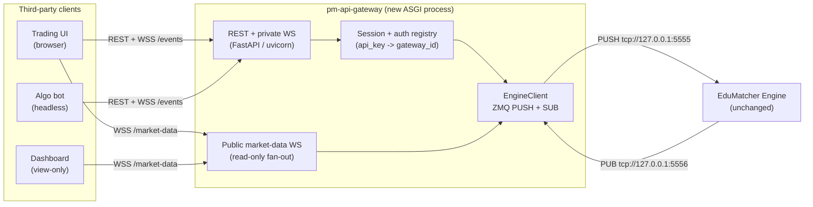
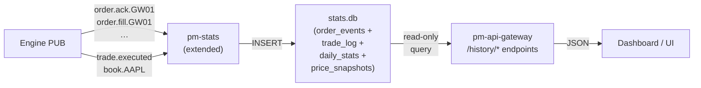

Version: 0.2.0

Date: 2026-06-22

Status: Draft Design Proposal


# EduMatcher API Gateway (`pm-api-gateway`) — Design Proposal

---

## Purpose

This document specifies a new non-interactive gateway, `pm-api-gateway`, that
exposes the same order-entry and order-manipulation capabilities as the existing
interactive `pm-gateway`, but over a REST/JSON + WebSocket interface intended for
third-party software rather than human operators.

Target consumers:

- Web-based trading UIs (browser / JavaScript).
- Algorithmic trading bots and headless systems.

Design goal: make it as easy as possible for an external application to submit,
cancel, modify, and observe orders — with the same semantics a human gets when
typing ALF commands into `pm-gateway`.

---

##  Design Decision (settled)

`pm-api-gateway` is a **full REST API** whose request handlers translate JSON
payloads into the **same internal ZeroMQ engine messages** that `pm-gateway`
already produces (`order.new`, `order.cancel`, `order.amend`, `order.combo`,
`order.oco`, `quote.new`, …).

It is **not** a thin pass-through of raw ALF text. External clients never see the
`KEY=VALUE|KEY=VALUE` ALF wire format. They see resource-oriented JSON.

### Why full REST over an ALF text wrapper

| Concern | Full REST (chosen) | ALF text wrapper |
|---------|--------------------|------------------|
| Client ergonomics | Native JSON + HTTP verbs | Clients build ALF strings |
| Browser fit | Direct `fetch`/WebSocket | Awkward, needs ALF knowledge |
| Validation | Typed request models (Pydantic) | Re-parse ALF on the server |
| Documentation | OpenAPI / Swagger auto-generated | Hand-written ALF grammar |
| Coupling to ALF | None at the public surface | ALF leaks into the contract |

### Why reuse engine messages rather than re-implement

The ALF gateway's only real job is: parse text → build an engine message dict →
`PUSH` to the engine, and `SUB` to per-gateway event topics → render. The
matching logic lives entirely in the engine. `pm-api-gateway` therefore reuses
the **existing message builders** in `edumatcher.models.message` and the
**existing domain models** in `edumatcher.models.order` / `.combo`. There is no
duplicated matching or validation logic — only a new transport in front of the
same `make_*_msg()` calls that `pm-gateway` uses today.

### What does not change

- The engine. It still receives the identical ZMQ/JSON messages.
- Gateway authentication. The same `engine_config.yaml` allowlist is honoured.
- Order types, TIF values, SMP rules, tick conversion, and event semantics.

---

##  Architecture

###  Process topology

`pm-api-gateway` is a new long-running ASGI process. It holds exactly one pair
of engine sockets (mirroring `pm-gateway`), and fans many HTTP/WebSocket clients
in/out over those two sockets.



###  Engine wiring (identical to `pm-gateway`)

| Socket | Type | Address | Role |
|--------|------|---------|------|
| Engine inbound | `PUSH` (connect) | `tcp://127.0.0.1:5555` (`ENGINE_PULL_ADDR`) | Send order commands |
| Engine outbound | `SUB` (connect) | `tcp://127.0.0.1:5556` (`ENGINE_PUB_ADDR`) | Receive per-gateway events |

These constants already exist in `edumatcher.config`
(`ENGINE_PULL_ADDR`, `ENGINE_PUB_ADDR`). `--engine-host` support is inherited the
same way `pm-gateway` does it.

###  Multi-tenancy model

`pm-gateway` is single-tenant: one process = one `gateway_id`. `pm-api-gateway`
is multi-tenant: one process serves many clients, each mapped to a `gateway_id`
drawn from the engine allowlist.

- Each API credential (API key) maps to exactly one configured `gateway_id`.
- On first authenticated use of a `gateway_id`, the gateway sends
  `system.gateway_connect` and dynamically `setsockopt(SUBSCRIBE, ...)` for that
  gateway's event topics (see §7).
- Inbound engine events are demultiplexed by the `{GW_ID}` topic suffix and
  routed to the correct client session(s).

> One ZMQ identity per `gateway_id` is preserved, so the engine's existing
> "one connection per gateway" assumptions and audit trail remain intact.

---

##  Domain Model Exposed by the API

All values below mirror the existing enums in `edumatcher.models.order`.

| Concept | Values |
|---------|--------|
| `side` | `BUY`, `SELL` |
| `order_type` | `MARKET`, `LIMIT`, `STOP`, `STOP_LIMIT`, `FOK`, `ICEBERG`, `IOC`, `TRAILING_STOP` (plus composite `OCO`, `COMBO`) |
| `tif` | `DAY`, `GTC`, `ATO`, `ATC` |
| `smp_action` | `NONE`, `CANCEL_AGGRESSOR`, `CANCEL_RESTING`, `CANCEL_BOTH` |
| `status` (events) | `NEW`, `PARTIAL`, `FILLED`, `CANCELLED`, `REJECTED`, `EXPIRED` |

### Prices

Clients send **human prices** (e.g. `150.50`) as JSON numbers. The gateway
converts them to integer engine **ticks** via `to_ticks(price, symbol)` exactly
as `pm-gateway` does, before the message is pushed. Event prices are converted
back to display units with `from_ticks` before being returned to clients.

### Order identity

`pm-gateway` generates the order UUID **client-side** in `Order.create()` and
sends it in `order.new`. `pm-api-gateway` does the same, so `POST /orders` can
return the engine `order_id` **synchronously** in the HTTP response without
waiting for the async `order.ack` event.

---

##  REST API Reference

Base path: `/api/v1`. All request and response bodies are JSON. All endpoints
require authentication (§8) and resolve to a single `gateway_id`.

###  Endpoint summary

| Method | Path | Purpose | Engine message produced |
|--------|------|---------|--------------------------|
| `POST` | `/orders` | Submit a single order | `order.new` |
| `DELETE` | `/orders/{order_id}` | Cancel one order | `order.cancel` |
| `PATCH` | `/orders/{order_id}` | Amend price and/or qty | `order.amend` |
| `POST` | `/orders/{order_id}/replace` | Atomic cancel-replace | `order.cancel` + `order.new` |
| `GET` | `/orders` | List this gateway's orders | `order.orders_request` |
| `GET` | `/orders/{order_id}` | Get one cached order | (local cache) |
| `POST` | `/oco` | Submit an OCO pair | `order.oco` |
| `DELETE` | `/oco/{oco_id}` | Cancel an OCO pair | `order.oco_cancel` |
| `POST` | `/combos` | Submit a multi-leg combo | `order.combo` |
| `DELETE` | `/combos/{combo_id}` | Cancel a combo + legs | `order.combo_cancel` |
| `POST` | `/quotes` | Submit a two-sided MM quote | `quote.new` |
| `DELETE` | `/quotes/{symbol}` | Cancel active quote for symbol | `quote.cancel` |
| `POST` | `/mass-cancel` | Bulk-cancel this gateway's resting orders + quotes (optionally per-symbol) | `risk.kill_switch` |
| `POST` | `/kill-switch` | Alias of `/mass-cancel` (risk/admin framing) | `risk.kill_switch` |
| `GET` | `/symbols` | List active instruments + meta | `system.symbols_request` |
| `GET` | `/session` | Current session state | `system.session_state_request` |
| `GET` | `/quotes/bootstrap` | Active quote bootstrap state (QBOOT) | `system.quote_bootstrap_request` |
| `GET` | `/quotes/legs` | MM quote legs + fill flags (QLEGS) | (session cache) |
| `GET` | `/positions` | Net position + P&L per symbol (POS) | (session cache) |
| `GET` | `/status` | Gateway/session summary (STATUS) | (session cache) |
| `GET` | `/events` (WS) | Live private event stream (per gateway) | SUB fan-out (§7.1–7.4) |
| `GET` | `/market-data` (WS) | Live public market data stream | SUB fan-out (§7.5–7.6) |
| `GET` | `/history/orders` | Historical order events (filtered) | `stats.db` query (§12) |
| `GET` | `/history/orders/{order_id}` | Full lifecycle of one order | `stats.db` query (§12) |
| `GET` | `/history/fills` | Historical fills (filtered) | `stats.db` query (§12) |
| `GET` | `/history/trades` | Historical trade log | `stats.db` query (§12) |
| `GET` | `/history/daily` | Daily OHLCV statistics | `stats.db` query (§12) |
| `GET` | `/healthz` | Liveness/readiness | (local) |

###  `POST /orders` — submit an order

Maps to `make_order_new_msg(order.to_dict())` after building an `Order` exactly
as `Gateway._send_new()` does.

**Request body**

```jsonc
{
  "symbol": "AAPL",          // required, string
  "side": "BUY",             // required, BUY | SELL
  "order_type": "LIMIT",     // required, see §4
  "quantity": 100,           // required, int > 0
  "tif": "DAY",              // optional, default DAY
  "price": 150.50,           // conditional (see rules)
  "stop_price": 148.00,      // conditional (STOP / STOP_LIMIT / TRAILING_STOP)
  "visible_qty": 100,        // conditional (ICEBERG; must be < quantity)
  "trail_offset": 0.25,      // conditional (TRAILING_STOP)
  "smp_action": "NONE",      // optional, default NONE
  "client_order_id": "ui-42" // optional, echoed back for correlation
}
```

**Conditional-requirement rules** (identical to `pm-gateway` validation):

| `order_type` | Required fields | Forbidden / ignored |
|--------------|-----------------|---------------------|
| `MARKET` | — | `price`, `stop_price` |
| `LIMIT` / `FOK` / `IOC` | `price` | `stop_price` |
| `STOP` | `stop_price` | `price` |
| `STOP_LIMIT` | `stop_price`, `price` | — |
| `ICEBERG` | `price`, `visible_qty` (`< quantity`) | — |
| `TRAILING_STOP` | `trail_offset` (`stop_price` optional, auto-initialised if omitted) | `price` |

**Response `202 Accepted`**

```jsonc
{
  "order_id": "ORD-7f3c…",   // server-generated UUID, usable immediately
  "client_order_id": "ui-42",
  "status": "PENDING",        // PENDING until order.ack arrives via WS
  "accepted": null            // resolved asynchronously; see /events
}
```

> Submission is acknowledged synchronously with `PENDING`; the authoritative
> accept/reject arrives as an `order.ack` event on the WebSocket stream. Clients
> that need a blocking result may use `?wait=ack` (see §6.3).

###  `DELETE /orders/{order_id}` — cancel

Maps to `make_order_cancel_msg(order_id, gateway_id)`.

**Response `202 Accepted`** — `{ "order_id": "...", "status": "PENDING_CANCEL" }`.
Confirmation arrives as `order.cancelled` on the stream.

###  `PATCH /orders/{order_id}` — amend

Maps to `make_order_amend_msg(order_id, gateway_id, price=?, qty=?)`. At least
one of `price`/`quantity` must be present.

```jsonc
{ "price": 151.00, "quantity": 200 }   // either or both
```

Priority semantics are unchanged from the engine: qty-decrease at same price
preserves priority; price change or qty increase resets priority. The response
echoes `priority_reset` once the `order.amended` event is correlated.

### a `POST /orders/{order_id}/replace` — cancel-replace

Atomically cancels the existing order and submits a replacement. The gateway
awaits `order.cancelled` for the original before sending `order.new` for the
replacement, ensuring no gap where both orders could be live. If the cancel
fails (order already filled or already cancelled), the replacement is not
submitted and the endpoint returns the failure reason.

**Request body** — same schema as `POST /orders` (§5.2), minus `symbol` (carried
from the original order).

```jsonc
{
  "side": "BUY",
  "order_type": "LIMIT",
  "quantity": 200,
  "price": 151.00,
  "tif": "DAY"
}
```

**Response `202 Accepted`**

```jsonc
{
  "cancelled_order_id": "ORD-7f3c…",
  "replacement_order_id": "ORD-a1b2…",
  "status": "PENDING"
}
```

Both the `order.cancelled` (original) and `order.ack` (replacement) events
arrive on the `/events` WebSocket. Clients that need a blocking result may use
`?wait=ack` as with `POST /orders`.

###  `POST /oco` — One-Cancels-Other pair

Maps to `make_oco_order_msg(payload)`. Mirrors `Gateway._send_oco()`.

```jsonc
{
  "oco_id": "tp-sl-1",       // required, client label
  "symbol": "AAPL",          // required
  "quantity": 100,           // required (both legs share qty)
  "tif": "DAY",
  "leg1": { "side": "SELL", "order_type": "LIMIT", "price": 152.00 },
  "leg2": { "side": "SELL", "order_type": "STOP",  "stop_price": 147.00 }
}
```

Engine payload produced: `{ oco_id, gateway_id, symbol, quantity, tif, leg1, leg2 }`
on topic `order.oco`. Leg `price`/`stop_price`/`trail_offset` are passed through
as display units and tick-converted by the engine-side OCO handler.

###  `POST /combos` — multi-leg combo

Maps to `make_combo_order_msg(combo.to_dict())`. Mirrors `Gateway._send_combo()`.

```jsonc
{
  "combo_id": "spread-1",
  "combo_type": "AON",
  "tif": "DAY",
  "smp_action": "NONE",
  "legs": [
    { "symbol": "AAPL", "side": "BUY",  "order_type": "LIMIT", "quantity": 100, "price": 150.00 },
    { "symbol": "MSFT", "side": "SELL", "order_type": "LIMIT", "quantity": 100, "price": 410.00 }
  ]
}
```

Constraints (enforced before building `ComboOrder`): 2–10 legs; each leg requires
`symbol`, `side`, `quantity`; `price` tick-converted per leg symbol.

###  `POST /quotes` — market-maker quote

Maps to `make_quote_new_msg(payload)`. Mirrors `Gateway._send_quote()`.

```jsonc
{
  "symbol": "AAPL",
  "bid_price": 150.00, "bid_qty": 500,
  "ask_price": 150.10, "ask_qty": 500,
  "tif": "DAY",
  "quote_id": "mm-aapl-1"   // optional
}
```

Validation: `bid_qty > 0`, `ask_qty > 0`, `bid_price < ask_price`.

###  `POST /mass-cancel` — bulk cancel

Cancels **all** resting orders and active quotes for the session's `gateway_id`,
optionally scoped to a single `symbol`. This is the programmatic equivalent of
the operator kill-switch; both ride the engine `risk.kill_switch` path (the
codebase already exposes `mass_cancel()` as an alias of `kill_switch()`). The
gateway is **not** halted — fresh orders may be submitted immediately after the
ack.

Maps to `make_kill_switch_msg(gateway_id, symbol)`. Mirrors
`Gateway` kill-switch handling and `EngineClient.mass_cancel()`.

**Request body** (optional)

```jsonc
{ "symbol": "AAPL" }   // omit or null to cancel across all symbols
```

Unlike the order-write endpoints, this call is **synchronous**: it awaits
`risk.kill_switch_ack.{GW_ID}` and returns the cancellation counts. Order- and
quote-level `order.cancelled` / `quote.status` events for each affected resource
still arrive on the WebSocket stream.

**Response `200 OK`**

```jsonc
{
  "accepted": true,
  "scope": "AAPL",         // or "ALL" when no symbol is given
  "cancelled_orders": 12,
  "cancelled_quotes": 1
}
```

If the gateway is not authorised, returns `403` with the engine `reason`. If the
ack does not arrive within the timeout (default 3 s), returns `503`.

> `/kill-switch` is retained as an exact alias for clients that prefer the
> risk/admin name; it produces the identical `risk.kill_switch` message.

###  Read endpoints

The ALF gateway's read-only commands all map to `GET` endpoints. They fall into
two families: **engine queries** (request/await-reply over ZMQ) and
**session-cache reads** (served from per-`gateway_id` state the gateway derives
from the event stream — see §7.4).

#### Engine-query endpoints (request → await reply)

- `GET /orders` (`ORDERS`) → sends `order.orders_request`, awaits
  `order.orders.{GW_ID}`, returns the `orders` array (display-converted prices).
- `GET /symbols` (`SYMBOLS`) → sends `system.symbols_request`, awaits
  `system.symbols.{GW_ID}`, returns `symbols` + `symbol_meta` (tick size, MM
  obligation flags, max spread, min qty).
- `GET /session` → sends `system.session_state_request`, awaits
  `system.session_status.{GW_ID}`, returns `{ state, sessions_enabled }`.
- `GET /quotes/bootstrap` (`QBOOT`) → sends `system.quote_bootstrap_request`
  (optional `?symbol=`), awaits `system.quote_bootstrap.{GW_ID}`, returns the
  active two-sided quote state:

  ```jsonc
  {
    "quotes": [
      {
        "symbol": "AAPL", "quote_id": "mm-aapl-1", "state": "ACTIVE",
        "bid_price": 150.00, "ask_price": 150.10,
        "bid_remaining_qty": 500, "ask_remaining_qty": 500
      }
    ]
  }
  ```

These follow a request/await-reply pattern bounded by a configurable timeout
(default 3 s, mirroring the auth handshake window); on timeout they return `503`.

#### Session-cache endpoints (no engine round-trip)

Served instantly from the caches the gateway maintains per `gateway_id`. These
mirror the equivalent `pm-gateway` commands, which render from the same
locally-derived state.

- `GET /quotes/legs` (`QLEGS`) — MM quote legs with fill flags. Query params
  `?symbol=` and `?show=ACTIVE|RECENT|ALL` (default `ACTIVE`). Each leg:

  ```jsonc
  {
    "order_id": "ORD-…", "quote_id": "mm-aapl-1", "symbol": "AAPL",
    "leg_side": "BID", "qty": 500, "remaining": 450, "filled": 50,
    "filled_flag": true, "status": "PARTIAL", "quote_status": "ACTIVE",
    "last_event_time": "2026-06-22T10:15:03.221Z"
  }
  ```

- `GET /positions` (`POS`) — net position and P&L per symbol, derived from
  `order.fill` events; unrealised P&L uses the last trade price from the
  `trade.executed` feed:

  ```jsonc
  {
    "positions": [
      {
        "symbol": "AAPL", "net_qty": 50, "avg_cost": 150.20,
        "last_price": 150.50, "unrealized_pnl": 15.00, "realized_pnl": 0.00
      }
    ]
  }
  ```

- `GET /status` (`STATUS`) — gateway/session summary:

  ```jsonc
  {
    "gateway_id": "GW01", "authenticated": true,
    "known_symbols": ["AAPL", "MSFT"],
    "cached_orders": 8, "active_orders": 3,
    "cached_quote_legs": 2, "active_quote_legs": 1,
    "position_symbols": ["AAPL"],
    "order_status_counts": { "NEW": 2, "PARTIAL": 1, "FILLED": 5 }
  }
  ```

###  Error model

| HTTP status | Condition |
|-------------|-----------|
| `400 Bad Request` | Schema/validation failure (missing conditional field, bad enum, `bid >= ask`, etc.) |
| `401 Unauthorized` | Missing/invalid API key |
| `403 Forbidden` | API key valid but its `gateway_id` rejected by the engine allowlist |
| `404 Not Found` | Unknown `order_id`/`combo_id`/`oco_id` in local cache |
| `409 Conflict` | Duplicate `client_order_id` within session |
| `503 Service Unavailable` | Engine reply timeout on a read/await endpoint |

Error body: `{ "error": { "code": "VALIDATION", "message": "...", "field": "price" } }`.

---

##  REST → Engine Message Mapping (wiring detail)

###  Mapping table

| REST call | Builder (`edumatcher.models.message`) | Topic (frame 0) | Payload (frame 1) |
|-----------|----------------------------------------|-----------------|-------------------|
| `POST /orders` | `make_order_new_msg` | `order.new` | `Order.to_dict()` |
| `DELETE /orders/{id}` | `make_order_cancel_msg` | `order.cancel` | `{order_id, gateway_id}` |
| `PATCH /orders/{id}` | `make_order_amend_msg` | `order.amend` | `{order_id, gateway_id, price?, qty?}` |
| `GET /orders` | `make_orders_request_msg` | `order.orders_request` | `{gateway_id}` |
| `POST /orders/{id}/replace` | `make_order_cancel_msg` + `make_order_new_msg` | `order.cancel` then `order.new` | cancel original, await ack, submit replacement |
| `POST /oco` | `make_oco_order_msg` | `order.oco` | `{oco_id, gateway_id, symbol, quantity, tif, leg1, leg2}` |
| `DELETE /oco/{id}` | `make_oco_cancel_msg` | `order.oco_cancel` | `{oco_id, gateway_id}` |
| `POST /combos` | `make_combo_order_msg` | `order.combo` | `ComboOrder.to_dict()` |
| `DELETE /combos/{id}` | `make_combo_cancel_msg` | `order.combo_cancel` | `{combo_id, gateway_id}` |
| `POST /quotes` | `make_quote_new_msg` | `quote.new` | `{gateway_id, symbol, bid_price, bid_qty, ask_price, ask_qty, tif, quote_id?}` |
| `DELETE /quotes/{sym}` | `make_quote_cancel_msg` | `quote.cancel` | `{gateway_id, symbol}` |
| `POST /mass-cancel` | `make_kill_switch_msg` | `risk.kill_switch` | `{gateway_id, symbol?}` |
| `POST /kill-switch` | `make_kill_switch_msg` | `risk.kill_switch` | `{gateway_id, symbol?}` |
| `GET /symbols` | `make_symbols_request_msg` | `system.symbols_request` | `{gateway_id}` |
| `GET /session` | `make_session_state_request_msg` | `system.session_state_request` | `{gateway_id}` |
| `GET /quotes/bootstrap` | `make_quote_bootstrap_request_msg` | `system.quote_bootstrap_request` | `{gateway_id, symbol}` |
| `GET /quotes/legs` | — (session cache) | — | served from quote-leg cache |
| `GET /positions` | — (session cache) | — | served from position cache |
| `GET /status` | — (session cache) | — | served from order/quote/position caches |

###  `order.new` payload shape

`Order.to_dict()` is sent verbatim. Fields a client influences are noted; the
rest are defaults set by `Order.create()`:

```jsonc
{
  "id": "ORD-…",            // server-generated UUID
  "symbol": "AAPL",          // <- request.symbol
  "side": "BUY",             // <- request.side
  "order_type": "LIMIT",     // <- request.order_type
  "tif": "DAY",              // <- request.tif
  "quantity": 100,           // <- request.quantity
  "remaining_qty": 100,
  "gateway_id": "GW01",      // <- resolved from API key
  "price": 1505000,          // <- to_ticks(request.price, symbol)
  "stop_price": null,        // <- to_ticks(request.stop_price, symbol)
  "visible_qty": null,       // <- request.visible_qty
  "displayed_qty": null,
  "smp_action": "NONE",      // <- request.smp_action
  "trail_offset": null,      // <- to_ticks(request.trail_offset, symbol)
  "oco_group_id": null,
  "combo_parent_id": null,
  "leg_index": null,
  "origin": "ORDER",
  "quote_id": null,
  "timestamp": 0,
  "status": "NEW"
}
```

###  Synchronous vs. asynchronous responses

The engine is fire-and-forget over `PUSH`; results come back as PUB events.
Two response modes are offered per write endpoint:

- **Default (async):** respond `202` immediately with the client-generated id
  and a `PENDING` status. Authoritative outcome is delivered on `/events`.
- **`?wait=ack` (sync):** the handler registers a one-shot future keyed by
  `order_id` and blocks (up to a timeout) until the matching `order.ack`
  (or `combo.ack` / `oco.ack`) event is demultiplexed, then returns the resolved
  status. This gives REST-native clients a simple blocking call without a
  WebSocket.

---

##  Event Streaming (Engine PUB → WebSocket)

###  Subscription set per `gateway_id`

When a `gateway_id` becomes active, the gateway subscribes to the same topics
`pm-gateway` uses, suffixed with the gateway id:

```
order.ack.{GW}          order.fill.{GW}         order.amended.{GW}
order.cancelled.{GW}    order.expired.{GW}      order.orders.{GW}
combo.ack.{GW}          combo.status.{GW}
oco.ack.{GW}            oco.cancelled.{GW}
quote.ack.{GW}          quote.status.{GW}
risk.kill_switch_ack.{GW}
system.symbols.{GW}     system.quote_bootstrap.{GW}
system.session_status.{GW}   system.gateway_auth.{GW}
trade.executed          (global feed, filtered to the client's symbols)
```

###  PUB topic → WebSocket event mapping

| Engine topic | WS event `type` | Notes |
|--------------|-----------------|-------|
| `order.ack.{GW}` | `order.ack` | Resolves `?wait=ack` futures |
| `order.fill.{GW}` | `order.fill` | `fill_qty`, `fill_price` (display), `remaining_qty`, `status` |
| `order.amended.{GW}` | `order.amended` | includes `priority_reset` |
| `order.cancelled.{GW}` | `order.cancelled` | |
| `order.expired.{GW}` | `order.expired` | DAY expiry at session end |
| `combo.ack` / `combo.status` | `combo.ack` / `combo.status` | |
| `oco.ack` / `oco.cancelled` | `oco.ack` / `oco.cancelled` | |
| `quote.ack` / `quote.status` | `quote.ack` / `quote.status` | |
| `risk.kill_switch_ack.{GW}` | `mass_cancel.ack` | resolves `/mass-cancel` and `/kill-switch` waits; carries `accepted`, `cancelled_orders`, `cancelled_quotes` |
| `trade.executed` | `trade` | filtered to the session's symbols |

###  WebSocket envelope

```jsonc
{
  "type": "order.fill",
  "ts": "2026-06-22T10:15:03.221Z",
  "gateway_id": "GW01",
  "data": {
    "order_id": "ORD-…",
    "fill_qty": 50,
    "fill_price": 150.50,      // converted from ticks
    "remaining_qty": 50,
    "status": "PARTIAL"
  }
}
```

Transport choice (WebSocket vs. SSE vs. long-poll) is settled (§11): WebSocket
for both private and public streams.

###  Derived session caches

While fanning events out to WebSocket clients, the `EngineClient` also folds them
into per-`gateway_id` caches — the same state `pm-gateway` keeps per process.
These back the §5.9 session-cache endpoints (`/quotes/legs`, `/positions`,
`/status`) with no engine round-trip:

| Cache | Fed by | Serves |
|-------|--------|--------|
| Order cache (`order_id → state`) | `order.ack`, `order.fill`, `order.amended`, `order.cancelled`, `order.expired` | `/orders/{id}`, `/status` counts |
| Quote-leg cache (`order_id → leg`) | `quote.ack`, `quote.status`, `order.fill` (quote-origin) | `/quotes/legs` |
| Position cache (`symbol → net_qty/avg_cost/realized_pnl`) | `order.fill` | `/positions`, `/status` |
| Last-price map (`symbol → price`) | `trade.executed` | unrealised P&L in `/positions` |
| Known-symbols list | `system.symbols.{GW}` | `/status` |

Caches are scoped to a `gateway_id` and shared across all client sessions
authenticated as that gateway, so concurrent UIs and bots see a consistent view.

###  Public Market Data Stream (`/market-data` WebSocket)

The `/events` WebSocket (§7.1–7.4) carries **private** per-gateway events: order
acks, fills, cancellations. Dashboards and trading UIs also need **public**
market data — trade ticks, order book snapshots, depth metrics, session state
changes, and circuit breaker alerts — that update continuously and are not
scoped to a single gateway.

REST polling is the wrong fit for this data. A dashboard watching 20 symbols
would need to poll each one multiple times per second, producing redundant
traffic and stale views. The engine already publishes this data as a push stream;
the API gateway should expose it the same way.

#### Why a separate endpoint from `/events`

| Concern | Separate `/market-data` | Multiplex on `/events` |
|---------|------------------------|------------------------|
| Auth model | Read-only; API key required but no `gateway_id` needed | Requires authenticated gateway session |
| Fan-out scope | All symbols, shared across all clients | Per-gateway, private |
| Subscription lifecycle | Independent of order-entry sessions | Tied to gateway auth |
| Client profile | View-only dashboards, monitoring, analytics | Active traders |

Clients that both trade and watch market data open two WebSocket connections:
`/events` (private, authenticated) and `/market-data` (public, read-only).

#### Engine topics consumed

The gateway subscribes to the following **global** (non-gateway-scoped) engine
PUB topics on behalf of `/market-data` clients:

| Engine topic | Content | Publish rate |
|--------------|---------|-------------|
| `book.{SYMBOL}` | Full order book snapshot (bids, asks, last price, recent trades) | Throttled per symbol (default 0.5 s) |
| `depth.{SYMBOL}` | Near-the-touch depth metrics (imbalance, cost-to-move) | Co-published with `book.{SYMBOL}` |
| `trade.executed` | Individual trade tick (price, qty, aggressor side) | Per trade |
| `session.state` | Session state transitions (PRE_OPEN → CONTINUOUS → CLOSING_AUCTION, …) | Per transition |
| `circuit_breaker.halt.{SYMBOL}` | Circuit breaker triggered (trigger price, level, resume time) | Per halt |
| `circuit_breaker.resume.{SYMBOL}` | Circuit breaker lifted | Per resume |

These are the same topics the existing CALF market data gateway (`pm-md-gateway`)
consumes. No new engine-side publishing is required.

#### Client subscription model

After the WebSocket handshake, the client sends JSON control frames to manage its
subscription set. The gateway only forwards events for symbols the client has
explicitly subscribed to.

```jsonc
// Subscribe to channels for specific symbols
{
  "action": "subscribe",
  "symbols": ["AAPL", "MSFT"],
  "channels": ["book", "trades", "depth"]   // optional; default all
}

// Unsubscribe
{ "action": "unsubscribe", "symbols": ["MSFT"], "channels": ["depth"] }

// Session-state and circuit-breaker events are always delivered (no opt-in)
```

Available channels:

| Channel | Engine source | Delivers |
|---------|--------------|----------|
| `book` | `book.{SYMBOL}` | Full book snapshot (bid/ask levels with aggregated qty and order count) |
| `trades` | `trade.executed` | Individual trade ticks |
| `depth` | `depth.{SYMBOL}` | Depth metrics (imbalance, bid/ask depth, cost-to-move) |
| `session` | `session.state` | Always on — session transitions |
| `circuit_breaker` | `circuit_breaker.halt.*` / `resume.*` | Always on — halt/resume alerts |

###  Market Data WebSocket envelope and payload shapes

All messages use the same envelope structure as `/events` (§7.3):

```jsonc
{
  "type": "book",
  "ts": "2026-06-22T10:15:03.221Z",
  "data": { ... }
}
```

#### `book` — order book snapshot

```jsonc
{
  "type": "book",
  "ts": "2026-06-22T10:15:03.221Z",
  "data": {
    "symbol": "AAPL",
    "bids": [
      { "price": 150.00, "qty": 100, "count": 2 },
      { "price": 149.95, "qty": 250, "count": 3 }
    ],
    "asks": [
      { "price": 150.10, "qty": 50, "count": 1 },
      { "price": 150.15, "qty": 200, "count": 4 }
    ],
    "last_price": 150.05,
    "last_qty": 10
  }
}
```

Prices are display units (converted from ticks). Bid levels are sorted
descending; ask levels ascending. The engine throttles snapshots per symbol
(configurable via `snapshot_interval_sec`, default 0.5 s), so clients receive
at most ~2 updates/second per symbol under load.

#### `trade` — trade tick

```jsonc
{
  "type": "trade",
  "ts": "2026-06-22T10:15:03.221Z",
  "data": {
    "id": "TRD-…",
    "symbol": "AAPL",
    "price": 150.05,
    "quantity": 10,
    "aggressor_side": "BUY"
  }
}
```

Gateway IDs and order IDs are **not** included in the public trade stream
(privacy: third parties should not see who traded).

#### `depth` — depth metrics

```jsonc
{
  "type": "depth",
  "ts": "2026-06-22T10:15:03.221Z",
  "data": {
    "symbol": "AAPL",
    "mid_price": 150.05,
    "bid_depth": 500,
    "ask_depth": 300,
    "imbalance": 0.25,
    "cost_to_move": 500
  }
}
```

#### `session` — session state change

```jsonc
{
  "type": "session",
  "ts": "2026-06-22T09:30:00.000Z",
  "data": {
    "state": "CONTINUOUS",
    "prev_state": "OPENING_AUCTION"
  }
}
```

#### `circuit_breaker` — halt / resume

```jsonc
{
  "type": "circuit_breaker",
  "ts": "2026-06-22T10:22:17.003Z",
  "data": {
    "action": "HALT",
    "symbol": "AAPL",
    "trigger_price": 145.00,
    "reference_price": 150.00,
    "level": 1,
    "resume_at": "2026-06-22T10:27:17.003Z",
    "resumption_mode": "AUCTION"
  }
}
```

#### Relationship to the CALF Market Data Gateway

The existing `pm-md-gateway` serves the same engine topics over a CALF/TCP
protocol aimed at low-latency native clients. `/market-data` serves the same
data over WebSocket/JSON for browser and bot consumers. Both are read-only
fan-out layers; neither requires engine changes.

---

##  Authentication & Security (DMZ-facing)

###  Client authentication

- Clients present an **API key** (e.g. `Authorization: Bearer <key>`).
- The gateway maps `api_key -> gateway_id` via its own credential store
  (separate from `engine_config.yaml`).
- TLS is terminated in front of the gateway (reverse proxy or uvicorn TLS).

###  Engine-side authorisation (unchanged)

The first time a `gateway_id` is used, the gateway performs the existing
handshake:

```
PUSH system.gateway_connect {gateway_id}
SUB  system.gateway_auth.{gateway_id} {accepted, reason, description}
```

If `accepted=false`, the API returns `403` with the engine's `reason`. The
engine's allowlist in `engine_config.yaml` remains the single source of truth
for which gateway IDs may trade.

###  Additional DMZ controls (new, gateway-local)

- Per-key **rate limiting** on write endpoints.
- **Request size limits** and strict schema validation (reject unknown fields).
- **Audit logging** of every accepted command with `api_key` id, `gateway_id`,
  `order_id`, and source IP.
- No engine internals (raw ZMQ addresses, tick internals) are exposed in errors.

---

##  Code Structure

New package `src/edumatcher/api_gateway/`, console entry point `pm-api-gateway`
(registered in `pyproject.toml` `[tool.poetry.scripts]`).

```
src/edumatcher/api_gateway/
  __init__.py
  main.py            # ASGI app factory + uvicorn launcher, CLI args
  engine_client.py   # EngineClient: ZMQ PUSH/SUB, demux, await-reply futures
  sessions.py        # SessionRegistry: api_key -> gateway_id, auth handshake
  schemas.py         # Pydantic request/response models (§5)
  translate.py       # JSON model -> engine message dict (reuses message.py)
  caches.py          # SessionCaches: orders, quote legs, positions, last prices (§7.4)
  routers/
    orders.py        # POST/DELETE/PATCH/GET /orders
    oco.py           # /oco
    combos.py        # /combos
    quotes.py        # /quotes, /quotes/bootstrap (QBOOT), /quotes/legs (QLEGS)
    risk.py          # /mass-cancel, /kill-switch
    reference.py     # /symbols, /session, /positions, /status, /healthz
    events.py        # GET /events WebSocket endpoint (private)
    market_data.py   # GET /market-data WebSocket endpoint (public)
    history.py       # GET /history/* endpoints (§10)
  events.py          # PUB topic -> WS envelope mapping + per-session fan-out
  market_data.py     # book/trade/depth/session fan-out + per-client symbol subscriptions
```

###  `EngineClient` (the wiring core)

Owns the two engine sockets and a background SUB reader. This is the single point
that reuses the existing `make_*_msg` builders and `decode()`.

```python
class EngineClient:
    def __init__(self, pull_addr: str, pub_addr: str) -> None:
        self._push = make_pusher(pull_addr)          # reuse messaging.bus
        self._sub = make_subscriber(pub_addr)         # subscriptions added lazily
        self._subscribed_gws: set[str] = set()
        self._pending: dict[tuple[str, str], asyncio.Future] = {}  # (kind, id)->fut
        self._sinks: dict[str, set[EventSink]] = {}   # gateway_id -> ws sinks

    async def authenticate(self, gateway_id: str) -> tuple[bool, str]:
        self._ensure_subscribed(gateway_id)
        self._push.send_multipart(make_gateway_connect_msg(gateway_id))
        return await self._await_event(("gateway_auth", gateway_id), timeout=3.0)

    def send_new_order(self, order: Order) -> None:
        self._push.send_multipart(make_order_new_msg(order.to_dict()))

    def _ensure_subscribed(self, gw: str) -> None:
        if gw in self._subscribed_gws:
            return
        for tmpl in _GW_EVENT_TOPICS:           # the list in §7.1
            self._sub.setsockopt_string(zmq.SUBSCRIBE, tmpl.format(GW=gw))
        self._subscribed_gws.add(gw)

    def _on_event(self, topic: str, payload: dict) -> None:
        # ) resolve any await-reply future keyed by (kind, id)
        # ) convert ticks->display, wrap in WS envelope
        # ) fan out to all EventSinks for this gateway_id
        ...
```

The SUB reader runs in a thread (as in `pm-gateway._listen`) and hands decoded
events to the asyncio loop via `loop.call_soon_threadsafe`.

###  `translate.py` (no business logic, pure mapping)

```python
def build_order(req: NewOrderRequest, gateway_id: str) -> Order:
    return Order.create(
        symbol=req.symbol,
        side=Side(req.side),
        order_type=OrderType(req.order_type),
        quantity=req.quantity,
        gateway_id=gateway_id,
        tif=TIF(req.tif),
        price=to_ticks(req.price, req.symbol) if req.price is not None else None,
        stop_price=to_ticks(req.stop_price, req.symbol) if req.stop_price else None,
        visible_qty=req.visible_qty,
        smp_action=SmpAction(req.smp_action),
        trail_offset=to_ticks(req.trail_offset, req.symbol) if req.trail_offset else None,
    )
```

This is intentionally a near-copy of `Gateway._send_new()`'s construction step —
keeping a single mental model and guaranteeing parity. A shared helper extracted
from `pm-gateway` could remove even this duplication; see §11.

###  Router handler shape

```python
@router.post("/orders", status_code=202)
async def create_order(req: NewOrderRequest, ctx: Session = Depends(auth)):
    validate_conditional_fields(req)            # mirrors pm-gateway checks -> 400
    order = build_order(req, ctx.gateway_id)
    ctx.engine.send_new_order(order)
    if req_wait_ack:
        result = await ctx.engine.await_ack("order", order.id, timeout=3.0)
        return OrderAccepted.from_ack(order, result)
    return OrderAccepted.pending(order, req.client_order_id)
```

---

##  Order History — Extending `pm-stats` (design detail)

###  Problem

`GET /orders` (§5.9) returns the engine's live in-memory snapshot. Once the
engine shuts down or an order session ends, that state is gone. API gateway
clients — especially dashboards, compliance tools, and post-session analysis
UIs — need durable historical queries: "show me all my orders from yesterday,"
"list all fills for AAPL this week," "what happened to ORD-7f3c?"

###  Approach: extend `pm-stats`, not a new service

The `pm-stats` service already runs alongside the engine, subscribes to the PUB
bus, and writes structured data to a SQLite database (`data/stats.db`). It has
a proven query layer (`stats/query.py`) with parameterised filtering, read-only
connections, and CLI tooling. Rather than building a new persistence service, we
extend `pm-stats` to also capture order lifecycle events.

| Concern | New service | Extend pm-stats (chosen) |
|---------|-------------|--------------------------|
| New process to deploy | Yes | No |
| New database | Yes | No — same `stats.db` |
| Query layer | Build from scratch | Extend existing `query.py` |
| ZMQ wiring | Duplicate subscriber setup | Add topic prefixes to existing subscriber |
| Operational complexity | Higher | Minimal increment |

###  New table: `order_events`

Appended to the `pm-stats` schema alongside the existing `trade_log`,
`daily_stats`, and `price_snapshots` tables.

```sql
CREATE TABLE IF NOT EXISTS order_events (
    seq             INTEGER PRIMARY KEY AUTOINCREMENT,
    ts              TEXT    NOT NULL,
    event_type      TEXT    NOT NULL,
    order_id        TEXT    NOT NULL,
    gateway_id      TEXT    NOT NULL,
    symbol          TEXT    NOT NULL,
    side            TEXT,
    order_type      TEXT,
    tif             TEXT,
    price           REAL,
    quantity        INTEGER,
    remaining_qty   INTEGER,
    status          TEXT,
    fill_price      REAL,
    fill_qty        INTEGER,
    trade_id        TEXT,
    reason          TEXT,
    client_order_id TEXT,
    combo_parent_id TEXT,
    oco_group_id    TEXT,
    priority_reset  INTEGER
);

CREATE INDEX IF NOT EXISTS idx_oe_order_id
    ON order_events (order_id);
CREATE INDEX IF NOT EXISTS idx_oe_gateway_ts
    ON order_events (gateway_id, ts);
CREATE INDEX IF NOT EXISTS idx_oe_symbol_ts
    ON order_events (symbol, ts);
CREATE INDEX IF NOT EXISTS idx_oe_type_ts
    ON order_events (event_type, ts);
```

#### Column semantics

| Column | Populated on | Description |
|--------|-------------|-------------|
| `seq` | All | Auto-increment; provides total ordering |
| `ts` | All | ISO 8601 timestamp of the engine event |
| `event_type` | All | `NEW`, `ACK`, `REJECT`, `FILL`, `AMEND`, `CANCEL`, `EXPIRE` |
| `order_id` | All | Order UUID |
| `gateway_id` | All | Extracted from the PUB topic suffix |
| `symbol` | All | Instrument symbol |
| `side` | NEW, ACK | `BUY` / `SELL` |
| `order_type` | NEW, ACK | `LIMIT`, `MARKET`, etc. |
| `tif` | NEW, ACK | `DAY`, `GTC`, etc. |
| `price` | NEW, ACK, AMEND | Display price (post `from_ticks`) |
| `quantity` | NEW, ACK, AMEND | Original or amended quantity |
| `remaining_qty` | ACK, FILL, AMEND | Remaining quantity after event |
| `status` | All | Order status after event (`NEW`, `PARTIAL`, `FILLED`, `CANCELLED`, …) |
| `fill_price` | FILL | Execution price (display) |
| `fill_qty` | FILL | Execution quantity |
| `trade_id` | FILL | Links to `trade_log.trade_id` |
| `reason` | REJECT, CANCEL | Engine-provided reason string |
| `client_order_id` | NEW, ACK | Echoed client correlation id |
| `combo_parent_id` | NEW, ACK | If the order is a combo leg |
| `oco_group_id` | NEW, ACK | If the order is an OCO leg |
| `priority_reset` | AMEND | `1` if priority was reset, `0` otherwise |

###  New ZMQ topic subscriptions for `pm-stats`

ZMQ SUB filtering is prefix-based. Subscribing to `order.ack.` matches
`order.ack.GW01`, `order.ack.GW02`, etc. — no need to enumerate gateway IDs.

Added to the existing `"trade."`, `"book."`, `"system.eod"`,
`"system.symbols.STATS"` subscriptions:

```python
# Order lifecycle (per-gateway, prefix-matched)
"order.ack."
"order.fill."
"order.amended."
"order.cancelled."
"order.expired."

# Composite order types
"combo.ack."
"combo.status."
"oco.ack."
"oco.cancelled."

# Quote lifecycle (if quote history is desired)
"quote.ack."
"quote.status."
```

#### Topic → `event_type` mapping

| PUB topic prefix | `event_type` | Key payload fields |
|------------------|--------------|--------------------|
| `order.ack.` | `ACK` (if `accepted=true`) or `REJECT` | `order_id`, `symbol`, `side`, `order_type`, `tif`, `price`, `quantity`, `status`, `reason` |
| `order.fill.` | `FILL` | `order_id`, `fill_qty`, `fill_price`, `remaining_qty`, `status`, `trade_id` |
| `order.amended.` | `AMEND` | `order_id`, `price`, `quantity`, `remaining_qty`, `priority_reset` |
| `order.cancelled.` | `CANCEL` | `order_id`, `reason` |
| `order.expired.` | `EXPIRE` | `order_id` |

The `gateway_id` is extracted from the topic suffix (e.g. `order.ack.GW01` →
`GW01`). The `symbol` is looked up from a local `order_id → symbol` cache
maintained by the stats service (populated on `ACK`, used for subsequent events
that don't carry the symbol).

#### Implementation in `main.py`

A new handler `_on_order_event(topic, payload)` is added to the dispatch table
in `_receive()`. It normalises the event into a flat dict matching the
`order_events` columns and executes `INSERT INTO order_events (...)`. Writes are
immediate (no batching) — SQLite handles this efficiently at the expected event
rate (~10/s per gateway).

An `_order_symbol_cache: dict[str, str]` maps `order_id → symbol` and is
populated on every `ACK` event. The cache is bounded (LRU or dict with
`maxlen`); stale entries are acceptable since the symbol only needs to survive
until the order's terminal event.

###  New query functions in `stats/query.py`

```python
def query_order_events(
    conn: sqlite3.Connection,
    *,
    order_id: str | None = None,
    gateway_id: str | None = None,
    symbol: str | None = None,
    event_type: str | None = None,
    date_value: str | None = None,
    from_ts: str | None = None,
    to_ts: str | None = None,
    limit: int = 500,
) -> list[dict]:
    """General-purpose order event query with combinable filters."""

def query_order_history(
    conn: sqlite3.Connection,
    *,
    order_id: str,
) -> list[dict]:
    """All events for a single order, chronological (seq ASC)."""

def query_fills_history(
    conn: sqlite3.Connection,
    *,
    gateway_id: str | None = None,
    symbol: str | None = None,
    date_value: str | None = None,
    from_ts: str | None = None,
    to_ts: str | None = None,
    limit: int = 500,
) -> list[dict]:
    """Convenience: order_events WHERE event_type = 'FILL'."""
```

These follow the same patterns as the existing `query_trades()`,
`query_daily()`, and `query_snapshots()`: parameterised SQL, `sqlite3.Row`
dicts, read-only connection.

###  New CLI subcommands in `stats/cli.py`

```
pm-stats-cli order-events [--gateway GW01] [--symbol AAPL] [--type FILL]
                          [--date 2026-06-22] [--from TS] [--to TS]
                          [--limit 500] [--format table|json|csv]

pm-stats-cli order-history --order-id ORD-7f3c…
                           [--format table|json|csv]

pm-stats-cli fills [--gateway GW01] [--symbol AAPL]
                   [--date 2026-06-22] [--from TS] [--to TS]
                   [--limit 500] [--format table|json|csv]
```

###  API gateway history endpoints

The API gateway opens `stats.db` in read-only mode (same pattern as
`pm-stats-cli`) and exposes the query functions as REST endpoints. These do not
touch the engine or ZMQ — they are pure database reads.

#### `GET /history/orders` — order event query

Query params: `?gateway_id=`, `?symbol=`, `?event_type=`, `?date=`, `?from=`,
`?to=`, `?limit=` (default 500, max 5000).

The `gateway_id` filter is **enforced** from the session: a client authenticated
as `GW01` can only query its own order history. Admin keys (if introduced) could
bypass this.

```jsonc
{
  "events": [
    {
      "seq": 1042,
      "ts": "2026-06-22T10:15:03.221Z",
      "event_type": "FILL",
      "order_id": "ORD-7f3c…",
      "gateway_id": "GW01",
      "symbol": "AAPL",
      "fill_price": 150.50,
      "fill_qty": 50,
      "remaining_qty": 50,
      "status": "PARTIAL",
      "trade_id": "TRD-a1b2…"
    }
  ],
  "count": 1,
  "has_more": false
}
```

#### `GET /history/orders/{order_id}` — single order lifecycle

Returns all events for one order in chronological order. Gateway scope enforced.

```jsonc
{
  "order_id": "ORD-7f3c…",
  "events": [
    { "seq": 1001, "event_type": "ACK", "ts": "…", "symbol": "AAPL",
      "side": "BUY", "order_type": "LIMIT", "price": 150.50,
      "quantity": 100, "status": "NEW" },
    { "seq": 1042, "event_type": "FILL", "ts": "…",
      "fill_price": 150.50, "fill_qty": 50,
      "remaining_qty": 50, "status": "PARTIAL", "trade_id": "TRD-…" },
    { "seq": 1098, "event_type": "FILL", "ts": "…",
      "fill_price": 150.50, "fill_qty": 50,
      "remaining_qty": 0, "status": "FILLED", "trade_id": "TRD-…" }
  ]
}
```

#### `GET /history/fills` — fill events only

Convenience endpoint. Same filtering as `/history/orders` but pre-filtered to
`event_type=FILL`. Gateway scope enforced.

#### `GET /history/trades` — public trade log

Wraps the existing `query_trades()`. **Not** gateway-scoped (trades are public
market data). Returns `trade_log` rows.

#### `GET /history/daily` — OHLCV statistics

Wraps the existing `query_daily()`. Not gateway-scoped. Query params: `?symbol=`,
`?date=`, `?limit=`.

###  Database access from the API gateway

The API gateway opens `stats.db` in **read-only** mode via the existing
`open_readonly_connection()` helper. Two options for connection management:

- **Per-request:** open/close on each `/history/*` call. Simple, no concurrency
  issues. Suitable at ~10 req/s.
- **Connection pool:** keep a small pool of read-only connections. Better for
  bursts. SQLite supports concurrent readers natively (WAL mode).

Recommended: per-request initially. If latency becomes an issue, switch to a
pool. The API gateway already depends on `edumatcher.stats.query` — no new
package dependency.

###  Data flow summary



###  Retention and maintenance

- **No automatic purging.** SQLite file grows ~1 KB per order event. At 10
  events/s sustained, that is ~30 MB/day — negligible.
- A future `pm-stats-cli purge --before DATE` command can be added if retention
  limits are needed.
- `VACUUM` can be run offline if the database file grows significantly after
  bulk deletes.

---

##  Open Questions (all settled)

1. **Event transport:** WebSocket (recommended) vs. SSE vs. long-poll —
   **Settled:** WebSocket for both `/events` (private) and `/market-data`
   (public). SSE is insufficient for the bidirectional subscription control
   needed by `/market-data`; long-poll adds unnecessary latency.
2. **Shared construction helper:** extract or keep independent? —
   **Settled:** Extract `build_order` / leg parsing / conditional-field
   validation into a shared module (e.g. `edumatcher.models.builders`) used by
   both `pm-gateway` and `pm-api-gateway`. Single source of truth eliminates
   drift risk.
3. **Credential store:** — **Settled:** YAML config file (e.g.
   `api_gateway_config.yaml` alongside `engine_config.yaml`). One API key maps
   to exactly one `gateway_id` (1:1). Multiple gateway identities require
   multiple keys. This keeps the audit trail unambiguous.
4. **History depth:** — **Settled:** Durable historical order/fill query is
   required. Implemented by extending `pm-stats` with an `order_events` table
   and exposing it through the API gateway. See §10 for the full design.
5. **Amend modelling:** — **Settled:** Add a cancel-replace endpoint
   (`POST /orders/{order_id}/replace`). This provides atomic cancel + new order
   semantics, avoiding the gap between a client-side `DELETE` + `POST` where the
   cancel may succeed but the replacement fails. The existing `PATCH` (amend
   price/qty in place) is retained for simple amends. See §5.4a.
6. **Rate limits and quotas:** — **Settled:** Approximately 10 write
   requests/second per API key. Suitable for manual/UI trading and light bot
   usage. Limit is enforced gateway-local (not engine-side). Read endpoints and
   WebSocket connections are not rate-limited.

---

##  Next Step

With the transport decision settled, the next step is to lock the §5 request
schemas and the §7 event envelope into Pydantic/OpenAPI definitions, then
scaffold `src/edumatcher/api_gateway/` with `EngineClient` and the `/orders`
router as the first vertical slice (submit -> ack -> fill over WebSocket).

---

## Appendix A: Implementation Guide

This appendix provides the concrete details a developer needs to implement
`pm-api-gateway` from scratch: dependencies, configuration, lifecycle,
concurrency model, and a step-by-step build plan.

### A.1 Dependencies (additions to `pyproject.toml`)

Add to the main dependencies:

```toml
[tool.poetry.dependencies]
fastapi = ">=0.115"
uvicorn = { version = ">=0.34", extras = ["standard"] }

[tool.poetry.scripts]
pm-api-gateway = "edumatcher.api_gateway.main:main"
```

All other dependencies (`pyzmq`, `orjson`, `pyyaml`) are already present in the
project. No new database library is needed since Python's built-in `sqlite3` is
sufficient for the history queries. Pydantic v2+ is pulled in by FastAPI.

### A.2 CLI arguments

```python
# src/edumatcher/api_gateway/main.py

import argparse
import uvicorn

def main() -> None:
    parser = argparse.ArgumentParser(
        description="EduMatcher REST/WS API gateway"
    )
    parser.add_argument("--host", default="127.0.0.1",
                        help="Bind address (default: 127.0.0.1)")
    parser.add_argument("--port", type=int, default=8080,
                        help="HTTP listen port (default: 8080)")
    parser.add_argument("--config", default=None,
                        help="Path to api_gateway_config.yaml")
    parser.add_argument("--engine-host", default=None,
                        help="Override engine address "
                             "(replaces 127.0.0.1 in ZMQ addresses)")
    parser.add_argument("--stats-db", default=None,
                        help="Override path to stats.db for /history")
    parser.add_argument("--log-level", default="info",
                        choices=["debug", "info", "warning", "error"])
    args = parser.parse_args()

    app = create_app(args)
    uvicorn.run(app, host=args.host, port=args.port,
                log_level=args.log_level)
```

### A.3 Configuration file format (`api_gateway_config.yaml`)

```yaml
# api_gateway_config.yaml
# Lives alongside engine_config.yaml

# API key -> gateway_id mapping (1:1)
credentials:
  - api_key: "key-gw01-abc123def456"
    gateway_id: "GW01"
    description: "Trading UI - desk A"
  - api_key: "key-gw02-789xyz000111"
    gateway_id: "GW02"
    description: "Algo bot - strategy alpha"
  - api_key: "key-readonly-viewer001"
    gateway_id: null            # null = market-data only, no trading
    description: "Dashboard (view-only)"

# Rate limiting
rate_limit:
  writes_per_second: 10         # per API key, on write endpoints
  burst: 20                     # token-bucket burst capacity

# Timeouts
timeouts:
  engine_auth_sec: 3.0          # gateway_connect handshake
  engine_reply_sec: 3.0         # await-reply for GET endpoints
  wait_ack_sec: 3.0             # ?wait=ack on write endpoints
```

**Resolution priority for config file location:**

1. `--config` CLI argument (explicit path)
2. `EDUMATCHER_API_GW_CONFIG` environment variable
3. Source-tree: same directory as `engine_config.yaml`
4. CWD: `./api_gateway_config.yaml`

Parse with `pyyaml`. Build `dict[str, Credential]` mapping api_key to
`(gateway_id, description)`.

### A.4 Startup and shutdown lifecycle

```python
from contextlib import asynccontextmanager
from fastapi import FastAPI

@asynccontextmanager
async def lifespan(app: FastAPI):
    # --- STARTUP ---
    # 1. Load api_gateway_config.yaml
    registry = SessionRegistry.from_config(app.state.config)

    # 2. Create EngineClient (ZMQ PUSH + SUB sockets)
    engine = EngineClient(
        pull_addr=app.state.engine_pull_addr,
        pub_addr=app.state.engine_pub_addr,
    )

    # 3. Start the SUB reader thread (daemon)
    engine.start_listener()

    # 4. Subscribe to global market-data topics
    engine.subscribe_market_data()

    # 5. Open stats.db (read-only, for /history endpoints)
    stats_db_path = app.state.stats_db_path

    # 6. Attach to app state
    app.state.engine = engine
    app.state.registry = registry
    app.state.stats_db_path = stats_db_path

    yield  # --- APP IS RUNNING ---

    # --- SHUTDOWN (triggered by SIGINT/SIGTERM via uvicorn) ---
    # 1. Disconnect all active gateway_ids
    for gw_id in engine.active_gateways():
        engine.send_disconnect(gw_id, reason="api_gateway_shutdown")

    # 2. Stop SUB reader thread
    engine.stop_listener()

    # 3. Close ZMQ sockets
    engine.close()


def create_app(args) -> FastAPI:
    app = FastAPI(
        title="EduMatcher API Gateway",
        version="0.1.0",
        lifespan=lifespan,
    )
    app.state.config = load_config(args.config)
    app.state.engine_pull_addr = resolve_engine_addr(args, "pull")
    app.state.engine_pub_addr = resolve_engine_addr(args, "pub")
    app.state.stats_db_path = args.stats_db or STATS_DB_FILE

    # Mount routers
    app.include_router(orders_router, prefix="/api/v1")
    app.include_router(oco_router, prefix="/api/v1")
    app.include_router(combos_router, prefix="/api/v1")
    app.include_router(quotes_router, prefix="/api/v1")
    app.include_router(risk_router, prefix="/api/v1")
    app.include_router(reference_router, prefix="/api/v1")
    app.include_router(events_router, prefix="/api/v1")
    app.include_router(market_data_router, prefix="/api/v1")
    app.include_router(history_router, prefix="/api/v1")

    return app
```

### A.5 Concurrency model (asyncio + ZMQ thread)

The gateway runs **two threads**:

1. **Main thread (asyncio event loop):** runs uvicorn, handles all HTTP
   requests, manages WebSocket connections, resolves futures.
2. **SUB reader thread (daemon):** polls the ZMQ SUB socket, decodes events,
   and dispatches them into the asyncio loop.

**Thread-safety bridge:** the SUB reader calls
`loop.call_soon_threadsafe(callback, event)` to deliver decoded events to the
asyncio event loop. This is the same pattern `pm-gateway._listen()` uses.

```python
# In EngineClient

def start_listener(self) -> None:
    self._loop = asyncio.get_event_loop()
    self._thread = threading.Thread(
        target=self._sub_reader, daemon=True
    )
    self._thread.start()

def _sub_reader(self) -> None:
    """Runs in daemon thread. Polls ZMQ SUB, dispatches to asyncio."""
    poller = zmq.Poller()
    poller.register(self._sub, zmq.POLLIN)
    while self._running:
        socks = dict(poller.poll(timeout=200))
        if self._sub in socks:
            frames = self._sub.recv_multipart()
            topic, payload = decode(frames)
            # Thread-safe handoff to asyncio loop
            self._loop.call_soon_threadsafe(
                self._on_event, topic, payload
            )

def stop_listener(self) -> None:
    self._running = False
    self._thread.join(timeout=1.0)
```

**Thread ownership rules:**

- Only the SUB reader thread may call `recv` on the SUB socket.
- Only the asyncio loop (main thread) may call `send_multipart` on the PUSH
  socket (all HTTP handlers and WebSocket coroutines run in the asyncio loop,
  so this is naturally enforced with no lock required).
- `setsockopt(SUBSCRIBE, ...)` is called from the asyncio thread (before the
  first poll returns for that prefix). ZMQ socket options are thread-safe.

### A.6 Authentication dependency (`Depends(auth)`)

```python
# src/edumatcher/api_gateway/sessions.py

from dataclasses import dataclass
from fastapi import Header, HTTPException, Request

@dataclass
class Session:
    """Resolved auth context injected into route handlers."""
    gateway_id: str
    engine: "EngineClient"
    caches: "SessionCaches"

async def auth(
    request: Request,
    authorization: str = Header(...),
) -> Session:
    """FastAPI dependency: validates API key, returns Session."""
    # 1. Extract bearer token
    if not authorization.startswith("Bearer "):
        raise HTTPException(401, detail="Missing Bearer token")
    api_key = authorization[7:]

    # 2. Look up in registry
    registry: SessionRegistry = request.app.state.registry
    credential = registry.get(api_key)
    if credential is None:
        raise HTTPException(401, detail="Invalid API key")

    # 3. Ensure gateway_id is authenticated with the engine
    engine: EngineClient = request.app.state.engine
    gateway_id = credential.gateway_id
    if gateway_id is None:
        raise HTTPException(
            403, detail="Read-only key; no gateway_id"
        )

    if not engine.is_authenticated(gateway_id):
        accepted, reason = await engine.authenticate(gateway_id)
        if not accepted:
            raise HTTPException(
                403, detail=f"Engine rejected: {reason}"
            )

    # 4. Return session context
    return Session(
        gateway_id=gateway_id,
        engine=engine,
        caches=engine.get_caches(gateway_id),
    )
```

### A.7 WebSocket lifecycle (`/events`)

```python
# src/edumatcher/api_gateway/routers/events.py

from fastapi import WebSocket, WebSocketDisconnect
import asyncio

@router.websocket("/events")
async def events_ws(ws: WebSocket):
    # 1. Accept TCP connection
    await ws.accept()

    # 2. Authenticate (first message must be {"api_key": "..."})
    try:
        auth_msg = await asyncio.wait_for(
            ws.receive_json(), timeout=5.0
        )
    except (asyncio.TimeoutError, WebSocketDisconnect):
        await ws.close(code=4001, reason="Auth timeout")
        return

    registry = ws.app.state.registry
    credential = registry.get(auth_msg.get("api_key"))
    if credential is None or credential.gateway_id is None:
        await ws.close(code=4003, reason="Unauthorized")
        return

    gateway_id = credential.gateway_id
    engine: EngineClient = ws.app.state.engine

    if not engine.is_authenticated(gateway_id):
        accepted, reason = await engine.authenticate(gateway_id)
        if not accepted:
            await ws.close(
                code=4003, reason=f"Engine rejected: {reason}"
            )
            return

    # 3. Register this WebSocket as an event sink
    queue: asyncio.Queue = asyncio.Queue(maxsize=256)
    engine.add_sink(gateway_id, queue)

    # 4. Send confirmation
    await ws.send_json({"type": "authenticated",
                        "gateway_id": gateway_id})

    # 5. Fan-out loop: dequeue events, send to client
    try:
        while True:
            event = await queue.get()
            await ws.send_json(event)
    except WebSocketDisconnect:
        pass
    finally:
        engine.remove_sink(gateway_id, queue)
```

**Backpressure:** `asyncio.Queue(maxsize=256)` bounds buffering. If a slow
client falls behind, use `put_nowait` with a try/except `QueueFull` — either
drop events or disconnect the client.

**Heartbeat:** uvicorn sends WebSocket pings automatically (configurable via
`--ws-ping-interval`, default 20 s). No application-level ping needed.

### A.8 WebSocket lifecycle (`/market-data`)

Same auth pattern but allows `gateway_id=null` (view-only keys). After auth,
the client sends `subscribe`/`unsubscribe` JSON control frames. The server
maintains per-connection state: subscribed symbols and channels.

```python
@router.websocket("/market-data")
async def market_data_ws(ws: WebSocket):
    await ws.accept()
    # ... authenticate (allow null gateway_id) ...

    subscriptions = MarketDataSubscriptions()
    queue: asyncio.Queue = asyncio.Queue(maxsize=512)
    engine.add_market_data_sink(queue)

    async def reader():
        """Read subscribe/unsubscribe control frames."""
        try:
            while True:
                msg = await ws.receive_json()
                action = msg.get("action")
                if action == "subscribe":
                    subscriptions.add(
                        msg["symbols"], msg.get("channels")
                    )
                elif action == "unsubscribe":
                    subscriptions.remove(
                        msg["symbols"], msg.get("channels")
                    )
        except WebSocketDisconnect:
            pass

    async def writer():
        """Dequeue events, send only if subscription matches."""
        try:
            while True:
                event = await queue.get()
                if subscriptions.matches(event):
                    await ws.send_json(event)
        except WebSocketDisconnect:
            pass

    # Run reader + writer concurrently; exit when either stops
    reader_task = asyncio.create_task(reader())
    writer_task = asyncio.create_task(writer())
    done, pending = await asyncio.wait(
        [reader_task, writer_task],
        return_when=asyncio.FIRST_COMPLETED,
    )
    for task in pending:
        task.cancel()
    engine.remove_market_data_sink(queue)
```

### A.9 Rate limiter pattern

Simple in-memory token bucket per API key. No external dependency.

```python
# src/edumatcher/api_gateway/rate_limit.py

import time
from collections import defaultdict

class TokenBucket:
    def __init__(self, rate: float, burst: int):
        self.rate = rate
        self.burst = burst
        self.tokens = float(burst)
        self.last = time.monotonic()

    def consume(self) -> bool:
        now = time.monotonic()
        elapsed = now - self.last
        self.tokens = min(
            self.burst, self.tokens + elapsed * self.rate
        )
        self.last = now
        if self.tokens >= 1.0:
            self.tokens -= 1.0
            return True
        return False

class RateLimiter:
    def __init__(self, rate: float, burst: int):
        self._buckets: dict[str, TokenBucket] = defaultdict(
            lambda: TokenBucket(rate, burst)
        )

    def check(self, api_key: str) -> bool:
        return self._buckets[api_key].consume()
```

Apply as a FastAPI dependency on write routers:

```python
async def check_rate_limit(
    request: Request, authorization: str = Header(...)
):
    api_key = authorization[7:]
    limiter: RateLimiter = request.app.state.rate_limiter
    if not limiter.check(api_key):
        raise HTTPException(429, detail="Rate limit exceeded")
```

### A.10 Tick conversion at the boundary

The gateway converts prices at **two boundaries**:

1. **Inbound (client -> engine):** call `to_ticks(price, symbol)` before
   building the `Order` or engine message.
2. **Outbound (engine -> client):** call `from_ticks(ticks, symbol)` on event
   payloads before sending to WebSocket or returning in REST responses.

The tick registry must be populated before the first order can be submitted.
This happens during the auth handshake:

```python
async def _register_ticks(
    engine: EngineClient, gateway_id: str
) -> None:
    """Called once per gateway_id after successful auth."""
    # Request symbol metadata from the engine
    symbols_reply = await engine.request_symbols(gateway_id)
    for sym, meta in symbols_reply["symbol_meta"].items():
        register_tick_decimals(sym, meta["tick_decimals"])
```

**Important:** `register_tick_decimals` (from `edumatcher.models.price`) stores
values in a module-level dict. Since all gateway_ids share the same process,
symbols registered by one client are available to all. The registry only needs
to be populated once per symbol.

### A.11 Error handling patterns

| Failure | Behavior |
|---------|----------|
| Engine PUSH socket disconnected | ZMQ PUSH queues messages internally (HWM = 1000). If sustained, `/healthz` reports unhealthy. |
| Engine SUB socket disconnected | ZMQ reconnects automatically. Events lost during the gap. WS clients should handle reconnection. |
| Engine auth timeout (3 s) | Return `503` to the HTTP client. Do not cache the failure — retry on next request. |
| Engine reply timeout (GET endpoints) | Return `503`. Log the timeout. |
| WS client disconnects | `WebSocketDisconnect` caught. Remove sink. No other cleanup needed. |
| Invalid JSON from client | Return `400` (REST) or close WS with code 4000. |
| stats.db missing or locked | `/history/*` returns `503`. All other endpoints unaffected. |
| Unknown symbol in order | `to_ticks` uses default 2 decimals. Rely on engine to reject with proper error. |

### A.12 Testing strategy

#### Unit tests (no engine, no network)

- **`schemas.py`**: Pydantic model validation (valid inputs, conditional field
  rules, bad enum values, missing required fields).
- **`translate.py`**: `build_order()` produces correct `Order` dicts. Verify
  tick conversion is called with correct args (mock `to_ticks`).
- **`caches.py`**: feed mock events, assert cache state changes.
- **`rate_limit.py`**: token bucket math (consume, refill, burst).
- **`sessions.py`**: config parsing, key lookup, unknown key rejection.

#### Integration tests (mock ZMQ engine)

Create a mock engine using in-process ZMQ sockets:

```python
@pytest.fixture
def mock_engine():
    """PULL + PUB sockets simulating the engine."""
    ctx = zmq.Context()
    pull = ctx.socket(zmq.PULL)
    pull.bind("tcp://127.0.0.1:0")
    pull_port = pull.getsockopt(zmq.LAST_ENDPOINT)

    pub = ctx.socket(zmq.PUB)
    pub.bind("tcp://127.0.0.1:0")
    pub_port = pub.getsockopt(zmq.LAST_ENDPOINT)

    yield MockEngine(pull, pub, pull_port, pub_port)
    pull.close(); pub.close(); ctx.term()
```

Test patterns:

- `POST /orders` -> assert mock PULL receives `order.new` message.
- Publish `order.ack.GW01` on mock PUB -> assert WS client receives it.
- `?wait=ack`: publish ack after 100 ms delay -> assert REST response
  contains resolved status.
- Auth handshake: publish `system.gateway_auth.GW01` -> assert `auth()`
  succeeds.

#### End-to-end tests (real engine)

Start `pm-engine` + `pm-api-gateway` via subprocess. Submit order, verify ack
and fill arrive. Use `httpx.AsyncClient` for REST and the `websockets` library
for WebSocket assertions.

### A.13 Key existing code to study (read in this order)

| File | What to learn |
|------|---------------|
| `src/edumatcher/gateway/main.py` | `Gateway.__init__`, `_authenticate()`, `_listen()`, `_handle_event()` -- the patterns to replicate |
| `src/edumatcher/models/message.py` | All `make_*_msg` function signatures, `encode()`/`decode()` |
| `src/edumatcher/models/order.py` | `Order.create()`, `Side`, `OrderType`, `TIF`, `SmpAction` enums |
| `src/edumatcher/models/price.py` | `to_ticks()`, `from_ticks()`, `register_tick_decimals()` |
| `src/edumatcher/messaging/bus.py` | `make_pusher()`, `make_subscriber()` |
| `src/edumatcher/config.py` | `ENGINE_PULL_ADDR`, `ENGINE_PUB_ADDR`, `STATS_DB_FILE`, path resolution |
| `src/edumatcher/stats/query.py` | Query functions to call from `/history` routes |

### A.14 Implementation roadmap (build order)

Build incrementally. Each phase produces a working, testable slice.

**Phase 1: Skeleton + engine wiring**

1. Create package `src/edumatcher/api_gateway/` with `__init__.py`, `main.py`
2. Implement `EngineClient` with PUSH socket, SUB reader thread, auth handshake
3. Implement `SessionRegistry` loading from YAML config
4. Wire `create_app()` with lifespan, mount `/healthz`
5. Verify: `pm-api-gateway --port 8080` starts, `GET /healthz` returns 200

**Phase 2: Order submission + private event stream**

1. Implement `schemas.py` (Pydantic models for `NewOrderRequest`,
   `OrderAccepted`)
2. Implement `translate.py` (`build_order`, `validate_conditional_fields`)
3. Implement `routers/orders.py` (`POST /orders` only)
4. Implement `routers/events.py` (WebSocket `/events`)
5. Wire event fan-out in `EngineClient._on_event()`
6. Verify: submit order via curl, receive `order.ack` on WebSocket

**Phase 3: Remaining order operations**

1. `DELETE /orders/{id}` (cancel)
2. `PATCH /orders/{id}` (amend)
3. `POST /orders/{id}/replace` (cancel-replace)
4. `GET /orders`, `GET /orders/{id}` (from engine + cache)
5. Add `?wait=ack` support (future-based await in EngineClient)
6. Verify: full order lifecycle via REST + WebSocket

**Phase 4: Composite orders + quotes + risk**

1. `POST /oco`, `DELETE /oco/{id}`
2. `POST /combos`, `DELETE /combos/{id}`
3. `POST /quotes`, `DELETE /quotes/{symbol}`
4. `POST /mass-cancel`, `POST /kill-switch`
5. Verify: OCO pair, combo, quote submission, mass cancel

**Phase 5: Session caches + read endpoints**

1. Implement `caches.py` (order, quote-leg, position, last-price caches)
2. Feed caches from `_on_event()`
3. `GET /quotes/legs`, `GET /positions`, `GET /status`
4. `GET /symbols`, `GET /session`, `GET /quotes/bootstrap`
5. Verify: caches reflect live state as events arrive

**Phase 6: Public market data WebSocket**

1. Subscribe to global topics in `EngineClient`
2. Implement `market_data.py` (subscription management, filtering)
3. Implement `routers/market_data.py`
4. Verify: connect `/market-data`, subscribe AAPL, receive book updates

**Phase 7: History endpoints**

1. Implement `routers/history.py` calling `edumatcher.stats.query` functions
2. Add gateway-scope enforcement
3. Verify: `GET /history/orders?symbol=AAPL` returns data from stats.db

**Phase 8: Hardening**

1. Rate limiter middleware (token bucket)
2. Request size limits
3. Audit logging middleware
4. OpenAPI docs review
5. Full test suite (unit + integration + e2e)
6. Verify: `make check` and `make test` pass
