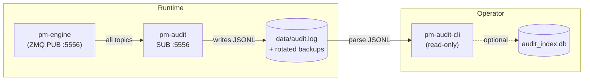
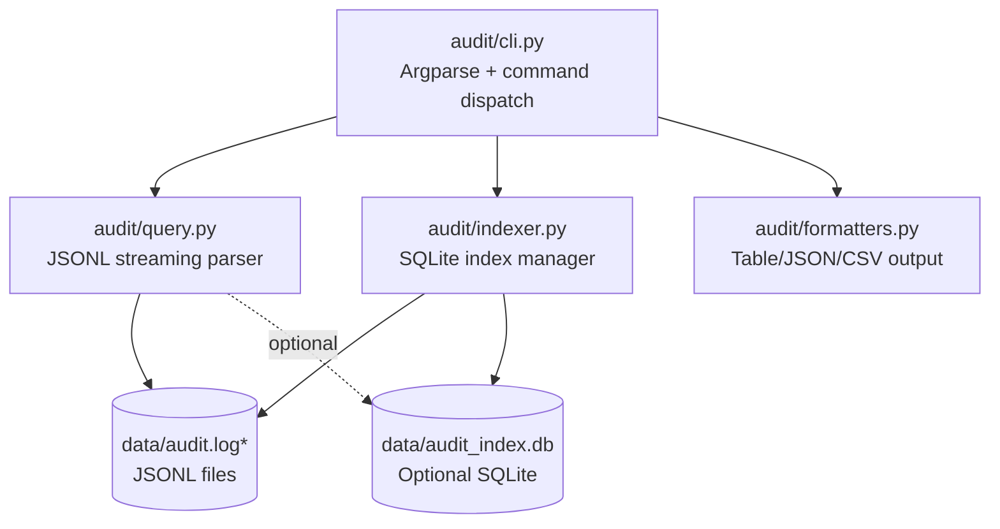

Version: 1.0.0

Date: 2026-07-08

Status: Design and Research Proposal

# EduMatcher — Audit Trail Query CLI Design Proposal


## Table of Contents

1. [Overview](#1-overview)
2. [Problem Statement](#2-problem-statement)
3. [Goals and Non-Goals](#3-goals-and-non-goals)
4. [Proposed CLI Surface](#4-proposed-cli-surface)
5. [Command Details](#5-command-details)
6. [JSONL Query Strategies](#6-jsonl-query-strategies)
7. [Optional SQLite Indexing](#7-optional-sqlite-indexing)
8. [Output Formats and UX Rules](#8-output-formats-and-ux-rules)
9. [Implementation Plan](#9-implementation-plan)
10. [Documentation Changes](#10-documentation-changes)
11. [Testing Guide](#11-testing-guide)
12. [Acceptance Checklist](#12-acceptance-checklist)
13. [Future Extensions](#13-future-extensions)


## 1. Overview

`pm-audit` records every message on the EduMatcher ZeroMQ bus to a rotating JSONL
(JSON Lines) log file at `data/audit.log`. This provides a complete, immutable
audit trail for compliance, forensic investigation, and system replay.

However, the audit logs are currently only accessible through manual text-processing
tools like `grep`, `awk`, `jq`, and `zcat`. For complex queries involving time
ranges, specific order IDs, gateway activity, or topic filtering, operators must
construct non-trivial shell pipelines or write custom scripts.

This proposal adds a **read-only command-line query tool**:

```bash
poetry run pm-audit-cli <subcommand> [options]
```

The tool provides structured access to audit data while preserving the simplicity
and immutability of the JSONL storage format.


## 2. Problem Statement

The current audit workflow requires manual use of Unix text tools:

```bash
# Find all fills for gateway GW01
grep '"GW01"' data/audit.log | grep 'order.fill'

# Count events by topic on a specific date
grep '2026-07-08' data/audit.log | cut -d']' -f2 | cut -d'[' -f2 | sort | uniq -c

# Extract all trades for symbol AAPL
grep 'trade.executed' data/audit.log | jq 'select(.symbol=="AAPL")'
```

This approach has several problems:

1. **Complexity**: Multi-step pipelines are error-prone and hard to document
2. **Performance**: Sequential grep/jq on large log files is slow
3. **Inconsistency**: Different operators use different query patterns
4. **Limited filtering**: Time-range queries require ISO timestamp parsing
5. **Learning curve**: Requires proficiency with Unix tools and JSON processing

EduMatcher should provide a first-class query interface that operators can use
without deep shell scripting knowledge, while maintaining the benefits of
append-only JSONL storage.


## 3. Goals and Non-Goals

### 3.1 Goals

- Provide a **read-only**, **user-friendly** CLI for querying audit logs
- Support common operational queries without requiring shell scripting expertise
- Preserve the **immutable JSONL storage format** used by `pm-audit`
- Work directly on JSONL files for simplicity and performance
- Support both human-readable and machine-readable output formats
- Enable efficient time-range, topic, gateway, and symbol filtering
- Optionally build SQLite indexes for complex multi-dimensional queries
- Follow the same CLI patterns as `pm-stats-cli` and `pm-clearing-cli`

### 3.2 Non-Goals

- This proposal does **not** change how `pm-audit` records data
- This proposal does **not** add new audit log tables or schemas
- This proposal does **not** provide write access or log modification
- This proposal does **not** expose arbitrary SQL execution
- This proposal does **not** require SQLite for basic queries
- This proposal does **not** add remote querying over ZeroMQ
- This proposal does **not** turn `pm-audit` itself into an interactive shell


## 4. Proposed CLI Surface

The proposed tool is:

```bash
poetry run pm-audit-cli [global-options] COMMAND [command-options]
```

### 4.1 Why a separate `pm-audit-cli` command?

`pm-audit` is a long-running subscriber process that records messages in real time.
Querying historical audit logs is a separate operational concern. A dedicated
one-shot CLI keeps responsibilities clear:

- `pm-audit` = recorder / writer
- `pm-audit-cli` = query tool / reader

This follows the same pattern as `pm-stats-cli` and `pm-clearing-cli`.



`pm-audit-cli` never touches ZeroMQ. It reads JSONL files directly, so it works
even when `pm-audit` is not running, as long as the log files exist.


### 4.2 Initial subcommands

The initial version should provide these subcommands:

| Subcommand | Purpose | Primary use case |
|---|---|---|
| `events` | Query audit log entries by topic, gateway, symbol, time | General event search |
| `orders` | Find order lifecycle events for specific order IDs | Order investigation |
| `trades` | Find trade executions with filters | Trade reconstruction |
| `topics` | List topics and event counts | Discovery and monitoring |
| `gateways` | List gateways and their activity | Gateway investigation |
| `timeline` | Show chronological event stream | Session replay |
| `stats` | Show summary statistics about log files | Operational health check |
| `index` | Build SQLite index for fast complex queries | Performance optimization |

These commands cover the most common audit investigation workflows without
requiring manual JSONL parsing.


## 5. Command Details

### 5.1 Global options

All subcommands should support these global flags:

| Flag | Default | Meaning |
|---|---|---|
| `--log-file` | `data/audit.log` | Path to primary audit log file |
| `--log-dir` | `data/` | Directory containing rotated log backups |
| `--format` | `table` | Output format: `table`, `json`, or `csv` |
| `--no-header` | off | Suppress header row for `csv` output |
| `--limit` | command-specific | Maximum entries returned |
| `--use-index` | auto | Use SQLite index if available |

The tool should automatically discover rotated log files (`audit.log.1`,
`audit.log.2.gz`, etc.) in the specified directory.

### 5.2 `events` — General event query

Purpose: Search audit log entries by topic, gateway, symbol, and time range.

```bash
pm-audit-cli events [options]
```

**Options:**

| Flag | Type | Description |
|---|---|---|
| `--topic` | string | Filter by topic (prefix match, e.g., `order.`, `trade.executed`) |
| `--gateway` | string | Filter by gateway ID appearing in payload |
| `--symbol` | string | Filter by symbol appearing in payload |
| `--from` | ISO timestamp | Start of time range (inclusive) |
| `--to` | ISO timestamp | End of time range (inclusive) |
| `--date` | YYYY-MM-DD | Shorthand for full-day filter |
| `--limit` | int | Maximum entries (default: 100) |
| `--reverse` | flag | Show newest first (default: oldest first) |


**Examples:**

```bash
# All fills for gateway GW01 today
pm-audit-cli events --topic order.fill --gateway GW01 --date 2026-07-08

# All trade executions for AAPL in a time window
pm-audit-cli events --topic trade.executed --symbol AAPL \
  --from 2026-07-08T09:30:00 --to 2026-07-08T16:00:00

# Last 50 events of any type
pm-audit-cli events --limit 50 --reverse

# All session transitions
pm-audit-cli events --topic session.state

# Export all order acknowledgements as JSON
pm-audit-cli events --topic order.ack --format json --limit 1000 > acks.json
```

**Output columns (table mode):**

| Column | Description |
|---|---|
| `timestamp` | ISO-8601 event timestamp |
| `topic` | ZeroMQ topic |
| `gateway` | Gateway ID (if present in payload) |
| `symbol` | Symbol (if present in payload) |
| `order_id` | Order ID (if present in payload) |
| `summary` | Brief event description |


### 5.3 `orders` — Order lifecycle investigation

Purpose: Find all events related to specific order IDs.

```bash
pm-audit-cli orders --id ORDER_ID [options]
```

**Options:**

| Flag | Type | Description |
|---|---|---|
| `--id` | string | Order ID to search for (required, repeatable) |
| `--gateway` | string | Filter by gateway ID |
| `--symbol` | string | Filter by symbol |
| `--date` | YYYY-MM-DD | Restrict to trading date |
| `--from` | ISO timestamp | Start of time range |
| `--to` | ISO timestamp | End of time range |
| `--format` | format | Output format override |

**Examples:**

```bash
# Full lifecycle of one order
pm-audit-cli orders --id ORD-GW01-00142

# Multiple orders
pm-audit-cli orders --id ORD-GW01-00142 --id ORD-GW01-00143

# Orders for gateway on a specific date
pm-audit-cli orders --gateway GW01 --date 2026-07-08 --limit 20

# Export as JSON for analysis
pm-audit-cli orders --id ORD-GW01-00142 --format json
```

**Output columns (table mode):**

| Column | Description |
|---|---|---|
| `timestamp` | Event timestamp |
| `order_id` | Order identifier |
| `event` | Event type (ack, fill, cancelled, expired, etc.) |
| `gateway` | Gateway ID |
| `symbol` | Instrument symbol |
| `side` | BUY or SELL |
| `qty` | Quantity (remaining or filled) |
| `price` | Price (if applicable) |
| `status` | Order status after event |


### 5.4 `trades` — Trade execution search

Purpose: Find trade execution events with filters.

```bash
pm-audit-cli trades [options]
```

**Options:**

| Flag | Type | Description |
|---|---|---|
| `--symbol` | string | Filter by symbol |
| `--gateway` | string | Filter by buyer or seller gateway |
| `--buy-gateway` | string | Filter by buyer gateway specifically |
| `--sell-gateway` | string | Filter by seller gateway specifically |
| `--min-price` | float | Minimum trade price |
| `--max-price` | float | Maximum trade price |
| `--min-qty` | int | Minimum trade quantity |
| `--date` | YYYY-MM-DD | Trading date |
| `--from` | ISO timestamp | Start of time range |
| `--to` | ISO timestamp | End of time range |
| `--limit` | int | Maximum trades (default: 100) |
| `--reverse` | flag | Show newest first |

**Examples:**

```bash
# All AAPL trades today
pm-audit-cli trades --symbol AAPL --date 2026-07-08

# Large trades (>= 1000 shares)
pm-audit-cli trades --min-qty 1000 --limit 50

# Trades between two gateways
pm-audit-cli trades --buy-gateway GW01 --sell-gateway MM_AAPL_01

# Trades in a price range
pm-audit-cli trades --symbol MSFT --min-price 410 --max-price 420

# Export as CSV for analysis
pm-audit-cli trades --symbol AAPL --date 2026-07-08 --format csv > aapl_trades.csv
```

**Output columns (table mode):**

| Column | Description |
|---|---|---|
| `timestamp` | Trade execution timestamp |
| `trade_id` | Trade UUID |
| `symbol` | Instrument symbol |
| `price` | Execution price |
| `quantity` | Matched quantity |
| `buy_gateway` | Buyer gateway ID |
| `sell_gateway` | Seller gateway ID |
| `aggressor` | Which side was aggressive (BUY/SELL) |


### 5.5 `topics` — Topic discovery and statistics

Purpose: List topics present in logs and count events per topic.

```bash
pm-audit-cli topics [options]
```

**Options:**

| Flag | Type | Description |
|---|---|---|
| `--date` | YYYY-MM-DD | Restrict to trading date |
| `--from` | ISO timestamp | Start of time range |
| `--to` | ISO timestamp | End of time range |
| `--prefix` | string | Filter topics by prefix (e.g., `order.`) |
| `--sort` | count\|alpha | Sort by count (desc) or alphabetically |

**Examples:**

```bash
# All topics in logs
pm-audit-cli topics

# Topics on specific date
pm-audit-cli topics --date 2026-07-08

# Order-related topics only
pm-audit-cli topics --prefix order. --sort count

# Export as JSON
pm-audit-cli topics --format json
```

**Output columns (table mode):**

| Column | Description |
|---|---|
| `topic` | ZeroMQ topic name |
| `count` | Number of events |
| `first_seen` | Timestamp of first occurrence |
| `last_seen` | Timestamp of last occurrence |

### 5.6 `gateways` — Gateway activity summary

Purpose: List gateways and summarize their audit trail activity.

```bash
pm-audit-cli gateways [options]
```

**Options:**

| Flag | Type | Description |
|---|---|---|
| `--date` | YYYY-MM-DD | Trading date |
| `--from` | ISO timestamp | Start of time range |
| `--to` | ISO timestamp | End of time range |
| `--min-events` | int | Minimum events to include gateway |

**Examples:**

```bash
# All gateways in logs
pm-audit-cli gateways

# Active gateways today
pm-audit-cli gateways --date 2026-07-08

# Only gateways with significant activity
pm-audit-cli gateways --min-events 100
```

**Output columns (table mode):**

| Column | Description |
|---|---|
| `gateway_id` | Gateway identifier |
| `events` | Total event count |
| `orders` | Orders submitted |
| `fills` | Fills received |
| `trades` | Trades participated in |
| `first_seen` | First event timestamp |
| `last_seen` | Last event timestamp |


### 5.7 `timeline` — Chronological event stream

Purpose: Show raw chronological event stream for session replay and investigation.

```bash
pm-audit-cli timeline [options]
```

**Options:**

| Flag | Type | Description |
|---|---|---|
| `--from` | ISO timestamp | Start time (required) |
| `--to` | ISO timestamp | End time (required) |
| `--topic` | string | Filter by topic prefix |
| `--gateway` | string | Filter by gateway |
| `--symbol` | string | Filter by symbol |
| `--limit` | int | Maximum events (default: 500) |
| `--follow` | flag | Tail mode: watch for new entries |

**Examples:**

```bash
# Opening 5 minutes of trading
pm-audit-cli timeline --from 2026-07-08T09:30:00 --to 2026-07-08T09:35:00

# Gateway activity in time window
pm-audit-cli timeline --gateway GW01 \
  --from 2026-07-08T14:00:00 --to 2026-07-08T14:10:00

# Watch live events (tail mode)
pm-audit-cli timeline --from 2026-07-08T09:30:00 --follow

# Symbol-specific timeline
pm-audit-cli timeline --symbol AAPL \
  --from 2026-07-08T09:30:00 --to 2026-07-08T16:00:00 --limit 1000
```

**Output:** Full event details in chronological order, suitable for replay analysis.


### 5.8 `stats` — Log file statistics

Purpose: Show summary statistics about audit log files for operational health checks.

```bash
pm-audit-cli stats
```

**Options:**

| Flag | Type | Description |
|---|---|---|
| `--verbose` | flag | Show per-file breakdown |

**Examples:**

```bash
# Quick summary
pm-audit-cli stats

# Detailed per-file information
pm-audit-cli stats --verbose
```

**Output:**

```
Audit Log Statistics
━━━━━━━━━━━━━━━━━━━━━━━━━━━━━━━━━━━━━━━━━━━━━━━━━━
  Total events:        1,245,678
  Total size:          2.4 GB (compressed: 485 MB)
  Active log:          data/audit.log (145 MB, 98,432 events)
  Rotated files:       5
  Oldest event:        2026-06-01T09:30:00.000Z
  Newest event:        2026-07-08T15:42:13.456Z
  Date range:          38 days
  Average events/day:  32,781
  Topics seen:         47
  Gateways seen:       12
```

### 5.9 `index` — Build SQLite index

Purpose: Build a SQLite index from JSONL logs for faster complex queries.

```bash
pm-audit-cli index [options]
```

**Options:**

| Flag | Type | Description |
|---|---|---|
| `--output` | path | SQLite database path (default: `data/audit_index.db`) |
| `--days` | int | Index last N days only |
| `--from` | ISO timestamp | Start of index range |
| `--to` | ISO timestamp | End of index range |
| `--rebuild` | flag | Rebuild index from scratch |
| `--incremental` | flag | Add only new entries since last index |

**Examples:**

```bash
# Build index for last 7 days
pm-audit-cli index --days 7

# Build full index
pm-audit-cli index --rebuild

# Incremental update
pm-audit-cli index --incremental

# Index specific date range
pm-audit-cli index --from 2026-07-01 --to 2026-07-08
```

**Behavior:**

- Creates SQLite database with indexed columns for fast queries
- Subsequent `pm-audit-cli` commands automatically use index if present
- Index can be rebuilt or updated incrementally
- Does not modify original JSONL files


## 6. JSONL Query Strategies

### 6.1 Direct JSONL parsing (default)

For most queries, the tool should parse JSONL files directly using efficient
streaming techniques:

**Advantages:**

- No preprocessing required
- Always up-to-date (reads latest logs)
- Simple implementation
- Works on compressed files (`.gz`)
- No additional disk space needed

**Performance considerations:**

- Use `ijson` or similar for streaming JSON parsing
- Apply filters during parsing (don't load everything into memory)
- Stop early when `--limit` is reached
- Use binary search for timestamp-based queries on sorted logs
- Cache file metadata (line counts, date ranges) for faster subsequent queries

**Typical query performance:**

| Query type | Estimated time (1M events) |
|---|---|
| Recent events (`--limit 100 --reverse`) | <1s |
| Topic filter only | 2-5s |
| Time range + topic | 3-8s |
| Complex multi-filter | 5-15s |

### 6.2 Log file structure assumptions

The tool should assume the following about audit log format:

```
[2026-07-08T09:30:00.123Z] [trade.executed] {"id": "...", "symbol": "AAPL", ...}
```

**Line format:**

- `[timestamp]` — ISO-8601 with millisecond precision
- `[topic]` — ZeroMQ topic
- `{...}` — JSON payload

**Ordering:**

- Logs are append-only and chronologically ordered
- Rotated logs are numbered sequentially
- Within a session, timestamps are monotonic

This allows optimizations like binary search for time ranges.


## 7. Optional SQLite Indexing

For installations with large audit histories or frequent complex queries, the
tool provides optional SQLite indexing.

### 7.1 Index schema

```sql
CREATE TABLE audit_events (
    id INTEGER PRIMARY KEY AUTOINCREMENT,
    timestamp TEXT NOT NULL,
    topic TEXT NOT NULL,
    payload TEXT NOT NULL,  -- full JSON
    gateway_id TEXT,        -- extracted from payload
    symbol TEXT,            -- extracted from payload
    order_id TEXT,          -- extracted from payload
    trade_id TEXT,          -- extracted from payload
    event_type TEXT         -- derived from topic
);

CREATE INDEX idx_timestamp ON audit_events(timestamp);
CREATE INDEX idx_topic ON audit_events(topic);
CREATE INDEX idx_gateway ON audit_events(gateway_id);
CREATE INDEX idx_symbol ON audit_events(symbol);
CREATE INDEX idx_order ON audit_events(order_id);
CREATE INDEX idx_trade ON audit_events(trade_id);
CREATE INDEX idx_event_type ON audit_events(event_type);

-- Composite indexes for common query patterns
CREATE INDEX idx_topic_timestamp ON audit_events(topic, timestamp);
CREATE INDEX idx_gateway_timestamp ON audit_events(gateway_id, timestamp);
CREATE INDEX idx_symbol_timestamp ON audit_events(symbol, timestamp);
```

### 7.2 Index maintenance

**Initial build:**

```bash
pm-audit-cli index --rebuild
```

**Incremental updates:**

The tool should track the last indexed log position and add only new entries:

```bash
pm-audit-cli index --incremental
```

**Automatic index detection:**

When an index exists and is up-to-date (last indexed timestamp is recent),
queries automatically use it. Users can force JSONL parsing with `--use-index=no`.

### 7.3 Index vs JSONL performance comparison

| Query type | JSONL parsing | SQLite index |
|---|---|---|
| Recent 100 events | 0.5s | 0.1s |
| Single topic filter | 4s | 0.2s |
| Time range query | 6s | 0.3s |
| Multi-dimensional filter | 12s | 0.5s |
| Order ID lookup | 8s | 0.05s |
| Complex JOIN-like query | N/A (manual) | 1s |

**Recommendation:** Use JSONL parsing for ad-hoc queries and recent data. Build
an index for installations with >1M events or frequent complex queries.


## 8. Output Formats and UX Rules

### 8.1 Output formats

Three output formats supported:

| Format | Intended use |
|---|---|
| `table` | Interactive terminal use by operators (human-readable) |
| `json` | Automation, scripts, and structured output |
| `csv` | Export to spreadsheets or shell pipelines |

### 8.2 Table format examples

**Events table:**

```
┌─────────────────────────┬──────────────────┬─────────┬────────┬──────────────┬─────────────────┐
│ Timestamp               │ Topic            │ Gateway │ Symbol │ Order ID     │ Summary         │
├─────────────────────────┼──────────────────┼─────────┼────────┼──────────────┼─────────────────┤
│ 2026-07-08T09:30:00.123 │ order.new        │ GW01    │ AAPL   │ ORD-00142    │ LIMIT BUY 100   │
│ 2026-07-08T09:30:00.145 │ order.ack.GW01   │ GW01    │ AAPL   │ ORD-00142    │ ACCEPTED        │
│ 2026-07-08T09:30:01.234 │ order.fill.GW01  │ GW01    │ AAPL   │ ORD-00142    │ FILLED 100@150  │
│ 2026-07-08T09:30:01.235 │ trade.executed   │ —       │ AAPL   │ —            │ 100@150         │
└─────────────────────────┴──────────────────┴─────────┴────────┴──────────────┴─────────────────┘
```

**Topics summary:**

```
┌──────────────────────────┬────────┬─────────────────────────┬─────────────────────────┐
│ Topic                    │ Count  │ First Seen              │ Last Seen               │
├──────────────────────────┼────────┼─────────────────────────┼─────────────────────────┤
│ trade.executed           │ 12,543 │ 2026-07-08T09:30:00.123 │ 2026-07-08T15:59:59.987 │
│ order.ack.GW01           │  8,432 │ 2026-07-08T09:30:00.145 │ 2026-07-08T15:59:58.234 │
│ order.fill.GW01          │  5,678 │ 2026-07-08T09:30:01.234 │ 2026-07-08T15:59:57.123 │
│ book.AAPL                │ 45,123 │ 2026-07-08T09:30:00.100 │ 2026-07-08T16:00:00.000 │
└──────────────────────────┴────────┴─────────────────────────┴─────────────────────────┘
```

### 8.3 JSON format

```json
[
  {
    "timestamp": "2026-07-08T09:30:00.123Z",
    "topic": "order.new",
    "gateway": "GW01",
    "symbol": "AAPL",
    "order_id": "ORD-00142",
    "payload": {
      "order_id": "ORD-00142",
      "gateway_id": "GW01",
      "symbol": "AAPL",
      "side": "BUY",
      "order_type": "LIMIT",
      "quantity": 100,
      "price": 150.0
    }
  }
]
```

### 8.4 CSV format

```csv
timestamp,topic,gateway,symbol,order_id,side,quantity,price,status
2026-07-08T09:30:00.123Z,order.new,GW01,AAPL,ORD-00142,BUY,100,150.0,NEW
2026-07-08T09:30:00.145Z,order.ack.GW01,GW01,AAPL,ORD-00142,BUY,100,150.0,ACCEPTED
2026-07-08T09:30:01.234Z,order.fill.GW01,GW01,AAPL,ORD-00142,BUY,100,150.0,FILLED
```

### 8.5 No-row behavior

If a query returns no results:

- **table mode:** Print `No matching events found.`
- **json mode:** Print `[]`
- **csv mode:** Print header only (unless `--no-header`)

Exit code: 0 (success — no data is not an error)

### 8.6 Error handling

The CLI should fail clearly for:

- Missing log files
- Unreadable log files
- Invalid date/timestamp formats
- Invalid filter combinations
- Corrupted JSONL entries (log warning, skip line, continue)

Exit code: non-zero for errors


## 9. Implementation Plan

### 9.1 New files

| File | Purpose |
|---|---|
| `src/edumatcher/audit/cli.py` | Main CLI entrypoint with argparse |
| `src/edumatcher/audit/query.py` | JSONL parsing and filtering logic |
| `src/edumatcher/audit/indexer.py` | SQLite index building and management |
| `src/edumatcher/audit/formatters.py` | Output formatting (table, JSON, CSV) |
| `tests/audit/test_cli.py` | CLI argument parsing tests |
| `tests/audit/test_query.py` | Query logic unit tests |
| `tests/audit/test_indexer.py` | Index building and query tests |



### 9.2 Existing files to change

| File | Change |
|---|---|
| `pyproject.toml` | Add console script entrypoint for `pm-audit-cli` |
| `docs/user-guide/10-processes.md` | Add `pm-audit-cli` documentation section |
| `src/edumatcher/config.py` | Add `AUDIT_INDEX_DB_FILE` config constant |

### 9.3 Implementation phases

**Phase 1: Basic JSONL queries**

- Implement `events`, `topics`, `stats` commands
- Support `--topic`, `--date`, `--from`, `--to` filters
- Table and JSON output formats

**Phase 2: Advanced queries**

- Implement `orders`, `trades`, `gateways`, `timeline` commands
- Add CSV output format
- Performance optimizations (streaming, caching)

**Phase 3: SQLite indexing**

- Implement `index` command
- Automatic index detection and usage
- Incremental index updates

**Phase 4: Polish and integration**

- Add `--follow` tail mode for `timeline`
- Comprehensive testing
- Documentation and examples
- Integration with existing documentation


## 10. Documentation Changes

### 10.1 User guide updates

Update `docs/user-guide/10-processes.md` in the `pm-audit` section:

**Current content:**

```markdown
## pm-audit — Event Logger

Records every message on the bus to a rotating log file.

Log format (one entry per line):
[2026-04-29T14:32:01.123] [trade.executed] {"id": "...", ...}

Use --terminal during demos so the class can see every event in real time.
```

**New content:**

```markdown
## pm-audit — Event Logger

Records every message on the bus to a rotating log file.

### Query tool

Use `pm-audit-cli` to query audit logs:

# Recent order fills
pm-audit-cli events --topic order.fill --limit 50 --reverse

# All trades for AAPL today
pm-audit-cli trades --symbol AAPL --date 2026-07-08

# Full order lifecycle
pm-audit-cli orders --id ORD-GW01-00142

# Topic statistics
pm-audit-cli topics --date 2026-07-08

See [Audit Trail Queries](15-audit-queries.md) for the complete reference.
```

### 10.2 New documentation page

Create `docs/user-guide/15-audit-queries.md` with:

- Introduction to audit trail querying
- Command reference for all `pm-audit-cli` subcommands
- Common query patterns and examples
- Performance considerations
- SQLite indexing guide

### 10.3 FAQ entries

Add to user guide FAQ:

**Q: How do I find all events for a specific order?**

```bash
pm-audit-cli orders --id ORD-GW01-00142
```

**Q: How do I export all trades to Excel?**

```bash
pm-audit-cli trades --date 2026-07-08 --format csv > trades.csv
```

**Q: How do I monitor live audit events?**

```bash
pm-audit-cli timeline --from 2026-07-08T09:30:00 --follow
```

**Q: My queries are slow. What can I do?**

```bash
pm-audit-cli index --rebuild  # Build SQLite index for faster queries
```


## 11. Testing Guide

### 11.1 Unit tests

**Query parser tests** (`tests/audit/test_query.py`):

- JSONL line parsing
- Timestamp filtering
- Topic prefix matching
- Gateway extraction from payloads
- Symbol extraction from payloads
- Order ID extraction
- Edge cases (malformed JSON, missing fields)

**Indexer tests** (`tests/audit/test_indexer.py`):

- Index creation from JSONL
- Incremental index updates
- Index schema validation
- Query rewriting (JSONL → SQL)
- Index staleness detection

**Formatter tests** (`tests/audit/test_formatters.py`):

- Table rendering
- JSON serialization
- CSV generation
- Header suppression
- Empty result handling

### 11.2 Integration tests

Using a temporary audit log with known test data:

```python
# Create test log
test_log = """
[2026-07-08T09:30:00.123Z] [order.new] {"order_id": "ORD-001", "gateway_id": "GW01", ...}
[2026-07-08T09:30:00.145Z] [order.ack.GW01] {"order_id": "ORD-001", "status": "ACCEPTED", ...}
[2026-07-08T09:30:01.234Z] [order.fill.GW01] {"order_id": "ORD-001", "filled_qty": 100, ...}
[2026-07-08T09:30:01.235Z] [trade.executed] {"trade_id": "TRD-001", "symbol": "AAPL", ...}
"""

# Test queries
run_cli(['events', '--topic', 'order.', '--limit', '10'])
run_cli(['orders', '--id', 'ORD-001'])
run_cli(['trades', '--symbol', 'AAPL'])
run_cli(['topics'])
run_cli(['stats'])
```

### 11.3 Performance tests

Benchmark with synthetic logs:

- 1K events: all queries < 1s
- 10K events: filtered queries < 3s
- 100K events: topic filter < 8s
- 1M events: time-range query < 15s

With SQLite index:

- All queries < 2s for 1M events


## 12. Acceptance Checklist

This proposal should be considered successfully implemented when:

**Core functionality:**

- [ ] `pm-audit-cli` exists as a Poetry console command
- [ ] All subcommands work: `events`, `orders`, `trades`, `topics`, `gateways`, `timeline`, `stats`, `index`
- [ ] Global options work: `--log-file`, `--log-dir`, `--format`, `--limit`
- [ ] All queries support output formats: `table`, `json`, `csv`
- [ ] Time filtering works: `--date`, `--from`, `--to`
- [ ] Topic filtering supports prefix matching
- [ ] Gateway and symbol filtering work correctly

**JSONL parsing:**

- [ ] Efficiently streams large log files without loading into memory
- [ ] Handles compressed log files (`.gz`)
- [ ] Discovers and reads rotated log backups
- [ ] Applies filters during parsing (not after)
- [ ] Respects `--limit` and stops early
- [ ] Handles malformed lines gracefully (logs warning, continues)

**SQLite indexing:**

- [ ] `index` command builds SQLite database from JSONL
- [ ] Index includes all relevant columns and indexes
- [ ] Incremental updates work correctly
- [ ] Queries automatically use index when available
- [ ] `--use-index=no` forces JSONL parsing

**Output quality:**

- [ ] Table output is human-readable with proper alignment
- [ ] JSON output is valid and well-structured
- [ ] CSV output is properly quoted and escaped
- [ ] No-result queries exit successfully with clear message
- [ ] Error messages are clear and actionable

**Documentation:**

- [ ] User guide updated with `pm-audit-cli` examples
- [ ] New dedicated audit query documentation page
- [ ] FAQ entries added
- [ ] All subcommands documented with examples

**Testing:**

- [ ] Unit tests for query parsing
- [ ] Unit tests for formatters
- [ ] Integration tests with sample logs
- [ ] Performance benchmarks documented


## 13. Future Extensions

### 13.1 Advanced analytics

**Statistical aggregations:**

```bash
# Order fill rate by gateway
pm-audit-cli analytics fill-rate --gateway GW01 --date 2026-07-08

# Order-to-trade latency distribution
pm-audit-cli analytics latency --percentiles 50,95,99

# Topic frequency over time (time-series)
pm-audit-cli analytics topic-frequency --topic order. --interval 1h
```

### 13.2 Anomaly detection

```bash
# Find unusual gateway behavior
pm-audit-cli anomalies gateway --baseline-days 7

# Detect order submission spikes
pm-audit-cli anomalies spike --metric orders --threshold 3x

# Find gateways with high reject rates
pm-audit-cli anomalies rejects --min-rate 10%
```

### 13.3 Export and visualization

```bash
# Generate timeline visualization
pm-audit-cli export timeline --from 2026-07-08T09:30:00 \
  --to 2026-07-08T10:00:00 --output timeline.html

# Export for Jupyter/pandas analysis
pm-audit-cli export parquet --date 2026-07-08 --output audit.parquet

# Generate Grafana-compatible JSON
pm-audit-cli export grafana --metric trades --interval 5m
```

### 13.4 Compliance and reporting

```bash
# Regulatory audit report
pm-audit-cli report mifid2 --date 2026-07-08 --output report.pdf

# Best execution analysis
pm-audit-cli report best-execution --gateway GW01 --date 2026-07-08

# Order routing disclosure
pm-audit-cli report routing --date 2026-07-08
```

### 13.5 Real-time monitoring integration

```bash
# Prometheus metrics export
pm-audit-cli metrics-server --port 9090

# Alerting rules
pm-audit-cli alert --rule "high-reject-rate" --threshold 5% --notify slack

# Dashboard data API
pm-audit-cli api-server --port 8080
```

These extensions would be implemented as separate subcommands or plugins,
maintaining backward compatibility with the core query functionality.
