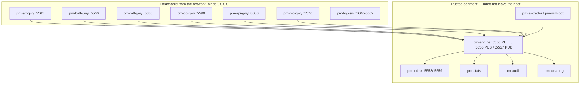
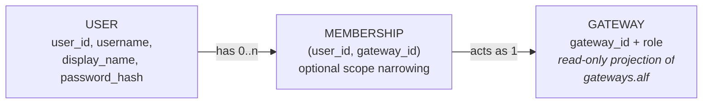

Version: 0.1.0

Date: 2026-08-14

Status: Design Proposal — not implemented

# EduMatcher — Authentication and Authorization Design


## Table of Contents

1. [Overview](#1-overview)
2. [Problem Statement](#2-problem-statement)
3. [Goals and Non-Goals](#3-goals-and-non-goals)
4. [Current State](#4-current-state)
5. [Design Summary](#5-design-summary)
6. [Standards and Libraries](#6-standards-and-libraries)
7. [Identity Model](#7-identity-model)
8. [The `pm-auth` Service](#8-the-pm-auth-service)
9. [Token Design](#9-token-design)
10. [Protocol Integration](#10-protocol-integration)
11. [Frontend Integration](#11-frontend-integration)
12. [Configuration Model](#12-configuration-model)
13. [Bootstrapping and Operations](#13-bootstrapping-and-operations)
14. [Impact Assessment](#14-impact-assessment)
15. [Risk Register](#15-risk-register)
16. [Implementation Plan](#16-implementation-plan)
17. [Testing Plan](#17-testing-plan)
18. [Alternatives Considered](#18-alternatives-considered)
19. [Open Questions](#19-open-questions)
20. [Acceptance Checklist](#20-acceptance-checklist)


## 1. Overview

EduMatcher today has, by deliberate design, no authentication and no
authorization. Every identity in the system is a self-asserted string checked
against an allow-list. This was the right call for a teaching exchange on
localhost, and this document does not argue otherwise.

This document proposes what a real authentication and authorization layer
would look like *if* one were added — what it would cost, what it would
change, and what it would leave alone. It is written to be evaluated and
possibly rejected, not to be implemented as a matter of course.

The central design claim is this:

> **A correctly chosen token format lets EduMatcher gain full A&A without a
> user database that every component can reach, and without touching the
> matching engine at all.**

That claim is the reason this design is tractable. Section 5 explains the
mechanism; Section 14 quantifies the resulting blast radius.

### 1.1 Scope decisions taken

Three scoping decisions shape everything below. They were taken deliberately
and each one is revisited in [Alternatives Considered](#18-alternatives-considered).

| Decision | Choice | Rationale |
|---|---|---|
| **Which principals** | Human users **and** machine clients reachable from outside the host | Secures every externally-reachable surface. The internal ZeroMQ core plane stays a trusted segment guarded by network boundary, exactly as `EduMatcher-deployment.md` §18 already mandates. |
| **Infrastructure** | A small first-party service, `pm-auth`, in this repository | Standards-compliant tokens without requiring a classroom to run Keycloak. Because the tokens are standard, a real IdP can replace `pm-auth` later without touching any consumer. |
| **Rollout** | Opt-in, disabled by default | Every existing deployment, demo, test and CI run keeps working untouched. Auth becomes an optional teaching module rather than a migration event. |


## 2. Problem Statement

Four concrete problems motivate the work. Only the first two are security
problems; the others matter more for a teaching product.

**P1 — Identity is self-asserted on every wire protocol.** Anyone who can
reach ALF on port 5565 can type `HELLO|CLIENT=x|PROTO=ALF1|ID=OPS01` and
*be* the admin gateway. The same is true of BALF, RALF and the DC gateway, and
of the engine's own ZeroMQ `gateway_connect` command. The single exception is
`pm-api-gwy`, whose bearer `api_key` protects the HTTP hop only — the ZeroMQ
hop behind it re-asserts the `gateway_id` with no credential at all.

**P2 — Three services have no authentication whatsoever.** `config-gui`,
`log-gui` and `terminal-gui` are unauthenticated by design. `config-gui` is
the one that edits `engine_config.yaml`, the file containing every API key and
the entire gateway allow-list. It is simultaneously the least protected and
the highest-value target in the system.

**P3 — There is no concept of a person.** The unit of identity is a
*gateway*, not a human. Twelve students sharing `TRADER01` are
indistinguishable in the blotter, in the Monitor Log, and in the audit trail.
For an exchange whose purpose is to teach market mechanics — including
surveillance and audit — the inability to attribute an action to a person is a
pedagogical gap, not just a security one.

**P4 — Credentials cannot be revoked without a restart.** The only way to
remove access is to edit `engine_config.yaml`, recompile the artifact and
restart the affected process. There is no session, no expiry, and no way to
eject one participant mid-exercise.

### 2.1 The constraint that shapes the design

The stated concern when this work was proposed was:

> *"We would need a separate user-DB that would need to be accessible from all
> components, even a UI that is on a separate machine and normally only talks
> via a Gateway."*

This is the right instinct and it is exactly the trap to avoid. A design in
which `pm-engine`, five TCP gateways, four UIs and a dozen CLIs all need a
live connection to a user database would be a serious regression in
operational complexity and a new single point of failure on the trading path.

Section 5.2 shows why the proposed design does not need this.


## 3. Goals and Non-Goals

### 3.1 Goals

- **G1** Authenticate human users with individual accounts, so every action is
  attributable to a person.
- **G2** Authenticate machine clients (gateways, bots, CLIs) with a real
  credential rather than a self-asserted identifier.
- **G3** Authorize actions by role and scope, preserving the existing
  `TRADER` / `MARKET_MAKER` / `ADMIN` semantics rather than replacing them.
- **G4** Require **no** user-database connectivity from any component other
  than the auth service itself.
- **G5** Require **no changes to `pm-engine`'s matching, order or session
  logic**.
- **G6** Default to today's behaviour exactly, so nothing breaks on upgrade.
- **G7** Use published standards and maintained libraries throughout, so the
  implementation is small and the concepts are teachable.
- **G8** Support revocation and expiry without a process restart.

### 3.2 Non-Goals

Explicitly out of scope. Each of these is a place where a general-purpose IAM
product would keep going and we deliberately stop.

- **N1** Multi-factor authentication, social login, WebAuthn/passkeys.
  (See [§18.4](#184-webauthn-passkeys).)
- **N2** User self-registration, email verification, password-reset flows.
  Accounts are created by an instructor with a CLI.
- **N3** Multi-tenancy. One EduMatcher deployment is one classroom.
- **N4** Fine-grained entitlements below the role/scope level — no per-symbol,
  per-venue or per-time-window permissions.
- **N5** Encryption of the internal ZeroMQ core plane (ZeroMQ CURVE). The core
  plane remains a trusted network segment. (See [§18.5](#185-zeromq-curve-on-the-core-plane).)
- **N6** TLS termination. Orthogonal, already a deployment concern, and
  properly solved with a reverse proxy rather than in Python.
- **N7** Replacing the engine's gateway-level role model.
- **N8** Any change to matching, order types, risk controls or market data.


## 4. Current State

### 4.1 Trust boundaries today



Only one arrow in that diagram carries a credential: the browser's bearer
`api_key` into `pm-api-gwy`. Every other arrow is unauthenticated.

Note the inconsistency already present: the five TCP gateways default-bind
`0.0.0.0` and are therefore reachable cross-host **today**, while
`EduMatcher-Cross-host-connection.md` still treats cross-host operation as a
future feature and states that "security hardening (TLS, auth, network ACLs)
is out of scope for this phase".

### 4.2 How each protocol establishes identity

| Surface | Identity mechanism | Credential |
|---|---|---|
| ALF (5565) | `HELLO\|CLIENT=…\|PROTO=ALF1\|ID=<gateway_id>` | none |
| BALF (5560) | fixed-width `gateway_id` field in the hello frame | none |
| CALF (5570) | free-text `CLIENT` name, for logging only | none |
| RALF (5580) | `HELLO\|…\|ROLE=<role>`, role **self-declared** | none |
| DC (5590) | none — code comments "no role/entitlement model here" | none |
| `pm-api-gwy` (8080) | `Authorization: Bearer <api_key>` → `gateway_id` | plaintext key in YAML |
| Engine ZMQ (5555) | `gateway_connect` command carrying `gateway_id` | none |
| `pm-log-srv` (5600) | LALF client name | none |

`pm-engine`'s `_handle_gateway_connect` accepts any `gateway_id` present in
`gateways.alf` and refuses unknown ones with `Gateway not configured: {id}`.
There is no secret material in the handshake. **The `api_key` at the
`pm-api-gwy` edge is the only secret in the entire system.**

### 4.3 What exists to build on

The picture is not all bad. Three existing properties make this work
substantially easier than it would otherwise be:

- **A role model already exists and is enforced.** `gateways.alf` entries
  carry `role: TRADER|ADMIN|MARKET_MAKER`, the engine resolves it, and
  `pm-api-gwy` already gates `/admin/*` on it (`403 ROLE_DENIED`). We are
  adding *authentication* to an *authorization* model that already works.
- **`pm-api-gwy` is FastAPI.** The auth service can reuse its dependency
  stack, its config loader, its error envelope and its test patterns.
- **SQLite is the house database.** `stats.db`, `audit.db`, `clearing.db`
  and `log.db` all exist. `auth.db` is not a new class of thing.


## 5. Design Summary

### 5.1 Key idea

Introduce one new process, **`pm-auth`**, which is the only component that
holds the user database. It issues short-lived **JSON Web Tokens** signed with
an **asymmetric** key. Every other component verifies those tokens *offline*
using only the corresponding **public** key.

```mermaid
sequenceDiagram
    autonumber
    participant U as Browser / CLI / Bot
    participant A as pm-auth (:8090)
    participant G as Gateway (api-gwy / ALF / …)
    participant E as pm-engine

    U->>A: 1. Authenticate (OIDC code+PKCE, or client_credentials)
    A->>A: 2. Verify against auth.db (argon2id)
    A-->>U: 3. Signed JWT (access + refresh)
    Note over U,G: pm-auth is not involved again until the token expires
    U->>G: 4. Present JWT (Bearer header / HELLO TOKEN= field)
    G->>G: 5. Verify signature with cached public key — offline
    G->>G: 6. Enforce scopes; map to gateway_id
    G->>E: 7. gateway_connect (unchanged)
    E-->>G: 8. Accepted (unchanged)
```

### 5.2 Why no component needs the user database

Steps 4–6 above are the whole answer to the concern in §2.1. A JWT is
*self-describing* and *self-certifying*: it carries the user id, the selected
gateway, the role and the scopes in its payload, and a signature proving
`pm-auth` issued it.

Verifying that signature requires the **public** half of an Ed25519 key pair —
about 44 bytes of base64. It requires no database, no network call to
`pm-auth`, and no shared secret that could itself leak. A gateway fetches the
public key once at startup from `pm-auth`'s standard JWKS endpoint, caches it,
and can then authenticate every client for the lifetime of the key even if
`pm-auth` is offline.

This is the property that makes the design viable:

- **G4 is satisfied.** Only `pm-auth` touches `auth.db`.
- **No new runtime dependency on the trading path.** If `pm-auth` dies,
  already-authenticated sessions keep trading; only *new* logins fail. Compare
  this to a design using opaque tokens plus RFC 7662 introspection, where
  every gateway must call `pm-auth` on every connection and `pm-auth` becomes
  a hard dependency of order entry.
- **The UI on a separate machine is not a special case.** It talks to
  `pm-auth` over HTTP exactly as it talks to `pm-api-gwy`, and both can sit
  behind the same reverse proxy on the same origin.

The cost of choosing self-certifying tokens is that revocation is not
instantaneous — a token stays valid until it expires. Section 9.4 addresses
this with short lifetimes plus an optional deny-list.

### 5.3 Why the engine does not change

The engine's authority is over *gateways*: which `gateway_id` exists, what
role it has, what it may do. That model stays exactly as it is.

The auth layer answers a different question — *which human may act as which
gateway* — and answers it entirely in front of the engine. By the time a
`gateway_connect` reaches `pm-engine`, the gateway process has already
verified the token and resolved the `gateway_id`. The message on the wire is
byte-identical to today's.

This is worth stating plainly because it is the single largest risk reduction
in the design: **no change to matching, order handling, risk, sessions,
auctions, quotes, or the market data path.** (§14.2 lists what does change.)

### 5.4 Default behaviour

With `auth.enabled: false` — the default — every component behaves exactly as
it does today: `api_key` checks in `pm-api-gwy`, self-asserted `gateway_id`
everywhere else, and no `pm-auth` process needs to run at all. The auth code
paths are inert.


## 6. Standards and Libraries

Everything below is an established standard with maintained Python and
TypeScript implementations. Nothing here is bespoke cryptography.

### 6.1 Standards used

| Standard | Reference | Used for |
|---|---|---|
| OAuth 2.0 Authorization Framework | RFC 6749 | Overall grant model |
| Bearer Token Usage | RFC 6750 | `Authorization: Bearer` on HTTP |
| JSON Web Token (JWT) | RFC 7519 | Token format |
| JSON Web Signature (JWS) | RFC 7515 | Token signing |
| JSON Web Key / Key Set (JWK/JWKS) | RFC 7517 | Public key publication and rotation |
| EdDSA in JOSE | RFC 8037 | Ed25519 signing algorithm (`alg: EdDSA`) |
| PKCE | RFC 7636 | Browser login without a client secret |
| JWT Profile for Access Tokens | RFC 9068 | Access-token claim conventions |
| Token Revocation | RFC 7009 | Logout / eject a participant |
| Device Authorization Grant | RFC 8628 | CLI login without a local browser |
| OpenID Connect Core 1.0 + Discovery | OIDF | ID tokens, `/.well-known/openid-configuration` |
| Argon2 password hashing | RFC 9106 | Password storage (`argon2id`) |

### 6.2 Libraries

| Layer | Library | Note |
|---|---|---|
| Auth service framework | **FastAPI** + **uvicorn** | Already the `pm-api-gwy` stack |
| OAuth2/OIDC server | **Authlib** | Mature, implements the grants above server-side |
| JWT sign/verify | **PyJWT** (with `cryptography`) | Ed25519 via `alg: EdDSA` |
| Password hashing | **argon2-cffi** | Reference Argon2 implementation |
| Storage | **sqlite3** (stdlib) | Consistent with the other `*.db` files |
| Browser OIDC client | **oidc-client-ts** | Standard TS client, handles PKCE and refresh |

`PyJWT` and `cryptography` are the only additions on the *verification* side —
the one dependency every gateway gains. Both are ubiquitous, and neither is a
heavy install.

### 6.3 Why EdDSA rather than RS256 or HS256

- **Not HS256.** A shared symmetric secret would have to be distributed to
  every gateway, and any gateway holding it could *mint* tokens, not just
  verify them. That reintroduces exactly the "secret everywhere" problem this
  design exists to avoid.
- **EdDSA (Ed25519) over RS256.** Smaller keys and dramatically smaller
  signatures (64 bytes vs 256), which matters because the token has to travel
  inside line-oriented text protocols (§10). Ed25519 keeps a minimal access
  token around 300–400 characters; RS256 would roughly double it.


## 7. Identity Model

### 7.1 The three principal types

| Principal | Example | Credential | Grant |
|---|---|---|---|
| **User** | a student, an instructor | username + password (argon2id) | Authorization Code + PKCE |
| **Service client** | `pm-mm-bot`, `pm-ai-trader`, a lab harness | `client_id` + `client_secret` | Client Credentials |
| **Device client** | `alf_console`, `calf_spy`, admin CLIs | `client_id`, user-approved | Device Authorization Grant |

### 7.2 Users, memberships and gateways

The model deliberately keeps the existing gateway concept and layers people on
top of it, rather than replacing it.



A **membership** is the grant "this person may act as this gateway". A user
with two memberships (say `TRADER01` and `TRADER07`) picks one at login; the
choice is recorded in the token and cannot be changed without a new token.

`GATEWAY` is not a new source of truth — it is a read-only projection of
`gateways.alf` from `engine_config.yaml`, refreshed by `pm-auth` at startup.
This keeps a single authority for what gateways exist and what role each has.

### 7.3 Scopes

Roles remain coarse; scopes give the finer control needed to protect specific
operations. A token's effective scopes are the role's default set, optionally
narrowed by the membership.

| Scope | Grants | Default roles |
|---|---|---|
| `md:read` | Market data, book, trades | all |
| `orders:read` | Own blotter, own fills | TRADER, MARKET_MAKER, ADMIN |
| `orders:write` | Submit, amend, replace, cancel | TRADER |
| `quotes:write` | Submit and cancel quotes | MARKET_MAKER |
| `positions:read` | Positions, flatten | TRADER, MARKET_MAKER |
| `admin:read` | Dashboard, monitor, gateway roster | ADMIN |
| `admin:session` | Session phase transitions | ADMIN |
| `admin:halt` | Circuit-breaker trigger and clear | ADMIN |
| `admin:killswitch` | Kill switch, gateway kick | ADMIN |
| `logs:read` | `log-gui`, `pm-log-srv` history | ADMIN, instructor |
| `config:read` / `config:write` | `config-gui` | instructor |

Splitting `admin:*` into four scopes is deliberate: it makes it possible to
give a teaching assistant `admin:read` for surveillance without handing them
the kill switch, which is the most common real-world ask in a classroom.

### 7.4 Relationship to the existing `READ_ONLY` credential

A credential with `gateway_id: null` currently yields `gateway_role:
READ_ONLY`. Under this design that becomes a user with **no membership** —
they authenticate as a person, receive `md:read` only, and can use TapeDeck
and the market screens but hold no trading identity. The behaviour is
preserved; only the mechanism changes.


## 8. The `pm-auth` Service

### 8.1 Shape

A single FastAPI process, by convention on port **8090**, binding
`127.0.0.1` by default (unlike the existing gateways — see the known defect in
`EduMatcher-deployment.md` §6 about `pm-api-gwy` binding `0.0.0.0`; `pm-auth`
should not repeat it).

It owns exactly one file: `<DATA_DIR>/auth/auth.db`.

### 8.2 Endpoints

Standard OIDC discovery means clients configure themselves from one URL.

| Method | Path | Standard | Purpose |
|---|---|---|---|
| GET | `/.well-known/openid-configuration` | OIDC Discovery | Endpoint and capability advertisement |
| GET | `/jwks.json` | RFC 7517 | Public keys for offline verification |
| GET | `/authorize` | RFC 6749 §4.1 | Browser login (with PKCE) |
| POST | `/token` | RFC 6749 §3.2 | Code exchange, refresh, client credentials |
| POST | `/device_authorization` | RFC 8628 | CLI login initiation |
| POST | `/revoke` | RFC 7009 | Logout, eject a participant |
| GET | `/userinfo` | OIDC Core | Profile for the UI |
| GET | `/healthz` | — | Liveness |

### 8.3 Storage schema

```sql
CREATE TABLE users (
  user_id       TEXT PRIMARY KEY,      -- ULID
  username      TEXT NOT NULL UNIQUE,
  display_name  TEXT NOT NULL,
  password_hash TEXT NOT NULL,         -- argon2id
  disabled      INTEGER NOT NULL DEFAULT 0,
  created_at    TEXT NOT NULL
);

-- "this person may act as this gateway"
CREATE TABLE memberships (
  user_id    TEXT NOT NULL REFERENCES users(user_id) ON DELETE CASCADE,
  gateway_id TEXT NOT NULL,            -- validated against gateways.alf
  scopes     TEXT,                     -- NULL = role defaults
  PRIMARY KEY (user_id, gateway_id)
);

-- machine principals (bots, CLIs, lab harnesses)
CREATE TABLE clients (
  client_id     TEXT PRIMARY KEY,
  secret_hash   TEXT,                  -- argon2id; NULL for public/device clients
  client_type   TEXT NOT NULL,         -- 'service' | 'device' | 'public'
  gateway_id    TEXT,                  -- service clients act as a fixed gateway
  scopes        TEXT NOT NULL,
  disabled      INTEGER NOT NULL DEFAULT 0
);

-- refresh tokens are opaque and stored, so they are revocable
CREATE TABLE refresh_tokens (
  token_hash TEXT PRIMARY KEY,         -- sha256 of the opaque token
  user_id    TEXT,
  client_id  TEXT,
  gateway_id TEXT,
  issued_at  TEXT NOT NULL,
  expires_at TEXT NOT NULL,
  revoked    INTEGER NOT NULL DEFAULT 0
);

-- optional: short-lived deny-list for access tokens (see §9.4)
CREATE TABLE revoked_jti (
  jti        TEXT PRIMARY KEY,
  expires_at TEXT NOT NULL
);
```

### 8.4 Administration CLI

`pm-auth-admin`, following the pattern of `pm-index-admin-cli`:

```bash
pm-auth-admin user add     alice --display "Alice Andersson"
pm-auth-admin user passwd  alice
pm-auth-admin user disable alice
pm-auth-admin grant        alice TRADER01
pm-auth-admin grant        bob   OPS01 --scopes admin:read
pm-auth-admin revoke       alice TRADER01
pm-auth-admin client add   mm-bot-1 --gateway MM01 --scopes quotes:write,md:read
pm-auth-admin list         users|clients|grants
pm-auth-admin session kill alice        # revoke refresh + deny-list live tokens
pm-auth-admin keys rotate
```

For a classroom of thirty, a batch import matters more than any of the above:

```bash
pm-auth-admin import students.csv   # username,display_name,gateway_id
```


## 9. Token Design

### 9.1 Access token claims

Following RFC 9068's profile for JWT access tokens:

```json
{
  "iss": "http://edumatcher.local:8090",
  "sub": "01JC7Q8K2M9XZ4V6",
  "aud": "edumatcher",
  "exp": 1786716000,
  "iat": 1786715100,
  "jti": "01JC7Q9F3P0ABCDE",
  "scope": "md:read orders:read orders:write positions:read",
  "gateway_id": "TRADER01",
  "role": "TRADER",
  "username": "alice"
}
```

`gateway_id` and `role` are private claims. They are what let a gateway
translate an authenticated person into the identity the engine already
understands, with no lookup.

### 9.2 Lifetimes

| Token | Lifetime | Form | Rationale |
|---|---|---|---|
| Access | **15 min** | JWT (EdDSA) | Short enough that expiry is a usable revocation backstop |
| Refresh | **8 h** | opaque, stored | One classroom day; revocable immediately |
| ID token | 15 min | JWT | Profile display only |
| Device code | 10 min | opaque | Per RFC 8628 |

### 9.3 Long-lived connections

This is the one genuinely awkward interaction, and it needs stating clearly.

A browser refreshes silently every 15 minutes — `oidc-client-ts` does this
automatically and the user notices nothing. But a **TCP gateway connection**
(ALF, BALF, RALF, DC) may stay open for hours, and dropping a market maker's
session mid-exercise because a token expired would be unacceptable.

The rule adopted here: **the token is checked at connect time, not
continuously.** An established session remains valid until it disconnects.
This mirrors how SSH treats authentication and how FIX logon works in
practice, and it keeps expiry from becoming an availability problem on the
trading path.

The consequence is honest and must be documented: revoking a user does **not**
drop their existing TCP session. To eject a participant immediately, the
operator revokes the credential *and* kicks the gateway — a capability that
already exists in the ADMIN Gateway Management screen. `pm-auth-admin session
kill` should print that reminder.

### 9.4 Revocation

Three mechanisms, in increasing order of force:

1. **Expiry** — do nothing; access dies within 15 minutes.
2. **Refresh revocation** (RFC 7009) — immediate for anything that must
   re-authenticate; the stored refresh token is marked revoked.
3. **`jti` deny-list** — for the "eject now" case. `pm-auth` publishes revoked
   `jti` values; gateways poll `/revoked?since=` every 60 s and hold a small
   in-memory set. Entries age out after the access-token lifetime, so the set
   stays tiny.

Mechanism 3 is optional and can be deferred to a later phase. Without it,
"eject now" is revoke-plus-kick as described in §9.3.

### 9.5 Key rotation

`pm-auth` publishes all currently-valid public keys at `/jwks.json`, each with
a `kid`. Tokens carry `kid` in their JWS header. Rotation is: generate a new
key, publish both, sign with the new one, retire the old after the maximum
token lifetime has elapsed. Gateways re-fetch JWKS on an unknown `kid` (rate
limited, to make an unknown-`kid` flood useless as a DoS).


## 10. Protocol Integration

### 10.1 HTTP surfaces — `pm-api-gwy`, `config-gui`, `log-gui`

The simplest case. `Authorization: Bearer <jwt>` replaces
`Authorization: Bearer <api_key>`. `pm-api-gwy` already parses that header;
the change is in `sessions.py`, where the exact-match lookup against
`credentials:` becomes a signature verification plus a scope check.

The existing `Session` object gains `user_id` and `scopes` and keeps
`gateway_id`, so nearly all downstream code is untouched. `require_admin`
becomes a scope check rather than an engine round-trip to resolve the role —
which is incidentally a latency improvement.

### 10.2 WebSocket surfaces

`pm-api-gwy` already accepts `{"api_key": …}` as the first frame on its
WebSocket endpoints. That becomes `{"token": …}`. Browsers cannot set headers
on a WebSocket handshake, which is why the first-frame pattern exists; it is
retained.

### 10.3 Text protocols — ALF, RALF, DC, CALF

Extend the existing `HELLO` with one optional field:

```
HELLO|CLIENT=alf_console|PROTO=ALF1|ID=TRADER01|TOKEN=eyJhbGciOiJFZERTQSIs...
```

The gateway verifies the token, then checks that the `gateway_id` claim
matches the asserted `ID` — rejecting the mismatch is what closes P1. With
`auth.enabled: false`, a missing `TOKEN` is accepted exactly as today; with
auth on, a missing or invalid `TOKEN` is refused with a new
`REJECT|REASON=AUTH_REQUIRED` / `AUTH_INVALID`.

An Ed25519 JWT is ~300–400 characters, so the HELLO line grows to roughly
450 bytes. All four protocols are line-oriented with no fixed line limit, so
this is a non-breaking extension for any parser that ignores unknown fields —
which the existing `validate_hello_fields` does.

RALF deserves a specific note: today its `ROLE=` field is self-declared. Under
auth it must be *validated against the token's scopes* rather than merely
checked against `allowed_roles`. That is the single highest-value line of code
in this entire proposal, given RALF exposes clearing and drop-copy data.

### 10.4 BALF — the binary exception

BALF uses fixed-width binary fields, so a 400-byte variable token cannot be
carried in the existing hello frame. Options considered:

| Option | Verdict |
|---|---|
| Widen the hello frame to 512 bytes | Rejected — breaks every existing BALF client |
| New `AUTH` frame sent before `HELLO`, length-prefixed | **Chosen** — additive, old clients that never send it behave exactly as today when auth is off |
| Opaque short token + introspection lookup | Rejected — makes `pm-auth` a hard dependency of order entry (§5.2) |

The `AUTH` frame carries a `uint16` length followed by the token bytes. BALF
already has a frame-type discriminator, so this is an additive change.

### 10.5 Market data (CALF) is a policy decision, not a technical one

`pm-md-gwy` is a public read-only feed with no identity model at all. Whether
market data should require authentication is a *product* question — real
venues charge for it, teaching venues usually do not. The recommendation is to
support the `TOKEN` field on CALF but default `md_gateway.require_auth: false`
even when auth is globally enabled, so classroom wallboards and TapeDeck keep
working without credentials.

### 10.6 Internal ZeroMQ core plane — unchanged

`gateway_connect` on port 5555 is **not** modified. The core plane remains a
trusted segment whose boundary is the network, per `EduMatcher-deployment.md`
§18. This is a conscious acceptance of residual risk, recorded as **R7** in
§15, and revisited in §18.5.

The practical consequence: a process that can reach port 5555 can still claim
any `gateway_id`. Auth raises the bar from "reach any gateway port" to "reach
the engine's own port", which the deployment guide already says must never be
exposed. Bots (`pm-ai-trader`, `pm-mm-bot`) connect on this plane and are
therefore *not* authenticated by this design — they are trusted infrastructure
started by the instructor, which matches how they are actually used.


## 11. Frontend Integration

### 11.1 `trader-gui`

The largest UI change, and still modest. Today's login screen takes an API key
and calls `GET /api/v1/status`. Under auth it redirects to `pm-auth`'s
`/authorize`, and `oidc-client-ts` handles PKCE, the callback and silent
refresh.

Concretely, in `trader-gui/apps/web/src`:

- `pages/LoginPage.tsx` — replaced by a redirect plus a `/callback` route.
- `store/useAuthStore.ts` — holds the access token, expiry and a refresh timer
  instead of a raw key. **The existing in-memory-only policy should be kept**:
  the current design deliberately never writes the key to `localStorage`, and
  a bearer JWT deserves the same treatment. Silent refresh via a hidden iframe
  or a refresh token in memory preserves that.
- `api/apiFetch.ts` — inject the current access token; on `401`, attempt one
  refresh then redirect to login.
- `router/RoleGuard.tsx` — gate on **scopes** from the token rather than the
  single `role` string. This is a genuine improvement: the sidebar can then
  show exactly what the user may do (e.g. `admin:read` without
  `admin:killswitch` hides the Kill Switch panel rather than letting the user
  discover it via a 403).

A user with multiple memberships needs a gateway picker after login — a new,
small screen.

### 11.2 `config-gui` — do this first

`config-gui` has no login and edits the file containing every credential. It
is the highest-value target in the system and should be the first UI wired to
auth, gated on `config:write`. This ordering is reflected in §16.

### 11.3 `log-gui`

Gate on `logs:read`. Its Fastify bridge validates the JWT before opening the
ZeroMQ subscription.

### 11.4 `terminal-gui` — deliberately unchanged

TapeDeck is credential-free by design and is used as a classroom wallboard.
It uses a single shared read-only API key held server-side in its bridge,
never exposed to the browser. Under this design that key becomes a **service
client** with `md:read` only. The browser-facing experience does not change:
no login, as intended.


## 12. Configuration Model

### 12.1 New `auth:` block in `engine_config.yaml`

```yaml
auth:
  # Master switch. false = today's behaviour, exactly. Default: false.
  enabled: false

  # Where pm-auth runs; consumers use this for OIDC discovery + JWKS.
  issuer: "http://127.0.0.1:8090"

  # Verification-only cache. No secret material here.
  jwks_cache_ttl_sec: 3600

  token:
    access_ttl_sec: 900        # 15 min
    refresh_ttl_sec: 28800     # 8 h
    algorithm: "EdDSA"
    clock_skew_sec: 60         # tolerance for multi-host clock drift

  # Per-surface override, so auth can be rolled out one protocol at a time.
  require_auth:
    api_gateway: true
    alf: true
    balf: true
    ralf: true
    dc: true
    md_gateway: false          # market data stays open by default (§10.5)
    log_srv: true

  # Transitional: keep accepting api_key while migrating (§16 phase 2).
  allow_legacy_api_key: true
```

### 12.2 What leaves `engine_config.yaml`

Once auth is fully adopted, the `credentials:` blocks under `api_gateways:`
become empty and eventually disappear. That is a genuine improvement in its
own right: today every plaintext key for the whole system lives in one file
that `config-gui` edits over an unauthenticated HTTP connection.

`gateways.alf` stays exactly as it is — it remains the authority for which
gateways exist and what role each holds.

### 12.3 Secrets that are not in the config file

`pm-auth`'s **private** signing key must not live in `engine_config.yaml`,
because that file is compiled into an artifact and distributed to every
process. It lives at `<DATA_DIR>/auth/signing_key.pem`, mode `0600`, generated
on first run. Only `pm-auth` reads it.

The config validator (`pm-cverifier`) should grow a rule that fails if a
private key path is ever found inside the YAML.


## 13. Bootstrapping and Operations

### 13.1 First run

```bash
pm-auth init                       # creates auth.db, generates the signing key
pm-auth-admin user add instructor --display "Instructor" --superuser
pm-auth-admin grant instructor OPS01
pm-auth serve                      # or via the standard process supervisor
```

`pm-auth init` must be idempotent and must refuse to overwrite an existing
signing key without an explicit `--force`, since rotating it invalidates every
live token.

### 13.2 The chicken-and-egg problem

Enabling auth without any account locks everyone out. Two mitigations:

1. `pm-cverifier` fails the config if `auth.enabled: true` and `auth.db`
   contains no account with `admin:*` scopes.
2. `pm-auth` refuses to start in that state, with a message naming the exact
   `pm-auth-admin user add` command to run.

### 13.3 Clock skew

JWT `exp`/`nbf` validation is clock-sensitive, and this system is explicitly
intended to run across hosts. `clock_skew_sec: 60` gives tolerance, and the
troubleshooting guide needs an entry for `AUTH_INVALID` caused by drift —
it presents as an inexplicable auth failure and is very hard to guess.

### 13.4 Offline and air-gapped classrooms

Everything above works with no internet access: `pm-auth` is local, keys are
local, and the JWKS fetch is over the LAN. This is a real requirement for a
teaching tool and is a decisive argument against any hosted IdP.


## 14. Impact Assessment

This section answers the question that prompted the document: *how fundamental
a change is this?*

The honest summary: **broad but shallow.** It touches roughly two-thirds of
the processes in the repository, but in most of them the change is a dozen
lines calling a shared helper. The parts of EduMatcher that are genuinely hard
and genuinely valuable — the matching engine, the order model, risk controls,
auctions, market data — are untouched.

### 14.1 What does not change

| Component | Why untouched |
|---|---|
| `pm-engine` — matching, orders, risk, sessions, auctions, quotes | Auth resolves identity entirely in front of the engine; `gateway_connect` is byte-identical (§5.3) |
| `pm-stats`, `pm-audit`, `pm-clearing`, `pm-index` | Core-plane ZeroMQ subscribers on the trusted segment |
| `pm-ai-trader`, `pm-mm-bot` | Same — trusted infrastructure on the core plane |
| All five wire protocol *message sets* | Only the HELLO handshake gains an optional field |
| Market data path | `md:read` is open by default (§10.5) |
| `terminal-gui` user experience | Stays credential-free (§11.4) |

### 14.2 What changes, by component

| Component | Change | Size |
|---|---|---|
| **`pm-auth`** (new) | Service, OIDC endpoints, `auth.db`, key management | **L** |
| **`pm-auth-admin`** (new) | User/client/grant CLI, CSV import | **M** |
| **`edumatcher.auth.verify`** (new) | Shared JWT verification + JWKS cache used by every consumer | **S** |
| `pm-api-gwy` | `sessions.py` verification, scope deps, WS first-frame | **M** |
| `alf_gwy`, `ralf_gateway`, `dc_gateway`, `md_gateway` | `TOKEN=` in HELLO, verify, reject codes | **S** each |
| `balf_gwy` | New `AUTH` frame + codec change | **M** |
| `log_srv` | Token check on LALF ingest and PUB subscribe | **S** |
| `trader-gui` | OIDC login, callback route, scope-based guards, gateway picker | **M** |
| `config-gui` | Login where there is none today | **M** |
| `log-gui` | Login where there is none today | **S** |
| CLIs (`alf_console`, `calf_spy`, `ralf_spy`, `dc_spy`, `log_cli`) | Device-code login, `--token` flag, token cache | **S** each |
| `config.py` / `config_artifact.py` / `pm-cverifier` | `auth:` block, schema version bump, validation rules | **S** |
| Docs | New user-guide chapter; updates to deployment, protocols, all four GUI chapters | **M** |
| Tests | Auth-on variants across the suite | **L** |

Rough order of magnitude: **6–10 weeks of focused work** for a single
developer to reach the end of Phase 5, with Phases 6–7 optional. The two
genuinely large items are `pm-auth` itself and the test matrix — not the
protocol changes.

### 14.3 The shared verification module matters

The single most important structural decision in the implementation is that
JWT verification lives in **one** module,
`src/edumatcher/auth/verify.py`, used by all seven consumers:

```python
def verify_access_token(token: str, *, required_scopes: set[str]) -> Principal
```

Six independent copies of signature verification, JWKS caching and clock-skew
handling is how auth systems acquire vulnerabilities. This is the same lesson
already learned in this codebase with `lib/validators.ts` — a rule stated in
several places drifts, and for security code drift means a hole.

### 14.4 Effect on the existing test suite

Every integration test that opens an ALF/BALF/RALF connection or calls
`pm-api-gwy` currently does so with no credential. With `auth.enabled: false`
as the default, **all of them keep passing unchanged** — which is the main
reason for choosing opt-in rollout.

New coverage is then additive: a parallel auth-on fixture set. The risk is not
breakage; it is that the auth-on path stays under-exercised because the
default path is the comfortable one. §17 addresses this.


## 15. Risk Register

| # | Risk | Likelihood | Impact | Mitigation |
|---|---|---|---|---|
| **R1** | **Tokens leak into logs.** The `HELLO` line carries `TOKEN=…`; every `pm-*` process ships its logs to `pm-log-srv`, and `log-gui` displays them **with no authentication today**. A naive implementation publishes live credentials to an open web UI. | **High** | **High** | Redact `TOKEN=` in the LALF client before emit, not at the viewer. Add a test asserting no JWT-shaped string ever reaches `log.db`. Gate `log-gui` on `logs:read` in the same phase. |
| **R2** | Dual code paths (auth on/off) diverge; the auth-on path rots | High | Medium | CI runs the integration suite twice, once with each setting (§17.2) |
| **R3** | Clock skew across hosts causes inexplicable `AUTH_INVALID` | Medium | Medium | `clock_skew_sec` tolerance; explicit troubleshooting entry; `pm-auth` exposes its clock in `/healthz` |
| **R4** | Lockout — auth enabled with no admin account | Medium | High | `pm-cverifier` rule + `pm-auth` refuses to start, naming the fix command (§13.2) |
| **R5** | Signing key lost or compromised | Low | High | `0600` outside the config artifact; documented rotation (§9.5); `pm-auth-admin keys rotate` |
| **R6** | Long-lived TCP sessions dropped by token expiry | Medium | High | Verify at connect only, never mid-session (§9.3) |
| **R7** | **Core ZeroMQ plane stays unauthenticated** — anyone reaching :5555 can still be any gateway | Medium | High | *Accepted residual risk.* Network boundary per deployment §18. Revisit via §18.5 if the threat model changes |
| **R8** | BALF `AUTH` frame breaks existing clients | Low | Medium | Additive frame type; absent frame behaves as today when auth is off |
| **R9** | Per-request JWT verification costs latency on the order path | Low | Medium | Ed25519 verify is ~50 µs; add a small `jti`-keyed verified cache in `pm-api-gwy`; benchmark before Phase 2 exit |
| **R10** | Scope creep into a general-purpose IAM product | **High** | Medium | The Non-Goals in §3.2 are binding. Any MFA/SSO/self-service request is a new document, not an extension of this one |
| **R11** | Two admin surfaces — `config-gui` edits gateways, `pm-auth-admin` edits users | Medium | Low | Accepted for now; a future `pm-auth` admin UI could merge them |
| **R12** | Access token exfiltrated via XSS in a GUI | Low | High | Keep tokens in memory only (never `localStorage`), as `trader-gui` already does with the API key; short TTL limits the window |
| **R13** | The design makes the classroom harder to start, reducing use | Medium | Medium | Disabled by default; `make up` unchanged; auth is a lesson module, not a prerequisite |

R1 deserves emphasis: it is the one risk where *adding* the security system
creates a vulnerability that does not exist today. It must be handled in the
same phase as the protocol change, not after.


## 16. Implementation Plan

Each phase is independently shippable and leaves the system working. Phases
0–2 deliver most of the security value; 6–7 are optional.

### Phase 0 — Config surface only *(no behaviour change)*
- `auth:` block in the config schema, artifact version bump, `pm-cverifier`
  rules, defaults that reproduce today's behaviour exactly.
- **Exit:** full suite green, no functional change observable.

### Phase 1 — `pm-auth` and the shared verifier
- `pm-auth` service, `auth.db`, key generation, OIDC discovery + JWKS,
  authorization-code + PKCE and client-credentials grants.
- `pm-auth-admin` CLI, including CSV import.
- `edumatcher.auth.verify` shared module.
- **Exit:** a token can be obtained and verified by a test harness. Nothing
  else consumes it yet.

### Phase 2 — `pm-api-gwy` accepts tokens
- Bearer JWT alongside `api_key` (`allow_legacy_api_key: true`).
- Scope-based dependencies replacing the role round-trip.
- **Exit:** REST and WS work with either credential; benchmark for R9.

### Phase 3 — `config-gui` login *(highest value per unit of work)*
- Gate the credential-editing UI on `config:write`.
- **Exit:** the file holding every secret is no longer editable anonymously.

### Phase 4 — `trader-gui` OIDC login
- Redirect flow, `/callback`, silent refresh, scope-driven navigation,
  gateway picker for multi-membership users.
- **Exit:** login by username and password; API key path still available.

### Phase 5 — Text protocols + log redaction
- `TOKEN=` on ALF, RALF, DC, CALF; RALF `ROLE=` validated against scopes.
- **R1 redaction shipped in this phase, not later.**
- `log-gui` gated on `logs:read`; `log_srv` ingest authenticated.
- Device-code login for the CLIs.
- **Exit:** every text protocol can require a real credential.

### Phase 6 — BALF `AUTH` frame *(optional)*
- Binary frame, codec change, client update.

### Phase 7 — Retire `api_key` *(optional, breaking)*
- Remove `credentials:` from the config schema and the legacy path.
- Major version bump; migration note in the release checklist.

### Suggested stopping points

- Stopping after **Phase 3** already fixes the worst hole (`config-gui`) and
  gives real user accounts on the API — a defensible resting point.
- Stopping after **Phase 5** delivers the full stated goal.
- Phases 6–7 are cleanup, worth doing only if BALF is actually used in
  anger and if carrying two credential systems becomes a burden.


## 17. Testing Plan

### 17.1 Unit
- Token issuance, claim shape (RFC 9068), signature verification, `kid`
  selection, expiry and skew boundaries, scope narrowing by membership.
- argon2id hashing parameters and verification.
- HELLO parsing with and without `TOKEN=`, oversize and malformed tokens.

### 17.2 Integration — the important part
Run the **existing** integration suite twice in CI:

| Job | Config | Expectation |
|---|---|---|
| `integration-noauth` | `auth.enabled: false` | Byte-identical behaviour to today |
| `integration-auth` | `auth.enabled: true`, fixture users | Same functional outcomes, credentials required |

The second job is what stops R2. If it is skipped or allowed to fail, the auth
path is not real.

### 17.3 Security-specific
- **R1 regression test:** drive an authenticated ALF connection, then assert no
  JWT-shaped string appears anywhere in `log.db` or the LALF stream.
- Reject a token whose `gateway_id` claim differs from the asserted `ID`.
- Reject an expired token, a token signed by a foreign key, an `alg: none`
  token, and a token with `alg` switched to HS256 using the public key as the
  HMAC secret (the classic JWT confusion attack — `PyJWT` requires an explicit
  algorithm list, and the test proves we pass one).
- RALF: a `ROLE=CLEARING` claim from a token lacking that scope is refused.
- Scope enforcement per admin operation: `admin:read` must not permit
  `admin:killswitch`.

### 17.4 Operational
- Lockout scenario (§13.2) produces the documented message.
- Key rotation with in-flight tokens.
- `pm-auth` offline: existing sessions keep trading, new logins fail cleanly.


## 18. Alternatives Considered

### 18.1 External IdP — Keycloak or Authentik
**Rejected for the default path, retained as an option.** Zero custom auth
code, and MFA, admin UI and social login come free. But it adds a container
and a substantial configuration surface to a tool whose selling point is that
a teacher runs `make up`, and it is awkward in an offline classroom (§13.4).

Because `pm-auth` speaks standard OIDC, **swapping in Keycloak later requires
changing only `auth.issuer`** — no consumer code changes. That is a deliberate
property of this design, and it means choosing `pm-auth` now is not a
commitment.

### 18.2 Opaque tokens with introspection (RFC 7662)
**Rejected.** Simpler to revoke instantly, but every gateway would call
`pm-auth` on every connection, making it a hard runtime dependency of order
entry and a new single point of failure. Directly contradicts G4.

### 18.3 mTLS for machine clients (RFC 8705)
**Deferred, not rejected.** Genuinely the right answer for gateway-to-gateway
authentication and it composes well with the JWT design (certificate for the
channel, token for the user). But it requires a certificate authority, a
distribution story and rotation tooling — a large operational burden for a
teaching deployment. Revisit if EduMatcher is ever run across untrusted
networks.

### 18.4 WebAuthn / passkeys
**Rejected for now, and worth explaining since it was raised.** Passkeys are
excellent and genuinely phishing-resistant, but they fit this context poorly:
they bind to a device and an authenticator, which is wrong for a shared lab
machine; they cannot be batch-provisioned for thirty students from a CSV; they
have no story for machine clients; and account recovery becomes a real problem
in a classroom. The design keeps passwords precisely because instructors need
to hand out and reset credentials cheaply.

If desired later, WebAuthn slots in as an *additional* authenticator inside
`pm-auth` with no change to any consumer — the tokens are identical. That is
another benefit of terminating authentication in one service.

### 18.5 ZeroMQ CURVE on the core plane
**Deferred (see R7).** CURVE would authenticate and encrypt the engine plane,
closing the last hole. Two reasons to defer: ZeroMQ PUB/SUB has no
per-subscriber authorization, so CURVE gives authentication but not
entitlement — subscribers still receive the whole stream and filter in
process; and keypair distribution to every process is real operational weight.
Meaningful entitlement on that plane would mean moving to ROUTER/DEALER, which
is a genuine architectural change and out of proportion here.

### 18.6 Do nothing
**A legitimate choice.** EduMatcher's lack of auth is a documented, deliberate
simplification for a localhost teaching tool, and the threat model for a
classroom is mostly "students being mischievous". If deployments stay on one
trusted machine, the cost in §14 buys little. The strongest arguments *for*
doing the work are not security but pedagogy: per-user attribution in the
audit trail (P3), and the ability to teach authentication as a first-class
market-infrastructure topic using a system students already understand.


## 19. Open Questions

1. **Is per-user attribution wanted in the audit trail?** If yes, the engine's
   audit records should carry `user_id` alongside `gateway_id` — which *is* a
   change to `pm-engine`'s message schema and would break the "no engine
   change" property in §5.3. This is the single most likely reason the scope
   would grow, and it should be decided before Phase 1.
2. **Should market data require auth?** §10.5 recommends no by default.
3. **One gateway per user, or shared gateways?** The membership model supports
   many-to-many. If a class shares `TRADER01` across ten students, per-user
   attribution (Q1) matters more, not less.
4. **Where does `pm-auth` sit in a cross-host deployment** — one per venue, or
   one shared across several classrooms? The design assumes one per venue
   (N3).
5. **Retire `api_key` or keep it permanently** as a documented "simple mode"?
   Keeping it forever is defensible for a teaching tool and would make Phase 7
   unnecessary.
6. **Session length.** Is 8 hours the right refresh lifetime for a teaching
   day, or should it be per-lesson (2 h)?


## 20. Acceptance Checklist

- [ ] `auth.enabled: false` reproduces current behaviour exactly; full suite
      green with no test modified
- [ ] `pm-auth` issues RFC 9068-conformant access tokens signed with Ed25519
- [ ] `/.well-known/openid-configuration` and `/jwks.json` serve valid,
      standards-conformant documents
- [ ] No component other than `pm-auth` opens `auth.db`
- [ ] No component other than `pm-auth` reads the private signing key
- [ ] JWT verification exists in exactly one module
- [ ] `pm-engine` source is unmodified by Phases 0–5
- [ ] A token whose `gateway_id` claim mismatches the asserted `ID` is refused
      on every protocol
- [ ] RALF `ROLE=` is validated against token scopes
- [ ] **No JWT-shaped string ever reaches `log.db`** (R1 regression test)
- [ ] `alg: none` and HS256-confusion tokens are rejected
- [ ] `admin:read` does not permit `admin:killswitch`
- [ ] Enabling auth with no admin account fails closed with an actionable
      message
- [ ] Key rotation works with in-flight tokens
- [ ] CI runs the integration suite with auth both off and on
- [ ] Documentation updated: new user-guide chapter, plus deployment,
      protocol and all four GUI chapters
- [ ] `EduMatcher-deployment.md` §18 updated — it currently states that three
      services have no authentication whatsoever
