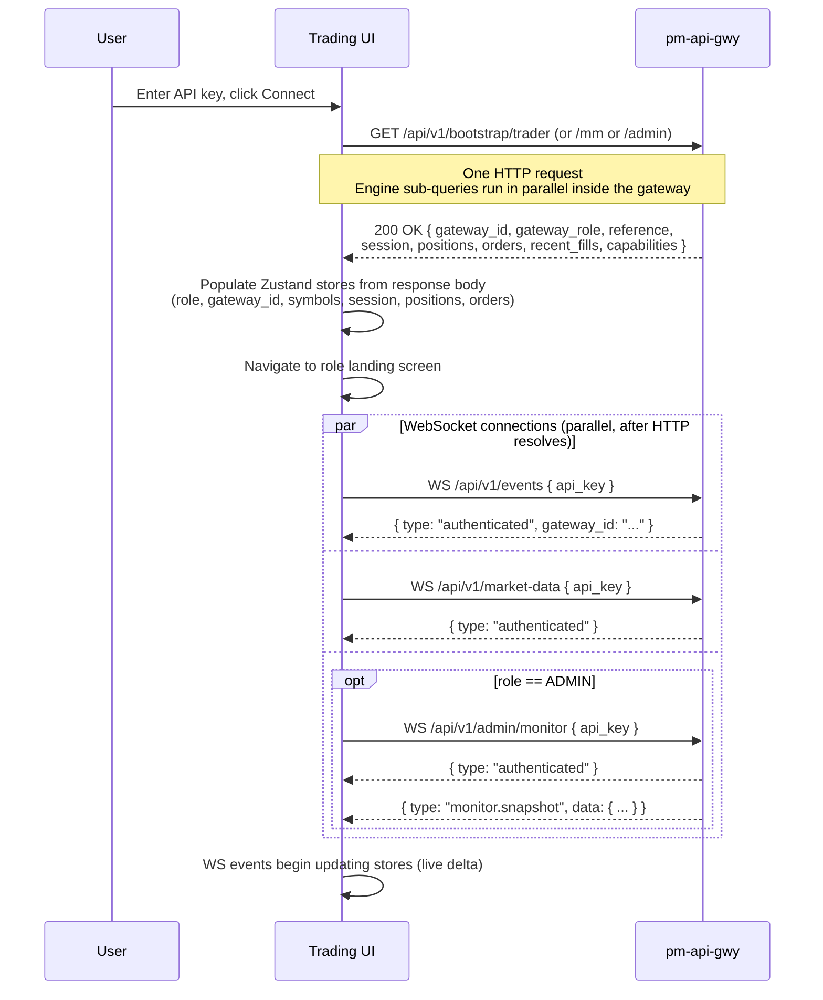

Version: 1.1.0

Date: 2026-07-27

Status: Design and Research Proposal


# EduMatcher — Bootstrap API 

> **Revision History**
>
> - **1.1.0 (2026-08-13)** — Marked implemented. `/api/v1/bootstrap/{trader,mm,admin}`
>   ship in `routers/bootstrap.py` (parallel sub-queries via `asyncio.gather`,
>   required-field `503` vs optional-field `incomplete[]`, read-only key handling)
>   and are documented in the REST API reference and the API-gateway user guide.
>   `trader-gui` calls `GET /api/v1/bootstrap/trader` (`/admin` for ADMIN) at login.
> - **1.0.0 (2026-07-27)** — Initial proposal, drafted from §26.4.4 of
>   [EduMatcher-Trading-GUI.md](./EduMatcher-Trading-GUI.md) and grounded in the
>   current `pm-api-gwy` router code.


## Table of Contents

- [EduMatcher — Bootstrap API](#edumatcher--bootstrap-api)
  - [Table of Contents](#table-of-contents)
  - [1. Motivation](#1-motivation)
  - [2. Scope and non-goals](#2-scope-and-non-goals)
  - [3. The startup waterfall problem](#3-the-startup-waterfall-problem)
    - [3.1 Current login sequence](#31-current-login-sequence)
    - [3.2 Why it hurts browser clients](#32-why-it-hurts-browser-clients)
  - [4. Design principles](#4-design-principles)
  - [5. Endpoint specifications](#5-endpoint-specifications)
    - [5.1 `GET /api/v1/bootstrap/trader`](#51-get-apiv1bootstraptrader)
      - [Sub-queries (all parallel)](#sub-queries-all-parallel)
      - [Response shape](#response-shape)
    - [5.2 `GET /api/v1/bootstrap/mm`](#52-get-apiv1bootstrapmm)
      - [Additional sub-queries (parallel with the trader queries)](#additional-sub-queries-parallel-with-the-trader-queries)
      - [Response shape](#response-shape-1)
    - [5.3 `GET /api/v1/bootstrap/admin`](#53-get-apiv1bootstrapadmin)
      - [Sub-queries (all parallel)](#sub-queries-all-parallel-1)
      - [Response shape](#response-shape-2)
  - [6. Partial-failure semantics](#6-partial-failure-semantics)
  - [7. Caching and staleness](#7-caching-and-staleness)
  - [8. Error responses](#8-error-responses)
  - [9. Authorization](#9-authorization)
  - [10. Implementation notes](#10-implementation-notes)
    - [10.1 Router placement](#101-router-placement)
    - [10.2 Concurrency model](#102-concurrency-model)
    - [10.3 Source mapping](#103-source-mapping)
  - [11. Updated login sequence](#11-updated-login-sequence)
  - [12. TypeScript types](#12-typescript-types)
  - [13. Open questions](#13-open-questions)


## 1. Motivation

`pm-trading-ui` opens with a predictable startup cost: a TRADER needs role,
gateway id, symbol list, live session state, positions, active orders, recent
fills, and enough metadata to know which WebSocket channels to subscribe to.
That data lives across six or more separate API endpoints, which today are
fetched in a combination of serial waterfalls and ad-hoc parallelism.

§26.4.4 of [EduMatcher-Trading-GUI.md](./EduMatcher-Trading-GUI.md) named
the fix: three **role-scoped aggregate endpoints** that compose existing
service responses into one round-trip per login. This document specifies
those endpoints in enough detail to implement them.


## 2. Scope and non-goals

**In scope:**

- `GET /api/v1/bootstrap/trader` — TRADER and MARKET_MAKER startup payload.
- `GET /api/v1/bootstrap/mm` — MARKET_MAKER extension: adds quote state on
  top of the trader payload.
- `GET /api/v1/bootstrap/admin` — ADMIN startup payload: role-gated, adds
  cross-gateway state and system health.
- Partial-failure semantics: one slow engine query must not abort the whole
  response.
- Concurrency model: all independent sub-queries run in parallel.

**Not in scope:**

- Replacing any normalized REST resource. `/orders`, `/positions`,
  `/symbols`, `/reference`, `/session`, `/quotes/bootstrap`, `/quotes/legs`,
  `/admin/gateways`, `/admin/halts`, and `/admin/orders` continue to exist and
  must remain identical to their current contracts. The bootstrap endpoints are
  **read-only projections**, not a new layer of write state.
- Pagination. Bootstrap responses are bounded by design (active orders within
  the cache retention window, last N fills). Deep history still goes through
  `/history/*`.
- WebSocket stream delivery. Bootstrap is a point-in-time snapshot. All live
  updates still arrive through `/events`, `/market-data`, and
  `/admin/monitor`.
- Adding new engine queries. Every field in a bootstrap response must already
  be obtainable from an existing engine topic, ZMQ round-trip, or in-memory
  gateway cache.


## 3. The startup waterfall problem

### 3.1 Current login sequence

The login flow described in §7.2 of the Trading GUI spec is:

```
1. GET  /api/v1/status              → role, gateway_count (admin only)
2. WS   /api/v1/events              → gateway_id from auth reply
3. WS   /api/v1/market-data         → subscription opens
   [optional, ADMIN only]
   WS   /api/v1/admin/monitor       → monitor.snapshot on auth

[after step 2 resolves gateway_id]
4. GET  /api/v1/reference           → symbols, risk, schedule, config_version
5. GET  /api/v1/session             → current session state
6. GET  /api/v1/positions           → open positions (cache, instant)
7. GET  /api/v1/orders              → active orders (engine round-trip)
8. GET  /api/v1/history/fills       → recent fills (stats DB query)
[MARKET_MAKER]
9. GET  /api/v1/quotes/bootstrap    → active quotes (engine round-trip)
10. GET /api/v1/quotes/legs         → quote legs (cache or engine)
[ADMIN]
11. GET /api/v1/admin/gateways      → gateway list (engine round-trip)
12. GET /api/v1/admin/halts         → active halts (engine round-trip)
13. GET /api/v1/admin/orders        → cross-gateway order counts (cache)
```

Steps 4–8 are currently issued in parallel where the client does so
deliberately, but step 4 (`/reference`) is the de-facto prerequisite for
rendering symbols in steps 6–8, introducing a real serial dependency. Steps
9–10 are MM-only, and 11–13 are ADMIN-only, each adding another round-trip.

### 3.2 Why it hurts browser clients

- Every `GET` to `pm-api-gwy` that requires an engine round-trip blocks on a
  ZMQ request/reply exchange: `engine_reply_sec` (default 3 s) each.
- Steps 7, 9, 10, 11, and 12 each involve an engine round-trip. At 3 s
  timeout, a worst-case sequential load takes 15 s before the UI is
  interactive, even though the engine replies in practice in milliseconds.
- The WebSocket auth frame for `/events` (step 2) must resolve before the
  client knows its `gateway_id`, which is needed to interpret order/fill
  payloads. This forces an artificial serial dependency between step 2 and
  steps 6–8.
- Connection quality and proxy caching inside TanStack Query add overhead
  when each query has its own HTTP connection setup.

The bootstrap endpoints collapse all startup calls for each role into a
single fetch. The `gateway_id` is returned in the HTTP response body rather
than requiring a WebSocket auth frame to resolve it first (see §5.1), which
also eliminates that serial dependency for the REST layer.


## 4. Design principles

**Thin composition.** Each bootstrap handler calls the same internal helpers
(`fetch_reference_bundle`, `_request_reply`, cache accessors) that the
existing routers use. No new engine queries, no new cache state.

**Parallel sub-queries.** Engine round-trips within one bootstrap request are
issued concurrently with `asyncio.gather`. A slow engine does not waterfall
when queries are independent.

**Partial responses are preferred over hard failures.** Fields that require
a best-effort engine query (halts, gateways, risk state) are `null` if the
engine is slow or unreachable, never omitted. An `incomplete` array lists
which fields were skipped, mirroring the `monitor.snapshot` convention from
§6.9 of the Trading GUI spec.

**One HTTP request per role per login.** A browser opening as a TRADER makes
one request to `/bootstrap/trader` after obtaining an API key, then opens its
WebSockets. The total latency budget from key-entry to interactive UI is one
HTTP RTT plus one round of parallel engine queries, not a serial chain of
individual fetches.

**Stable sub-resource contracts are the source of truth.** If the shape of
`GET /positions` or `GET /reference` changes, that change is reflected in the
bootstrap response automatically because the bootstrap handler delegates to
the same code path. Documentation for individual fields belongs in the
respective endpoint specs; this document focuses on the composition.


## 5. Endpoint specifications

All three endpoints share these conventions:

- **Method:** `GET`
- **Auth:** `Authorization: Bearer <api_key>` (same as all other endpoints)
- **Content-Type:** `application/json`
- **Success status:** `200 OK`
- **Timestamp field `ts`:** ISO 8601 UTC, e.g. `"2026-07-27T09:30:00.000Z"`,
  records when the gateway assembled the response.
- **Query parameter `fills_limit`** (`/bootstrap/trader` and `/bootstrap/mm`
  only): integer, default `50`, max `500`. Controls how many of today's fills
  are included in `recent_fills`. Clamped silently to the max; invalid
  (non-integer) values return `422`.


### 5.1 `GET /api/v1/bootstrap/trader`

Accessible by any valid API key (TRADER, MARKET_MAKER, ADMIN). Returns
everything a TRADER screen needs to be interactive immediately after opening.

#### Sub-queries (all parallel)

| Field | Source | Notes |
|-------|--------|-------|
| `gateway_id` | `sessions.py` session object | `null` for read-only (keyless-gateway) credentials |
| `gateway_role` | engine `resolve_role()` | Same call as `GET /status`; hard-coded `"READ_ONLY"` when `gateway_id` is `null` |
| `reference` | `fetch_reference_bundle()` | Symbols, risk levels, schedule, config\_version |
| `session` | engine `request_session` → `topic_session_status` | Session phase and transition times |
| `positions` | in-memory cache `get_caches(gateway_id).positions` | No engine round-trip |
| `orders` | engine `request_orders` → `topic_orders` | Required; 503 on timeout |
| `recent_fills` | stats DB `query_order_events(event_type="FILL", limit=fills_limit)` | Today's fills only; `null` if stats DB absent; `fills_limit` from query param (default 50, max 500) |
| `capabilities` | static from config flags | `sessions_enabled`, `stats_db_available`, `audit_db_available`, `index_available` |

#### Response shape

```jsonc
{
  "ts": "2026-07-27T09:30:01.123Z",
  "incomplete": [],                       // lists field names that timed out or failed

  // Identity
  "gateway_id": "TRADER01",              // null for read-only keys
  "gateway_role": "TRADER",             // "TRADER" | "MARKET_MAKER" | "ADMIN"

  // Reference data — identical to GET /reference
  "reference": {
    "symbols": [
      { "symbol": "AAPL", "tick_decimals": 2, "outstanding_shares": 2600000000,
        "last_buy_price": 209.50, "last_sell_price": 210.50 }
    ],
    "risk": {
      "default_level": "L2",
      "levels": { "L1": { "static_band_pct": 0.30, "dynamic_band_pct": 0.05 },
                  "L2": { "static_band_pct": 0.20, "dynamic_band_pct": 0.02 } }
    },
    "schedule": {
      "sessions_enabled": true,
      "country": "Sweden",
      "schedule": {
        "pre_open": "09:00",
        "opening_auction_start": "09:25",
        "continuous_start": "09:30",
        "closing_auction_start": "16:00",
        "closing_auction_end": "16:05"
      }
    },
    "config_version": "7f3a2c1"
  },

  // Live session state — identical to GET /session
  "session": {
    "state": "CONTINUOUS",              // null if engine query timed out
    "since": "2026-07-27T09:30:00.000Z"
  },

  // Positions — identical to GET /positions (cache only, never null)
  "positions": [
    { "symbol": "AAPL", "net_qty": 200, "last_price": 210.25 }
  ],

  // Active orders — identical to GET /orders response body
  // null if engine query timed out and cache is also empty
  "orders": {
    "orders": [ /* Order[] */ ]
  },

  // Recent fills — today's fills from stats DB, count controlled by ?fills_limit= (default 50, max 500)
  // null if stats DB is not available
  "recent_fills": {
    "events": [ /* Fill event[]  */ ],
    "count": 12
  },

  // Watchable capabilities: tells the UI which optional surfaces to enable
  "capabilities": {
    "sessions_enabled": true,           // from reference.schedule.sessions_enabled
    "stats_db_available": true,         // false → hide History tab
    "audit_db_available": false,        // false → hide Order Lifecycle drill-down
    "index_available": false            // false → hide Index tab
  }
}
```

**Partial failure examples:**

- Engine times out on `request_orders`: **required field** — returns `503 ENGINE_TIMEOUT`.
- Engine times out on `request_reference`: **required field** — returns `503 ENGINE_TIMEOUT`.
- Engine times out on `request_session`: optional — `session` is `null`,
  `"incomplete": ["session"]`, response is still `200`.
- Stats DB absent: optional — `recent_fills` is `null`,
  `"incomplete": ["recent_fills"]`, `capabilities.stats_db_available` is
  `false`. Response is still `200`.


### 5.2 `GET /api/v1/bootstrap/mm`

A superset of `/bootstrap/trader`. Requires the resolved `gateway_role` to be
exactly `MARKET_MAKER`. Returns `403 Forbidden` for TRADER and ADMIN keys.

#### Additional sub-queries (parallel with the trader queries)

| Field | Source | Notes |
|-------|--------|-------|
| `quote_bootstrap` | engine `request_quote_bootstrap` → `topic_quote_bootstrap` | Active quote state |
| `quote_legs` | cache `get_caches(gateway_id).quote_legs` or engine `request_quote_legs` | Per-leg fill flags and prices |

#### Response shape

```jsonc
{
  // All fields from /bootstrap/trader (same shape, same partial-failure rules)
  "ts": "...",
  "incomplete": [],
  "gateway_id": "MM01",
  "gateway_role": "MARKET_MAKER",
  "reference": { /* ... */ },
  "session":    { /* ... */ },
  "positions":  [ /* ... */ ],
  "orders":     { /* ... */ },
  "recent_fills": { /* ... */ },
  "capabilities": { /* ... */ },

  // MARKET_MAKER additions

  // Active quotes — identical to GET /quotes/bootstrap response body
  // null if engine query timed out
  "quote_bootstrap": {
    "quotes": [ /* ActiveQuote[] */ ]
  },

  // Quote legs with fill flags — identical to GET /quotes/legs response body
  // null if engine query timed out and cache is empty
  "quote_legs": {
    "legs": [ /* QuoteLeg[] */ ]
  }
}
```

`incomplete` entries for `quote_bootstrap` and `quote_legs` follow the same
pattern as trader fields: present in the array when their source query fails
or times out, field set to `null`.


### 5.3 `GET /api/v1/bootstrap/admin`

Requires `gateway_role == "ADMIN"`. Returns `403 Forbidden` for any other
role. Does **not** include the trader-level order blotter or fill history
(ADMIN has its own cross-gateway views and opens `/admin/monitor` for live
state). Does include the full reference bundle.

#### Sub-queries (all parallel)

| Field | Source | Notes |
|-------|--------|-------|
| `gateway_id` | session object | The ADMIN credential's resolved gateway id |
| `gateway_role` | `"ADMIN"` (asserted, not queried) | |
| `reference` | `fetch_reference_bundle()` | Same as trader |
| `session` | engine `request_session` | Same as trader |
| `gateways` | engine `request_gateways` → `topic_gateways` | Full gateway list with connection status |
| `halts` | engine `request_halt_status` → `topic_halt_status` | Currently-halted symbols |
| `active_order_counts` | `engine.all_orders()` (cache, no round-trip) | Per-gateway active-order count |
| `monitor_last_seq` | `engine.monitor_last_seq()` (cache) | Per-gateway highest drop-copy seq seen |
| `capabilities` | static from config | Same flags as trader, plus `audit_db_available` |

#### Response shape

```jsonc
{
  "ts": "2026-07-27T09:30:01.250Z",
  "incomplete": [],

  "gateway_id": "INSTRUCTOR",
  "gateway_role": "ADMIN",

  // Reference bundle — identical to GET /reference
  "reference": { /* symbols, risk, schedule, config_version */ },

  // Session state — identical to GET /session
  "session": { "state": "CONTINUOUS", "since": "2026-07-27T09:30:00.000Z" },

  // Gateway list — identical to GET /admin/gateways response body
  // null if engine query timed out
  "gateways": {
    "gateways": [
      { "gateway_id": "TRADER01", "role": "TRADER",
        "description": "Student workstation 1", "connected": true },
      { "gateway_id": "MM01", "role": "MARKET_MAKER",
        "description": "House MM", "connected": true },
      { "gateway_id": "INSTRUCTOR", "role": "ADMIN",
        "description": "Instructor console", "connected": true }
    ]
  },

  // Active halts — identical to GET /admin/halts response body
  // null if engine query timed out
  "halts": {
    "halted": [
      { "symbol": "AAPL", "resume_at_ns": 1765293900000000000,
        "level": "L2", "halt_source": "CIRCUIT_BREAKER" }
    ]
  },

  // Per-gateway active order count — derived from the gateway cache
  // Never null (cache is always available)
  "active_order_counts": {
    "TRADER01": 3,
    "MM01":     12,
    "INSTRUCTOR": 0
  },

  // Highest drop-copy sequence number seen per gateway
  // Maps gateway_id → last_seq (integer); 0 when no events seen yet
  // Never null
  "monitor_last_seq": {
    "TRADER01": 100482,
    "MM01":     88213
  },

  "capabilities": {
    "sessions_enabled": true,
    "stats_db_available": true,
    "audit_db_available": false,
    "index_available": false
  }
}
```

**Partial failure examples:**

- `reference` engine query times out: **required field** — returns `503 ENGINE_TIMEOUT`.
- `gateways` engine query times out: optional — `"gateways": null`,
  `"incomplete": ["gateways"]`. The admin dashboard renders the gateway table
  as "unavailable" and falls back to the live `/admin/monitor` WebSocket
  `monitor.snapshot` when it arrives.
- `halts` engine query times out: optional — `"halts": null`,
  `"incomplete": ["halts"]`. The halts panel shows a stale indicator until
  the `circuit_breaker` WS events or a manual refresh catches up.


## 6. Partial-failure semantics

The `incomplete` array is always present (empty list `[]` when all fields
resolved successfully). Its values are the exact field names from the response
that could not be populated. The corresponding fields are set to `null`.

Fields that never require an engine round-trip — `gateway_id`, `gateway_role`,
`positions` (pure cache), `active_order_counts`, `monitor_last_seq`,
`capabilities` — are never listed in `incomplete`.

Each endpoint defines a **minimum required set** of engine-backed fields. If
any field in that set fails (times out or errors), the entire response is
abandoned and the endpoint returns `503`. Fields outside the required set
remain subject to the partial-failure rules: they are `null` + listed in
`incomplete` on failure, and the response is still `200`.

| Endpoint | Required fields (503 if any fail) | Optional fields (null + incomplete) |
|----------|-----------------------------------|--------------------------------------|
| `/bootstrap/trader` | `reference`, `orders` | `session`, `recent_fills` |
| `/bootstrap/mm` | `reference`, `orders` | `session`, `recent_fills`, `quote_bootstrap`, `quote_legs` |
| `/bootstrap/admin` | `reference` | `session`, `gateways`, `halts` |

Rationale:
- `/bootstrap/trader` and `/bootstrap/mm`: without `reference` the symbol list
  is absent and no screen can render; without `orders` the order blotter is
  absent and the trader cannot manage risk. `session` arrives within seconds
  on the events WebSocket anyway. `recent_fills` and quote state are
  supplemental — the trader can work without them.
- `/bootstrap/admin`: without `reference` the admin dashboard has no symbol
  universe. `gateways` and `halts` both have the `/admin/monitor` WebSocket
  `monitor.snapshot` as an immediate fallback, so their absence is survivable.

A client receiving a non-empty `incomplete` (for optional fields) must:

1. Render the successfully populated fields immediately.
2. Mark the unavailable fields visually (e.g. "---" cells, spinner badges).
3. Not retry the bootstrap endpoint in a tight loop. The per-resource
   endpoints (`/session`, `/admin/gateways`, etc.) are the correct retry
   targets for individual missing fields.


## 7. Caching and staleness

Bootstrap endpoints are **not cached** by the gateway. Each request triggers
fresh queries. This is intentional:

- The engine replies in practice in milliseconds; the 3 s timeout is a
  reliability bound, not an expected latency.
- A cached response would hide reconnects, session transitions, and fills
  that occurred between requests.
- The UI calls a bootstrap endpoint once per login, not periodically. The
  volume concern that justifies caching does not apply.

The `config_version` field inside `reference` (a short hash of the runtime
engine config) can be used by the client to detect when reference data has
changed between a tab reload and the previous session. If the version
matches what the client cached in memory, it can skip re-rendering the symbol
list.


## 8. Error responses

All error responses use the existing gateway error envelope:

```jsonc
{ "error": { "code": "...", "message": "..." } }
```

| Status | Code | When |
|--------|------|------|
| `401` | `UNAUTHORIZED` | Invalid or absent API key |
| `403` | `FORBIDDEN` | Role mismatch (`/bootstrap/mm` for a non-MARKET_MAKER key; `/bootstrap/admin` for a non-ADMIN key) |
| `422` | `VALIDATION` | `fills_limit` query parameter is not a valid integer |
| `503` | `ENGINE_TIMEOUT` | Any **required** field (see §6) timed out — the response would be too incomplete to be useful |


## 9. Authorization

| Endpoint | Permitted roles | Forbidden |
|----------|----------------|-----------|
| `/bootstrap/trader` | TRADER, MARKET_MAKER, ADMIN | — (any valid key) |
| `/bootstrap/mm` | MARKET_MAKER | TRADER, ADMIN → `403` |
| `/bootstrap/admin` | ADMIN | TRADER, MARKET_MAKER → `403` |

Role is resolved via `engine.resolve_role(gateway_id, timeout)` when
`gateway_id` is non-null — the same call used by `GET /status`. For
`/bootstrap/trader` the role check is informational (used to populate
`gateway_role` in the response); for `/bootstrap/mm` and `/bootstrap/admin`
it is a prerequisite that gates the whole response.

Read-only API keys (those with `gateway_id = null`) may call
`/bootstrap/trader`. For these keys, `gateway_role` is hard-coded to
`"READ_ONLY"` — the engine call is skipped entirely since there is no
`gateway_id` to look up. `gateway_id` will be `null`, `orders` will be an
empty envelope (no trading cache), and `positions` will be empty.


## 10. Implementation notes

### 10.1 Router placement

Add a new router module:

```
src/edumatcher/api_gateway/routers/bootstrap.py
```

Register it in `main.py` alongside the existing routers:

```python
from edumatcher.api_gateway.routers import bootstrap
app.include_router(bootstrap.router)
```

No changes to any existing router. The bootstrap handlers import and call the
same internal helpers (`fetch_reference_bundle`, `_request_reply`, cache
accessors) already used by `reference.py` and `admin.py`.

### 10.2 Concurrency model

Each bootstrap handler issues all independent engine round-trips with
`asyncio.gather(*coros, return_exceptions=True)`. Exceptions (including
`TimeoutError` from `await_topic`) are caught per-result and translate to a
`null` field plus an `incomplete` entry. Example structure:

```python
results = await asyncio.gather(
    _fetch_reference(request, session),
    _fetch_session(request, gateway_id),
    _fetch_orders(request, gateway_id),
    _fetch_recent_fills(request, gateway_id),
    return_exceptions=True,
)
reference, session_data, orders, recent_fills = results
incomplete = []
if isinstance(reference, Exception):
    reference = None; incomplete.append("reference")
# ... etc.
```

Positions, capabilities, and identity fields are assembled from in-memory
state before the gather and never block.

### 10.3 Source mapping

The table below maps each bootstrap response field to the precise existing
code that supplies it, so implementers know where to look and reviewers can
verify completeness.

**`/bootstrap/trader` and `/bootstrap/mm`:**

| Response field | Existing code | Notes |
|---|---|---|
| `gateway_id` | `session.gateway_id` from `sessions.py:auth()` | |
| `gateway_role` | `engine.resolve_role(gateway_id, timeout)` in `reference.py:status_summary`; hard-coded `"READ_ONLY"` when `gateway_id` is `null` | Same call |
| `reference` | `fetch_reference_bundle()` in `reference.py` | |
| `session` | `engine.request_session` + `await_topic(topic_session_status(gw))` in `reference.py:session_state` | |
| `positions` | `engine.get_caches(gateway_id).positions` + `.last_prices` in `reference.py:positions` | Pure cache, no I/O |
| `orders` | engine `request_orders(gw)` + `await_topic(topic_orders(gw))` **directly** — do not reuse `orders.py:list_orders`, which has a cache fallback that is deliberately absent here | Required; 503 on timeout |
| `recent_fills` | `query_order_events(event_type="FILL", limit=fills_limit, date=today)` in `history.py:history_fills` | Stats DB; `null` on `FileNotFoundError`; `fills_limit` from `?fills_limit=` query param |
| `capabilities` | `config.stats_db.exists()`, `config.audit_db` presence, `index_client.is_running()` | Assembled synchronously |
| `quote_bootstrap` | `engine.request_quote_bootstrap(gw)` + `await_topic(topic_quote_bootstrap(gw))` in `reference.py:quote_bootstrap` | MM only |
| `quote_legs` | `cache.quote_legs` or engine `request_quote_legs` + `await_topic` in `reference.py:quote_legs` | MM only |

**`/bootstrap/admin`:**

| Response field | Existing code | Notes |
|---|---|---|
| `gateway_id` | `session.gateway_id` | |
| `gateway_role` | `"ADMIN"` (asserted after `require_admin`) | |
| `reference` | `fetch_reference_bundle()` | |
| `session` | same as trader | |
| `gateways` | `engine.request_gateways(gw)` + `await_topic(topic_gateways(gw))` in `admin.py:list_gateways` | |
| `halts` | `engine.request_halt_status(gw)` + `await_topic(topic_halt_status(gw))` in `admin.py:halt_status` | |
| `active_order_counts` | `engine.all_orders()` → group by `gateway_id`, count non-terminal | Pure cache |
| `monitor_last_seq` | `engine.monitor_last_seq()` or equivalent cache accessor | Per-gateway highest drop-copy seq; already tracked by the monitor WS handler |
| `capabilities` | same as trader | |


## 11. Updated login sequence

With bootstrap endpoints, the §7.2 login flow from the Trading GUI spec
collapses to:



**Key differences from the pre-bootstrap sequence:**

- The `gateway_id` is available from the HTTP response body, not from a
  WebSocket auth frame. WebSocket connections open in parallel with each other
  and do not need to wait for each other to resolve identity.
- Symbol list, session state, positions, active orders, and recent fills are
  all rendered before any WebSocket arrives.
- ADMIN opens exactly one bootstrap endpoint and then opens
  `/admin/monitor`. The monitor's `monitor.snapshot` provides live
  reconciliation and fills in the `gateways` and `halts` fields if those
  timed out in the bootstrap response.


## 12. TypeScript types

The client-facing TypeScript types for the three responses, to be added to
`pm-trading-ui/src/types/bootstrap.ts` alongside the existing Appendix A
types:

```typescript
export interface BootstrapCapabilities {
  sessions_enabled: boolean;
  stats_db_available: boolean;
  audit_db_available: boolean;
  index_available: boolean;
}

// GET /api/v1/bootstrap/trader
export interface TraderBootstrap {
  ts: string;
  incomplete: string[];
  gateway_id: string | null;
  gateway_role: "TRADER" | "MARKET_MAKER" | "ADMIN" | "READ_ONLY";
  reference: ReferenceBundle;          // GET /reference shape
  session: SessionState | null;        // GET /session shape
  positions: Position[];               // GET /positions items
  orders: OrdersEnvelope | null;       // GET /orders shape
  recent_fills: FillsEnvelope | null;  // GET /history/fills shape (?fills_limit=, default 50)
  capabilities: BootstrapCapabilities;
}

// GET /api/v1/bootstrap/mm — extends TraderBootstrap
export interface MmBootstrap extends TraderBootstrap {
  gateway_role: "MARKET_MAKER";
  quote_bootstrap: QuoteBootstrapEnvelope | null;  // GET /quotes/bootstrap
  quote_legs: QuoteLegsEnvelope | null;            // GET /quotes/legs
}

// GET /api/v1/bootstrap/admin
export interface AdminBootstrap {
  ts: string;
  incomplete: string[];
  gateway_id: string;
  gateway_role: "ADMIN";
  reference: ReferenceBundle;
  session: SessionState | null;
  gateways: GatewaysEnvelope | null;              // GET /admin/gateways shape
  halts: HaltStatusEnvelope | null;               // GET /admin/halts shape
  active_order_counts: Record<string, number>;    // never null
  monitor_last_seq: Record<string, number>;        // never null
  capabilities: BootstrapCapabilities;
}
```

The `ReferenceBundle`, `SessionState`, `Position`, `OrdersEnvelope`,
`FillsEnvelope`, `QuoteBootstrapEnvelope`, `QuoteLegsEnvelope`,
`GatewaysEnvelope`, and `HaltStatusEnvelope` types are already defined in
Appendix A of the Trading GUI spec; this document does not redefine them.


## 13. Open questions

1. **`monitor_last_seq` source.** Resolved. `EngineClient` already exposes
   `stream_seq(gateway_id) -> int` as a synchronous read of
   `_gateway_stream_seq` — a plain `defaultdict[str, int]` incremented on
   every private event. `active_gateways()` returns the authenticated set.
   The admin monitor WS snapshot already uses the identical two lines:
   `{gid: engine.stream_seq(gid) for gid in sorted(engine.active_gateways())}`.
   `monitor_last_seq` is therefore a **zero-I/O cache read**, never `null`,
   never listed in `incomplete`.

2. **`gateway_id` for `/bootstrap/trader` with a MARKET_MAKER or ADMIN key.**
   Resolved by the authorization table: MARKET_MAKER and ADMIN keys receive
   a trader-shaped response with their own `gateway_id` and `gateway_role`
   populated. An ADMIN using `/bootstrap/trader` gets their positions and
   orders (from their own ADMIN gateway's cache), then calls
   `/bootstrap/admin` separately for the cross-gateway view. No special
   casing needed.

3. **`recent_fills` date boundary and limit.** Resolved. `today` resolves
   via `_session_tz(request, conn)` from `history.py` — consistent with
   `GET /history/fills?date=today`. The fill count is controlled by a
   `?fills_limit=N` query parameter (default `50`, max `500`, clamped
   silently; non-integer returns `422`). When the stats DB is absent the
   whole field is `null` regardless of the parameter value.

4. **`capabilities.index_available`.** Resolved. Set to `index_client.is_running()`
   — `true` when the ZMQ push socket is open, `false` otherwise. The small
   race where `pm-index` has crashed but the socket hasn't closed yet is
   accepted; the client will discover the real state on its first actual
   index request.

5. **`/bootstrap/trader` for a read-only key (`gateway_id = null`).** Resolved.
   `gateway_role` is hard-coded to `"READ_ONLY"` — `engine.resolve_role()` is
   skipped entirely. `orders` is returned as `{"orders": []}` and `positions`
   as `[]` — empty envelopes, not errors. `require_trading()` must **not** be
   called for those sub-queries in the bootstrap handler; the handler must
   branch on `gateway_id is None` before attempting any cache or engine access
   that requires a trading identity.

6. **Concurrent `GET /orders` and `/bootstrap/trader` reply-topic race.**
   Resolved. The existing `_resolve_pending` FIFO mechanism in
   `engine_client.py` handles multiple `match=None` waiters on the same topic
   correctly — each concurrent caller consumes its own reply in arrival order.
   No special handling is needed in the bootstrap handler.

7. **503 threshold — which failures make the whole response unusable.**
   Resolved. Each endpoint has a defined required set; failure of any required
   field returns `503 ENGINE_TIMEOUT` rather than a partial `200`. Required
   sets are: `/bootstrap/trader` and `/bootstrap/mm` — `reference` and
   `orders`; `/bootstrap/admin` — `reference` only. All other engine-backed
   fields (`session`, `gateways`, `halts`, `quote_bootstrap`, `quote_legs`)
   are optional and produce `null` + `incomplete` on failure.

8. **`orders` cache fallback in the bootstrap handler.** Resolved. The
   bootstrap handler calls `request_orders` + `await_topic` directly and
   never falls back to the in-memory cache. A stale cache answer at login
   time — where a trader might start a session believing they have no open
   positions when they do — is more dangerous than an error. The standalone
   `GET /orders` retains its cache fallback; the bootstrap does not.
