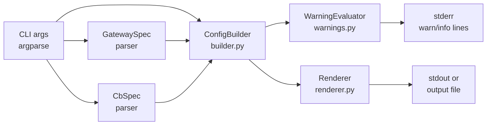

Version: 1.1.0

Date: 2026-06-16

Status: Design Proposal

# EduMatcher — Configuration Generator CLI Design Proposal


## Table of Contents

1. [Overview](#1-overview)
2. [Problem Statement](#2-problem-statement)
3. [Goals and Non-Goals](#3-goals-and-non-goals)
4. [Proposed CLI Surface](#4-proposed-cli-surface)
5. [Argument Reference](#5-argument-reference)
6. [Default Values and Generation Logic](#6-default-values-and-generation-logic)
7. [Warning and Validation Rules](#7-warning-and-validation-rules)
8. [Output Format](#8-output-format)
9. [Architecture and Module Design](#9-architecture-and-module-design)
10. [Example Invocations](#10-example-invocations)
11. [Implementation Plan](#11-implementation-plan)
12. [Testing Guide](#12-testing-guide)
13. [Acceptance Checklist](#13-acceptance-checklist)


## 1. Overview

Building a correct `engine_config.yaml` from scratch is error-prone: the file
has many interdependent sections, cross-field validation rules, and non-obvious
defaults. Mistakes (such as adding a `MARKET_MAKER` gateway without providing
quote seeds for every symbol, or referencing an undefined risk level) are not
caught until engine startup fails.

This proposal adds a **new server-side command-line tool**:

```bash
poetry run pm-config-gen [options]
```

The generator accepts high-level operator intent on the command line and emits a
syntactically valid, parser-accepted `engine_config.yaml`. For any value not
explicitly provided, it chooses a documented sane default and, where the omission
could cause operational issues, it prints an advisory warning to `stderr`.


## 2. Problem Statement

The current workflow for creating an engine configuration is:

1. Copy the sample `engine_config.yaml` from the project root.
2. Edit it by hand to add symbols, gateways, risk levels, and optional sections.
3. Validate by starting the engine and observing startup errors.
4. Fix errors and repeat.

This approach has several failure modes:

- Forgetting to add `market_maker_quotes` for every symbol when a `MARKET_MAKER`
  gateway is configured causes a hard error at startup.
- Referencing a risk level by name without defining it under `risk_controls.levels`
  causes a hard error.
- Leaving `sessions_enabled: true` without configuring a schedule means the engine
  waits in `CLOSED` state indefinitely if `pm-scheduler` is not started.
- Using `tif: GTC` in startup combo seeds combined with existing persisted state
  produces duplicate orders on restart.

A generator that understands these rules can catch all of them before a config
file is written.


## 3. Goals and Non-Goals

### 3.1 Goals

- Provide a **one-shot, write-only** CLI that generates a complete `engine_config.yaml`.
- Accept the minimum required information (symbols, gateways) as mandatory arguments.
- Accept all optional configuration sections (risk controls, circuit breakers,
  market-maker obligations, startup seeds, schedule) as optional arguments.
- Apply documented sane defaults for every omitted optional field.
- Emit **advisory warnings to `stderr`** when omitted values could cause problems.
- Produce output that passes `load_engine_config()` without modification.
- Support writing output directly to a file (`--output`) or to `stdout` for piping.
- Support a `--dry-run` mode that prints what would be generated without writing.
- Produce well-commented YAML so the generated file is self-documenting.

### 3.2 Non-Goals

- The generator does **not** modify existing config files; it creates new ones.
- The generator does **not** start the engine or scheduler.
- The generator does **not** replace the full parser; it is not an authoritative
  validator of arbitrary existing configs (use `load_engine_config()` for that).
- The generator does **not** generate `market_maker_combos` entries; startup combo
  seeds require per-leg symbol, side, quantity, and integer tick prices that only
  the operator knows.
- The generator does **not** emit gateway-level `mm_obligations` mappings
  (`gateways.alf[*].mm_obligations`). Per-gateway per-symbol MM overrides must be
  added manually. The generator covers the equivalent via
  `mm_obligation_defaults.symbols` (section 5.7 `--symbol-opts mm_spread_ticks`
  and `mm_min_qty`).
- The generator does **not** provide an interactive TUI or wizard mode.


## 4. Proposed CLI Surface

```
usage: pm-config-gen [-h] --symbols SYM [SYM ...]
                     --gateways GW_SPEC [GW_SPEC ...]
                     [--symbol-opts SYMBOL:KEY=VALUE[,...] [...]]
                     [--sessions-enabled | --no-sessions-enabled]
                     [--snapshot-interval SECS]
                     [--no-collars] [--no-circuit-breakers]
                     [--static-band PCT] [--dynamic-band PCT]
                     [--risk-level LEVEL_SPEC [LEVEL_SPEC ...]]
                     [--cb-levels CB_SPEC [CB_SPEC ...]]
                     [--cb-window-ns NS]
                     [--mm-spread-ticks N] [--mm-min-qty N]
                     [--enforce-mm-obligations | --no-enforce-mm-obligations]
                     [--tick-decimals N]
                     [--seed-last-prices]
                     [--schedule | --no-schedule]
                     [--pre-open HH:MM] [--opening-auction HH:MM]
                     [--continuous HH:MM] [--closing-auction HH:MM]
                     [--closing-end HH:MM]
                     [--output FILE]
                     [--force]
                     [--dry-run]
```

The gateway spec format encodes role and disconnect behaviour in a compact string
so the operator does not need to repeat flags per gateway:

```
GW_SPEC := ID[:ROLE[:DISCONNECT]]

Examples:
  TRADER01            → role=TRADER,  disconnect=CANCEL_ALL
  TRADER01:TRADER     → role=TRADER,  disconnect=CANCEL_ALL
  MM01:MARKET_MAKER   → role=MARKET_MAKER, disconnect=CANCEL_QUOTES_ONLY
  OPS01:ADMIN         → role=ADMIN,   disconnect=LEAVE_ALL
  MM01:MARKET_MAKER:CANCEL_QUOTES_ONLY  → explicit override
```

When `ROLE` is omitted, the default role is `TRADER`. When `DISCONNECT` is
omitted, it defaults to the role's natural default:

| Role | Default disconnect |
|---|---|
| `TRADER` | `CANCEL_ALL` |
| `MARKET_MAKER` | `CANCEL_QUOTES_ONLY` |
| `ADMIN` | `LEAVE_ALL` |


## 5. Argument Reference

### 5.1 Required Arguments

| Argument | Example | Description |
|---|---|---|
| `--symbols` | `--symbols AAPL MSFT TSLA` | One or more trading symbols. Sets the complete symbol universe. |
| `--gateways` | `--gateways TRADER01 TRADER02 MM01:MARKET_MAKER OPS01:ADMIN` | One or more gateway specs. |

### 5.2 Session Control

| Argument | Default | Description |
|---|---|---|
| `--sessions-enabled` | Flag (adds `sessions_enabled: true`) | Enable scheduler-driven session phases. |
| `--no-sessions-enabled` | Default if neither flag given | Disable sessions; engine starts in `CONTINUOUS`. |
| `--schedule` | Included when `--sessions-enabled` is set | Emit the `schedule` section with default times. |
| `--no-schedule` | — | Suppress the `schedule` section even when sessions are enabled. |
| `--pre-open` | `09:00` | Override pre-open time (`HH:MM`). |
| `--opening-auction` | `09:25` | Override opening auction start (`HH:MM`). |
| `--continuous` | `09:30` | Override continuous session start (`HH:MM`). |
| `--closing-auction` | `16:00` | Override closing auction start (`HH:MM`). |
| `--closing-end` | `16:05` | Override closing auction end (`HH:MM`). |

### 5.3 Engine Behavior

| Argument | Default | Description |
|---|---|---|
| `--snapshot-interval` | `0.5` | Per-symbol book snapshot throttle in seconds. |
| `--no-collars` | Collars enabled by default | Set `enforce_collars: false`. |
| `--no-circuit-breakers` | Circuit breakers enabled by default | Set `enforce_circuit_breakers: false`. |

### 5.4 Risk Controls and Collars

The engine applies a collar to a symbol only when a collar source is present
(`symbols.<SYM>.collar`, the symbol's `level`, or `risk_controls.default_level`).
The generator therefore maps collars onto `risk_controls` as follows:

| Argument | Default | Description |
|---|---|---|
| `--static-band` | `0.20` | `static_band_pct` for the generated `DEFAULT` level. Applied as `risk_controls.levels.DEFAULT.collar.static_band_pct`. |
| `--dynamic-band` | `0.02` | `dynamic_band_pct` for the generated `DEFAULT` level. |
| `--risk-level` | — | Define one or more *additional* named collar levels (repeatable). |

If either `--static-band` or `--dynamic-band` is supplied, the generator emits a
`risk_controls` block containing a level named `DEFAULT` and sets
`risk_controls.default_level: DEFAULT`, so every symbol inherits that collar
unless it overrides it.

`--risk-level` accepts one or more specs of the form:

```
LEVEL_SPEC := NAME:STATIC_PCT[:DYNAMIC_PCT]

Examples:
  STRICT:0.12:0.01     → static 12%, dynamic 1%
  RELAXED:0.30:0.05    → static 30%, dynamic 5%
  WIDE:0.40            → static 40%, dynamic defaults to 0.02
```

Each named level is added under `risk_controls.levels.<NAME>` and can be
referenced from a symbol via `--symbol-opts <SYM>:level=<NAME>` (section 5.7).
Named levels created with `--risk-level` are **not** the default; only the
`DEFAULT` level (from `--static-band`/`--dynamic-band`) becomes `default_level`.
If no global band flags are supplied, `default_level` is omitted and symbols
without an explicit `level=` get no collar — matching the engine rule that a
symbol has no collar unless a level or inline collar applies.

### 5.5 Circuit Breakers

`--cb-levels` accepts one or more specs of the form:

```
CB_SPEC := NAME:SHIFT_PCT[:HALT_MINS]

Examples:
  L1:0.07:5       → 7% shift, 5-minute halt
  L2:0.13:15      → 13% shift, 15-minute halt
  L3:0.20         → 20% shift, rest-of-day (no halt_duration_ns)
```

| Argument | Default | Description |
|---|---|---|
| `--cb-levels` | L1:0.07:5 L2:0.13:15 L3:0.20 | Circuit-breaker ladder entries. |
| `--cb-window-ns` | `300000000000` | Reference window size for CB calculations in nanoseconds. |

The `resumption_mode` field on every CB level is fixed at `AUCTION` and is
always emitted. There is no CLI flag to change it; operators who need
`CONTINUOUS` resumption must edit the generated file. This covers the common
case and matches the engine's built-in default ladder.

### 5.6 Market-Maker Obligations

These apply globally via `mm_obligation_defaults`.

| Argument | Default | Description |
|---|---|---|
| `--mm-spread-ticks` | `20` | Maximum spread in ticks for MM obligation. |
| `--mm-min-qty` | `100` | Minimum bid/ask quantity for MM obligation. |
| `--enforce-mm-obligations` | Flag | Set `enforce_mm_obligation: true` globally. |
| `--no-enforce-mm-obligations` | Default | Set `enforce_mm_obligation: false` globally. |
Per-symbol MM obligation overrides via `--symbol-opts mm_spread_ticks` and
`mm_min_qty` are written under `mm_obligation_defaults.symbols.<SYM>` (section
5.7). The more specific `gateways.alf[*].mm_obligations` level is a non-goal
(section 3.2); those overrides must be added manually after generation.
### 5.7 Symbol Options

Two layers of symbol configuration exist: **global defaults** that apply to
every symbol, and **per-symbol overrides** that apply to a single named symbol.

#### Global symbol defaults

| Argument | Default | Description |
|---|---|---|
| `--tick-decimals` | `2` | `tick_decimals` applied uniformly to every symbol. |
| `--seed-last-prices` | Off | Emit `last_buy_price: null` / `last_sell_price: null` placeholders with a fill-in comment for every symbol. These values are always `null` because the generator cannot know market prices; they must be edited manually before starting the engine. |

#### Per-symbol overrides — `--symbol-opts`

For symbols that need individual settings that differ from the global defaults,
use one or more `--symbol-opts` flags:

```
--symbol-opts SYMBOL:KEY=VALUE[,KEY=VALUE,...]
```

Each flag targets a single symbol by name. Multiple flags for the same symbol
are merged. Symbol names are uppercased automatically.

Accepted keys:

| Key | Type | Maps to | Notes |
|---|---|---|---|
| `tick_decimals` | integer `0..8` | `symbols.<SYM>.tick_decimals` | Overrides `--tick-decimals` for this symbol only. |
| `static_band` | float `(0,1)` | `symbols.<SYM>.collar.static_band_pct` | Adds an inline collar override; does not require `--static-band` globally. |
| `dynamic_band` | float `(0,1)` | `symbols.<SYM>.collar.dynamic_band_pct` | Adds an inline collar override. |
| `cb_shift_L1` | float `(0,1)` | `symbols.<SYM>.circuit_breaker.levels.L1.price_shift_pct` | Per-symbol CB level override. |
| `cb_halt_L1` | integer minutes or `0` for rest-of-day | `symbols.<SYM>.circuit_breaker.levels.L1.halt_duration_ns` | Converted to nanoseconds. `0` means rest-of-day (`null`). |
| `cb_shift_L2` | float `(0,1)` | `symbols.<SYM>.circuit_breaker.levels.L2.price_shift_pct` | |
| `cb_halt_L2` | integer minutes or `0` | `symbols.<SYM>.circuit_breaker.levels.L2.halt_duration_ns` | |
| `cb_shift_L3` | float `(0,1)` | `symbols.<SYM>.circuit_breaker.levels.L3.price_shift_pct` | |
| `cb_halt_L3` | integer minutes or `0` | `symbols.<SYM>.circuit_breaker.levels.L3.halt_duration_ns` | |
| `level` | string | `symbols.<SYM>.level` | Assigns a named risk level. The level must exist in `risk_controls.levels` — i.e. `DEFAULT` (from `--static-band`/`--dynamic-band`) or a name defined with `--risk-level` (section 5.4). Referencing an undefined level triggers a `[WARN]` and would fail `load_engine_config()`. |
| `mm_spread_ticks` | positive integer | per-symbol entry in `mm_obligation_defaults.symbols.<SYM>.mm_max_spread_ticks` | |
| `mm_min_qty` | positive integer | per-symbol entry in `mm_obligation_defaults.symbols.<SYM>.mm_min_qty` | |

Example:

```bash
--symbol-opts AAPL:tick_decimals=2,static_band=0.15,dynamic_band=0.01 \
--symbol-opts TSLA:tick_decimals=2,static_band=0.30,cb_shift_L1=0.10,cb_halt_L1=10
```

#### What the generator can and cannot produce

| Field | CLI source | Generator behaviour |
|---|---|---|
| `tick_decimals` | `--tick-decimals` (global) or `--symbol-opts tick_decimals` | Always emitted; defaults to `2`. |
| `collar.static_band_pct` | `--static-band` (global) or `--symbol-opts static_band` | Emitted as inline symbol collar when per-symbol override given; emitted under `risk_controls` when only global flag given. |
| `collar.dynamic_band_pct` | `--dynamic-band` (global) or `--symbol-opts dynamic_band` | Same rule as `static_band_pct`. |
| `circuit_breaker.levels.*` | `--cb-levels` (global defaults) or `--symbol-opts cb_shift_*`/`cb_halt_*` | Per-symbol CB override block emitted only when at least one CB key is provided for that symbol. |
| `level` | `--symbol-opts level` | Emitted as `level: <NAME>` on the symbol; the named level must exist in `risk_controls.levels` (`DEFAULT` or a `--risk-level` name). |
| `last_buy_price` | Cannot be set via CLI | Emitted as `null` placeholder with fill-in comment only when `--seed-last-prices` is given. **Must be edited manually.** |
| `last_sell_price` | Cannot be set via CLI | Same as `last_buy_price`. **Must be edited manually.** |
| `market_maker_quotes[].bid_price` | Cannot be set via CLI | Always emitted as `null` stub when a `MARKET_MAKER` gateway exists. **Must be edited manually.** |
| `market_maker_quotes[].ask_price` | Cannot be set via CLI | Same as `bid_price`. **Must be edited manually.** |

### 5.8 Output Control

| Argument | Default | Description |
|---|---|---|
| `--output` | stdout | File path to write the generated config. |
| `--force` | Off | Overwrite the output file if it already exists. |
| `--dry-run` | Off | Print what would be generated to stdout without writing any file. |


## 6. Default Values and Generation Logic

### 6.1 Sections Emitted by Default

When only `--symbols` and `--gateways` are provided:

```
sessions_enabled: false
enforce_collars: true
enforce_circuit_breakers: true
snapshot_interval_sec: 0.5

symbols:
  <each symbol>:
    tick_decimals: 2          ← from --tick-decimals (default 2)

gateways:
  alf:
    <each gateway with role-derived defaults>
```

No risk controls, no circuit breaker defaults, no MM obligations, no schedule, and
no market-maker quote seeds are emitted. This is the valid minimal configuration.

### 6.1.1 Generated symbol block — full anatomy

The following table shows every possible field a generated symbol block can
contain and how each one is populated:

| YAML field | Populated when | Value source | Manual edit needed? |
|---|---|---|---|
| `tick_decimals` | Always | `--tick-decimals` or `--symbol-opts tick_decimals` | No |
| `level` | `--symbol-opts level=NAME` | Operator-supplied name | No (but level must exist in `risk_controls.levels`) |
| `last_buy_price` | `--seed-last-prices` | Always `null` | **Yes — must be set to a real price** |
| `last_sell_price` | `--seed-last-prices` | Always `null` | **Yes — must be set to a real price** |
| `collar.static_band_pct` | `--symbol-opts static_band` | Operator-supplied float | No |
| `collar.dynamic_band_pct` | `--symbol-opts dynamic_band` | Operator-supplied float | No |
| `circuit_breaker.levels.*.price_shift_pct` | `--symbol-opts cb_shift_*` | Operator-supplied float | No |
| `circuit_breaker.levels.*.halt_duration_ns` | `--symbol-opts cb_halt_*` | Converted from minutes | No |
| `market_maker_quotes[].gateway_id` | Any `MARKET_MAKER` gateway exists | Taken from gateway list | No |
| `market_maker_quotes[].bid_price` | Any `MARKET_MAKER` gateway exists | Always `null` | **Yes — must be set to a real price** |
| `market_maker_quotes[].ask_price` | Any `MARKET_MAKER` gateway exists | Always `null` | **Yes — must be set to a real price** |
| `market_maker_quotes[].bid_qty` | Any `MARKET_MAKER` gateway exists | Fixed stub default: `1000` | Optional — adjust to satisfy `mm_min_qty` |
| `market_maker_quotes[].ask_qty` | Any `MARKET_MAKER` gateway exists | Fixed stub default: `1000` | Optional — adjust to satisfy `mm_min_qty` |
| `market_maker_quotes[].tif` | Any `MARKET_MAKER` gateway exists | Fixed: `DAY` | Optional — edit if `GTC` needed |
| `market_maker_quotes[].seed_once` | Any `MARKET_MAKER` gateway exists | Fixed: `true` | Optional — edit if repeat injection needed |
| `market_maker_quotes[].quote_id` | Never | Omitted — engine auto-generates | No |
| `circuit_breaker_defaults.levels.*.resumption_mode` | `--cb-levels` | Fixed: `AUCTION` | Optional — edit if `CONTINUOUS` needed |
| `gateways.alf[].description` | Never | Omitted — engine coerces to `""` | No |
| `gateways.alf[].mm_obligations` | Never | Not generated (non-goal, section 3.2) | **Yes — add manually for gateway-level overrides** |
| `market_maker_combos` | Never | Not generated (non-goal, section 3.2) | **Yes — add manually** |

### 6.2 Conditional Section Emission

| Condition | Section emitted |
|---|---|
| At least one `MARKET_MAKER` gateway | `mm_obligation_defaults` block; stub `market_maker_quotes` list for every symbol |
| `--sessions-enabled` | `sessions_enabled: true` + `schedule` block |
| `--static-band` or `--dynamic-band` | `risk_controls` block with a `DEFAULT` level (set as `default_level`) |
| `--risk-level NAME:...` | Additional named level(s) under `risk_controls.levels` |
| `--cb-levels` | `circuit_breaker_defaults` block |
| `--enforce-mm-obligations` | `mm_obligation_defaults.enforce_mm_obligation: true` |

### 6.3 Market-Maker Quote Seed Stubs

When a `MARKET_MAKER` gateway is present, the generator cannot know bid/ask prices
or quantities. It therefore emits stub entries and prints a warning:

```yaml
    market_maker_quotes:
      # WARNING: pm-config-gen cannot set prices. Fill these in before starting.
      - gateway_id: MM01
        bid_price: null    # REQUIRED: set display bid price e.g. 100.00
        ask_price: null    # REQUIRED: set display ask price e.g. 102.00
        bid_qty: 1000
        ask_qty: 1000
        tif: DAY
        seed_once: true
```

The engine will reject `null` prices, so the operator is forced to edit the file
before starting. The stubs serve as a checklist rather than a runnable seed.

**Fixed defaults for quote seed fields** (no CLI flags for these):

| Field | Fixed value | Rationale |
|---|---|---|
| `quote_id` | Omitted | The engine auto-generates a unique ID when `quote_id` is absent or empty. |
| `tif` | `DAY` | Safest default for classroom use; prevents GTC seeds from accumulating across restarts. |
| `seed_once` | `true` | Prevents duplicate injection once `book_stats.json` records symbol history. |

Operators who need `tif: GTC` or `seed_once: false` must edit the generated file
after reviewing the persistence implications documented in
`docs/user-guide/01-configuration.md`.

### 6.4 Default Role-to-Gateway Mapping

| Role | `disconnect_behaviour` | `quote_refresh_policy` | `description` |
|---|---|---|---|
| `TRADER` | `CANCEL_ALL` | omitted | omitted (engine uses `""`) |
| `MARKET_MAKER` | `CANCEL_QUOTES_ONLY` | `INACTIVATE_ON_ANY_FILL` | omitted (engine uses `""`) |
| `ADMIN` | `LEAVE_ALL` | omitted | omitted (engine uses `""`) |

The `description` field is never emitted by the generator. The engine parser
coerces a missing or null value to an empty string, so omitting it is
functionally identical to `description: ""`.


## 7. Warning and Validation Rules

The generator prints warnings to `stderr` in the format:

```
[WARN] <message>
[INFO] <message>
```

The generator always exits `0` unless a fatal error is encountered (such as an
argument parse error or a refused file overwrite without `--force`). Warnings are
advisory only.

### 7.1 Warning Conditions

| Condition | Message |
|---|---|
| A `MARKET_MAKER` gateway is specified | `[WARN] MARKET_MAKER gateway MM01 requires quote seeds for every symbol. Stubs emitted — fill in prices before starting the engine.` |
| `--sessions-enabled` but no `--schedule` (and no `--no-schedule`) | `[INFO] sessions_enabled: true — emitting default schedule (09:00–16:05). Override with --pre-open, --opening-auction etc. if needed.` |
| `--sessions-enabled` but no `pm-scheduler` note | `[INFO] sessions_enabled: true means the engine starts in CLOSED. Start pm-scheduler to drive session transitions.` |
| `--no-collars` or `--no-circuit-breakers` | `[WARN] enforce_collars/enforce_circuit_breakers disabled. Suitable for tests only.` |
| `--tick-decimals 0` | `[WARN] tick_decimals=0 means all prices are whole numbers. Confirm this is intentional for your instruments.` |
| More than 10 symbols | `[INFO] Large symbol universe (N symbols). Consider whether all participants need all symbols.` |
| Only one gateway | `[WARN] Only one gateway configured. In production, consider adding an ADMIN gateway for operational control.` |
| No `ADMIN` gateway | `[INFO] No ADMIN gateway configured. Without one, exchange-wide halt/resume commands cannot be sent.` |
| Output file already exists (no `--force`) | Fatal: `[ERROR] Output file already exists. Use --force to overwrite.` |
| Symbol name contains lowercase | `[INFO] Symbol names are uppercased by the engine loader; "aapl" will become "AAPL".` |
| Gateway ID contains lowercase | `[INFO] Gateway IDs are uppercased by the engine loader; "trader01" will become "TRADER01".` |
| `--seed-last-prices` not given with `MARKET_MAKER` | `[INFO] Consider --seed-last-prices to emit placeholder last_buy_price/last_sell_price fields for viewer reference. They are required for collar initialization.` |
| `--symbol-opts <SYM>:level=<NAME>` references a level not defined by `--static-band`/`--dynamic-band` (DEFAULT) or `--risk-level` | `[WARN] Symbol SYM references undefined risk level NAME. Define it with --risk-level NAME:STATIC:DYNAMIC or the engine will reject the config.` |


## 8. Output Format

The generator emits YAML with inline comments that explain each section's purpose
for operators unfamiliar with the full reference. Comments follow a consistent
convention:

```yaml
# ── Session control ──────────────────────────────────────────────────────────
# Set to false to start directly in CONTINUOUS matching.
# Set to true and start pm-scheduler to drive trading phases.
sessions_enabled: false

# ── Engine behavior ───────────────────────────────────────────────────────────
enforce_collars: true        # reject orders outside static/dynamic price bands
enforce_circuit_breakers: true  # halt symbols on large price moves
snapshot_interval_sec: 0.5  # throttle: max one book update per 0.5 s per symbol
```

The generator also emits a header block with generation metadata:

```yaml
# Generated by pm-config-gen v<version> on <ISO-8601 date>
# Command: pm-config-gen --symbols AAPL MSFT --gateways TRADER01 TRADER02
#
# Validate with:
#   poetry run python -c 'from pathlib import Path; \
#     from edumatcher.engine.config_loader import load_engine_config; \
#     print(load_engine_config(Path("<this file>")))'
```


## 9. Architecture and Module Design

### 9.1 Module Location

```
src/edumatcher/
    commands/
        config_gen.py          ← new: argument parsing + orchestration
    config_gen/
        __init__.py
        builder.py             ← assembles the config dict from parsed args
        defaults.py            ← all sane default constants
        warnings.py            ← warning rule evaluation
        renderer.py            ← YAML serialisation with comments
        gateway_spec.py        ← GW_SPEC parser (ID[:ROLE[:DISCONNECT]])
        cb_spec.py             ← CB_SPEC parser (NAME:SHIFT[:HALT_MINS])
        symbol_spec.py         ← --symbol-opts parser (SYMBOL:k=v[,k=v,...])
        risk_spec.py           ← LEVEL_SPEC parser (NAME:STATIC[:DYNAMIC])
```

### 9.2 Data Flow



### 9.3 `ConfigBuilder`

`ConfigBuilder` holds a `ConfigSpec` dataclass populated from parsed CLI arguments
and exposes a single `build() -> dict` method that returns the raw Python dict
to be serialised as YAML. It does not call `load_engine_config()` internally; the
final validation pass is delegated to the operator via the printed `Validate with`
comment.

```python
@dataclass
class SymbolOverride:
    """Per-symbol CLI overrides collected from --symbol-opts SYMBOL:k=v,..."""
    tick_decimals: int | None = None
    static_band_pct: float | None = None
    dynamic_band_pct: float | None = None
    # Per-level CB overrides: key is level name (e.g. "L1")
    cb_shift: dict[str, float] = field(default_factory=dict)   # cb_shift_L1 etc.
    cb_halt_mins: dict[str, int | None] = field(default_factory=dict)  # None = rest-of-day
    level: str | None = None
    mm_spread_ticks: int | None = None
    mm_min_qty: int | None = None


@dataclass
class ConfigSpec:
    symbols: list[str]
    gateways: list[GatewaySpec]
    sessions_enabled: bool = False
    snapshot_interval_sec: float = 0.5
    enforce_collars: bool = True
    enforce_circuit_breakers: bool = True
    static_band_pct: float | None = None      # global collar default
    dynamic_band_pct: float | None = None     # global collar default
    # Additional named collar levels from --risk-level; name → (static, dynamic|None).
    # The DEFAULT level (from static_band_pct/dynamic_band_pct) is added separately
    # and becomes default_level when present.
    risk_levels: dict[str, tuple[float, float | None]] = field(default_factory=dict)
    cb_levels: list[CbSpec] = field(default_factory=list)
    cb_window_ns: int = 300_000_000_000
    mm_spread_ticks: int = 20
    mm_min_qty: int = 100
    enforce_mm_obligations: bool = False
    tick_decimals: int = 2                    # global symbol default
    seed_last_prices: bool = False
    emit_schedule: bool = True
    pre_open: str = "09:00"
    opening_auction: str = "09:25"
    continuous: str = "09:30"
    closing_auction: str = "16:00"
    closing_end: str = "16:05"
    # Per-symbol overrides from --symbol-opts; key is uppercased symbol name
    symbol_overrides: dict[str, SymbolOverride] = field(default_factory=dict)
```

### 9.4 `Renderer`

The renderer uses `ruamel.yaml` (or `PyYAML` with a custom `Dumper`) to write
the dict with inline comments. The preferred approach uses `ruamel.yaml`'s
`CommentedMap` so that comments survive round-trips and are attached to specific
keys rather than inserted as raw string nodes.

If `ruamel.yaml` is not available, the renderer falls back to plain `PyYAML`
`yaml.dump()` with a pre-pass that injects a comment banner above each top-level
section key.

### 9.5 `pyproject.toml` Entry Point

```toml
[tool.poetry.scripts]
pm-config-gen = "edumatcher.commands.config_gen:main"
```

### 9.6 Dependencies

| Dependency | Required | Purpose |
|---|---|---|
| `ruamel.yaml` | Optional (fallback to PyYAML) | Comment-preserving YAML output |
| `PyYAML` | Already in project | Fallback YAML serialisation |
| `argparse` | stdlib | CLI argument parsing |


## 10. Example Invocations

### 10.1 Per-symbol override example

```bash
poetry run pm-config-gen \
  --symbols AAPL MSFT TSLA \
  --gateways TRADER01 OPS01:ADMIN \
  --tick-decimals 2 \
  --static-band 0.20 --dynamic-band 0.02 \
  --cb-levels L1:0.07:5 L2:0.13:15 L3:0.20 \
  --symbol-opts TSLA:static_band=0.30,dynamic_band=0.05 \
  --symbol-opts TSLA:cb_shift_L1=0.10,cb_halt_L1=10,cb_shift_L2=0.20,cb_halt_L2=30 \
  --symbol-opts EURUSD:tick_decimals=4 \
  --output engine_config.yaml
```

`AAPL` and `MSFT` get the global collar and default CB ladder. `TSLA` gets its
own wider collar and a tighter CB halt schedule as symbol-level overrides.
`EURUSD` (if included) would get `tick_decimals: 4`.

The generated `symbols` block would look like:

```yaml
symbols:
  AAPL:
    tick_decimals: 2
    # collar and circuit_breaker inherited from global defaults

  MSFT:
    tick_decimals: 2

  TSLA:
    tick_decimals: 2
    collar:                         # symbol-level override via --symbol-opts
      static_band_pct: 0.30
      dynamic_band_pct: 0.05
    circuit_breaker:                # symbol-level override via --symbol-opts
      levels:
        L1:
          price_shift_pct: 0.10
          halt_duration_ns: 600000000000   # 10 min
        L2:
          price_shift_pct: 0.20
          halt_duration_ns: 1800000000000  # 30 min
```

### 10.2 Minimal two-trader exchange

```bash
poetry run pm-config-gen \
  --symbols AAPL \
  --gateways TRADER01 TRADER02
```

Output written to stdout. No warnings except the default info about no `ADMIN`
gateway.

### 10.3 Three-symbol classroom session with schedule

```bash
poetry run pm-config-gen \
  --symbols AAPL MSFT TSLA \
  --gateways TRADER01 TRADER02 OPS01:ADMIN \
  --sessions-enabled \
  --static-band 0.20 --dynamic-band 0.02 \
  --tick-decimals 2 \
  --output engine_config.yaml
```

Emits: `sessions_enabled: true`, `schedule` (default times), and a `risk_controls`
block with one level named `DEFAULT` set as `default_level`, so every symbol
inherits that collar (the collar is **not** written inline on each symbol).

### 10.4 Market-maker setup with obligations and circuit breakers

```bash
poetry run pm-config-gen \
  --symbols AAPL MSFT \
  --gateways TRADER01 TRADER02 MM01:MARKET_MAKER OPS01:ADMIN \
  --sessions-enabled \
  --enforce-mm-obligations \
  --mm-spread-ticks 10 --mm-min-qty 200 \
  --cb-levels L1:0.07:5 L2:0.13:15 L3:0.20 \
  --cb-window-ns 300000000000 \
  --static-band 0.20 --dynamic-band 0.02 \
  --seed-last-prices \
  --output engine_config.yaml --force
```

Warnings printed to `stderr`:

```
[WARN] MARKET_MAKER gateway MM01 requires quote seeds for every symbol.
       Stubs emitted — fill in bid_price/ask_price before starting the engine.
[INFO] sessions_enabled: true — emitting default schedule (09:00–16:05).
[INFO] sessions_enabled: true means the engine starts in CLOSED.
       Start pm-scheduler to drive session transitions.
```

### 10.5 Dry-run preview

```bash
poetry run pm-config-gen \
  --symbols AAPL \
  --gateways TRADER01 \
  --dry-run
```

Prints the YAML to stdout (with the generation metadata header) and exits 0
without writing any file.

### 10.6 Generated output example

```yaml
# Generated by pm-config-gen v1.0.0 on 2026-06-16
# Command: pm-config-gen --symbols AAPL MSFT --gateways TRADER01 TRADER02
#          MM01:MARKET_MAKER OPS01:ADMIN --sessions-enabled
#          --enforce-mm-obligations --cb-levels L1:0.07:5 L2:0.13:15 L3:0.20
#
# Validate with:
#   poetry run python -c 'from pathlib import Path; \
#     from edumatcher.engine.config_loader import load_engine_config; \
#     print(load_engine_config(Path("engine_config.yaml")))'

# ── Session control ───────────────────────────────────────────────────────────
sessions_enabled: true

# ── Engine behavior ───────────────────────────────────────────────────────────
enforce_collars: true
enforce_circuit_breakers: true
snapshot_interval_sec: 0.5

# ── Market-maker obligation defaults ─────────────────────────────────────────
mm_obligation_defaults:
  enforce_mm_obligation: true
  mm_max_spread_ticks: 20
  mm_min_qty: 100

# ── Collar profiles ───────────────────────────────────────────────────────────
risk_controls:
  default_level: DEFAULT
  levels:
    DEFAULT:
      collar:
        static_band_pct: 0.20
        dynamic_band_pct: 0.02

# ── Circuit-breaker ladder ────────────────────────────────────────────────────
circuit_breaker_defaults:
  reference_window_ns: 300000000000
  levels:
    L1:
      price_shift_pct: 0.07
      halt_duration_ns: 300000000000
      resumption_mode: AUCTION
    L2:
      price_shift_pct: 0.13
      halt_duration_ns: 900000000000
      resumption_mode: AUCTION
    L3:
      price_shift_pct: 0.20
      halt_duration_ns:          # null = rest-of-day halt
      resumption_mode: AUCTION

# ── ALF gateway allowlist ─────────────────────────────────────────────────────
gateways:
  alf:
    - id: TRADER01
      role: TRADER
      disconnect_behaviour: CANCEL_ALL

    - id: TRADER02
      role: TRADER
      disconnect_behaviour: CANCEL_ALL

    - id: MM01
      role: MARKET_MAKER
      disconnect_behaviour: CANCEL_QUOTES_ONLY
      quote_refresh_policy: INACTIVATE_ON_ANY_FILL
      # obligation limits inherited from mm_obligation_defaults above

    - id: OPS01
      role: ADMIN
      disconnect_behaviour: LEAVE_ALL

# ── Symbol universe ───────────────────────────────────────────────────────────
symbols:
  AAPL:
    tick_decimals: 2
    market_maker_quotes:
      # WARNING: pm-config-gen cannot set prices. Fill these in before starting.
      - gateway_id: MM01
        bid_price: null    # REQUIRED: set display bid price e.g. 209.00
        ask_price: null    # REQUIRED: set display ask price e.g. 211.00
        bid_qty: 1000
        ask_qty: 1000
        tif: DAY
        seed_once: true

  MSFT:
    tick_decimals: 2
    market_maker_quotes:
      - gateway_id: MM01
        bid_price: null    # REQUIRED: set display bid price e.g. 415.00
        ask_price: null    # REQUIRED: set display ask price e.g. 417.00
        bid_qty: 1000
        ask_qty: 1000
        tif: DAY
        seed_once: true

# ── Session schedule ──────────────────────────────────────────────────────────
schedule:
  pre_open: "09:00"
  opening_auction_start: "09:25"
  continuous_start: "09:30"
  closing_auction_start: "16:00"
  closing_auction_end: "16:05"
```


## 11. Implementation Plan

### Phase 1 — Core generator (no MM stubs)

1. Add `src/edumatcher/config_gen/` package with `defaults.py`, `gateway_spec.py`,
   `cb_spec.py`, `risk_spec.py`, `builder.py`, `warnings.py`.
2. Add `src/edumatcher/commands/config_gen.py` with `argparse` wiring and
   `main()` entry point.
3. Register `pm-config-gen` in `pyproject.toml`.
4. Implement `builder.py` to produce the minimal config dict.
5. Implement `renderer.py` with PyYAML fallback only (no `ruamel.yaml` yet).
6. Add `symbol_spec.py` to parse `--symbol-opts SYMBOL:k=v,...` into
   `SymbolOverride` objects, and `risk_spec.py` to parse
   `--risk-level NAME:STATIC[:DYNAMIC]` into named collar levels.
7. Add unit tests for `gateway_spec.py`, `cb_spec.py`, `symbol_spec.py`, and
   `risk_spec.py` parsers.
8. Add integration test: invoke `pm-config-gen` and parse the output with
   `load_engine_config()`.

**Acceptance criterion:** `pm-config-gen --symbols AAPL --gateways TRADER01`
produces a file that `load_engine_config()` accepts without errors.

### Phase 2 — Market-maker stubs and warnings

1. Implement MM stub emission in `builder.py`.
2. Implement all warning rules in `warnings.py`.
3. Add `--enforce-mm-obligations`, `--mm-spread-ticks`, `--mm-min-qty` flags.
4. Add tests for warning rules (check `stderr` output).

**Acceptance criterion:** Generating with a `MARKET_MAKER` gateway prints a
warning and emits `null`-priced stubs that the user must fill in.

### Phase 3 — Comment-annotated output

1. Add `ruamel.yaml` as an optional dependency.
2. Implement the `CommentedMap`-based renderer path.
3. Keep the PyYAML fallback for environments where `ruamel.yaml` is unavailable.
4. Ensure comments survive round-trips in the `ruamel.yaml` path.

**Acceptance criterion:** Generated YAML contains section header comments and the
generation metadata block.

### Phase 4 — Documentation and integration

1. Add `pm-config-gen` to `docs/user-guide/10-processes.md` (tool inventory).
2. Add a `pm-config-gen` usage section to `docs/user-guide/01-configuration.md`.
3. Add `pm-config-gen --help` output to `scripts/README.md`.
4. Update `CHANGELOG.md`.


## 12. Testing Guide

### 12.1 Unit Tests

| File | What is tested |
|---|---|
| `tests/test_config_gen_gateway_spec.py` | `gateway_spec.py` parser: valid specs, invalid specs, role defaults, disconnect defaults |
| `tests/test_config_gen_cb_spec.py` | `cb_spec.py` parser: valid levels, missing halt, invalid shift |
| `tests/test_config_gen_symbol_spec.py` | `symbol_spec.py` parser: valid overrides, unknown keys, type coercion, multiple flags for same symbol |
| `tests/test_config_gen_risk_spec.py` | `risk_spec.py` parser: valid level specs, default dynamic band, invalid percentages |
| `tests/test_config_gen_builder.py` | `builder.py`: minimal build, with sessions, with global collars, with named risk levels, with per-symbol collar overrides, with per-symbol `level` references, with MM gateways, with CB levels, with per-symbol CB overrides |
| `tests/test_config_gen_warnings.py` | `warnings.py`: each warning condition |
| `tests/test_config_gen_renderer.py` | `renderer.py`: output is valid YAML; output parses with `load_engine_config()` |

### 12.2 Integration Tests

```python
def test_minimal_output_parses():
    result = subprocess.run(
        ["poetry", "run", "pm-config-gen",
         "--symbols", "AAPL",
         "--gateways", "TRADER01"],
        capture_output=True, text=True
    )
    assert result.returncode == 0
    with tempfile.NamedTemporaryFile("w", suffix=".yaml", delete=False) as f:
        f.write(result.stdout)
        path = Path(f.name)
    cfg = load_engine_config(path)
    assert "AAPL" in cfg.symbols
    assert "TRADER01" in cfg.fix_gateways

def test_market_maker_warns_and_stubs():
    result = subprocess.run(
        ["poetry", "run", "pm-config-gen",
         "--symbols", "AAPL",
         "--gateways", "TRADER01", "MM01:MARKET_MAKER"],
        capture_output=True, text=True
    )
    assert "[WARN]" in result.stderr
    assert "bid_price: null" in result.stdout
```

### 12.3 Coverage Target

All new modules under `src/edumatcher/config_gen/` should reach ≥ 90% branch
coverage. The integration test file is excluded from the coverage target.


## 13. Acceptance Checklist

- [ ] `pm-config-gen --symbols AAPL --gateways TRADER01` outputs valid YAML
- [ ] `--symbol-opts AAPL:tick_decimals=4` overrides `tick_decimals` for that symbol only
- [ ] `--symbol-opts TSLA:static_band=0.30,dynamic_band=0.05` emits inline `collar:` block on that symbol
- [ ] `--symbol-opts TSLA:cb_shift_L1=0.10,cb_halt_L1=10` emits inline `circuit_breaker:` override on that symbol
- [ ] `--risk-level STRICT:0.12:0.01` defines a named level under `risk_controls.levels`
- [ ] `--symbol-opts AAPL:level=STRICT` emits `level: STRICT` referencing a defined level
- [ ] `--symbol-opts AAPL:level=UNDEFINED` with no matching `--risk-level` produces a `[WARN]`
- [ ] Multiple `--symbol-opts` flags for the same symbol are merged correctly
- [ ] Unknown `--symbol-opts` keys produce a `[WARN]` and are ignored
- [ ] Output from any supported invocation passes `load_engine_config()` after
      required stubs are filled in
- [ ] `MARKET_MAKER` gateway triggers stub emission and `[WARN]` on stderr
- [ ] `--sessions-enabled` without `--no-schedule` emits default schedule
- [ ] `--no-collars` / `--no-circuit-breakers` emit a `[WARN]`
- [ ] `--output FILE` writes to the specified path; refuses to overwrite without
      `--force`
- [ ] `--dry-run` writes to stdout, not to disk
- [ ] All warning conditions listed in section 7.1 produce the documented message
- [ ] All unit tests pass under `pytest` with ≥ 90% branch coverage on new modules
- [ ] Integration tests pass against the installed `pm-config-gen` entry point
- [ ] `pm-config-gen` is listed in `docs/user-guide/10-processes.md`
- [ ] Usage example added to `docs/user-guide/01-configuration.md`
- [ ] `CHANGELOG.md` updated
