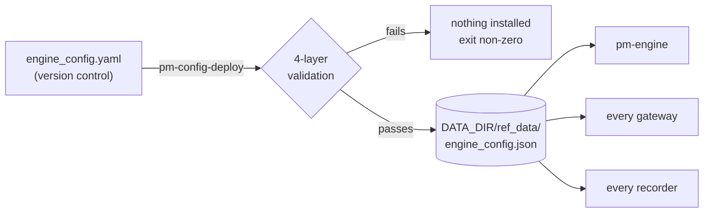
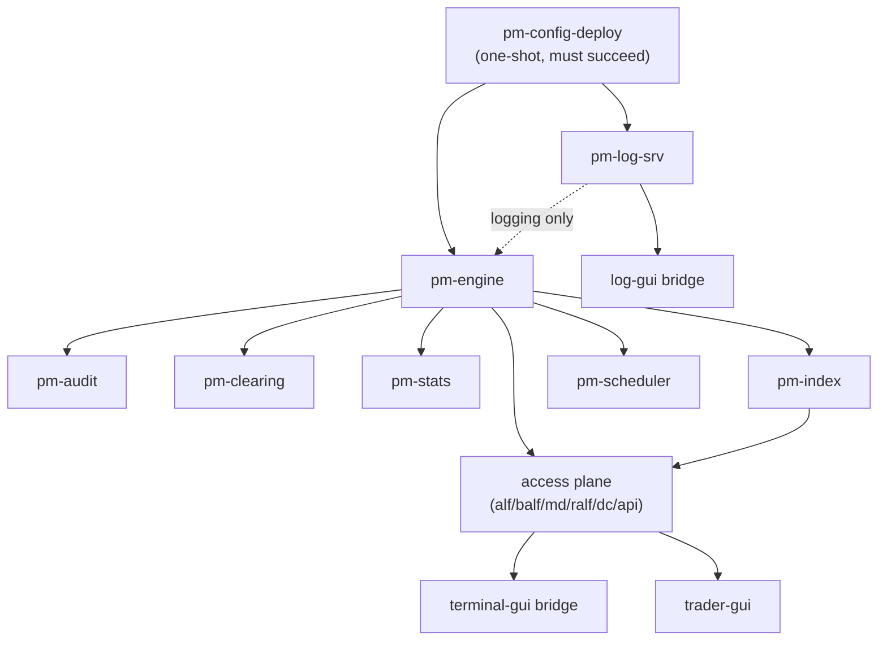

Version: 2.2.1

Date: 2026-08-19

Status: Design and Research Proposal

# EduMatcher Deployment Strategy Proposal

## 1. Purpose

This proposal defines a practical deployment strategy for the full EduMatcher
system that is as painless as possible for operators and instructors.

The strategy covers:

- Packaging boundaries (what ships together, what ships separately)
- VM + container layering
- A first-party Compose experience
- Packaging policy for the ALF TCP example client
- Release artifacts and upgrade path

The core goal is a predictable "download, configure, start, operate" flow with
minimal manual wiring.

!!! note "Nothing here is implemented yet"
    Every path, script and file in §9 onward is a *specification*. None of it
    exists in the repository at the time of writing. Facts about the *current*
    system — ports, entry points, `deployment/vm/` behaviour, the config pipeline — are
    marked **(current)** and were read from the source, not assumed.


## 2. Problem Statement

Today EduMatcher has strong runtime components, but packaging is split:

- The Python runtime (`pm-*`) is installable and usable.
- VM bootstrap scripts exist in `deployment/vm/`, but need refresh to current release shape.
- Browser UIs (`terminal-gui`, `log-gui`, `config-gui`, `trader-gui`) are not
  delivered as one cohesive operator deployment experience.
- There is no single, official orchestrator that starts the whole system in one
  command for common scenarios.

For an end user, this creates too many integration decisions too early.

Three concrete symptoms, verified against the current tree:

1. **40 console entry points, no start order.** `pyproject.toml` declares 40
   `pm-*` commands. Nothing states which are long-running services, which are
   one-shot tools, or in what order the services must start.
2. **Two port collisions in a full-stack deployment** (§6.3), at the time this
   was first written. They could not surface until someone ran every plane at
   once, which nobody had yet. **(current, as of v2.2.0)** One of the two —
   `config-gui` vs. `pm-api-gwy` on 8080 — has since been fixed at the source
   level; see §6.3. The other — `pm-api-gwy`'s `0.0.0.0` bind default — remains
   open.
3. **A deploy step exists but is undocumented as a deployment step.**
   `pm-config-deploy` **(current)** is already the compile-and-install boundary,
   and it is more load-bearing than the draft implied — see §5.


## 3. Design Principles

1. One obvious path: provide a default deployment path that works for most users.
2. Layered complexity: start simple, then add optional services.
3. Explicit boundaries: separate core exchange runtime from optional UIs.
4. Immutable release units: versioned images and pinned Compose bundles.
5. Config-first operations: deploy one compiled config artifact, then start services.
6. Reproducible upgrades: no snowflake host state.
7. **Fail before starting, not after.** Every precondition that can be checked
   without side effects is checked by a preflight step that changes nothing
   (§11). A stack that refuses to start with a reason is better than one that
   starts and is subtly wrong.
8. **The deployment is data-first.** Container images are replaceable; the data
   directory is not. Backup and restore are part of the deployment design, not
   an afterthought (§13).


## 4. Recommended Partitioning

Partition the system into 4 deployable planes.

### 4.1 Core Exchange Plane (mandatory)

Python processes that define market behavior and persistent market records:

| Process | Role | Persistent state owned |
|---|---|---|
| `pm-engine` | Matching engine; binds the venue's ZMQ sockets | `gtc_orders.json`, `gtc_combos.json`, `book_stats.json` |
| `pm-audit` | Audit recorder | `audit.log`, `audit_index.db` |
| `pm-clearing` | Position/P&L recorder | `clearing.db`, `clearing_report.csv` |
| `pm-stats` | Market statistics recorder | `stats.db` |
| `pm-scheduler` | Session state machine (when sessions enabled) | none |
| `pm-index` | Index calculation (when indices configured) | none |

This plane is the operational heart. It should be startable with zero Node
runtime dependencies.

**All state paths above are `DATA_DIR`-relative and are not individually
configurable** **(current)** — see §5.

### 4.2 Access Plane (optional but common)

External protocol and API gateways:

| Process | Protocol | Default port **(current)** |
|---|---|---|
| `pm-md-gwy` | CALF market data | 5570 |
| `pm-api-gwy` | REST/WebSocket | 8080 |
| `pm-alf-gwy` | ALF text order entry | 5565 |
| `pm-balf-gwy` | BALF binary order entry | 5560 |
| `pm-ralf-gwy` | RALF post-trade | 5580 |
| `pm-dc-gwy` | Drop copy | 5590 |

This plane is enabled per integration need.

### 4.3 UX Plane (optional)

Operator/viewer UIs with their own bridge services:

| Application | Bridge port **(current)** | Upstream it needs |
|---|---|---|
| TapeDeck (`terminal-gui`) | 8090 | CALF 5570, log-srv 5600 |
| Log Operator Console (`log-gui`) | 8091 | LALF-PS 5601/5602, `log.db` |
| Config GUI (`config-gui`) | 8092 | none at runtime |
| Trading GUI (`trader-gui`) | 8093 | `pm-api-gwy` 8080 (REST + WS) |

These should ship as prebuilt container images and never require the operator
to run npm locally.

### 4.4 Operations Plane (recommended)

Cross-cutting operational services:

- `pm-log-srv` — LALF collector on 5600, LALF-PS on 5601/5602
- `pm-log-cli` workflows — query, `diagnose`, `prune`
- backup/export tasks for `EDUMATCHER_DATA_DIR` (§13)

### 4.5 What is *not* a plane

Deliberately excluded from any deployment profile, because they are interactive
tools an operator runs by hand rather than services:

`pm-admin`, `pm-admin-cli`, `pm-alf-console`, `pm-viewer`, `pm-board`,
`pm-orders`, `pm-ticker`, `pm-calf-spy`, `pm-ralf-spy`, `pm-dc-spy`,
`pm-audit-cli`, `pm-clearing-cli`, `pm-stats-cli`, `pm-index-cli`,
`pm-index-admin-cli`, `pm-cverifier`, `pm-config-gen`, `pm-setup`.

Simulation drivers — `pm-ai-trader`, `pm-ai-swarm`, `pm-mm-bot` — are services
but belong to a *scenario*, not to a deployment. They get an optional `sim`
profile (§17) so a classroom demo can start them, and no supported deployment
requires them.


## 5. The deployment unit

This section is new in v2.0.0 and is the most important design constraint,
because it is not what a container-shaped intuition would predict.

### 5.1 One data directory is one exchange instance

**(current)** `src/edumatcher/config.py` resolves `DATA_DIR` once:

```
EDUMATCHER_DATA_DIR   (if set)
  → <repo>/src/data   (if running from a source checkout)
  → ~/.local/share/edumatcher
```

Everything else is derived from it and **cannot be overridden individually**:
`stats.db`, `clearing.db`, `audit.log`, `audit_index.db`, `log.db`,
`gtc_orders.json`, `book_stats.json`, `logs/`, and `ref_data/`.

The source comment is explicit that this is deliberate: a per-process `--config`
flag used to exist, and it failed quietly — `pm-md-gwy` would start with an
empty symbol universe and look healthy while the engine ran ten symbols.

**Deployment consequence:** `EDUMATCHER_DATA_DIR` is the single variable that
defines which exchange a process belongs to. Two processes with different values
are two exchanges that cannot see each other, and nothing will say so. Every
script in this design therefore sets it exactly once, in one place, and every
container mounts the same host path.

### 5.2 Configuration is compiled, not mounted

**(current)** `pm-config-deploy` validates an authored `engine_config.yaml`,
resolves every default once, and installs a compiled artifact:

```
<DATA_DIR>/ref_data/engine_config.json    ← what every process reads
<DATA_DIR>/ref_data/engine_config.yaml    ← the source it was built from
```

**No process accepts a config path.** This is a stronger guarantee than most
deployments have, and it inverts the usual Compose pattern: you do **not** mount
a config file into each service. You run one compile step against the shared
data directory, and every service picks it up.



**Deployment consequence:** config deployment is a *distinct, ordered phase*
before any service starts, and it is the only phase that can reject a rollout.
`deploy-up.sh` (§11) runs it first and aborts on failure.

### 5.3 What this means for the container boundary

A containerised Python plane must therefore:

- share one host directory as `EDUMATCHER_DATA_DIR` across every core and
  access container — not a per-service volume;
- run `pm-config-deploy` as a one-shot init container against that same volume,
  before any service container starts;
- never bake configuration into an image.

That is a strong argument for the hybrid model (§13 of v1.0.0, retained): the
data directory is shared mutable state, which containers make more awkward
rather than less.


## 6. Port and address map

### 6.1 Complete map (current defaults)

| Port | Bound by | Protocol | Direction | Plane |
|---|---|---|---|---|
| 5555 | `pm-engine` | ZMQ PULL | inbound from gateways | Core |
| 5556 | `pm-engine` | ZMQ PUB | outbound to everything | Core |
| 5557 | `pm-engine` | ZMQ PUB | drop copy | Core |
| 5558 | `pm-index` | ZMQ PUB | index levels | Core |
| 5559 | `pm-index` | ZMQ PULL | index control | Core |
| 5560 | `pm-balf-gwy` | BALF/TCP | external clients | Access |
| 5565 | `pm-alf-gwy` | ALF/TCP | external clients | Access |
| 5570 | `pm-md-gwy` | CALF/TCP | external clients | Access |
| 5580 | `pm-ralf-gwy` | RALF/TCP | external clients | Access |
| 5590 | `pm-dc-gwy` | DC/TCP | external clients | Access |
| 5600 | `pm-log-srv` | LALF/TCP | inbound from every `pm-*` | Ops |
| 5601 | `pm-log-srv` | ZMQ PUB | LALF-PS to viewers | Ops |
| 5602 | `pm-log-srv` | ZMQ PULL | LALF-PS control | Ops |
| 8080 | `pm-api-gwy` | HTTP/WS | external clients | Access |
| 8090 | `terminal-gui` bridge | HTTP/WS | operator browser | UX |
| 8091 | `log-gui` bridge | HTTP/WS | operator browser | UX |
| 8092 | `config-gui` | HTTP | operator browser | UX |
| 8093 | `trader-gui` | HTTP/WS | operator browser | UX |

### 6.2 Reserved ranges

The design reserves, and the `.env.example` documents:

| Range | Purpose |
|---|---|
| 5555–5559 | Internal ZMQ. **Never published outside the host.** |
| 5560–5599 | External TCP protocol gateways |
| 5600–5602 | Logging subsystem |
| 8080–8099 | HTTP services |

### 6.3 One collision that exists today, one that has been fixed

**Collision 1 — `pm-api-gwy` and `config-gui` both defaulted to 8080. Fixed;
no longer true.** **(current, as of v2.1.0)** §6.1's port table already
reflects this: `config-gui` binds **8092**, `pm-api-gwy` keeps **8080**, and
they do not conflict. This subsection previously stated the old default in
the present tense ("both default to 8080") after the fix had already landed,
which was incorrect and has been corrected here — thank you to the reader who
caught it.

*What happened, for context:* when this design was first written, both
services really did default to 8080, and Profile C (§17), which runs both,
would have had whichever bound second fail. The fix — move `config-gui` to
**8092**, keeping the 8090–8092 block for browser UIs and leaving 8080 to the
API gateway, which is the one an external client is likely to have
hard-coded — has since been implemented **at the source level**, not merely
patched over at the deployment layer: `config-gui`'s own Dockerfile and
`docker-compose.yml` now default to container port 8092 directly.
`trader-gui` (added after this collision was first documented) was given
**8093** from the start, extending the same 809N block rather than ever
colliding with anything. The 8090–8093 range is now fully assigned:
terminal-gui, log-gui, config-gui, trader-gui — see §6.1.

**Collision 2 — `pm-api-gwy` defaults to `host = "0.0.0.0"`. Still open.**
**(current)** `api_gateway/config.py` defaults the bind host to all interfaces,
which contradicts §18's "bind to localhost by default unless explicitly opened".
On a laptop on a conference network this publishes an unauthenticated-by-default
trading API to the LAN.

*Resolution:* the deployment bundle sets `API_GWY_HOST=127.0.0.1` in
`.env.example` and Compose publishes as `127.0.0.1:8080:8080`. Preflight (§11)
warns when any `*_HOST` is `0.0.0.0` and `PROFILE` is not explicitly
`public`. **Changing the code default is out of scope for this document** but is
recommended separately.

!!! warning "Most of the UI plane has no authentication"
    `log-gui`, `terminal-gui`, and `config-gui` have no login (see
    `docs/user-guide/285-log-srv-gui.md` §Security notes). They must never be
    published beyond loopback or a trusted interface without a reverse proxy in
    front. The Compose bundle binds them to `127.0.0.1` and requires an explicit
    opt-in to do otherwise. `trader-gui` is the exception — it requires an
    API-key login (a Bearer token checked against `pm-api-gwy`, held in memory
    only, never persisted) — but it still defaults to loopback binding here,
    since a trading UI is not a service to expose casually regardless.


## 7. Start ordering

### 7.1 The dependency graph



### 7.2 What actually breaks when order is violated

Ordering here is not cosmetic. Three cases with different failure modes:

| Violation | Failure mode | Detectable? |
|---|---|---|
| Gateway starts before `pm-engine` | `make_pusher` sets `IMMEDIATE=1`, so sends raise `zmq.Again` until the engine binds. ALF returns `ENGINE_UNAVAILABLE`; the API gateway now returns 503. | Yes — clean error |
| Recorder starts after `pm-engine` has already published | ZMQ PUB drops messages with no connected subscriber. Events between engine bind and recorder connect are **lost silently**. | **No** — this is the dangerous one |
| Any process starts before `pm-config-deploy` | Reads a missing or stale `engine_config.json` | Partially — stale is silent |

The second case is why recorders must be *up and subscribed* before the engine
starts accepting orders, not merely started at the same time. Two mitigations,
both specified here:

- **Ordering with a settle delay.** Start recorders, wait for their subscription
  to establish, then start the engine. Crude but effective; ZMQ offers no
  "subscription established" signal to the publisher.
- **Gap detection after the fact.** The statistics module already carries
  per-topic sequence numbers and `pm-stats-cli gaps` (see
  `docs/user-guide/140-statistics-and-reporting.md`). The post-start health
  check (§12) queries it, so a startup race that did lose events is *reported*
  rather than assumed away.

This is the honest position: startup ordering reduces the window, sequence gaps
detect when it was not reduced enough. Neither alone is sufficient.

### 7.3 Shutdown order

Reverse of startup, with one addition: `pm-engine` must be stopped with
`SIGTERM` and given time to complete `_shutdown()`, which is what persists the
resting GTC book. `SIGKILL` loses up to `_PERSIST_INTERVAL_SEC` (5 s) of book
state — bounded, but avoidable. Compose `stop_grace_period` is set to 30 s for
the engine and 10 s elsewhere.


## 8. Supervision: three options, decision deferred

The draft's §5.2 places the Python plane directly in the VM. That leaves open
what supervises ~12 long-running processes. This section presents the options
rather than committing, per the open decision in §21.

### 8.1 Option A — systemd units

One templated unit per service, plus a target for ordering.

```ini
# /etc/systemd/system/edumatcher-engine.service
[Unit]
Description=EduMatcher matching engine
After=network-online.target edumatcher-config.service
Requires=edumatcher-config.service
PartOf=edumatcher.target

[Service]
Type=simple
User=edumatcher
Environment=EDUMATCHER_DATA_DIR=/var/lib/edumatcher
ExecStart=/usr/local/bin/pm-engine
Restart=on-failure
RestartSec=2
KillSignal=SIGTERM
TimeoutStopSec=30

[Install]
WantedBy=edumatcher.target
```

```ini
# /etc/systemd/system/edumatcher-config.service — the compile gate
[Unit]
Description=EduMatcher configuration deploy
Before=edumatcher-engine.service

[Service]
Type=oneshot
RemainAfterExit=yes
User=edumatcher
Environment=EDUMATCHER_DATA_DIR=/var/lib/edumatcher
ExecStart=/usr/local/bin/pm-config-deploy /etc/edumatcher/engine_config.yaml
```

**For:** restart policy, boot ordering, journald, `systemctl status` — all free
and all familiar. `Requires=` on the config unit makes §5.2's ordering
constraint structural: the engine cannot start if the compile failed.

**Against:** requires root; ties the design to systemd hosts; unit files are a
second place where `EDUMATCHER_DATA_DIR` is set, so §5.1's single-value
invariant needs enforcing across ~12 files (mitigated with
`EnvironmentFile=/etc/edumatcher/edumatcher.env`).

### 8.2 Option B — Compose for everything

Containerise the Python plane too, so one orchestrator covers all four planes.

**For:** one runtime model; `depends_on` with `condition: service_healthy`
expresses §7 directly; identical on laptop and server.

**Against:** contradicts v1.0.0's §13 decision. The shared-mutable-`DATA_DIR`
constraint (§5.3) makes containers *more* awkward here, not less — every core
and access container mounts the same read-write host directory, which is the
pattern containers are worst at. Also requires publishing core images, an open
decision (§21.1).

### 8.3 Option C — supervisor script

A `pm-stack` wrapper managing PIDs in `$DATA_DIR/run/`.

**For:** no root, no daemon, trivially portable, easy to read.

**Against:** no restart-on-failure, no boot ordering, and PID-file supervision
is a well-known source of stale-lock bugs. Adequate for a laptop demo, not for
anything left running.

### 8.4 Assessment

Option A is the strongest for the hybrid model this document recommends, and
Option C is a reasonable *additional* convenience for laptop use — they are not
mutually exclusive. Option B is coherent but is really a different deployment
model, and adopting it means revisiting §5.3 rather than just §8.

**This decision is deliberately left open** (§21.5). The `deploy/` bundle below
is written so that the Compose portion is independent of it: the UX plane always
runs under Compose, and §11's scripts drive whichever supervisor is chosen
through a single `stack_start`/`stack_stop` indirection.


## 9. The `deploy/` bundle

### 9.1 Layout

```
deploy/
├── README.md                     operator quick start
├── Makefile                      the only interface most operators need
├── .env.example                  every variable, documented, safe defaults
├── compose.yaml                  UX + ops plane; core/access if profile B
├── compose.core.yaml             overlay: containerised Python plane (opt-in)
├── compose.sim.yaml              overlay: ai-traders / mm-bot for demos
├── profiles/
│   ├── classroom-minimal.env     Profile A
│   ├── integration-lab.env       Profile B
│   └── operator-full.env         Profile C
├── config/
│   └── engine_config.example.yaml
├── systemd/
│   ├── edumatcher.target
│   ├── edumatcher-config.service
│   └── edumatcher@.service       templated unit (Option A)
└── scripts/
    ├── lib.sh                    shared helpers, sourced by all
    ├── preflight.sh              checks only, changes nothing
    ├── deploy-up.sh              the one command
    ├── deploy-down.sh
    ├── healthcheck.sh            post-start verification
    ├── backup.sh                 consistent DATA_DIR snapshot
    ├── restore.sh
    └── offline-bundle.sh         build the air-gapped tarball
```

### 9.2 Why a `Makefile` and scripts rather than Compose alone

Three things Compose cannot express and this system needs:

1. The config compile gate (§5.2) must run and *succeed* before anything starts.
2. Preflight checks that are host-level, not container-level — port
   availability, data directory writability, clock sanity.
3. Post-start verification that queries the running system (§12), including the
   sequence-gap check that detects the §7.2 startup race.


## 10. `.env.example`

```bash
# ===========================================================================
# EduMatcher deployment configuration
#
# Copy to .env and edit. Every value here has a safe default; the ones you are
# most likely to change are marked ★.
#
# One rule dominates this file: EDUMATCHER_DATA_DIR defines *which exchange*
# a process belongs to. Two processes with different values are two separate
# exchanges, and nothing will warn you. Set it once, here, and never per-service.
# ===========================================================================

# --- Identity and release ---------------------------------------------------
★ EDUMATCHER_VERSION=0.8.0          # pinned; images and wheel share this tag
★ EDUMATCHER_DATA_DIR=/var/lib/edumatcher
COMPOSE_PROJECT_NAME=edumatcher

# --- Authored configuration -------------------------------------------------
# Source of truth, kept under version control. Compiled by pm-config-deploy
# into $EDUMATCHER_DATA_DIR/ref_data/engine_config.json before anything starts.
★ ENGINE_CONFIG_SRC=./config/engine_config.yaml

# --- Profile ----------------------------------------------------------------
# core | core,access | core,access,ui | core,access,ui,ops   (+ ,sim)
★ COMPOSE_PROFILES=core,access,ui,ops

# --- Bind policy ------------------------------------------------------------
# BIND_ADDR is the interface every published port binds to. 127.0.0.1 means
# "this host only". Changing it exposes services that have NO AUTHENTICATION
# (the log and terminal UIs) — read §18 before you do.
★ BIND_ADDR=127.0.0.1
# Set to "public" only if you have read §18 and accept the exposure. Preflight
# refuses BIND_ADDR != 127.0.0.1 unless this is set.
EXPOSURE_ACKNOWLEDGED=

# --- Core plane (internal ZMQ — never published off-host) -------------------
ENGINE_PULL_PORT=5555
ENGINE_PUB_PORT=5556
DROP_COPY_PUB_PORT=5557
INDEX_PUB_PORT=5558
INDEX_PULL_PORT=5559

# --- Access plane -----------------------------------------------------------
BALF_PORT=5560
ALF_PORT=5565
CALF_PORT=5570
RALF_PORT=5580
DC_PORT=5590
API_GWY_PORT=8080
# The code default is 0.0.0.0 — see §6.3 collision 2. We override it.
API_GWY_HOST=127.0.0.1

# --- Operations plane -------------------------------------------------------
LOG_SRV_PORT=5600
LOG_SRV_PUB_PORT=5601
LOG_SRV_PULL_PORT=5602

# --- UX plane ---------------------------------------------------------------
TERMINAL_GUI_PORT=8090
LOG_GUI_PORT=8091
# 8092, not 8080: pm-api-gwy owns 8080. See §6.3 collision 1.
CONFIG_GUI_PORT=8092
# trader-gui requires an API-key login (§18.1); still loopback-bound by default.
TRADER_GUI_PORT=8093

# --- log-gui tuning (see docs/user-guide/285-log-srv-gui.md) ----------------
ISSUES_MIN_LEVEL=WARNING
ISSUES_ALERT_LEVEL=ERROR
ISSUES_RETENTION_DAYS=7
PROCESS_SILENCE_SEC=30
ERROR_RATE_NORMAL_PER_MIN=5
ERROR_RATE_ELEVATED_PER_MIN=20
ERROR_RATE_SEVERE_PER_MIN=100
QUERY_MAX_ROWS=5000
EXPORT_MAX_ROWS=1000000
LIVE_BATCH_THRESHOLD_PER_SEC=50

# --- Backup -----------------------------------------------------------------
BACKUP_DIR=/var/backups/edumatcher
BACKUP_RETAIN=14
```


## 11. Deployment scripts

### 11.1 `scripts/lib.sh`

```bash
#!/usr/bin/env bash
# Shared helpers. Sourced, never executed.

set -euo pipefail

RED=$'\033[0;31m'; GRN=$'\033[0;32m'; YEL=$'\033[1;33m'; NC=$'\033[0m'

die()  { printf '%sERROR%s %s\n' "$RED" "$NC" "$*" >&2; exit 1; }
warn() { printf '%sWARN %s %s\n' "$YEL" "$NC" "$*" >&2; }
ok()   { printf '%s  ok %s %s\n' "$GRN" "$NC" "$*"; }
step() { printf '\n=== %s ===\n' "$*"; }

DEPLOY_DIR="$(cd "$(dirname "${BASH_SOURCE[0]}")/.." && pwd)"

load_env() {
  [[ -f "$DEPLOY_DIR/.env" ]] || die "No .env found. Copy .env.example and edit it."
  set -a; . "$DEPLOY_DIR/.env"; set +a
  : "${EDUMATCHER_DATA_DIR:?must be set in .env}"
  : "${EDUMATCHER_VERSION:?must be set in .env}"
}

# Detect a container runtime, preferring podman, matching log-gui/config-gui.
detect_runtime() {
  if command -v podman >/dev/null 2>&1; then
    RUNTIME=podman; COMPOSE="podman-compose"
  elif command -v docker >/dev/null 2>&1; then
    RUNTIME=docker;  COMPOSE="docker compose"
  else
    die "Neither podman nor docker found."
  fi
  export RUNTIME COMPOSE
}

port_free() {  # port_free <port> -> 0 if nothing is listening
  ! (command -v ss >/dev/null && ss -lnt "sport = :$1" | grep -q LISTEN) 2>/dev/null
}

wait_for_tcp() {  # wait_for_tcp <host> <port> <timeout_sec>
  local host=$1 port=$2 timeout=${3:-30} waited=0
  while ! (exec 3<>"/dev/tcp/$host/$port") 2>/dev/null; do
    sleep 1; waited=$((waited + 1))
    [[ $waited -ge $timeout ]] && return 1
  done
  exec 3<&- 2>/dev/null || true
  return 0
}

# Single indirection point for the supervision decision (§8). Whichever option
# is chosen, only these two functions change.
stack_start_python_plane() {
  case "${SUPERVISOR:-systemd}" in
    systemd) sudo systemctl start edumatcher.target ;;
    compose) $COMPOSE -f "$DEPLOY_DIR/compose.yaml" \
                      -f "$DEPLOY_DIR/compose.core.yaml" up -d ;;
    script)  "$DEPLOY_DIR/scripts/pm-stack" up ;;
    *) die "Unknown SUPERVISOR: ${SUPERVISOR}" ;;
  esac
}

stack_stop_python_plane() {
  case "${SUPERVISOR:-systemd}" in
    systemd) sudo systemctl stop edumatcher.target ;;
    compose) $COMPOSE -f "$DEPLOY_DIR/compose.yaml" \
                      -f "$DEPLOY_DIR/compose.core.yaml" down ;;
    script)  "$DEPLOY_DIR/scripts/pm-stack" down ;;
  esac
}
```

### 11.2 `scripts/preflight.sh`

Changes nothing. Exits non-zero if the stack would not come up cleanly.

```bash
#!/usr/bin/env bash
# Preflight — verify every precondition WITHOUT side effects.
#
# Principle 7: a stack that refuses to start with a reason beats one that
# starts and is subtly wrong. Nothing here creates, writes or starts anything.

. "$(dirname "$0")/lib.sh"
load_env
detect_runtime

FAILED=0
fail() { printf '%sFAIL %s %s\n' "$RED" "$NC" "$*" >&2; FAILED=1; }

step "Runtime"
ok "container runtime: $RUNTIME ($($RUNTIME --version | head -1))"

step "EduMatcher runtime"
if command -v pm-engine >/dev/null 2>&1; then
  ok "pm-engine on PATH"
  installed="$(pm-engine --version 2>/dev/null | tail -1 || echo unknown)"
  [[ "$installed" == *"$EDUMATCHER_VERSION"* ]] \
    || warn "installed runtime ($installed) != EDUMATCHER_VERSION ($EDUMATCHER_VERSION)"
else
  fail "pm-engine not on PATH — run deployment/vm/install_edumatcher_runtime.sh"
fi
command -v pm-config-deploy >/dev/null 2>&1 || fail "pm-config-deploy not on PATH"

step "Data directory"
if [[ -d "$EDUMATCHER_DATA_DIR" ]]; then
  [[ -w "$EDUMATCHER_DATA_DIR" ]] && ok "writable: $EDUMATCHER_DATA_DIR" \
                                  || fail "not writable: $EDUMATCHER_DATA_DIR"
else
  parent="$(dirname "$EDUMATCHER_DATA_DIR")"
  [[ -w "$parent" ]] && ok "will be created: $EDUMATCHER_DATA_DIR" \
                     || fail "cannot create $EDUMATCHER_DATA_DIR (parent not writable)"
fi
avail_mb=$(df -Pm "$(dirname "$EDUMATCHER_DATA_DIR")" | awk 'NR==2 {print $4}')
[[ "$avail_mb" -ge 2048 ]] && ok "disk: ${avail_mb} MB free" \
                           || warn "only ${avail_mb} MB free; stats.db and log.db grow"

step "Authored configuration"
if [[ -f "$ENGINE_CONFIG_SRC" ]]; then
  # --check validates WITHOUT installing — exactly the preflight contract.
  if pm-config-deploy --check "$ENGINE_CONFIG_SRC" >/tmp/em-cfg-check.$$ 2>&1; then
    ok "config validates: $ENGINE_CONFIG_SRC"
  else
    fail "config validation failed:"; sed 's/^/       /' /tmp/em-cfg-check.$$ >&2
  fi
  rm -f /tmp/em-cfg-check.$$
else
  fail "authored config not found: $ENGINE_CONFIG_SRC"
fi

step "Ports"
declare -A PORTS=(
  [$ENGINE_PULL_PORT]="pm-engine PULL"   [$ENGINE_PUB_PORT]="pm-engine PUB"
  [$DROP_COPY_PUB_PORT]="drop copy"      [$LOG_SRV_PORT]="pm-log-srv LALF"
  [$LOG_SRV_PUB_PORT]="LALF-PS PUB"      [$LOG_SRV_PULL_PORT]="LALF-PS PULL"
)
case "$COMPOSE_PROFILES" in
  *access*) PORTS[$ALF_PORT]="pm-alf-gwy"; PORTS[$BALF_PORT]="pm-balf-gwy"
            PORTS[$CALF_PORT]="pm-md-gwy"; PORTS[$RALF_PORT]="pm-ralf-gwy"
            PORTS[$DC_PORT]="pm-dc-gwy";   PORTS[$API_GWY_PORT]="pm-api-gwy" ;;
esac
case "$COMPOSE_PROFILES" in
  *ui*) PORTS[$TERMINAL_GUI_PORT]="terminal-gui"; PORTS[$LOG_GUI_PORT]="log-gui"
        PORTS[$CONFIG_GUI_PORT]="config-gui";     PORTS[$TRADER_GUI_PORT]="trader-gui" ;;
esac
for p in "${!PORTS[@]}"; do
  port_free "$p" && ok "$p free (${PORTS[$p]})" || fail "$p in use, needed by ${PORTS[$p]}"
done

# Catch §6.3 collision 1 if someone reverts CONFIG_GUI_PORT to 8080.
[[ "${CONFIG_GUI_PORT:-}" == "${API_GWY_PORT:-}" ]] \
  && fail "CONFIG_GUI_PORT == API_GWY_PORT ($API_GWY_PORT); see design §6.3"

step "Exposure"
if [[ "${BIND_ADDR:-127.0.0.1}" != "127.0.0.1" ]]; then
  if [[ -z "${EXPOSURE_ACKNOWLEDGED:-}" ]]; then
    fail "BIND_ADDR=$BIND_ADDR exposes UIs that have NO AUTHENTICATION.
       Set EXPOSURE_ACKNOWLEDGED=yes to proceed, or put a proxy in front."
  else
    warn "BIND_ADDR=$BIND_ADDR — unauthenticated UIs are reachable off-host"
  fi
else
  ok "loopback only"
fi
[[ "${API_GWY_HOST:-}" == "0.0.0.0" ]] && warn "API_GWY_HOST=0.0.0.0 (see §6.3)"

step "Images"
for img in terminal-gui log-gui config-gui trader-gui; do
  ref="edumatcher-${img}:${EDUMATCHER_VERSION}"
  $RUNTIME image exists "$ref" 2>/dev/null || $RUNTIME image inspect "$ref" >/dev/null 2>&1 \
    && ok "$ref present" || warn "$ref not present locally (will be pulled or built)"
done

step "Clock"
# Trading dates and DST-aware session bounds depend on this being sane.
if command -v timedatectl >/dev/null 2>&1; then
  timedatectl show -p NTPSynchronized --value | grep -q yes \
    && ok "clock NTP-synchronised" || warn "clock is not NTP-synchronised"
fi

echo
[[ $FAILED -eq 0 ]] && { ok "preflight passed"; exit 0; } \
                    || { die "preflight failed — nothing was started"; }
```

### 11.3 `scripts/deploy-up.sh`

```bash
#!/usr/bin/env bash
# The one command. Ordered per design §7.

. "$(dirname "$0")/lib.sh"
load_env
detect_runtime

step "1/6  Preflight"
"$DEPLOY_DIR/scripts/preflight.sh" || die "aborted"

step "2/6  Data directory"
mkdir -p "$EDUMATCHER_DATA_DIR"/{ref_data,logs}
ok "$EDUMATCHER_DATA_DIR"

step "3/6  Compile and install configuration"
# The gate. Validation failure here means nothing starts (design §5.2).
pm-config-deploy "$ENGINE_CONFIG_SRC" || die "config deploy failed — nothing started"
pm-config-deploy --show

step "4/6  Operations plane"
# pm-log-srv first: every other process is a LALF client, and starting it first
# means their startup logging is captured rather than lost to a fallback file.
case "$COMPOSE_PROFILES" in
  *ops*) stack_start_service pm-log-srv
         wait_for_tcp 127.0.0.1 "$LOG_SRV_PORT" 20 || die "pm-log-srv did not bind"
         ok "pm-log-srv up on $LOG_SRV_PORT" ;;
esac

step "5/6  Core and access planes"
# Recorders before the engine. ZMQ PUB drops messages with no subscriber, so
# any event published before pm-stats/pm-audit/pm-clearing have connected is
# lost silently (design §7.2). The settle delay shrinks that window; the health
# check in step 6 detects whether it shrank it enough.
stack_start_python_plane
sleep "${RECORDER_SETTLE_SEC:-3}"
wait_for_tcp 127.0.0.1 "$ENGINE_PULL_PORT" 30 || die "pm-engine did not bind $ENGINE_PULL_PORT"
ok "core plane up"

step "6/6  UX plane"
case "$COMPOSE_PROFILES" in
  *ui*) $COMPOSE -f "$DEPLOY_DIR/compose.yaml" up -d
        ok "UX plane up" ;;
esac

step "Verification"
"$DEPLOY_DIR/scripts/healthcheck.sh"

cat <<EOF

  EduMatcher ${EDUMATCHER_VERSION} is up.

    TapeDeck            http://${BIND_ADDR}:${TERMINAL_GUI_PORT}
    Log console         http://${BIND_ADDR}:${LOG_GUI_PORT}
    Config builder      http://${BIND_ADDR}:${CONFIG_GUI_PORT}
    REST API            http://${API_GWY_HOST}:${API_GWY_PORT}/docs

    Data directory      ${EDUMATCHER_DATA_DIR}
    Stop with           make down

EOF
```

### 11.4 `scripts/deploy-down.sh`

```bash
#!/usr/bin/env bash
# Reverse of startup. The engine gets time to persist its resting book.

. "$(dirname "$0")/lib.sh"
load_env
detect_runtime

step "UX plane"
$COMPOSE -f "$DEPLOY_DIR/compose.yaml" down --remove-orphans || true

step "Core and access planes"
# SIGTERM, then wait. pm-engine's _shutdown() is what persists GTC orders,
# combos and book_stats; SIGKILL loses up to _PERSIST_INTERVAL_SEC (5s) of it.
stack_stop_python_plane

step "Operations plane"
case "${COMPOSE_PROFILES:-}" in *ops*) stack_stop_service pm-log-srv ;; esac

ok "stopped. Data directory left intact: $EDUMATCHER_DATA_DIR"
```


## 12. Post-start health verification

`scripts/healthcheck.sh` is the acceptance test for a deployment. It is also
usable standalone as a monitoring probe.

```bash
#!/usr/bin/env bash
# Verify a running deployment. Exit 0 healthy, 1 degraded, 2 broken.

. "$(dirname "$0")/lib.sh"
load_env

RC=0
degraded() { warn "$*"; [[ $RC -lt 1 ]] && RC=1; return 0; }
broken()   { printf '%sBROKEN%s %s\n' "$RED" "$NC" "$*" >&2; RC=2; }

step "Sockets"
for spec in "$ENGINE_PULL_PORT:pm-engine PULL" "$ENGINE_PUB_PORT:pm-engine PUB"; do
  port="${spec%%:*}"; name="${spec#*:}"
  port_free "$port" && broken "$name not listening on $port" || ok "$name on $port"
done

step "Configuration"
deployed="$EDUMATCHER_DATA_DIR/ref_data/engine_config.json"
if [[ -f "$deployed" ]]; then
  ok "compiled config present"
  # A config newer than the running engine means someone deployed without a
  # restart — the exchange is running the previous one.
  if [[ "$deployed" -nt "$EDUMATCHER_DATA_DIR/book_stats.json" ]]; then
    degraded "compiled config is newer than engine state — restart may be pending"
  fi
else
  broken "no compiled config at $deployed"
fi

step "Recorders"
# Liveness AND correctness. A recorder that is running but recorded nothing
# looks identical to a quiet market from the outside, so ask it directly.
if command -v pm-stats-cli >/dev/null 2>&1; then
  pm-stats-cli symbols >/dev/null 2>&1 && ok "stats.db readable" \
    || degraded "stats.db not readable — has pm-stats ever run?"
  # The §7.2 startup race leaves a sequence gap. This is where it surfaces.
  gaps="$(pm-stats-cli gaps --format json 2>/dev/null | grep -c '"seq"' || echo 0)"
  [[ "$gaps" -eq 0 ]] && ok "no feed sequence gaps" \
    || degraded "$gaps feed gap(s) detected — events were dropped, likely at startup"
fi
[[ -f "$EDUMATCHER_DATA_DIR/audit.log" ]] && ok "audit.log present" \
  || degraded "no audit.log"

step "Log server"
case "${COMPOSE_PROFILES:-}" in *ops*)
  port_free "$LOG_SRV_PORT" && broken "pm-log-srv not listening" || ok "pm-log-srv up"
  if command -v pm-log-cli >/dev/null 2>&1; then
    # diagnose exits 3 when it flags something — that is a finding, not an error.
    pm-log-cli diagnose >/tmp/em-diag.$$ 2>&1; dr=$?
    case $dr in
      0) ok "pm-log-cli diagnose: clean" ;;
      3) degraded "pm-log-cli diagnose flagged findings:"; sed 's/^/       /' /tmp/em-diag.$$ ;;
      *) degraded "pm-log-cli diagnose could not run" ;;
    esac
    rm -f /tmp/em-diag.$$
  fi ;;
esac

step "HTTP services"
probe() {  # probe <name> <url>
  local code
  code="$(curl -fsS -o /dev/null -w '%{http_code}' --max-time 5 "$2" 2>/dev/null || echo 000)"
  [[ "$code" == "200" ]] && ok "$1 ($2)" || degraded "$1 unhealthy: HTTP $code"
}
case "${COMPOSE_PROFILES:-}" in *access*)
  probe "pm-api-gwy" "http://${API_GWY_HOST}:${API_GWY_PORT}/healthz" ;;
esac
case "${COMPOSE_PROFILES:-}" in *ui*)
  probe "log-gui bridge"  "http://${BIND_ADDR}:${LOG_GUI_PORT}/api/healthz"
  # Not just "is it up" — is its LALF-PS uplink actually ACTIVE?
  st="$(curl -fsS --max-time 5 "http://${BIND_ADDR}:${LOG_GUI_PORT}/api/bridge/status" 2>/dev/null || echo '{}')"
  grep -q '"ok":true' <<<"$st" || degraded "log-gui upstream not healthy: $st"
  probe "terminal-gui bridge" "http://${BIND_ADDR}:${TERMINAL_GUI_PORT}/api/bridge/status"
  # trader-gui (apps/serve/serve.ts) is a static-file server with no health
  # route of its own **(current)** — it only ever serves index.html (SPA
  # fallback) or proxies /api/*. "Is the process up" is therefore just "does
  # / return 200"; that alone says nothing about whether trading actually
  # works, so the real signal is the second probe below.
  probe "trader-gui" "http://${BIND_ADDR}:${TRADER_GUI_PORT}/"
  # trader-gui's /api/* proxy forwards to pm-api-gwy with no auth logic of its
  # own **(current)** — the API key is checked server-side by pm-api-gwy, and
  # /healthz is explicitly the one route that requires none (see
  # api_gateway/routers/reference.py). So an unauthenticated GET through the
  # proxy is a legitimate end-to-end check of "can trader-gui actually reach a
  # healthy pm-api-gwy", not just "is trader-gui's own process up".
  case "${COMPOSE_PROFILES:-}" in *access*)
    ag="$(curl -fsS --max-time 5 "http://${BIND_ADDR}:${TRADER_GUI_PORT}/api/healthz" 2>/dev/null || echo '{}')"
    grep -q '"ok":true' <<<"$ag" \
      || degraded "trader-gui → pm-api-gwy proxy unhealthy: $ag" ;;
  esac ;;
esac

echo
case $RC in
  0) ok "healthy" ;;
  1) warn "degraded — usable, but see above" ;;
  2) printf '%sbroken%s\n' "$RED" "$NC" >&2 ;;
esac
exit $RC
```

### 12.1 Why the gap check is in the health check

It is the only thing in this design that can detect the silent failure mode of
§7.2. A deployment that started the engine before the recorders subscribed looks
completely healthy by every other measure — processes up, ports bound, no
errors — while having permanently lost the events published in that window.
`pm-stats-cli gaps` reports it. Treating a gap as *degraded* rather than
*broken* is deliberate: the exchange is running correctly now, but its record of
the first seconds is incomplete, and the operator should know before that
becomes an audit question.


## 13. Backup and restore

The data directory is the only thing in this system that cannot be rebuilt.

### 13.1 `scripts/backup.sh`

```bash
#!/usr/bin/env bash
# Consistent snapshot of EDUMATCHER_DATA_DIR.
#
# SQLite files must NOT be copied with cp while a writer is attached — WAL mode
# means the .db alone is an incomplete picture. `VACUUM INTO` produces a
# consistent snapshot from a live database without stopping anything.

. "$(dirname "$0")/lib.sh"
load_env

STAMP="$(date -u +%Y%m%dT%H%M%SZ)"
DEST="${BACKUP_DIR:?}/edumatcher-${EDUMATCHER_VERSION}-${STAMP}"
mkdir -p "$DEST"

step "SQLite databases (live-safe)"
for db in stats clearing audit_index log; do
  src="$EDUMATCHER_DATA_DIR/${db}.db"
  [[ -f "$src" ]] || continue
  sqlite3 "$src" "VACUUM INTO '$DEST/${db}.db'" \
    && ok "${db}.db" || warn "${db}.db snapshot failed"
done

step "Append-only and JSON state"
for f in audit.log clearing_report.csv gtc_orders.json gtc_combos.json book_stats.json; do
  [[ -f "$EDUMATCHER_DATA_DIR/$f" ]] && cp -p "$EDUMATCHER_DATA_DIR/$f" "$DEST/" && ok "$f"
done

step "Deployed configuration"
# Provenance: this records exactly what the exchange was running.
cp -rp "$EDUMATCHER_DATA_DIR/ref_data" "$DEST/" && ok "ref_data/"

step "Manifest"
cat > "$DEST/MANIFEST.txt" <<EOF
edumatcher_version=$EDUMATCHER_VERSION
taken_at=$STAMP
source_data_dir=$EDUMATCHER_DATA_DIR
host=$(hostname)
EOF
( cd "$DEST" && sha256sum -- * > SHA256SUMS 2>/dev/null || true )

step "Compress and prune"
tar -C "$(dirname "$DEST")" -czf "${DEST}.tar.gz" "$(basename "$DEST")" && rm -rf "$DEST"
ok "$(du -h "${DEST}.tar.gz" | cut -f1)  ${DEST}.tar.gz"

ls -1t "$BACKUP_DIR"/edumatcher-*.tar.gz 2>/dev/null \
  | tail -n +$(( ${BACKUP_RETAIN:-14} + 1 )) | xargs -r rm -f
ok "retaining ${BACKUP_RETAIN:-14} most recent"
```

### 13.2 `scripts/restore.sh`

```bash
#!/usr/bin/env bash
# Restore a snapshot. REFUSES to run against a live stack — restoring under a
# running engine would give it a data directory that changed beneath it.

. "$(dirname "$0")/lib.sh"
load_env

ARCHIVE="${1:?usage: restore.sh <backup.tar.gz>}"
[[ -f "$ARCHIVE" ]] || die "not found: $ARCHIVE"

port_free "$ENGINE_PULL_PORT" || die "pm-engine is running. Run 'make down' first."

TMP="$(mktemp -d)"; trap 'rm -rf "$TMP"' EXIT
tar -C "$TMP" -xzf "$ARCHIVE"
SRC="$(find "$TMP" -maxdepth 1 -mindepth 1 -type d | head -1)"

[[ -f "$SRC/MANIFEST.txt" ]] || die "no MANIFEST.txt — not an EduMatcher backup"
. "$SRC/MANIFEST.txt"
if [[ "$edumatcher_version" != "$EDUMATCHER_VERSION" ]]; then
  warn "backup is $edumatcher_version, deployment is $EDUMATCHER_VERSION"
  read -rp "Restore anyway? [y/N] " a; [[ "$a" == y ]] || exit 1
fi
( cd "$SRC" && sha256sum -c SHA256SUMS --quiet ) || die "checksum mismatch — archive is corrupt"

# Never overwrite in place: the current directory is moved aside, so a bad
# restore is itself reversible.
if [[ -d "$EDUMATCHER_DATA_DIR" ]]; then
  ASIDE="${EDUMATCHER_DATA_DIR}.pre-restore.$(date -u +%Y%m%dT%H%M%SZ)"
  mv "$EDUMATCHER_DATA_DIR" "$ASIDE"; ok "previous data moved to $ASIDE"
fi
mkdir -p "$EDUMATCHER_DATA_DIR"
cp -rp "$SRC"/. "$EDUMATCHER_DATA_DIR/"
rm -f "$EDUMATCHER_DATA_DIR"/{MANIFEST.txt,SHA256SUMS}
ok "restored from $ARCHIVE — start with 'make up'"
```


## 14. `Makefile`

```makefile
# EduMatcher deployment — the only interface most operators need.
.DEFAULT_GOAL := help
SHELL := /usr/bin/env bash
.SHELLFLAGS := -euo pipefail -c

S := ./scripts

help:            ## Show this help
	@grep -hE '^[a-zA-Z_-]+:.*?## ' $(MAKEFILE_LIST) \
	 | awk -F':.*?## ' '{printf "  \033[36m%-16s\033[0m %s\n", $$1, $$2}'

init:            ## Create .env from the example
	@test -f .env && echo ".env exists" || { cp .env.example .env; echo "created .env — edit it"; }

preflight:       ## Check every precondition; changes nothing
	@$(S)/preflight.sh

up: preflight    ## Start the stack (config deploy + all enabled planes)
	@$(S)/deploy-up.sh

down:            ## Stop the stack; data directory untouched
	@$(S)/deploy-down.sh

restart: down up ## Stop then start

health:          ## Verify a running deployment
	@$(S)/healthcheck.sh

config:          ## Recompile and install configuration (requires restart to take effect)
	@pm-config-deploy $${ENGINE_CONFIG_SRC}

config-check:    ## Validate configuration without installing
	@pm-config-deploy --check $${ENGINE_CONFIG_SRC}

backup:          ## Snapshot the data directory (safe while running)
	@$(S)/backup.sh

restore:         ## Restore a snapshot: make restore ARCHIVE=path.tar.gz
	@$(S)/restore.sh $(ARCHIVE)

logs:            ## Follow logs across the whole system
	@pm-log-cli tail --min-level INFO

diagnose:        ## Rule-based troubleshooting report
	@pm-log-cli diagnose

offline-bundle:  ## Build the air-gapped artifact set
	@$(S)/offline-bundle.sh

.PHONY: help init preflight up down restart health config config-check \
        backup restore logs diagnose offline-bundle
```


## 15. Release artifacts

### 15.1 The artifact set per version

| Artifact | Built by | Consumed by |
|---|---|---|
| `edumatcher-<v>-py3-none-any.whl` | `poetry build` | `deployment/vm/install_edumatcher_runtime.sh` |
| `edumatcher-terminal-gui:<v>` | `terminal-gui/Makefile dist` | Compose |
| `edumatcher-log-gui:<v>` | `log-gui/Makefile dist` | Compose |
| `edumatcher-config-gui:<v>` | `config-gui/Makefile dist` | Compose |
| `edumatcher-trader-gui:<v>` | `trader-gui/Makefile dist` | Compose |
| `edumatcher-deploy-<v>.tar.gz` | §15.2 | operators |
| `edumatcher-offline-<v>.tar.gz` | `offline-bundle.sh` | air-gapped sites |

All seven carry the **same version string**, which is the whole point: a
deployment bundle pins images by tag and the wheel by version, so
"which versions are running together" has one answer.

**(current, as of v2.1.0) None of the four image rows above are actually
published anywhere yet.** `make dist` in each `web-apps/*/` produces a local
OCI tarball (`podman save` / `docker save`, gzipped) — that part of this table
is accurate — but nothing in `.github/workflows/` pushes an image to a
registry. The only CI publish step that exists today is
`publish-to-pypi.yml`, which handles the wheel row alone. See §21.8.

### 15.2 `scripts/offline-bundle.sh`

```bash
#!/usr/bin/env bash
# Build one archive that provisions a classroom with no internet access.

. "$(dirname "$0")/lib.sh"
load_env
detect_runtime

OUT="${DEPLOY_DIR}/dist/edumatcher-offline-${EDUMATCHER_VERSION}"
rm -rf "$OUT"; mkdir -p "$OUT"/{images,wheel,deploy}

step "Container images"
for img in terminal-gui log-gui config-gui trader-gui; do
  ref="edumatcher-${img}:${EDUMATCHER_VERSION}"
  $RUNTIME image inspect "$ref" >/dev/null 2>&1 || die "missing image: $ref (build it first)"
  $RUNTIME save --output "$OUT/images/${img}.tar" "$ref"
  gzip -f "$OUT/images/${img}.tar"
  ok "$ref"
done

step "Python wheel"
# pip download, not just the wheel: an air-gapped host has no PyPI for deps.
pip download "edumatcher==${EDUMATCHER_VERSION}" --dest "$OUT/wheel" --no-input
ok "$(ls -1 "$OUT/wheel" | wc -l) wheels including dependencies"

step "Deployment bundle"
cp -r "$DEPLOY_DIR"/{compose.yaml,compose.core.yaml,.env.example,Makefile,scripts,profiles,config,systemd} \
      "$OUT/deploy/"

step "Installer"
cat > "$OUT/install.sh" <<'INSTALL'
#!/usr/bin/env bash
# Offline installer. Run as root on the target host.
set -euo pipefail
HERE="$(cd "$(dirname "$0")" && pwd)"
RUNTIME=$(command -v podman || command -v docker) || { echo "no container runtime"; exit 1; }

for tar in "$HERE"/images/*.tar.gz; do
  echo "loading $(basename "$tar")"; "$RUNTIME" load --input "$tar"
done

python3 -m venv /opt/edumatcher/.venv
/opt/edumatcher/.venv/bin/pip install --no-index --find-links "$HERE/wheel" edumatcher
for cmd in /opt/edumatcher/.venv/bin/pm-*; do ln -sf "$cmd" "/usr/local/bin/$(basename "$cmd")"; done

mkdir -p /opt/edumatcher/deploy && cp -r "$HERE/deploy/." /opt/edumatcher/deploy/
echo "Installed. Next: cd /opt/edumatcher/deploy && make init && make up"
INSTALL
chmod +x "$OUT/install.sh"

step "Package"
tar -C "$(dirname "$OUT")" -czf "${OUT}.tar.gz" "$(basename "$OUT")"
sha256sum "${OUT}.tar.gz" > "${OUT}.tar.gz.sha256"
rm -rf "$OUT"
ok "$(du -h "${OUT}.tar.gz" | cut -f1)  ${OUT}.tar.gz"
```


## 16. Upgrade and rollback

### 16.1 Upgrade procedure

```bash
cd /opt/edumatcher/deploy
make backup                                    # 1. always, before anything
make down                                      # 2. clean stop; engine persists its book
sudo ./scripts/upgrade-runtime.sh --version 0.9.0   # 3. new wheel
sed -i 's/^EDUMATCHER_VERSION=.*/EDUMATCHER_VERSION=0.9.0/' .env  # 4. repoint images
make config-check                              # 5. does the config still validate?
make up                                        # 6. preflight → deploy → start → verify
make health                                    # 7. explicit re-verify
```

Step 5 is the one operators skip and should not. A new release may add
validation the authored config does not satisfy; finding that out *before*
stopping matters less than finding it out before starting, but finding it out at
all is the point.

### 16.2 What makes rollback possible

| Component | Rollback mechanism |
|---|---|
| Python runtime | Install previous version into a *new* venv; symlinks repoint atomically |
| Container images | Previous tags remain in the local store; change `EDUMATCHER_VERSION` |
| Deployed config | `ref_data/` holds both compiled artifact and its YAML source |
| Data | `backup.sh` snapshot from step 1 |

**The unresolved constraint: schema migrations are one-way.** `stats.db` carries
`SCHEMA_VERSION` (currently 5) and the recorder migrates on open. Nothing
migrates *down*. So rolling the runtime back after a schema-bumping release
requires restoring the pre-upgrade data snapshot, losing anything recorded since.

This is why step 1 is not optional, and it is a genuine limitation rather than a
procedural detail. Making downgrade safe would need either reverse migrations or
a schema-version compatibility check at startup that refuses rather than
corrupts. **Recommended as a follow-up** (§21.6).

### 16.3 `scripts/upgrade-runtime.sh` sketch

```bash
#!/usr/bin/env bash
# Atomic runtime swap: build the new venv beside the old, switch symlinks last.
set -euo pipefail
VERSION="${2:?usage: upgrade-runtime.sh --version X.Y.Z}"
NEW="/opt/edumatcher/.venv-${VERSION}"

python3 -m venv "$NEW"
"$NEW/bin/pip" install --upgrade pip
"$NEW/bin/pip" install "edumatcher==${VERSION}"

# Verify before switching: a venv that cannot report its own version is not one
# we should be pointing /usr/local/bin at.
"$NEW/bin/pm-engine" --version >/dev/null || { rm -rf "$NEW"; echo "new runtime unusable"; exit 1; }

for cmd in "$NEW"/bin/pm-*; do ln -sfn "$cmd" "/usr/local/bin/$(basename "$cmd")"; done
ln -sfn "$NEW" /opt/edumatcher/.venv-current
printf '%s\n' "$VERSION" > /opt/edumatcher/EDUMATCHER_VERSION
echo "Runtime now ${VERSION}. Previous venvs retained for rollback:"
ls -1d /opt/edumatcher/.venv-* 
```


## 17. Deployment Profiles

| | Profile A: Classroom Minimal | Profile B: Integration Lab | Profile C: Operator Full Stack |
|---|---|---|---|
| Planes | Core | Core + Access | Core + Access + UX + Ops |
| `COMPOSE_PROFILES` | `core` | `core,access` | `core,access,ui,ops` |
| Processes | 4–6 | 10–12 | 15–16 |
| Ports published | none | 5560–5590, 8080 | + 8090–8093, 5600 |
| `pm-log-srv` | no | optional | **required** |
| Backup schedule | manual | manual | daily via timer |
| Typical host | laptop VM, 2 GB | lab VM, 4 GB | server, 8 GB |

An optional `sim` profile adds `pm-ai-swarm` and `pm-mm-bot` to any of the
three, for demos that need visible market activity.


## 18. Security and Operations Baseline

For all packaged deployments:

- Bind external gateways to localhost by default unless explicitly opened.
  Preflight enforces this with `EXPOSURE_ACKNOWLEDGED` (§11.2).
- Keep API keys in env/secrets, never hardcoded in compose.
- Separate read-only dashboard/API credentials from trading credentials.
- Include health checks for engine sockets, scheduler status, stats/clearing
  liveness, and UI bridge upstream connectivity (§12).

### 18.1 Per-profile firewall

```bash
# Profile B — integration lab, gateways reachable from a lab subnet only.
LAB=10.0.0.0/24
for p in 5560 5565 5570 5580 5590 8080; do
  ufw allow from $LAB to any port $p proto tcp
done
# Internal ZMQ must never leave the host.
for p in 5555 5556 5557 5558 5559; do ufw deny in to any port $p; done
# Unauthenticated UIs, plus trader-gui (authenticated but still loopback-only
# by policy — §18.2): loopback only. Use an SSH tunnel to reach them.
for p in 8090 8091 8092 8093; do ufw deny in to any port $p; done
ufw enable
```

### 18.2 The exposure the design refuses to hide

Three services have **no authentication whatsoever**: `log-gui`,
`terminal-gui`, and `config-gui`. Reaching any of them means reading every log
line the exchange has produced, or editing the configuration it will run.
`trader-gui` is the one UX-plane app that does authenticate (an `pm-api-gwy`
API key, checked server-side on every request) — reaching it without a valid
key gets nothing more than the login screen — but it is still bound to
loopback by default alongside the other three, since it is a live trading
interface and casual exposure is undesirable independent of the login gate.

The design's position is that this is acceptable *only* on loopback, and that
the deployment tooling should make exposing them a deliberate act rather than a
default. Hence `EXPOSURE_ACKNOWLEDGED`, which preflight requires and which
exists to be an uncomfortable extra step.

The recommended pattern for remote access is an SSH tunnel, not a bind change:

```bash
ssh -L 8090:127.0.0.1:8090 -L 8091:127.0.0.1:8091 -L 8092:127.0.0.1:8092 \
    -L 8093:127.0.0.1:8093 operator@exchange-host
```


## 19. ALF TCP Example Client Packaging

Question: should the TCP/IP ALF example client in `docs/examples/alf/` be packaged now?

Recommendation: yes, but as an optional "tooling" package, not part of core runtime.

### 19.1 Why package it

- It is useful for integration testing and onboarding external client teams.
- It reduces copy-paste from docs into ad-hoc scripts.
- It provides a stable reference implementation for ALF connectivity.

### 19.2 How to package it

Option A (preferred): add a dedicated script entry point `pm-alf-example-client`
under a Poetry extra, so `pip install edumatcher` stays lean and
`pip install edumatcher[clients]` adds it.

Option B: a companion `edumatcher-clients` package.

Keep scope narrow: connect/logon, NEW/CANCEL/AMEND helpers, basic reconnect, no
strategy logic. Clearly labelled a reference client, not the interactive
terminal.

### 19.3 Its deployment role

Beyond onboarding, the example client is the natural **end-to-end smoke test**
for Profile B: connect, submit a limit order, observe the ack, cancel it,
disconnect. That exercises the full path — gateway, engine, recorders, drop copy
— in a way no health check can. §20 Phase 2 makes this an acceptance criterion.


## 20. Migration Plan

Each phase has acceptance criteria, because "done" otherwise means "the files
exist".

### Phase 1 — Deployable

**Work:** refresh `deployment/vm/` to the current release shape; publish the four UI
images per release (§22); create `deploy/` per §9–§14; resolve the remaining
§6.3 collision (host bind default — collision 1 is already fixed, see §6.3);
write the operator chapter for the user guide.

**Acceptance:**

1. A clean VM reaches a working Profile C with `make init && make up` and no
   manual steps beyond editing `.env`.
2. `make preflight` fails, with a specific reason and no side effects, for each
   of: port in use, invalid config, unwritable data directory, non-loopback bind
   without acknowledgement.
3. `make backup && make down && make restore ARCHIVE=… && make up` returns the
   exchange to its prior state, verified via `pm-stats-cli`.
4. `make health` exits 0 on a good stack and 1 with a named cause when
   `pm-log-srv` is stopped.

### Phase 2 — Verified

**Work:** package the ALF example client; add a CI job that boots Profile B in a
container and runs an end-to-end trade; ship `offline-bundle.sh`.

**Acceptance:**

1. CI boots Profile B, submits an order via `pm-alf-example-client`, and asserts
   the fill appears in `stats.db` and `audit.log`.
2. The offline bundle installs on a host with networking disabled.
3. The startup-race check (§12.1) reports zero gaps across 20 consecutive CI
   boots. **If it does not, §7.2's settle delay is insufficient and the ordering
   design needs revisiting** — this criterion exists to find that out.

### Phase 3 — Scaled

**Work:** evaluate containerising the Python core; add schema-downgrade
protection (§16.2); Kubernetes/Helm only on real demand.

**Acceptance:** a documented, tested rollback across a schema-bumping release
that does not require restoring a backup.


## 21. Open Decisions

1. Should `pm-engine` and core recorders get official container images in the
   same release, or one later? (Blocks §8.2.)
2. Should the deployment bundle live at `deploy/` in this repository or in a
   separate ops repository?
3. Should the one-command host wrapper be `make up` (assumes Make) or
   `./deploy-up.sh` (assumes nothing)? This design writes both, with Make as the
   documented path.
4. What minimum observability policy is mandatory for a "supported" deployment?
   This design assumes `pm-audit` + `pm-stats` are non-optional in every profile
   and that `pm-log-srv` is mandatory in Profile C only.
5. **Supervision model (§8) — deliberately open.** Options A/B/C are presented
   with trade-offs; `lib.sh` isolates the choice behind two functions so the
   rest of the bundle does not depend on it.
6. Should schema-version downgrade protection block a rollback, or warn? (§16.2)
7. Should `pm-api-gwy`'s `0.0.0.0` default be changed in code, or only overridden
   at deployment? This document does the latter; the former is safer.
8. **How do the four GUI images actually get published?** (New in v2.1.0.)
   §15.1 has always assumed `edumatcher-<gui>:<v>` images exist somewhere
   Compose or an offline bundle can pull/load them from, but no CI job produces
   that today — `make dist` per app only writes a local, gzipped OCI tarball
   (§15's own artifact-set table), and `.github/workflows/` has exactly one
   publish job, `publish-to-pypi.yml`, which handles the wheel alone. Nothing
   currently pushes to any container registry.

   A concrete, scoped follow-on was proposed and deliberately **not** built yet:
   a `.github/workflows/publish-images.yml` triggered on the same `release`
   event as the PyPI job, building all four `web-apps/*/Dockerfile`s in a
   matrix and pushing to GHCR (`ghcr.io/<owner>/edumatcher-<gui>:<tag>`) using
   the built-in `GITHUB_TOKEN` (no new secret needed for a public repo). Once
   that exists, a thin operator-facing wrapper — sketched as `pm-gui`, a new
   Poetry console-script alongside the other `pm-*` entries, exposing
   `up`/`down`/`pull`/`ps`/`logs` and driving `docker`/`podman compose` against
   a bundled umbrella compose file the wheel ships as package data (mirroring
   how `pm-setup` extracts `engine_config.sample.yaml` via
   `importlib.resources`) — becomes straightforward to add on top, giving a
   single `pipx install edumatcher-<v>.whl && pm-gui up` flow with no Node.js
   toolchain required anywhere on the target host.

   Deferred rather than built now because it is a meaningfully separate
   surface from everything else in this document — new CI permissions, a new
   registry dependency, and a new console-script — and deserves its own review
   rather than landing as a side effect of a documentation pass. Revisit
   together with Open Decision 1 (core-plane images): if `pm-engine` and the
   recorders get official images in the same cycle, `publish-images.yml`
   should probably build all of them, GUIs and core alike, in one matrix
   rather than two separate workflows drifting apart.

   **§22 now scopes this into a concrete, step-by-step implementation plan**
   (workflow YAML, `pm-gui` module skeleton, `pyproject.toml` wiring, tests,
   and a phased rollout checklist) — still unbuilt, but no longer just an
   idea. §23 separately evaluates a Kubernetes/Helm-based deployment track,
   which is additive to and partly dependent on §22 rather than a substitute
   for it.


## 22. Implementation Plan: GUI Image Publishing and `pm-gui`

This section scopes Open Decision §21.8 into concrete, ordered work. Nothing
in it is built yet — it is a plan, marked **(planned)** throughout to
distinguish it from the **(current)** facts elsewhere in this document.

### 22.1 What "done" looks like

```bash
pipx install edumatcher-0.21.0-py3-none-any.whl
pm-gui up
# → pulls ghcr.io/johan162/edumatcher-{terminal,log,config,trader}-gui:0.21.0
# → starts all four via a bundled compose file
# → prints each app's URL
pm-gui status
pm-gui down
```

No Node.js, no `git clone`, no local `docker build`. The wheel and the four
images share the tag `0.21.0`, so "which GUI build goes with this exchange
build" has exactly one answer — the goal §15.1 already states, made real.

### 22.2 Prerequisite: decouple image tags from `package.json` versions

**(current)** Each `web-apps/*/package.json` carries its own independent
version — `config-gui` is at `1.3.0`, `log-gui`/`terminal-gui`/`trader-gui` are
all still at `0.1.0` — with no relationship to the exchange wheel's version in
the root `pyproject.toml` (currently `0.20.1`). §15.1's "all seven artifacts
carry the same version string" is descriptive of the *intent*, not of what
would actually happen if `make dist` were run today.

**(planned)** Do not attempt to keep four `package.json` versions and one
`pyproject.toml` version in lockstep — that is a synchronization problem this
plan should avoid creating. Instead, the CI workflow below tags every image
with the **release tag** (`git describe`/`github.ref_name`, e.g. `v0.21.0`),
ignoring each app's own internal `package.json` version entirely for tagging
purposes. Each `package.json` version remains meaningful only as that
individual app's own semver history (useful in its own CHANGELOG-equivalent,
if one is added later) — it stops being read for anything deployment-facing.
This is a one-line change in intent, not in code: the publish workflow simply
never consults `package.json` for a tag.

### 22.3 Step 1 — `.github/workflows/publish-images.yml` (planned)

Triggered on the same `release: types: [published]` event as
`publish-to-pypi.yml`, so both fire from one action (cutting a GitHub release)
and neither can be forgotten independently.

```yaml
name: Publish GUI Container Images

on:
  release:
    types: [published]

permissions:
  contents: read
  packages: write   # required to push to ghcr.io

jobs:
  build-and-push:
    runs-on: ubuntu-latest
    strategy:
      fail-fast: false   # one broken GUI build must not block the other three
      matrix:
        app: [config-gui, log-gui, terminal-gui, trader-gui]
    steps:
      - name: Checkout repository
        uses: actions/checkout@v5

      - name: Set up Docker Buildx
        uses: docker/setup-buildx-action@v3

      - name: Log in to GHCR
        uses: docker/login-action@v3
        with:
          registry: ghcr.io
          username: ${{ github.actor }}
          password: ${{ secrets.GITHUB_TOKEN }}

      - name: Build and push
        uses: docker/build-push-action@v6
        with:
          context: web-apps/${{ matrix.app }}
          file: web-apps/${{ matrix.app }}/Dockerfile
          push: true
          tags: |
            ghcr.io/${{ github.repository_owner }}/edumatcher-${{ matrix.app }}:${{ github.ref_name }}
            ghcr.io/${{ github.repository_owner }}/edumatcher-${{ matrix.app }}:latest
          # Matches what `make cnt-build` already passes locally (§ web-apps
          # Makefiles) — same build args, so CI and a developer's local build
          # produce byte-comparable layers modulo the proxy args being empty.
          build-args: |
            NPM_STRICT_SSL=true
```

Notes tying this to work already done this session:

- `github.ref_name` on a `release` event is the tag (e.g. `v0.21.0`), not the
  branch — exactly the release-tag scheme §22.2 above settled on.
- `fail-fast: false` matters concretely: config-gui's `npm install`-vs-`npm
  ci` lockfile issue (fixed earlier this cycle) is the kind of app-specific
  break this matrix must not let take down the other three GUIs' publishes.
- No new secret is needed — `GITHUB_TOKEN` with `packages: write` is
  sufficient for a public repository pushing to its own org's GHCR namespace.
- This workflow does **not** touch `publish-to-pypi.yml`; they run in
  parallel off the same release event and either can fail independently
  without blocking the other. A release is not "fully published" until both
  have gone green — worth a follow-up branch-protection-style check if this
  matters enough to enforce, but out of scope for the initial version.

### 22.4 Step 2 — `pm-gui` console-script (planned)

New subpackage, following the exact shape every other `pm-*` command already
uses (`src/edumatcher/setup_cmd.py` → `pm-setup`, per §5.1's citation):

```
src/edumatcher/gui/
├── __init__.py
├── main.py                 # argparse entry point, registered as pm-gui
└── compose/
    └── docker-compose.yml  # bundled package data — the umbrella file
```

`compose/docker-compose.yml` (planned) — one file referencing all four
published images by tag, environment-driven the same way `.env.example`
(§10) already is:

```yaml
services:
  terminal-gui:
    image: ghcr.io/${EDUMATCHER_GHCR_OWNER:-johan162}/edumatcher-terminal-gui:${EDUMATCHER_VERSION:-latest}
    ports: ["${TERMINAL_GUI_PORT:-8090}:8090"]
    environment:
      CALF_HOST: "${CALF_HOST:-host.docker.internal}"
      CALF_PORT: "${CALF_PORT:-5570}"
    extra_hosts: ["host.docker.internal:host-gateway"]

  log-gui:
    image: ghcr.io/${EDUMATCHER_GHCR_OWNER:-johan162}/edumatcher-log-gui:${EDUMATCHER_VERSION:-latest}
    ports: ["${LOG_GUI_PORT:-8091}:8091"]
    environment:
      LOG_SRV_HOST: "${LOG_SRV_HOST:-host.docker.internal}"
    extra_hosts: ["host.docker.internal:host-gateway"]

  config-gui:
    image: ghcr.io/${EDUMATCHER_GHCR_OWNER:-johan162}/edumatcher-config-gui:${EDUMATCHER_VERSION:-latest}
    ports: ["${CONFIG_GUI_PORT:-8092}:8092"]

  trader-gui:
    image: ghcr.io/${EDUMATCHER_GHCR_OWNER:-johan162}/edumatcher-trader-gui:${EDUMATCHER_VERSION:-latest}
    ports: ["${TRADER_GUI_PORT:-8093}:8093"]
    environment:
      API_PROXY_TARGET: "${API_PROXY_TARGET:-http://host.docker.internal:8080}"
    extra_hosts: ["host.docker.internal:host-gateway"]
```

This is deliberately a **pure `image:` reference**, with no `build:` block —
the whole point is a `pipx`-only user never needs the Dockerfiles or a Node
toolchain. It is *not* the same file as any `web-apps/*/docker-compose.yml`
(those stay build-oriented, for developers) or the full `deploy/compose.yaml`
described in §9 (that also orchestrates the core Python plane and expects a
Python environment on the host already, which is exactly the case `pm-gui`
exists for). Three sibling compose files, three different audiences.

`main.py` (planned) — thin, deliberately dumb: shells out rather than
reimplementing compose semantics, following the exact runtime-detection
pattern (prefer podman, fall back to docker) already duplicated four times
across `web-apps/*/Makefile`:

```python
"""
pm-gui — start/stop the four browser GUIs from a pipx install, no Node
toolchain or source checkout required.

Thin wrapper over `docker compose` / `podman-compose` against a bundled
umbrella compose file (see gui/compose/docker-compose.yml) referencing the
images published by .github/workflows/publish-images.yml (§22.3). Every
subcommand is a compose invocation; this module adds no orchestration logic
of its own beyond image-tag resolution and runtime detection.
"""

from __future__ import annotations

import argparse
import shutil
import subprocess
import sys
from importlib import resources

from edumatcher.cli_version import __version__


def _detect_compose() -> list[str]:
    if shutil.which("podman-compose"):
        return ["podman-compose"]
    if shutil.which("docker"):
        return ["docker", "compose"]
    print("✗ neither podman-compose nor docker found in PATH", file=sys.stderr)
    sys.exit(1)


def _compose_file() -> str:
    # importlib.resources, same pattern as setup_cmd.py's sample-config
    # extraction (§5.1) — works whether running from a wheel or source tree.
    pkg = resources.files("edumatcher.gui.compose")
    return str(pkg.joinpath("docker-compose.yml"))


def main() -> None:
    parser = argparse.ArgumentParser(
        prog="pm-gui",
        description="Start/stop the EduMatcher browser GUIs (container images).",
    )
    parser.add_argument("--version", action="version", version=f"pm-gui {__version__}")
    sub = parser.add_subparsers(dest="command", required=True)
    sub.add_parser("up", help="Pull (if needed) and start all four GUIs")
    sub.add_parser("down", help="Stop and remove the GUI containers")
    sub.add_parser("pull", help="Pull the latest published images without starting")
    sub.add_parser("ps", help="Show GUI container status")
    p = sub.add_parser("logs", help="Follow logs for one GUI")
    p.add_argument("app", choices=["terminal-gui", "log-gui", "config-gui", "trader-gui"])
    args = parser.parse_args()

    compose = _detect_compose()
    compose_file = _compose_file()
    base = [*compose, "-f", compose_file, "-p", "edumatcher-gui"]

    action = {
        "up": [*base, "up", "-d"],
        "down": [*base, "down"],
        "pull": [*base, "pull"],
        "ps": [*base, "ps"],
        "logs": [*base, "logs", "-f", args.command == "logs" and args.app or ""],
    }[args.command]

    result = subprocess.run(action, check=False)
    sys.exit(result.returncode)


if __name__ == "__main__":
    main()
```

The `logs` dispatch line above is intentionally terse pseudocode for this
sketch — a real implementation should branch explicitly rather than lean on a
conditional expression there, but the shape (parse, resolve compose file,
shell out) is the actual design: **no port math, no health polling, no
retries live in `pm-gui` itself.** `docker compose`/`podman-compose` already
solve pull-if-missing, restart policies, and dependency ordering; duplicating
that in Python would be the same mistake §9.2 already warns against for the
`deploy/` bundle, inverted (there, the argument is Compose alone is *not*
enough; here, Compose alone is *exactly* enough, because `pm-gui`'s whole job
is four independent, stateless-at-the-container-boundary static/bridge
services with no config-compile gate and no start-ordering dependency on each
other).

### 22.5 Step 3 — wire into `pyproject.toml` (planned)

Two additions, both following existing conventions exactly:

```toml
[tool.poetry]
# ... unchanged ...
include = [
    { path = "src/edumatcher/engine_config.sample.yaml", format = ["sdist", "wheel"] },
    { path = "src/edumatcher/gui/compose/docker-compose.yml", format = ["sdist", "wheel"] },
    # ... existing docs/examples/** entries unchanged ...
]

[tool.poetry.scripts]
# ... existing pm-* entries unchanged ...
pm-gui = "edumatcher.gui.main:main"
```

No new runtime dependency: `subprocess` and `importlib.resources` are
stdlib, and `pm-gui` never talks to Docker's API directly — it only ever
shells out to the `docker`/`podman` binary the operator already has installed
to run the GUIs in the first place, exactly as every `web-apps/*/Makefile`
already assumes.

### 22.6 Step 4 — tests (planned)

`tests/test_gui_main.py`, following this project's existing test-layout
convention (`tests/` mirrors `src/edumatcher/`):

- `_detect_compose()` returns `["podman-compose"]` / `["docker", "compose"]`
  / exits 1, with `shutil.which` mocked for each of the three cases.
- `_compose_file()` resolves to a real, readable file when the package is
  installed (this is the one test that would have caught the
  `importlib.resources` path issue if `docker-compose.yml` were ever left out
  of `include`, the same class of bug §22.2's decoupling avoids at the
  version layer).
- `main()` with each subcommand builds the expected `subprocess.run` argument
  list, with `subprocess.run` mocked — no real Docker/Podman invocation in
  unit tests. An integration-level check (does `pm-gui up` against the real
  published images actually work) belongs in a manual release checklist step
  (§22.7), not CI, since it needs registry credentials and a running
  container runtime that CI's existing `testing` job (§ci.yml) does not set
  up today.

### 22.7 Step 5 — rollout checklist (planned)

1. Land `publish-images.yml`, `gui/` subpackage, and `pyproject.toml` changes
   on a feature branch; confirm `poetry build` includes
   `edumatcher/gui/compose/docker-compose.yml` in the wheel (`unzip -l
   dist/*.whl | grep docker-compose.yml`).
2. Cut a **pre-release** tag (`v0.21.0rc1`) first — `publish-to-pypi.yml`
   already routes non-exact-semver tags to TestPyPI (§ existing workflow);
   `publish-images.yml` has no such distinction built into the sketch above,
   so add one before the first real run: skip the `:latest` tag push for
   pre-release tags, so a release-candidate build never silently becomes the
   default pull target.
3. Manually verify end-to-end against the pre-release: `pipx install` from
   TestPyPI, `pm-gui pull`, `pm-gui up`, hit all four URLs, `pm-gui down`.
4. Only then cut the real `v0.21.0` tag.
5. Update `docs-exchange-intro/` and the top-level `README.md` with the new
   `pm-gui` quick-start, since both currently describe only the Python
   console scripts.

### 22.8 What this plan deliberately does not cover

- **Core-plane images** (`pm-engine` and the recorders) — Open Decision
  §21.1 is still open, and `pm-gui` as scoped here only ever touches the UX
  plane. If §21.1 resolves toward "yes, ship core images too," the natural
  extension is a `pm-gui` sibling or a `--profile` flag, not a rewrite —
  worth a forward note, not a forward commitment.
- **The full `deploy/` bundle** (§9) — that remains the recommended path for
  an actual production/classroom operator running the whole exchange.
  `pm-gui` is a narrower, friendlier convenience for "I already have
  `pm-engine` and friends running some other way, and I just want the
  browser UIs" — most usefully, a `pipx`-only student or instructor who
  never intends to touch `deploy/` at all.
- **Windows.** `host.docker.internal`/`host-gateway` extra_hosts plumbing is
  already Docker-Desktop/Linux-oriented in every existing
  `web-apps/*/docker-compose.yml` (§ current files); `pm-gui` inherits that
  scope rather than widening it.


## 23. Kubernetes / Helm: Pros and Cons for a Student-Facing Deployment Track

### 23.1 Why this is being asked at all

Everything from §4 onward assumes the hybrid model (§24 Alternative C): a VM
or bare host runs the Python core, and containers run the browser GUIs. That
model optimizes for **operator friction** — the shortest path from "nothing
installed" to "exchange running." A Kubernetes/Helm track optimizes for a
different, equally legitimate goal for this specific project: EduMatcher is
explicitly educational (`pyproject.toml`'s own description: "Educational
multi-process trading system..."), and deploying a genuinely multi-service,
stateful, dependency-ordered system onto Kubernetes is itself one of the more
common and more confusing things a student learns to do in industry. The
exchange's own architecture — a dozen-plus long-running processes, a strict
start-ordering graph (§7), a shared-mutable data volume (§5.1), a mix of
stateless (GUIs) and stateful (recorders, the engine's GTC book) components —
is unusually rich material for that lesson, arguably richer than a typical
"deploy a stateless web app" tutorial most k8s courses default to.

This section evaluates a **third, additive track** — not a replacement for
§4's partitioning or §22's hybrid recommendation — scoped as a teaching
artifact: a Helm chart (or chart family) that deploys some or all of
EduMatcher onto Kubernetes, likely against a local cluster (`kind`, `minikube`,
`k3d`) for coursework rather than a production cluster.

### 23.2 Pros

**Directly teaches an industry-standard skill on real, non-trivial material.**
Most "learn Kubernetes" material uses a toy stateless app (nginx, a To-Do
API) because real multi-service systems are hard to get access to for
teaching. EduMatcher already has: a strict start-ordering dependency graph
(§7) that maps naturally onto Kubernetes `initContainers` and readiness
probes; a single shared-state volume (§5.1) that is a genuinely good vehicle
for teaching `PersistentVolumeClaim`s and `ReadWriteMany` vs. `ReadWriteOnce`
trade-offs; internal ZMQ ports that must **never** be reachable outside the
cluster (§6.2), a real teaching case for `ClusterIP`-only `Service`s versus
`NodePort`/`Ingress`; and four independently-versioned GUI images (§22) that
map directly onto four Helm subchart or four `Deployment`+`Service` pairs
with per-app `values.yaml` overrides — exactly the "many small services, one
umbrella chart" pattern students will meet at most employers.

**Forces explicit dependency ordering instead of hoping for the best.** §7.2
already documents that a plain "start everything together" approach silently
drops events when a recorder starts after the engine. Kubernetes'
`readinessProbe`/`livenessProbe` plus `initContainers` (or a Job-based
config-compile step, mirroring §5.2's "compile-then-start" gate) would force
that ordering to be *modeled*, not assumed — arguably a more honest,
more transferable lesson than the shell-script settle-delay this document
already proposes for the VM path (§7.2's own "crude but effective" framing
for the ordering-with-delay mitigation).

**Reuses nearly everything already built this session.** The four Dockerfiles,
the `.env`-style variable surface for every port (§10), and the
container-images-with-published-tags plan (§22) are already exactly what a
Helm chart's `values.yaml` needs — a chart is substantially "the same
container images, described declaratively instead of imperatively," not a
parallel packaging effort from scratch.

**A natural "advanced" module, not a required one.** It can sit alongside
§17's existing profiles as, effectively, "Profile D: Kubernetes," opt-in for
students or courses that want the extra depth, without displacing Profile
A's low-friction classroom-minimal path (§17) that most classroom use
actually needs.

**Demonstrates the config-compile gate as a real Kubernetes pattern.** §5.2's
"nothing starts until `pm-config-deploy` succeeds" requirement maps cleanly
onto a Kubernetes `Job` with `Init­Container`-style ordering — a legitimate,
commonly-used pattern (config/migration Jobs gating a Deployment rollout) —
so this is not a forced analogy; it is one of the more natural real-world
uses of that k8s primitive.

### 23.3 Cons

**Kubernetes is a genuinely large prerequisite for a course about market
microstructure, not container orchestration.** Every hour spent debugging a
`CrashLoopBackOff` or a misconfigured `Service` selector is an hour not spent
learning what a matching engine or a circuit breaker does — EduMatcher's
actual subject matter. §3's own first design principle ("one obvious path")
and §17's Profile A ("classroom minimal," 4–6 processes, laptop VM) are
explicitly optimized against exactly this kind of prerequisite creep. A
mandatory or default Kubernetes step would work directly against that
principle for the majority of users this document already identifies.

**§5.1's single-data-directory model is awkward on Kubernetes specifically,**
more so than it already is in plain containers (§5.3 already flags this as a
reason to prefer the hybrid model for the *core* plane). A `PersistentVolume`
mounted `ReadWriteOnce` ties `pm-engine` and every recorder to one node unless
a `ReadWriteMany` storage class (NFS, EFS-equivalent, Longhorn, etc.) is
available — itself extra infrastructure a `kind`/`minikube` student cluster
does not have by default, and one more thing to teach before the "real"
lesson starts.

**No production-grade authentication exists to protect what Kubernetes would
now make easy to expose.** §18.2 is blunt that `log-gui`, `terminal-gui`, and
`config-gui` have **no authentication whatsoever** (trader-gui is the sole
exception — an API key checked by `pm-api-gwy`, per §6.3/§18.2). A student
who has just learned to write an `Ingress` with a public `LoadBalancer` has
also just learned the easiest way to accidentally publish an
editable-by-anyone exchange configuration UI to the internet. This is not a
hypothetical: it is the single most common Kubernetes-for-beginners mistake
(defaulting to `LoadBalancer`/public `Ingress` because that's what most
tutorials show), applied to services this document already treats as
dangerous to expose even on a trusted LAN (§18.1's firewall rules).

**A second, parallel packaging and CI surface to maintain indefinitely.** §22
already proposes one new CI workflow, one new console-script, and one new
compose file for the (comparatively simple) `pm-gui` convenience layer. A
Helm chart is a materially larger ongoing commitment: chart versioning
(independent of both the wheel's and the images' versions — a third version
axis, compounding the already-flagged tag-coupling question in §22.2), a
`helm test` suite, upgrade/rollback semantics distinct from §16's (Helm has
its own release-history and rollback model, which would need to be
reconciled with — or explicitly kept separate from — §16.2's schema-migration
constraints), and chart-repository hosting (GitHub Pages, OCI-based Helm
registry, or an external chart museum).

**The core plane's process count and inter-process latency assumptions were
never validated against a scheduler that can reschedule pods onto different
nodes.** The engine's ZMQ PUB/PULL addressing (§6.1) is written assuming
fixed, stable addresses; Kubernetes `Service` DNS names solve this in
principle, but nothing in this document's start-ordering analysis (§7) or
gap-detection design (§7.2, §12.1) has been re-examined for what changes when
a pod restart also means a new pod IP and a `ClusterIP` DNS re-resolution
mid-session. This is answerable, but it is unanswered — a real prerequisite
for "core plane on k8s," not merely a footnote.

### 23.4 A middle path, if pursued

If the pros are judged to outweigh the cons for a specific course or cohort,
the lowest-risk version is **not** "the whole exchange on Kubernetes." It is
scoped narrowly, in this order:

1. **UX plane only, first.** A Helm chart for exactly the four GUIs from §22
   — genuinely stateless, already independently versioned and imaged, no
   `PersistentVolume` question at all. This is close to a mechanical
   translation of §22.4's bundled compose file into a chart's
   `templates/*.yaml`, and validates the "reuse what's already built" pro
   from §23.2 without touching any of the cons in §23.3 that are specific to
   the core plane.
2. **Access plane next**, once the UX-only chart is validated — `pm-api-gwy`
   and friends are still comparatively stateless (§4.2's table shows no
   persistent state owned by any access-plane process), so the main new
   lesson is `Service`-to-`Service` addressing rather than storage.
3. **Core plane last, and possibly never as a required module** — explicitly
   gated on resolving the `ReadWriteMany` storage-class question and the
   pod-rescheduling/ZMQ-addressing question raised in §23.3, both of which
   are real engineering work, not chart-authoring work.

This staged approach also means Open Decision §21.1 (core-plane container
images generally) and this section are not actually coupled the way they
might first appear — a UX-plane-only Helm chart needs nothing from §21.1 at
all, since it is built entirely from the same four images §22 already plans
to publish.

### 23.5 Recommendation

Treat as a **candidate follow-on course module, not part of this design's
core deployment recommendation.** Do not block §22's `pm-gui` work on it —
they solve different problems for different audiences (an operator wanting
the GUIs running in one command, versus a student learning cluster
orchestration) and a Helm chart for the UX plane specifically becomes
*easier*, not harder, once §22 ships, since the images and their published
tags are a prerequisite either way. If pursued, scope it per §23.4 and track
it as its own open decision:

9. **Should a Helm chart (UX-plane-only, per §23.4 step 1) be built as a
   companion learning module, and if so, does it live in this repository
   (e.g. `deploy/helm/`) or a separate teaching-materials repository** —
   mirroring the same "one repo or two" question Open Decision §21.2 already
   asks about the `deploy/` bundle generally, and probably worth resolving
   both at once rather than separately.


## 24. Alternatives Considered

### A. VM-only (everything installed directly)

Pros: simplest runtime dependencies.
Cons: weak packaging story for multiple web UIs; harder image lifecycle.
**Decision:** not preferred.

### B. Container-only from day one

Pros: consistent artifact story.
Cons: bigger migration cost; higher operational complexity for classrooms; and
§5.3's shared-mutable-`DATA_DIR` constraint makes containers awkward for the
core plane specifically.
**Decision:** target later, not immediate default.

### C. Hybrid VM + containerized UIs (recommended)

Pros: lowest short-term friction; preserves the stable Python runtime path;
improves GUI deployment immediately.
Cons: two runtime models to document.
**Decision:** recommended default for the next release cycle.


## 25. Recommendation Summary

- Adopt **hybrid VM + containerized UIs** as the default operator path.
- Publish a **first-party `deploy/` bundle** with profiles, preflight, health
  verification and backup — not just a Compose file.
- Treat the **compiled config artifact as the deployment gate**: nothing starts
  until `pm-config-deploy` succeeds (§5.2).
- Treat `pm-log-srv` as an operations baseline in full-stack deployments.
- Package the ALF example client as an optional helper *and* as the Profile B
  end-to-end smoke test.
- Fix both port issues in §6.3 at the deployment layer now; consider fixing the
  `0.0.0.0` default in code separately.
- Keep container-only full core deployment as a planned next step, not a blocker.
- Build `pm-gui` and its GHCR publishing workflow (§22) as the next concrete
  step once reviewed — it is scoped and ready, not merely an idea.
- Treat a Kubernetes/Helm track (§23) as an optional, additive course module
  for the UX plane specifically — valuable on its own terms, but not a
  substitute for §22 or for this document's core hybrid recommendation.

Two things in this design are load-bearing and easy to underestimate: the
**single data directory** (§5.1), which silently defines instance identity, and
the **recorder-before-engine ordering** (§7.2), whose violation is undetectable
except through the sequence-gap check. Everything else is convenience.

# Revision hstory


**What v2.0.0 adds.** v1.0.0 established the strategy. This revision adds the
technical design needed to actually build it: the deployment unit and why it is
not what you might expect (§5), a complete port and address map including two
collisions that exist today (§6), the start-ordering graph and what breaks when
it is violated (§7), the supervision trade-off (§8), the full `deploy/` bundle
with every script written out (§9–§14), release-artifact construction (§15),
upgrade and rollback (§16), and an acceptance matrix per phase (§20).

**What v2.1.0 adds.** `trader-gui` (pm-trading-ui) shipped after v2.0.0 was
written and is folded into the UX Plane throughout (§4.3, §6.1, §6.2, §10,
§15.1, §17, §18.1, §18.2) on container port **8093**, matching the 809N pattern
the other three GUIs already use — see `web-apps/README.md` for the full
dev/container port scheme. §6.1's port table is also corrected to the
already-resolved `config-gui` port (8092, not 8080 — §6.3 collision 1 was fixed
at the deployment layer some time ago; the table had not caught up). A new open
decision (§21.8) records that this design's release-artifact table (§15.1) has
never had a corresponding CI step that actually publishes the four GUI images
anywhere — today's CI publishes the wheel to PyPI only (`.github/workflows/
publish-to-pypi.yml`), and every image build (`make dist` / `make cnt-build`)
is local-only. A `pm-gui` operator-facing pull/up/down convenience command was
considered and deliberately deferred until that publishing story exists, since
a "pull" command with nothing to pull from is worse than no command.

**What v2.2.0 adds.** Two new sections, both purely additive — nothing from
v2.1.0 is superseded. §12's health-check sketch gains a verified trader-gui
probe: it has no health route of its own (it is a static-file server per
`apps/serve/serve.ts`), so the probe checks `/` for liveness and, when the
access plane is up, an unauthenticated `GET /api/healthz` through its own
`/api/*` proxy — confirmed against `pm-api-gwy`'s actual
`api_gateway/routers/reference.py`, where `/healthz` is deliberately the one
route with no `Depends(auth)`. §22 turns Open Decision §21.8 into a concrete,
step-by-step implementation plan (CI workflow, `pm-gui` module, `pyproject.toml`
wiring, tests, phased rollout) — still unbuilt, now scoped. §23 is new
evaluation, not a decision: pros and cons of a Kubernetes/Helm-based
deployment track, framed explicitly as a student-facing learning module built
on top of the exchange rather than a replacement for this document's hybrid
recommendation. §22 and §23 renumber what were §22/§23 (Alternatives
Considered, Recommendation Summary) to §24/§25; no other section numbers
changed, and no cross-reference into those two was found elsewhere in the
document.

**What v2.2.1 fixes.** §6.3 stated, in the present tense, that `pm-api-gwy`
and `config-gui` "both default to 8080" — factually wrong, and inconsistent
with this document's own §6.1 port table, which already showed `config-gui`
on 8092. The fix had been implemented and even noted in a follow-up paragraph
within the same subsection, but the opening sentence was never corrected to
match, so the section contradicted itself. §6.3 now states plainly that
Collision 1 is fixed and no longer occurs, with the original collision kept
only as historical context for why the fix looks the way it does. The same
stale "both collisions are open" framing was corrected everywhere else it
appeared — §2's problem statement and §20's Phase 1 migration work list — and
two more places that had fallen behind trader-gui's addition were caught in
the same pass: §2 was still listing only three GUIs, and §20 was still
scoped to "publish the three UI images."
