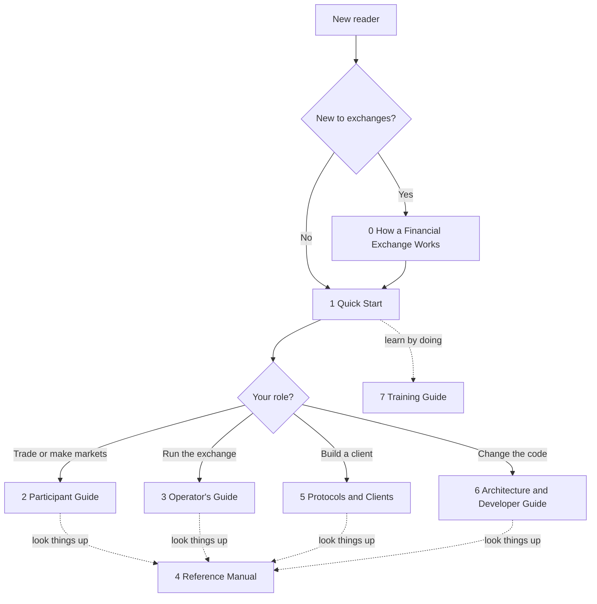

# EduMatcher Documentation Rewriting Plan

| | |
|---|---|
| **Status** | Proposal for review. Nothing described here has been applied to the repository. |
| **Date** | 2026-10-06 |
| **Scope** | `docs/` (user guide, training, concepts, architecture, developer, FAQ, glossary), the documentation build (`docs/Makefile`, `mkdocs.yml`) and the code and scripts that hard-code documentation paths |
| **Explicitly out of scope** | `docs-exchange-intro/` (**stays completely untouched**, including its Makefile, templates, manifest and version stream); `docs-design/` (stays in place, see section 5.7) |
| **Companion artifacts (to be created in Phase 0 and 2)** | `docs-design/doc-migration-map.tsv`, git tag `docs-pre-split` |

---

## 1. Summary

The current **User Guide** has grown to 55 chapter files and about 374,000 words (roughly 800 printed pages). It serves four different readers at once: someone trying EduMatcher for the first time, an operator running an exchange, a participant trading on it, and a developer writing an external client. Each of them has to find their way through chapters written for the others, and several chapters (`010-configuration` at 3,519 lines, `170-processes` at 3,037 lines, `270-message-reference` at 4,105 lines) are books in themselves.

This plan divides the documentation into **seven books, plus the existing Exchange Intro book that is left as it is**, in the way larger systems usually divide theirs (quick start, guides by audience, reference, protocol specification, architecture). It is a plan for *making the documentation more accessible, not smaller*:

* **Nothing is lost.** A coverage tool (section 7) compares the pre-split text with the new books and fails the build if any section is neither present nor explicitly accounted for.
* **Some overlap is deliberate** (section 6): a reader should be able to finish a task inside one book without having to open another to find the one command they need.
* **Every book ships in every format**: PDF in A4 and B5, each in light and dark, plus a reflowable EPUB, plus one PDF per chapter. One generic build (section 10) replaces the three near-identical hand-copied build recipes in today's `docs/Makefile`.

### The library at a glance

| # | Book | One-line purpose | Reader |
|---|---|---|---|
| 0 | **How a Financial Exchange Works** (existing, untouched) | Exchange concepts, independent of EduMatcher | Anyone new to markets |
| 1 | **Quick Start Guide** | A working exchange and a first trade in about fifteen minutes | Everyone, first |
| 2 | **Participant Guide** | Trade, make markets and run bots on EduMatcher | Traders, students, instructors playing a participant |
| 3 | **Operator's Guide** | Install, configure, run, supervise and recover an exchange | Exchange operators, instructors running a class |
| 4 | **Reference Manual** | Look up any command, process, option, field, table or term | Everyone, mid-task |
| 5 | **Protocols and Clients** | Wire protocols, APIs, and how to write an external client | Client and tool developers |
| 6 | **Architecture and Developer Guide** | How EduMatcher is built and how to change it | Contributors, reviewers |
| 7 | **Training Guide** (existing content, moved) | 29-chapter hands-on self-study programme | Learners |

### Assumptions (please correct any that are wrong)

1. "The other 7 documents" means books 1 to 7 above. Book 0 is `docs-exchange-intro`, which already is the "concepts" book and is excluded by your instruction. The Training Guide is a book of its own whose chapter *content* is unchanged; it is moved and relinked so that it builds with the same pipeline as the others.
2. `docs/how-exchange-works.md` is a **generated** copy of the Exchange Intro book (`make exchange-intro` assembles it from `docs-exchange-intro/src`). It is not edited and keeps being produced exactly as today.
3. "No loss" means no *information* is lost; text may be moved, split, merged, re-wrapped and rewritten, but every old section must be traceable to where it went (section 7).
4. Following the project instructions, **no backward-compatibility shims** are kept: old paths are rewritten everywhere they are used, not redirected. The migration map (section 7.3) is the lookup table for anyone holding an old link.
5. Version numbers: all seven books carry the project version (`pyproject.toml`), as today. Book 0 keeps its own version stream (1.10.1).

---

## 2. Starting point (measured on the repository, 2026-10-06)

| Area | Files | Words | Notes |
|---|---:|---:|---|
| `docs/user-guide/` | 55 | 373,722 | One PDF/EPUB build; `010-configuration` and `170-processes` alone have 80+ `##` sections |
| `docs/training/` | 30 | 51,026 | Own PDF/EPUB build (a near-copy of the user-guide recipe) |
| `docs/concepts/` | 7 | 20,336 | EduMatcher-specific explanations; HTML site only |
| `docs/architecture/` | 2 | 27,754 | HTML site only |
| `docs/developer/` | 9 | 43,656 | HTML site only |
| `docs/faq.md` + `docs/glossary.md` | 2 | 11,930 | HTML site only |
| `docs/how-exchange-works.md` | 1 | (generated) | From `docs-exchange-intro/src`; **untouched** |
| `docs-design/` | 109 | 819,129 | Per-feature design notes and reviews; **stays in place** |

Measured with the ledger tool of section 7 on `docs/` plus `docs-design/`: **8,057 heading-delimited blocks and 1,169,999 words**. These are the baseline numbers that every later check is measured against.

How the build works today (`docs/Makefile`, 910 lines): pandoc to LaTeX, injected into one of four hand-maintained templates (`template_{a4,b5,dark_a4,dark_b5}.tex.in`), compiled with XeLaTeX in two passes; Mermaid diagrams through a cached pandoc filter; `expand-shell-outputs.py` pre-processes the sources; EPUB3 via pandoc. The User Guide and the Training Guide each have their own copy of this recipe and their own four templates (the Exchange Intro book has a third copy). Only the User Guide and Training Guide have PDF/EPUB builds; concepts, architecture, developer, FAQ and glossary exist only as web pages.

### What we reuse unchanged

The pandoc pipeline, the Lua filters (`pagebreaks.lua`, `admonitions.lua`), `latex-tables.tex`, `latex-table-rules.awk`, the Mermaid filter, `expand-shell-outputs.py`, `mkfigs.sh` for covers, the version-in-cover mechanism, and the visual design of the four templates.

---

## 3. Ground rules

1. **`docs-exchange-intro/` is read-only for this work.** The new Makefile only *calls* its existing targets (`make -C ../docs-exchange-intro pdf-docs` / `epub-docs`). Its generated copy `docs/how-exchange-works.md` and the `exchange-intro` target that produces it are kept verbatim.
2. **No documentation is lost** (section 7). Every phase ends with the ledger check green.
3. **Accessibility is the goal, not size reduction.** The measures are collected in section 11; the test for each book is whether a reader with *its* purpose can finish their task without leaving it.
4. **Small, deliberate overlap is allowed and managed** (section 6), never accidental copy-paste.
5. **Simplicity** (project rule): one generic build instead of copies, one shared template set instead of twelve, a manifest per book instead of filename-sorted globs, no compatibility layers.
6. **Surgical changes** (project rule): `docs-design/` is not rewritten; code and test changes are limited to doc *paths and anchors*; nothing is reformatted that does not have to move.
7. **Moves before rewrites.** Phase 2 only moves and splits text (verbatim, at heading boundaries). Rewriting happens afterwards, book by book, so a reviewer can always tell "relocated" from "reworded".
8. After implementation of any code or script change: black, flake8, mypy, pyright; nothing is committed by the assistant; a commit message is proposed for each phase.

---

## 4. How readers will find their way

The new `docs/index.md` becomes a **library front door** (this replaces today's routing table). It has three parts:

* *Which book do I need?* A table keyed by what the reader wants to do, not by book name ("I want to see it run" -> Quick Start; "My trades are being rejected" -> Participant Guide, Operator's Guide; "I am writing a client" -> Protocols and Clients).
* *Which format do I download?* A4 light for print, B5 light for compact print and tablets, A4 and B5 dark for screen reading in low light, EPUB for e-readers, screen readers and reader-controlled font size, per-chapter PDFs for sharing a single chapter.
* *Reading paths by role*: new to finance (Book 0, then Quick Start), instructor (Quick Start, Operator's Guide, Training Guide), student trader (Quick Start, Participant Guide, Training Guide), client developer (Protocols and Clients, Reference), contributor (Architecture and Developer Guide).



Every book opens with a one-page **"How to use this book"** (who it is for, what it assumes, what it deliberately leaves to other books, and where the neighbours are) and every chapter opens with the same short header the Quick Start already uses for its stages: *goal, prerequisites, time needed*.

---

## 5. Book specifications

Each specification gives the **purpose**, the **reader**, the **objectives** (what the reader can do after using the book), what is **in** and **out** of scope, the proposed **structure**, the existing **sources** it is built from, the **new writing** needed, and how we know it is **done**. File-level allocation of every existing source is in section 9.

Page figures are planning estimates (about 480 words per printed page) and are replaced by measured values at the end of Phase 2.

### 5.1 Book 1: Quick Start Guide

**Purpose.** Take a newcomer from nothing to a running exchange with a live order book and one trade they caused themselves, then tell them honestly which book to open next. It is the only book most people need on day one, and it must stay short enough to be finished in one sitting.

**Reader.** Anyone: a student, an instructor evaluating the system, a developer. No finance background is assumed (Book 0 is offered for that), and no Python, Node or repository checkout is required for the main route.

**Objectives.** After the Quick Start the reader can:

1. explain in a paragraph what EduMatcher is and what its five core concepts are;
2. start the full system with containers in one command and see live prices in a browser;
3. enter an order, see it rest in the book, and match it with a second order;
4. start and stop a trading session;
5. choose the next book that matches their goal.

**In scope.** The container route, a condensed list of the other install routes, the order book in five minutes, the first trade, a first session, the FAQ, a one-page glossary, "choose your book".

**Out of scope.** Configuration, process-by-process detail, protocols, anything that needs more than one terminal to understand.

**Structure (about 30 to 40 pages).**

| Chapter | Content | Built from |
|---|---|---|
| How to use this book | Promise, prerequisites, how the library is organised | New (about one page) |
| What EduMatcher is | System in one picture, the five concepts | `000-getting-started` |
| Install and start | Containers route; other routes in a table that links to the Operator's Guide | `001-learning-path` Stage 1, `005-installation` (condensed copy) |
| Your first trade | Put an order in, see it rest, match it | `concepts/04-first-trade`, `000` first-session section |
| The order book in five minutes | The one concept everything depends on | Shared snippet from `concepts/01-order-book` |
| Run a session | Open, trade, close; where the records go | `001` Stage 3 |
| Choose your book | Role roadmaps, "when something does not work" | `000` roadmaps, `001` Stages 4 and 5 and troubleshooting |
| Appendix: FAQ | Whole FAQ | `faq.md` (moved) |
| Appendix: one-page glossary | The ten terms the Quick Start uses | `000` quick glossary |

**New writing.** "How to use this book"; a rewritten "Choose your book" that points at the new books instead of at chapter numbers of the old guide.

**Done when.** A person who has never seen the project reaches the first trade using only this book, in the stated time, on a clean machine (tested by someone other than the author); the total is below 40 pages in A4.

### 5.2 Book 2: Participant Guide

**Purpose.** Everything a person needs to *take part in* the market: understand the order book and the trading day, place and manage every kind of order, quote as a market maker, run automated traders, and use the trading front-ends. It is written from the participant's seat, so operator-only matters (configuration files, supervising processes) are not here.

**Reader.** Students and traders, and instructors who are playing a participant in a class exercise.

**Objectives.** After this book the reader can:

1. explain price-time priority and predict what happens to an order in each session phase;
2. use every order type, time-in-force, amend, cancel, combo and OCO order from the trader console and the GUIs, and explain a rejection;
3. understand the risk controls *as a participant experiences them* (collars, limits, circuit breakers, self-match prevention) and what the operator will have configured;
4. quote as a market maker, including obligations, refresh and cancel semantics, and run `pm-mm-bot` and the AI traders;
5. read their positions, average cost and realised and unrealised P&L.

**In scope.** Concepts needed to trade, the console and GUI front-ends, orders, market making, bots, positions and P&L.

**Out of scope.** Configuring gateways, symbols, risk limits or schedules (Operator's Guide); wire formats (Protocols and Clients); process flags (Reference Manual).

**Structure (about 170 pages).**

| Part | Chapters | Built from |
|---|---|---|
| I. Trading basics | Gateways and how you connect; the order book; the trading day and sessions; auctions as a participant sees them | `051-gateway-intro`, `concepts/01`, `concepts/05`, session snippets from `080` |
| II. Orders | The trader console; order types; combo and OCO orders; implied orders; what the exchange will reject and why | `055-alf-console`, `060-order-types`, `070-combo-orders`, `concepts/07`, **new** "What will be rejected" summary of `120-risk-controls` |
| III. Market making | Quotes and obligations; quote lifecycle and cancel semantics; the market-maker bot | `concepts/03`, `090-market-maker`, `100-mm-bot` |
| IV. Automated trading | AI traders and swarms; how the bots decide | `110-ai-traders`, `developer/02-ai-bot` |
| V. Positions and results | Position tracking, VWAP average cost, realised and unrealised P&L, worked examples | participant half of `130-pnl-clearing` |
| VI. Front-ends | Trading info terminal; trading platform GUI; order book GUI | `290`, `300`, `310` |
| Appendix | Known limitations that affect traders | link to the Reference Manual appendix |

**New writing.** "What the exchange will reject and why" (about three pages, written from the trader's seat, linking to the Operator's Guide for how limits are set); a short "Who configures what" box for each part.

**Done when.** Every participant-facing command and screen in the system is covered; the book never tells the reader to edit a configuration file.

### 5.3 Book 3: Operator's Guide

**Purpose.** Run an exchange: install it, configure it, start it, list symbols, run sessions, supervise the processes, record and recover. It also owns the *operational* half of each gateway (how to start and configure it), leaving the wire protocol to Book 5.

**Reader.** Exchange operators and instructors who run EduMatcher for a class or a demonstration.

**Objectives.** After this book the reader can:

1. install by any supported route and choose the right one;
2. produce, verify, compile, deploy and inspect an engine configuration, and add or remove a symbol safely;
3. start, monitor, restart and shut down the whole process set, in the right order;
4. operate a trading day: sessions, auctions, halts, circuit breakers, kill switch, corporate actions, new listings and valuation;
5. configure and operate each gateway;
6. find out what happened (audit, statistics, logs) and recover from a crash or a bad session (persistence, audit replay).

**In scope.** Everything an operator does with the running system.

**Out of scope.** Trading as a participant (Book 2), field-by-field configuration and CLI reference (Book 4), protocol details (Book 5), source-level design (Book 6).

**Structure (about 190 pages).**

| Part | Chapters | Built from |
|---|---|---|
| I. Install and deploy | Choosing an installation mode; containers; VM; pipx; Poetry; shell completion | `005-installation` |
| II. Configure | Configuration workflow; generate, verify, compile, inspect; examples; checklist; adding and removing symbols; config verifier; config GUI; example configs | operator half of `010-configuration`, `020`, `030`, `810` |
| III. Run | Operator model; startup order; process groups; launchers; verification; monitoring; logging levels; troubleshooting; restart and shutdown; the ADMIN console workflow | `040-running-the-exchange`, operator half of `160-exchange-commands` |
| IV. Run a market | New symbols (IPO); valuation; sessions, auctions and the scheduler; risk controls, halts and kill switch; clearing; statistics and reporting; market index and index administration | `045`, `046`, `080`, `120`, operator half of `130`, operator half of `140`, `150`, `152` |
| V. Gateways | Running ALF, BALF, CALF, RALF, API and drop-copy gateways: prerequisites, configuration, start, connectivity test, operational checklist, troubleshooting, runbooks | operational halves of `200` to `260` |
| VI. Observe and recover | Persistence and crash recovery; audit trail; audit replay; centralised log server and its console | `180`, `190`, `820`, `280`, `285` |
| Appendix | Runbook index: every "Troubleshooting" section in one list with page references | New (generated list) |

**New writing.** A runbook index; a "day in the life of an operator" checklist stitched from existing chapters (about two pages).

**Done when.** An instructor can run a complete class session from this book and the Quick Start alone.

### 5.4 Book 4: Reference Manual

**Purpose.** The place to *look something up*. Terse, exhaustive, consistently structured, and stable: a reader arrives from another book with one question (what does this flag do, what are the legal values of this field, what is in this table) and leaves with the answer in under a minute. It contains no tutorials.

**Reader.** Anyone, in the middle of a task.

**Objectives.** After the Reference Manual is done:

1. every `pm-*` command, flag, environment variable and port is documented in one consistent layout and matches `--help` output (verified by `checkdocs.py cli`);
2. every engine-configuration key is documented once, with type, default, allowed values and constraints, and the formal specification is in the same book (verified by `checkdocs.py config`);
3. every on-disk data store (clearing, statistics and audit formats) has its schema documented;
4. the glossary is complete and alphabetical, and the known limitations are listed with workarounds.

**In scope.** Commands and processes, exchange (ADMIN) commands, configuration reference and formal specification, data schemas, environment variables and ports, glossary, known limitations.

**Out of scope.** Narrative and how-to (those books link here), wire messages (Book 5).

**Structure (about 150 pages).**

| Part | Content | Built from |
|---|---|---|
| I. Command-line reference | Process overview, environment variables, port table; one entry per `pm-*` command in a fixed template (synopsis, options, exit codes, examples, see also) | `170-processes` (per-process sections), `100-mm-bot` CLI reference |
| II. Exchange commands | ADMIN console and CLI command reference and details | reference half of `160-exchange-commands` |
| III. Configuration reference | Current schema; engine behaviour flags; participants and defaults; market-maker defaults and seeds; symbols; risk and collars; circuit breakers; session schedule; per-process configuration blocks; formal specification | field-reference half of `010-configuration`, `990-app-config-spec` |
| IV. Data stores | Clearing database schema; statistics database schema, date and tick conventions; output formats | `130`, `140` reference sections |
| Appendices | Glossary; known limitations | `glossary.md`, `890-known-limitations-bugs` |

**New writing.** A uniform entry template for the command reference (mostly mechanical re-layout); removal of duplication between `010` field sections and `990` (one definition per key, the other links); an index of every command, option and key.

**Done when.** `checkdocs.py cli` and `config` are green against this book alone, and no key or option appears in two places with two different descriptions.

### 5.5 Book 5: Protocols and Clients

**Purpose.** Let a developer connect something to EduMatcher without reading the source: choose a protocol, understand its session lifecycle and every message, handle errors, gaps and recovery, and test against a live system. It is the *specification and the how-to* for external clients.

**Reader.** Developers of trading clients, market-data consumers, reconciliation tools and dashboards; also anyone writing a test harness.

**Objectives.** After this book the reader can:

1. choose between ALF, BALF, CALF, RALF, LALF, REST/WebSocket and drop copy for a given purpose;
2. connect, authenticate where applicable, and complete the session lifecycle for each;
3. look up the exact meaning, type and constraints of every message and field (the generated message reference);
4. detect gaps and recover (replay, snapshots) for the feeds that support it;
5. write a first working client in Python (and see the C and REST examples) and test it against the spy tools.

**In scope.** Protocol specifications, session behaviour, message reference, error codes, examples, protocol spy tools, client-writing guidance.

**Out of scope.** Running the gateways (Operator's Guide) and how the engine works inside (Architecture).

**Structure (about 190 pages).**

| Part | Chapters | Built from |
|---|---|---|
| I. Choosing and connecting | Protocols overview and selection guide; gateway concepts; the transport channels | `210`, copy of `051` section, `270-preamble` |
| II. Protocol specifications | ALF; BALF; CALF; RALF; LALF; REST and WebSocket | `900` to `950` |
| III. Session behaviour | Per gateway: session lifecycle, commands, broadcasts, errors, duplicate-session policy; the market-data feed explained; drop copy feed semantics, sequence numbers, replay | protocol halves of `220` to `260`, `200`, `201`, `concepts/06` |
| IV. Writing clients | **New:** your first client; connection lifecycle and recovery patterns; testing with the spy tools; example libraries and integration guidance | **new**, `800-examples`, `202`, `241`, `251` |
| V. Message reference | Generated message reference | `270-message-reference` (generated from `spec/messages/*.yaml`) |

**New writing.** The two chapters of Part IV that do not exist today ("Your first client" and "Connection lifecycle and recovery patterns", roughly ten pages each, each with a complete runnable Python example validated by the existing example tests); a protocol comparison table that all gateway chapters reuse as a shared snippet.

**Done when.** A developer who has not seen the codebase writes a client that places and cancels an order and consumes the market-data feed with gap recovery, using this book only.

### 5.6 Book 6: Architecture and Developer Guide

**Purpose.** Explain how EduMatcher is built and why, and give contributors what they need to change it safely: the process and message architecture, the matching core, persistence, the order flow end to end, the design decisions behind major features, the development workflow, verification and the release process.

**Reader.** Contributors, reviewers, and teachers who use the code as a case study.

**Objectives.** After this book the reader can:

1. draw the process topology and the message flow of an order from keystroke to fill and back;
2. explain the order book's data structures, matching algorithm, persistence and failure modes;
3. find the design decision (and its rationale) behind a major feature without searching `docs-design/`;
4. set up a development environment, run the right test loops, and follow the verification strategy;
5. produce a release.

**In scope.** Architecture, order flow, design records, development practice, verification, message generation, containers and VM image internals, release engineering, extension exercises.

**Out of scope.** Using the system (Books 2 and 3).

**Structure (about 160 pages).**

| Part | Chapters | Built from |
|---|---|---|
| I. Architecture | Why this architecture; topology and topics; process roles; data flows; threads; matching algorithm; persistence and recovery; failure modes; performance; ticks and time; guided tour of the whole design | `architecture/01`, `architecture/02`, narrative sections of `170-processes` (Why separate processes; Order lifecycle message flow) |
| II. Inside the engine | Order book deep dive; the order's path through the engine, end to end | `concepts/02`, `developer/09-order-flow-engine` |
| III. Design records | One short record per major feature (context, decision, consequences, link to the full design note in `docs-design/`) | **New**, distilled from `docs-design/` (section 5.7) |
| IV. Developing | Developer practice and workflow; verification and test strategy; message generation (`pm-msgen`); container and network set-up; VM runtime image; extension experiments | `developer/01`, `03`, `04`, `05`, `06`, `07`, `08` |
| V. Releasing | Release process and checklist; manual image push; release scripts | release sections of `developer/01` |

**New writing.** The design records (Part III), about one to three pages each.

**Done when.** A new contributor can follow Part IV on a clean machine to a green test run, and every design record links to a design note that exists.

### 5.7 What happens to `docs-design/`

`docs-design/` (109 files, 819,129 words) is a historical archive of per-feature design notes, plans and reviews. It is **not** converted into a book and **no file in it is edited**. Instead:

* `docs-design/README.md` gains a status table (Implemented / Superseded / Proposal) in a later, separate change, rather than touching 109 files.
* Part III of Book 6 gives each major, implemented feature a short decision record that links back to its note. Candidates: clearing v3 (`EduMatcher-Clearing`), authentication and authorisation (`EduMatcher-auth`), tick migration and price ticks, audit replay, valuation, log server, market index, market-maker quotes and persistence, market-data protocol, message generator, system trading verification (the DO-178C material), performance analysis, asyncio architecture, deployment.
* The migration map doubles as the lookup table for the roughly three dozen design notes that cite old `docs/user-guide/...` paths; those citations are historical and are left as they are.

### 5.8 Book 7: Training Guide (content unchanged)

**Purpose and reader** are as today: the hands-on self-study programme (29 chapters, 00 to 28) for learners. **Objectives** are unchanged.

What changes is mechanical: the directory moves to `docs/books/training-guide/`, a `book.toml` lists the existing chapters in their current order (with `index.md` as front matter), the four local templates and the EPUB stylesheet are replaced by the shared set, and the links into the user guide are re-pointed at the new books. Cross-book links are rendered in PDF and EPUB as "Operator's Guide, chapter title" text (section 11), which is also an improvement over today.

Training chapters stay exercises: they link to the Participant, Operator and Protocols books for the explanation and to the Reference Manual for details, rather than repeating them.


---

## 6. Overlap policy

Some overlap is a feature: a reader who is half-way through a task should not have to leave the book for the one command they need. Uncontrolled overlap is the opposite: two slightly different copies of the same text, one of them wrong. The policy is to **allow overlap only in four named forms, give every topic exactly one canonical home, and measure the result**.

### 6.1 Rules

1. **One canonical home per topic.** The allocation tables (section 9) name it. If two books disagree, the canonical home is right.
2. **Overlap is allowed in exactly four forms:**

| Form | What it is | Size limit | Maintenance |
|---|---|---|---|
| **A. Recap box** | "Before you continue" reminder of a concept explained elsewhere, ending in a named pointer | at most 10 lines | Hand-written; the pointer is checked by `checkdocs.py` |
| **B. Task excerpt** | The smallest set of commands or configuration a reader needs to finish *this chapter's task* without leaving the book (for example the start command and connectivity test of a gateway, in both the Operator's Guide and Protocols and Clients) | at most 1 page | Hand-written; canonical text linked |
| **C. Shared snippet** | Identical text kept once in `docs/shared/<name>.md` and included in each book | any, but only identical | **Single source**, included with `--8<-- "shared/<name>.md"` (section 10.4) |
| **D. "From your seat" summary** | A short rewritten view of a canonical chapter for the other audience (for example "What the exchange will reject and why" against the Operator's risk-controls chapter) | at most 15% of the canonical chapter | Hand-written; links to the canonical chapter |

3. **No unmanaged copy-paste of more than a page.** Anything larger than a page that must appear in two books becomes a shared snippet (form C).
4. **Budget.** At most 10% of the words of any book may be duplicated from another book; a small extension of the ledger tool (`--overlap`, about 30 lines, to be written in Phase 3) prints the shingle overlap between every pair of books.
5. **Cross-book pointers are named, not numbered**: "see the Operator's Guide, *Running the exchange*", never "see chapter 6", because numbers drift. In HTML they are links; in PDF and EPUB they are rendered as text (section 11).

### 6.2 Planned overlaps

| Topic | Canonical home | Also appears in | Form |
|---|---|---|---|
| Container installation route | Operator's Guide | Quick Start | B (1 page) |
| Order-book primer | Participant Guide | Quick Start | C |
| Session phases table, auction explanation | Participant Guide | Operator's Guide (scheduling chapter) | C |
| Risk controls | Operator's Guide | Participant Guide ("What will be rejected") | D |
| Gateway start command and connectivity test | Operator's Guide | Protocols and Clients | B |
| Protocol comparison table | Protocols and Clients | Participant, Operator gateway chapters | C |
| Per-process configuration block | Reference Manual | Operator's gateway chapters | B (about 20 lines) |
| Date, timestamp and tick conventions | Reference Manual | Operator's statistics chapter | A |
| "Why separate processes" and order lifecycle flow | Architecture and Developer Guide | Reference Manual (intro to the process list) | A |
| Glossary | Reference Manual | Every book ends with "Terms used in this book" (at most 2 pages) | D |
| Known limitations | Reference Manual | Pointer boxes in Participant and Operator chapters affected | A |
| Message bus and port table | Reference Manual | Architecture and Developer Guide | A |

---

## 7. The no-loss guarantee

### 7.1 What is guaranteed

For every heading-delimited section of the pre-split documentation, one of the following holds after every phase:

* its text is present, verbatim or re-wrapped, somewhere in the new books (moved, split or merged);
* it appears, with a reason, in the migration map as `REWRITTEN` (the new text covers the same ground, reviewer signed off), `GENERATED` (now produced from a spec), or `RETIRED` (deliberately removed, with the reason and an approver).

The build fails if neither is true.

### 7.2 Method

1. **Baseline.** Phase 0 creates the git tag `docs-pre-split` on the current commit. The old text is always read from that tag, so no copy of it needs to be stored in the repository.
2. **Ledger tool** (`scripts/doc-ledger.py`, Appendix D, prototyped and tested). Every old markdown file is cut into blocks at its headings (ignoring `#` inside code fences). Each block becomes overlapping 8-word shingles, normalised for case and punctuation, so re-wrapping, reordering and moving do not matter. The *new corpus* is the new books, `docs/shared/` and `docs/index.md`, and nothing else; in particular `docs-design/` is excluded, so text that merely also exists in a design note cannot mask a loss. A block is *covered* when at least 85% of its shingles occur in the new corpus.
3. **Gate.** A block below the threshold must have a row in `docs-design/doc-migration-map.tsv` with disposition `REWRITTEN`, `RETIRED` or `GENERATED`, or the tool exits non-zero. `make docs-ledger` runs it; `make docs-check` runs it together with the existing link, CLI and config checks.

What the prototype showed on the real repository: baseline 8,057 blocks and 1,169,999 words, 100% coverage when the tree is compared with itself; on a scratch copy with one `##` section and one whole file deleted it reported exactly the 20 blocks that had been removed and exited 1; adding two rows to a map made it exit 0.

### 7.3 Migration map

One tab-separated file, `docs-design/doc-migration-map.tsv`, created in Phase 0 as one row per old *file* and refined to heading level wherever a file is split. It serves three purposes: the ledger's exception list, the input for the path rewriter (section 12), and the lookup table for anyone holding an old link.

```text
# old block-id prefix <TAB> disposition <TAB> new location <TAB> note
user-guide/005-installation.md                           MOVED       operator-guide/part-1-install-and-deploy/010-installation.md
user-guide/010-configuration.md#Current Schema           SPLIT       reference-manual/part-3-configuration/010-schema-and-process-blocks.md
user-guide/010-configuration.md#Verify Configs with      SPLIT       operator-guide/part-2-configure/010-the-configuration-workflow.md
user-guide/000-getting-started.md#Roadmaps by role       REWRITTEN   quick-start/part-2-next-steps/020-choose-your-book.md   new books replace chapter numbers
user-guide/270-message-reference.md                      GENERATED   protocols-and-clients/part-5-message-reference/010-message-reference.md   pm-msgen output
```

Dispositions: `MOVED` (whole file, same text), `SPLIT` (a file's headings go to different books), `MERGED`, `DUPLICATED` (an intentional overlap, form A to D), `REWRITTEN`, `GENERATED`, `RETIRED`. Only the last three, and only for blocks below the threshold, are exceptions to the coverage rule; the others are informational and the coverage check verifies them independently.

### 7.4 What the ledger cannot see (and the extra checks that cover it)

| Gap | Extra check |
|---|---|
| A whole old file is forgotten | The map must contain a row for **every** old file (Phase 0 creates them all; the tool lists files without rows) |
| Images and diagram files | Mermaid diagrams are text and are covered. For image files, `git diff --stat docs-pre-split -- docs/assets` plus a check that every image referenced before is still referenced |
| Anchors used by code | `pm_help` registry anchors are verified by a new `checkdocs.py help-anchors` check (section 12) |
| Links | `checkdocs.py links` must not exceed the baseline failure count recorded in Phase 0, and must reach zero by the end of Phase 3 |
| Meaning changed while wording survives | Reviewer sign-off per rewritten chapter; not automatable |
| Generated reference | `pm-msgen check` already fails CI when `270-message-reference.md` disagrees with `spec/messages/*.yaml` |

---

## 8. Proposed layout

All books live under `docs/books/<slug>/`, one directory per book, each with a `book.toml` manifest in the same shape as the Exchange Intro book's (`title`, ordered `parts` with ordered `files`, front and back matter). **Order comes from the manifest, never from file names**, so a chapter can be inserted without renumbering. Chapter file names are unique within a book (checked by `book_sources.py`) and keep a three-digit step-of-ten prefix (`010-`, `020-`, ...) for readable directory listings. Each part directory also starts with a `00-part.md` opener (a one-paragraph introduction whose heading carries the class `{.part}`, rendered as a LaTeX `\part`); the openers are not repeated in the file lists below.

```text
docs/
├── index.md                          library front door (rewritten, section 4)
├── README.md                         rewritten: layout, how to add a chapter or a book, style guide
├── how-exchange-works.md             GENERATED from ../docs-exchange-intro (unchanged mechanism)
├── Makefile                          new top-level Makefile (Appendix A)
├── build/                            shared build assets (replaces the per-book copies)
│   ├── book.mk                       generic per-book rules (Appendix B)
│   ├── book_sources.py               manifest reader (Appendix C)
│   ├── gen_nav.py                    MkDocs nav generator (Appendix D)
│   ├── epub_a11y.py                  EPUB accessibility metadata (Appendix D)
│   ├── epub.css.in                   one EPUB stylesheet, light and dark
│   ├── latex-tables.tex, latex-table-rules.awk
│   ├── templates/                    a4.tex.in  b5.tex.in  dark_a4.tex.in  dark_b5.tex.in
│   └── filters/                      pagebreaks.lua  admonitions.lua  parts.lua  xbook.lua (cross-book links)
├── shared/                           snippets included by more than one book (section 6)
├── assets/                           images; cover-<book>-template.html and cover-<book>.png per book
├── books/
│   ├── quick-start/
│   ├── participant-guide/
│   ├── operator-guide/
│   ├── reference-manual/
│   ├── protocols-and-clients/
│   ├── architecture-and-development/
│   └── training-guide/               moved from docs/training, content unchanged
├── examples/  presentations/  javascripts/  stylesheets/  hooks/      unchanged
└── dist/  .build/                    generated output (as today)
```

Removed by the end of Phase 5, once the ledger is green: `docs/user-guide/`, `docs/training/`, `docs/concepts/`, `docs/architecture/`, `docs/developer/`, `docs/faq.md`, `docs/glossary.md`, the three per-book template sets, `cover-user-guide*` and `cover-training-guide*`.

### 8.1 File-level layout of each book

```text
books/quick-start/
├── book.toml
├── 00-front/010-how-to-use-this-book.md
├── part-1-see-it-run/        010-what-is-edumatcher  020-install-and-start  030-your-first-trade  040-the-order-book-in-five-minutes
├── part-2-next-steps/        010-run-a-session  020-choose-your-book
└── 90-backmatter/            010-faq  020-glossary-one-page

books/participant-guide/
├── book.toml
├── 00-front/010-how-to-use-this-book.md
├── part-1-trading-basics/        010-gateways-and-how-you-connect  020-the-order-book  030-the-trading-day-and-auctions
├── part-2-orders/                010-the-trader-console  020-order-types  030-combo-and-oco-orders  040-implied-orders  050-what-will-be-rejected
├── part-3-market-making/         010-market-maker-quotes  020-market-making  030-the-market-maker-bot
├── part-4-automated-trading/     010-ai-traders  020-how-the-bots-decide
├── part-5-positions-and-results/ 010-positions-and-pnl
├── part-6-front-ends/            010-trading-info-terminal  020-trading-platform-gui  030-order-book-gui
└── 90-backmatter/                010-terms-used-in-this-book

books/operator-guide/
├── book.toml
├── 00-front/010-how-to-use-this-book.md
├── part-1-install-and-deploy/    010-installation
├── part-2-configure/             010-the-configuration-workflow  020-config-verifier  030-config-gui  040-example-configs
├── part-3-run/                   010-running-the-exchange  020-admin-console-and-commands
├── part-4-run-a-market/          010-new-symbols  020-valuation  030-sessions-and-scheduling  040-risk-controls  050-clearing
│                                 060-statistics-and-reporting  070-market-index  080-index-administration
├── part-5-gateways/              010-alf-gateway  020-balf-gateway  030-calf-gateway  040-ralf-gateway  050-api-gateway  060-drop-copy-gateway
├── part-6-observe-and-recover/   010-persistence  020-audit-trail  030-audit-replay  040-log-server  050-log-console
└── 90-backmatter/                010-runbook-index  020-terms-used-in-this-book

books/reference-manual/
├── book.toml
├── 00-front/010-how-to-use-this-book.md
├── part-1-command-line/          010-processes-environment-and-ports  020-engine-and-gateways  030-monitoring-and-query-tools
│                                 040-bots-and-traders  050-admin-and-configuration-tools  060-index-log-and-scheduler-tools
├── part-2-exchange-commands/     010-command-reference  020-command-details
├── part-3-configuration/         010-schema-and-process-blocks  020-engine-sections  030-formal-specification
├── part-4-data-stores/           010-clearing-database  020-statistics-database-and-conventions
└── 90-backmatter/                010-glossary  020-known-limitations

books/protocols-and-clients/
├── book.toml
├── 00-front/010-how-to-use-this-book.md
├── part-1-choosing-and-connecting/ 010-protocols-overview  020-message-bus-and-transport
├── part-2-specifications/          010-alf  020-balf  030-calf  040-ralf  050-lalf  060-rest-and-websocket
├── part-3-session-behaviour/       010-alf-sessions  020-balf-sessions  030-calf-market-data-feed  040-ralf-post-trade-feed
│                                   050-api-gateway  060-drop-copy
├── part-4-writing-clients/         010-your-first-client  020-connection-lifecycle-and-recovery  030-example-libraries  040-the-spy-tools
├── part-5-message-reference/       010-message-reference            (generated)
└── 90-backmatter/                  010-terms-used-in-this-book

books/architecture-and-development/
├── book.toml
├── 00-front/010-how-to-use-this-book.md
├── part-1-architecture/          010-architecture-overview  020-guided-tour  030-why-separate-processes  040-order-lifecycle-message-flow
├── part-2-inside-the-engine/     010-order-book-deep-dive  020-order-flow-end-to-end
├── part-3-design-records/        010-... one file per record (new)
├── part-4-developing/            010-developer-practice  020-development-workflow  030-verification  040-message-generation
│                                 050-containers-and-networks  060-vm-runtime-image  070-extension-experiments
└── part-5-releasing/             010-release-process

books/training-guide/             book.toml + the existing 000-installation.md ... 280-ipo-valuation.md and index.md;
                                  parts taken from the current mkdocs.yml grouping
```

---

## 9. Where every existing document goes

Operations: **MOVE** (whole file, text unchanged), **SPLIT** (headings distributed, text verbatim), **REWRITE** (new text in Phase 3 or 4, old text accounted for in the map). "Overlap" uses the forms of section 6. Rows marked *(confirm)* are my best reading of the headings and are confirmed in Phase 0 by reading the chapter.

### 9.1 `docs/user-guide/` (55 files)

| Source | Lines | Canonical home | Overlap | Operation |
|---|---:|---|---|---|
| `000-getting-started` | 701 | Quick Start | Reference (environment variables), Operator (installation) | SPLIT: "Installation" and "Environment variables" sections go to Operator and Reference; the rest to Quick Start; "Roadmaps by role" rewritten as "Choose your book" |
| `001-learning-path` | 443 | Quick Start | | MOVE, then REWRITE Stages 4 and 5 to point at books |
| `005-installation` | 776 | Operator | Quick Start (container route, B) | MOVE |
| `010-configuration` | 3,519 | Operator (workflow) and Reference (fields) | Operator gateway chapters (B) | SPLIT, table in 9.2 |
| `020-config-verifier` | 588 | Operator | Reference (rule catalogue, *confirm*) | MOVE |
| `030-config-GUI` | 953 | Operator | | MOVE |
| `040-running-the-exchange` | 1,229 | Operator | Quick Start (Stage 3, B) | MOVE |
| `045-new-symbol` | 293 | Operator | | MOVE |
| `046-valuation` | 1,796 | Operator | | MOVE |
| `051-gateway-intro` | 198 | Participant | Protocols and Clients (C) | MOVE |
| `055-alf-console` | 1,142 | Participant | | MOVE |
| `060-order-types` | 1,266 | Participant | | MOVE |
| `070-combo-orders` | 523 | Participant | | MOVE |
| `080-session-scheduling` | 721 | Operator | Participant ("What are auctions", "Session phases", "Equilibrium price", C) | MOVE + extract snippets |
| `090-market-maker` | 1,670 | Participant | Operator (config summary, B) | MOVE |
| `100-mm-bot` | 1,441 | Participant | Reference ("CLI reference" and "Config file" sections, B) | MOVE |
| `110-ai-traders` | 449 | Participant | | MOVE |
| `120-risk-controls` | 1,752 | Operator | Participant ("What will be rejected", D) | MOVE + new summary |
| `130-pnl-clearing` | 1,327 | Participant (positions and P&L), Operator (running clearing), Reference (schema) | | SPLIT: Participant = position tracking, VWAP, realised and unrealised P&L, worked example, position arithmetic, P&L formulas; Operator = starting the process, data folder, cookbook, notes; Reference = SQLite schema, `pm-clearing-cli` |
| `140-statistics-and-reporting` | 1,968 | Operator (running, workflows, integration, troubleshooting), Reference (schema, CLI, formats, conventions) | Operator (A on dates and ticks) | SPLIT |
| `150-market-index` | 784 | Operator | | MOVE |
| `152-index-admin-cli` | 420 | Operator | Reference (CLI) | MOVE |
| `160-exchange-commands` | 1,449 | Operator (concept, ADMIN console, workflow, extending) and Reference (command reference and details) | | SPLIT |
| `170-processes` | 3,037 | Reference | Architecture ("Why separate processes", "Order lifecycle message flow": canonical there) | SPLIT: process overview, environment variables, port reference and the ~40 `pm-*` sections to Reference; two narrative sections to Architecture |
| `180-persistence` | 802 | Operator | Architecture (A) | MOVE |
| `190-audit` | 1,026 | Operator | Reference (record format, *confirm*) | MOVE |
| `200-drop-copy` | 462 | Protocols and Clients (feed, format, sequence numbers, replay, subscribing, alternatives, comparison) and Operator ("Startup and shutdown", "Configuration reference") | | SPLIT |
| `201-dc-gateway` | 400 | Operator (what, prerequisites, configuration, start, quick connect, troubleshooting) and Protocols and Clients (session lifecycle, protocol reference, error codes, minimal client) | Quick connect test (B) | SPLIT |
| `202-dc-spy-cli` | 229 | Protocols and Clients | | MOVE |
| `210-protocols-overview` | 242 | Protocols and Clients | Quick Start, Participant (C) | MOVE |
| `220-alf-gateway` | 1,085 | Operator (what, prerequisites, configuration, start, quick connect, troubleshooting) and Protocols and Clients (session lifecycle, command reference, broadcast and engine-scoped events, error codes, example libraries, comparison) | B | SPLIT |
| `230-balf-gateway` | 869 | Operator (what, prerequisites, configuration, start, connectivity test, disconnect behaviour and passive-order policy, duplicate session policy, troubleshooting) and Protocols and Clients (session lifecycle, message reference, field encoding, wire-frame examples, server-initiated messages, minimal client, comparison) | B | SPLIT |
| `240-calf-gateway` | 1,403 | Operator (what, prerequisites, start, quick connect, operational checklist) and Protocols and Clients (feed at a glance, available information, comparison, connecting and subscribing, targeted subsets, gap detection and replay, examples, common errors, building tools) | B | SPLIT |
| `241-calf-spy-cli` | 233 | Protocols and Clients | | MOVE |
| `250-ralf-gateway` | 705 | Operator (what, architecture position, prerequisites, quick start, configuration, config generation, operational notes, dedicated gateway runbook) and Protocols and Clients (available data, comparison, connecting, gap detection and replay, quick connect, Python subscriber, common errors) | B | SPLIT |
| `251-ralf-spy-cli` | 249 | Protocols and Clients | | MOVE |
| `260-api-gateway` | 2,011 | Operator (what, configuration, start, operational checklist, troubleshooting) and Protocols and Clients (Swagger, authentication, REST, bootstrap and admin endpoints, cross-gateway views, WebSocket, Python and C examples, implementation notes, reference) | B | SPLIT |
| `270-message-reference` | 4,105 | Protocols and Clients | Reference (index pointer) | MOVE; **generated** from `spec/messages/*.yaml`, so `pm-msgen`'s default output path changes (section 12) |
| `270-preamble` | 509 | Protocols and Clients | | MOVE; hand-written source of the generated reference |
| `280-log-srv` | 1,012 | Operator | Reference (CLI) | MOVE |
| `285-log-srv-gui` | 818 | Operator | | MOVE |
| `290-trader-info-terminal` | 701 | Participant | | MOVE |
| `300-trader-gui` | 1,765 | Participant | | MOVE |
| `310-book-gui` | 738 | Participant | | MOVE |
| `800-examples` | 811 | Protocols and Clients | | MOVE |
| `810-example-configs` | 66 | Operator | Reference | MOVE |
| `820-audit-replay` | 792 | Operator | | MOVE |
| `890-known-limitations-bugs` | 288 | Reference (appendix) | Participant, Operator (A) | MOVE |
| `900` to `940` (ALF, BALF, CALF, RALF, LALF protocol appendices) | 1,343 / 606 / 1,424 / 273 / 512 | Protocols and Clients, Part II | | MOVE; Phase 3 removes duplication between each specification and its session-behaviour chapter (specification is normative for formats, session chapter for behaviour) |
| `950-app-REST-API-reference` | 2,132 | Protocols and Clients | | MOVE |
| `990-app-config-spec` | 898 | Reference, Part III | | MOVE; Phase 3 removes duplication with the field sections from `010` |

### 9.2 `010-configuration` split (heading level)

| Goes to the Operator's Guide (workflow) | Goes to the Reference Manual (fields and per-process blocks) |
|---|---|
| Configuration Workflow; Configuring the Exchange; File Location; Generate Configs with `pm-config-gen`; Generate Configs with `config-gui`; Verify Configs with `pm-cverifier`; Compile Configs with `pm-config-deploy`; Inspect Configs with `pm-config-show`; Minimal, Medium and Fully Complex Example; Configuration Checklist; Startup and Persistence Order; Adding or Removing Symbols; Validation Commands; Verifying the Deployed Artifact; See Also | Current Schema; Which Process Reads What; Configuring `pm-alf-gwy`, `pm-ralf-gwy`, `pm-md-gwy`, `pm-balf-gwy`, `pm-api-gwy`, `pm-index`, `pm-log-srv`; Engine Behavior Flags; Participant Defaults; Participants; Market-Maker Obligation Defaults; Symbol Universe; Risk Controls and Collars; Circuit Breakers; Market-Maker Quote Seeds; Startup Market-Maker Combo Seeds; Session Schedule; Formal Specification |

Heading texts are kept exactly as they are in Phase 2, so the anchors used by `pm-help` (`010-configuration.md` is cited three times in its registry) keep resolving at the new path.

### 9.3 Everything else under `docs/`

| Source | Lines | Canonical home | Overlap | Operation |
|---|---:|---|---|---|
| `concepts/01-concepts-order-book` | 233 | Participant, Part I | Quick Start (C) | MOVE |
| `concepts/02-concepts-order-book-deep-dive` | 1,537 | Architecture, Part II | | MOVE |
| `concepts/03-concepts-mm-quotes` | 272 | Participant, Part III | | MOVE |
| `concepts/04-concepts-first-trade` | 483 | Quick Start | | MOVE |
| `concepts/05-concepts-trading-day` | 319 | Participant, Part I | Operator (C) | MOVE |
| `concepts/06-concepts-market-data-feed` | 302 | Protocols and Clients, Part III | | MOVE |
| `concepts/07-concepts-implied-orders` | 416 | Participant, Part II | | MOVE |
| `architecture/01-architecture` | 1,795 | Architecture, Part I | | MOVE |
| `architecture/02-architecture-guide` | 2,839 | Architecture, Part I | Book 0 covers similar ground by design | MOVE |
| `developer/01-dev-practice` | 984 | Architecture, Part IV (practice) and Part V (release sections) | | SPLIT |
| `developer/02-ai-bot` | 248 | Participant, Part IV | | MOVE |
| `developer/03-experiments` | 1,101 | Architecture, Part IV | | MOVE |
| `developer/04-verification` | 600 | Architecture, Part IV | | MOVE |
| `developer/05-vm-runtime-image` | 223 | Architecture, Part IV *(confirm: Operator if it is used by operators)* | Operator (A) | MOVE |
| `developer/06-msgen` | 1,334 | Architecture, Part IV | Protocols and Clients (A) | MOVE; cited by generated model headers |
| `developer/07-container-and-networks` | 830 | Architecture, Part IV | Operator (A) | MOVE |
| `developer/08-dev-workflow` | 337 | Architecture, Part IV | | MOVE |
| `developer/09-order-flow-engine` | 856 | Architecture, Part II | | MOVE |
| `faq.md` | 494 | Quick Start (appendix) | | MOVE |
| `glossary.md` | 605 | Reference (appendix) | each book (D) | MOVE |
| `training/*` (30 files) | n/a | Training Guide | | MOVE (git rename), content unchanged, links re-pointed |
| `index.md`, `README.md` | 107, 198 | Library front door; docs README | | REWRITE |
| `how-exchange-works.md` | 4,413 | unchanged (generated) | | none |
| `hooks/README.md`, `hooks/section_numbering.py` | 55 | unchanged | | none (the hook is commented out in `mkdocs.yml`) |

---

## 10. The build system

### 10.1 Design

Today there are three hand-copied build recipes (user guide, training guide, exchange intro), each with four hand-maintained templates, and every new book would mean another copy. The replacement is **one generic build driven by a manifest per book**:

* `docs/Makefile` (Appendix A) holds configuration, the list of books and the aggregate goals.
* `docs/build/book.mk` (Appendix B) holds the generic recipes. A book is added by creating `books/<slug>/book.toml` and adding the slug to `BOOKS`; no other build change is needed.
* The pipeline per PDF is exactly today's: expand shell-output placeholders, concatenate in manifest order, pandoc to LaTeX through the Mermaid filter and the two Lua filters, booktabs-style table rules, inject into the template, two XeLaTeX passes. It is defined **once** (`render_pdf`) and used by both whole-book and per-chapter builds, which removes four near-identical copies from the current Makefile.
* **One template set** for all books (`build/templates/{a4,b5,dark_a4,dark_b5}.tex.in`), derived mechanically from today's user-guide templates by five substitutions (Appendix E): running head and imprint title, title-page title, subtitle, cover file, content placeholder. The visual difference between print layouts (light) and screen layouts (dark, narrow margins) is preserved because it is carried by the templates, not by the books.
* Mermaid, `expand-shell-outputs.py` (with `--preserve-paths`, so every source keeps its own path in the build tree), part openers via `parts.lua`, `mkfigs.sh` covers, LaTeX engine detection, the figure-width and Mermaid knobs keep their names and defaults.

### 10.2 Outputs

For each book `<b>` (slug with `-` written as `_` in file names), at version `V`:

| Output | File | Goal |
|---|---|---|
| PDF, A4, light | `dist/edumatcher_<b>_a4-V.pdf` | `pdf-<b>` |
| PDF, B5, light | `dist/edumatcher_<b>_b5-V.pdf` | `pdf-<b>` |
| PDF, A4, dark | `dist/edumatcher_<b>_dark_a4-V.pdf` | `pdf-<b>` |
| PDF, B5, dark | `dist/edumatcher_<b>_dark_b5-V.pdf` | `pdf-<b>` |
| Bundle of the four PDFs | `dist/edumatcher_<b>_bundle-V.zip` | `pdf-<b>` |
| EPUB3 (reflowable, light/dark follows the reader) | `dist/edumatcher_<b>-V.epub` | `epub-<b>` |
| One A4 PDF per chapter, and a zip of them | `dist/chapters-a4/<b>/NNN-name.pdf`, `dist/edumatcher_<b>_chapters_a4_bundle-V.zip` | `chapters-<b>` |
| Cover image | `assets/cover-<b>.png` | `cover-<b>` |

Seven books give 28 PDFs, 7 EPUBs, 7 chapter sets and 14 zips; Book 0 adds its own through its own Makefile. Which format to pick is explained on the library front door (section 4).

### 10.3 Goals

| Goal | Meaning | Replaces |
|---|---|---|
| `make -j4 pdf-docs` | Four PDFs and a zip for **every** book | `pdf-docs` (user guide only), `pdf-training` |
| `make epub-docs` | EPUB for every book | `epub-docs`, `epub-training` |
| `make chapters-pdf` | Per-chapter PDFs and zip for every book | `chapters-pdf`, `chapters-pdf-a4`, `chapters-pdf-a4-bundle` |
| `make pdf-<book>`, `epub-<book>`, `chapters-<book>`, `book-<book>`, `cover-<book>`, `epub-verify-<book>` | One book, one format | new |
| `make book-all` | Every book, PDF and EPUB | new |
| `make docs-all` | `book-all` plus the Exchange Intro book (delegated) | new |
| `make pdf-exchange-intro`, `epub-exchange-intro` | Delegate to `make -C ../docs-exchange-intro` | new; the Exchange Intro Makefile is not modified |
| `make nav` | Regenerate the MkDocs `nav:` block from the manifests | new |
| `make docs-ledger`, `make docs-check` | Section 7; the pre-release gate | new |
| `make docs`, `serve`, `exchange-intro`, `docs-container-*`, `mp-bump` | Unchanged | kept verbatim |

A fix on the way: today the zip step globs `edumatcher_*-VERSION.pdf`, so the user-guide bundle also swallows the training PDFs. Each bundle now contains exactly the four PDFs of its own book.

### 10.4 Shared snippets

Overlap form C needs one syntax that works in both the web site and the PDF/EPUB pipeline. Use the MkDocs `pymdownx.snippets` syntax (`--8<-- "shared/protocol-comparison.md"`) for HTML (one line added to `mkdocs.yml`), and teach `expand-shell-outputs.py`, which already pre-processes every source before pandoc, to resolve the same line (about 15 lines of Python, tested in Phase 1). No Lua filter and no second syntax.

### 10.5 Cross-book references

A link from one book to another works in the web site but is dead in a PDF. `build/filters/xbook.lua` (about 60 lines, Phase 1) rewrites any link whose target lies in another book into the text *"Operator's Guide, “Running the exchange”"* (book title plus the target's heading, looked up from the manifests), and leaves intra-book links alone. In EPUB the same text carries a link only when the target is in the same EPUB.

### 10.6 Covers

One HTML template per book (`assets/cover-<b>-template.html`, derived from the user-guide cover) rendered by the existing `mkfigs.sh`. Each book gets its own accent colour and title so that printed copies are distinguishable on a shelf. Covers are regenerated when the template or the project version changes (a version stamp replaces today's grep of the generated HTML).

### 10.7 Build performance

`make -j4 pdf-docs` runs four variants of one book in parallel; the whole library is on the order of the existing user-guide build multiplied by the total word count (about twice, since the training guide and concepts now build too), so the recommended full run is `make -j4 docs-all` rather than `-j20`. Parse time: `book.mk` calls `book_sources.py` three times per book (about 21 `poetry run` invocations at start-up); if that exceeds about 3 seconds in practice, one call that writes `.build/books.mk` replaces them (Risk R8).

### 10.8 Changes to other build consumers

| File | Change |
|---|---|
| `mkdocs.yml` | `nav:` becomes a generated block between two marker comments; `pymdownx.snippets` added to `markdown_extensions` |
| `scripts/mkbld.sh` (lines ~532 to 554) | `pdf-training` becomes `pdf-training-guide`, `epub-training` becomes `epub-training-guide`; `pdf-docs`, `epub-docs`, `chapters-pdf` keep their names (now all books) |
| `scripts/mkghrelease.sh` (lines ~508 to 592) | Release asset list generated by looping over the books instead of naming the user-guide and training artifacts one by one; the Exchange Intro lines are untouched |
| `.github/workflows/docs.yml`, `ci.yml` | Read in Phase 0; extended to run `make docs-check` |

---

## 11. Accessibility measures

Making the documentation easier to use is the goal; these are the concrete measures, all inside the plan:

1. **Front door and role paths** (section 4): one page that answers "which book, which format".
2. **Same opening in every book and chapter**: "How to use this book", and a *goal, prerequisites, time* header per chapter.
3. **Seven books by purpose** instead of one book by accident: each is short enough for its reader to finish, and no book needs another one open to complete a task (section 6).
4. **Formats for different needs**: print (A4, B5), screen in low light (dark A4 and B5), reflowable text for e-readers and screen readers (EPUB), single chapters (per-chapter PDF).
5. **Contrast verified, not assumed**: a small checker (Phase 5, about 40 lines, not yet written) reads the `\definecolor` pairs of the light and dark templates and fails if a text and background pair is below WCAG AA (4.5:1 body text, 3:1 large text).
6. **Text alternatives**: a new `checkdocs.py alt` check requires every image and Mermaid block to have an alt text or caption, and every diagram to be followed by a one-sentence statement of what it shows.
7. **EPUB conformance**: reflowable text, linked table of contents, language set, schema.org accessibility metadata (tested, Appendix D), `prefers-color-scheme` dark styling (Appendix E), and `epubcheck` per book (`make epub-verify-<book>`). The `alternativeText` feature is declared only once check 6 passes for that book.
8. **References that survive printing** (section 10.5): "Operator's Guide, “Running the exchange”" in print, a link on the web.
9. **Per-book "Terms used in this book"** (at most two pages) so a reader does not need the Reference Manual open to read a chapter.
10. **Plain structure**: descriptive headings, header rows on every table (screen readers read them), no "see above" or "see below" across files, chapters of about 30 pages or less as a guideline.
11. **Running heads and covers identify the book**, with a distinct accent colour per book.
12. **Search**: the web site keeps one global search, and page titles carry the book name so results say where they are.

---

## 12. Code, test and script touchpoints

These are the places outside `docs/` that name documentation paths. They are changed **mechanically, by a path rewriter driven by the migration map** (`scripts/doc-pathmap.py`, about 60 lines: longest-prefix match on `path` and `path#anchor` rows of `MOVED` and `SPLIT` entries, applied only to a given list of files). Only the path text changes; nothing else in these files is touched.

| Where | What | Notes |
|---|---|---|
| `src/edumatcher/msgen/cli.py` lines 31 to 32 | `_DEFAULT_DOCS_REFERENCE`, `_DEFAULT_DOCS_PREAMBLE` point to `docs/user-guide/270-*.md` | Changed together with the move; `pm-msgen generate` and `pm-msgen check` must pass in the same commit |
| `src/edumatcher/msgen/generators/{markdown,python}.py` | Header comments citing `docs/developer/06-msgen.md` and `270-preamble.md` | These strings are emitted into `src/edumatcher/models/generated/*.py`; regenerate, do not hand-edit |
| `src/edumatcher/pm_help/registry.py` | 24 `doc_page=` values and `doc_anchor` values | Become book-qualified paths; **new check** `checkdocs.py help-anchors` verifies every page and anchor exists |
| `src/edumatcher/pm_help/render.py` lines 230 to 232 | Prints `docs/user-guide/<page>` | Prints the book-qualified path |
| About 15 other source files (`alf_console/main.py`, `dc_spy/{client,cli}.py`, `ralf_spy/cli.py`, `cverifier/layer2_schema.py`, `setup_cmd.py`, `src/data/ref_data/engine_config.yaml`, ...) | Comments and help text citing doc paths | Path rewriter |
| `tests/` (12 files, for example `test_msgen_docs.py`, `test_log_srv_pubsub.py`, `test_config_show.py`, `test_valuation_report.py`) | Docstrings and comments, and any default path read by a test | Path rewriter; `test_msgen_docs.py` verified by running it |
| `spec/messages/{order,system}.yaml` | Comments and descriptions citing docs | Path rewriter; descriptions flow into the generated reference, so regenerate |
| `web-apps/config-gui/` (`Dockerfile` comment, `packages/schema/src/types.ts`, one test) | Comments citing docs | Path rewriter |
| `deployment/docker/README.md`, `deployment/docker/data/ref_data/engine_config.yaml`, root `README.md` | Links | Path rewriter |
| `scripts/README.md`, `.github/skills/code-review/SKILL.md` | Example paths; the skill cites `docs/user-guide/09-messages.md`, which is already stale | Path rewriter plus a manual fix of the stale reference |
| `docs-design/**` (more than thirty files cite old paths) | Historical citations | **Left as they are** (section 5.7) |
| `CHANGELOG.md` | Historical | Left as is |

New checks in `scripts/checkdocs.py` (one flag each, same style as the existing `links`, `cli`, `config`): `help-anchors`, `alt` (section 11), `xbook` (every cross-book reference resolves to a heading that exists).

After any Python change: `black`, `flake8`, `mypy`, `pyright`. No commit is made by the assistant; a commit message is proposed at the end of each phase.

---

## 13. Phases, deliverables and exit criteria

Durations are rough planning figures for one person; the editorial phases dominate.

### Phase 0: baseline and safety (about 1 day)

* Create tag `docs-pre-split`.
* Record the baselines: ledger numbers, `make docs` result, `checkdocs.py` result (the list of failures that already exist), the current PDFs and EPUBs saved outside the repository for visual comparison.
* Create `doc-migration-map.tsv` with one row per existing file (so "forgotten file" is detectable); resolve the *(confirm)* rows of section 9 by reading those chapters.
* Take the decisions in section 15.
* Read `.github/workflows/docs.yml` and `ci.yml`.

*Exit:* ledger self-comparison 100%; allocation table signed off; decisions recorded.

### Phase 1: build system (about 2 to 3 days; no prose changes)

* Add `docs/build/` (templates by the five substitutions, filters moved with `git mv`, `book.mk`, `book_sources.py`, `gen_nav.py`, `epub_a11y.py`, `epub.css.in`), the new `docs/Makefile`, `xbook.lua`, snippet support in `expand-shell-outputs.py`.
* Move `docs/training` to `docs/books/training-guide` and add its manifest; re-point its links.
* Add a **temporary** book `user-guide-legacy` whose manifest lists the 55 user-guide files in today's order, to prove the new pipeline on the biggest input.
* Create covers for all seven books from the template.
* Update `mkbld.sh` and `mkghrelease.sh`.

*Exit:* the Training Guide and the legacy User Guide build in all four PDF variants and EPUB through the new pipeline; page counts equal to the baseline outputs and page images equal except for intended header changes (compare with `pdftoppm` and ImageMagick `compare`); `epubcheck` clean; `mkdocs build` succeeds; `make -n docs-all` clean.

### Phase 2: mechanical split (about 3 to 4 days; no rewriting)

* Write `scripts/doc-split.py` (about 80 lines): input is a TSV derived from section 9 (`source`, `heading`, `target file`, order); it copies heading-delimited ranges **verbatim** into new files and writes the part openers and manifests. Whole files use `git mv` so history follows them.
* Fill the migration map to heading level; run the path rewriter over the files in section 12; regenerate the `pm-msgen` outputs; update the `pm_help` registry.
* Generate the `mkdocs.yml` nav; run `mkdocs build --strict`.
* Remove the temporary legacy book and the old directories.

*Exit:* `make docs-ledger` green with only `MOVED`/`SPLIT`/`DUPLICATED` rows; `checkdocs.py` no worse than baseline; the full test suite and `pm-msgen check` green; all seven books build in every format. The prose still reads like excerpts (dangling "as described above"); that is expected at this stage and is what Phase 3 removes.

### Phase 3: de-duplicate and rewrite, book by book (about 2 to 3 weeks)

Order: Reference Manual, Protocols and Clients, Operator's Guide, Participant Guide, Architecture and Developer Guide, Quick Start, library front door. (Reference-like material first, because the other books link to it.) For each book:

1. repair the seams (references to text now in another book become named pointers);
2. remove accidental duplication, apply the overlap policy and the budget;
3. add the "How to use this book" page, the chapter headers, and "Terms used in this book";
4. record every rewritten section as `REWRITTEN` in the map with a reason;
5. check the book's "Done when" criterion (section 5).

*Exit per book:* ledger green; `checkdocs.py` (links, cli, config, xbook, help-anchors) clean for the book; overlap within budget; reviewer sign-off.

### Phase 4: new material (can overlap Phase 3)

The two client-writing chapters (each with a runnable example validated by the existing example tests), "What will be rejected", the runbook index, the design records, the library front door.

### Phase 5: hardening and release (about 3 to 4 days)

Contrast and alt-text checks, `epubcheck` for every EPUB, a full `make -j4 docs-all` with timing, CI update, `docs/README.md` rewrite, removal of obsolete assets and directories, a CHANGELOG entry, proposed commit messages.

*Exit (project done):* `make docs-check` green; every "Done when" criterion met; all outputs of section 10.2 produced; no file from `docs-pre-split` unaccounted for.

### Proposed commit sequence

One commit per phase; Phase 2 is two commits (the `git mv` of whole files first so renames are detected, then the splits and link rewrites). Each commit message is proposed by the assistant and committed by you.

---

## 14. Risks and mitigations

| # | Risk | Mitigation |
|---|---|---|
| R1 | Template unification changes the look of the existing guides | Templates are derived by five mechanical substitutions; Phase 1 compares page counts and page images with the baseline outputs before any content moves |
| R2 | Heading text changes break anchors used by `pm-help` and by other chapters | Heading texts are not edited in Phase 2; `help-anchors` and `links` checks gate every phase |
| R3 | Splitting chapters leaves dangling "see above/below" | Expected after Phase 2; Phase 3 step 1 repairs them book by book; `checkdocs.py` lint for "above/below" added |
| R4 | Overlap drifts into two diverging copies | Forms A to D only; snippets are single-source; overlap report with a 10% budget |
| R5 | Cross-book links are dead in PDF and EPUB | `xbook.lua` (section 10.5) and the `xbook` check |
| R6 | The generated message reference or generated models end up pointing at old paths | The path change in `msgen` is done in the same commit as the move; `pm-msgen check` is part of Phase 2's exit |
| R7 | Large editorial effort stalls half-way | Every phase ends in a releasable state; Phase 2's output is already seven working books, so the work can stop after any later phase |
| R8 | Make start-up becomes slow because the manifest reader is called 21 times | Measured in Phase 1; fallback is one call that generates `.build/books.mk` |
| R9 | A tool or LaTeX package missing on a maintainer's machine | No new requirements; the existing checks (`check-latex-engine`, poetry, pandoc, Chrome for Mermaid) are kept; `epubcheck` stays optional |
| R10 | Someone edits an old path after the move | `docs-check` fails on links to files that no longer exist; old directories are removed in Phase 5 |

---

## 15. Open decisions

Each has a recommended default; Phase 0 records the answer.

| # | Decision | Default |
|---|---|---|
| D1 | Keep Participant Guide and Operator's Guide separate, or merge them into one "User Guide" with two parts? | **Separate**: the two audiences barely overlap and the separation is what shortens each book |
| D2 | Also publish an "omnibus" PDF/EPUB of all books (one manifest listing the others)? | **No** for now; it is a few lines of manifest if wanted, and it would duplicate the overlap |
| D3 | Architecture and Developer Guide as one book or two? | **One book** with a part per concern; split later if it exceeds about 250 pages |
| D4 | Web site navigation: one top-level tab per book, or grouped tabs? | **One tab per book** (nine tabs including Home and Book 0); revisit if the tab bar is crowded |
| D5 | Redirects from old web URLs? | **None**, per the project rule against backward compatibility; the migration map is the lookup |
| D6 | Rename `training-guide` artifacts to underscores (`edumatcher_training_guide_*`) for consistency? | **Yes**; `mkghrelease.sh` is updated in Phase 1 |
| D7 | `docs-design/` status table | Add to `docs-design/README.md` after Phase 3, not before |
| D8 | Version of the books | Project version for books 1 to 7; Book 0 keeps its own |
| D9 | Cover design | Same style as today's covers, one accent colour per book; approved in Phase 1 |

---


## Appendix A: `docs/Makefile` (new)

Replaces the current 910-line Makefile. The blocks listed in the final comment (MkDocs build, `exchange-intro`, documentation container, `mp-bump`) are carried over verbatim from the current file and are not repeated here. Tested as described in Appendix F.

````make
# =============================================================================
# docs/Makefile — builds every EduMatcher book (PDF A4/B5 x light/dark, EPUB,
# per-chapter PDFs) and the MkDocs site.  Per-book logic lives in build/book.mk.
#
#   make help                     list all targets
#   make -j8 pdf-docs             every book, four PDFs each
#   make pdf-operator-guide       one book
#   make epub-docs                every book as EPUB
#   make book-quick-start         one book, all formats
#   make docs-all                 everything incl. the Exchange Intro book
# =============================================================================

POETRY := $(shell command -v poetry 2>/dev/null)
ifeq ($(POETRY),)
    $(error poetry not found. Install with: pip install poetry)
endif

# --- layout ------------------------------------------------------------------
DOCS_DIR     := .
BOOKS_DIR    := $(DOCS_DIR)/books
BUILD_ASSETS := $(DOCS_DIR)/build
FILTER_DIR   := $(BUILD_ASSETS)/filters
ASSETS_DIR   := $(DOCS_DIR)/assets
DIST_DIR     := $(DOCS_DIR)/dist
BUILD_DIR    := $(DOCS_DIR)/.build
STAMP_DIR    := $(DOCS_DIR)/.makefile-stamps
SCRIPTS_DIR  := ../scripts
NODE_MODULES_PATH := ../build-tools/node_modules
MERMAID_FILTER    := ../scripts/mermaid-filter-cached.js
$(shell mkdir -p $(STAMP_DIR))

# --- project -----------------------------------------------------------------
PROJECT := edumatcher
VERSION := $(shell grep '^version' ../pyproject.toml | head -1 | cut -d'"' -f2)
PY      := poetry run python

# --- tuning knobs (unchanged names/defaults from the previous Makefile) --------
MERMAID_FILTER_FORMAT ?= pdf
MERMAID_FILTER_WIDTH  ?= 600
EPUB_FIGURE_MAX_WIDTH ?= 85%
LATEX_ENGINE          ?= xelatex
TEXBIN_FALLBACK       := /Library/TeX/texbin
UNAME_S := $(shell uname -s)
ifeq ($(UNAME_S),Darwin)
    PUPPETEER_EXECUTABLE_PATH ?= /Applications/Google Chrome.app/Contents/MacOS/Google Chrome
else
    PUPPETEER_EXECUTABLE_PATH ?= /usr/bin/google-chrome
endif

# --- make behaviour ----------------------------------------------------------
SHELL        := $(shell which bash)
.SHELLFLAGS  := -euo pipefail -c
.ONESHELL:
.DELETE_ON_ERROR:
.DEFAULT_GOAL := help
.EXTRA_PREREQS := $(firstword $(MAKEFILE_LIST))

RED := \033[0;31m
GREEN := \033[0;32m
YELLOW := \033[0;33m
CYAN := \033[1;36m
NC := \033[0m

# --- the books (reading order of the library) ---------------------------------
BOOKS := quick-start participant-guide operator-guide reference-manual \
         protocols-and-clients architecture-and-development training-guide

include $(BUILD_ASSETS)/book.mk

# --- aggregate goals -----------------------------------------------------------
.PHONY: pdf-docs epub-docs chapters-pdf covers book-all docs-all epub-docs-verify \
        exchange-intro pdf-exchange-intro epub-exchange-intro help clean really-clean \
        check-latex-engine nav docs-ledger docs-check

pdf-docs: $(addprefix pdf-,$(BOOKS))                ## All books: PDF x4 (A4/B5, light/dark) + zip each
epub-docs: $(addprefix epub-,$(BOOKS))              ## All books: EPUB3
chapters-pdf: $(addprefix chapters-,$(BOOKS))       ## All books: one A4 PDF per chapter
covers: $(addprefix cover-,$(BOOKS))                ## All cover images
epub-docs-verify: $(addprefix epub-verify-,$(BOOKS)) ## Validate every EPUB with epubcheck
book-all: pdf-docs epub-docs                        ## Every book, PDF and EPUB

# The Exchange Intro book is built by its own Makefile, which this project does
# not modify; these targets only delegate to it.
pdf-exchange-intro:                                 ## PDF x4 of "How a Financial Exchange Works" (delegates)
	@$(MAKE) -C ../docs-exchange-intro pdf-docs
epub-exchange-intro:                                ## EPUB of "How a Financial Exchange Works" (delegates)
	@$(MAKE) -C ../docs-exchange-intro epub-docs
docs-all: book-all pdf-exchange-intro epub-exchange-intro  ## Whole library incl. Exchange Intro

# --- keeping the library honest ---------------------------------------------------
PRE_SPLIT_TAG := docs-pre-split
PRE_SPLIT_DIR := $(BUILD_DIR)/pre-split

nav:                                                ## Regenerate the MkDocs nav block from the book manifests
	@$(PY) $(BUILD_ASSETS)/gen_nav.py --mkdocs ../mkdocs.yml --docs $(DOCS_DIR) --books $(BOOKS)

docs-ledger:                                        ## Fail if any pre-split documentation is unaccounted for
	@rm -rf $(PRE_SPLIT_DIR) && mkdir -p $(PRE_SPLIT_DIR)
	@git -C .. archive $(PRE_SPLIT_TAG) docs/user-guide docs/training docs/concepts docs/architecture \
	    docs/developer docs/faq.md docs/glossary.md docs/index.md | tar -x -C $(PRE_SPLIT_DIR)
	@$(PY) $(SCRIPTS_DIR)/doc-ledger.py --old $(PRE_SPLIT_DIR)/docs \
	    --new $(BOOKS_DIR) $(DOCS_DIR)/shared $(DOCS_DIR)/index.md \
	    --map ../docs-design/doc-migration-map.tsv

docs-check:                                         ## Pre-release gate: nav fresh, links, CLI refs, config blocks, ledger
	@$(PY) $(BUILD_ASSETS)/gen_nav.py --mkdocs ../mkdocs.yml --docs $(DOCS_DIR) --books $(BOOKS) --check
	@$(PY) $(SCRIPTS_DIR)/checkdocs.py
	@$(MAKE) --no-print-directory docs-ledger

check-latex-engine:
	@if ! PATH="$(PATH):$(TEXBIN_FALLBACK)" command -v "$(LATEX_ENGINE)" >/dev/null 2>&1; then
		echo -e "$(RED)✗ LaTeX engine '$(LATEX_ENGINE)' not found in PATH.$(NC)" >&2; exit 1
	fi

$(DIST_DIR):
	@mkdir -p $@

# A new project version invalidates every cover (they print the version).
$(STAMP_DIR)/version-$(VERSION):
	@rm -f $(STAMP_DIR)/version-*
	@touch $@

clean: ## Remove build trees and the per-chapter PDFs
	@rm -rf $(BUILD_DIR) $(DIST_DIR)/chapters-a4

really-clean: clean ## Also remove dist/ and the version stamp
	@rm -rf $(DIST_DIR) $(STAMP_DIR)

# --- help ----------------------------------------------------------------------
help: ## Show this help
	@echo -e "$(YELLOW)EduMatcher documentation — make targets$(NC)"
	@grep -hE '^[a-zA-Z0-9_.-]+:.*## ' Makefile | sort -u \
	 | awk 'BEGIN{FS=":.*## "}{printf "  $(CYAN)%-34s$(NC) %s\n",$$1,$$2}'
	@echo -e "\n$(YELLOW)Per-book targets$(NC)  (<book> is one of: $(BOOKS))"
	@printf "  $(CYAN)%-34s$(NC) %s\n" \
	  "pdf-<book>"      "PDF x4 (A4/B5, light/dark) + zip" \
	  "epub-<book>"     "EPUB3" \
	  "chapters-<book>" "One A4 PDF per chapter + zip" \
	  "book-<book>"     "PDF + EPUB" \
	  "cover-<book>"    "Cover image" \
	  "epub-verify-<book>" "Validate the EPUB with epubcheck"

# --- unchanged from the previous Makefile (kept verbatim, not repeated here) ----
#   $(DOC_STAMP)/docs/serve  MkDocs site build, HTML_DOCS_DEPS now = ../mkdocs.yml + all book sources
#   exchange-intro           regenerates docs/how-exchange-works.md from ../docs-exchange-intro/src
#   docs-container-*         documentation container build/start/stop/restart/status/logs
#   mp-bump                  multipass bootstrap version bump
````

## Appendix B: `docs/build/book.mk` (new)

````make
# =============================================================================
# docs/build/book.mk — generic per-book build, included by docs/Makefile.
#
# Each book slug listed in $(BOOKS) gets, via BOOK_VARS/PDF_RULE/CHAPTER_RULE/BOOK_TARGETS:
#   pdf-<book>       four PDFs: A4 light, B5 light, A4 dark, B5 dark  (+ zip)
#   epub-<book>      one reflowable EPUB3
#   chapters-<book>  one A4 PDF per chapter (+ zip)
#   cover-<book>     cover image for PDF and EPUB
#
# A book is a directory docs/books/<slug>/ holding book.toml (title, subtitle,
# cover, ordered parts/files) and its markdown. Order comes from the manifest,
# never from file names. Every book shares ONE set of LaTeX templates
# (build/templates/{a4,b5,dark_a4,dark_b5}.tex.in) parametrised with
# @@VERSION@@ @@BOOK_TITLE@@ @@BOOK_SUBTITLE@@ @@COVER@@.
#
# Titles and subtitles in book.toml must not contain & / \ (they pass through
# sed); commas and apostrophes are fine. File basenames must be unique inside one book
# (checked by book_sources.py).
# =============================================================================

VARIANTS   := a4 b5 dark-a4 dark-b5
LUA_FLAGS  := --lua-filter $(FILTER_DIR)/parts.lua --lua-filter $(FILTER_DIR)/pagebreaks.lua --lua-filter $(FILTER_DIR)/admonitions.lua
TEX_DEPS   := $(BUILD_ASSETS)/latex-tables.tex $(BUILD_ASSETS)/latex-table-rules.awk
LUA_DEPS   := $(wildcard $(FILTER_DIR)/*.lua)
AWK_JOIN   := awk 'FNR==1 && NR!=1{print ""; print ""}1'
REPO_REL   := docs
# shq: make a value safe inside a single-quoted shell string (titles may contain an apostrophe)
shq        = $(subst ','\'',$(1))

# ---------------------------------------------------------------------------
# run_latex: two XeLaTeX passes (references + TOC).  $(1) = build dir
# ---------------------------------------------------------------------------
define run_latex
for pass in 1 2; do
  PATH="$(PATH):$(TEXBIN_FALLBACK)" TEXINPUTS="$(abspath $(BUILD_ASSETS))//:" \
    $(LATEX_ENGINE) -interaction=nonstopmode -halt-on-error \
    -output-directory $(1) $(1)/report.tex > $(1)/xelatex-pass$$pass.log 2>&1 \
  || { echo -e "$(RED)✗ $(LATEX_ENGINE) pass $$pass failed: $(1)$(NC)" >&2; \
       tail -30 $(1)/xelatex-pass$$pass.log >&2; exit 1; }
done
endef

# ---------------------------------------------------------------------------
# render_pdf: markdown sources -> one PDF.  Shared by whole-book and per-chapter
# builds, so the pipeline exists exactly once.
#   $(1) build dir   $(2) paper a4|b5   $(3) template (.tex.in)
#   $(4) book slug (title/subtitle/cover are read from $(4)_TITLE etc.)
#   $(5) output pdf  $(6) source files, relative to docs/, in reading order
# ---------------------------------------------------------------------------
define render_pdf
echo -e "$(YELLOW)- $(notdir $(5))$(NC)"
rm -rf $(1) && mkdir -p $(1)/expanded/.mermaid-img
$(PY) $(SCRIPTS_DIR)/expand-shell-outputs.py --preserve-paths \
  --output-dir $(1)/expanded --cwd $(SCRIPTS_DIR)/.. --format $(2) $(6)
$(AWK_JOIN) $(foreach f,$(6),$(1)/expanded/$(REPO_REL)/$(f)) > $(1)/book.md
PUPPETEER_EXECUTABLE_PATH="$(PUPPETEER_EXECUTABLE_PATH)" \
MERMAID_FILTER_FORMAT="$(MERMAID_FILTER_FORMAT)" MERMAID_FILTER_WIDTH="$(MERMAID_FILTER_WIDTH)" \
MERMAID_FILTER_LOC="$(1)/expanded/.mermaid-img" \
pandoc --from=markdown --to=latex --top-level-division=chapter --syntax-highlighting=none \
  --filter "$(MERMAID_FILTER)" $(LUA_FLAGS) --metadata paper_format=$(2) \
  $(1)/book.md -o $(1)/body.tex
sed -i.bak 's/\\def\\LTcaptype{none}/\\def\\LTcaptype{table}/g' $(1)/body.tex
rm -f $(1)/body.tex.bak
awk -f $(BUILD_ASSETS)/latex-table-rules.awk $(1)/body.tex > $(1)/body.tmp && mv $(1)/body.tmp $(1)/body.tex
sed -e 's/@@VERSION@@/v$(VERSION)/g' -e 's/@@BOOK_TITLE@@/$(call shq,$($(4)_TITLE))/g' \
    -e 's/@@BOOK_SUBTITLE@@/$(call shq,$($(4)_SUBTITLE))/g' -e 's/@@COVER@@/$($(4)_COVER)/g' $(3) \
| awk -v body="$(1)/body.tex" \
  '/%%__BOOK_CONTENT__%%/ { while ((getline l < body) > 0) print l; close(body); ins=1; next } \
   { print } \
   END { if (!ins) { print "template placeholder %%__BOOK_CONTENT__%% missing" > "/dev/stderr"; exit 2 } }' \
  > $(1)/report.tex
$(call run_latex,$(1))
cp $(1)/report.pdf $(5)
echo -e "$(GREEN)✓ $(notdir $(5))$(NC)"
endef

# ---------------------------------------------------------------------------
# render_epub: markdown sources -> one reflowable EPUB3.   $(1) build dir
#   $(2) book slug   $(3) output epub   $(4) sources
# --from=markdown-raw_html : bare <placeholders> would otherwise be parsed as
#                            HTML tags and rejected by EPUB's strict XHTML.
# --mathml / --syntax-highlighting=none : see the notes in the previous Makefile.
# ---------------------------------------------------------------------------
define render_epub
echo -e "$(YELLOW)- $(notdir $(3))$(NC)"
rm -rf $(1) && mkdir -p $(1)/expanded/.mermaid-img
$(PY) $(SCRIPTS_DIR)/expand-shell-outputs.py --preserve-paths \
  --output-dir $(1)/expanded --cwd $(SCRIPTS_DIR)/.. --format a4 $(4)
$(AWK_JOIN) $(foreach f,$(4),$(1)/expanded/$(REPO_REL)/$(f)) > $(1)/book.md
sed -e "s/@@EPUB_FIGURE_MAX_WIDTH@@/$(EPUB_FIGURE_MAX_WIDTH)/g" $(BUILD_ASSETS)/epub.css.in > $(1)/epub.css
PUPPETEER_EXECUTABLE_PATH="$(PUPPETEER_EXECUTABLE_PATH)" \
MERMAID_FILTER_FORMAT="svg" MERMAID_FILTER_WIDTH="$(MERMAID_FILTER_WIDTH)" \
MERMAID_FILTER_LOC="$(1)/expanded/.mermaid-img" \
pandoc --from=markdown-raw_html --to=epub3 --mathml --syntax-highlighting=none \
  --toc --toc-depth=2 --css $(1)/epub.css \
  --epub-cover-image=$($(2)_COVER_PNG) \
  --metadata title="EduMatcher $($(2)_TITLE) (v$(VERSION))" \
  --metadata author="J. Persson, 2026 v$(VERSION)" --metadata lang=en-US \
  --filter "$(MERMAID_FILTER)" $(LUA_FLAGS) $(1)/book.md -o $(3)
$(PY) $(BUILD_ASSETS)/epub_a11y.py $(3)
echo -e "$(GREEN)✓ $(notdir $(3))$(NC)"
endef

# ---------------------------------------------------------------------------
# PDF_RULE: one (book, variant) PDF.   $(1) book slug   $(2) variant
# ---------------------------------------------------------------------------
define PDF_RULE
$(1)_$(2)_PDF := $(DIST_DIR)/$(PROJECT)_$$(subst -,_,$(1))_$$(subst -,_,$(2))-$(VERSION).pdf
$(1)_PDFS     += $$($(1)_$(2)_PDF)
$$($(1)_$(2)_PDF): $$($(1)_SOURCES) $$($(1)_MANIFEST) $$($(1)_COVER_PNG) \
    $(BUILD_ASSETS)/templates/$$(subst -,_,$(2)).tex.in $(TEX_DEPS) $(LUA_DEPS) \
    | $(DIST_DIR) $(NODE_MODULES_PATH)
	@$$(call render_pdf,$(BUILD_DIR)/$(1)/$(2),$(if $(findstring b5,$(2)),b5,a4),$(BUILD_ASSETS)/templates/$$(subst -,_,$(2)).tex.in,$(1),$$@,$$($(1)_SOURCES))
endef

# ---------------------------------------------------------------------------
# CHAPTER_RULE: one A4 light PDF for one chapter.  $(1) book slug  $(2) source
# ---------------------------------------------------------------------------
define CHAPTER_RULE
$(1)_CHAPTER_PDFS += $(DIST_DIR)/chapters-a4/$(1)/$(basename $(notdir $(2))).pdf
$(DIST_DIR)/chapters-a4/$(1)/$(basename $(notdir $(2))).pdf: $(2) $$($(1)_COVER_PNG) \
    $(BUILD_ASSETS)/templates/a4.tex.in $(TEX_DEPS) $(LUA_DEPS) | $(NODE_MODULES_PATH)
	@mkdir -p $$(@D)
	@$$(call render_pdf,$(BUILD_DIR)/$(1)/chapters/$(basename $(notdir $(2))),a4,$(BUILD_ASSETS)/templates/a4.tex.in,$(1),$$@,$(2))
endef

# ---------------------------------------------------------------------------
# BOOK_VARS: variables for one book.   $(1) = slug
# ---------------------------------------------------------------------------
define BOOK_VARS
$(1)_DIR      := $(BOOKS_DIR)/$(1)
$(1)_MANIFEST := $$($(1)_DIR)/book.toml
$(1)_SOURCES  := $$(shell $(PY) $(BUILD_ASSETS)/book_sources.py --manifest $$($(1)_MANIFEST))
$(1)_TITLE    := $$(shell $(PY) $(BUILD_ASSETS)/book_sources.py --manifest $$($(1)_MANIFEST) --meta title)
$(1)_SUBTITLE := $$(shell $(PY) $(BUILD_ASSETS)/book_sources.py --manifest $$($(1)_MANIFEST) --meta subtitle)
$(1)_COVER    := cover-$(1).png
$(1)_COVER_PNG:= $(ASSETS_DIR)/cover-$(1).png
$(1)_EPUB     := $(DIST_DIR)/$(PROJECT)_$$(subst -,_,$(1))-$(VERSION).epub
$(1)_ZIP      := $(DIST_DIR)/$(PROJECT)_$$(subst -,_,$(1))_bundle-$(VERSION).zip
$(1)_CH_ZIP   := $(DIST_DIR)/$(PROJECT)_$$(subst -,_,$(1))_chapters_a4_bundle-$(VERSION).zip
$(1)_CHAPTERS := $$(filter-out %/00-part.md,$$($(1)_SOURCES))
endef

# ---------------------------------------------------------------------------
# BOOK_TARGETS: cover, EPUB, zip and the phony goals.   $(1) = slug
# Must be evaluated AFTER BOOK_VARS, PDF_RULE and CHAPTER_RULE of every book.
# ---------------------------------------------------------------------------
define BOOK_TARGETS
# cover: regenerated when its template or the project version changes
$$($(1)_COVER_PNG): $(ASSETS_DIR)/cover-$(1)-template.html $(STAMP_DIR)/version-$(VERSION)
	@sed "s/@@VERSION@@/v$(VERSION)/g" $$< > $(ASSETS_DIR)/cover-$(1).html
	@$(SCRIPTS_DIR)/mkfigs.sh -o $(ASSETS_DIR) -s $(ASSETS_DIR) cover-$(1)

$$($(1)_EPUB): $$($(1)_SOURCES) $$($(1)_MANIFEST) $$($(1)_COVER_PNG) \
    $(BUILD_ASSETS)/epub.css.in $(BUILD_ASSETS)/epub_a11y.py $(LUA_DEPS) \
    | $(DIST_DIR) $(NODE_MODULES_PATH)
	@$$(call render_epub,$(BUILD_DIR)/$(1)/epub,$(1),$$@,$$($(1)_SOURCES))

$$($(1)_ZIP): $$($(1)_PDFS)
	@zip -9 -j -q $$@ $$^
	@echo -e "$(GREEN)✓ $$(notdir $$@)$(NC)"

$$($(1)_CH_ZIP): $$($(1)_CHAPTER_PDFS)
	@zip -9 -j -q $$@ $$^
	@echo -e "$(GREEN)✓ $$(notdir $$@)$(NC)"

.PHONY: pdf-$(1) epub-$(1) chapters-$(1) cover-$(1) book-$(1) epub-verify-$(1)
pdf-$(1): check-latex-engine $$($(1)_ZIP)  ## PDF x4 (A4/B5, light/dark) + zip: $(1)
cover-$(1): $$($(1)_COVER_PNG)  ## Cover image: $(1)
epub-$(1): $$($(1)_EPUB)  ## EPUB3: $(1)
chapters-$(1): check-latex-engine $$($(1)_CH_ZIP)  ## One A4 PDF per chapter + zip: $(1)
book-$(1): pdf-$(1) epub-$(1)  ## All formats: $(1)
epub-verify-$(1): $$($(1)_EPUB)  ## Validate EPUB with epubcheck: $(1)
	@command -v epubcheck >/dev/null || { echo -e "$(RED)✗ epubcheck not found (brew install epubcheck)$(NC)" >&2; exit 1; }
	@epubcheck $$<
endef

# ---------------------------------------------------------------------------
# Register every book in $(BOOKS) (set by docs/Makefile before the include).
# Order matters: variables first, then rules that read them, then goals.
# ---------------------------------------------------------------------------
$(foreach b,$(BOOKS),$(eval $(call BOOK_VARS,$(b))))
$(foreach b,$(BOOKS),$(foreach v,$(VARIANTS),$(eval $(call PDF_RULE,$(b),$(v)))))
$(foreach b,$(BOOKS),$(foreach c,$($(b)_CHAPTERS),$(eval $(call CHAPTER_RULE,$(b),$(c)))))
$(foreach b,$(BOOKS),$(eval $(call BOOK_TARGETS,$(b))))
````

## Appendix C: book manifest and manifest reader

### C.1 Example manifest (`books/operator-guide/book.toml`)

The format is the same as the Exchange Intro book's `book.toml` (title, ordered parts with ordered files, front and back matter), plus `subtitle` and `slug`. Every part directory starts with a `00-part.md` opener (a heading carrying `{.part}` and one short paragraph; `parts.lua` below turns it into a LaTeX `\part`, and the chapter-PDF goal skips it). Paths are relative to the book directory.

```toml
title = "Operator's Guide"
subtitle = "Install, configure, run and recover an exchange"
slug = "operator-guide"

[frontmatter]
files = ["00-front/010-how-to-use-this-book.md"]

[[parts]]
title = "Part I: Install and deploy"
dir = "part-1-install-and-deploy"
files = ["00-part.md", "010-installation.md"]

[[parts]]
title = "Part II: Configure"
dir = "part-2-configure"
files = [
  "00-part.md",
  "010-the-configuration-workflow.md",
  "020-config-verifier.md",
  "030-config-gui.md",
  "040-example-configs.md",
]

# ... Parts III to VI as listed in section 8.1 ...

[backmatter]
files = [
  "90-backmatter/010-runbook-index.md",
  "90-backmatter/020-terms-used-in-this-book.md",
]
```

### C.2 `docs/build/book_sources.py`

Prints the sources of a book in manifest order (relative to `docs/`) or one manifest key, and refuses a manifest in which two files share a name (chapter PDFs are named after their source file).

````python
#!/usr/bin/env python3
"""Print a book's sources (relative to docs/) in manifest order, or one manifest key.

Exits non-zero if two files of one book share a basename (00-part.md excepted)."""
from __future__ import annotations
import argparse, tomllib
from pathlib import Path

def sources(manifest: Path) -> list[str]:
    data = tomllib.loads(manifest.read_text(encoding="utf-8"))
    book = manifest.parent
    out = [*data.get("frontmatter", {}).get("files", [])]
    for part in data.get("parts", []):
        out += [str(Path(part["dir"]) / f) for f in part["files"]]
    out += data.get("backmatter", {}).get("files", [])
    seen: dict[str, str] = {}
    for rel in out:  # chapter PDFs are named after their file, so names must be unique
        name = Path(rel).name
        if name == "00-part.md":
            continue
        if name in seen:
            raise SystemExit(f"{manifest}: file name {name!r} used twice: {seen[name]} and {rel}")
        seen[name] = rel
    return [str(book / rel) for rel in out]

def main() -> None:
    ap = argparse.ArgumentParser()
    ap.add_argument("--manifest", required=True, type=Path)
    ap.add_argument("--meta", help="print this top-level manifest key instead of the file list")
    a = ap.parse_args()
    if a.meta:
        print(tomllib.loads(a.manifest.read_text(encoding="utf-8"))[a.meta])
    else:
        print("\n".join(sources(a.manifest)))

if __name__ == "__main__":
    main()
````

### C.3 `docs/build/filters/parts.lua`

````lua
-- parts.lua: a level-1 heading carrying the class `part` opens a book Part.
--   LaTeX : \part{...}  (LaTeX numbers it "Part I", "Part II", ...)
--   others: an ordinary level-1 heading, numbered here as "Part I: ..." so EPUB and
--           HTML show the same numbering. Part opener files are named 00-part.md.
local count = 0
local romans = { "I", "II", "III", "IV", "V", "VI", "VII", "VIII", "IX", "X" }

function Header(el)
  if el.level ~= 1 or not el.classes:includes("part") then return nil end
  count = count + 1
  if FORMAT:match("latex") then
    local inlines = pandoc.List({ pandoc.RawInline("latex", "\\part{") })
    inlines:extend(el.content)
    inlines:insert(pandoc.RawInline("latex", "}"))
    return pandoc.Plain(inlines)
  end
  el.content:insert(1, pandoc.Str("Part " .. (romans[count] or tostring(count)) .. ": "))
  return el
end
````

## Appendix D: supporting tools

### D.1 `scripts/doc-ledger.py` (section 7)

````python
#!/usr/bin/env python3
"""Documentation loss ledger.

Answers one question: is every part of the OLD documentation still present,
somewhere, in the NEW documentation?  Moves, splits, merges and re-wrapping are
fine; silent deletion is not.

Method: every old markdown file is cut into blocks at its headings. Each block
is turned into overlapping 8-word shingles (case/punctuation-insensitive). A
shingle is "covered" when it occurs anywhere in the new corpus. A block whose
coverage is below --threshold must be listed in the migration map with a
disposition (REWRITTEN, RETIRED or GENERATED) and a reason, else the run fails.

--old/--new accept directories (searched recursively for *.md) and single files.
Keep the new corpus to the documentation books only: if design notes were part
of it, text that merely also exists there would mask a loss.

Migration map (TSV, '#' starts a comment), one row per accepted exception:
    <old block-id prefix> <TAB> <DISPOSITION> <TAB> <new location> <TAB> <reason>
A block id is "<path relative to --old root>#<heading text>"; the prefix
"user-guide/190-audit.md" accepts every block of that file.
"""
from __future__ import annotations

import argparse
import re
import sys
from pathlib import Path

N = 8
WORD = re.compile(r"[a-z0-9_]+")
FENCE = re.compile(r"^\s*(```|~~~)")
HEADING = re.compile(r"^(#{1,6})\s+(.*\S)\s*$")
OK_DISPOSITIONS = {"REWRITTEN", "RETIRED", "GENERATED"}


def words(text: str) -> list[str]:
    return WORD.findall(text.lower())


def shingles(toks: list[str]) -> list[tuple[str, ...]]:
    if len(toks) < N:
        return [tuple(toks)] if toks else []
    return [tuple(toks[i : i + N]) for i in range(len(toks) - N + 1)]


def md_files(root: Path) -> list[tuple[Path, Path]]:
    """(file, base) pairs; block ids are relative to base."""
    if root.is_file():
        return [(root, root.parent)]
    return [(p, root) for p in sorted(root.rglob("*.md")) if "/.build/" not in p.as_posix()]


def blocks(path: Path, base: Path):
    """Yield (block_id, text) for each heading-delimited block of one file."""
    rel = path.relative_to(base).as_posix()
    cur_id, buf, in_fence = f"{rel}#(top)", [], False
    for line in path.read_text(encoding="utf-8", errors="replace").splitlines():
        if FENCE.match(line):
            in_fence = not in_fence
        m = None if in_fence else HEADING.match(line)
        if m:
            yield cur_id, "\n".join(buf)
            cur_id, buf = f"{rel}#{m.group(2).strip()}", [line]
        else:
            buf.append(line)
    yield cur_id, "\n".join(buf)


def load_map(path: Path | None) -> list[tuple[str, str]]:
    rows = []
    if path and path.exists():
        for ln in path.read_text(encoding="utf-8").splitlines():
            if ln.strip() and not ln.startswith("#"):
                cols = ln.split("\t")
                if len(cols) >= 2:
                    rows.append((cols[0], cols[1].strip()))
    return rows


def main() -> int:
    ap = argparse.ArgumentParser(description=__doc__, formatter_class=argparse.RawDescriptionHelpFormatter)
    ap.add_argument("--old", nargs="+", required=True, type=Path)
    ap.add_argument("--new", nargs="+", required=True, type=Path)
    ap.add_argument("--threshold", type=float, default=0.85)
    ap.add_argument("--map", type=Path, help="migration map TSV (see above)")
    ap.add_argument("--report", type=Path, help="write the full per-block table here")
    a = ap.parse_args()

    new_sh: set[tuple[str, ...]] = set()
    new_text = []
    for root in a.new:
        for f, _ in md_files(root):
            toks = words(f.read_text(encoding="utf-8", errors="replace"))
            new_sh.update(shingles(toks))
            new_text.append(" ".join(toks))
    haystack = " ".join(new_text)

    accepted = load_map(a.map)
    rows, unaccounted = [], []
    total_words = low_words = 0
    for root in a.old:
        for f, base in md_files(root):
            for bid, text in blocks(f, base):
                toks = words(text)
                if not toks:
                    continue
                if len(toks) < N:
                    cov = 1.0 if " ".join(toks) in haystack else 0.0
                else:
                    sh = shingles(toks)
                    cov = sum(s in new_sh for s in sh) / len(sh)
                total_words += len(toks)
                rows.append((cov, len(toks), bid))
                if cov < a.threshold:
                    low_words += len(toks)
                    if not any(bid.startswith(p) and d in OK_DISPOSITIONS for p, d in accepted):
                        unaccounted.append((cov, len(toks), bid))

    if a.report:
        a.report.write_text("".join(f"{c:.3f}\t{w}\t{b}\n" for c, w, b in sorted(rows)), encoding="utf-8")
    print(f"blocks={len(rows)} words={total_words} below_threshold_words={low_words} "
          f"unaccounted_blocks={len(unaccounted)}")
    for c, w, b in sorted(unaccounted)[:40]:
        print(f"  LOSS? coverage={c:.2f} words={w}  {b}")
    return 1 if unaccounted else 0


if __name__ == "__main__":
    sys.exit(main())
````

### D.2 `docs/build/gen_nav.py` (MkDocs navigation)

Add these two lines around the `nav:` entries in `mkdocs.yml` (the hand-written `Home` entry and the Book 0 entry stay outside the markers) and run `make nav`:

```yaml
# BEGIN GENERATED NAV (build/gen_nav.py) - do not edit by hand
# END GENERATED NAV
```

````python
#!/usr/bin/env python3
"""Generate the MkDocs `nav:` block for every book from its book.toml.

The block lives between the BEGIN/END markers in mkdocs.yml:

    # BEGIN GENERATED NAV (build/gen_nav.py) - do not edit by hand
    ...
    # END GENERATED NAV

    python docs/build/gen_nav.py --mkdocs mkdocs.yml            # rewrite the block
    python docs/build/gen_nav.py --mkdocs mkdocs.yml --check    # exit 1 if stale (CI)

Chapter titles are the first `# ` heading of each file. Fenced code is skipped.
"""
from __future__ import annotations

import argparse
import json
import sys
import tomllib
from pathlib import Path

BEGIN = "# BEGIN GENERATED NAV (build/gen_nav.py) - do not edit by hand"
END = "# END GENERATED NAV"


def first_h1(path: Path) -> str:
    fenced = False
    for line in path.read_text(encoding="utf-8").splitlines():
        if line.lstrip().startswith(("```", "~~~")):
            fenced = not fenced
        elif not fenced and line.startswith("# "):
            return line[2:].strip()
    return path.stem


def q(text: str) -> str:
    return json.dumps(text, ensure_ascii=False)  # JSON string == valid YAML scalar


def book_nav(docs: Path, manifest: Path) -> list[str]:
    data = tomllib.loads(manifest.read_text(encoding="utf-8"))
    book = manifest.parent
    rel = lambda f: (book / f).relative_to(docs).as_posix()  # noqa: E731
    out = [f"  - {q(data['title'])}:"]
    for f in data.get("frontmatter", {}).get("files", []):
        out.append(f"    - {q(first_h1(book / f))}: {rel(f)}")
    for part in data.get("parts", []):
        out.append(f"    - {q(part['title'])}:")
        for f in part["files"]:
            p = Path(part["dir"]) / f
            out.append(f"      - {q(first_h1(book / p))}: {rel(p)}")
    for f in data.get("backmatter", {}).get("files", []):
        out.append(f"    - {q(first_h1(book / f))}: {rel(f)}")
    return out


def main() -> int:
    ap = argparse.ArgumentParser()
    ap.add_argument("--mkdocs", type=Path, required=True)
    ap.add_argument("--docs", type=Path, default=Path("docs"))
    ap.add_argument("--books", nargs="*", help="book slugs in nav order (default: every book.toml, sorted)")
    ap.add_argument("--check", action="store_true")
    a = ap.parse_args()

    slugs = a.books or sorted(p.parent.name for p in (a.docs / "books").glob("*/book.toml"))
    block = [BEGIN]
    for s in slugs:
        block += book_nav(a.docs, a.docs / "books" / s / "book.toml")
    block.append(END)

    text = a.mkdocs.read_text(encoding="utf-8")
    head, _, rest = text.partition(BEGIN)
    _, _, tail = rest.partition(END)
    if not rest:
        sys.exit(f"markers not found in {a.mkdocs}")
    new = head + "\n".join(block) + tail
    if a.check:
        if new != text:
            print("mkdocs.yml nav is stale: run `make nav`", file=sys.stderr)
            return 1
        return 0
    a.mkdocs.write_text(new, encoding="utf-8")
    return 0


if __name__ == "__main__":
    sys.exit(main())
````

### D.3 `docs/build/epub_a11y.py` (EPUB accessibility metadata)

Pandoc's `--epub-metadata` ignores `<meta property=...>` entries (verified), so the schema.org metadata is added afterwards, in place. Only properties that are true for every book are declared.

````python
#!/usr/bin/env python3
"""Add schema.org accessibility metadata to an EPUB3 package document, in place.

Pandoc's --epub-metadata only accepts Dublin Core elements, so the
`schema:accessibility*` <meta> entries (EPUB Accessibility 1.1 discovery
metadata) are added afterwards. Only properties that are true for every book
built here are declared; alternativeText is deliberately NOT claimed.
"""
from __future__ import annotations

import re
import sys
import zipfile
from pathlib import Path

PREFIX = "schema: http://schema.org/"
SUMMARY = (
    "Reflowable text with a linked table of contents and a linear reading "
    "order. Diagrams and figures may not have text alternatives."
)
META = [
    ("accessMode", "textual"),
    ("accessMode", "visual"),
    ("accessModeSufficient", "textual"),
    ("accessibilityFeature", "tableOfContents"),
    ("accessibilityFeature", "readingOrder"),
    ("accessibilityFeature", "displayTransformability"),
    ("accessibilityHazard", "none"),
    ("accessibilitySummary", SUMMARY),
]


def patch_opf(opf: str) -> str:
    if "schema:accessMode" in opf:
        return opf
    if 'prefix="' in opf:
        opf = re.sub(r'prefix="([^"]*)"', lambda m: f'prefix="{m.group(1)} {PREFIX}"', opf, count=1)
    else:
        opf = opf.replace("<package ", f'<package prefix="{PREFIX}" ', 1)
    lines = "".join(f'    <meta property="schema:{k}">{v}</meta>\n' for k, v in META)
    return opf.replace("  </metadata>", lines + "  </metadata>", 1)


def main(path: Path) -> None:
    tmp = path.with_suffix(".tmp")
    with zipfile.ZipFile(path) as src, zipfile.ZipFile(tmp, "w") as dst:
        for info in src.infolist():  # keeps entry order: `mimetype` must stay first
            data = src.read(info.filename)
            if info.filename.endswith(".opf"):
                data = patch_opf(data.decode("utf-8")).encode("utf-8")
            dst.writestr(info, data)
    tmp.replace(path)


if __name__ == "__main__":
    main(Path(sys.argv[1]))
````

### D.4 Specified but not yet written

| Item | Purpose | Size |
|---|---|---|
| `docs/build/filters/xbook.lua` | Rewrite links that cross books into "Book title, “Heading”" text for PDF and EPUB; leave HTML and intra-book links alone | about 60 lines |
| Snippet support in `scripts/expand-shell-outputs.py` | Resolve `--8<-- "shared/<name>.md"` before pandoc | about 15 lines |
| `scripts/doc-split.py` | Verbatim heading-range extraction driven by a TSV derived from section 9 | about 80 lines |
| `scripts/doc-pathmap.py` | Rewrite `path` and `path#anchor` references using the migration map | about 60 lines |
| `scripts/checkdocs.py` flags `help-anchors`, `alt`, `xbook` | Section 12 and section 11 | about 30 lines each |
| `doc-ledger.py --overlap` | Shingle overlap between every pair of books (budget 10%) | about 30 lines |
| Contrast checker | WCAG AA check on the `\definecolor` pairs of the four templates | about 40 lines |

## Appendix E: derived artifacts

### E.1 Template derivation (five substitutions, run in Phase 1)

The shared templates are produced from the current user-guide templates, so the existing look is preserved exactly. Run from the repository root:

```bash
for v in a4 b5 dark_a4 dark_b5; do
  sed -e 's/EduMatcher User Guide/EduMatcher @@BOOK_TITLE@@/g' \
      -e 's/\(color{[a-z]*}\)User Guide/\1@@BOOK_TITLE@@/' \
      -e 's/An Educational Exchange Platform/@@BOOK_SUBTITLE@@/' \
      -e 's#assets/cover-user-guide.png#assets/@@COVER@@#g' \
      -e 's/%%__USER_GUIDE_CONTENT__%%/%%__BOOK_CONTENT__%%/' \
      docs/user-guide/template_$v.tex.in > docs/build/templates/$v.tex.in
done
```

Result on the current templates: each of the four contains the running head and imprint title (the B5 dark template has no running head), the title-page title and subtitle, and the cover and content placeholders; `@@VERSION@@` is already a placeholder today. The differences between light (print layout, twosided, wide inner margin) and dark (screen layout, narrow margins) are carried by the templates and are not touched.

### E.2 EPUB dark mode (added to `build/epub.css.in`, not yet tested)

Most e-readers apply their own theme and ignore this; readers that honour it follow the system setting. The existing admonition-box rules need dark counterparts next to their light rules.

```css
@media (prefers-color-scheme: dark) {
  body { background: #121212; color: #e8e8e8; }
  a { color: #8ab4f8; }
  code, pre { background: #1e1e1e; color: #e8e8e8; }
  th, td { border-color: #4a4a4a; }
}
```

## Appendix F: what was tested, and what was not

The generic build was exercised end to end on a **throwaway copy outside the repository**: a two-chapter demo book made of two real user-guide chapters, run through the real `expand-shell-outputs.py`, pandoc, the real Lua filters, the real table-rule script, the shared templates and XeLaTeX.

| Tested and working | Evidence |
|---|---|
| `pdf-<book>`: four PDFs (A4, B5, dark A4, dark B5) plus zip, in parallel with `-j4` | PDFs built; page sizes A4 and B5; title page shows the book title, subtitle and version taken from `book.toml` |
| Titles with an apostrophe and commas ("Operator's Guide", "Configure, run, and recover") | Rendered correctly in the PDF and in the EPUB title |
| `epub-<book>` | EPUB built; `mimetype` first and stored; accessibility metadata present in `content.opf` |
| `chapters-<book>` | One A4 PDF per chapter plus zip; the part opener is skipped |
| Part openers | LaTeX shows "Part I" and the title; EPUB table of contents shows "Part I: ..." |
| `book_sources.py` | Manifest order, `--meta`, duplicate-name rejection |
| `gen_nav.py` | Generated block parses as valid YAML; `--check` exits 0 when fresh, 1 after a chapter is added to a manifest, and 0 again after regeneration |
| `doc-ledger.py` | On the real repository: baseline 8,057 blocks / 1,169,999 words, 100% self-coverage in about 5 seconds; on a scratch copy with one section and one file removed it reported exactly those 20 blocks and exited 1; adding map rows made it exit 0 |
| Template derivation | The five substitutions applied to all four user-guide templates give valid templates (above) |
| `make help`; `make -n` for the PDF, ledger and nav goals | Goals listed; recipes expand as intended |

| **Not** tested | Why it matters, and when it is covered |
|---|---|
| Mermaid rendering, cover rendering (`mkfigs.sh`) | Stubbed in the test environment (no Chrome/Node there); covered by the Phase 1 exit criterion on the real machine |
| `epubcheck` | Not installed in the test environment; `make epub-verify-<book>` is part of every phase exit |
| Visual quality of B5 and dark variants, and equality with today's PDFs | Needs the real books; the Phase 1 page-image comparison |
| The project's pandoc version | The test used pandoc 3.1.3 with a shim mapping `--syntax-highlighting=none` to the older `--no-highlight`; the Makefile uses the flag your current Makefile already uses |
| `soul.sty` | Missing in the test environment and stubbed; your TeX installation already has it (the current templates need it) |
| Full-size build time, `-j4` on seven books | Measured in Phase 1 and Phase 5 |
| macOS specifics (`sed -i.bak`, `TEXBIN_FALLBACK`) | Kept as in the current Makefile |
| `mkdocs build --strict` with the generated nav | Phase 2 exit |

## Appendix G: noticed along the way, not touched

Following the "mention, do not delete" rule. None of these is changed by this plan except where a phase already touches the file.

1. `docs/README.md` describes the project as `mcprojsim` and lists a folder structure that no longer matches the tree (it shows five concept files and four developer files); it is rewritten in Phase 5 anyway.
2. The current `docs/Makefile` bundles `edumatcher_*-VERSION.pdf`, so the user-guide zip also contains the training PDFs; fixed by the new per-book bundles.
3. The `help` target of the current `docs/Makefile` prints "OneSelect - Makefile Targets", and a comment reads "bootstrap sctip"; both are leftovers from another project and a typo.
4. `scripts/mkrelease.sh` (line 155) refers to `docs/developer_guide.md`, which does not exist.
5. `.github/skills/code-review/SKILL.md` (line 83) refers to `docs/user-guide/09-messages.md`, which does not exist (the file is `270-message-reference.md`).
6. `docs/hooks/section_numbering.py` is disabled in `mkdocs.yml` (commented out); its README describes behaviour that is currently off.
7. `docs-exchange-intro/Makefile` computes `NUM_CHAPTERS` as a file count minus a hard-coded 19. Not touched, as instructed.
