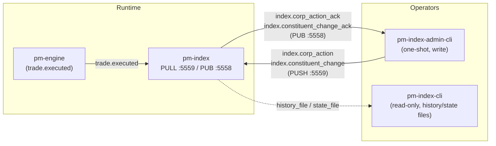

Version: 1.1.0

Date: 2026-07-20

Status: Implemented

# EduMatcher — Index Admin CLI (`pm-index-admin-cli`) Design Proposal

!!! note "Post-implementation correction (v1.1.0)"
    §8 originally assumed `ExchangeCommandClient._recv()` already handled an
    `index.error.<gateway_id>` reply arriving in place of the expected ack
    — it does not; `_recv()` only ever matched a single topic prefix and
    silently discarded anything else, so an unknown `--index` produced a
    `CommandTimeoutError` after the full `--timeout` window instead of an
    immediate `REJECTED`. This was caught during implementation via
    end-to-end testing against a real `pm-index` process (unit tests using
    injected sockets did not catch it, since nothing exercised the
    conflicting-topic case). Fixed at the client-library level: `_recv()`
    gained an optional `error_prefix` parameter, and a new `CommandError`
    exception is raised when a message matches it. See the updated §8
    below and [Index Admin CLI](../docs/user-guide/152-index-admin-cli.md#unknown-index-id-fails-fast)
    for the current, correct behavior.


## Table of Contents

1. [Overview](#1-overview)
2. [Problem Statement](#2-problem-statement)
3. [Goals and Non-Goals](#3-goals-and-non-goals)
4. [Background: The Existing Wire Protocol](#4-background-the-existing-wire-protocol)
5. [Proposed CLI Surface](#5-proposed-cli-surface)
6. [Command Details](#6-command-details)
7. [Output Formats and UX Rules](#7-output-formats-and-ux-rules)
8. [Error Handling and Exit Codes](#8-error-handling-and-exit-codes)
9. [Security and Authentication Considerations](#9-security-and-authentication-considerations)
10. [Implementation Plan](#10-implementation-plan)
11. [Documentation Changes](#11-documentation-changes)
12. [Testing Guide](#12-testing-guide)
13. [Acceptance Checklist](#13-acceptance-checklist)
14. [Open Questions](#14-open-questions)
15. [Future Extensions](#15-future-extensions)


## 1. Overview

`pm-index` computes and publishes one or more price-weighted or cap-weighted
indices from live constituent trades. Its PULL socket (default
`tcp://127.0.0.1:5559`) already accepts two write commands —
`index.corp_action` and `index.constituent_change` — and applies splits, cash
dividends, share issuances (buy-backs included), constituent adds, and
constituent delists. This engine-side handling is complete and working.

What is missing is an operator-facing way to reach it. Today the *only*
client is the Python `ExchangeCommandClient` class
(`edumatcher.commands.client`), which means applying a stock split or
retiring a constituent means writing a throwaway script — there is no
`pm-alf-console` command, no `pm-admin-cli` subcommand, and no interactive
tool at all, a gap already called out explicitly in
[`docs/user-guide/150-index.md`](../docs/user-guide/150-index.md#applying-corporate-actions):

> "Unlike `INDEX|HISTORY`, corporate actions have no `pm-alf-console`
> command, no `pm-admin` / `pm-admin-cli` subcommand, and no CALF/ALF wire
> message... Applying a corporate action currently means writing a short
> script."

This proposal adds a new, standalone, one-shot CLI:

```bash
poetry run pm-index-admin-cli [global-options] COMMAND [command-options]
```

`pm-index-admin-cli` speaks directly to the index process's ZMQ PUSH/SUB
pair (ports 5559/5558) using `ExchangeCommandClient`'s existing
`index_corp_action` / `index_delist` / `index_add_constituent` /
`index_history` methods — the same client class `pm-admin-cli` already uses
for engine commands. No engine-side or `pm-index`-side code changes are
required; this is a pure client-side addition.


### 1.1 Why not extend `pm-index` itself?

`pm-index` is intentionally a narrow, read-oriented computation process: it
subscribes to `trade.executed`/`session.state`/`system.eod`, recalculates
index levels, and publishes `index.update`. Its only "write" surface is the
PULL socket that already exists for this exact purpose. Bolting an
interactive command parser onto `pm-index` itself would blur that
separation and complicate its startup/shutdown story. Keeping the operator
interface as a separate, one-shot CLI process — exactly the same
"recorder/writer vs. query/command tool" split already used for
`pm-audit` / `pm-audit-cli` and `pm-clearing` / `pm-clearing-cli` — keeps
`pm-index` clean and testable in isolation.

### 1.2 Why not `pm-index-cli`?

`pm-index-cli` already exists (`edumatcher.index.cli:main`) as a read-only
query tool over `pm-index`'s history/state files (analogous to
`pm-stats-cli`). It does not touch the live ZMQ bus at all. Corporate
actions are a live, mutating, operator-authorized action against a running
process — a fundamentally different responsibility from historical
querying — so this proposal keeps them in a **separate binary**,
`pm-index-admin-cli`, rather than adding a write mode to `pm-index-cli`.
This mirrors the existing split between `pm-admin` (engine command REPL)
and `pm-stats-cli`/`pm-clearing-cli` (read-only query tools): commands that
mutate exchange state get their own explicitly-named entry point so the
blast radius of a mistyped command is obvious from the binary name alone.




## 2. Problem Statement

Applying a corporate action today requires an operator to hand-write a
Python script similar to:

```python
from edumatcher.commands.client import ExchangeCommandClient

with ExchangeCommandClient("OPS01") as client:
    result = client.index_corp_action(
        index_id="TECH10", action="SPLIT", symbol="AAPL",
        ratio_numerator=4, ratio_denominator=1,
    )
    print(result)
```

This has several practical problems for classroom and operational use:

1. **No discoverability.** There is no `--help` output listing supported
   corporate-action types, their required parameters, or valid value
   ranges. An operator must read `client.py` and `index/main.py` source to
   learn the wire format.
2. **No parameter validation before send.** `index_corp_action` accepts
   arbitrary `**params`, so a typo in a keyword argument (e.g.
   `ratio_numerater`) is silently dropped from the payload and the engine
   applies a default of `0`, which is then rejected deep inside
   `IndexCalculator` with a message that gives no hint the CLI-equivalent
   flag was misspelled.
3. **No consistent operator workflow.** Every operator writes their own
   ad hoc script, so there is no shared convention for confirmation
   prompts, dry-run previews, or scripting-friendly output — unlike
   `pm-admin-cli`, which already standardizes this for engine-side ADMIN
   commands.
4. **Inconsistent tooling story.** Every other write-capable ZMQ surface in
   EduMatcher (engine ADMIN commands, symbol halts, kill-switch) has a
   real CLI. The index PULL socket is the one write surface left with
   "write a script" as its documented interface.

`pm-index-admin-cli` closes this gap the same way `pm-admin-cli` closed it
for engine ADMIN commands: a small, well-documented, one-shot binary built
directly on `ExchangeCommandClient`.


## 3. Goals and Non-Goals

### 3.1 Goals

- Provide a **one-shot**, **operator-friendly** CLI for every corporate
  action and constituent change `pm-index` already supports on its PULL
  socket.
- Cover the full range of actions the engine implements today: `SPLIT`,
  `CASH_DIVIDEND`, `SHARES_ISSUANCE` (including buy-backs, modeled as a
  reduction — see [§6.4](#64-shares_issuance-buy-backs-and-share-count-changes)),
  constituent `ADD`, and constituent `DELIST`.
- Validate action-specific parameters **client-side** before sending, with
  clear `--help` text per subcommand, so typos and missing required flags
  are caught before a round trip to the engine.
- Follow the same architectural and UX conventions as `pm-admin-cli`:
  built on `ExchangeCommandClient`, single command per invocation, explicit
  `--id` gateway identity, bounded ack timeout, exit code 0/1 for
  success/failure.
- Support a `--dry-run` preview mode and a `--yes/-y` confirmation
  bypass, since these commands are irreversible mutations of index state
  (unlike most `pm-admin-cli` commands, which are transient session
  controls).
- Provide a read-only `history` subcommand mirroring
  `ExchangeCommandClient.index_history()`, so an operator can confirm an
  action was applied without switching tools.
- Work against multiple configured indices in one `engine_config.yaml`
  (an `--index` flag is required on every mutating subcommand — see
  [§6](#6-command-details)).

### 3.2 Non-Goals

- This proposal does **not** change any engine-side or `pm-index`-side
  code. The wire format, message topics, and `IndexCalculator` semantics
  are used exactly as they exist today.
- This proposal does **not** add a new corporate-action *type* to the
  engine (e.g. a dedicated `BUYBACK` action code). See
  [§6.4](#64-shares_issuance-buy-backs-and-share-count-changes) and
  [§14](#14-open-questions) for the recommended path if that is wanted
  later.
- This proposal does **not** add authentication, ZAP/CURVE encryption, or
  a gateway allowlist to the index PULL socket. See
  [§9](#9-security-and-authentication-considerations) for why this is out
  of scope here and how the CLI compensates operationally in the meantime.
- This proposal does **not** turn `pm-index-admin-cli` into an interactive
  REPL (unlike `pm-admin`, the REPL sibling of `pm-admin-cli`). A REPL mode
  could be a future extension (see [§15](#15-future-extensions)) but is not
  needed to close the documented gap.
- This proposal does **not** replace or extend `pm-index-cli`. The two
  tools remain separate: one reads history/state, the other writes
  corporate actions.


## 4. Background: The Existing Wire Protocol

This section summarizes the already-implemented engine-side behavior that
`pm-index-admin-cli` must target exactly. No part of this section is new;
it is restated here so the CLI's flags below are traceable to real
handler code.

### 4.1 Transport

- `pm-index` binds a `PULL` socket at `INDEX_PULL_ADDR`
  (`tcp://127.0.0.1:5559` by default, `EDUMATCHER_INDEX_BIND_HOST` /
  `EDUMATCHER_INDEX_PULL_PORT` env vars) for inbound commands, and a `PUB`
  socket at `INDEX_PUB_ADDR` (`tcp://127.0.0.1:5558` by default) for
  outbound acks and `index.update` broadcasts.
- `ExchangeCommandClient` already opens a second, independent PUSH/SUB
  pair pointed at these addresses (`_index_push` / `_index_sub`), separate
  from the engine's own PUSH/SUB pair on ports 5555/5556.
  `pm-index-admin-cli` reuses this existing client — it does not open raw
  ZMQ sockets itself.
- There is a `connect()`/`disconnect()` handshake pattern already used by
  `pm-admin-cli`, but note: **`pm-index` has no auth handshake analogous to
  the engine's `connect()`/`WELCOME` exchange.** The index PULL socket
  accepts commands immediately once bound; `gateway_id` is used purely as
  an ack-routing key, not an identity check. `pm-index-admin-cli` should
  still call `client.connect()` for parity with `pm-admin-cli` and to
  validate the *engine* connection where relevant (e.g. for `history`,
  which round-trips through the same client object), but must not present
  this as an authentication step for index commands in its UX text.

### 4.2 `index.corp_action` message

Sent as a two-frame ZMQ message `[b"index.corp_action", json_bytes(payload)]`
via `make_index_corp_action_msg()`. Payload fields:

| Field | Type | Required | Notes |
|---|---|---|---|
| `gateway_id` | string | yes | Routing key for the ack topic only; not authenticated. |
| `index_id` | string | yes | Must match a configured index id (`indices:` in `engine_config.yaml`), case-insensitive (upper-cased by the client). |
| `action` | string | yes | One of `SPLIT`, `CASH_DIVIDEND`, `SHARES_ISSUANCE`. Bare string comparison in `pm-index` — not a formal enum. |
| `symbol` | string | yes | Must be an existing constituent of `index_id`. |
| *(action-specific)* | varies | yes | See table below. |

Action-specific parameters, as consumed by `IndexProcess._handle_corp_action`
and `IndexCalculator`:

| Action | Parameters | Type | Effect |
|---|---|---|---|
| `SPLIT` | `ratio_numerator`, `ratio_denominator` | int, int | Multiplies shares outstanding by `numerator/denominator`, rescales last price and divisor so index level is continuous across the split. |
| `CASH_DIVIDEND` | `dividend_per_share` | float | Reduces the constituent's reference price by the dividend amount; rejected if the result would be ≤ 0. |
| `SHARES_ISSUANCE` | `new_shares_outstanding` | int | Sets shares outstanding to this **absolute** value (not a delta) and rescales the divisor. Used for both issuances (increase) and buy-backs (decrease) — see [§6.4](#64-shares_issuance-buy-backs-and-share-count-changes). |

Ack: two-frame `[b"index.corp_action_ack.<gateway_id>", json_bytes(...)]`
with fields `accepted` (bool), `reason` (string, empty on success),
`index_id`, `level` (float, new index level), `divisor` (float, new
divisor). On an unrecognized `index_id`, the process instead replies on
`index.error.<gateway_id>` with a descriptive reason.

### 4.3 `index.constituent_change` message

Sent via `make_index_constituent_change_msg()`. Payload fields:

| Field | Type | Required | Notes |
|---|---|---|---|
| `gateway_id` | string | yes | Same routing-only semantics as above. |
| `index_id` | string | yes | |
| `change_type` | string | yes | `"ADD"` or `"DELIST"` only. |
| `symbol` | string | yes | |
| `shares_outstanding` | int | required for `ADD` | Defaults to `0` if omitted, which `IndexCalculator.add_constituent` will reject. |
| `initial_price` | float | required for `ADD` | Defaults to `0.0` if omitted, which is likewise rejected. |

`DELIST` additionally fails (rejected ack, not an exception that crashes
the process) if the symbol is the index's last remaining constituent,
since that would zero out the index's aggregate market cap.

Ack topic: `index.constituent_change_ack.<gateway_id>`, same
`accepted`/`reason`/`index_id`/`level`/`divisor` shape as corp-action acks.

### 4.4 `index.history_request` message

`ExchangeCommandClient.index_history(index_id, from_ts, to_ts, types=None)`
already provides read access to the structural/price history log
(`STRUCTURAL_RECORD_TYPES = {"INIT", "CORP_ACTION", "DELIST",
"ADD_CONSTITUENT"}` plus price snapshots), replying on
`index.history.<gateway_id>`. `pm-index-admin-cli history` wraps this
directly so an operator can immediately confirm a just-applied action
without leaving the tool.


## 5. Proposed CLI Surface

```bash
poetry run pm-index-admin-cli [global-options] COMMAND [command-options]
```

Structurally this follows `pm-admin-cli` exactly: an `argparse` parser with
global options, then `add_subparsers(dest="command", required=True)`, one
`add_parser()` block per corporate-action / constituent-change / history
command, and a `main()` that builds one `ExchangeCommandClient`, runs
exactly one command, and exits.

### 5.1 Global options

| Flag | Default | Meaning |
|---|---|---|
| `--id` | *(required)* | Gateway ID used as the ack-routing key (mirrors `pm-admin-cli --id`). Does not need to be a `gateways.alf`-configured ID — see [§9](#9-security-and-authentication-considerations). |
| `--index-push` | `INDEX_PULL_CONNECT_ADDR` (`tcp://127.0.0.1:5559`) | Address of `pm-index`'s PULL socket. |
| `--index-sub` | `INDEX_PUB_CONNECT_ADDR` (`tcp://127.0.0.1:5558`) | Address of `pm-index`'s PUB socket, for acks. |
| `--timeout` | `3000` | Ack timeout in milliseconds. |
| `--dry-run` | off | Validate and print the outbound payload; do not send it. |
| `-y`, `--yes` | off | Skip the interactive confirmation prompt for mutating commands. |
| `--format` | `table` | Output format: `table` or `json`. See [§7](#7-output-formats-and-ux-rules). |
| `--version` | — | Print version and exit (via the shared `add_version_argument` helper used by every `pm-*` CLI). |

Notably **absent**, deliberately, to match `pm-admin-cli`'s precedent:
`--config` (the CLI never reads `engine_config.yaml` itself — the engine
process is the source of truth for valid `index_id`/`symbol` combinations,
and validation happens via the ack, not a local config read) and
`-v/--log-level` (matching `pm-admin-cli`, which also has no logging
flags; all feedback is direct `print()`/`rich` output, not the `logging`
module).

### 5.2 Subcommands

| Subcommand | Purpose | Wire message |
|---|---|---|
| `split` | Apply a stock split (or reverse split) | `index.corp_action`, `action=SPLIT` |
| `dividend` | Apply a cash dividend adjustment | `index.corp_action`, `action=CASH_DIVIDEND` |
| `shares` | Set absolute shares outstanding (issuance or buy-back) | `index.corp_action`, `action=SHARES_ISSUANCE` |
| `add` | Add a new constituent | `index.constituent_change`, `change_type=ADD` |
| `delist` | Remove a constituent | `index.constituent_change`, `change_type=DELIST` |
| `history` | Show recent structural/corp-action history for an index | `index.history_request` |

Command names are deliberately short, lower-case verbs (`split`,
`dividend`, `shares`, `add`, `delist`) rather than the wire-level constant
names (`SPLIT`, `CASH_DIVIDEND`, `SHARES_ISSUANCE`, `ADD`, `DELIST`) —
this matches `pm-admin-cli`'s own convention of hyphenated/lower-case
subcommands (`halt-sym`, not `HALT_SYM`) that get upper-cased internally
before dispatch.


## 6. Command Details

### 6.1 `split` — Apply a stock split

```bash
pm-index-admin-cli --id OPS01 split --index TECH10 --sym AAPL --ratio 4:1
```

| Flag | Type | Required | Description |
|---|---|---|---|
| `--index` | string | yes | Index ID (e.g. `TECH10`). |
| `--sym` | string | yes | Constituent symbol. |
| `--ratio` | `N:M` string | yes | Split ratio, e.g. `4:1` for a 4-for-1 split, `1:10` for a 1-for-10 reverse split. Parsed client-side into `ratio_numerator=N`, `ratio_denominator=M`; both must be positive integers. |

Client-side validation before send: `--ratio` must match `^\d+:\d+$`, and
neither side may be zero (a `0:1` or `1:0` ratio is caught locally with a
clear error instead of round-tripping to the engine to get a generic
`ValueError` from `IndexCalculator`).

**Example — 4-for-1 split:**

```bash
$ pm-index-admin-cli --id OPS01 split --index TECH10 --sym AAPL --ratio 4:1
This will apply a SPLIT (4:1) to AAPL in index TECH10. Continue? [y/N] y
SPLIT OK   TECH10  AAPL  ratio=4:1  new_level=8452.17  new_divisor=118.3352
```

**Example — 1-for-10 reverse split, skipping confirmation:**

```bash
$ pm-index-admin-cli --id OPS01 split --index TECH10 --sym XYZ --ratio 1:10 --yes
SPLIT OK   TECH10  XYZ  ratio=1:10  new_level=8390.02  new_divisor=118.9931
```

### 6.2 `dividend` — Apply a cash dividend

```bash
pm-index-admin-cli --id OPS01 dividend --index TECH10 --sym MSFT --amount 0.75
```

| Flag | Type | Required | Description |
|---|---|---|---|
| `--index` | string | yes | Index ID. |
| `--sym` | string | yes | Constituent symbol. |
| `--amount` | float | yes | Dividend per share in price units. Must be > 0 (client-side check; the engine independently rejects if the resulting price would be ≤ 0). |

**Example:**

```bash
$ pm-index-admin-cli --id OPS01 dividend --index TECH10 --sym MSFT --amount 0.75 --yes
CASH_DIVIDEND OK   TECH10  MSFT  amount=0.75  new_level=8447.61  new_divisor=118.3352
```

**Rejection example** (dividend exceeds current price):

```bash
$ pm-index-admin-cli --id OPS01 dividend --index TECH10 --sym MSFT --amount 500 --yes
REJECTED   Resulting price for MSFT would be non-positive (-88.50)
```

### 6.3 `shares` — Set shares outstanding (issuance or buy-back)

```bash
pm-index-admin-cli --id OPS01 shares --index TECH10 --sym AAPL --new-shares 15200000000
```

| Flag | Type | Required | Description |
|---|---|---|---|
| `--index` | string | yes | Index ID. |
| `--sym` | string | yes | Constituent symbol. |
| `--new-shares` | int | yes* | New **absolute** total shares outstanding. |
| `--delta` | int | yes* | Alternative to `--new-shares`: a signed change (negative for a buy-back, positive for an issuance) applied to the constituent's *currently known* shares outstanding. |

`*` exactly one of `--new-shares` / `--delta` must be given; they are
mutually exclusive (`argparse` mutually-exclusive group).

`--delta` is a CLI-side convenience only — the wire protocol has no delta
concept (`SHARES_ISSUANCE` always sets an absolute value). To resolve
`--delta` into an absolute `new_shares_outstanding`, the CLI first calls
`index_history(index_id, types=["ADD_CONSTITUENT", "CORP_ACTION"])` (or,
if unavailable, prompts the operator to supply `--new-shares` directly) to
find the constituent's last known share count, adds the delta, and shows
the computed absolute value in the confirmation prompt before sending —
never silently. See [§6.4](#64-shares_issuance-buy-backs-and-share-count-changes)
for why this lookup-then-compute approach, rather than a server-side
delta, was chosen.

**Example — buy-back via absolute value:**

```bash
$ pm-index-admin-cli --id OPS01 shares --index TECH10 --sym AAPL --new-shares 15200000000 --yes
SHARES_ISSUANCE OK   TECH10  AAPL  new_shares_outstanding=15,200,000,000  new_level=8401.09  new_divisor=118.1187
```

**Example — buy-back via delta (resolved and confirmed client-side):**

```bash
$ pm-index-admin-cli --id OPS01 shares --index TECH10 --sym AAPL --delta -800000000
Last known shares_outstanding for AAPL: 16,000,000,000 (as of 2026-07-18T14:02:11Z)
This will set shares_outstanding to 15,200,000,000 (delta -800,000,000). Continue? [y/N] y
SHARES_ISSUANCE OK   TECH10  AAPL  new_shares_outstanding=15,200,000,000  new_level=8401.09  new_divisor=118.1187
```

### 6.4 `SHARES_ISSUANCE`, buy-backs, and share-count changes

The engine has **no dedicated `BUYBACK` action type** — only `SPLIT`,
`CASH_DIVIDEND`, and `SHARES_ISSUANCE` exist in
`IndexProcess._handle_corp_action`'s dispatch. A buy-back is economically
just a reduction in shares outstanding, so this proposal maps it onto the
existing `SHARES_ISSUANCE` action (which sets an absolute share count,
regardless of direction) rather than requesting an engine-side change.

This is a deliberate, low-risk design choice for this proposal:

- **No engine changes required.** `IndexCalculator.apply_shares_issuance`
  already handles both directions correctly — it just rescales the
  divisor based on the new absolute share count, with no sign-specific
  logic.
- **The CLI is where the buy-back "verb" lives**, via `--delta` and clear
  confirmation-prompt wording ("This will apply a buy-back...' when the
  computed new value is lower than the last known value, vs. "issuance"
  when it's higher). The wire payload sent to the engine is identical
  either way (`action=SHARES_ISSUANCE`, `new_shares_outstanding=N`).
- If a future engine change wants to record buy-backs as a distinct
  history-log entry type (e.g. for reporting "total buy-back volume"
  separately from "total issuance volume"), that is a natural follow-on
  engine-side proposal — see [§14](#14-open-questions) — and would only
  require the CLI to pass through a `direction` hint, not a redesign.

### 6.5 `add` — Add a constituent

```bash
pm-index-admin-cli --id OPS01 add --index TECH10 --sym NVDA --shares 2470000000 --price 118.50
```

| Flag | Type | Required | Description |
|---|---|---|---|
| `--index` | string | yes | Index ID. |
| `--sym` | string | yes | Symbol to add. Must already be a tradeable symbol in `engine_config.yaml`'s `symbols:` section — `pm-index` does not validate this itself (it only tracks it as an index constituent), so a typo here silently creates a constituent that will never receive `trade.executed` updates. The CLI cannot detect this locally (it has no `--config` access — see [§5.1](#51-global-options)) but the confirmation prompt states the requirement explicitly. |
| `--shares` | int | yes | Initial shares outstanding. Must be > 0. |
| `--price` | float | yes | Initial reference price. Must be > 0. |

**Example:**

```bash
$ pm-index-admin-cli --id OPS01 add --index TECH10 --sym NVDA --shares 2470000000 --price 118.50
Add NVDA to index TECH10 (shares_outstanding=2,470,000,000, initial_price=118.50)?
Note: NVDA must already be a configured tradeable symbol, or it will never update. Continue? [y/N] y
ADD OK   TECH10  NVDA  new_level=8511.44  new_divisor=119.0244
```

### 6.6 `delist` — Remove a constituent

```bash
pm-index-admin-cli --id OPS01 delist --index TECH10 --sym XYZ
```

| Flag | Type | Required | Description |
|---|---|---|---|
| `--index` | string | yes | Index ID. |
| `--sym` | string | yes | Symbol to delist. |

`delist` always prompts for confirmation (even with correctly-typed
flags) because it is the one command with no engine-side undo — re-adding
requires re-supplying `shares_outstanding`/`initial_price`, which are not
retained anywhere once removed. `--yes` still bypasses the prompt for
scripted use, but the help text and prompt wording call this out
explicitly:

```bash
$ pm-index-admin-cli --id OPS01 delist --index TECH10 --sym XYZ
Delist XYZ from index TECH10? This cannot be undone from history —
re-adding XYZ will require supplying shares_outstanding and
initial_price again. Continue? [y/N] y
DELIST OK   TECH10  XYZ  new_level=8390.02  new_divisor=118.9931
```

**Rejection example** (last constituent):

```bash
$ pm-index-admin-cli --id OPS01 delist --index TECH10 --sym AAPL --yes
REJECTED   Cannot delist AAPL: index TECH10 would have no remaining constituents
```

### 6.7 `history` — Show recent index history

```bash
pm-index-admin-cli --id OPS01 history --index TECH10 --limit 20
```

| Flag | Type | Required | Description |
|---|---|---|---|
| `--index` | string | yes | Index ID. |
| `--from` | ISO timestamp | no | Start of range (default: 24h ago). |
| `--to` | ISO timestamp | no | End of range (default: now). |
| `--types` | comma-separated | no | Filter to `INIT`, `CORP_ACTION`, `DELIST`, `ADD_CONSTITUENT` (default: all). |
| `--limit` | int | no | Max rows shown (default: 50). |

This is a read, not a mutation — no confirmation prompt regardless of
`--yes`.

**Example:**

```bash
$ pm-index-admin-cli --id OPS01 history --index TECH10 --limit 5
  TIMESTAMP             TYPE            SYMBOL   DETAIL
  2026-07-19T09:15:02Z  CORP_ACTION     AAPL     SPLIT 4:1 -> level=8452.17
  2026-07-18T14:02:11Z  CORP_ACTION     AAPL     SHARES_ISSUANCE 16,000,000,000 -> level=8390.02
  2026-07-15T09:30:00Z  ADD_CONSTITUENT NVDA     shares=2,470,000,000 price=118.50
  2026-07-10T16:00:00Z  DELIST          XYZ      -> level=8390.02
  2026-06-01T09:00:00Z  INIT            -        base_value=1000.00
```

### 6.8 Combined command summary table

| Subcommand | Required flags | Optional flags |
|---|---|---|
| `split` | `--index`, `--sym`, `--ratio` | `--yes`, `--dry-run` |
| `dividend` | `--index`, `--sym`, `--amount` | `--yes`, `--dry-run` |
| `shares` | `--index`, `--sym`, (`--new-shares` xor `--delta`) | `--yes`, `--dry-run` |
| `add` | `--index`, `--sym`, `--shares`, `--price` | `--yes`, `--dry-run` |
| `delist` | `--index`, `--sym` | `--yes`, `--dry-run` |
| `history` | `--index` | `--from`, `--to`, `--types`, `--limit` |


## 7. Output Formats and UX Rules

- **Default output** is a single-line, human-readable summary in the same
  `<COMMAND> OK   <fields>` / `REJECTED   <reason>` style already used by
  `pm-admin-cli`'s `_report()` helper (see `console.py`), reusing that
  helper directly rather than inventing a new formatter. `history` uses a
  `rich.table.Table`, matching `pm-admin-cli`'s existing table renderers
  (`_print_orders`, `_print_symbols`, etc.) rather than introducing a new
  table style.
- **`--format json`** emits the raw ack dict (or, for `history`, a JSON
  array of history records) instead of the rich-formatted line/table, for
  scripting. This is a deliberate departure from `pm-admin-cli`, which has
  no JSON mode at all — because `pm-index-admin-cli` commands are
  naturally scripted around batch corporate-action events (e.g. an
  end-of-day script applying all of a day's queued splits from a CSV), a
  machine-readable mode earns its keep here even though the engine-command
  CLI didn't need one. This follows the precedent already set by
  `pm-index-cli` and `pm-audit-cli`, both of which support `--format
  json`.
- **Confirmation prompts** (`Continue? [y/N]`) appear by default for every
  mutating subcommand (`split`, `dividend`, `shares`, `add`, `delist`) and
  are skipped only with `-y`/`--yes` or when stdin is not a TTY (matching
  common CLI convention — non-interactive/CI use implies `--yes` is
  required, and the tool should print a clear error rather than hang if
  stdin is not a TTY and `--yes` was not passed).
- **`--dry-run`** prints the exact outbound topic and JSON payload (pretty
  printed) and exits 0 without sending anything or prompting for
  confirmation. Useful for verifying a `--delta`-resolved value or a
  `--ratio` parse before committing.
- **Numbers are formatted with thousands separators** in table/default
  output (e.g. `15,200,000,000`) but left as plain numbers in
  `--format json` output.


## 8. Error Handling and Exit Codes

Matching `pm-admin-cli`'s existing convention exactly:

| Exit code | Meaning |
|---|---|
| `0` | Command accepted by `pm-index` (or `--dry-run` completed without error). |
| `1` | Rejected by `pm-index` (bad ratio, unknown symbol, last-constituent delist, etc.), client-side validation failure (bad `--ratio` format, negative `--shares`), connection timeout, or user declined the confirmation prompt. |

Specific error paths to handle explicitly, since `pm-index`'s ack/error
topics are two different topics depending on failure type:

- **Unknown `index_id`**: arrives on `index.error.<gateway_id>`, not the
  command's own ack topic. `_ACK_SUB_PREFIXES` including `"index.error."`
  only controls which topics the ZMQ `SUB` socket receives at all — it does
  **not** mean `_recv()` matches an error reply to the call that's waiting
  for a different prefix. Getting this right required a client-library
  change: `ExchangeCommandClient._recv()` gained an optional `error_prefix`
  parameter, and each of the four index methods (`index_corp_action`,
  `index_delist`, `index_add_constituent`, `index_history`) now passes
  `index.error.<gateway_id>` as that parameter. A message matching it
  raises a new `CommandError` exception (carrying the error payload)
  immediately, instead of being silently discarded while `_recv()` keeps
  waiting for its expected prefix. `pm-index-admin-cli` catches
  `CommandError` in `main()` and reports it exactly like a normal
  `accepted=False` rejection (`REJECTED  <reason>`, or the raw payload
  under `--format json`), respecting the configured output format. This
  fix lives entirely in `ExchangeCommandClient`, so it benefits every
  caller of those four methods, not just this CLI.
- **Connection/timeout**: if `pm-index` is not running, the PUSH send
  succeeds (ZMQ PUSH buffers locally) but no ack ever arrives, and the
  client raises `CommandTimeoutError` after `--timeout` ms. The CLI should
  print `Timed out waiting for pm-index. Is it running and reachable at
  <push-addr>?` to `stderr`, distinguishing this from an explicit
  `REJECTED` response.
- **Client-side validation failures** (e.g. `--ratio` not matching
  `N:M`, `--new-shares` and `--delta` both given) are caught by
  `argparse`/manual checks *before* any socket is touched, and exit 2
  (argparse's own convention for usage errors) rather than 1, so scripts
  can distinguish "your command was malformed" from "the engine rejected
  a well-formed command."


## 9. Security and Authentication Considerations

This section documents, rather than tries to fix, an existing gap — worth
stating plainly since it directly shapes this CLI's `--id` semantics and
help text.

`pm-index`'s PULL socket has **no authentication of any kind**:

- No ZAP/CURVE — it is a bare `zmq.PULL` socket bound with
  `make_puller()`.
- No allowlist — unlike the engine's PUSH/PULL socket (port 5555), which
  at least checks a `role: ADMIN` field against `engine_config.yaml`'s
  `gateways.alf` list for halt/resume-style commands, `pm-index` performs
  **no** check of `gateway_id` against any configured list at all. It only
  verifies the field is non-empty before proceeding.
- The `gateway_id` field is used exclusively as an ack-routing key (which
  SUB topic to reply on) — never as an identity or permission check.

Practically, this means **any process that can reach
`tcp://127.0.0.1:5559`** (localhost-only by default, since
`EDUMATCHER_INDEX_BIND_HOST` defaults to `127.0.0.1`) can apply arbitrary
corporate actions today, whether via a hand-written script or via
`pm-index-admin-cli`. This CLI does not change that exposure — it only
makes the existing capability easier and safer to *use correctly*
(validated inputs, confirmation prompts, dry-run) — it does not add any
new capability an operator didn't already have via
`ExchangeCommandClient`.

Given EduMatcher's stated posture that this "is appropriate for a learning
system running on localhost" (the same rationale already used in
`docs/user-guide/160-commands.md` for the engine's own PUSH-socket
warning), this proposal recommends:

- **`--id` remains a free-text label**, not validated against
  `engine_config.yaml`, and the CLI's help text and `README`/docs should
  say so explicitly, so operators don't mistake it for an auth mechanism.
- **The confirmation-prompt-by-default behavior** (see §7) is this
  proposal's primary safety mechanism against accidental/scripted
  mistakes, not against malicious use.
- Any future move toward binding `pm-index` to a non-localhost address for
  a multi-host classroom deployment should be paired with adding the same
  kind of `role`-in-payload check the engine already has for ADMIN
  commands — this is flagged as an explicit open question in
  [§14](#14-open-questions) rather than addressed by this proposal, since
  it requires an engine-side (`pm-index`) change that is out of scope
  here.


## 10. Implementation Plan

1. **New module** `src/edumatcher/index/admin_cli.py` (or
   `src/edumatcher/commands/index_admin_cli.py` — see
   [§14](#14-open-questions) for the package-placement question),
   containing `_build_parser()` and `main()`, structured like
   `src/edumatcher/commands/cli.py`.
2. **Reuse `ExchangeCommandClient`** as-is — no changes to
   `commands/client.py` are required. All five mutating subcommands map
   directly onto the three existing methods (`index_corp_action` for
   `split`/`dividend`/`shares`, `index_delist` for `delist`,
   `index_add_constituent` for `add`) plus `index_history` for `history`.
3. **Client-side validators** for each subcommand's flags
   (`--ratio` regex + positivity, `--amount` > 0, `--new-shares`/`--delta`
   mutual exclusivity + positivity, `--shares`/`--price` > 0) as small
   pure functions, unit-testable without any ZMQ dependency.
4. **`--delta` resolution helper** for `shares` (§6.3): queries
   `index_history` for the most recent share-count-affecting record for
   the symbol, computes the new absolute value, and surfaces it in the
   confirmation prompt. Falls back to a clear error ("no prior
   shares_outstanding found for AAPL in index TECH10 — pass --new-shares
   instead") if no such record exists (e.g. right after `add`, before any
   `history_file` write has occurred).
5. **Confirmation-prompt / `--dry-run` / `--yes` plumbing**, shared across
   all five mutating subcommands via one small helper function, to avoid
   duplicating the "print payload, ask y/N, or skip" logic five times.
6. **`--format json` output path**, reusing `json.dumps` on the raw ack
   dict for mutating commands, and a JSON-array serialization of history
   rows for `history`.
7. **Entry point registration** in `pyproject.toml`:
   ```toml
   pm-index-admin-cli = "edumatcher.index.admin_cli:main"
   ```
8. **`--version` wiring** via the existing shared
   `edumatcher.cli_version.add_version_argument` helper, matching every
   other `pm-*` CLI.
9. **Reuse `_report()`** from `commands/console.py` (or extract it to a
   shared location if `console.py` is considered engine-specific) for the
   default-format accepted/rejected line, to keep visual consistency with
   `pm-admin-cli` output.


## 11. Documentation Changes

- **`docs/user-guide/150-index.md`**: replace the
  `!!! warning "No interactive command exists yet"` callout (currently at
  the section documenting corporate actions) with a description of
  `pm-index-admin-cli`, keeping the existing Python
  `ExchangeCommandClient` examples as the "if you're scripting this"
  alternative rather than removing them outright — both remain valid
  entry points, and the doc should say so.
- **`docs/user-guide/160-commands.md`**: add `pm-index-admin-cli` to the
  "Relationship to other tools" table alongside `pm-admin-cli`, and add a
  full command reference section mirroring the existing `pm-index-cli`
  reference section's structure and depth. Cross-reference the new
  `index.corp_action`/`index.constituent_change`/`index.history_request`
  rows into the existing command-reference table, which today omits them
  entirely (an existing documentation gap this proposal should close as
  part of landing the CLI, not leave for later).
- **`docs/training/25-index.md`**: the three exercises that currently
  instruct students to write a raw `ExchangeCommandClient` script for
  corporate actions (added when this same gap was worked around in the
  training-doc review — see the "Fictional `CORP_ACTION|` gateway
  command" fix in that review) can be simplified to use
  `pm-index-admin-cli` directly, with the Python-script version kept as a
  "how it works under the hood" appendix rather than the primary path.
- **New `docs-design/` doc** (this document) stays as the design record;
  once implemented, a short "Status: Implemented" update should be added
  at the top per the project's existing convention (see how
  `EduMatcher-QLEGS-RECENT.md` or `EduMatcher-audit-cli.md` were updated
  post-implementation, if applicable).


## 12. Testing Guide

- **Unit tests** for all client-side validators (`--ratio` parsing,
  `--delta` resolution arithmetic, mutual-exclusivity checks) with no ZMQ
  dependency — pure function tests.
- **Integration tests** using the same pattern already used for
  `ExchangeCommandClient` index methods: spin up a real `IndexProcess` in
  a test fixture (bound to ephemeral ports), drive `pm-index-admin-cli`'s
  `main()` with a crafted `sys.argv`, and assert on both the printed
  output and the resulting `IndexCalculator` state (level/divisor/shares).
- **Rejection-path tests**: unknown `index_id`, unknown `symbol`, last-
  constituent `delist`, zero/negative `--ratio` components, dividend
  exceeding current price — one test per documented rejection reason in
  [§6](#6-command-details), asserting both exit code `1` and the expected
  `REJECTED` message text.
- **Timeout test**: start the CLI against a port with no listener, assert
  exit code `1` and the "Is it running and reachable" message within a
  bounded wall-clock time (using a short `--timeout` to keep the test
  fast).
- **`--dry-run` test**: assert no ack is awaited and no state changes,
  by running against a process that would otherwise reject or hang, and
  confirming the process's state is untouched afterward.
- **`--format json` round-trip test**: assert the JSON output is valid
  JSON and contains the same fields as the ack dict returned by the
  underlying `ExchangeCommandClient` call.


## 13. Acceptance Checklist

- [ ] `pm-index-admin-cli --help` lists all six subcommands with clear,
      accurate per-flag help text.
- [ ] `split`, `dividend`, `shares`, `add`, `delist` each successfully
      apply their action against a running `pm-index` and print a
      matching `OK` summary line.
- [ ] Each subcommand's documented rejection paths (§6) are reproducible
      and produce the documented `REJECTED` message.
- [ ] `history` returns and renders records consistent with what
      `pm-index-cli`'s own history view shows for the same index (cross-
      tool consistency check).
- [ ] `--dry-run` never sends a ZMQ message (verified via a test double or
      packet capture) and never mutates index state.
- [ ] `--format json` output round-trips through `json.loads` cleanly for
      every subcommand.
- [ ] Confirmation prompts appear by default and are correctly bypassed by
      `--yes`; non-TTY invocation without `--yes` fails clearly rather
      than hanging.
- [ ] Exit codes match §8 exactly across all success/failure/timeout
      paths.
- [ ] No changes were required to `pm-index`, `IndexCalculator`, or
      `ExchangeCommandClient` — confirming this is a pure client
      addition, as scoped in §3.2.
- [ ] `docs/user-guide/150-index.md` and `160-commands.md` updated per
      §11, and the "No interactive command exists yet" warning removed.


## 14. Open Questions

1. **Package placement**: should `admin_cli.py` live under
   `src/edumatcher/index/` (grouped with `pm-index-cli`, since both are
   "index tools") or under `src/edumatcher/commands/` (grouped with
   `pm-admin-cli`, since both are "mutating ZMQ command tools built on
   `ExchangeCommandClient`")? This proposal has no strong recommendation;
   either is defensible, and the choice should follow whichever precedent
   the maintainers weight more heavily. (§10 currently lists both as
   options.)
2. **Dedicated `BUYBACK` action type**: is mapping buy-backs onto
   `SHARES_ISSUANCE` (§6.4) sufficient long-term, or does the project want
   a distinct history-log entry type for reporting purposes (e.g. "total
   buy-back volume this quarter" as a separate metric from "total
   issuance volume")? If yes, that is a separate, engine-side design
   proposal — this CLI's `--delta`-with-sign-aware prompt wording is
   forward-compatible with that change (the CLI would just add a
   `direction` field to the payload once the engine supports reading it).
3. **`gateway_id` role-checking for the index PULL socket**: should
   `pm-index` eventually gain a check analogous to the engine's ADMIN-role
   check, especially if index bind addresses are ever exposed beyond
   localhost? Flagged in §9 as explicitly out of scope for this proposal,
   but worth tracking as a follow-on if EduMatcher's multi-host story
   evolves.
4. **Batch/scripted application**: should this proposal include a
   `--from-file <csv>` bulk-apply mode (e.g. for applying a day's queued
   corporate actions in one invocation), or is that better left to
   operators composing shell loops around single-action invocations plus
   `--format json`? Left out of the initial scope (§3.2 non-goals don't
   explicitly exclude it, but §6 does not define it) — worth revisiting
   once the single-action UX has been used in practice.


## 15. Future Extensions

- **Interactive REPL mode** (`pm-index-admin`, mirroring `pm-admin`),
  for operators applying several corporate actions in one classroom
  session without re-invoking the CLI each time.
- **`--from-file` bulk apply** (see [§14](#14-open-questions) item 4),
  reading a CSV/YAML of queued actions and applying them in sequence,
  stopping (or continuing past, via a flag) the first rejection.
- **Weight-cap / free-float adjustments**, if `IndexCalculator` ever grows
  a weighting scheme beyond simple cap-weighting that requires operator
  input (e.g. capped-weight indices needing periodic rebalancing).
- **Undo/rollback helper**: since `delist` (§6.6) is not directly
  reversible, a `pm-index-admin-cli undo-delist --index ... --sym ...`
  that reads the last matching `DELIST` history record and reconstructs
  the `add` call automatically (still requiring confirmation) would remove
  the main sharp edge called out in §6.6.
