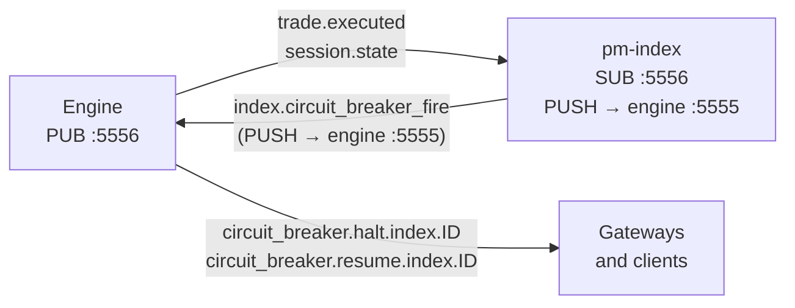

Version: 0.3.0

Date: 2026-06-27

Status: Design and Research Proposal

# EduMatcher - Index Circuit Breaker Design Proposal


## Table of Contents

1. [Motivation](#1-motivation)
2. [Relationship to Symbol Circuit Breakers](#2-relationship-to-symbol-circuit-breakers)
3. [Proposed Configuration Model](#3-proposed-configuration-model)
4. [Trigger Evaluation](#4-trigger-evaluation)
5. [Cooldown and Resume Semantics](#5-cooldown-and-resume-semantics)
6. [Event Flow and Integration](#6-event-flow-and-integration)
7. [Interaction with Symbol Circuit Breakers](#7-interaction-with-symbol-circuit-breakers)
8. [pm-config-gen Extensions](#8-pm-config-gen-extensions)
9. [Validation Rules](#9-validation-rules)
10. [Open Questions](#10-open-questions)
11. [Summary](#11-summary)


## 1. Motivation

EduMatcher already supports symbol-level circuit breakers that halt one instrument
when its price moves too far, too fast. What is still missing is the same kind of
protection at the market level: a mechanism that pauses the entire exchange when a
broad index moves beyond a configurable threshold.

An index-based circuit breaker models the real-world market-wide circuit breakers
used by major exchanges. On the NYSE, the S&P 500 index dropping 7%, 13%, or 20%
from the prior close triggers a halt of all trading for 15 minutes, 15 minutes, or
the rest of the day respectively. This proposal adds the same three-level, configured
percentage structure to EduMatcher.

The practical effect is:

- A single sharp move in the underlying index value suspends all order matching
  on the exchange.
- After the cooldown expires (or the exchange is manually restarted), matching
  resumes, typically via an auction uncross.
- Each configured index can have its circuit breaker enabled or disabled
  independently, so a broad index can protect the whole exchange while a narrower
  sector index remains informational only.


## 2. Relationship to Symbol Circuit Breakers

The design deliberately mirrors the existing symbol circuit-breaker model so
operators and students encounter the same pattern in both places.

| Aspect | Symbol circuit breaker | Index circuit breaker |
|--------|----------------------|----------------------|
| Trigger | Absolute price move from rolling reference | Percentage move from session-open reference |
| Levels | L1 / L2 / L3 with configurable thresholds | L1 / L2 / L3 with configurable thresholds |
| Cooldown | `halt_duration_ns` (null = rest-of-day) | `cooldown_minutes` (-1 = rest-of-day) |
| Resumption | `AUCTION` or `CONTINUOUS` | `AUCTION` (default) |
| Halt scope | One symbol | All symbols on the exchange |
| Configuration location | `symbols.<SYM>.circuit_breaker` | `indices[n].circuit_breaker` |
| ZMQ topics | `circuit_breaker.halt.{SYM}` / `circuit_breaker.resume.{SYM}` | `circuit_breaker.halt.index.{ID}` / `circuit_breaker.resume.index.{ID}` |

The key difference is scope. A symbol breaker halts exactly one instrument.
An index breaker halts **all symbols** on the exchange simultaneously, the same
way a market-wide circuit breaker does in a real exchange.


## 3. Proposed Configuration Model

The circuit breaker configuration lives inside the index entry it governs. That
keeps the index threshold, the halt durations, and the recovery policy in one
YAML block, next to the index's constituent list and publication settings.

### 3.1 YAML structure

The `indices` key is a list. Each element is a dict with an `id` field. The new
`circuit_breaker` block is an optional sub-dict on each entry.

```yaml
indices:
  - id: EDU100
    description: "Broad technology benchmark"
    base_value: 1000.0
    publish_interval_sec: 1.0
    history_file: data/indexes/EDU100_history.jsonl
    state_file: data/indexes/EDU100_state.json
    constituents: [AAPL, MSFT, TSLA]
    circuit_breaker:
      enabled: true
      levels:
        L1:
          price_move_pct: 0.07
          cooldown_minutes: 5
        L2:
          price_move_pct: 0.13
          cooldown_minutes: 15
        L3:
          price_move_pct: 0.20
          cooldown_minutes: -1

  - id: EDUFIN
    description: "Financial sector basket"
    base_value: 1000.0
    publish_interval_sec: 1.0
    history_file: data/indexes/EDUFIN_history.jsonl
    state_file: data/indexes/EDUFIN_state.json
    constituents: [JPM, BAC, GS]
    circuit_breaker:
      enabled: false
```

An index without a `circuit_breaker` key is treated as if it has
`circuit_breaker.enabled: false`.

### 3.2 Field reference

| Field | Type | Required | Meaning |
|-------|------|----------|---------|
| `circuit_breaker.enabled` | boolean | Yes when block present | Activates or deactivates the breaker for this index |
| `circuit_breaker.levels.L1.price_move_pct` | float `(0, 1)` | Yes when enabled | Fractional threshold that triggers L1; `0.07` means 7% |
| `circuit_breaker.levels.L1.cooldown_minutes` | positive integer or `-1` | Yes when enabled | Minutes to halt; `-1` means rest-of-day / manual restart |
| `circuit_breaker.levels.L2.price_move_pct` | float `(0, 1)` | Yes when enabled | Threshold for L2; must be larger than L1 |
| `circuit_breaker.levels.L2.cooldown_minutes` | positive integer or `-1` | Yes when enabled | Halt duration for L2 |
| `circuit_breaker.levels.L3.price_move_pct` | float `(0, 1)` | Yes when enabled | Threshold for L3; must be larger than L2 |
| `circuit_breaker.levels.L3.cooldown_minutes` | positive integer or `-1` | Yes when enabled | Halt duration for L3; typically `-1` for the most extreme level |

The sentinel value `-1` for `cooldown_minutes` is the index-CB equivalent of
`halt_duration_ns: null` in the symbol-CB YAML. It means no timer is set and
the exchange will not auto-resume — it remains halted until the operator
explicitly restarts the session or the next trading day begins.

`cooldown_minutes: 0` is **not valid**. Use `-1` for rest-of-day.


## 4. Trigger Evaluation

### 4.1 Trigger condition

The index breaker fires whenever an incoming index update would move the current
index more than the configured percentage away from the session reference value:

```text
abs(current_index_value - reference_value) / reference_value >= price_move_pct
```

When multiple thresholds are crossed at once (because the index moves sharply),
the **highest matching level** fires. If L3 is crossed, L3 fires — not L1 or L2.

The check runs in `pm-index` on every computed index update before the value is
published. When the condition is met, `pm-index` sends an
`index.circuit_breaker_fire` command to the engine pull socket, which the engine
handles atomically before processing the next order.

### 4.2 Numeric example

Starting conditions:

```
EDU100 reference value (session open): 1000.0
L1 threshold: 7%   →  fires when index <= 930.0 or >= 1070.0
L2 threshold: 13%  →  fires when index <= 870.0 or >= 1130.0
L3 threshold: 20%  →  fires when index <= 800.0 or >= 1200.0
```

Scenario — progressive market sell-off during the session:

```
              reference = 1000.0  (previous day closing value, loaded at startup)
09:30:01  EDU100 = 1000.0   session open; reference already set
10:15:00  EDU100 =  960.0   move = -4.0%;  no breach
10:45:00  EDU100 =  928.0   move = -7.2%;  L1 fires → 5-minute halt
10:50:00  exchange resumes via auction uncross
11:20:00  EDU100 =  865.0   move = -13.5%; L2 fires → 15-minute halt
11:35:00  exchange resumes via auction uncross
13:00:00  EDU100 =  795.0   move = -20.5%; L3 fires → rest-of-day halt
```

The move at 10:45:00 crosses L1 (7%) but not L2 (13%), so only L1 fires. The
move at 13:00:00 crosses all three levels simultaneously; only L3 fires because
it is the highest level crossed.

### 4.3 Direction of move

The formula uses `abs()`, so the breaker fires on both sharp upward and downward
moves. This is a simplification over real-world practice where most market-wide
breakers only trigger on downward moves. Operators who want downward-only
behavior can achieve it by setting very high upward thresholds (for example 99%)
but that is a workaround. A future revision may add a `direction` field.

### 4.4 Reference value

The reference value is set once per trading day:

- **Normal days:** `pm-index` uses the previous trading day's closing index
  value, recorded in the index state file at `system.eod`.
- **First day of operation** (no prior state file): `pm-index` uses the first
  computed index value at session `CONTINUOUS` entry as the opening reference.
- The reference stays fixed for the rest of the trading day and is never
  recalculated mid-session, even if the breaker fires and resumes.
- On `system.eod`, `pm-index` writes the current index value as the closing
  value to the state file so it is available as the reference the next morning.

Using the previous close aligns with real-world practice (NYSE S&P 500
breakers are measured from the prior day's closing value) and means the
reference is known before the first order arrives.


## 5. Cooldown and Resume Semantics

### 5.1 Timed levels

When a level fires with a positive `cooldown_minutes` value:

1. `pm-index` sends `index.circuit_breaker_fire` to the engine, identifying the
   index ID and level name.
2. The engine marks all symbols as halted (same as a symbol CB halt, applied
   exchange-wide).
3. The engine publishes `circuit_breaker.halt.index.{ID}` on the PUB socket.
4. The engine schedules an automatic resume after `cooldown_minutes` minutes.
5. On resume, the engine runs an auction uncross for each symbol (resumption mode
   `AUCTION`) and then publishes `circuit_breaker.resume.index.{ID}`.

If a higher level fires while the exchange is already halted (for example because
a recovery rally reversed sharply):

- The higher level wins.
- Its cooldown replaces the active timer.
- The halt notification is republished with the new level name.

### 5.2 Rest-of-day / manual restart (`cooldown_minutes: -1`)

When a level fires with `cooldown_minutes: -1`:

1. The exchange is halted as above.
2. No automatic resume timer is set.
3. The halt is lifted by exactly one of three paths:

| Resume path | How it works |
|-------------|--------------|
| **Admin command** | Operator sends `INDEX RESUME {ID}` to a gateway with `ADMIN` role. The engine lifts the index CB halt for all symbols and runs the auction uncross. |
| **Next trading day** | `system.eod` resets all halt state. The exchange opens normally the following day. |
| **Process restart** | Restarting the engine clears in-memory halt state. The exchange comes up with no active halts. Use this only in exceptional circumstances since it bypasses the normal audit trail. |

The `INDEX RESUME {ID}` admin command is a new command. It is analogous to the
existing per-symbol `HALT RESUME {SYM}` command but operates exchange-wide in
a single step, avoiding the need to issue one command per symbol.

### 5.3 Resumption mode

On timed resume the engine enters `AUCTION` phase for all halted symbols before
returning to `CONTINUOUS`. This is the same behavior as symbol CB resumption
with `resumption_mode: AUCTION` and is not configurable in v1. If `CONTINUOUS`
resumption is needed, the operator must manually issue symbol-level resume
commands and skip the auction.

### 5.4 Session-end reset

When the session transitions to `CLOSED`, any active index CB halt state is
cleared. This prevents a stale halt from leaking into the next session. The
behavior mirrors FR-RISK-007 for symbol circuit breakers.


## 6. Event Flow and Integration

### 6.1 Architecture



`pm-index` is the process that detects threshold crossings. It sends a command
back to the engine via the engine's PULL socket (port 5555). The engine processes
that command in its main loop, applies the halt atomically, and broadcasts the
halt event on the PUB socket to all subscribers.

This keeps the engine as the single authoritative source for halt state. `pm-index`
never directly modifies any symbol state; it only sends a request to the engine.

### 6.2 New ZMQ message: `index.circuit_breaker_fire`

Sent by `pm-index` to the engine PULL socket when a threshold is crossed.

| Field | Type | Meaning |
|-------|------|---------|
| `index_id` | string | ID of the index that triggered (e.g. `EDU100`) |
| `level` | string | Level that fired (`L1`, `L2`, or `L3`) |
| `current_value` | float | Index value that caused the trigger |
| `reference_value` | float | Session reference value used in the calculation |
| `move_pct` | float | Signed percentage move, e.g. `-0.072` for a 7.2% drop |
| `cooldown_minutes` | integer | Configured cooldown for this level; `-1` for rest-of-day |

### 6.3 Halt event: `circuit_breaker.halt.index.{ID}`

Published by the engine on the PUB socket when it processes
`index.circuit_breaker_fire`.

| Field | Type | Meaning |
|-------|------|---------|
| `index_id` | string | ID of the triggering index |
| `level` | string | Level that fired |
| `current_value` | float | Index value at trigger time |
| `reference_value` | float | Session reference value |
| `move_pct` | float | Signed percentage move |
| `resume_at_ns` | integer or null | Monotonic resume timestamp (nanoseconds); null for rest-of-day |

### 6.4 Resume event: `circuit_breaker.resume.index.{ID}`

Published by the engine when it lifts the halt (timed or manual).

| Field | Type | Meaning |
|-------|------|---------|
| `index_id` | string | ID of the index that triggered the original halt |
| `level` | string | Level that was active when resume occurred |
| `resumed_by` | string | `"timer"` (timed cooldown expired), `"admin_command"` (INDEX RESUME), `"session_end"` (system.eod), or `"restart"` (engine restarted) |


## 7. Interaction with Symbol Circuit Breakers

### 7.1 Concurrent halts

An index CB halt and a symbol CB halt can be active at the same time. The engine
applies both independently. A symbol that was already halted by its own symbol CB
remains halted after the index CB lifts. Conversely, when the index CB resumes,
only the symbols that were halted solely by the index CB are released; any symbol
with an active symbol CB halt stays halted.

The engine must therefore track halt source per symbol:

- `SYMBOL_CB` — halted by its own symbol circuit breaker
- `INDEX_CB` — halted by an index circuit breaker
- `BOTH` — both are active simultaneously

On index CB resume, only symbols with source `INDEX_CB` or `BOTH` are affected.
Symbols with `BOTH` are downgraded to `SYMBOL_CB`. Symbols with only `INDEX_CB`
are fully released and proceed through the auction uncross.

### 7.2 Level escalation

If an individual symbol CB fires for a constituent of the triggering index during
an index CB halt, the symbol CB halt state is recorded independently. The symbol
will not start matching when the index CB lifts; it will wait for its own symbol
CB resume (timed or manual).

### 7.3 Order behavior during halt

While either a symbol CB halt or an index CB halt is active for a symbol:

- `MARKET`, `FOK`, and `IOC` orders are rejected.
- `LIMIT` and `ICEBERG` orders are accepted as resting interest but do not match.
- `QUOTE` orders are rejected.

This is identical to symbol CB halt behavior (FR-RISK-006) and requires no new
order-handling logic.


## 8. pm-config-gen Extensions

`pm-config-gen` already has `--index`, `--index-constituents`, and related flags
for generating the core index configuration. This section specifies the additional
arguments needed to generate the `circuit_breaker` block.

### 8.1 New CLI arguments

Two new flags cover the common case:

```
--index-cb ID[:L1_PCT:L1_MINS:L2_PCT:L2_MINS:L3_PCT:L3_MINS]
```

Enables the circuit breaker for the named index. All six threshold and cooldown
values are optional; when omitted, the built-in defaults are used.

```
--no-index-cb ID
```

Explicitly disables the circuit breaker for the named index (emits
`circuit_breaker.enabled: false`). This is only needed when a global default
is being applied and one index should be opted out.

### 8.2 Built-in defaults

When `--index-cb ID` is given without custom values:

| Level | Default threshold | Default cooldown |
|-------|-----------------|-----------------|
| `L1` | `0.07` (7%) | `5` minutes |
| `L2` | `0.13` (13%) | `15` minutes |
| `L3` | `0.20` (20%) | `-1` (rest-of-day) |

These mirror the built-in defaults used for symbol circuit breakers.

### 8.3 Example invocations

Enable with defaults for one index:

```bash
pm-config-gen \
  --symbols AAPL MSFT TSLA JPM BAC \
  --gateways TRADER01 MM01:MARKET_MAKER OPS01:ADMIN \
  --index EDU100:"Broad technology benchmark" \
  --index-constituents EDU100:AAPL,MSFT,TSLA \
  --index-cb EDU100
```

The generated `indices` block:

```yaml
indices:
  - id: EDU100
    description: "Broad technology benchmark"
    base_value: 1000.0
    publish_interval_sec: 1.0
    history_file: data/indexes/EDU100_history.jsonl
    state_file: data/indexes/EDU100_state.json
    constituents: [AAPL, MSFT, TSLA]
    circuit_breaker:
      enabled: true
      levels:
        L1:
          price_move_pct: 0.07
          cooldown_minutes: 5
        L2:
          price_move_pct: 0.13
          cooldown_minutes: 15
        L3:
          price_move_pct: 0.20
          cooldown_minutes: -1
```

Enable with custom thresholds (5%/10 min, 10%/30 min, 15%/rest-of-day):

```bash
pm-config-gen \
  --symbols AAPL MSFT TSLA \
  --gateways TRADER01 OPS01:ADMIN \
  --index EDU100:"Broad technology benchmark" \
  --index-constituents EDU100:AAPL,MSFT,TSLA \
  --index-cb EDU100:0.05:10:0.10:30:0.15:-1
```

Two indexes — one with CB, one informational only:

```bash
pm-config-gen \
  --symbols AAPL MSFT TSLA JPM BAC GS \
  --gateways TRADER01 OPS01:ADMIN \
  --index EDU100:"Broad technology benchmark" \
  --index-constituents EDU100:AAPL,MSFT,TSLA \
  --index EDUFIN:"Financial sector basket" \
  --index-constituents EDUFIN:JPM,BAC,GS \
  --index-cb EDU100 \
  --no-index-cb EDUFIN
```

### 8.4 Implementation notes

The following changes are required inside the `config_gen` module:

**`config_gen/builder.py` — add `IndexCbSpec` and extend `IndexSpec`**

```python
@dataclass(frozen=True)
class IndexCbLevelSpec:
    price_move_pct: float
    cooldown_minutes: int  # positive integer or -1 for rest-of-day

@dataclass(frozen=True)
class IndexCbSpec:
    enabled: bool
    l1: IndexCbLevelSpec | None = None
    l2: IndexCbLevelSpec | None = None
    l3: IndexCbLevelSpec | None = None

@dataclass(frozen=True)
class IndexSpec:
    id: str
    description: str
    constituents: tuple[str, ...]
    base_value: float = DEFAULT_INDEX_BASE_VALUE
    publish_interval_sec: float = DEFAULT_INDEX_PUBLISH_INTERVAL_SEC
    history_file: str = ""
    state_file: str = ""
    circuit_breaker: IndexCbSpec | None = None  # new field
```

**`config_gen/builder.py` — extend `_build_indices()`**

When `IndexSpec.circuit_breaker` is not `None`, append the `circuit_breaker`
sub-dict to each index entry. `cooldown_minutes: -1` is written directly to
YAML; the config loader treats `-1` as the rest-of-day sentinel.

**`commands/config_gen.py` — argument parser**

Add `--index-cb` and `--no-index-cb` to the existing index argument group
and parse them in the same pass as `--index-constituents`.


## 9. Validation Rules

The configuration loader should reject invalid breaker definitions at startup.

Required rules:

- `enabled` must be a boolean.
- `levels` must be present when `enabled` is `true`.
- All three levels — `L1`, `L2`, and `L3` — must be present when the breaker
  is enabled.
- `price_move_pct` must be a float in the range `(0, 1)` exclusive.
- `cooldown_minutes` must be a positive integer or exactly `-1`. Zero is not
  valid.
- Level thresholds must be strictly ordered:
  `L1.price_move_pct < L2.price_move_pct < L3.price_move_pct`.
- When `enabled` is `false`, the `levels` block is optional and its values are
  not validated.

Advisory warnings (not hard errors):

- Warn if `L3.cooldown_minutes` is a positive integer rather than `-1`, since
  most real-world implementations leave the most extreme level as rest-of-day.
- Warn if no index has its circuit breaker enabled and `enforce_circuit_breakers`
  is `true` globally, since the global flag affects symbol CBs but not index CBs
  (they use their own `enabled` flag).


## 10. Open Questions

Both questions from v0.1.0 are resolved.

1. **Reference value source** — Resolved: use the previous trading day's closing
   index value (written to the state file at `system.eod`). On the first day of
   operation, fall back to the opening value at session start. See §4.4.

2. **Manual resume command** — Resolved: introduce a new `INDEX RESUME {ID}`
   admin command. The exchange also resumes automatically at the next trading
   day or on engine restart. See §5.2.


## 11. Summary

This proposal adds an index-based circuit breaker that mirrors the existing
symbol circuit-breaker model, extended to exchange-wide scope.

All user requirements are covered:

- **Per-index enable/disable** via `circuit_breaker.enabled`.
- **Three configurable levels** (`L1`, `L2`, `L3`) per index.
- **Percentage move thresholds** (`price_move_pct`) per level.
- **Cooldown as positive minutes or `-1`** for rest-of-day / manual restart.

Additional design decisions made in this proposal:

- The halt scope is **all symbols on the exchange**, not just index constituents.
- `pm-index` detects the threshold and sends a fire command to the engine via
  the engine PULL socket; the engine applies the halt and broadcasts the event.
- Halt source tracking (`SYMBOL_CB` / `INDEX_CB` / `BOTH`) ensures concurrent
  symbol and index halts are lifted independently and correctly.
- `pm-config-gen` is extended with `--index-cb` and `--no-index-cb` flags that
  reuse the existing index argument group and follow the same compact spec style
  as the existing `--cb-levels` flag.