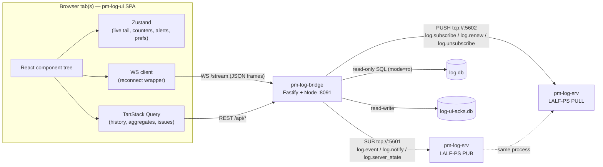
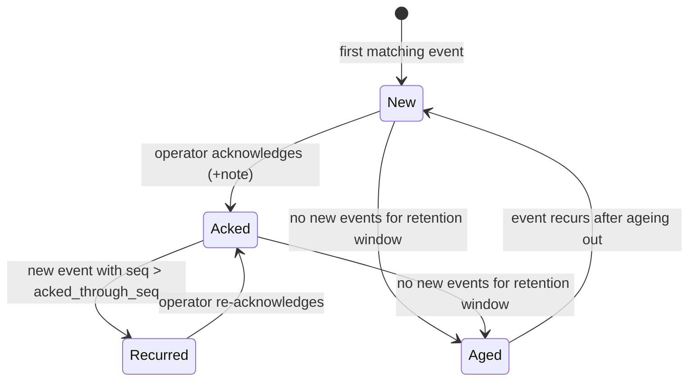

Version: 1.1.0

Date: 2026-07-29

Status: Implemented — initial scaffold shipped in `log-gui/`

> **Changelog v1.1.0 — implementation notes**
>
> Phases 1–6 of §22's implementation plan were built in one pass rather than
> the phased order suggested there (the whole app is small enough that
> splitting it across sessions would have cost more in re-established context
> than it saved). Four points where the real build resolved something this
> document had left open, or diverged in a small, motivated way:
>
> - **§23 open question 1 (where diagnostics run) is resolved: option (a).**
>   `GET /api/diagnostics` shells out to `pm-log-cli --format json diagnose`
>   (`apps/bridge/src/routes/diagnostics.ts`) rather than porting the seven
>   heuristics to TypeScript. This keeps exactly one implementation of
>   `edumatcher.log_cli.diagnose`, at the cost of the bridge depending on
>   `pm-log-cli` being installed and on `PATH` (or reachable via the
>   `LOG_CLI_COMMAND` env var). When it isn't, the route returns a 503 and
>   every other view keeps working — the same degrade-honestly posture §3.1
>   goal 7 asks for elsewhere.
> - **§23 open question 3 (`node:sqlite` vs. `better-sqlite3`) is resolved:
>   `node:sqlite` (`DatabaseSync`) for both `log-db.ts` and `ack-store.ts`.**
>   The initial implementation used `better-sqlite3`, on the reasoning that
>   its synchronous, read-only-capable API was a known quantity and
>   `node:sqlite` was still short on production mileage. That choice was
>   reverted after local bootstrap on Node 26 surfaced a real incompatibility:
>   `better-sqlite3`'s native C++ addon (compiled at install time when no
>   prebuilt binary matches the running Node's ABI) fails to compile against
>   Node 26's V8 headers — `v8::Object::GetPrototype`,
>   `v8::Context::GetIsolate`, and `v8::PropertyCallbackInfo::This` have all
>   been removed/renamed in that V8 version, and the installed
>   `better-sqlite3` release predates the fix. Rather than pin this project to
>   an older Node than the rest of the application (`config-gui` runs
>   unmodified on Node 26, since it has no native dependencies at all), the
>   SQLite access layer was ported to Node's built-in `node:sqlite` module
>   (`DatabaseSync`/`StatementSync`, stable enough for this project's needs as
>   of Node 22.5+). This removes the native dependency — and the class of
>   problem — entirely: no prebuilt binary, no `node-gyp` compile, no
>   Dockerfile build toolchain, no Node-version ceiling. The API shape is
>   close enough to `better-sqlite3` that the port was mechanical:
>   `new DatabaseSync(path, { readOnly: true })` in place of
>   `new Database(path, { readonly: true, fileMustExist: true })`,
>   `db.exec("PRAGMA journal_mode = WAL")` in place of
>   `db.pragma(...)`, and `.prepare(sql).all/get/run(...params)` unchanged.
>   `log-gui/`'s `engines.node` is back to a plain `>=20`, matching the
>   sibling apps.
> - **Fingerprint traceback handling (§11.1) is an approximation, not the
>   literal "exception type + final frame."** `fingerprint.ts` takes the last
>   two non-blank lines of a `has_exception` row's message (the traceback's
>   final `File "...", line N` frame plus the exception line that follows
>   it in Python's standard traceback format) rather than parsing the
>   traceback structurally. This matches the design's intent — "two
>   occurrences differ in intermediate frames but agree on where they were
>   raised" — for the traceback shape Python actually emits, without needing
>   a full traceback parser. Flagged here because it is a heuristic *within*
>   the heuristic, and a message format that doesn't end with the raising
>   frame (unlikely for this project's `has_exception` rows, which come from
>   `logging.exception()`/`exc_info=True`) would degrade its grouping.
> - **`packages/log-query`'s timeseries bucketing (§17) computes arbitrary
>   bucket widths via epoch-floor arithmetic in SQL, not `strftime` alone.**
>   `strftime` can select a calendar unit (minute, hour) but not a multiple
>   of one, so a `5m` bucket is `floor(unix_epoch / 300) * 300` reformatted
>   back to ISO — still "bucketed in SQL, not in JS" as §17 requires, just a
>   detail the design didn't need to specify at the wireframe level.
>
> No decision recorded elsewhere in this document (§4.4's dual-source split,
> §11.2's ack-store placement, §11.1's fingerprint model, or §19's identity
> model) needed to change during implementation — the data-availability
> audit in §4 held up against the real `log_srv`/`log_cli` code exactly as
> written.

> **Scope note**
>
> This document designs `pm-log-ui`, a browser-based operator console for the
> logs collected by `pm-log-srv`. It is the third application in the family
> established by `config-gui` (shipped) and `pm-terminal`
> ([EduMatcher-Terminal-GUI.md](EduMatcher-Terminal-GUI.md), design), and it
> deliberately reuses that family's architecture: an `apps/*` + `packages/*`
> workspace, a small first-party Node/Fastify bridge process, and a
> Vite/React frontend.
>
> It depends on two pieces of already-shipped surface:
>
> - **LALF-PS**, the ZeroMQ `PUB`/`PULL` log-distribution interface of
>   `pm-log-srv` (`docs/user-guide/280-log-srv.md` §"LALF-PS", message
>   catalogue in `docs/user-guide/270-message-reference.md`). This carries
>   the live tail.
> - **`log.db`**, the SQLite store `pm-log-cli` already reads read-only
>   (`docs/user-guide/280-log-srv.md`). This carries history, search and
>   aggregation.
>
> Four decisions that materially shape this design were taken explicitly
> rather than assumed, and are recorded with their alternatives in §4.4,
> §11.2, §11.1 and §19 respectively: where history comes from, where
> acknowledgement state lives, how alerts are grouped, and what identity
> model applies.

# EduMatcher — Log Operator Console (`pm-log-ui`) Design Proposal

## Table of Contents

- [EduMatcher — Log Operator Console (`pm-log-ui`) Design Proposal](#edumatcher--log-operator-console-pm-log-ui-design-proposal)
  - [Table of Contents](#table-of-contents)
  - [1. Motivation](#1-motivation)
  - [2. Problem Statement](#2-problem-statement)
  - [3. Goals and Non-Goals](#3-goals-and-non-goals)
    - [3.1 Goals](#31-goals)
    - [3.2 Non-Goals](#32-non-goals)
  - [4. Data Availability Audit](#4-data-availability-audit)
    - [4.1 Method](#41-method)
    - [4.2 What LALF-PS carries](#42-what-lalf-ps-carries)
    - [4.3 What `log.db` carries](#43-what-logdb-carries)
    - [4.4 Decision: two sources, split by time](#44-decision-two-sources-split-by-time)
    - [4.5 View-by-view data mapping](#45-view-by-view-data-mapping)
    - [4.6 Gaps found](#46-gaps-found)
    - [4.7 Decision table](#47-decision-table)
  - [5. Technology Stack](#5-technology-stack)
    - [5.1 Stack](#51-stack)
    - [5.1a Where this diverges from `pm-terminal`, and why](#51a-where-this-diverges-from-pm-terminal-and-why)
    - [5.2 Monorepo layout](#52-monorepo-layout)
  - [6. Architecture](#6-architecture)
    - [6.1 Topology](#61-topology)
    - [6.2 Why a bridge instead of direct browser→ZeroMQ](#62-why-a-bridge-instead-of-direct-browserzeromq)
    - [6.3 Data flow summary](#63-data-flow-summary)
    - [6.4 `pm-log-bridge` responsibilities](#64-pm-log-bridge-responsibilities)
    - [6.5 Multi-tab fan-out and the single lease](#65-multi-tab-fan-out-and-the-single-lease)
    - [6.6 Reconnect, lease expiry and gap handling](#66-reconnect-lease-expiry-and-gap-handling)
  - [7. Application Shell and Navigation](#7-application-shell-and-navigation)
    - [7.1 Shell wireframe](#71-shell-wireframe)
    - [7.2 Top bar](#72-top-bar)
    - [7.3 Navigation rail](#73-navigation-rail)
    - [7.4 Connection status semantics](#74-connection-status-semantics)
    - [7.5 Theme](#75-theme)
  - [8. Screen Design — Dashboard](#8-screen-design--dashboard)
    - [8.1 Purpose](#81-purpose)
    - [8.2 Wireframe](#82-wireframe)
    - [8.3 The alert banner](#83-the-alert-banner)
    - [8.4 Meters and what they actually measure](#84-meters-and-what-they-actually-measure)
    - [8.5 Data sources](#85-data-sources)
  - [9. Screen Design — Log Explorer](#9-screen-design--log-explorer)
    - [9.1 Purpose](#91-purpose)
    - [9.2 Wireframe](#92-wireframe)
    - [9.3 Filter model](#93-filter-model)
    - [9.4 Live tail vs. historical query](#94-live-tail-vs-historical-query)
    - [9.5 The detail drawer](#95-the-detail-drawer)
    - [9.6 Data sources](#96-data-sources)
  - [10. Screen Design — Processes Board](#10-screen-design--processes-board)
    - [10.1 Wireframe](#101-wireframe)
    - [10.2 Data sources](#102-data-sources)
  - [11. Screen Design — Alerts / Issues](#11-screen-design--alerts--issues)
    - [11.1 Fingerprinting: from events to issues](#111-fingerprinting-from-events-to-issues)
    - [11.2 Acknowledgement model](#112-acknowledgement-model)
    - [11.3 Wireframe](#113-wireframe)
    - [11.4 Issue lifecycle](#114-issue-lifecycle)
    - [11.5 Data sources](#115-data-sources)
  - [12. Screen Design — Diagnostics](#12-screen-design--diagnostics)
    - [12.1 Wireframe](#121-wireframe)
    - [12.2 Data sources](#122-data-sources)
  - [13. Screen Design — Server Health](#13-screen-design--server-health)
    - [13.1 Wireframe](#131-wireframe)
    - [13.2 Data sources](#132-data-sources)
  - [14. Visual Design System](#14-visual-design-system)
    - [14.1 Theme tokens](#141-theme-tokens)
    - [14.2 Severity palette](#142-severity-palette)
    - [14.3 Motion](#143-motion)
    - [14.4 Density](#144-density)
  - [15. Client State Management](#15-client-state-management)
  - [16. `pm-log-bridge` Implementation Guide](#16-pm-log-bridge-implementation-guide)
    - [16.1 LALF-PS subscription management](#161-lalf-ps-subscription-management)
    - [16.2 Query API](#162-query-api)
    - [16.3 Bridge → browser WS message schema](#163-bridge--browser-ws-message-schema)
    - [16.4 Ack store schema](#164-ack-store-schema)
    - [16.5 New files](#165-new-files)
  - [17. Performance Considerations](#17-performance-considerations)
  - [18. Accessibility](#18-accessibility)
  - [19. Security and Operational Notes](#19-security-and-operational-notes)
  - [20. Config Reference](#20-config-reference)
  - [21. Testing Strategy](#21-testing-strategy)
  - [22. Implementation Plan](#22-implementation-plan)
  - [23. Open Questions](#23-open-questions)
  - [24. Summary](#24-summary)

## 1. Motivation

`pm-log-srv` solved collection: every `pm-*` process ships its `logging`
output over LALF/TCP into one queryable SQLite database, and `pm-log-cli`
can query it. LALF-PS then solved distribution: a subscriber can be pushed
rows the moment they are committed, rather than polling.

What does not exist is anything that *looks at* those logs the way an
operator needs to. `pm-log-cli tail` is excellent for a developer watching
one terminal for a few minutes, and `pm-log-cli diagnose` produces a
genuinely useful rule-based report. But neither answers the question an
operator actually has, which is not "show me the logs" but:

> Is anything wrong right now, and if so, has someone dealt with it?

That question needs three things a CLI cannot give: a persistent visual
surface that is *glanceable* rather than requiring a command, aggregate
statistics that put a number in context (47 errors is alarming at 09:00 and
routine during a deliberate failover drill), and a shared notion of
"acknowledged" so two operators looking at the same incident know whether
the other one is already on it.

This document designs that surface.

## 2. Problem Statement

Concretely, today:

- **No aggregate view.** `pm-log-cli stats` prints per-level and
  per-process counts for the *entire* database. There is no
  errors-per-minute, no trend, no "is this worse than an hour ago".
- **No attention model.** A `CRITICAL` from `pm-engine` and a routine
  `INFO` from `pm-ticker` are the same shape of text line. Nothing escalates.
- **No shared state.** Two operators cannot tell whether the other has seen
  an error, let alone acted on it. Nothing records that a human took
  responsibility.
- **Error storms are unreadable.** A crash loop emitting the same
  `ConnectionRefusedError` 5000 times fills any tail window and hides
  everything else, including the second, different problem it caused.
- **Search is a shell exercise.** Finding "every `ERROR` mentioning
  'timeout' from `pm-md-gwy` between 10:00 and 10:15" means composing four
  CLI flags correctly, and iterating means retyping them.

Meanwhile the data to answer all of this already exists — `log.db` has every
row, LALF-PS pushes new ones live, and `diagnose.py` already encodes seven
operational heuristics. Nothing new needs to be collected. It needs to be
*presented*.

## 3. Goals and Non-Goals

### 3.1 Goals

1. **Glanceable health.** An operator with the dashboard on a second
   monitor should register "something is wrong" without reading anything —
   from colour and shape alone.
2. **Errors demand acknowledgement.** Unacknowledged `ERROR`/`CRITICAL`
   activity is visually loud and stays loud until a human explicitly
   acknowledges it. Acknowledgement is shared across operators and survives
   a page reload.
3. **Storm-proof.** 10 000 identical errors must present as one item with a
   count, not 10 000 items.
4. **Fast, iterative filtering.** Changing a filter should feel like
   changing a filter, not like re-running a query: sub-second for typical
   windows, with filter state in the URL so a view can be shared or
   bookmarked.
5. **Professional in both themes.** Dark and light are both first-class,
   not one plus a hasty inversion. Dark is the default (operator screens
   are usually dark; this is also `pm-terminal`'s posture).
6. **Read-only against the log pipeline.** The console never writes to
   `log.db` and never asks `pm-log-srv` to change behaviour. Its only write
   is to its own acknowledgement store (§11.2).
7. **Degrade honestly.** If `pm-log-srv` is down, history still works and
   the UI says so plainly; if `log.db` is unreachable, the live tail still
   works and the UI says so plainly. Neither failure is silent.

### 3.2 Non-Goals

- **Not a log shipper or aggregator.** No ingestion path, no forwarding to
  external systems, no retention policy of its own — `pm-log-srv` owns all
  of that.
- **Not a replacement for `pm-log-cli`.** The CLI stays the right tool for
  scripting, export and offline forensics on a database whose server isn't
  running. This is the interactive sibling, not the successor.
- **Not a trading or market-data view.** Operational `logging` output only.
  `pm-terminal` covers market data; `pm-audit` covers trading events.
- **Not an alerting/paging system.** No email, no SMS, no webhooks, no
  escalation policies. Attention is drawn *on screen* to an operator who is
  already looking. Outbound notification is explicitly deferred (§23).
- **Not authenticated.** See §19 for the trusted-network assumption this
  makes and why it matches the sibling applications.
- **No log mutation.** No editing, no deleting, no re-tagging of rows.
  Acknowledgement is stored beside the logs, never inside them.

## 4. Data Availability Audit

### 4.1 Method

Same method as `pm-terminal`'s §4: enumerate every panel this design wants,
then check each required field against the two candidate sources as they
actually ship — the LALF-PS message catalogue in
`docs/user-guide/270-message-reference.md`, and the `log_events` /
`processes` / `server_stats` schema in `src/edumatcher/log_srv/schema.py`
plus the query helpers already written in `src/edumatcher/log_cli/queries.py`.

### 4.2 What LALF-PS carries

| Capability | Available? | Notes |
|---|---|---|
| Live rows as committed | Yes | `log.event.{sub_id}`, `STREAM` mode; published post-commit, so the stream never shows a row `log.db` lacks |
| Lightweight "n new rows" tick | Yes | `log.notify.{sub_id}`, `NOTIFY` mode, coalesced |
| Server-side filtering | Yes | `min_level`, `processes`, `loggers`, `sessions`, `contains`, `exceptions_only` |
| Recent history replay | Bounded | `log.backfill_request`, capped by `max_backfill_minutes` (default 1440) and `max_backfill_rows` (default 100 000) |
| Server liveness | Yes | `log.server_state`, published every `heartbeat_interval_sec` |
| Subscriber diagnostics | Yes | `log.status_request` → `log.status.{sub_id}` |
| **Aggregation (counts, histograms, group-by)** | **No** | Not in the protocol at all |
| **Full-text or arbitrary search over history** | **No** | `contains` is a live-path substring filter, not a history query |
| **Unbounded history** | **No** | Capped as above, by design |
| **Data while `pm-log-srv` is down** | **No** | It is the publisher |

### 4.3 What `log.db` carries

| Capability | Available? | Notes |
|---|---|---|
| Every row ever collected, within retention | Yes | `log_events`, indexed on `(process, client_ts)`, `(level, client_ts)`, `(logger, client_ts)`, `session` |
| Arbitrary filtering and search | Yes | `queries.query_events()` already implements process/level/logger/time/grep/exception/seq filters |
| Aggregation | Yes | Plain SQL `GROUP BY`; `queries.query_stats()` already does per-level and per-process counts |
| Process connect/disconnect registry | Yes | `processes` table: `connected_at`, `last_seen_at`, `disconnected_at`, `log_count` |
| Server lifetime counters | Yes | `server_stats`: totals for events, connections, truncations, errors sent |
| Readable while `pm-log-srv` is down | Yes | Read-only `mode=ro` open, exactly as `pm-log-cli` does |
| **Sub-second push on new rows** | **No** | Polling only |

### 4.4 Decision: two sources, split by time

The two sources are close to perfectly complementary — one is strong
exactly where the other is weak — so this design uses **both**, split on
the axis of *time*:

> **LALF-PS is the present tense. `log.db` is the past tense.**

`pm-log-bridge` subscribes to LALF-PS for everything happening now (the
live tail, the alert stream, server liveness) and opens `log.db` read-only
for everything that already happened (search, aggregation, trend charts,
the process registry).

Two alternatives were considered and rejected:

| Option | Why not |
|---|---|
| **LALF-PS only**, extending the protocol with query/aggregate messages | Would mean designing and implementing SQL-over-a-message-bus in `pm-log-srv` — significant new server surface duplicating what SQLite already does well — and would make the entire console blind whenever `pm-log-srv` is down, including for history it could otherwise still read |
| **Bridge builds its own rollup DB** from the live stream | Cross-host-safe with no `log-srv` changes, but the bridge would only ever know about rows received since *it* started. An operator opening the console after an incident would see nothing about the incident. Also duplicates storage for no gain when `log.db` is right there |

**The cost of the chosen split**, stated plainly: the bridge must run
somewhere it can open `log.db`. In the common single-host deployment this
is free. Cross-host, it requires either co-locating the bridge with
`pm-log-srv` (recommended — the bridge is small and stateless apart from
its ack store) or a shared filesystem. This is the same constraint
`pm-log-cli` already lives under, so it introduces no new deployment
concept, but it is a real constraint and §23 keeps it visible.

### 4.5 View-by-view data mapping

| View | Field | Source |
|---|---|---|
| Dashboard | Total events, per-level counts (lifetime) | `log.db` — `server_stats` + `GROUP BY level` |
| Dashboard | Events/min sparkline, error rate trend | `log.db` — `GROUP BY` time bucket |
| Dashboard | Live counters ticking up | LALF-PS `log.event` (incremented client-side) |
| Dashboard | Unacknowledged issue count | Bridge ack store ⋈ `log.db` |
| Dashboard | Server up/down, subscriber count | LALF-PS `log.server_state` |
| Log Explorer | Historical rows matching a filter | `log.db` — `query_events()` |
| Log Explorer | New rows appended live | LALF-PS `log.event` (filter mirrored server-side) |
| Log Explorer | Row detail, traceback | `log.db` — `message` column (full text) |
| Processes | Connected/disconnected, last seen, counts | `log.db` — `processes` table |
| Processes | Per-process error counts | `log.db` — `GROUP BY process, level` |
| Processes | Live "reporting now" pulse | LALF-PS `log.event` (per-process last-seen, client-side) |
| Alerts/Issues | Issue list, counts, first/last seen | `log.db` — fingerprint aggregation (§11.1) |
| Alerts/Issues | New issue appearing live | LALF-PS `log.event` → fingerprinted in the bridge |
| Alerts/Issues | Ack state, who, when, note | Bridge ack store |
| Diagnostics | Heuristic findings | `log.db` via existing `diagnose.run_diagnostics()` |
| Server Health | Uptime, totals, DB size | `log.db` — `server_stats` + file stat |
| Server Health | Live subscriber/backfill counts, last seq | LALF-PS `log.server_state` |

### 4.6 Gaps found

**Gap 1 — no server-side aggregation over LALF-PS.** Closed by §4.4's
decision: aggregation comes from `log.db`. No protocol change needed.

**Gap 2 — `log_events` has no acknowledgement column, and should not grow
one.** The table is deliberately append-only with a single writer thread
(`WriterThread` is documented as the only code in the process that INSERTs).
Adding an externally-written column would break that guarantee for a
concern that is not log data. Closed by §11.2: acks live in a separate
bridge-owned store, keyed by fingerprint.

**Gap 3 — no stable identity for "the same error recurring".** `seq` is
per-row; nothing groups recurrences. Closed by §11.1's fingerprint, which
is computed by the bridge from fields `log_events` already has. No schema
change.

**Gap 4 — `processes.last_seen_at` only advances when a process logs.** A
healthy but quiet process is indistinguishable from a wedged one over the
window in which neither logs. This is inherent to log-derived liveness and
cannot be closed from log data alone; the Processes board presents
"silent for N" as a neutral observation rather than an error, and
`diagnose`'s existing `process_silence` heuristic (threshold 30 s) is
surfaced as a *warning-level finding*, not a hard alert. Flagged in §23.

**Gap 5 — no historical record of LALF-PS subscriber counts.**
`log.server_state` is a live tick; nothing persists it. Server Health
therefore shows subscriber/backfill counts as instantaneous gauges with no
trend line. Judged not worth a new persistence path for a teaching tool.

### 4.7 Decision table

| Need | Source | Why |
|---|---|---|
| Live tail | LALF-PS `STREAM` | Push, post-commit, server-side filtered |
| Live alert detection | LALF-PS `STREAM`, `min_level: WARNING` | Same stream, tighter filter — no second subscription |
| Server liveness | LALF-PS `log.server_state` | Purpose-built; absence is itself the signal |
| Search over history | `log.db` | Indexed SQL; LALF-PS has no equivalent |
| All aggregation/charts | `log.db` | `GROUP BY`; LALF-PS has no equivalent |
| Startup backfill for the tail | `log.db`, **not** LALF-PS backfill | The bridge can already query `log.db` arbitrarily, so LALF-PS's bounded backfill would be a strictly weaker second path to the same rows. `log.backfill_request` is deliberately **not used by this design** (§16.1) |
| Process registry | `log.db` `processes` | Only source |
| Diagnostics | `log.db` via `diagnose.py` | Reuses seven shipped heuristics |
| Ack state | Bridge store | Not log data; keeps `log.db` append-only |

Note the fifth row: this design subscribes to LALF-PS but **never sends
`log.backfill_request`**. Having direct SQL access makes the protocol's
bounded backfill redundant here. It remains the right tool for a subscriber
that *cannot* reach `log.db` — a viewer on another host, say — which is
precisely why it exists in the protocol.

## 5. Technology Stack

### 5.1 Stack

This application sits between its two siblings in character. Like
`config-gui` it is form-and-table heavy with modest data rates; like
`pm-terminal` it renders live-updating data and charts. The stack follows
`pm-terminal`'s choices, because the views that dominate this application
(a virtualized log grid, time-series charts, live-updating meters) are the
same shape as `pm-terminal`'s, and because keeping two sibling design docs
on one stack is worth more than optimising each in isolation.

| Layer | Choice | Rationale |
|---|---|---|
| Frontend framework | React 18 + TypeScript, Vite | Matches both siblings |
| Styling | Tailwind CSS + shadcn/ui (Radix primitives) | Matches `pm-terminal`. This application leans on shadcn's form/overlay components harder than `pm-terminal` does — command palette, combobox, dialog, drawer, toast are all used (§7–§11) — which strengthens rather than weakens the case |
| Charts | Recharts | **Diverges from `pm-terminal`'s Lightweight Charts** — see §5.1a |
| Tables/grids | TanStack Table v8 + `@tanstack/react-virtual` | The log grid is the single most performance-sensitive surface here (§17); headless + virtualized is exactly right, and it matches `pm-terminal` |
| Client state | Zustand | Matches all three applications |
| Server/cache state | TanStack Query v5 | Every historical read is a stale-while-revalidate GET; this is more central here than in `pm-terminal` |
| Routing | React Router v7 | Matches `pm-terminal`; filter state lives in the query string (§9.3) |
| Bridge runtime | Node.js 22 LTS | Matches both siblings |
| Bridge framework | Fastify | Matches `config-gui`'s `apps/server` and `pm-terminal`'s bridge |
| ZeroMQ client | `zeromq` (zeromq.js v6) | Official Node binding, `PUB`/`SUB` and `PUSH`/`PULL` support; the bridge speaks LALF-PS natively rather than through a shim |
| SQLite client | `node:sqlite` (`DatabaseSync`) | Read-only, synchronous, no connection pool needed, no native dependency. `better-sqlite3` was tried first and reverted — see the v1.1.0 changelog |
| Ack store | `node:sqlite` (read-write) | The one thing this application writes. Separate file, separate connection, no relationship to `log.db` |
| Browser transport | Native WebSocket + thin reconnect wrapper | Same as `pm-terminal`; no auth frames to complicate it |
| Icons | Lucide React | Matches `pm-terminal` |
| Virtual scrolling | `@tanstack/react-virtual` | See §17 |

### 5.1a Where this diverges from `pm-terminal`, and why

**Charts: Recharts, not Lightweight Charts.** `pm-terminal` chose
TradingView Lightweight Charts because it renders *financial* series —
candlesticks, a time axis you pan and zoom through years of, realtime
scroll. None of that applies here. This application charts event counts:
stacked bars by severity over time, a donut of level distribution, a
horizontal bar of top offending processes, sparklines in meter tiles.
Lightweight Charts has no bar, donut, or stacked-series primitive at all —
using it would mean fighting a candlestick library into drawing a bar
chart. Recharts is the standard React charting library for exactly this
category, composes cleanly with Tailwind theming (important for §14's
dual-theme requirement, since the chart must recolour with the theme), and
is what shadcn/ui's own chart components are built on — so it arrives
already consistent with the component layer.

This is a deliberate, reasoned divergence from the sibling doc rather than
an oversight. The rule being applied is the same one `pm-terminal` §5.1
applied when it diverged from `config-gui`: follow the sibling whose
*rendering problem* is closest, and where neither matches, choose on the
problem rather than on precedent.

**No `packages/*-protocol` equivalent.** `pm-terminal` needed
`packages/calf-protocol` because CALF is a bespoke text protocol with no
existing client. LALF-PS is two-frame ZeroMQ with a JSON payload — the
`zeromq` package handles the transport and `JSON.parse` handles the
payload. A protocol package would be a wrapper around nothing. Shared
message *types* still get a package (`packages/log-types`), but it is types
only, no parser.

### 5.2 Monorepo layout

```
log-gui/
  apps/
    web/                    React frontend (Vite)
    bridge/                 Fastify: LALF-PS subscriber + log.db reader + WS fan-out + ack store
  packages/
    log-types/              TS types shared by web + bridge (log rows, issues, filters, WS frames)
    log-query/              Filter → SQL compiler + aggregation queries (mirrors log_cli/queries.py)
  package.json              npm workspaces root
```

`packages/log-query` is the deliberate counterpart to
`packages/calf-protocol` in the sibling: a dependency-free package holding
the one piece of non-obvious logic worth isolating and testing on its own —
turning a filter object into parameterised SQL. It exists mostly so that
filter-to-SQL correctness (including the injection-safety property that
*every* user-supplied value is bound, never interpolated) is testable
without spinning up a server. It mirrors `log_cli/queries.py`'s clause
construction closely enough that the two can be reviewed side by side.

## 6. Architecture

### 6.1 Topology



`pm-log-bridge` is the only new backend process. `pm-log-srv` and `log.db`
already exist and are unmodified. The bridge holds exactly **one** LALF-PS
subscription regardless of how many browser tabs are open (§6.5), one
read-only handle on `log.db`, and one read-write handle on its own ack
store.

### 6.2 Why a bridge instead of direct browser→ZeroMQ

The same reasoning `pm-terminal` §6.2 applied to CALF applies here, for two
independent reasons:

| Reason | Detail |
|---|---|
| **Transport** | Browsers cannot open ZeroMQ sockets. There is no path from a browser to a `PUB` socket without a server in between |
| **Filesystem** | Even if they could, the browser still cannot open `log.db`. Half of this application's data needs a process with filesystem access |

Two shapes were considered:

| Option | Trade-off |
|---|---|
| **Own Node bridge (chosen)** | New small process, but zero changes to `pm-log-srv`; matches the family pattern; and it is the natural home for the fingerprint index and ack store, which are viewer concerns that belong in neither the log server nor the browser |
| Extend `pm-log-srv` to serve HTTP/WS itself | Avoids a process, but puts a web server, a template of view-specific aggregation, and an ack store inside a process whose whole design virtue is that it does one thing (accept LALF, persist rows) on a single-threaded loop that must never block. Serving a browser's aggregation query from that loop is exactly the stall LALF-PS's chunked backfill was designed to avoid |

### 6.3 Data flow summary

| Data path | Direction | Mechanism |
|---|---|---|
| Live rows (unfiltered, `WARNING`+ always) | Bridge → Browser | WS `event` frame ⇐ LALF-PS `log.event` |
| Live counter increments | Bridge → Browser | WS `counters` frame, bridge-side aggregation over the live stream, emitted at ~1 Hz |
| New/updated issue | Bridge → Browser | WS `issue` frame, after bridge-side fingerprinting (§11.1) |
| Ack applied by another operator | Bridge → Browser | WS `ack` frame, broadcast to every connected tab |
| `pm-log-srv` up/down + counters | Bridge → Browser | WS `server_state` frame ⇐ LALF-PS `log.server_state` |
| Bridge liveness / source health | Bridge → Browser | WS `bridge_status` frame (§7.4) |
| Historical row query | Browser → Bridge → `log.db` | `GET /api/logs?…` |
| Aggregates / time buckets | Browser → Bridge → `log.db` | `GET /api/stats/*` |
| Issue list | Browser → Bridge → `log.db` ⋈ ack store | `GET /api/issues?…` |
| Acknowledge an issue | Browser → Bridge → ack store | `POST /api/issues/{fingerprint}/ack` |
| Process registry | Browser → Bridge → `log.db` | `GET /api/processes` |
| Diagnostics report | Browser → Bridge → `log.db` | `GET /api/diagnostics` |
| CSV/JSON export | Browser → Bridge → `log.db` | `GET /api/logs/export?…` (streamed) |

### 6.4 `pm-log-bridge` responsibilities

- Hold exactly **one** LALF-PS subscription to `pm-log-srv` regardless of
  browser tab count (§6.5), renewing its lease at half the granted interval
  (§6.6).
- Subscribe in `STREAM` mode with **no filter**, or with `min_level`
  drawn from config (default: no filter). Filtering is done per-tab in the
  bridge, not by holding multiple upstream subscriptions — one subscription
  with the broadest filter any tab needs, then fan-out with per-tab
  predicates applied locally. This keeps upstream subscriber count at 1
  regardless of how many operators are watching different things.
- Fingerprint every incoming `WARNING`/`ERROR`/`CRITICAL` row (§11.1),
  maintain the in-memory issue index, and broadcast `issue` frames on new
  or newly-counted issues.
- Maintain rolling counters (events/min, errors/min, per-level, per-process)
  over a bounded in-memory window and emit a `counters` frame at ~1 Hz —
  once per second regardless of ingest rate, so a log storm cannot turn into
  a WS storm.
- Serve every historical/aggregate read from `log.db` over REST, with
  parameterised SQL only (§19).
- Own the ack store: read on issue queries, write on ack, broadcast on
  change.
- Never write to `log.db`. Open it `mode=ro` (`queries.open_readonly()`'s
  posture) so this is enforced by SQLite, not by discipline.

### 6.5 Multi-tab fan-out and the single lease

`pm-log-srv` caps subscribers (`max_subscribers`, default 32) and each
subscription costs it filter state and buffering. Ten operators opening ten
tabs should not consume ten of those slots.

So the bridge holds **one** subscription with **one** `sub_id`
(`pm-log-bridge` + a per-process suffix so two bridges never collide), and
fans out to browser tabs itself:

```
                                     ┌── tab A (filter: ERROR, pm-engine)
pm-log-srv ──one LALF-PS sub──▶ bridge ├── tab B (filter: everything)
                                     └── tab C (Alerts view, WARNING+)
```

Per-tab filters are applied in the bridge against the already-received row.
This is cheap — a handful of string comparisons per row per tab — and it
means a tab changing its filter is instant, with no upstream round trip and
no `log.subscribe` churn.

### 6.6 Reconnect, lease expiry and gap handling

Three distinct failures, each with a different response. The distinction
matters because the UI must tell the operator which one is happening (§7.4)
— "the log server is down" and "this console lost its connection to the log
server" have very different implications for whether logs are still being
collected.

| Failure | Detection | Bridge response | UI |
|---|---|---|---|
| **Browser ↔ bridge WS drops** | `onclose` in the browser | None — bridge unaffected | Reconnect with backoff; on reconnect, re-query history to fill the gap |
| **Bridge lease expires** (bridge was wedged) | `log.lease_expired.{sub_id}` received | Re-send `log.subscribe` immediately; the protocol makes this idempotent | Brief `RECONNECTING`; a gap-fill query from `log.db` covers the missed rows |
| **`pm-log-srv` down** | No `log.server_state` for > 3 × `heartbeat_interval_sec` | Keep retrying `log.subscribe`; keep serving history from `log.db` | Prominent `LOG SERVER DOWN` state; live panels dim and are labelled stale; **history and search keep working** |

The gap-fill deserves emphasis, because it is the payoff of §4.4's dual
source. When the live stream resumes after any interruption, the bridge
knows the last `seq` it delivered and can simply
`SELECT … WHERE seq > <last>` from `log.db` — the authoritative store — to
fill the gap exactly, with no bounded-replay-window caveat and no reliance
on LALF-PS backfill. A single-source design would have to accept a gap here.

Note also the ordering guarantee this inherits: LALF-PS publishes only
after the SQLite commit, so a row seen on the stream is always already in
`log.db`. The gap-fill query can never miss a row that the stream showed,
and can never return a row that a crash would later roll back.

## 7. Application Shell and Navigation

### 7.1 Shell wireframe

```
┌────────────────────────────────────────────────────────────────────────────┐
│ ▣ pm-log-ui   ● log-srv01 up   ⚠ 3 unacked   [⌘K search]   ☀/☾   ⚙        │ ← top bar
├──────┬─────────────────────────────────────────────────────────────────────┤
│      │                                                                     │
│  ▤   │                                                                     │
│ Dash │                                                                     │
│      │                                                                     │
│  ☰   │                        active view                                  │
│ Logs │                                                                     │
│      │                                                                     │
│  ⚠   │                                                                     │
│Alerts│                                                                     │
│  ③   │                                                                     │
│      │                                                                     │
│  ⚙   │                                                                     │
│ Proc │                                                                     │
│      │                                                                     │
│  ⚕   │                                                                     │
│Diag  │                                                                     │
│      │                                                                     │
│  ♥   │                                                                     │
│Health│                                                                     │
└──────┴─────────────────────────────────────────────────────────────────────┘
```

### 7.2 Top bar

| Element | Behaviour |
|---|---|
| Source status | Two independent dots — LALF-PS and `log.db` — because either can fail alone (§6.6, §7.4). Hover shows detail |
| Unacked badge | Count of unacknowledged issues at `ERROR`+ . Red, pulsing while non-zero. Clicking navigates to Alerts. **This is the single most important element in the application** and is present on every view |
| Command palette | `⌘K` / `Ctrl-K` — jump to a view, jump to a process, apply a saved filter, toggle theme |
| Theme toggle | Sun/moon; toggles dark ↔ light (§7.5) — see v1.1.0 changelog for why `system` was dropped |
| Settings | Operator display name (§19), density, retention of client-side prefs |

### 7.3 Navigation rail

Icon rail with labels, collapsible to icons-only. Six destinations:
Dashboard, Logs, Alerts, Processes, Diagnostics, Health. Alerts carries a
count badge mirroring the top bar's.

Six is deliberately the whole set. Every additional destination dilutes the
one thing the rail must do well, which is get an operator to the alert
list in one click from anywhere.

### 7.4 Connection status semantics

Four states, and — importantly — two independent sources:

| State | Meaning | Visual |
|---|---|---|
| `LIVE` | WS connected, LALF-PS subscription active, `server_state` recent | Green dot, no banner |
| `RECONNECTING` | WS or lease dropped, retrying | Amber dot, thin amber top border, live panels keep last values but dim slightly |
| `LOG SERVER DOWN` | No `server_state` beyond threshold | Red dot, persistent banner: "pm-log-srv is not responding — history and search still available, live tail paused." Live panels dim to ~50% with a stale marker |
| `HISTORY UNAVAILABLE` | `log.db` unreadable | Red dot on the second indicator, banner: "log.db cannot be read — live tail still available, search and charts disabled." Historical panels show an explicit empty state, not a spinner |

The last two are the reason for two dots rather than one. A single
"connected/disconnected" indicator would be actively misleading here: an
operator seeing "disconnected" needs to know whether logs are still being
*collected* (they are, if only the bridge's view is broken) or not.

### 7.5 Theme

Dark default, light fully supported. Implemented as CSS custom properties
on `:root` / `.dark` with Tailwind's `dark:` variant, so a single token set
drives both (§14.1). Charts read their colours from the same tokens via CSS
variables rather than hard-coded hex, so theme switching recolours charts
without a remount.

Preference persists to `localStorage`. First paint reads it in an inline
script before React hydrates, to avoid a light-mode flash on a dark-mode
reload — a small detail, but a very visible one on an operator screen.

> **v1.1.0 implementation note**: the originally designed three-way
> dark/light/system cycle was dropped down to a plain dark/light toggle.
> The three-way cycle turned out to be the trigger for a real bug, not just
> a cosmetic one: the toggle button (`TopBar`) computed the *next* theme
> and its icon directly from a `theme` value passed down as a prop from
> `AppShell`, while the actual DOM class was applied from a `useEffect`
> keyed on that same state — two steps (render, then a separate effect
> commit) instead of one atomic step. Under fast clicking this produced a
> visible one-click skew between the icon and the applied theme, and made
> the three possible states hard to reason about on screen (the `system`
> icon is easy to mistake for one of the other two at a glance, especially
> mid-cycle). Rather than keep chasing effect-timing edge cases for a third
> state that mostly existed for completeness, the toggle was simplified to
> a binary `dark ↔ light` switch — matching `config-gui`'s working theme
> toggle, which never had this problem because it applies the DOM change
> synchronously in the same action that updates state, with no separate
> effect in between. `log-gui`'s toggle now does the same.

## 8. Screen Design — Dashboard

### 8.1 Purpose

Answer "is anything wrong right now?" from across a room, then let the
operator drill in. Everything on this screen either contributes to that
answer or supports the immediate next question.

### 8.2 Wireframe

```
┌────────────────────────────────────────────────────────────────────────────┐
│ ⚠  3 UNACKNOWLEDGED ISSUES — most recent 12s ago, pm-engine               │
│    [ View alerts ]                                          [ Ack all ▾ ]  │ ← §8.3
└────────────────────────────────────────────────────────────────────────────┘
┌──────────────┬──────────────┬──────────────┬──────────────┬───────────────┐
│ TOTAL EVENTS │  ERROR RATE  │   WARNINGS   │  PROCESSES   │  LOG SERVER   │
│              │              │              │              │               │
│   1 284 913  │   ▁▂▁▅█▃▂    │      417     │    12 / 13   │      UP       │
│              │              │              │              │               │
│  ▁▂▃▂▄▃▅▄▃   │  12 /min ▲   │   3 /min     │  1 silent    │  2 subs · 4h  │
│  +1 240 /min │  ⬤ elevated  │              │  ⚠ pm-ticker │  db 84 MB     │
└──────────────┴──────────────┴──────────────┴──────────────┴───────────────┘
┌─────────────────────────────────────────┬──────────────────────────────────┐
│ EVENTS OVER TIME            [1h 6h 24h] │  BY LEVEL                        │
│                                          │                                 │
│  ██                    ██                │      ╭───────╮                  │
│  ██  ██        ██  ██  ██   ██           │     │  ███   │  DEBUG    62%    │
│  ██  ██  ██    ██  ██  ██   ██  ██       │    │  █████  │  INFO     31%    │
│  ██▓▓██▓▓██▒▒  ██▓▓██▓▓██▒▒ ██▓▓██       │    │  █████  │  WARNING   5%    │
│  ██▓▓██▓▓██▒▒▒▒██▓▓██▓▓██▒▒▒██▓▓██       │     │  ███   │  ERROR     2%    │
│  └──────────────────────────────────┘    │      ╰───────╯  CRITICAL  <1%   │
│   10:00      10:20      10:40    11:00   │                                 │
│   ▓ error  ▒ warning  █ info/debug       │  [ stacked by process ▾ ]       │
└─────────────────────────────────────────┴──────────────────────────────────┘
┌─────────────────────────────────────────┬──────────────────────────────────┐
│ TOP PROCESSES BY ERROR COUNT (1h)        │  RECENT ERRORS                  │
│                                          │                                 │
│  pm-engine    ████████████████  142      │  11:04:12 ERR pm-engine  Conn…  │
│  pm-md-gwy    ███████            61      │  11:04:09 ERR pm-engine  Conn…  │
│  pm-api-gwy   ███                 24     │  11:03:58 CRI pm-md-gwy  Book…  │
│  pm-clearing  █                    7     │  11:03:41 ERR pm-api-gwy  429…  │
│                                          │  11:02:17 ERR pm-engine  Conn…  │
│  [ view in explorer → ]                  │  [ view all → ]                 │
└─────────────────────────────────────────┴──────────────────────────────────┘
```

### 8.3 The alert banner

The banner is the application's primary attention mechanism, so its
behaviour is specified rather than left to implementation:

- **Present only when there is at least one unacknowledged issue at
  `ERROR` or above.** Zero unacked issues means no banner at all — the
  absence of the banner is the "all clear" signal, and it must therefore be
  unambiguous. A permanently-present banner that says "0 issues" would
  train operators to ignore the banner's location.
- **Colour by worst unacked severity**: red for `CRITICAL`, orange-red for
  `ERROR`.
- **Motion**: a slow (~2 s) pulse of the border, not a flash. Fast flashing
  is genuinely hard to work next to for hours and gets muted by operators,
  which defeats the purpose. Respects `prefers-reduced-motion` (§18) by
  substituting a static heavier border.
- **A new `CRITICAL` while the tab is backgrounded** additionally sets the
  document title prefix (`(!) pm-log-ui`) and, if the operator has granted
  it, fires one Notification API notification. Both are best-effort
  attention, not a notification system (§3.2).
- **`Ack all` is deliberately a split button with a confirm step**, and
  acknowledges only what is currently visible/filtered, never silently
  everything. Bulk-acknowledging is exactly the action an operator will
  regret, so it costs one extra click.

### 8.4 Meters and what they actually measure

The tiles are gauges, not decoration, so each one's semantics are pinned
down — an ambiguous meter is worse than no meter:

| Tile | Big number | Sparkline | Sub-line |
|---|---|---|---|
| Total events | Lifetime `server_stats.total_log_events` | Events/min, last 60 min | Current rate |
| Error rate | `ERROR`+`CRITICAL` per minute, last 5 min | Same, 60 min | Trend arrow vs. previous hour, plus a qualitative band (`quiet` / `normal` / `elevated` / `severe`) from configurable thresholds |
| Warnings | `WARNING` count in window | — | Rate |
| Processes | Connected / ever-seen, from `processes` | — | Count silent beyond threshold, worst offender named |
| Log server | `UP`/`DOWN` from `server_state` | — | Subscriber count, uptime, `log.db` size |

The error-rate band is the one genuinely opinionated element: a raw number
means nothing without context, and an operator should not have to remember
that 12/min is fine on this system but 200/min is not. Thresholds are
config (§20) because the right values are deployment-specific — a classroom
demo and a soak test have very different baselines.

### 8.5 Data sources

| Element | Source |
|---|---|
| Total events, DB size | `GET /api/stats/summary` ⇐ `server_stats`, file stat |
| Events-over-time chart | `GET /api/stats/timeseries?window=1h&bucket=1m` ⇐ `GROUP BY` |
| By-level donut | `GET /api/stats/by-level?window=…` |
| Top processes | `GET /api/stats/by-process?window=…&level=ERROR` |
| Recent errors list | `GET /api/logs?levels=ERROR,CRITICAL&limit=5` |
| Unacked count + banner | `GET /api/issues?acked=false&min_level=ERROR` |
| Live counter increments | WS `counters` frame (~1 Hz) |
| Log server tile | WS `server_state` frame |

Historical panels refresh on a TanStack Query interval (30 s default, and
on window focus); the live counters ride the WS. Two update paths on one
screen is deliberate: the charts do not need to redraw at 1 Hz, and making
them do so would be the single easiest way to make this screen feel heavy.

## 9. Screen Design — Log Explorer

### 9.1 Purpose

The workhorse. Everything `pm-log-cli query` and `pm-log-cli tail` do, plus
iterative refinement, plus a readable traceback.

### 9.2 Wireframe

```
┌────────────────────────────────────────────────────────────────────────────┐
│ [🔍 message contains…            ] [DEBUG|INFO|WARN|ERR|CRIT] [▶ LIVE]      │
│ process: [pm-engine ▾] logger: [edumatcher.engine… ] ☑ exceptions only      │
│ time: [ last 1h ▾ ]  ·  1 284 matches  ·  [Save filter] [Export ▾] [Clear]  │
├──┬──────────────┬─────┬────────────┬───────────────────────────────────────┤
│  │ TIME         │ LVL │ PROCESS    │ MESSAGE                               │
├──┼──────────────┼─────┼────────────┼───────────────────────────────────────┤
│▌ │ 11:04:12.417 │ ERR │ pm-engine  │ ConnectionRefusedError: [Errno 111]… ⚠│
│  │ 11:04:12.401 │ INF │ pm-engine  │ retrying in 2s (attempt 3/5)          │
│▌ │ 11:04:10.219 │ ERR │ pm-engine  │ ConnectionRefusedError: [Errno 111]… ⚠│
│  │ 11:04:09.887 │ WRN │ pm-md-gwy  │ client queue depth 8412/10000         │
│  │ 11:04:09.115 │ INF │ pm-ticker  │ published tick batch (14 symbols)     │
│▌ │ 11:03:58.002 │ CRI │ pm-md-gwy  │ book invariant violated for AAPL     ⚠│
│  │ …            │     │            │                                       │
│  │              ↕ virtualized, ~50 rows rendered of 1 284                   │
└──┴──────────────┴─────┴────────────┴───────────────────────────────────────┘
```

Left gutter carries a severity bar (colour-coded); `⚠` marks a row with an
attached traceback. Rows are one line by default and never wrap — a wrapping
log grid destroys scannability. Full text lives in the drawer (§9.5).

### 9.3 Filter model

One filter object drives everything, and it is the same shape the LALF-PS
protocol already defines — so a filter means the same thing whether it is
applied to history (compiled to SQL) or to the live tail (evaluated
in-bridge):

```ts
interface LogFilter {
  minLevel?: LogLevel;        // or explicit `levels?: LogLevel[]`
  processes?: string[];
  loggers?: string[];         // prefix match
  sessions?: string[];
  contains?: string;          // case-insensitive substring
  exceptionsOnly?: boolean;
  from?: string;              // ISO-8601
  to?: string;
}
```

Reusing the protocol's filter vocabulary rather than inventing a second one
is the point: an operator's mental model of "what a filter is" stays valid
across the CLI, the protocol, and this UI.

**Filter state lives in the URL query string.** This is what makes a view
shareable — "look at this" between two operators becomes a pasted link, not
a description of which dropdowns to set. It also makes browser back/forward
work as an undo stack for filter changes, which is the natural gesture and
costs nothing to support.

Saved filters are named `localStorage` entries (per-operator, no server
state), surfaced in the command palette.

### 9.4 Live tail vs. historical query

A `▶ LIVE` toggle, and the two modes behave differently in one important
respect:

| Mode | Behaviour |
|---|---|
| **Historical** (default) | Query `log.db` with the current filter. Paginated by `seq` cursor. Sorted newest-first |
| **Live** | Same query for the initial page, then new matching rows are prepended as they arrive over WS. Auto-scroll pinned to top |

Live mode has two affordances that make it usable during a storm:

- **Auto-pause on scroll.** Scrolling away from the top pauses prepending
  and shows `⏸ 247 new rows — jump to top`. Without this, reading anything
  during high-volume logging is impossible. This is the single most
  important interaction detail on this screen.
- **Rate cap.** Above a configurable ingest rate the tail switches to
  batched appends (10 Hz) and shows a subtle `high volume` marker, rather
  than attempting a re-render per row.

### 9.5 The detail drawer

Clicking a row opens a right-hand drawer, rather than expanding the row
in place — expansion reflows the virtualized list and loses the reader's
position, which is exactly wrong on a log grid.

```
┌────────────────────────────────────┐
│ ERROR · pm-engine            [✕]   │
│ 2026-07-29 11:04:12.417 UTC        │
├────────────────────────────────────┤
│ logger   edumatcher.engine.book    │
│ module   book.py:412               │
│ pid      51002    host  trader-lt  │
│ session  7f3a9c21  seq  1284913    │
│ client→server lag  6 ms            │
├────────────────────────────────────┤
│ MESSAGE                            │
│ ConnectionRefusedError: [Errno     │
│ 111] Connection refused            │
│                                    │
│ Traceback (most recent call last): │
│   File "book.py", line 412, in …   │
│     …                              │
├────────────────────────────────────┤
│ [ Copy ] [ Filter to this logger ] │
│ [ Show ±30s context ]              │
│ [ View issue (×142) → ]            │
└────────────────────────────────────┘
```

Three actions earn their place:

- **`Show ±30s context`** — re-queries without the current filter, centred
  on this row's `seq`. This is the "what else was happening at that moment"
  question, and it is the single most common follow-up to finding an error.
  Answering it by hand means clearing filters and reconstructing a time
  window, which is why it becomes a button.
- **`Filter to this logger`** — one-click narrowing, the most common
  refinement.
- **`View issue`** — jumps to this row's fingerprint group (§11), showing
  immediately whether this is a one-off or the 142nd recurrence.

The `client→server lag` line is derived (`server_ts − client_ts`) and
surfaced because it is the direct read-out of the clock-skew problem
`diagnose`'s `clock_skew` heuristic already looks for. It is cheap to show
and occasionally explains an otherwise baffling ordering.

### 9.6 Data sources

| Element | Source |
|---|---|
| Row grid (historical) | `GET /api/logs?…filter…&cursor=&limit=200` ⇐ `log.db` |
| Match count | `GET /api/logs/count?…filter…` (separate, debounced — a `COUNT(*)` on a wide window is the expensive part and should never block first paint) |
| Live prepends | WS `event` frames, filtered in-bridge per tab |
| Detail drawer | Already in the fetched row; no extra call |
| ±30 s context | `GET /api/logs?from=…&to=…` (no other filter) |
| Export | `GET /api/logs/export?format=csv\|json&…` — streamed |

## 10. Screen Design — Processes Board

### 10.1 Wireframe

```
┌────────────────────────────────────────────────────────────────────────────┐
│ PROCESSES                       [ all | connected | silent ]  ⟳ 10s        │
├──────────────┬──────┬───────┬──────────┬─────────┬──────┬─────┬────────────┤
│ PROCESS      │ PID  │ HOST  │ CONNECTED│ LAST SEEN│ LOGS │ ERR │ ACTIVITY   │
├──────────────┼──────┼───────┼──────────┼─────────┼──────┼─────┼────────────┤
│ ● pm-engine  │51002 │ lt-01 │ 08:59:14 │     0.4s │ 892k │ 142 │ ▁▃▅█▅▃▂▁▃▅ │
│ ● pm-md-gwy  │51004 │ lt-01 │ 08:59:15 │     1.1s │ 214k │  61 │ ▁▂▂▃▂▁▁▂▃▂ │
│ ● pm-api-gwy │51009 │ lt-01 │ 08:59:17 │     0.9s │  88k │  24 │ ▂▂▁▂▃▂▂▁▂▂ │
│ ⚠ pm-ticker  │51011 │ lt-01 │ 08:59:15 │    4m12s │  31k │   0 │ ▃▂▁________│
│ ○ pm-mm-bot  │50880 │ lt-02 │ 08:12:03 │ 46m (dc) │  12k │   3 │ ___________│
└──────────────┴──────┴───────┴──────────┴─────────┴──────┴─────┴────────────┘
```

Status glyphs: `●` reporting, `⚠` connected but silent beyond threshold,
`○` disconnected. The activity sparkline is log volume per minute over the
last 15 minutes, which makes "stopped talking" visible as a shape rather
than a number to compare.

Clicking a row opens the Log Explorer pre-filtered to that process — the
board's main job is to be a launchpad, so every row is a link.

Per §4.6 gap 4, "silent" is presented neutrally. A quiet process may be
perfectly healthy; the board reports the observation and leaves the
judgement to the operator, rather than colouring it as an error.

### 10.2 Data sources

| Element | Source |
|---|---|
| Row set | `GET /api/processes` ⇐ `processes` table |
| Per-process error counts | Same endpoint, joined `GROUP BY process, level` |
| Activity sparkline | `GET /api/stats/timeseries?group_by=process&window=15m` |
| Live last-seen pulse | WS `event` frames update last-seen client-side between polls |

## 11. Screen Design — Alerts / Issues

This is the view §3.1's goals 2 and 3 exist for, and the one with the most
design content, so its model is specified before its wireframe.

### 11.1 Fingerprinting: from events to issues

**The problem.** A crash loop emits the same error thousands of times. Any
per-event alert list is unusable under that load, and acknowledging 5000
identical rows is busywork that teaches operators to bulk-ack without
reading — the exact failure mode an acknowledgement step is meant to
prevent.

**The model.** The bridge groups events into **issues** by a stable
fingerprint:

```
fingerprint = sha1(process ‖ logger ‖ level ‖ normalise(message))[:16]
```

where `normalise()` strips the variable parts that would otherwise make
every occurrence unique:

| Replaced | With | Why |
|---|---|---|
| Integers ≥ 3 digits | `<N>` | Order ids, ports, counts, byte offsets |
| Hex runs ≥ 6 chars | `<HEX>` | Session ids, uuids, addresses |
| ISO-8601 timestamps | `<TS>` | Embedded times |
| Quoted string literals | `<STR>` | Symbol names, file paths, user input |
| Float literals | `<F>` | Prices, durations |
| For rows with a traceback | *only* the exception type + final frame is fingerprinted | Two occurrences of the same bug differ in every intermediate frame's local values but agree on where they were raised |

This is deliberately the same shape of solution Sentry and similar tools
converged on, for the same reason. It is a heuristic and will occasionally
over-group (two genuinely different errors that normalise alike) or
under-group (one error whose message varies structurally). Both are
tolerable and neither is silent: the issue detail view always lists the
distinct raw messages inside the group, so over-grouping is visible on
inspection rather than hidden.

An issue accumulates: `count`, `firstSeen`, `lastSeen`, a sample row, the
set of contributing `seq` values (bounded), and its ack state.

**Two alternatives were considered:**

| Option | Why not |
|---|---|
| **Per-event alerts** | Unambiguous and trivial to implement, but unusable under a storm and makes acknowledgement meaningless busywork |
| **Time-bucketed per process+level** | Cheap and reads well on a timeline, but buries distinct problems that happen to overlap in time — precisely when an operator most needs them separated |

### 11.2 Acknowledgement model

**Where acks live: a bridge-owned SQLite file, separate from `log.db`.**

The reasoning, since this was a genuine fork:

- Acknowledgement is **viewer state, not log data.** A log row is a
  historical fact; whether an operator has looked at it is not.
- `log.db` is deliberately **append-only with exactly one writer**
  (`WriterThread` is documented as the only code in the process that ever
  INSERTs into `log_events`). An external write path would mean new LALF-PS
  control messages *and* relaxing that single-writer guarantee — a
  significant change to a component whose reliability everything else
  depends on, in service of a feature that does not need it.
- A separate store keeps `pm-log-srv` completely unmodified by this
  project, which is the same posture `pm-terminal` took toward `pm-md-gwy`.

Rejected: browser `localStorage`. An ack invisible to other operators
defeats the entire purpose — the point is that a *team* knows someone is on
it.

The trade-off accepted: acks are scoped to a bridge instance. Two bridges
against one `log.db` would not share ack state. Since the recommended
deployment is one bridge per log server, this is acceptable; §23 keeps it
visible.

An ack record carries:

| Field | Purpose |
|---|---|
| `fingerprint` | The issue acknowledged |
| `acked_at` | When |
| `acked_by` | Operator display name (§19) — unverified, but attributable |
| `note` | Optional free text: *what was done* |
| `acked_through_seq` | The issue's `lastSeen` seq at ack time — this is what makes recurrence detectable (§11.4) |

The `note` field matters more than it looks. The requirement is not merely
that someone *saw* the error but that *actions have been taken*; a one-line
note ("restarted pm-md-gwy, watching") is what turns an ack into a handover
artefact for the next operator.

### 11.3 Wireframe

```
┌────────────────────────────────────────────────────────────────────────────┐
│ ALERTS       [ unacked (3) | acked | all ]   level: [ERROR+ ▾]  [1h 6h 24h]│
├────────────────────────────────────────────────────────────────────────────┤
│ ┌────────────────────────────────────────────────────────────────────────┐ │
│ │ ▌CRITICAL   pm-md-gwy · edumatcher.md_gateway.book              ×3     │ │
│ │  book invariant violated for <STR>                                     │ │
│ │  first 11:03:58 · last 11:04:31 · ▁▁▃█                                 │ │
│ │                                    [ Details ] [ ✓ Acknowledge ]       │ │
│ └────────────────────────────────────────────────────────────────────────┘ │
│ ┌────────────────────────────────────────────────────────────────────────┐ │
│ │ ▌ERROR      pm-engine · edumatcher.engine.book                 ×142    │ │
│ │  ConnectionRefusedError: [Errno <N>] Connection refused                │ │
│ │  first 11:02:17 · last 11:04:12 · ▂▄█▅▃  ⚠ still occurring             │ │
│ │                                    [ Details ] [ ✓ Acknowledge ]       │ │
│ └────────────────────────────────────────────────────────────────────────┘ │
│ ┌────────────────────────────────────────────────────────────────────────┐ │
│ │  ERROR      pm-api-gwy · edumatcher.api_gateway.rate           ×24     │ │
│ │  rate limit exceeded for key <STR>                                     │ │
│ │  ✓ acked 10:58 by J. Persson — "expected, load test running"           │ │
│ │  ⚠ 6 new since ack                          [ Details ] [ Re-ack ]     │ │
│ └────────────────────────────────────────────────────────────────────────┘ │
└────────────────────────────────────────────────────────────────────────────┘
```

The third card shows the case that makes `acked_through_seq` worth storing:
an acknowledged issue that has recurred. It is visually distinct from both
"unacked" and "handled", because it is neither.

### 11.4 Issue lifecycle



- **New** — unacknowledged, counts toward the top-bar badge, drives the
  banner.
- **Acked** — acknowledged, quiet, still listed under "acked".
- **Recurred** — was acked, then happened again. Counts toward the badge
  again, and is called out explicitly rather than silently reverting to
  New, because "this came back" is different information from "this is
  new" and warrants a different operator response.
- **Aged** — no occurrences within the issue-retention window (config,
  default 7 days). Dropped from the working set to keep it bounded.

Auto-acknowledgement is deliberately **not** offered. An issue never
becomes acknowledged by the passage of time, only by a human — that is the
entire semantic content of the word.

### 11.5 Data sources

| Element | Source |
|---|---|
| Issue list | `GET /api/issues?acked=&min_level=&window=` — bridge aggregates `log.db` rows by fingerprint, left-joined against the ack store |
| Live issue updates | WS `issue` frame when the bridge fingerprints a new/updated issue |
| Ack | `POST /api/issues/{fingerprint}/ack` `{ackedBy, note}` → ack store, then broadcast WS `ack` to all tabs |
| Un-ack | `DELETE /api/issues/{fingerprint}/ack` |
| Issue detail (raw rows) | `GET /api/issues/{fingerprint}/events?limit=` |

Fingerprinting historical rows on every query would be expensive, so the
bridge maintains a fingerprint index incrementally: computed once per row
as it arrives live, and backfilled for the issue-retention window at
startup. The index is in-memory and rebuildable — losing it costs a
startup scan, not data. Ack records, which are *not* rebuildable, are the
only thing persisted.

## 12. Screen Design — Diagnostics

`pm-log-cli diagnose` already implements seven operational heuristics
(`error_rate_spike`, `repeated_warning`, `process_silence`, `clock_skew`,
`truncated_messages`, `exception_clustering`, `fallback_to_file`). They are
genuinely useful and completely invisible unless someone runs the command.
This view surfaces them on a schedule.

### 12.1 Wireframe

```
┌────────────────────────────────────────────────────────────────────────────┐
│ DIAGNOSTICS         scope: [ all processes ▾ ] [ last 1h ▾ ]   [ Re-run ]  │
│ Last run 11:04:30 · 2 findings                                             │
├────────────────────────────────────────────────────────────────────────────┤
│ ▌ERROR   error_rate_spike                                                  │
│  pm-engine logged 142 errors in the last hour (baseline 4/h)               │
│  → Investigate pm-engine's connection to :5555; check whether pm-engine    │
│    was restarted mid-window.                                               │
│  $ pm-log-cli query --process pm-engine --level ERROR --since 1h           │
│                                        [ Open in explorer → ]              │
├────────────────────────────────────────────────────────────────────────────┤
│ ▌WARN    process_silence                                                   │
│  pm-ticker has not logged for 4m12s (threshold 30s)                        │
│  → Confirm pm-ticker is running; a healthy but idle process can also       │
│    trigger this.                                                           │
│  $ pm-log-cli processes --connected                                        │
│                                        [ Open in explorer → ]              │
├────────────────────────────────────────────────────────────────────────────┤
│ ✓ No findings for: clock_skew · truncated_messages ·                       │
│   exception_clustering · fallback_to_file · repeated_warning               │
└────────────────────────────────────────────────────────────────────────────┘
```

Two details worth stating:

- **Passing heuristics are listed, not hidden.** "No findings" for a named
  check is real information — it tells the operator the check ran and what
  it covers. A view that shows only failures leaves the operator unsure
  whether a silent check passed or never ran.
- **The `repro_command` is shown verbatim.** `diagnose.py`'s `Finding`
  already carries one; surfacing it keeps the CLI and the GUI mutually
  reinforcing rather than competing, and gives the operator something
  pasteable for a ticket.

### 12.2 Data sources

`GET /api/diagnostics?window=&process=` — the bridge runs the same
heuristics against `log.db`.

Where these live is an open question (§23): the cleanest option is
extracting `diagnose.py`'s heuristics into a small service the bridge can
invoke, so there is exactly one implementation. Porting them to TypeScript
would create two implementations that will drift. Recorded rather than
silently resolved.

## 13. Screen Design — Server Health

### 13.1 Wireframe

```
┌──────────────────────────────┬─────────────────────────────────────────────┐
│ pm-log-srv                   │ LALF-PS                                     │
│  name      log-srv01         │  state          UP                          │
│  status    ● UP              │  proto          LALF-PS/1                   │
│  started   2026-07-29 08:59  │  subscribers    2 / 32   ▓▓░░░░░░░░          │
│  uptime    4h 12m            │  backfills      0                           │
│                              │  last seq       1 284 913                   │
│  events    1 284 913         │  inbox dropped  0                           │
│  conns     13                │  lease default  30s                         │
│  truncated 4                 │  pub  tcp://127.0.0.1:5601                  │
│  errs sent 0                 │  pull tcp://127.0.0.1:5602                  │
├──────────────────────────────┼─────────────────────────────────────────────┤
│ log.db                       │ BRIDGE                                      │
│  path  data/log.db           │  ws clients     3                           │
│  size  84.2 MB   ▓▓▓░░░░░    │  fingerprints   1 204 indexed               │
│  rows  1 284 913             │  acks stored    47                          │
│  oldest 2026-06-29 (30d)     │  stream lag     8 ms                        │
│  retention 30 days           │  reconnects     0 since start               │
└──────────────────────────────┴─────────────────────────────────────────────┘
```

This view is where an operator goes when they suspect the *observability*
is broken rather than the system. It deliberately separates the four
components that can fail independently — the log server process, its
LALF-PS interface, the database, and this bridge — because "logs look
wrong" has four quite different causes and the first diagnostic step is
narrowing which.

`inbox dropped` and `stream lag` are the two numbers that indicate this
console is not seeing everything; both should be zero and non-zero is worth
investigating.

### 13.2 Data sources

| Element | Source |
|---|---|
| Server identity, counters | WS `server_state` frame ⇐ LALF-PS |
| Lifetime totals | `GET /api/stats/summary` ⇐ `server_stats` |
| `log.db` size, row count, oldest row | Same endpoint |
| Bridge self-stats | `GET /api/bridge/status` |

## 14. Visual Design System

### 14.1 Theme tokens

Both themes are driven from one semantic token set, defined as CSS custom
properties and consumed through Tailwind. Component code never references a
raw colour — only tokens — which is what makes the second theme a
configuration rather than a second implementation.

| Token | Dark | Light | Used for |
|---|---|---|---|
| `--bg` | `#0d1117` | `#ffffff` | App background |
| `--bg-subtle` | `#161b22` | `#f6f8fa` | Panels, table stripes |
| `--bg-inset` | `#010409` | `#eef1f4` | Code/traceback blocks |
| `--border` | `#30363d` | `#d0d7de` | Dividers, panel edges |
| `--fg` | `#e6edf3` | `#1f2328` | Primary text |
| `--fg-subtle` | `#8b949e` | `#59636e` | Secondary text, labels |
| `--accent` | `#2f81f7` | `#0969da` | Links, focus rings, selection |

The palette is GitHub-derived rather than invented, for the same reason
`pm-terminal` reuses `pm-trading-ui`'s: an operator console is not the
place to make a novel colour statement, and a palette with years of
accessibility scrutiny behind it is a better starting point than a fresh
one.

### 14.2 Severity palette

Severity colour is the most functionally loaded decision in the design, so
it gets its own token set with contrast verified in both themes:

| Level | Dark | Light | Treatment |
|---|---|---|---|
| `DEBUG` | `#8b949e` | `#6e7781` | Muted; deliberately recedes |
| `INFO` | `#58a6ff` | `#0969da` | Neutral |
| `WARNING` | `#d29922` | `#9a6700` | Amber; badge + left gutter bar |
| `ERROR` | `#f85149` | `#cf222e` | Red; badge, gutter bar, row tint |
| `CRITICAL` | `#ff7b72` on `#490202` | `#ffffff` on `#cf222e` | Inverted — the only inverted element in the app, so it cannot be confused with anything else |

**Colour is never the only signal.** Every level also carries a distinct
text label (`ERR`, `CRI`) and gutter treatment, so the grid stays readable
for a colour-blind operator and in a screenshot printed in greyscale
(§18).

### 14.3 Motion

Minimal, following `pm-terminal`'s reasoning — on an information-dense
screen anything more than a subtle transition reads as distraction:

| Element | Motion |
|---|---|
| New row in live tail | 400 ms background fade-in, severity-tinted |
| Counter change | Number tween over 300 ms; no bounce |
| Alert banner | 2 s pulse on the border only (§8.3) |
| Drawer | 150 ms slide |
| Everything else | None |

No general-purpose animation library. The four cases above are Tailwind
transitions and one small `FlashRow` component analogous to `pm-terminal`'s
`FlashCell`.

### 14.4 Density

Three presets (`Comfortable` / `Standard` / `Compact`) affecting row height
and font size in the log grid and tables only. `localStorage`-persisted.
Compact targets ~28 px rows so a 1440p display shows ~40 log lines — which
is the difference between reading a stack of related events together and
scrolling through them one screen at a time.

## 15. Client State Management

```
┌──────────────────────────────────────────────────────────────────┐
│  Zustand (synchronous, in-memory, ephemeral)                     │
│  • WS connection status + source health (§7.4)                   │
│  • Live tail ring buffer (bounded, ~2000 rows)                   │
│  • Live counters (events/min, errors/min, per-level)             │
│  • Live issue deltas (merged over the TanStack Query baseline)   │
│  • Per-process last-seen (updated from the live stream)          │
│  • Tail paused/auto-scroll state, "n new rows" count             │
│  • UI prefs: theme, density, saved filters (→ localStorage)      │
│  • Operator display name (→ localStorage)                        │
└──────────────────────────────────────────────────────────────────┘
┌──────────────────────────────────────────────────────────────────┐
│  TanStack Query (server state, stale-while-revalidate)           │
│  • Log rows for the current filter — 0s stale (cursor-paginated) │
│  • Aggregates/timeseries — 30s stale, refetch on focus           │
│  • Issue list — 15s stale, invalidated on WS `ack`/`issue`       │
│  • Processes — 10s stale                                         │
│  • Diagnostics — 60s stale, manual re-run invalidates            │
│  • Bridge/server status — 10s stale                              │
└──────────────────────────────────────────────────────────────────┘
┌──────────────────────────────────────────────────────────────────┐
│  URL (React Router search params)                                │
│  • The active filter (§9.3) — shareable, bookmarkable, undoable  │
└──────────────────────────────────────────────────────────────────┘
```

The three-way split is more elaborate than `pm-terminal`'s two-way, for one
reason worth naming: this application has a *write* (ack) and therefore a
genuine cache-invalidation problem that `pm-terminal` does not have. A WS
`ack` frame from another operator's action must invalidate this tab's issue
query — which is exactly what TanStack Query's invalidation is for, and why
the issue list is not simply held in Zustand alongside the live data.

## 16. `pm-log-bridge` Implementation Guide

### 16.1 LALF-PS subscription management

```ts
class LalfPsUplink {
  sub: zmq.Subscriber;        // connected to tcp://<host>:5601
  push: zmq.Push;             // connected to tcp://<host>:5602
  subId: string;              // "pm-log-bridge-<pid>"
  state: "CONNECTING" | "ACTIVE" | "RECONNECTING" | "SERVER_DOWN";
  renewEverySec: number;      // from subscribe_ack.renew_before_sec
  lastSeqDelivered: number;   // drives §6.6's gap-fill query
  lastServerStateAt: number;  // drives SERVER_DOWN detection
}
```

Startup sequence, in order:

1. `SUB` connect to the PUB address; subscribe to two prefixes:
   `log.` + `subId` (everything addressed to us) and `log.server_state`.
2. `PUSH` connect to the PULL address.
3. **Wait ~200 ms before the first send.** ZeroMQ's slow-joiner behaviour
   means a message published before the `SUB` connection completes is
   dropped; the protocol documents re-sending `log.subscribe` as the cure,
   and a short settle makes the first attempt usually succeed.
4. Send `log.subscribe` with `mode: "STREAM"`, no filter (or config's
   `min_level`), and **no `backfill_minutes`** — per §4.7, history comes
   from `log.db`, and requesting a backfill would be a strictly weaker
   duplicate path.
5. On `log.subscribe_ack`: adopt `renew_before_sec` as the renewal period
   (never assume the requested lease was granted — the server clamps), and
   record `last_seq` as the live-stream starting point.
6. If no ack within 1 s, re-send `log.subscribe`. It is idempotent by
   `sub_id`, so retrying is always safe.
7. Start the renewal timer.

Steady state:

- `log.event` → update counters, fingerprint if `WARNING`+, fan out to
  matching tabs, advance `lastSeqDelivered`.
- `log.server_state` → update health, refresh `lastServerStateAt`.
- `log.lease_expired` → log a warning, re-`subscribe`, then gap-fill from
  `log.db` where `seq > lastSeqDelivered`.
- `log.error` → surface as a bridge-status warning; `UNKNOWN_SUB`
  specifically means the lease was lost and triggers the same recovery.
- No `server_state` for > 3 × heartbeat → `SERVER_DOWN`; keep retrying
  `log.subscribe` on a backoff, and **keep serving history normally**.

On shutdown, send `log.unsubscribe` so the server frees the slot
immediately rather than waiting out the lease. Cheap courtesy, and it keeps
`max_subscribers` accounting honest across bridge restarts.

### 16.2 Query API

Every historical read is a `GET`; the only non-`GET` routes are the two ack
mutations.

| Route | Purpose |
|---|---|
| `GET /api/logs` | Filtered rows, cursor-paginated by `seq` |
| `GET /api/logs/count` | `COUNT(*)` for the same filter (separate so it never blocks first paint) |
| `GET /api/logs/export` | Streamed CSV/JSON |
| `GET /api/stats/summary` | `server_stats` + DB size + row count + oldest row |
| `GET /api/stats/timeseries` | Bucketed counts; `bucket`, `window`, optional `group_by=level\|process` |
| `GET /api/stats/by-level` | Level distribution for a window |
| `GET /api/stats/by-process` | Per-process counts, optionally level-filtered |
| `GET /api/processes` | `processes` table + per-process counts |
| `GET /api/issues` | Fingerprint-aggregated issues ⋈ ack store |
| `GET /api/issues/:fp/events` | Raw rows behind one issue |
| `POST /api/issues/:fp/ack` | Acknowledge `{ackedBy, note}` |
| `DELETE /api/issues/:fp/ack` | Un-acknowledge |
| `GET /api/diagnostics` | Heuristic findings (§12.2) |
| `GET /api/bridge/status` | Bridge self-stats |

`packages/log-query` compiles a `LogFilter` to parameterised SQL. **Every
user-supplied value is a bound parameter; nothing is interpolated** —
including `LIKE` patterns, where only the `%` wrapping is added by the
compiler and the needle itself is bound. Column names and sort directions
come from a fixed allow-list, never from the request.

### 16.3 Bridge → browser WS message schema

```ts
type ServerFrame =
  | { t: "hello";        subId: string; serverName: string; levels: LogLevel[];
                         processes: string[]; lastSeq: number }
  | { t: "event";        row: LogRow }
  | { t: "events";       rows: LogRow[] }          // batched under high volume (§9.4)
  | { t: "counters";     window: CounterWindow }    // ~1 Hz
  | { t: "issue";        issue: Issue }             // new or updated
  | { t: "ack";          fingerprint: string; ack: AckRecord | null }
  | { t: "server_state"; state: ServerState }
  | { t: "bridge_status"; lalfPs: SourceHealth; logDb: SourceHealth;
                          wsClients: number };

type ClientFrame =
  | { t: "set_filter";   filter: LogFilter }        // per-tab, applied in-bridge
  | { t: "set_live";     live: boolean }
  | { t: "ping" };
```

Note what the client cannot do: there is no client frame that reaches
`pm-log-srv`. A browser tab can change what *it* receives, and nothing
more. The bridge's upstream subscription is entirely under bridge control,
which is what keeps one misbehaving tab from affecting the log server or
the other tabs.

### 16.4 Ack store schema

```sql
CREATE TABLE IF NOT EXISTS issue_acks (
    fingerprint        TEXT PRIMARY KEY,
    acked_at           TEXT NOT NULL,
    acked_by           TEXT NOT NULL,
    note               TEXT,
    acked_through_seq  INTEGER NOT NULL,
    level              TEXT NOT NULL,
    process            TEXT NOT NULL,
    logger             TEXT NOT NULL,
    sample_message     TEXT NOT NULL
);

CREATE INDEX IF NOT EXISTS idx_acks_at ON issue_acks(acked_at);

CREATE TABLE IF NOT EXISTS ack_history (
    id           INTEGER PRIMARY KEY AUTOINCREMENT,
    fingerprint  TEXT NOT NULL,
    action       TEXT NOT NULL,       -- 'ACK' | 'UNACK' | 'REACK'
    at           TEXT NOT NULL,
    by           TEXT NOT NULL,
    note         TEXT
);
```

`issue_acks` holds current state; `ack_history` is append-only and never
pruned by the application. The denormalised `level`/`process`/`logger`/
`sample_message` columns exist so an ack remains *readable* after its
underlying `log_events` rows age out under retention — otherwise a 30-day-old
ack would degrade into an opaque hash. `ack_history` is what makes "who has
been dealing with this, and when" answerable across shifts.

### 16.5 New files

```
apps/bridge/src/
  server.ts               Fastify app, route registration
  lalf-ps-uplink.ts       §16.1
  log-db.ts               Read-only log.db handle + query execution
  ack-store.ts            §16.4, the only writable store
  fingerprint.ts          §11.1 normalisation + hashing
  issue-index.ts          In-memory fingerprint→issue index, incremental
  counters.ts             Rolling in-memory counter windows
  ws-hub.ts               Per-tab filter state + fan-out
  routes/
    logs.ts  stats.ts  issues.ts  processes.ts  diagnostics.ts  status.ts
apps/web/src/
  App.tsx  main.tsx
  views/       Dashboard.tsx  Explorer.tsx  Alerts.tsx
               Processes.tsx  Diagnostics.tsx  Health.tsx
  components/  MeterTile.tsx  LogGrid.tsx  LogDetailDrawer.tsx
               IssueCard.tsx  AlertBanner.tsx  FilterBar.tsx
               SeverityBadge.tsx  FlashRow.tsx  CommandPalette.tsx
  store/       useLiveStore.ts  usePrefsStore.ts
  lib/         ws.ts  api.ts  theme.ts  filterUrl.ts
packages/log-query/src/
  filter-to-sql.ts  aggregates.ts  index.ts
packages/log-types/src/
  index.ts
```

## 17. Performance Considerations

The log grid is the one surface where naive implementation fails
visibly, so the constraints are stated explicitly:

| Concern | Approach |
|---|---|
| 100 k+ row result sets | Never materialised. Cursor pagination by `seq`, 200 rows per page, `@tanstack/react-virtual` renders ~50 DOM rows regardless of result size |
| High ingest rate in live mode | Bridge batches into `events` frames at 10 Hz above a threshold; the client appends per frame, not per row (§9.4) |
| Counter updates | Aggregated in-bridge, emitted at ~1 Hz — a 10 000 msg/s storm produces one WS frame per second, not 10 000 |
| `COUNT(*)` on a wide window | Separate debounced endpoint; the grid renders from the first page without waiting for it |
| Unbounded client memory | Live tail ring buffer capped (~2000 rows); older rows drop out of memory and are reachable by query |
| Timeseries aggregation cost | Bucketed in SQL, not in JS; the existing `(level, client_ts)` and `(process, client_ts)` indexes serve exactly these shapes |
| Fingerprinting cost | Once per row on arrival, never per query; the index is in-memory and rebuilt at startup for the retention window only |
| Theme switch | CSS custom properties — no component remount, no chart re-instantiation |

The indexes `log_events` already carries (`idx_le_process_ts`,
`idx_le_level_ts`, `idx_le_logger_ts`, `idx_le_session`) were designed for
`pm-log-cli`'s query patterns, and this application's filters are
deliberately the same shape — so no new index is required. If profiling
later shows `contains` searches dominating, an FTS5 virtual table is the
natural addition, noted in §23 rather than added speculatively.

## 18. Accessibility

Not an afterthought, because this is a tool someone may sit in front of all
day:

- **Colour is never the sole carrier of meaning** (§14.2). Every severity
  has a text label and a distinct gutter treatment.
- **Contrast** meets WCAG AA in both themes; the severity palette is
  checked against both backgrounds rather than chosen on the dark one and
  assumed to work on the light.
- **`prefers-reduced-motion`** disables the alert pulse (substituting a
  heavier static border), row flashes and counter tweens.
- **Full keyboard operation**: `⌘K` palette, `j`/`k` row navigation,
  `Enter` opens the drawer, `Esc` closes, `/` focuses search, `a`
  acknowledges the focused issue (with confirm).
- **Screen readers**: the alert banner is an `aria-live="assertive"`
  region; the live tail is `aria-live="polite"` and is *suspended* while
  the tail is unpaused above the batching threshold, because announcing
  thousands of rows is worse than announcing none.
- **Focus** is always visible, using `--accent` at a 2 px ring.

## 19. Security and Operational Notes

- **No authentication**, matching `pm-terminal`'s posture and this
  project's teaching-tool character. `pm-log-ui` is intended for a trusted
  operator network — bind the bridge to `127.0.0.1` by default (§20) and
  put it behind an authenticating reverse proxy if it must be exposed.
  This is stated as an assumption to be checked at deployment, not as a
  security property.
- **Operator identity is a display name, not a credential.** It is typed
  once and persisted client-side, attached to acks so they are
  *attributable* (§11.2). It is explicitly unverified — anyone with access
  to the UI can ack as anyone. That is an accepted trade-off matching the
  threat model above, and §23 records the alternative.
- **`log.db` is opened read-only** (`mode=ro`), so the "never writes to
  the log store" property is enforced by SQLite rather than by convention.
- **The bridge never sends anything to `pm-log-srv` except LALF-PS control
  messages for its own subscription.** No browser input reaches the log
  server, at all.
- **SQL injection**: every user value is bound, never interpolated;
  identifiers come from allow-lists (§16.2). This is the single highest-risk
  surface in the application, since the whole point is user-composed
  queries, and `packages/log-query` exists partly so this property is
  directly testable.
- **Logs can contain sensitive data.** `pm-log-srv` collects whatever
  processes log, which may include gateway ids, hostnames, file paths, or
  incidentally-logged payloads. This console makes that data much easier to
  browse and export than a CLI does — an increase in exposure worth naming
  explicitly rather than discovering later. It is a further reason not to
  expose the bridge beyond a trusted network.
- **The bridge holds no credentials of any kind** — unlike
  `pm-terminal-bridge`, which holds a `pm-api-gwy` key. There is nothing to
  leak.
- **Export is unthrottled by design but bounded**: streamed, with a
  configurable row cap, so a careless export cannot exhaust bridge memory.

## 20. Config Reference

```yaml
# apps/bridge/config.yaml
log_bridge:
  lalf_ps:
    host: "127.0.0.1"
    pub_port: 5601
    pull_port: 5602
    sub_id_prefix: "pm-log-bridge"
    lease_sec: 30                  # requested; server clamps, ack is authoritative
    min_level: null                # null = subscribe to everything, filter per-tab
  log_db:
    path: "data/log.db"            # must be readable by this process (§4.4)
  ack_store:
    path: "data/log-ui-acks.db"
  server:
    bind_address: "127.0.0.1"      # loopback by default (§19)
    port: 8091
    max_ws_clients: 50
  issues:
    retention_days: 7              # working-set window for the issue index
    min_level: "WARNING"           # fingerprint at WARNING+, alert at ERROR+
    alert_level: "ERROR"
  thresholds:                      # drive the Dashboard error-rate band (§8.4)
    error_rate_normal_per_min: 5
    error_rate_elevated_per_min: 20
    error_rate_severe_per_min: 100
    process_silence_sec: 30
  limits:
    query_max_rows: 5000
    export_max_rows: 1000000
    live_batch_threshold_per_sec: 50
```

Port `8091` sits directly above `pm-terminal-bridge`'s `8090`, keeping the
two viewer bridges adjacent in the same way `pm-log-srv` occupies a
contiguous `5600`–`5602` block.

## 21. Testing Strategy

| Layer | Tool | What's covered |
|---|---|---|
| `packages/log-query` | Vitest | Filter→SQL for every field and combination; **every value bound, never interpolated** (asserted by counting `?` against bound params, mirroring the equivalent assertion in `tests/test_log_server_pubsub_config.py`); allow-list rejection of unknown sort columns; bucket-boundary correctness in aggregates |
| `apps/bridge` LALF-PS uplink | Vitest + a fake LALF-PS publisher | Subscribe/ack handshake incl. adopting the *granted* lease rather than the requested one; renewal timing; `lease_expired` → re-subscribe → gap-fill from `log.db`; `SERVER_DOWN` detection and recovery; slow-joiner retry; `unsubscribe` on shutdown |
| `apps/bridge` fingerprinting | Vitest | Normalisation of each variable class (§11.1); stability across recurrences; traceback rows fingerprinting on exception type + final frame; a deliberate over-grouping case asserted as *known* behaviour rather than a bug |
| `apps/bridge` ack store | Vitest | Ack/un-ack/re-ack; `acked_through_seq` recurrence detection; `ack_history` append-only; ack readable after underlying rows are pruned |
| `apps/bridge` routes | Vitest + a fixture `log.db` | Every endpoint's shape; cursor pagination stability under concurrent inserts; export streaming; graceful 503 when `log.db` is unreadable |
| `apps/web` components | Vitest + RTL | Alert banner appearance/disappearance at the zero-unacked boundary; tail auto-pause on scroll and "n new rows" accounting; filter↔URL round-trip; theme switch without remount; severity rendering in both themes; reduced-motion honoured |
| End-to-end | Playwright, against `pm-log-srv` + bridge + a log-emitting fixture | A `CRITICAL` emitted by a fixture process appears in the tail, raises the banner, and creates an issue within one second; acknowledging it in one browser context clears the banner in a *second* context (proves shared ack state); a 5000-row error storm produces one issue card, not 5000; killing `pm-log-srv` shows `LOG SERVER DOWN` while search continues to work |

The two end-to-end cases worth calling out are the cross-context ack (which
is the whole justification for §11.2's server-side store — if it does not
hold, the design's central claim fails) and the storm test (likewise for
§11.1's fingerprinting).

## 22. Implementation Plan

| Phase | Scope |
|---|---|
| 1 | Monorepo scaffold; `packages/log-types`, `packages/log-query` with its full test suite; bridge opening `log.db` read-only and serving `GET /api/logs` + `/api/stats/summary`. No UI |
| 2 | Bridge LALF-PS uplink (§16.1) incl. lease renewal and gap-fill; WS fan-out; `bridge_status`/`server_state` frames |
| 3 | Web shell: routing, nav rail, theme system (§14.1) and both palettes, connection-status semantics (§7.4). Ship Server Health (§13) first — it is the simplest real view and validates the whole pipe end to end |
| 4 | Log Explorer (§9): virtualized grid, filter bar, URL sync, detail drawer, live tail with auto-pause. The largest single phase, and the one most of the application's value sits in |
| 5 | Dashboard (§8): meter tiles, charts, live counters |
| 6 | Fingerprinting + issue index + ack store (§11); Alerts view; the alert banner and top-bar badge wired across every view |
| 7 | Processes board (§10); Diagnostics (§12), pending §23's decision on where the heuristics run |
| 8 | Polish: command palette, saved filters, export, accessibility pass (§18), density presets |

Phases 1–4 constitute a genuinely useful tool on their own (search and live
tail, which is most of what an operator does day to day). Phase 6 is what
makes it an *operator console* rather than a log viewer. Ordering
deliberately front-loads the plumbing that everything else depends on and
defers the two phases with open questions attached.

## 23. Open Questions

1. ~~**Where do the diagnostic heuristics run?**~~ **Resolved (v1.1.0,
   implementation): option (a).** (§12.2) `diagnose.py` already implements
   seven of them well. Three options were on the table: (a) the bridge
   shells out to `pm-log-cli diagnose --format json` and renders the
   result — zero duplication, but couples the bridge to a Python process
   being installed and on `PATH`; (b) `pm-log-srv` or a small Python
   sidecar exposes them over HTTP — cleaner boundary, another process;
   (c) port them to TypeScript in the bridge — no runtime coupling, but two
   implementations of the same heuristics that *will* drift. Option (a) was
   chosen and implemented in `apps/bridge/src/routes/diagnostics.ts`; see
   the v1.1.0 changelog at the top of this document for the accepted
   trade-off and its degrade-honestly fallback (a 503 when `pm-log-cli` is
   unavailable).
2. **Should acks be shareable across bridge instances?** (§11.2) Acks live
   in a bridge-owned SQLite file, so two bridges against one `log.db` would
   not see each other's acks. For the recommended one-bridge deployment
   this is a non-issue. If multi-bridge is ever wanted, the natural answer
   is putting the ack store *beside* `log.db` on shared storage rather than
   moving it *into* `log.db` — but that inherits SQLite's
   multi-writer-over-network caveats and should not be done casually.
3. ~~**Is `node:sqlite` available and stable on the target Node?**~~
   **Resolved (v1.1.0, implementation): `node:sqlite` (`DatabaseSync`).**
   (§5.1) `better-sqlite3` was tried first, then reverted after its native
   addon failed to compile against Node 26's V8 headers on local bootstrap.
   `node:sqlite` is used for both `log-db.ts` (read-only) and `ack-store.ts`
   (read-write) — no native dependency, no build-stage toolchain, no
   Node-version ceiling; see the v1.1.0 changelog for the full reasoning.
4. **Does `contains` search need FTS5?** (§17) Current filters map onto
   existing indexes, but `message LIKE '%needle%'` is a full scan of the
   filtered set. At `log.db` sizes this project produces it should be fine;
   at ten times that it will not be. Adding an FTS5 virtual table would
   mean either `pm-log-srv` maintaining it (a schema change to a component
   this design otherwise leaves untouched) or the bridge maintaining a
   shadow index (duplicated storage). Deliberately not solved
   speculatively — but the trigger for revisiting is "search feels slow",
   and it is worth knowing the answer in advance.
5. **Should a quiet process ever be an alert rather than an observation?**
   (§4.6 gap 4) `diagnose`'s `process_silence` heuristic fires at 30 s. In
   a system where some processes are legitimately idle for minutes, making
   that a hard alert would produce false positives that train operators to
   ignore alerts — the worst possible outcome for §3.1's goal 2. This design
   keeps silence as a *warning-level finding* and a neutral Processes-board
   glyph. A per-process expected-cadence config would allow promoting it
   safely, but that is real configuration surface for a modest gain and is
   not proposed here.
6. **Should the console be able to trigger a `prune`?** `pm-log-cli prune`
   exists and an operator watching `log.db` grow might reasonably want the
   button. It is deliberately omitted: it is the one destructive operation
   in the whole log subsystem, and §3.2's "read-only against the log
   pipeline" is a much easier property to reason about than "read-only
   except for this one thing". Recorded because it will be asked for.

## 24. Summary

`pm-log-ui` is a browser-based operator console over data that already
exists in full. Nothing new is collected, no protocol is extended, and
`pm-log-srv` is not modified at all — the entire design sits on two shipped
surfaces, used for what each is genuinely good at: **LALF-PS for the
present tense, `log.db` for the past tense** (§4.4). That split is the
document's central architectural decision, and it also produces the
system's most useful reliability property almost for free — because
LALF-PS publishes only after the SQLite commit, a gap in the live stream
can always be filled exactly from the database, with no bounded-replay
caveat (§6.6). A single-source design could not offer that.

The second decision worth restating is the **issue model** (§11). The
requirement was that hard errors get an operator's attention and be
acknowledged once acted on. Meeting that naively — one alert per error row
— fails the moment a crash loop starts, and fails in the specific way that
makes operators bulk-acknowledge without reading, destroying the value of
the acknowledgement step. Fingerprinting recurrences into a single
acknowledgeable issue, with a note recording *what was done*, an
`acked_through_seq` that makes recurrence-after-ack a distinct and visible
state, and an append-only `ack_history` for cross-shift handover, is what
makes acknowledgement mean something. It is stored in a bridge-owned store
precisely so that `log.db` keeps the append-only, single-writer guarantee
that everything else in the log subsystem depends on (§11.2).

Structurally the application is the third instance of a shape this project
has now established twice: an `apps/*` + `packages/*` workspace, a small
first-party Node/Fastify process alongside a Vite/React frontend, Zustand
for client state. Library choices follow `pm-terminal` throughout, with one
reasoned divergence — Recharts rather than Lightweight Charts, because this
application charts *event counts*, not financial series, and the sibling's
chart library has no primitive for the bar, donut and stacked-series
rendering every panel here needs (§5.1a).

Six views cover the operator's workflow end to end: a **Dashboard** that
answers "is anything wrong" from across a room, a **Log Explorer** that is
`pm-log-cli query` and `tail` made iterative and shareable, an **Alerts**
view built on the issue model, a **Processes** board, a **Diagnostics** view
that finally surfaces seven heuristics that already exist but nobody sees,
and a **Server Health** view that separates the four independently-failing
components of the observability chain — because when logs look wrong, the
first question is which part broke.
