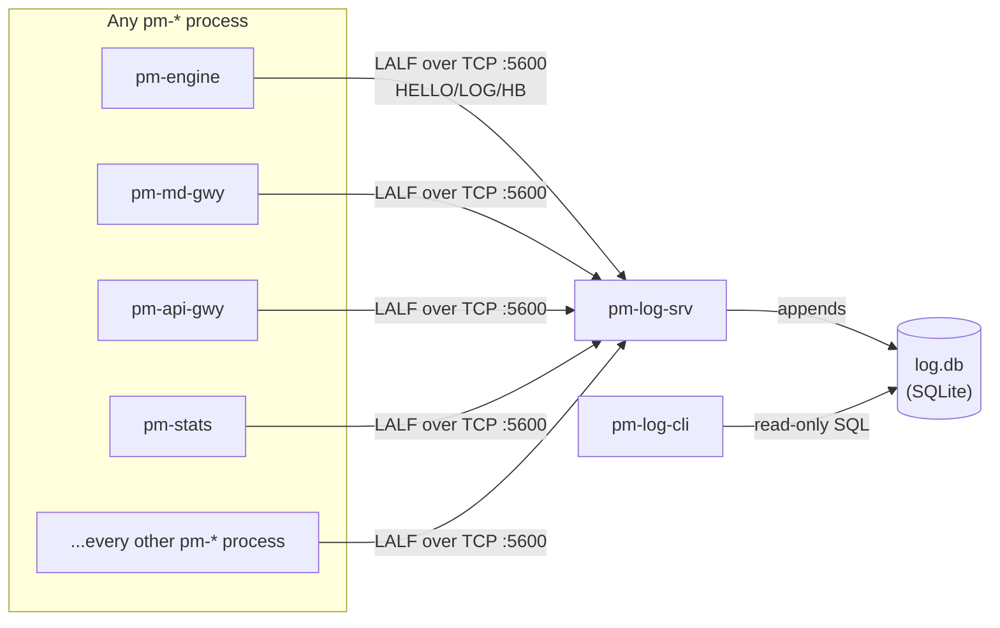

Version: 1.2.0

Date: 2026-07-28

Status: Design Proposal

> **Changelog v1.2.0**
> - **New §15, Appendix: LALF Protocol Reference (Normative).** Restates
>   the LALF wire protocol (§5) as a rigorous, testable specification in
>   the same house style as the existing normative
>   [ALF](../docs/user-guide/900-app-alf-protocol.md)/[CALF](../docs/user-guide/920-app-calf-protocol.md)
>   protocol references: a Status/RFC 2119 banner, "What LALF is," scope
>   and conformance, a transport/session-model property table, a formal
>   wire-format/parsing-behavior/TCP-stream-requirement section, per-message
>   Direction/Purpose/field-table/wire-example subsections for all nine
>   LALF message types, a configuration reference, an implementation
>   pitfalls section, a terse numbered conformance-notes list, and
>   cross-references back into this document and to ALF/CALF. §5 now
>   points forward to §15 as the governing specification where the two
>   sections might otherwise be read as disagreeing.
>
> **Changelog v1.1.0**
> - **Retention default changed from unbounded to 30 days** (§6.5, §7.7).
>   `pm-log-srv --retention-days` (config `retention_days`) now defaults
>   to `30` instead of `null`/unset. Operational logging is disposable in
>   a way `pm-audit`'s/`pm-stats`' own deliberately-forever stores are
>   not, so a bounded default better matches this store's actual risk (an
>   unbounded `log.db` growing forever on a long-lived, unattended
>   deployment) than the "keep everything unless told otherwise" posture
>   that makes sense for a compliance/market-data record. Setting
>   `retention_days: null` (or `--retention-days 0`) still opts back into
>   unbounded retention for anyone who wants it.
> - **New: fallback-to-file behavior when `pm-log-srv` is unreachable for
>   an extended period** (§8.2, §8.6, §9.6, §10). Previously, a
>   `TcpLogHandler` that lost its connection to `pm-log-srv` reconnected
>   indefinitely with backoff and dropped records once its local queue
>   filled — logging simply degraded for as long as the server stayed
>   down, with no durable record of what was dropped. This revision adds
>   a bounded grace window (`failover_timeout_sec`, default 30s,
>   `--log-failover-timeout`/config `log_server.client.failover_timeout_sec`,
>   §7.7): if the server hasn't come back by the time the window expires,
>   the handler switches, one-way, to a local `logs/<client>.log` file for
>   the rest of that process's life instead of continuing to drop
>   records. New `pm-log-cli diagnose` heuristic (§9.6) recognizes this
>   signature (a clean LALF disconnect with no further rows from that
>   process, while other processes keep logging normally) and tells the
>   operator to check the corresponding fallback file. New open question
>   (§13, item 4) on whether this should ever be a two-way transition
>   instead of one-way.

# EduMatcher — Centralized Log Server (`pm-log-srv`) and CLI (`pm-log-cli`) Design


## Table of Contents

- [EduMatcher — Centralized Log Server (`pm-log-srv`) and CLI (`pm-log-cli`) Design](#edumatcher--centralized-log-server-pm-log-srv-and-cli-pm-log-cli-design)
  - [Table of Contents](#table-of-contents)
  - [1. Motivation](#1-motivation)
  - [2. Problem Statement](#2-problem-statement)
  - [3. Goals and Non-Goals](#3-goals-and-non-goals)
    - [3.1 Goals](#31-goals)
    - [3.2 Non-Goals](#32-non-goals)
  - [4. Architecture Overview](#4-architecture-overview)
    - [4.1 Topology](#41-topology)
    - [4.2 Why a dedicated TCP protocol instead of reusing CALF or the ZMQ bus](#42-why-a-dedicated-tcp-protocol-instead-of-reusing-calf-or-the-zmq-bus)
    - [4.3 Why SQLite instead of flat files or a syslog forwarder](#43-why-sqlite-instead-of-flat-files-or-a-syslog-forwarder)
  - [5. The LALF Wire Protocol (Logging ALF)](#5-the-lalf-wire-protocol-logging-alf)
    - [5.1 Transport and session model](#51-transport-and-session-model)
    - [5.2 Line structure and the message-body problem](#52-line-structure-and-the-message-body-problem)
    - [5.3 `HELLO` / `WELCOME`](#53-hello--welcome)
    - [5.4 `LOG` — the one client-to-server data message](#54-log--the-one-client-to-server-data-message)
    - [5.5 `ACK` / `ERR`](#55-ack--err)
    - [5.6 `HB` / `PING` / `PONG`](#56-hb--ping--pong)
    - [5.7 `EXIT`](#57-exit)
    - [5.8 Backpressure and slow clients](#58-backpressure-and-slow-clients)
    - [5.9 Worked session example](#59-worked-session-example)
    - [5.10 What LALF deliberately does not have](#510-what-lalf-deliberately-does-not-have)
  - [6. SQLite Schema](#6-sqlite-schema)
    - [6.1 Design principles](#61-design-principles)
    - [6.2 `log_events`](#62-log_events)
    - [6.3 `processes`](#63-processes)
    - [6.4 `server_stats`](#64-server_stats)
    - [6.5 Retention and pruning](#65-retention-and-pruning)
    - [6.6 Full schema SQL](#66-full-schema-sql)
  - [7. `pm-log-srv` Process Design](#7-pm-log-srv-process-design)
    - [7.1 Responsibilities](#71-responsibilities)
    - [7.2 Startup sequence](#72-startup-sequence)
    - [7.3 Per-client handler loop](#73-per-client-handler-loop)
    - [7.4 Write path and durability](#74-write-path-and-durability)
    - [7.5 Discovery: how a process finds `pm-log-srv`](#75-discovery-how-a-process-finds-pm-log-srv)
    - [7.6 CLI flags](#76-cli-flags)
    - [7.7 Config reference](#77-config-reference)
  - [8. Hooking Into the Existing Python `logging` Setup](#8-hooking-into-the-existing-python-logging-setup)
    - [8.1 Today's pattern, unchanged](#81-todays-pattern-unchanged)
    - [8.2 `TcpLogHandler`](#82-tcploghandler)
    - [8.3 Auto-detection algorithm](#83-auto-detection-algorithm)
    - [8.4 `_configure_logging` after this change](#84-_configure_logging-after-this-change)
    - [8.5 New/changed CLI flags shared by every `pm-*` process](#85-newchanged-cli-flags-shared-by-every-pm-process)
    - [8.6 Behaviour when the server disappears mid-session](#86-behaviour-when-the-server-disappears-mid-session)
    - [8.7 Files to change](#87-files-to-change)
  - [9. `pm-log-cli`](#9-pm-log-cli)
    - [9.1 Subcommand overview](#91-subcommand-overview)
    - [9.2 `tail`](#92-tail)
    - [9.3 `query`](#93-query)
    - [9.4 `processes`](#94-processes)
    - [9.5 `stats`](#95-stats)
    - [9.6 `diagnose`](#96-diagnose)
    - [9.7 Output formats](#97-output-formats)
    - [9.8 Exit codes](#98-exit-codes)
  - [10. Security and Operational Notes](#10-security-and-operational-notes)
  - [11. Testing Strategy](#11-testing-strategy)
  - [12. Implementation Plan](#12-implementation-plan)
  - [13. Open Questions](#13-open-questions)
  - [14. Summary](#14-summary)
  - [15. Appendix: LALF Protocol Reference (Normative)](#15-appendix-lalf-protocol-reference-normative)
    - [15.1 What LALF is](#151-what-lalf-is)
    - [15.2 Scope & conformance](#152-scope--conformance)
    - [15.3 Transport and session model](#153-transport-and-session-model)
    - [15.4 Wire format](#154-wire-format)
    - [15.5 `HELLO`](#155-hello)
    - [15.6 `WELCOME`](#156-welcome)
    - [15.7 `LOG`](#157-log)
    - [15.8 `ACK`](#158-ack)
    - [15.9 `ERR`](#159-err)
    - [15.10 `HB`](#1510-hb)
    - [15.11 `PING` / `PONG`](#1511-ping--pong)
    - [15.12 `EXIT`](#1512-exit)
    - [15.13 Backpressure](#1513-backpressure)
    - [15.14 Configuration reference](#1514-configuration-reference)
    - [15.15 What to watch out for during implementation](#1515-what-to-watch-out-for-during-implementation)
    - [15.16 Conformance notes](#1516-conformance-notes)
    - [15.17 See also](#1517-see-also)


## 1. Motivation

A full EduMatcher session is, per the process architecture
([Processes](../docs/user-guide/170-processes.md)), a dozen-plus independent
`pm-*` processes: the engine, gateways, `pm-stats`, `pm-audit`, bots,
viewers, admin tools. Every one of them already logs — each has its own
`_configure_logging()` that calls `logging.basicConfig(stream=sys.stdout)`
with a `--log-level`/`-v`/`-q` flag set (e.g.
`src/edumatcher/api_gateway/main.py`) — but each process's log output goes
to its own terminal or its own redirected file. There is no single place to
ask "what did every process log in the last five minutes," and
correlating an issue that spans, say, `pm-engine` and `pm-md-gwy` means
manually lining up timestamps across two separate terminal scrollbacks or
log files.

This is the same problem `pm-audit` already solved for **trading events**
(a durable, queryable record of every order/fill, see
[Audit](../docs/user-guide/190-audit.md)) and `pm-stats` solved for
**market statistics** (OHLCV and index history to SQLite, see
[Statistics & Reporting](../docs/user-guide/140-statistics-and-reporting.md)).
Neither captures **process-level operational logging** — startup messages,
warnings, stack traces, connection retries — which today only exists as
ephemeral stdout/file text with no cross-process query surface.

This document specifies `pm-log-srv`, a small always-on process that
collects logging from every other `pm-*` process over a dedicated TCP
protocol and stores it in a queryable SQLite database, and `pm-log-cli`,
a read-only query/troubleshooting client for that database — the same
"dedicated collector process + SQLite + read-only CLI" shape `pm-stats`/
`pm-stats-cli` and `pm-audit`/`pm-audit-cli` already established.

## 2. Problem Statement

- There is no cross-process view of operational logging. Diagnosing a
  problem that touches multiple processes means opening multiple
  terminals/files and manually correlating timestamps.
- Nothing is durable. If a process's terminal is closed or its stdout was
  never redirected, whatever it logged is gone. `pm-audit`/`pm-stats`
  solved this for trading/market data; operational logs have no equivalent.
- There is no structured query surface. Finding "every ERROR from any
  gateway in the last hour" today means `grep`-ing however many log files
  happen to exist, if they exist at all.
- Every process already uses Python's standard `logging` module in a
  consistent, well-established pattern (§8.1) — the natural integration
  point is a `logging.Handler`, not a rewrite of how any process logs.
- A process should not have to be told where the log server is by hand in
  the common case: if `pm-log-srv` is already running when a process
  starts, that process should discover and use it automatically, the same
  spirit as `pm-stats`/`pm-audit` needing no special wiring to start
  receiving engine events once they subscribe. Explicit `--log-target
  file`/`--log-target stdout` must still override this, since some
  invocations (a quick one-off CLI tool, a CI job with no log server
  running) should never block on or depend on a log server being present.

## 3. Goals and Non-Goals

### 3.1 Goals

- A single new process, `pm-log-srv`, that accepts long-lived TCP
  connections from any number of `pm-*` processes and appends every log
  record it receives to a local SQLite database, following the same
  "small dedicated collector" shape as `pm-stats`/`pm-audit`.
- A small, dependency-free, newline-delimited TCP wire protocol
  (**LALF** — Logging ALF, §5) that any `pm-*` process, or in principle any
  external tool in any language, can speak — mirroring CALF's own
  `HELLO`/`WELCOME`/line-protocol design (§4.2) rather than inventing an
  unrelated shape.
- A `logging.Handler` subclass (`TcpLogHandler`, §8.2) that plugs into the
  exact `_configure_logging()` pattern every `pm-*` process already uses,
  so adopting this requires a small, mechanical, repeated change across
  ~19 process entrypoints, not a rewrite of any process's logging calls.
- Automatic discovery: at startup, a process briefly probes for a running
  `pm-log-srv` on the configured host/port and switches its root logger to
  `TcpLogHandler` if found, falling back to today's stdout behaviour
  otherwise (§8.3) — with an explicit `--log-target
  server|stdout|file` flag (§8.5) that always wins over auto-detection.
- A read-only query/troubleshooting CLI, `pm-log-cli`, mirroring
  `pm-audit-cli`'s/`pm-stats-cli`'s subcommand and `--format
  human|json` conventions (§9), including a `diagnose` subcommand that
  applies a small set of documented, rule-based heuristics against stored
  logs and reports likely causes and concrete system-adjustment
  recommendations (§9.6).

### 3.2 Non-Goals

- Not a replacement for `pm-audit` or `pm-stats`. Trading events (orders,
  fills) and market statistics (OHLCV, index levels) have their own
  purpose-built collectors already; `pm-log-srv` is for operational
  `logging`-module output only — think "what would otherwise have gone to
  a terminal or a log file," not "what happened in the order book."
  §10 covers where the line is when a process logs something
  trade-adjacent (e.g. a rejected order at WARNING level).
- No log shipping off the local machine, no distributed/multi-host
  aggregation, no authentication, no encryption at the transport layer —
  same trusted-network assumption CALF makes today (§10 of the normative
  [CALF Protocol Reference](../docs/user-guide/920-app-calf-protocol.md)).
  A future need for either belongs in a follow-up revision, not this one.
- No log level reconfiguration pushed *from* the server *to* clients (no
  "set pm-engine to DEBUG remotely"). Each process's log level remains a
  local, `--log-level`/`-v`/`-q`-controlled decision (§8.4); `pm-log-srv`
  only receives what a process already decided to emit.
- No real machine-learning anomaly detection in `pm-log-cli diagnose`
  (§9.6). The recommendations feature is deliberately a small, documented,
  rule-based heuristic set — transparent and auditable, in keeping with
  this being an educational system, not a production observability
  product.
- No change to what or how any process logs today (message text, logger
  names, log levels chosen). This document changes **where the records
  go**, not what gets recorded.

## 4. Architecture Overview

### 4.1 Topology



`pm-log-srv` is the only new backend process. It has exactly one
responsibility: accept LALF connections, validate and append `LOG`
records to `log.db`. It never talks to the ZeroMQ bus, the engine, or any
gateway directly — from the rest of the system's point of view it is a
passive sink that happens to be reachable over TCP, structurally identical
in spirit to how `pm-stats`/`pm-audit` are passive ZMQ subscribers that
happen to write to their own SQLite/JSONL stores. `pm-log-cli` never talks
to `pm-log-srv` directly either — like `pm-stats-cli`/`pm-audit-cli`, it
queries the database file directly, read-only, so a busy or even-crashed
log server never blocks troubleshooting (§7.1, §10).

### 4.2 Why a dedicated TCP protocol instead of reusing CALF or the ZMQ bus

| Option | Trade-off |
|---|---|
| **New line protocol, LALF (chosen)** | A few hours of new, small protocol work, but a natural fit: logging is a push-only, high-volume, best-effort stream from many producers to one consumer — closer to CALF's shape (long-lived TCP, `HELLO`/`WELCOME`, line-delimited) than to the ZMQ bus's shape (pub/sub over the *trading* event stream). Every `pm-*` process, including ones with no other reason to touch the ZMQ bus (e.g. `pm-log-cli` itself, or a future non-Python client), can speak it with nothing more than a TCP socket. |
| Reuse CALF, adding a `LOG` channel | Would mean every log line, from every process, flows through `pm-md-gwy` — a market-data gateway with no other reason to know about `pm-engine`'s or `pm-stats`'s internal logging. Conflates two unrelated concerns in one already-load-bearing gateway, and CALF's `SYM=`-keyed channel model doesn't fit log records at all (§5.2 explains why logging needs a different framing anyway). |
| Publish log lines onto the existing ZMQ PUB/SUB bus (:5556) | Would mean every subscriber on the main event bus — including bots and viewers that only care about trading events — receives every log line from every process whether they want it or not, and PUB/SUB's documented "no delivery guarantee, drops if a subscriber is slow" behaviour (§"The two bus patterns used here" in [Processes](../docs/user-guide/170-processes.md)) is the wrong guarantee for logging, where a slow collector should apply backpressure to a chatty logger (§5.8), not silently drop its output. |
| Write straight to a shared SQLite file from every process (no server at all) | SQLite's single-writer model makes many concurrent writers from independent processes fragile (`SQLITE_BUSY` contention) without a serializing front-end; a dedicated server that owns the one writer connection avoids this entirely (§7.1, §7.4) — the same reason `pm-stats`/`pm-audit` are each a single collector process rather than every publisher writing its own row directly. |

### 4.3 Why SQLite instead of flat files or a syslog forwarder

`pm-stats` and `pm-audit` already established the two possible shapes in
this codebase — `pm-stats` uses SQLite (queryable, indexed, `pm-stats-cli`
can filter/aggregate with real `WHERE`/`ORDER BY`), `pm-audit` uses JSONL
flat files (append-friendly, but `pm-audit-cli` has to scan and filter in
Python, see `docs/user-guide/190-audit.md` §"How pm-audit-cli reads
events"). Logging is a better fit for the SQLite shape: `pm-log-cli`'s core
job is filtered, indexed lookups across potentially millions of rows
(`--process`, `--level`, `--since`/`--until`, free-text search, §9.3), and
`diagnose` (§9.6) needs aggregate queries (`GROUP BY level, process`, rate
computations) that are natural SQL and painful to hand-roll over flat
files at scale. A syslog forwarder (`rsyslog`/`journald`) was considered
and rejected: it would add an external system dependency this
self-contained, batteries-included project doesn't otherwise have anywhere
(`pm-stats`/`pm-audit`/CALF/RALF are all first-party, dependency-free by
design), and would not give `pm-log-cli` the "designed for exactly this
schema" query surface a purpose-built SQLite schema does (§6).

## 5. The LALF Wire Protocol (Logging ALF)

> This section is the design narrative — *why* LALF looks the way it
> does. §15 restates the same protocol as a rigorous, normative
> specification in the style of the existing
> [ALF](../docs/user-guide/900-app-alf-protocol.md)/[CALF](../docs/user-guide/920-app-calf-protocol.md)
> protocol references; where the two disagree, §15 governs.

### 5.1 Transport and session model

| Property | Value |
|---|---|
| Transport | TCP |
| Default port | `5600` |
| Encoding | UTF-8 |
| Delimiter | `\n` for header lines; explicit byte-length-prefixed payload for message bodies (§5.2) |
| Max header line length | 4096 bytes including newline, same ceiling CALF uses |
| Max payload length | 65536 bytes (config `max_message_bytes`, §7.7); longer messages are truncated with a `TRUNC=1` marker (§5.4) |

A LALF client connection is long-lived, exactly like CALF's (normative
[CALF Protocol Reference](../docs/user-guide/920-app-calf-protocol.md),
"Transport and session model"):

- Client must send `HELLO` within 5 seconds of TCP connect or the server
  closes the socket.
- Server replies with `WELCOME` on success, or `ERR` + close on rejection.
- Client may then send any number of `LOG` messages, plus periodic `HB`.
- Client sends `EXIT` (or simply closes the socket) to end the session.

Unlike CALF, LALF has **no subscription model** — there is nothing to
`SUB`/`UNSUB` to, because the data flows in exactly one direction (client
→ server) and every connected client is, definitionally, only ever
sending its own process's log records. This asymmetry is why LALF is a
distinct protocol rather than a CALF channel (§4.2): CALF's whole design
(channels, wildcards, snapshot/replay) exists to serve *subscribers*
asking for a slice of a shared feed; LALF has no shared feed to slice —
every client is a producer, not a consumer, of exactly one stream (§5.4).

### 5.2 Line structure and the message-body problem

CALF's `KEY=VALUE|KEY=VALUE` grammar works because every CALF field is a
constrained token — a symbol, a price, an enum, a sequence number — none
of which can contain `|`, `\n`, or arbitrary Unicode. A log message
**is** arbitrary text: it can contain pipes, embedded newlines (a
multi-line stack trace), quotes, or any Unicode a developer's `f-string`
happens to produce. Reusing CALF's grammar unmodified for the message
body would require an escaping scheme CALF has never needed and that
would be easy to get subtly wrong (what happens when the message text
itself contains the escape character?).

LALF avoids the problem structurally instead of solving it with escaping:
**every message is a fixed-field header line, followed by exactly `LEN`
raw bytes of UTF-8 payload, followed by the header line's own
terminating `\n`.**

```text
<MSGTYPE>|KEY=VALUE|KEY=VALUE|...|LEN=<n>\n<n raw UTF-8 bytes, no trailing newline required>
```

The header line is parsed exactly like a CALF line (split on `|`, then
`=`); the payload that follows is read as a fixed number of bytes,
never scanned for a delimiter, so it may contain anything — pipes,
newlines, control characters — with zero escaping. `LEN` is mandatory on
every message type that carries a payload (`LOG`, §5.4) and absent on
every message type that doesn't (`HELLO`, `WELCOME`, `HB`, `PING`, `PONG`,
`EXIT`, `ACK`, `ERR` — all of these are header-only, exactly like most
CALF messages already are). A message with no `LEN` field has no payload
bytes to read at all — the parser moves straight to the next header line.

### 5.3 `HELLO` / `WELCOME`

```text
HELLO|CLIENT=pm-api-gwy|PID=48213|HOST=trader-laptop|PROTO=LALF1
```

| Field | Req | Type | Description |
|---|---|---|---|
| `CLIENT` | Yes | string | Process name, matching its `pm-*` command name (e.g. `pm-api-gwy`, `pm-engine`) |
| `PID` | Yes | int | OS process ID of the connecting client |
| `HOST` | Yes | string | Hostname the client is running on (matches CALF-style deployments — see `EduMatcher-Cross-host-connection.md` for the multi-host case) |
| `PROTO` | Yes | string | Always `LALF1` in this revision |
| `INSTANCE` | No | string | Optional disambiguator when multiple instances of the same `CLIENT` run at once (e.g. `--instance` value for a named `api_gateways` entry, or a gateway's `--id`) |

```text
WELCOME|PROTO=LALF1|SRV=log-srv01|HBINT=5|SESSION=a1b2c3d4
```

| Field | Req | Type | Description |
|---|---|---|---|
| `PROTO` | Yes | string | Echoes `LALF1` |
| `SRV` | Yes | string | Configured name of this `pm-log-srv` instance |
| `HBINT` | Yes | int | Heartbeat interval in seconds the client should honour (§5.6) |
| `SESSION` | Yes | string | Opaque per-connection session ID, included in every DB row this connection writes (§6.2) purely as a debugging aid — it is not a security token and carries no privilege |

`PROTO` mismatch, a missing required `HELLO` field, or no `HELLO` within
5 seconds all result in `ERR` + connection close, mirroring CALF's own
`HELLO` handling exactly.

### 5.4 `LOG` — the one client-to-server data message

```text
LOG|SEQ=1042|TS=2026-07-28T14:32:07.511Z|LEVEL=WARNING|LOGGER=edumatcher.md_gateway.gateway|LEN=57
slow client detected on channel DEPTH, symbol AAPL, dropping
```

| Field | Req | Type | Description |
|---|---|---|---|
| `SEQ` | Yes | int | Monotonic per-connection sequence number, starting at 1; lets the server detect gaps (dropped TCP segments would be a bug, but this makes it detectable rather than silent) |
| `TS` | Yes | string | UTC ISO-8601 with milliseconds, set by the **client** at the moment `logging` emitted the record (`LogRecord.created`) — not when the server received it; §6.2 stores both |
| `LEVEL` | Yes | enum | One of `DEBUG`, `INFO`, `WARNING`, `ERROR`, `CRITICAL` — Python `logging`'s own level names, uppercase, unchanged |
| `LOGGER` | Yes | string | The originating logger name (`LogRecord.name`, e.g. `edumatcher.md_gateway.gateway`) — lets `pm-log-cli` filter by subsystem within one process, not just by process |
| `MODULE` | No | string | `LogRecord.module` — bare filename without extension, when available |
| `LINE` | No | int | `LogRecord.lineno`, when available |
| `EXC` | No | bool (`1`/absent) | Set when this record carries a formatted exception/traceback in its payload (`LogRecord.exc_info` was not `None`) — lets `pm-log-cli` filter for "records with a traceback attached" without a text search (§9.3, §9.6) |
| `LEN` | Yes | int | Byte length of the UTF-8 payload that follows this header line's `\n` (§5.2) |

The payload is the fully formatted log message — `record.getMessage()`,
with the formatted exception/traceback appended (`\n`-joined) when `EXC=1`
— exactly what would otherwise have been written to stdout by
`logging.basicConfig`'s default formatter, so nothing about message
*content* changes versus today (§3.2's non-goal).

### 5.5 `ACK` / `ERR`

```text
ACK|SEQ=1042
ERR|CODE=INVALID_LEVEL|MSG=unknown LEVEL value: TRACE
ERR|CODE=PAYLOAD_TOO_LARGE|MSG=message exceeds max_message_bytes=65536, truncated
```

The server does **not** `ACK` every `LOG` message individually — at
realistic logging rates, per-message acknowledgment would be pure
overhead for a fire-and-forget stream (§5.8 covers the one case where the
server does need to signal the client: backpressure). `ACK` is reserved
for `HELLO`'s implicit success (carried by `WELCOME` itself, so no
separate `ACK` is needed there) and is otherwise unused in this revision —
listed here for protocol completeness and because a future revision
extending LALF with a request/response query path (§13) would need it.

`ERR` codes defined in this revision:

| Code | Meaning | Client should |
|---|---|---|
| `INVALID_LEVEL` | `LEVEL` not one of the five valid values | Fix and resend; this indicates a `TcpLogHandler` bug, not a transient condition |
| `MISSING_FIELD` | A required header field absent | Same as above |
| `PAYLOAD_TOO_LARGE` | `LEN` exceeds `max_message_bytes` | Server truncates and stores anyway (with `TRUNC=1` recorded, §6.2) rather than dropping the record entirely — an oversized log message is still more useful truncated than lost. `ERR` here is advisory, not a session-ending condition. |
| `PROTO_MISMATCH` | `HELLO|PROTO=` was not `LALF1` | Close connection; upgrade client, identical semantics to CALF's own `PROTO_MISMATCH` |
| `HELLO_TIMEOUT` | No `HELLO` within 5 seconds | Connection already closed by the time this is observable client-side |

### 5.6 `HB` / `PING` / `PONG`

```text
HB|TS=2026-07-28T14:32:10.000Z
PING
PONG
```

Identical purpose to CALF's own heartbeat: the client sends `HB` every
`HBINT` seconds (from `WELCOME`) whether or not it has logged anything
recently, so the server can distinguish "quiet process" from "dead
connection." `PING`/`PONG` are available for either side to use as a
liveness check outside the regular `HBINT` cadence — mirrors CALF's own
`PING`/`PONG` exactly, same rationale.

### 5.7 `EXIT`

```text
EXIT
```

Graceful, client-initiated session end — the server flushes any buffered
rows for this connection (§7.4) and closes the socket. A process exiting
via signal (no time to send `EXIT`) is handled the same as any other TCP
disconnect: the server notices the closed socket, marks the process
`disconnected` in `processes` (§6.3), and moves on — there is nothing to
recover, since every `LOG` message already received was durably written
(§7.4).

### 5.8 Backpressure and slow clients

Unlike CALF (where the *gateway* can be the bottleneck relative to many
subscribers), for LALF the **server** is the single point every client
writes into, so the failure mode to design for is a burst of `LOG`
messages arriving faster than SQLite can durably append them (§7.4). The
server's per-connection read loop applies simple TCP-level backpressure:
if its internal write queue for a connection exceeds `max_client_queue`
(config, default `10000`, matching `market_data_gateway.max_client_queue`'s
naming convention), it stops reading from that socket's TCP buffer until
the queue drains — the OS's own TCP flow control then naturally slows the
client's `send()` calls, which is exactly the "producer feels the
backpressure" property the ZMQ PUB/SUB bus explicitly lacks (§4.2). No
`LOG` message is ever silently dropped by `pm-log-srv` itself; the
`TcpLogHandler` client side has its own, separate, and explicit
overflow policy (§8.2) for the case where the *client's* local queue fills
before the server can accept more.

### 5.9 Worked session example

```text
C: HELLO|CLIENT=pm-md-gwy|PID=51002|HOST=trader-laptop|PROTO=LALF1
S: WELCOME|PROTO=LALF1|SRV=log-srv01|HBINT=5|SESSION=7f3a9c21
C: LOG|SEQ=1|TS=2026-07-28T09:30:00.010Z|LEVEL=INFO|LOGGER=edumatcher.md_gateway.gateway|LEN=29
   md-gwy01 listening on :5570
C: LOG|SEQ=2|TS=2026-07-28T09:30:05.221Z|LEVEL=WARNING|LOGGER=edumatcher.md_gateway.gateway|LEN=57
   slow client detected on channel DEPTH, symbol AAPL, dropping
C: HB|TS=2026-07-28T09:30:05.500Z
C: LOG|SEQ=3|TS=2026-07-28T09:31:12.004Z|LEVEL=ERROR|LOGGER=edumatcher.md_gateway.gateway|EXC=1|LEN=612
   unhandled exception in _poll_engine_events
   Traceback (most recent call last):
     File ".../gateway.py", line 412, in _poll_engine_events
       ...
   ConnectionResetError: [Errno 54] Connection reset by peer
C: EXIT
```

### 5.10 What LALF deliberately does not have

- **No replay/resume.** CALF's `RESUME=1`/`LASTSEQ=` exists because a
  *subscriber* reconnecting needs to backfill a gap in a shared feed it
  cares about. A LALF client reconnecting after a drop has nothing to
  backfill — the records it would have sent during the gap were never
  generated in the first place (they weren't buffered anywhere client-side
  beyond `TcpLogHandler`'s own small queue, §8.2) — so there is no
  server-side history for the *client* to resume; it simply reconnects,
  `HELLO`s again, and resumes sending new records with `SEQ` restarting at
  1 for the new connection (`SESSION` in `WELCOME` disambiguates old vs.
  new connections in storage, §6.2).
- **No query/read path on this same socket.** `pm-log-cli` never speaks
  LALF at all — it reads `log.db` directly (§4.1, §7.1), the same
  separation `pm-stats-cli`/`pm-audit-cli` already use relative to
  `pm-stats`/`pm-audit`. Keeping LALF strictly write-only keeps the
  protocol, and the server's per-connection state machine, small.
- **No authentication.** Same trusted-network assumption as CALF today
  (§10).

## 6. SQLite Schema

### 6.1 Design principles

Follows `pm-stats`' own schema conventions (`src/edumatcher/stats/main.py`,
`SCHEMA` constant) rather than inventing new ones: append-only event
tables with an `INTEGER PRIMARY KEY AUTOINCREMENT` surrogate key where
insertion order matters, composite indexes shaped `(filter_column, ts)` to
match the query patterns `pm-log-cli` actually needs (§9), and TEXT
columns for timestamps in the same UTC ISO-8601-with-milliseconds format
every other EduMatcher SQLite store already uses (`daily_stats.date`,
`price_snapshots.ts`, etc.).

### 6.2 `log_events`

The one row-per-log-record table — the append-only heart of the database.

| Column | Type | Notes |
|---|---|---|
| `seq` | `INTEGER PRIMARY KEY AUTOINCREMENT` | Global row ID, insertion order across every process/connection |
| `client_ts` | `TEXT NOT NULL` | `LOG.TS` — when the client's `logging` call actually fired |
| `server_ts` | `TEXT NOT NULL` | Wall-clock time `pm-log-srv` received and wrote this row — lets `pm-log-cli diagnose` (§9.6) detect a client that is falling behind (growing `server_ts - client_ts` skew) as its own heuristic |
| `process` | `TEXT NOT NULL` | `HELLO.CLIENT` (e.g. `pm-md-gwy`) |
| `instance` | `TEXT` | `HELLO.INSTANCE`, when given |
| `pid` | `INTEGER NOT NULL` | `HELLO.PID` |
| `host` | `TEXT NOT NULL` | `HELLO.HOST` |
| `session` | `TEXT NOT NULL` | `WELCOME.SESSION` for the connection this row arrived on — disambiguates two connections from the same `(process, pid)` pair (e.g. a quick restart reusing a recycled PID) |
| `level` | `TEXT NOT NULL` | One of `DEBUG`/`INFO`/`WARNING`/`ERROR`/`CRITICAL` |
| `logger` | `TEXT NOT NULL` | `LOG.LOGGER` |
| `module` | `TEXT` | `LOG.MODULE`, when given |
| `line` | `INTEGER` | `LOG.LINE`, when given |
| `has_exception` | `INTEGER NOT NULL DEFAULT 0` | `1` iff `LOG.EXC=1` |
| `truncated` | `INTEGER NOT NULL DEFAULT 0` | `1` iff the payload was cut to `max_message_bytes` (§5.5) |
| `message` | `TEXT NOT NULL` | The full payload — formatted message, plus traceback text when `has_exception=1` |

```sql
CREATE INDEX IF NOT EXISTS idx_le_process_ts ON log_events(process, client_ts);
CREATE INDEX IF NOT EXISTS idx_le_level_ts   ON log_events(level, client_ts);
CREATE INDEX IF NOT EXISTS idx_le_logger_ts  ON log_events(logger, client_ts);
CREATE INDEX IF NOT EXISTS idx_le_session    ON log_events(session);
```

Four indexes, matching the four ways `pm-log-cli query`/`tail` filter
(§9.2, §9.3): by process, by level, by logger, and by session (used
internally by `processes`-joined queries, §9.4). No full-text index on
`message` in this revision — `pm-log-cli`'s `--grep` (§9.3) uses SQLite's
`LIKE`, which is adequate at the data volumes a teaching exchange
generates; see §13 for the `FTS5` follow-up this rules in, not out.

### 6.3 `processes`

One row per LALF **connection** (not per process name) — a lightweight
session registry, closer in spirit to `pm-api-gwy`'s `GET
/admin/gateways` connected-gateway list than to anything in `pm-stats`.

| Column | Type | Notes |
|---|---|---|
| `session` | `TEXT PRIMARY KEY` | Matches `log_events.session` |
| `process` | `TEXT NOT NULL` | |
| `instance` | `TEXT` | |
| `pid` | `INTEGER NOT NULL` | |
| `host` | `TEXT NOT NULL` | |
| `connected_at` | `TEXT NOT NULL` | `server_ts` of this connection's `HELLO` |
| `last_seen_at` | `TEXT NOT NULL` | `server_ts` of the most recent `LOG` or `HB` from this connection; updated on every message, not just `HB`, so a chatty process's `last_seen_at` is always current without a separate write |
| `disconnected_at` | `TEXT` | `NULL` while the TCP connection is open; set when the socket closes (§5.7) |
| `log_count` | `INTEGER NOT NULL DEFAULT 0` | Running count of `LOG` messages from this session — cheap denormalization so `pm-log-cli processes` (§9.4) doesn't need a `COUNT(*)` scan over `log_events` for a summary view |

```sql
CREATE INDEX IF NOT EXISTS idx_proc_process ON processes(process, connected_at);
```

### 6.4 `server_stats`

A single-row table (`id` always `1`) for `pm-log-srv`'s own operational
counters — how many rows it has ever written, how many `ERR`s it has
sent, when it started. Exists so `pm-log-cli stats` (§9.5) can report on
the log server's own health, not just the logs it collected — the same
self-observability instinct `pm-api-gwy`'s `GET /api/v1/status` already
has for itself.

| Column | Type | Notes |
|---|---|---|
| `id` | `INTEGER PRIMARY KEY CHECK (id = 1)` | Enforces single-row |
| `started_at` | `TEXT NOT NULL` | This `pm-log-srv` process's own start time |
| `total_log_events` | `INTEGER NOT NULL DEFAULT 0` | Lifetime count, survives restarts (durable in `log.db`, unlike an in-memory counter) |
| `total_connections` | `INTEGER NOT NULL DEFAULT 0` | Lifetime count of `HELLO`s accepted |
| `total_truncated` | `INTEGER NOT NULL DEFAULT 0` | Lifetime count of oversized-payload truncations (§5.5) |
| `total_errors_sent` | `INTEGER NOT NULL DEFAULT 0` | Lifetime count of `ERR` replies sent to any client |

### 6.5 Retention and pruning

Unlike `pm-audit` (a durable-forever compliance record by design) or
`pm-stats` (bounded by one row per symbol per day/15-minutes),
`log_events` can grow without bound at DEBUG-heavy verbosity over a long
session. `pm-log-srv` supports `--retention-days N` (config
`retention_days`, §7.7, **default `30`**) that prunes `log_events` rows
older than `N` days once per hour in the background. Operational logging
is qualitatively different from `pm-audit`'s compliance record or
`pm-stats`' market history — both of those default to keeping everything
forever because losing a fill or a price is unrecoverable and
consequential, whereas losing a 45-day-old DEBUG line is not. A bounded
default keeps `log.db` from growing without limit on a long-lived
deployment with no one paying attention to it, which is a more likely
failure mode for this particular store than for `pm-audit`/`pm-stats`.
Setting `retention_days: null` (or `--retention-days 0`) explicitly opts
back into unbounded retention for anyone who wants it — the default is a
starting point, not a hard limit. `pm-log-cli` additionally exposes a
manual `prune` subcommand (§9.1) for the same operation on demand,
mirroring `pm-clearing-cli`'s own `prune` command
(`docs/user-guide/170-processes.md`'s process table already lists this as
an existing pattern for a query-CLI to also own light maintenance
duties).

### 6.6 Full schema SQL

```sql
CREATE TABLE IF NOT EXISTS log_events (
    seq             INTEGER PRIMARY KEY AUTOINCREMENT,
    client_ts       TEXT NOT NULL,
    server_ts       TEXT NOT NULL,
    process         TEXT NOT NULL,
    instance        TEXT,
    pid             INTEGER NOT NULL,
    host            TEXT NOT NULL,
    session         TEXT NOT NULL,
    level           TEXT NOT NULL,
    logger          TEXT NOT NULL,
    module          TEXT,
    line            INTEGER,
    has_exception   INTEGER NOT NULL DEFAULT 0,
    truncated       INTEGER NOT NULL DEFAULT 0,
    message         TEXT NOT NULL
);

CREATE INDEX IF NOT EXISTS idx_le_process_ts ON log_events(process, client_ts);
CREATE INDEX IF NOT EXISTS idx_le_level_ts   ON log_events(level, client_ts);
CREATE INDEX IF NOT EXISTS idx_le_logger_ts  ON log_events(logger, client_ts);
CREATE INDEX IF NOT EXISTS idx_le_session    ON log_events(session);

CREATE TABLE IF NOT EXISTS processes (
    session         TEXT PRIMARY KEY,
    process         TEXT NOT NULL,
    instance        TEXT,
    pid             INTEGER NOT NULL,
    host            TEXT NOT NULL,
    connected_at    TEXT NOT NULL,
    last_seen_at    TEXT NOT NULL,
    disconnected_at TEXT,
    log_count       INTEGER NOT NULL DEFAULT 0
);

CREATE INDEX IF NOT EXISTS idx_proc_process ON processes(process, connected_at);

CREATE TABLE IF NOT EXISTS server_stats (
    id                  INTEGER PRIMARY KEY CHECK (id = 1),
    started_at          TEXT NOT NULL,
    total_log_events    INTEGER NOT NULL DEFAULT 0,
    total_connections   INTEGER NOT NULL DEFAULT 0,
    total_truncated     INTEGER NOT NULL DEFAULT 0,
    total_errors_sent   INTEGER NOT NULL DEFAULT 0
);
```

## 7. `pm-log-srv` Process Design

### 7.1 Responsibilities

- Bind one TCP listen socket (`bind_address:port`, default `0.0.0.0:5600`,
  §7.7) and accept any number of concurrent LALF connections.
- Speak the LALF session lifecycle (§5) on each connection: `HELLO` within
  5 seconds or close; `WELCOME` on success; accept `LOG`/`HB`/`PING`/`EXIT`
  thereafter.
- Own the single writer connection to `log.db`, serializing all inserts
  from all concurrent client connections through it (§7.4) — this is the
  one piece of shared mutable state in the whole process, deliberately
  kept as small and simple as possible.
- Update `processes` on connect, on every message (`last_seen_at`), and on
  disconnect.
- Apply per-connection backpressure (§5.8) and, when configured,
  background retention pruning (§6.5).
- Serve nothing else. No HTTP, no query API, no authentication surface —
  `pm-log-cli` reads `log.db` directly (§4.1, §9), so the server's only
  job is ingestion.

### 7.2 Startup sequence

1. Resolve config the same way every other `pm-*` process does: CLI flags
   override `engine_config.yaml`'s `log_server:` block (§7.7) override
   built-in defaults — identical precedence order to, e.g.,
   `api_gateway`'s `_config_with_overrides` (`src/edumatcher/api_gateway/main.py`).
2. Open (creating if absent) `log.db` at the configured path (default
   `$EDUMATCHER_DATA_DIR/log.db`, matching `stats.db`'s and `audit.log`'s
   own placement convention, `docs/user-guide/000-getting-started.md`'s
   `EDUMATCHER_DATA_DIR` table).
3. Run `CREATE TABLE IF NOT EXISTS`/`CREATE INDEX IF NOT EXISTS` for every
   table in §6.6 — idempotent, safe to run on every startup against an
   existing database, same pattern `pm-stats`' own `SCHEMA` constant uses.
4. Upsert `server_stats` row `id=1`, setting `started_at` to now.
5. Bind the TCP listen socket. Log (to its own stdout/file — `pm-log-srv`
   cannot sensibly log to itself, §8.1 note) that it is ready.
6. Start the background pruning task (§6.5) unless `--retention-days 0`
   (or config `retention_days: null`) explicitly disabled it.
7. Enter the accept loop.

### 7.3 Per-client handler loop

One `asyncio` task per connection (matching `api_gateway/engine_client.py`'s
existing `asyncio` usage elsewhere in this codebase — no new async
framework introduced):

1. Read the `HELLO` line; validate `PROTO=LALF1` and required fields; on
   failure, send `ERR` and close.
2. On success, generate a `SESSION` id, upsert a `processes` row, send
   `WELCOME`.
3. Loop reading header lines. For `LOG`, read exactly `LEN` further bytes
   as the payload, validate `LEVEL`, then enqueue the row for the shared
   writer (§7.4); update `processes.last_seen_at`/`log_count`. For `HB`,
   update `last_seen_at` only. For `PING`, reply `PONG`. For `EXIT` or a
   closed socket, flush any of this connection's still-queued rows, mark
   `disconnected_at`, and end the task.
4. If no message (including `HB`) arrives within `2 × HBINT` seconds,
   treat the connection as dead: close it and mark `disconnected_at`, the
   same "missed heartbeat" timeout logic CALF's gateway already uses for
   its own clients.

### 7.4 Write path and durability

All handler tasks enqueue completed `LOG` rows onto one shared
`asyncio.Queue`; a single dedicated writer task drains that queue and
performs the actual SQLite `INSERT`s, batching up to `write_batch_size`
rows (config, default `50`) or `write_batch_interval_ms` (default `100`)
milliseconds, whichever comes first, in one transaction — standard
batching to keep SQLite's per-transaction fsync cost from dominating at
high log rates, without introducing a second process or a message queue
dependency. This single-writer-task design is what makes §5.8's
backpressure meaningful: if the writer falls behind, the shared queue
grows, and *every* connection's per-connection queue-size check (§5.8)
starts throttling together, which is the correct behaviour — a slow disk
should slow every logger equally, not silently drop some processes'
records while others keep flowing.

### 7.5 Discovery: how a process finds `pm-log-srv`

`pm-log-srv`'s host/port are configuration, not magic network discovery
(mDNS, broadcast, etc. are explicitly out of scope — this is a
single-machine, `127.0.0.1`-by-default educational tool, same trust model
as every other `pm-*` process). What "automatic" means here (§3.1, §8.3)
is: every `pm-*` process already knows, from its own resolved config
(`engine_config.yaml`'s top-level `log_server:` block, §7.7, present once
and shared by every process the same way `market_data_gateway:` is), where
a log server *would* be if one were running — it does not need to be told
per-invocation. What it does not know in advance is whether one actually
**is** running right now, which is what the startup probe (§8.3) checks.

### 7.6 CLI flags

```
pm-log-srv [--host ADDR] [--port PORT] [--db PATH]
           [--retention-days N] [--max-message-bytes N]
           [--log-level LEVEL] [-v] [-q]
```

Same flag naming conventions as every other gateway (`--host`/`--port`
mirror `pm-api-gwy`'s own flags exactly; `--log-level`/`-v`/`-q` are the
identical triple every `pm-*` process already has, §8.1) plus one flag
specific to this process's own job: `--db` (default resolved per §7.2
step 2).

**A deliberate irony, addressed directly:** `pm-log-srv` is itself a
`pm-*` process and therefore has its own `_configure_logging()` — but it
obviously cannot send its own operational logs to itself over LALF (there
would be nothing listening for its own bootstrap messages before it has
finished starting, and a crash in the write path would have no channel
left to report itself through). `pm-log-srv` is the **one process in the
system that always logs to stdout/file only**, never to another LALF
server — its `_configure_logging()` omits the `TcpLogHandler`
auto-detection step entirely (§8.3 lists this as the sole hard-coded
exception).

### 7.7 Config reference

```yaml
log_server:
  enabled: true
  host: 127.0.0.1
  port: 5600
  db_path: data/log.db
  retention_days: 30          # null (or --retention-days 0) = unbounded retention
  max_message_bytes: 65536
  max_client_queue: 10000
  write_batch_size: 50
  write_batch_interval_ms: 100
  heartbeat_interval_sec: 5
  client:
    connect_timeout_sec: 0.5
    failover_timeout_sec: 30    # §8.6 — grace window before a client falls back to logs/<process>.log
    failover_dir: logs
```

Placed as a new top-level `log_server:` block, the same shape as
`market_data_gateway:`/`api_gateways:` (`docs/user-guide/010-configuration.md`),
present once per `engine_config.yaml` — there is exactly one log server
per deployment, the same cardinality as `market_data_gateway` (contrast
with `api_gateways:`, which is a named map supporting several instances;
a log server has no equivalent need for more than one). The nested
`client:` sub-block is deliberately part of this same top-level block
rather than duplicated per-process: every `pm-*` process reads its own
`TcpLogHandler` defaults (§8.2, §8.6) from here, the same way every
process already reads its own `market_data_gateway.port` to know where to
find `pm-md-gwy` — one shared source of truth for "how a client should
behave," not 19 independently-configured copies. `--log-failover-timeout`
(§8.5) overrides `log_server.client.failover_timeout_sec` for that one
invocation only, the same override relationship every other `pm-*`
CLI-flag-vs-config pair already has (§7.2, step 1).

## 8. Hooking Into the Existing Python `logging` Setup

### 8.1 Today's pattern, unchanged

Every `pm-*` process already follows the same shape (verified directly
against `src/edumatcher/api_gateway/main.py`, and present with only
cosmetic variation in the other ~18 entrypoints under `src/edumatcher/*/main.py`):

```python
log = logging.getLogger(__name__)

def _build_parser() -> argparse.ArgumentParser:
    parser = argparse.ArgumentParser(...)
    parser.add_argument("--log-level", choices=[...], default=None, ...)
    parser.add_argument("-v", "--verbose", action="count", default=0, ...)
    parser.add_argument("-q", "--quiet", action="store_true", ...)
    return parser

def _configure_logging(args: argparse.Namespace) -> int:
    # ... resolve level from --log-level / -v / -q ...
    logging.basicConfig(level=level, format="...", stream=sys.stdout)
    return int(level)
```

This document's entire integration surface is: **add a `TcpLogHandler` to
the root logger, in `_configure_logging()`, in place of (or alongside)
`logging.basicConfig`'s `StreamHandler`** — nothing about how any module
calls `log.info(...)`/`log.warning(...)`/etc. anywhere else in the
codebase changes at all, since Python's `logging` module was designed
from the start to decouple "what gets logged" (unchanged) from "where it
goes" (a `Handler`, which is exactly what's being added here).

### 8.2 `TcpLogHandler`

```python
class TcpLogHandler(logging.Handler):
    """Formats and ships LogRecords to pm-log-srv over LALF (§5).

    Falls back to a per-process log file (§8.6) if the server cannot
    be reached again within failover_timeout_sec of first noticing the
    connection is down.
    """

    def __init__(self, host: str, port: int, client: str,
                 instance: str | None = None,
                 queue_maxsize: int = 2000,
                 connect_timeout_sec: float = 0.5,
                 failover_timeout_sec: float = 30.0,
                 failover_dir: str = "logs") -> None:
        super().__init__()
        # Connects once, lazily, on the first emitted record; a
        # background thread owns the actual socket and the send queue
        # so that a slow or dead log server can never block the
        # calling thread's log.warning(...) call itself (see overflow
        # policy below). The same background thread tracks how long
        # the connection has been down and triggers failover (§8.6)
        # once failover_timeout_sec is exceeded.
        ...

    def emit(self, record: logging.LogRecord) -> None:
        # Never raises: formats the record, encodes a LOG frame (§5.4),
        # and puts it on the internal queue. If the queue is full
        # (server unreachable/slow and queue_maxsize exceeded) and
        # failover has not yet triggered, the record is dropped and a
        # monotonic drop counter is incremented. Once failover has
        # triggered (§8.6), emit() instead writes straight through to
        # the fallback FileHandler — never blocks either way, per
        # logging.Handler's own contract that emit() should not raise
        # or stall the caller.
        ...
```

Key design decisions, each with a direct precedent or rationale:

- **A background thread owns the socket, `emit()` never blocks.** This
  mirrors the standard-library's own `logging.handlers.QueueHandler` +
  `QueueListener` pattern (the recommended way to keep any slow handler —
  a network handler chief among them — off the hot path of whatever
  thread is doing the actual logging). `TcpLogHandler` is, in effect, a
  `QueueHandler` with a purpose-built `QueueListener` that speaks LALF
  instead of delegating to another `Handler`.
- **Bounded queue with drop, not blocking, during the failover grace
  window.** A logging call must never be able to stall or crash the
  process it's instrumenting — that would make observability tooling a
  new source of outages, the opposite of its purpose. `queue_maxsize`
  (default `2000`) bounds memory while the handler is still trying to
  reconnect (§8.6); drops during this window are tracked
  (`TcpLogHandler.dropped_count`) and reported the same way as before —
  see §8.6 for what happens once the grace window itself expires, which
  is a qualitatively different outcome from a drop.
- **Reconnect with backoff, transparent to the caller, up to a bounded
  grace window.** If the connection to `pm-log-srv` drops mid-session
  (server restarted, network blip), the background thread reconnects
  with a simple capped exponential backoff (mirrors
  `pm-terminal-bridge`'s own CALF reconnect posture in
  [EduMatcher-Terminal-GUI.md](EduMatcher-Terminal-GUI.md) §6.6 — the
  general shape "reconnect quietly, don't tear down the caller's
  session" recurs throughout this codebase's client designs) and resends
  a fresh `HELLO` (§5.10 — no resume needed). Unlike the terminal
  bridge's CALF uplink, which reconnects indefinitely because there is
  nowhere else for its data to go, `TcpLogHandler` gives up reconnecting
  to the server after `failover_timeout_sec` (default `30`) and switches
  to file-based logging instead (§8.6) — the log record has to go
  *somewhere*, and unlike a market-data tick, a log line is still fully
  useful written to a local file instead of dropped.

### 8.3 Auto-detection algorithm

Run once, synchronously, during `_configure_logging()`, **before** any
handler is attached — this is the one place in the whole design where a
short, bounded block is acceptable, because it happens once at startup,
not on every log call:

1. If `--log-target` (§8.5) is explicitly `stdout` or `file`, skip
   detection entirely and configure that handler — an explicit flag
   always wins, unconditionally (§3.1).
2. If `--log-target` is unset (the default) or explicitly `server`: open a
   TCP connection to `log_server.host:log_server.port` (from resolved
   config, §7.5) with a short connect timeout (`connect_timeout_sec`,
   default `0.5s` — long enough to not misfire on a merely-busy server,
   short enough that a genuinely absent server doesn't stall every
   process's startup by more than half a second).
3. **Connection succeeds:** send `HELLO`, wait (same short timeout) for
   `WELCOME`. On receiving it, attach `TcpLogHandler` to the root logger
   and proceed — this is "detected running, sending automatically" (§3.1's
   requirement). On timeout or `ERR` waiting for `WELCOME`, fall through
   to step 4 exactly as if the connection itself had failed.
4. **Connection fails or times out, and `--log-target` was unset (not
   explicitly `server`):** fall back to today's behaviour —
   `logging.basicConfig(stream=sys.stdout)`, unchanged. No warning spam,
   no retry loop at startup — a process should start up exactly as
   quickly and quietly as it does today when there is no log server to
   find, since "no log server running" is an entirely normal, common
   condition (e.g. running a single gateway ad hoc for a quick test).
5. **Connection fails and `--log-target server` was given explicitly:**
   this is a real error the user should see — print a clear message to
   stderr (`pm-log-srv not reachable at <host>:<port>, falling back to
   stdout` — falls back rather than refusing to start, since a process
   that can't log anywhere is worse than one that logs to the "wrong"
   place) and proceed with the stdout fallback, exit code unaffected
   (logging configuration failures should never be the reason a trading
   process refuses to start, §10).

### 8.4 `_configure_logging` after this change

```python
def _configure_logging(args: argparse.Namespace) -> int:
    level = _resolve_level(args)  # unchanged from today
    client_name = "pm-api-gwy"    # this process's own pm-* name
    instance = getattr(args, "instance", None)

    handler = _resolve_handler(args, client_name, instance)  # §8.3
    logging.basicConfig(level=level, format="...", handlers=[handler])
    return int(level)
```

`_resolve_level()` is exactly today's existing `--log-level`/`-v`/`-q`
logic (`src/edumatcher/api_gateway/main.py` lines 180–195), untouched —
this document changes the **handler**, never the **level** resolution
(§3.2). Log level remains a purely local, per-process decision; a DEBUG-
level process sends DEBUG records to `pm-log-srv` exactly as it would
have printed them to stdout, no more and no less.

### 8.5 New/changed CLI flags shared by every `pm-*` process

```
--log-target {server,stdout,file}   # default: server (auto-detected, §8.3), explicit override always wins
--log-file PATH                      # required when --log-target file; ignored otherwise
--log-failover-timeout SEC           # default: 30 — grace window before falling back to file (§8.6)
```

Three new flags, added to every process's existing `_build_parser()`
alongside `--log-level`/`-v`/`-q` — mechanical, repeated across ~19
files, no change to the flags that already exist there. `--log-target
file` writes to `PATH` via a standard `logging.FileHandler`, entirely
independent of `pm-log-srv` — the explicit escape hatch this document's
goal (§3.1, item 4) calls for. `--log-failover-timeout` only has an
effect when `--log-target` resolved to `server` (whether by explicit flag
or by auto-detection, §8.3) — it has no meaning for `stdout`/`file`
targets, which never talk to `pm-log-srv` in the first place and so have
nothing to fail over from. Setting it to `0` disables the grace window
entirely (fail over on the very first detected disconnect) rather than
disabling failover altogether — there is no flag to force "keep dropping
forever," since §8.6 treats that as strictly worse than writing to a
fallback file in every case.

### 8.6 Behaviour when the server disappears mid-session

Three phases, not two — this revision adds a durable last resort on top
of what was previously just "reconnect or drop":

1. **0 to `failover_timeout_sec` (default 30s) after the connection is
   first noticed down:** exactly as §8.2 describes — the background
   thread reconnects with capped exponential backoff, `log.info(...)`/etc.
   calls keep queuing normally, and only actually drop a record if
   `queue_maxsize` fills before either the grace window expires or the
   server comes back. This window absorbs the common case — a brief
   server restart or blip — without ever touching disk.
2. **Reconnect succeeds within the grace window:** the queued backlog
   (up to `queue_maxsize`) drains to the server over LALF as usual, the
   drop counter (if nonzero) is reported once (§8.2), and nothing else
   changes — from the log server's perspective this looks like any other
   client reconnect (§5.10).
3. **`failover_timeout_sec` elapses with no successful reconnect:** the
   handler stops attempting LALF delivery for the remainder of this
   process's life and switches to a local **fallback log file** instead.
   This is a one-way transition in this revision (§13 covers why
   switching back is deliberately not attempted) — once a process has
   failed over to file logging, it stays on file logging until it exits,
   rather than periodically re-probing for the server in the background
   and risking a confusing, silently-resumed split where some of a
   session's records are in `log.db` and some are only in the fallback
   file with no indication which is which mid-stream.

**Fallback file location and naming.** `$EDUMATCHER_DATA_DIR/logs/<client>[-<instance>].log`
— e.g. `logs/pm-md-gwy.log`, or `logs/pm-alf-console-TRADER01.log` when
`--instance`/`--id` disambiguates multiple instances of the same process
(§5.3's `INSTANCE` field). The `logs/` directory is created on first use
if absent, sitting alongside `log.db` under `$EDUMATCHER_DATA_DIR` — the
same base directory `stats.db`/`audit.log` already use
(`docs/user-guide/000-getting-started.md`'s `EDUMATCHER_DATA_DIR` table),
so a fallback file is not a new, separately-configured location to go
hunting for. A process that fails over appends to this file with a
standard `logging.FileHandler` (same formatter §5.4's `LOG` payload would
otherwise have carried: timestamp, level, logger name, message), and logs
one clearly-marked line at the moment of failover itself —
`pm-log-srv unreachable for 30s, falling back to logs/pm-md-gwy.log` —
written to *both* the process's stderr and the start of the fallback file,
so the failover is visible in whichever place someone happens to be
watching, not just discoverable after the fact by noticing the file
exists.

**Why a grace window and not immediate failover, and why file and not
just "keep dropping."** An immediate switch to file logging on the very
first dropped connection would defeat the purpose of reconnect-with-backoff
entirely (§8.2) — most disconnects are transient, and flapping between
LALF and file on every brief blip would scatter one session's log across
multiple destinations for no benefit. Waiting `failover_timeout_sec`
before giving up treats a 30-second-and-counting outage as qualitatively
different from a one-second one: at that point `pm-log-srv` is most
likely down for a real reason (crashed, never started, misconfigured
host/port), not blipping, and continuing to silently drop records for
the rest of a potentially hours-long session is a worse outcome than
writing them somewhere durable, even if that somewhere is a plain local
file instead of the centralized store. This keeps the same operating
principle §8.6 already established: **losing the log server is never a
reason for any other `pm-*` process to slow down, block, or exit** — it
is now also never a reason for that process's logging to go dark for the
rest of its life, either. Logging infrastructure failing is always a
strictly lower-severity event than the trading system itself failing, and
every layer of this design treats it that way (server backpressure in
§5.8 slows producers gracefully rather than dropping; the client-side
grace-window-then-file behaviour here never blocks the instrumented
process and never leaves it with nowhere to log).

**What this means for `pm-log-cli`.** Records written to a fallback file
during an outage are, by construction, not in `log.db` and therefore not
visible to `pm-log-cli` (§9) until/unless someone manually inspects or
imports that file — there is no automatic backfill of a fallback file
into `log.db` once the server comes back (the process has already moved
on to file-only logging for the rest of its life, per point 3 above, and
a *new* process start after the server recovers would auto-detect it
fresh via §8.3 as normal). `pm-log-cli diagnose`'s "process silence"
heuristic (§9.6) is the intended way to notice this after the fact from
the query side: a process that stops appearing in `log_events` for an
extended period, without a corresponding `disconnected_at` in
`processes`, is exactly the signature a fallback event leaves — worth a
seventh heuristic, added in §9.6.

### 8.7 Files to change

| File | Change |
|---|---|
| `src/edumatcher/logclient/handler.py` (new) | `TcpLogHandler` (§8.2) |
| `src/edumatcher/logclient/protocol.py` (new) | LALF line encode/decode (§5) — the Python-side equivalent of `md_gateway/protocol.py`'s CALF grammar module, reused by both `TcpLogHandler` and `pm-log-srv` itself |
| `src/edumatcher/logclient/discovery.py` (new) | The auto-detection probe (§8.3), shared by every process |
| `src/edumatcher/*/main.py` (~19 files) | `_build_parser()` gains `--log-target`/`--log-file` (§8.5); `_configure_logging()` calls into `logclient.discovery` instead of hard-coding `StreamHandler` (§8.4) |
| `src/edumatcher/log_srv/main.py` (new) | `pm-log-srv` entrypoint (§7) |
| `src/edumatcher/log_srv/server.py` (new) | Accept loop, per-connection handler task, shared writer task (§7.3, §7.4) |
| `src/edumatcher/log_srv/schema.py` (new) | `SCHEMA` constant (§6.6), mirroring `stats/main.py`'s own `SCHEMA` constant shape |
| `src/edumatcher/log_cli/main.py` (new) | `pm-log-cli` entrypoint (§9) |
| `src/edumatcher/log_cli/queries.py` (new) | The SQL behind every subcommand in §9 |
| `src/edumatcher/log_cli/diagnose.py` (new) | The rule-based heuristics behind `diagnose` (§9.6) |

## 9. `pm-log-cli`

Mirrors `pm-audit-cli`/`pm-stats-cli`'s own subcommand-plus-`--format`
shape (`docs/user-guide/190-audit.md`) rather than inventing new CLI
conventions.

### 9.1 Subcommand overview

```
pm-log-cli tail       [options]   # follow new log_events rows in real time
pm-log-cli query      [options]   # filtered historical search
pm-log-cli processes  [options]   # list connected/recently-connected pm-* processes
pm-log-cli stats      [options]   # server + database health summary
pm-log-cli diagnose   [options]   # rule-based troubleshooting report (§9.6)
pm-log-cli prune      [options]   # manual retention pruning (§6.5)
```

Every subcommand takes `--db PATH` (default resolved the same way
`pm-log-srv --db` is, §7.6) since `pm-log-cli` reads `log.db` directly and
never talks to `pm-log-srv` over the network (§4.1, §5.10) — a busy,
overloaded, or even currently-down log server never prevents
troubleshooting with the data it already collected.

### 9.2 `tail`

```
pm-log-cli tail [--process NAME] [--level LEVEL] [--logger PATTERN] [--format human|json]
```

Polls for new `seq` values past the highest one already shown (a `WHERE
seq > :last_seen` query on a short interval — SQLite has no native
"subscribe to new rows" primitive, so this is deliberately simple
polling, not a push mechanism) and prints them as they arrive, filtered
the same way `query` is (§9.3). The nearest existing precedent is
`pm-audit-cli`'s own live-tail mode over its JSONL files
(`docs/user-guide/190-audit.md`).

### 9.3 `query`

```
pm-log-cli query [--process NAME] [--level LEVEL[,LEVEL...]] [--logger PATTERN]
                  [--since TS] [--until TS] [--grep TEXT] [--has-exception]
                  [--limit N] [--reverse] [--format human|json]
```

| Flag | Default | Notes |
|---|---|---|
| `--process NAME` | all | Exact match against `log_events.process` |
| `--level LEVEL[,...]` | all | One or more of `DEBUG,INFO,WARNING,ERROR,CRITICAL`; comma-separated means "any of" |
| `--logger PATTERN` | all | SQL `LIKE` pattern against `log_events.logger` (e.g. `edumatcher.md_gateway.%`) |
| `--since` / `--until` | unbounded | ISO-8601 timestamp bounds against `client_ts`, same flag names and semantics as `pm-audit-cli`'s own `--from`/`--to`-equivalent range filters |
| `--grep TEXT` | none | Case-insensitive `LIKE '%TEXT%'` against `message` (§6.1 notes this is not full-text search — see §13 for the `FTS5` follow-up) |
| `--has-exception` | off | Only rows with `has_exception=1` |
| `--limit N` | `500` | Same default as `pm-audit-cli`'s own `--limit` |
| `--reverse` | off | Oldest-first instead of the default newest-first, same flag as `pm-audit-cli` |
| `--format` | `human` | `human` (aligned, colorized by level) or `json` (one JSON object per line — JSONL, easy to pipe into `jq` or a Python script, matching the terminal doc's and `pm-audit-cli`'s own `--format json` shape) |

### 9.4 `processes`

```
pm-log-cli processes [--active] [--format human|json]
```

Lists rows from `processes` (§6.3) — `--active` restricts to rows with
`disconnected_at IS NULL`. Shows `process`, `instance`, `pid`, `host`,
`connected_at`, `last_seen_at`, `log_count` — a quick "what's currently
sending logs" view, the CLI-side equivalent of `pm-api-gwy`'s own `GET
/admin/gateways`.

### 9.5 `stats`

```
pm-log-cli stats [--format human|json]
```

Reports `server_stats` (§6.4) plus a handful of cheap aggregate queries
computed on demand: total row count, rows per level, rows per process,
database file size on disk. A quick "is logging healthy" dashboard,
analogous to `pm-api-gwy`'s own `GET /api/v1/status`.

### 9.6 `diagnose`

```
pm-log-cli diagnose [--since TS] [--process NAME] [--format human|json]
```

The troubleshooting/recommendation feature requested. Deliberately a
small, fixed, **documented and auditable** set of rule-based heuristics —
every rule below is a plain SQL aggregate query plus a fixed threshold,
not a statistical or ML model, in keeping with this being a teaching
system where "why did it flag this" should always have a one-sentence,
inspectable answer (§3.2's non-goal is explicit about this).

| Heuristic | Query shape | Recommendation text (example) |
|---|---|---|
| **Error-rate spike** | `ERROR`/`CRITICAL` count in the most recent 5-minute window vs. the preceding hour's per-5-minute average, flagged when the recent window exceeds `error_spike_multiplier` (config, default `5×`) the baseline | "`pm-md-gwy` logged 34 ERRORs in the last 5 minutes vs. a baseline of ~2 — check its connection to `pm-engine` and review the most recent tracebacks with `pm-log-cli query --process pm-md-gwy --level ERROR --has-exception`" |
| **Repeated identical warning** | Same `(process, logger, message)` triple at `WARNING`+ appearing `>= repeated_warning_threshold` (default `20`) times in the queried window | "`pm-api-gwy` logged `ENGINE_TIMEOUT` 47 times in the last hour — the engine may be overloaded or `timeouts.engine_reply_sec` may be set too low for current load; consider raising it in `engine_config.yaml`" |
| **Process silence after prior activity** | A `processes` row with `disconnected_at IS NULL` (still connected) but `last_seen_at` older than `silence_threshold_sec` (default `30`, i.e. 6 missed heartbeats at the default 5s interval) | "`pm-stats` has not logged or heartbeated in 42s despite an open connection — it may be stuck; check whether its process is still responsive" |
| **Clock skew** | `server_ts - client_ts` for a given `process` consistently (median over the window) exceeding `clock_skew_threshold_sec` (default `2`) | "`pm-mm-bot`'s log timestamps are consistently ~3.1s behind `pm-log-srv`'s clock — verify the two machines' clocks are synchronized if running cross-host (see `EduMatcher-Cross-host-connection.md`)" |
| **Truncated-message rate** | Any `truncated=1` rows in the queried window | "`pm-ai-swarm` sent 3 oversized log messages that were truncated — if this recurs, consider raising `log_server.max_message_bytes`" |
| **Exception clustering by logger** | `has_exception=1` rows grouped by `logger`, surfacing the single logger with the most tracebacks in the window | "Most exceptions in this window come from `edumatcher.md_gateway.gateway` (12 of 15) — start troubleshooting there" |
| **Likely fallback-to-file event** | A `processes` row with `disconnected_at` set (clean LALF disconnect, not the still-open-but-stalled case the silence heuristic above covers) whose `process` name generates no further `log_events` rows for the remainder of the queried window, combined with `server_stats`/`processes` evidence `pm-log-srv` itself had no outage in that window (i.e. other processes kept logging normally) | "`pm-md-gwy` disconnected from `pm-log-srv` at 14:32:07 and has not reconnected — this matches the §8.6 file-failover signature; check `logs/pm-md-gwy.log` for what it logged after that point, since it is no longer visible to this database" |

Each finding in the report cites the exact `pm-log-cli query` invocation
that would reproduce it (as in the examples above), so a user can always
drill from "here's what's flagged" to "here are the actual log lines"
without `diagnose` needing its own separate detail view. When no
heuristic fires, `diagnose` reports "no issues detected in the queried
window" rather than printing nothing, so a clean run is visibly a clean
run.

### 9.7 Output formats

`human`: aligned columns, level-colored (red `ERROR`/`CRITICAL`, yellow
`WARNING`, default `INFO`/`DEBUG`), truncating long messages to terminal
width with a `…` marker and a hint to use `--format json` for the full
text — same convention `pm-calf-spy`/`pm-audit-cli` already use for their
own `human` mode.

`json`: one JSON object per line (JSONL) for `tail`/`query`/`processes`;
a single JSON object for `stats`/`diagnose` (a report, not a row stream) —
matches `pm-audit-cli --format json`'s own shape and is pipeline-friendly
for further processing, exactly as this feature was asked for.

### 9.8 Exit codes

| Code | Meaning |
|---|---|
| `0` | Success |
| `1` | Database error (e.g. `log.db` not found/not initialized — `pm-log-srv` has never run) |
| `2` | Argument error (invalid date format, conflicting flags) — same convention `pm-audit-cli` uses |
| `3` | `diagnose` found at least one issue (only meaningful for scripting; `query`/`tail`/`stats`/`processes` never use this code) |

## 10. Security and Operational Notes

- No authentication, no encryption — same trusted-network, single-machine
  assumption CALF makes today (§3.2, §5.1). `pm-log-srv` should bind to
  `127.0.0.1` by default (§7.7) and only be bound to a wider interface
  deliberately, exactly the posture already recommended for `pm-md-gwy`.
- **Log messages can leak sensitive data if a developer logs it.** This is
  not new — it is exactly as true of today's stdout logging — but a
  centralized, durable, queryable store makes an accidentally-logged
  secret (an API key in a debug line, say) easier to *find* later than it
  would be scattered across ephemeral terminals. This is a discipline
  concern for whoever writes `log.debug(...)` calls, not something
  `pm-log-srv` can enforce; noted here so it is a conscious tradeoff, not
  a surprise.
- `pm-log-srv` never receives trading credentials, API keys, or order
  data directly — it only receives whatever text another process's
  `logging` calls already produce. It has no access to `stats.db`,
  `audit.log`, or the ZeroMQ bus (§4.1).
- **Where the audit/logging line sits.** `pm-audit` remains the durable,
  compliance-grade record of trading events (orders, fills) — nothing in
  this design changes that or duplicates it. A gateway logging, say,
  `log.warning("order REJECTED: %s", reason)` at the moment it also
  reports that rejection to `pm-audit` via the engine's own event stream
  is normal and expected overlap (the same event visible from two
  angles, operational vs. compliance) — not a sign either system is doing
  the other's job.
- `pm-log-srv` should be started early (alongside `pm-stats`/`pm-audit`
  in the recommended startup sequence, `docs/user-guide/170-processes.md`)
  if centralized logging for the whole session is wanted, but — unlike
  `pm-stats`/`pm-audit` — starting it late costs nothing irrecoverable:
  every process degrades to stdout automatically (§8.3) and simply picks
  up centralized logging retroactively is *not* possible (there is no
  replay, §5.10), but nothing is lost in the sense `pm-stats`/`pm-audit`
  warn about (§"Recommended startup sequence" in
  `docs/user-guide/170-processes.md`) — a missed log line was, at worst,
  printed to a terminal instead of stored, not silently destroyed.
- **Fallback files (§8.6) sit outside `pm-log-srv`'s own retention policy
  entirely.** `retention_days` (§6.5, default 30) only prunes `log_events`
  rows in `log.db` — it has no effect on anything written to
  `logs/<client>.log` after a failover, since that file was, by design,
  written by a process that has given up talking to `pm-log-srv` at all.
  A long-running deployment that experiences occasional server outages
  will accumulate fallback files under `logs/` that nothing in this
  design automatically ages out; treat them the same as any other
  hand-rotated log file (or wire up standard `logrotate`-style external
  housekeeping) rather than expecting `pm-log-cli prune` to reach them —
  it only ever touches `log.db` (§9.1).

## 11. Testing Strategy

| Layer | Tool | What's covered |
|---|---|---|
| `logclient/protocol.py` | pytest | LALF header-line encode/decode round-trip, `LEN`-prefixed payload framing with embedded pipes/newlines/Unicode in the message body (§5.2 — this is the one case worth extra test weight, since it's the whole reason LALF isn't just CALF-with-a-new-channel) |
| `logclient/handler.py` (`TcpLogHandler`) | pytest + a fake LALF TCP server | `emit()` never blocks even when the fake server never reads (queue fills, drops start, `dropped_count` increments); reconnect-with-backoff after a simulated disconnect; correct `LOG` frame fields for a record with `exc_info` set; **§8.6 failover**: reconnect succeeding within `failover_timeout_sec` drains the queue over LALF with no fallback file created; reconnect never succeeding past `failover_timeout_sec` creates `logs/<client>.log`, writes the "falling back" marker line to both stderr and the file, and routes every subsequent `emit()` to the file with zero further LALF attempts (one-way transition, §8.6) |
| `logclient/discovery.py` | pytest | All five branches of §8.3's algorithm: explicit `stdout`/`file` skip detection; server present → `TcpLogHandler` attached; server absent + default → silent stdout fallback; server absent + explicit `--log-target server` → stderr message + stdout fallback |
| `log_srv/server.py` | pytest + real `asyncio` TCP client fixtures | `HELLO`/`WELCOME` handshake incl. rejection paths (bad `PROTO`, missing fields, `HELLO` timeout); concurrent connections writing simultaneously commit correctly (no lost rows, no `SQLITE_BUSY` surfaced to a client); backpressure (§5.8) actually slows a fast-sending fake client once `max_client_queue` is exceeded; retention pruning deletes exactly the rows older than the cutoff and nothing else |
| `log_cli/queries.py` | pytest against a pre-seeded `log.db` fixture | Every flag combination in §9.3 produces the expected `WHERE` clause and row set; `tail`'s `seq >` polling never re-shows a row; `--format json` output is valid JSONL |
| `log_cli/diagnose.py` | pytest against hand-crafted `log_events`/`processes` fixtures, one per heuristic | Each of §9.6's seven heuristics fires on a fixture engineered to trigger it and does **not** fire on a fixture that should be clean — false-positive avoidance is as important to test here as true-positive detection, since these are meant to be trusted recommendations. The fallback-to-file heuristic specifically needs a fixture distinguishing it from the plain silence heuristic: a cleanly `disconnected_at`-set process with no further rows (should fire) vs. a still-open, merely-slow-to-heartbeat process (should fire the *other* heuristic instead, not this one) |
| End-to-end | A script starting `pm-log-srv` + two or three real `pm-*` processes against a scratch `engine_config.yaml` | Every started process's stdout-equivalent output actually lands in `log.db`; killing `pm-log-srv` mid-session and **restarting it within `failover_timeout_sec`** causes the affected processes to reconnect and resume over LALF without themselves crashing or blocking, with no fallback file created (§8.6); killing `pm-log-srv` and **keeping it down past `failover_timeout_sec`** causes each affected process to create its own `logs/<process>.log`, keep running normally, and never attempt LALF again for the rest of that run; `pm-log-cli diagnose` against a session with a deliberately induced error spike (e.g. pointing a gateway at a wrong port) flags it, and against a session with an induced failover event flags that too, distinct from a merely-quiet process |

## 12. Implementation Plan

| Phase | Scope |
|---|---|
| 1 | LALF protocol module (`logclient/protocol.py`, §5) with full round-trip tests, independent of any networking code |
| 2 | `pm-log-srv` core: accept loop, `HELLO`/`WELCOME`, schema (§6.6), single-writer batching (§7.3, §7.4) — no backpressure or retention yet, just correct ingestion |
| 3 | `TcpLogHandler` + auto-detection (§8.2, §8.3), wired into **one** process first (`pm-api-gwy`, the best-understood entrypoint from prior design work) as a proof of the whole pipe end-to-end — reconnect-with-backoff included, file failover (§8.6) not yet |
| 4 | File failover (§8.6): the `failover_timeout_sec` grace-window timer, the one-way switch to `logs/<client>.log`, and the stderr/file marker line — added to the one process wired in Phase 3 before rolling out further, since this is the riskiest new behavior to get right (a bug here could mean silently losing logs in a way today's plain stdout fallback never could) |
| 5 | Roll `--log-target`/`--log-file`/`--log-failover-timeout` and the full `TcpLogHandler` wiring out to the remaining ~18 `pm-*` entrypoints (§8.7) — mechanical, low-risk once Phases 3–4 validate the pattern once |
| 6 | `pm-log-cli`: `query`/`tail`/`processes`/`stats` (§9.2–9.5) against a real `log.db` populated by Phases 2–5 |
| 7 | Backpressure (§5.8) and retention pruning (§6.5, now defaulting to 30 days) in `pm-log-srv`, plus `pm-log-cli prune` |
| 8 | `pm-log-cli diagnose` (§9.6) — deliberately last, since it is the one component that needs a representative, populated `log.db` (ideally from a real multi-process session, including at least one deliberately-induced failover event) to validate its thresholds against, not just unit fixtures |

## 13. Open Questions

1. **Should `LOG` support structured (key/value) extra fields beyond the
   fixed header set (§5.4)?** Python's `logging` supports arbitrary
   `extra={}` dicts on a log call. This revision only carries the fixed
   fields every `pm-*` process's current logging already produces
   (level, logger, message, module/line, exception flag) — it does not
   thread arbitrary `extra` key/value pairs through to `log_events` as
   separate queryable columns. If a future need arises (e.g. tagging
   every log line from a gateway with its `gateway_id`, queryable
   independent of parsing it out of the message text), LALF's `LOG`
   header can grow optional fields the same additive way CALF's `WELCOME`
   grew `CH_SUPPORTED` (`EduMatcher-CALF-Extensions.md` §3.2) — not a
   redesign, but not built out here either.
2. **`--grep`'s plain `LIKE` (§9.3, §6.1) vs. SQLite `FTS5`.** At the data
   volumes a single teaching-exchange session generates, `LIKE '%...%'`
   over an indexed-by-other-columns table is almost certainly fast
   enough. If a long-running, DEBUG-heavy, multi-day session ever makes
   this noticeably slow, `FTS5` is a well-trodden, additive SQLite
   extension for exactly this — a schema migration (`log_events_fts`
   virtual table alongside, not instead of, `log_events`), not a
   redesign. Flagged rather than built preemptively, since it's unclear
   this system will ever hit the volume where it matters.
3. **Multi-host logging.** Today's design assumes `pm-log-srv` and every
   `pm-*` process share one machine (or at least one LAN reachable at the
   configured `host:port`, same assumption
   [EduMatcher-Cross-host-connection.md](EduMatcher-Cross-host-connection.md)
   already documents for other EduMatcher processes). Nothing here
   prevents pointing a remote process's `log_server.host` at a central
   collector, but no authentication exists yet (§10) — fine for a single
   trusted LAN, not something to expose more broadly without revisiting
   §5.1/§10 first.
4. **Should file failover (§8.6) ever attempt to switch back to `pm-log-srv`
   once it recovers, instead of being one-way for the rest of the
   process's life?** This revision deliberately keeps it one-way: once a
   process has fallen back to `logs/<client>.log`, it stays there until it
   exits, rather than periodically re-probing and potentially resuming
   LALF delivery mid-session. The one-way choice avoids a confusing
   "some of this session's logs are in `log.db`, some are only in a file,
   and the split point silently moved twice" outcome, at the cost of never
   automatically returning to the centralized store once failed over —
   the operator has to notice (via `pm-log-cli diagnose`'s new heuristic,
   §9.6) and restart the affected process to get it re-detected fresh via
   §8.3. Whether that trade-off is right for a long-lived process that
   fails over early in an otherwise-long session is genuinely debatable;
   flagged here rather than resolved, since reasonable arguments exist on
   both sides and it is easy to change later without touching the wire
   protocol (§5) or the schema (§6) at all — purely a `TcpLogHandler`
   internal behavior (§8.2).

## 14. Summary

`pm-log-srv` gives EduMatcher what `pm-audit` already gives trading
events and `pm-stats` already gives market statistics: a dedicated
collector process, a purpose-built SQLite schema (§6), and a read-only
query CLI (`pm-log-cli`, §9) — applied this time to the operational
`logging`-module output every `pm-*` process already produces today but
which has, until now, had no durable or cross-process query surface at
all. The wire protocol, LALF (§5), deliberately mirrors CALF's own
long-lived-TCP, `HELLO`/`WELCOME`, line-delimited shape rather than
inventing something unrelated, differing only where logging's own nature
requires it — a single write-only `LOG` message type, and a
length-prefixed payload framing that sidesteps the escaping problem an
arbitrary log message would otherwise create in CALF's pipe-delimited
grammar (§5.2). Integration with the ~19 existing `pm-*` process
entrypoints is a small, mechanical, repeated change — a new
`TcpLogHandler` (§8.2) slotted into each process's existing
`_configure_logging()` — that changes only *where* log records go, never
what any module logs or at what level (§3.2). Automatic discovery (§8.3)
means the common case ("start `pm-log-srv` first, then everything else")
requires no per-process configuration beyond what already lives in
`engine_config.yaml`'s new `log_server:` block, while an explicit
`--log-target stdout|file` flag always overrides it, and a log server
that is absent, slow, or disappears mid-session never blocks, slows, or
crashes the trading process it's instrumenting (§8.2, §8.6, §10) — logging
infrastructure failing is treated, at every layer of this design, as
strictly lower-severity than the trading system it observes. Losing the
server for longer than a short grace window (`failover_timeout_sec`,
default 30s) is not treated as a reason to start silently dropping
records either: past that point, `TcpLogHandler` falls back to a durable
per-process file under `logs/<client>.log` (§8.6) for the remainder of
that process's life, so a genuinely down log server degrades a session's
observability rather than creating gaps in it. `log_events` itself
defaults to a bounded 30-day retention (§6.5) rather than growing
unbounded like `pm-audit`'s/`pm-stats`' own deliberately-forever stores —
operational logging is disposable in a way trading history and market
statistics are not, and the schema and `pm-log-srv --retention-days` flag
both reflect that distinction, while still allowing unbounded retention
for anyone who explicitly wants it. `pm-log-cli` rounds this out with the
same `query`/`tail`/`--format human|json` conventions
`pm-audit-cli`/`pm-stats-cli` already established, plus a `diagnose`
subcommand (§9.6) whose recommendations are deliberately small, fixed,
and auditable rule-based heuristics rather than an opaque model —
including one that specifically recognizes the file-failover signature
described above, so an operator querying `log.db` after the fact can tell
"this process stopped logging" apart from "this process's later logs
are sitting in a local file instead" — appropriate for a teaching system
where "why was this flagged" should always have a one-sentence,
inspectable answer.

## 15. Appendix: LALF Protocol Reference (Normative)

> **Status: Normative.** This appendix is the authoritative wire-level
> specification of LALF 1 (`PROTO=LALF1`). Where anything in §5 (a design
> narrative aimed at explaining *why* LALF looks the way it does) and this
> appendix (a terse specification of exactly what a conforming
> implementation must do) appear to differ, this appendix governs
> implementation and test behavior. The key words **MUST**, **MUST NOT**,
> **SHOULD**, **SHOULD NOT**, and **MAY** are to be interpreted as
> described in RFC 2119. This appendix follows the same conventions as the
> normative [ALF Protocol Reference](../docs/user-guide/900-app-alf-protocol.md)
> and [CALF Protocol Reference](../docs/user-guide/920-app-calf-protocol.md),
> to which it should be read as a sibling, not a subset.

### 15.1 What LALF is

LALF ("Logging ALF") is a small, newline-delimited, line-oriented TCP
protocol, one member of the same "\*ALF" family as ALF, BALF, and CALF: a
client establishes one long-lived TCP connection, exchanges a `HELLO`/
`WELCOME` handshake, and then streams typed, `KEY=VALUE`-framed messages
until the connection ends. It departs from its siblings in exactly one
structural respect, required by what it carries: every LALF client is a
producer of exactly one thing — its own process's log records — so LALF
is unidirectional and subscription-free where ALF/CALF are
request/response or publish/subscribe. §15.2 and §15.4 state precisely
what this means for conformance.

### 15.2 Scope & conformance

**Supported by this revision (LALF1):**

- One TCP connection per client process, carrying that process's own log
  records only, from `HELLO` to session end.
- Nine message types: `HELLO`, `WELCOME`, `LOG`, `ACK`, `ERR`, `HB`,
  `PING`, `PONG`, `EXIT` (§15.5–§15.13).
- A fixed, non-extensible-in-this-revision `LOG` header field set
  (§15.7) plus an explicit `LEN`-prefixed binary-safe payload (§15.4).
- Server-side backpressure via TCP flow control (§15.14); no
  application-level flow-control message type.

**Out of scope for this revision:**

- Replay, resume, or any form of gap recovery on reconnect (§5.10). A
  reconnecting client MUST start a new session (fresh `HELLO`, `SEQ`
  restarting at 1) and MUST NOT expect the server to have retained
  anything about a prior connection beyond what is durably in `log_events`
  (§6.2).
- Any read/query path on the LALF socket itself. A LALF server MUST NOT
  expose a mechanism for retrieving previously stored records over this
  protocol; that is `pm-log-cli`'s job, against the database directly
  (§4.1, §9, §15.15).
- Authentication, authorization, and transport encryption. LALF assumes
  the same trusted-network posture as CALF (§10 of the normative
  [CALF Protocol Reference](../docs/user-guide/920-app-calf-protocol.md)).
- Multi-host routing, service discovery, or multi-server fan-out. A LALF
  client speaks to exactly one `pm-log-srv` at a time, at a statically
  configured `host:port` (§7.5).

### 15.3 Transport and session model

| Property | Value |
|---|---|
| Transport | TCP, one connection per client process |
| Default port | `5600` |
| Encoding | UTF-8 for all header lines and payload bytes |
| Header line delimiter | `\n` (LF); a bare LF terminates every header line, matching ALF/CALF |
| Payload framing | Explicit byte count (`LEN=<n>`), not delimiter-based (§15.4) |
| Max header line length | 4096 bytes including the terminating `\n` |
| Max payload length | `max_message_bytes`, default 65536 bytes; a server MUST truncate (not reject) an oversized payload and MUST record `truncated=1` for the stored row (§6.2, §15.9) |
| Handshake timeout | A server MUST close the connection if no valid `HELLO` is received within 5 seconds of accept |
| Heartbeat interval | `HBINT` seconds, server-assigned in `WELCOME` (§15.6), default `5` |
| Idle/dead-connection timeout | A server MUST treat a connection as dead, and close it, if no message of any kind (including `HB`) arrives within `2 × HBINT` seconds |
| Session cardinality | Exactly one `HELLO`/`WELCOME` per TCP connection; a second `HELLO` on an already-established connection is a protocol violation (`ERR|CODE=PROTO_MISMATCH`, §15.11) |
| Direction | Unidirectional data flow: client → server for `LOG`; both directions carry only control/liveness messages (`HB`/`PING`/`PONG`/`ACK`/`ERR`/`EXIT`) |
| Subscriptions | None. LALF has no `SUB`/`UNSUB`, no channel model, and no `SYM=`-style filtering — every connected client's data is, by construction, exactly its own log stream |

### 15.4 Wire format

**Line structure.** Every LALF message begins with a header line of the
form:

```text
<MSGTYPE>|KEY=VALUE|KEY=VALUE|...\n
```

identical in shape to a CALF line: `MSGTYPE` is an uppercase token, each
subsequent field is a `KEY=VALUE` pair separated by `|`, and the line is
terminated by a single `\n`. A message type that carries a payload (only
`LOG`, in this revision, §15.7) MUST include a `LEN` field as its final
`KEY=VALUE` pair, whose value is the exact number of UTF-8 bytes that
immediately follow the header line's terminating `\n`. A receiver MUST
read exactly `LEN` bytes as the payload — it MUST NOT scan those bytes
for a delimiter, and the payload MUST NOT be assumed to end with its own
trailing `\n` (§5.2 explains the rationale: a log message is arbitrary
text and cannot be assumed free of `|`, `\n`, or any other byte value that
would collide with a delimiter-based grammar).

**Parsing behavior.** A conforming parser MUST:

1. Read bytes up to and including the next `\n` as one header line.
2. Split the header line on `|`; the first token is `MSGTYPE`, every
   subsequent token MUST parse as `KEY=VALUE` (split on the first `=`).
3. If the parsed fields include `LEN`, read exactly that many further
   bytes as the payload before considering the message complete and
   before parsing the next header line. A connection that closes before
   `LEN` bytes have arrived MUST be treated as an incomplete message, not
   a valid zero-length one.
4. If the parsed fields do not include `LEN`, the message has no payload;
   the parser proceeds directly to the next header line.
5. Reject (via `ERR`, §15.11) any header line exceeding 4096 bytes before
   its terminating `\n` is found, any unrecognized `MSGTYPE`, and any
   message missing a field marked required in §15.5–§15.13.

**TCP stream requirement.** As with ALF and CALF, LALF has no concept of
message boundaries below the TCP layer other than the framing described
above — a LALF implementation MUST treat the connection as one continuous
byte stream and MUST NOT assume any correspondence between `send()`/
`recv()` calls on either side and logical message boundaries. A single
`recv()` may deliver part of a header line, a whole message, or several
messages concatenated; a conforming implementation buffers and re-frames
accordingly, exactly as required of ALF/CALF implementations.

### 15.5 `HELLO`

**Direction:** client → server, exactly once, as the first message on a
new connection.

**Purpose:** identifies the connecting process and negotiates protocol
version; MUST precede any other message type.

| Field | Req | Type | Description |
|---|---|---|---|
| `CLIENT` | Yes | string | Process name, matching the connecting `pm-*` command name |
| `PID` | Yes | int | OS process ID of the connecting client |
| `HOST` | Yes | string | Hostname the client is running on |
| `PROTO` | Yes | string | MUST be `LALF1` in this revision |
| `INSTANCE` | No | string | Disambiguator when multiple instances of the same `CLIENT` connect concurrently |

```text
HELLO|CLIENT=pm-api-gwy|PID=48213|HOST=trader-laptop|PROTO=LALF1
```

A server receiving a second `HELLO` on a connection that has already
completed a handshake MUST respond `ERR|CODE=PROTO_MISMATCH` and close
the connection.

### 15.6 `WELCOME`

**Direction:** server → client, exactly once, in direct reply to a valid
`HELLO`.

**Purpose:** confirms the session is established and communicates
server-assigned session parameters the client MUST honor for the
remainder of the connection.

| Field | Req | Type | Description |
|---|---|---|---|
| `PROTO` | Yes | string | Echoes `LALF1` |
| `SRV` | Yes | string | Configured name of the responding `pm-log-srv` instance |
| `HBINT` | Yes | int | Heartbeat interval in seconds; the client MUST send `HB` at least this often (§15.9) |
| `SESSION` | Yes | string | Opaque per-connection session identifier, included in every stored row for this connection (§6.2); not a security token |

```text
WELCOME|PROTO=LALF1|SRV=log-srv01|HBINT=5|SESSION=a1b2c3d4
```

A `WELCOME` is the sole positive acknowledgment of a `HELLO`; there is no
separate `ACK` for the handshake (§15.8).

### 15.7 `LOG`

**Direction:** client → server, any number of times after `WELCOME`. This
is the only message type in LALF that carries a payload, and the only
message type a conforming server is required to durably store.

**Purpose:** carries one formatted log record, header fields plus a
length-prefixed message body.

| Field | Req | Type | Description |
|---|---|---|---|
| `SEQ` | Yes | int | Monotonic per-connection sequence number, starting at 1 |
| `TS` | Yes | string | UTC ISO-8601 timestamp with milliseconds, set by the client at emission time (`LogRecord.created`) |
| `LEVEL` | Yes | enum | One of `DEBUG`, `INFO`, `WARNING`, `ERROR`, `CRITICAL` |
| `LOGGER` | Yes | string | Originating logger name (`LogRecord.name`) |
| `MODULE` | No | string | `LogRecord.module`, when available |
| `LINE` | No | int | `LogRecord.lineno`, when available |
| `EXC` | No | bool (`1` or absent) | Set when the payload includes a formatted exception/traceback |
| `LEN` | Yes | int | Byte length of the UTF-8 payload following this header line's `\n` |

```text
LOG|SEQ=1042|TS=2026-07-28T14:32:07.511Z|LEVEL=WARNING|LOGGER=edumatcher.md_gateway.gateway|LEN=57
slow client detected on channel DEPTH, symbol AAPL, dropping
```

A server MUST reject (`ERR|CODE=INVALID_LEVEL`) any `LOG` whose `LEVEL`
is not one of the five listed values, and MUST reject
(`ERR|CODE=MISSING_FIELD`) any `LOG` missing `SEQ`, `TS`, `LEVEL`,
`LOGGER`, or `LEN`. A server MUST NOT reject a `LOG` solely for exceeding
`max_message_bytes`; it MUST instead truncate the stored payload to that
limit, record `truncated=1` (§6.2), and MAY send an advisory
`ERR|CODE=PAYLOAD_TOO_LARGE` (§15.8, §15.11) — this is the one `ERR` code
in this revision that does not imply the client did anything to fix
before continuing.

### 15.8 `ACK`

**Direction:** server → client.

**Purpose:** reserved for future use. A server MUST NOT send `ACK` for
individual `LOG` messages in this revision — `LOG` is fire-and-forget by
design (§5.5, §5.8), and per-message acknowledgment would be pure
overhead at realistic logging rates. `HELLO` success is communicated
exclusively via `WELCOME` (§15.6); no separate `ACK` follows it. `ACK` is
defined here only so its wire shape is reserved and unambiguous for a
future revision that adds a request/response exchange to LALF (§13, item
1).

```text
ACK|SEQ=1042
```

| Field | Req | Type | Description |
|---|---|---|---|
| `SEQ` | Yes | int | Echoes the `SEQ` of the message being acknowledged |

### 15.9 `ERR`

**Direction:** server → client.

**Purpose:** reports a protocol violation or an advisory condition on a
message the client sent. Whether `ERR` precedes a connection close
depends on the code (see table).

```text
ERR|CODE=INVALID_LEVEL|MSG=unknown LEVEL value: TRACE
```

| Field | Req | Type | Description |
|---|---|---|---|
| `CODE` | Yes | enum | One of the codes below |
| `MSG` | Yes | string | Free-text, human-readable detail; MUST NOT be parsed programmatically beyond logging/display |

| Code | Meaning | Session-ending? |
|---|---|---|
| `INVALID_LEVEL` | `LOG.LEVEL` not one of the five valid values | No — indicates a client bug; client SHOULD fix and MAY continue sending subsequent `LOG` messages on the same connection |
| `MISSING_FIELD` | A required header field absent on the message | No, same as `INVALID_LEVEL` |
| `PAYLOAD_TOO_LARGE` | `LOG.LEN` exceeded `max_message_bytes` | No — advisory only; the server has already truncated and stored the record (§15.7) |
| `PROTO_MISMATCH` | `HELLO.PROTO` was not `LALF1`, or a second `HELLO` was sent on an established connection | Yes — server MUST close the connection after sending this `ERR` |
| `HELLO_TIMEOUT` | No `HELLO` received within 5 seconds of accept | Yes — connection is already closed; not observable as a received `ERR` by the client in practice |

### 15.10 `HB`

**Direction:** client → server, periodically.

**Purpose:** liveness signal sent at least every `HBINT` seconds (from
`WELCOME`, §15.6), whether or not the client has sent any `LOG` in that
interval, so the server can distinguish a quiet-but-alive client from a
dead connection (§15.3's idle-timeout rule).

```text
HB|TS=2026-07-28T14:32:10.000Z
```

| Field | Req | Type | Description |
|---|---|---|---|
| `TS` | Yes | string | UTC ISO-8601 timestamp with milliseconds, at the moment this `HB` was sent |

### 15.11 `PING` / `PONG`

**Direction:** either direction; `PING` MAY be sent by client or server at
any time after `WELCOME`, and the receiver MUST reply with `PONG` as soon
as possible.

**Purpose:** an on-demand liveness check independent of the regular `HB`
cadence — for example, a `pm-log-srv` operator tool verifying a specific
connection is still responsive without waiting for the next scheduled
heartbeat.

```text
PING
PONG
```

Neither message carries fields. A `PONG` is a direct, unsolicited-content
reply to a `PING` and carries no correlation identifier in this revision
(a connection has, at any time, at most one outstanding `PING` it is
waiting on).

### 15.12 `EXIT`

**Direction:** client → server.

**Purpose:** graceful, client-initiated end of session.

```text
EXIT
```

On receiving `EXIT`, a server MUST flush any buffered rows already
accepted for that connection (§7.4) before closing the socket. A client
disconnecting without sending `EXIT` (process killed by signal, crash) is
not a protocol violation; the server MUST treat the closed socket
identically to an explicit `EXIT` for the purpose of flushing buffered
rows and marking the connection's `processes` row disconnected (§6.3).

### 15.13 Backpressure

LALF defines no application-level flow-control message. A server
experiencing a write bottleneck (§7.4) MUST apply backpressure by
ceasing to read from a connection's TCP receive buffer once its
per-connection internal queue exceeds `max_client_queue` (§7.7), relying
on standard TCP flow control to slow the client's `send()` calls. A
server MUST NOT silently discard a `LOG` message it has already accepted
from the TCP layer solely due to write-path load; the sole exception is
oversized-payload truncation (§15.7, `PAYLOAD_TOO_LARGE`), which is a
per-message content limit, not a load-shedding mechanism.

### 15.14 Configuration reference

The wire-level parameters referenced throughout this appendix are exposed
as `pm-log-srv` configuration (full block in §7.7) and are not
negotiated on the wire beyond `WELCOME.HBINT`:

| Parameter | Wire effect | Config key |
|---|---|---|
| Listen port | Default port clients connect to (§15.3) | `log_server.port` (default `5600`) |
| Handshake timeout | §15.3's 5-second `HELLO` deadline | Fixed at 5s in this revision, not separately configurable |
| Heartbeat interval | Value sent in `WELCOME.HBINT` (§15.6) | `log_server.heartbeat_interval_sec` (default `5`) |
| Idle timeout | §15.3's `2 × HBINT` dead-connection rule | Derived, not independently configurable |
| Max header line length | §15.3, §15.4 | Fixed at 4096 bytes, matching CALF |
| Max payload length | `LOG.LEN` ceiling before truncation (§15.7) | `log_server.max_message_bytes` (default `65536`) |
| Per-connection queue limit | Backpressure trigger (§15.13) | `log_server.max_client_queue` (default `10000`) |

### 15.15 What to watch out for during implementation

- **Do not treat `LOG`'s payload as line-oriented.** The single most
  common implementation mistake mirrors the reason LALF exists at all
  (§5.2): reading the payload with a line-based `readline()`-style call
  instead of reading exactly `LEN` bytes will silently truncate any log
  message containing an embedded `\n` (i.e., any formatted traceback,
  §15.7's worked example in §5.9). Always read the payload as a fixed
  byte count.
- **`SEQ` is per-connection, not global.** A reconnecting client MUST
  restart `SEQ` at 1; a server MUST NOT interpret a lower `SEQ` on a new
  connection as a gap or a duplicate — `SESSION` (§15.6), not `SEQ`
  alone, is what disambiguates rows from different connections in
  storage (§6.2).
- **`ERR` is not always fatal.** Unlike `PROTO_MISMATCH`/`HELLO_TIMEOUT`,
  `INVALID_LEVEL`/`MISSING_FIELD`/`PAYLOAD_TOO_LARGE` do not end the
  session (§15.9's table) — an implementation that closes the connection
  on every `ERR` will disconnect a client over one malformed `LOG` line
  instead of continuing to accept its subsequent, valid ones.
- **`pm-log-srv` itself never speaks LALF as a client to another
  instance.** It is the one `pm-*` process whose own `_configure_logging()`
  hard-codes stdout/file only (§7.6) — there is nothing paradoxical about
  this in the protocol itself, but it is easy to forget when mechanically
  rolling `TcpLogHandler` wiring out across every entrypoint (§8.7).
- **A missing `LEN` means no payload, not a zero-length one.** Only `LOG`
  carries `LEN` in this revision; every other message type MUST be
  parsed as header-only. An implementation that defaults to expecting a
  payload after every message type will stall waiting for bytes that are
  never sent.

### 15.16 Conformance notes

1. Every LALF session begins with exactly one `HELLO` and, on success,
   exactly one `WELCOME`; a second `HELLO` on the same connection is a
   protocol violation.
2. `LOG` is the only message type that carries a payload, and its `LEN`
   field is mandatory; every other message type is header-only with no
   `LEN` field.
3. Payload bytes are read by exact count, never scanned for a delimiter;
   they may contain any UTF-8 byte sequence, including `|`, `\n`, and
   embedded control characters, without escaping.
4. `LOG` is fire-and-forget: a server never sends a per-message `ACK` for
   it, and a client never waits for one before sending the next `LOG`.
5. Oversized payloads are truncated and stored, never dropped; only a
   malformed or incomplete message is refused outright.
6. `SEQ` numbering, and any gap-detection built on it, is scoped to a
   single TCP connection and MUST be reset on reconnect; LALF defines no
   cross-connection replay or resume (§5.10).
7. A client MUST send `HB` at least every `HBINT` seconds; a server MUST
   consider a connection dead after `2 × HBINT` seconds of total silence
   (no message of any kind, `HB` included).
8. LALF has no subscription, filtering, or channel model of any kind —
   every connected client's data is exactly and only its own log stream.
9. LALF defines no read/query path; retrieval of stored records happens
   entirely outside this protocol, against `log.db` directly (§9).

### 15.17 See also

- [§5 — The LALF Wire Protocol (Logging ALF)](#5-the-lalf-wire-protocol-logging-alf) — the design narrative this appendix formalizes, including the rationale for each structural choice.
- [§6 — SQLite Schema](#6-sqlite-schema) — how accepted `LOG` fields map to stored columns.
- [§7 — `pm-log-srv` Process Design](#7-pm-log-srv-process-design) — the server-side implementation this appendix's requirements bind.
- [§8 — Hooking Into the Existing Python `logging` Setup](#8-hooking-into-the-existing-python-logging-setup) — the client-side implementation (`TcpLogHandler`) this appendix's requirements bind.
- [ALF Protocol Reference](../docs/user-guide/900-app-alf-protocol.md) — the normative sibling document this appendix's structure and conventions follow.
- [CALF Protocol Reference](../docs/user-guide/920-app-calf-protocol.md) — the normative sibling document LALF's transport/session model and line-oriented framing are most directly modeled on.
