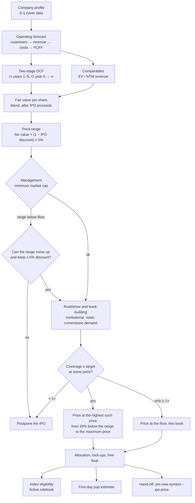
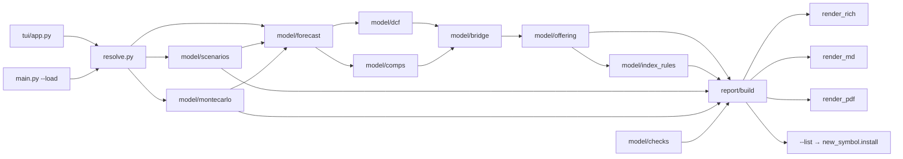

Version: 0.1.0

Date: 2026-09-30

Status: Proposed — design only, nothing implemented

# EduMatcher — IPO Valuation Simulator (`pm-valuation`) Design

## Table of Contents

1. [Summary](#1-summary)
2. [Goals, non-goals and decisions](#2-goals-non-goals-and-decisions)
3. [The IPO process being simulated](#3-the-ipo-process-being-simulated)
4. [Company profile (S-1 data)](#4-company-profile-s-1-data)
5. [Sector presets](#5-sector-presets)
6. [The operating forecast](#6-the-operating-forecast)
7. [Discount rates](#7-discount-rates)
8. [Two-stage DCF](#8-two-stage-dcf)
9. [From enterprise value to value per share](#9-from-enterprise-value-to-value-per-share)
10. [Comparables cross-check and fair value](#10-comparables-cross-check-and-fair-value)
11. [Scenarios, sensitivity and tornado](#11-scenarios-sensitivity-and-tornado)
12. [Monte Carlo](#12-monte-carlo)
13. [The offering: structure, lock-ups and free float](#13-the-offering-structure-lock-ups-and-free-float)
14. [Price range and management constraints](#14-price-range-and-management-constraints)
15. [Book-building](#15-book-building)
16. [Aftermarket: the first-day pop](#16-aftermarket-the-first-day-pop)
17. [Index inclusion](#17-index-inclusion)
18. [Worked example: Aurora Metrics Inc.](#18-worked-example-aurora-metrics-inc)
19. [The interview (terminal UI)](#19-the-interview-terminal-ui)
20. [The report](#20-the-report)
21. [Command line and scenario files](#21-command-line-and-scenario-files)
22. [Hand-off to `pm-new-symbol` and `pm-index-admin-cli`](#22-hand-off-to-pm-new-symbol-and-pm-index-admin-cli)
23. [Architecture and module layout](#23-architecture-and-module-layout)
24. [Validation and warnings catalogue](#24-validation-and-warnings-catalogue)
25. [Test strategy](#25-test-strategy)
26. [Implementation plan — work packages](#26-implementation-plan--work-packages)
27. [Open questions and extensions](#27-open-questions-and-extensions)
- [Appendix A — Formula summary](#appendix-a--formula-summary)
- [Appendix B — Glossary](#appendix-b--glossary)
- [Appendix C — From answers to offer price: the complete derivation](#appendix-c--from-answers-to-offer-price-the-complete-derivation)

---

## 1. Summary

`pm-valuation` is a classroom simulation of how an IPO gets its price. The
student plays the company and its bankers. The tool interviews them about a
fictive company: its market, customers, staff, costs, capital needs, the
investors it can attract, and what its management will accept. It then
works through the same steps a real listing goes through:

1. **A ten-year operating forecast**, built bottom-up from a customer model:
   market size, penetration, churn, pricing, headcount and costs.
2. **A two-stage DCF.** One discount rate applies to the first five years,
   while the company is young and risky. A second, lower rate applies from
   year six "to the end of time", including a terminal value.
3. **A comparables cross-check**, blended with the DCF into a fair value per
   share.
4. **A price range** set at a deliberate IPO discount to fair value, and then
   checked against the **minimum valuation management will accept**.
5. **Book-building.** Institutional, retail and cornerstone demand is modelled
   at each price, and the deal is priced at the highest price that keeps the
   book covered by the target multiple.
6. **Lock-ups, free float and index eligibility.** These are checked against
   a fictive index rulebook, which the exchange may choose to relax.
7. **A first-day "pop" estimate** and the money left on the table.

Every number in the result is derived in a table the student can check by
hand. The assumptions may be wrong, but the arithmetic may not be: that
principle is the design constraint. Almost every question is optional. A
student can press Enter through the whole interview and get a coherent,
realistic company from a **sector preset**. Each value is tagged with where
it came from: the student, the preset, or a rule that derived it from other
answers.

The valuation runs in two modes, and the student can compare them:
**deterministic** (base, bear and bull cases, sensitivity grids, tornado) and
**Monte Carlo** (10,000 correlated draws of the key drivers by default). The
final screen can hand the chosen price straight to `pm-new-symbol`. That
turns valuation, pricing and listing into one classroom flow: the symbol then
opens on EduMatcher, where the market decides whether the bankers were right.

§18 contains a complete worked example. Its figures were produced by a
prototype of the model in this document, so they are consistent with every
formula here.

## 2. Goals, non-goals and decisions

### 2.1 Goals

| # | Goal | Where |
|---|---|---|
| G1 | Teach the IPO pricing process end to end, from a business plan to a listed symbol | §3, §14–§17, §22 |
| G2 | Financially sound calculations: an explicit DCF, a consistent terminal value, a correct equity bridge including the IPO proceeds | §6–§9 |
| G3 | A DCF with two discount rates: one for years 1–5, one from year 6 to infinity | §7, §8 |
| G4 | Cover TAM, customer growth, staff, infrastructure, R&D, hype, institutional and retail interest, book interest, lock-ups, index inclusion, and management's minimum valuation | §6, §13–§17 |
| G5 | A friendly multi-page terminal interview where nearly every answer is optional and is defaulted realistically | §5, §19 |
| G6 | Motivate the result in detail: tables of customers, headcount, P&L, taxes, FCFF, DCF, bridge, book and index | §18, §20 |
| G7 | Deterministic and Monte Carlo valuation, side by side, so the two can be compared | §11, §12, §20 |
| G8 | S-1 flavour: filer status, SIC code, the offering table, capitalisation, dilution, auto-generated risk factors | §4, §20 |
| G9 | Reproducible sessions, so an instructor can hand out a case and every student starts from the same company | §21 |
| G10 | No new runtime dependencies: `rich` and `prompt_toolkit` are already in `pyproject.toml` | §23 |

### 2.2 Non-goals

- **Real market data.** Every rate, multiple and preset is an editable
  assumption. The tool never fetches prices, yields or peer multiples.
- **Accounting precision.** There are no revenue recognition, lease or
  deferred tax asset rules beyond a simple loss carry-forward.
- **Pre-revenue valuation** (for example biotech rNPV). Here the DCF is only
  as good as the customer model, and a pre-revenue company has no customers.
  §5 says which preset fits least well.
- **Regulatory completeness.** The S-1 elements are illustrations. This is not
  a filing checklist.
- **Any effect on the running exchange.** The only integration is the explicit
  hand-off in §22.

### 2.3 Decisions

| # | Decision | Reason |
|---|---|---|
| D1 | **Both deterministic and Monte Carlo**, selectable with `--mode deterministic\|montecarlo\|both` (default `both`), plus a comparison table | Requested: "so the user can choose and compare" |
| D2 | **Standalone first, optional hand-off.** The result screen always prints the `pm-new-symbol` command; `--list` runs it | Requested: both, so the tool is useful with or without a running exchange |
| D3 | **Sessions are YAML scenario files** (`--save`, `--load`). Defaults are saved with their provenance | Recommended default; not objected to, implemented in WP5 (§21) |
| D4 | **Floats for the model; `Decimal` only for the final offer price**, which must sit exactly on the listing's tick grid | Valuation is an estimate, but the price handed to the exchange is an exact number |
| D5 | **The IPO proceeds formula** is solved in closed form, not by iteration (§9.2) | Hand-checkable, and it avoids a fixed-point loop |
| D6 | **The terminal value uses the value-driver formula** (growth consistent with reinvestment), not "last FCFF × (1+g)" | Avoids the most common DCF error: growth without reinvestment |
| D7 | **Stock-based compensation is a real cost** and is not added back | Adding it back overstates value; the dilution happens either way |
| D8 | **The index rulebook is fictive and lives in this tool.** `pm-index` has no eligibility rules (`EduMatcher-Index.md` §2) | Keeps the exchange unchanged; the rules are for teaching |
| D9 | **Behavioural parts are labelled as heuristics** (demand multipliers, first-day pop) | Honesty: these are calibrated stories, not finance theory |
| D10 | **Two IPO frameworks, Swedish by default.** `company.market` is `se` (prospectus approved by Finansinspektionen, Nasdaq Stockholm, SEK) or `us` (Form S-1, SEC, USD); `--market` overrides the file (§5.1) | Requested: "Support both Full Swedish IPO framing as well as American … Make it Swedish framing by default" |
| D11 | **Four interview levels** (Beginner, Intermediate, Advanced, Expert) replace the advanced-field toggle and `--quick`; `--level`, F3 cycles (§19.3) | Requested: a persona division "to make it more beginner friendly" |
| D12 | **18 sector presets, grouped by ICB industry**, each with ICB and SIC codes, its own execution premium, asset life and plausible revenue per employee; the cover shows ICB (`se`) or SIC (`us`) (§5.2) | Requested: "add at least around 12-15 to even have a chance to cover a larger portion of the possible new companies" |

## 3. The IPO process being simulated



Each box maps to a real step:

- **Profile and forecast**: the business section and financial statements in
  the prospectus (approved by Finansinspektionen in Sweden; in the US, part
  of the registration statement, Form S-1).
- **DCF and comparables**: the underwriters' valuation work, and the
  "comparable companies" analysis in their pitch.
- **Testing the waters and the price range**: the range in the prospectus,
  whose top is the maximum price in Sweden, or on the cover of the US
  preliminary prospectus ("red herring").
- **Roadshow and book-building**: investors submit indications of interest.
  The book's coverage decides where in the range, or outside it, the deal
  prices.
- **Pricing and allocation**: the final prospectus, and who gets the shares.
- **Lock-ups**: existing holders (and cornerstones) may not sell for a period,
  typically 180 days.
- **Listing**: the first trade on the exchange. That is EduMatcher's job,
  through `pm-new-symbol` and the opening auction.

## 4. Company profile (S-1 data)

The first interview page (§19.3) collects the "cover page" of the
offering document. None of it changes the valuation, except the sector
(which selects the preset, §5), the market (which selects the country
defaults, §5.1) and dual-class shares (§15.2, §17). All of it appears in the
report's cover section (§20): "Prospectus cover" for `se`, "S-1 cover" for
`us`.

| Field | Default | Notes |
|---|---|---|
| Company name | Market: `Newco AB` / `Newco Inc.` | Free text |
| Proposed ticker | Derived from the name: first letters of words, else the first 4 letters, upper-cased | Validated like `pm-new-symbol`: 1–8 characters of `A-Z 0-9 . _` |
| Sector preset | `b2b_saas` | Selects §5's defaults |
| Industry code | From the preset and market: `ICB 10101015 Software` (`se`) or `SIC 7372` (`us`) | Display only; shown on the report's cover section (§5.2) |
| State / country of incorporation | Market: `Sweden` / `Delaware` | Display only |
| Currency | Market: `SEK` / `USD` | Display only; the market's `fx` converts the money defaults (§5.1) |
| Fiscal year end | `December 31` | Display only |
| Dual-class shares | No | Governance discount on institutional demand (§15.2); index rule (§17) |
| Lead underwriter | Market: `Fiktiva Banken AB` / `Fictive & Co.` | Display only |
| Use of proceeds | "General corporate purposes, including working capital, R&D and sales expansion" | Display only |
| Market | `se` | `se` or `us`: the IPO framework and country defaults (§5.1). Last field on page 1 |

**Filer status is derived, never asked, and shown for `us` only:**

| Status | Rule used | Source of the rule |
|---|---|---|
| Emerging growth company (EGC) | Last fiscal-year revenue < 1.235 bn | JOBS Act threshold as inflation-adjusted by the SEC in 2022; configurable in the preset file |
| Smaller reporting company (SRC) | Public float at the offer price < 250 m, **or** revenue < 100 m **and** public float < 700 m | SEC 2018 definition; configurable |
| Large accelerated filer | Not possible at IPO; shown as "n/a (first annual report)" | Needs 12 months as a reporting company |

"Public float" here means the free-float market capitalisation at the offer
price (§13.3). The report states the thresholds it used, because they change
over time and the student should know they are assumptions too.

## 5. Sector presets

A preset is a coherent set of defaults for one business model. The presets
live in a YAML data file (`valuation/presets.yaml`), not in code, so an
instructor can edit or add them. Money values are written in USD and
converted to the market's currency (§5.1). The values are **illustrative and
plausible, not researched benchmarks**. The report says which preset was
used.

| Driver | `b2b_saas` | `consumer_subscription` | `online_marketplace` | `fintech_payments` | `deep_tech_hardware` |
|---|---:|---:|---:|---:|---:|
| Suggested SIC | 7372 | 7374 | 7389 | 6199 | 3674 |
| ICB subsector | 10101015 Software | 10101020 Consumer Digital Services | 10101020 Consumer Digital Services | 50205015 Transaction Processing Services | 10102010 Semiconductors |
| "Customer" means | business account | paying subscriber | active buyer | merchant | enterprise account |
| Last FY revenue | 90 m | 60 m | 80 m | 70 m | 50 m |
| ARPU (year 0, per year) | 60,000 | 120 | 90 (take-rate revenue) | 5,000 | 250,000 |
| Annual churn | 8% | 35% | 25% | 12% | 5% |
| Year-1 customer growth | 50% | 50% | 55% | 60% | 50% |
| TAM (year 0) | 40 bn | 30 bn | 60 bn | 50 bn | 25 bn |
| TAM growth (year 1, fades to *g*) | 12% | 8% | 10% | 11% | 12% |
| SAM as share of TAM | 25% | 30% | 20% | 20% | 20% |
| Infrastructure fixed (year 0) | 6 m | 5 m | 8 m | 10 m | 15 m |
| Infrastructure per customer | 4,000 | 8 | 6 | 300 | 60,000 |
| Other COGS (% revenue) | 6% | 18% | 15% | 25% | 8% |
| Revenue per employee (year 0) | 200,000 | 400,000 | 500,000 | 450,000 | 300,000 |
| Loaded cost per employee | 150,000 | 140,000 | 140,000 | 160,000 | 170,000 |
| Staff split R&D / S&M / G&A / Ops | 38/30/14/18 | 35/25/15/25 | 30/35/15/20 | 32/28/18/22 | 40/20/12/28 |
| Paid CAC (× ARPU) | 0.5 | 0.6 | 1.2 | 1.0 | 0.3 |
| Capex (% revenue) | 3% | 2% | 2% | 3% | 8% |
| Net working capital (% revenue) | −5% | −3% | −8% | 5% | 15% |
| Beta, stage 1 / stage 2 | 1.5 / 1.1 | 1.6 / 1.2 | 1.5 / 1.15 | 1.6 / 1.2 | 1.8 / 1.3 |
| Comparable EV / NTM revenue | 10× | 5× | 6× | 7× | 3× |
| Execution premium | 3% | 3% | 3% | 3% | 3% |
| Useful life of capex | 4 years | 4 years | 4 years | 4 years | 4 years |
| Plausible mature EBIT margin (warning band) | 20–35% | 15–30% | 15–30% | 15–30% | 12–25% |
| Plausible year-N revenue per employee (V020) | 150k–800k | 150k–1.2 m | 150k–1.5 m | 150k–1.5 m | 150k–800k |

The values are tuned so that each preset's all-defaults company is
coherent. Its year-10 EBIT margin sits inside its band, its growth has
faded by the horizon, and its DCF lands within about 25% of its
comparables value. A unit test holds every preset to that, in both markets.
Beyond the test, no default company fires a warning other than V004 (most of
the value beyond the horizon), which is real for young growth companies.
(`fintech_payments` moved from 6× to 7× so that it also holds under `se`.)

Notes that the help text teaches:

- **Negative working capital** in SaaS and marketplaces is real. Customers pay
  annually in advance (SaaS), or the platform holds sellers' money before
  paying out (marketplaces). Growth then *releases* cash.
- **`deep_tech_hardware`** fits the customer model least well. Its "infra per
  customer" is really the unit cost of the delivered hardware, and its
  capital intensity is high. The preset exists to show how capex and working
  capital eat into free cash flow.
- **Market structure** sets the maximum share of the SAM the company can
  reach, `p_max`: fragmented 5%, competitive 8% (the default), oligopoly 15%,
  dominant 30%. The student is asked for the structure, not for `p_max`
  itself.

### 5.1 Markets: Sweden and the United States

The `markets:` section of `presets.yaml` holds one entry per IPO framework.
`company.market` selects it (default `se`); `--market` on the command line
overrides the scenario file.

| Key | `se` | `us` | Used for |
|---|---|---|---|
| `currency` | SEK | USD | Display; chart axis |
| `fx` | 10 | 1 | Units of the currency per USD: every money default is multiplied by it |
| `salary_level` | 0.7 | 1.0 | Also multiplies the per-person money values: loaded cost and revenue per employee |
| `company_name`, `incorporation`, `lead_underwriter` | Newco AB, Sweden, Fiktiva Banken AB | Newco Inc., Delaware, Fictive & Co. | Cover defaults (§4) |
| `document`, `regulator`, `listing_venue` | Prospectus; Finansinspektionen (EU Prospectus Regulation); Nasdaq Stockholm, Main Market | S-1; SEC (Securities Act of 1933); Nasdaq or NYSE | Report cover section and prose |
| `risk_free`, `erp` | 3.0%, 5.6% | 4.25%, 5.0% | §7 |
| `tax_rate` | 20.6% | 25% | §6.9 |
| `inflation`, `terminal_growth` | 2%, 2% | 2.5%, 2.5% | §6.1, §8.3 |
| `gross_spread` | 3% | 7% | §13.1 |
| `target_price` | 100 | 20 | Default pre-IPO share count (§13.1) |
| `max_above_range` | 0% | 20% | Top of the pricing band (§15.5) |

Fields whose default comes from the market carry the `FromMarket(attr)`
default kind and have `company.market` as a dependency, so changing the
market recomputes them. Their source is **default**. Scaling revenue per
employee with the salary level keeps staff cost the same share of revenue, so
margins, and the preset coherence of §5, hold in both markets. The V020 band
(§24) is scaled by `fx · salary_level`.

The amounts in a scenario file are in its market's currency: `--market us`
on a Swedish case reads its kronor as dollars. Amounts accept Swedish
suffixes too: `mkr` (miljoner kronor, 10⁶) and `md` / `mdr` (miljarder, 10⁹).
In `se`, field values are also shown with them (`400mdr`, `900mkr`) in the
interview, scenario files and the report's Assumptions and comparison; `us`
shows `bn` and `m`. The report's own tables stay in millions.

### 5.2 More sectors and the industry classification

Thirteen more presets (D12) cover businesses beyond technology, so that most
companies a class invents have a sensible starting point. The presets are
grouped by the industry of the **Industry Classification Benchmark** (ICB,
FTSE Russell), which Nasdaq's Nordic exchanges have used since 2011: 11
industries down to about 170 subsectors with 8-digit codes. The first two
digits of `icb_code` give the industry, the pick-list heading
(`presets.ICB_INDUSTRIES`). The SEC files US companies under 4-digit SIC
codes; each preset carries both, and the field `company.industry_code` shows
the one the market's `classification` names.

Money in US dollars at US pay, as in §5:

| Preset | ICB / SIC | Customer | Revenue | ARPU | Churn | Growth y1 | TAM | Other COGS | Rev./employee | Loaded cost | Capex | NWC | β1 / β2 | Exec. | Life | Comps | EBIT band |
|---|---|---|---:|---:|---:|---:|---:|---:|---:|---:|---:|---:|---:|---:|---:|---:|---:|
| `consulting` | 10101010 / 7371 | client account | 300 m | 400,000 | 15% | 20% | 93 bn | 5% | 160,000 | 120,000 | 1% | 12% | 1.1 / 1 | 2% | 4 | 1.6× | 8%–16% |
| `telecom_operator` | 15102015 / 4813 | subscriber | 400 m | 400 | 15% | 15% | 42 bn | 19% | 600,000 | 110,000 | 18% | -3% | 0.8 / 0.7 | 2% | 12 | 2.6× | 15%–28% |
| `medtech` | 20102010 / 3841 | hospital or clinic account | 60 m | 150,000 | 6% | 40% | 29 bn | 5% | 300,000 | 150,000 | 4% | 20% | 1.2 / 1 | 5% | 6 | 3.9× | 18%–30% |
| `healthcare_services` | 20101010 / 8000 | care contract or clinic | 400 m | 3 m | 5% | 12% | 82 bn | 12% | 150,000 | 80,000 | 3% | 2% | 0.8 / 0.8 | 2% | 8 | 1.2× | 6%–12% |
| `retail_stores` | 40401030 / 5940 | store | 500 m | 2 m | 3% | 12% | 54 bn | 47% | 200,000 | 45,000 | 4% | 12% | 1.1 / 1 | 2% | 8 | 0.6× | 4%–10% |
| `ecommerce_retail` | 40401010 / 5961 | active buyer | 400 m | 250 | 40% | 35% | 190 bn | 55% | 500,000 | 70,000 | 2% | 8% | 1.4 / 1.1 | 3% | 5 | 0.4× | 3%–8% |
| `video_games` | 40203040 / 7372 | paying player | 100 m | 60 | 55% | 40% | 135 bn | 17% | 450,000 | 130,000 | 2% | 0% | 1.4 / 1.2 | 6% | 4 | 4× | 15%–30% |
| `media_publishing` | 40301030 / 2731 | subscriber or reader | 300 m | 150 | 20% | 5% | 97 bn | 22% | 300,000 | 90,000 | 2% | 5% | 0.9 / 0.8 | 2% | 5 | 1.4× | 8%–15% |
| `consumer_brands` | 45102020 / 2000 | retail or distribution account | 300 m | 500,000 | 8% | 20% | 90 bn | 53% | 350,000 | 80,000 | 4% | 15% | 0.9 / 0.8 | 2% | 10 | 1.6× | 8%–15% |
| `industrial_machinery` | 50204000 / 3560 | industrial customer | 400 m | 1.5 m | 5% | 15% | 140 bn | 39% | 300,000 | 100,000 | 6% | 20% | 1.1 / 1 | 2% | 10 | 1.2× | 8%–16% |
| `construction_services` | 50101015 / 1600 | project client | 800 m | 2 m | 30% | 15% | 490 bn | 55% | 350,000 | 95,000 | 2% | 8% | 1.1 / 1 | 2% | 6 | 0.8× | 4%–9% |
| `logistics_transport` | 50206060 / 4731 | shipper account | 500 m | 200,000 | 12% | 18% | 220 bn | 39% | 250,000 | 75,000 | 8% | 5% | 1.2 / 1 | 2% | 8 | 0.8× | 5%–12% |
| `renewable_energy` | 65101010 / 4911 | power-purchase contract | 100 m | 3 m | 3% | 25% | 21 bn | 16% | 1.5 m | 120,000 | 35% | 2% | 0.8 / 0.7 | 3% | 25 | 6× | 30%–50% |

Customer means what the model counts: for `retail_stores` a store (churn is
closures, growth is openings), for `renewable_energy` a power-purchase
contract. Three things that used to be fixed defaults are now per preset:
the **execution premium** (§7; 5% for medtech, 6% for games), the **useful
life** (§6.7; 25 years for wind and solar parks) and the **revenue per employee
band** of V020.

The new presets were calibrated by bisection: the TAM so that growth has
faded by year 10, the other cost of revenue so that the year-10 margin is
mid-band, and the comparables multiple so that the DCF and comparables
values agree across both markets. The other values were set by judgement
and are illustrative. Mature presets start closer to their ceiling (higher
penetration), so their growth fades quickly. Year-1 revenue growth still
includes the run-rate effect of §6.3 (revenue last year is 0.85 × year-end
customers × ARPU), about 18 points, which suits fast growers better than
mature companies.

No preset exists for banks and insurers (valued on equity), property
companies (net asset value), pre-revenue biotech (risk-adjusted pipeline
NPV) or exploration companies (reserves); the user guide says why.

## 6. The operating forecast

### 6.1 Conventions

- **Year 0** is the last completed fiscal year. Years 1…N are forecast; the
  default N is 10. Year N+1 is computed only to feed the terminal value.
- **Flows happen at year end** for discounting. There is an optional
  mid-year convention (§8.4), off by default so tables can be checked by
  hand.
- **All amounts are nominal**, in the profile's currency. General inflation
  `π` (market default: 2% `se`, 2.5% `us`) escalates fixed costs.
- **"Fade" means linear interpolation** from the year-1 value to the year-N
  value:

  ```text
  fade(t) = (min(t, N) − 1) / (N − 1)            0 in year 1, 1 in year N and after
  x_t     = x_1 + (x_N − x_1) · fade(t)
  ```

### 6.2 Market: TAM and SAM

```text
TAM growth_t = g_TAM + (g − g_TAM) · fade(t)          fades to terminal growth g
TAM_t        = TAM_{t−1} · (1 + TAM growth_t)
SAM_t        = sam_share · TAM_t
```

The fade is what makes the terminal value consistent. A market still growing
12% a year cannot be followed by a perpetuity growing at 2.5%.

### 6.3 Customers: logistic adoption with churn

The number of customers the company can ever serve is capped by its reachable
share of the market:

```text
ARPU growth_t = g_ARPU + (π − g_ARPU) · fade(t)       price rises fade to inflation
ARPU_t        = ARPU_{t−1} · (1 + ARPU growth_t)
Cmax_t        = p_max · SAM_t / ARPU_t                 customers at maximum market share
```

Customers follow a discrete logistic curve with churn:

```text
churned_t    = churn · C_{t−1}
gross adds_t = a · C_{t−1} · (1 − C_{t−1} / Cmax_t)    clamped to [0, Cmax_t − C_{t−1} + churned_t]
C_t          = C_{t−1} + gross adds_t − churned_t
```

The upper clamp stops a high acquisition rate from overshooting the market
(a discrete logistic curve can jump past its ceiling). The cap can also fall
below the customer base, when ARPU grows faster than the market; the company
then adds nobody and only loses customers to churn.

The acquisition intensity `a` is not asked for. It is calibrated so that
year 1 grows at the rate the student gave (or the preset's rate):

```text
year-1 net growth g_C1 = a · (1 − C_0 / Cmax_1) − churn
⇒  a = (g_C1 + churn) / (1 − C_0 / Cmax_1)
```

Growth then slows by itself as penetration `C/Cmax` rises: the S-curve every
adoption story follows. The report shows penetration per year, so the student
can see where the curve flattens.

**Revenue** uses the average customer count of the year:

```text
Revenue_t = (C_{t−1} + C_t) / 2 · ARPU_t
```

The report also shows revenue as a share of the SAM, `Revenue_t / SAM_t`. It
can never exceed `p_max` by construction, and it is the "are we claiming too
much of the market?" check.

### 6.4 Unit economics

Reported for year 1, year 5 and year N (not used in the valuation itself):

```text
LTV        = ARPU_t · gross margin_t / churn          lifetime gross profit per customer
CAC (full) = S&M_t / gross adds_t                     staff + paid acquisition per new customer
LTV / CAC  and  CAC payback (months) = CAC / (ARPU_t · gross margin_t / 12)
```

Rules of thumb shown as help text: LTV/CAC above 3 is healthy, below 1
destroys value (warning V006), and a payback beyond 36 months is a warning
(V007).

### 6.5 Headcount and personnel cost

Headcount has two modes:

| Mode | Rule | Default |
|---|---|---|
| **Follow revenue** (default) | `g_H,t = max(g_H,floor, ε_H · revenue growth_t)` | `ε_H = 0.6`, floor 4% |
| **Explicit path** | `g_H,t = g_H,1 + (g_H,N − g_H,1) · fade(t)` | The student enters year-1 and year-N growth |

```text
H_t          = H_{t−1} · (1 + g_H,t)
loaded_t     = loaded_0 · (1 + g_wage)^t             fully loaded: salary, benefits, payroll tax, office
staff cost_t = H_t · loaded_t
```

Staff cost is split into R&D, S&M, G&A and Ops using the preset shares. Ops
(support, hosting operations) belongs to cost of revenue. The elasticity
below 1 is the operating leverage: revenue per employee rises as the company
scales. The report shows revenue per employee, and warns (V020) when it
leaves a plausible band.

The year-0 headcount defaults to `last FY revenue / preset revenue per
employee`.

### 6.6 Operating costs

```text
Infrastructure_t = infra_fixed_0 · (1+π)^t + infra_per_customer · (1+π)^t · avg customers_t
Other COGS_t     = other_cogs_pct · Revenue_t                     payment fees, third-party licences, support tools
COGS_t           = Infrastructure_t + Other COGS_t + Ops staff_t
Gross profit_t   = Revenue_t − COGS_t

Paid acquisition_t = CAC_paid,0 · (1 + g_CAC)^t · gross adds_t     marketing that buys customers
R&D_t   = R&D staff_t + rnd_nonstaff_pct · Revenue_t
S&M_t   = S&M staff_t + Paid acquisition_t
G&A_t   = G&A staff_t + gna_nonstaff_pct · Revenue_t + public_company_cost_0 · (1+π)^t
SBC_t   = sbc_pct · staff cost_t                                   stock-based compensation, a real cost (D7)

EBITDA_t = Gross profit_t − R&D_t − S&M_t − G&A_t − SBC_t
```

**Public-company cost** is its own line because it is an IPO-specific cost:
audit, directors' insurance, investor relations, listing fees and compliance.
The default is 3 m a year, escalated with inflation. The help text asks:
"what does being listed cost?"

### 6.7 Capex, depreciation and PP&E

```text
Capex_t = capex_pct · Revenue_t
D&A_t   = PP&E_{t−1} / useful_life                  straight line on the opening balance
PP&E_t  = PP&E_{t−1} + Capex_t − D&A_t
EBIT_t  = EBITDA_t − D&A_t
```

Opening PP&E defaults to `capex_pct · revenue_0 · useful_life / 2`, the
steady-state balance of a straight-line schedule.

### 6.8 Working capital

```text
NWC_t  = nwc_pct · Revenue_t        NWC_0 = nwc_pct · Revenue_0
ΔNWC_t = NWC_t − NWC_{t−1}          negative ΔNWC is a cash inflow
```

### 6.9 Taxes and loss carry-forward

Young growth companies pay no tax for years, because they carry forward
their losses. Ignoring that undervalues them.

```text
if EBIT_t < 0:  NOL_t = NOL_{t−1} + |EBIT_t|,   tax_t = 0
else:           use_t = min(NOL_{t−1}, EBIT_t)
                NOL_t = NOL_{t−1} − use_t
                tax_t = tax_rate · (EBIT_t − use_t)
```

Carry-forwards are unlimited in time and amount. This is a simplification
(US federal rules, for example, limit usage to 80% of taxable income); §27
lists it. From year N+1 the company is taxed in full (§8.3).

### 6.10 Free cash flow to the firm

```text
FCFF_t = EBIT_t − tax_t + D&A_t − Capex_t − ΔNWC_t
```

FCFF is the cash available to *all* capital providers, before financing. That
is why it is discounted at the cost of capital, and why debt and cash are
handled in the bridge (§9), not in the cash flows.

## 7. Discount rates

Each stage has its own rate, built up from the CAPM with explicit premia.
With debt, each becomes a WACC.

```text
cost of equity, stage 1   k_e1 = r_f + β_1 · ERP + size premium_1 + execution premium
cost of equity, stage 2   k_e2 = r_f + β_2 · ERP + size premium_2

WACC_s = E/V · k_es + D/V · k_d · (1 − tax_rate)     D/V = target debt ratio (default 0)
r_1 = WACC_1      applies to years 1 … S   (S = 5 by default)
r_2 = WACC_2      applies to years S+1 … ∞
```

| Input | Default | Help text in brief |
|---|---:|---|
| Risk-free rate `r_f` | Market: 3.0% / 4.25% | The long government bond yield. **Edit to today's value**, because the default is a round number, not a quote |
| Equity risk premium `ERP` | Market: 5.6% / 5.0% | Extra return investors demand for equities over bonds |
| β stage 1 / stage 2 | Preset (1.5 / 1.1) | Sensitivity to the market. Young companies are more cyclical, and mature beta drifts toward 1 |
| Size premium stage 1 / stage 2 | 1.5% / 0.5% | Small, illiquid companies demand more |
| Execution premium (stage 1 only) | Preset (3% for most) | The risk that the plan simply does not happen. It is the reason stage 1 has its own rate |
| Target debt ratio `D/V` | 0% | Most growth IPOs are equity-financed |
| Cost of debt `k_d` | `r_f` + 3% | Only used when `D/V` > 0 |
| Stage-1 length `S` | 5 years | As requested: "one discount rate for the first five years" |
| Override `r_1`, `r_2` | — | Entered directly; the build-up is then shown as "not used" |

Why two rates? A single rate either over-penalises the mature years or
under-penalises the risky early years. Stage 1 prices the risk that the
company never reaches maturity. Stage 2 prices a going concern that has
arrived. Warning V003 fires if `r_1 < r_2`, which is legal but odd.

## 8. Two-stage DCF

### 8.1 Discount factors with two rates

A cash flow in year `t` passes through every year before it, each at its own
rate, so the discount factor is a product, not a power of one rate:

```text
DF_t = Π_{i=1..t} 1 / (1 + r_i)
     = (1+r_1)^−t                              for t ≤ S
     = (1+r_1)^−S · (1+r_2)^−(t−S)             for t > S
PV_t = FCFF_t · DF_t
```

A common mistake is to discount year 7 at `(1+r_2)^−7`. That would apply the
mature rate to years that belong to stage 1. The report shows each `DF_t`,
so the student can see the product at work.

### 8.2 Explicit horizon vs "to the end of time"

The requested "second rate to the end of time" is implemented as:

- **Explicit years S+1 … N** at `r_2`, with the forecast fading growth toward
  `g` (§6.2, §6.3), and
- **a terminal value at year N**, discounted with `DF_N`.

The whole of stage 2, explicit years and terminal value together, uses
`r_2`. With `N = S = 5`, stage 2 is purely the terminal value. The default
`N = 10` gives the business five years to converge before the perpetuity
formula takes over.

### 8.3 Terminal value: the value-driver formula

```text
NOPAT_{N+1}    = EBIT_{N+1} · (1 − tax_rate)       fully taxed; the NOL is assumed spent
RONIC          = r_2 + ronic_spread                return on new invested capital (default spread 2%)
reinvestment   = g / RONIC                         share of NOPAT that must be reinvested to grow at g
FCFF_{N+1}     = NOPAT_{N+1} · (1 − g / RONIC)
TV_N           = FCFF_{N+1} / (r_2 − g)
PV(TV)         = TV_N · DF_N
EV             = Σ_{t=1..N} PV_t + PV(TV)
```

Why not simply `FCFF_N · (1+g)`? Growth needs investment. In the
explicit years, reinvestment is whatever the forecast says. In perpetuity
it must be exactly what growth at `g` requires. With `ronic_spread = 0`,
growth creates no value, and the terminal value equals the no-growth value
`NOPAT/r_2`. That is a useful classroom demonstration.

**Guards:**

- V001 (error): `r_2 − g < 1%`. The formula explodes as the denominator
  approaches 0.
- V002 (warning): `g > r_f`. No company can outgrow the economy forever.
- V004 (warning): `PV(TV) / EV > 75%`. Most of the value rests on the
  perpetuity.
- V005 (warning): revenue growth in year N+1 exceeds `g` by more than 3
  points. The explicit period is too short for the business to have matured,
  so extend N.

### 8.4 Mid-year convention (optional)

`--mid-year` discounts flow `t` by an extra `(1 + r_t)^½`, as if cash
arrived evenly through the year. It raises value by about half a year of
discounting. It is off by default so every table matches a hand calculation
with whole years.

## 9. From enterprise value to value per share

### 9.1 The bridge

```text
Equity value (pre-IPO) = EV + cash − debt
```

Cash and debt are pre-IPO balances from the profile page. Minority
interests, preferred stock and leases are out of scope. Pre-IPO preferred
stock is assumed to convert to common at the IPO, as it normally does.

### 9.2 The IPO proceeds: a closed-form solution

New shares change both the numerator (cash raised) and the denominator
(share count). With a target gross primary raise `R`, a gross spread `f` and
fixed offering expenses `X`, at price `P`:

```text
new shares       n  = R / P
post-money value    = Equity_pre + R − f·R − X
post-money shares   = S_pre + R / P
```

The fair price is the one at which the new investors pay exactly what their
shares are worth:

```text
P = (Equity_pre + R − fR − X) / (S_pre + R/P)
⇔ P · S_pre + R = Equity_pre + R − fR − X
⇔ P_fair = (Equity_pre − f·R − X) / S_pre
```

The raise cancels out, except for its costs. Raising money at a fair price
does not create or destroy value for existing holders; the fees do. This is
a key teaching point, and the report shows the derivation. `S_pre` is the
fully diluted pre-IPO share count (vested options by the treasury-stock
method are out of scope, so enter them as shares).

At any other price `P` (the offer price), the intrinsic value per share
after the IPO is:

```text
V_post(P) = (Equity_pre + R(1−f) − X) / (S_pre + R/P)
```

The report shows `V_post(P*) / P* − 1` as "intrinsic upside for IPO buyers
at the offer price".

Primary shares are rounded **down** to whole shares, and the report uses the
actual raise `n · P`.

### 9.3 Secondary shares

Selling shareholders may sell `S_sec` existing shares in the offering. That
changes neither the company's value nor its share count. It adds to the
offer size (and so to demand needed, §15.4), and to the free float (§13.3).
The proceeds go to the sellers, net of their share of the spread.

### 9.4 S-1 capitalisation and dilution

The report reproduces the two S-1 sections every student meets in a real
prospectus:

```text
Net tangible book value (NTBV)_pre = cash + PP&E_0 + NWC_0 − debt
NTBV_post                          = NTBV_pre + R(1−f) − X
dilution to new investors / share  = P* − NTBV_post / post-money shares
increase to existing holders       = NTBV_post / post shares − NTBV_pre / S_pre
```

## 10. Comparables cross-check and fair value

```text
EV_comps     = comps multiple · Revenue_1                  forward (NTM) revenue multiple, preset default
P_comps      = (EV_comps + cash − debt − f·R − X) / S_pre  same bridge as §9.2
Fair value   = w · P_DCF + (1 − w) · P_comps               w = DCF weight, default 70%
```

The report also shows the DCF's implied multiples (EV / NTM revenue, and EV /
year-N EBIT), so the two methods can be compared in the same units. Warning
V017 fires when the two per-share values differ by more than 50%. That is
not an error, but it is always worth a sentence in the student's write-up.

Why blend at all? Bankers triangulate, and investors will price the stock
against its peers on day one, whatever the DCF says. The weight is exposed,
so a student can set it to 100% and see pure intrinsic value.

## 11. Scenarios, sensitivity and tornado

### 11.1 Drivers with bear and bull values

Each key driver has a **bear** value and a **bull** value, defaulted
relative to the base value:

| Driver | Bear | Bull | Group |
|---|---|---|---|
| Year-1 customer growth `g_C1` | × 0.6 | × 1.3 | operating |
| Churn | × 1.5 | × 0.7 | operating |
| ARPU growth | − 2 pp | + 2 pp | operating |
| Max SAM share `p_max` | × 0.7 | × 1.3 | operating |
| Paid CAC | × 1.3 | × 0.8 | operating |
| Headcount elasticity `ε_H` | + 0.1 | − 0.1 | operating |
| Comparable multiple | × 0.7 | × 1.3 | market |
| Execution premium (moves `r_1`) | + 3 pp | − 2 pp | rates |
| β stage 2 (moves `r_2`) | + 0.3 | − 0.2 | rates |
| Terminal growth `g` | − 0.5 pp | + 0.5 pp | rates |

The ranges are deliberately **asymmetric**. Plans tend to disappoint more
than they surprise, which has a visible consequence in §12.4. All values are
editable on the Simulation page (Expert fields, §19.3).

### 11.2 Outputs

- **Scenario table**: bear, base and bull, each with every driver at its
  value, showing DCF, comps and fair value per share, year-N revenue and
  margin, and EV.
- **Tornado**: fair value per share with one driver at a time moved to bear
  or bull, sorted by swing. It answers the question "what should the
  roadshow be about?"
- **Two sensitivity grids** (5 × 5, DCF value per share):
  `r_2 × g` (the classic), and `r_1 × g_C1` (risk versus growth in the
  stage the company controls).

## 12. Monte Carlo

### 12.1 Distributions

Each driver in §11.1 is drawn from a **triangular distribution** with bear,
base and bull values as its (minimum, mode, maximum). The scenario table and
the simulation therefore share one definition of "plausible". Nothing new
has to be explained.

### 12.2 Correlation: one common "execution" factor

Operating drivers are not independent. A company that grows fast usually
also retains customers well. Operating drivers share a common factor through
a one-factor Gaussian copula:

```text
Z ~ N(0,1) common,  ε_i ~ N(0,1) own
u_i = Φ( √ρ · Z + √(1−ρ) · ε_i )                  ρ = 0.5 by default
x_i = bear_i + Q_tri(u_i; m_i) · (bull_i − bear_i)  m_i = (base_i − bear_i)/(bull_i − bear_i)

Q_tri(u; m) = √(u·m)                  for u < m
            = 1 − √((1−u)(1−m))       otherwise
```

Mapping from bear (u = 0) to bull (u = 1) means that a high common factor is
good news on every driver. This works whichever way a driver runs; churn's
bear value is numerically the larger one. The market and rate drivers are
drawn independently (ρ does not apply): the cost of capital is not a
function of the company's execution. `ρ = 0` gives independent draws, and
`ρ = 1` makes every operating driver move together.

### 12.3 Mechanics

- Default `N = 10,000` draws, and `--seed` (default 42) for reproducibility.
  The prototype runs 10,000 full 10-year valuations in about 0.9 s of pure
  Python, so no numpy is needed.
- A draw with `r_2 − g < 2%` is rejected and redrawn, and so is a draw that
  describes no valid company (for example customers already at the market
  cap). The count is reported, and V018 fires above 1%.
- Each draw runs §6 → §10 (forecast, DCF, comps, blend). Book-building is
  **not** simulated per draw: the offer price is a decision made once. The
  simulation asks how that decision looks against the uncertainty.

### 12.4 Outputs and comparison with the deterministic run

- A histogram of fair value per share (text bars in the terminal, and in
  Markdown).
- Percentiles P5, P25, P50, P75 and P95, the mean and the standard deviation,
  for both DCF and fair value.
- **P(fair value < offer price)**: the probability that IPO buyers overpaid.
- **P(DCF equity < 0)**: the plan destroys value.
- **P(intrinsic post-money value < management minimum)**, where the
  intrinsic post-money value is `fair value · S_pre + R` (§9.2).
- **Deterministic vs Monte Carlo** table: base-case value next to the MC mean
  and median, with the explanation. The base case is not the expected case.
  The mean falls below the base whenever the driver ranges are skewed to the
  downside (§11.1), and the DCF is non-linear in its drivers, so Jensen's
  inequality applies: `E[f(X)] ≠ f(E[X])`.

## 13. The offering: structure, lock-ups and free float

### 13.1 Offering inputs

| Input | Default | Notes |
|---|---|---|
| Fully diluted pre-IPO shares `S_pre` | Comps pre-money equity / the market's target price, rounded to 1 m | A real IPO "splits the stock" before listing so the price lands in a conventional range. The default mimics that by targeting about 100 SEK or 20 USD |
| Gross primary raise `R` | 20% of comps pre-money equity, rounded to 25 m × `fx` | Enough to fund the plan without heavy dilution |
| Secondary shares `S_sec` | 0 | Existing holders selling |
| Gross spread `f` | Market: 3% / 7% | 7% is the customary spread for mid-sized US IPOs; European fees are lower; larger deals pay less |
| Other offering expenses `X` | 2 m × `fx` + 1% of `R` | Legal, audit, printing, listing fees |
| IPO discount `d` | 15% | The deliberate discount to fair value that makes the deal attractive and leaves room for a first-day rise |
| Minimum IPO discount | 5% | Below this, bankers will not launch (§14) |
| Maximum price above the range | Market: 0% / 20% | The top of the pricing band (§15.5) |
| Lock-up days / coverage | 180 days / 100% of pre-IPO shares | |
| Cornerstone commitment | 0 | A fixed amount pre-committed before launch (common in Hong Kong and the Nordics) |
| Cornerstone lock-in | 180 days | "Lock-in rules for primary market buyers": their shares are excluded from the free float until it expires |
| Retail tranche | 10% of the offer | Used for allocation (§15.6) |

### 13.2 Lock-up effects

- **On demand**: a longer lock-up reassures institutions that insiders will
  not flood the market. The multiplier is `1 + 0.10 · clamp((days − 180)/180,
  −1, 1)`: 90 days gives 0.95, 180 days gives 1.00, and 360 days gives 1.10.
  This is a heuristic (D9).
- **On the float**: locked shares do not count as free float until expiry.
- **Overhang**: the report shows the number of shares that unlock on the
  expiry day as a multiple of the free float. It is the classic "lock-up
  expiry" price pressure students can later watch on the exchange.

### 13.3 Free float

```text
free-float shares = n (primary) + S_sec − cornerstone shares (locked) + (1 − lock-up coverage) · S_pre
free float %      = free-float shares / (S_pre + n)
free-float cap    = free-float shares · P*
```

## 14. Price range and management constraints

### 14.1 The range

```text
mid   = fair value · (1 − d)
low   = round_down(mid · 0.95, step)
high  = round_up(mid · 1.05, step)
step  = 0.01 if mid < 2,  0.10 if mid < 10,
        else 0.50 · 10^floor(log10(mid / 10))   (0.50, 5.00, 50.00, … per decade)
```

No price, range bound or book-grid point is ever below one step, so a tiny
fair value still gives a positive, tradeable price, and the book grid has a
bounded number of points at any price level.

The rounding to "nice" prices is realistic (ranges such as 14.00–16.00). It
also guarantees that the final price is a valid tick for `pm-new-symbol`,
whose default grid is two decimals (§22).

### 14.2 The management floor

Management states the **minimum market capitalisation** it will accept.
The default is the post-money valuation of the last private round, because
founders and venture investors hate a "down-round IPO". At price `P` the
post-money market cap is `P · S_pre + R`, so the floor price is:

```text
P_floor = (min market cap − R) / S_pre
```

The decision tree:

1. `low ≥ P_floor`: the range stands.
2. `low < P_floor`: the range is **moved up** to start at
   `round_up(P_floor)`, keeping its width. If the discount to fair value at
   the new midpoint is below the minimum IPO discount (5%), the bankers
   refuse to launch, and the verdict is **POSTPONE** (V012). Otherwise the
   report explains the shift (V011).
3. Book-building never prices below `P_floor`.

Two more management constraints are checked, not solved for: **maximum
dilution** (`n / post shares`, default 25%, V013) and **minimum net
proceeds** (optional).

## 15. Book-building

### 15.1 Investor classes

| Class | Base demand (value) | Price elasticity | Driven by |
|---|---|---|---|
| Institutional | `number of institutions × average ticket` ("book interest") | `ε_I` = 3.0 | Pre-marketing interest, lock-up, index prospects, governance, some hype |
| Retail | `number of applicants × average application` | `ε_R = 1.5 / (1 + 0.3 · hype)` | Retail interest, strongly amplified by hype |
| Cornerstone | Fixed committed amount | 0 (price-insensitive within the band) | Committed before launch |

Demand in value at price `P`, for the elastic classes:

```text
D_k(P) = base_k · multiplier_k · (FV / P)^ε_k
```

Investors buy more when the price is further below what they think the
shares are worth. `FV` is the fair value per share (§10). The elasticity
controls how sharply they back away as the price approaches it.

### 15.2 Multipliers

| Factor | Values | Applies to |
|---|---|---|
| Pre-marketing ("testing the waters") institutional interest, 1–5 | 0.3 / 0.6 / **1.0** / 1.5 / 2.2 | Institutional |
| Retail interest, 1–5 | 0.3 / 0.6 / **1.0** / 1.5 / 2.2 | Retail |
| Hype factor `h`, 0–10 (default 3) | Retail × `(1 + 0.25h)`, institutional × `(1 + 0.03h)`, and it lowers retail elasticity | Both |
| Lock-up (§13.2) | 0.9–1.1 | Institutional |
| Index prospects (§17.3), judged at the range midpoint | `1 + 0.10 · P(inclusion ≤ 6 months)` | Institutional |
| Dual-class shares | 0.95 | Institutional |

Index prospects are judged at the range midpoint because the index verdict
depends on the price, and the price depends on demand. Institutions place
their orders against the range, not the final price. The final verdict is
reported at the offer price.

The two institutional questions are distinct on purpose. **Interest** is the
qualitative feedback from testing the waters ("how warm are they?").
**Book interest** is the quantitative size of the book (how many
institutions put in orders, and how large).

These multipliers are **heuristics** (D9). Their job is to make the causes
visible and the direction right, not to predict real order books.

### 15.3 Defaults

Number of institutions 40, average ticket 5% of `R`, retail applicants
20,000, average application 2,500, hype 3, interests "medium". With medium
interest the default book is roughly 2–4× covered in the range. That is a
normal, healthy deal, from which the student can then make things worse or
better.

### 15.4 Coverage

```text
offer value(P) = R + S_sec · P
coverage(P)    = (D_I(P) + D_R(P) + cornerstone) / offer value(P)
```

The report tabulates every price step from `max(low · 0.8, P_floor)` to
the maximum price `top = round_down(high · (1 + max_above_range))`.

### 15.5 The pricing rule

1. **Target met**: price at the **highest** price in the band where
   `coverage ≥ target` (default 3×). Bankers want an oversubscribed book, so
   that allocations are scaled back and unfilled investors buy in the
   aftermarket, supporting the price.
2. **Target missed, but ≥ 1× at the bottom of the band**: price at the
   lowest price in the band (the management floor, or 80% of the low end),
   where coverage is highest, with a **thin book** warning (V010). The stock is at
   risk of trading below its offer price.
3. **Below 1× everywhere**: **POSTPONE**.

The band `[0.8 · low, top]` mirrors practice. In Sweden, as elsewhere in the
EU, the prospectus states the top of the range as the maximum price; pricing
above it needs a supplement that gives investors withdrawal rights, so `se`
uses `max_above_range` 0 and `top = high`. In the US, SEC Rule 430A lets a
deal price roughly 20% outside the filed range without re-filing, so `us`
uses 20% and `top = high · 1.2`. Both are hard limits. The report states whether the price is below,
within or above the range, because the press will.

### 15.6 Allocation

Cornerstones are filled first. Retail gets `min(retail demand, retail
tranche)`, and institutions get the rest. If institutions demand less than
that rest, retail may take what they leave. Fill ratios (allocated / demanded)
are reported per class, because a 30% fill is what "hot deal" means to an
investor.

## 16. Aftermarket: the first-day pop

A labelled **heuristic** (D9):

```text
pop            = clamp( 0.08 · ln(max(coverage(P*), 0.5)) + 0.02 · h,  −20%,  +100% )
first-day close = P* · (1 + pop)
money left on the table = pop · P* · (n + S_sec)
```

It reproduces the direction and rough size of first-day returns: the US
historical average is in the high teens, rising with oversubscription and
sentiment. The help text says plainly that the real first-day price is found
by the opening auction on EduMatcher once the symbol is listed (§22). The
students' own orders decide it.

## 17. Index inclusion

### 17.1 A fictive rulebook

`pm-index` has no eligibility rules; constituents are configured or added
by an operator (`EduMatcher-Index.md` §2, `pm-index-admin-cli add`). The
valuation tool therefore carries its own **EduMatcher Index Rulebook**. It
is a teaching device, editable on the Index page:

| Rule | Default | Relaxation the exchange may grant |
|---|---|---|
| Minimum full market cap | 500 m | — |
| Minimum free float | 15% | Lower to 10% |
| Minimum free-float market cap | 150 m | — |
| Seasoning (trading days after listing) | 63 (≈ 3 months) | Waive: include at the next review, 10 trading days |
| Fast entry | Full market cap ≥ 5 bn: included after 5 trading days | — |
| Multiple share classes | Not eligible | Admit |

"Can the exchange consider loosening its index rules?" is the question
**Exchange may relax** (none / seasoning / float / multi-class / all). The
report shows the verdict with and without relaxation, so the student sees
what the exchange's decision is worth to the issuer.

### 17.2 Verdict

One of:

- eligible via fast entry (day 5);
- eligible after seasoning (day 63);
- eligible only with a waiver (which one, and on which day);
- not eligible (and which rule fails).

Size rules are never relaxed. Only the float and multi-class waivers can make
a company eligible at all. A seasoning waiver never does: it brings an
eligible company's inclusion forward to day 10, and the path stays "after
seasoning".

### 17.3 Effect on the IPO

```text
P(inclusion within 6 months) = 1.0 fast entry | 0.8 after seasoning | 0.5 with a granted waiver | 0 otherwise
institutional multiplier    ×= 1 + 0.10 · P(inclusion within 6 months)
```

Index funds will have to buy the stock. Institutions anticipate that demand,
and pay for it at the IPO. If the student enters the passive assets tracking
the index and the index's own free-float cap (both optional, Index page),
the report also estimates the forced buying at inclusion: `weight × passive
AUM`, where `weight = free-float cap / (index free-float cap + free-float
cap)`.

## 18. Worked example: Aurora Metrics Inc.

A B2B SaaS company. The student entered **only** the values marked ✎. Every
other value is a `b2b_saas` preset default or derived by a rule, exactly as
the tool would do. Figures for §6–§10 come from `edumatcher.valuation` itself, and are
asserted by its golden test (§25); the rest come from a prototype of
§11–§16. All are rounded for display. Aurora is a US case (`market: us`), so
amounts are in USD millions unless stated.

### 18.1 Inputs

| Input | Value | Source |
|---|---:|---|
| Company / ticker | Aurora Metrics Inc. / AURM | ✎ |
| Sector | `b2b_saas`, SIC 7372 | ✎ |
| Last FY revenue | 90.0 | ✎ |
| Customers now `C_0` | 1,800 | ✎ |
| ARPU / ARPU growth | 60,000 / 5% fading to 2.5% | preset / default |
| Churn / year-1 customer growth | 8% / 50% | preset |
| TAM / TAM growth / SAM share | 40 bn / 12% fading to 2.5% / 25% | preset |
| Market structure → `p_max` | competitive → 8% | preset |
| Headcount `H_0` | 450 | derived: 90 m / 200,000 |
| Loaded cost / wage inflation | 150,000 / 3.5% | preset |
| Headcount growth | follow revenue, ε = 0.6, floor 4% | default |
| Infra fixed / per customer / other COGS | 6.0 / 4,000 / 6% | preset |
| Paid CAC / CAC growth | 30,000 / 3% | derived: 0.5 × ARPU / default |
| R&D non-staff / G&A non-staff / public-co cost | 4% / 3% / 3.0 | default |
| SBC | 12% of staff cost | default |
| Capex / useful life / opening PP&E | 3% / 4 years / 12.0 | preset / default / ✎ |
| NWC | −5% of revenue | preset |
| Tax rate / opening NOL | 25% / 150.0 | default / ✎ |
| Cash / debt | 60.0 / 0 | ✎ / default |
| `r_f` / ERP | 4.25% / 5.0% | default |
| β1, size₁, execution → `r_1` | 1.5, 1.5%, 3.0% → **16.25%** | preset → derived |
| β2, size₂ → `r_2` | 1.1, 0.5% → **10.25%** | preset → derived |
| Terminal growth `g` / RONIC spread | 2.5% / 2% | default |
| Horizon N / stage 1 S | 10 / 5 | default |
| Pre-IPO shares `S_pre` | 80 m | ✎ (default would be 74 m) |
| Primary raise `R` | 300.0 | derived: 20% of comps pre-money 1,478, rounded |
| Secondary shares | 5 m | ✎ |
| Gross spread / other expenses | 7% / 5.0 | default / derived: 2 + 1% × 300 |
| Comps multiple / DCF weight | 10× NTM revenue / 70% | preset / default |
| IPO discount / target coverage | 15% / 3.0× | default |
| Last private round post-money → minimum market cap | 1,400 | ✎ → derived |
| Institutions × ticket; interest | 40 × 15.0; medium | default |
| Retail: applicants × application; interest | 20,000 × 2,500; medium | default |
| Hype | 3 | default |
| Lock-up | 180 days, 100% | default |

### 18.2 Customer build

| Year | TAM | SAM | Max customers | Begin | Gross adds | Churned | End | Penetration | ARPU | Revenue | Growth | Share of SAM |
|---:|---:|---:|---:|---:|---:|---:|---:|---:|---:|---:|---:|---:|
| 1 | 44.8 bn | 11.20 bn | 14,222 | 1,800 | 1,044 | 144 | 2,700 | 19.0% | 63,000 | 141.8 | 57.5% | 1.3% |
| 2 | 49.7 bn | 12.43 bn | 15,067 | 2,700 | 1,472 | 216 | 3,956 | 26.3% | 65,975 | 219.6 | 54.9% | 1.8% |
| 3 | 54.6 bn | 13.65 bn | 15,853 | 3,956 | 1,971 | 316 | 5,610 | 35.4% | 68,907 | 329.6 | 50.1% | 2.4% |
| 4 | 59.4 bn | 14.86 bn | 16,563 | 5,610 | 2,464 | 449 | 7,625 | 46.0% | 71,778 | 475.0 | 44.1% | 3.2% |
| 5 | 64.1 bn | 16.02 bn | 17,183 | 7,625 | 2,816 | 610 | 9,832 | 57.2% | 74,570 | 650.9 | 37.0% | 4.1% |
| 6 | 68.4 bn | 17.09 bn | 17,699 | 9,832 | 2,902 | 787 | 11,947 | 67.5% | 77,263 | 841.3 | 29.3% | 4.9% |
| 7 | 72.2 bn | 18.06 bn | 18,098 | 11,947 | 2,696 | 956 | 13,688 | 75.6% | 79,838 | 1,023.3 | 21.6% | 5.7% |
| 8 | 75.6 bn | 18.89 bn | 18,372 | 13,688 | 2,317 | 1,095 | 14,910 | 81.2% | 82,277 | 1,176.5 | 15.0% | 6.2% |
| 9 | 78.3 bn | 19.57 bn | 18,511 | 14,910 | 1,926 | 1,193 | 15,643 | 84.5% | 84,563 | 1,291.8 | 9.8% | 6.6% |
| 10 | 80.2 bn | 20.06 bn | 18,511 | 15,643 | 1,609 | 1,251 | 16,001 | 86.4% | 86,677 | 1,371.4 | 6.2% | 6.8% |

Calibration: `Cmax_1 = 0.08 · 11.20 bn / 63,000 = 14,222`, and
`a = (0.50 + 0.08) / (1 − 1,800/14,222) = 0.664`, giving exactly 50% net
growth in year 1. Growth then slows as penetration rises past half. By year
10 the company adds barely more customers than it loses. The S-curve has
done the fading, and year-11 revenue growth is 4.2%, within V005's
tolerance of `g` + 3 pp.

### 18.3 Headcount

| Year | Headcount | Growth | Loaded cost | Staff cost | R&D | S&M | G&A | Ops (COGS) | Revenue / employee |
|---:|---:|---:|---:|---:|---:|---:|---:|---:|---:|
| 1 | 605 | 34.5% | 155,250 | 94.0 | 35.7 | 28.2 | 13.2 | 16.9 | 234,201 |
| 2 | 805 | 32.9% | 160,684 | 129.3 | 49.1 | 38.8 | 18.1 | 23.3 | 272,881 |
| 3 | 1,047 | 30.1% | 166,308 | 174.0 | 66.1 | 52.2 | 24.4 | 31.3 | 314,938 |
| 4 | 1,324 | 26.5% | 172,128 | 227.8 | 86.6 | 68.3 | 31.9 | 41.0 | 358,889 |
| 5 | 1,618 | 22.2% | 178,153 | 288.2 | 109.5 | 86.5 | 40.3 | 51.9 | 402,376 |
| 6 | 1,902 | 17.6% | 184,388 | 350.6 | 133.2 | 105.2 | 49.1 | 63.1 | 442,441 |
| 7 | 2,148 | 13.0% | 190,842 | 410.0 | 155.8 | 123.0 | 57.4 | 73.8 | 476,322 |
| 8 | 2,341 | 9.0% | 197,521 | 462.5 | 175.7 | 138.7 | 64.7 | 83.2 | 502,489 |
| 9 | 2,479 | 5.9% | 204,435 | 506.8 | 192.6 | 152.0 | 71.0 | 91.2 | 521,102 |
| 10 | 2,578 | 4.0% | 211,590 | 545.5 | 207.3 | 163.7 | 76.4 | 98.2 | 531,922 |

Year 1: `0.6 × 57.5% = 34.5%` growth, so `450 × (1 + 34.5%) = 605` people.

### 18.4 Income statement

| USD m | Y1 | Y2 | Y3 | Y4 | Y5 | Y6 | Y7 | Y8 | Y9 | Y10 |
|---|---:|---:|---:|---:|---:|---:|---:|---:|---:|---:|
| Revenue | 141.8 | 219.6 | 329.6 | 475.0 | 650.9 | 841.3 | 1,023.3 | 1,176.5 | 1,291.8 | 1,371.4 |
| Infrastructure | 15.4 | 20.3 | 27.1 | 35.8 | 46.3 | 57.5 | 68.1 | 77.0 | 83.8 | 88.7 |
| Other COGS | 8.5 | 13.2 | 19.8 | 28.5 | 39.1 | 50.5 | 61.4 | 70.6 | 77.5 | 82.3 |
| Ops staff | 16.9 | 23.3 | 31.3 | 41.0 | 51.9 | 63.1 | 73.8 | 83.2 | 91.2 | 98.2 |
| **Gross profit** | 101.0 | 162.8 | 251.4 | 369.7 | 513.7 | 670.3 | 820.0 | 945.7 | 1,039.3 | 1,102.2 |
| Gross margin | 71.2% | 74.2% | 76.3% | 77.8% | 78.9% | 79.7% | 80.1% | 80.4% | 80.5% | 80.4% |
| R&D | 41.4 | 57.9 | 79.3 | 105.6 | 135.5 | 166.9 | 196.7 | 222.8 | 244.3 | 262.2 |
| S&M | 60.4 | 85.6 | 116.8 | 151.5 | 184.4 | 209.1 | 222.5 | 226.8 | 227.4 | 228.5 |
| of which paid acquisition | 32.3 | 46.8 | 64.6 | 83.2 | 98.0 | 104.0 | 99.5 | 88.1 | 75.4 | 64.9 |
| G&A (incl. public-co cost) | 20.5 | 27.8 | 37.5 | 49.5 | 63.3 | 77.8 | 91.7 | 103.7 | 113.5 | 121.4 |
| Stock-based comp. | 11.3 | 15.5 | 20.9 | 27.3 | 34.6 | 42.1 | 49.2 | 55.5 | 60.8 | 65.5 |
| **EBITDA** | −32.6 | −24.1 | −3.1 | 35.8 | 95.9 | 174.4 | 260.0 | 336.9 | 393.3 | 424.7 |
| D&A | 3.0 | 3.3 | 4.1 | 5.6 | 7.7 | 10.7 | 14.3 | 18.4 | 22.6 | 26.7 |
| **EBIT** | −35.6 | −27.4 | −7.2 | 30.2 | 88.1 | 163.7 | 245.6 | 318.4 | 370.7 | 398.1 |
| EBIT margin | −25.1% | −12.5% | −2.2% | 6.4% | 13.5% | 19.5% | 24.0% | 27.1% | 28.7% | 29.0% |

The mature margin of 29.0% sits inside the preset's plausible band
(20–35%), so V008 stays quiet. Paid acquisition peaks in year 6 and falls as
the S-curve saturates. That is operating leverage the student can point at.

### 18.5 Taxes, reinvestment and FCFF

| USD m | Y1 | Y2 | Y3 | Y4 | Y5 | Y6 | Y7 | Y8 | Y9 | Y10 |
|---|---:|---:|---:|---:|---:|---:|---:|---:|---:|---:|
| EBIT | −35.6 | −27.4 | −7.2 | 30.2 | 88.1 | 163.7 | 245.6 | 318.4 | 370.7 | 398.1 |
| NOL used | 0.0 | 0.0 | 0.0 | 30.2 | 88.1 | 101.9 | 0.0 | 0.0 | 0.0 | 0.0 |
| NOL balance (end) | 185.6 | 213.0 | 220.2 | 190.0 | 101.9 | 0.0 | 0.0 | 0.0 | 0.0 | 0.0 |
| Cash taxes | 0.0 | 0.0 | 0.0 | 0.0 | 0.0 | 15.4 | 61.4 | 79.6 | 92.7 | 99.5 |
| + D&A | 3.0 | 3.3 | 4.1 | 5.6 | 7.7 | 10.7 | 14.3 | 18.4 | 22.6 | 26.7 |
| − Capex | 4.3 | 6.6 | 9.9 | 14.3 | 19.5 | 25.2 | 30.7 | 35.3 | 38.8 | 41.1 |
| PP&E (end) | 13.3 | 16.5 | 22.3 | 31.0 | 42.7 | 57.3 | 73.7 | 90.6 | 106.7 | 121.1 |
| NWC (end) | −7.1 | −11.0 | −16.5 | −23.8 | −32.5 | −42.1 | −51.2 | −58.8 | −64.6 | −68.6 |
| − ΔNWC | −2.6 | −3.9 | −5.5 | −7.3 | −8.8 | −9.5 | −9.1 | −7.7 | −5.8 | −4.0 |
| **FCFF** | −34.3 | −26.8 | −7.5 | 28.8 | 85.1 | 143.2 | 176.9 | 229.6 | 267.7 | 288.0 |

The 150 m of losses carried in, plus 70.2 m more in years 1–3, shelter all
profit until year 6. Negative working capital adds cash every year the
company grows.

### 18.6 Unit economics

| | Year 1 | Year 5 | Year 10 |
|---|---:|---:|---:|
| LTV (ARPU × GM / churn) | 560,868 | 735,616 | 870,806 |
| Full CAC (S&M / gross adds) | 57,901 | 65,474 | 142,019 |
| LTV / CAC | 9.7 | 11.2 | 6.1 |
| CAC payback (months) | 15.5 | 13.4 | 24.5 |

The year-10 CAC rises because the sales force keeps growing while gross adds
fall. The model says "you will overstaff sales when the market saturates"
without anyone having written that rule. That is a good class discussion.

### 18.7 DCF

| Year | Stage | Rate | Discount factor | FCFF | PV |
|---:|---:|---:|---:|---:|---:|
| 1 | 1 | 16.25% | 0.8602 | −34.3 | −29.5 |
| 2 | 1 | 16.25% | 0.7400 | −26.8 | −19.8 |
| 3 | 1 | 16.25% | 0.6365 | −7.5 | −4.8 |
| 4 | 1 | 16.25% | 0.5476 | 28.8 | 15.8 |
| 5 | 1 | 16.25% | 0.4710 | 85.1 | 40.1 |
| 6 | 2 | 10.25% | 0.4272 | 143.2 | 61.2 |
| 7 | 2 | 10.25% | 0.3875 | 176.9 | 68.6 |
| 8 | 2 | 10.25% | 0.3515 | 229.6 | 80.7 |
| 9 | 2 | 10.25% | 0.3188 | 267.7 | 85.3 |
| 10 | 2 | 10.25% | 0.2892 | 288.0 | 83.3 |
| | | | | **Σ PV, years 1–10** | **380.9** |

`DF_6 = 0.4710 / 1.1025 = 0.4272`, the product rule of §8.1.

Terminal value:

| Step | Value |
|---|---:|
| EBIT year 11 | 399.0 |
| NOPAT year 11 = EBIT × (1 − 25%) | 299.2 |
| RONIC = 10.25% + 2% | 12.25% |
| Reinvestment rate = 2.5% / 12.25% | 20.4% |
| FCFF year 11 = 299.2 × (1 − 20.4%) | 238.2 |
| TV₁₀ = 238.2 / (10.25% − 2.5%) | 3,073.3 |
| PV(TV) = 3,073.3 × 0.2892 | 888.7 |
| **Enterprise value** = 380.9 + 888.7 | **1,269.5** |
| Terminal value share of EV | 70.0% |
| Implied EV / NTM revenue; EV / year-10 EBIT | 9.0×; 3.2× |

### 18.8 Bridge to value per share

| Step | Value |
|---|---:|
| EV | 1,269.5 |
| + cash − debt | + 60.0 |
| Equity value (pre-IPO) | 1,329.5 |
| − gross spread 7% × 300 − other expenses 5.0 | − 26.0 |
| ÷ pre-IPO shares | ÷ 80.0 m |
| **DCF value per share** `(1,329.5 − 21.0 − 5.0) / 80` | **16.29** |
| Comps: EV = 10 × 141.8 = 1,417.5 → (1,417.5 + 60 − 26.0) / 80 | 18.14 |
| **Fair value** = 70% × 16.29 + 30% × 18.14 | **16.85** |

### 18.9 Scenarios and tornado

| | Bear | Base | Bull |
|---|---:|---:|---:|
| `r_1` / `r_2` | 19.25% / 11.75% | 16.25% / 10.25% | 14.25% / 9.25% |
| Year-10 revenue | 738.3 | 1,371.4 | 1,964.5 |
| Year-10 EBIT margin | −0.7% | 29.0% | 46.3% ⚠ V008 |
| EV | −177.9 | 1,269.5 | 3,976.9 |
| DCF / comps value per share | −1.80 / 11.62 | 16.29 / 18.14 | 50.14 / 25.31 |
| **Fair value per share** | **2.23** | **16.85** | **42.69** |

In the bear case the business never earns its cost of capital. The DCF
equity is negative: the plan destroys value, even though limited liability
keeps the share price above zero. The report says exactly that.

Tornado (fair value per share, one driver at a time):

| Driver | Bear | Bull | Swing |
|---|---:|---:|---:|
| Headcount elasticity | 10.99 | 21.56 | 10.57 |
| Max SAM share | 12.13 | 21.35 | 9.23 |
| Year-1 customer growth | 11.51 | 18.20 | 6.69 |
| Comparable multiple | 15.25 | 18.44 | 3.19 |
| β stage 2 | 15.19 | 18.30 | 3.11 |
| Churn | 15.13 | 17.98 | 2.84 |
| Execution premium | 15.49 | 17.88 | 2.40 |
| Paid CAC | 15.76 | 17.57 | 1.81 |
| ARPU growth | 15.94 | 17.66 | 1.72 |
| Terminal growth | 16.42 | 17.30 | 0.89 |

The lesson: **cost discipline and market-size ambition matter more than
the discount rate.** The roadshow should be about hiring plans and the
market-share ceiling.

Sensitivity of DCF value per share:

| `r_2` \ `g` | 1.5% | 2.0% | 2.5% | 3.0% | 3.5% |
|---:|---:|---:|---:|---:|---:|
| 8.25% | 19.20 | 20.09 | 21.06 | 22.12 | 23.23 |
| 9.25% | 16.90 | 17.61 | 18.37 | 19.18 | 20.00 |
| **10.25%** | 15.10 | 15.68 | **16.29** | 16.95 | 17.58 |
| 11.25% | 13.63 | 14.13 | 14.64 | 15.18 | 15.69 |
| 12.25% | 12.43 | 12.85 | 13.29 | 13.74 | 14.17 |

| `r_1` \ `g_C1` | 30% | 40% | 50% | 60% | 70% |
|---:|---:|---:|---:|---:|---:|
| 12.25% | 11.05 | 16.45 | 19.41 | 20.82 | 21.52 |
| 14.25% | 10.11 | 15.06 | 17.77 | 19.05 | 19.70 |
| **16.25%** | 9.28 | 13.81 | **16.29** | 17.47 | 18.06 |
| 18.25% | 8.52 | 12.68 | 14.96 | 16.04 | 16.58 |
| 20.25% | 7.84 | 11.67 | 13.76 | 14.75 | 15.25 |

### 18.10 Monte Carlo (10,000 draws, ρ = 0.5, seed 42)

| Per share | P5 | P25 | P50 | P75 | P95 | Mean | Deterministic base |
|---|---:|---:|---:|---:|---:|---:|---:|
| DCF value | 4.70 | 10.06 | 14.62 | 19.60 | 26.98 | 15.04 | 16.29 |
| Fair value | 8.27 | 12.31 | 15.65 | 19.27 | 24.59 | 15.94 | 16.85 |

```text
Fair value per share          draws
  0 – 5  |                                             18
  5 – 10 |#############                             1,137
 10 – 15 |######################################    3,313
 15 – 20 |########################################  3,458
 20 – 25 |###################                       1,659
 25 – 30 |####                                        385
 30 – 35 |                                             30
 35 – 40 |                                              0
```

| Probability | Value |
|---|---:|
| Fair value below the offer price 14.50 | 40.9% |
| DCF equity below zero | 0.04% |
| Intrinsic post-money value below management's 1,400 minimum | 35.0% |
| Rejected draws (`r_2 − g < 2%`) | 0 |

**Deterministic vs Monte Carlo.** The MC mean fair value (15.94) is 5% below
the base case (16.85), and the median lower still (15.65). The base case is
not the expected case, because the driver ranges are skewed to the downside
(§11.1) and value is non-linear in them. A student who prices off the base
case alone is pricing off an optimistic point estimate.

### 18.11 Pricing

Price range: `mid = 16.85 × (1 − 15%) = 14.32`, giving a range of
**13.50–15.50**.

Management floor: `(1,400 − 300) / 80 = 13.75`. That is above the low end,
so the range is **moved to 14.00–16.00** (V011). The discount at the new
midpoint is `1 − 15.00/16.85 = 11.0%`, above the 5% minimum, so the deal can
launch.

Book (from the floor to `1.2 × 16.00`):

| Price | Institutional | Retail | Cornerstone | Offer size | Coverage |
|---:|---:|---:|---:|---:|---:|
| 14.00 | 1,231.3 | 101.3 | 0.0 | 370.0 | 3.60× |
| **14.50** | 1,108.2 | 98.5 | 0.0 | 372.5 | **3.24×** |
| 15.00 | 1,001.1 | 95.9 | 0.0 | 375.0 | 2.93× |
| 15.50 | 907.3 | 93.5 | 0.0 | 377.5 | 2.65× |
| 16.00 | 824.8 | 91.1 | 0.0 | 380.0 | 2.41× |
| 16.50 | 752.1 | 89.0 | 0.0 | 382.5 | 2.20× |
| 17.00 | 687.7 | 86.9 | 0.0 | 385.0 | 2.01× |
| 17.50 | 630.4 | 84.9 | 0.0 | 387.5 | 1.85× |
| 18.00 | 579.3 | 83.1 | 0.0 | 390.0 | 1.70× |
| 18.50 | 533.6 | 81.3 | 0.0 | 392.5 | 1.57× |
| 19.00 | 492.6 | 79.6 | 0.0 | 395.0 | 1.45× |

Institutional demand at 14.50, as a check:
`40 × 15.0 × (1.0 × 1.0 × 1.08 × 1.09) × (16.85/14.50)³ = 1,108.2`
(interest × lock-up × index 1 + 0.1 × 0.8 × hype 1 + 0.03 × 3 × price
term).

**Offer price: 14.50**, the highest price with at least 3× coverage, inside
the range.

| Result at 14.50 | Value |
|---|---:|
| Primary shares `300 / 14.50` | 20.69 m |
| Post-money shares | 100.69 m |
| Market cap (≥ 1,400 minimum ✓) | 1,460.0 |
| Dilution (new / post shares; ≤ 25% ✓) | 20.5% |
| Intrinsic value per share after the IPO (§9.2) | 15.93 (+9.8% for IPO buyers) |
| Allocation: retail 37.2 of 98.5 demanded; institutions 335.2 of 1,108.2 | fill 37.8% / 30.3% |
| Expected first-day pop `0.08 · ln 3.24 + 0.02 · 3` | 15.4% |
| Money left on the table `15.4% × 14.50 × 25.69 m` | 57.4 |

**What if management had insisted on 1,600?** The floor becomes 16.25, and
the range would have to move to 16.50–18.50. Its midpoint, 17.50, is 3.9%
*above* fair value. That is no discount at all, far short of the 5% minimum,
so the verdict is **POSTPONE**. The founders' pride costs them the listing. That is a real
dynamic, and the tool makes it visible.

### 18.12 S-1 offering table, capitalisation and dilution

| | Per share | Total |
|---|---:|---:|
| Initial public offering price | 14.50 | 300.0 (primary) + 72.5 (secondary) |
| Underwriting discount (7%) | 1.015 | 21.0 + 5.1 |
| Proceeds to Aurora Metrics, before expenses | 13.485 | 279.0 |
| Proceeds to selling stockholders, before expenses | 13.485 | 67.4 |

Filer status: **emerging growth company** (revenue 90 m < 1.235 bn). It is
**also a smaller reporting company**. The public float of 372.5 m fails the
250 m test, but the alternative test passes: revenue 90 m < 100 m **and**
public float < 700 m. This is a nice illustration that the SRC definition
has two routes.

| Dilution | Value |
|---|---:|
| NTBV per share before the offering (67.5 / 80 m) | 0.84 |
| Increase attributable to new investors | 2.55 |
| NTBV per share after the offering (341.5 / 100.69 m) | 3.39 |
| **Dilution per share to new investors** | **11.11 (76.6%)** |

### 18.13 Index and free float

| Check at 14.50 | Value | Rule | Result |
|---|---:|---:|---|
| Full market cap | 1,460 | ≥ 500 | ✓ |
| Free float (20.69 m + 5 m) / 100.69 m | 25.5% | ≥ 15% | ✓ |
| Free-float market cap | 372.5 | ≥ 150 | ✓ |
| Fast entry | 1,460 | ≥ 5,000 | ✗ |
| Share classes | single | — | ✓ |

Verdict: **eligible after seasoning (trading day 63)**. With the "waive
seasoning" relaxation, it would be trading day 10. The lock-up expiry
releases the remaining 75 m pre-IPO shares (80 m less the 5 m sold) on day
180, which is **2.9× the free float**. Expect the price to wobble.

### 18.14 Hand-off

```text
pm-new-symbol --symbol AURM --ipo-price 14.50 --outstanding-shares 100689655 --tick-decimals 2
```

## 19. The interview (terminal UI)

### 19.1 Principles

- **Every field is optional**, except that the student must press F5 to
  calculate. An empty field shows the value it will take, dimmed, with its
  source: `8% · preset`.
- **Each field carries a short explanation**, shown under the form when the
  field is focused. The interview is also the textbook.
- **A live preview.** A side panel recomputes the deterministic fair value
  and price range after every change. That takes about a millisecond, so
  cause and effect are immediate.
- **Everything the tool assumed is visible** on the review page before
  calculating, and in the report afterwards.

### 19.2 Layout (prompt_toolkit full-screen application)

The look follows the other EduMatcher terminal programs (`pm-viewer`,
`pm-board`): a top bar with the white-on-blue EduMatcher badge, the program
and its version (`cli_version.package_version`), grey labels and cyan
values; rounded blue boxes (`tui.widgets.Box`) around the pages, the form,
the live preview and the field description, and around the pick-lists and
the glossary. The form box is titled with the page and carries the level
line (§19.3) in its bottom border. The key line at the bottom is unchanged.
At 120 columns (rows in between left out):

```text
 EduMatcher   pm-valuation x.yy.z   │   Tornfalk Security AB (TORN)   │   Page 3/11   │   Level Intermediate
╭─ Pages ────────────────────────╮╭─ 3 Customers & pricing ────────────────────────────────────╮╭─ Live preview ───────╮
│  1 Company               ✎4    ││ Last FY revenue             1.4mdr        ✎ you           ^││ Fair value           │
│  2 Market                      ││ Customers now               2,600         ✎ you            ││       117.45         │
│▶ 3 Customers & pricing   ✎2    ││ ARPU per year                             600,000 · preset ││ DCF        92.09     │
│  4 People                      ││ Annual churn                              8% · preset      ││ Comps     176.62     │
│  5 Costs                       ││ Customer growth, year 1                   50% · preset     ││                      │
│  6 Capital & tax         ✎1    ││                                                            ││ Range 94.50–105.00   │
│  7 Discount rates              ││                                                            ││ Offer 105.00 at 11.9×│
│  8 Offering              ✎2    ││                                                            ││                      │
│  9 Investors & sentiment ✎4    ││                                                            ││ PROCEED              │
│ 11 Management                  ││                                                            ││                      │
│ 12 Simulation                  ││                                                            ││                      │
│                                ││                                                           v││                      │
╰────────────────────────────────╯╰─ F3 → Advanced: 1 more field here · 1 answer hidden ───────╯╰─ F4 explain ─────────╯
╭─ Field description ──────────────────────────────────────────────────────────────────────────────────────────────────╮
│ Annual churn — The share of customers lost each year. At 8% the average customer stays 1 / 0.08 = 12.5 years; at 35% │
│ (typical for consumer apps) less than 3. Churn sets a customer's lifetime value, the profit it brings before         │
│ leaving: ARPU × gross margin (the share of revenue left after the direct cost of serving customers) / churn.         │
│ Business software often churns 5-15% a year.                                                                         │
│                                                                                                                      │
│                                                                                                                      │
╰──────────────────────────────────────────────────────────────────────────────────────────────────────────────────────╯
 Tab next · PgDn page · Enter pick · Ctrl-D clear · F1 glossary · F2 review · F3 level · F5 calculate · F9 save · Esc qu
```

| Key | Action |
|---|---|
| Tab / Shift-Tab, ↑ / ↓ | Next / previous field |
| PgDn / PgUp | Next / previous page |
| Ctrl-D | Clear the field back to its automatic value |
| F1 | Glossary (Appendix B): searchable, scrolled with ↑ / ↓ and PgUp / PgDn |
| F2 | Review page: every value with its source (✎ you / preset / derived / default) |
| F3 | Next interview level: Beginner → Intermediate → Advanced → Expert → Beginner (§19.3) |
| F4 | The live preview explained: each line with its current value and how it was reached (`tui/explain.py`); a scrollable panel, Esc closes. The preview box's bottom border says "F4 explain" |
| F5 | Calculate and open the report |
| F9 | Save the scenario to YAML |
| Esc / Ctrl-Q | Quit; with unsaved changes a pick-list asks “No, keep working” / “Yes, quit without saving” |

Choice fields (sector, market structure, interest levels, headcount mode,
relaxations) are pick-lists opened with Enter. Numeric fields accept `12%`,
`40bn`, `300m`, `2.5k`, `1_000` and `1.5x`. The unit is part of the field's
spec, and a plain number in a percentage field is always percentage points:
`12` means 12% and `0.5` means 0.5%, never 50%. Text and choice fields are
taken verbatim. An empty field falls back to its automatic value; `none`
sets an optional field to "not given". The same parser (`units.py`) reads
scenario files, so a value typed in the TUI and one written in YAML mean the
same thing.

Validation runs as the student types. An out-of-range value turns the field
red, and the error replaces the help line; F5 is refused until the page is
valid. Cross-field problems, such as `r_2 ≤ g`, are warnings on the review
page and in the preview, not blocking errors. The exception is V001, which
blocks because the result is mathematically undefined.

### 19.3 Pages and fields

Defaults are in parentheses; `←` marks a value derived from other answers.
Which fields a page shows depends on the interview level (below).

| Page | Fields (default rule) |
|---|---|
| 1 Company | Name (market); ticker (← name); sector preset; industry code (← preset, market); incorporation (market); currency (market); FY end; dual-class (no); lead underwriter (market); use of proceeds; market (`se`) |
| 2 Market | TAM (preset); TAM growth (preset); SAM share (preset); market structure (competitive → `p_max`); `p_max` directly |
| 3 Customers & pricing | Last FY revenue (preset; ← 0.85 · C₀ · ARPU when you give C₀); customers now (← revenue / (0.85 · ARPU)); ARPU (preset); ARPU growth (5%); churn (preset); year-1 customer growth (preset) |
| 4 People | Headcount (← revenue / preset revenue per employee); loaded cost (preset); wage inflation (3.5%); headcount mode (follow revenue); elasticity (0.6) *or* year-1 / year-N growth; floor (4%); department split (preset) |
| 5 Costs | Infrastructure fixed and per customer (preset); other COGS % (preset); paid CAC (← preset × ARPU); CAC growth (3%); R&D non-staff % (4%); G&A non-staff % (3%); public-company cost (3 m); SBC % (12%); inflation (market) |
| 6 Capital & tax | Capex % (preset); useful life (preset); opening PP&E (← §6.7); NWC % (preset); tax rate (market); opening NOL (0); cash (0); debt (0) |
| 7 Discount rates | `r_f` (market); ERP (market); β1 / β2 (preset); size premia; execution premium (preset); D/V, `k_d`; stage-1 years (5); horizon N (10); `g` (market); RONIC spread (2%); override `r_1` / `r_2`; mid-year (off) |
| 8 Offering | `S_pre` (← comps pre-money / target price); raise `R` (← 20% of comps pre-money); secondary shares (0); gross spread (market); other expenses (← 2 m × fx + 1% R); IPO discount (15%); minimum discount (5%); maximum price above the range (market); lock-up days (180) and coverage (100%); cornerstone amount (0) and lock-in (180); retail tranche (10%) |
| 9 Investors & sentiment | Institutional interest (medium); number of institutions (40); average ticket (← 5% R); retail interest (medium); retail applicants (20,000); average application (2,500); hype (3); target coverage (3×); comps multiple (preset); DCF weight (70%); elasticities |
| 10 Index | Rulebook values (§17.1); exchange may relax (none); passive AUM and index free-float cap (optional) |
| 11 Management | Last private round post-money (optional); minimum market cap (← last round, else none); maximum dilution (25%); minimum net proceeds (optional) |
| 12 Simulation | Mode (both); draws (10,000); seed (42); ρ (0.5); bear / bull per driver (§11.1) |
| Review | Every value in one table, grouped by page, with its source and any warnings |

**Interview levels.** Each field has a `level`, the first of four at which
the interview shows it; every higher level shows it too. Hidden fields keep
their automatic value (or a loaded answer, which is still used), so the
valuation is always complete.

| Level | Fields | Adds |
|---|---:|---|
| Beginner (default) | 16 | Name, sector, market; TAM, market structure; last FY revenue, year-1 customer growth; cash, debt; `r_f`; raise, IPO discount; institutional and retail interest, hype; last private round |
| Intermediate | 43 | Ticker, dual-class; SAM share, TAM growth; customers, ARPU, churn; headcount, loaded cost, elasticity; paid CAC, SBC; tax rate, NOL; ERP, β1, β2, `g`; `S_pre`, secondary shares, gross spread; comps multiple, DCF weight, target coverage; minimum market cap, maximum dilution; mode |
| Advanced | 88 | The other cover fields; ARPU growth; wage inflation, headcount mode and growth; the other costs and inflation; capex, useful life, opening PP&E, NWC; size and execution premia; other expenses, lock-up, cornerstone, retail tranche; book size (institutions, ticket, applicants, application); the index size, float and seasoning rules, relax, multi-class; minimum net proceeds; draws, seed, ρ |
| Expert | 129 | `p_max`; staff splits; D/V, `k_d`, stage-1 years, horizon, RONIC spread, `r_1` / `r_2` overrides, mid-year; minimum discount, maximum above range, cornerstone lock-in; institutional elasticity; fast entry, passive AUM, index free-float cap; the 20 bear / bull values |

`--level` chooses the starting level (default `beginner`); F3 steps to the
next and wraps from Expert to Beginner. Pages with no field at the current
level are skipped (at Beginner: 4, 5, 10, 12). The top bar names the level;
the form box's bottom border says how many fields the next level adds on this
page, and how many answers the current level hides. F2 always reviews every field.

### 19.4 Default resolution

Each field is a `FieldSpec`:

```python
@dataclass(frozen=True)
class FieldSpec:
    key: str                      # "customers.churn"
    page: int
    label: str
    unit: Unit                    # TEXT, CHOICE, BOOL, MONEY, COUNT, PERCENT, RATIO, NUMBER, YEARS, DAYS
    default: Const | FromPreset | Rule   # fixed, a preset attribute, or computed from other fields
    help: str                     # the teaching text
    lo: float | None = None       # inclusive bounds for numbers
    hi: float | None = None
    choices: tuple[str, ...] | str | None = None   # or the presets' sectors / market structures
    pattern: str | None = None    # full-match regex for text (the ticker)
    optional: bool = False        # "not given" (None) is a valid value
    level: Level = Level.EXPERT   # the first interview level that shows it
    inverse: Rule | None = None   # the other direction of a two-way rule …
    inverse_when: str | None = None   # … used when the student answered this key
```

Resolution walks the fields in dependency order: it repeats passes until
every field whose inputs are known has a value. A cycle is a programming
error, caught by a unit test.
Each resolved value records its provenance: `USER`, `PRESET`, `DERIVED` or
`DEFAULT`. A user value always wins. Rules that could go both ways, such as
revenue ↔ customers, have a declared direction plus the inverse: the
inverse is used only when the forward input is empty and the other is given.

## 20. The report

The report is built as data (a list of sections, each a title, a table and
notes), then rendered by `rich` in the terminal, exported to Markdown, or
printed as a PDF. The views cannot disagree.

| # | Section | Content |
|---|---|---|
| 1 | Verdict | PROCEED / PROCEED (thin book) / POSTPONE; offer price; range; market cap; raise; coverage; pop; a 5–8 bullet justification generated from the numbers |
| 2 | Prospectus cover (`se`) / S-1 cover (`us`) | Issuer, ticker, industry code (ICB for `se`, SIC for `us`), incorporation, FY end, underwriter, approving authority and listing venue; for `us` also filer status; offering table (§18.12), use of proceeds |
| 3 | Assumptions | Every input with its source (✎ / preset / derived / default) |
| 4 | Market and customers | §18.2 |
| 5 | Unit economics | §18.6 |
| 6 | Headcount | §18.3 |
| 7 | Income statement | §18.4 |
| 8 | Taxes, reinvestment, FCFF | §18.5 |
| 9 | Discount rates | CAPM / WACC build-up for each stage |
| 10 | DCF | §18.7, including the terminal value steps |
| 11 | Bridge and fair value | §18.8, the proceeds derivation, comps, implied multiples |
| 12 | Scenarios, tornado, sensitivity | §18.9 |
| 13 | Monte Carlo | §18.10, including the deterministic-vs-MC table |
| 14 | Pricing | Range, management floor, book, pricing rule, allocation, pop (§18.11) |
| 15 | Capitalisation and dilution | §18.12 |
| 16 | Lock-ups, float and index | §18.13 |
| 17 | Risk factors | Generated from fired warnings, phrased as prospectus risk factors, e.g. V004 → "A majority of our valuation depends on cash flows more than ten years away" |
| 18 | Next step | The `pm-new-symbol` command (§22) |
| 19 | What this model leaves out | Fixed text: §2.2 and the heuristics of D9 |

Sections are numbered by what was run: the Scenarios section appears only in
`deterministic` and `both` modes, Monte Carlo only in `montecarlo` and
`both`, and the numbers after them close up. The table above shows the
`both` layout.

In the TUI the report opens in a scrollable viewer with a section index;
Tab / Shift-Tab jump between sections.
`b` goes **back to the forms with every value kept**, which is the what-if
loop the exercise is built on. `c` compares with the previous run: every
headline number side by side, with the delta, plus the inputs that changed.
The comparison is a separate section ("Compared with the previous run"),
shown instead of the report while `c` is on; `e` exports the report only,
and `p` writes the PDF (§20.1).

### 20.1 The PDF report

`--pdf FILE` (or `p` in the viewer) writes the report as a printed document,
A4 by default or `--paper letter`, with ReportLab (already a dependency):

- a cover (company, verdict, headline figures, date, disclaimer) and a
  contents page with page numbers;
- an executive summary built from the Verdict, Risk factors and Next step
  sections: headline figures as tiles, the reasons, the flags, the risks
  and the commands;
- six chapters grouping the report sections (the company and its offering;
  operating forecast; valuation; uncertainty; the offering; risks and next
  steps), numbered 1–6 with sections 1.1…, each opened by explanatory prose
  that exists only in the PDF (`render_pdf.CHAPTERS`, `PROSE`);
- four vector charts drawn from the Run: revenue and FCFF per year (after
  §18.5), the tornado (§18.9), the Monte Carlo histogram coloured by
  "below / at or above the offer price" (replacing the text histogram), and
  book coverage against price with the target and the range (§18.11);
- Appendix A, every assumption (the Assumptions section, each interview page
  named once), and Appendix B, the glossary;
- running headers and footers ("Page X of Y", disclaimer) and PDF bookmarks.

All numbers come from the report blocks or the same Run, so the PDF cannot
disagree with the other views; only the prose and the layout are its own.
Tables wider than the page split into column groups that repeat the first
column. The font is Vera (shipped with ReportLab, embedded); it lacks β, ρ,
Δ, Σ, ✓ and ✗, so the PDF spells them out ("Beta", "correlation",
"change in", "Sum of", "met", "not met").

## 21. Command line and scenario files

```text
pm-valuation                                   interactive interview
pm-valuation --load aurora.yaml                interview pre-filled from a file
pm-valuation --load aurora.yaml --no-tui       straight to the report, printed to stdout
pm-valuation --case tornfalk                   interview pre-filled from a classroom case
pm-valuation --level intermediate              interview with more fields (§19.3; also F3)
options:
  --market se|us                               IPO framework; overrides the file (default: the file's, else se)
  --mode deterministic|montecarlo|both         default both
  --draws N --seed S                           Monte Carlo settings
  --save PATH [--with-defaults]                write the scenario (also F9); see below
  --export PATH.md                             write the report as Markdown
  --pdf PATH.pdf [--paper a4|letter]           write a printable PDF report (§20.1; also p)
  --list [--config PATH]                       with --no-tui: run pm-new-symbol with the result (§22)
  --presets PATH                               alternative preset file
```

Exit status: 0 for success (including a POSTPONE verdict, which is a valid
result), 1 for invalid inputs in `--no-tui` mode, an unreadable scenario
file, a postponed IPO with `--list`, or a refused listing, and 2 for usage
errors.

A scenario file stores **only what the student entered**, plus the file
format version. The sector preset is simply the `company.sector` answer.
Defaults are recomputed on load, so a change to a preset is visible. Loading
is strict: an unknown field or format version is an error, not ignored. `--save --with-defaults` also writes the resolved
values, commented with their source, for handing out a fully specified
case:

```yaml
pm_valuation: 1
company:   {name: Aurora Metrics Inc., ticker: AURM, sector: b2b_saas, market: us}
customers: {last_fy_revenue: 90m, now: 1800}
capital:   {ppe_start: 12m, nol: 150m, cash: 60m}
offering:  {shares_pre: 80m, secondary_shares: 5m}
management: {last_round: 1.4bn}
```

Each key is the field key split at its first dot (`customers.now` →
`customers: {now: …}`). `--with-defaults` requires `--save`; `--load` and
`--case` exclude each other.

The classroom cases (WP8) are scenario files shipped in the package,
`src/edumatcher/valuation/cases/NAME.yaml`, loaded with `--case NAME`:
`tornfalk` (Tornfalk Security AB), a hot deal priced at the maximum price,
and `halvard` (Halvard Robotics AB), a deal postponed by management's floor.
Both are Swedish (`market: se`, amounts in SEK). The training chapter
`docs/training/280-ipo-valuation.md` is built on them, and
`tests/test_valuation_report.py::test_classroom_cases` pins the numbers it
quotes.

## 22. Hand-off to `pm-new-symbol` and `pm-index-admin-cli`

The last report section always prints:

```text
pm-new-symbol --symbol AURM --ipo-price 14.50 --outstanding-shares 100689655 --tick-decimals 2
```

- `--outstanding-shares` is the post-money share count: `S_pre` + whole
  primary shares.
- The offer price is on the range step, never finer than 0.01, so it is
  always on the two-decimal tick grid the command asks for.

`pm-valuation --load FILE --no-tui --list [--config PATH]` calls
`edumatcher.new_symbol.main.main(argv)` in-process with exactly these
arguments, plus `--config` when given, so its output, errors and exit status
are `pm-new-symbol`'s own. All of that tool's guards apply: the deployed
source, a stopped exchange, no saved state, and a single market-maker gateway
for the default seed quote. It adds nothing of its own; to choose the seed
quote or a collar, run the printed command with the extra options. `--list`
needs `--no-tui`, so what is listed is always reproducible from a file, and a
postponed IPO exits with status 1 after printing the report. The classroom
flow is then:

1. `pm-valuation` → price.
2. `pm-new-symbol` → listed.
3. `pm-opctl-cli start` → the opening auction decides whether the students
   were right.

When the index verdict is positive, the report also prints the command for
the day inclusion becomes possible, and marks it clearly as a later step:

```text
# on or after trading day 63:
pm-index-admin-cli --id OPS01 add --index <ID> --sym AURM --shares 100689655 --price <last close>
```

## 23. Architecture and module layout

The same shape as `new_symbol/`: a pure core with no I/O, and thin UI
layers.

```text
src/edumatcher/valuation/
  __init__.py          package docstring and module map
  main.py              argparse, main(), mode dispatch, --no-tui
  presets.yaml         sector presets (data, §5)
  presets.py           loading and validating presets.yaml
  glossary.py          Appendix B, shared by the TUI (F1) and the PDF
  fields.py            FieldSpec catalogue: every question, unit, rule, help text (§19.3–19.4)
  resolve.py           answers + presets → Resolved (values + provenance), dependency order
  units.py             text ↔ value for every unit (TUI input, YAML, display)
  pipeline.py          answers → Run (resolved, valuation, pricing, scenarios, MC, findings)
  model/
    forecast.py        §6: market, customers, headcount, costs, PP&E, NWC, tax → YearRow list
    rates.py           §7: CAPM / WACC per stage
    dcf.py             §8: discount factors, terminal value, EV
    bridge.py          §9: equity, proceeds formula, capitalisation, dilution
    comps.py           §10: comparables and blend
    valuation.py       resolved values → model inputs; the deterministic run §6–§10
    scenarios.py       §11: bear/bull, tornado, grids
    montecarlo.py      §12: copula, triangular draws, statistics
    offering.py        §13–§16: range, floor, demand, coverage, pricing, allocation, pop
    index_rules.py     §17: rulebook, verdict, relaxations
    checks.py          §24: warnings (rate_errors() for V001 before valuing, findings() for the rest)
  report/
    __init__.py        Report, Section, Table, Paragraph, Bullets, Code (plain data)
    build.py           Report = sections of plain tables (pure data)
    render_rich.py     terminal rendering
    render_md.py       Markdown export
    render_pdf.py      printable PDF: cover, contents, summary, chapters, appendices (§20.1)
    pdf_charts.py      the PDF's four vector charts
  tui/
    interview.py       interview state: pages, texts, live evaluation (no prompt_toolkit)
    app.py             prompt_toolkit Application: page navigation, key bindings
    widgets.py         rounded Box, pick-list, text prompt, glossary panel, style
    viewer.py          report viewer, compare view
  scenario_io.py       YAML load/save (§21)
  cases/               classroom cases for --case (tornfalk.yaml, halvard.yaml)
```



- **Pure core.** Every `model/` function takes frozen dataclasses and returns
  frozen dataclasses. Nothing reads the clock, the environment or files, so
  the golden test (§25) is exact.
- **Entry points.** `pm-valuation = "edumatcher.valuation.main:main"` in
  `pyproject.toml`. A `CommandInfo` goes in `pm_help/registry.py`, a user-guide
  chapter in `docs/user-guide/` (next free number near the IPO chapter, for
  example `046-ipo-valuation.md`), and the regenerated shell completion.
- **Dependencies.** Standard library `random`, `statistics.NormalDist` and
  `math`, plus the existing `rich`, `prompt_toolkit` and `pyyaml`.

## 24. Validation and warnings catalogue

| Code | Severity | Condition | Message gist |
|---|---|---|---|
| V001 | error | `r_2 − g < 1%` | The terminal value is undefined or explosive |
| V002 | warn | `g > r_f` | Perpetual growth above the risk-free rate |
| V003 | warn | `r_1 < r_2` | The early years are discounted less than the mature ones |
| V004 | warn | TV share of EV > 75% | Value rests mostly beyond the horizon |
| V005 | warn | growth in year N+1 > `g` + 3 pp | Horizon too short; extend N |
| V006 | warn | LTV/CAC < 1 (any reported year) | Each customer destroys value |
| V007 | warn | CAC payback > 36 months | Slow payback |
| V008 | warn | EBIT margin in year N outside the preset band | Implausible mature margin |
| V009 | warn | DCF equity < 0 | The plan does not earn its cost of capital |
| V010 | warn | Priced with coverage below target | Thin book, aftermarket risk |
| V011 | info | Range moved up by the management floor | |
| V012 | result | POSTPONE | The discount would fall below the minimum, or demand < 1× |
| V013 | warn | Dilution > maximum | |
| V014 | warn | Hype ≥ 7 | Pricing leans on sentiment |
| V015 | warn | Free float < the index minimum | |
| V016 | error | Invalid ticker | Same rule as `pm-new-symbol`; enforced by the resolver, which refuses the value |
| V017 | warn | DCF and comps differ by > 50% | Explain the gap |
| V018 | warn | MC rejections > 1% | Rate ranges too close to `g`, or draws describing no valid company |
| V019 | info | NOL never fully used within the horizon | |
| V020 | warn | Revenue per employee in year N outside the preset's `revenue_per_employee_band` (USD, × `fx · salary_level`) | Headcount plan implausible |
| V021 | warn | Net proceeds below management's minimum | The raise does not fund the plan |

Warnings with a risk-factor phrasing feed report section 17.

## 25. Test strategy

| Test | What it proves |
|---|---|
| **Golden example**: Aurora Metrics (§18) as a fixture; every table value asserted to 0.01 | The implementation equals this document. A change to either shows up in review |
| Discount factors: `DF_t` equals the product formula, and continuity at `S` | §8.1 |
| Terminal value: `ronic_spread = 0` ⇒ `TV_N = NOPAT_{N+1} / r_2` for any `g` (growth creates no value) | §8.3 |
| Proceeds identity: at `P_fair`, `V_post(P_fair) = P_fair` | §9.2 |
| Monotonicity: value falls in `r_1`, `r_2` and churn, and rises in `g_C1` and `p_max`; coverage falls in `P` | Sign errors |
| Logistic clamp: gross adds ≥ 0, and adds never push `C_t` above `Cmax_t`, across random inputs | §6.3 |
| NOL: the sum of taxes equals the tax on cumulative positive EBIT net of losses | §6.9 |
| Monte Carlo: same seed ⇒ identical percentiles; `ρ = 1` ⇒ all operating `u_i` equal; mean of the triangular draws → `(bear+mode+bull)/3` | §12 |
| Pricing: the floor shift, the postpone path (the 1,600 what-if in §18.11), the thin-book path | §14–§15 |
| Index verdicts for each branch, with and without relaxations | §17 |
| `resolve`: no dependency cycles; every field has help text and a validator; user values beat defaults | §19.4 |
| Scenario YAML round-trip; `--no-tui` output is stable | §21 |
| TUI smoke test with prompt_toolkit's pipe input: open, Tab through, F5, `b`, F5 | §19 |
| Hand-off: the generated command parses with `new_symbol.main.build_parser()` | §22 |

## 26. Implementation plan — work packages

| WP | Content | Depends on |
|---|---|---|
| WP1 | `presets.yaml`, `fields.py`, `resolve.py` and their tests | — |
| WP2 | `model/forecast.py`, `rates.py`, `dcf.py`, `bridge.py`, `comps.py`, plus the golden test for §18.2–18.8 | WP1 |
| WP3 | `model/offering.py`, `index_rules.py`, plus the golden test for §18.11–18.13 | WP2 |
| WP4 | `model/scenarios.py`, `montecarlo.py`, `checks.py`, plus §18.9–18.10 golden values | WP2 |
| WP5 | `report/build.py`, `render_md.py`, `--no-tui`, `scenario_io.py` | WP3, WP4 |
| WP6 | `render_rich.py` and the TUI (`app.py`, `widgets.py`, `viewer.py`, live preview, compare) | WP5 |
| WP7 | Hand-off (`--list`), pm-help registry, entry point, completion, user-guide chapter | WP5 |
| WP8 | Classroom material: two handed-out cases (a hot deal and a postponed one) as YAML, plus a training exercise | WP6, WP7 |

All eight work packages are implemented. The user-guide chapter is
`docs/user-guide/046-valuation.md`, the training chapter
`docs/training/280-ipo-valuation.md`.

## 27. Open questions and extensions

**Open questions**

1. **Preset calibration.** Should an instructor-reviewed set of presets
   replace the illustrative values in §5 and §5.2? (The earlier symptom,
   `fintech_payments` firing V020, is gone: each preset now has its own
   revenue per employee band.)
2. ~~**Default currency and thresholds.**~~ Resolved by D10 and §5.1: a
   Swedish framework (prospectus, Finansinspektionen, SEK) is the default,
   and the US one (S-1, EGC and SRC) is `--market us`. Open: the EU Growth
   prospectus for smaller issuers is mentioned in the user guide but not
   modelled.

**Extensions (deliberately left out to keep the model small)**

- A greenshoe (over-allotment option, usually 15%) and stabilisation.
- Loss carry-forward limits (for example the US 80% of taxable income), and
  Section 382 ownership-change limits after the IPO.
- A three-stage DCF (a separate fade stage with its own rate).
- Options and warrants by the treasury-stock method in the share count.
- A dual-track exit (IPO vs trade sale), and direct listings and SPACs as
  alternative routes to market.
- A per-draw book-building simulation, giving a distribution of offer
  prices, not only of values.
- Feeding the opening auction outcome back into the tool, to grade the
  students' pricing against the first-day close.

---

## Appendix A — Formula summary

```text
Market     TAM_t = TAM_{t−1}(1 + g_TAM + (g − g_TAM)·fade(t));  SAM_t = s·TAM_t
Customers  Cmax_t = p_max·SAM_t/ARPU_t;  adds = clamp(a·C(1 − C/Cmax), 0, Cmax − C + churn·C);  C_t = C + adds − churn·C
           a = (g_C1 + churn)/(1 − C_0/Cmax_1);  Revenue_t = avg(C)·ARPU_t
People     H_t = H_{t−1}(1 + max(floor, ε_H·g_rev,t));  staff_t = H_t·loaded_0(1+g_w)^t
Costs      COGS = infra + other + ops staff;  EBITDA = GP − R&D − S&M − G&A − SBC
Capital    D&A_t = PP&E_{t−1}/life;  PP&E_t = PP&E_{t−1} + capex − D&A;  ΔNWC = nwc%·ΔRevenue
Tax        with a loss carry-forward (NOL), unlimited
FCFF       EBIT − tax + D&A − capex − ΔNWC
Rates      r_s = E/V·(r_f + β_s·ERP + premia_s) + D/V·k_d(1−t)
DCF        DF_t = Π(1+r_i)^−1;  TV_N = NOPAT_{N+1}(1 − g/RONIC)/(r_2 − g);  EV = ΣPV + TV_N·DF_N
Bridge     P_fair = (EV + cash − debt − f·R − X)/S_pre;  V_post(P) = (Eq + R(1−f) − X)/(S_pre + R/P)
Blend      FV = w·P_DCF + (1−w)·P_comps
Range      mid = FV(1−d);  floor = (min cap − R)/S_pre
Demand     D_k(P) = base_k·mult_k·(FV/P)^ε_k;  coverage = ΣD/(R + S_sec·P)
Pop        clamp(0.08·ln cov + 0.02·h, −20%, 100%)
```

## Appendix B — Glossary

| Term | Meaning |
|---|---|
| TAM / SAM | Total / serviceable addressable market: all spending on the category / the part the company's product can serve |
| ARPU | Average revenue per user (customer) per year |
| Churn | The share of customers lost per year |
| CAC | Customer acquisition cost |
| LTV | Lifetime value: gross profit a customer generates before churning |
| FCFF | Free cash flow to the firm, before financing |
| WACC | Weighted average cost of capital |
| CAPM | Capital asset pricing model: `r_f + β·ERP` |
| ERP | Equity risk premium |
| RONIC | Return on new invested capital |
| NOL | Net operating loss carry-forward |
| NTBV | Net tangible book value |
| Gross spread | The underwriters' fee, a share of the gross proceeds |
| Book-building | Collecting investors' indications to set the price |
| Coverage / oversubscription | Demand divided by the size of the offer |
| Cornerstone investor | An investor committing before launch, usually with a lock-in |
| Lock-up | A period in which existing holders may not sell |
| Free float | Shares available to trade |
| Seasoning | The trading period an index requires before inclusion |
| Fast entry | An index rule admitting very large IPOs early |
| EGC / SRC | Emerging growth company / smaller reporting company (SEC filer categories) |
| S-1 | The US registration statement for an IPO |
| Prospectus | The offering document investors read; in Sweden approved by Finansinspektionen under the EU Prospectus Regulation |
| AB (publ) | Swedish public limited company (*aktiebolag*); only a public AB may offer shares to the public |
| Maximum price | The top of the price range in an EU prospectus; the deal cannot price above it without a supplement |
| Red herring | The preliminary prospectus, carrying the price range |
| First-day pop | The first-day return over the offer price |
| Money left on the table | Pop × offer price × shares sold: what the issuer could have raised |

## Appendix C — From answers to offer price: the complete derivation

This appendix follows one company through every calculation `pm-valuation`
makes between the answers in the interview and the offer price it proposes.
Nothing is left out: every input is listed with where it came from, every
formula is the one in the code, and every intermediate number is shown, so
each step can be checked with a calculator from the rows above it.

**The case** is the classroom case Tornfalk Security AB, a Swedish business
software company:

```bash
pm-valuation --case tornfalk --no-tui --mode deterministic
```

It proposes an offer price of **105.00 SEK** per share. The scenarios and the
Monte Carlo simulation do not influence the offer price, and are left out.

**Conventions.**

- Money is in SEK. In the tables, amounts are in millions of SEK (mkr) with
  one decimal; prices and per-share values are in SEK with two decimals.
- The model computes in full floating-point precision and rounds only for
  display. A sum of displayed numbers can therefore differ from the displayed
  total in the last decimal.
- Years are numbered from year 1, the first forecast year. Year 0 is the last
  completed financial year. Year 11 is computed only for the terminal value.
- `tests/test_valuation_report.py::test_appendix_c_derivation` recomputes the
  key numbers below and fails if the code and this appendix disagree.

The calculation runs in this order:

| Step | What | Section |
|---|---|---|
| 1 | The answers typed (here: the case file) | C.1 |
| 2 | Every other input, resolved from the market, the sector preset and rules | C.2 |
| 3 | The ten-year operating forecast: customers, revenue, staff, costs | C.3–C.5 |
| 4 | Tax, investment and free cash flow | C.6–C.7 |
| 5 | The two discount rates | C.8 |
| 6 | The discounted cash flow and the terminal value: enterprise value | C.9 |
| 7 | From enterprise value to a value per share: the DCF price | C.10 |
| 8 | The comparables price and the fair value | C.11 |
| 9 | The price range | C.12 |
| 10 | The index prospects that the book takes into account | C.13 |
| 11 | The book of orders at every price in the band | C.14 |
| 12 | The pricing rule: the offer price | C.15 |

C.16 lists every constant fixed in the code, and C.17 says how to reproduce
the numbers.

### C.1 The answers

The case file `src/edumatcher/valuation/cases/tornfalk.yaml` holds 13 answers,
and `--mode deterministic` adds a 14th. Everything else in C.2 is automatic.

| Field | Answer |
|---|---|
| `company.name` | Tornfalk Security AB |
| `company.ticker` | TORN |
| `company.sector` | `b2b_saas` |
| `company.market` | `se` |
| `customers.last_fy_revenue` | 1,400 mkr |
| `customers.now` | 2,600 |
| `capital.cash` | 900 mkr |
| `offering.shares_pre` | 120,000,000 |
| `offering.raise` | 4,000 mkr |
| `investors.inst_interest` | `very_high` |
| `investors.retail_interest` | `high` |
| `investors.hype` | 5 |
| `investors.n_institutions` | 60 |
| `simulation.mode` | `deterministic` |

Both revenue and customers are given, so neither is derived from the other.
They are not reconciled: 0.85 × 2,600 × 600,000 SEK would be 1,326 mkr, and the
forecast simply starts from the 1,400 mkr given and the 2,600 customers given.

### C.2 Every other input

The resolver (`resolve.py`, §19.4) gives every field without an answer its
automatic value. The market `se` (§5.1) converts the `b2b_saas` preset (§5),
which is written in US dollars, at `fx` = 10 SEK per USD; the two per-person
values are also multiplied by the Swedish `salary_level` of 0.7. The table
lists every input the offer price depends on, in the order the calculation
uses them.

| Input | Value | Source | How |
|---|---:|---|---|
| Total addressable market (TAM) | 400,000 mkr | preset | 40 bn USD × 10 |
| TAM growth, year 1 | 12% | preset | |
| SAM share of TAM | 25% | preset | |
| Market structure | competitive | default | |
| Maximum share of SAM, `p_max` | 8% | derived | competitive → 8% |
| ARPU, year 0 | 600,000 SEK | preset | 60,000 USD × 10 |
| ARPU growth, year 1 | 5% | default | |
| Annual churn | 8% | preset | |
| Customer growth, year 1 | 50% | preset | |
| Headcount, year 0 | 1,000 | derived | 1,400 mkr ÷ (200,000 USD × 10 × 0.7) = 1,400 mkr ÷ 1.4 mkr, rounded |
| Loaded cost per employee | 1,050,000 SEK | preset | 150,000 USD × 10 × 0.7 |
| Wage inflation | 3.5% | default | |
| Headcount growth | `follow_revenue` | default | |
| Headcount elasticity | 0.6 | default | |
| Headcount growth floor | 4% | default | |
| Staff split R&D / S&M / G&A / Ops | 38 / 30 / 14 / 18% | derived | the preset's split |
| Infrastructure, fixed | 60 mkr | preset | 6 m USD × 10 |
| Infrastructure per customer | 40,000 SEK | preset | 4,000 USD × 10 |
| Other cost of revenue | 6% of revenue | preset | |
| Paid acquisition cost per customer | 300,000 SEK | derived | 0.5 (preset multiple) × ARPU 600,000 |
| Acquisition cost growth | 3% | default | |
| R&D, non-staff | 4% of revenue | default | |
| G&A, non-staff | 3% of revenue | default | |
| Public-company cost | 30 mkr | default | 3 m USD × 10 |
| Stock-based compensation | 12% of staff cost | default | |
| General inflation | 2% | default | the market's |
| Capex | 3% of revenue | preset | |
| Useful life | 4 years | preset | |
| Opening PP&E | 84 mkr | derived | 3% × 1,400 mkr × 4 ÷ 2 |
| Net working capital | −5% of revenue | preset | |
| Tax rate | 20.6% | default | the market's |
| Tax losses carried forward | 0 | default | |
| Cash | 900 mkr | you | |
| Debt | 0 | default | |
| Risk-free rate | 3.0% | default | the market's |
| Equity risk premium | 5.6% | default | the market's |
| Beta, years 1–5 / year 6 on | 1.5 / 1.1 | preset | |
| Size premium, years 1–5 / year 6 on | 1.5% / 0.5% | default | |
| Execution premium | 3.0% | preset | |
| Target debt ratio D/V | 0% | default | |
| Cost of debt | 6.0% | derived | risk-free + 3%; unused, since D/V = 0 |
| Stage-1 years | 5 | default | |
| Forecast horizon | 10 | default | |
| Terminal growth | 2.0% | default | the market's |
| RONIC spread | 2.0% | default | |
| Rate overrides | none | default | |
| Mid-year convention | no | default | |
| Pre-IPO shares | 120,000,000 | you | |
| Primary raise | 4,000 mkr | you | |
| Secondary shares | 0 | default | |
| Gross spread | 3% | default | the market's |
| Other offering expenses | 60 mkr | derived | 2 m USD × 10 + 1% × 4,000 mkr |
| IPO discount | 15% | default | |
| Minimum IPO discount | 5% | default | |
| Maximum price above the range | 0% | default | the market's: the maximum price is the top of the range |
| Lock-up days / coverage | 180 / 100% | default | |
| Cornerstone commitment | 0 | default | |
| Dual-class shares | no | default | |
| Institutional interest | very high | you | |
| Institutions in the book | 60 | you | |
| Average institutional order | 200 mkr | derived | 5% × 4,000 mkr |
| Institutional price elasticity | 3 | default | |
| Retail interest | high | you | |
| Retail applicants | 20,000 | default | |
| Average retail application | 25,000 SEK | default | 2,500 USD × 10 |
| Hype factor | 5 | you | |
| Target coverage | 3× | default | |
| Comparable EV / NTM revenue | 10× | preset | |
| DCF weight | 70% | default | |
| Index rulebook: minimum market cap / free float / free-float cap | 5,000 mkr / 15% / 1,500 mkr | default | 500 m / 150 m USD × 10 |
| Index rulebook: fast-entry market cap, seasoning, multi-class, relax | 50,000 mkr, 63 days, no, none | default | |
| Management: minimum market cap | none | derived | no last private round |

The other fields do not affect the offer price. The name, ticker, industry
code, incorporation, currency, financial year end, lead underwriter and use of
proceeds are display only. The retail tranche and the cornerstone lock-in
only shape the allocation after the price is set. The maximum dilution and
minimum net proceeds only raise warnings. The passive-fund fields only
estimate index buying. The simulation fields drive the Monte Carlo.

### C.3 Market and customers

**The fade.** Growth rates fall in a straight line from their year-1 value to
their long-run value, which they reach in year N = 10 (`forecast.fade`):

```text
fade(t) = (min(t, N) − 1) / (N − 1)          0 in year 1, 1 from year 10
```

**Market and price.** Each year:

```text
TAM growth_t   = 12% + (2% − 12%) × fade(t)            fades to terminal growth g = 2%
TAM_t          = TAM_{t−1} × (1 + TAM growth_t)         TAM_0 = 400,000 mkr
SAM_t          = 25% × TAM_t
ARPU growth_t  = 5% + (2% − 5%) × fade(t)               fades to inflation 2%
ARPU_t         = ARPU_{t−1} × (1 + ARPU growth_t)       ARPU_0 = 600,000 SEK
Max customers_t = p_max × SAM_t / ARPU_t = 8% × SAM_t / ARPU_t
```

**Calibrating the S-curve.** New customers follow a logistic curve: many while
the company is far from its ceiling, few as it approaches it. Its intensity
`a` is set once, so that year 1 grows exactly by the year-1 customer growth:

```text
a = (growth_1 + churn) / (1 − C_0 / Max customers_1)
  = (0.50 + 0.08) / (1 − 2,600 / 14,222.22)
  = 0.58 / 0.817188 = 0.709751
```

where Max customers_1 = 8% × (400,000 mkr × 1.12 × 25%) / (600,000 × 1.05) =
8% × 112,000 mkr / 630,000 SEK = 14,222.22.

**Customers and revenue.** Each year, with C the customers at the start:

```text
Gross adds_t  = min( a × C × (1 − C / Max customers_t),  Max customers_t − C + Churned_t )   and ≥ 0
Churned_t     = churn × C = 8% × C
C_end         = C + Gross adds_t − Churned_t
Revenue_t     = (C + C_end) / 2 × ARPU_t          customers pay for the part of the year they are customers
```

The second term of the minimum stops the curve from overshooting the
ceiling; it never binds for Tornfalk.

*Year 1:* adds = 0.709751 × 2,600 × (1 − 2,600 / 14,222.22) = 1,508.0;
churned = 8% × 2,600 = 208.0; customers end = 2,600 + 1,508 − 208 = 3,900.0;
revenue = (2,600 + 3,900) / 2 × 630,000 = 3,250 × 630,000 = 2,047.5 mkr,
46.25% above the 1,400 mkr of year 0.

*Year 2:* TAM growth = 12% − 10% × 1/9 = 10.89%; Max customers = 8% ×
124,195.6 mkr / 659,400 = 15,067.70; adds = 0.709751 × 3,900 × (1 − 3,900 /
15,067.70) = 2,051.6.

| | Y1 | Y2 | Y3 | Y4 | Y5 | Y6 | Y7 | Y8 | Y9 | Y10 | Y11 |
|---|---:|---:|---:|---:|---:|---:|---:|---:|---:|---:|---:|
| fade(t) | 0.0000 | 0.1111 | 0.2222 | 0.3333 | 0.4444 | 0.5556 | 0.6667 | 0.7778 | 0.8889 | 1.0000 | 1.0000 |
| TAM growth | 12.00% | 10.89% | 9.78% | 8.67% | 7.56% | 6.44% | 5.33% | 4.22% | 3.11% | 2.00% | 2.00% |
| TAM | 448,000.0 | 496,782.2 | 545,356.5 | 592,620.7 | 637,396.5 | 678,473.2 | 714,658.4 | 744,832.9 | 768,005.4 | 783,365.6 | 799,032.9 |
| SAM = 25% × TAM | 112,000.0 | 124,195.6 | 136,339.1 | 148,155.2 | 159,349.1 | 169,618.3 | 178,664.6 | 186,208.2 | 192,001.4 | 195,841.4 | 199,758.2 |
| ARPU growth | 5.00% | 4.67% | 4.33% | 4.00% | 3.67% | 3.33% | 3.00% | 2.67% | 2.33% | 2.00% | 2.00% |
| ARPU (SEK) | 630,000 | 659,400 | 687,974 | 715,493 | 741,728 | 766,452 | 789,446 | 810,497 | 829,409 | 845,997 | 862,917 |
| Max customers = 8% × SAM ÷ ARPU | 14,222.2 | 15,067.7 | 15,854.0 | 16,565.4 | 17,186.8 | 17,704.3 | 18,105.3 | 18,379.6 | 18,519.3 | 18,519.3 | 18,519.3 |
| Customers, start | 2,600.0 | 3,900.0 | 5,639.6 | 7,767.3 | 10,073.8 | 12,227.0 | 13,933.6 | 15,097.6 | 15,803.3 | 16,184.0 | 16,337.8 |
| + Gross adds | 1,508.0 | 2,051.6 | 2,578.9 | 2,927.9 | 2,959.1 | 2,684.8 | 2,278.6 | 1,913.5 | 1,645.0 | 1,448.5 | 1,366.0 |
| − Churned (8%) | 208.0 | 312.0 | 451.2 | 621.4 | 805.9 | 978.2 | 1,114.7 | 1,207.8 | 1,264.3 | 1,294.7 | 1,307.0 |
| = Customers, end | 3,900.0 | 5,639.6 | 7,767.3 | 10,073.8 | 12,227.0 | 13,933.6 | 15,097.6 | 15,803.3 | 16,184.0 | 16,337.8 | 16,396.7 |
| Average customers | 3,250.0 | 4,769.8 | 6,703.4 | 8,920.6 | 11,150.4 | 13,080.3 | 14,515.6 | 15,450.4 | 15,993.6 | 16,260.9 | 16,367.3 |
| Revenue = average × ARPU | 2,047.5 | 3,145.2 | 4,611.8 | 6,382.6 | 8,270.6 | 10,025.4 | 11,459.3 | 12,522.5 | 13,265.3 | 13,756.7 | 14,123.6 |
| Revenue growth | 46.25% | 53.61% | 46.63% | 38.40% | 29.58% | 21.22% | 14.30% | 9.28% | 5.93% | 3.70% | 2.67% |

### C.4 Staff

```text
Headcount growth_t = max( floor, elasticity × Revenue growth_t ) = max( 4%, 0.6 × Revenue growth_t )
Headcount_t        = Headcount_{t−1} × (1 + Headcount growth_t)       Headcount_0 = 1,000
Loaded cost_t      = 1,050,000 × 1.035^t
Staff cost_t       = Headcount_t × Loaded cost_t, split 38 / 30 / 14 / 18% into R&D, S&M, G&A, Ops
```

*Year 1:* growth = 0.6 × 46.25% = 27.75%; headcount = 1,277.5; loaded cost =
1,050,000 × 1.035 = 1,086,750; staff cost = 1,277.5 × 1,086,750 = 1,388.3 mkr.
From year 9 the floor binds: 0.6 × 5.93% = 3.56% < 4%.

| | Y1 | Y2 | Y3 | Y4 | Y5 | Y6 | Y7 | Y8 | Y9 | Y10 | Y11 |
|---|---:|---:|---:|---:|---:|---:|---:|---:|---:|---:|---:|
| Headcount growth | 27.75% | 32.17% | 27.98% | 23.04% | 17.75% | 12.73% | 8.58% | 5.57% | 4.00% | 4.00% | 4.00% |
| Headcount | 1,277.5 | 1,688.4 | 2,160.8 | 2,658.6 | 3,130.5 | 3,529.0 | 3,831.9 | 4,045.2 | 4,207.0 | 4,375.3 | 4,550.3 |
| Loaded cost (SEK) | 1,086,750 | 1,124,786 | 1,164,154 | 1,204,899 | 1,247,071 | 1,290,718 | 1,335,893 | 1,382,649 | 1,431,042 | 1,481,129 | 1,532,968 |
| Staff cost | 1,388.3 | 1,899.1 | 2,515.5 | 3,203.4 | 3,903.9 | 4,555.0 | 5,119.0 | 5,593.1 | 6,020.4 | 6,480.4 | 6,975.5 |
|   R&D staff (38%) | 527.6 | 721.7 | 955.9 | 1,217.3 | 1,483.5 | 1,730.9 | 1,945.2 | 2,125.4 | 2,287.7 | 2,462.5 | 2,650.7 |
|   S&M staff (30%) | 416.5 | 569.7 | 754.7 | 961.0 | 1,171.2 | 1,366.5 | 1,535.7 | 1,677.9 | 1,806.1 | 1,944.1 | 2,092.6 |
|   G&A staff (14%) | 194.4 | 265.9 | 352.2 | 448.5 | 546.6 | 637.7 | 716.7 | 783.0 | 842.9 | 907.2 | 976.6 |
|   Ops staff (18%) | 249.9 | 341.8 | 452.8 | 576.6 | 702.7 | 819.9 | 921.4 | 1,006.8 | 1,083.7 | 1,166.5 | 1,255.6 |

### C.5 Costs and operating profit

```text
Infrastructure_t   = (60 mkr + 40,000 × average customers_t) × 1.02^t
Other cost_t       = 6% × Revenue_t
Cost of revenue_t  = Infrastructure_t + Other cost_t + Ops staff_t
Gross profit_t     = Revenue_t − Cost of revenue_t
Paid acquisition_t = 300,000 × 1.03^t × Gross adds_t
R&D_t              = R&D staff_t + 4% × Revenue_t
S&M_t              = S&M staff_t + Paid acquisition_t
G&A_t              = G&A staff_t + 3% × Revenue_t + 30 mkr × 1.02^t
SBC_t              = 12% × Staff cost_t
EBITDA_t           = Gross profit_t − R&D_t − S&M_t − G&A_t − SBC_t
D&A_t              = PP&E at the start of year t / useful life (4)
EBIT_t             = EBITDA_t − D&A_t
```

*Year 1:* infrastructure = (60 + 0.04 × 3,250) × 1.02 = 190 × 1.02 = 193.8 mkr;
other cost = 6% × 2,047.5 = 122.85; cost of revenue = 193.8 + 122.85 + 249.9 =
566.5; gross profit = 1,481.0. Paid acquisition = 300,000 × 1.03 × 1,508 =
466.0. R&D = 527.6 + 81.9 = 609.5; S&M = 416.5 + 466.0 = 882.5; G&A = 194.4 +
61.4 + 30.6 = 286.4; SBC = 12% × 1,388.3 = 166.6. EBITDA = 1,481.0 − 609.5 −
882.5 − 286.4 − 166.6 = −464.0. D&A = 84 / 4 = 21.0; EBIT = −485.0, a margin of
−23.7%.

| | Y1 | Y2 | Y3 | Y4 | Y5 | Y6 | Y7 | Y8 | Y9 | Y10 | Y11 |
|---|---:|---:|---:|---:|---:|---:|---:|---:|---:|---:|---:|
| Revenue | 2,047.5 | 3,145.2 | 4,611.8 | 6,382.6 | 8,270.6 | 10,025.4 | 11,459.3 | 12,522.5 | 13,265.3 | 13,756.7 | 14,123.6 |
| Infrastructure | 193.8 | 260.9 | 348.2 | 451.2 | 558.7 | 656.8 | 735.9 | 794.4 | 836.3 | 866.0 | 888.6 |
| Other cost of revenue (6%) | 122.8 | 188.7 | 276.7 | 383.0 | 496.2 | 601.5 | 687.6 | 751.4 | 795.9 | 825.4 | 847.4 |
| Ops staff | 249.9 | 341.8 | 452.8 | 576.6 | 702.7 | 819.9 | 921.4 | 1,006.8 | 1,083.7 | 1,166.5 | 1,255.6 |
| = Cost of revenue | 566.5 | 791.5 | 1,077.7 | 1,410.7 | 1,757.6 | 2,078.2 | 2,344.8 | 2,552.5 | 2,715.8 | 2,857.9 | 2,991.6 |
| **Gross profit** | 1,481.0 | 2,353.7 | 3,534.1 | 4,971.8 | 6,512.9 | 7,947.2 | 9,114.4 | 9,970.0 | 10,549.4 | 10,898.8 | 11,132.0 |
| R&D = staff + 4% of revenue | 609.5 | 847.5 | 1,140.4 | 1,472.6 | 1,814.3 | 2,131.9 | 2,403.6 | 2,626.3 | 2,818.4 | 3,012.8 | 3,215.6 |
| Paid acquisition | 466.0 | 653.0 | 845.4 | 988.6 | 1,029.1 | 961.7 | 840.7 | 727.2 | 643.9 | 584.0 | 567.2 |
| S&M = staff + paid acquisition | 882.5 | 1,222.7 | 1,600.1 | 1,949.6 | 2,200.3 | 2,328.2 | 2,376.4 | 2,405.1 | 2,450.0 | 2,528.1 | 2,659.9 |
| G&A = staff + 3% + public-co. cost | 286.4 | 391.4 | 522.4 | 672.4 | 827.8 | 972.2 | 1,094.9 | 1,193.9 | 1,276.7 | 1,356.5 | 1,437.6 |
| SBC = 12% of staff cost | 166.6 | 227.9 | 301.9 | 384.4 | 468.5 | 546.6 | 614.3 | 671.2 | 722.4 | 777.6 | 837.1 |
| **EBITDA** | −464.0 | −335.8 | −30.6 | 492.8 | 1,202.1 | 1,968.2 | 2,625.3 | 3,073.6 | 3,281.9 | 3,223.7 | 2,981.8 |
| D&A = opening PP&E ÷ 4 | 21.0 | 31.1 | 46.9 | 69.8 | 100.2 | 137.2 | 178.1 | 219.5 | 258.5 | 293.4 | 323.2 |
| **EBIT** | −485.0 | −366.9 | −77.5 | 423.0 | 1,101.9 | 1,831.1 | 2,447.2 | 2,854.1 | 3,023.4 | 2,930.3 | 2,658.6 |
| EBIT margin | −23.7% | −11.7% | −1.7% | 6.6% | 13.3% | 18.3% | 21.4% | 22.8% | 22.8% | 21.3% | 18.8% |

### C.6 Tax

Losses are carried forward without limit and used against the first profits
(§6.9):

```text
if EBIT_t < 0:  NOL_t = NOL_{t−1} + |EBIT_t|,             tax_t = 0
else:           used_t = min(NOL_{t−1}, EBIT_t),  NOL_t = NOL_{t−1} − used_t
                tax_t = 20.6% × (EBIT_t − used_t)
```

Years 1–3 lose 929.4 mkr in total. Year 4's EBIT of 423.0 is fully sheltered;
year 5 uses the remaining 506.4 and pays 20.6% × (1,101.9 − 506.4) = 122.7.
From year 6 the company pays the full rate.

| | Y1 | Y2 | Y3 | Y4 | Y5 | Y6 | Y7 | Y8 | Y9 | Y10 | Y11 |
|---|---:|---:|---:|---:|---:|---:|---:|---:|---:|---:|---:|
| EBIT | −485.0 | −366.9 | −77.5 | 423.0 | 1,101.9 | 1,831.1 | 2,447.2 | 2,854.1 | 3,023.4 | 2,930.3 | 2,658.6 |
| NOL, opening | 0.0 | 485.0 | 851.9 | 929.4 | 506.4 | 0.0 | 0.0 | 0.0 | 0.0 | 0.0 | 0.0 |
| NOL used | 0.0 | 0.0 | 0.0 | 423.0 | 506.4 | 0.0 | 0.0 | 0.0 | 0.0 | 0.0 | 0.0 |
| NOL, closing | 485.0 | 851.9 | 929.4 | 506.4 | 0.0 | 0.0 | 0.0 | 0.0 | 0.0 | 0.0 | 0.0 |
| Taxable = EBIT − NOL used (≥ 0) | 0.0 | 0.0 | 0.0 | 0.0 | 595.5 | 1,831.1 | 2,447.2 | 2,854.1 | 3,023.4 | 2,930.3 | 2,658.6 |
| Tax = 20.6% × taxable | 0.0 | 0.0 | 0.0 | 0.0 | 122.7 | 377.2 | 504.1 | 587.9 | 622.8 | 603.6 | 547.7 |

### C.7 Investment, working capital and free cash flow

```text
Capex_t     = 3% × Revenue_t
PP&E_t      = PP&E_{t−1} + Capex_t − D&A_t                 PP&E_0 = 84 mkr
NWC_t       = −5% × Revenue_t                               NWC_0 = −5% × 1,400 = −70 mkr
ΔNWC_t      = NWC_t − NWC_{t−1}
FCFF_t      = EBIT_t − Tax_t + D&A_t − Capex_t − ΔNWC_t
```

Negative working capital means customers pay in advance: growth releases
cash, so ΔNWC is negative and adds to FCFF.

*Year 1:* capex = 61.4; NWC = −102.4, ΔNWC = −102.4 − (−70) = −32.4; FCFF =
−485.0 − 0 + 21.0 − 61.4 + 32.4 = −493.0 mkr.

| | Y1 | Y2 | Y3 | Y4 | Y5 | Y6 | Y7 | Y8 | Y9 | Y10 | Y11 |
|---|---:|---:|---:|---:|---:|---:|---:|---:|---:|---:|---:|
| PP&E, opening | 84.0 | 124.4 | 187.7 | 279.1 | 400.8 | 548.7 | 712.3 | 878.0 | 1,034.2 | 1,173.6 | 1,292.9 |
| + Capex = 3% of revenue | 61.4 | 94.4 | 138.4 | 191.5 | 248.1 | 300.8 | 343.8 | 375.7 | 398.0 | 412.7 | 423.7 |
| − D&A | 21.0 | 31.1 | 46.9 | 69.8 | 100.2 | 137.2 | 178.1 | 219.5 | 258.5 | 293.4 | 323.2 |
| = PP&E, closing | 124.4 | 187.7 | 279.1 | 400.8 | 548.7 | 712.3 | 878.0 | 1,034.2 | 1,173.6 | 1,292.9 | 1,393.4 |
| NWC = −5% of revenue | −102.4 | −157.3 | −230.6 | −319.1 | −413.5 | −501.3 | −573.0 | −626.1 | −663.3 | −687.8 | −706.2 |
| ΔNWC | −32.4 | −54.9 | −73.3 | −88.5 | −94.4 | −87.7 | −71.7 | −53.2 | −37.1 | −24.6 | −18.3 |
| EBIT | −485.0 | −366.9 | −77.5 | 423.0 | 1,101.9 | 1,831.1 | 2,447.2 | 2,854.1 | 3,023.4 | 2,930.3 | 2,658.6 |
| − Tax | 0.0 | 0.0 | 0.0 | 0.0 | 122.7 | 377.2 | 504.1 | 587.9 | 622.8 | 603.6 | 547.7 |
| + D&A | 21.0 | 31.1 | 46.9 | 69.8 | 100.2 | 137.2 | 178.1 | 219.5 | 258.5 | 293.4 | 323.2 |
| − Capex | 61.4 | 94.4 | 138.4 | 191.5 | 248.1 | 300.8 | 343.8 | 375.7 | 398.0 | 412.7 | 423.7 |
| − ΔNWC | −32.4 | −54.9 | −73.3 | −88.5 | −94.4 | −87.7 | −71.7 | −53.2 | −37.1 | −24.6 | −18.3 |
| **= FCFF** | −493.0 | −375.3 | −95.6 | 389.8 | 925.7 | 1,378.0 | 1,849.1 | 2,163.2 | 2,298.3 | 2,232.0 | 2,028.8 |

### C.8 The two discount rates

The capital asset pricing model with premia, then the weighted average cost
of capital (`rates.stage_rates`, §7):

```text
k_e1 = r_f + β_1 × ERP + size premium_1 + execution premium
     = 3.0% + 1.5 × 5.6% + 1.5% + 3.0% = 3.0% + 8.4% + 1.5% + 3.0% = 15.90%
k_e2 = r_f + β_2 × ERP + size premium_2
     = 3.0% + 1.1 × 5.6% + 0.5%        = 3.0% + 6.16% + 0.5%      =  9.66%
WACC = (1 − D/V) × k_e + D/V × k_d × (1 − tax rate)
     = k_e, since D/V = 0
r_1 = 15.90% (years 1–5),  r_2 = 9.66% (year 6 on, and the terminal value)
```

### C.9 Enterprise value

**Discounting.** Each year's discount factor is the previous factor divided
by one plus that year's own rate, so year 6 is discounted five years at r_1
and one at r_2 (§8.1):

```text
DF_t = DF_{t−1} / (1 + r_t),   DF_0 = 1
DF_5 = 1 / 1.159^5 = 0.478171
DF_6 = 0.478171 / 1.0966 = 0.436048
PV_t = FCFF_t × DF_t
```

| Year | Stage | Rate | Discount factor | FCFF | Present value |
|---:|---:|---:|---:|---:|---:|
| 1 | 1 | 15.90% | 0.862813 | −493.0 | −425.4 |
| 2 | 1 | 15.90% | 0.744446 | −375.3 | −279.4 |
| 3 | 1 | 15.90% | 0.642317 | −95.6 | −61.4 |
| 4 | 1 | 15.90% | 0.554200 | 389.8 | 216.0 |
| 5 | 1 | 15.90% | 0.478171 | 925.7 | 442.6 |
| 6 | 2 | 9.66% | 0.436048 | 1,378.0 | 600.9 |
| 7 | 2 | 9.66% | 0.397637 | 1,849.1 | 735.3 |
| 8 | 2 | 9.66% | 0.362609 | 2,163.2 | 784.4 |
| 9 | 2 | 9.66% | 0.330666 | 2,298.3 | 760.0 |
| 10 | 2 | 9.66% | 0.301538 | 2,232.0 | 673.0 |
| **Sum** | | | | | **3,446.0** |

**Terminal value** (the value-driver formula, §8.3). From year 11 on the
company grows at g = 2% for ever, pays full tax and reinvests exactly what that
growth needs. Its return on new investment is r_2 plus the RONIC spread:

```text
NOPAT_11          = EBIT_11 × (1 − 20.6%) = 2,658.6 × 0.794 = 2,110.9 mkr
RONIC             = r_2 + 2% = 11.66%
Reinvestment rate = g / RONIC = 2% / 11.66% = 17.153%
FCFF_11           = NOPAT_11 × (1 − 17.153%) = 1,748.9 mkr
TV at year 10     = FCFF_11 / (r_2 − g) = 1,748.9 / (9.66% − 2%) = 22,831.0 mkr
PV of TV          = TV × DF_10 = 22,831.0 × 0.301538 = 6,884.4 mkr
```

**Enterprise value** = PV of years 1–10 + PV of TV = 3,446.0 + 6,884.4 =
**10,330.4 mkr**. The terminal value is 66.6% of it.

### C.10 The DCF price

The enterprise value is the value of the business for lenders and owners
together. Equity before the IPO adds cash and subtracts debt:

```text
Equity_pre = EV + cash − debt = 10,330.4 + 900.0 − 0 = 11,230.4 mkr
```

The fair price of a share is the one at which the IPO buyers pay exactly what
their new shares are worth. With raise R, spread f and other expenses X:

```text
P = (Equity_pre + R − f×R − X) / (S_pre + R/P)
⇔ P × S_pre + R = Equity_pre + R − f×R − X
⇔ P = (Equity_pre − f×R − X) / S_pre
```

The raise cancels out; only its costs remain (§9.2):

```text
DCF price = (11,230.4 − 3% × 4,000 − 60) / 120 m shares
          = (11,230.4 − 120 − 60) / 120 m = 11,050.4 mkr / 120 m = 92.09 SEK
```

### C.11 The comparables price and the fair value

The comparables value applies the peers' multiple to next year's revenue
(year 1, the next twelve months), then crosses the same bridge (§10):

```text
EV_comps     = 10 × Revenue_1 = 10 × 2,047.5 = 20,475.0 mkr
Comps price  = (20,475.0 + 900.0 − 0 − 120 − 60) / 120 m = 21,195.0 / 120 m = 176.625 SEK
Fair value   = w × DCF price + (1 − w) × Comps price
             = 0.70 × 92.0870 + 0.30 × 176.6250 = 64.4609 + 52.9875 = 117.45 SEK
```

The report shows 176.625 as 176.62: Python rounds an exact half to the even
digit. The exact value is used in the calculation.

### C.12 The price range

```text
mid  = Fair value × (1 − IPO discount) = 117.4484 × 0.85 = 99.8311
step = 0.50 × 10^floor(log10(mid / 10)) = 0.50 × 10^floor(0.99927) = 0.50 × 10^0 = 0.50
low  = round down to the step (0.95 × mid) = round down (94.8396) = 94.50
high = round up to the step (1.05 × mid)   = round up (104.8227)  = 105.00
```

The step rule is `offering.price_step`: 0.01 below 2, 0.10 below 10, then
0.50 × 10^floor(log10(mid/10)), that is 0.50 below 100, 5.00 below 1,000.
A low below one step would be raised to one step.

Management has no minimum market cap (no last private round), so there is
no floor and the range stays at **94.50–105.00**. With a floor P_floor =
(minimum market cap − R) / S_pre above 94.50, the range would move up to start
at P_floor rounded up to the step, keep its width, and the IPO would be
postponed if (1 − midpoint / fair value) fell below the minimum discount of 5%.

### C.13 Index prospects

Investors in the book value the chance that index funds will soon have to buy
the stock. The model checks the fictive index rulebook (§17) for a listing at
the range's midpoint, 99.8311:

```text
New shares     = floor(4,000 mkr / 99.8311) = 40,067,666
Shares after   = 120,000,000 + 40,067,666 = 160,067,666
Market cap     = 99.8311 × 160,067,666 = 15,979.7 mkr
Free float     = new shares, as all pre-IPO shares are locked up = 40,067,666 / 160,067,666 = 25.03%
Free-float cap = 40,067,666 × 99.8311 = 4,000.0 mkr
```

| Rule | Requirement | Tornfalk | Result |
|---|---|---|---|
| Minimum market cap | ≥ 5,000 mkr | 15,979.7 mkr | met |
| Minimum free-float cap | ≥ 1,500 mkr | 4,000.0 mkr | met |
| Minimum free float | ≥ 15% | 25.03% | met |
| Single share class | required | yes | met |
| Fast entry | market cap ≥ 50,000 mkr | 15,979.7 mkr | no: inclusion after 63 days' seasoning |

The path is *after seasoning*, whose probability of inclusion within six
months is set at **0.8** (fast entry 1.0, with a waiver 0.5, not eligible 0).

### C.14 The book of orders

**The band.** The book is built at every step from the bottom of the band to
the maximum price (§15.4, §15.5):

```text
bottom = round down to the step (0.8 × low) = round down (75.60) = 75.50
         (and never below the management floor, rounded up, if there is one)
top    = round down to the step (high × (1 + maximum above the range))
       = round down (105.00 × 1.00) = 105.00      Sweden: the top of the range is the maximum price
prices = 75.50, 76.00, …, 105.00: (105.00 − 75.50) / 0.50 + 1 = 60 prices
```

**Demand at a price P** (`offering.book_line`, §15.1–§15.4):

```text
Institutional(P) = institutions × average order × interest(inst) × lock-up factor
                   × (1 + 0.10 × index probability) × governance × (1 + 0.03 × hype)
                   × (fair value / P)^elasticity
Retail(P)        = applicants × average application × interest(retail) × (1 + 0.25 × hype)
                   × (fair value / P)^(1.5 / (1 + 0.3 × hype))
Offer value(P)   = R + secondary shares × P
Coverage(P)      = (Institutional(P) + Retail(P) + min(cornerstone, offer value)) / Offer value(P)

interest:        very_low 0.3, low 0.6, medium 1.0, high 1.5, very_high 2.2
lock-up factor:  1 + 0.10 × clamp((lock-up days − 180) / 180, −1, 1)
governance:      0.95 with dual-class shares, else 1
```

**Tornfalk at P = 105.00.** Fair value / P = 117.4484 / 105 = 1.118556.

| Factor | Institutional | Retail |
|---|---:|---:|
| Investors × average order | 60 × 200 mkr = 12,000.0 mkr | 20,000 × 25,000 SEK = 500.0 mkr |
| Interest | very high: × 2.2 | high: × 1.5 |
| Lock-up, 180 days | × 1.00 | — |
| Index prospects, probability 0.8 | × 1.08 | — |
| Governance, single class | × 1.00 | — |
| Hype 5 | × (1 + 0.03 × 5) = × 1.15 | × (1 + 0.25 × 5) = × 2.25 |
| Price | × 1.118556³ = × 1.399501 | × 1.118556^0.6 = × 1.069534 |
| **Demand** | **45,888.0 mkr** | **1,804.8 mkr** |

Coverage = (45,888.0 + 1,804.8 + 0) / (4,000 + 0 × 105) = 47,692.8 / 4,000 =
**11.92×**. The retail elasticity is 1.5 / (1 + 0.3 × 5) = 0.6: hype makes
private investors less sensitive to price.

The whole book:

| Price | Institutional | Retail | Total demand | Offer | Coverage |
|---:|---:|---:|---:|---:|---:|
| 75.50 | 123,431.4 | 2,199.8 | 125,631.2 | 4,000.0 | 31.41× |
| 76.00 | 121,011.3 | 2,191.1 | 123,202.4 | 4,000.0 | 30.80× |
| 76.50 | 118,654.0 | 2,182.5 | 120,836.5 | 4,000.0 | 30.21× |
| 77.00 | 116,357.5 | 2,174.0 | 118,531.5 | 4,000.0 | 29.63× |
| 77.50 | 114,119.9 | 2,165.6 | 116,285.5 | 4,000.0 | 29.07× |
| 78.00 | 111,939.3 | 2,157.2 | 114,096.6 | 4,000.0 | 28.52× |
| 78.50 | 109,814.0 | 2,149.0 | 111,962.9 | 4,000.0 | 27.99× |
| 79.00 | 107,742.1 | 2,140.8 | 109,882.9 | 4,000.0 | 27.47× |
| 79.50 | 105,722.0 | 2,132.7 | 107,854.7 | 4,000.0 | 26.96× |
| 80.00 | 103,752.0 | 2,124.7 | 105,876.7 | 4,000.0 | 26.47× |
| 80.50 | 101,830.7 | 2,116.8 | 103,947.5 | 4,000.0 | 25.99× |
| 81.00 | 99,956.6 | 2,108.9 | 102,065.5 | 4,000.0 | 25.52× |
| 81.50 | 98,128.2 | 2,101.2 | 100,229.3 | 4,000.0 | 25.06× |
| 82.00 | 96,344.1 | 2,093.5 | 98,437.5 | 4,000.0 | 24.61× |
| 82.50 | 94,603.0 | 2,085.8 | 96,688.8 | 4,000.0 | 24.17× |
| 83.00 | 92,903.5 | 2,078.3 | 94,981.8 | 4,000.0 | 23.75× |
| 83.50 | 91,244.6 | 2,070.8 | 93,315.4 | 4,000.0 | 23.33× |
| 84.00 | 89,624.9 | 2,063.4 | 91,688.3 | 4,000.0 | 22.92× |
| 84.50 | 88,043.3 | 2,056.1 | 90,099.4 | 4,000.0 | 22.52× |
| 85.00 | 86,498.7 | 2,048.8 | 88,547.5 | 4,000.0 | 22.14× |
| 85.50 | 84,990.1 | 2,041.6 | 87,031.7 | 4,000.0 | 21.76× |
| 86.00 | 83,516.3 | 2,034.5 | 85,550.8 | 4,000.0 | 21.39× |
| 86.50 | 82,076.4 | 2,027.4 | 84,103.8 | 4,000.0 | 21.03× |
| 87.00 | 80,669.4 | 2,020.4 | 82,689.8 | 4,000.0 | 20.67× |
| 87.50 | 79,294.4 | 2,013.5 | 81,307.9 | 4,000.0 | 20.33× |
| 88.00 | 77,950.4 | 2,006.6 | 79,957.0 | 4,000.0 | 19.99× |
| 88.50 | 76,636.7 | 1,999.8 | 78,636.5 | 4,000.0 | 19.66× |
| 89.00 | 75,352.3 | 1,993.0 | 77,345.4 | 4,000.0 | 19.34× |
| 89.50 | 74,096.5 | 1,986.4 | 76,082.8 | 4,000.0 | 19.02× |
| 90.00 | 72,868.4 | 1,979.7 | 74,848.1 | 4,000.0 | 18.71× |
| 90.50 | 71,667.3 | 1,973.2 | 73,640.4 | 4,000.0 | 18.41× |
| 91.00 | 70,492.4 | 1,966.7 | 72,459.1 | 4,000.0 | 18.11× |
| 91.50 | 69,343.1 | 1,960.2 | 71,303.3 | 4,000.0 | 17.83× |
| 92.00 | 68,218.6 | 1,953.8 | 70,172.4 | 4,000.0 | 17.54× |
| 92.50 | 67,118.4 | 1,947.5 | 69,065.8 | 4,000.0 | 17.27× |
| 93.00 | 66,041.6 | 1,941.2 | 67,982.8 | 4,000.0 | 17.00× |
| 93.50 | 64,987.8 | 1,934.9 | 66,922.7 | 4,000.0 | 16.73× |
| 94.00 | 63,956.3 | 1,928.7 | 65,885.0 | 4,000.0 | 16.47× |
| 94.50 | 62,946.4 | 1,922.6 | 64,869.1 | 4,000.0 | 16.22× |
| 95.00 | 61,957.8 | 1,916.5 | 63,874.3 | 4,000.0 | 15.97× |
| 95.50 | 60,989.7 | 1,910.5 | 62,900.2 | 4,000.0 | 15.73× |
| 96.00 | 60,041.7 | 1,904.5 | 61,946.2 | 4,000.0 | 15.49× |
| 96.50 | 59,113.2 | 1,898.6 | 61,011.8 | 4,000.0 | 15.25× |
| 97.00 | 58,203.8 | 1,892.7 | 60,096.5 | 4,000.0 | 15.02× |
| 97.50 | 57,312.9 | 1,886.9 | 59,199.8 | 4,000.0 | 14.80× |
| 98.00 | 56,440.2 | 1,881.1 | 58,321.3 | 4,000.0 | 14.58× |
| 98.50 | 55,585.0 | 1,875.4 | 57,460.4 | 4,000.0 | 14.37× |
| 99.00 | 54,747.1 | 1,869.7 | 56,616.8 | 4,000.0 | 14.15× |
| 99.50 | 53,925.9 | 1,864.1 | 55,789.9 | 4,000.0 | 13.95× |
| 100.00 | 53,121.0 | 1,858.5 | 54,979.5 | 4,000.0 | 13.74× |
| 100.50 | 52,332.1 | 1,852.9 | 54,185.0 | 4,000.0 | 13.55× |
| 101.00 | 51,558.8 | 1,847.4 | 53,406.2 | 4,000.0 | 13.35× |
| 101.50 | 50,800.6 | 1,841.9 | 52,642.5 | 4,000.0 | 13.16× |
| 102.00 | 50,057.1 | 1,836.5 | 51,893.6 | 4,000.0 | 12.97× |
| 102.50 | 49,328.2 | 1,831.1 | 51,159.3 | 4,000.0 | 12.79× |
| 103.00 | 48,613.3 | 1,825.8 | 50,439.1 | 4,000.0 | 12.61× |
| 103.50 | 47,912.1 | 1,820.5 | 49,732.6 | 4,000.0 | 12.43× |
| 104.00 | 47,224.4 | 1,815.2 | 49,039.6 | 4,000.0 | 12.26× |
| 104.50 | 46,549.8 | 1,810.0 | 48,359.8 | 4,000.0 | 12.09× |
| 105.00 | 45,888.0 | 1,804.8 | 47,692.8 | 4,000.0 | 11.92× |

### C.15 The pricing rule and the offer price

```text
covered = the prices with coverage ≥ target coverage (3×)
if covered:                 offer price = the highest covered price,   outcome PRICED
elif coverage(bottom) ≥ 1:  offer price = the bottom of the band,      outcome THIN BOOK
else:                       no offer price,                            outcome POSTPONE
```

Every one of Tornfalk's 60 prices is covered more than 3 times, from 31.41×
at 75.50 to 11.92× at 105.00, so the highest, **105.00 SEK**, is the offer
price: PROCEED, "the highest price with at least 3× coverage", within the
range, at its top. It is already on the two-decimal price grid that
`pm-new-symbol` lists with.

At that price, the listing (§13.3, §9.2):

```text
New shares          = floor(4,000 mkr / 105.00) = floor(38,095,238.1) = 38,095,238
Money raised        = 38,095,238 × 105.00 = 3,999,999,990 SEK
Net proceeds        = 3,999,999,990 × (1 − 3%) − 60 mkr = 3,820.0 mkr
Shares after        = 120,000,000 + 38,095,238 = 158,095,238
Market cap          = 105.00 × 158,095,238 = 16,600.0 mkr
Dilution            = 38,095,238 / 158,095,238 = 24.1%   (management's maximum 25%: no warning)
Value after the IPO = (11,230.4 + 3,820.0) / 158,095,238 = 95.20 SEK per share
```

The value after the IPO, 95.20, is the DCF's intrinsic value per share once
the offer has settled at 105.00, not fair value: fair value also weighs in
the comparables.

**The answer: 105.00 SEK**, for 158,095,238 shares:

```bash
pm-new-symbol --symbol TORN --ipo-price 105.00 --outstanding-shares 158095238 --tick-decimals 2
```

None of the plausibility checks (§24) fires for Tornfalk; they never change
the price in any case.

### C.16 Every constant in the code

These numbers are part of the model, not inputs. Each is a heuristic or a
convention described in the section given.

| Constant | Value | Where | Section |
|---|---|---|---|
| Revenue to year-end run rate (deriving revenue from customers, or back) | 0.85 | `fields._REVENUE_TO_RUN_RATE` | §6.3 |
| Fade | linear, 0 in year 1 to 1 in year N | `forecast.fade` | §6.2 |
| Range width | ±5% around the midpoint | `offering.price_ipo` | §14.1 |
| Price step | 0.01 / 0.10 / 0.50 × 10^k | `offering.price_step` | §14.1 |
| Band bottom | 80% of the range's low | `offering.BAND_LOW` | §15.4 |
| Interest multipliers | 0.3 / 0.6 / 1.0 / 1.5 / 2.2 | `offering.INTEREST` | §15.2 |
| Lock-up factor | 1 + 0.10 × clamp((days − 180) / 180, −1, 1) | `offering.book_line` | §13.2 |
| Index factor | 1 + 0.10 × probability | `offering.book_line` | §17.3 |
| Index probabilities | fast entry 1.0, seasoning 0.8, waiver 0.5, not eligible 0 | `index_rules._PROBABILITY` | §17.3 |
| Governance factor | 0.95 with dual-class shares | `offering.book_line` | §15.2 |
| Hype on institutions / retail | × (1 + 0.03 h) / × (1 + 0.25 h) | `offering.book_line` | §15.2 |
| Retail price elasticity | 1.5 / (1 + 0.3 h) | `offering.book_line` | §15.2 |
| Primary shares | rounded down to whole shares | `bridge.Offering.primary_shares` | §9.2 |

### C.17 Reproducing the numbers

- `pm-valuation --case tornfalk --no-tui --mode deterministic --export t.md`
  writes the report with the same tables: market and customers, headcount,
  income statement, taxes and FCFF, discount rates, DCF, bridge, pricing with
  the book.
- `pm-valuation --case tornfalk --no-tui --save t.yaml --with-defaults`
  writes every input of C.2 with its source.
- The forecast, the DCF and the pricing are pure functions of the resolved
  values: `forecast.forecast`, `dcf.dcf`, `valuation.value` and
  `offering.price_ipo`.
- `tests/test_valuation_report.py::test_appendix_c_derivation` pins the
  numbers of this appendix.
