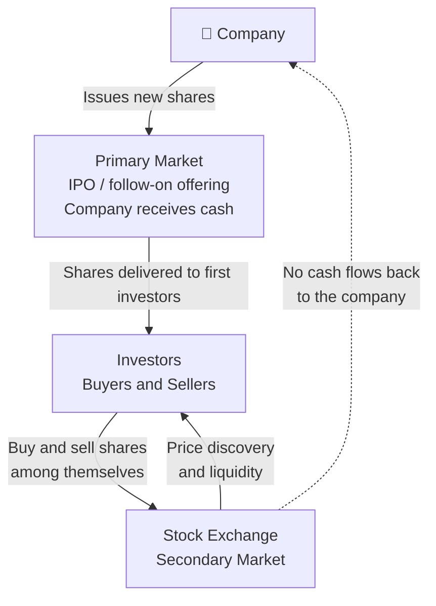

# Part I: Foundation — Markets, History, and Participants

Context, vocabulary, and the people that define exchange markets — the foundation you need before the mechanics make sense.

## Before the Exchange: How Companies Raise Capital

To understand why a financial exchange exists, you first need to understand why anyone bothers issuing shares in the first place. This section is a brief detour into basic corporate finance, the world your exchange is built to serve.

### The Problem of Growth

Imagine a small software company. It has a product, a team, and paying customers, but it wants to grow: hire more engineers, open offices in new countries, and invest in research that will take three years to generate revenue. All of that costs money, far more money than the company currently earns in a month or a quarter.

Where does that money come from? There are three broad categories of answer, and real companies use all three at different stages of their lives.

### Option 1: Retained Earnings (Self-Funding)

The simplest source of capital is the company's own profits. If the company earns more than it spends, it can save that surplus and invest it in growth. This is called **retained earnings**, profits "retained" in the business rather than distributed to owners.

Self-funding is attractive because it involves no outside parties and no obligations. The problem is that it is slow. If the opportunity is time-sensitive, a competitor is building the same product, or a market window is closing, waiting years to accumulate enough internal cash may mean losing the race. Most high-growth opportunities require more capital, faster, than retained earnings can provide.

### Option 2: Debt, Loans and Bonds

The second option is to borrow money. Borrowed money must be repaid, with interest [3]. The cost of borrowing (the interest rate) depends on how creditworthy the borrower is: established, profitable companies with predictable revenues can borrow cheaply; young, risky startups may not be able to borrow at all, or only at very high interest rates.

**Bank loans** are the most familiar form of debt. A company borrows a sum from a bank and repays it over time. This works well for small amounts and short timeframes, but a single bank may not be willing, or able, to provide hundreds of millions of dollars to a single borrower.

**Bonds** solve the scale problem by spreading the borrowing across many lenders. A bond is a standardised piece of debt. A company issues a bond with a **face value** (say, $1,000), a **coupon rate** (say, 5% per year), and a **maturity date** (say, 10 years from now). The investor who buys the bond lends the company $1,000 today. In return, the company promises to pay $50 per year (5% of $1,000) as regular interest payments (these periodic payments are called **coupons**, named after the physical coupon slips investors used to cut off and redeem before the digital age), and to repay the full $1,000 when the bond matures in 10 years.

A large company might issue millions of these bonds simultaneously, raising hundreds of millions of dollars from thousands of individual investors. Those investors later need to be able to sell their bonds if they want their money back before maturity, and so bonds, just like shares, trade on exchanges and electronic markets.

**The key characteristic of debt:** the company has an unconditional obligation to make the promised payments. If it cannot, it is in default, which can lead to bankruptcy proceedings. Bondholders are **creditors**: they have a legal claim against the company's assets. In a bankruptcy, creditors get paid before the company's owners.

### Option 3: Equity, Selling Ownership

The third option is fundamentally different in character: instead of borrowing money and promising to repay it, the company sells a piece of itself.

**Equity** is ownership. When a company issues **shares** (also called **stock** in American English, or **equities** in market terminology), it is dividing ownership of the business into small, standardised units and selling those units to investors [3]. Each unit, each share, represents a proportional claim on the company's assets, earnings, and future.

Here is the important distinction from debt: **there is no promise of repayment**. If you buy a share in a company, the company does not promise to give your money back. It does not promise to pay you any specific amount at any specific time. What you receive instead is ownership.

**What does ownership actually mean?**

- **Residual claim on profits:** If the company earns a profit and its board of directors decides to distribute some of that profit to owners, shareholders receive their proportional share as a **dividend**. Dividends are not guaranteed, the board may decide to reinvest profits in the business instead. But shareholders are entitled to whatever is left over after all expenses and debts are paid. This "residual" or "leftover" claim is the defining characteristic of equity.

- **Capital appreciation:** If the company grows and becomes more valuable, each share becomes worth more. A shareholder who paid $10 for a share and sells it when the company is worth twice as much can sell at roughly $20, realising a **capital gain**. The theoretical upside of an equity position is unlimited, a share can appreciate many times over (Apple has multiplied in value hundreds of times since its IPO). Compare this to a bond, where the return is capped at the promised coupon rate.

- **Voting rights:** Shares typically carry the right to vote on major corporate decisions, electing the board of directors, approving mergers and acquisitions, and other significant matters. Owning 51% of the shares means controlling a majority of votes, which is why "controlling stake" is a meaningful concept.

- **Limited liability:** If the company goes bankrupt, shareholders can lose the money they invested, but nothing more. They are not personally liable for the company's debts. This protection ("limited liability") is a fundamental feature of the modern corporation and one reason equity investment became widespread.

**What does ownership mean for the company?**

Issuing equity capital has an important advantage over debt: the company is not obligated to make regular payments, and there is no maturity date on which it must repay anything. This flexibility is why many high-growth companies prefer equity, they can invest in long-term projects without the burden of fixed interest payments.

The trade-off is **dilution**: selling shares means selling a portion of the company. The founders and early investors own a smaller fraction of the whole. If a founder owned 100% of a company worth $1 million and raises $250,000 by selling a 20% stake to new investors, the company is now worth $1.25 million ($1 million of existing business value plus the $250,000 cash just raised). The founder owns 80% of $1.25 million, still $1 million in absolute terms, but a smaller fraction of the whole. The investors own 20% of $1.25 million = $250,000, exactly what they paid. Managed carefully, dilution is acceptable; managed carelessly, founders can lose control of their own companies.

### The Difference Between Debt and Equity

A useful mental model: when a company issues bonds, it is renting capital, borrowing it with the obligation to return it. When a company issues equity, it is selling a permanent stake, the investor becomes a partial owner, sharing in the future of the business.

The consequence:

| | **Debt (Bonds, Loans)** | **Equity (Shares)** |
|---|---|---|
| Relationship to company | Lender / Creditor | Owner |
| Return | Fixed interest (coupon) | Variable (dividends + capital gains) |
| Repayment obligation | Yes, principal returned at maturity | No |
| Payment priority in bankruptcy | Paid first | Paid last (residual) |
| Risk to investor | Lower (predictable return) | Higher (no guaranteed return) |
| Dilutes ownership? | No | Yes |
| Upside potential | Capped (only the promised coupons) | Unlimited (shares in a successful company grow without limit) |

A sophisticated investor builds a **portfolio** that mixes both: bonds for predictable income and capital preservation, equities for growth potential. The entire investment industry, pension funds, mutual funds, hedge funds, is built around managing this balance.

### Going Public: The Initial Public Offering (IPO)

Early in a company's life, its shares are held by a small, private group: the founders, early employees (who often receive shares as part of their compensation), and **venture capital (VC) investors** who provided early funding in exchange for equity stakes. These shares are not available to the general public; the company is **private**.

At some point, usually when the company has proven its business model and needs a large infusion of capital for the next phase of growth, the company may choose to **go public**: to offer its shares for sale to anyone who wants to buy them. This event is called the **Initial Public Offering (IPO)**.

In an IPO:
1. The company works with investment banks to determine an appropriate share price and to market the offering to large institutional investors.
2. New shares are created and sold, with the proceeds going directly to the company (or to early investors who are "cashing out" their stakes).
3. The company's shares are listed on a stock exchange, NYSE, NASDAQ, LSE, or another regulated market.
4. From that moment, anyone can buy or sell the shares through the exchange.

Recent famous IPOs include Airbnb (2020), Snowflake (2020), and Arm Holdings (2023). Each of these companies raised billions of dollars through their IPOs.

### The Primary Market vs. the Secondary Market

This distinction is critical, and it is where the exchange fits in.

The **primary market** [3] is where new securities are created and sold for the first time. In an IPO, the company sells newly issued shares directly to investors, and the company receives the money. A bond issuance is also a primary market transaction, new bonds are created and the company receives the loan proceeds.

The **secondary market** [3] is where investors buy and sell securities that already exist, trading with each other rather than with the company. When you buy shares of Apple on NASDAQ today, Apple does not receive your money. The person selling you those shares receives it. Apple issued those shares long ago; they have been trading between investors ever since.

**The stock exchange is among the primary venues of the secondary market.** It is the most visible and regulated secondary market venue, but not the only one, OTC secondary trading, private transactions, and alternative trading systems also exist. For practical purposes in this document, when we say "the exchange," we mean a regulated, centralised lit venue; this is where the concepts of price-time priority, order books, and matching engines apply most directly.

This insight is important: the exchange does not help companies raise money directly. It helps investors trade securities they already own. But without the secondary market, the primary market would barely function. Here is why:

Who would invest in a company's IPO if they knew they could never sell their shares? Who would buy a 10-year bond if they had to hold it for exactly 10 years with no way out? The existence of a liquid secondary market, a place where you can sell whenever you want at a fair price, is what makes investors willing to commit capital to companies in the first place. The exchange provides the exit. And the availability of an exit enables entry.

**The primary market and secondary market form a virtuous cycle:**

- Companies raise money in the primary market because investors are willing to commit capital.
- Investors commit capital because the secondary market lets them exit when they choose.
- The secondary market functions well because many investors participate.
- Many investors participate because companies with real value list their shares there.

The stock exchange, the subject of this entire document, is the infrastructure that makes this cycle turn.

### A Word on Other Instruments

The same framework applies to other instruments:

- **Bonds** trade on bond markets (some exchange-based, others over the counter) after issuance. Investors can sell their bonds before maturity, receiving the current market price rather than waiting for repayment.

- **Futures and options** are not claims on existing assets at all, they are contracts about future transactions [12] [13]. Their markets have their own logic, but the exchange's role (centralised matching, price discovery, fairness) is the same. 

- **Exchange-Traded Funds (ETFs)** are baskets of shares (or bonds, or commodities) that themselves trade as a single share. iShares, Vanguard, and SPDR products are examples. ETFs trade on exchanges exactly like individual stocks.

With this foundation in place, understanding what a share is, why companies issue them, and what role the exchange plays, we can now look at the mechanics of how an exchange actually operates.

## What Is a Financial Exchange, and Why Does It Exist?

### The Core Problem

Imagine you own 1,000 shares of a technology company (you understand now what that means: you own a tiny fraction of that company, acquired when you bought the shares from a previous owner on the secondary market) and you want to sell them. Somewhere out there, someone wants to buy exactly 1,000 shares of that same company at roughly the price you have in mind. The problem is finding each other.

Before modern exchanges existed, this "finding" problem was enormous. Stock trading happened in coffee houses, in the street ("Exchange Alley Coffeehouses"), or through networks of personal contacts. One of the first places on record was "Jonathan's Coffee House" (The Forerunner to the Stock Exchange) founded around 1680 by Jonathan Miles, Jonathan's became the primary gathering place for stock brokers, [Jonathan's Coffee-House](https://grokipedia.com/page/Jonathan's_Coffee-House).  Prices were inconsistent, you might sell at one price while, moments later, someone else sold the same shares at a very different price. There was no guarantee you were getting a fair deal, and there was no way to know what "fair" even meant.

> **Auctions by the Candle**
>
> Garraway's Coffee House was opened by Thomas Garway and famed for being the first place in England to retail tea (in 1657). It was quickly rebuilt on a grand scale after the 1666 Great Fire. While Jonathan's focused heavily on shares, Garraway's specialised in commodities, hosting the Hudson's Bay Company's first fur auction in 1671 and later auctioning Australian wool.
>
> Garraway's was legendary for its unique bidding system: an auctioneer would light an inch of tallow candle, and the last bid placed before the flame flickered out won the goods. [Candle Auction](https://en.wikipedia.org/wiki/Candle_auction)

The golden era of the informal Exchange Alley coffeehouses came to a catastrophic halt on March 25, 1748, when a massive fire broke out in Cornhill, destroying Jonathan's, Garraway's, and nearly 100 surrounding buildings. Though both shops were eventually rebuilt, the financial markets were rapidly moving toward formal, dedicated corporate buildings, leaving the casual coffeehouse model behind. 

A financial exchange solves this problem by acting as a **centralised marketplace**, a single place where all buyers and sellers come together, where prices are visible to everyone, and where agreed rules govern who trades with whom at what price. The NYSE was founded in 1792 under a buttonwood tree on Wall Street [10]; NASDAQ launched in 1971 as the world's first electronic stock market [10]. Both exist to solve the same fundamental problem: matching buyers with sellers fairly and efficiently.

It is worth noting that exchanges are among the most visible matching venues, but not the only ones. **Over-the-counter (OTC) markets** (where participants negotiate directly), **Alternative Trading Systems (ATSs)**, **Electronic Communication Networks (ECNs)**, and **internalisers** (brokers who match client orders internally against their own inventory) all also match trades. The concepts in this document apply most directly to regulated exchanges, but the same vocabulary, order book, spread, price-time priority, is used across all these venues.

### The Three Promises of an Exchange

Every exchange makes three implicit promises to its participants:

**1. Price discovery.** At any moment, the current price of an asset reflects the aggregate opinion of all participants currently willing to trade it. You can look at the market and see what "fair value" is right now.

**2. Liquidity.** You can convert your asset into cash (or vice versa) quickly, without having to wait indefinitely for a counterparty to appear. The exchange provides the infrastructure that makes counterparties findable.

**3. Fairness and transparency.** The rules for who trades first and at what price are known in advance, applied consistently, and visible to all participants equally. There is no backroom dealing.

### Instruments: What Is Being Traded?

An exchange does not trade "things" in a physical sense. It trades **instruments**, standardised financial contracts representing ownership or obligation. The most common are:

- **Equities (stocks):** A share represents a small piece of ownership in a company. When you buy one share of Apple (ticker symbol: AAPL), you own a tiny fraction of Apple Inc. NYSE and NASDAQ are primarily equity exchanges.

- **Futures contracts:** An agreement to buy or sell something (oil, gold, a stock index) at a specified price on a specified future date. CME Group is one of the world's largest futures exchanges.

- **Options:** The right (but not the obligation) to buy or sell an instrument at a specific price before a specific date. Cboe is a major options exchange.

- **Foreign exchange (FX) pairs:** The price of one currency expressed in another, such as EUR/USD (how many US dollars one Euro buys). FX trades largely on electronic networks rather than centralised exchanges, though the principles are similar.

An equity exchange handles each **symbol** (like AAPL, MSFT, or TSLA) as a separate tradeable instrument, each with its own independent order book.

## The Language of the Market: A Short History

Before you read about participants, orders, and matching engines, it is worth pausing on something that will serve you well throughout your career working on exchange systems: **much of the language you will encounter in this codebase has historical roots that no longer match the physical reality**. Terms that sound arbitrary or old-fashioned are fossil words, the language of a world of wooden desks, brass bells, and paper ledgers that gradually evolved into the nanosecond world of today. Understanding where the words came from will make them stick, and will save you from wondering why a system full of cutting-edge software keeps referring to things like "the book," "the tape," and "the floor."

### The Physical Book

Before electronic trading systems, every major exchange operated a physical trading floor, and on that floor, for every stock, there was a person responsible for maintaining order: in NYSE's terminology, this was called the **specialist**. The specialist's job was to act as a market maker for their assigned stocks, and to maintain, literally on paper, a record of every outstanding buy and sell order that had been submitted but not yet filled.

This record was kept in a physical **ledger book**. The book was divided into two columns: one for buy orders (bids) listing each buyer's offered price and quantity, and one for sell orders (asks) listing each seller's demanded price and quantity. The specialist would review the book, try to match buyers with sellers, and maintain an orderly market by quoting prices to floor brokers who came to trade.

When a broker wanted to buy shares and asked "what's the market in IBM?", the specialist would look at their book and say, for example, "fifty-five for five hundred, five hundred at fifty-five and a quarter", meaning the best available buyer was offering $55 for 500 shares, and the best available seller was asking $55.25 for 500 shares. The specialist was reading, live, from their paper book.

The physical book is gone. Every exchange in the world now maintains its order book in computer memory, with data structures designed for nanosecond access. But the **name** has survived completely intact. When developers and traders today say "the book," "working an order into the book," "resting in the book," or "taking from the book," they are using the exact same language that floor traders used when pointing at a physical ledger. The order book is one of the purest examples of terminology that crossed from physical to digital without losing a syllable.

### Open Outcry and the Pit

On exchange floors like CME Group's in Chicago, trading in futures contracts was conducted through **open outcry**, a method where traders stood in a sunken circular area called a **pit** and literally shouted their bids and asks at each other, using a combination of voice and hand signals to communicate price, quantity, and direction. The noise was enormous. The system worked because the pit was small enough that everyone could hear and see everyone else.

The CME Group operated open outcry pits for decades. Some products, particularly certain agricultural and options contracts, continued in open outcry long after equity markets went fully electronic, largely because the pit handled complex, illiquid products where human negotiation had genuine advantages. CME substantially wound down its open outcry operations in 2015 [9], though some niche trading still occurs. The physical pit is where terms like "floor broker" (a broker who executes trades on the physical floor), "floor trader" (a trader who trades for their own account from the floor), and "pit committee" originated.

The terms survive in documentation, regulations, and informal industry speech even though the pits themselves are mostly silent now.

### The Ticker Tape

Before electronic screens, prices of completed trades were published via the **stock ticker**, a telegraph-based machine, invented by Edward Calahan in 1867 [15] and later improved by Thomas Edison, that printed a continuous stream of abbreviated stock symbols and trade prices on a narrow paper tape. The tape moved fast (hence "ticker", the machine made a ticking sound) and the strip of paper would pile up on the floor of brokerages around the country as trades printed in real time.

Reading the tape was a skill. A **tape reader** was someone who could watch the continuous stream of prices and volumes and infer what institutional buyers and sellers were doing, one of the earliest forms of technical analysis. An even earlier form of market observation appears in Joseph de la Vega's *Confusión de Confusiones* (1688) [4], the oldest known book about stock trading, written in Amsterdam about the VOC share market, which describes participants reading order flow and inferring intent from patterns of buying and selling.

In 1878, the phone was invented. In 1929, the first electronic ticker was installed. By the 1960s, electronic displays began replacing paper. Today, the "ticker" refers to the digital price feeds streaming across screens in every trading firm, brokerage, and financial news channel, and the **ticker symbol** (AAPL, MSFT, GOOG) is the abbreviated code printed on the old paper tape.

When you see terms like "tick" (the minimum price movement), "tick data" (a record of every trade), or "ticker plant" (the server infrastructure that publishes market data), you are using the language of a machine that ran on telegraph cables and printed on paper strips.

### Settling Up: Settlement Periods and Why They Exist

The historical reason settlement took multiple days has nothing to do with technology and everything to do with physical logistics. In the era of paper stock certificates, when you sold your shares, you had to physically deliver a paper certificate to the buyer, and they had to physically deliver cash or a cheque to you. Messengers on bicycles carried these documents between brokerage firms on Wall Street. Giving everyone five business days (the original settlement period was T+5) provided time for paperwork to move across Manhattan, be checked, and be processed.

As the industry moved to dematerialisation (electronic records replacing paper certificates) and electronic funds transfer, settlement windows shrank: T+5 became T+3 in the 1990s, T+2 in 2017, and T+1 in 2024 in the US [8]. The "T+N" notation remains standard even as the N shrinks. Some markets are exploring same-day (T+0) settlement, though this requires that cash and securities be available at the exact moment of trading, a more demanding operational requirement.

### Blue Chips, Bulls, and Bears

Not all inherited terminology has to do with physical infrastructure. Some comes from adjacent worlds:

**Blue chip** stocks are large, well-established, financially sound companies, the most prestigious tier of the equity market. The term comes from poker: in casino chips, blue has traditionally been the highest denomination. The first recorded use in finance was by Oliver Gingold at Dow Jones in 1923, who described stocks trading at $200 or more per share as "blue chip stocks." [14]

**Bull market** (rising prices) and **bear market** (falling prices) have disputed origins, but the most widely cited explanation refers to how each animal attacks: a bull thrusts its horns upward, a bear swipes its paws downward. The terms appear in financial writing as early as the 18th century. Today, a market that has fallen 20% or more from a recent peak is formally defined as a bear market; a sustained rise of 20% or more from a trough is a bull market.

**Going long** and **going short** have roots far older than stock markets. Their origin lies in the physical trade of commodities, grain, spices, metals, cloth, timber, and other durable goods, that dominated commerce for centuries before financial securities existed.

A merchant in a 17th-century Amsterdam or London trading house who had purchased a large stock of grain and was storing it in a warehouse was described as being **long** in grain [4]. The word captured two ideas simultaneously: first, that they *possessed* the goods, they owned something tangible, in their hands, in their warehouse; and second, that durable goods could be held *over time*. Grain kept through winter. Spices kept for years. Metal did not spoil. A merchant who was "long" in such goods had an inventory that would *last a long time*, goods with longevity. The root connection is direct: long as in duration, as in possession extended through time.

This is still exactly what "going long" means in modern finance: you own the asset and you are exposed to its price over time. If you buy shares of a company and hold them, you are long those shares. If the price rises, your long position profits; if it falls, it loses. Nothing about the meaning has changed, only the asset has shifted from sacks of grain in a warehouse to electronic records in a clearing house.

**Going short** comes from the opposite situation: a merchant who had promised to deliver goods they did not yet possess. In forward contracts, common in the grain and commodity markets of the 17th and 18th centuries, a seller would commit to deliver a quantity of goods at a future date and price. If they had sold more than their warehouse contained, they were "short" of the goods, deficient, lacking, falling short of their obligations. The same word family as "we are short of supplies," "he fell short of expectations," or "shortage." Being short meant your inventory was insufficient to cover what you had committed to deliver. You would need to go into the market and buy before the delivery date, hoping prices had fallen so you could profit on the difference.

The Dutch East India Company (VOC), founded in 1602 and traded on the Amsterdam Exchange from that same year, pioneered many instruments still in use today, transferable shares, dividend payments, and the secondary market in those shares [5] [11], and became the arena for what is likely the first recorded large-scale short selling operation in financial history: in 1609, a merchant named Isaac Le Maire organised a group of traders to sell VOC shares they did not own, betting the price would fall so they could buy them back cheaply before delivery [5]. The scheme was disruptive enough that the Amsterdam city council attempted to ban short selling the following year, the earliest known attempt to regulate the practice [5]. It did not stick; short selling has been controversial, periodically banned, and always present in markets ever since.

"Long" and "short" thus carry the physical memory of a world where trading meant moving real goods between warehouses and ships. A developer reading `last_sell_price` or `position += signed_qty` in the matching engine's clearing code is working with concepts that a 17th-century spice merchant would have recognised immediately, even if the technology would be unrecognisable to them.

### The Operational Mechanics of Short Selling, Borrow and Locate

The historical explanation above describes the *economics* of short selling. The modern operational reality involves several additional steps that are invisible in the exchange's order book but fundamental to how clearing and settlement actually work.

**You must borrow before you short.** Before a participant can sell shares they do not own, they must first arrange to borrow those shares from someone who does own them. This is called the **locate** process, finding and reserving a source of borrowable shares. In the US, Regulation SHO (adopted by the SEC in 2005) mandates that broker-dealers must have a reasonable grounds to believe shares can be borrowed before accepting a short sale order. Selling short without a locate is called **naked short selling** and is generally illegal.

**Where the borrow comes from.** Shares available to borrow come primarily from long investors who hold shares in custody through a broker or prime broker. These holders consent (usually automatically through their account agreements) to their shares being lent out in exchange for a **lending fee**. The custodian or prime broker intermediates: they find willing lenders and lend the shares to the short seller. The short seller pays a daily lending fee (the **borrow rate**) while the position is open.

**Borrow rates and hard-to-borrow stocks.** Most large-cap, liquid stocks are "easy to borrow", borrow rates are near zero because many shares are available. Smaller, heavily-shorted, or thinly-traded stocks can be "hard to borrow", rates of 5%, 20%, or even higher per annum, applied daily. For a stock with a 50% annualised borrow rate, a short position held for one week costs roughly 1% just in borrowing costs, before considering any price movement. The difficulty of finding borrows can itself become a market signal: rising borrow rates indicate increasing short interest and limited available supply.

**Short recall risk.** The lender can recall their shares at any time (with short notice). If the lender sells their shares or instructs their custodian to recall the loan, the short seller must return the shares immediately, either by buying in the open market (a **buy-in**) or finding a new lender. In volatile markets, recalls at inopportune moments can force short sellers to cover at bad prices.

**Settlement obligation.** At settlement (T+1 in the US), the short seller must deliver the shares. They do not own them, they borrowed them. Their clearing position shows a negative (short) holding. The CCP ensures delivery; if the short seller fails to deliver, the failed settlement process applies.

**Why this matters for exchange developers.** The exchange's matching engine processes short sales exactly like any other sell order, the distinction between a short sale and a long sale is invisible at the order book level. The matching engine does not know or care whether the seller owns the shares. The borrow and locate process happens entirely outside the exchange, in the prime brokerage and custody infrastructure. However, exchange reporting systems are required to flag short sales (in the US, short sale orders must be marked "short" in the FIX message and this appears in the audit trail), and some regulatory checks at the gateway level confirm the short sale flag is present.

**Broker** itself is an old word. The word "broker" traces back to Middle English (brocour) and Anglo-Norman (abrocour), originally referring to a middleman, small trader, or wine merchant. It referred originally to a person who "broaches" (opens) a cask and sells the wine retail, an intermediary between producer and consumer. By the late medieval period it had generalised to any trade intermediary, and it has carried that meaning into finance.

### Wall Street

**Wall Street** is named after an actual wall, a wooden palisade built in 1653 by Dutch colonists along the northern edge of their settlement (then called New Amsterdam, now Lower Manhattan) to protect against British and Native American incursions. The wall is long gone; the street that replaced it became the financial centre of America, and now "Wall Street" is a metonym for the entire US financial industry, regardless of where the actual firms are physically located.

### Why This Matters for You

When you encounter a term in the codebase that seems oddly concrete for a piece of software, "the book," "the tape," "the spread," "the floor price," "tick by tick", the reason it sounds physical is that it *was* physical. These words have been used continuously, with the same meanings, through every technological revolution the industry has undergone, because the underlying concepts remained constant even as the implementation changed completely.

This is also why you will find financial terminology resistant to renaming even when better alternatives exist. Saying "priority queue" instead of "the book" would be technically precise but professionally unintelligible. Finance is a conservative industry with deep institutional memory, and the vocabulary is part of that memory. Learning the words, and where they came from, is learning the culture.

## The Participants

Before diving into mechanics, it helps to know who is actually in the room.

### Traders (Regular Participants)

The most familiar participant is someone with a view on a stock's future price, they want to buy low and sell high, or sell high and buy back cheap. Individual investors, hedge funds, and asset managers all fall into this category. In exchange terminology, when they submit an aggressive order that immediately executes against resting orders in the order book (the digital ledger of all outstanding buy and sell orders, see *The Language of the Market* in Part I), they are called **takers**, they are "taking" liquidity that was already available.

### Market Makers

This is a concept worth understanding deeply, because it is central to how exchanges actually work in practice, and because the exchange system you are building contains a significant amount of code dedicated specifically to managing market makers.

A **market maker** is a professional participant who continuously quotes both a buy price and a sell price for an instrument. They are simultaneously willing to buy from anyone who wants to sell, and to sell to anyone who wants to buy. In exchange for taking on this obligation, they earn the **spread**, the small gap between the price they will buy at and the price they will sell at. Market makers are the reason you can usually buy or sell a stock immediately without waiting for a human counterparty to appear. Their standing orders are already in the book, waiting.

NYSE has what it calls **Designated Market Makers (DMMs)**, specific firms assigned to each stock with obligations to maintain fair and orderly markets. Nasdaq calls them **Market Makers**. Eurex, the European derivatives exchange, runs a formal **Market Making Programme** with contractual quoting obligations. When a market maker's resting order is later filled by someone else's incoming order, the market maker is called a **maker** (they "made" liquidity available). The person whose order triggered the fill is the **taker**. Exchanges frequently give makers a fee rebate and charge takers a fee, to incentivise the provision of liquidity.

> **Key idea:** Market makers earn the spread by continuously providing two-sided quotes, a standing bid and ask, making it possible for others to trade immediately at any time. They are not passive: their position changes with every fill, and they must manage inventory and information risk in real time. The *Market Makers* section of Part II examines the full operational detail: formal obligations, what happens when a quote is hit, protection mechanisms, and the software implications of supporting them.

### Brokers

A broker does not trade for their own account. They act as an intermediary: they receive orders from clients and submit them to the exchange on the client's behalf. Prime brokers provide additional services like lending and clearing.

### The Exchange Itself

The exchange is not a passive infrastructure provider. It is a regulated entity that enforces rules, monitors for manipulation, reports trades to regulators, and ensures the market functions fairly. In many jurisdictions, exchanges are themselves public companies listed on exchanges (NYSE's parent company, ICE, is listed on NYSE; NASDAQ lists on Nasdaq).

> **Note, quotes vs orders:** Throughout this document, the terms "order" and "quote" are sometimes used to describe resting instructions in the book. Operationally they are different: a **quote** is a two-sided bid/ask pair submitted by a market maker (a single instruction generating two linked legs), while an **order** is a one-sided instruction submitted by any participant. A quote may internally generate one or two order records with linked identifiers; quote IDs and order IDs may differ. The *Market Makers* section of Part II covers this distinction in detail.

## A Brief Tour of Real-World Exchanges

To ground these concepts in reality, here is a brief overview of the exchanges most relevant to exchange system developers.

### NYSE (New York Stock Exchange)
Founded in 1792, NYSE is the world's largest equity exchange by market capitalisation of listed companies. NYSE is a **hybrid market**, it combines electronic order matching with **Designated Market Makers (DMMs)** who have responsibilities to maintain fair and orderly markets and can intervene manually in certain situations. NYSE uses price-time priority and runs opening and closing auctions. Its closing auction is one of the most important pricing events in global finance.

### NASDAQ
NASDAQ launched in 1971 as the world's first fully electronic stock exchange. It is home to many of the world's largest technology companies (Apple, Microsoft, Amazon, Google). NASDAQ is a pure electronic market, no floor traders, no DMMs in the traditional sense. It pioneered the technology approach to exchange operation and drove down transaction costs dramatically.

### CME Group (Chicago Mercantile Exchange)
CME Group is the world's largest futures exchange, operating CME, CBOT (Chicago Board of Trade), NYMEX, and COMEX. Futures contracts on everything from interest rates to agricultural commodities to weather indices trade here. CME uses the Globex electronic trading platform, which processes millions of orders per day. CME uses both price-time priority and pro-rata allocation depending on the product.

### Eurex
Part of Deutsche Börse Group, Eurex is Europe's largest derivatives exchange, headquartered in Frankfurt. Eurex is known for its sophisticated market making programmes and its strict but fair treatment of high-frequency trading. The Eurex T7 trading system is used by multiple exchanges globally. Eurex introduced the concept of formally structured market maker obligations with MMP protection.

### LSE (London Stock Exchange)
The LSE is one of Europe's oldest exchanges, dating to the 17th century coffee houses. It trades equities, bonds, and ETFs. The LSE uses the SETS (Stock Exchange Electronic Trading System) for liquid equities and runs opening and closing auctions. The LSE's Millennium Exchange technology platform is used by dozens of exchanges globally.

### IEX (Investors Exchange)
IEX launched as a dark pool in 2013 and became a registered national securities exchange in 2016. It is the exchange that popularised the speed bump, deliberately leveling the playing field between HFT firms and institutional investors. IEX remains smaller than NYSE and NASDAQ but influential in ongoing debates about market structure fairness.

### Cboe (Chicago Board Options Exchange)
Cboe is the world's largest options exchange, operating Cboe, C2, BZX, BYX, EDGX, and EDGA exchanges. Cboe invented the listed options market in 1973. It calculates the VIX (Volatility Index, the "fear gauge" of the market) from options prices.

### JPX (Japan Exchange Group)
JPX was formed in 2013 by merging the Tokyo Stock Exchange (TSE) and Osaka Securities Exchange. It is the world's third-largest exchange by market capitalisation of listed companies, behind NYSE and NASDAQ. JPX operates on an all-electronic platform called arrowhead. Japanese markets have their own session structure, tick size rules, and circuit breaker conventions; the daily price limit system (where trading in a stock is suspended if it moves more than a set amount from the previous close) differs from the US LULD approach.

### HKEX (Hong Kong Exchanges and Clearing)
HKEX is the primary exchange for Hong Kong-listed equities and also provides the main electronic gateway for mainland China stocks through the Shanghai-Hong Kong Stock Connect and Shenzhen-Hong Kong Stock Connect programmes. Stock Connect allows international investors to trade China A-shares (mainland China stocks) and allows mainland investors to trade Hong Kong-listed stocks through a northbound/southbound quota system, a unique regulatory and technical arrangement that requires matching engines on both sides to coordinate.

### SGX (Singapore Exchange)

SGX is Southeast Asia's largest exchange, trading equities, derivatives, and fixed income. It is notable as a hub for Asian futures contracts, Nikkei 225 futures, MSCI Asia index futures, and iron ore contracts all trade on SGX. SGX acquired Scientific Beta (factor indices) and has invested heavily in data analytics services alongside its exchange operations.

### ASX (Australian Securities Exchange)

ASX serves the Australian equity and derivatives markets. It became notable in the technology community for its attempt to replace its CHESS (Clearing House Electronic Subregister System) settlement platform with a blockchain-based system, a project that was eventually cancelled in 2022 after years of development, at significant cost. The cancellation is a cautionary tale for exchange technologists about the risks of replacing proven settlement infrastructure with unproven technology.

