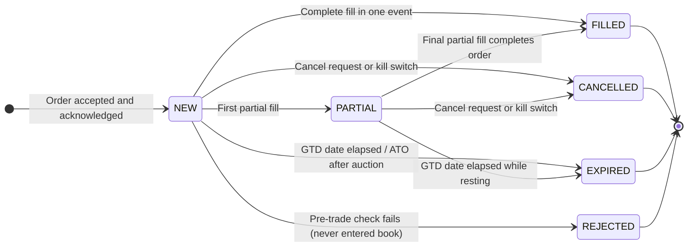
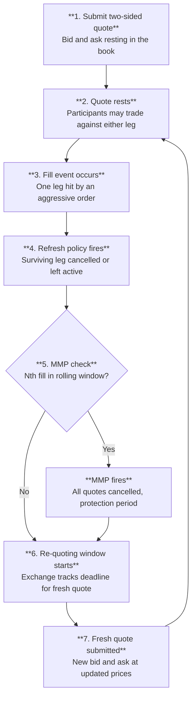
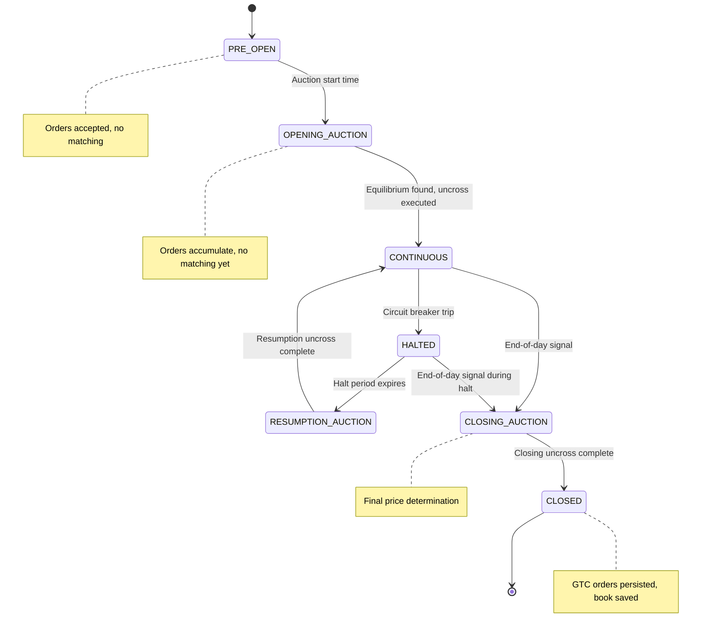

# Part II: Orders, Matching, and the Trading Day

*How orders work, how the matching engine processes them, and how a complete trading day unfolds from open to close.*

**Part Summary:**
Move from concepts to mechanics: how participant intent is encoded in order types, how matching logic enforces fairness, and how the trading session progresses from open through close.

**Learning Objectives:**
- Read an order ticket and understand each field's execution implications.
- Compare major order types and time-in-force instructions by risk and behavior.
- Trace how price-time priority and order book state changes produce trades.
- Describe the end-to-end lifecycle of a trade across a full trading day.

**Content:**
- The Order: The Fundamental Unit
- Order Types, The Vocabulary of Intent
- Time-In-Force, How Long Should the Order Live?
- The Order Book, The Exchange's Memory
- Price-Time Priority, The Fairness Rule
- The Matching Engine, The Heart of the Exchange
- The Life of a Trade
- Market Makers, The Providers of Liquidity
- The Opening and Closing Auction
- Trading Sessions, The Day in the Life of a Market
- Putting It All Together


## The Order: The Fundamental Unit

Everything in an exchange system revolves around the **order**. An order is an instruction from a participant to the exchange: "I want to buy (or sell) a certain quantity of a certain instrument, subject to certain conditions."

Every order carries several key pieces of information:

### Symbol
Which instrument. "AAPL" means Apple shares; "MSFT" means Microsoft. The exchange handles a separate order book for each symbol.

### Side
**BUY** or **SELL**. Deceptively simple, but it defines everything about how the order interacts with the book.

### Quantity
How many shares (or contracts, or lots) the participant wants to trade. This is typically a positive integer. The term **lot** refers to the standard unit of quantity. For equities, one lot is usually one share, though some markets (particularly Asian exchanges) define a minimum lot size.

### Price (for limit orders)
The maximum price the buyer will pay, or the minimum price the seller will accept. Orders submitted without a specific price are **market orders** (described below).

### Time-In-Force
How long the order remains valid. This is so important it gets its own section below.

### The Arrival Timestamp
When the exchange received the order, recorded to nanosecond precision. This is not just metadata, it is a critical part of the fairness mechanism, as you will see when we discuss price-time priority.

### Identity
Which gateway (participant connection) submitted the order. The exchange uses this for self-match prevention, kill switches, and regulatory reporting.

## Order Types, The Vocabulary of Intent

The type of an order describes the conditions under which it should execute. Understanding order types is fundamental to understanding exchange system code, because the matching engine has different logic for each type.

### Limit Orders

A **limit order** says: "I am willing to trade at this price or better, but no worse."

- A buy limit order at $150.30 says: "Fill me at $150.30 or cheaper, but never at $150.31 or higher."
- A sell limit order at $150.35 says: "Fill me at $150.35 or higher, but never at $150.34 or lower."

The word "limit" refers to the price limit the participant is imposing. If an incoming limit order cannot immediately find a counterparty at an acceptable price, it **rests** in the order book, waiting. Resting orders are also called **passive orders**, they are not actively seeking to trade; they are waiting to be found.

Limit orders are by far the most common order type in most markets.

### Market Orders

A **market order** says: "Fill me immediately at whatever the current market price is." There is no price constraint. The exchange executes it against the best available resting orders immediately.

Market orders maximise the probability of immediate execution, but execution is still subject to available liquidity, the current exchange state, risk controls, and regulatory protections. A market order submitted during a trading halt, against an empty book, or at a price outside a circuit-breaker band will not fill. In normal continuous trading conditions, market orders can be treated as effectively execution-guaranteed, but not price-guaranteed. If you submit a large market buy order in a thin market, you might sweep through several price levels and pay far more than intended, this is called **market impact** or **slippage**. Market orders are used when certainty of execution matters more than certainty of price.

Because they have no price to wait at, market orders cannot rest in the book. If they cannot immediately fill, they are cancelled.

### Stop Orders

A **stop order** sits dormant until the market price reaches a specified trigger level (the **stop price**). When triggered, it converts to another order type and enters the book.

- A **stop-loss order** is a sell stop: "If the price falls to $145, automatically sell for me." Used by investors to automatically exit a losing position and limit further losses.
- A **buy stop** triggers when the price rises to the stop price. Used to enter a position on upward momentum: "If the stock breaks above $155, buy it, that confirms the uptrend."

Stop orders do not sit in the regular bid/ask book, they are held in a separate dormant queue and injected into the book only when triggered. It is worth noting that stop orders are not universally supported natively at the exchange level: some exchanges handle stops internally as described here; others leave stop order logic to brokers or client-side systems, sending only the resulting limit or market order to the exchange once the trigger is reached. The exchange system you are building handles stops natively, this is a deliberate design choice.

### Stop-Limit Orders

A **stop-limit order** is a stop order that, when triggered, converts to a **limit order** rather than a market order. This gives the trader price protection but introduces the risk of non-execution.

Example: A sell stop-limit with a stop price of $145 and a limit price of $144. When the market falls to $145, the order converts to a sell limit at $144. It will only execute at $144 or better. If the market drops sharply past $144 (a "gap"), the order sits unfilled. Compare with a plain stop order, which converts to market and fills at whatever price is available, guaranteed execution, but potentially at $140 instead of $144.

Neither is universally better; the choice depends on whether the trader prioritises execution certainty (stop-market) or price certainty (stop-limit).

### Trailing Stop Orders

A **trailing stop** is a stop order with a twist: the stop price automatically adjusts as the market moves in a favourable direction, but freezes when it moves against the position.

Example: You bought shares at $150. You set a sell trailing stop with an offset (also called the **trail distance**) of $5.00. The stop starts at $145. If the price rises to $160, the stop rises to $155. If the price then rises to $170, the stop rises to $165. But if the price then falls back to $167, the stop freezes at $165, it cannot move down, and will trigger a sale if the price continues falling and reaches $165.

The mechanism that advances the stop in the favourable direction is called the **ratchet**, like a mechanical ratchet that only moves in one direction. The trail offset is stored as a fixed distance, and the ratchet advances by subtracting this offset from each new high-water-mark price.

### How a Trailing Stop Actually Executes

This is a point of frequent confusion, so it deserves careful explanation.

**The trailing stop is not a resting sell order in the book.** Before it fires, it is completely invisible to the market, held in a separate dormant queue inside the matching engine, with no presence in the bid or ask side of the order book. It does not compete with other sell orders. It does not queue behind them. It simply waits, monitoring the last trade price as each fill occurs.

The question "how can a trailing stop ever execute if there is always a better sell order in the book?" contains a false premise: the trailing stop is not *in* the book. Other sellers at higher prices are irrelevant to it.

**What happens when the stop triggers.** When the last traded price falls to or below the stop price, the trailing stop converts into a **market sell order** and is injected into the book. A market sell order goes directly to the *buy side*, it matches against the best available bid. Other sell orders are completely irrelevant at this point. The market sell does not queue behind limit sells; it sweeps across to the buyers.

To make this concrete with the example above: the stop price has ratcheted up to $165. The price starts falling. At $165.50, nothing. At $165.01, nothing. At $165.00, the stop triggers. A market sell order is born and immediately matches against whatever buyer is sitting at the top of the bid queue. If the best bid is $164.95, the fill occurs at $164.95. The trailing stop has executed.

**The common mental model that causes confusion.** People sometimes imagine the trailing stop as a limit sell order sitting in the book at $165, waiting in the queue behind other sellers who are already there. Under that mental model, yes, it seems like it could never execute, because better-priced sellers would always be ahead of it. But that mental model is wrong. A trailing stop is a trigger and a market order, not a limit order competing for queue position.

**The trade-off.** Because the trailing stop fires as a market order, execution is guaranteed (assuming buyers exist) but price is not. In a fast-moving market the price may have dropped well below the stop price by the time the market order fills. This is the same gap risk that applies to all stop orders: the stop triggers at $165 but if the market is falling quickly and the best bid is $162, that is where the fill occurs.

Trailing stop logic is not universally implemented at the exchange level. On some venues it is handled client-side (the trading algorithm tracks the high-water mark and adjusts the stop price manually), on others broker-side, and on others natively within the matching engine. Wherever it is implemented, the ratchet behaviour and the dormant-then-market-order execution model are the same.

### Iceberg Orders

An **iceberg order** (also called a **reserve order** or **hidden order**) is a large order that conceals most of its size. It shows only a small visible portion, the **peak** or **tip**, to other participants. When the visible portion is consumed by fills, the order automatically replenishes from its hidden reserve, showing a new peak.

Why would someone want this? If you need to buy 100,000 shares, showing the full size in the book signals your intention to the entire market. Other participants may raise their ask prices or front-run your order before you can fill it. By showing only 1,000 shares at a time, you hide your true intent and reduce your **market impact**.

The trade-off is **queue priority**: each replenishment gets a fresh timestamp and goes to the back of the queue at that price level, rather than retaining the position of the original order. The exchange's other participants can see that an iceberg is present (the order keeps replenishing at the same price), but not how large the hidden reserve is.

Iceberg orders are widely used by institutional investors and market makers on exchanges like the LSE, Euronext, and Deutsche Börse.

### Hidden Liquidity, Priority Rules, and Midpoint Orders

Different exchanges treat hidden liquidity differently, and the rules matter for developers building order management systems.

**Displayed vs hidden priority:** On some exchanges, fully displayed (non-iceberg) orders at a given price level have strict priority over hidden or iceberg orders at the same price, even if the iceberg arrived earlier. The reasoning: participants who take the risk of displaying their intentions publicly should be rewarded with better queue position. On other exchanges, FIFO applies equally to hidden and displayed orders, first in, first out regardless of visibility. Knowing which rule applies on a given venue determines how institutional participants choose between iceberg and fully disclosed orders.

**Reserve refresh priority:** When an iceberg replenishes, a new peak appears from the hidden reserve, most exchanges treat the replenishment as a new order submission for queue purposes: it goes to the back of the queue at that price. This "back-of-queue on refresh" rule means icebergs that replenish many times lose priority relative to new participants arriving at the same price. Some venues implement partial priority preservation, but "back of queue on refresh" is the most common.

**Midpoint peg orders:** A **midpoint peg order** is an order whose price continuously tracks the current mid price (the average of the best bid and best ask). It never displays at a price, it sits invisibly, adjusting to the mid in real time. It executes only when a counterparty arrives whose order is also willing to trade at the midpoint. Midpoint peg orders are common in dark pools and supported by some lit venues, most notably IEX.

**Why would any counterparty accept this when there are better-priced limit orders in the book?**

This is the question that stops most people when they first encounter midpoint pegs, and the answer dismantles the confusion immediately: *the midpoint is a better price than the quoted ask for a buyer, and a better price than the quoted bid for a seller*. Both parties benefit compared to a standard trade at the quoted prices. There is no sacrifice involved.

Consider the numbers:

| | Price |
|---|---|
| Best bid (highest buyer) | $150.30 |
| Best ask (lowest seller) | $150.35 |
| **Mid price** | **$150.325** |

A standard market buy fills at the **ask**: $150.35. A midpoint peg buy fills at the **mid**: $150.325. The midpoint peg buyer pays $0.025 *less* per share than if they had bought at the quoted ask.

A standard market sell fills at the **bid**: $150.30. A midpoint peg sell fills at the **mid**: $150.325. The midpoint peg seller receives $0.025 *more* per share than if they had sold at the quoted bid.

Neither party is giving anything up. Both are doing better than the quoted market price by half the spread, they are sharing the spread between them rather than each paying it in full to the market maker. This is not a compromise; it is a joint saving.

**A worked example.**

An institutional investor wants to buy 200,000 shares of AAPL. The book shows:
- Best bid: $150.30 / 10,000 shares
- Best ask: $150.35 / 10,000 shares
- Mid: $150.325

*Option A, aggressive market order:* Fill the entire 200,000 shares by sweeping the ask side. The first 10,000 fill at $150.35, then the next level, and so on. The average fill price will be well above $150.35 due to market impact. Transaction cost: spread paid on every share, plus significant slippage.

*Option B, midpoint peg in a dark pool:* The buyer submits a midpoint peg buy for 200,000 shares in a dark pool. The order sits invisible, pegged at $150.325. Separately, a pension fund that wants to sell 200,000 shares submits a midpoint peg sell in the same dark pool.

The dark pool matches them: 200,000 shares trade at $150.325.

- Buyer paid $150.325 instead of $150.35, saving $0.025 × 200,000 = **$5,000**.
- Seller received $150.325 instead of $150.30, gaining $0.025 × 200,000 = **$5,000**.
- The spread of $0.05 was split equally. Total joint saving: $10,000 compared to trading at the quoted prices.

Neither party showed their intention in the lit book, avoiding the price impact of a visible 200,000-share order. Both traded at a price inside the spread. This is the proposition that makes midpoint pegs attractive.

**Who uses midpoint pegs?**

Midpoint pegs are primarily used by institutional investors, mutual funds, pension funds, hedge funds, who have large orders, are price-sensitive, and are not urgently time-pressured. They have enough time to wait for a natural counterparty at the midpoint. High-frequency traders and market makers generally do not use midpoint pegs because they need execution certainty, not price improvement at the cost of uncertain timing.

**The trade-offs.**

The critical limitation is that **there is no guarantee of execution**. A midpoint peg buy will only fill if a seller willing to trade at the midpoint appears. In a liquid market this may happen quickly. In a thin or one-sided market the order may wait indefinitely. If the market moves strongly against you while you wait, the price rises while you hold a midpoint peg buy, the opportunity to buy at the original mid price may have passed by the time a counterparty appears. The participant must accept that improved price comes at the cost of execution certainty.

The mid price itself also moves continuously. An institution submitting a midpoint peg at $150.325 may find the mid has moved to $150.50 by the time it fills, if the market has drifted. The pegged price tracks the mid; the participant does not control the final execution price precisely, only that it will be the mid whenever the fill occurs.

**Midpoint pegs in dark pools vs lit venues.**

In a dark pool, the entire book is hidden, so a midpoint peg buyer and a midpoint peg seller can find each other without either revealing their interest to the lit market. The dark pool operator runs a separate matching process against the midpoint.

On IEX (a lit exchange), midpoint pegs work slightly differently. The midpoint peg sits passively at the mid. An *aggressive* order, a sell order willing to accept a price at or below the mid, arrives from a participant routing to IEX. That aggressive sell is priced at or below $150.325 and matches the resting midpoint peg buy at the mid. The aggressive seller "crosses to mid" by accepting the mid price instead of demanding the full ask. They receive $150.325, still better than the bid ($150.30), and the midpoint peg buyer gets their fill at $150.325 instead of paying the ask ($150.35). IEX's speed bump (350 microseconds) is relevant here: it prevents fast-moving quotes from making the midpoint stale before the fill occurs, ensuring the mid price used in the match is genuinely current.

**The developer perspective.**

The matching engine must handle midpoint pegs as a separate priority queue that sits parallel to the regular price-time priority book. The mid price must be recalculated on every book update (every time the best bid or best ask changes). The midpoint peg queue must be checked against incoming orders and against each other. The fill price for a midpoint peg match is not a stored order price, it is computed dynamically at match time as (best_bid + best_ask) / 2, requiring care with rounding to the nearest valid tick.

### OCO Orders (One-Cancels-Other)

An **OCO order** is a pair of orders linked together by a rule: if either order fills (or is cancelled), the other is automatically cancelled.

Classic use case: You own shares bought at $200. You want to take profit if the price rises to $215, but also automatically cut your losses if it falls to $185. You submit:
- Order A: Sell limit at $215 (take-profit)
- Order B: Sell stop at $185 (stop-loss)
- Linkage: these are an OCO pair

Only one of A or B will ever execute. Whichever triggers first cancels the other. This is called a **bracket order**, the position is "bracketed" between a profit target above and a loss limit below.

OCO orders are a standard feature of most professional trading platforms and are supported by exchanges including CME and CBOE.

### Combo Orders

A **combo order** (also called a **spread order** or **strategy order**) is a single instruction to simultaneously execute orders in multiple instruments. Each component is called a **leg**. [12]

Example: A **pairs trade**, buy 100 shares of AAPL and sell 50 shares of MSFT simultaneously, treating the combined position as a single trade. The trader believes AAPL will outperform MSFT relative to each other, and wants to be exposed only to the relative difference between them, not to overall market direction.

Combo orders are critical in derivatives markets. On CME, a futures trader might simultaneously buy a March contract and sell a June contract on the same underlying, a **calendar spread**. Eurex offers a rich set of combination strategies for options, including straddles (buy a call and buy a put at the same strike), strangles (buy a call and buy a put at different strikes), and butterflies (three strikes, two legs long and one short in a specific ratio).

The execution challenge is **leg risk**: if one leg fills and the other does not, the trader is left with an unintended one-sided position. Production exchange systems handle this with sophisticated combo matching engines; simpler systems accept the leg risk explicitly.

### Implied Orders, Synthetic Liquidity from Existing Orders

This concept trips up almost every developer encountering derivatives exchange systems for the first time. Read it slowly.

The clearest real-world examples of implied orders come from **futures markets**. A futures contract is a standardised agreement to buy or sell a fixed quantity of an underlying asset, crude oil, wheat, a stock index, a currency, at a predetermined price on a specified future delivery date. Each delivery month trades as a separate instrument with its own independent order book: a January crude oil contract and a February crude oil contract are two distinct products, each with its own buyers and sellers. (A fuller treatment of futures contracts is in the glossary and in Part I.) The important thing for this section is simply that the *same underlying asset*, crude oil, trades simultaneously in several different month-dated contracts, and participants may want to trade the *difference* between months just as much as they want to trade any individual month outright.

In a market with both outright order books (January futures, February futures) and spread order books (the January/February calendar spread), an opportunity exists: two existing orders, one in the spread book and one in an outright book, can be combined to create what looks like a new order in the other outright book. This derived offer is called an **implied order**.

The critical thing to understand before the example: **implied orders do not create liquidity from nowhere.** They are a different expression of liquidity that already exists. This distinction will become completely clear through the example.

#### A Step-by-Step Implied Order Example

**The instruments.** We have three order books:

| Book | What it represents |
|---|---|
| **January** | Outright WTI crude oil futures, January delivery |
| **February** | Outright WTI crude oil futures, February delivery |
| **Jan/Feb Spread** | The calendar spread; spread price = January price − February price |

**Spread price convention.** A spread price of −$2.00 means January is trading $2.00 *below* February. A participant who *buys* the spread buys January and sells February simultaneously. If the spread price is −$2, and January is at $75, the spread buyer buys January at $75 and sells February at $77 (the $2 difference).

**The book before anything happens.**

| Book | Side | Price | Lots | Who |
|---|---|---|---|---|
| January (outright) | Ask | $75.00 | 50 | Trader A |
| Jan/Feb Spread | Bid | −$2.00 | 30 | Trader B |
| February (outright) | | *empty* | | |

Trader A wants to sell 50 January lots at $75.00 or better.
Trader B wants to buy the Jan/Feb spread at −$2.00, meaning they will buy January and sell February, as long as February is at least $2.00 more expensive than January.

The February outright book is completely empty. No one has placed any outright February order.

**How the implied order is computed.** The matching engine observes:
- There is a January seller at $75.00 (Trader A).
- There is a spread buyer who will sell February at January + $2.00 (Trader B).
- Combining these: if January is $75.00, then Trader B will sell February at $75.00 + $2.00 = **$77.00**.

The engine therefore publishes an **implied February ask at $77.00** in the February outright book. This offer did not come from a new participant. It was computed entirely from two pre-existing orders.

The implied offer is limited to the smaller of the two underlying quantities: min(50, 30) = 30 lots. Trader B can only sell February up to 30 lots (his spread size), even though Trader A has 50.

**Now the February order book looks like this:**

| Book | Side | Price | Lots | Source |
|---|---|---|---|---|
| February | Ask | $77.00 | 30 | *Implied* (from Trader A + Trader B) |

**Step 3: A buyer arrives.** Trader C submits a buy order for 20 lots of February at $77.00.

The matching engine recognises that this matches the implied February offer. To execute the implied match, it must fire all three legs *simultaneously and atomically*:

1. **Leg 1, outright January:** Trader A sells 20 lots of January to Trader B at **$75.00**.
2. **Leg 2, Jan/Feb spread:** Trader B's spread order fills for 20 lots at **−$2.00** (bought January at $75, sold February at $77; $75 − $77 = −$2 ✓).
3. **Leg 3, outright February:** Trader C buys 20 lots of February from Trader B at **$77.00**.

All three executions happen in the same atomic operation. There is no moment in time when Leg 1 has fired but Leg 2 has not.

**The book after the match:**

| Book | Side | Price | Remaining lots |
|---|---|---|---|
| January (outright) | Ask | $75.00 | 30 (was 50, Trader A consumed 20) |
| Jan/Feb Spread | Bid | −$2.00 | 10 (was 30, Trader B consumed 20) |
| February (implied) | Ask | $77.00 | 10 (min of 30 and 10 remaining) |

**Where Trader B stands after the trade.** Trader B has successfully executed their spread strategy. Their clearing positions are:
- Long 20 January lots at entry price $75.00
- Short 20 February lots at entry price $77.00

The net economic result: they paid $75 for January and received $77 for February, a net receipt of $2 per lot, which is exactly the spread price they bid (−$2 means $2 received by the buyer). Their margin requirement is calculated on the *spread* exposure, which is much lower than holding two outright positions, because the long January and short February partly hedge each other against flat price moves in crude oil.

**Why no new liquidity was created.** Before the match, the total outstanding liquidity was:
- 50 lots of January for sale at $75
- 30 spread bids willing to buy January and sell February at a $2 differential

After the match, the total outstanding liquidity is:
- 30 lots of January for sale at $75
- 10 spread bids

In both cases, the February implied offer is entirely derived from the other two books. The 20 lots of February that Trader C bought were not new, they were constructed from 20 of Trader A's January lots and 20 of Trader B's spread lots. Each of those 20 lots was consumed exactly once. Nothing was duplicated.

Now remove Trader A's January order and watch what happens: the implied February offer disappears instantly, because one of its two components is gone. This is the definitive proof that the implied book holds no independent liquidity.

#### The Two Directions of Implied Matching

The example above is **implied-in**: an outright order plus a spread order imply a new outright in the other month.

The reverse is **implied-out**: two outright orders imply a spread. If there is a January buyer at $75 and a February seller at $77, the engine can see an implied spread sell at $75 − $77 = −$2. This implied spread sell can match a resting spread buyer at −$2. CME Globex supports both implied-in and implied-out across all its major futures products.

#### Developer Implications

Implied matching creates several engineering challenges that are absent from simple outright matching:

**Continuous recalculation.** Every change to an outright or spread order, a new order, a cancellation, a partial fill, potentially changes the implied prices in all related books. The engine must recalculate implied quotes in real time after every event.

**Atomicity across legs.** When an implied order matches, all underlying legs must execute atomically. If any leg cannot execute (because, say, the underlying outright order was cancelled in the same microsecond), the entire match must be rolled back. This requires careful locking or sequential execution discipline.

**Preventing double-execution.** Trader A's January order simultaneously participates in the January outright book and the implied February book. If both a direct January buyer and an implied February buyer arrive at the same instant, only one can fill Trader A, not both. The engine must serialise access to the underlying order regardless of which implied or outright path claims it first.

**Implied-of-implied (second-order implied).** Some exchanges allow implied orders derived from other implied orders, a spread-of-spreads implying an outright two months away, for instance. The combinatorial complexity grows quickly, and most exchanges limit the depth of implied chains (typically one or two levels).

> **Key idea:** Implied orders are not free liquidity. They are a mechanism for expressing in one market the combined willingness already committed in two other markets. When an implied order matches, it consumes real orders from real books. The total liquidity in the system decreases by exactly the quantity matched, just as it would in any ordinary trade.

## Time-In-Force, How Long Should the Order Live?


Every order must specify how long it should remain active if not immediately filled. This is called **Time-In-Force (TIF)** and is a standard attribute on every order in every major exchange system.

### DAY
The order is valid only for the current trading session. At the end of the session, it is automatically cancelled. This is the default and most common TIF.

### GTC, Good-Till-Cancelled
The order remains active until it is completely filled or explicitly cancelled by the participant. It survives overnight, across weekends, and across holidays. This requires special handling by the exchange: GTC orders must be persisted to durable storage at the end of each session and reloaded at the start of the next.

The risk for the participant: a GTC order placed when a stock was at $100 might unexpectedly fill at a different point in the market cycle if the participant forgets about it.

### GTD, Good-Till-Date
A variant of GTC with a specified expiry date and time. The order remains active until it is completely filled, explicitly cancelled, or the specified expiry date arrives, whichever comes first. On the expiry date the order is automatically cancelled regardless of fill status.

GTD is standard on most professional trading platforms and widely used by institutional investors who want the persistence of GTC without the open-ended risk of an order remaining active indefinitely. A fund manager expecting a news event on a specific date might place limit orders to accumulate a position and use GTD to ensure they expire automatically if not filled by the event date.

From an engineering perspective GTD behaves like GTC with an additional scheduled cancellation task: the exchange's session scheduler must track each GTD order's expiry and issue the cancellation at the right moment, even if no other event in the system triggers it.

### ATO, At-The-Open
The order is valid only during the **opening auction** (the special matching procedure that establishes the first price of the day). If not filled in the opening auction, it is cancelled. On NYSE, these are sometimes called **Market-At-Open (MOO)** or **Limit-At-Open (LOO)** orders depending on whether they carry a price limit.

An important restriction: ATO orders submitted after the opening auction has concluded are rejected, the TIF cannot be satisfied after the moment it targets has passed. Some exchanges accept ATO orders throughout the pre-open period; others impose a cutoff time before the auction begins.

### ATC, At-The-Close
Valid only during the **closing auction**. Extremely common among institutional investors who need to trade at or near the official closing price, many funds are benchmarked against closing prices. On NYSE, the closing auction on a typical day handles a substantial portion of the day's entire volume in the final moments of trading [See NYSE Closing Auction Dynamics, 2023].

Like ATO, ATC orders submitted after the closing auction has already run are rejected. Unlike DAY orders, ATC orders cannot accumulate position through the continuous session, they are specifically targeting the single closing price that emerges from the auction uncross.

### IOC, Immediate-Or-Cancel
Fill as much as possible immediately; cancel any unfilled remainder instantly. Unlike a market order, an IOC can carry a limit price: "Fill whatever you can at $150.30 or better right now; cancel the rest." IOC orders never rest in the book.

### FOK, Fill-Or-Kill
Fill the **entire** quantity immediately, or cancel the entire order without any partial fill. Used when partial fills are unacceptable, for instance, an arbitrage strategy that only works if the full quantity executes simultaneously across legs.

The exchange must verify available liquidity before executing any fills. In practice, the engine performs a **dry-run sweep**: it walks through the book checking whether the full quantity can be matched at acceptable prices, without committing any fills. Only if the full quantity is satisfiable does the engine execute the actual fills. If at any point the available depth is insufficient, including because part of the available liquidity belongs to the same participant (which SMP would cancel), the entire order is cancelled without a single fill occurring. This is more complex than a standard market order sweep: the engine must complete a full hypothetical assessment of the book before touching it.

## The Order Book, The Exchange's Memory


The **order book** (also called the **limit order book** or **LOB**) is the central data structure of a matching engine [1] [2]. It is the live record of every resting order in the market, all the buyers waiting to buy and all the sellers waiting to sell, organised by price.

> **Key idea:** The order book contains only *resting* orders, those waiting for a counterparty. The current "market price" is derived from the book (as the mid of best bid and ask) or from the last trade, not from a stored field.

Think of it as two sorted lists:

**The bid side**, all resting buy orders, sorted from the highest price (most attractive for sellers) down to the lowest. A buyer offering $150.30 is at the top of the bid side if no one else is offering more.

**The ask side** (also called the **offer side**), all resting sell orders, sorted from the lowest price (most attractive for buyers) up to the highest. A seller asking $150.35 is at the top of the ask side if no one is asking less.

### The Spread

The **spread** is the gap between the best bid (highest buy offer) and the best ask (lowest sell offer). If the best bid is $150.30 and the best ask is $150.35, the spread is $0.05.

The spread represents the immediate cost of trading: if you need to buy right now, you pay the ask price; if you need to sell right now, you receive the bid price. The round-trip cost of buying and immediately selling is the spread.

A **tight spread** (small gap) indicates a liquid, efficiently-priced market. A **wide spread** indicates illiquidity, less competition between market participants, higher trading costs. Market makers earn the spread: they buy at the bid and sell at the ask, pocketing the difference.

The **mid price** is the arithmetic average of the best bid and best ask: (150.30 + 150.35) / 2 = $150.325. This is often used as the "current price" of an instrument when no trade has occurred recently.

### Depth

**Depth** refers to how much quantity is resting at each price level. A market with 50,000 shares resting within $0.05 of the best bid is "deep", you can trade a large size without moving the price much. A market with only 100 shares available near the best price is "shallow", a single large order will sweep through multiple price levels.

**Level 1 data** shows only the best bid price, best ask price, and quantities. **Level 2 data** (also called **market depth** or the full order book) shows all resting price levels. Professional traders subscribe to Level 2 data because depth reveals information about near-term price pressure.

### Measuring Depth

Depth is not a single number, it is a shape. Practitioners and algorithms use several derived measures to quantify it for different purposes.

**Quantity at a price level.** The simplest measure: the total resting quantity at a single specific price. If there are three sell orders at $150.35 for 200, 500, and 300 shares respectively, the quantity at $150.35 is 1,000 shares. This is what Level 2 data shows at each row.

**Cumulative depth within N ticks.** More useful than a single level is knowing how much total quantity is available within a price range. If AAPL has a best ask of $150.35 and you sum all resting ask quantities from $150.35 to $150.45 (10 ticks), you get the total shares you could buy while moving the price at most 10 cents. A large cumulative depth within a few ticks indicates a resilient, liquid market; a small cumulative depth means a single large order will sweep many levels quickly.

**Bid-ask imbalance (depth ratio).** Compare the total resting quantity on the bid side to the total on the ask side, within some symmetric window around the mid price:

```
Imbalance = bid_depth / (bid_depth + ask_depth)
```

A value of 0.5 means the book is balanced, roughly equal buying and selling interest. A value near 1.0 means the bid side is much heavier: many buyers, few sellers. This is often interpreted as short-term upward price pressure. A value near 0.0 means the ask side is dominant: selling pressure. Market microstructure research consistently finds that order book imbalance is a short-term predictor of price direction. Many trading algorithms compute it as a continuous signal.

**Market impact estimation.** Given a target order size S, you can compute the *average price* you would pay by sweeping through the book level by level. If you want to buy 5,000 shares and the book is:

| Ask price | Qty |
|---|---|
| $150.35 | 2,000 |
| $150.40 | 1,500 |
| $150.45 | 2,000 |

Your 5,000-share buy sweeps all three levels: 2,000 at $150.35, 1,500 at $150.40, 1,500 at $150.45. The volume-weighted average price is:

```
VWAP = (2000 × 150.35 + 1500 × 150.40 + 1500 × 150.45) / 5000 = $150.395
```

The **market impact** is the difference between this average and the initial best ask: $150.395 − $150.35 = $0.045 per share. Depth data lets a trader estimate their market impact before submitting, which is critical for execution strategy: split into smaller orders, use an iceberg, route to a dark pool, or simply accept the impact if time pressure is high.

**Available depth at cost.** The inverse of the above: given a maximum acceptable average price (or maximum price movement), how large an order can you execute within that budget? This is how automated execution algorithms compute optimal slice sizes.

**Volume-at-touch vs total book depth.** A useful distinction: *volume at touch* is only the best bid and ask (Level 1). *Total book depth* includes all visible levels. An iceberg order contributes only its visible peak to displayed depth, so total book depth may understate available liquidity if icebergs are present. This is why dark pool liquidity (invisible until matched) and iceberg reserves (invisible until refreshed) are relevant even to participants who believe they can read the full book.

### Price Levels

A **price level** is a single specific price at which one or more orders are resting. All orders at $150.30 form one price level on the bid side. When all orders at a given price level have been filled or cancelled, that price level disappears from the book.

### The Order Book Is Not the Market Price

This is a subtle but important point: the order book shows only **resting orders**, orders that have not yet traded. The current market price, as quoted in news tickers and trading apps, is typically the price of the **most recent actual trade**, not the price of any resting order. After a trade happens, the market price updates. Between trades, the price is conventionally shown as the mid of the book.

This means there are actually several distinct "prices" in play at any moment, each used for a different purpose:

**Last trade price.** The price at which the most recent fill occurred. This is what scrolling tickers and trading screens display as the "current price" during the session. It updates with every fill, potentially many times per second in a liquid market.

**Mid price.** The average of the best bid and best ask: (best_bid + best_ask) / 2. Used as a proxy for fair value between trades, particularly when no trade has occurred for a while. Derived from the book, not from any actual transaction.

**Previous day's closing price.** Once the session ends, the **official closing price** from the closing auction becomes the reference price for the entire period the market is closed, typically overnight and across weekends. This is the price used to value portfolios at end of day, to calculate overnight P&L, to set the reference for the next day's static price collars, and to publish the figures that appear in newspapers, financial reports, and fund valuations.

>**Closing auction and Static Price Collar**
>
>Two terms in that paragraph will be unfamiliar at this point in the document, so a brief preview is warranted. The **closing >auction** is a special matching procedure that runs at the end of the trading day: rather than matching orders one at a time as they >arrive, the exchange collects all outstanding buy and sell interest over a short accumulation period and then computes the single >price at which the greatest number of shares can trade simultaneously, matching all eligible orders at that one price. This produces >a more authoritative closing price than simply taking the last trade of continuous trading, which might have been a small or unusual >transaction. The closing auction is covered in full in the *Opening and Closing Auction* section of Part II. A **static price collar** (also called a fat-finger filter) is a >pre-trade risk control that rejects any incoming order whose submitted price strays too far from the previous closing price, >protecting against obvious entry errors such as a misplaced decimal point. Because it uses the closing price as its benchmark, it >must be recalculated at the start of each new session. Static price collars are covered in full in the *Trading Sessions* section of Part II.

The closing price carries particular weight precisely because it is independently determined by a transparent auction process rather than by a single trade that could be anomalous or thin. A portfolio worth $10 million at 3:59pm might be marked at a slightly different value at 4:00pm if the closing auction produced a different price, but that closing price is considered more authoritative because it reflects the broadest simultaneous expression of supply and demand at that moment of the day.

For exchange developers, the closing price has several concrete implications. It is the reference that the static price collar compares each new day's orders against. It is the benchmark that performance reports are measured against. It is the number that triggers overnight margin calls if positions have moved far enough. And it is the price that must be persisted at end of session, broadcast to all downstream systems, and made available when the exchange reopens the following morning.

### What the World Sees vs What the Engine Knows

Most market participants see only an **aggregated view** of the book: total quantity at each price level, without knowing how many individual orders make up that quantity or who placed them. The exchange itself knows the full detail, every individual order, its owner, its arrival time, its type. Publishing the aggregated view is part of the exchange's **market data** service; it's how participants observe the market.

## Price-Time Priority, The Fairness Rule


One of the most fundamental questions an exchange must answer is: when multiple resting orders are at the same price, which one gets filled first?

The universal answer on mainstream exchanges is **price-time priority**:

1. **Better price goes first.** A buyer offering $150.40 gets priority over a buyer offering $150.30, because the seller gets a better deal. A seller asking $150.25 gets priority over a seller asking $150.35.

2. **At the same price, earlier arrival goes first.** Among all buy orders at $150.30, the one that arrived first gets filled first. This is **first-in, first-out (FIFO)** ordering within a price level.

This seems simple, but it has profound implications. It means:

- Participants are incentivised to quote good prices, better prices move you to the front of the queue.
- Participants are incentivised to act quickly, at any given price, being early is an advantage.
- It is completely transparent and deterministic, the exchange's matching rules are known in advance, equally to everyone.

Price-time priority is the default on NYSE, NASDAQ, CME, Eurex, LSE, and virtually every major exchange [1]. Price-time FIFO is dominant in equities markets, but derivatives markets sometimes use alternative allocation rules. The most common alternative is **pro-rata**, where fills at a price level are distributed proportionally to the size of each resting order. To make the difference concrete:

**Example:** 60 lots are available to sell at a price. Two buy orders are resting at that price: Order X for 100 lots (arrived first) and Order Y for 40 lots (arrived second).

- *Under FIFO:* Order X arrived first and has priority. It receives all 60 lots. Order Y receives nothing.
- *Under pro-rata:* The 60 lots are distributed in proportion to order size. Total resting demand = 100 + 40 = 140 lots. Order X receives 60 × (100/140) ≈ 43 lots; Order Y receives 60 × (40/140) ≈ 17 lots. Both orders fill partially.

Pro-rata rewards size over speed: a large order gets more even if it arrived later. It is common in interest-rate futures markets (where orders can be very large and the marginal value of nanosecond speed is lower) and in some options markets. FIFO rewards speed over size: whoever commits first at a price wins. Knowing which rule a venue uses matters for anyone building order-routing or execution logic.

For the exchange to implement price-time priority correctly, two things must be true: prices must be comparable without ambiguity (hence integer tick counts), and order arrival must be sequenced deterministically. Modern exchange systems use **nanosecond-precision timestamps** as one component of this sequencing. However, the timestamp alone does not fully guarantee fairness, what matters is the order in which messages are **accepted into the exchange system**, which also depends on network routing, gateway sequencing, and in high-performance systems, hardware timestamping infrastructure. The timestamp records when the exchange received the order; the sequencing infrastructure ensures that two orders arriving within the same nanosecond are ordered consistently and reproducibly.

### How Order Amendments Affect Priority

Orders do not always stay unchanged from submission to fill. Participants modify their orders, adjusting price, changing quantity, or occasionally altering other attributes. The question of how an amendment affects queue priority is important, and the rules are consistent across almost all major exchanges.

**The guiding principle:** priority is earned by making a commitment at a specific price at a specific moment in time. When that commitment changes in a way that is beneficial to the participant at the expense of others in the queue, the priority is lost. When the change is a concession, giving up something, priority is retained.

Applied to the three common amendment types:

**Price change → priority is lost.** If a resting buy order at $150.30 is amended to $150.35, it receives a new timestamp and goes to the back of the queue at $150.35. The logic is straightforward: the order at $150.30 was competing for queue position against others who committed to $150.35 earlier. If it could simply "upgrade" its price while retaining the earlier timestamp, it would jump ahead of participants who made the $150.35 commitment first, which is unfair to them.

*Example:* At 10:00:00.000 you submit a buy limit at $150.30 and join the queue behind five other orders at that price. At 10:00:05.000 the market is moving and you amend your price up to $150.31. Your order now has a new timestamp of 10:00:05.000 and goes to the back of the queue at $150.31, even though several orders at $150.31 arrived between 10:00:00 and 10:00:05.

**Quantity increase → priority is lost.** If a resting order is amended upward from 500 shares to 1,000 shares, it receives a new timestamp and goes to the back of the queue. The logic: the order now claims twice as much of the available execution as it originally committed to. Participants who arrived later but were waiting behind the 500-share order should not now find themselves behind a 1,000-share version of the same order.

**Quantity decrease → priority is retained.** If a resting order is amended downward from 1,000 shares to 200 shares, the timestamp and queue position are unchanged. The logic: the order is conceding some of its claim, not expanding it. This is a concession that favours other participants (more liquidity becomes available behind it), so there is no fairness reason to penalise it.

These rules hold on NYSE, NASDAQ, CME, Eurex, LSE, and virtually every other major exchange. They are sometimes informally summarised as: *increasing your claim loses priority; decreasing your claim does not.*

**Cancel-and-replace.** Some participants, particularly market makers who update quotes frequently, do not amend orders but instead cancel the old order and submit a new one. The new order always gets a fresh timestamp at the back of the queue, there is no way to retain priority through a cancel-replace. Some systems provide an **order modify** message specifically to allow quantity reductions without losing priority; using a cancel-replace when you only want to decrease size is a mistake that costs queue position unnecessarily.

**Implications for software:** the exchange engine must apply the correct priority rule based on the type of amendment. A modify message that contains only a quantity decrease should leave the order's timestamp unchanged. Any other modification, price change, quantity increase, TIF change, or unknown field change, should assign a new timestamp. The simplest safe implementation: treat all amendments other than quantity decrease as cancel-plus-new-order.

### Ticks: The Minimum Price Increment

Prices in financial markets do not move continuously. They move in discrete steps called **ticks**. The minimum price movement is the **tick size**.

For most US equities, the tick size is $0.01 (one cent). A stock can trade at $150.30 or $150.31 but not at $150.305. For US equity futures on CME, tick sizes vary by product, the E-mini S&P 500 futures contract moves in increments of 0.25 index points. EUR/USD in the interbank market moves in **pips**, which are 0.0001 of the exchange rate. For a comprehensive treatment of how tick sizes affect market structure, see [1].

The tick size matters because it defines the minimum spread (a market maker must quote at least one tick wide), affects the precision of all price calculations, and determines how prices are represented in the system.

In software, storing prices as floating-point decimals (like Python's `float`) is dangerous because of binary representation errors, 150.30 stored as a float is actually 150.29999999999998... in the computer's memory. Two orders both at "$150.30" might have slightly different binary representations and be treated as different price levels, a subtle but serious bug.

The standard solution is to store prices as **integer tick counts**: the number of minimum increments from zero. $150.30 with a tick size of $0.01 is stored as the integer 15030. Integers are exact. 15030 always equals 15030. All arithmetic, comparison, addition, subtraction, is exact with integers. Prices are only converted back to decimal notation when displaying them to humans, at the output boundary.

**What happens when a non-aligned price is submitted?** If a participant submits a limit buy at $150.305 when the tick size is $0.01, the price is not a valid tick multiple. The pre-trade validation layer rejects the order before it reaches the matching engine and returns an error message identifying the nearest valid prices on either side ($150.30 and $150.31) so the participant can resubmit correctly. The order receives REJECTED status and never enters the book. This becomes especially important at larger tick sizes, a futures product with a $0.25 tick makes it easy to accidentally submit a price like $150.10 that falls between valid multiples.

## The Matching Engine, The Heart of the Exchange


The **matching engine** is the software that receives orders, manages the order book, and executes trades when buy and sell orders are compatible. It is the exchange's most critical, performance-sensitive component.

### The Core Loop

At its simplest, the matching engine runs an endless loop:
1. Receive an incoming order.
2. Check if it can immediately match against resting orders on the opposite side.
3. If yes, execute the match (create a trade, update quantities, notify participants).
4. If there is remaining unfilled quantity, decide what to do with it (rest it in the book, or cancel it, depending on order type and TIF).
5. Check if any dormant stop orders have now been triggered by the new trade price.
6. Publish the results (trades, order status changes) to participants and subscribers.

### The Sweep

When an aggressive order arrives and begins filling against the resting book, this process is called **sweeping** the book. The aggressive order works through price levels one by one, from best to worst, until either it is fully filled or it reaches its limit price (or the book runs out of orders).

For example, a market buy order for 5,000 shares arrives:
- Takes 2,000 shares at the best ask of $150.35.
- Takes 1,500 shares at the next level, $150.40.
- Takes 1,200 shares at $150.45.
- Takes 300 shares at $150.50.
- Fully filled. Total cost: a weighted average of these prices.

The price impact of sweeping through multiple levels is called **slippage** or **market impact**, the large order moved the effective price away from the initial best ask.

### Single-Threaded by Design

Perhaps counterintuitively, most matching engines are **single-threaded**, they process orders one at a time, in strict sequence, with no parallel processing of orders. This is not a performance limitation; it is a deliberate design choice.

The order book is a shared, stateful data structure. If two threads tried to modify it simultaneously, you would need complex locking mechanisms to prevent corruption, and you might still end up with non-deterministic outcomes. In a system where fairness and determinism are legally required, this is unacceptable.

By processing orders in a single thread, the engine guarantees that the outcome is perfectly deterministic: given the same sequence of orders, the same sequence of trades will always result.

> **Key idea:** Single-threaded design is a feature, not a limitation. It makes the matching engine auditable, replayable, and legally defensible. Performance comes from algorithmic efficiency, not parallelism.

The performance requirement is achieved through algorithmic efficiency (correct data structures, avoiding unnecessary computation) rather than parallelism. The world's fastest matching engines can process orders in microseconds or even nanoseconds.

### One Book Per Symbol

The matching engine maintains one order book per tradeable symbol. AAPL trades in one book, MSFT in another. These books are entirely independent, an order in the AAPL book cannot interact directly with an order in the MSFT book (combo orders handle cross-symbol interaction at a higher level).

Conceptually, one logical order book per symbol is the correct mental model. In production systems, the implementation may be distributed differently, books may be sharded across cores, replicated for high availability, or partitioned by instrument group across multiple machines, but the logical behaviour is identical: each symbol has its own independent price-time priority queue.

**Where symbol independence breaks down:** Several order types and matching mechanisms require coordination *across* symbols, and developers should not over-generalise the "symbols are independent" rule:

- **Spread orders and calendar spreads** (CME): a single order to buy a March futures contract and sell a June contract simultaneously. The exchange must evaluate both legs together, filling only one is leg risk.

- **Implied matching** (derivatives markets): if there is a spread order to trade March-vs-June, and a separate outright order in June, the exchange can "imply" a synthetic March price and fill the outright June against the spread. CME Globex implements implied matching across multiple contract months.

- **Multi-leg options strategies** (Eurex, CBOE): a straddle (buy call + buy put at the same strike) or a strangle requires co-ordination between two different option series, each with its own symbol.

- **Basket orders and index rebalancing**: trading a portfolio of dozens of stocks as a single instruction requires cross-symbol scheduling and coordination.

For exchange system developers, this means the "separate process per symbol" architecture that works cleanly for single-instrument matching must be extended, or wrapped with a higher-level combinator, to handle any multi-leg or implied matching requirements.

### The Role of Data Structures

The order book needs to answer one question extremely fast: "What is the best available price right now?" Priority queues and heap-like structures are conceptually useful for understanding this, a heap gives O(1) access to the minimum or maximum element, and O(log n) insertion and deletion, which suits the matching engine's primary operations well.

Production exchange engines, however, often use more specialised data structures optimised for FIFO ordering within price levels, cache locality, and deterministic latency: balanced trees, skip lists, or intrusive linked lists indexed by price level are common. The conceptual model of "best price always accessible in O(1)" is correct regardless of the underlying structure; the heap is a pedagogically useful approximation of what these structures achieve.

## The Life of a Trade


Let us trace a single trade from start to finish.

### Order Submission

Participant A, connected through Gateway GW01, submits a limit buy order: "Buy 500 shares of AAPL at $150.30, DAY." The gateway validates the basic format and forwards it to the matching engine.

The engine receives the order and assigns it:
- A **unique order ID** (a system-wide identifier, discussed in detail in the architecture section)
- A **timestamp** (nanosecond precision)
- An initial status of **NEW** (the order has been accepted and registered)

The engine publishes an **acknowledgment (ACK)** back to GW01 confirming the order is live. The order now rests in the book.

### The Match

Moments later, Participant B, connected through Gateway GW02, submits a sell limit order: "Sell 500 shares of AAPL at $150.30, DAY." Or perhaps a market sell order. Either way, the engine determines that this sell order can match the resting buy order.

The match happens: 500 shares trade at $150.30. Two events occur simultaneously:
- Order A transitions from status NEW to **FILLED**.
- Order B transitions from status NEW to FILLED.

Both GW01 and GW02 receive **fill notifications** (also called **execution reports**) detailing the trade: quantity, price, and any remaining unfilled quantity.

A **trade record** is created, capturing:
- The trade ID
- The symbol
- The price
- The quantity
- The IDs of both orders involved
- The IDs of both gateways (participants)
- The timestamp
- Which side was the **aggressor** (which order arrived and "took" the fill)

The aggressor field is more than just a label. It matters for several reasons. First, for **fee calculation**: most exchanges charge takers (aggressors) a fee and pay makers (resting orders) a rebate, so correctly identifying which side was aggressive determines the billing for each trade. Second, for **regulatory reporting**: in some jurisdictions, trades must be classified as "buy-initiated" or "sell-initiated" based on which side was the aggressor. Third, for **market analysis**: the sequence of buyer-initiated and seller-initiated trades is a standard input to microstructure models that infer order flow direction and predict short-term price movement. Fourth, for **clearing**: in some clearing architectures, the aggressor side may have different margin or settlement obligations.

### Partial Fills

If Order A was for 500 shares but only 300 shares were available at $150.30, a **partial fill** occurs: 300 shares trade, Order A's status becomes **PARTIAL** with 200 shares remaining, and it continues resting at $150.30 waiting for more sellers.

### Publication

Every trade is immediately published over the market data feed to all subscribers. The viewer, board, stats database, clearing system, and any other subscriber all receive the trade notification within microseconds of it occurring.

### Order Status Lifecycle

An order passes through a defined set of statuses during its lifetime. Understanding these is essential for anyone building order management, reporting, or audit systems.

| Status | Meaning |
|---|---|
| **NEW** | The order has been accepted and acknowledged by the exchange. It is live, either resting in the book (if a limit order) or being matched (if aggressive). |
| **PARTIAL** | At least one fill has occurred but the order quantity is not yet fully satisfied. The remaining quantity continues to rest or be eligible for matching. |
| **FILLED** | The entire order quantity has been executed. The order is complete and leaves the book. |
| **CANCELLED** | The order was withdrawn before it was fully filled, either by the participant, by the exchange (e.g., kill switch), or by a system rule (e.g., end-of-day cancellation of DAY orders). |
| **REJECTED** | The order was refused by the gateway or the engine before entering the book, for example, failing a pre-trade risk check, containing an invalid price, or submitted during a halt. A rejected order never entered the book. |
| **EXPIRED** | The order's time-in-force condition was not met. GTD orders that reach their expiry date without filling receive this status. ATO orders unfilled after the opening auction expire automatically. |

The key transitions: an order starts as NEW. A partial fill moves it to PARTIAL. A final fill completes the transition to FILLED. A cancel message (from the participant) or a kill switch (from the exchange) moves a NEW or PARTIAL order to CANCELLED. A pre-trade rejection produces REJECTED without the order ever becoming NEW. An elapsed GTD date produces EXPIRED.



> **Key idea for developers:** REJECTED is fundamentally different from CANCELLED. A rejected order never existed in the book; a cancelled order did. Audit trails must record both, but they have different implications for position tracking (a rejected order has no position impact) and for regulatory reporting.

## Market Makers, The Providers of Liquidity


Earlier we introduced market makers conceptually as liquidity providers. In this section we examine their operational interaction with the exchange in much greater detail: quote lifecycles, formal obligations, protection mechanisms, inventory risk, and the software implications of supporting them.

> **Key idea:** Market making is not a passive activity. The market maker's position, risk, and obligations change with every fill, every second of elapsed quoting time, and every price movement in the market. The exchange system must enforce all of this automatically, in real time, without manual intervention.

### Market Maker Obligations

Being a designated market maker is not a free lunch. The exchange grants privileges, reduced fees, faster data access, and in some markets priority access to certain order flow, but in return imposes binding contractual obligations. These are monitored continuously in real time. Failing to meet them results in financial penalties or loss of market maker status.

The typical obligations, in descending order of fundamentality, are:

**1. Two-sided quoting.** The market maker must always have both a live bid and a live ask resting in the book at the same time. Quoting only one side defeats the purpose of providing liquidity and is a contractual breach.

**2. Maximum spread.** The ask price must not be more than a specified number of ticks above the bid. If the market maker agreement specifies a maximum spread of 5 ticks on AAPL (tick size $0.01), the market maker can never quote a bid at $150.30 and an ask at $150.36 simultaneously, the gap of 6 ticks is too wide.

**3. Minimum size.** Both the bid and ask must offer at least a specified minimum quantity. Quoting 50 shares when the minimum is 200 is insufficient; the liquidity must be meaningful.

**4. Maximum distance from mid.** Quotes must remain within a specified distance of the current mid price. Quoting a bid at $100 and an ask at $200 on a $150 stock satisfies the letter of two-sided quoting but not its spirit.

**5. Presence obligation.** The market maker must be actively quoting for at least a specified percentage of the trading session, commonly 85% or more. This prevents market makers from only quoting on easy days and disappearing on volatile ones when liquidity is most needed.

**6. Re-quoting obligation.** After either side of a quote is filled, the market maker must post a fresh replacement quote within a specified maximum delay, typically a few hundred milliseconds to a few seconds depending on the product and exchange. The exchange system must track fill events and monitor whether replacement quotes arrive in time.

### The Two-Sided Dilemma: When One Side Is Taken

The obligations above sound manageable until you think carefully about what happens at the moment of a fill. This is where market making becomes genuinely complex.

Suppose a market maker is quoting AAPL:
- **Bid:** Buy 500 shares at $150.30
- **Ask:** Sell 500 shares at $150.35

An aggressive sell order arrives and hits the bid. The market maker has just bought 500 shares at $150.30. But their ask, "sell 500 shares at $150.35", is still live. The problem: this situation is no longer neutral. The seller was aggressive, they had a reason to sell urgently. If that reason is information (the price is about to fall), the market maker has been adversely selected. Their bid was hit at $150.30, the price may now fall, and they are still advertising a willingness to sell at $150.35, a price that may no longer reflect reality.

The exchange system must have a defined policy about what to do with the surviving side, because these events occur in microseconds with no time for manual decisions.

### Quote Refresh Policies

The **quote refresh policy** is the rule governing what happens to the surviving leg of a two-sided quote when the other leg fills.

**Policy 1, Cancel both sides immediately (most conservative).** The moment either the bid or ask is filled, the entire quote is automatically cancelled. The market maker starts fresh and must submit a new two-sided quote within their re-quoting window. This is the safest policy: no stale inventory, no unintended exposure. Eurex implements this style (sometimes called "Eurex-style inactivation") for many of its market making programmes.

**Policy 2, Cancel only the filled side, leave the other active.** The surviving side remains live. Faster for market liquidity but riskier for the market maker, if prices are moving, the surviving quote may already be stale.

**Policy 3, Leave both sides active.** No automatic action. Riskiest; used only in tightly controlled situations.

The exchange system must implement all variants, configurable per market maker per product, typically via a quote refresh policy setting checked each time a quote leg fills.

### Market Maker Protection (MMP)

Even with careful refresh policies, market makers face a specific danger: **adverse selection at high speed**.

When an algorithm with access to breaking news starts aggressively selling, it does not submit one large order, it sends many small orders in rapid succession, each hitting the market maker's bid before they can react. In milliseconds, the market maker has bought far more inventory than intended at prices that are about to move against them.

**Market Maker Protection (MMP)** is the automated countermeasure. The exchange maintains a rolling time window per market maker and counts fills within it. If fills arrive faster than a configured threshold, say, five fills in one second, MMP fires automatically, cancelling all of that market maker's quotes without waiting for human intervention.

After MMP fires, the market maker enters a **protection period** to assess and decide before re-quoting. MMP parameters (fill count, time window) are configured per market maker per symbol and are formally specified in market maker agreements. Eurex's MMP framework, for example, is a contractually binding system with defined parameters and obligations on both sides.

**Why exchanges provide MMP:** Without it, market makers would either quote much wider spreads (to compensate for adverse selection risk) or withdraw entirely. MMP is not a favour to market makers, it is infrastructure that makes tight spreads and deep liquidity sustainable for the whole market.

In a typical implementation a fill-counter function tracks fills against the rolling window, and an MMP activation function cancels all resting quotes for that market maker when the threshold is exceeded.

### The Full Lifecycle of a Market Maker Quote



This cycle, repeating dozens of times per minute per symbol, is what "providing liquidity" means operationally. A professional market maker runs sophisticated algorithms that evaluate every fill, update pricing models, and decide within microseconds whether and at what prices to re-quote.

## The Opening and Closing Auction


Trading does not simply start at 9:30am and stop at 4:00pm (for US equities). The transition between closed and open trading is managed through a **call auction**, also called a **fixing** or **uncross**.

### The Problem an Auction Solves

Imagine the exchange has been closed overnight. Many participants have new orders to submit. If the exchange simply opened and started matching immediately, the first few orders would define the opening price, which would be arbitrary and potentially far from "fair value" based on overnight news.

Instead, exchanges run an **opening auction**:

1. During a pre-open period (e.g., 7:00am–9:30am for NYSE), participants submit limit orders. These orders are accepted but not matched. The book quietly accumulates interest on both sides.

2. At the close of the auction period, the exchange's **equilibrium algorithm** finds the single price at which the maximum quantity can trade. This is the **equilibrium price** (also called the **clearing price** or **auction price**).

3. All orders that can trade at the equilibrium price are **uncrossed** (matched) simultaneously, all at that one price. There is no sweeping through levels, everyone trades at the same price.

4. Any remaining unfilled orders transition to the continuous book.

The result is a fair opening price that reflects the overnight information available to all participants simultaneously, rather than favouring whoever happened to submit their order a few milliseconds earlier.

### Finding the Equilibrium Price

The equilibrium price is the price that maximises total traded volume, the **maximum executable volume rule**. For each candidate price, the algorithm calculates:
- How many buy orders would trade at that price or better (buyers willing to pay at least that much)
- How many sell orders would trade at that price or better (sellers willing to accept at most that much)

The executable volume at each candidate price is `min(cumulative_bids, cumulative_asks)`. The price that maximises this is the equilibrium.

**Tie-breaking when multiple prices produce the same volume:** If two candidate prices both yield 500 shares executable, the algorithm must choose between them. The standard tie-breaking rules, applied in order, are:

1. **Minimise the imbalance.** The imbalance is the unfilled quantity on the heavier side after the uncross. Prefer the price that leaves the smallest imbalance. If at $151 the buy side has 500 executable but 200 additional buy orders remain, the imbalance is 200. A price with a smaller imbalance is preferred.

2. **Match market pressure.** If imbalances remain equal, prefer the price in the direction of the remaining pressure, if there is a surplus of buys, choose the higher of the tied prices; if a surplus of sells, the lower.

3. **Proximity to reference price.** If all else is still equal, choose the price closest to a reference price (typically the previous close or the last traded price from the previous session).

**Indicative pricing during the accumulation period:** While the auction is still accumulating orders and before uncrossing, many exchanges continuously publish an **indicative uncross price**, the price that *would* result if uncrossing happened at that moment. This lets participants adjust their orders as the indicative price evolves. The indicative price is recalculated after every order arrives.

**Auction imbalance messaging:** Exchanges often publish the **imbalance**, how many more shares are on the buy side than the sell side at the indicative price, to help participants decide whether to submit offsetting orders before the uncross. NYSE publishes closing auction imbalances starting at 3:45pm, giving participants 15 minutes to respond before the 4:00pm uncross.

### The Closing Auction

The closing auction works identically but at the end of the day, establishing the official **closing price**. This is one of the most important prices in the market, it is used to benchmark fund performance, price derivatives, and compute official valuations of positions. The NYSE closing auction is one of the most liquidity-rich events in the US equity market, regularly trading billions of dollars in seconds.

## Trading Sessions, The Day in the Life of a Market


A trading day is structured into distinct phases, each with different rules about what is allowed.

### Pre-Open / Pre-Market

Before the formal opening, some exchanges accept orders for the day (limit orders, ATO orders, GTC orders from previous days). No matching occurs. This is the accumulation phase for the opening auction.

### Opening Auction

As described above, orders collected, equilibrium computed, uncross executed, continuous trading begins.

### Continuous Trading (the main session)

The normal matching mode. Orders arrive continuously, the engine matches them in real time, trades happen as soon as compatible orders meet. This is the primary trading session, NYSE runs from 9:30am to 4:00pm Eastern time, LSE from 8:00am to 4:30pm London time.

### Intraday Auction (optional)

Some exchanges run a brief mid-day auction to handle large orders or specific instruments. Eurex runs scheduled intraday auctions for certain futures products.

### Closing Auction

As described above, continuous trading pauses, orders for the closing price accumulate, equilibrium computed, uncross executed.

### Post-Close

After the formal close, some exchanges allow limited after-hours trading (though with wider spreads and lower liquidity). GTC orders that didn't fill are persisted for the next day. The book is saved.

### State Machine

A well-designed exchange system models these transitions as a **state machine**, a finite set of states with explicit rules about which transitions are allowed. You cannot jump from PRE_OPEN directly to CLOSED without going through OPENING_AUCTION and CONTINUOUS. This prevents bugs where the engine enters an impossible state due to a software error or out-of-order messages. If the transition is not in the allowed list, the system rejects it.



Each arrow represents a permitted transition. Any attempt to trigger a transition not shown is rejected as invalid. This state machine is enforced in the exchange's session scheduler, which issues state change commands to the matching engine at the appropriate times.

## Putting It All Together


Let us trace the life of a complex event through the entire system using the vocabulary we have now built.

**Scenario:** It is 10:47am. Trading is in the CONTINUOUS session. A large institutional investor decides to sell 50,000 shares of AAPL aggressively using a limit order priced at $150.20, while the best bid in the book is $150.35.

**Step 1:** The investor's trading system sends the order to the exchange gateway (GW03). The gateway parses the FIX message, validates the format, and forwards it to the matching engine.

**Step 2:** The engine receives the order, assigns it a unique order ID (say, `f3a7-... ` UUID) and a nanosecond timestamp. Status: NEW. The engine acknowledges to GW03.

**Step 3:** The engine checks the order type: LIMIT SELL at $150.20. Since the best bid is $150.35 (above the limit price), this order will immediately sweep the buy side.

**Step 4:** The engine sweeps. It fills against resting buy orders, starting at $150.35, then $150.30, then $150.25, then $150.20, until either the 50,000 shares are exhausted or all bids above $150.20 are consumed. Along the way:
- A market maker's GTC bid for 1,000 shares at $150.35 is completely consumed by the sweep. Status: NEW → FILLED.
- An iceberg order's visible 500-share peak at $150.30 gets filled, triggering replenishment from the hidden reserve.
- Several DAY limit orders at $150.25 get partially or fully filled.

**Step 5:** After each fill, the engine updates `last_trade_price`. After sweeping $150.35 bids (aggressive side is SELL), `last_sell_price` is also updated to $150.35.

**Step 6:** The engine checks dormant stops. Does the new `last_trade_price` trigger any waiting stop orders? Suppose a buy stop at $150.40 was waiting, but the price just moved down, not up, so it does not trigger. A sell stop at $150.30 was waiting, the last trade price of $150.25 is now below $150.30, so this sell stop triggers, converting to a market sell order and immediately joining the sweep.

**Step 7:** After all fills, the engine checks whether any circuit breaker thresholds have been breached. Suppose the last closing auction cleared at $153.50 and the collar band for this stock is ±2%. The lower band is $153.50 × 0.98 = $150.43. The sweep has driven the last trade price down to $150.20, which is below the lower band; a circuit breaker trips. The engine transitions to HALTED state, all market maker quotes are cancelled (stale quotes cannot be maintained during a halt), and a halt notification is published.

**Step 8:** All fill events are published to the PUB socket. GW03 receives fill notifications for the institutional investor's order (now showing PARTIAL status, 50,000 shares ordered, 38,000 filled before the halt, 12,000 remaining). Each market maker whose bid was hit receives their fill notification on their respective gateways.

**Step 9:** The drop copy feed receives a copy of all these fill events, tagged with sequence numbers, and forwards them to the clearing broker's risk system.

**Step 10:** The clearing process updates positions. The institutional investor's AAPL position decreases by 38,000. The various market makers' positions increase accordingly. P&L is updated for all parties.

**Step 11:** After the halt period (say, 5 minutes), the scheduler sends a RESUME command. The engine transitions back to CONTINUOUS trading (or, if specified, initiates a brief resumption auction first). Market makers re-quote. Trading resumes.

**Step 12:** The 12,000-share remainder of the institutional investor's sell order continues resting on the ask side at $150.20 and will fill when buyers willing to pay $150.20 or more appear.

In this single scenario, we used: limit orders, GTC orders, iceberg orders, fill notifications, last trade price, last sell price, stop orders, circuit breakers, collar bands, automatic market maker quote cancellation on halt, drop copy, clearing, P&L, trading sessions, and the state machine. Every piece of vocabulary we have discussed had a role to play.

