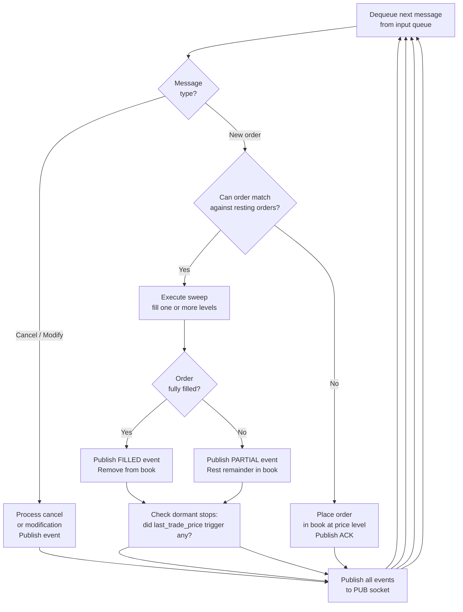

# The Matching Engine, The Heart of the Exchange

The **matching engine** is the software that receives orders, manages the order book, and executes trades when buy and sell orders are compatible. It is the exchange's most critical, performance-sensitive component.

***Figure 1:** The matching engine receives orders from participants, manages the order book, and executes trades when compatible orders are found. It publishes trade and order status events to participants and subscribers.*

## The Core Loop

At its simplest, the matching engine runs an endless loop:

1. Receive an incoming order.
2. Check if it can immediately match against resting orders on the opposite side.
3. If yes, execute the match (create a trade, update quantities, notify participants).
4. If there is remaining unfilled quantity, decide what to do with it (rest it in the book, or cancel it, depending on order type and TIF).
5. Check if any dormant stop orders have now been triggered by the new trade price.
6. Publish the results (trades, order status changes) to participants and subscribers.

## The Sweep

When an aggressive order arrives and begins filling against the resting book, this process is called **sweeping** the book. The aggressive order works through price levels one by one, from best to worst, until either it is fully filled or it reaches its limit price (or the book runs out of orders).

For example, a market buy order for 5,000 shares arrives:
- Takes 2,000 shares at the best ask of $150.35.
- Takes 1,500 shares at the next level, $150.40.
- Takes 1,200 shares at $150.45.
- Takes 300 shares at $150.50.
- Fully filled. Total cost: a weighted average of these prices.

The price impact of sweeping through multiple levels is called **slippage** or **market impact**, the large order moved the effective price away from the initial best ask.

## Single-Threaded by Design

Perhaps counterintuitively, most matching engines are **single-threaded**, they process orders one at a time, in strict sequence, with no parallel processing of orders. This is not a performance limitation; it is a deliberate design choice.

The order book is a shared, stateful data structure. If two threads tried to modify it simultaneously, you would need complex locking mechanisms to prevent corruption, and you might still end up with non-deterministic outcomes. In a system where fairness and determinism are legally required, this is unacceptable.

By processing orders in a single thread, the engine guarantees that the outcome is perfectly deterministic: given the same sequence of orders, the same sequence of trades will always result.

> **Key idea:** Single-threaded design is a feature, not a limitation. It makes the matching engine auditable, replayable, and legally defensible. Performance comes from algorithmic efficiency, not parallelism.

The performance requirement is achieved through algorithmic efficiency (correct data structures, avoiding unnecessary computation) rather than parallelism. The world's fastest matching engines can process orders in microseconds or even nanoseconds. CME Globex handles approximately 30–35 million messages per day across all products [CME Group Market Statistics, 2023]. NASDAQ's matching engines acknowledge orders in under 100 microseconds in typical conditions; co-located HFT firms that respond to market data and submit an order may achieve round-trip latencies below 5 microseconds. These numbers drive the entire hardware and architecture design: no garbage-collected language, no dynamic memory allocation in the critical path, no operating system calls that can introduce variable latency.

## One Book Per Symbol

The matching engine maintains one order book per tradeable symbol. AAPL trades in one book, MSFT in another. These books are entirely independent, an order in the AAPL book cannot interact directly with an order in the MSFT book (combo orders handle cross-symbol interaction at a higher level).

Conceptually, one logical order book per symbol is the correct mental model. In production systems, the implementation may be distributed differently, books may be sharded across cores, replicated for high availability, or partitioned by instrument group across multiple machines, but the logical behaviour is identical: each symbol has its own independent price-time priority queue.

**Where symbol independence breaks down:** Several order types and matching mechanisms require coordination *across* symbols, and developers should not over-generalise the "symbols are independent" rule:

- **Spread orders and calendar spreads** (CME): a single order to buy a March futures contract and sell a June contract simultaneously. The exchange must evaluate both legs together, filling only one is leg risk.

- **Implied matching** (derivatives markets): if there is a spread order to trade March-vs-June, and a separate outright order in June, the exchange can "imply" a synthetic March price and fill the outright June against the spread. CME Globex implements implied matching across multiple contract months.

- **Multi-leg options strategies** (Eurex, CBOE): a straddle (buy call + buy put at the same strike) or a strangle requires co-ordination between two different option series, each with its own symbol.

- **Basket orders and index rebalancing**: trading a portfolio of dozens of stocks as a single instruction requires cross-symbol scheduling and coordination.

For exchange system developers, this means the "separate process per symbol" architecture that works cleanly for single-instrument matching must be extended, or wrapped with a higher-level combinator, to handle any multi-leg or implied matching requirements.

## The Role of Data Structures

The order book needs to answer one question extremely fast: "What is the best available price right now?" Priority queues and heap-like structures are conceptually useful for understanding this, a heap gives O(1) access to the minimum or maximum element, and O(log n) insertion and deletion, which suits the matching engine's primary operations well.

Production exchange engines, however, often use more specialised data structures optimised for FIFO ordering within price levels, cache locality, and deterministic latency: balanced trees, skip lists, or intrusive linked lists indexed by price level are common. The conceptual model of "best price always accessible in O(1)" is correct regardless of the underlying structure; the heap is a pedagogically useful approximation of what these structures achieve.

