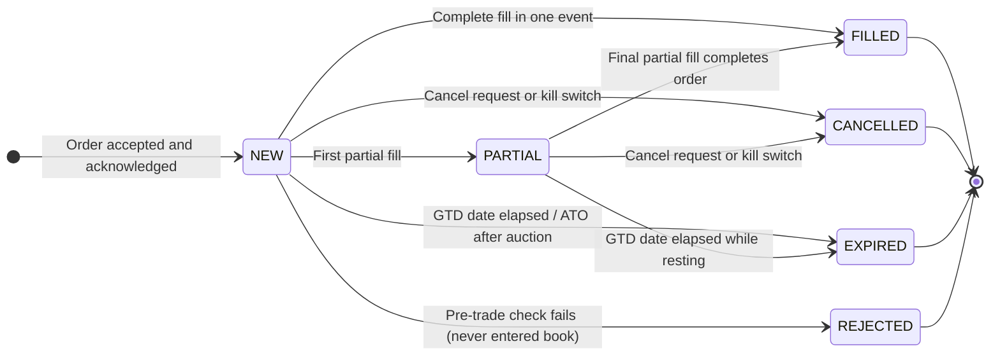

# The Life of a Trade

Let us trace a single trade from start to finish.

## Order Submission

Participant A, connected through Gateway GW01, submits a limit buy order: "Buy 500 shares of AAPL at $150.30, DAY." The order arrives as a **FIX message** (Financial Information eXchange , the standard protocol for order submission in financial markets, covered in full in the Technology Architecture section). The gateway validates the basic format and forwards it to the matching engine.

The engine receives the order and assigns it:
- A **unique order ID** (a system-wide identifier, discussed in detail in the architecture section)
- A **timestamp** (nanosecond precision)
- An initial status of **NEW** (the order has been accepted and registered)

The engine publishes an **acknowledgment (ACK)** back to GW01 confirming the order is live. The order now rests in the book.

## The Match

Moments later, Participant B, connected through Gateway GW02, submits a sell limit order: "Sell 500 shares of AAPL at $150.30, DAY." Or perhaps a market sell order. Either way, the engine determines that this sell order can match the resting buy order.

The match happens: 500 shares trade at $150.30. Two events occur simultaneously:
- Order A transitions from status NEW to **FILLED**.
- Order B transitions from status NEW to FILLED.

Both GW01 and GW02 receive **fill notifications** (also called **execution reports**) detailing the trade: quantity, price, and any remaining unfilled quantity.

A **trade record** is created, capturing:
- The trade ID
- The symbol
- The price
- The quantity
- The IDs of both orders involved
- The IDs of both gateways (participants)
- The timestamp
- Which side was the **aggressor** (which order arrived and "took" the fill)

The aggressor field is more than just a label. It matters for several reasons. First, for **fee calculation**: most exchanges charge takers (aggressors) a fee and pay makers (resting orders) a rebate, so correctly identifying which side was aggressive determines the billing for each trade. Second, for **regulatory reporting**: in some jurisdictions, trades must be classified as "buy-initiated" or "sell-initiated" based on which side was the aggressor. Third, for **market analysis**: the sequence of buyer-initiated and seller-initiated trades is a standard input to microstructure models that infer order flow direction and predict short-term price movement. Fourth, for **clearing**: in some clearing architectures, the aggressor side may have different margin or settlement obligations.

## Partial Fills

If Order A was for 500 shares but only 300 shares were available at $150.30, a **partial fill** occurs: 300 shares trade, Order A's status becomes **PARTIAL** with 200 shares remaining, and it continues resting at $150.30 waiting for more sellers.

## Publication

Every trade is immediately published over the market data feed to all subscribers. The viewer, board, stats database, clearing system, and any other subscriber all receive the trade notification within microseconds of it occurring.

## Order Status Lifecycle

An order passes through a defined set of statuses during its lifetime. Understanding these is essential for anyone building order management, reporting, or audit systems.

| Status | Meaning |
|---|---|
| **NEW** | The order has been accepted and acknowledged by the exchange. It is live, either resting in the book (if a limit order) or being matched (if aggressive). |
| **PARTIAL** | At least one fill has occurred but the order quantity is not yet fully satisfied. The remaining quantity continues to rest or be eligible for matching. |
| **FILLED** | The entire order quantity has been executed. The order is complete and leaves the book. |
| **CANCELLED** | The order was withdrawn before it was fully filled, either by the participant, by the exchange (e.g., kill switch), or by a system rule (e.g., end-of-day cancellation of DAY orders). |
| **REJECTED** | The order was refused by the gateway or the engine before entering the book, for example, failing a pre-trade risk check, containing an invalid price, or submitted during a halt. A rejected order never entered the book. |
| **EXPIRED** | The order's time-in-force condition was not met. GTD orders that reach their expiry date without filling receive this status. ATO orders unfilled after the opening auction expire automatically. |

The key transitions: an order starts as NEW. A partial fill moves it to PARTIAL. A final fill completes the transition to FILLED. A cancel message (from the participant) or a kill switch (from the exchange) moves a NEW or PARTIAL order to CANCELLED. A pre-trade rejection produces REJECTED without the order ever becoming NEW. An elapsed GTD date produces EXPIRED.

> **Key idea for developers:** REJECTED is fundamentally different from CANCELLED. A rejected order never existed in the book; a cancelled order did. Audit trails must record both, but they have different implications for position tracking (a rejected order has no position impact) and for regulatory reporting.

