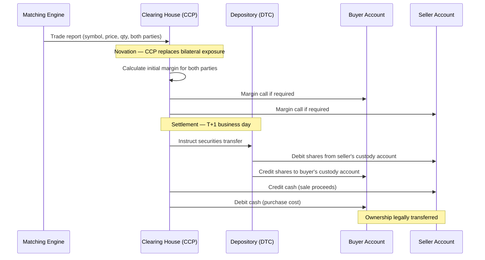

# Part III: Risk, Compliance, and Post-Trade

*The safeguards that protect markets and participants — before, during, and after each trade — and the regulatory obligations that underpin them.*

**Part Summary:**

Focus on market safety and accountability: the controls that prevent bad orders, the mechanisms that stabilize volatility, and the post-trade processes that make executed trades legally and financially final.

**Learning Objectives:**

- Explain why pre-trade controls are separated from matching in production architectures.
- Understand circuit breakers, collars, SMP, and kill switches as layered protections.
- Distinguish routine order-management actions from emergency risk interventions.
- Follow the trade path beyond execution into clearing, settlement, and surveillance.

**Content:**

- Pre-Trade Risk Controls: Before the Matching Engine
- Risk Controls, Protecting the Market
- Self-Match Prevention, When You Would Trade with Yourself
- Drop Copy, The Shadow Record
- Clearing and Settlement, When the Trade Becomes Real
- Regulatory Surveillance, Exchanges Are Not Passive
- A Cautionary Tale, Knight Capital, August 1, 2012

# Pre-Trade Risk Controls: Before the Matching Engine

The matching engine is the heart of the exchange, but many orders never reach it. A layer of **pre-trade risk controls** sits between the participant and the matching engine, rejecting orders that violate size, price, or credit constraints before any matching logic runs. This separation matters architecturally: the matching engine is optimised purely for speed; risk checking is separated so that it can be comprehensive without slowing the core matching path.

## Why a Separate Risk Layer?

A professional trading firm may submit thousands of orders per second. Even a brief software malfunction, a misconfigured algorithm, a bad data feed, a network glitch causing order duplication, can flood the exchange with harmful orders. If each of these reached the matching engine, the damage could propagate to other participants through filled trades that cannot easily be reversed. Pre-trade risk controls are the exchange's first line of defence.

## Common Pre-Trade Checks

**Maximum order quantity.** An order for 1 billion shares is almost certainly an error. Every exchange imposes an upper limit on the quantity of any single order. The limit may be absolute (no order may exceed X shares) or relative (no order may exceed Y% of the recent average daily volume).

**Maximum notional value.** Complementary to quantity limits: the total value of an order (quantity × price) must not exceed a threshold. A limit buy for 1,000 shares at $150.00 has a notional value of $150,000. If the threshold is $10 million, the order passes. If the participant submits 1,000 shares at $15,000 due to a decimal error, the notional is $15 million, rejected.

**Fat-finger price filter.** Orders whose submitted price is far from the current market price are rejected before reaching the matching engine. This catches typographical errors (an extra zero, a misplaced decimal point) before they touch the book. The fat-finger filter is calibrated per instrument based on its typical price range and volatility.

**Credit and position limits.** The exchange (or the clearing broker) maintains a real-time record of each participant's current positions and open orders. If accepting a new order would cause the participant to exceed their credit limit or position limit (e.g., they are already long 50,000 shares and this order would take them to 100,000 when their limit is 75,000), the order is rejected.

**Rate limiting / throttling.** Each participant connection (gateway) is permitted to submit at most N orders per second. If submissions arrive faster than this rate, excess orders are queued or rejected. This protects the exchange from denial-of-service conditions, whether deliberate or accidental.

**Self-match prevention (SMP).** Detects when an incoming order would match against a resting order from the same participant, a "wash trade." Applied as a pre-trade check or within the matching engine depending on implementation.

## The Gateway as Risk Layer

In most production architectures, the gateway performs these checks. The gateway is the first system to touch an incoming order; it can reject it immediately without the order ever reaching the matching engine's single-threaded queue. This keeps the matching engine clean and fast.

The consequence for software design: the gateway and the matching engine have different codebases, different deployment configurations, and different update cadences. The gateway can be scaled horizontally (multiple gateway processes); the matching engine is typically single-threaded per symbol.

> **Key idea:** The matching engine is optimised for speed, not safety. Safety is enforced before the order arrives. Developers working on gateway code must treat pre-trade checks as first-class functionality, not as an afterthought.

# Risk Controls, Protecting the Market

An exchange has a duty not just to its participants but to market stability as a whole. The risk controls described in this section exist because markets can go very wrong, very fast.

## Circuit Breakers

A **circuit breaker** (also known [Trading Curb](https://share.google/ueieYolUF9JVVvu3V) in regulatory terms ) is a mechanism that automatically halts trading when prices move too fast. The name comes from electrical circuit breakers, they "trip" to prevent damage when current (activity) becomes excessive.

**Why they exist:** In modern electronic markets, automated trading algorithms can drive prices far from fundamental value in seconds. The **2010 Flash Crash** saw the Dow Jones Industrial Average fall nearly 1,000 points in minutes before recovering [7]. Circuit breakers prevent such cascades from becoming permanent damage by imposing a mandatory pause during which participants can assess the situation, cancel erroneous orders, re-price their quotes, and allow the market to find equilibrium. A halt that lasts five minutes can prevent a price dislocation that might otherwise take hours or days to unwind.

**The basic mechanism:** After each trade, the exchange calculates how much the price has moved relative to a reference price (typically the most recent auction price, or the price at the start of a defined time window). If the movement exceeds a configured threshold in either direction, trading in that symbol is halted. During the halt, new orders can still be submitted and will rest in the book, but no matching occurs. When the halt ends, trading resumes through a **resumption auction** rather than instantly returning to continuous matching, this ensures that the first post-halt price is determined by the broadest available supply and demand, not by a single resting order that happens to be at the top of a thin book.

## Should Halt Duration Be Fixed or Proportional to Move Size?

This is a genuine design question, and the answer, confirmed by how major markets actually operate, is that both the trigger thresholds *and* the halt durations should be graduated by severity. The reasoning is straightforward: the purpose of a halt is to allow participants enough time to respond. A 0.5% move may reflect a momentary liquidity gap that resolves in two minutes. A 15% move may reflect genuine macroeconomic news that requires participants to read announcements, consult risk managers, recalculate valuations, and obtain fresh margin collateral, a process that cannot be completed in two minutes no matter how urgently it proceeds.

There is also a clearing-house dimension: a large move triggers margin calls at the CCP. The clearing house must calculate the calls, and participants must fund them. A halt that ends before margin can be collected leaves the clearing house exposed to exactly the counterparty risk that margining is designed to eliminate. Longer halts on larger moves give the clearing infrastructure time to operate correctly.

**The counterargument: predictability has value.** The main argument for a fixed halt duration is that participants value certainty. A fixed 5-minute halt lets every participant set a timer, prepare their re-entry orders, and be ready the instant continuous trading resumes. A variable halt ("somewhere between 5 and 30 minutes depending on severity") creates uncertainty that can itself generate anxiety and cautious behaviour. Some exchanges deliberately publish a fixed duration for this reason, the predictability is considered worth more than the additional precision of proportional calibration.

The practical resolution used by many exchanges is a **minimum halt with conditional extension**: the halt lasts at least the minimum duration, but the resumption auction can be extended in fixed increments (say, 2 minutes at a time) if the indicative uncross price is still far from the reference price when the auction is about to close. This bounds the uncertainty (participants know the halt is at least N minutes) while preventing a forced uncross at a price nobody believes in.

## Tiered Thresholds and Durations: How Major Markets Actually Work

**US market-wide circuit breakers (S&P 500 index)**

The US operates three explicitly tiered halt levels, where the severity of the market drop determines both whether a halt occurs and how long it lasts:

| Level | S&P 500 intraday decline | Halt duration | Notes |
|---|---|---|---|
| **Level 1** | 7% | 15 minutes | Not triggered in last 35 minutes of session |
| **Level 2** | 13% | 15 minutes | Not triggered in last 35 minutes of session |
| **Level 3** | 20% | Remainder of trading day | Triggered at any time; session ends |

Level 3 is effectively infinite for that day: a 20% intraday crash ends all US equity trading. The logic is that such a move cannot be a technical error, it is a market-wide catastrophe requiring the financial system to assess damage, value positions, and meet obligations overnight before resuming trading.

These market-wide halts are rare; Level 1 was triggered four times in March 2020 during the COVID-19 crash. Level 3 has never been triggered under the current rules.

**US single-stock circuit breakers (LULD, Limit Up-Limit Down)**

For individual stocks, the US LULD system takes a complementary approach: rather than varying the halt duration by severity, it varies the *trigger band* by instrument type, acknowledging that normal volatility differs across stocks.

| Tier | Instruments | Band during regular hours | Band in early/late sessions |
|---|---|---|---|
| **Tier 1** | S&P 500, Russell 1000, selected ETFs | ±5% | ±10% |
| **Tier 2** | Other NMS stocks | ±10% | ±20% |
| **Leveraged ETFs** | Multiply the applicable tier by the leverage factor | Up to ±75% for very leveraged instruments |, |

If the price moves outside the band, a 15-second monitoring period begins. If the price does not return inside the band within 15 seconds, a 5-minute trading pause is triggered. The halt duration is fixed at 5 minutes regardless of how far the price moved, but the threshold that triggers the halt reflects the instrument's normal volatility characteristics.

## Historical circuit breaker 

In March 2020, the *Level 1* market-wide circuit breaker was triggered 4 times within a two-week period due to pandemic-related panic and an oil price war.

Prior to this point, the modernized percentage-based circuit breaker system had never been triggered. These four events remain the only times the modern Level 1 system has ever halted trading across the entire US stock market.

**Timeline of the 2020 Market Halts**

All four halts occurred immediately after the opening bell, triggered by a 7% drop in the S&P 500 Index relative to the previous day's close. Each event triggered a mandatory 15-minute trading halt.

| Date | Trigger Time (EST) | S&P 500 Level at Halt | Catalyst / Context |
|---|---|---|---|
|March 9, 2020 | 9:34 AM | 2,772.39 |	Black Monday: Outbreak of a Saudi-Russia oil price war combined with compounding COVID-19 fears. |
|March 12, 2020 | 9:35 AM | 2,564.24 |	Black Thursday: The World Health Organization (WHO) officially declared COVID-19 a global pandemic, and the US announced European travel bans. |
|March 16, 2020 | 9:30 AM | 2,490.47 |	Immediate Halt: Triggered exactly at market open despite an emergency Sunday night 100-basis-point interest rate cut by the Federal Reserve. |
|March 18, 2020 | 12:56 PM | 2,429.23 |	Intraday Halt: Liquidity dried up mid-day as investors rushed out of equities and into cash/bonds.|

**Analyze the Mechanical Flow: How the Halts Handled the Panic**

The 2020 triggers proved that the regulatory overhaul following the 2010 Flash Crash worked exactly as intended. The system followed a strict sequential process to stabilize the market:

1. **The 7% Threshold Reached:** Algorithmic and retail selling pushed the S&P 500 down by 7%.
1. **Immediate Automated Pause:** The NYSE and all other US exchanges automatically paused trading for exactly 15 minutes.
1. **Order Book Stabilization:** During the 15-minute pause, investors could cancel existing orders or enter new ones, preventing high-frequency trading algorithms from vacuuming out all liquidity (which caused the 2010 crash).
1. **Price Discovery Reopened:** Market-makers gathered buy and sell interest to reopen stocks via an orderly auction process, mitigating a blind downward spiral.

**Crucial Financial Considerations (The Blind Spots)**

When reviewing extreme volatility events like 2020, investors often overlook these critical operational realities:

1. **Level 2 Was Never Reached:** Although the market finished significantly lower on these days—such as March 16, when the Dow dropped nearly 13%—the S&P 500 never hit the 13% Level 2 threshold after the initial Level 1 reopening.
1. **Pre-Market Limitations:** Market-wide circuit breakers are only active during regular trading hours (9:30 AM to 4:00 PM EST). Overnight panic is instead managed by CME futures "limit-down" price caps (typically 5%). This is why the March 16 halt triggered the exact second the opening bell rang.
1. **The Single-Stock Surge:** Outside of the market-wide halts, individual stock tickers triggered thousands of Limit Up-Limit Down (LULD) single-stock pauses throughout March 2020 as individual corporate valuations fluctuated wildly.

**Eurex and European venues: volatility interruptions**

Eurex uses **volatility interruptions** for individual futures and options products. When the price moves beyond a configured range from the reference price, continuous trading is interrupted and a brief auction is called. The duration is not rigidly fixed: the auction continues until equilibrium is found, with a minimum duration and the ability to extend if the indicative price remains far from the reference. This auction-based resumption (rather than a timed pause followed by immediate continuous trading) means the halt naturally lasts as long as price discovery requires.

**Japan: daily price limits**

JPX (Japan Exchange Group) uses a different paradigm: instead of a halt, the exchange imposes **daily price limits** that prevent the price from moving more than a set percentage from the previous close. If the price hits the limit (up or down), trading can continue at that price but cannot move beyond it. This is a continuous constraint rather than a discrete halt, the market remains open but price movement is bounded. If the next day opens near the limit, the limit is widened. This approach prioritises continuity over interruption.

## Design Implications for Exchange System Developers

A well-designed circuit breaker subsystem is not a single boolean "halt or not halt." It is a configurable, multi-tier system with the following parameters per instrument (or instrument group):

- **Reference price source:** Last auction price? Rolling 5-minute reference? Opening price?
- **Measurement window:** How far back does the comparison look? (Some use the last trade; others use the last 5 minutes of trades to avoid single-trade noise.)
- **Trigger thresholds:** One threshold or multiple tiers (7%, 13%, 20%)?
- **Halt duration per tier:** Fixed time, minimum-plus-extension, or auction-until-equilibrium?
- **Extension condition:** If halt duration is extendable, what is the condition for extension? (Indicative price outside a band? Insufficient volume in the resumption auction?)
- **Maximum halt duration:** Is there a ceiling beyond which the halt automatically transitions to session-end?
- **Day-of-session rules:** Some halts (like US Level 1/2) do not trigger in the last 35 minutes of the session to avoid trapping participants with no time to exit.
- **Resumption mechanism:** Immediate continuous trading or mandatory resumption auction?

All of these should be stored in reference data and readable at runtime without a code deployment. A circuit breaker whose parameters require a software release to adjust is a liability, market conditions and regulatory requirements change, and the ability to tune the parameters independently of the engine is essential operational flexibility.

> **Key idea:** Circuit breakers are not binary on/off switches. They are tiered, configurable risk controls where both the trigger threshold and the halt duration should scale proportionally with the severity of the price movement. A small disruption needs a short pause; a large crash may end the session entirely. The US market-wide circuit breaker system (7%/15min, 13%/15min, 20%/rest-of-day) is the canonical real-world example of this principle in practice.

## Price Collars (Collar Bands)

**Price collars** are price filters that reject individual orders whose submitted price is too far from a reference price.

There are typically two bands:

**Static collar (fat-finger filter):** Compares the submitted price to the last official close price. If the submitted price is more than X% away from the close, the order is rejected. This catches "fat finger" errors, trader mistypos that accidentally add or remove a zero. A sell order at $15.00 when the stock is trading at $150.00 is almost certainly a typo and should never reach the book.

The term **fat finger** is industry slang for typing errors, accidentally pressing the wrong key. A famous fat-finger incident occurred in 2005 when a Mizuho Securities trader accidentally sold 610,000 shares of a Japanese company at 1 yen each instead of 1 share at 610,000 yen. The resulting chaos cost the firm hundreds of millions of dollars and prompted stricter controls globally. [16]

**Dynamic collar (reference price filter):** Compares the submitted price to the most recent traded price. If the submitted price is more than Y% away from the last trade, the order is rejected. This prevents a participant from slowly walking the price away from fair value through a series of trades, each slightly outside the previous range.

The two collars serve different purposes:
- The static collar protects against outright mistakes (orders many times the current price).
- The dynamic collar protects against gradual manipulation or runaway algorithms.

## Self-Match Prevention (SMP)

A participant should not be able to trade with themselves. If you have a resting sell order at $150.35 and you submit a buy order at $150.40, those orders would match, but both sides belong to you. No real change of ownership has occurred; you have simply generated artificial trading volume. This is called **wash trading** and is illegal under most exchange regulations.

**Self-Match Prevention (SMP)** detects when an incoming order would match against a resting order from the same participant (identified by gateway ID) and applies a policy:

- **Cancel Aggressor:** Cancel the incoming order. Your resting order remains. This is the most common default.
- **Cancel Resting:** Cancel the resting order and continue looking for a counterparty. Used when the new order supersedes the old one.
- **Cancel Both:** Cancel both orders. Used when you want a clean slate.

Different strategies suit different circumstances. A market maker who is re-quoting (sending new bids and asks continuously) might prefer Cancel Resting to ensure their latest quote is the active one. A participant who wants to protect their standing orders would choose Cancel Aggressor.

## Kill Switch

A **kill switch** is an emergency control that immediately cancels every resting order and quote associated with a specific participant or gateway connection.

It can be triggered by:
- **The participant themselves:** "Our system is malfunctioning, cancel everything immediately."
- **The exchange:** "This participant's behaviour is disrupting the market; we are cancelling all their orders."
- **Automatic disconnect handling:** If a gateway connection is lost, the exchange may automatically trigger a kill switch to prevent stale orders from sitting in the book without the participant being able to manage them.

After a kill switch, the participant's connection is typically marked as **inactive**. Before they can re-enter orders, they must reconnect and authenticate. This gives a human a chance to assess the situation before resuming trading.

Kill switches are mandatory features under regulations like MiFID II (the European Union's Markets in Financial Instruments Directive) and are audited by regulators. Every exchange must demonstrate the ability to cancel a participant's orders immediately when required.

## Mass Cancel, Not the Same as a Kill Switch

These two mechanisms are frequently confused because they both result in orders being cancelled. They serve entirely different purposes and have entirely different consequences for the participant.

**Mass cancel** is an order management message, a normal, operational request submitted by the participant themselves to cancel multiple orders at once. It is intentional, deliberate, and routine. Examples:

- "Cancel all my resting orders in AAPL", a trader repositioning ahead of earnings.
- "Cancel all DAY orders across all symbols", an end-of-session cleanup.
- "Cancel all my orders on the bid side", a market maker pausing one side of their quotes while reassessing direction.

After a mass cancel executes, the participant's gateway connection remains **fully active**. The participant can immediately submit new orders. There is no interruption to their session, no authentication required, no human review needed. The mass cancel is simply a fast, convenient way to withdraw multiple resting orders with a single message rather than cancelling each one individually.

A mass cancel generates individual cancellation events for each order in the audit trail, exactly as if the participant had cancelled each order manually. From the exchange's perspective, it is indistinguishable from a burst of individual cancel messages; it just arrives more efficiently.

**The kill switch**, by contrast, is an emergency measure. Its defining characteristics that distinguish it from mass cancel are:

| | Mass Cancel | Kill Switch |
|---|---|---|
| Who initiates | Participant only | Participant, exchange, or auto-triggered |
| Gateway remains active | Yes, participant can send new orders immediately | No, gateway is marked INACTIVE |
| Purpose | Routine order management | Emergency: malfunction, regulatory action, disconnect |
| Reconnect required | No | Yes, human review before resuming |
| Audit log entry | Series of cancel events | GATEWAY_SUSPENDED event + cancel events |
| Can target a subset of orders | Yes (by symbol, side, type) | No, cancels everything for that gateway |
| Used for scheduled cleanup | Yes | No, misusing it would lock out the participant |

A market maker who updates their quotes hundreds of times per second will use mass cancel routinely during the session, for example, withdrawing all quotes when MMP fires, or when they detect a stale data feed. They would never use a kill switch for this; a kill switch would force them to re-authenticate before trading again.

A kill switch is invoked when a system is out of control. A mass cancel is invoked when a system is in control but wants to change its position quickly.

> **Key idea:** Use a kill switch when something has gone wrong and a human must intervene before trading resumes. Use a mass cancel when a participant wants to cancel orders as part of normal operation. The difference is not just functional, it is architectural: the kill switch changes the gateway state; the mass cancel does not.

# Self-Match Prevention, When You Would Trade with Yourself

**Self-match prevention (SMP)** deserves its own treatment because it is one of the most commonly misunderstood features of exchange systems, and because it has both regulatory and operational dimensions.

## The Problem

Imagine a market maker who runs two algorithms simultaneously, one placing bids, another sweeping asks. If the bid algorithm quotes $150.30 and the ask algorithm routes a buy order at $150.30 or higher, the two sides match against each other. No ownership has changed hands; no real trade has occurred. Both sides belong to the same firm.

This is called a **wash trade**. It is problematic for several reasons:

- It generates artificial trading volume, misleading other participants about market activity.
- It creates artificial price pressure (many wash trades in sequence can move a price without genuine supply/demand).
- It is illegal under market manipulation regulations in most jurisdictions (the EU's Market Abuse Regulation, the US SEC's Rule 10b-5, and others explicitly prohibit wash trading).

## The SMP Mechanism

SMP detects the wash condition and applies one of several policies before any fill occurs:

**Cancel the aggressor** (most common default): The incoming order is cancelled. The resting order remains in the book, available to other participants. Use this when you want to protect your standing quotes from being inadvertently swept by your own algorithms.

**Cancel the resting order**: The resting order is cancelled; the incoming order continues to sweep looking for a different counterparty. Use this when the new order reflects a more current view of value and should supersede the old one.

**Cancel both**: Both the resting and incoming order are cancelled. Use this when you want to eliminate both sides cleanly, for example, when re-positioning and wanting neither order to remain active.

**Allow the match (no SMP)**: Some systems permit self-matching in testing environments or for specific account structures where the "two sides" are legally distinct entities despite sharing a gateway ID. In most production environments, SMP is always on.

## How SMP Identifies a Self-Match

The matching engine identifies orders from the same participant by their **gateway ID** (the identifier of the connection through which the order was submitted). Two orders with the same gateway ID constitute a potential self-match. The SMP action specified on the incoming order governs what happens.

## Why This Matters for Developers

SMP is implemented inside the matching sweep loop, it runs after price compatibility is checked but before any fill is committed. The code path must handle all three cancellation outcomes, generate appropriate event notifications (the cancelled order receives a cancellation event, not a fill), and continue the sweep to look for non-self counterparties if the resting order was cancelled.

> **Key idea:** SMP is not just a courtesy feature, it is a legal requirement on regulated exchanges. An exchange that facilitates wash trading faces regulatory action. Every exchange system must implement it correctly.

# Drop Copy, The Shadow Record

A **drop copy** is a real-time copy of all order lifecycle events for a participant, sent simultaneously to a designated recipient, typically a **clearing broker**, **prime broker**, **risk management system**, or directly to a **regulator**.

The name comes from the physical world: the exchange, or the trader, used to drop a "carbon copy" of each order event to the designated desk as it happened. 

## Why Drop Copy Exists

A large institutional investor might have dozens of trading desks, each submitting orders to the exchange through its own gateway. The firm's central risk management system needs to see all order and fill activity in real time to monitor aggregate position and exposure. But having the risk system receive from dozens of separate gateways is complex. Instead, the exchange provides a single drop copy feed that aggregates all activity for that firm, regardless of which gateway originated it.

Clearing brokers use drop copy to see fills on behalf of their clients in real time, so they can begin the clearing and settlement process immediately without waiting for end-of-day reports.

Regulators can mandate drop copy access to monitor for suspicious activity in real time.

## Drop Copy vs Market Data

Drop copy is a **private** feed, it contains information about a specific participant's orders, which they would not want published to the whole market. Market data (the order book, trades) is **public**, published to all subscribers. Drop copy is delivered on a separate, secured channel.

Each event in the drop copy includes a **sequence number**, a monotonically increasing counter. If the recipient momentarily loses their connection and reconnects, they can request a replay of any missed events using the sequence number.

# Clearing and Settlement, When the Trade Becomes Real

Matching an order creates a **trade agreement**, two parties have committed to exchange shares and money. But the matching is just the beginning. Before ownership actually changes hands, the trade must be **cleared** and **settled**. Many engineers initially believe that matching equals completion. In reality, matching, clearing, and settlement are three distinct processes with different institutions, different timelines, and different risks.

> **Key idea:** Matching creates an agreement. Clearing determines and guarantees obligations. Settlement transfers assets. All three must succeed before the trade is legally complete. Each involves separate systems and separate institutions.

## What Matching Creates

When the matching engine fills two orders, it creates a **trade record**, an agreement that Participant A will sell X shares to Participant B at price P. At this point:
- The shares have not moved.
- The money has not moved.
- The trade is an obligation, not a completed transfer.

Both parties are now **counterparties** to each other. If either defaults, fails to deliver the shares or fails to pay, the other party suffers.

## Clearing: Guaranteeing the Trade

**Clearing** is the process by which a third party, the **Central Counterparty Clearing House (CCP)**, steps between the buyer and seller and guarantees the trade will settle, even if one party defaults.

Through a legal process called **novation**, the CCP becomes:
- The seller to every buyer.
- The buyer to every seller.

After novation, Participant A no longer has a counterparty exposure to Participant B. They have a counterparty exposure only to the CCP. And Participant B has a counterparty exposure only to the CCP. Neither party needs to worry about the other's creditworthiness.

This is transformative for market structure: it means participants can trade with strangers, people they have never met and know nothing about, with confidence that the trade will settle, because the CCP's creditworthiness is the only thing that matters.

**Major CCPs:**
- **OCC (Options Clearing Corporation):** Clears equity options in the US.
- **DTCC (Depository Trust and Clearing Corporation) / NSCC:** Clears most US equity trades.
- **LCH:** Major clearing house in Europe and globally, clearing interest rate swaps, equities, and other products.
- **Eurex Clearing:** Clears Eurex derivatives and selected equity trades.
- **CME Clearing:** Clears futures and options on CME Group exchanges.

## Margin: The Clearing House's Protection

If the CCP guarantees every trade, how does it protect itself from losses if a participant defaults? The answer is **margin**, collateral that participants must post to cover their potential losses.

**Initial margin** is deposited when a position is opened. It represents an estimate of the maximum likely loss over a short period (typically 1-2 days). For a long position in 1,000 shares of a $150 stock, the initial margin might be 10%, $15,000 deposited as collateral.

**Variation margin** (also called **mark-to-market**) is the daily cash settlement of gains and losses. At the end of each trading day, positions are revalued at the current market price. If the price moved against you, cash equal to the loss is transferred from your margin account to your counterparty's (via the CCP). If it moved in your favour, you receive cash. This daily cash flow means losses are realised incrementally rather than accumulating to a catastrophic amount at settlement.

**Maintenance margin** is the minimum balance that must be maintained in the margin account. If losses cause the balance to fall below the maintenance margin, the participant receives a **margin call**, a demand to deposit additional collateral immediately. Failure to meet a margin call results in the CCP liquidating the position.

Margin is especially important for derivatives (futures, options) where positions are leveraged and losses can exceed the initial investment. The 2008 financial crisis demonstrated what happens when margin requirements are inadequate, the collapse of multiple financial institutions stemmed partly from insufficient collateral for OTC derivatives positions.

## Delivery versus Payment (DvP)

**Delivery versus payment (DvP)** is the settlement principle that the transfer of securities and the transfer of cash happen simultaneously and conditionally. Neither the securities nor the cash are released until both are available. This eliminates the risk of one party delivering while the other fails to pay, the most fundamental settlement risk.

Without DvP, a seller might deliver shares and then find the buyer has defaulted before paying. DvP ensures atomicity: either both transfers happen or neither does.

## Settlement: The Actual Transfer

**Settlement** is the final exchange, shares move from the seller's custody account to the buyer's, and cash moves from the buyer's account to the seller's. After settlement, ownership has legally changed.

US equities currently settle on **T+1**, one business day after the trade date. The market previously operated on T+5 (paper certificates and bicycle messengers), then T+3, then T+2 as settlement infrastructure was digitised, and moved to T+1 in 2024 [8]. Some markets (certain money market funds, US Treasury securities) already settle same-day. Same-day settlement eliminates settlement risk entirely but requires that cash and securities be available at the moment of trading.

## Failed Settlement

Not all trades settle on time. A **failed settlement** occurs when one party cannot deliver, the seller lacks the shares (perhaps their own purchase has not yet settled), or the buyer lacks the cash. Failed settlements create a cascading chain of problems, since other participants may be counting on receiving those shares to fulfil their own obligations.

**Buy-ins** are a remedy: if a seller fails to deliver shares, the buyer has the right to purchase the shares in the open market at the seller's expense. Buy-ins are relatively rare in liquid markets but are a meaningful operational risk in illiquid or small-cap stocks.

## Custody and Depositories

**Custody** refers to the safekeeping of securities on behalf of investors. Most investors do not directly hold share certificates, their broker holds shares in a nominee account at a **depository**. The depository maintains the master record of who owns what.

In the US, the **DTCC's Depository Trust Company (DTC)** is the central securities depository, it holds the vast majority of US equity shares. Electronic book-entry transfers between DTC accounts enable settlement without physical movement of certificates.

This dematerialisation (replacing paper certificates with electronic records) is what made T+5→T+3→T+2→T+1 settlement possible. When settlement meant physically moving certificates, five days was genuinely necessary. With electronic records, same-day settlement is technically feasible.

## VWAP and P&L

A clearing system tracks each participant's **position** (how many shares they hold, positive for long, negative for short) and their **Profit and Loss (P&L)**.

**VWAP (Volume-Weighted Average Price)** is the average price paid for a position, weighted by quantity. If you buy 100 shares at $150 and then 50 more at $160, your VWAP is (100×$150 + 50×$160) / 150 = $153.33. Your break-even price is $153.33; selling above this generates profit, below generates a loss.

# Regulatory Surveillance, Exchanges Are Not Passive

An exchange does not simply match orders and publish data. It actively monitors for market abuse and is legally required to report suspicious activity to regulators. This section introduces the concepts; developers working on exchange infrastructure will eventually need to understand them because audit trail and surveillance requirements shape the design of event logging, data retention, and monitoring systems.

## Types of Market Abuse

**Spoofing.** A participant places a large order with no genuine intention to trade, they want to move the visible order book in a way that influences other participants' decisions. Once the desired movement occurs, they cancel the spoof order before it can fill. Spoofing was used extensively in electronic markets before regulatory crackdowns; it is now illegal in the US (the Dodd-Frank Act, 2010) and the EU (Market Abuse Regulation, 2016).

**Layering.** A variant of spoofing: multiple large orders are placed on one side of the book at various price levels to create the appearance of depth and pressure, then cancelled when the deception has served its purpose.

**Wash trading.** As described in the *Pre-Trade Risk Controls* section of Part III. Trading with oneself to generate artificial volume.

**Front running.** Acting on knowledge of another participant's pending orders before they execute, for example, a broker who sees a large client order about to move the market, and trades for their own account first. Illegal and a serious breach of fiduciary duty.

**Insider trading.** Trading on material, non-public information. Not an order flow manipulation but handled by the same regulatory framework. The exchange's audit trail is a key source of evidence in insider trading investigations.

**Quote stuffing.** Flooding the exchange with a high volume of orders and cancellations to consume the matching engine's bandwidth and slow down competitors. A high-frequency trading abuse pattern.

## How Exchanges Detect Abuse

Exchanges run **market surveillance systems**, separate processes that consume the complete audit trail of all events and apply pattern detection algorithms. The key inputs are:

- Every order submission, modification, and cancellation, with precise timestamps.
- Every fill, including which gateway was on each side.
- A record of which orders were placed "close in time" to cancellations, from the same gateway.

Modern surveillance systems flag suspicious patterns (a large order placed and cancelled within milliseconds, many times in sequence) for human review. Some use machine learning to detect patterns that do not match known abuse templates.

## The Audit Trail

The **audit trail** is the exchange's complete, immutable record of every event. Every order that arrives, every modification, every fill, every cancellation, every rejection, each is written to the audit log with a high-precision timestamp. The audit trail must be:

- **Complete:** nothing omitted, even rejected orders.
- **Immutable:** no post-hoc modification.
- **Retained:** regulatory requirements typically mandate multi-year retention.
- **Replayable:** given the audit log, regulators must be able to reconstruct the full state of the market at any past moment.

This replayability requirement is not incidental. It is the reason exchange systems are designed for **deterministic replay**: given the same ordered sequence of events from the audit log, the matching engine must reproduce exactly the same fills, cancellations, and book state. Any non-determinism in the matching engine would make audit trail replay unreliable.

> **Key idea:** Every event in the exchange system should be written to the audit log before the response is sent to the participant. The audit log is primary; the matching engine state is derived from it.

# A Cautionary Tale, Knight Capital, August 1, 2012

Everything in the *Pre-Trade Risk Controls* section, maximum quantity limits, position limits, kill switches, deployment discipline, exists partly because of what happened to one firm on one morning. The story of Knight Capital is the most important cautionary tale in the history of electronic trading, and every developer who touches exchange-adjacent code should know it.

## The Company

In the summer of 2012, Knight Capital Group was one of the most important firms in US equity markets. As a market maker and broker, Knight handled approximately 10–15% of all US equity trading volume, billions of shares every day across thousands of stocks. It was a highly regarded, well-capitalised firm at the centre of the market structure that had emerged after electronic trading matured.

## The Morning

On August 1, 2012, the NYSE launched a new feature called the **Retail Liquidity Program (RLP)**, designed to attract more retail order flow to the exchange by offering price improvements. Participating firms were required to deploy new software to handle the RLP order types.

Knight deployed new code to its production trading servers. The deployment involved eight servers that handled the firm's market making in NYSE-listed stocks.

Seven of the eight servers received the new code correctly.

One did not.

On the one misconfigured server, old code, a legacy module called **SMARS (Smart Market Access Routing System)** that had been used years earlier for a different purpose and was supposed to be permanently deactivated, was still present and was inadvertently reactivated by the deployment process. This old code had a function called **"Power Peg"** that had been repurposed from its original use. When RLP orders arrived on the live NYSE that morning, the old code on the misconfigured server interpreted them as triggers for Power Peg and began acting on them.

Power Peg, as activated, executed a simple but lethal loop: for each incoming RLP trigger, it would buy shares at the market offer price and then immediately sell them at the market bid price, buying high and selling low, over and over again. It was, in effect, a machine programmed to continuously pay the spread.

## 45 Minutes

At 9:30am, the NYSE opened for trading.

Knight's SMARS system on the one misconfigured server immediately began sending orders into the market. The orders were technically valid, they passed all of the exchange's pre-trade checks. NYSE processed them correctly. From the exchange's perspective, Knight was simply an aggressive, very active participant.

From Knight's perspective, the firm was haemorrhaging money at a speed no human could track in real time.

Over the next 45 minutes, the misconfigured server sent approximately **4 million orders** into the market. Knight accumulated net positions in approximately 154 different stocks, a total long-short exposure of around **$7 billion**. Because Power Peg was designed to flip positions rapidly (buy at the ask, sell at the bid, repeatedly), not to accumulate directional positions, the system was continuously entering and exiting trades, but at a net loss equal to approximately the bid-ask spread on every single round trip, multiplied by millions of times.

Knight's trading operations desk noticed the anomalous activity almost immediately. Error messages appeared. Phones rang. Colleagues tried to identify which system was responsible. They tried to cancel the rogue orders. Several attempts were made and failed, the orders kept coming. It took the operations team approximately 45 minutes to identify the misconfigured server, isolate it, and stop the trading loop.

By 10:15am, Knight had lost approximately **$440 million**, in 45 minutes.

To put that number in context: Knight's entire net equity capital before August 1 was approximately $400 million. The firm had destroyed slightly more than its total equity in less than one trading session.

## The Aftermath

Knight survived only through an emergency capital injection arranged over the following two days. A consortium of investment firms provided $400 million in rescue financing in exchange for equity stakes that gave them majority ownership. Effectively, Knight Capital ceased to exist as an independent firm. Several months later, what remained of Knight merged with Getco LLC to form KCG Holdings, which was eventually acquired by Virtu Financial in 2017.

## What Went Wrong: A Technical Post-Mortem

The SEC conducted a detailed investigation and published its findings in 2013. The root causes, in the order they would need to have been addressed to prevent the disaster:

**1. Deployment process without verification.** Eight servers needed the same software. A manual deployment procedure was used, and it was not verified to confirm all eight servers were identically configured. In any production system where a single misconfigured server can cause catastrophic damage, every deployment must include an automated post-deployment verification step that confirms every node is running the correct version with the correct configuration.

**2. Active dangerous code in a production binary.** The Power Peg code had not been removed from the codebase, it had merely been deactivated. In a production trading system, deprecated code that can cause harmful behaviour should be removed entirely, not commented out or conditionally disabled. Code that is not present cannot be accidentally reactivated.

**3. No position limit or notional limit at the firm level.** Knight's pre-trade risk controls were focused on individual order validation, not on accumulated firm-wide exposure. A firm-level position monitor that triggered a circuit breaker when gross exposure exceeded, say, $100 million in a short window would have halted the rogue system after the first few seconds. The system ran for 45 minutes because nothing automatically stopped it when the positions grew to dangerous size.

**4. Kill switch inaccessible in the moment of crisis.** Knight had kill switch capability in principle. But in the chaos of the morning, the operations team was unable to exercise it quickly. Finding the right kill switch, confirming it was correct, getting approvals, and executing it took far too long. A kill switch that takes 45 minutes to operate is not a kill switch. Emergency controls must be pre-tested, clearly documented, instantly accessible, and operable by a single person under extreme stress.

**5. No automated detection of anomalous trading patterns.** An algorithm sending 4 million orders in 45 minutes, accumulating $7 billion in exposure on one server while the other seven servers show normal activity, should have been automatically detectable. A real-time monitor comparing per-server activity, or watching the rate of position accumulation relative to normal levels, would have flagged the anomaly within seconds. Automated detection should not require a human to notice something is wrong.

**6. The exchange cannot protect you from yourself.** This deserves particular emphasis. NYSE processed every single one of Knight's 4 million orders correctly. None of them violated any exchange rule. The exchange is not in a position to determine whether a participant's trading strategy makes business sense, only whether the orders are technically valid. Pre-trade risk controls at the exchange level (quantity limits, fat-finger price filters, rate limits) exist to protect the market as a whole from clearly erroneous orders. They are not a substitute for participant-side risk management. Knight's situation could not have been prevented at the exchange level alone.

## The Legacy

The Knight Capital incident triggered a wave of regulatory attention to algorithmic trading risk. The SEC's 2013 Market Access Rule (Rule 15c3-5), which had been in effect at the time of the incident, required broker-dealers to have risk controls for market access, but the incident demonstrated that the rule's requirements were insufficient or that compliance was inadequate.

Subsequently, regulators in the US, EU (under MiFID II), and other jurisdictions tightened requirements for:
- Pre-deployment testing of algorithmic trading systems
- Kill switch accessibility and testing requirements (MiFID II mandates regular kill switch testing)
- Intraday position and notional limits
- Automated anomaly detection

Every requirement in the *Pre-Trade Risk Controls* section of this document, and the kill switch discussion, is grounded in part in the lesson that Knight Capital paid $440 million to teach.

> **Key idea:** The market does not stop when your system malfunctions. Every order your system sends is valid in the exchange's eyes until you cancel it or your gateway is disconnected. The only protection against a runaway algorithm is pre-trade risk controls on your own side, deployed correctly, verified after every deployment, and exercisable instantly under pressure.

