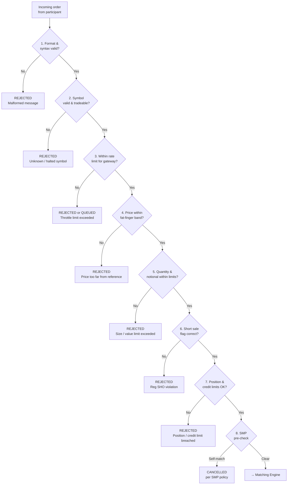

# Pre-Trade Risk Controls: Before the Matching Engine

The matching engine is the heart of the exchange, but many orders never reach it. A layer of **pre-trade risk controls** sits between the participant and the matching engine, rejecting orders that violate size, price, or credit constraints before any matching logic runs. This separation matters architecturally: the matching engine is optimised purely for speed; risk checking is separated so that it can be comprehensive without slowing the core matching path.

## Why a Separate Risk Layer?

A professional trading firm may submit thousands of orders per second. Even a brief software malfunction, a misconfigured algorithm, a bad data feed, a network glitch causing order duplication, can flood the exchange with harmful orders. If each of these reached the matching engine, the damage could propagate to other participants through filled trades that cannot easily be reversed. Pre-trade risk controls are the exchange's first line of defence.

## Common Pre-Trade Checks

**Maximum order quantity.** An order for 1 billion shares is almost certainly an error. Every exchange imposes an upper limit on the quantity of any single order. The limit may be absolute (no order may exceed X shares) or relative (no order may exceed Y% of the recent average daily volume).

**Maximum notional value.** Complementary to quantity limits: the total value of an order (quantity × price) must not exceed a threshold. A limit buy for 1,000 shares at $150.00 has a notional value of $150,000. If the threshold is $10 million, the order passes. If the participant submits 1,000 shares at $15,000 due to a decimal error, the notional is $15 million, rejected.

**Fat-finger price filter.** Orders whose submitted price is far from the current market price are rejected before reaching the matching engine. This catches typographical errors (an extra zero, a misplaced decimal point) before they touch the book. The fat-finger filter is calibrated per instrument based on its typical price range and volatility.

**Position limits and credit limits.** These two controls are frequently grouped together but measure different things and require different data to evaluate.

*Position limits* cap the number of units a participant may hold in a given instrument, long or short. A position limit of 500,000 shares means a participant cannot hold more than 500,000 shares long or be more than 500,000 shares short at any time. Checking a position limit requires knowing the participant's current settled and unsettled position — data fed from the clearing system into the gateway as a continuously updated parameter. They are designed to prevent any single participant from accumulating a position large enough to create settlement or market concentration risk.

*Credit limits* (also called notional or exposure limits) cap the total financial obligation outstanding at any moment: the mark-to-market value of current positions plus the notional value of all open orders not yet filled. A credit limit of $10 million means the sum of position value plus unfilled order commitments cannot exceed $10 million. Credit limits are harder to check in real time than position limits because they require tracking the full "open order book" — every outstanding order submission and cancellation — as well as settled positions. The example above: already long 50,000 shares, new order would take you to 100,000, limit is 75,000 — that is a position limit breach. A separate check might reject an order because the notional value of all outstanding orders already exceeds the credit threshold, even if the eventual position itself would be within limits.

**Rate limiting / throttling.** Each participant connection (gateway) is permitted to submit at most N orders per second. If submissions arrive faster than this rate, excess orders are queued or rejected. This protects the exchange from denial-of-service conditions, whether deliberate or accidental.

**Short sale flagging.** In the United States, Regulation SHO (2005) requires that any sell order where the seller does not own the shares be explicitly marked as a **short sale** in the FIX message. The gateway must validate two things: (1) that the "short" flag is correctly present on any sell order for shares the participant does not hold, and (2) that the participant has a valid **locate** confirming shares are available to borrow. Accepting a short sale without a locate is a Reg SHO violation. As described in the *Short Selling* section of Part I, the locate process itself happens in prime brokerage infrastructure outside the exchange, but the gateway enforces that the flag is present before forwarding to the matching engine.

**Self-match prevention (SMP).** Detects when an incoming order would match against a resting order from the same participant, a "wash trade." Described fully in the *Self-Match Prevention* section of this Part.

## Check Ordering: Fail-Fast by Cost

The sequence in which pre-trade checks run is not arbitrary. Checks requiring external state lookups are more expensive than checks that can be performed on the order message alone. The standard pattern is to fail-fast with the cheapest checks first:

1. **Format and syntax** — Is the message well-formed? Are required fields present and correctly typed? Zero external lookups. Cheapest possible rejection.
2. **Symbol validity** — Is the symbol known, active, and in a session state that accepts orders? Requires only a reference data table lookup.
3. **Rate limiting** — Is this gateway within its message rate allowance? In-memory counter per gateway, no external state.
4. **Fat-finger price check** — Is the submitted price within a configured percentage of the reference price? Requires only a cached reference price per symbol.
5. **Quantity and notional limits** — Does the order exceed size or value thresholds? Requires only the order fields and configured thresholds.
6. **Short sale flag check** — If the order is a sell, is the flag correctly set and locate valid?
7. **Position and credit limits** — Would this order breach the participant's position or credit limits? Requires current position data from the clearing system — the most expensive check.
8. **SMP pre-check** — Does an obvious self-match with a resting order exist?

Failing at step 1 takes nanoseconds. Failing at step 7 takes longer because it requires consulting external state. Running all checks in parallel wastes resources on orders that would be rejected at step 1; running them in this sequence minimises latency for both accepted and rejected orders.

## The Gateway as Risk Layer

In most production architectures, the gateway performs these checks. The gateway is the first system to touch an incoming order; it can reject it immediately without the order ever reaching the matching engine's single-threaded queue. This keeps the matching engine clean and fast.

The consequence for software design: the gateway and the matching engine have different codebases, different deployment configurations, and different update cadences. The gateway can be scaled horizontally (multiple gateway processes); the matching engine is typically single-threaded per symbol.

> **Key idea:** The matching engine is optimised for speed, not safety. Safety is enforced before the order arrives. Developers working on gateway code must treat pre-trade checks as first-class functionality, not as an afterthought.

