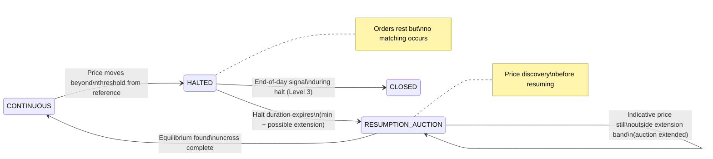

# Risk Controls, Protecting the Market

An exchange has a duty not just to its participants but to market stability as a whole. The risk controls described in this section exist because markets can go very wrong, very fast.

## Circuit Breakers

A **circuit breaker** (also called a **trading curb** in some regulatory contexts) is a mechanism that automatically halts trading when prices move too fast. The name comes from electrical circuit breakers, they "trip" to prevent damage when current (activity) becomes excessive.

**Why they exist:** In modern electronic markets, automated trading algorithms can drive prices far from fundamental value in seconds. The **2010 Flash Crash** saw the Dow Jones Industrial Average fall nearly 1,000 points in minutes before recovering [7]. Circuit breakers prevent such cascades from becoming permanent damage by imposing a mandatory pause during which participants can assess the situation, cancel erroneous orders, re-price their quotes, and allow the market to find equilibrium. A halt that lasts five minutes can prevent a price dislocation that might otherwise take hours or days to unwind.

The origin of circuit breakers is the **Black Monday crash of 19 October 1987**, when US markets fell 22.6% in a single day. The Presidential Task Force on Market Mechanisms (the Brady Commission) recommended coordinated market-wide pause mechanisms in its January 1988 report, directly leading to the first exchange circuit breakers being implemented. The full history is in the *Black Monday and the Origin of Circuit Breakers* section of Part I.

**The basic mechanism:** After each trade, the exchange calculates how much the price has moved relative to a reference price (typically the most recent auction price, or the price at the start of a defined time window). If the movement exceeds a configured threshold in either direction, trading in that symbol is halted. During the halt, new orders can still be submitted and will rest in the book, but no matching occurs. When the halt ends, trading resumes through a **resumption auction** rather than instantly returning to continuous matching — this ensures that the first post-halt price is determined by the broadest available supply and demand, not by a single resting order that happens to be at the top of a thin book.

The circuit breaker introduces its own state machine within the trading session:

Note that this is a sub-machine nested within the full trading session state machine (which is described in Part II). A halt can occur multiple times during a single session; each time the circuit breaker trips in CONTINUOUS, the session cycles through HALTED → RESUMPTION_AUCTION → CONTINUOUS before continuing.

## Should Halt Duration Be Fixed or Proportional to Move Size?

This is a genuine design question, and the answer, confirmed by how major markets actually operate, is that both the trigger thresholds *and* the halt durations should be graduated by severity. The reasoning is straightforward: the purpose of a halt is to allow participants enough time to respond. A 0.5% move may reflect a momentary liquidity gap that resolves in two minutes. A 15% move may reflect genuine macroeconomic news that requires participants to read announcements, consult risk managers, recalculate valuations, and obtain fresh margin collateral, a process that cannot be completed in two minutes no matter how urgently it proceeds.

There is also a clearing-house dimension: a large move triggers margin calls at the CCP. The clearing house must calculate the calls, and participants must fund them. A halt that ends before margin can be collected leaves the clearing house exposed to exactly the counterparty risk that margining is designed to eliminate. Longer halts on larger moves give the clearing infrastructure time to operate correctly.

**The counterargument: predictability has value.** The main argument for a fixed halt duration is that participants value certainty. A fixed 5-minute halt lets every participant set a timer, prepare their re-entry orders, and be ready the instant continuous trading resumes. A variable halt ("somewhere between 5 and 30 minutes depending on severity") creates uncertainty that can itself generate anxiety and cautious behaviour. Some exchanges deliberately publish a fixed duration for this reason, the predictability is considered worth more than the additional precision of proportional calibration.

The practical resolution used by many exchanges is a **minimum halt with conditional extension**: the halt lasts at least the minimum duration, but the resumption auction can be extended in fixed increments (say, 2 minutes at a time) if the indicative uncross price is still far from the reference price when the auction is about to close. This bounds the uncertainty (participants know the halt is at least N minutes) while preventing a forced uncross at a price nobody believes in.

## Tiered Thresholds and Durations: How Major Markets Actually Work

**US market-wide circuit breakers (S&P 500 index)**

The US operates three explicitly tiered halt levels, where the severity of the market drop determines both whether a halt occurs and how long it lasts:

| Level | S&P 500 intraday decline | Halt duration | Notes |
|---|---|---|---|
| **Level 1** | 7% | 15 minutes | Not triggered in last 35 minutes of session |
| **Level 2** | 13% | 15 minutes | Not triggered in last 35 minutes of session |
| **Level 3** | 20% | Remainder of trading day | Triggered at any time; session ends |

Level 3 is effectively infinite for that day: a 20% intraday crash ends all US equity trading. The logic is that such a move cannot be a technical error, it is a market-wide catastrophe requiring the financial system to assess damage, value positions, and meet obligations overnight before resuming trading.

These market-wide halts are rare; Level 1 was triggered four times in March 2020 during the COVID-19 crash. Level 3 has never been triggered under the current rules.

**US single-stock circuit breakers (LULD, Limit Up-Limit Down)**

For individual stocks, the US LULD system takes a complementary approach: rather than varying the halt duration by severity, it varies the *trigger band* by instrument type, acknowledging that normal volatility differs across stocks.

| Tier | Instruments | Band during regular hours | Band in early/late sessions |
|---|---|---|---|
| **Tier 1** | S&P 500, Russell 1000, selected ETFs | ±5% | ±10% |
| **Tier 2** | Other NMS stocks | ±10% | ±20% |
| **Leveraged ETFs** | Multiply the applicable tier by the leverage factor | Up to ±75% for very leveraged instruments | — |

If the price moves outside the band, a 15-second monitoring period begins. If the price does not return inside the band within 15 seconds, a 5-minute trading pause is triggered. The halt duration is fixed at 5 minutes regardless of how far the price moved, but the threshold that triggers the halt reflects the instrument's normal volatility characteristics.

## The 2020 COVID-19 Circuit Breaker Events

The most recent real-world test of the US market-wide circuit breaker system was the four Level 1 halts triggered in March 2020. These remain the only times the modern percentage-based system has halted all US equity trading, and they confirmed both that the mechanism worked as designed and that it had not been calibrated for the specific dynamics of a pandemic-driven crash.

| Date | Trigger Time (EST) | S&P 500 Level | Context |
|---|---|---|---|
| March 9, 2020 | 9:34 AM | 2,772.39 | Saudi–Russia oil price war combined with accelerating COVID-19 spread |
| March 12, 2020 | 9:35 AM | 2,564.24 | WHO declared COVID-19 a global pandemic; US announced European travel bans |
| March 16, 2020 | 9:30 AM | 2,490.47 | Triggered at the exact opening bell despite an emergency Fed rate cut overnight |
| March 18, 2020 | 12:56 PM | 2,429.23 | Intraday halt as liquidity withdrew mid-session |

Each halt lasted the mandatory 15 minutes. Trading resumed through a brief reopening auction each time. The halts functioned as the Brady Commission intended: providing a window for participants to cancel erroneous orders, re-submit with updated prices, and allow the resumption auction to establish a coordinated reopening rather than a scramble into a thin book.

Several operational characteristics of these events are worth noting for exchange system developers:

**Level 2 was not triggered** despite the Dow falling approximately 13% on March 16. The Level 2 threshold is measured from the previous day's close, and after a Level 1 halt and resumption the reference level is reset. The measurement window effectively restarts, which means a further 13% decline from the *post-halt* level would be required to trigger Level 2.

**Market-wide circuit breakers do not apply before 9:30am.** The March 16 halt triggered at the exact opening bell because the overnight futures market had already been limit-down on CME (CME imposes its own ±5% limit on equity futures outside regular hours). The circuit breaker mechanism described in this section governs only the regular session. Pre-market and after-hours risk management is handled separately at the futures exchange level.

**Single-stock LULD pauses ran in parallel.** Independently of the four market-wide halts, individual stock LULD pauses were triggered thousands of times throughout March 2020 as individual securities moved outside their instrument-level bands. Market-wide and single-stock circuit breakers are entirely separate systems with different triggers and separate enforcement.

**Eurex and European venues: volatility interruptions**

Eurex uses **volatility interruptions** for individual futures and options products. When the price moves beyond a configured range from the reference price, continuous trading is interrupted and a brief auction is called. The duration is not rigidly fixed: the auction continues until equilibrium is found, with a minimum duration and the ability to extend if the indicative price remains far from the reference. This auction-based resumption (rather than a timed pause followed by immediate continuous trading) means the halt naturally lasts as long as price discovery requires.

**Japan: daily price limits**

JPX (Japan Exchange Group) uses a different paradigm: instead of a halt, the exchange imposes **daily price limits** that prevent the price from moving more than a set percentage from the previous close. If the price hits the limit (up or down), trading can continue at that price but cannot move beyond it. This is a continuous constraint rather than a discrete halt, the market remains open but price movement is bounded. If the next day opens near the limit, the limit is widened. This approach prioritises continuity over interruption.

## Design Implications for Exchange System Developers

A well-designed circuit breaker subsystem is not a single boolean "halt or not halt." It is a configurable, multi-tier system with the following parameters per instrument (or instrument group):

- **Reference price source:** Last auction price? Rolling 5-minute reference? Opening price?
- **Measurement window:** How far back does the comparison look? (Some use the last trade; others use the last 5 minutes of trades to avoid single-trade noise.)
- **Trigger thresholds:** One threshold or multiple tiers (7%, 13%, 20%)?
- **Halt duration per tier:** Fixed time, minimum-plus-extension, or auction-until-equilibrium?
- **Extension condition:** If halt duration is extendable, what is the condition for extension? (Indicative price outside a band? Insufficient volume in the resumption auction?)
- **Maximum halt duration:** Is there a ceiling beyond which the halt automatically transitions to session-end?
- **Day-of-session rules:** Some halts (like US Level 1/2) do not trigger in the last 35 minutes of the session to avoid trapping participants with no time to exit.
- **Resumption mechanism:** Immediate continuous trading or mandatory resumption auction?

All of these should be stored in reference data and readable at runtime without a code deployment. A circuit breaker whose parameters require a software release to adjust is a liability, market conditions and regulatory requirements change, and the ability to tune the parameters independently of the engine is essential operational flexibility.

> **Key idea:** Circuit breakers are not binary on/off switches. They are tiered, configurable risk controls where both the trigger threshold and the halt duration should scale proportionally with the severity of the price movement. A small disruption needs a short pause; a large crash may end the session entirely. The US market-wide circuit breaker system (7%/15min, 13%/15min, 20%/rest-of-day) is the canonical real-world example of this principle in practice.

## Price Collars (Collar Bands)

**Price collars** are price filters that reject individual orders whose submitted price is too far from a reference price.

There are typically two bands:

**Static collar (fat-finger filter):** Compares the submitted price to the last official close price. If the submitted price is more than X% away from the close, the order is rejected. This catches "fat finger" errors, trader mistypos that accidentally add or remove a zero. A sell order at $15.00 when the stock is trading at $150.00 is almost certainly a typo and should never reach the book.

The term **fat finger** is industry slang for typing errors, accidentally pressing the wrong key. A famous fat-finger incident occurred in 2005 when a Mizuho Securities trader accidentally sold 610,000 shares of a Japanese company at 1 yen each instead of 1 share at 610,000 yen. The resulting chaos cost the firm hundreds of millions of dollars and prompted stricter controls globally. [16]

**Dynamic collar (reference price filter):** Compares the submitted price to the most recent traded price. If the submitted price is more than Y% away from the last trade, the order is rejected. This prevents a participant from slowly walking the price away from fair value through a series of trades, each slightly outside the previous range.

The two collars serve different purposes:
- The static collar protects against outright mistakes (orders many times the current price).
- The dynamic collar protects against gradual manipulation or runaway algorithms.

## Self-Match Prevention (SMP)

A participant should not be able to trade with themselves. If you have a resting sell order at $150.35 and you submit a buy order at $150.40, those orders would match, but both sides belong to you. No real change of ownership has occurred; you have simply generated artificial trading volume. This is called **wash trading** and is illegal under most exchange regulations.

**Self-Match Prevention (SMP)** detects when an incoming order would match against a resting order from the same participant (identified by gateway ID) and applies a policy:

- **Cancel Aggressor:** Cancel the incoming order. Your resting order remains. This is the most common default.
- **Cancel Resting:** Cancel the resting order and continue looking for a counterparty. Used when the new order supersedes the old one.
- **Cancel Both:** Cancel both orders. Used when you want a clean slate.

Different strategies suit different circumstances. A market maker who is re-quoting (sending new bids and asks continuously) might prefer Cancel Resting to ensure their latest quote is the active one. A participant who wants to protect their standing orders would choose Cancel Aggressor.

## Kill Switch

A **kill switch** is an emergency control that immediately cancels every resting order and quote associated with a specific participant or gateway connection.

It can be triggered by:
- **The participant themselves:** "Our system is malfunctioning, cancel everything immediately."
- **The exchange:** "This participant's behaviour is disrupting the market; we are cancelling all their orders."
- **Automatic disconnect handling:** If a gateway connection is lost, the exchange may automatically trigger a kill switch to prevent stale orders from sitting in the book without the participant being able to manage them.

After a kill switch, the participant's connection is typically marked as **inactive**. Before they can re-enter orders, they must reconnect and authenticate. This gives a human a chance to assess the situation before resuming trading.

Kill switches are mandatory features under regulations including MiFID II (EU) and the **Market Access Rule (Rule 15c3-5, 2010)** in the United States. As noted in the *How Exchanges Are Regulated* section of Part I, the Market Access Rule was enacted directly in response to the 2010 Flash Crash and requires broker-dealers to have pre-trade risk controls and post-trade monitoring, including the ability to immediately halt trading. MiFID II additionally mandates that kill switch functionality be **regularly tested** — it is not sufficient to have a kill switch that works only in theory. Every exchange must demonstrate the ability to cancel a participant's orders immediately when required, and must produce evidence of this capability to regulators on request.

## Mass Cancel, Not the Same as a Kill Switch

These two mechanisms are frequently confused because they both result in orders being cancelled. They serve entirely different purposes and have entirely different consequences for the participant.

**Mass cancel** is an order management message, a normal, operational request submitted by the participant themselves to cancel multiple orders at once. It is intentional, deliberate, and routine. Examples:

- "Cancel all my resting orders in AAPL", a trader repositioning ahead of earnings.
- "Cancel all DAY orders across all symbols", an end-of-session cleanup.
- "Cancel all my orders on the bid side", a market maker pausing one side of their quotes while reassessing direction.

After a mass cancel executes, the participant's gateway connection remains **fully active**. The participant can immediately submit new orders. There is no interruption to their session, no authentication required, no human review needed. The mass cancel is simply a fast, convenient way to withdraw multiple resting orders with a single message rather than cancelling each one individually.

A mass cancel generates individual cancellation events for each order in the audit trail, exactly as if the participant had cancelled each order manually. From the exchange's perspective, it is indistinguishable from a burst of individual cancel messages; it just arrives more efficiently.

**The kill switch**, by contrast, is an emergency measure. Its defining characteristics that distinguish it from mass cancel are:

| | Mass Cancel | Kill Switch |
|---|---|---|
| Who initiates | Participant only | Participant, exchange, or auto-triggered |
| Gateway remains active | Yes, participant can send new orders immediately | No, gateway is marked INACTIVE |
| Purpose | Routine order management | Emergency: malfunction, regulatory action, disconnect |
| Reconnect required | No | Yes, human review before resuming |
| Audit log entry | Series of cancel events | GATEWAY_SUSPENDED event + cancel events |
| Can target a subset of orders | Yes (by symbol, side, type) | No, cancels everything for that gateway |
| Used for scheduled cleanup | Yes | No, misusing it would lock out the participant |

A market maker who updates their quotes hundreds of times per second will use mass cancel routinely during the session, for example, withdrawing all quotes when MMP fires, or when they detect a stale data feed. They would never use a kill switch for this; a kill switch would force them to re-authenticate before trading again.

A kill switch is invoked when a system is out of control. A mass cancel is invoked when a system is in control but wants to change its position quickly.

> **Key idea:** Use a kill switch when something has gone wrong and a human must intervene before trading resumes. Use a mass cancel when a participant wants to cancel orders as part of normal operation. The difference is not just functional, it is architectural: the kill switch changes the gateway state; the mass cancel does not.

