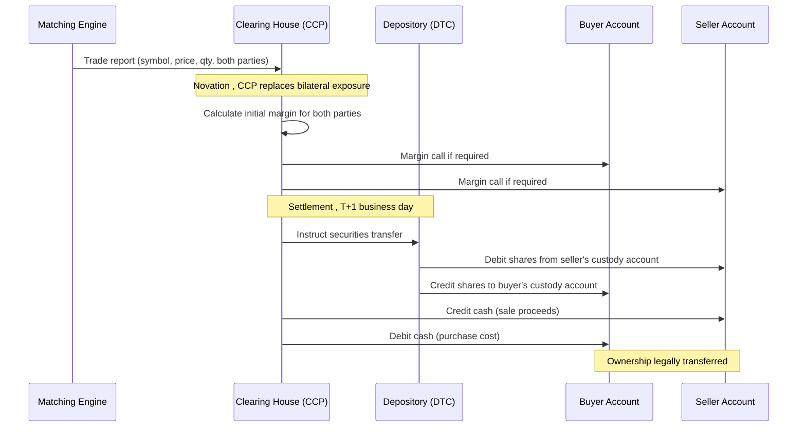

# Clearing and Settlement, When the Trade Becomes Real

Matching an order creates a **trade agreement**, two parties have committed to exchange shares and money. But the matching is just the beginning. Before ownership actually changes hands, the trade must be **cleared** and **settled**. Many engineers initially believe that matching equals completion. In reality, matching, clearing, and settlement are three distinct processes with different institutions, different timelines, and different risks.

> **Key idea:** Matching creates an agreement. Clearing determines and guarantees obligations. Settlement transfers assets. All three must succeed before the trade is legally complete. Each involves separate systems and separate institutions.

## What Matching Creates

When the matching engine fills two orders, it creates a **trade record**, an agreement that Participant A will sell X shares to Participant B at price P. At this point:
- The shares have not moved.
- The money has not moved.
- The trade is an obligation, not a completed transfer.

Both parties are now **counterparties** to each other. If either defaults, fails to deliver the shares or fails to pay, the other party suffers.

## Clearing: Guaranteeing the Trade

**Clearing** is the process by which a third party, the **Central Counterparty Clearing House (CCP)**, steps between the buyer and seller and guarantees the trade will settle, even if one party defaults.

Through a legal process called **novation**, the CCP becomes:
- The seller to every buyer.
- The buyer to every seller.

After novation, Participant A no longer has a counterparty exposure to Participant B. They have a counterparty exposure only to the CCP. And Participant B has a counterparty exposure only to the CCP. Neither party needs to worry about the other's creditworthiness.

This is transformative for market structure: it means participants can trade with strangers, people they have never met and know nothing about, with confidence that the trade will settle, because the CCP's creditworthiness is the only thing that matters.

**Major CCPs:**
- **OCC (Options Clearing Corporation):** Clears equity options in the US.
- **DTCC (Depository Trust and Clearing Corporation) / NSCC:** Clears most US equity trades.
- **LCH:** Major clearing house in Europe and globally, clearing interest rate swaps, equities, and other products.
- **Eurex Clearing:** Clears Eurex derivatives and selected equity trades.
- **CME Clearing:** Clears futures and options on CME Group exchanges.

## Margin: The Clearing House's Protection

If the CCP guarantees every trade, how does it protect itself from losses if a participant defaults? The answer is **margin**, collateral that participants must post to cover their potential losses.

**Initial margin** is deposited when a position is opened. It represents an estimate of the maximum likely loss over a short period (typically 1–2 days). For a long position in 1,000 shares of a $150 stock, the initial margin might be 10%, meaning $15,000 deposited as collateral before the position can be held overnight.

**Variation margin** (also called **mark-to-market**) is the daily cash settlement of gains and losses. At the end of each trading day, positions are revalued at the current market price. If the price moved against you, cash equal to the loss is transferred from your margin account via the CCP. If it moved in your favour, you receive cash. The key point is that losses are realised in cash *each day* rather than accumulating silently. Worked example: you are long 10,000 shares bought at $150. At day's end the closing price is $145. Your variation margin debit is $5 × 10,000 = **$50,000**, transferred from your account to the CCP. The following day you start with a position valued at $145, not $150. Your accumulated loss is never larger than one day's move, because it was cashed out yesterday.

**Maintenance margin** is the minimum balance that must be maintained. If losses cause the balance to fall below this level, the participant receives a **margin call** , a demand to deposit additional collateral immediately. Failure to meet a margin call results in the CCP liquidating the position to recover the deficit.

Margin is especially important for derivatives (futures, options) where positions are leveraged and losses can exceed the initial investment. The most consequential demonstration of what happens when margin requirements are inadequate is the **2008 financial crisis**, and specifically the collapse of **Lehman Brothers** on 15 September 2008.

Lehman filed for bankruptcy with over $600 billion in liabilities [Federal Reserve Bank of New York, 2010]. A large portion of Lehman's derivatives exposure was in **OTC (over-the-counter) derivatives** , bilateral contracts negotiated directly between Lehman and individual counterparties, not cleared through a CCP. These contracts had no daily variation margin settlement, no novation, and no independent collateral calculation. When Lehman defaulted, its counterparties discovered that the bilateral collateral arrangements were insufficient to cover the full exposure. The resulting losses, uncertainty about who held what exposure, and the consequent freeze in credit markets contributed directly to the worst financial crisis since the Great Depression.

The contrast with exchange-traded and CCP-cleared derivatives is direct: CME Clearing required daily mark-to-market variation margin on all futures positions. No CME futures participant suffered an uncollateralised counterparty loss from the Lehman bankruptcy, because the CCP had collected daily variation margin throughout the life of each position and held margin sufficient to cover the default. CME's guarantee fund covered any residual shortfall. The crisis is the strongest argument ever made in favour of mandatory central clearing for derivatives , a principle subsequently enshrined in the Dodd-Frank Act in the US (2010) and the European Market Infrastructure Regulation (EMIR, 2012), both of which require most standardised OTC derivatives to be cleared through authorised CCPs [BIS, 2019].

## Clearing Members and the Clearing Hierarchy

Not all market participants have direct relationships with the CCP. The clearing infrastructure is organised in layers:

**Direct clearing members** (or **general clearing members**) are firms , typically large banks and broker-dealers , that have a direct legal relationship with the CCP. They post margin directly to the CCP and are responsible for guaranteeing trades cleared in their name. They may also clear trades on behalf of others.

**Non-clearing members** are firms whose trades must be guaranteed by a clearing member. A hedge fund, for example, typically cannot be a direct clearing member of a CCP. Instead, it routes its trades through a **clearing broker** (usually a prime broker who is also a clearing member), who guarantees settlement to the CCP. The hedge fund posts margin to the clearing broker; the clearing broker posts to the CCP.

This hierarchy matters for exchange developers because the clearing system must track not just which firm traded, but which clearing member guarantees each trade. The risk layering determines who bears the loss if a participant defaults: first the participant's posted margin, then the clearing broker's guarantee, then the CCP's guarantee fund, and finally the surviving clearing members' mutualized contributions. Understanding this chain explains why clearing brokers care so intensely about the credit quality and position size of their clients.

## Delivery versus Payment (DvP)

**Delivery versus payment (DvP)** is the settlement principle that the transfer of securities and the transfer of cash happen simultaneously and conditionally: neither the securities nor the cash are released until both are available. This eliminates the risk of one party delivering while the other fails to pay.

The risk DvP is designed to eliminate has a name in financial history: **Herstatt risk**, after the 1974 failure of Bankhaus Herstatt, a small German bank. On 26 June 1974, German banking regulators withdrew Herstatt's banking licence at 3:30pm local time, after the close of interbank settlement in Germany but while the New York foreign exchange settlement was still open. Herstatt had already received Deutsche Mark payments from its counterparties in Germany but had not yet made the corresponding US dollar payments to banks in New York. Those New York banks had delivered value but received nothing, and the abrupt closure meant they never would. The losses and resulting settlement uncertainty froze parts of the interbank market for days [BIS Committee on Payment and Settlement Systems, 2003]. Herstatt risk , the risk that one leg of a settlement transfers while the other fails , is the foundational motivation for the DvP principle.

Without DvP, a seller might deliver shares and then find the buyer has defaulted before paying. DvP ensures atomicity: either both transfers happen or neither does.

## Settlement: The Actual Transfer

**Settlement** is the final exchange, shares move from the seller's custody account to the buyer's, and cash moves from the buyer's account to the seller's. After settlement, ownership has legally changed.

US equities currently settle on **T+1**, one business day after the trade date. The market previously operated on T+5 (paper certificates and bicycle messengers), then T+3, then T+2 as settlement infrastructure was digitised, and moved to T+1 in 2024 [8]. Some markets (certain money market funds, US Treasury securities) already settle same-day. Same-day settlement eliminates settlement risk entirely but requires that cash and securities be available at the moment of trading.

## Failed Settlement

Not all trades settle on time. A **failed settlement** occurs when one party cannot deliver, the seller lacks the shares (perhaps their own purchase has not yet settled), or the buyer lacks the cash. Failed settlements create a cascading chain of problems, since other participants may be counting on receiving those shares to fulfil their own obligations.

**Buy-ins** are a remedy: if a seller fails to deliver shares, the buyer has the right to purchase the shares in the open market at the seller's expense. Buy-ins are relatively rare in liquid markets but are a meaningful operational risk in illiquid or small-cap stocks.

## Custody and Depositories

**Custody** refers to the safekeeping of securities on behalf of investors. Most investors do not directly hold share certificates, their broker holds shares in a nominee account at a **depository**. The depository maintains the master record of who owns what.

In the US, the **DTCC's Depository Trust Company (DTC)** is the central securities depository, it holds the vast majority of US equity shares. Electronic book-entry transfers between DTC accounts enable settlement without physical movement of certificates.

This dematerialisation (replacing paper certificates with electronic records) is what made T+5→T+3→T+2→T+1 settlement possible. When settlement meant physically moving certificates, five days was genuinely necessary. With electronic records, same-day settlement is technically feasible.

## VWAP and P&L

A clearing system tracks each participant's **position** (how many units they hold, positive for long, negative for short) and their **Profit and Loss (P&L)**.

**VWAP (Volume-Weighted Average Price)** is the average price paid for a position, weighted by quantity filled. If you buy 100 shares at $150 and then 50 more at $160, your VWAP is (100×$150 + 50×$160) / 150 = **$153.33**. Your break-even price is $153.33; selling above this generates profit, selling below generates a loss. Market participants use VWAP both as a benchmark for execution quality (did you beat the average price over the period?) and as the entry price for P&L calculation.

**Unrealised P&L** (also called **open P&L** or **mark-to-market P&L**) is the gain or loss on positions that have not yet been closed. If you hold 150 shares with a VWAP of $153.33 and the current market price is $160, your unrealised P&L is (160 − 153.33) × 150 = **$1,000.50**. It is "unrealised" because you have not yet sold and may not receive that price. Unrealised P&L is updated continuously as the market price moves.

**Realised P&L** is the gain or loss locked in by completed trades. If you sell all 150 shares at $160, your realised P&L becomes $1,000.50 and the position is closed to zero. Realised P&L does not change after the trade is done; it is a permanent record of what was earned or lost.

For exchange developers, the distinction matters because position monitoring systems must track both: unrealised P&L is what triggers margin calls and risk alerts in real time, while realised P&L is what flows into the official accounting records at end of day.

