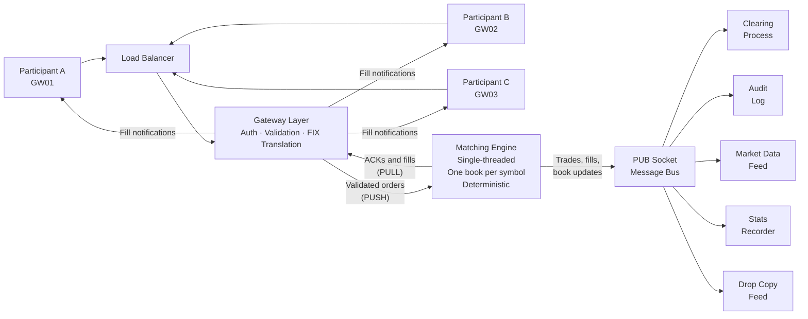

# Part IV: Technology, Infrastructure, and Market Ecology

*The engineering stack, distributed-systems concerns, market data, and the broader market ecology in which the exchange operates.*

**Part Summary:**

Examine the engineering reality of exchanges at scale: deterministic engines, messaging and market-data distribution, resilience patterns, and the fragmented multi-venue environment where routing and latency shape outcomes.

**Learning Objectives:**

- Understand the roles of gateways, matching engines, buses, and subscribers.
- Evaluate resilience strategies such as replication, failover, and site architecture.
- Explain how market data sequencing, replay, and snapshots preserve correctness.
- Relate routing, venue fragmentation, and latency design to execution quality.

**Content:**

- Speed Bumps, Leveling the Playing Field
- The Technology Architecture
- Primary and Secondary Sites, Resilience Architecture
- Load Balancing, Distributing the Work
- Market Data Architecture, How the Market Sees Itself
- Smart Order Routing and Market Fragmentation
- Latency and Co-location, The Speed Dimension
- Corporate Actions, When the Instrument Changes
- Determinism, Replay, and Persistence, The Exchange Must Not Forget
- Reference Data, The Exchange's Ground Truth


## Speed Bumps, Leveling the Playing Field


Not all exchange participants operate on equal footing. High-frequency trading (HFT) firms invest enormously in technology, co-location in exchange data centres, microwave and laser communication links between exchanges, custom hardware, to be a few microseconds faster than their competition. Being faster means they can see price changes and react before others can, which is profitable but controversial.

### What Is a Speed Bump?

A **speed bump** is a deliberate artificial delay introduced by the exchange to all incoming orders. By delaying every order by the same small amount (say, 350 microseconds), the exchange eliminates the advantage of being just slightly faster than everyone else. If both the HFT firm's order and the institutional investor's order are delayed by 350 microseconds, the time gap between them is irrelevant.

### IEX: The Most Famous Speed Bump

**IEX (Investors Exchange)**, founded in 2012 and launched as a regulated exchange in 2016, introduced the speed bump concept to mainstream exchange operation [6]. IEX routes all orders through 38 miles of coiled fibre-optic cable (housed in a small box called the "magic shoe") before they reach the matching engine. The cable introduces a fixed 350-microsecond delay.

IEX's founders argued in the book *Flash Boys* (Lewis, 2014) [6] that speed advantages primarily benefit HFT firms at the expense of long-term investors. The speed bump was their answer. IEX gained significant market share and regulatory approval, demonstrating that speed bumps are a viable exchange design.

### Speed Bumps in Broader Design

Speed bumps can be applied selectively, for example, only to **cancel** messages but not to new orders. This prevents a practice called **last-look** where a market maker posts an order, and then when someone attempts to fill it, the market maker races to cancel before the fill completes. If cancels are delayed but the fill is immediate, the market maker cannot escape the fill.

Several European venue operators and regulators have discussed asymmetric speed bump rules for cancel messages under MiFID II's framework for algorithmic trading controls, though no major European exchange has adopted a speed bump comparable to IEX's.

## The Technology Architecture


Now let us look at how all these concepts are realised in a production technology stack.



### The Gateway

The **gateway** is the participant-facing interface, the "door" through which participants connect to the exchange. Each participant connects through their assigned gateway. The gateway's responsibilities:

- **Authentication:** Verifying the participant's identity and credentials.
- **Session management:** Tracking active connections, handling reconnections.
- **Message translation:** Converting the participant's orders from their format (FIX protocol, binary, or text commands) into the exchange's internal format.
- **Basic validation:** Checking that mandatory fields are present, that the symbol is valid, that quantities are positive.

Importantly, the gateway does **not** validate tick alignment (whether prices are exact multiples of the tick size), it does not know the tick size for every symbol. That responsibility belongs to the engine.

**FIX Protocol:** The industry-standard format for order submission is FIX (Financial Information eXchange), a text-based protocol developed in the early 1990s. A FIX order message looks something like:
```
8=FIX.4.2|35=D|49=CLIENT1|56=EXCHANGE|11=ORDER001|55=AAPL|54=1|38=100|44=150.30|40=2|59=0
```
(Note: the `|` separator here is a display convention. On the wire, FIX uses the SOH character, ASCII value 1, a non-printable control character, as the field delimiter. Tools and documentation almost always substitute `|` or `^A` for readability.)

All eleven fields in this message have meaning:

| Tag | Name | Value | Meaning |
|---|---|---|---|
| 8 | BeginString | FIX.4.2 | Protocol version |
| 35 | MsgType | D | New order (single-sided) |
| 49 | SenderCompID | CLIENT1 | Who is sending this message |
| 56 | TargetCompID | EXCHANGE | Who should receive it |
| 11 | ClOrdID | ORDER001 | Client's own order identifier (used to track and cancel) |
| 55 | Symbol | AAPL | Instrument to trade |
| 54 | Side | 1 | 1=Buy, 2=Sell |
| 38 | OrderQty | 100 | Quantity in shares |
| 44 | Price | 150.30 | Limit price |
| 40 | OrdType | 2 | 1=Market, 2=Limit, 3=Stop |
| 59 | TimeInForce | 0 | 0=DAY, 1=GTC, 3=IOC, 4=FOK, 7=ATC |

Most exchanges accept FIX (or a compressed binary variant called FAST or ITCH for market data). A simplified FIX-inspired text format for internal gateway commands might look like: `NEW|SYM=AAPL|SIDE=BUY|TYPE=LIMIT|QTY=100|PRICE=150.30`.

### The Matching Engine

The matching engine is the exchange's core computational component: the software that receives every incoming order, maintains the state of all order books, and executes trades when compatible buy and sell orders can be paired. It sits at the centre of the architecture, receiving from all gateways through a single serialised input queue and publishing results to all subscribers. A single-threaded design, one book per symbol, and deterministic processing are its defining characteristics, each discussed in detail in the *Matching Engine* section above. The gateway is the entry point into this pipeline; the engine is where the actual work happens.

### The Message Bus

The matching engine communicates with all other components through a **message bus**, a pub/sub (publish/subscribe) messaging system. The engine publishes events (trades, order status changes, book snapshots) to topics, and subscribers connect to the topics they care about.

**ZeroMQ (ZMQ)** is a popular messaging library for this purpose. The engine has a PUSH/PULL socket pair with the gateways (for commands flowing in) and a PUB socket (for market data and events flowing out to subscribers).

Topics on the PUB socket might include:
- `trade.executed.AAPL`, a trade happened in AAPL
- `order.fill.GW01`, a fill event for Gateway 01's participant
- `book.snapshot.AAPL`, current state of the AAPL order book
- `session.state`, the trading session changed state

Subscribers filter by topic, receiving only the events relevant to them.

### Subscribers

Any process that connects to the engine's PUB socket and processes events is a **subscriber**. Common subscribers:

- **Clearing process:** Tracks positions and P&L for all participants, generates clearing reports.
- **Stats recorder:** Stores OHLCV (Open, High, Low, Close, Volume) statistics to a database for historical analysis.
- **Viewer/Board:** Display processes that show the current order book, recent trades, and market data on screens.
- **Ticker:** A simplified display of the most recent prices.
- **Audit log:** A complete, immutable record of every event, for regulatory purposes.
- **AI trader / algorithmic participants:** Automated trading strategies that observe market data and submit orders.

The key design principle: subscribers are passive receivers. They observe the market through event streams. They do not write to the order book.

### Book Snapshots

Subscribers that start up mid-session need a way to get caught up on current book state without replaying every event since the start of day. The engine periodically publishes **book snapshots**, a complete current view of all resting orders, aggregated by price level, to the market data feed. A subscriber that misses events can simply wait for the next snapshot, typically published every 500 milliseconds per symbol.

Snapshots include:
- All bid price levels with total resting quantity
- All ask price levels with total resting quantity
- The last trade price and quantity
- Recent trade history (a rolling window of the last N trades)
- The current tick size for the symbol (so subscribers can correctly format prices)

## Primary and Secondary Sites, Resilience Architecture


A financial exchange is critical infrastructure. If it goes down unexpectedly, due to hardware failure, software bug, network outage, or even a power cut, the consequences are severe: participants cannot trade, prices cannot be discovered, and confidence in the market is damaged. For this reason, exchanges operate with **redundancy**, duplicate systems at separate locations.

### Primary and Secondary Sites

A **primary site** (also called the **primary** or **production site**) is where the live matching engine runs. All orders are processed here, all trades happen here.

A **secondary site** (also called the **backup**, **disaster recovery site**, or **secondary**) is an identical system at a geographically separate location. Its purpose: if the primary site becomes unavailable, the secondary site can take over and continue matching.

Real exchanges take this very seriously. NASDAQ, for example, operates data centres in multiple states. The LSE has co-primary sites in Basildon (Essex) and a secondary site elsewhere in England. CME has sites in Aurora (Illinois) and other locations.

### Synchronisation: Keeping the Secondary Current

For the secondary to be able to take over instantly, it must be an exact replica of the primary's state at all times. This means every order, trade, and state change on the primary must be reflected on the secondary with minimal delay.

Approaches include:

**State replication:** The primary engine sends every order event to the secondary before or immediately after processing it. The secondary maintains an identical copy of the order book, only it does not publish results or accept new orders from participants, it merely follows along silently.

**Log-based replication:** Every incoming message is written to a durable **write-ahead log (WAL)** before being processed. The secondary replays from the log. If the primary fails, the secondary catches up to the log's tail and takes over. This is architecturally similar to how database replication works (PostgreSQL's streaming replication, for example, uses this approach).

**Consensus protocols:** In the most robust designs (used by clearing houses and critical infrastructure), a consensus algorithm like **Raft** or **Paxos** ensures both the primary and secondary agree on every event before it is considered "committed." Nothing is published to participants until both sites confirm they have the event. This guarantees zero data loss on failover but adds latency.

### Failover

**Failover** is the act of switching from the primary to the secondary. It may be:

- **Automatic (active-passive):** The system detects the primary has stopped responding (via heartbeat monitoring) and automatically promotes the secondary to primary, alerting participants. The challenge: detecting a true failure vs. a temporary network partition without making hasty decisions (the **split-brain problem**, if both sites think the other is dead, both might try to become primary simultaneously, resulting in two active engines accepting conflicting orders).

- **Manual (operator-controlled):** A human operator monitors the primary and initiates failover when a problem is confirmed. This is slower (seconds or minutes, not milliseconds) but avoids false failovers.

- **Active-active:** Both sites process orders simultaneously, and a consensus mechanism ensures they produce identical results. Extremely complex but enables zero-downtime failover.

  True active-active matching engines are **rare in production exchanges** because distributed consensus introduces latency, and maintaining deterministic total ordering across two simultaneously-processing sites is a fundamentally hard problem. Most production exchanges prefer active-passive or shadow replication rather than active-active, accepting a brief failover window in exchange for simplicity and predictable latency.

### The Geographic Trade-Off

Placing the secondary site far from the primary protects against geographically localised disasters (earthquakes, floods, building fires). But distance means higher network latency, making synchronisation slower.

A common compromise: a "near" site (same city or region, connected by dark fibre) provides fast synchronisation and fast failover, plus a "far" site (different country or continent) for true disaster recovery.

## Load Balancing, Distributing the Work


A single exchange may serve dozens of gateways simultaneously, each handling orders from hundreds of participants. As trading volume grows, a single matching engine process may become a bottleneck.

### Horizontal Scaling Across Symbols

The most natural scaling approach for an exchange is to distribute different symbols across different matching engine instances. The AAPL book and the MSFT book are completely independent, they can run on different servers, different processes, even in different data centres.

This is called **partitioning by symbol**. It scales well: adding a new server lets you handle more symbols, without requiring coordination between servers (since no order crosses symbol boundaries except through combo order handling at a higher level).

### Gateway Load Balancing

Multiple gateway processes can run in parallel, each accepting connections from different participants. Gateways forward orders to the appropriate matching engine instance based on symbol. This allows gateway capacity to scale independently of matching engine capacity.

A **load balancer** sits in front of the gateways, distributing incoming participant connections across the available gateway processes. Participants typically do not know which specific gateway process they are connected to, the load balancer makes this transparent.

### The Unique Order Number Challenge

This is where scaling creates a genuinely complex problem, and it is worth understanding in detail.

Every order must have a **unique identifier**, a number or string that unambiguously identifies it across the entire system, forever. The order ID appears in trade records, audit logs, regulatory reports, and clearing messages. It must be:

1. **Unique:** No two orders should ever have the same ID.
2. **Monotonically increasing:** A later order should always have a higher (or at least not lower) ID than an earlier order. This property is valuable for sequencing, for detecting missed events, and for regulatory audit trails that can be sorted by order arrival.
3. **Globally consistent across sites:** If the primary site generates order ID 1000 and then the secondary takes over, the secondary must not also generate an order ID 1000 for a different order.

**The straightforward solution:** A single, central counter. Every time an order arrives, atomically increment the counter and assign the result. Order IDs are 1, 2, 3, 4... This is perfectly monotonic and unique.

**The problem:** A single central counter is a single point of failure. If that counter's database is unavailable, no new orders can be accepted, the entire exchange halts. It is also a bottleneck, every order, from every gateway, must go through the same counter.

**Solution 1: Pre-allocated ranges.** The primary site and secondary site each hold a pre-allocated range of IDs. The primary uses 1–1,000,000; the secondary uses 1,000,001–2,000,000. If the primary uses up its range and requests more, the allocation manager assigns the next block. If the primary fails and the secondary takes over, the secondary continues from its own unused range. No IDs collide, and no coordination is needed at order submission time.

The challenge: if the primary used IDs 1–50,000 before failing and the secondary starts from 1,000,001, there is a large gap in the ID sequence. This is not strictly a problem (the IDs are still unique and monotonically increasing) but it can confuse monitoring systems that expect dense sequences.

**Solution 2: Site-prefixed IDs.** Each site adds a prefix to its generated IDs: `P-000001` for primary, `S-000001` for secondary. IDs are unique because the prefixes differ. This is simple but makes IDs slightly longer, and "comparing" IDs (which one came first?) requires stripping the prefix.

**Solution 3: Time-based IDs.** Compose the ID from the nanosecond timestamp plus a site identifier plus a sequence number within that nanosecond. For example: `{timestamp_ns}{site_id}{seq}`. This is monotonically increasing (later timestamps = higher IDs), unique per site (different site IDs), and unique within a nanosecond (the sequence counter handles simultaneous orders). Used in various forms by high-volume systems. The challenge: the IDs become very large numbers.

**Solution 4: UUIDs.** A **UUID (Universally Unique Identifier)** is a 128-bit random or time-based identifier. UUID v4 is randomly generated; UUID v1 is based on time and network address. UUIDs are practically guaranteed unique without coordination. The drawback: they are not sequential, and they are large (32 hex characters). Sorting by UUID does not give you arrival order.

**In practice:** Exchange systems typically use a hybrid approach, a system like pre-allocated ranges for transaction ordering (where strict monotonicity matters), and UUIDs for order IDs in internal databases (where uniqueness is paramount and ordering can be handled separately by timestamp). A common approach uses UUID-based order IDs combined with monotonically increasing nanosecond timestamps to achieve both uniqueness and chronological ordering.

### Monotonic Timestamps Across Sites

The nanosecond timestamp on each order must be monotonically increasing, not just within one machine, but across the entire system. If the primary is generating timestamps and then the secondary takes over, the secondary cannot start generating timestamps smaller than the last one the primary generated.

This requires clock synchronisation (NTP or PTP), monotonic enforcement via a wrapper that guarantees strictly increasing values, and site coordination when the secondary takes over.

**An important nuance:** in practice, deterministic sequencing identifiers matter more than absolute wall-clock timestamp precision. Production exchange systems frequently tolerate small amounts of clock drift and same-timestamp collisions, because the canonical ordering of events is defined by **sequencing infrastructure**, the order in which the single-threaded engine processes messages from its queue, not by the wall-clock value of the timestamp. Timestamps are primarily for auditability and observability; the sequencing of the input queue defines what actually happens. The monotonic enforcement described here prevents the most obvious failures (a clock jumping backward and assigning a "past" timestamp to a new order), but it is the engine's input queue, not the clock, that ultimately determines priority.

## Market Data Architecture, How the Market Sees Itself


The order book and trade data produced by the matching engine are published as **market data**, real-time feeds that participants and their systems consume to make trading decisions. Market data architecture is a significant engineering domain in its own right.

### Snapshots vs Incremental Updates

A **snapshot** is a complete picture of the current book state: all resting price levels, their quantities, the last trade price, recent trade history. A **incremental update** (also called a **delta**) describes only what changed since the previous message, an order was added, a fill occurred, a level was removed.

Sending full snapshots is wasteful, most of the book did not change. Production systems send incremental updates continuously and periodic full snapshots (e.g., every second or every 5 seconds) so that subscribers who missed messages can resynchronise.

### Sequence Numbers

Every market data message carries a **sequence number**, a monotonically increasing integer. Subscribers track the last received sequence number. If a message with sequence number 1000 arrives followed by 1002, the subscriber knows message 1001 was lost (a **gap**). The subscriber must either request a replay of message 1001 or wait for the next full snapshot to resynchronise.

Without sequence numbers, a subscriber has no reliable way to detect data loss. A subscriber that silently misses a cancellation event would have a stale view of the book, showing a resting order that no longer exists, and any trading decisions based on that view could be incorrect.

### Gap Recovery and Replay

Exchanges provide a **replay channel** or **retransmission service**: a subscriber can request resending of specific message sequence numbers it missed. Some exchanges use **multicast** delivery for the live feed (one packet sent to all subscribers simultaneously) and **unicast TCP** for retransmission (individual resend requests).

The replay buffer typically holds the last N seconds of messages, enough to cover a brief network hiccup. A subscriber disconnected for several minutes may not be able to replay from the live feed and must wait for the next full snapshot.

### Conflation

When the exchange is under high load, market data messages may queue behind each other. **Conflation** is the process of merging consecutive updates for the same price level into a single message, reducing message volume at the cost of losing intermediate states. A subscriber using conflated data may not see every individual order addition and cancellation, it only sees the net effect on each price level. This is acceptable for display purposes but not for analytical systems that need complete tick data.

### Tick-to-Trade Latency

**Tick-to-trade latency** is the time from when a market data message leaves the exchange to when a trading decision based on that message results in an order being submitted and received by the exchange. It is a critical performance metric for market makers and HFT firms. Reducing tick-to-trade latency requires optimising every component in the path: network delivery, data parsing, decision logic, order serialisation, and order routing.

### Top-of-Book vs Depth-of-Book

Some participants subscribe only to **top-of-book** data (best bid and ask prices and quantities only, Level 1). Others subscribe to **depth-of-book** (multiple price levels, Level 2). Depth data requires more bandwidth and processing but enables more sophisticated analysis of near-term price pressure.

> **Key idea:** Market data is not just a convenience, it is the primary input to every trading algorithm and market maker. Its correctness, latency, and sequencing directly affect the quality of market participants' decisions. Exchange developers must treat market data publishing with the same rigour as the matching engine itself.

## Smart Order Routing and Market Fragmentation


Modern equity markets are not a single exchange. In the US, there are over a dozen registered stock exchanges plus dozens of alternative trading venues, all trading the same stocks. This fragmentation has profound implications for participants and exchange systems.

### Why Markets Are Fragmented

Regulatory choices drive fragmentation. In the US, **Regulation NMS** (National Market System), implemented in 2007, required that orders be filled at the best available price across all exchanges, creating strong incentives for new venues to compete with NYSE and NASDAQ. The EU's **MiFID II** directive had similar effects in European markets. Today, a stock like AAPL may have 5–15% of its volume on NYSE, 25–30% on NASDAQ, and the remainder distributed across CBOE, IEX, EDGX, EDGA, and other venues, plus dark pools and internalisers.

### The National Best Bid and Offer (NBBO)

In the US, regulators require that market participants be offered the best available price across all exchanges. The **National Best Bid and Offer (NBBO)** is the highest available bid price and the lowest available ask price, computed in real time across all exchanges. If AAPL's best bid is $150.30 on NYSE and $150.31 on NASDAQ, the NBBO bid is $150.31. A market sell order must be executed at the NBBO price or better, a broker cannot route it to NYSE at $150.30 when $150.31 is available elsewhere.

### Smart Order Routing (SOR)

A **Smart Order Router (SOR)** is software that determines how to route an order across multiple venues to achieve the best overall execution. For a large buy order, the SOR might:
1. Route 200 shares to IEX (cheapest in fees).
2. Route 500 shares to NASDAQ (deepest at the best ask).
3. Route 300 shares to CBOE (additional depth at the next price level).
4. Hold back remaining shares pending fills.

The SOR must evaluate venue fees, available depth, likely price impact, and speed simultaneously. A naive router that always sends everything to the same exchange would often leave better prices on the table elsewhere.

### Dark Pools and Hidden Liquidity

A **dark pool** is a trading venue, often operated by a bank or broker-dealer, where orders are not displayed in a public order book. Participants submit orders to the dark pool and are matched against other participants' dark pool orders, typically at the midpoint of the NBBO. The trade is only publicly reported after it occurs.

Why would anyone use a dark pool? A large institutional investor trying to buy 1 million shares knows that showing their intention in a lit (public) order book would immediately move prices against them as other participants react. By routing to a dark pool, they hide their intent and may receive fills at better prices with less market impact.

The trade-offs: dark pools offer less market impact for large orders but provide no pre-trade transparency (you cannot see what orders are resting, or whether a counterparty exists at all). **Lit markets** (public order books on regulated exchanges) offer full pre-trade transparency but more information leakage.

The existence of dark pools explains why the displayed order book is not the whole market. At any moment, significant liquidity may be available in dark venues that is invisible to standard Level 2 data.

> **Key idea:** When working on exchange software, be aware that "the market" is larger than "the exchange." Smart order routing, fragmented liquidity, and dark pools are the reality in which the exchange you are building operates. Features like the NBBO, order routing decisions, and market data aggregation all exist because of fragmentation.

### Payment for Order Flow (PFOF)

**Payment for Order Flow (PFOF)** is a practice in which retail brokers sell their clients' order flow to wholesale market makers, large firms such as Citadel Securities, Virtu Financial, and G1 Execution Services, rather than routing orders to lit exchanges. The market maker pays the broker a per-share fee for the right to execute the orders internally.

Why do market makers pay for retail flow? Retail orders have low **adverse selection risk**, retail investors are statistically less likely to be trading on superior information than institutional investors or HFT firms. A market maker can fill a retail order at or near the NBBO and earn the spread with relatively low risk of being "picked off." The retail flow is essentially a stream of low-risk, profitable execution opportunities.

Why do brokers accept PFOF instead of routing to exchanges? The payment from market makers subsidises the broker's operations, enabling the zero-commission trading that many retail brokers now offer. Platforms like Robinhood derive a significant fraction of their revenue from PFOF.

**The controversy.** PFOF supporters argue that retail orders receive **price improvement**, fills at prices better than the NBBO bid or ask, because market makers compete for the flow. Critics argue that by routing to market makers rather than lit exchanges, retail orders never contribute to public price discovery; the market maker captures the profit that would otherwise benefit the investor through tighter spreads; and the broker has a structural conflict of interest (paid to route to a market maker, not to find genuinely best execution).

PFOF is **banned in the United Kingdom and the European Union** under MiFID II, which requires all brokers to achieve best execution and prohibits inducements that conflict with client interests. In the US, the SEC proposed significant restrictions on PFOF in 2022 as part of a broader equity market structure reform. As of 2024 the regulatory landscape is evolving; developers building exchange or brokerage infrastructure should be aware that PFOF rules may change.

### Best Execution, The Regulatory Foundation

**Best execution** is the regulatory obligation for brokers and investment firms to take all reasonable steps to achieve the best possible outcome for their clients when executing orders. "Best" is not simply the highest price or lowest cost in isolation, regulators define it as the best overall result considering price, execution costs, speed, likelihood of execution, market impact, and other relevant factors.

In the EU, best execution is mandated by MiFID II and requires firms to maintain and publish an order execution policy and prove compliance quarterly. In the US, the SEC's duty of best execution (codified in FINRA Rule 5310 for broker-dealers) has similar intent.

Best execution is the regulatory foundation that makes smart order routing necessary. Without a best execution obligation, a broker could route all orders to the venue that pays the highest PFOF kickback, regardless of the execution quality. Best execution compliance creates the legal obligation to have and use a SOR that genuinely seeks the best available outcome for the client, and to document that process.

For exchange developers, best execution manifests in several observable ways: exchanges must be fast (slow fills mean worse prices), transparent (firms need accurate data to compare venues), and competitive on fees. An exchange that is consistently expensive or slow will be deprioritised by SOR systems fulfilling their best execution duty.

### Execution Algorithms, Slicing Large Orders

An individual investor buying 100 shares submits a single order. An institutional investor buying 5 million shares cannot. Sending a single 5-million-share market order would sweep through every level of the book, move the price dramatically, and fill at disastrous average prices. Instead, institutions break large orders into many small pieces and execute them over time, typically using standardised **execution algorithms** (called **algos**).

Understanding execution algorithms matters for exchange developers because they generate the vast majority of order flow in real markets. What looks like continuous random order activity in the book is largely the output of algos executing institutional orders. Algos also interact directly with exchange features: smart order routing, dark pool access, iceberg orders, and closing auctions are all used by algos as tools.

**VWAP (Volume-Weighted Average Price) algorithm.** The most common benchmark for institutional execution. The goal: execute the large order throughout the day such that your average price is close to, or better than, the day's overall VWAP. A VWAP algo estimates the expected volume profile of the stock throughout the day (typically heavier at open and close, lighter mid-day) and participates proportionally, sending more orders during high-volume periods. Performance is measured by comparing the average execution price to the day's VWAP; beating VWAP is good, lagging it is bad.

**TWAP (Time-Weighted Average Price) algorithm.** Simpler than VWAP: divide the total quantity evenly across equal time slices. If you need to buy 1 million shares over 2 hours with 1-minute slices, send approximately 8,333 shares per minute regardless of volume. TWAP is predictable and easy to verify but leaves performance on the table relative to VWAP in markets with a non-uniform volume profile. Used when the trader wants mechanical simplicity or when the stock is illiquid and has no reliable volume profile.

**Implementation Shortfall (IS) / Arrival Price.** More sophisticated than VWAP or TWAP. The benchmark is the *decision price*, the market price at the moment the investment decision was made (the "arrival price"). The algorithm minimises the difference between this theoretical price and the actual average execution price. IS algos trade faster when the price is moving away from you (urgency increases to avoid further shortfall) and slower when the price moves in your favour. They adapt dynamically to market conditions rather than following a fixed schedule. IS is often preferred by quantitative funds whose models predict short-term price moves, they want to execute before the predicted move happens, not passively over the full day.

**Percentage of Volume (POV) / In-Line.** Participate at a fixed percentage of the market's traded volume, for example, "be 10% of whatever the market trades." If the market trades 100,000 shares in an interval, the algo sends 10,000. This limits market impact (you are never the dominant force in the market) and adapts naturally to varying liquidity throughout the day.

> **Key idea:** The vast majority of exchange order flow originates from execution algorithms, not from humans pressing buttons. Understanding how these algos work helps explain patterns visible in market data, clustering of activity near the open and close (VWAP/ATC algos), evenly-spaced order arrivals (TWAP), and bursts of activity when prices move (IS algos increasing urgency).

## Latency and Co-location, The Speed Dimension


Speed is not incidental to electronic markets, it is a primary competitive dimension. Understanding why latency matters, and what mechanisms exchange systems use to minimise it, is essential background for exchange developers.

### Why Latency Matters

At any moment, the same stock is trading on multiple exchanges simultaneously. If the price of AAPL changes on NYSE, that information takes time to propagate to NASDAQ. During that window, even if only 50 microseconds, participants who know the price has changed on NYSE can trade on NASDAQ before NASDAQ's quotes adjust. This is called **latency arbitrage**.

Market makers must continuously update their quotes faster than latency arbitrageurs can act. A market maker whose quotes are 10 microseconds stale will find themselves adversely selected on the stale side. The entire market structure is shaped by this dynamic: venue design, technology choices, and the physical geography of data centres all aim to reduce or equalise latency.

### Co-location

**Co-location** is the practice of placing a participant's trading servers physically inside the same data centre as the exchange's matching engine. At the speed of light, the 40-kilometre round trip between a midtown Manhattan trading firm and the exchange data centre in New Jersey takes approximately 270 microseconds, a long time in electronic trading. A co-located server in the same rack as the matching engine has a round-trip latency of microseconds.

Exchanges provide co-location as a service: they sell rack space in their data centres to participants who want the lowest possible latency. NYSE's co-location facility in Mahwah, New Jersey, and NASDAQ's in Carteret, New Jersey, host servers for hundreds of trading firms. Eurex runs co-location at its Frankfurt data centre.

### Microwave and Laser Links

The speed of light in fibre-optic cable is approximately 70% of the speed of light in a vacuum, light travels somewhat slower through glass than through air. For data links between distant locations (Chicago to New York, London to Frankfurt), microwave and millimetre-wave radio links are faster than fibre because radio waves travel at nearly the speed of light through air.

Multiple firms have built dedicated microwave networks between major financial data centres. The Chicago-to-New-York microwave path (approximately 1,200km) takes around 4 milliseconds by microwave versus 6–7ms by fibre, a meaningful advantage in latency-sensitive trading. Experimental laser links (which travel through air but require line-of-sight and clear weather) can be even faster.

### Hardware Acceleration

For the most latency-sensitive operations, software running on general-purpose CPUs is too slow. Exchange systems and trading firms use:

**FPGAs (Field-Programmable Gate Arrays):** Reconfigurable hardware chips that can implement logic in dedicated circuits rather than software. An FPGA can parse a market data message and generate an order response in tens of nanoseconds, far faster than any software path.

**Kernel bypass:** Standard network communication on Linux involves the operating system kernel, data travels from the network card through kernel buffers to user-space. This adds microseconds of latency. Kernel bypass technologies (DPDK, OpenOnload) allow applications to communicate directly with the network hardware, eliminating kernel overhead.

**Specialised trading network adapters (SmartNICs):** General-purpose Ethernet cards are designed for throughput, not latency. A dedicated class of network interface cards, sometimes called **SmartNICs** or **ultra-low-latency NICs**, is built specifically for trading environments. The most widely deployed in financial markets are the **AMD Solarflare** cards (originally from Solarflare Communications, acquired by Xilinx, then by AMD), along with **NVIDIA Mellanox ConnectX** adapters.

What distinguishes these cards from commodity NICs:

- **Onload / kernel bypass stack built into the card driver.** Solarflare's *OpenOnload* and *TCPDirect* technologies implement a full user-space TCP/IP stack that runs inside the application process, entirely bypassing the Linux kernel for every send and receive. A packet sent with OpenOnload never touches the kernel, it goes directly from application memory to the NIC hardware. Round-trip latency for a network message drops from the 20–50 microseconds typical of a standard Linux kernel path to roughly 1–5 microseconds.

- **Hardware timestamping with nanosecond precision.** When a packet arrives at the NIC, the card itself records the arrival time in hardware, before any software has seen the packet. This timestamp is far more accurate than a software timestamp applied by the operating system (which may be delayed by scheduling jitter, interrupt coalescing, or kernel overhead). Hardware timestamps are important for two reasons: regulatory compliance (audit trails require accurate order-arrival times), and latency measurement (calculating the precise round-trip time of a market data message requires knowing exactly when each packet arrived at the wire, not when software noticed it).

- **Kernel-free packet capture.** Solarflare's *SolarCapture* allows applications to capture every packet at line rate, 10 Gbps, 25 Gbps, or 100 Gbps, without packet loss and with hardware timestamps on each frame. Trading firms use this for post-trade analysis and regulatory audit trails without impacting the latency of the live trading path.

- **CPU offload.** Certain networking operations, checksum calculation, TCP segmentation, flow steering, are offloaded to the NIC hardware entirely, freeing the CPU to run trading logic rather than network stack operations.

A typical co-location deployment for a market making firm might use Solarflare or Mellanox adapters for all connections to the exchange gateway, running OpenOnload or ConnectX's RDMA (Remote Direct Memory Access) stack in the application. The same physical server that sends thousands of orders per second also hardware-timestamps every incoming market data packet, providing a complete, nanosecond-accurate audit trail of every event the system observed and every action it took.

For developers building exchange infrastructure rather than trading clients, the significance is slightly different: the exchange's own gateway servers and matching engine servers commonly use the same class of hardware to minimise the latency of accepting, processing, and acknowledging orders, and to generate the authoritative hardware timestamps that appear in the regulatory audit trail.

**Deterministic latency:** In high-frequency systems, not just average latency but **worst-case latency** matters. A response that is usually 5 microseconds but occasionally spikes to 500 microseconds due to garbage collection or OS scheduling jitter is unacceptable. Systems are designed with deterministic, bounded latency using techniques like memory pre-allocation, real-time OS scheduling, and CPU pinning.

### PTP Clock Synchronisation

When events across multiple machines must be compared, all machines must share a common, accurate time source. **PTP (IEEE 1588 Precision Time Protocol)** synchronises clocks across a network to sub-microsecond accuracy, far more precise than NTP (which achieves only millisecond accuracy). Exchange systems and co-location facilities use PTP or dedicated hardware timing signals (GPS-disciplined oscillators) to ensure that timestamps on events from different machines are directly comparable.

> **Key idea:** In exchange infrastructure, latency is not just a performance metric, it determines who gets to trade at what price. Every architectural decision (data structures, networking, hardware) has latency implications. Understanding this context helps you make better design choices even in components not directly in the critical path.

## Corporate Actions, When the Instrument Changes


An exchange does not just serve static instruments. Companies whose shares trade on an exchange undergo **corporate actions**, events that change the structure of the instrument itself. These events have significant operational consequences for every component of an exchange system.

### Stock Splits

A **stock split** divides each existing share into multiple new shares, reducing the price proportionally. If AAPL trades at $200 and does a 4-for-1 split, each shareholder receives 4 shares for every 1 they held; the price adjusts to approximately $50. The total market capitalisation is unchanged.

Exchange implications:
- All open limit orders must be adjusted: an order to buy 100 shares at $200 becomes an order to buy 400 shares at $50.
- Historical price data must be adjusted (or marked as pre-split) to avoid false apparent price changes.
- Tick size may change (a lower price may use a different tick increment).
- Reference data (symbol metadata) must be updated.

A **reverse split** works in the opposite direction: multiple shares are consolidated into one, and the price rises proportionally. A company trading at $0.50 might do a 10-for-1 reverse split to bring the price to $5, typically to meet exchange listing requirements.

### Dividends

When a company declares a dividend, shares trade **cum-dividend** (with dividend entitlement) up to the **ex-dividend date**, after which they trade **ex-dividend** (without dividend entitlement). The price typically drops by approximately the dividend amount on the ex-dividend date.

Open orders spanning the ex-dividend date may require handling, some exchanges cancel all open orders; others adjust prices.

### Mergers and Acquisitions

When a company is acquired, its shares may be converted to shares in the acquirer, cash, or a combination. The target company's shares are eventually **delisted**, removed from trading on the exchange. All open orders in the target must be cancelled. Open positions must be settled.

### Symbol Changes and Delistings

Companies change their ticker symbols (rebranding, mergers). Systems that track positions and orders by symbol must handle symbol remapping without losing continuity. **Delistings** require orderly unwinding of all open orders and positions in the symbol.

### Why Corporate Actions Matter to Developers

Corporate actions are among the most operationally complex events an exchange system handles. They require coordination across: the order book engine (cancel or adjust open orders), the clearing system (adjust positions and cost bases), the market data system (update reference data), the audit trail (record the adjustment events), and downstream applications that may have cached the old instrument parameters.

A developer who underestimates corporate action complexity will eventually face a bug report like: "after the split, the order that was resting at $200 for 100 shares is now resting at $200 for 100 shares instead of $50 for 400 shares." The split was never propagated to the open order book.

> **Key idea:** Instruments are not static. Every system that touches order, position, or price data must be prepared to handle corporate action adjustments. Reference data management is a discipline in its own right in production exchange systems.

## Determinism, Replay, and Persistence, The Exchange Must Not Forget


These three properties, determinism, replay, and persistence, are the engineering foundations that allow an exchange to be trusted over long periods. They are closely related and each depends on the others.

### Deterministic Replay

A matching engine is **deterministic** if, given the same initial state and the same ordered sequence of input messages, it always produces exactly the same outputs: the same fills, the same cancellations, the same book state, and the same sequence of events.

Determinism matters because:

**Auditing.** Regulators must be able to reconstruct what happened in the market at any past moment. If the exchange keeps a complete ordered log of every input message, a regulator (or an internal audit team) can replay that log and recreate the exact state of the book at any point. Non-determinism would make replay unreliable, replaying the log might produce different results from the original run.

**Debugging.** When a bug is discovered in exchange software, the developer needs to reproduce the exact sequence of events that triggered it. A deterministic engine with a complete message log can be replayed in a test environment to reproduce the bug precisely.

**Disaster recovery.** If the primary matching engine crashes, the secondary can recover by replaying the input log from the last known good snapshot. The state it reconstructs will be identical to the primary's last state.

The key implication for software design: the matching engine must have no hidden sources of non-determinism. Random number generators (if used), system clock reads, and any external state must be eliminated from the matching path, or be made deterministic inputs from the log. In practice, this means the `now` timestamp used for order sequencing is passed in as an input parameter, not read from the system clock mid-execution.

> **Key idea:** The matching engine's determinism is a design requirement, not an implementation detail. Every decision that could introduce non-determinism, reading the clock, using a hash map with randomised iteration order, calling OS functions, must be carefully controlled.

### Sequence Numbers

Exchange systems use **sequence numbers** pervasively. Every message on every channel carries a monotonically increasing sequence number. This enables:

- **Gap detection:** A subscriber that receives sequence 1001 after 999 knows it missed 1000.
- **Replay:** A subscriber can request retransmission of specific sequence numbers.
- **Ordered reconstruction:** In disaster recovery, replaying messages in sequence-number order guarantees correct reconstruction.
- **Practical exactly-once semantics through duplicate detection:** True exactly-once delivery is notoriously difficult in distributed systems. Production exchanges achieve it in practice by sequencing every message and detecting duplicates at the receiver: if a message with sequence number N has already been processed, a second arrival of the same N is discarded. This gives the effect of exactly-once processing without requiring distributed coordination, each receiver maintains the last processed sequence number and silently discards retransmissions.

Sequence numbers are distinct from order IDs. An order ID identifies an order throughout its lifetime; a sequence number identifies a message in a specific channel at a specific moment. The same order generates multiple messages (new, partial fill, fill, cancel), each message has its own sequence number.

### Persistence and Recovery

A production exchange cannot lose state across restarts or failures. This requires deliberate persistence design.

**Write-ahead logging (WAL):** Before processing any input message, the engine writes it to a durable, append-only log. The log is the source of truth. The in-memory state (the order book) is a derived, transient representation. If the engine crashes, it recovers by replaying the WAL from a recent **snapshot**, a complete dump of the book state at a known point, and then replaying subsequent WAL entries.

**Snapshots:** Taking a full snapshot of the order book periodically reduces the amount of WAL that must be replayed on recovery. A snapshot taken every 5 minutes means recovery replays at most 5 minutes of WAL entries regardless of how long the engine has been running.

**Warm restart:** A restart where the engine begins from a snapshot and replays recent WAL entries, typically completing in seconds. Distinguished from a **cold start** (starting from the beginning of the day, replaying all entries) which takes longer.

**GTC persistence:** Good-Till-Cancelled orders survive session boundaries. They must be persisted at end-of-day and reloaded at start-of-day. This requires a separate persistence layer beyond the WAL, typically a structured file or database holding the open GTC order set with all their parameters.

**Failover:** When the primary engine fails, the secondary takes over. For failover to be seamless, the secondary must have been receiving and processing all input messages in parallel (shadow mode), maintaining an up-to-date copy of the book state. When the primary fails, the secondary's warm state is already current; it only needs to begin accepting new inputs and publishing outputs.

> **Key idea:** The exchange cannot lose a single order or trade. Persistence is not optional. Every production exchange system is built around the assumption that hardware will fail, software will crash, and the system must recover to exactly the state it had before the failure.

## Reference Data, The Exchange's Ground Truth


Every component of an exchange system depends on a common set of facts about the instruments it handles: what symbols exist, what their tick sizes are, what their trading hours are, and dozens of other parameters. This is called **reference data** (also called **static data** or **instrument master data**), and it is the foundational layer that every other component reads from.

Reference data is not glamorous. It does not move prices or fill orders. But a disproportionate fraction of real exchange outages, including some very expensive ones, originate from bad reference data, not from bugs in the matching engine. A matching engine with perfect logic will produce wrong results if given incorrect tick sizes, wrong price scales, or stale contract specifications.

### What Reference Data Contains

For each tradeable symbol, the exchange maintains:

**Identity**
- **Symbol / Ticker:** The exchange-assigned code (AAPL, ESH4, EURUSD).
- **ISIN (International Securities Identification Number):** A 12-character global identifier for the underlying security, independent of which exchange it trades on. AAPL has one ISIN regardless of whether it trades on NYSE, NASDAQ, or a European exchange.
- **CUSIP (US) / SEDOL (UK):** Alternative identification systems used in clearing and settlement.
- **Full name and issuer:** Apple Inc., the US Treasury, the underlying company.

**Price parameters**
- **Tick size:** The minimum price increment. For AAPL on NASDAQ, $0.01. For E-mini S&P 500 futures on CME, 0.25 index points.
- **Tick decimals / price scale:** The number of decimal places in a price. Used to convert between float display prices and integer tick counts.
- **Price currency:** USD, EUR, GBP, JPY. An exchange may list instruments denominated in different currencies.
- **Contract multiplier (derivatives):** For futures and options, the dollar value of one price unit. The E-mini S&P 500 has a multiplier of $50, a 1-point move in the index is worth $50 per contract.

**Quantity parameters**
- **Minimum lot size:** The smallest tradeable quantity. In some Asian markets, equities trade in lots of 100 or 1000 shares.
- **Quantity increment:** Orders must be whole multiples of this quantity.

**Lifecycle and schedule**
- **Trading status:** ACTIVE, SUSPENDED, HALTED, DELISTED, PRE-IPO.
- **Session schedule:** When pre-open, continuous, and close auction periods begin and end. Different instruments on the same exchange may have different session schedules (bonds vs equities, for example).
- **Expiry date (derivatives):** Futures and options expire. The matching engine must stop accepting new orders and settle open positions on the expiry date.
- **Last trading day:** For futures, the last day orders can be submitted.
- **Settlement method (derivatives):** Cash settlement (the difference between the final price and the original trade price is exchanged in cash) or physical delivery (the underlying asset is actually delivered).

**Risk parameters**
- **Price collars:** Static and dynamic collar band percentages specific to this instrument.
- **Circuit breaker thresholds:** How much the price must move in a window before a halt is triggered.
- **Position limits:** Maximum position any single participant may hold.

### Why Reference Data Is So Dangerous to Get Wrong

Because reference data is read by every component, matching engine, gateway, clearing, market data, surveillance, a single wrong value can corrupt all of them simultaneously.

**Tick size error:** If the reference data says the tick size for AAPL is $0.10 instead of $0.01, the matching engine will reject all orders priced in odd cents as "tick-misaligned." The exchange will appear broken, even though the matching engine itself is working correctly.

**Contract multiplier error:** If a futures contract's multiplier is loaded as 500 instead of 50, every P&L calculation, every margin requirement, every risk check is ten times too large. Participants' risk limits will be breached on positions that should be well within bounds.

**Expiry date error:** If a futures contract's expiry is recorded as one day late, the matching engine will continue accepting orders for a contract that has already expired. Trades that should be impossible will be committed.

**Session schedule error:** If the closing auction is scheduled to begin 30 minutes earlier than intended, orders will stop matching during normal continuous trading for 30 minutes.

All of these have happened in real exchanges. Reference data errors have caused trading halts, regulatory interventions, and significant financial losses.

### Reference Data as an Exchange Engineering Problem

For developers, reference data has several important architectural properties:

**It changes rarely but critically.** Most reference data for a given instrument is stable for months. But corporate actions (the *Corporate Actions* section of Part IV) change it: a stock split changes the tick size and price scale, a reverse split changes quantities, a name change alters the symbol. These changes must be propagated atomically, all components must switch to the new values at the same moment, not over a period of minutes.

**It is loaded at startup and cached aggressively.** The matching engine reads tick sizes and price scales for every order it processes. If it had to query a database for each order, latency would be unacceptable. Reference data is loaded into memory at engine startup and cached. The flip side: if a cached value is stale, every order processed during the stale period is affected.

**Version control and audit matter.** Reference data changes must be versioned and audited. Regulators may ask: "What were the circuit breaker parameters for AAPL at 2:43pm on the day of the halt?" If reference data is overwritten rather than versioned, that question cannot be answered.

> **Key idea:** Reference data is the configuration that all exchange software depends on. Treat it with the same rigour as code changes, version controlled, tested before deployment, applied atomically, and auditable after the fact. A wrong tick size is just as dangerous as a bug in the matching loop.

