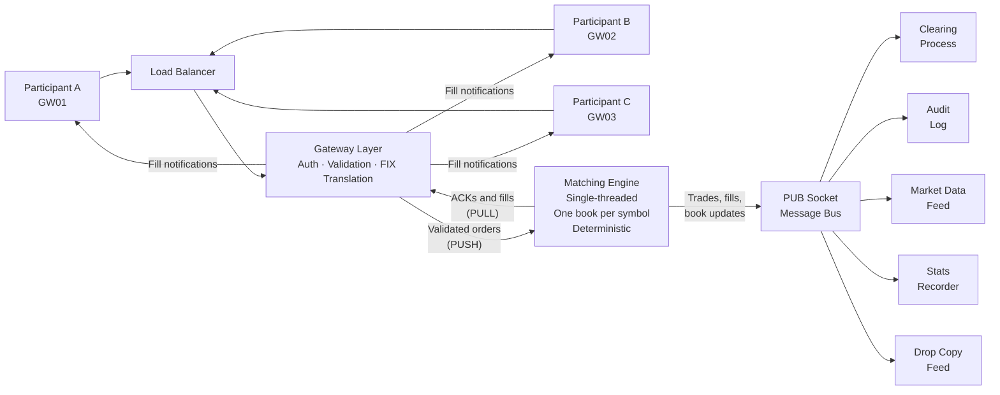
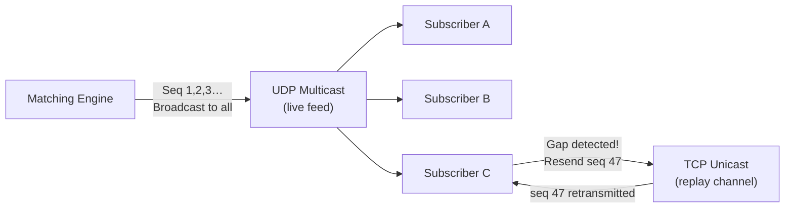

# The Technology Architecture


Now let us look at how all these concepts are realised in a production technology stack.



## The Gateway

The **gateway** is the participant-facing interface, the "door" through which participants connect to the exchange. Each participant connects through their assigned gateway. The gateway's responsibilities:

- **Authentication:** Verifying the participant's identity and credentials.
- **Session management:** Tracking active connections, handling reconnections.
- **Message translation:** Converting the participant's orders from their format (FIX protocol, binary, or text commands) into the exchange's internal format.
- **Basic validation:** Checking that mandatory fields are present, that the symbol is valid, that quantities are positive.

In many architectures, the gateway performs only structural and session checks, while instrument-specific validation (tick alignment, price collars, and auction/session constraints) is enforced in the matching engine or in a dedicated risk layer fed by reference data. Some venues do cache reference data in gateways and validate there too; the key requirement is consistent enforcement in exactly one authoritative path.

**FIX Protocol:** The industry-standard format for order submission is FIX (Financial Information eXchange), a text-based protocol developed in the early 1990s. A FIX order message looks something like:
```
8=FIX.4.2|35=D|49=CLIENT1|56=EXCHANGE|11=ORDER001|55=AAPL|54=1|38=100|44=150.30|40=2|59=0
```
(Note: the `|` separator here is a display convention. On the wire, FIX uses the SOH character, ASCII value 1, a non-printable control character, as the field delimiter. Tools and documentation almost always substitute `|` or `^A` for readability.)

All eleven fields in this message have meaning:

| Tag | Name | Value | Meaning |
|---|---|---|---|
| 8 | BeginString | FIX.4.2 | Protocol version |
| 35 | MsgType | D | New order (single-sided) |
| 49 | SenderCompID | CLIENT1 | Who is sending this message |
| 56 | TargetCompID | EXCHANGE | Who should receive it |
| 11 | ClOrdID | ORDER001 | Client's own order identifier (used to track and cancel) |
| 55 | Symbol | AAPL | Instrument to trade |
| 54 | Side | 1 | 1=Buy, 2=Sell |
| 38 | OrderQty | 100 | Quantity in shares |
| 44 | Price | 150.30 | Limit price |
| 40 | OrdType | 2 | 1=Market, 2=Limit, 3=Stop |
| 59 | TimeInForce | 0 | 0=DAY, 1=GTC, 3=IOC, 4=FOK, 7=ATC |

Most exchanges accept FIX (or a compressed binary variant called FAST or ITCH for market data). A simplified FIX-inspired text format for internal gateway commands might look like: `NEW|SYM=AAPL|SIDE=BUY|TYPE=LIMIT|QTY=100|PRICE=150.30`.

## Binary Protocols: ITCH and OUCH

FIX is human-readable and widely compatible but inefficient for high-throughput, low-latency environments. Every order message is a text string that must be scanned for field separators and parsed into numeric types. At a million messages per second, this overhead matters.

Production exchanges use **binary protocols** for the critical paths. The most widely deployed are those developed by NASDAQ and adopted or adapted by many exchanges globally:

**NASDAQ ITCH (market data)** is a binary UDP-based protocol for publishing the full order book feed. Instead of text like `35=D|44=150.30`, an ITCH message is a fixed-width binary structure — a 44-byte trade execution message, for example, contains the timestamp (8 bytes), order reference number (8 bytes), side (1 byte), shares (4 bytes), stock symbol (8 bytes padded), and price (4 bytes). An ITCH message is 2–5× smaller than its FIX equivalent and requires no text parsing; the fields are at fixed offsets and read directly as integers. ITCH 5.0 is the current version and is publicly documented by NASDAQ. Many other exchanges (Euronext, LSE, SIX, and others) publish protocols that are ITCH-inspired or ITCH-compatible [NASDAQ ITCH 5.0 specification].

**NASDAQ OUCH (order submission)** is the binary counterpart for order entry. Where FIX is session-based and feature-rich, OUCH is minimal: an "Enter Order" message is 40 bytes. OUCH is transmitted over TCP (for reliability) in the same way FIX is, but the compact binary format dramatically reduces serialisation overhead.

**CME MDP3 (Market Data Platform 3)** is CME Group's binary market data protocol, based on the **SBE (Simple Binary Encoding)** standard. SBE is schema-driven: a protocol specification file defines every message type's field layout, and code generators produce optimised parsers for multiple languages. The generated parsers decode directly from the raw buffer with no heap allocation, which is critical for deterministic latency. CME's GLOBEX matching engine publishes all market data in MDP3 format [CME Group MDP3 specification].

For exchange developers, the practical implication is that systems dealing with high-volume data — market data normalisation, risk engines, algo trading systems — will almost always use binary protocols on the critical path, with FIX reserved for session management and less latency-sensitive channels.

## TCP vs UDP: Why Market Data and Order Submission Use Different Transports

Order submission uses **TCP** (Transmission Control Protocol). TCP guarantees reliable, in-order delivery: if a packet is lost, TCP automatically retransmits it. For order management, this is essential — a lost order acknowledgement or fill notification must eventually arrive. TCP also provides backpressure: if the receiver falls behind, the sender slows down automatically.

Market data uses **UDP multicast**. UDP (User Datagram Protocol) has no reliability guarantee — packets can be lost and are not retransmitted automatically. But UDP's advantages are significant:

- **One-to-many delivery:** A single UDP multicast packet can be received by hundreds of subscribers simultaneously. With TCP, the exchange would need to maintain a separate connection and send a separate copy of each message to each subscriber — which does not scale.
- **No connection overhead:** UDP is connectionless; there is no TCP handshake, no per-connection state.
- **Lower latency:** No TCP acknowledgement flow, no retransmission delay.

How does UDP's unreliability get handled? Through **sequence numbers**. Every ITCH/MDP3 message carries a sequence number. If a subscriber receives message 1000 followed by 1002, it knows 1001 was lost. It requests a retransmission via a separate **TCP unicast recovery channel** (specifically for replay requests). This hybrid design — UDP multicast for the live feed, TCP unicast for recovery — is standard across all major exchange market data architectures.



Order submission uses the reverse pattern — TCP from participant to exchange — because every order must be reliably received and acknowledged.

## The Matching Engine

The matching engine is the exchange's core computational component: the software that receives every incoming order, maintains the state of all order books, and executes trades when compatible buy and sell orders can be paired. It sits at the centre of the architecture, receiving from all gateways through a single serialised input queue and publishing results to all subscribers. A single-threaded design, one book per symbol, and deterministic processing are its defining characteristics, each discussed in detail in the *Matching Engine* section above. The gateway is the entry point into this pipeline; the engine is where the actual work happens.

## The Message Bus

The matching engine communicates with all other components through a **message bus**, a pub/sub (publish/subscribe) messaging system. The engine publishes events (trades, order status changes, book snapshots) to topics, and subscribers connect to the topics they care about.

**ZeroMQ (ZMQ)** is a commonly used messaging library for educational and smaller production implementations. The engine can use a PUSH/PULL socket pair with the gateways (for commands flowing in) and a PUB socket (for market data and events flowing out to subscribers). In high-performance production environments, alternatives purpose-built for financial infrastructure include **Aeron** (developed by Real Logic, used by several exchanges and clearing houses for its deterministic low latency), **Chronicle Queue** (a persistent, low-latency IPC mechanism), and custom UDP multicast implementations. The conceptual pub/sub model is the same regardless of the underlying transport.

Topics on the PUB socket might include:
- `trade.executed.AAPL`, a trade happened in AAPL
- `order.fill.GW01`, a fill event for Gateway 01's participant
- `book.snapshot.AAPL`, current state of the AAPL order book
- `session.state`, the trading session changed state

Subscribers filter by topic, receiving only the events relevant to them.

## Subscribers

Any process that connects to the engine's PUB socket and processes events is a **subscriber**. Common subscribers:

- **Clearing process:** Tracks positions and P&L for all participants, generates clearing reports.
- **Stats recorder:** Stores OHLCV (Open, High, Low, Close, Volume) statistics to a database for historical analysis.
- **Viewer/Board:** Display processes that show the current order book, recent trades, and market data on screens.
- **Ticker:** A simplified display of the most recent prices.
- **Audit log:** A complete, immutable record of every event, for regulatory purposes.
- **AI trader / algorithmic participants:** Automated trading strategies that observe market data and submit orders.

The key design principle: subscribers are passive receivers. They observe the market through event streams. They do not write to the order book.

## Book Snapshots

Subscribers that start up mid-session need a way to get caught up on current book state without replaying every event since the start of day. The engine periodically publishes **book snapshots**, a complete current view of all resting orders, aggregated by price level, to the market data feed. A subscriber that misses events can simply wait for the next snapshot, typically published every 500 milliseconds per symbol.

Snapshots include:
- All bid price levels with total resting quantity
- All ask price levels with total resting quantity
- The last trade price and quantity
- Recent trade history (a rolling window of the last N trades)
- The current tick size for the symbol (so subscribers can correctly format prices)

